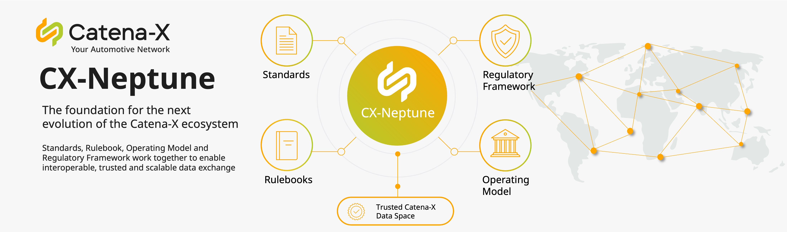

Named after the planet Neptune, CX-Neptune symbolizes depth, stability, and the exploration of new frontiers within the Catena-X data space.
As a major release, CX-Neptune sets the strategic direction and introduces key architectural foundations that shape the further evolution of the ecosystem.

CX-Neptune therefore serves as the central anchor, establishing the core innovations that are gradually refined, stabilized, and extended throughout the cycle.

:::info Built together by the Catena-X community

CX-Neptune is the result of the joint work of many companies across the automotive value chain.  
Every standard, every rulebook chapter and every document in this release was shaped in committees, working groups and expert groups by people who contributed their time, their domain knowledge and their willingness to find common ground instead of company-specific solutions.
A sincere thank you to all member companies and their experts who contributed to CX-Neptune: by drafting and reviewing standards, by challenging concepts, by piloting new use cases, by maintaining the operating model and regulatory framework.

This collaborative effort is what turns individual requirements into interoperable standards and what makes a data space that works for the whole ecosystem, not just for a single participant.

:::

:::tip Want to shape the next release?  
Contributions are open to all members. Join a committee, working group or expert group and help  
define the standards you will work with tomorrow.  
:::  

---

## CX-Neptune at a glance

| Component                                                                     |                  Version                  | What changed                                                                                                                              |
|-------------------------------------------------------------------------------|:-----------------------------------------:|-------------------------------------------------------------------------------------------------------------------------------------------|
| [Operating Model](/docs/next/operating-model/why-introduction) |                   3.1.2                   | Consolidated role prerequisites and clearer OSP role and mandatory nomination for OSP                                                                                     |
| [Regulatory Framework](/docs/next/regulatory-framework/governance-framework)    |                   3.0.4                   | Reworked Contract Modularization guidance, three new countries assessed                                                                   |
| [Standards](/docs/next/standards/overview)                                      | 8 new   18 updated   17deprecated | New Car SBOM extensions, Supply Chain & Quality split into focused standards, network foundation simplified                               |
| [Rulebooks](/docs/next/rulebooks/overview)                                      |                 PCF v4.1                  | Update to PCF Rulebook and Certification Framework                                                                                        |
| [Tractus-X](https://eclipse-tractusx.github.io)                               |               26.06 & 26.09               | Referenz Implementation and KITs can be found in the [Eclipse Tractus-X release notes](https://eclipse-tractusx.github.io/blog-changelog) |

:::tip Release highlights

- **One protocol version only** – DSP 0.8 and DCP 0.8 are dropped, cutting implementation effort for connector and wallet providers
- **Car SBOM family** gains a shared foundation plus two new extensions for US connected-vehicle regulation and open-source licence compliance  
- **Traceability is retired** and replaced by focused standards for blocking notifications, special characteristics, zero-km failures and certificates of analysis
- **Contracting made approachable** – Quick Start Guide, Clause Library and FAQ lower the entry barrier for contract modularization

:::

---

## Catena-X Operating Model

With the release of version 3.1.2 of the Operating Model, the Who and How chapters have been updated. The release introduces consolidated guidance on role prerequisites and aligns the onboarding process description with the binding standard CX-0006.

### Chapter: Who – Roles in the Catena-X Ecosystem

- New summary table outlining the prerequisites for obtaining roles in the Catena-X dataspace, providing a single consolidated reference for all role types.
- Updated the description of the Onboarding Service Provider (OSP) role for greater clarity
- Becoming an Onboarding Service Provider now requires a nomination by the Catena-X Board in addition to certification.

### Chapter: How – Data Space Operations

- Streamlined the onboarding process section: the detailed process description has been consolidated in standard [CX-0006](/docs/next/standards/CX-0006-RegistrationAndInitialOnboarding), which is now the single binding source. This removes duplicated content and prevents contradictions between the Operating Model and the standard.  

### Impact for ecosystem participants

| Audience                                 | Impact                                                                                                   |  
|------------------------------------------|----------------------------------------------------------------------------------------------------------|  
| All role holders and applicants          | Prerequisites for every ecosystem role are now available in one consolidated table                       |  
| Onboarding Service Provider (OSP)        | Certification alone is no longer sufficient, a nomination by the Catena-X Board is now required          |  

### Further Information

- Details can be found in the [changelog](/docs/next/operating-model/changelog)
- To view the CX-Neptune version of the Operating Model, please refer to the [Operating Model documentation](/docs/next/operating-model/why-introduction) and select CX-Neptune.

---

## Regulatory Framework

With the release of version 3.0.4 of the Regulatory Framework, the Contracting chapter and the Country Clearance List have been updated. The release introduces expanded guidance on contract modularization, including a quick start guide, contract options, precedence rules, a clause library and an FAQ, and adds three newly assessed countries to the Country Clearance List.  

### Contracting: Easier access to Contract Modularization

Setting up contracts in Catena-X should not require a legal deep dive. The guidance on Contract Modularization has therefore been reworked to answer the questions users actually have:

- **"Where do I start?"** – A new Quick Start Guide walks first-time users through the essentials, key concepts and a suggested reading path.  
- **"Which contract option fits my case?"** – Illustrated overviews explain the contractual scenarios and the mandatory and optional steps of contract modularization.
- **"What happens if clauses contradict each other?"** – The contract precedence rules are now visualized and explained. A new section covers both how conflicts between an RC agreement and a referenced external contract are resolved, and how the CX-0152 JSON schema prevents mutually exclusive clauses in the first place.  
- **"Do I have to write clauses from scratch?"** – The new Clause Library lists all permissions, prohibitions and obligations with their legal texts.  
- **"What does this term mean?"** – A new Glossary defines all terms used.  
- **"Someone must have asked this before."** – A new FAQ collects the most common questions from practice.

:::info

The entire guidance was rewritten in simpler, consistent language.

:::

### Country Clearance List: Three new countries assessed

Three additional countries have been evaluated and can now be considered in your data exchange planning:

- **Morocco** and **Paraguay** – added to the *Allow List*  
- **Republic of Moldova** – added to the *Conditional List*

### Impact for ecosystem participants

- Contracting: No changes to binding contractual content – all additions are explanatory and support the practical application of contract modularization.
- Country Clearance List: Data exchange with partners in Morocco and Paraguay is possible without additional conditions. For the Republic of Moldova, the requirements of the Conditional List apply – please verify before exchanging data.

### Further Information

- Details can be found in the [changelog](/docs/next/regulatory-framework/changelog)
- To view the CX-Neptune version of the Regulatory Framework, please refer to the [Regulatory Framework documentation](/docs/next/regulatory-framework/governance-framework) and select CX-Neptune.

---

## Catena-X Standards

With the CX-Neptune release, several Catena-X standards have been updated, and new standards have been introduced across multiple domains. These updates refine existing standards, address evolving requirements, and extend the Catena-X ecosystem with new use cases and capabilities.

:::info

To make it easier to understand how the updated and newly introduced standards relate to each other, you can explore their dependencies in the [Dependency Graph](https://catenax-ev.github.io/standards-graph).
The graph provides a visual overview of the relationships between standards and helps you identify which standards depend on or are related to a specific standard.

:::

### Engineering

This release makes engineering data exchange less ambiguous and puts vehicle software transparency on a common footing. Master data and requirements standards now clearly state which type of digital twin to use, and the Car SBOM family gets a shared foundation plus two new extensions for US connected-vehicle regulation and open-source licence compliance.

| Standard                                                                                                                            | Status     | Value                                                                                                                                                                                                                                                                                                                               |                                    Changelog                                    |
|-------------------------------------------------------------------------------------------------------------------------------------|------------|-------------------------------------------------------------------------------------------------------------------------------------------------------------------------------------------------------------------------------------------------------------------------------------------------------------------------------------|:-------------------------------------------------------------------------------:|
| CX-0133 Online Control and Simulation                                                                                               | Deprecated | You should no longer build new solutions around this standard.                                                                                                                                                                                                                                                                      |                                        -                                        |
| [CX-0154 Master Data Management](/docs/next/standards/CX-0154-MasterDataManagement)                 | Updated    | Engineering master data now fits together between carmakers and suppliers. Until now it was unclear which type of digital twin to use, which led to mismatched data and manual rework in CAD/PDM exchange. The update defines "PartRole" and clear criteria for choosing PartType vs. PartRole, aligned with CX-0126 Industry Core. |   [Changelog](/docs/next/standards/CX-0154-MasterDataManagement/Changelog)   |
| [CX-0155 Requirements Engineering](/docs/next/standards/CX-0155-RequirementsEngineering)                                           | Updated    | Makes the exchange of engineering requirements consistently usable in practice. An introduction, a defined area of application and the PartRole definition were added; open review findings that were blocking certification are resolved.                                                                                          | [Changelog](/docs/next/standards/CX-0155-RequirementsEngineering/Changelog)  |
| [CX-0158 Car SBOM](/docs/next/standards/CX-0158-CarSBOM)                                                         | Updated    | One consistent way to describe software components for the base standard and both new extensions: the relationship-based approach was replaced by SPDX profiles, all sub-standards must now comply with the base standard, and outdated references were removed. This avoids duplicate certification effort for the extensions.     |         [Changelog](/docs/next/standards/CX-0158-CarSBOM/Changelog)          |
| [CX-0158-1 Car SBOM for ICTS Connected Vehicles](/docs/next/standards/CX-0158-1-CarSBOM-ICTS)                                    | New        | Lets carmakers prove which software is inside a connected vehicle – required by a new US regulation. Built directly on CX-0158 as the base standard (and not allowed to contradict it), so there is one harmonised evidence path instead of bespoke one-to-one agreements with every partner.                                       |      [Changelog](/docs/next/standards/CX-0158-1-CarSBOM-ICTS/Changelog)      |
| [CX-0158-2 Car SBOM for FOSS Compliance](/docs/next/standards/CX-0158-2-CarSBOM-FOSS-Compliance) | New        | Helps carmakers prove they respect open-source licences in vehicle software. Covers licence, copyright and attribution information plus certification criteria for OEMs, Tier-1/Tier-N suppliers and tool providers – today every company and tool handles this differently.                                                        | [Changelog](/docs/next/standards/CX-0158-2-CarSBOM-FOSS-Compliance/Changelog) |

---

### Sustainability

This release focuses on making sustainability data trustworthy, comparable and easier to certify rather than adding new topics. The carbon footprint standard is cleaned up and moved to the current data model so old and new applications keep working together, Digital Product Passport and Battery Passport are corrected and restructured for clearer certification, and safety data sheets move from PDF e-mails to a standardised digital exchange.

| Standard                                                                                                                                                       | Status  | Value                                                                                                                                                                                                                                                                                                             |                                                Changelog                                                 |
|----------------------------------------------------------------------------------------------------------------------------------------------------------------|---------|-------------------------------------------------------------------------------------------------------------------------------------------------------------------------------------------------------------------------------------------------------------------------------------------------------------------|:--------------------------------------------------------------------------------------------------------:|
| [CX-0136 Use Case PCF](/docs/next/standards/CX-0136-UseCasePCF)                                                                                                | Updated | Keeps existing and newly built carbon footprint applications working together and enables automated certification. The data model moves to v10.0.0 (v7.0.0 retired), duplicated content is replaced by references to standalone standards, and the interface can now state which data model version is requested. |                      [Changelog](/docs/next/standards/CX-0136-UseCasePCF/Changelog)                      |
| [CX-0143 Use Case Circular Economy - Digital Product Passport](/docs/next/standards/CX-0143-UseCaseCircularEconomyDigitalProductPassportStandard/introduction) | Updated | Fixes a long-standing search error that prevented finding the correct business partner, removes obsolete backward compatibility and brings the certification criteria into the current format.                                                                                                                    | [Changelog](/docs/next/standards/CX-0143-UseCaseCircularEconomyDigitalProductPassportStandard/Changelog) |
| [CX-0160 Battery Passport](/docs/next/standards/CX-0160-BatteryPassport/CX-0160-BatteryPassport-base)                                                          | Updated | One standard covering three different use cases was hard to certify. It is now being split by use case (with a clearer name), the certification criteria use the new template, and bug fixes become mandatory instead of optional.                                                                                |                   [Changelog](/docs/next/standards/CX-0160-BatteryPassport/Changelog)                    |
| [CX-0162 ESDScom](/docs/next/standards/CX-0162-eSDScom)                                                                                                        | New     | Turns safety data sheets – today PDFs sent by e-mail – into structured, machine-readable data with a standardised model for SDS and extended SDS. Cuts administrative effort and supports REACH and regional legal requirements.                                                                                  |                       [Changelog](/docs/next/standards/CX-0162-eSDScom/Changelog)                        |

---

### Network Service

The network foundation is being simplified and better documented. Business partner data becomes easier to find and covers real company structures, outdated connectivity and wallet protocol versions are dropped so only one version has to be implemented, and a central service that had been running unstandardised since day one is now written down.

| Standard                                                                                                                                                                            | Status     | Value                                                                                                                                                                                                                                                                                                     |                                            Changelog                                            |
|-------------------------------------------------------------------------------------------------------------------------------------------------------------------------------------|------------|-----------------------------------------------------------------------------------------------------------------------------------------------------------------------------------------------------------------------------------------------------------------------------------------------------------|:-----------------------------------------------------------------------------------------------:|
| CX-0001 Participant Agent Registration                                                                                                                                              | Deprecated | You should no longer build new solutions around this standard.                                                                                                                                                                                                                                            |                                                -                                                |
| [CX-0010 Business Partner Number](/docs/next/standards/CX-0010-BusinessPartnerNumber)                                                              | Updated    | Protects the promise that every business partner number is globally unique and stable. Rules and guidance for issuing and using site numbers (BPNS) are sharpened and aligned with CX-0012, CX-0074 and CX-0076, so service providers no longer issue them inconsistently.                                |          [Changelog](/docs/next/standards/CX-0010-BusinessPartnerNumber/Changelog)           |
| [CX-0012 Business Partner Data Pool API](/docs/next/standards/CX-0012-BusinessPartnerDataPoolAPI)                                             | Updated    | Makes business partner data far easier to find and understand: one generic search across legal entities, sites and addresses, plus the ability to represent ownership hierarchies, company succession and headquarter relocations. Less bilateral workaround, lower integration effort.                   |        [Changelog](/docs/next/standards/CX-0012-BusinessPartnerDataPoolAPI/Changelog)        |
| [CX-0018 Dataspace Connectivity](/docs/next/standards/CX-0018-DataspaceConnectivity)                                                               | Updated    | Only one connection protocol version needs to be supported – the old DSP 0.8 is dropped entirely. Simpler and cheaper to implement, plus additional transfer types and the groundwork for future connector features (EDC-V / Virtual Participation). Connector providers must be ready for the phase-out. |          [Changelog](/docs/next/standards/CX-0018-DataspaceConnectivity/Changelog)           |
| CX-0053 Discovery Finder and BPN Discovery Service APIs                                                                                                                             | Deprecated | You should no longer build new solutions around this standard.                                                                                                                                                                                                                                            |                                                -                                                |
| CX-0055 Data Processing Patterns for IT System Integration                                                                                                                          | Deprecated | You should no longer build new solutions around this standard.                                                                                                                                                                                                                                            |                                                -                                                |
| [CX-0074 Business Partner Gate API](/docs/next/standards/CX-0074-BusinessPartnerGateAPI)                                                          | Updated    | Keeps the upload side in sync with the search side by adding the new relation types, relation qualifiers and golden record relations. Otherwise the new information simply could not be uploaded.                                                                                                         |          [Changelog](/docs/next/standards/CX-0074-BusinessPartnerGateAPI/Changelog)          |
| [CX-0076 Golden Record End to End Requirements Standard](/docs/next/standards/CX-0076-GoldenRecordEndtoEndRequirementsStandard) | Updated    | Ensures the written standard matches what the live system already does: one address can now be assigned to several sites within one legal entity. This keeps business partner data quality comparable across providers.                                                                                   | [Changelog](/docs/next/standards/CX-0076-GoldenRecordEndtoEndRequirementsStandard/Changelog) |
| CX-0077 Data Quality Dashboard                                                                                                                                                      | Deprecated | You should no longer build new solutions around this standard.                                                                                                                                                                                                                                            |                                                -                                                |
| CX-0078 Bank Data Verification Dashboard                                                                                                                                            | Deprecated | You should no longer build new solutions around this standard.                                                                                                                                                                                                                                            |                                                -                                                |
| CX-0079 Natural Person Screening Dashboard                                                                                                                                          | Deprecated | You should no longer build new solutions around this standard.                                                                                                                                                                                                                                            |                                                -                                                |
| CX-0080 BPDM Fraud Prevention Service                                                                                                                                               | Deprecated | You should no longer build new solutions around this standard.                                                                                                                                                                                                                                            |                                                -                                                |
| CX-0116 Sanction Party Watchlist Dashboard                                                                                                                                          | Deprecated | You should no longer build new solutions around this standard.                                                                                                                                                                                                                                            |                                                -                                                |
| [CX-0149 Wallet Requirements](/docs/next/standards/CX-0149-WalletRequirements)                                                                        | Updated    | Same simplification for digital identity wallets: the old DCP v0.8 is dropped, only v1.0 remains, and legacy requirements are cleaned up. Less baggage and easier future implementations.                                                                                                                 |            [Changelog](/docs/next/standards/CX-0149-WalletRequirements/Changelog)            |
| [CX-0152 Policy Constrains for Data Exchange](/docs/next/standards/CX-0152-PolicyConstrainsForDataExchange)                              | Updated    | Supports new business cases (Electronic Control Unit data exchange) and introduces schema-based checking, so rule validation can be adapted instead of rebuilt. Remains the single source of truth for data usage rules.                                                                                  |     [Changelog](/docs/next/standards/CX-0152-PolicyConstrainsForDataExchange/Changelog)      |
| [CX-0167 Bpn Did Resolution](/docs/next/standards/CX-0167-BpnDidResolution)                                                                             | New        | Documents a central service that has been running since day one but was never standardised – the link between business partner numbers and dataspace identities. Removes a hidden dependency, makes audits possible and allows alternative providers.                                                     |             [Changelog](/docs/next/standards/CX-0167-BpnDidResolution/Changelog)             |

---

### Supply Chain & Quality

The broad Traceability standard is replaced by focused, standalone standards for individual business needs – blocking information, special characteristics, zero-km failures and certificates of analysis. Together they replace processes that are still largely handled by e-mail and PDF today, and the remaining quality and disruption standards are sharpened and corrected.

| Standard                                                                                                                                                       | Status     | Value                                                                                                                                                                                                                                                                                                      |                                         Changelog                                         |
|----------------------------------------------------------------------------------------------------------------------------------------------------------------|------------|------------------------------------------------------------------------------------------------------------------------------------------------------------------------------------------------------------------------------------------------------------------------------------------------------------|:-----------------------------------------------------------------------------------------:|
| CX-0059 Use Case Behaviour Twin Endurance Predictor                                                                                                            | Deprecated | You should no longer build new solutions around this standard.                                                                                                                                                                                                                                             |                                             -                                             |
| CX-0105 Asset Tracking Use Case                                                                                                                                | Deprecated | You should no longer build new solutions around this standard.                                                                                                                                                                                                                                             |                                             -                                             |
| CX-0115 Manufacturing Capability Exchange                                                                                                                      | Deprecated | You should no longer build new solutions around this standard.                                                                                                                                                                                                                                             |                                             -                                             |
| [CX-0123 Quality Use Case Standard](/docs/next/standards/CX-0123-QualityUseCaseStandard)                                     | Updated    | Makes clear what quality solutions are actually certified for after the old Traceability standard was split up. Renamed to "Field Quality", the scope is narrowed, required data models are sharpened, the 8D model and dependencies on retired standards are removed, and warranty test data is provided. |       [Changelog](/docs/next/standards/CX-0123-QualityUseCaseStandard/Changelog)       |
| CX-0125 Traceability Use Case                                                                                                                                  | Deprecated | Split into standalone standards (Field Quality, Blocking Notifications, Special Characteristics, …) so companies only implement and certify what they actually need.                                                                                                                                       |                                             -                                             |
| CX-0129 Request for Quotation Exchange                                                                                                                         | Deprecated | You should no longer build new solutions around this standard.                                                                                                                                                                                                                                             |                                             -                                             |
| CX-0138 Use Case Behaviour Twin Endurance Estimator                                                                                                            | Deprecated | You should no longer build new solutions around this standard.                                                                                                                                                                                                                                             |                                             -                                             |
| CX-0141 Use Case Behaviour Twin Health Indicator                                                                                                               | Deprecated | You should no longer build new solutions around this standard.                                                                                                                                                                                                                                             |                                             -                                             |
| CX-0142 Shop Floor Information Service                                                                                                                         | Deprecated | You should no longer build new solutions around this standard.                                                                                                                                                                                                                                             |                                             -                                             |
| [CX-0146 Supply Chain Disruption Notifications](/docs/next/standards/CX-0146-SupplyChainDisruptionNotifications) | Updated    | Fixes an error from the previous release where the technical specification contradicted its own examples, so implementers could not tell which one was correct. Specification and examples are now aligned – without the fix, disruption messages fail between partners.                                   | [Changelog](/docs/next/standards/CX-0146-SupplyChainDisruptionNotifications/Changelog) |
| CX-0150 Logistics Use Case                                                                                                                                     | Deprecated | You should no longer build new solutions around this standard.                                                                                                                                                                                                                                             |                                             -                                             |
| [CX-0163 Special Characteristics](/docs/next/standards/CX-0163-SpecialCharacteristics)                                       | New        | Enables automated exchange of measurement values that are relevant for vehicle type approval – today still sent manually by e-mail. Provided via digital twins based on the Industry Core, with the required usage policies defined.                                                                       |       [Changelog](/docs/next/standards/CX-0163-SpecialCharacteristics/Changelog)       |
| [CX-0164 Blocking Notifications](/docs/next/standards/CX-0164-BlockingNotifications)                                          | New        | One common, automated way to tell partners that certain parts must not be used – today largely done by hand. Blocks can be created, updated and reversed (status "CANCELED"), with automatic feedback from the partner. Reusable across use cases and with lower integration effort.                       |       [Changelog](/docs/next/standards/CX-0164-BlockingNotifications/Changelog)        |
| [CX-0165 Certificate of Analysis](/docs/next/standards/CX-0165-CertificateOfAnalysis)                                         | New        | Replaces millions of PDF certificates sent yearly by e-mail or EDI with machine-readable data. Saves manual typing and avoids errors; already proven in a pilot between three companies.                                                                                                                   |       [Changelog](/docs/next/standards/CX-0165-CertificateOfAnalysis/Changelog)        |
| [CX-0166 ZeroKM Failure](/docs/next/standards/CX-0166-ZeroKmFailure)                                                                  | New        | Lets carmakers and suppliers detect quality deviations before a car reaches the customer, through standardised failure reporting from OEM to supplier. Faster root-cause analysis, lower failure cost, shorter response times and a more resilient supply chain.                                           |           [Changelog](/docs/next/standards/CX-0166-ZeroKmFailure/Changelog)            |

---

### Industry Core

The shared basis for part data is brought up to the current data models. Providers must now offer major versions in parallel, which starts proper life-cycle management in live operations so upgrades no longer break existing data connections.  

| Standard                                                                                                                          | Status  | Value                                                                                                                                                                                                                                                                                                                 | Changelog                                                                                              |
|-----------------------------------------------------------------------------------------------------------------------------------|---------|-----------------------------------------------------------------------------------------------------------------------------------------------------------------------------------------------------------------------------------------------------------------------------------------------------------------------|--------------------------------------------------------------------------------------------------------|
| [CX-0126 Industry Core: Part Type](/docs/next/standards/CX-0126-IndustryCorePartType)             | Updated | Keeps data providers and data users compatible: references now point to the current data model versions (v3.0.0), and data that differs only in major version must be offered in parallel. This marks the start of proper life-cycle management in live operations, so upgrades no longer break existing connections. | [Changelog](/docs/next/standards/CX-0126-IndustryCorePartType/Changelog)         |
| [CX-0127 Industry Core: Part Instance](/docs/next/standards/CX-0127-IndustryCorePartInstance) | Updated | Same benefit as CX-0126, applied to individual parts: without the update to the current data model versions (v3.0.0) and the parallel provisioning rule, part-level data would not be consumable by CX-Neptune solutions. Note: the related certification patch is postponed.                                         | [Changelog](/docs/next/standards/CX-0127-IndustryCorePartInstance/Changelog) |

### Further Information

- Details about all Standards can be found in the [changelog](/docs/next/standards/changelog).
- To view the CX-Neptune version of the Standards, please refer to the [Overview Page of the standards](/docs/next/standards/overview) and select CX-Neptune.

---

## Rulebooks

### Sustainability

The PCF Rulebook is not a standard but the methodology behind the numbers: it defines how a product carbon footprint has to be calculated. Version 4.1 improves methodological clarity and consistency and brings the rules closer to established industry and sector-specific methodologies, the precondition for carbon figures from different companies actually being comparable.

| Rulebook                                                            | Status  | Value                                                                                                                                                                                                                                                                                               |
|---------------------------------------------------------------------|---------|-----------------------------------------------------------------------------------------------------------------------------------------------------------------------------------------------------------------------------------------------------------------------------------------------------|
| [CX-NFR-PCF-Rulebook](/docs/next/rulebooks/CX-NFR-PCF/pcf-rulebook) | Updated | The PCF Rulebook v4.1 clarifies definitions and methodology, improves the handling of forward-looking PCFs and biogenic carbon, refines system boundary and electricity rules and adds sector-specific requirements – so carbon figures from different companies become comparable and trustworthy. |

### Certification

The Conformity Assessment Framework is now maintained and published as Markdown in the same documentation library as the Catena-X Standards.
The reason for the transition is consistency: the Conformity Assessment Framework is released together with the standards, so framework and standards are always aligned.
In addition, the framework is easier to access and to read than the previous PDF.

:::info Highlights

- Modular system made normative, incl. role and use case lists for all six certifiable roles and the ESP function-to-standard table.
- New Provider Base rules: TISAX Level 2 mandatory, defined alternative certifications (four categories) and a three-month compliance period.
- Release support & certificate validity clarified: certification against the "Current" and "Maintained" release, validity for release N and N+1.
- Extension of certificates for unchanged standards: where a standard has not changed or has only received patch changes, its validity can be extended to the following major release upon request to the association (currently nominated: CX-0128) — all other standards of the product remain subject to regular recertification.

:::

| Rulebook                                                                 | Status  | Value                                                                                                                                                                                                                                                                                                                                                                                                                                                                                                                                                                                  |
|--------------------------------------------------------------------------|---------|----------------------------------------------------------------------------------------------------------------------------------------------------------------------------------------------------------------------------------------------------------------------------------------------------------------------------------------------------------------------------------------------------------------------------------------------------------------------------------------------------------------------------------------------------------------------------------------|
| [CX-NFR-CAF](/docs/next/rulebooks/CX-NFR-CAF/introduction-and-framework) | Updated | Released with the standards:    - CABs have always received the updated certification catalog and modular system — the difference is that the CAF is now published via the documentation library and updated at the same time as the standards.     - Better readability and access: deep-linkable chapters, searchable content and structured tables instead of a slide-based PDF.     - Clear normative status: the modular system chapter is explicitly binding — the certification scope is derived from role + use case, without room for interpretation. |

---

## Tractus-X reference implementations

The open-source reference implementations for CX-Neptune are provided by the [Eclipse Tractus-X project](https://eclipse-tractusx.github.io). They follow their own release cadence and are documented independently of this release note.

:::info

Catena-X does not maintain a separate changelog for the reference implementations.
For component versions, upgrade notes and breaking changes, please refer to the Tractus-X release documentation directly.

:::

### Further Information

- [Tractus-X release notes](https://eclipse-tractusx.github.io/blog-changelog) – overview of the current release and the included component versions  
- [Tractus-X repositories on GitHub](https://github.com/eclipse-tractusx) – overview of all repositories of Eclipse Tractus-X

:::caution

Please note that a Tractus-X release contains several Referenz Implementations and KITs. Certification is always granted against the Catena-X standards, not against a specific Tractus-X version.  

:::
---
