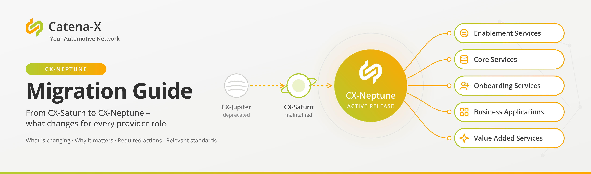
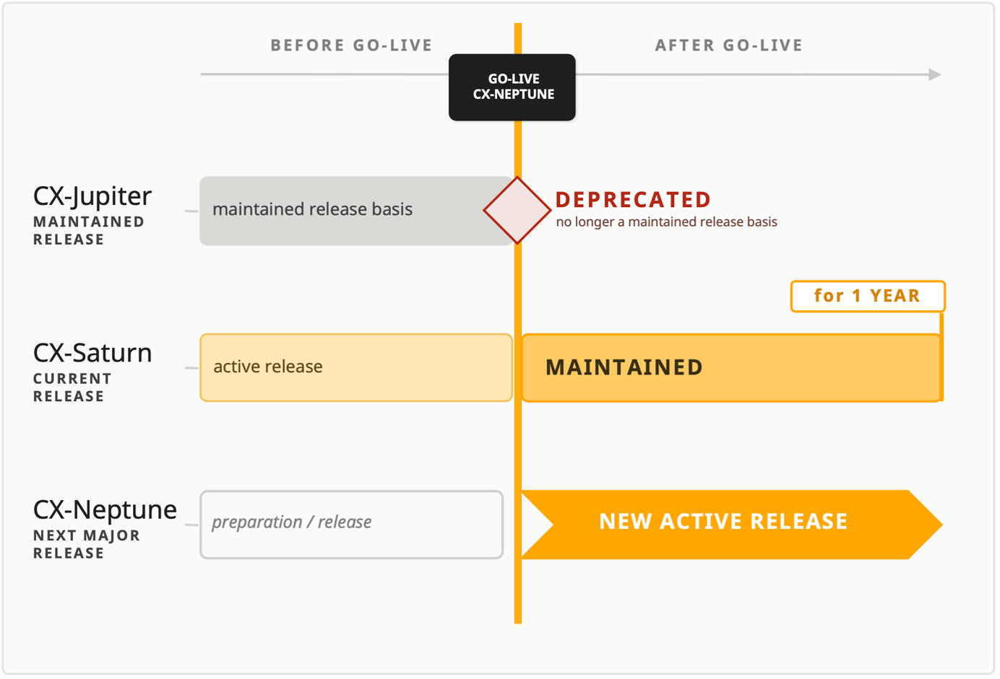

## From CX-Jupiter to CX-Saturn and CX-Neptune

**Version:** October 8th, 2026 – English Version 1.0.0 (First Release)

## Acknowledgement

This Migration Guide was created within the Catena-X Automotive Network e.V. through the collaborative work of its Expert Groups, Committees, and Working Groups.

The Catena-X Automotive Network e.V. would like to thank all contributing member companies and the experts who dedicated their time, domain knowledge, and practical implementation experience to this document,  in particular the experts from the Expert Groups responsible for the Enablement Services, Core Services, Onboarding, Business Applications, and Value Added Services, as well as the contributors from the Eclipse Tractus-X community.
This Guide is the result of a joint, cross-company effort. It demonstrates the collaborative spirit that enables Catena-X to evolve its standards while maintaining interoperability, trust, and openness across the ecosystem.

**Our sincere thanks go to every person and organisations who contributed**

---

## Disclaimer & Change Notice

This Migration Guide has been prepared within the Catena-X Automotive Network e.V. by the responsible Expert Groups and Committees, in collaboration with Catena-X Release Management.

The document reflects the state of knowledge at the time of publication. Standards, reference implementations, and release timelines within the Catena-X ecosystem are subject to continuous development. New findings from standardisation work, certification practice, ecosystem feedback, or the industrialisation phase of CX-Neptune may therefore lead to future adjustments of this Guide.

This Guide is consequently maintained as a living document. Content may be corrected, extended, or updated at any time. Any substantive change will be communicated through the official Catena-X Release Management channels, and the updated version will be published together with an updated version number and change history ([see Imprint](https://catena-x.net/imprint/)).

In the event of any discrepancy between this Guide and the official Catena-X Standards, Conformity Assessment Criteria, or the applicable Operating Model, the normative documents prevail. This Guide provides guidance and does not replace the binding standard documents.

Service Providers are encouraged to verify that they are working with the latest published version of this Guide before initiating migration or certification activities.

---

## 1. Introduction

This Migration Guide is intended to support Catena-X Service Providers and Business Application Providers in migrating from the soon-to-be deprecated CX-Jupiter release to a supported major release – either CX-Saturn or CX-Neptune.

The Guide is a practical support document and does not constitute a normative one. Its purpose is to consolidate the changes introduced across Catena-X standards, reference implementations, and release communications into a single, role-based overview. This enables providers to identify the changes relevant to their specific role and to use the Guide as a practical basis for planning and executing their migration.

In doing so, the Guide addresses four questions per provider role:

1. Which migration path should I choose – CX-Saturn or CX-Neptune? ([Chapter 2](#2-migration-paths-overview))
2. What happens if I stay on CX-Jupiter? ([Chapter 3](#3-cx-jupiter-deprecation-impact))
3. What exactly is changing for my role and my use case? ([Chapters 5](#5-migration-guide--cx-jupiter-to-cx-saturn) and [Chapter 6](#6-migration-guide--cx-saturn-to-cx-neptune))
4. Which concrete actions do I have to take, and against which standards and versions do I certify? ([Chapter 3](#3-cx-jupiter-deprecation-impact) and  [Chapter 4](#4-certification-and-certificate-validity))

:::warning[Note]

With the Go-Live of CX-Neptune, CX-Jupiter will be deprecated.
CX-Jupiter-based certifications become invalid, affected solutions are delisted from the Catena-X Marketplace, and their operation within the Catena-X data space is no longer permitted.

This Guide is therefore designed to make the required transition as predictable and low-risk as possible – by showing which changes are breaking, which are backwards compatible, where co-existence of two versions is required, and which support mechanisms reduce the implementation effort.

:::

### 1.1 Scope and target audience

This Guide is addressed to all Catena-X Service Providers, including:

- Business Application Providers  
- Enablement Service Providers  
- Onboarding Service Providers  
- Core Service Providers  
- Value Added Service Providers

It covers the changes introduced with CX-Saturn and CX-Neptune, their implications for compatibility and interoperability, the impacted roles, and the recommended migration and mitigation actions per standard.

### 1.2 How to use this Guide

| Chapter | Content                                        | Relevant for                      |
|---------|------------------------------------------------|-----------------------------------|
| 2       | Migration paths overview and decision guidance | All providers – start here        |
| 3       | CX-Jupiter deprecation impact and risks        | All providers still on CX-Jupiter |
| 4       | Certification and certificate validity         | All providers                     |
| 5       | Migration support CX-Jupiter → CX-Saturn       | Providers migrating to CX-Saturn  |
| 6       | Migration support CX-Saturn → CX-Neptune       | Providers migrating to CX-Neptune |

[Chapters 5](#5-migration-guide--cx-jupiter-to-cx-saturn) and [Chapter 6](#6-migration-guide--cx-saturn-to-cx-neptune) are structured along the Catena-X Service Provider roles – Enablement Services, Core Services, Onboarding Service, Business Applications, and Value-Added Services.
Each component and use case follows the same pattern: a short summary, what is changing, why it matters, required actions, and the relevant standards including their applicable versions. Providers can therefore go directly to the sections relevant to their solution portfolio.

Providers migrating directly from CX-Jupiter to CX-Neptune should combine [Chapters 5](#5-migration-guide--cx-jupiter-to-cx-saturn) and [Chapter 6](#6-migration-guide--cx-saturn-to-cx-neptune), a separate CX-Jupiter-to-CX-Neptune guide is not published.

### 1.3 Relationship to normative documents

This Guide complements the official Catena-X Release Management communication by consolidating the most relevant migration-related information in one reference document. It provides guidance and does not replace the Catena-X Standards, the Conformity Assessment Criteria, or the applicable Operating Model. In the event of any discrepancy, the normative documents prevail.

As standards, reference implementations, and release timelines continue to evolve, this Guide is maintained as a living document (see Disclaimer & Change Notice). Providers should ensure they are working with the latest published version before starting migration or certification activities.

For further information on the Catena-X Release Management approach and lifecycle policies, please refer to:

- https://catenax-ev.github.io/release-management  
- https://catenax-ev.github.io/docs/next/operating-model/how-life-cycle-management

---

## 2. Migration paths overview

With the upcoming publication of CX-Neptune, Service Providers currently operating on CX-Jupiter have two valid migration options available: CX-Saturn or CX-Neptune. Both paths ensure continued participation in the Catena-X ecosystem, but differ in availability, certification timeframe, lifecycle validity, and access to new capabilities.

This chapter supports providers in selecting the path that best fits their roadmap and capacity. The role-specific changes resulting from the selected path are described in [Chapter 5](#5-migration-guide--cx-jupiter-to-cx-saturn) (CX-Jupiter → CX-Saturn) and [Chapter 6](#6-migration-guide--cx-saturn-to-cx-neptune) (CX-Saturn → CX-Neptune).

### 2.1 Release timeline at a glance

Catena-X major releases follow a defined lifecycle. At any point in time, one release is the active release, the preceding release remains maintained for a limited period, and the release before that becomes deprecated. The Go-Live of CX-Neptune therefore shifts the status of all three releases simultaneously:

#### Figure 1: Release lifecycle at the Go-Live of CX-Neptune

| Release    | Status before CX-Neptune Go-Live                | Status after CX-Neptune Go-Live                     |
|------------|-------------------------------------------------|-----------------------------------------------------|
| CX-Jupiter | Maintained                                      | **Deprecated** – no longer a valid release basis    |
| CX-Saturn  | Active release                                  | **Maintained** – valid for approx. one further year |
| CX-Neptune | Preparation / publication and industrialization | **New active release**                              |

The key implication for Service Providers: **the Go-Live of CX-Neptune is the point at which CX-Jupiter ceases to be a valid basis for certification and operation**. CX-Saturn remains valid beyond this date, but only for a limited overlap period – it is a transitional target, not a long-term one.

| Milestone                                            | Timing                                                       |
|------------------------------------------------------|--------------------------------------------------------------|
| CX-Saturn published and productive (active release)  | Available today                                              |
| CX-Neptune publication 1                             | 18th of September                                            |
| CX-Neptune industrialization phase 2                 | approx. 3 months following publication                       |
| CX-Neptune Go-Live 3                                 | **24th of November – CX-Jupiter deprecated as of this date** |
| End of CX-Saturn validity (end of maintained status) | approx. 1 year after CX-Neptune Go-Live                      |

1 With Publication, the standards of a release are final and certifiable; the release is not yet the active release.

2 The industrialization phase is the window between Publication and Go-Live. Its purpose is to prepare the ecosystem operationally for the new release.

3 With Go-Live the release is switched live: it becomes the new active release, and its standards are binding for operation within the Catena-X data space from that point onwards.

### 2.2 CX-Saturn

CX-Saturn has been published and is already fully available within the Catena-X ecosystem. Until the CX-Neptune Go-Live it is the current active release and provides a stable, production-ready baseline for all Service Providers seeking to migrate away from CX-Jupiter without immediately adopting the newest release.

#### Validity

With the Go-Live of CX-Neptune, CX-Saturn moves to maintained release status and remains a valid release basis for approximately one additional year. During this period, solutions certified against CX-Saturn continue to be eligible for Marketplace listing and operation within the Catena-X data space. This overlap phase is intentionally designed to give Service Providers sufficient time to plan, implement, and certify their migration in a controlled and low-risk manner.

#### Recommended for

CX-Saturn is the recommended migration path for Service Providers who:

- Need to reduce the scope of a single migration step, as the delta from CX-Jupiter to CX-Saturn is significantly smaller than a direct transition to CX-Neptune
- Operate complex solution landscapes with multiple dependencies that cannot be adapted in one step
- Prioritise a proven, productively used baseline over immediate access to the latest capabilities
- Prefer to migrate in two controlled steps (CX-Jupiter → CX-Saturn → CX-Neptune) rather than performing a direct jump to the newest release

:::warning[Note]

Since CX-Saturn and CX-Neptune are both available, the certification deadline is identical for both paths – every CX-Jupiter-based solution must be migrated and certified by the CX-Neptune Go-Live. The advantage of CX-Saturn lies in the reduced scope and risk of the individual migration step, not in a longer timeframe.

:::

#### Benefits

- **Smaller migration delta**: only the changes described in [Chapter 5](#5-migration-guide--cx-jupiter-to-cx-saturn) apply; a direct migration from CX-Jupiter to CX-Neptune requires the combined scope of [Chapters 5](#5-migration-guide--cx-jupiter-to-cx-saturn) and [Chapter 6](#6-migration-guide--cx-saturn-to-cx-neptune)
- **Proven and stable baseline**: CX-Saturn is already in productive use across the ecosystem, with established tooling, documentation, and reference implementations available in Eclipse Tractus-X
- **Lower implementation risk**: as CX-Saturn is mature, most implementation questions have been resolved, and community knowledge is broadly available

#### Considerations**

CX-Saturn will be deprecated in a year. Once CX-Saturn reaches the end of its maintained period – approximately one year after the CX-Neptune Go-Live – a second migration to CX-Neptune or higher must be completed and certified. This path therefore requires two certification cycles instead of one. Providers should verify that the smaller scope of each individual step justifies the additional certification cycle.

### 2.3 CX-Neptune

CX-Neptune is planned for publication on the **18th of September 2026**, followed by an industrialization phase of approximately three months. After successful completion of the industrialization phase, CX-Neptune will Go-Live as the new active release within the Catena-X ecosystem and become the strategic reference baseline going forward.

#### Recommended for

CX-Neptune is the recommended migration path for Service Providers who:

- Aim to leverage the latest capabilities, standards, and use case features from day one.
- Wish to avoid performing two migration steps (CX-Jupiter → CX-Saturn → CX-Neptune) and prefer a single, forward-looking transition.
- Operate in innovation-driven use cases such as Digital Product Passport, PCF, Circular Economy, or Battery Passport, where new standards introduced with CX-Neptune are of strategic relevance.
- Have the internal engineering capacity and organizational readiness to align with a compressed certification timeline.

#### Benefits

- **Immediate access to the latest capabilities**: CX-Neptune introduces new and updated standards (e.g. [CX-0152 Policy Constraints](../../docs/standards/CX-0152-PolicyConstrainsForDataExchange/CX-0152-PolicyConstrainsForDataExchange.md), [CX-0158 Car SBOM](../../docs/standards/CX-0158-CarSBOM/CX-0158-CarSBOM.md), [CX-0160 Battery Passport](../../docs/standards/CX-0160-BatteryPassport/CX-0160-BatteryPassport-base.md), [CX-0161 ECU Crypto Material](../../docs/standards/CX-0161-ECUCryptoMaterial/CX-0161-ECUCryptoMaterial.md)) that enable new business models and enhanced use case support.
- **Longest lifecycle validity**: As the newest active major release, CX-Neptune provides the longest supported lifecycle, maximizing the return on migration and certification investments.
- **Strategic alignment**: Migrating directly to CX-Neptune ensures alignment with the future direction of the Catena-X ecosystem and the evolving requirements of OEMs, suppliers, and regulators.
- **Single migration effort**: Providers avoid performing two consecutive migrations and recertifications, reducing overall effort, cost, and organizational disruption.
- **Competitive positioning**: Early adopters of CX-Neptune signal innovation leadership and readiness to support the latest customer requirements within the ecosystem.

#### Considerations

- **Compressed certification timeline**: certification should be initiated shortly after publication of the CX-Neptune standards in order to be ready for Go-Live. This requires engineering and certification capacity to be reserved in advance.
- **Removal of legacy mechanisms requires action**: the full deprecation of CX-0001 (Participant Agent Registration) and CX-0053 (Discovery Finder and BPN Discovery Service APIs), together with the removal of DSP v0.8, makes the migration to DID-based decentral discovery mandatory for all providers.
- **Structural changes in the standards landscap**e: several capabilities are extracted into standalone standards (e.g. Battery Passport into CX-0160 and Blocking Notification out of CX-0125). Providers must update normative references, semantic IDs, and Digital Twin registrations accordingly.
- **Strategic decision on the Connector reference implementation**: with EDC-V an alternative implementation becomes available, which is not a drop-in replacement (new Management API version, reworked data plane concept). A transition strategy has to be defined and coordinated with customers.

[Chapter 6](#6-migration-guide--cx-saturn-to-cx-neptune) provides the detailed overview of all relevant changes and supports providers in translating the new capabilities into a clear implementation plan tailored to their solution portfolio.

### 2.4 Choosing the right path

Both migration paths are fully supported by Catena-X. The selection should be based on a structured assessment of each provider's individual roadmap, certification capacity, and product strategy along the following dimensions:

| Dimension                  | CX-Saturn                                                                      | CX-Neptune                                                                                                                     |
|----------------------------|--------------------------------------------------------------------------------|--------------------------------------------------------------------------------------------------------------------------------|
| Availability               | Available today – already published and in productive use across the ecosystem | Publication on the 16th of September 2026, followed by an industrialization phase of approximately three months before Go-Live |
| Lifecycle validity         | ~1 year as maintained release after CX-Neptune Go-Live                         | ~2 years as active release after CX-Neptune Go-Live                                                                            |
| Access to new capabilities | CX-Saturn feature set only                                                     | Full CX-Neptune feature set from Go-Live (e.g. CX-0158 Car SBOM, CX-0160 Battery Passport, CX-0161 ECU Crypto Material)        |

#### 2.4.1 Decision guidance

**Choose CX-Saturn if** at least one of the following applies:

- Your CX-Saturn migration is already in progress or largely completed
- Your solution landscape is complex and cannot be adapted in a single step
- A proven, productively used baseline is more important to you than immediate access to the latest capabilities

**Choose CX-Neptune if** at least one of the following applies:

- You want to avoid a second migration and certification cycle
- You operate in use cases where CX-Neptune standards are of strategic relevance (Digital Product Passport, Battery Passport, PCF, Car SBOM, Circular Economy)
- You have the engineering capacity to certify against the newest release

:::warning[Recommendation]

For providers who have not yet begun their migration, a direct transition to CX-Neptune is the recommended path. It requires a single certification cycle and provides the longest lifecycle validity. CX-Saturn remains the preferred option for providers with a migration already under way or with dependencies that require a smaller, lower-risk step

:::

Regardless of the chosen path, Service Providers are encouraged to initiate their migration planning at an early stage and to leverage the available Catena X Release Management resources, guidance materials, and support channels to ensure a smooth and successful transition.

---

## 3. CX-Jupiter deprecation impact

With the **Go-Live of CX-Neptune**, **CX-Jupiter will be officially deprecated**. This marks the formal end of the CX-Jupiter lifecycle within the Catena-X ecosystem and has direct operational and compliance consequences for all affected Service Providers ([see Figure 1](#figure-1-release-lifecycle-at-the-go-live-of-cx-neptune) in [Chapter 2.1](#21-release-timeline-at-a-glance)).

The consequences are of three kinds: **formal** (conformity, certification and Marketplace status), **technical** (loss of interoperability at protocol level), and **strategic** (ecosystem fragmentation and operational risk). All three take effect at the same point in time.

### 3.1 Direct consequences

As of the CX-Neptune Go-Live, the following applies to all CX-Jupiter-based solutions:

- **Certification invalidity**: all certifications associated with CX-Jupiter become invalid and can no longer be referenced as proof of compliance. For individual standards that have not changed, an extension of validity may be requested – [see Chapter 4](#4-certification-and-certificate-validity).
- **Marketplace delisting**: CX-Jupiter-based solutions are no longer listed on the official Catena-X Marketplace.
- **Data space exclusion**: CX-Jupiter-based solutions are no longer permitted to operate within the Catena-X data space.

These consequences apply automatically and do not require any individual notification.

### 3.2 Loss of technical interoperability

Beyond the formal consequences, CX-Jupiter-based solutions lose their technical ability to interoperate with the ecosystem. The mechanisms on which CX-Jupiter relies are removed or are no longer maintained:

| Mechanism used by CX-Jupiter                                    | Status with CX-Neptune                                    |
|-----------------------------------------------------------------|-----------------------------------------------------------|
| Dataspace Protocol version v0.8                                 | Replaced by Dataspace Protocol 2025-1 (with CX-0018 v4.1) |
| BPN-L as identifier in DSP messages                             | Replaced by DID-based identity                            |
| Central connector registration and discovery (CX-0001, CX-0053) | Deprecated; central discovery endpoints are withdrawn     |

In addition, CX-Saturn is no longer required to maintain backward compatibility towards CX-Jupiter once CX-Neptune is released. Providers still operating on CX-Jupiter can therefore no longer rely on CX-Saturn-provided compatibility mechanisms – even before the Go-Live, the ability to exchange data with already migrated partners declines continuously.

### 3.3 Risks of non-migration

Remaining on a deprecated release poses significant risks, both for the individual Service Provider and for the ecosystem as a whole:

- **Loss of business continuity**: without a valid certification and Marketplace listing, existing customer relationships and contractual commitments can no longer be served within the data space.
- **Non-compliance** with the Catena-X operating rules and governance requirements.
- **Progressive loss of data exchange capability** as partners migrate and legacy protocol, policy, and discovery mechanisms are withdrawn.
- **Fragmentation of the ecosystem**, leading to increased integration effort and reduced trust across participants.
- **Security and operational risks** caused by the absence of maintenance, updates, and support for deprecated components.

### 3.4 Required action

TTo avoid service disruption and ensure ongoing compliance, all Service Providers currently operating on CX-Jupiter are required to:

1. **Define a migration path** (CX-Saturn or CX-Neptune) aligned with their internal roadmap.
2. **Determine the applicable scope of change** for their role and use cases (Chapter 5 for CX-Saturn, Chapters 5 and 6 for a direct migration to CX-Neptune).

:::warning[Note]

In addition to the deprecation of the CX-Jupiter release, individual standards reach deprecation with CX-Neptune for example CX-0001 (Participant Agent Registration) and CX-0053 (Discovery Finder and BPN Discovery Service APIs). Providers should verify whether their solution or certification relies exclusively on such standards; this applies to CX-Saturn-certified solutions as well.

:::

The deprecation of CX-Jupiter is a necessary step to preserve the integrity, security, and interoperability of the Catena-X ecosystem. Timely migration ensures that Service Providers continue to deliver trusted, compliant, and interoperable solutions to their customers and partners.

---

## 4 Certification and certificate validity

release of the Catena-X standards (e.g. End of CX-Saturn). With the deprecation of a release, certificates bound to that release lose their validity (see Chapter [3.1](#31-direct-consequences)).

### 4.1 Extension of validity for unchanged standards

Where a standard has not changed at all or has only received patch changes since the certified product was assessed, the validity of the certificate for that specific standard can be extended to the major release following the initially certified release. The classification of changes follows the Catena-X Operating Model, section [How: Life Cycle Management](../../docs/operating-model/how-life-cycle-management/how-life-cycle-management.md).

The following conditions apply:

- The extension can only take effect at the end of the validity period of the respective standard.
- The extension is not granted automatically. The provider must actively request it from the Catena-X Automotive Network e.V.
- The extension applies only to the individual standards that meet the "no changes or patch changes only" condition.
- In addition, the association may nominate further standards to be covered by this rule, even if their changes exceed patch level.

Standards currently nominated beyond patch-level changes:

- CX-0128 - Demand and Capacity Management Data Exchange

### 4.2 Standards subject to regular recertification

All other standards associated with the certified product remain subject to the regular recertification process and must be re-assessed within the upcoming release cycle. This explicitly includes the standards of the underlying technical stack: if such a standard changes in a non-patch manner, the provider must adopt the new version, and the Conformity Assessment Body (CAB) verifies this as part of the recertification.

:::warning[Example]

A Demand and Capacity Management application certified for CX-Jupiter can have its certificate for CX-0128 extended from End of CX-Jupiter to End of CX-Saturn upon request to the association.

Other standards in the application stack – such as CX-0018 (Dataspace Connectivity) – do not qualify for the "no change" scenario and must be recertified by a CAB. In practice this means the application must migrate from a CX-Jupiter-compliant Connector to at least a CX-Saturn-compliant Connector and evidence this to the CAB. Without this evidence, the overall product certification lapses, despite the extended certificate for CX-0128.

:::

### 4.3 Required actions

1. Determine the **full set of standards** in scope of your product certification, including the underlying technical stack.
2. **Request the extension of validity for** the qualifying standards from the association in due time before the end of their validity period.
3. Plan **recertification** for all remaining standards as part of the migration to the selected target release.

---

## 5. Migration guide – CX-Jupiter to CX-Saturn

This chapter describes the changes to be implemented for a migration from CX-Jupiter to CX-Saturn. It is structured along the Catena-X Service Provider roles, enabling each provider to identify what is changing for their specific role and which concrete actions result from it.

Each component and use case follows the same pattern: Summary, What is changing, Why it matters, Required actions, and Relevant standards including the applicable versions. Certification-related aspects – in particular the extension of validity for unchanged standards – are described in Chapter [4](#4-certification-and-certificate-validity).

:::warning[Note on the status of CX-Saturn]

With the Go-Live of CX-Neptune, CX-Saturn moves from active release to maintained release ([see Figure 1](#figure-1-release-lifecycle-at-the-go-live-of-cx-neptune), [Chapter 2.1](#21-release-timeline-at-a-glance)) and is no longer required to maintain backward compatibility towards CX-Jupiter. Service Providers still operating on CX-Jupiter at that point can therefore no longer rely on CX-Saturn-provided compatibility mechanisms and must plan their migration accordingly.

Providers migrating to CX-Saturn should additionally review [Chapter 6](#6-migration-guide--cx-saturn-to-cx-neptune) for those areas in which this Guide explicitly recommends implementing the CX-Neptune version directly – see [section 5.5.6](#556-supply-chain-disruption-notification).

:::

### 5.1 Scope of CX-Saturn

| Role / component / use case                           | Migration activity                                                           | Section                                                                                     |
|-------------------------------------------------------|------------------------------------------------------------------------------|---------------------------------------------------------------------------------------------|
| Connector                                             | Yes – substantial                                                            | [5.2.1](#521-connector)                                                                     |
| Wallet                                                | Yes – limited                                                                | [5.2.2](#522-bring-your-own-wallet)                                                         |
| Digital Twin Registry                                 | Yes – substantial                                                            | [5.2.3](#523-digital-twin-registry)                                                         |
| BPDM (Core Service)                                   | Yes – substantial                                                            | [5.3.1](#531-bpdm)                                                                          |
| Onboarding Service                                    | No changes                                                                   | [5.4](#54-onboarding-service-provider)                                                      |
| All Business Applications (cross-cutting)             | Yes – mandatory prerequisite                                                 | [5.5.1](#551-cross-cutting-impact-applicable-to-all-business-applications)                  |
| Quality                                               | Yes – additive, non-breaking                                                 | [5.5.2](#552-quality)                                                                       |
| Product Carbon Footprint                              | Yes – substantial                                                            | [5.5.3](#553-product-carbon-footprint)                                                      |
| Digital Product Passport                              | Yes                                                                          | [5.5.4](#554-digital-product-passport)                                                      |
| Business Partner Company Certificate Management       | Yes                                                                          | [5.5.5](#555-business-partner-company-certificate-management)                               |
| Supply Chain Disruption Notification                  | Yes – implement CX-Neptune schema directly                                   | [5.5.6](#556-supply-chain-disruption-notification)                                          |
| Predictive Unit Real-Time Information Service (PURIS) | Yes                                                                          | [5.5.7](#557-predictive-unit-real-time-information-service-puris)                           |
| Engineering (DEMD, Requirements Engineering)          | New use cases – optional adoption                                            | [5.5.8](#558-engineering-digital-engineering-master-data-demd-and-requirements-engineering) |
| Value Added Services                                  | Yes – review of certification scope                                          | [5.6](#56-value-added-service)                                                              |
| Use cases not listed above                            | No use-case-specific changes – only the cross-cutting changes in 5.5.1 apply | –                                                                                           |

:::warning[Reading note]

Use cases that are not listed above have not changed between CX-Jupiter and CX-Saturn beyond the cross-cutting changes described in [section 5.5.1.](#551-cross-cutting-impact-applicable-to-all-business-applications). No use-case-specific migration activity is required for them.

:::

---

### 5.2 Enablement Service

This section addresses all changes relevant for **Enablement Service Providers**, i.e. providers of technical components enabling participation in the Catena-X data space (e.g. Connector, Wallet, Digital Twin Registry).

#### 5.2.1 Connector

##### 5.2.1.1 Summary for Connector Providers

With CX-Saturn, Connector Providers face the most significant technical evolution of the ecosystem to date. The Dataspace Protocol (DSP) is upgraded to version 2025-1. Combined with the support of the new DSP protocol the identity used in DSP messages is switched from BPN to DID. In addition, communications using the new DSP version require the usage of the updated policy framework, CX-Jupiter conformant policies are no longer usable and have to be replaced by policies according to the CX-Saturn policy framework. The discovery of connector endpoints has changed to a decentral mechanism that is based on the DID of a participant. This replaces the central EDC discovery service which, therefore, is moved to maintenance status.

##### 5.2.1.2 What is changing for Connector Providers / Required Actions

A connector provider has to provide a connector that implements the version metadata endpoint as described in section 2.7 of standard CX-0018.
The version metadata endpoint must provide relative paths to all implementations of DSP versions which are valid for the current release (e.g. if Neptune is the current release, there is only one valid DSP version 2025-01). In the future, we may have multiple valid protocol versions again that is why the meta endpoint logic needs to be implemented.

Furthermore, a connector provider has to register a connector instance in the DID document that is referenced with the DID used within the dataspace to fulfil the requirement in section 2.6 of the standard.
From a consumer side, it must be ensured, that the connector uses the DID in DSP messages as consumer and provider identifier, when they are communicating in DSP-version 2025-1 whereas they still have to use the BPN-L as identifier when communicating in DSP version v0.8.
It is recommended that a consumer connector supports the new discovery mechanism, that requires starting from a BPN-L to map this to a DID using the BDRS data, retrieve the DID document for that DID to identify the available connector endpoints and then to call the version metadata endpoint to find out the best DSP protocol version to use. This should always be the latest supported by both connectors!

Concerning policies, a connector must only support access policies according to CX-0152. Concerning usage policies, a connector has to support the old CX-Jupiter based policy spec as well as the new specification defined in CX-0152 . Both specifications must be handled separately: the old specification should only be accepted for interactions in DSP version v0.8 whereas the new specification should only be accepted for interactions in DSP version 2025-1.
Be aware that access policies always have to be migrated if an existing connector is upgraded. This is straightforward, because every meaningful access policy in the CX-Jupiter framework can be translated into the CX-Saturn policy framework. It is recommended that a migration does this translation during the upgrade procedure.

A migration of usage policies is something that needs some strategy, as upgrading one connector could break existing connections. This is due to the fact, that for a working connection, it is unclear, which connector version is executed on the counter party side. This could be a CX-Jupiter or a CX-Saturn based connector. The issue is that if it is already on CX-Saturn level, with the upgrade connection using the CX-Jupiter policy framework might be interrupted, as the connectors from then on will communicate on CX-Saturn level using the old policy framework. This requires a migration strategy that meets customer requirements from the connector provider side.

##### 5.2.1.3 Why it matters for Connector Providers

The change is important, because support for DSP version v0.8 will be dropped with CX-Neptune. The mechanisms introduced allow a smooth transition, as counter parties that did not update can still be addressed with the old protocol support.

Supporting the DID based discovery is important, because also the central connector discovery will be phased out as well and the ecosystem must be prepared to publish connector endpoints via the DID document.

The policy framework has been changed in a breaking fashion, which requires a switch to support future developments. The old policies will not be maintained anymore and will not support any new use cases.

##### 5.2.1.4 What is changing for Business Application Providers / Required Actions

Business Application Providers have to adapt their interaction with the connector in order to stay compliant. There are two major changes to consider:

1. With the support of two DSP versions and the change in the discovery, the processes before a first DSP interaction, e.g., a catalogue request is initiated, change. The following descriptions affect the EDC reference implementation, but the mechanisms described should also be provided in some form by an alternative connector offering:

   - The reference implementation basically has three parameters in the management api that differ depending on which DSP version is used to initiate a DSP interaction, for a catalogue request. These are `counterPartyId`, `counterPartyAddress` and `protocol`. A business app has to know which protocol to use (`2025-1 or v0.8`) and, therefore, has to provide the correct set of parameters.
   - To find out, which protocol version to use, the reference implementation provides an endpoint `dspversionparams` that based on a BPN-L and the base connector endpoint of the counter party provides the right set of parameters to be used when initiating the DSP interaction. So, the change to a business application is, that the hardcoded setting of the three parameters now needs to be intercepted by a call to this endpoint in order to define the correct value for the parameters.

2. Without this helper, a business application has to retrieve the version metadata endpoint as described in section 2.7 of CX-0018 and evaluate the returned data appropriately, unfortunately, the setting, of, e.g., the protocol parameter is a hardcoded value that needs to be known by the business application and also the usage of the BPN-L or DID has to be done according to the used DSP protocol version.

   - When the business application only knows the BPN-L of the counter party, but not the right connector endpoint, the reference implementation provides a second discovery endpoint `connectors` which does the whole process, i.e., it translates the BPN-L to a DID, downloads the DID document and retrieves the version metadata endpoint, so that the result is a list of the above described parameter triples, one for each published connector endpoint in the DID document.
   - Again without this helper, the business application has to use the BDRS to get the mapping from the BPN-L to the DID, download the DID document and process the document according to the specs in section 2.6 in CX-0018.
   - As the switch from the old central discovery to the new mechanism is more a transition with data on both sides of the discovery world, the recommendation is, to first check both mechanisms in order to identify all relevant connectors registered by a legal entity. The `connectors` endpoint of the reference implementation even supports to provide a list of already known endpoints and returns the aggregated list of known and detected via DID document connectors, resp. the list of parameter triples for those.

In general, for users of the reference implementation, the provided support features are reducing efforts dramatically, as the only thing to do is the introduction of calling one of the described support endpoints. For users of other connector implementations, it is recommended to address the needs for the support of such functionality with your vendor, as especially the mapping from a BPN-L to the DID requires access to your own wallet, which is typically configured with your connector, and adding this to the business application is just increasing the attack surface.

For the creation of contract definition on the Data Provider side, the changes in the policies are requiring a separate set of contract definitions, one for consumers using the old DSP protocol v0.8 and one for consumers using the new DSP protocol 2025-1. This is because the introduction of the new policy framework was bound to the versions as they separate CX-Saturn consumers (using the new protocol) from consumers that require backward compatibility, because they act on CX-Jupiter level (DSP v0.8).
Conceptually, for use cases, that are still executed on CX-Jupiter level, i.e., could also be consumed by a CX-Jupiter consumer, it is necessary to provide two contract definitions, one for a CX-Saturn consumer and one for a CX-Jupiter consumer, as the CX-Jupiter consumer has no chance to handle the policy as defined with the CX-Saturn framework. This might be reduced by further knowledge of a provider about its consumers, so if it is clear that all relevant consumers already upgraded, providing contract definitions with old policies are no longer needed.
Be aware that access policies always have to be renewed, it is recommended (see above) for connector providers to migrate the access policies during the upgrade, but a business application has to switch the creation of access policies for newly created contract definitions, as old access policies should not be accepted by the connector anymore, and won’t in case of the reference implementation.

##### 5.2.1.5 Why it matters for Business Application Providers

Without changing the patterns as described above, your business application will fail at latest with a CX-Neptune setup. And as well, it limits the compatibility of your business application to CX-Jupiter based connectors, which might be pretty old software at the time, the CX-Jupiter based interactions end. It is strongly recommended to follow the path in order to stay close to development. Especially the support for the DSP version handling is supported quite well from the reference implementation and the approach should be followed swiftly, as even with the removal of the old DSP version v0.8 in CX-Neptune the implemented process is to be followed to prevent the usage of undocumented and unspecified knowledge that could break anytime because it reflects implementation details. An example is the fact that in the reference implementation the version path for DSP version 2025-1 is `/2025-1`. That is an implementation detail that can change anytime.

##### 5.2.1.6 Relevant Standards

- [CX-0001 (Participant Agent Registration) in version 1.2](../../versioned_docs/version-Saturn/standards/CX-0001-ParticipantAgentRegistration/CX-0001-ParticipantAgentRegistration.md)  
- [CX-0018 (Dataspace Connectivity) in version 4.1 or CX-0018 Dataspace Connectivity v4.2](../../versioned_docs/version-Titan/standards/CX-0018-DataspaceConnectivity/CX-0018-DataspaceConnectivity.md)  
- [CX-0152 (Policy Constraints for Data Exchange) in version 1.0](../../versioned_docs/version-Saturn/standards/CX-0152-PolicyConstrainsForDataExchange/CX-0152-PolicyConstrainsForDataExchange.md)

:::warning[Note]

All references to standards in this section refer to the versions mentioned above, if not specified otherwise.

:::

---

#### 5.2.2 (Bring Your Own) Wallet

##### 5.2.2.1 Summary for Bring Your Own Wallet Providers

With CX-Saturn, the scope of what qualifies as a **CX-compliant wallet** is clearly defined for the first time. The introduction of the **Bring Your Own Wallet (BYOW)** concept opens up new participation models, while also creating new responsibilities regarding conformity and operational transparency.

##### 5.2.2.2 What is changing for Bring Your Own Wallet Providers

With CX-Saturn there is now the possibility for the EDC-Connector to register and register themselves directly onto the participant's DID Document as a `DataService`.

##### 5.2.2.3 Why it matters for Bring Your Own Wallet Providers

DID self-registration is an important step for decentralisation of the Dataspace reducing the need for centralised registry and lookup services more details on [Section 4.1.1](#521-connector)

##### 5.2.2.4 Required actions for Bring Your Own Wallet Providers

Kindly ensure any Technical User / API Client provided to your customer (who is the DID Subject) has the required permissions and the endpoints to update the DID Document.

##### 5.2.2.5 Relevant Standards

- [CX-0149 (Wallet Requirements)](../../versioned_docs/version-Saturn/standards/CX-0149-WalletRequirements/CX-0149-WalletRequirements.md)
- [CX-0049 (DID Document)](../../versioned_docs/version-Saturn/standards/CX-0049-DIDDocumentSchema/CX-0049-DIDDocumentSchema.md)
- [CX-0050 (Catena-X-specific verifiable credentials)](../../versioned_docs/version-Saturn/standards/CX-0050-CXSpecificCredentials/CX-0050-CXSpecificCredentials.md)

---

#### 5.2.3 Digital Twin Registry

##### 5.2.3.1 Summary for Twin Registry Providers

With CX-Saturn, the Digital Twin Registry evolves to align with **AAS Specification Release 25-01**. While the **semantic content remains unchanged**, the **API surface has significantly changed**, requiring dedicated migration effort from all providers and their integration partners.

##### 5.2.3.2 What is changing for Twin Registry Providers

- Uniqueness check for `idShort` field was removed while creation of Shell
  - IDTA AAS 3.1 standard was adapted. Under that:
  - `PUT /shell-descriptors` will create Shell in case it does not exist already.
  - Max length of various fields, like `subprotocolBody`, `assetType` were increased to 2048 from 2000.
- `GET /lookup/shells` API was deprecated and `POST /lookup/shellsByAssetLink` was introduced for the discovery of shells.
- Filtering shells based on timestamp was introduced for the consumers for easy discovery of Shells based on provided timestamp.
- In addition to the already existing Interface “SUBMODEL-3.x” the “SUBMODEL-VALUE-3.x” interface was introduced:
  - Existing interface (No change needed): If Endpoint/interface equal to "SUBMODEL-3.x", for example "SUBMODEL-3.0", then the following behavior is to be implemented: The logical parameter "Content" is realized via path suffixes (starting with `$`) like in `/submodel/$value`. The endpoint within the Digital Twin Registry is not including the path suffixes. This is why the path suffix needs to be explicitly added to the endpoint before calling the value-only Submodel operation, ensuring type-safety for the response object. A logical parameter like "Level" is realized as query parameter.
  - If Endpoint/interface equal to "SUBMODEL-VALUE-3.x", e.g. "SUBMODEL-VALUE-3.2", then the endpoint in `ProtocolInformation/href` can be directly called.

##### 5.2.3.3 Why it matters for Twin Registry Providers

To stay aligned with Catena-x standard, it is important for providers to follow and do the necessary upgrades to registry.

##### 5.2.3.4 Required actions for Twin Registry Providers

Twin Registry providers should update the registry version to Catena-X Saturn release version (25.09).

##### 5.2.3.5Relevant Standards

- [CX-0002 (Digital Twins in Catena-X)](../../versioned_docs/version-Saturn/standards/CX-0002-DigitalTwinsInCatenaX/CX-0002-DigitalTwinsInCatenaX.md)

### 5.3 Core Service

This section addresses all changes relevant for **Core Service Providers**, i.e. providers operating shared Catena-X core capabilities such as Business Partner Data Management (BPDM).

#### 5.3.1 BPDM

#### 5.3.1.1 Summary for BPDM Providers

With CX-Saturn, BPDM is upgraded to **version 7.0**, introducing multiple **breaking changes** across the entire BPDM standard family (CX-0010, CX-0012, CX-0074, CX-0076). Key evolutions include the concept of a **legally secure BPNL**, harmonized identifier types (EU + X), extended **relationship modelling**, and stricter **access control requirements**.

#### 5.3.1.2 What is changing for BPDM Providers

- **New API major version v7** on Pool, Gate and Orchestrator. v7 is served in parallel with v6. Attribute and field names were aligned with the 25.06 standards, and the Gate endpoint paths were restructured to separate business partner endpoints from relation endpoints.  
- **Business partner relations enter the Golden Record process.** The Gate manages relations through a bulk upsert and a POST search endpoint (the former POST, GET and DELETE endpoints were removed), the Orchestrator gained a complete relation task API (create, state search, result-state search, reservation, step results, event log), and the Pool consumes relation tasks. Relation sharing states, relation outputs and relation changelogs are available in the Gate, and relations are reported on the business partner output.  
- **Three relation types are supported end to end:** `IsAlternativeHeadquarterFor`, `IsManagedBy` and `IsOwnedBy` — the latter two including validation of relation chains, unique-manager constraints and majority-owned legal hierarchies.  
- **Identifier handling was harmonized.** Identifier types carry a format and categories as well as abbreviation and transliteration, and the Pool limits a Golden Record to 100 identifiers. A new Pool endpoint resolves BPNL/BPNS/BPNA from a set of identifiers.  
- **Address typing was tightened.** The linkage AdditionalAddress → SiteMainAddress and LegalAddress → LegalAndSiteMainAddress replaces the previous modelling, and the Pool validates the legal entity / site / address parent hierarchy when consuming Golden Record tasks.  
- **Access control was tightened.** The managing entity of an `IsManagedBy` relation must be a validated data space participant, the Pool offers dedicated endpoints to search and update the Catena-X membership of legal entities, and an Orchestrator task state can only be fetched by the task creator (private record ID).  
- **Robustness and operability.** Gate–Pool consistency checks for referenced BPNs, an `externalTimestamp` that prevents an older request from overwriting a newer one, dependency readiness checks every 30 seconds, and a new system tester module for automated end-to-end tests against a running Golden Record process.  
- **EDC 0.11** is the tested baseline for the data-space-facing offers, supporting DCP 0.8 and 1.0.

#### 5.3.1.3 Why it matters for BPDM Providers

- **The BPDM standards moved as a family**. CX-0010, CX-0012, CX-0074 and CX-0076 all changed in this cycle, so a provider cannot upgrade one interface in isolation — Pool API, Gate API and the end-to-end Golden Record requirements have to be conformed to together.  
- **Relations become data of the data space, not of the sharing member**. Until CX-Jupiter, relations were a Gate-local concept. From CX-Saturn they are processed by the Golden Record process and stored in the Pool, which makes the provider responsible for their validation, their quality and their propagation back to every sharing member — including relations that already exist in the operator's database at upgrade time.  
- **Coexistence is mandatory, not optional**. Because v6 remains available next to v7, the provider has to operate, secure, monitor and test both API versions for the whole transition period.  
- **Data quality gates become hard failures**. The identifier limit, the parent-hierarchy check and the participant check on managing entities reject data that CX-Jupiter accepted. Pre-existing records that violate these rules surface as errors in the sharing state and have to be remediated by the operator, not by the sharing member.

#### 5.3.1.4 Required actions for BPDM Providers

- **Before upgrading:** reduce every Golden Record in the Pool that carries more than 100 identifiers — the Pool will otherwise reject those business partners.  
- **Before upgrading:** review the `IsManagedBy` relations that already exist in the operator's databases. From BPDM 7.1 onwards they are shared with the Golden Record process automatically after migration.  
- **Upgrade path:** move from BPDM 6.1.x to 7.1.x without skipping the intermediate schema migrations, and deploy in the documented service order Orchestrator → enrichment/cleaning service → Pool → Gate.  
- Enable and expose the v7 API on Pool, Gate and Orchestrator while keeping v6 available, and announce a deprecation timeline for v6 to all sharing members.  
- Extend the enrichment/cleaning service to relation tasks. A service that only reserves business partner tasks will leave relation tasks unprocessed in the Orchestrator queue.  
- Upgrade the EDC to 0.11 and re-create the data offers for the Gate and Pool assets. Migrated offers stay usable, but newly created ones are not backwards compatible for either DCP version.  
- Re-check technical users and permission groups for the new v7 endpoints, in particular the relation endpoints and the Catena-X membership endpoints.  
- **Known limitation:** the Portal does not support an internal technical user profile for the BPDM Gate Input Consumer permission group, so a marketplace app granting external services read access to sharing member Gate input cannot be created yet.

#### 5.3.1.5 Relevant Standards

- [CX-0010 (Business Partner Number)](../../versioned_docs/version-Saturn/standards/CX-0010-BusinessPartnerNumber/CX-0010-BusinessPartnerNumber.md)
- [CX-0012 (Business Partner Data Pool)](../../versioned_docs/version-Saturn/standards/CX-0012-BusinessPartnerDataPoolAPI/CX-0012-BusinessPartnerDataPoolAPI.md)
- [CX-0074 (Business Partner Gate API)](../../versioned_docs/version-Saturn/standards/CX-0074-BusinessPartnerGateAPI/CX-0074-BusinessPartnerGateAPI.md)
- [CX-0076 (Golden Record End-to-End Requirements Standard)](../../versioned_docs/version-Saturn/standards/CX-0076-GoldenRecordEndtoEndRequirementsStandard/CX-0076-GoldenRecordEndtoEndRequirementsStandard.md)

---

### 5.4 Onboarding Service Provider

With the introduction of CX-Saturn, no changes have been introduced for neither the onboarding process nor the respective APIs.

No changes are required to be implemented by the Onboarding Service Providers.

### 5.5 Business Application

This section addresses all changes relevant for **Business Application Providers**, i.e. providers offering domain-specific applications on top of the Catena-X ecosystem.

#### 5.5.1 Cross-cutting Impact (Applicable to all Business Applications)

Regardless of the specific use case, **all Business Application Providers** are affected by a set of foundational changes in the ecosystem. These cross-cutting changes must be addressed before or in parallel to use case-specific migration activities. These, however, mainly concern changes of the underlying network layer – more details in the following section.

#### 5.5.1.1 What is changing for all Business Application Providers

- Transition to **DSP 2025-1** and **DID-based identity** via updated Connectors  
- Adaptation to the **new Digital Twin Registry API** (AAS Release 25-01)  
- Migration from **central EDC discovery to BDRS**  
- Alignment with the new **Policy Constraints standard (CX-0152)**
- Compliance with updated **Industry Core: Basics (CX-0151)** requirements

#### 5.5.1.2 Why it matters for all Business Application Providers

- The foundational protocol and identity changes affect **every dataspace interaction**  
- Existing **integrations with the Digital Twin Registry must be updated** due to the breaking API changes  
- Discovery flows must be **re-tested end-to-end** after the transition to BDRS  
- **Policy definitions and asset registrations** must be reviewed and aligned with CX-0152 and CX-0151

---

#### 5.5.2 Quality

#### 5.5.2.1 Summary for Quality Application Providers

With CX-Saturn, the Quality Use Case Standard (CX-0123) is updated with two types of changes: a structural consolidation of shared quality data into a new quality core data model, and the introduction of three new optional data models — two for warranty claim handling and one for structured 8D process data exchange. All changes are additive and fully backwards compatible. Existing implementations continue to function without modification.

#### 5.5.2.2 What is changing for Quality Application Providers

*Shared Quality Core Data Model*

Common properties that were previously repeated across multiple quality-related data models — such as part identification, vehicle references, and production metadata — are consolidated into a new shared quality core data model. Data providers can now deliver this central data once through the core model pipeline rather than replicating it across individual models. All existing data models remain fully supported and unchanged.

- The shared quality core model contains the data required to perform analytical field quality  management.  
- Central data can now be delivered via the core model, reducing redundancy and data transfer  volume.  
- All other existing data models remain untouched and fully operational.  
- Any application built for Field Quality Management must be able to process the new core data  model as well as the already existing models, regardless of whether a data provider uses the  pipeline with or without the core model.  
- Application providers must also ensure that their data provisioning and consumption work  correctly in mixed scenarios, where one network participant already operates on CX-Saturn and others remain on predecessor releases.

*New Optional Warranty Data Models*

Two independent, optional data models for warranty claim handling are introduced as part of CX-0123.
Both models are entirely new, not subject to any compatibility constraints with prior releases, optional, and independent of all other models.

*New Optional 8D Data Model*

An optional data model supporting the exchange of structured 8D process information is introduced. The 8D method is the automotive industry's established eight-step framework for systematic quality problem analysis and resolution. The new model enables standardized, cross-company exchange of 8D process data within the Catena-X ecosystem.
This model is entirely new, optional, and independent of all other models.

#### 5.5.2.3 Why it matters for Quality Application Providers

The introduction of the shared quality core data model is the most significant structural change in this release for quality application providers. While the migration is non-breaking, the following operational aspects require attention:

- Data providers are expected to gradually adopt the new core model pipeline to reduce data volume and improve efficiency. This adoption will be distributed across the network over time and will not occur simultaneously for all participants.  
- During the transition period, both pipeline variants — with and without the core data model — will coexist. Applications must support both simultaneously to maintain full interoperability.  
- Mixed-release scenarios are expected: some participants will operate on CX-Saturn while others remain on predecessor releases. Applications must handle both without degradation of service.

#### 5.5.2.4 Required actions for Quality Application Providers

The migration to CX-Saturn for quality applications is straightforward. No breaking changes are introduced. The following actions are recommended:

1. **Ensure bi-directional compatibility:** Applications must correctly process data both with and without the new shared core data model. Reference the updated CX-0123 standard for the mapping between core model fields and existing model fields.  
2. **Support mixed-release scenarios:** Validate that data provisioning and consumption operate correctly in environments where participants use different release versions simultaneously.  
3. **Review the updated Quality KIT documentation:** The Quality KIT has been fully revised in CX-Titan release 25.12, providing updated implementation guidance for all new and existing models.  
4. *(Optional)* **Implement the warranty data models:** Providers who wish to offer warranty claim handling functionality may implement the two new optional models in accordance with CX-0123.  
5. *(Optional)* **Implement the 8D data model:** Providers targeting structured quality problem resolution may implement the new 8D model as defined in CX-0123.

#### 5.5.2.5 Relevant Standards

- [CX-0123 (Quality Use Case Standard)](../../versioned_docs/version-Saturn/standards/CX-0123-QualityUseCaseStandard/CX-0123-QualityUseCaseStandard.md)
- [CX-0125 (Traceability Use Case)](../../versioned_docs/version-Saturn/standards/CX-0125-TraceabilityUseCase/CX-0125-TraceabilityUseCase.md)

---

#### 5.5.3 Product Carbon Footprint

##### 5.5.3.1 Summary for PCF Application Providers

CX-Saturn represents a **major evolution of the PCF use case**, with the data model upgraded to **version 9.0.0**, alignment with **Rulebook v4**, and the introduction of a **synchronous PCF data exchange** mechanism alongside the existing asynchronous one.

##### 5.5.3.2 What is changing for PCF Application Providers

- Synchronous data exchange in addition to asynchronous data exchange  
- Datamodel with significant changes (V7 to V9)  
- New API endpoints which cover now `ManufacturerPartID` and `CustomerPartID`

##### 5.5.3.3 Why it matters for PCF Application Providers

- Data provider can configure proactively access to PCF data which then can be pulled directly by data consumer  
- Data migration might be required by Data Consumer or Data Provider  
- Mass Balanced data can be offered now by data providers  
- Verified PCF data can be offered now by data providers  
- Consumer can now request PCF distinguishing between own (CustomerPartID) and Supplier (ManufacturerPartID) product ID

##### 5.5.3.4 Required actions for PCF Application Providers

- Configuration of data offers by data provider need to be possible  
- Discovery and pull data by consumer need to be possible  
- Offer data migration based on data migration guidelines to data provider and data consumer  
- Implement new Endpoint API  
- Maintain both Customer and Manufacturer PartID at one place for consumer need to be possible  
- Data provider needs to be able to maintain Customer PartID to enable customers to find the PCF for synchronous exchange  
- Data exchange needs to be possible for V9 and V7 due to backward compatibility (V9 is default)

##### 5.5.3.5 Relevant Standards

- [CX-0136 (Use Case PCF)](../../versioned_docs/version-Saturn/standards/CX-0136-UseCasePCF/CX-0136-UseCasePCF.md)

---

#### 5.5.4 Digital Product Passport

##### 5.5.4.1 Summary for DPP Application Providers**

With CX-Saturn, the **Digital Product Passport (CX-0143)** is upgraded **to version 6.0.0**, with updated aspect model versions and improved backward compatibility support via `specVersion`.

##### 5.5.4.2 What is changing for DPP Application Providers**

Data models have been adapted:

- `urn:samm:io.catenax.generic.digital_product_passport:6.1.0`  
  - new attribute added: `language`  
  - new attribute added: `purchaseOrder`  
  - new attribute added: `recallInformation`  
  - new attribute added: `specVersion`  
- `urn:samm:io.catenax.battery.battery_pass:6.1.0`  
  - new attribute added: `specVersion`
  - [see Release Notes](https://github.com/eclipse-tractusx/sldt-semantic-models/blob/main/io.catenax.battery.battery_pass/RELEASE_NOTES.md)
- `urn:samm:io.catenax.transmission.transmission_pass:3.1.0`  
  - new attribute added: `specVersion`
  - [see Release Notes)](https://github.com/eclipse-tractusx/sldt-semantic-models/blob/main/io.catenax.transmission.transmission_pass/RELEASE_NOTES.md)

##### 5.5.4.3 Why it matters for DPP Application Providers

These data model changes have been made to allow backward compatibility with the specVersion and applications have to implement that logic.

##### 5.5.4.4 Required actions for DPP Application Providers

1. **Schema Detection and Routing:** Implement logic to detect the aspect model version from the payload metadata and route it to the appropriate parser.  
2. **API Adapter Layer:** Introduce an adapter layer that maps new API calls to legacy formats when interacting with older systems.  
3. **Validation and Testing:** Use schema validators to ensure that payloads conform to the formats of both versions from [5.2.1](#521-connector) during development and deployment.

##### 5.5.4.5 Relevant Standards

- [CX-0143 (Use Case Circular Economy – Digital Product Passport Standard)](../../versioned_docs/version-Saturn/standards/CX-0143-UseCaseCircularEconomyDigitalProductPassportStandard/introduction.md)

---

#### 5.5.5 Business Partner Company Certificate Management

#### 5.5.5.1 Summary for BPCCM Application Providers

CX-Jupiter introduced the Business Partner Company Certificate Management standard (CX-0135), including business requirements, use case descriptions and the semantic data model. CX-Saturn extends the standard with additional normative specifications for standardized certificate data exchange, including processes and interfaces for certificate provisioning, requests and status feedback.

#### 5.5.5.2 What is changing for BPCCM Application Providers

Compared to CX-Jupiter, CX-Saturn adds normative specifications for standardized certificate data exchange. These include processes and interfaces for requesting and proactively providing certificate information, as well as communicating status feedback. The specifications include OpenAPI definitions, related business rules and alignment with the notification approach defined in CX-0151. In addition, the semantic data model and further normative requirements have been updated.

Application Providers should compare the requirements applicable to their existing solution with the requirements defined in CX-Saturn. The resulting scope of adaptation depends on the respective implementation.

#### 5.5.5.3 Why it matters for BPCCM Application Providers

The CX-Saturn version of CX-0135 contains additional requirements and specifications that were not included in the CX-Jupiter version. These additions concern in particular the standardized certificate data exchange processes and interfaces.

The impact on an existing solution therefore depends on which functions, exchange processes and interfaces are already supported.

#### 5.5.5.4 Required actions for BPCCM Application Providers

BPCCM Application Providers should:

- compare their current implementation with the requirements defined in the CX-Saturn version of CX-0135;  
- review the certificate provisioning, request and status feedback processes introduced with CX-Saturn;  
- review the applicable data exchange processes, OpenAPI specifications, business rules and semantic data model;  
- identify and implement any required adaptations;  
- review the applicable target version once the BPCCM release approach for CX-Neptune has been confirmed. A corresponding migration plan will be provided.

#### 5.5.5.5 Relevant Standards

- [CX-0135 (Business Partner Company Certificate Management)](../../versioned_docs/version-Saturn/standards/CX-0135-CompanyCertificateManagement/CX-0135-CompanyCertificateManagement.md)

---

#### 5.5.6 Supply Chain Disruption Notification

#### 5.5.6.1 Summary for Supply Chain Disruption Notification Application Providers

With CX-Saturn, the Supply Chain Disruption Notifications standard (CX-0146) is significantly **restructured** with clearer normative scoping, refined **notification relationships and business rules for processing**, and improved **alignment with the Industry Core Basics (CX-0151) for push notifications**.

#### 5.5.6.2 What is changing for Supply Chain Disruption Notification Application Providers

Following the harmonization with CX-0151, an Open-API has been provided and the scheme for the message headers context field has been updated to include the operation. Further, more business rules for processing notifications during different flows (create, update, forward and resolve notification) have been provided to improve interoperability. Within the API / information the `sourceNotificationId` has been reframed to `sourceDisruptionId` to better reflect its semantics. Further, the material information has been encapsulated to ease implementation.

Furthermore, please refer to [section 5.1](#51-scope-of-cx-saturn) for the changes to the enablement services; especially for the Connector ([section 5.2.1](#521-connector)).

:::warning[WARNING]
The standard aimed to remove the `demandAndCapacityNotification` attribute encapsulating notification within the message. While the examples (also in the Open-API scheme) have been changed, the structure of the Open-API scheme has been missed to change. To ensure everyone is aware that CX-Neptune provides an updated API scheme. **WE HIGHLY DISCOURAGE TO IMPLEMENT THIS VERSION AND DIRECTLY IMPLEMENT THE CX-NEPTUNE VERSION (OF THE API-SCHEME)**.

:::

#### 5.5.6.3 Why it matters for Supply Chain Disruption Notification Application Providers

Version 1.0.0 left too much space for interpretation on when to set which field (business rules). This was especially the case for notification IDs allowing BAPs to not set them even if they are needed to provide transparency. The mechanisms used still allow users to trace down disruptions with their direct one-up and one-down partners while together building a reliant chain. The scheme adoptions improve those semantics and ease implementation.

Regarding Enablement Service changes: The API definitions of Connectors may have been changed. The change in the connector discovery may affect discovery workflows. Finally, the new policy profile must be considered.

#### 5.5.6.4 Required actions for Supply Chain Disruption Notification Application Providers**

To benefit from the updated standard, the following actions are needed:

- Implement the new Open-API scheme and provide it via a separate endpoint of the new version.  
- Implement the new business rules for the new API scheme during consumption (receive notifications) and provisioning (send notifications).  
- For backward compatibility reasons version 1.0.0 and version 2.0.0 need to be  
  - **Received.** To do so, provide offers in the DSP catalog with both versions in version  
    (`https://w3id.org/catenax/ontology/common#version`) for taxonomy  
    (`https://w3id.org/catenax/taxonomy#DemandAndCapacityNotificationApi`).  
    - **Sent.** To do so, consume the latest version implemented.  

To remain compliant with the Enablement Services:

Relying on the new Catena-X Policy Profile (CX-0152), the new context needs to be considered during contract negotiation (consume PURIS or DCM information) and contract definition (provide PURIS or DCM information). Both profiles need to be considered due to backward compatibility reasons. This results in providing contract definitions fitting both profiles or fitting the version of the partner including an update flow for the old profiles. This affects both, Business Application Providers and the users, as this may affect references to real-world contracts if bound to specific policy profile contexts.

:::warning[Remember]

Remember: users must be aware of the conditions under which data is consumed or provided. This implies also that an application may not consume data unconditionally; the consuming software may only consume conditions the organization and user can comply with.

:::

Consider extending your application to allow users to use the new capabilities (explore them e.g. via the [policy builder](https://bcgcatenax.sharepoint.com/sites/CxO/Shared Documents/Releasemanagement/Release Transition/Jupiter zu Neptune/Business Application Providers may want to allow users to use the new capabilities (explore them e.g. via the policy builder).)).
If implemented, update the connector discovery flow (refer to [section 5.2.1.4](#5214-what-is-changing-for-business-application-providers--required-actions)).

#### 5.5.6.5 Relevant Standards

- [CX-0018 (Dataspace Connectivity) in version 4.1](../../versioned_docs/version-Saturn/standards/CX-0018-DataspaceConnectivity/CX-0018-DataspaceConnectivity.md) or [CX-0018 Dataspace Connectivity v4.2](../../versioned_docs/version-Titan/standards/CX-0018-DataspaceConnectivity/CX-0018-DataspaceConnectivity.md)
- [CX-0146 (Supply Chain Disruption Notifications) in version 1.0.0](../../versioned_docs/version-Jupiter/standards/CX-0146-SupplyChainDisruptionNotifications/CX-0146-SupplyChainDisruptionNotifications.md) and [CX-0146 Supply Chain Disruption Notifications 2.0.0](../../versioned_docs/version-Saturn/standards/CX-0146-SupplyChainDisruptionNotifications/CX-0146-SupplyChainDisruptionNotifications.md)
- [CX-0151 (Industry Core Basics) in version 1.0.0](../../versioned_docs/version-Saturn/standards/CX-0151-IndustryCoreBasics/CX-0151-IndustryCoreBasics.md)
- [CX-0152 (Policy Constraints for Data Exchange) in version 1.0](../../versioned_docs/version-Saturn/standards/CX-0152-PolicyConstrainsForDataExchange/CX-0152-PolicyConstrainsForDataExchange.md)

---

### 5.5.7 Predictive Unit Real-Time Information Service (PURIS)

#### 5.5.7.1 Summary for PURIS Application Providers

With CX-Saturn, the **Predictive Unit Real-Time Information Service (PURIS) standard (CX-0157)** is **consolidated and simplified**, with a significantly reduced set of Conformity Assessment Criteria and improved documentation quality.

#### 5.5.7.2 What is changing for PURIS Application Providers

Please refer to [section 5.1](#52-enablement-service) for the changes of the enablement services. Especially of the Connector ([section 5.2.1](#521-connector) ) and the Digital Twin Registry ([section 5.2.3](#523-digital-twin-registry)). As a Business Application Provider, it is important to provide and consume the CX-Saturn Data Space Protocol Representations relying on the new Policy Profile (CX-0152). Using the Eclipse Tractus-X Connector reference implementation, this is done via Policy Definitions and Contract Definitions.

#### 5.5.7.3 Why it matters for PURIS Application Providers

The API definitions of Connectors and Digital Twin Registries may have been changed. The change in the connector discovery may affect discovery workflows. Finally, the new policy profile must be considered.

#### 5.5.7.4 Required actions for PURIS Application Providers

We propose to consider the following actions for **Connector related topics**:

1. Relying on the new Catena-X Policy Profile (CX-0152), the new contexts need to be considered during contract negotiation (consume PURIS information) and contract definition (provide PURIS information). Both profiles need to be considered due to backward compatibility reasons. This results in providing contract definitions fitting both profiles or fitting the version of the partner including an update flow for the old profiles. This affects both, Business Application Providers and the users, as this may affect references to real-world contracts if bound to specific policy profile contexts.  
  **Remember:** *users must be aware of the conditions under which data is consumed or provided. This implies also that an application may not consume data unconditionally; the consuming software may only consume conditions the organization and user can comply with.*
2. Consider extending your application to allow users to use the new capabilities (explore them e.g. via the [policy builder](https://eclipse-tractusx.github.io/tractusx-edc-dashboard/policy-builder/)).  
3. If implemented, update the connector discovery flow (refer to [section 5.2.1.4](#5214-what-is-changing-for-business-application-providers--required-actions)).

We propose to consider the following actions for **Digital Twin related topics**:

1. Updates to consumption and provisioning of Submodel Descriptors must be updated (refer to [section 5.2.3](#523-digital-twin-registry) for more details and API extensions).  
   - If you provide the new API version 3.1, per Submodel Descriptor provision an endpoint for `SUBMODEL-3.1` and `SUBMODEL-VALUE-3.1` interface. Set the `href` property accordingly including the `$value` representation for `SUBMODEL-VALUE-3.1`. As of now, we recommend to use the `SUBMODEL-VALUE-3.x` interfaces as this standard relies on the JSON value serialization.  
  Depending on your connector asset configuration, these must be adapted to reflect the paths.  
   - When consuming Submodels, choose the highest 3.x version you can cope with. Choose among the `SUBMODEL` or `SUBMODEL-VALUE` interface, that suits your workflow best. As of now, we recommend using the `SUBMODEL-VALUE-3.x` interfaces as this standards relies on those. **REMEMBER that at minimum the "SUBMODEL-3.0" must be implemented.**

2. When using the Registry Service API, migrate from operation `GetAllAssetAdministrationShellIdsByAssetLink` (deprecated) to `SearchAllAssetAdministrationShellIdsByAssetLink` (substitution). The new method is mandatory for implementations following the v3.1 AAS specification.

#### 5.5.7.5 Relevant Standards

- [CX-0002 (Digital Twins in Catena-X) in version 2.3.0](../../versioned_docs/version-Saturn/standards/CX-0002-DigitalTwinsInCatenaX/CX-0002-DigitalTwinsInCatenaX.md) or [CX-0002 Digital Twins in Catena-X v2.2.0](../../versioned_docs/version-Io/standards/CX-0002-DigitalTwinsInCatenaX/CX-0002-DigitalTwinsInCatenaX.md)  
- [CX-0018 (Dataspace Connectivity) in version 4.1](../../versioned_docs/version-Saturn/standards/CX-0018-DataspaceConnectivity/CX-0018-DataspaceConnectivity.md) or [CX-0018 Dataspace Connectivity v.4.2](../../versioned_docs/version-Jupiter/standards/CX-0018-DataspaceConnectivity/CX-0018-DataspaceConnectivity.md)  
- [CX-0126 (Industry Core: Part Type) in version 2.1.1 (patch of IO release)](../../versioned_docs/version-Saturn/standards/CX-0126-IndustryCorePartType/CX-0126-IndustryCorePartType.md)
- [CX-0152 (Policy Constraints for Data Exchange) in version 1.0](../../versioned_docs/version-Saturn/standards/CX-0152-PolicyConstrainsForDataExchange/CX-0152-PolicyConstrainsForDataExchange.md)
- [CX-0157 (Predictive Unit Real-Time Information Service (PURIS)) in version 1.0](../../versioned_docs/version-Titan/standards/CX-0157-PURIS/CX-0157-PURIS.md) or the following standards from before merging them  
  - [CX-0122 (Item Stock Exchange) in version 2.0.0](../../versioned_docs/version-Io/standards/CX-0122-ItemStockExchange/CX-0122-ItemStockExchange.md)
  - [CX-0118 (Delivery Information Exchange) in version 2.0.0](../../versioned_docs/version-Io/standards/CX-0118-ActualDeliveryInformationExchange/CX-0118-ActualDeliveryInformationExchange.md)
  - [CX-0120 (Short-Term Material Demand Exchange) in version 2.0.0](../../versioned_docs/version-Io/standards/CX-0120-ShortTermMaterialDemandExchange/CX-0120-ShortTermMaterialDemandExchange.md)
  - [CX-0121 (Planned Production Output Exchange) in version 1.0.0](../../versioned_docs/version-Io/standards/CX-0121-PlannedProductionOutputExchange/CX-0121-PlannedProductionOutputExchange.md)
  - [CX-0145 (Days of Supply Exchange) in version 1.0.0](../../versioned_docs/version-Io/standards/CX-0145-DaysofsupplyExchange/CX-0145-DaysofsupplyExchange.md)

:::warning[Remember]

All references to standards in this section refer to the versions mentioned above, if not specified otherwise.

:::

---

### 5.5.8 Engineering: Digital Engineering Master Data (DEMD) and Requirements Engineering

#### 5.5.8.1 Summary for Engineering Application Providers

CX-Saturn introduces the **new Digital Master Data standard (CX-0154) and Requirements Engineering standard (CX-0155)**, establishing a foundation for standardized master data exchange as well as structured exchange of requirements data within the Catena-X ecosystem based on a dedicated aspect models and digital twin type.

#### 5.5.8.2 What is changing for Engineering Application Providers

The use cases are newly introduced and thus the application provider get the possibility to adopt these new use cases based on the CACs of the standards.

#### 5.5.8.3 Why it matters for Engineering Application Providers

The standards allow an interoperable exchange of information in the different use cases within Catena-X and define the base technological components and routines as well as semantic descriptions to use for this exchange.

#### 5.5.8.4 Required actions for Engineering Application Providers

The application provider have to implement the new data models and APIs in accordance with the standard documents.

#### 5.5.8.5 Relevant Standards

- [CX-0154 (Digital Master Data)](../../versioned_docs/version-Saturn/standards/CX-0154-MasterDataManagement/CX-0154-MasterDataManagement.md)  
- [CX-0155 (Requirements Engineering)](../../versioned_docs/version-Saturn/standards/CX-0155-RequirementsEngineering/CX-0155-RequirementsEngineering.md)

---

## 5.6 Value added service

This section addresses the impact of the transition on **Value Added Service Providers**, i.e. providers offering optional, non-core solutions extending the Catena-X ecosystem.

With CX-Saturn, no Value Added Service standards were introduced, modified or deprecated. As a result, there are no release-specific migration requirements for Value Added Service Providers arising from changes to the Catena-X standards landscape. Any required migration activities are limited to cross-cutting platform changes (see [Section 5.5.1](#551-cross-cutting-impact-applicable-to-all-business-applications)) that apply equally to all participants in the ecosystem.

### 5.6.1 What is changing for Value Added Service Providers

- **CX-0018 (Dataspace Connectivity)** upgraded the Dataspace Protocol (DSP) 0.8 to DSP 2025-1 which is required to connect to the underlying BPDM services.  
- **CX-0012, CX-0074 and CX-0076 (Business Partner Data Management)** have been upgraded to **version 7.0**, introducing multiple changes across the entire BPDM standard family.

### 5.6.2 Why it matters for Value Added Service Providers

- **Final loss of certification validity** for solutions relying on now-deprecated standards  
- **Marketplace delisting risk** if a solution depends exclusively on deprecated standards  
- **Data space exclusion** for solutions relying on removed components  
- **New market opportunities** through the introduction of CX-Neptune-specific standards (Car SBOM, Battery Passport, Material Accounting, ECU Crypto Material)  
- **Customer relationships** may require proactive communication regarding certification transitions

---

## 6 Migration guide – CX-Saturn to CX-Neptune

This chapter describes the changes to be implemented for a migration from **CX-Saturn to CX-Neptune**. It is structured along the Catena-X Service Provider roles, enabling each provider to identify what is changing for their specific role and which concrete actions result from it.

Each component and use case follows the same pattern: Summary, What is changing, Why it matters, Required actions, and Relevant standards including the applicable versions. Certification-related aspects – in particular the extension of validity for unchanged standards – are described in [Chapter 4](#4-certification-and-certificate-validity).

:::warning[Note on CX-Neptune]

A dedicated Migration Guide from CX-Jupiter directly to CX-Neptune is not published as a separate document. Service Providers planning a direct migration are asked to derive the required steps by combining [Chapter 5](#5-migration-guide--cx-jupiter-to-cx-saturn) (CX-Jupiter → CX-Saturn) and this chapter.

:::

### 6.1 Scope of CX-Neptune

| Role / component / use case                                                              | Migration activity                                                           | Section                                                                                                |
|:-----------------------------------------------------------------------------------------|:-----------------------------------------------------------------------------|:-------------------------------------------------------------------------------------------------------|
| Connector                                                                                | Yes – limited; strategic decision on EDC-V                                   | [6.2.1](#621-connector)                                                                                |
| Wallet                                                                                   | No material changes                                                          | [6.2.2](#622-wallet)                                                                                   |
| Digital Twin Registry                                                                    | Yes – version upgrade only                                                   | [6.2.3](#523-digital-twin-registry)                                                                    |
| BPDM (Core Service)                                                                      | Yes – data-affecting, no re-conformance                                      | [6.3.1](#531-bpdm)                                                                                     |
| Onboarding Service                                                                       | Optional – existing process remains supported                                | [6.4](#64-onboarding-service-provider)                                                                 |
| All Business Applications (cross-cutting)                                                | Yes – mandatory prerequisite                                                 | [6.5.1](#651-cross-cutting-impact-applicable-to-all-business-applications)                             |
| Quality                                                                                  | Yes – see Blocking Notification                                              | [6.5.2](#652-quality)                                                                                  |
| Product Carbon Footprint                                                                 | Yes – corrective                                                             | [6.5.3](#653-product-carbon-footprint)                                                                 |
| Digital Product Passport                                                                 | Yes – battery passport content relocated                                     | [6.5.4](#654-digital-product-passport)                                                                 |
| Supply Chain Disruption Notification                                                     | Yes – corrected API schema                                                   | [6.5.5](#655-supply-chain-disruption-notification)                                                     |
| Traceability (Blocking Notification, Regulatory Component Code, Special Characteristics) | Yes – extraction into standalone standards                                   | [6.5.6](#656-traceability)                                                                             |
| Predictive Unit Real-Time Information Service (PURIS)                                    | Yes – aspect model versions                                                  | [6.5.7](#657-predictive-unit-real-time-information-service-puris)                                      |
| Car SBOM                                                                                 | Yes – restructuring, no breaking changes                                     | [6.5.8](#658-car-sbom)                                                                                 |
| Battery Passport Data Management Base                                                    | Yes – new standalone standard                                                | [6.5.9](#659-battery-passport-data-management-base)                                                    |
| Engineering (DEMD, Requirements Engineering, Geometry)                                   | New use case Geometry – optional adoption                                    | [6.5.10](#6510-engineering-digital-engineering-master-data-demd-requirements-engineering-and-geometry) |
| Value Added Services                                                                     | Yes – VAS standards deprecated                                               | [6.6](#66-value-added-service)                                                                         |
| Use cases not listed above                                                               | No use-case-specific changes – only the cross-cutting changes in 6.5.1 apply | –                                                                                                      |

---

### 6.2 Enablement Service

This section addresses all changes relevant for **Enablement Service Providers**, i.e. providers of technical components enabling participation in the Catena-X data space (e.g. Connector, Wallet, Digital Twin Registry).

#### 6.2.1 Connector

##### 6.2.1.1 Summary for Connector Providers

The CX-Neptune release does not come with major changes concerning the connector behaviour. Therefore, the new standard version of CX-0018 4.3 only introduces the removal of the old DSP version v0.8.

Besides that, the deprecation of the standard CX-0001 leads to the removal of the registration of a connector. This results in a reduction of the value provided by the central discovery, as the number of known connectors is declining.

Also, the policy framework defined in CX-0152 only sees minor changes, some additional operands have been added.

##### 6.2.1.2 What is changing for Connector Providers / Required Actions

A connector for CX-Neptune should not provide DSP version 0.8 anymore. This does not change the requirement concerning the process of discovery, as the endpoint in the DID document points to the version metadata and the described path is the only safe way to navigate to the root endpoint of the DSP version.

With the deprecation of CX-0001, the need for registration of new established connectors is not necessary anymore. For backward compatibility reasons, the CSP-B will still provide the endpoints, and will also support the central discovery for another year, but there is no normative reason left to do so.

Concerning CX-0152, connectors have to enhance the handling of policies, especially the validation of policies to support the new operands defined in the new version of the standard. Besides that, alongside the standard comes a JSON schema that defines the possibilities of policies. This schema has been improved, so that it is formally consistent which enable the use in a JSON schema-based validation of defined policies.

Concerning the reference implementation, there will be an alternative version of a connector the EDC-V. It differs significantly, so that it is not possible to simply replace the existing reference implementation with this connector implementation. The major differences are a new management api version (v4/v5 instead of v3) and a complete rework of the dataplane concept. Switching the implementation requires a substantial coordination with your customers.

##### 6.2.1.3 Why it matters for Connector Providers

The major changes are the removal of existing mechanisms like DSP v0.8, so providing a connector gets easier. The major decision, that a provider has to take if he is providing the current reference implementation is a transition strategy towards EDC-V.

##### 6.2.1.4 What is changing for Business Application Providers / Required Actions

For business application providers, the general handling does not change, if they implemented the process described in the migration from CX-Jupiter to CX-Saturn. The removal of DSP v0.8 is transparent, but the process is still needed to ensure a standard compliant path to the right dsp root endpoint.

With the removal of CX-0001, discovery process must make use of the DID based approach. They could still use the central discovery, but this will provide less and less valuable data over time. Be aware, that latest after CX-Neptune, the central discovery endpoints will be gone!

The changes concerning CX-0152 introduce only use case specific new operands, so if the business application under question does not support any of these new use cases, there is no effect on the business application.

Be aware, that a switch to the new alternative reference implementation EDC-V of the connector requires substantial changes, as this connector comes with new mechanisms for configuration like a new management api (v4/v5 instead of v3) and additional options. More important, the concept of a dataplane has completely changed, the current approaches with a http proxy dataplane and the cloud storage pushes are not supported at all with this implementation.

##### 6.2.1.5 Why this matter to Business Application Providers

There is not much change that needs to be done, the only thing is the strengthening of the distributed DID based discovery, which must be followed because of less and less value provided by the central discovery.

A decision to be taken is, whether there is a strategy towards EDC-V support which requires a substantial invest to do the adaptations. The current reference implementation, under the assumption that there is a financing for that will move in the same direction but with much easier to digest steps. This will take more time and will come into effect after the CX-Neptune release.

##### 6.2.1.6 Relevant Standards

- CX-0001 (Participant Agent Registration) – in deprecation state  
- [CX-0018 (Dataspace Connectivity) – version 4.3](../../docs/standards/CX-0018-DataspaceConnectivity/CX-0018-DataspaceConnectivity.md)
- CX-0152 (Policy Constraints For Data Exchange) – version 1.2

---

#### 6.2.2 Wallet

##### 6.2.2.1 Summary for Wallet Providers

With CX-Neptune, the Wallet ecosystem enters a **stabilization phase**, building on the foundations laid with CX-Saturn (BYOW concept, CX-compliance criteria). The focus shifts to **operational maturity**, refined **DID Document handling**, and consolidated **verifiable credential management** to further strengthen trust and interoperability in the ecosystem.

##### 6.2.2.2 What is changing for Wallet Providers

There are no material changes to the Wallet, DID, or DID Document or Credential standards.

##### 6.2.2.3 Why it matters for Wallet Providers

There are no material changes to the Wallet, DID, or DID Document or Credential standards.

##### 6.2.2.4 Required actions for Wallet Providers

There are no material changes to the Wallet, DID, or DID Document or Credential standards.

##### 6.2.2.5 Relevant Standards

- [CX-0049 (DID Document)](../../docs/standards/CX-0049-DIDDocumentSchema/CX-0049-DIDDocumentSchema.md)
- [CX-0050 (Catena-X-specific verifiable credentials)](../../docs/standards/CX-0050-CXSpecificCredentials/CX-0050-CatenaXSpecificVerifiableCredentials.md)
- [CX-0149 (Wallet Requirements)](../../docs/standards/CX-0149-WalletRequirements/CX-0149-WalletRequirements.md)

---

#### 6.2.3 Digital Twin Registry

##### 6.2.3.1 Summary for Twin Registry Providers

With CX-Neptune, the Digital Twin Registry is **further integrated** with strategic use cases such as the **Digital Product Passport System (JTC24)**, based on AAS Release 26-01. Policy-related content is **relocated to CX-0152**, terminology is aligned with **IEC standards**, and Conformity Assessment Criteria are extracted into a **separate file** for improved maintainability.

##### 6.2.3.2 What is changing for Twin Registry Providers

With the CX-Neptune release of Digital Twin Registry, no new changes for registry providers were introduced. Only some performance related changes were performed, like performance for lookup query and some retrieval queries was improved. Also, some timeout related issues were fixed.

##### 6.2.3.3 Why it matters for Twin Registry Providers

To stay aligned with Catena-X standards and for better performance of Digital Twin Registry, it is important for providers to upgrade to CX-Neptune release.

##### 6.2.3.4 Required actions for Twin Registry Providers

Twin Registry providers should update the registry version to Catena-X Neptune release version (26.09).

##### 6.2.3.5 Relevant Standards

- [CX-0002 (Digital Twins in Catena-X)](../../docs/standards/CX-0002-DigitalTwinsInCatenaX/CX-0002-DigitalTwinsInCatenaX.md)
- [CX-0151 (Industry Core: Basics)](../../docs/standards/CX-0151-IndustryCoreBasics/CX-0151-IndustryCoreBasics.md)
- [CX-0152 (Policy Constraints For Data Exchange)](../../docs/standards/CX-0152-PolicyConstrainsForDataExchange/CX-0152-PolicyConstrainsForDataExchange.md)

---

### 6.3 Core Service

This section addresses all changes relevant for **Core Service Providers**, i.e. providers operating shared Catena-X core capabilities such as Business Partner Data Management (BPDM).

#### 6.3.1 BPDM

##### 6.3.1.1 Summary for BPDM Providers

With CX-Neptune, the BPDM standard family enters a **refinement phase**, building on the major upgrade to BPDM 7.0 introduced with CX-Saturn. The focus is on **stricter issuance criteria for BPNS**, clarified **confidence level calculation logic** for the Golden Record process, and further alignment of definitions across the BPDM standard family.

##### 6.3.1.2 What is changing for BPDM Providers

- **Relations carry validity periods.** Legal entity relations are shared with a validity period through the Golden Record process, so a relation expresses when it started and ended instead of only that it exists.  
- **The history of IsManagedBy relations is immutable.** The Pool rejects a relation write that would overwrite a validity period lying in the past, so historical management relations can no longer be silently rewritten.  
- **Confidence level is derived, not supplied.** The Pool calculates a business partner's confidence level from the other confidence criteria in line with CX-0076, and the Golden Record process counts the number of contributing sharing members automatically.  
- **One alternative headquarter per legal entity.** A legal entity may take part in at most one IsAlternativeHeadquarterFor relation.  
- **The identifier limit now also applies to the deprecated v6 API.** A v6 legal entity create is rejected above 100 identifiers, as the v7 API already was.  
- **A business partner search endpoint** was added to the Pool.  
- **Operational defaults changed.** The default logging level is INFO, with DEBUG reserved for actual debugging, and timestamps are persisted with nanosecond accuracy.  
- **Correctness fixes** to Gate output synchronisation, which occasionally skipped Golden Record updates, and to the content size reported in Orchestrator finished-task events.

##### 6.3.1.3 Why it matters for BPDM Providers

**No BPDM standard changed in this cycle**, so there is no re-conformance of the BPDM standard family and no coexistence burden from a new API major version. The CX-Titan Operating Model (v3.1.1) reinforces this by dropping the term "breaking change" in favour of the 1+1 coexistence principle: old and new versions must coexist and no change may disrupt operation of the data space.

**The upgrade is nevertheless data-affecting.** The confidence level migration recalculates the confidence level of every existing Golden Record in the Pool and writes a changelog entry for each one, so every sharing member receives an update for effectively its entire output. This is the single largest operational consideration of this release.

**Ownership of data quality shifts further to the provider.** Confidence level and sharing member count are no longer values an enrichment service supplies; they are derived by the Pool.

**History becomes auditable.** Because past validity periods of management relations can no longer be overwritten, the Pool becomes the record of how a management relation evolved over time.

##### 6.3.1.4 Required actions for BPDM Providers

- **Before upgrading:** make sure that in both the Pool and the Gate output database every legal entity takes part in at most one IsAlternativeHeadquarterFor relation, and remove relations that violate this. Otherwise the Golden Record process may behave unexpectedly.  
- **Plan for the confidence level migration.** It updates every Golden Record in the Pool and produces one changelog entry per record. Size the Gate synchronisation window and the sharing members' download capacity accordingly, and announce the mass update before the upgrade.  
- **Re-apply the logging configuration if DEBUG is required.** The new default is INFO; set `logging.level.org.eclipse.tractusx.bpdm` to DEBUG to restore the previous behaviour.  
- **Remove confidence level and sharing member count from the enrichment/cleaning service output**, since the Pool now derives both and a supplied value is ineffective.  
- **Adopt relation validity periods in the enrichment/cleaning service** so that legal entity relations are shared with the period they are valid for.  
- **Verify continued conformance** to the CX-Saturn versions of CX-0010, CX-0012, CX-0074 and CX-0076. No re-conformance against new standard versions is required for this release.

##### 6.3.1.5 Relevant Standards

- [CX-0010 (Business Partner Number)](../../docs/standards/CX-0010-BusinessPartnerNumber/CX-0010-BusinessPartnerNumber.md)
- [CX-0012 (Business Partner Data Pool)](../../docs/standards/CX-0012-BusinessPartnerDataPoolAPI/CX-0012-BusinessPartnerDataPoolAPI.md)
- [CX-0074 (Business Partner Gate API)](../../docs/standards/CX-0074-BusinessPartnerGateAPI/CX-0074-BusinessPartnerGateAPI.md)
- [CX-0076 (Golden Record End-to-End Requirements Standard)](../../docs/standards/CX-0076-GoldenRecordEndtoEndRequirementsStandard/CX-0076-GoldenRecordEndtoEndRequirementsStandard.md)

---

### 6.4 Onboarding Service Provider

#### 6.4.1 Onboarding service

##### 6.4.1.1 Summary for Onboarding Service Providers

Scaling Catena-X to a large number of participants is one of the core focus areas for Catena-X. To reach scale, new onboarding service providers like Cloud Service Providers or Managed Service Providers shall be included to further drive participant adoption across different regions and tier sizes. Integrating those Onboarding Service Providers into the Catena-X ecosystem will require adjustments both to the onboarding process itself as well as the onboarding API. The new process and APIs will provide fewer interactions between prospective participants and the Core Service Provider B (Cofinity-X).

However, for any already established OSP that is already integrated to the CSP-B and is satisfied with the existing process, no immediate changes are required as the existing CX-Saturn process and API is still supported.

---

### 6.5 Business Application

This section addresses all changes relevant for **Business Application Providers**, i.e. providers offering domain-specific applications on top of the Catena-X ecosystem.

#### 6.5.1 Cross-cutting Impact (Applicable to all Business Applications)

The CX-Neptune release introduces some foundational changes that affect **all Business Application Providers** regardless of the specific use case. These cross-cutting changes must be addressed **before or in parallel** with use case-specific migration activities.

Next to the changes of the network layer or enablement services (see [Section 6.5.1.1](#6511-what-is-changing-for-all-business-application-providers)), the Industry Core standards (CX-0126 as well as CX-0127) introduce additional changes. Most prominently, the 'catenaxId' property has been renamed to 'globalAssetId' for all Industry Core-related aspect models. Along with this, the namespaces have been harmonized, and minor adjustments may have been introduced within individual affected models (for details please check the individual Changelogs referenced below).

**For CX-0126 Industry Core Part Type:**

- from 'io.catenax.part_type_information:1.0.0' → 'io.catenax.industry_core.part_type:2.0.0' (Changelog)  
- from 'io.catenax.single_level_bom_as_planned:3.0.0' → 'io.catenax.industry_core.single_level_bom_as_planned:4.0.0' (Changelog)  
- from 'io.catenax.single_level_usage_as_planned:2.0.0' → 'io.catenax.industry_core.single_level_usage_as_planned:3.0.0' (Changelog)

**For CX-0127 Industry Core Part Instance:**

- from 'io.catenax.serial_part:3.0.0' → 'io.catenax.industry_core.serial_part:4.0.0' (Changelog)  
- from 'io.catenax.batch:3.0.0' → 'io.catenax.industry_core.batch:4.0.0' (Changelog)  
- from 'io.catenax.just_in_sequence_part:3.0.0' → 'io.catenax.industry_core.just_in_sequence:4.0.0' (Changelog)  
- from 'io.catenax.single_level_bom_as_built:3.0.0' → 'io.catenax.industry_core.single_level_bom_as_built:4.0.0' (Changelog)  
- from 'io.catenax.single_level_usage_as_built:3.0.0' → 'io.catenax.industry_core.single_level_usage_as_built:4.0.0' (Changelog)

:::warning[Note]

As the Aspect Model changes are not compatible-by-design with their predecessor, the backward-compatibility requirements demands the dual provisioning of the updated version for CX-Neptune compatibility as well as the previous versions for CX-Saturn compatibility.

:::

##### 6.5.1.1 What is changing for all Business Application Providers

- Full deprecation of CX-0001 (Participant Agent Registration) – transition to BDRS mandatory  
- Deprecation of CX-0053 (Discovery Finder and BPN Discovery Service APIs) – successor mechanism to be implemented  
- CX-0152 (Policy Constraints) significantly extended – new right operands (Engineering, MaterialAccounting, eSDSCom), migrated ODRL context (dspace/2025/1/odrl-profile.jsonld), full CAC catalogue introduced  
- Removal of MembershipCredential check as general obligation  
- Continued alignment with CX-0151 (Industry Core Basics) and CX-0002 (Digital Twins)  
- Updated Aspect Models in CX-0126 Industry Core Part Type  
- Updated Aspect Models in CX-0127 Industry Core Part Instance

##### 6.5.1.2 Why it matters for all Business Application Providers

- The **full removal of legacy discovery mechanisms** (CX-0001, CX-0053) requires all Business Applications to migrate to the new decentral discovery approach  
- The **extended CX-0152 policy framework** introduces new capabilities but requires review and adaptation of existing policy definitions  
- The **new CAC catalogue for CX-0152** directly impacts certification scope and evidence requirements  
- The **removal of the MembershipCredential check** simplifies certain access patterns but may require adjustments to existing trust logic

##### 6.5.1.3 Relevant Standards

- [CX-0002 (Digital Twins)](../../docs/standards/CX-0002-DigitalTwinsInCatenaX/CX-0002-DigitalTwinsInCatenaX.md)
- [CX-0018 (Dataspace Connectivity)](../../docs/standards/CX-0018-DataspaceConnectivity/CX-0018-DataspaceConnectivity.md)
- CX-0053 (Discovery Finder and BPN Discovery Service APIs) – deprecated with CX-Neptune  
- [CX-0151 (Industry Core: Basics)](../../docs/standards/CX-0151-IndustryCoreBasics/CX-0151-IndustryCoreBasics.md)
- [CX-0152 (Policy Constraints)](../../docs/standards/CX-0152-PolicyConstrainsForDataExchange/CX-0152-PolicyConstrainsForDataExchange.md)

---

#### 6.5.2 Quality

##### 6.5.2.1 Summary for Quality Application Providers

With CX-Neptune, the Quality use case is **extended by a dedicated Blocking Notification standard** (previously part of CX-0125). This restructuring enables clearer scoping, dedicated certification of blocking notification capabilities, and improved alignment with adjacent use cases.

##### 6.5.2.2 Relevant Standards

- [CX-0123 (Field Quality Standard)](../../docs/standards/CX-0123-QualityUseCaseStandard/CX-0123-QualityUseCaseStandard.md)  
- CX-0125 (Traceability Use Case) – deprecated  
- [CX-0164 (Blocking Notification – newly extracted from CX-0125)](../../docs/standards/CX-0164-BlockingNotifications/CX-0164-BlockingNotifications.md)

---

#### 6.5.3 Product Carbon Footprint

##### 6.5.3.1 Summary for PCF Application Providers

With CX-Neptune, the PCF use case enters a **stabilization phase** following the major evolution to data model 9.0.0 and the introduction of synchronous exchange in CX-Saturn. The focus is on **operational maturity**, refined **error handling**, and continued alignment with the evolving PCF Rulebook.

##### 6.5.3.2 What is changing for PCF Application Providers

This release mainly covers corrections and simplifications.

- Small corrective changes on data model (V9 to V10)  
- PCF Endpoint API adapted to cover V9 and V10 and their minor versions

##### 6.5.3.3 Why it matters for PCF Application Providers

- Existing Data based on V9 data model might need to be corrected  
- V7 data will not be accepted anymore  
- PCF endpoint API for asynchronous exchange must be replaced to cover V9 and V10  
- DID must be used for Discovery (see section 6.2 Enablement Services)

##### 6.5.3.4 Required actions for PCF Application Providers

- Implement new Endpoint API which covers V9 and V10 datamodel including minor versions of those datamodels  
- Data exchange needs to be possible for V10 and V9 due to backward compatibility (V10 is default)  
- V7 data need to be deprecated  
- Discovery of EDC endpoints need to be changed to DID

##### 6.5.3.5 Relevant Standards

- [CX-0136 (Use Case PCF)](../../docs/standards/CX-0136-UseCasePCF/CX-0136-UseCasePCF.md)

---

#### 6.5.4 Digital product passport

##### 6.5.4.1 Summary for DPP Application Providers

With CX-Neptune, the Digital Product Passport enters a **refinement and expansion phase**. Battery passport handling is now covered by a **dedicated standard (CX-0160)**, and integration with the AAS Release 26-01 (via CX-0002) further strengthens the technical foundation of the DPP ecosystem. The mpn key has also been removed, and the BPN search has been linked to CX-0053.

##### 6.5.4.2 What is changing for DPP Application Providers

Application provider shall no longer offer Battery Passports with this standard but rely on the CX-0160. mpn logics can be removed and handled via CX-0053.

##### 6.5.4.3 Why it matters for DPP Application Providers

Interoperability and compliance with regulatory standards.

##### 6.5.4.4 Required actions for DPP Application Providers

If mpn is used for BPN searches, it MUST be parsed correctly for the handling of BPN discovery. If none is used, the guidelines in CX-0053 have to be followed accordingly.

##### 6.5.4.5 Relevant Standards

- [CX-0143 (Use Case Circular Economy – Digital Product Passport Standard)](../../docs/standards/CX-0143-UseCaseCircularEconomyDigitalProductPassportStandard/introduction.md)
- [CX-0160 (Battery Passport) – for providers previously handling battery passport data via CX-0143](../../docs/standards/CX-0160-BatteryPassport/CX-0160-BatteryPassport-base.md)

---

#### 6.5.5 Supply Chain Disruption Notification

##### 6.5.5.1 Summary for Supply Chain Disruption Notification Application Providers

With the CX-Saturn changes, one major restructuring has been incorporated into the examples but been missed in the structure of the Open-API schema. CX-Neptune now also updates the Open-API scheme. The **object "demandAndCapacityNotification" is substituted by its direct content**, the change is considered major. Further the **purl context ID** has been changed from https to http in the **data asset**.

Besides, please evaluate the changes of the connector (CX-0018) and the policy profile (CX-0152) (refer to section 5.1.1). The new validations and extensions of the profile (e.g. data-usage-end-*) may be provided to the customers. We won't detail it any further in these notes.

##### 6.5.5.2 What is changing for Supply Chain Disruption Notification Application Providers

The Open-API structure removes the demandAndCapacityNotification object from content and substitutes it directly with the actual content. The examples in the Open-API have already been reflecting that change.

Further the data asset is changed to used the correct purl context ID (http instead of https).

:::warning[WARNING]

The standard resolves an issue that might has been implemented in CX-Saturn due to a wrong Open-API scheme (correct examples, wrong structure). To ensure everyone is aware that CX-Neptune provides an updated API scheme. **WE HIGHLY ENCOURAGE TO IMPLEMENT THIS VERSION (CX-NEPTUNE) DIRECTLY.**

:::

##### 6.5.5.3 Why it matters for Supply Chain Disruption Notification Application Providers

If the changes of the CX-Saturn release have been implemented using the Open-API scheme (structure does not match the examples), then the notification API needs to be changed to reflect correct scheme.

Further, the data asset's purl context did not resolve correctly due to the wrong protocol (https instead of http).

##### 6.5.5.4 Required actions for Supply Chain Disruption Notification Application Providers

Take the actions for backward compatibility mentioned in Chapter 4.1.3.1 of the standard in version 3.0.0:

- Implement the new open api scheme in version 3.0.0 linked in the standard (remove intermediate object content.demandAndCapacityNotification).  
- Provide endpoints to consume both api schemes. The data assets are differentiated via "cx-common:version" (2.0 and 3.0). Furthermore, the v3 asset must use the purl context with http (http://purl.org/dc/terms/).  
- Implement consumption flow to use the latest version provided.

**WE HEAVILY RECOMMEND TO IMPLEMENT VERSION 3.0.0 (CX-Neptune) DIRECTLY.**

Regarding connectors and policies, no immediate action is required. Please evaluate the changes of CX-0018 and the policy profile (refer to section 5.1.1). The new validations and extensions of the profile (e.g. data-usage-end-*) may be provided to the customers. We won't detail it any further in these notes.

##### 6.5.5.5 Relevant Standards

- CX-0001 (Participant Agent Registration) – in deprecation state  
- [CX-0018 (Dataspace Connectivity) – version 4.3](../../docs/standards/CX-0018-DataspaceConnectivity/CX-0018-DataspaceConnectivity.md)
- [CX-0146 (Supply Chain Disruption Notifications) – version 3.0.0](../../docs/standards/CX-0146-SupplyChainDisruptionNotifications/CX-0146-SupplyChainDisruptionNotifications.md)
- [CX-0151 (Industry Core Basics) – version 1.1.0](../../docs/standards/CX-0151-IndustryCoreBasics/CX-0151-IndustryCoreBasics.md)
- [CX-0152 (Policy Constraints For Data Exchange) – version 1.2.0](../../docs/standards/CX-0152-PolicyConstrainsForDataExchange/CX-0152-PolicyConstrainsForDataExchange.md)

---

#### 6.5.6 Traceability

The traceability standards (CX-0125) itself has been deprecated with the CX-Neptune release; whereby its individual building blocks such as Blocking Notifications and Special Characteristics have been moved to new designated standalone standards.

##### 6.5.6.1 Blocking Notification

###### 6.5.6.1.1 Summary for Blocking Notification

With CX-Neptune, the Blocking Notification use case is introduced as a standalone Catena-X standard and no longer depends on CX-0125 Traceability.

Application Providers can migrate their existing CX-Saturn implementations to the new CX-Neptune version by adapting their APIs, Connector Assets and business logic to the updated Create / Update / Remove operation model and the asynchronous Feedback mechanism.

The migration enables a more consistent and interoperable implementation across the Catena-X ecosystem while preserving the core business process of exchanging blocking notifications between suppliers and customers.

###### 6.5.6.1.2 What is changing for Blocking Notification

Compared to the Blocking Notification functionality previously included in CX-0125 Traceability, CX-Neptune introduces a standalone Blocking Notification standard with a revised interaction model.

Key changes include:

- Migration from the former Receive/Update approach to a Create/Update/Remove lifecycle.  
- Introduction of a mandatory Feedback mechanism.  
- Replacement of multiple Connector Assets by a single BlockNotificationAPI asset.  
- Removal of the former notification and part status concepts.  
- Introduction of manufacturerProblemId and customerProblemId for cross-company process correlation.  
- Alignment with CX-0151 and MessageHeaderAspect v3.0.0.

###### 6.5.6.1.3 Why it matters for Blocking Notification

Application Providers must adapt existing CX-0125 implementations to remain interoperable with future Catena-X participants.

The migration provides:

- Standardized closed-loop communication through Feedback messages.  
- Simplified Connector configuration.  
- Improved process traceability through explicit Create, Update and Remove operations.  
- Harmonized interoperability requirements across the Catena-X ecosystem.

###### 6.5.6.1.4 Required actions for Blocking Notification

Application Providers should:

- Migrate existing CX-0125 Blocking Notification implementations to the new standalone standard.  
- Replace Receive/Update specific implementations with Create/Update/Remove operations.  
- Implement the mandatory Feedback endpoint.  
- Migrate Connector configuration to the single BlockNotificationAPI asset.  
- Support the new Problem ID correlation concept.  
- Validate compliance with CX-0151 and the new Conformity Assessment Criteria.

###### 6.5.6.1.5 Relevant Standards

- [CX-0164 Blocking Notification v1.0.0](../../docs/standards/CX-0164-BlockingNotifications/CX-0164-BlockingNotifications.md)

---

##### 6.5.6.2 Special Characteristics

###### 6.5.6.2.1 Summary for Special Characteristics

With CX-Neptune, the Special Characteristics use case is introduced as a standalone Catena-X standard and no longer depends on CX-0125 Traceability.

Application Providers can migrate their existing CX-Saturn implementations to the new CX-Neptune version by adapting their APIs, Connector Assets and business logic to the updated data model.

The migration enables a more flexible usage of the BPN information existing in the data model.

###### 6.5.6.2.2 What is changing for Special Characteristics

Compared to the Special Characteristics previously included in CX-0125 Traceability, CX-Neptune introduces a standalone Special Characteristics standard with a revised data model.

Key changes include:

- Migration from the former attribute `manufacturerId` to the more flexible `manufacturerBpn` attribute.  
- Alignment with CX-0151.

###### 6.5.6.2.3 Why it matters for Special Characteristics

Application Providers must adapt existing CX-0125 implementations to remain interoperable with future Catena-X participants.

The migration provides:

- Updated data model to more flexible usage of the BPNx in the data model.

###### 6.5.6.2.4 Required actions for Special Characteristics

Application Providers should:

- Migrate existing CX-0125 Special Characteristics to the new standalone standard.  
- Replace attribute "manufacturerId" to the more flexible "manufacturerBpn" attribute in the data model. Update the date model from version 2.0.0 to version 3.0.0.  
- Validate compliance with CX-0151.

###### 6.5.6.2.5 Relevant Standards

- [CX-0163 Special Characteristics v1.0.0](../../docs/standards/CX-0163-SpecialCharacteristics/CX-0163-SpecialCharacteristics.md)

---

#### 6.5.7 Predictive Unit Real-Time Information Service (PURIS)

##### 6.5.7.1 Summary for PURIS Application Providers

With CX-Neptune, the PURIS standard enters a **stabilization phase** following the consolidation and CAC reduction introduced with CX-Saturn. The focus is on **operational maturity** and continued interoperability with adjacent use cases.

Please evaluate the changes of

- The Digital Twins in Catena-X (CX-0002) that introduces the AAS v3.2 implementations.  
- The connector (CX-0018) and the policy profile (CX-0152) (refer to section 5.1.1). The new validations and extensions of the profile (e.g. data-usage-end-*) may be provided to the customers. We won't detail it any further in these notes.  
- The Industry Core Part Type (CX-0126). The aspect models need to be bumped. The semantics have been centralized into a shared aspect ("io.catenax.shared.industry_core.common:1.0.0") and attribute naming has been updated to be less Catena-X specific.

##### 6.5.7.2 What is changing for PURIS Application Providers

- Connectors don't need to be registered anymore, following CX-0001 and the policy profile (CX-0152) has been extended in a minor way (may be interesting for users).  
- New Industry Core Aspect Models have been provided.

##### 6.5.7.3 Why it matters for PURIS Application Providers

Changes in the basic infrastructure of the ecosystem:

- Reduced onboarding effort (CX-0001 deprecation) and additional possibilities to set up sovereign data exchange (CX-0152 minor version bump).  
- The new AAS interfaces (CX-0002 minor version change) and profiles may improve the handling of Business Application Providers.  
- The Industry Core Part Type (CX-0126) models are the basis of PURIS. The PURIS Business Applications add their PURIS aspect models to extend the Digital Twins built by the Industry Core. Some applications may also use Digital Twin data (PartTypeInformation, SingleLevelBomAsPlanned, SingleLevelUsageAsPlanned).

##### 6.5.7.4 Required actions for PURIS Application Providers

Regarding connectors and policies, no immediate action is required. Please evaluate the changes of CX-0018 and the policy profile (refer to section 5.1.1). The new validations and extensions of the profile (e.g. data-usage-end-*) may be provided to the customers. We won't detail it any further in these notes.

Regarding Digital Twins in Catena-X (CX-0002), please evaluate the changes (refer to section 5.1.3). It provides the new V3.2 API that may be provisioned and consumed via Interfaces "SUBMODEL-3.2" and "SUBMODEL-VALUE-3.2" of the Submodel Descriptors. The latest available version (3.x) your application supports must be consumed. As PURIS relies on the JSON serialization, we recommend the "SUBMODEL-VALUE-3x" interfaces for ease of use. **REMEMBER that at minimum the "SUBMODEL-3.0" must be implemented.**

Related to the industry core (CX-0126) the following versions apply:

| Aspect                    | Deprecated | Mandatory | Available |
|:--------------------------|:-----------|:----------|:----------|
| PartTypeInformation       | 1.0.0      | 2.0.0     | 2.0.0     |
| SingleLevelBomAsPlanned   | 2.0.0      | 3.0.0     | 4.0.0     |
| SingleLevelUsageAsPlanned | 1.0.0      | 2.0.0     | 3.0.0     |

To implement the matrix in a backward compatible fashion, proceed as follows:

- At minimum, the deprecated and the mandatory version must be provisioned. Furthermore, Business Applications must be able to consume these versions.  
- Additionally, the latest versions may already be implemented for provisioning and consumption to use the less Catena-X-related terms; this may be more future proof.  
- Per Aspect Model, depending on the asset bundling approach, additional connector assets with different semantic IDs need to be provided. Additionally respective SubmodelDescriptors must be registered.

##### 6.5.7.5 Relevant Standards

- CX-0001 (Participant Agent Registration) – in deprecation state  
- [CX-0002 (Digital Twins in Catena-X) – version 2.4.0](../../docs/standards/CX-0002-DigitalTwinsInCatenaX/CX-0002-DigitalTwinsInCatenaX.md)  
- [CX-0018 (Dataspace Connectivity) – version 4.3](../../docs/standards/CX-0018-DataspaceConnectivity/CX-0018-DataspaceConnectivity.md)
- [CX-0126 (Industry Core: Part Type 2.1.1) – version 2.1.1](../../docs/standards/CX-0126-IndustryCorePartType/CX-0126-IndustryCorePartType.md)
- [CX-0157 (Predictive Unit Real-Time Information Service (PURIS)) – version 1.1.0](../../docs/standards/CX-0157-PURIS/CX-0157-PURIS.md)
- [CX-0152 (Policy Constraints For Data Exchange) – version 1.2.0](../../docs/standards/CX-0152-PolicyConstrainsForDataExchange/CX-0152-PolicyConstrainsForDataExchange.md)

---

#### 6.5.8 Car SBOM

##### 6.5.8.1 Summary for Car SBOM Application Providers

The car SBOM standard (CX-0158), first released in the Titan release (June 2026), with the CX-Neptune release CX-0158 becomes a basis standard for all new (and future) more specific SBOM use cases. Standards for the specific use cases ICTS and FOSS are created.

No breaking changes are introduced.

##### 6.5.8.2 What is changing for Car SBOM Application Providers

- The car SBOM standard CX-0158 becomes a basis standard for all car SBOM use cases  
- Policy constraints are specified through a reference to the standard CX-0152, instead of being defined in CX-0158  
- The new standard CX-0158-1 for ICTS is published  
- The new standard CX-0158-2 for FOSS is published

##### 6.5.8.3 Why it matters for Car SBOM Application Providers

The changes foster usability by providing a unique source of truth through refactored structure: different usage scopes are now specified in dedicated standards which refer to the basis standard.

##### 6.5.8.4 Required actions for Car SBOM Application Providers

- Policies must align with the CX-0152: add access policies if missing and adjust the existing usage policies to CX-0152.  
- Any SBOM data exchange must comply both with the basis standard CX-0158 and with the specific SBOM standards according to the scope (e.g. ICTS)  
- For compliance with Securing the Information and Communications Technology and Services (ICTS) the new standard CX-0158-1 must be followed in addition to CX-0158  
- For Free and Open Source Software (FOSS) in cars the new standard CX-0158-2 must be followed in addition to CX-0158

##### 6.5.8.5 Relevant Standards

- Standards removed from the references because deprecated or irrelevant: CX-0001, CX-0003, CX-0010, CX-0125  
- [CX-0152 Policy Constraints For Data Exchange (new reference)](../../docs/standards/CX-0152-PolicyConstrainsForDataExchange/CX-0152-PolicyConstrainsForDataExchange.md)
- [CX-0158 Car SBOM (changed)](../../docs/standards/CX-0158-CarSBOM/CX-0158-CarSBOM.md)
- [CX-0158-1 Car SBOM for ICTS Connected Vehicles (new)](../../docs/standards/CX-0158-1-CarSBOM-ICTS/CX-0158-1-CarSBOM-ICTS.md)
- [CX-0158-2 Car SBOM for FOSS Compliance (new)](../../docs/standards/CX-0158-2-CarSBOM-FOSS-Compliance/CX-0158-2-CarSBOM-FOSS-Compliance.md)

---

#### 6.5.9 Battery Passport Data Management Base

##### 6.5.9.1 Summary for Battery Passport Data Management Base Application Providers

CX-Neptune introduces the **new standalone Battery Passport Data Management standard (CX-0160)**, replacing the battery passport-related content previously handled within CX-0143. The standard covers eight **aspect models** (DPP Metadata, Digital Nameplate, Handover Documentation, Carbon Footprint, Technical Data, Product Condition, Material Composition, Circularity) and defines dedicated use cases for **passport provisioning to economic operators** and **DPP-Service provider exchange**.

##### 6.5.9.2 What is changing for Battery Passport Data Management Base Application Providers

If they previously used the battery passport data models according to CX-0143 they have to switch to the data models according to this standard. There is no backward-compatibility to the CX-0143 data models or APIs required.

##### 6.5.9.3 Why it matters for Battery Passport Data Management Base Application Providers

This standard is compliant with Battery Regulation data models. As they are far more refined than other DPP data models it has been extracted into a singular standard that will be used to address different use case in context of Battery Passport Data Management.

##### 6.5.9.4 Required actions for Battery Passport Data Management Base Application Providers

Implement the data models and APIs according to the standards CACs.

##### 6.5.9.5 Relevant Standards

- [CX-0143 (Use Case Circular Economy – Digital Product Passport)](../../docs/standards/CX-0143-UseCaseCircularEconomyDigitalProductPassportStandard/introduction.md)
- [CX-0160 Battery Passport Data Management Base](../../docs/standards/CX-0160-BatteryPassport/CX-0160-BatteryPassport-base.md)
- [CX-0160-1 Battery Passport Data Management: Provisioning of near-complete battery passport data](../../docs/standards/CX-0160-BatteryPassport/CX-0160-BatteryPassport-uc1.md)
- [CX-0160-3 Battery Passport Data Management: Complete exchange of DPPs to service providers](../../docs/standards/CX-0160-BatteryPassport/CX-0160-BatteryPassport-uc3.md)

---

#### 6.5.10 Engineering: Digital Engineering Master Data (DEMD), Requirements Engineering and Geometry

##### 6.5.10.1 Summary for Engineering Application Providers

CX-Neptune introduces the **new Geometry standard (CX-0156)**, establishing a foundation for **standardized description and exchange of geometry data** within the Catena-X ecosystem based on a dedicated aspect models and digital twin type. Additionally, the **Digital Master Data standard (CX-0154)** and **Requirements Engineering standard (CX-0155)** are explaining implementation steps in more detail, focusing on the Digital Twin Type.

##### 6.5.10.2 What is changing for Engineering Application Providers

The Geometry use case is newly introduced and thus the application provider get the possibility to adopt these new use cases based on the CACs of the standards. The Master Data and Requirements use case gain a more refined set of information, when to use which Digital Twin and which terminology to use.

##### 6.5.10.3 Why it matters for Engineering Application Providers

The standards allow an interoperable exchange of information in the different use cases within Catena-X and define the base technological components and routines as well as semantic descriptions to use for this exchange.

##### 6.5.10.4 Required actions for Engineering Application Providers

For Geometry, the providers need to implement the new requirements in accordance with the CACs. For Requirements and Master Data, the provider have to check their logics how to select the correct Digital Twin Type.

##### 6.5.10.5 Relevant Standards

- [CX-0154 (Digital Master Data)](../../docs/standards/CX-0154-MasterDataManagement/CX-0154-MasterDataManagement.md)
- [CX-0155 (Requirements Engineering)](../../docs/standards/CX-0155-RequirementsEngineering/CX-0155-RequirementsEngineering.md)
- [CX-0156 (Geometry)](../../docs/standards/CX-0156-Geometry/CX-0156-Geometry.md)

---

### 6.6 Value added service

This section addresses the impact of the transition on **Value Added Service Providers**, i.e. providers offering optional, non-core solutions extending the Catena-X ecosystem.

#### 6.6.1 Summary for Value Added Service Providers

With CX-Neptune, all Value Added Service (VAS) standards have been deprecated. This does not mean that Value Added Services can no longer be developed, certified, or offered on the Catena-X Marketplace. Rather, the focus of standardization is placed on interoperability-relevant capabilities and data exchange standards.

Providers remain free to develop innovative solutions, dashboards, analytics applications, or other value-added offerings. However, such solutions are expected to build on existing Catena-X standards and services, such as the foundational standards, use case standards, BPDM, or any combination thereof.

Consequently, certification of a Value Added Service is no longer based on a dedicated VAS standard. Instead, the solution must demonstrate conformity against the underlying Catena-X standards on which it relies. This ensures that innovation remains unrestricted while interoperability continues to be governed through the relevant foundational and use case standards.

This includes the following Standards:

- CX-0077 Data Quality Dashboard  
- CX-0078 Bank Data Verification Dashboard  
- CX-0079 Natural Person Screening Dashboard  
- CX-0080 BPDM Fraud Prevention Service  
- CX-0116 Sanction Party Watchlist Dashboard

For example, the deprecation of a dedicated Value Added Service standard does not prevent the corresponding solution from being offered in Catena-X. For example, a provider may continue to offer a Fraud Prevention Service previously aligned with CX-0080. However, certification is no longer performed against the deprecated CX-0080 standard itself. Instead, the solution must demonstrate conformity against the underlying Catena-X standards and interfaces it relies on, in this case the relevant BPDM standards and their associated APIs and interoperability requirements.

This approach separates interoperability from solution design. Catena-X standardizes the interoperable exchange mechanisms, data models, and interfaces, while the concrete solution built on top of these capabilities remains open to market innovation. Providers are therefore welcomed to develop dashboards, analytics services, fraud detection solutions, or other value-added offerings, provided that they interact with the Catena-X ecosystem through the applicable underlying standards and can demonstrate compliance with those standards during certification.

#### 6.6.2 What is changing for Value Added Service Providers

- **CX-0001 (Participant Agent Registration)** is fully deprecated – BDRS becomes the sole discovery mechanism  
- **CX-0053 (Discovery Finder and BPN Discovery Service APIs)** is deprecated – four referencing standards affected (CX-0126, CX-0127, CX-0144, CX-0157)  
- **CX-0152 (Policy Constraints)** significantly expanded with new right operands and a full CAC catalogue  
- **New standards** (CX-0158, CX-0159, CX-0160, CX-0161) open up new opportunities for value added offerings  
- Certification frameworks continue to be **refined**, potentially affecting existing certifications

#### 6.6.3 Why it matters for Value Added Service Providers

- **Final loss of certification validity** for solutions relying on now-deprecated standards  
- **Marketplace delisting risk** if a solution depends exclusively on deprecated standards  
- **Data space exclusion** for solutions relying on removed components  
- **New market opportunities** through the introduction of CX-Neptune-specific standards (Car SBOM, Battery Passport, Material Accounting, ECU Crypto Material)  
- **Customer relationships** may require proactive communication regarding certification transitions

#### 6.6.4 Required actions for Value Added Service Providers

Value Added Service Providers should identify the underlying Catena-X standards, use cases, and services on which their solution depends and follow the corresponding migration guidance.

As dedicated Value Added Service standards have been deprecated, migration and certification activities are derived from the underlying interoperable building blocks of the solution. These may include foundational standards, use case standards, BPDM, Digital Twin standards, or other applicable Catena-X standards.

Providers should review the migration impacts of those underlying standards and ensure continued conformity with the respective interfaces, APIs, data models, and interoperability requirements.

The value-added functionality itself is not subject to standard-specific migration requirements. Innovation remains unrestricted, while interoperability is ensured through compliance with the underlying Catena-X standards.
