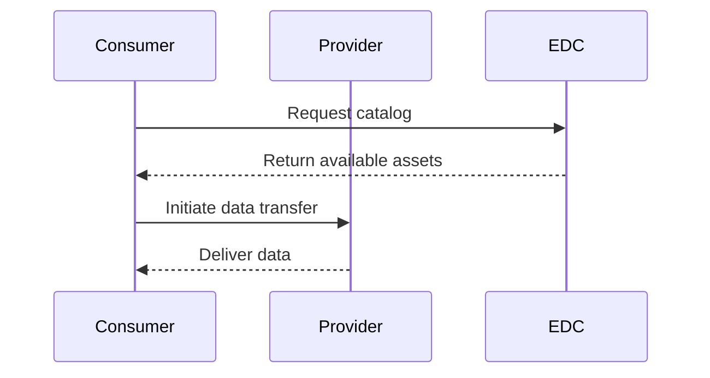

# AGR-4.01 - Standard Documentation Requirements

| Status | Created     | Post-History                    |
|--------|-------------|---------------------------------|
| Active | 20-Jan-2026 | Initial creation                |

## Why

High-quality standard documentation is critical for the Catena-X ecosystem. Standards define how participants interact, exchange data, and ensure interoperability. Well-written standards:

- **Enable Implementation**: Clear specifications allow developers to build compliant solutions
- **Reduce Ambiguity**: Precise language prevents misinterpretation
- **Facilitate Certification**: Testable requirements enable conformity assessment
- **Support Adoption**: Good documentation lowers barriers to entry
- **Ensure Quality**: Consistent structure improves review and maintenance

Poor documentation leads to:
- Implementation errors and incompatibilities
- Delayed certification processes
- Increased support costs
- Reduced ecosystem trust
- Technical debt

This guardrail ensures all Catena-X standards follow best practices for structure, content, and quality.

## Description

This guardrail defines the requirements for creating, structuring, and maintaining standard documentation in the Catena-X ecosystem, including the use of templates and best practices.

### Key Requirements

:::danger MUST
All Catena-X standards **must**:
- Follow the official standard template
- Include all mandatory sections
- Use clear, normative language (MUST, SHOULD, MAY per RFC 2119)
- Define conformity assessment criteria (CACs)
- Include versioning and changelog
- Be reviewed and approved through the standardization process
- Maintain consistency with related standards
:::

:::warning SHOULD
Standards **should**:
- Include diagrams and examples
- Provide implementation guidance
- Reference related standards and specifications
- Use consistent terminology from the glossary
- Include API specifications where applicable
- Provide migration guides for breaking changes
:::

## Scope

### In Scope
- Standard document structure and templates
- Content requirements for each section
- Writing style and language conventions
- Versioning and change management
- Review and approval process

### Out of Scope
- Specific technical content (varies by standard)
- Certification body procedures
- Legal and licensing aspects

## Standard Template Structure

All Catena-X standards must follow this template structure:

### Required Sections

1. **Front Matter** (Metadata)
2. **Abstract**
3. **For Whom is the Standard Designed**
4. **Comparison with Previous Version**
5. **Introduction**
   - Audience & Scope
   - Context and Architecture Fit
   - Conformance and Proof of Conformity
6. **Main Content** (Normative Sections)
   - Technical specifications
   - Requirements
   - Data models
   - APIs
7. **Conformity Assessment Criteria (CACs)**
8. **References**
9. **Annexes** (if applicable)

## Implementation Guidelines

### Step 1: Use the Official Template

Start with the official standard template from the [standardization repository](https://github.com/catenax-eV/product-standardization-prod/tree/main/templates).

:::tip Template Location
```
templates/CX-XXXX-StandardizationName/2.1.2/
├── CX-XXXX-StandardName.md
├── RELEASE_NOTES.md
└── assets/
    └── diagrams/
```
:::

### Step 2: Front Matter and Metadata

Include proper front matter with tags and metadata:

```markdown
---
tags:
  - CAT/[Committee Name]
---

# CX-XXXX [Standard Name] vX.Y.Z

## ABSTRACT

[2-3 paragraph summary of the standard's purpose, scope, and key features]

## FOR WHOM IS THE STANDARD DESIGNED

This standard is relevant to the following parties:

- [Role 1]
- [Role 2]
- [Role 3]

## COMPARISON WITH THE PREVIOUS VERSION OF THE STANDARD

[Describe changes from the previous version]

**New in this version:**
- [Change 1]
- [Change 2]

**Deprecated:**
- [Deprecated feature 1]
```

### Step 3: Introduction Section

The introduction must be comprehensive but non-normative:

```markdown
## 1 INTRODUCTION

[Overview paragraph]

### 1.1 AUDIENCE & SCOPE

> *This section is non-normative*

List for which roles the standard is relevant:

- [Role 1 with description]
- [Role 2 with description]

This standard applies to [describe scope].

### 1.2 CONTEXT AND ARCHITECTURE FIT

> *This section is non-normative*

[Explain how this standard fits into the broader Catena-X architecture]

[Include architecture diagrams]

### 1.3 CONFORMANCE AND PROOF OF CONFORMITY

> *This section is non-normative*

All participants and their solutions will need to prove that they conform 
with the Catena-X standards. To validate that the standards are applied 
correctly, Catena-X employs Conformity Assessment Bodies (CABs).

The key words MAY, MUST, MUST NOT, OPTIONAL, RECOMMENDED, REQUIRED, SHOULD 
and SHOULD NOT in this document are to be interpreted as described in 
[BCP 14](https://datatracker.ietf.org/doc/html/bcp14) [RFC2119] [RFC8174] 
when, and only when, they appear in all capitals, as shown here.
```

### Step 4: Normative Content

Main content sections must be clearly marked as normative:

```markdown
## 2 [MAIN TOPIC]

> *This section is normative*

### 2.1 [Subtopic]

#### 2.1.1 [Specific Requirement]

[Clear, testable requirement using MUST/SHOULD/MAY]

**Example:**
Data providers **MUST** implement the health check endpoint as specified 
in this section.

Data consumers **SHOULD** retry failed requests with exponential backoff.

The endpoint **MAY** return additional diagnostic information.
```

### Step 5: Use Admonitions Effectively

Docusaurus provides powerful admonitions - use them to enhance readability:

```markdown
:::note
General informational notes that provide additional context.
:::

:::tip Best Practice
Recommendations and best practices for implementation.
:::

:::info Important Information
Key information that readers should be aware of.
:::

:::warning Caution
Warnings about potential issues or common mistakes.
:::

:::danger Critical
Critical requirements or security considerations.
:::
```

### Step 6: Include Diagrams and Examples

Use Mermaid diagrams for architecture and sequences:

````markdown

````

Include code examples with syntax highlighting:

````markdown
```json
{
  "vin": "WBADT43452G296662",
  "manufacturer": "BMW",
  "modelYear": "2024"
}
```

```http
GET /api/v1/vehicles/WBADT43452G296662 HTTP/1.1
Host: example.com
Authorization: Bearer <token>
```
````

### Step 7: Define Conformity Assessment Criteria

Include testable CACs (see [AGR-1.01](./agr-1-01.md)):

```markdown
## CONFORMITY ASSESSMENT CRITERIA

### CAC-XXXX-001: [Requirement Name]

**Normative Reference**: Section 2.1.1

**Requirement**: [Clear statement of what must be tested]

**Test Description**: [How to verify compliance]

**Pass Criteria**:
- [Specific measurable criterion 1]
- [Specific measurable criterion 2]

**Fail Criteria**:
- [Specific failure condition]

**Verification Method**: [Manual/Automated/Tool-based]

**Evidence Required**:
- [Evidence item 1]
- [Evidence item 2]
```

### Step 8: References and Version Control

Include comprehensive references:

```markdown
## REFERENCES

### NORMATIVE REFERENCES

- [RFC 2119] - Key words for use in RFCs to Indicate Requirement Levels
- [CX-0001] - EDC Discovery API v1.0.0
- [CX-0002] - Digital Twins in Catena-X v2.0.0

### NON-NORMATIVE REFERENCES

- [Example Resource] - Description

## ANNEXES

### Annex A: Examples (Non-Normative)

[Additional examples]

### Annex B: Migration Guide (Non-Normative)

[Migration instructions for breaking changes]
```

Maintain a changelog:

```markdown
## CHANGELOG

### [2.0.0] - 2026-01-15

#### Added
- New API endpoint for batch operations
- Support for asynchronous processing

#### Changed
- **BREAKING**: Response format now uses ISO timestamps instead of Unix timestamps
- Improved error messages

#### Deprecated
- `/v1/legacy` endpoint - will be removed in v3.0.0

#### Removed
- Support for deprecated authentication method

#### Fixed
- Corrected typo in property name documentation

### [1.5.0] - 2025-10-01
...
```

## Examples

### Example 1: Well-Structured Normative Section

:::tip Best Practice
Clear, testable requirements with proper normative language.
:::

```markdown
## 3 API SPECIFICATIONS

> *This section is normative*

### 3.1 Health Check Endpoint

#### 3.1.1 Endpoint Definition

The health check endpoint **MUST** be available at the path `/health`.

The endpoint **MUST** respond to HTTP GET requests without authentication.

#### 3.1.2 Response Format

The response **MUST** be JSON with the following structure:

```json
{
  "status": "UP",
  "timestamp": "2024-01-15T10:30:00Z"
}
```

The `status` field **MUST** be either "UP" or "DOWN".

The `timestamp` field **MUST** be an ISO 8601 formatted datetime string.

#### 3.1.3 Response Codes

The endpoint **MUST** return:
- HTTP 200 when the service is healthy (`status: "UP"`)
- HTTP 503 when the service is unhealthy (`status: "DOWN"`)
```

**Why this is good**:
- Clear normative language (MUST)
- Testable requirements
- Concrete examples
- Proper structure

### Example 2: Effective Use of Admonitions

:::tip Best Practice
Using admonitions to highlight important information.
:::

```markdown
### 4.2 Security Considerations

All API endpoints **MUST** use TLS 1.2 or higher for transport security.

:::danger Security Requirement
API keys **MUST NEVER** be transmitted in URL query parameters. 
Always use the Authorization header.
:::

:::warning Common Mistake
Some implementations incorrectly cache credentials. Credentials should 
be retrieved fresh for each request or cached with appropriate TTL and 
secure storage.
:::

:::tip Best Practice
Implement rate limiting to prevent abuse. We recommend:
- 100 requests per minute for authenticated users
- 10 requests per minute for unauthenticated endpoints
:::

:::info Additional Resources
For more information on API security best practices, see the 
[OWASP API Security Top 10](https://owasp.org/www-project-api-security/).
:::
```

**Why this is good**:
- Security requirements clearly highlighted
- Common pitfalls called out
- Best practices provided
- External references included

### Example 3: Anti-Pattern - Vague Requirements

:::danger What Not To Do
Unclear, untestable requirements.
:::

```markdown
## API Requirements

The API should be fast and reliable.

Data should be returned in a reasonable format.

Errors should be handled appropriately.
```

**Why this is wrong**:
- "Fast", "reliable", "reasonable" are subjective
- No specific requirements
- Not testable
- No normative language
- No examples or specifications

## Verification

### Checklist for Standard Authors

- [ ] Used official template from standardization repository
- [ ] All mandatory sections included
- [ ] Abstract clearly summarizes the standard
- [ ] Audience and scope clearly defined
- [ ] Normative/non-normative sections marked
- [ ] RFC 2119 keywords used correctly (MUST, SHOULD, MAY)
- [ ] All requirements are testable
- [ ] CACs defined for all normative requirements
- [ ] Diagrams and examples included
- [ ] References are complete and correct
- [ ] Changelog maintained
- [ ] Version number follows semantic versioning
- [ ] Admonitions used appropriately
- [ ] Terminology consistent with glossary

### Checklist for Standard Reviewers

- [ ] Structure follows template
- [ ] Content is technically accurate
- [ ] Requirements are clear and unambiguous
- [ ] Requirements are testable
- [ ] No contradictions with other standards
- [ ] Examples are correct and helpful
- [ ] CACs are complete and testable
- [ ] Documentation is comprehensive
- [ ] Writing style is consistent
- [ ] Diagrams are clear and accurate

## References

### Related Guardrails
- [AGR-1.01](./agr-1-01.md) - Conformity Assessment Criteria Guidelines
- [AGR-2.01](./agr-2-01.md) - Semantic Data Model Changes
- [AGR-3.01](./agr-3-01.md) - Ontology Management

### Standards
- [RFC 2119](https://datatracker.ietf.org/doc/html/rfc2119) - Key words for use in RFCs to Indicate Requirement Levels
- [RFC 8174](https://datatracker.ietf.org/doc/html/rfc8174) - Ambiguity of Uppercase vs Lowercase in RFC 2119 Key Words

### External Resources
- [Catena-X Standardization Repository](https://github.com/catenax-eV/product-standardization-prod)
- [Docusaurus Admonitions](https://docusaurus.io/docs/markdown-features/admonitions)
- [Mermaid Diagram Syntax](https://mermaid.js.org/)

## FAQ

### Question 1: Where do I find the official template?

The official template is in the [product-standardization-prod repository](https://github.com/catenax-eV/product-standardization-prod/tree/main/templates/CX-XXXX-StandardizationName/2.1.2).

:::note
You may need access to the repository. Contact the standardization team if you don't have access.
:::

### Question 2: Can I add custom sections?

Yes, but all mandatory sections must be included. Custom sections should be added in a logical place and marked as normative or non-normative.

### Question 3: How do I handle breaking changes?

Breaking changes require:
- Major version bump (e.g., 1.x.x → 2.0.0)
- Clear documentation in "Comparison with Previous Version"
- Migration guide in an annex
- Deprecation notice in previous version (if possible)
- Updated CACs

### Question 4: What makes a requirement testable?

Testable requirements are:
- **Specific**: Clearly defined, no ambiguity
- **Measurable**: Can be verified objectively
- **Achievable**: Technically feasible
- **Relevant**: Aligned with standard's purpose
- **Traceable**: Linked to CACs

Example:
- ❌ "Response should be fast" (not testable)
- ✅ "Response time MUST be less than 2 seconds" (testable)

### Question 5: How should I version my standard?

Use [Semantic Versioning](https://semver.org/):
- **MAJOR** (X.0.0): Breaking changes
- **MINOR** (x.Y.0): New features, backward compatible
- **PATCH** (x.y.Z): Bug fixes, clarifications

## Change History

| Version | Date        | Changes                          | Author               |
|---------|-------------|----------------------------------|----------------------|
| 1.0     | 20-Jan-2026 | Initial release                  | Architecture Team    |

---

:::note Feedback
Questions about standard documentation? Contact the standardization team or raise an issue in the standardization repository.
:::
