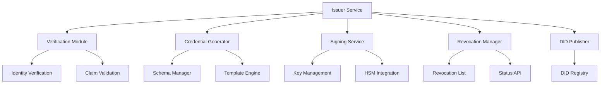
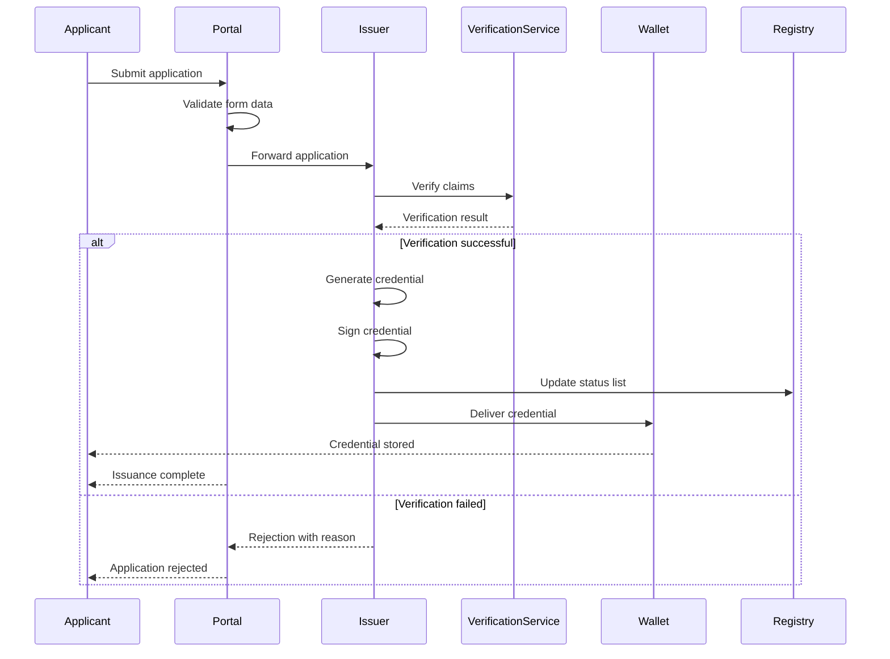
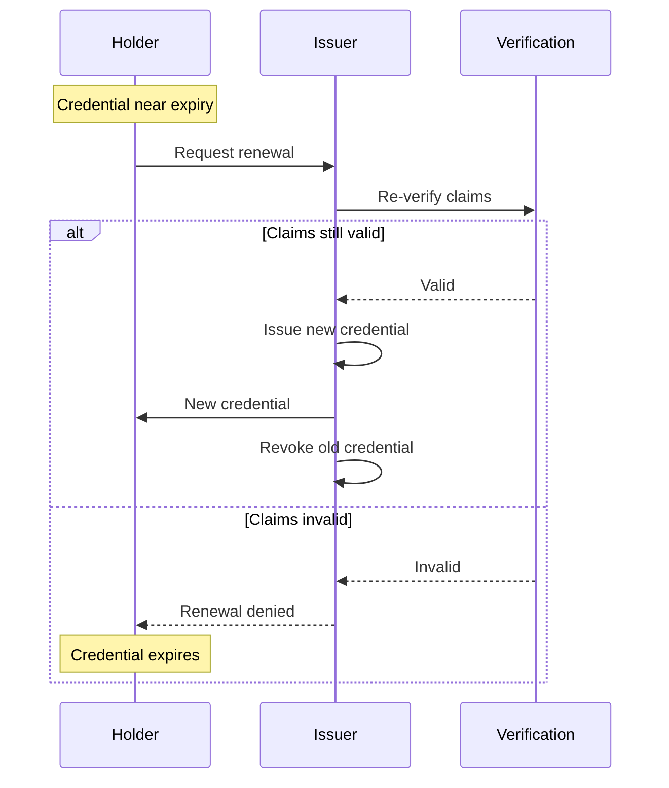
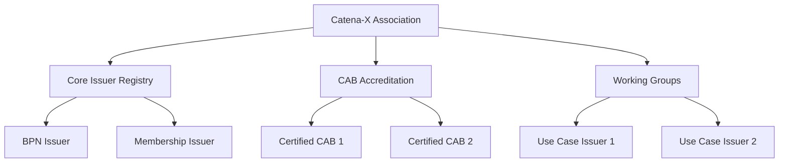

# Issuer Concept and Credential Management

## Overview

In the Catena-X ecosystem, credential issuers play a critical role in establishing trust and managing digital identities. This document explains the issuer concept, different types of issuers, their responsibilities, and how credential issuance is governed in Catena-X.

:::info What You'll Learn
- What credential issuers are and their role
- Types of issuers in Catena-X
- The credential issuance process
- Issuer governance and trust
- Technical implementation details
- Best practices for issuers
:::

## What is a Credential Issuer?

A credential issuer is an entity that creates, signs, and distributes verifiable credentials to holders. Issuers act as trusted authorities that attest to specific claims about an identity or entity.

### Core Responsibilities

1. **Verification**: Validate claims before issuing credentials
2. **Issuance**: Create and cryptographically sign credentials
3. **Revocation**: Manage credential lifecycle and revocation
4. **Trust**: Maintain trustworthiness through proper governance
5. **Transparency**: Publish issuer DID and public keys
6. **Compliance**: Follow Catena-X policies and standards

:::tip Issuer Trust
An issuer's trustworthiness determines whether verifiers will accept credentials. Trust is established through governance, transparency, and technical capabilities.
:::

## Types of Issuers in Catena-X

### 1. Core Issuers

Authorized by the Catena-X association to issue fundamental credentials.

**Examples**:
- **BPN Issuer**: Issues Business Partner Number credentials
- **Membership Issuer**: Issues membership credentials
- **Onboarding Issuer**: Issues initial participant credentials

**Characteristics**:
- High trust level
- Formal authorization
- Strict governance
- Long-term stability

### 2. Use Case Issuers

Authorized to issue credentials for specific use cases.

**Examples**:
- **Traceability Working Group**: Issues traceability participation credentials
- **PCF Working Group**: Issues PCF use case credentials
- **Quality Working Group**: Issues quality management credentials

**Characteristics**:
- Use case specific
- Working group authority
- Domain expertise required
- Governed by use case rules

### 3. Certification Issuers (CABs)

Conformity Assessment Bodies that issue certification credentials.

**Examples**:
- Accredited CABs issuing compliance credentials
- Security auditors issuing security clearance credentials
- Technical assessors issuing capability credentials

**Characteristics**:
- Independent third parties
- Accredited and qualified
- Formal assessment processes
- High assurance levels

### 4. Self-Issued Credentials

Entities issuing credentials about themselves.

**Examples**:
- Company profile credentials
- Service capability credentials
- Public contact information credentials

**Characteristics**:
- Lower trust level
- No third-party validation
- Useful for non-critical claims
- Easy to issue and manage

:::warning Trust Levels
Not all credentials have equal trust. Verifiers should consider issuer type and trust level when making authorization decisions.
:::

## Issuer Architecture



### Key Components

#### 1. Verification Module

Validates claims before credential issuance.

**Functions**:
- Identity verification (KYC/KYB)
- Document validation
- Attribute verification
- Compliance checks

**Example**:
```javascript
async function verifyClaim(applicant, claimType) {
  // Verify business registration
  const businessValid = await verifyBusinessRegistration(
    applicant.businessId
  );
  
  // Check against sanctions lists
  const sanctionsCheck = await checkSanctions(
    applicant.legalName
  );
  
  // Validate documents
  const documentsValid = await validateDocuments(
    applicant.documents
  );
  
  return businessValid && !sanctionsCheck && documentsValid;
}
```

#### 2. Credential Generator

Creates credentials based on templates and schemas.

**Functions**:
- Apply credential schema
- Populate credential data
- Set validity periods
- Add metadata

**Example Credential Schema**:
```json
{
  "type": "BPNCredential",
  "schema": {
    "credentialSubject": {
      "bpn": {
        "type": "string",
        "pattern": "^BPN[L|S|A][0-9]{12}$",
        "required": true
      },
      "legalName": {
        "type": "string",
        "required": true
      },
      "headquarterAddress": {
        "type": "object",
        "required": true
      }
    }
  },
  "validityDuration": "P1Y"
}
```

#### 3. Signing Service

Cryptographically signs credentials.

**Functions**:
- Key management
- Signature generation
- Proof creation
- HSM integration

**Signature Types**:
- **JsonWebSignature2020**: JSON-based signatures
- **Ed25519Signature2020**: EdDSA signatures
- **EcdsaSecp256k1Signature2019**: ECDSA signatures

:::danger Key Security
Issuer private keys must be protected with hardware security modules (HSMs) or equivalent secure key storage.
:::

#### 4. Revocation Manager

Manages credential revocation and status.

**Functions**:
- Revocation list management
- Status updates
- Status API
- Validity checks

**Revocation List Example**:
```json
{
  "@context": "https://w3id.org/vc/status-list/2021/v1",
  "id": "https://issuer.catena-x.net/status/1",
  "type": "StatusList2021Credential",
  "issuer": "did:web:issuer.catena-x.net",
  "issuanceDate": "2024-01-15T00:00:00Z",
  "credentialSubject": {
    "id": "https://issuer.catena-x.net/status/1#list",
    "type": "StatusList2021",
    "statusPurpose": "revocation",
    "encodedList": "H4sIAAAAAAAAA..."
  }
}
```

## Credential Issuance Workflow

### Standard Issuance Process



### Detailed Steps

#### Step 1: Application Submission

Applicant submits credential request with:
- Identity information
- Required claims
- Supporting documents
- Proof of prerequisites

**Example Application**:
```json
{
  "applicantDid": "did:web:applicant.example.com",
  "credentialType": "BPNCredential",
  "claims": {
    "legalName": "Example Automotive GmbH",
    "businessRegistrationNumber": "HRB 12345",
    "taxId": "DE123456789"
  },
  "supportingDocuments": [
    {
      "type": "BusinessRegistration",
      "hash": "sha256:abc123...",
      "url": "https://..."
    }
  ]
}
```

#### Step 2: Verification

Issuer verifies all claims:

```javascript
async function verifyApplication(application) {
  const checks = {
    identity: await verifyIdentity(application.applicantDid),
    registration: await verifyBusinessRegistration(
      application.claims.businessRegistrationNumber
    ),
    documents: await verifyDocuments(
      application.supportingDocuments
    ),
    sanctions: await checkSanctions(
      application.claims.legalName
    ),
    eligibility: await checkEligibility(
      application.credentialType,
      application.claims
    )
  };
  
  return Object.values(checks).every(check => check === true);
}
```

#### Step 3: Credential Creation

If verification passes, create credential:

```javascript
async function createCredential(application, verificationResults) {
  const credential = {
    "@context": [
      "https://www.w3.org/2018/credentials/v1",
      "https://catena-x.net/credentials/v1"
    ],
    "id": `https://issuer.catena-x.net/credentials/${uuid()}`,
    "type": ["VerifiableCredential", application.credentialType],
    "issuer": "did:web:issuer.catena-x.net",
    "issuanceDate": new Date().toISOString(),
    "expirationDate": calculateExpiration(application.credentialType),
    "credentialSubject": {
      "id": application.applicantDid,
      ...application.claims
    },
    "credentialStatus": {
      "id": `https://issuer.catena-x.net/status/1#${statusIndex}`,
      "type": "StatusList2021Entry",
      "statusPurpose": "revocation",
      "statusListIndex": statusIndex.toString(),
      "statusListCredential": "https://issuer.catena-x.net/status/1"
    }
  };
  
  return credential;
}
```

#### Step 4: Signing

Sign the credential with issuer's private key:

```javascript
async function signCredential(credential, privateKey) {
  const proof = {
    "type": "JsonWebSignature2020",
    "created": new Date().toISOString(),
    "proofPurpose": "assertionMethod",
    "verificationMethod": "did:web:issuer.catena-x.net#key-1",
    "jws": await createJWS(credential, privateKey)
  };
  
  return {
    ...credential,
    proof
  };
}
```

#### Step 5: Delivery

Deliver credential to holder's wallet:

```javascript
async function deliverCredential(credential, holderWalletUrl) {
  const response = await fetch(`${holderWalletUrl}/credentials`, {
    method: 'POST',
    headers: {
      'Content-Type': 'application/json'
    },
    body: JSON.stringify(credential)
  });
  
  if (!response.ok) {
    throw new Error('Failed to deliver credential');
  }
  
  return response.json();
}
```

## Credential Lifecycle Management

### Validity Periods

Different credentials have different validity periods:

| Credential Type | Typical Validity | Renewal Process |
|----------------|------------------|-----------------|
| BPN Credential | 1 year | Automatic if still valid |
| Membership | 1 year | Renewal with fee |
| Certification | 3 years | Re-assessment required |
| Use Case Participation | 6 months | Renewed per release |

### Renewal Process



### Revocation

Credentials may be revoked for several reasons:

**Revocation Reasons**:
- Membership terminated
- Certification withdrawn
- Fraudulent information discovered
- Holder request
- Security compromise

**Revocation Process**:

```javascript
async function revokeCredential(credentialId, reason) {
  // Update revocation list
  await updateRevocationList(credentialId, {
    revoked: true,
    revokedAt: new Date().toISOString(),
    reason: reason
  });
  
  // Notify holder
  await notifyHolder(credentialId, {
    action: 'revocation',
    reason: reason
  });
  
  // Log the revocation
  await auditLog('credential_revoked', {
    credentialId,
    reason,
    timestamp: new Date().toISOString()
  });
}
```

:::warning Impact of Revocation
Revoked credentials immediately lose validity. Systems should check revocation status regularly.
:::

## Issuer Governance

### Authorization

Issuers must be authorized by appropriate governance bodies:

1. **Core Issuers**: Authorized by Catena-X Association
2. **Use Case Issuers**: Authorized by Working Groups
3. **CABs**: Accredited by accreditation bodies

### Trust Framework



### Issuer Requirements

To become an authorized issuer:

:::danger MUST Requirements
- **Legal Entity**: Must be a legal entity or authorized organization
- **Technical Capability**: Demonstrate ability to securely issue credentials
- **Governance**: Commit to governance framework
- **Security**: Implement security best practices
- **Audit**: Allow periodic audits
- **Transparency**: Publish DID and policies
:::

## Best Practices for Issuers

### Security

:::tip Security Recommendations
1. **Use HSMs** for private key storage
2. **Implement MFA** for issuer operations
3. **Regular security audits**
4. **Incident response plan**
5. **Key rotation schedule**
6. **Access logging and monitoring**
:::

### Operations

1. **Automate where possible**: Reduce manual errors
2. **Maintain audit trails**: Track all issuance activities
3. **Monitor revocation lists**: Keep them up to date
4. **Test regularly**: Verify credential validation works
5. **Document processes**: Clear operational procedures
6. **Disaster recovery**: Backup and recovery plans

### Credential Design

```json
{
  "goodPractices": {
    "clearSchema": "Use well-defined schemas",
    "minimalData": "Include only necessary claims",
    "appropriateExpiry": "Set reasonable validity periods",
    "revocationSupport": "Always include revocation status",
    "standardFormats": "Use W3C VC standard formats",
    "multilingual": "Support multiple languages where possible"
  }
}
```

## Common Patterns

### Pattern 1: BPN Issuance

Complete workflow for BPN credential issuance:

1. Organization onboards to Catena-X
2. Identity verification (KYC/KYB)
3. BPN assigned from BPN pool
4. BPN credential issued
5. Credential delivered to organization wallet
6. Organization can now participate in data space

### Pattern 2: Use Case Credential

Workflow for use case participation:

1. Prerequisites check (membership, BPN)
2. Use case application submitted
3. Working group reviews application
4. Approval and credential issuance
5. Credential presented to use case services
6. Access granted based on credential

### Pattern 3: Certification Credential

Certification credential workflow:

1. CAB performs assessment
2. Participant passes assessment
3. CAB issues certification credential
4. Credential includes scope and validity
5. Participant presents for verification
6. Periodic re-assessment for renewal

## Troubleshooting

### Issue: Credential Rejected by Verifiers

**Possible Causes**:
- Issuer DID not resolvable
- Signature verification fails
- Credential expired
- Issuer not trusted by verifier

**Solutions**:
- Ensure DID document published correctly
- Verify signing key in DID document
- Check credential validity dates
- Confirm issuer authorization

### Issue: Revocation Status Not Updating

**Possible Causes**:
- Caching issues
- Revocation list not published
- Status list index incorrect

**Solutions**:
- Clear caches
- Verify revocation list accessibility
- Check status list entry configuration

## References

### Related Documentation
- [SSI Workflow](./ssi-workflow) - Understanding SSI in Catena-X
- [Architecture Guardrails](../architecture-guardrails/overview.md)

### Standards
- [W3C Verifiable Credentials](https://www.w3.org/TR/vc-data-model/)
- [Status List 2021](https://w3c-ccg.github.io/vc-status-list-2021/)

### Tools
- Credential schema validators
- DID resolvers
- Signature verification libraries

---

:::note Questions?
For questions about becoming an issuer or issuer operations, contact the Catena-X identity working group.
:::
