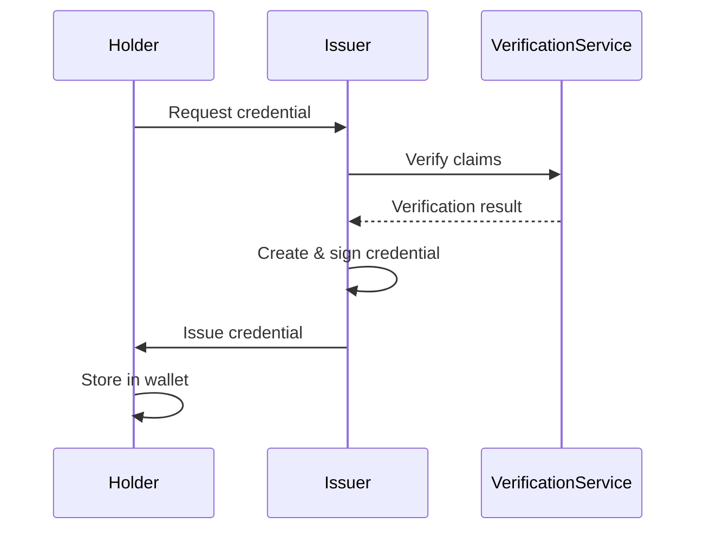
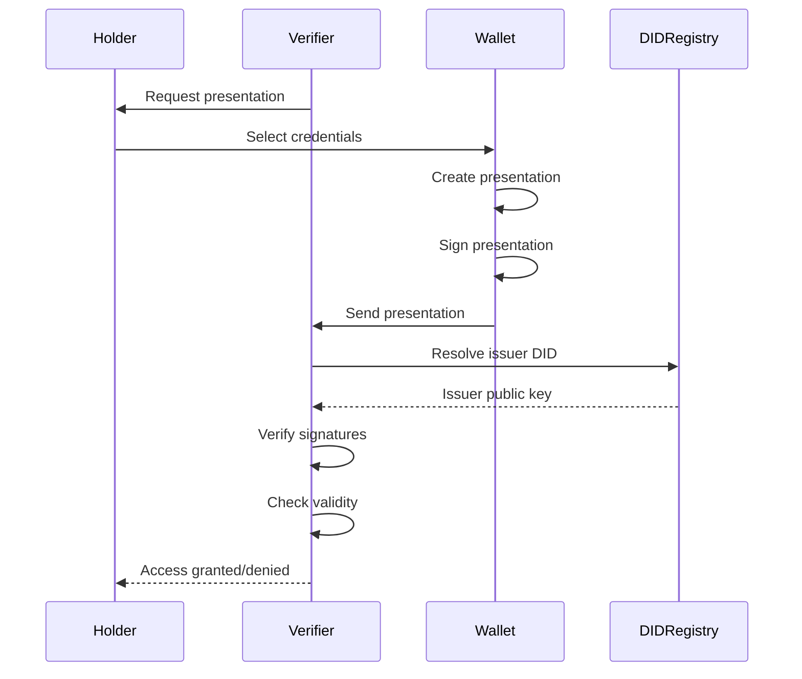
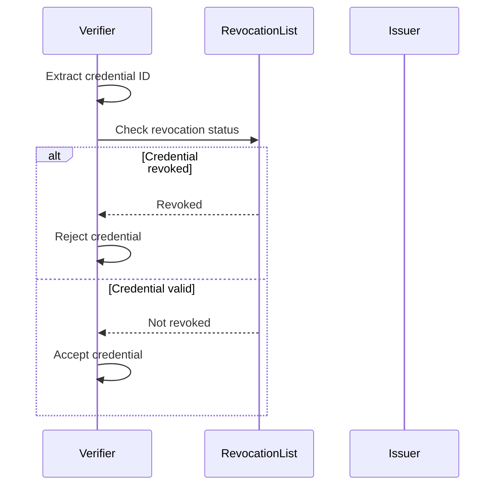
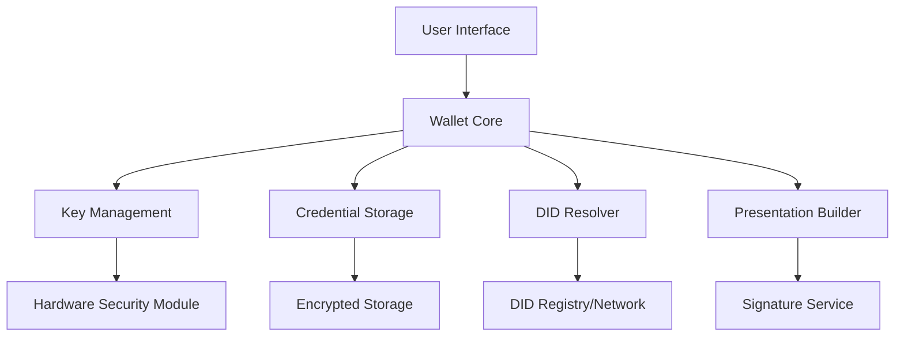

# Self-Sovereign Identity (SSI) Workflow

## Overview

Self-Sovereign Identity (SSI) is a foundational concept in Catena-X that enables participants to control their own digital identities without relying on centralized authorities. This document explains the SSI workflow, key concepts, and how it's implemented in the Catena-X ecosystem.

:::info What You'll Learn
- Core SSI concepts and principles
- The SSI workflow in Catena-X
- Roles and responsibilities in the SSI ecosystem
- Technical implementation details
- Common patterns and best practices
:::

## What is Self-Sovereign Identity?

Self-Sovereign Identity is a model where individuals and organizations have complete control over their digital identities. Instead of identities being managed by centralized providers, SSI puts identity owners in control.

### Core Principles

1. **User Control**: Identity owners control their identity data
2. **Decentralization**: No single point of control or failure
3. **Privacy**: Minimal disclosure of information
4. **Portability**: Identities work across different systems
5. **Consent**: Data sharing requires explicit consent
6. **Interoperability**: Standards-based, works across platforms

:::tip Why SSI in Catena-X?
SSI enables trusted, privacy-preserving business relationships in the data space without creating new centralized authorities that could become gatekeepers or single points of failure.
:::

## Key Concepts

### Decentralized Identifiers (DIDs)

DIDs are globally unique identifiers that don't require a centralized registration authority.

```plaintext
Example DID: did:web:example.com:organization:12345
```

**Properties**:
- Cryptographically verifiable
- Resolvable to DID Documents
- Independent of centralized registries
- Controlled by the identity owner

### Verifiable Credentials (VCs)

Digital credentials that can be cryptographically verified.

```json
{
  "@context": [
    "https://www.w3.org/2018/credentials/v1"
  ],
  "id": "https://example.com/credentials/3732",
  "type": ["VerifiableCredential", "BusinessPartnerCredential"],
  "issuer": "did:web:issuer.catena-x.net",
  "issuanceDate": "2024-01-15T10:30:00Z",
  "credentialSubject": {
    "id": "did:web:participant.example.com",
    "bpn": "BPNL000000000001",
    "legalName": "Example Automotive GmbH"
  },
  "proof": {
    "type": "JsonWebSignature2020",
    "created": "2024-01-15T10:30:00Z",
    "proofPurpose": "assertionMethod",
    "verificationMethod": "did:web:issuer.catena-x.net#key-1",
    "jws": "eyJhbGc...signature...xyz"
  }
}
```

### Verifiable Presentations (VPs)

A collection of credentials presented for verification, often with selective disclosure.

## SSI Roles in Catena-X

### 1. Holder (Identity Owner)

The entity that controls the identity and credentials.

**Responsibilities**:
- Maintain cryptographic keys
- Store credentials securely
- Create presentations when needed
- Consent to data sharing

**Examples**: Data providers, data consumers, service providers

### 2. Issuer

The entity that issues verifiable credentials.

**Responsibilities**:
- Verify identity claims before issuance
- Sign credentials cryptographically
- Publish issuer DID document
- Maintain revocation status

**Examples**: Catena-X association, certification bodies, BPN issuers

### 3. Verifier

The entity that verifies presentations of credentials.

**Responsibilities**:
- Request specific credentials
- Verify cryptographic proofs
- Check credential validity and revocation status
- Make authorization decisions

**Examples**: EDC connectors, access control systems, certification portals

## SSI Workflow in Catena-X

### Phase 1: Identity Creation

```mermaid
sequenceDiagram
    participant Participant
    participant Wallet
    participant DIDRegistry
    
    Participant->>Wallet: Create new identity
    Wallet->>Wallet: Generate key pair
    Wallet->>Wallet: Create DID
    Wallet->>DIDRegistry: Register DID Document
    DIDRegistry-->>Wallet: Confirmation
    Wallet-->>Participant: DID & keys ready
```

**Steps**:

1. **Key Generation**: Participant generates cryptographic key pair (public/private)
2. **DID Creation**: Create a DID using chosen method (e.g., did:web)
3. **DID Document**: Publish DID document with public key and service endpoints
4. **Storage**: Securely store private keys in wallet

:::warning Security Critical
Private keys must be stored securely and never shared. Loss of private keys means loss of identity control.
:::

### Phase 2: Credential Issuance



**Steps**:

1. **Request**: Holder requests a credential from issuer
2. **Verification**: Issuer verifies the holder's claims
3. **Issuance**: Issuer creates and cryptographically signs credential
4. **Delivery**: Credential delivered to holder's wallet
5. **Storage**: Holder stores credential securely

**Example Credentials in Catena-X**:
- Business Partner Number (BPN) credential
- Membership credential
- Certification credential
- Use case participation credential

:::info Credential Types
Different credentials serve different purposes. A participant may hold multiple credentials from different issuers.
:::

### Phase 3: Credential Presentation



**Steps**:

1. **Request**: Verifier requests specific credentials
2. **Selection**: Holder selects which credentials to share
3. **Presentation**: Wallet creates a presentation (with selective disclosure if needed)
4. **Signing**: Holder signs the presentation
5. **Verification**: Verifier checks:
   - Signature validity
   - Issuer trust
   - Credential not revoked
   - Credential not expired
6. **Decision**: Verifier makes authorization decision

:::tip Selective Disclosure
Holders can choose to reveal only specific attributes from their credentials, protecting privacy while proving claims.
:::

### Phase 4: Revocation Check



**Methods**:
- **Revocation Lists**: Published lists of revoked credentials
- **Status List 2021**: Efficient revocation list standard
- **On-demand checks**: Real-time status verification

## Implementation in Catena-X

### Wallet Architecture



**Components**:

1. **Key Management**: Secure storage and use of private keys
2. **Credential Storage**: Encrypted storage of credentials
3. **DID Resolver**: Resolves DIDs to DID documents
4. **Presentation Builder**: Creates verifiable presentations
5. **Signature Service**: Signs presentations and messages

### DID Methods in Catena-X

Catena-X primarily uses:

**did:web** - Web-based DIDs
```plaintext
did:web:participant.example.com
```

Resolved via HTTPS:
```
https://participant.example.com/.well-known/did.json
```

**Advantages**:
- Leverages existing web infrastructure
- No blockchain dependency
- Easy to deploy and manage
- DNS-based trust

:::info DID Document Example
```json
{
  "@context": "https://www.w3.org/ns/did/v1",
  "id": "did:web:participant.example.com",
  "verificationMethod": [{
    "id": "did:web:participant.example.com#key-1",
    "type": "JsonWebKey2020",
    "controller": "did:web:participant.example.com",
    "publicKeyJwk": {
      "kty": "EC",
      "crv": "P-256",
      "x": "...",
      "y": "..."
    }
  }],
  "authentication": ["did:web:participant.example.com#key-1"],
  "assertionMethod": ["did:web:participant.example.com#key-1"]
}
```
:::

## Common Patterns

### Pattern 1: EDC Authentication

EDC connectors use SSI for authentication:

1. Connector presents membership credential
2. Verifier checks credential validity
3. Verifier checks BPN in credential
4. Access granted based on policies

### Pattern 2: Use Case Participation

Proving participation in a use case:

1. Participant obtains use case credential from working group
2. Presents credential when accessing use case services
3. Services verify credential and grant appropriate access

### Pattern 3: Certification Proof

Proving certification status:

1. CAB issues certification credential after assessment
2. Participant presents credential to data space
3. Data space verifies and records certification

## Security Considerations

:::danger Critical Security Practices
1. **Never share private keys**
2. **Use hardware security modules (HSM) when possible**
3. **Implement proper key rotation**
4. **Maintain secure backups**
5. **Monitor for unauthorized access**
6. **Verify issuers before trusting credentials**
:::

### Key Management

- Store private keys in secure hardware when possible
- Implement key rotation policies
- Have backup and recovery procedures
- Use multi-signature for high-value operations

### Credential Verification

Always verify:
- ✅ Signature is valid
- ✅ Issuer is trusted
- ✅ Credential is not revoked
- ✅ Credential is not expired
- ✅ Claims match expectations

## Troubleshooting

### Common Issues

**Problem**: DID cannot be resolved

**Solutions**:
- Check DID document is published at correct URL
- Verify HTTPS is working
- Check DNS configuration
- Ensure CORS headers are set correctly

---

**Problem**: Credential verification fails

**Solutions**:
- Check credential hasn't expired
- Verify credential hasn't been revoked
- Ensure issuer DID is resolvable
- Confirm signature algorithm is supported

---

**Problem**: Presentation rejected

**Solutions**:
- Ensure all requested credentials are included
- Check credential validity dates
- Verify presentation signature
- Confirm holder controls the DID

## Best Practices

:::tip Recommendations
1. **Use standard credential schemas** when available
2. **Implement selective disclosure** to protect privacy
3. **Cache DID documents** to improve performance
4. **Monitor revocation lists** regularly
5. **Version your DID documents** properly
6. **Test with multiple verifiers** to ensure compatibility
7. **Document your credential schemas** thoroughly
8. **Implement proper error handling** in verification
:::

## References

### Related Standards
- [CX-0013 Identity and Access Management](../standards/) - IAM requirements
- [CX-0015 IAM & Access Control Paradigm](../standards/) - Access control model

### External Resources
- [W3C DID Core Specification](https://www.w3.org/TR/did-core/)
- [W3C Verifiable Credentials Data Model](https://www.w3.org/TR/vc-data-model/)
- [DID Method Registry](https://w3c.github.io/did-spec-registries/)

### Tools
- Identity Wallet
- DID Resolver libraries
- Credential validators

---

:::note Questions?
For questions about SSI implementation in Catena-X, consult the identity and access management working group or refer to the relevant standards.
:::
