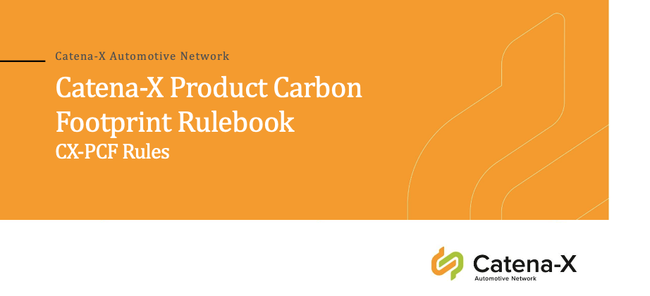
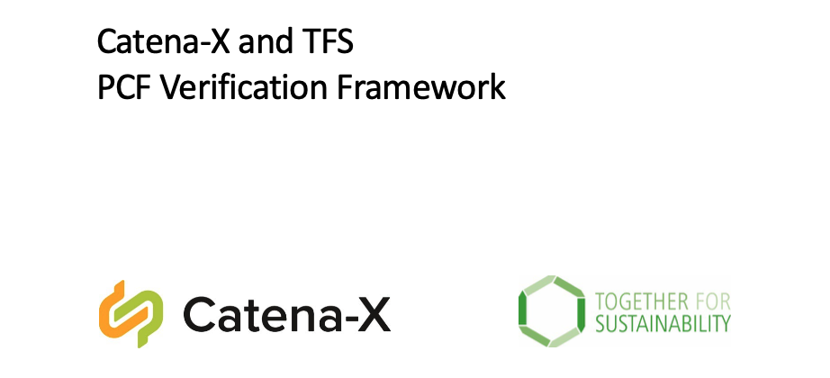

## Product Carbon Footprint

| PCF-Rulebook v4.0 | PCF-Verification Framework v2.0 |
|:---:|:---:|
|  |   |

## ESS Code of Conduct

| ESS Code of Conduct v1.0 (German) | ESS Code of Conduct v1.0 (English) |
|:---:|:---:|
|  |  |

## Legal

Copyright © 2025 Catena-X Automotive Network e.V. All rights reserved. For more information, please visit [here](/copyright).
