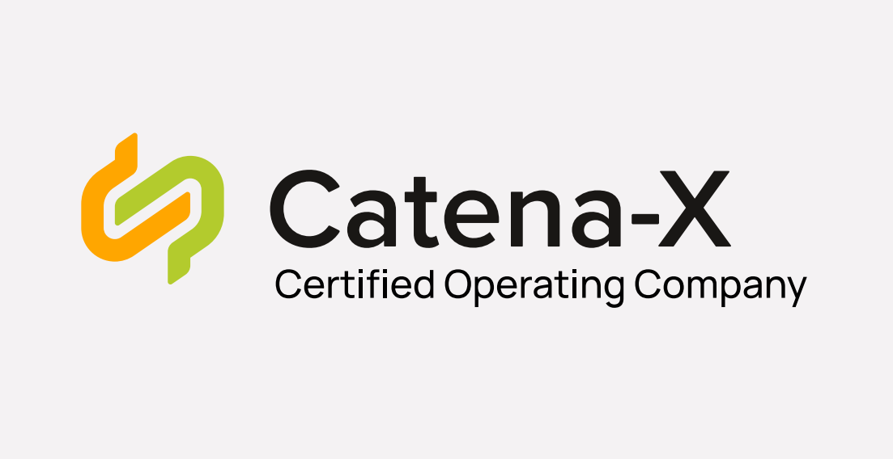
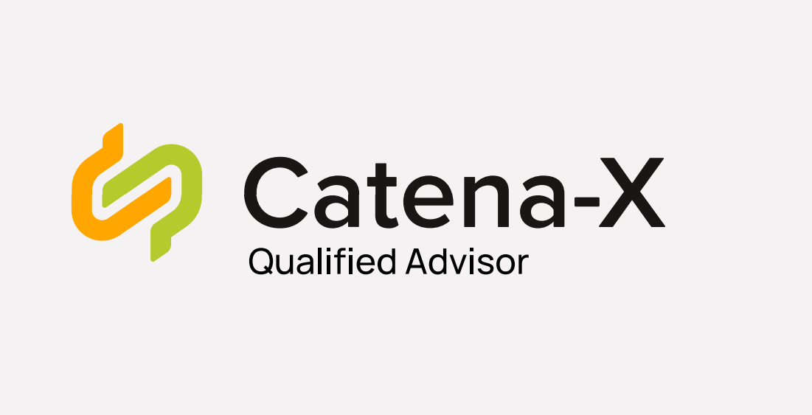

# How: Data Space Governance

## Standardization

### Why do we standardize?

The success of the digital transformation of the automotive industry critically depends on multilateral collaboration between all stakeholders along the automotive value chain. Our growing Catena-X ecosystem will enable enormous amounts of data to be integrated and collaboratively harnessed.

However, this vision is complex: companies at various stages of the automotive value chain, such as production, delivery, or logistics, often have their own IT systems to manage their data. To ensure that these complex data volumes can be sent, received, and processed smoothly across all stages of the value chain, we need one language for all players: **common standards and frameworks**.

### What do we standardize?

The standards of our Catena-X data ecosystem define how the exchange of data and information in our network works. They are the basis for ensuring that the technologies, components, policies, and processes used are developed and operated according to uniform rules. All standards developed for the Catena-X data ecosystem are based on the technological and industry-specific requirements of the automotive industry.

The Catena-X Association publishes standards for generic core and enabling services as well as for domain-specific business applications (see KITs Chapter [KITs – Keep It Together](./../what-service-map/what-service-map.md#kits--keep-it-together)). These standards and artifacts form the basis for the development and operation of software components in the Catena-X network to ensure interoperability and data sovereignty between different software components and providers. All relevant standards are accessible in the [Catena-X standard library](https://catena-x.net/de/standard-library).

### How do we standardize?

Based on [Catena-X’s Intellectual Property(IP)-Regulations](https://catena-x.net/fileadmin/user_upload/Vereinsdokumente/Catena-X_IP_Regelwerk_IP_Regulations.pdf) and in compliance with applicable antitrust law, the Catena-X standardization process aims to develop and implement uniform standards for networking and data exchange in the automotive sector. A general overview of the process is depicted in Figure [Catena-X Standardization Process](./how-data-space-governance.md#how-do-we-standardize):

*Catena-X Standardization Process*

The [Catena-X standardization policy](https://catena-x.net/en/catena-x-introduce-implement/standardisierung) provides a detailed description of how Catena-X standards are being developed including everyone involved and their respective responsibilities.

## Conformity Assessment

### Why do we certify?

Cross company interactions highly rely on mutual trust. Our certifications provide trust via transparency and reliability based on our Catena-X standards. By setting up a certification process, we guarantee that our major principles are considered in every component of the network. From the core service providers to the data connectors and every single application in the network, a consistent framework was created to ensure beneficial participation for all participants in the network. A chain is only as strong as its weakest link, and to gain trust we need to ensure that all links are as strong as possible.

### What do we certify?

Catena-X certification is done in a modular, role-based way, to fulfill different requirements of participants in our ecosystem, whether IT application providers, service providers or onboarding partners. The modularity allows high flexibility and lowers the efforts and redundancies for all parties involved. Catena-X standards become mandatory for certification as soon as they have been integrated into the certification framework. The Catena-X Association aims to release an update of its certification framework simultaneously with newly released standards. The most current version can always be found on the [Catena-X website](https://catena-x.net/en/catena-x-introduce-implement/certification).

### How do we certify?

An overview of the certification process is depicted in Figure [Catena-X Certification Process](./how-data-space-governance.md#how-do-we-certify).

*Catena-X Certification Process*

The [Catena-X Conformity Assessment Framework Handbook](https://catena-x.net/en/catena-x-introduce-implement/certification) provides a detailed description of how Catena-X conducts conformity assessment through Conformity Assessment Bodies.

### Catena-X Labels

Catena-X issues four different labels to help customers find suitable and legitimate providers for their needs. Each label is issued to the relevant role after achieving successful certification and/or qualification. Labels are associated with the offered services of the provider.

**Certified Operating Company** (CSP-A/CSP-B)

**Certified Provider** (e.g., BAP, ESP, OSP)

**Certified Solution** (e.g., Business App, Service….)

**Qualified Advisor** (Advisory Provider)

Each label is obtained after successful completion of the Catena-X certification or qualification process. Details on pathways to be added.

### Exceptions & Timeline for Release 23.09

Release 23.09 is the official GoLive Release of the Catena-X data ecosystem. For the first time, all major components of the Catena-X data ecosystem will be available to the vast majority of the automotive value chain. To fulfil this promise to all our stakeholders while some areas of Catena-X are still under development, certain exceptions are made during this transitional period:

#### 1. 45-day grace period to obtain valid certification after Release 3.2 (23.09)

Catena-X will release a standard update (Release 3.2) on Sept. 28, 2023, on the Catena-X Association website. **This release will include “breaking changes” as defined in the** [Semantic Versioning](https://semver.org/).

The GoLive of the Catena-X data ecosystem (productive environment) will be **exclusively on Release 3.2**. This will be accompanied by an **update of the certification framework** (“which role needs to have which components certified”) for release 3.2.

Each partner needs to ensure conformity to the new standards to be active in the data space. To this end, the following procedure applies: Every participant in the data space has **45 days after Sept. 28** (grace period) to complete their certification via a CAB or, in case of an existing certification, via free self-assessment. **Deadline is Nov. 12, 2023** (Sept. 28 + 45 days).

Cofinity-X will **allow data space registration** of a partner from GoLive Oct. 16 after consultation with the Association, **subject to the proviso that certification must be completed by the Nov. 12 deadline**. If the certificate is not proven within the 45 days, Partners must be removed from the data space at the direction of the Catena-X Association.

Data space participants and their solutions that were already certified for Release 3.0/3.1 can use the 45-day grace period to prove their compliance to the Association via a **free self-assessment** and thus confirm the validity of their certificate even after release updates (up to a maximum of 12 months after initial issue). A corresponding form including confirmation of conformity with each standard required for the certificate can be requested from [info@catena-x.net](mailto:info@catena-x.net). This does not apply to a CSP-B.

#### 2. Certification of business applications vs. internal systems that fall under the definition of a Catena-X business application*

**A business application** provides specific logic and schemas defined in a Catena-X use case (e. g., data processing, transformation functions) that is applied to input data to produce an expected output. This includes the transformation of data from an input format into an output format using Catena-X semantic models (semantic interoperability) as well as the technical data exchange using standardized protocols and API-specifications (technical interoperability). This does not apply to internal systems of an organization, such as internal databases, data lakes, data pipelines (ETL) or source systems. To become operational on the Catena-X data space, a business application must comply with the corresponding standards (see Chapter [Increase Decentralization of Core Services](./../outlook/outlook.md#increase-decentralization-of-core-services)).

Companies connected to Catena-X might want to **connect certain internal systems** including company-internal business applications to the Catena-X network. It remains, however, crucial that all participants can rely on a standardized data exchange that guarantees stable data chains built on data sovereignty and interoperability.

Consequently, the following two principles apply:

- Everything that is necessary to uphold a stable data chain is required to follow Catena-X standards and has to be certified by a CAB.
- All business applications that are either associated with the Catena-X brand and/or are offered on a Catena-X marketplace are required to follow Catena-X standards and have to be certified by a CAB.

If an internal system fulfills one of these two criteria, a Catena-X certification is mandatory.

*For future reference, to provide a scalable way of certification, additional technical and partially automated solutions
of assessing conformity are currently under assessment. (10 votes for, 0 against à also Steve vote for publication)

#### 3. No Catena-X Business Applications without listing on a certified CX Marketplace

Catena-X is built on trust. Consequently, certified Catena-X marketplaces (CSP-A) are checking, whether services provided are coming with verified credentials to ensure that the listed offer is trustworthy and conform to Catena-X standards.

To further anchor this trust, all Catena-X related business applications and services require a listing on a Catena-X certified marketplace. Catena-X does not permit operating a Catena-X solution outside of a certified Catena-X market place.

As noted in Chapter [Increase Decentralization of Core Services](./../outlook/outlook.md#increase-decentralization-of-core-services), as of release 23.12, Catena-X will provide the technical possibility for multiple CSP-A providers. This will foster multiple verifiers of credentials.

## Nomination Process for unique Roles (e.g., CSP-B)

The nomination process is intended to ensure neutrality and trustworthy execution of selected roles and tasks within the Catena-X ecosystem. The Catena-X Association is responsible for the execution of the nomination process including partner selection.

The various rights and obligations of the provider are described in the Request for Tender (RFT). This is, for example, the license for operation, which can also be withdrawn in case of unfair behavior. This ensures fair awarding and safe operation of the various components. Tasks include, for example, the operation of Core Services - Section B by Core Service Providers or the certification of providers and solutions by CABs. An overview of the nomination process is depicted in Figure [Catena-X Nomination Process](./how-data-space-governance.md#nomination-process-for-unique-roles-eg-csp-b).

*Catena-X Nomination Process*

The process steps of the nomination process are described in detail below.
| Process Step                                            | Description                                                                                                                                             | Input                               | Output                                                |
|---------------------------------------------------------|---------------------------------------------------------------------------------------------------------------------------------------------------------|-------------------------------------|-------------------------------------------------------|
| Create Request for Tender (RfT)                         | The Catena-X Association is responsible for the creation of the Request   for Tender (RfT) document (e.g., for Core Services - section B)               |                                     | RfT Document(s)                                       |
| Publish RfT on Website                                  | The Catena-X Association is responsible for the publication and   distribution of the [RfT Document on the website](https://catena-x.net/en/).                                     | RfT Document(s)                     | RfT Document(s) RfT Event incl. Timeline RfT Template |
| Create and Submit Tender for selected   Core Service(s) | A provider can create and submit a tender for the published RfT.                                                                                        | RfT Document RfT Event RfT Template | Tender                                                |
| Receive and Review Submissions                          | The CX Association compares the tender(s), regarding the fulfillment of   the nomination criteria and creates a short list of candidates for the board. | Tender(s)                           | Short List of Provider Candidates                     |
| Select Provider                                         | The board of the Association elects a provider with an absolute majority   vote.                                                                        | Short List of Provider Candidates   | Nomination of Provider                                |
| Inform Providers                                        | The CX Association informs all provider(s) about the result of the   nomination process.                                                                |                                     |                                                       |

## Qualification Process

### Why do we qualify?

On the way to creating value with Catena-X, companies may be dependent on advisory services. The quality of these advisory services is decisive for the success of the participation and thus for the success of Catena-X. Catena-X can only be successful if it succeeds in integrating large parts of the automotive value chain. We assume that this will lead to a high demand for advisory services, which must be met. These advisory services must cover the needs of small and medium-sized companies as well as the needs of large companies, which have extended integration requirements.

Advisory services are hard, if not impossible, to standardize. Consequently, conformity assessment of qualified advisory services cannot take place through certification. To maintain a consistent level of quality among advisory service providers in the Catena-X data space, the Catena-X Association thus offers a qualification process that is mandatory for all advisory service providers that want to get listed in a marketplace. Advisory service providers, like all other participants active on the Catena-X data space, must adhere to the Catena-X regulatory framework and thereby confirm their full and unconditional support of our data ecosystem including its mission and standards.

### Who do we qualify?

Catena-X invites advisory service providers of all kinds to support the successful onboarding of data space participants, SMEs in particular. One of the few prerequisites is the binding commitment to provide high-quality consulting at fair and reasonable costs. Catena-X supports this endeavor with information and predefined content as well as a qualification system to prove appropriate support and consulting competencies.

### How do we qualify?

There are two ways to become a Catena-X qualified advisory service provider.

1. Qualification through training
2. Qualification through existing experience

For most advisory service providers, the first option applies. Qualification through existing experience is a path offered to advisory service providers that have gained experience by actively contributing to the Catena-X ecosystem either by directly accompanying companies within the Catena-X beta phase or contributing directly to the Catena-X kickstarter consortium as a listed member. An overview of the qualification process is depicted in Figure [Catena-X Qualification Process](./how-data-space-governance.md#how-do-we-qualify).

*Catena-X Qualification Process*

As of the Operating Model White Paper v.2.1, the process for qualification through training has yet to be established. It will be released on the Catena-X website as soon as it is available. Qualification through experience applies to all advisory service providers that registered for and participated in the Catena-X beta phase. If a company is interested in qualification and/or the proof of qualification, the first step is to contact the Catena-X Association via [info@catena-x.net](mailto:info@catena-x.net). Further information and a first questionnaire to collect basic information about the company will then be made accessible.

## Regulatory Framework

The [Catena-X Regulatory Framework for data space operations](https://catena-x.net/en/catena-x-introduce-implement/governance-framework-for-data-space-operations) outlines the requirements and responsibilities for all stakeholders involved in the Catena-X data ecosystem. It includes detailed information on data sovereignty, mandatory use case requirements, and other regulatory considerations that are relevant and mandatory to our activities. The Regulatory Framework is made up of individual components that each govern a specific layer of our data space operations. To understand the layers of our Regulatory Framework, Catena-X uses flight levels as a metaphor (see Figure [Catena-X Governance Framework flight levels](./how-data-space-governance.md#regulatory-framework)):

*Catena-X Governance Framework flight levels*

Each higher-level cascades into the lower ones, and the lower levels align with those above. Each level comes with specific guidelines and resources but also responsibilities for participants in our data space. This Operating Model falls under the 30,000 ft level and is thus mandatory for all data space participants. Maintaining and updating our Regulatory Framework for data space operations lies within the responsibility of the Catena-X Association. All resources and normative documents included in the regulatory framework are listed on the [Catena-X website](https://catena-x.net/en/catena-x-introduce-implement/governance-framework-for-data-space-operations).
