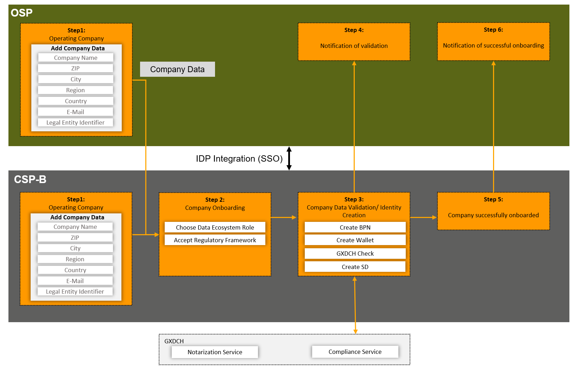
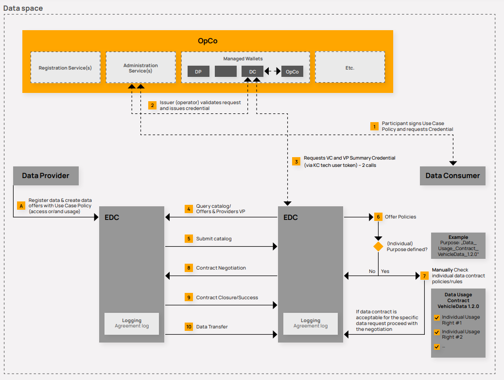

# How: Data Space Operations

This chapter outlines the overarching processes and premises to onboard and exchange
data in the Catena-X data space. This includes the general onboarding process that all
participants must complete to join the Catena-X data space. It involves registration and
technical integration, as well as compliance with the regulatory framework and verification
through the Gaia-X Digital Clearing House. The introduction of Self Sovereign Identities (SSI)
in Tractus-X Release 23.09 updates the process for offering, exchanging, and using data,
while the chapter also covers EDC deployment and usage premises and available support
options for participants.

## General Onboarding

To participate in the data space, all participants must complete the general registration process, which involves registration and can be extended by the technical integration (see Figure [General Onboarding Process](./how-data-space-operations.md#general-onboarding)).

*General Onboarding Process*

During **registration**, all participants must fill out their company data, select their data space role, and agree to the regulatory framework via one of the OSPs (see Chapter [Onboarding Service Provider](./../who-roles-in-the-catena-x-ecosystem/who-roles-in-the-catena-x-ecosystem.md#onboarding-service-provider)). A BPNL (if not yet existing) as well as a Managed Wallet Tenant with BPNL Credential and CX membership Credential are created as part of the registration approval process, which is owned/managed by the operation company. Each participant can collect their identity proofs, certificates and other verifiable information, rights, or services in its identity wallet.

During **technical integration**, the technical user creation and registration of the connectors are essential to enable the company communication with the data space. The technical user enables the customer company to connect the connector with the wallet and the connector registration is needed to ensure that the connector can get found by other data space members.

The self-descriptions of newly registered legal entities and connectors are validated by the GXDCH (see Chapter [Gaia-X Compliance](./how-data-space-operations.md#gaia-x-compliance)). This involves signing and issuing credentials to the identity wallet of a DPC, providing proof of Gaia-X compliance and legal entity notarization. Detailed information about the Standard CX-0006 in the [Standard Library](https://catena-x.net/de/standard-library) of the Catena-X Association.

## Gaia-X Compliance

The Gaia-X Digital Clearing House (GXDCH) is an external service that maximizes trust within the Catena-X data space and interoperability with other data space initiatives based on the Gaia-X Trust Framework. The GXDCH enables the validation of legal entities, ensures Gaia-X compliance, and creates an eIDAS conform digital signature (SelfDescription) for all data space participants. There is one GXDCH provider for the Catena-X data space, which is nominated and managed by the Catena-X Association. To ensure compliance with the Catena-X onboarding process, every OSP must connect to the GXDCH. OSP candidates can request more information during conformity assessment.

## SSI Issuer Concept

The Tractus-X Release 23.09 initiates the introduction of Self Sovereign Identities (SSI), replacing the Dynamic Attribute Provisioning Service (DAPS). The current release and version of SSI allows only one issuer and one centrally managed identity wallet operated by the CSP-B (see Chapter [What: Service Map](./../what-service-map/what-service-map.md)). This also includes the revocation of issued certificates. This is done in cooperation with the Catena-X Association e.g., in case of conscious violation of legal and technical framework. With the 23.09. Release the CSP-B is the single issuer authority of Catena-X credentials. Multi-issuer concept is planned in the following releases. The BPNL can be found on the Catena-X Association website and the portal of the CSP-B. This concept will evolve in future releases, the details of which can be found in Chapter [Further Integration of SSI Technologies](./../outlook/outlook.md#further-integration-of-ssi-technologies).

## Data Exchange based on SSI

With the introduction of Self Sovereign Identities (SSI) in the Tractus-X Release 23.09, the processes to participate in a use case as well as offer, exchange, and use data are updated as follows (see Figure [Data Exchange Process](./how-data-space-operations.md#data-exchange-based-on-ssi)):

*Data Exchange Process*

1. **Participant signs pre-defined use case framework conditions and requests credential via CSP-B**

   The data consumer must sign and upload the respective use case framework conditions to request the use case participation credential.

2. **Issuer validates request and issues credential**

    The request from the participant (e.g., data consumer) is sent to the issuer (operator) for validation (frame version and existing signature) and confirmation, which triggers the creation of the VC.

3. **Requests credential**

    The customer EDC calls the MIW to retrieve the verified summary credentials, requests the signature and retrieves the verified presentation with the summary credential.

4. **Query catalogue/offers**

    With the query of the data provider catalog, the consumer EDC submits the request with the VP in the request header. Upon successful validation, the issuer generates the verified credential using the MIW component and stores it in the wallet tenant of the customer company wallet. is recreated containing both the previous credentials and the newly added credential.

5. **Submit catalog**

    The received offer catalog request and the submitted customer VP are validated by the provider EDC. All data offers where the data access policies set by the provider match the verified credentials owned by the data consumer are sent to the customer. Any data offers that require verified credentials that the data consumer does not have will not be sent/published to the data consumer.

6. **Manual checking of data offering policies**

    Configured data offer policies must be manually checked by the data consumer.
    - If a purpose is specified, the purpose must be validated internally by the data consumer. The purpose may refer to an individual contract concluded between the data consumer and the data provider. The data consumer must review the contract and decide whether the policies are acceptable for the specific data offering based on the established policies (see next step 7).
    - If no purpose is specified, the negotiation can start immediately, as the access and usage policies are automatically technically enforced and validated by the EDCs.

7. **Decision on the purpose of the data offer**

    Based on step 6 individual data contract validation, the data consumer must decide whether to proceed with the negotiation or whether to disagree with the individual purpose. If there is disagreement, the negotiation should not be started. If there is consent, the data consumer can start the negotiation.

8. **Contract negotiation**

    The data consumer starts the contract negotiation by sending a request for an agreement/contract

9. **Contract conclusion/success**

    The EDC of the data provider receives the negotiation requests, validates the access and usage policies of the specific data offer requested by the data provider, and matches it with the VP of the data consumer. If the data consumer has all relevant credentials, the agreement is successfully concluded, and an agreement log is stored in both EDCs.

10. **Data transfer**

    Data transmission/access by the data consumer can take place as long as the contract is active.

## EDC Deployment and Usage Premises

Each data space participant has its own organizational structure, consisting of different legal entities and/or subsidiaries. Depending on the organizational structures, data space participants must consider how to organize the representation of their organization in the Catena-X data space. This includes considerations for setting up connector instances regarding organizational, technical, and legal conditions. The following premises apply:

- The data exchange always takes place between two legal entities, as only their representatives can sign legally binding contracts.
- Legal entities must be registered and known in the data space.
- To represent a legal entity in the data space, an associated business partner number (BPNL) is required.
- The deployment and use of at least one connector (e.g., EDC) per legal entity for data exchange is mandatory.
- The connector negotiates data usage between endpoints (data plane) by synchronizing access and usage policies between data providers and data consumers.
- There is no data processing or reviewing of data within the connector itself.
- Data usage takes place instead at the endpoints of the data providers or data consumers, respectively.
- Data usage with respect to location and assignment to computer instances/platforms is independent of the runtime environment of the connector itself.

There are various options for organizational structures and data exchange scenarios such as “one legal entity and one site in one country”, “one legal entity and multiple sites in one country” or “one legal entity and multiple sites in different countries”. For more details on possible connector usage scenarios, please refer to our [Initial Onboarding Guide](https://catena-x.net/fileadmin/user_upload/Standard-Bibliothek/Update_PDF_Maerz/6_Onboarding/CX_-_0006_Registration_and_Initial_Onboarding_v_1.1.1.pdf). This includes also the different options to obtain a connector, e.g., it can be acquired via an ESP, it can be self-developed or adapted from open-source, or it can be part of a business application from a BAP. If the data exchange does not take place between several legal entities within Catena-X as defined above, no EDC is required. An example would be the connection of the OSP to the GXDCH. For this connection no connector is needed, because this is not an exchange of data between two legal entities within Catena-X.
