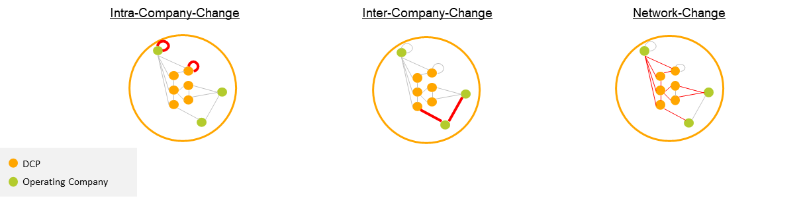
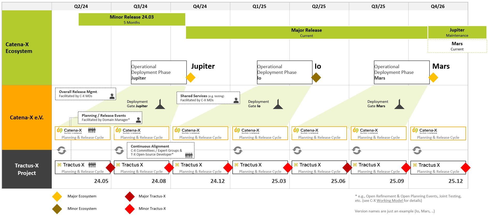

# How: Life Cycle Management

Managing versions and changes of different artifacts in federated data spaces is critical to ensure compatibility, interoperability, and security. The life cycle management of the Catena-X ecosystem is coordinated by the Catena-X Association and includes the releases in the Catena-X Association and in the Eclipse Tractus-X Project (see Figure [Overview Life Cycle Management](./how-life-cycle-management.md)).

Catena-X will provide **one major** and **one minor** ecosystem release per year. This means that each release of Catena-X can contain e.g. standards, normative documents of two quarterly releases of Tractus-X.

Tractus-X will provide quarterly releases including **one major** and **three minor** releases per year. The releases follow calendar versioning (see [CalVer](https://calver.org/)), whereas their artifacts such as feature, reference implementations, and KITs follow semantic versioning (see [SemVer](https://semver.org/)). To ensure backward compatibility in the future, versioning and passing of predefined test cases of each individual artifact is mandatory. Exceptions, e.g. regulatory requirements, have to be approved by the Catena-X Association.

*Overview Life Cycle Management*

The Catena-X Association release includes all binding and certification-relevant artifacts such as standards (e.g., API-specifications, semantic models) and normative documents for all data space participants. The Tractus-X release contains all open-source products (including services or helm charts) of the cxOS and business applications as well as KITs. In addition, there are various commercial or self-developed solutions for business applications and services following individual release cycles and versioning schemes.

Both the Tractus-X release and any commercial or self-developed solutions must adhere to Catena-X standards and other relevant normative documents to get deployed.

Open-source products are required to fulfill the [Tractus-X release guideline(TRGs)](https://eclipse-tractusx.github.io/docs/release/) and take part in the integration tests to be part of a quarterly Tractus-X release. For critical issues (e.g., security issues), hot fixes may be released to fix a bug in the active Catena-X operating system that interrupts the normal release cycle.

## Definition of breaking changes and the impact

Catena-X defines the type of changes and thus also those of breaking changes according to semantic versioning (see [SemVer](https://semver.org/)). There are therefore major, minor and patch changes. As shown in the figure above, there are major changes at a maximum once a year. Minor changes or patches can be introduced independently of this. These can be independent improvements or changes. However, every change must be compatible with the applicable standards.

### Impact of changes on the Catena-X network

In addition to the differentiation of changes into major, minor and patch described above, there are three different categories of major (breaking) changes. The examples mentioned can fall into this category. Depending on the changes, the component in the example may also fall into a different category:

**Intra-Company**
These are changes that only have effects and dependencies within a company. This means that there are no dependencies on third parties and the upgrade can be planned exclusively internally. An example of such a component is SD-Factory, BPN-Issuer.

**Inter-Company**
These are changes that only have an effect on certain partners. An upgrade must therefore be agreed between the partner(s). The number of partners is limited and a joint approach must then be agreed upon. An example of such a component is the: GXDCH for the CSP-B.

**Network**
These changes have an impact on all participants of the Catena-X network. The objective is to abstract these as coordination between all participants is not possible. One possibility of abstraction is that one component supports several versions. An example of such a component is: EDC

*Differences from major (breaking) changes*

## Release Management

There are two main channels in the Catena-X ecosystem that develop artifacts - Catena-X Association and Tractus-X. The Catena-X Association coordinates the releases for both and ensures compatibility. Moreover, through dedicated release management, the Catena-X Association also carefully evaluates any modifications to the productive network and provides all network participants time to adapt to any changes performed.

As can be seen in the figure, in addition to the Tractus-X level, which releases quarterly features, reference implementations and KITs, there is the Catena-X Association, which publishes various governance documents such as the semantic models or the standards, as well as the ecosystem. This reflects all participants of the productive Catena-X network.

*Release schedule*

A major release may contain critical breaking changes that have a major impact on data space participants, such as changes to enablement services. A minor release contains backward compatible functionality. In addition, patch versions provide backward compatible bug and security fixes. The Tractus-X project has an overarching qualification process that all official quarterly Tractus-X releases adhere to. This process applies E2E activities for testing and security (relevant release candidates in compound) that stakeholders can build on. Each component can be released on demand on a higher cadence.

The Catena-X data space aims to support a parallel
phase of two major versions (each valid for a minimum of 12 months):

1. Current
2. Maintenance

There is a dedicated date, when the current version of Catena-X and Tractus-X gets in maintenance mode. After that, the maintenance version will be available for at least 12 months to ensure a smooth upgrade process for all participants of the Catena-X data space. This means that both major version are supported, i.e. get required security fixes and bug fixes without migration to the next higher major version. A deployed major version is supported for a minimum of two years. But it can be in release state for a much longer period, only the maintenance timeframe has to be at least 12 months.

All participants doing changes that are network-breaking or inter-company have to ensure one of the following variants to allow a smooth upgrade process:

1. Running two major versions with the same technical component
2. Running a technical component for each major version, with data migration in between to have the data available in both components

If the change only affects the component itself (run by one company, i.e. intra-company change), then the company only needs to run one version. It is handled within the company.

This approach enables each participant to organize the upgrade on its own, because the surrounding technical component supports the current and maintenance valid version.

### Schedule

As can be seen in the illustration (see Figure [Major Version Release](./how-life-cycle-management.md#release-management)), there is Tractus-X at the lowest level, which has a release cycle of 3 months and therefore generates 4 releases per year. At the middle level is the Catena-X association which defines the scope for each major and minor release (only the scope of the major release is shown in the figure). This scope is defined together with the various other technical committees and expert groups. This scope then contains the various artifacts of the association, as well as a reference to the corresponding Tractus-X version of the reference implementations.

Major changes are always introduced by the Catena-X Association scope and are part of the releases presented. The minor release, which always takes place at the earliest 6 months after the major release, contains minor changes to the Catena-X Association artifacts. Other minor changes from other parties are possible at any time, as they are by definition compatible with the previous version. Patches can be introduced by any party at any time, as they must also be compatible with the previous version.

#### Phases

The development process in Catena-X is based on three phases:

1. Planning phase: Tractus-X and Catena-X are planning together.
2. Development phase: During this phase Catena-X and Tractus-X will develop reference implementations and standards covering the developed software.
3. Deployment phase: After development, the components will be deployed to the productive network.

Following the quarterly development cycle of Tractus-X, the development takes one quarter and succeeds the planning phase. The deployment phase to the network will also take maximum one quarter, but happens at most two times a year, including one minor and one major release of an official ecosystem release.

#### Release Governance

The Release Governance is carried out by the Catena-X Association and ensures compatibility, stability and overall reliability of the ecosystem by following a set amount of principles, e.g. architecture guidelines. For this purpose, the Catena-X Association installs a committee, comprised of representatives from relevant stakeholder groups.

The following milestones are instrumental and constitute the official funnel for deploying ecosystem releases:

1. **Development Gate** *after* planning phase: The development gate criteria are defined by the Catena-X Association, e.g. architecture guidelines, standards, etc. Additionally, the impact of the changes has to be assessed and all network breaking changes require an explicit decision to be included in an official Catena-X development cycle. Moreover, *during* development phase, the Catena-X Association resolves to solve issues regarding compatibility and release management, i.e. communication between components.
2. **Deployment Gate** *after* development phase: After the development phase has concluded, the Catena-X Association formally approves an ecosystem release comprised of a set of coherent standards, normative documents and guidance regarding complementary Tractus-X products and reference implementations. The deployment gate initiates the deployment phase.

The participants of the development and deployment gate decide about acceptance or rejection of features and deployments. Participation works by representatives of specific roles.

### Patches

The release schedule does not cover patches. The schedule defines such long timeframes between minor and major versions that it can be problematic to fix bugs or security issues. Therefore bugs shall be fixed independently of the release schedule, i.e. if a bugfix is required, it shall be done. A bug is a problem that is not changing the behavior, i.e. the behavior according to the standard is not changed.

Security patches are different, because to fix a bug, it is required to change the behavior, but the security issue makes it mandatory to patch the release. The decision, when a patch can be deployed, is with the participants of the deployment gate. Additionally, there is a dependency to the standard, because the security issue could already be initiated by the standard itself. This would not only require a patch, but at least a note in the standard.

### Environments

Closely connected with the release schedule, there is also the landscape of environments to run the network. The guidelines for releases, patches apply for operating companies, namely CSP-A and CSP-B.

To validate the upcoming releases, the association provides an INT environment for multiple aspects:

| Aspect | INT Environment |
| ------ | --------------- |
| Primary Purpose | End-to-End Integration Testing, System-level tests |
| Release Version | Upcoming Tractus-X Release |
| Test Types Supported | Functional Tests, End-to-End Integration Tests, User Journey Tests |
| Data | Synthetic test data (structurally realistic) of onboarded test companies |
| Participants | Product team devs (committers, leads) and testers, Catena-X test management |
| System Components |Tractus-X Core and Enablement Services (Connected to External Shared Services) and Open Source Applications (FOSS) |
| Access Control | Controlled (open to Tractus-X community / Catena-X members for continous testing during release cycles) |
| Update Frequency | Minimum once per testing cycle, usually multiple release candidates |

## Backwards compatibility

Compatibility between the releases is one of the cornerstones of a stable network. There are major versions with potential breaking changes, but such changes have to work with the grace period of the maintenance version in mind. This means that the evolution is ensured by following the approach of two versions available at the same time.

As described in [Release governance](./how-life-cycle-management.md#release-governance), there are not only architecture guidelines to define the compatibility, but there is a governance body to check the fulfillment of the guidelines of each version.
