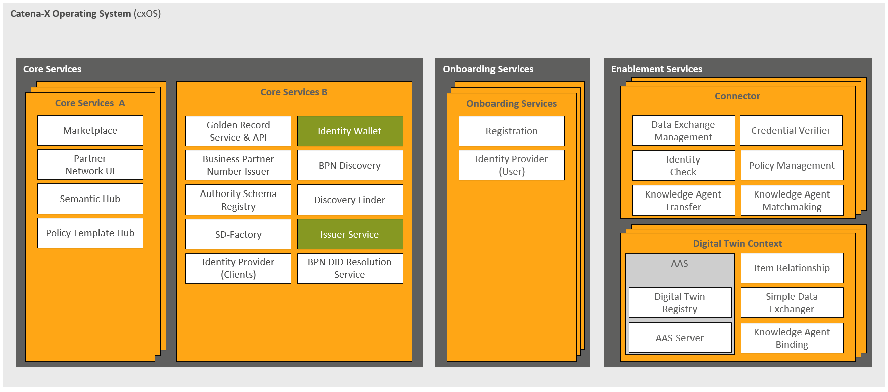

# Outlook

The Catena-X Operating Model is a normative document within the regulatory framework, which is binding for all participants in the Catena-X data space. It describes the status of our data space artifacts, including roles, services, and processes along with their respective roadmaps. As Catena-X is an ongoing journey, all of these artifacts will continuously evolve to promote broader adoption and scalability, ensuring maximum interoperability, and (data) sovereignty.

## Increase Decentralization of Core Services

Catena-X follows a business-oriented decentralization approach that aims to achieve interoperability and data sovereignty while balancing manageability of complexity, and technical maturity. Therefore, Core Services B will gradually transition into onboarding services, Core Services A or Enablement Services, if appropriate. In the figure, the various services that are currently planned to be decentralized in the long term are marked in green. Please find below the outlook for the upcoming decentralization of Core Services B (see Figure [Outlook for further Decentralization](./outlook.md#increase-decentralization-of-core-services)).

  
*Outlook for further Decentralization*

## Further Integration of Self-Sovereign Identity

Over the upcoming releases, Catena-X's SSI concept will be significantly adapted to enable a large class of use cases and promote interoperability with other dataspaces.
In the current setup, the CSP provides a wallet for participants and issues their verifiable credentials.
This will gradually give way to a modular and flexible approach, where participants can use their own wallet in the dataspace, entities can issue, present, and verify credentials regardless of their role, and an increasing level of interoperability with the outside world is given.
Future iterations of the SSI-related standards will work towards interoperability across dataspaces and integration of overarching standards.

## Data Space Interoperability

The Catena-X Association is committed to promote and engage in various initiatives that focus on creating common guidelines and standards to ensure interoperability with other data space initiatives. Initiatives such as the Data Space Support Centre (DSSC) and Manufacturing-X will help establish an interoperable data space across different industry sectors. Furthermore, the Catena-X Association will drive technical initiatives, such as the Eclipse Tractus-X project and the Eclipse Dataspace Working Group (EDWG), which aim to align a common technical foundation, certification procedures and test/ security requirements.

## Backward Compatibility

The vision of the Catena-X data space is to provide seamless data access and creation of data chains across multi-tier value chains. Initially, the data space can be operated and evolved by deployment of dedicated, synchronized releases (see Chapter [How: Data Space Governance](./../how-data-space-governance/how-data-space-governance.md)). While initially, dedicated, synchronized releases (see Chapter [How: Data Space Governance](./../how-data-space-governance/how-data-space-governance.md)) may suffice, our goal of involving thousands of partners makes it impossible to maintain the same technical components across the board. To overcome this challenge, we must ensure that the release and upgrade of dedicated components can be executed independently, without causing disruptions in the network connectivity and data chains.

To achieve this in areas such as APIs, semantic models, and procedural specifications, the Catena-X Association promotes and supports adherence to the following principles:

- **Continuous revising of standards** to ensure compatibility between different versions and releases.
- **Developing technical specifications** and **reference implementations** in Eclipse Tractus-X that follow the required standards to lay the technical foundation.
- **Coordinating** closely with different **operators** to execute rollout and implementation of the different versions and releases.

## Enforcement of compliance with normative documents

The Catena-X data space will grow in participants and complexity. Consequently, ensuring compliance of all participants with established rules, regulations, and standards becomes increasingly relevant.

As outlined in the main chapter, we are currently laying the foundational elements to be utilized later in the various processes still being developed for productive operations. This development of multiple processes is iterative and will be published in a forthcoming operating model. In addition to the general process that needs to be developed, the association is also investigating the possibility of imposing other consequences such as fines in the event of non-compliance.
