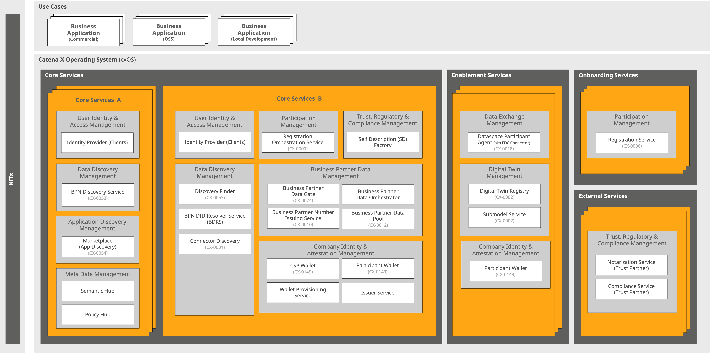

# What: Service Map

The architecture of the Catena-X Operating System (cxOS) is derived from the reference architectures of the International Data Spaces Association (IDSA) and Gaia-X. The cxOS consists of three areas: Core, Onboarding, and Enablement Services shown in Figure [Service Map](./what-service-map.md).

  
*Service Map (Deployment View)*

The operating system (cxOS) is the technical foundation, enabling business use cases to operate in a network-enabled manner across company boundaries. The cxOS offers various capabilities:

## Enablement Services

The Enablement Services are a bundle of decentral services that enable participation in the Catena-X dataspace, operated by [Enablement Service Providers](./../who-roles-in-the-catena-x-ecosystem/who-roles-in-the-catena-x-ecosystem.md#enablement-service-provider). Each participant must deploy and use the enablement services to connect to the dataspace and enable standardized interactions, based on the requirements of the respective use case. They ensure the strategic value proposition of technical/semantic interoperability and (data) sovereignty.

The connector (e.g., EDC), based on the Data Space Protocol, and the wallet, form the mandatory basis of enablement services enabling standardized technical connectivity and sovereign data exchange. All participants can use them to establish a basic connection to the dataspace, independent of the business use case.

In addition to generic data exchange capabilities, enabling services include context-specific service offerings. Examples are the Asset Administration Shell (AAS) as a harmonized access layer for digital twins, the Decentral Digital Twin Registry (DDTR) for local discoverability of digital twins in decentral organized dataspaces or the Item Relationship Service (IRS) for building data chains and iterating through a tree structure of digital twins.

Please note that there are various options for running enablement services, ranging from leveraging software-as-a-service solutions to local deployments of open-source reference implementations. Further information on deployment and usage premises can be found in Chapter [EDC Deployment and Usage Premises](./../how-data-space-operations/how-data-space-operations.md#edc-deployment-and-usage-premises).

### Dataspace Participant Agent

The Dataspace Participant Agent is the component that enables sovereign data exchange between two Dataspace Participants. It implements the Dataspace Protocol as a mechanism to build up a trusted connection between a [Data Provider and a Data Consumer](./../who-roles-in-the-catena-x-ecosystem/who-roles-in-the-catena-x-ecosystem.md#data-providerconsumer), based on the IDSA dataspace principles.

In addition, the agent supports a range of data transfer mechanisms that can be used to transport data from the provider to the consumer using different storage and transport mechanisms. Each [Dataspace Provider or Consumer](./../who-roles-in-the-catena-x-ecosystem/who-roles-in-the-catena-x-ecosystem.md#data-providerconsumer) has to participate in the dataspace using a Dataspace Participant Agent that supports the provider or consumer role according to the Dataspace Protocol. The service as such is operated by an Enablement Service Provider.

### Digital Twin Registry

The Digital Twin Registry (DTR) acts as an address book for Digital Twins. [Data Providers](./../who-roles-in-the-catena-x-ecosystem/who-roles-in-the-catena-x-ecosystem.md#data-providerconsumer) register their Digital Twins in a Digital Twin Registry. [Data Consumers](./../who-roles-in-the-catena-x-ecosystem/who-roles-in-the-catena-x-ecosystem.md#data-providerconsumer) query a Digital Twin Registry to find Digital Twins and interact with them. The Digital Twin Registry is deployed as a decentralized component. That means that every Data Provider runs its own Digital Twin Registry.

### Submodel Service

An AAS Submodel Service is a key component in the implementation of the Asset Administration Shell (AAS), which is a core concept in the Industry 4.0 framework. The specification of the AAS is driven by the Industrial Digital Twin Association (IDTA). It hosts and exposes one or more Submodels. It enables access to those Submodels via standardized APIs—usually HTTP/REST with JSON or AASX.

### Participant Wallet

See [Core Services - Participant Wallet](#participant-wallet-1).

## Core Services

In contrast to Enablement Services, Core Services are provided and operated by Core Service Providers A/B. Core services provide common accessibility and discoverability functionalities for dataspace participants. Examples include BPN issuer for maintaining business partner numbers, and participant information, IAM solutions for identity and access management, and discovery services to localize the address of assets in decentral organized registries across the dataspace. The Core Services can be divided into two areas:

### Core Services A

Core Services A lists Core Services that **can** be operated "n" times in the Catena-X dataspace by an [CSP-A](./../who-roles-in-the-catena-x-ecosystem/who-roles-in-the-catena-x-ecosystem.md#core-service-provider-a).

#### Identity Provider (Clients)

The Identity Provider (Clients) is a legacy component that is required for authentication of participant services during the access of some core services using a standard OAuth2 client id/secret.
It will become obsolete after all core services have adopted the SSI access pattern for authenticating such accesses.

#### BPN Discovery Service

Lookup BPNs by specific asset IDs like (Serial Number, OEN, VIN, Material Number). The BPN Discovery is a helper service which allows a use case to retrieve the BPN by other criteria (like OEM, VIN, etc.). Dataspace participants frequently register mappings from certain criteria to their BPN in the discovery service to make them retrievable.

The standard defines the BPN Discovery Service as a service which can be offered by multiple parties.

#### Marketplace

The marketplace is a core component to support application discovery for Catena-X. In the marketplace, participants can discover compatible applications for a given business problem, provided by different application providers.

#### Semantic Hub

The Semantic Hub is a core component of Catena-X that functions as a knowledge hub for aspect models released in the dataspace. It stores all standardized Catena‑X aspect models. These models describe the semantics (meaning and structure) of data elements used in the network.

#### Policy Hub

The policy Hub is created to enable data providers, consumers as well as app provider to obtain, via a single-point-of-truth, a statement of the current CX existing policies, their attributes as well as the policy key and structure.

### Core Services B

Core Services B lists Core Services that can only be operated once in the Catena-X dataspace due to business reasons or technical limitations. A [CSP-B](./../who-roles-in-the-catena-x-ecosystem/who-roles-in-the-catena-x-ecosystem.md#core-service-provider-b) **must** deploy, operate, and maintain all Core Services B.

#### Identity Provider (Clients)

The Identity Provider (Clients) is a legacy component that is required for authentication of participant services during the access of some core services using a standard OAuth2 client id/secret.
It will become obsolete after all core services have adopted the SSI access pattern for authenticating such accesses.

#### Registration Orchestration Service

The Registration Orchestration Service automates the orchestration of various steps in the onboarding process, such as BPN creation, wallet provisioning, or Gaia-X compliance checks.

#### SD Factory

During onboarding, the Self-Description (SD) Factory is responsible for transforming company data into the format required by the Gaia-X Clearing House.
It acts as a mapping layer between the Portal Backend and the Gaia-X Digital Clearing House.

#### Discovery Finder

Participants may not know the BPN of a party they want to interact with. Discovery may be needed by other attributes provided by other discovery services. The Discovery Finder is supposed to provide endpoints of different discovery services that may be provided by different companies - such as the BPN Discovery Service.

#### BPN DID Resolution Service

The BPN DID Resolution Service (BDRS) provides a directory of Business Partner Numbers (BPN) and their associated DIDs. The directory is used by Dataspace Participant Agents to resolve a DID for a BPN. It has been developed with the introduction of the Decentralized Claims Protocol (DCP) based approach for credential validation.

#### Connector Discovery Service

To communicate between dataspace participants, the respective Dataspace Participant Agent (aka connector) of a participant needs to be known. The Connector Discovery Service is a public available endpoint which is used to retrieve Dataspace Participant Agent Endpoints (fka EDC endpoints) for a set of given Business Partner Numbers.

The data for the discovery service is provided by the registration need for Dataspace Participant Agents, as defined in the CX-0001 in order to create a Gaia-X Self-Description. Therefore, the data is only available at the Core Service-B Provider.

#### Business Partner Data Gate

The Business Partner Data Gate is a core service with a standardized API used within dataspaces to exchange business partner data. It allows Dataspace Participants to provide their own company data, as well as the business partner data of their suppliers and customers (legal entities, sites, addresses) and consume validated and enriched Golden Records from the Business Partner Data Pool with the Business Partner Number as a unique identifier. A staging area separates inputs from outputs, with status, error and change logs so that Dataspace Participants can keep track of status and changes. Dataspace Participants retain data sovereignty by providing their business partner data to their own dedicated Business Partner Data Gate while benefiting from the Data Curation and Enrichment Services and the shared business partner data of other Dataspace Participants. The result is cleaner and more interoperable business partner data, which forms the basis for identification of the Dataspace Participants, invitation management and the general data exchange in a dataspace.

#### Business Partner Data Orchestrator

The Business Partner Data Orchestrator is a core service that supports the coordination of the data flow between the dedicated Business Partner Data Gates of the Dataspace Participants, the Buiness Partner Data Pool and the Data Curation and Enrichment Services. It also manages the different statuses that a business partner data record can have during the Golden Record process. One key aspect of the Business Partner Data Orchestrator is to maintain the anonymity of each Dataspace Participant towards the Data Curation and Enrichment Services and the Business Partner Data Pool, so that direct competitive advantages are not lost and antitrust regulations are not violated regarding the sharing of business partner data.

#### Business Partner Number Issuing Service

The Business Partner Number Issuing Service is a core service that issues and assigns the globally unique, stable and interoperable Business Partner Number (BPN) to all organizations and organization parts (legal entities, sites and addresses) of the supply chain, with or about which data is exchanged in the dataspace. The Business Partner Number for legal entities (BPNL) additionally is the one and only legally secure identifier for the Dataspace Participants, required to conclude legally binding data exchange contracts.

Note that the Business Partner Number Issuing Service is currently not a separately deployable service, but a part of the Business Partner Data Pool.

#### Business Partner Data Pool

The Business Partner Data Pool is a core service with a standardized API used within dataspaces to provide a centralized repository for business partner data (Golden Records) as a single source of truth, enabling Dataspace Participants to access them for a legally secure identification of other Dataspace Participants, invitation management and the general data exchange in a dataspace. Each Golden Record (legal entities, sites and addresses) in the Business Partner Data Pool has the Business Partner Number as a unique identifier.

#### CSP Wallet

A wallet is a service for storing, managing, presenting, verifying, and issuing Verifiable Credentials (VCs).
CSP Wallet and Participant Wallet are instances of the same service but currently used in very different ways.

The CSP wallet is used by the CSP to issue Membership VCs, BPN VCs, and Framework Agreement VCs to a participant after onboarding, attesting that the participant is a member of the Catena-X dataspace and that a given BPN refers to the participant.
In future releases, this will be extended to issuing use-case specific VCs.

#### Participant Wallet

A wallet is a service for storing, managing, presenting, verifying, and issuing Verifiable Credentials (VCs).
CSP Wallet and Participant Wallet are instances of the same service but currently used in very different ways.

A participant uses their wallet for storing their Membership VC, BPN VC, and Framework Agreement VC and for presenting them to another participant during a data exchange.
A participant may either join the Catena-X dataspace without a wallet and be provided with a custodial wallet (Core Service B) during onboarding, or a participant may join the dataspace already in possession of a Catena-X compliant wallet (Enablement Service).

#### Wallet Provisioning Service

When a participant is not yet in possession of a Catena-X compliant wallet when joining the Catena-X dataspace, they will be provided with a participant wallet.
The Wallet Provisioning Service is responsible for the creation and management of these custodial wallets.

#### Issuer Service

The Issuer Service serves as a central point for credential handling, including creation, revocation, and expiration management. No user interface, the UI is implemented as part of the portal. The service interacts with the CSP Wallet, which provides the actual credential issuance by the CSP and the Participant Wallet, which stores the issued credential(s) on behalf of the participant.

## Onboarding Services

Onboarding Services are provided and operated by [Onboarding Service Providers (OSPs)](./../who-roles-in-the-catena-x-ecosystem/who-roles-in-the-catena-x-ecosystem.md#onboarding-service-provider). They support participants in joining the Catena-X dataspace.
These services define and deliver the standardized processes (e.g., registration) required to ensure a consistent, compliant, and reliable onboarding experience within Catena-X.

### Registration Service

The Registration Service enables prospective participants to be registered within Catena-X by submitting their organizational data through an [Onboarding Service Provider (OSP)](./../who-roles-in-the-catena-x-ecosystem/who-roles-in-the-catena-x-ecosystem.md#onboarding-service-provider). The [OSP](./../who-roles-in-the-catena-x-ecosystem/who-roles-in-the-catena-x-ecosystem.md#onboarding-service-provider) guides applicants through the onboarding workflow, while the [Core Service Provider (CSP-B)](./../who-roles-in-the-catena-x-ecosystem/who-roles-in-the-catena-x-ecosystem.md#core-service-provider-b) validates the submitted information and ensures compliance with Catena-X standards. In addition to initiating registrations, the service also provides status information throughout the onboarding process. It is made available as an API by the [CSP-B](./../who-roles-in-the-catena-x-ecosystem/who-roles-in-the-catena-x-ecosystem.md#core-service-provider-b), allowing OSPs to securely transmit and track registration data.

## External Services

Trust Partners list the services that [CSP-B](./../who-roles-in-the-catena-x-ecosystem/who-roles-in-the-catena-x-ecosystem.md#core-service-provider-b) must integrate and use to implement a trusted onboarding process but are developed and operated by an external initiative or provider.

### Notarization Service

The notarization service is a basic service ensuring that no one moves around an ecosystem like Gaia-X with a false or stolen company identity. To do this, the service checks their validity (e.g. using the commercial register number) and issues corresponding verifiable credentials.

### Compliance Service

This basic component checks compliance against the different levels of Gaia-X criteria. It validates the Verifiable Presentations (VP) submitted by participants and issues a Gaia-X Verifiable Credential (VC) if the check is positive.
Explanation: A Verifiable Credential is a digital proof that verifies the identity or qualifications of a person or organisation. VCs use cryptographic mechanisms to ensure that the information they contain is authentic and tamper-proof. They are comparable to digital passports that confirm certain information securely and unalterably.
A verifiable presentation is a structured representation of one or more verifiable credentials. It enables VC to be linked and selected information to be presented as required without disclosing all the data it contains.

## Use Cases

The goal of a Catena-X use case is to solve a specific business problem and to create value for data providers and consumers. To do this, the Catena-X Association demands and promotes that use cases create Standards and KITs to enable a multi-vendor ecosystem of interoperable and compatible business applications. Achieving network effects in the Catena-X ecosystem is critical to success and depends on the active participation of users and the creation of appealing business apps, especially for SMEs.

## Business Partner Data Management vs. Golden Record vs. Value Added Services (Business Apps)

**Business Partner Data Management** refers to the whole Catena-X use case. This use case addresses high data retention costs by creating a "Golden Record" with a unique Business Partner Number (BPN) to harmonize, improve, and manage business partner data efficiently, reducing maintenance and validation expenses and supporting decentralized identity management on a company-level

**Golden Record Process (cleansing)** describes the cleansing of the data in the Golden Record. This ensures that the data is unique and correct. This creates a high-quality record in the network by identifying business partners through Legal Entity, Legal Address, and Site, ensuring data accuracy and consistency

**Value Added Services (VAS)** always require access to the data generated by the Golden Record process, which is part of the BPDM use case. This means VAS always relies on BPDM data. These services therefore require a deep integration into BPDM - thus the pure use of the BPN-L, BPN-S, and BPN-A is excluded to qualify for a VAS, e.g. the use case Traceability utilizes the BPNL but is not a VAS.

## KITs - Keep It Together

KIT, short for Keep It Together, bundles all necessary resources and technical documentation designed to adopt a Catena-X use case for all Dataspace Participants (see Figure [KITs Toolbox](./what-service-map.md#kits---keep-it-together)).

A KIT is always structured in the same way and supports the individual journey of a company joining the Catena-X dataspace. To ensure interoperability and data sovereignty in Catena-X use cases, adherence to a minimum set of elements is required, including semantic models for data integration and understanding, logic and schemas for value calculation, API implementation for technical communication, and access and usage policies to maintain data sovereignty. A KIT consists of various other artifacts in addition to the minimum set. A comprehensive overview of the artefacts can be found on the [Tractus-X project website](https://eclipse-tractusx.github.io/).

*KITs Toolbox*

DPCs that are part of the automotive value chain and strive to participate in a Catena-X use case require technical support, specifications, and tutorials. For instance, a production company may need to exchange product carbon footprint data with its partners. KITs consolidate the necessary software components, standards, access and usage policies, and code examples, ensuring these companies have everything required to successfully participate in a Catena-X use case.

BAPs interested in offering a business application for a specific use case on one of the Catena-X marketplaces. These companies need to align their existing solutions with Catena-X requirements. Within a KIT, they receive guidelines and the technical support necessary for adapting their solutions to meet Catena-X conformity based on our five steps to Catena-X: Inform, connect, boost, adapt, utilize. KITs are the way forward to create a valuable multi-vendor ecosystem to promote seamless interoperability between different commercial solutions.

### Industry Core

The Industry Core is an integrative layer between the industry-agnostic dataspace foundation and the use cases supported by the KITs of Catena-X (see [Industry Core KIT](https://eclipse-tractusx.github.io/docs-kits/category/industry-core-kit)). It facilitates the seamless integration of multiple use cases and related applications by leveraging common components and standards, particularly in terms of data provisioning for digital twins.

Specifically, the industry core ensures that applications within the automotive industry can access shared functionalities, including shared semantic models, Asset Administration Shell (AAS) and Digital Twin Registry (DTR) configurations for linking digital twins of components and vehicles, as well as guidelines for setting up required network services (e.g. EDC). Other use cases (e.g., product passport) can use the digital twins in business applications with use case specific business logic and extended semantic models.

The industry-agnostic dataspace foundation includes general dataspace services (e.g., EDC, Wallet, Digital Twin Registry), some of which are defined and developed by other dataspace initiatives (e.g., Gaia-X, IDSA, Eclipse Dataspace Working Group).

Benefits of the industry core include the:

- re-usability of semantic models of digital twins via defining archetypes of serialized parts manufacturing
- seamless integration of multiple use cases and related applications by leveraging common components and standards, particularly in terms of data provisioning for digital twins
- efficiency and interoperability across different use cases

### Knowledge Agent

The Knowledge Agent facilitates efficient and secure data exchange using the SPARQL protocol and the EDC. It standardizes data from various sources into unified formats and manages complex dependencies to ensure seamless communication and data retrieval. Semantic knowledge graphs enhance the understanding and accessibility of complex data structures.

## New Use Cases and Direct Collaboration

In addition to the first 10 use cases that were initially developed in the Catena-X Consortium and are now governed by the Association Committees (e.g., Sustainability Committee), dataspace participants have the following scenarios for collaboration:

### Initiate a new use case

Any Catena-X Association member can initiate a new use case by creating a working group in the Catena-X Association or expanding an existing committee (whatever suits the purpose best, the final judgment is made by the Board of the Association). The goal of a committee or working group is to discuss and define a common vision, roadmap, standards, KITs, and other open-source artifacts for the use cases with a focus on interoperability and data sovereignty to create multi-tier value chains for a dedicated business process.

To validate the value proposition or technical specifications, a new use case can be tested in the future either in a sandbox environment of the CSP-B or in the test environments of the Catena-X Association. Note that new use cases without standards provide only limited interoperability, require individual use case policies, and cannot be certified and thus not be listed on one of the marketplaces and are therefore not supported and trusted.

### Individual collaboration (no multi-tier approach)

The Catena-X dataspace also enables secure and sovereign data exchange for individual collaboration between DPCs. In this scenario, the DPCs are responsible for defining a bilateral semantic model, as well as appropriate usage and access policies. Alternatively, they can make use of existing usage and access policies that meets their needs. The goal of the Catena-X dataspace remains to always create interoperable use cases with stable and consistent multi-tier data chains. Note that individual collaboration without standards provides only limited interoperability and cannot be certified and thus not be listed on one of the marketplaces.

### Sandboxes

**Catena-X Sandboxes** contain all cxOS services required for the operation of a minimum valuable Catena-X dataspace, namely:

- CSP-B services (excluding the cleansing service of the Golden Record Service and GXDCH integration)
- OSP services

The exclusions do not prohibit the offering or integration of the Golden Record Service, but it is not required for the operation of a sandbox. The cleansing service of the Golden Record Service is not a mandatory services as this is only required for the testing of special use cases - the majority can also be tested without a cleansing service the Golden Record Service. This also makes it possible to provide a cost-effective offer, as no additional costs are incurred. The GXDCH is only relevant for the productive dataspace and is therefore only available to the CSP-B. Therefore, there can be no integration with the sandbox provider here. As the Self-Descriptions (SDs) are not required for testing the use cases there is no limitation.

As shown in the [role description](./../who-roles-in-the-catena-x-ecosystem/who-roles-in-the-catena-x-ecosystem.md#sandbox-provider) of the SP, the SP itself and the participants in the sandbox must be onboarded into the productive Catena-X dataspace via an OSP or CSP-B - see [onboarding](./../how-data-space-operations/how-data-space-operations.md#onboarding-process). The BPNs issued by the CSP-B do not have to be re-used in the sandbox, so no technical integration between the SP and the CSP-B has to take place.

The Catena-X Sandbox shall not be confused with a development or testing environment for Business Application Providers. On the one hand, Catena-X Sandboxes serve the purpose of offering a **Proof of Concept (POC) environment**, both for future Catena-X releases as well as for interested parties to test and explore the Catena-X network and its solutions or business applications (offered in the Catena-X marketplace) before migrating to the productive operating environment. On the other hand, they will provide the foundation for more automated **Catena-X conformity assessment** in the future. Catena-X Sandboxes themselves require certification and are distinctly recognizable by an official Catena-X label.

Catena-X Sandboxes must visibly distinguish their services from the productive Catena-X operating environment provided by the official CSP-B (e.g. through a disclaimer to its users) in combination with advertising a clear path into the productive Catena-X operating environment for any user that intends to join the Catena-X dataspace.

Given that the brand of Catena-X draws much of its value from trust, any Catena-X Sandbox user is required to formally onboard onto Catena-X via an OSP and accept the general terms and conditions of the Catena-X dataspace (10 golden rules, data exchange governance...) before onboarding onto a Catena-X Sandbox.

The following conditions apply to any Catena-X Sandbox:

- Catena-X Release: any officially supported Catena-X Release
- Data: limited to test data
- Apps & Solutions offered:  Catena-X certified, if  standardized Catena-X services are offered; Non-certified if no Catena-X standards exist (see *Direct collaboration (no multi-tier approach*))
- Users: registered Catena-X dataspace participants only
