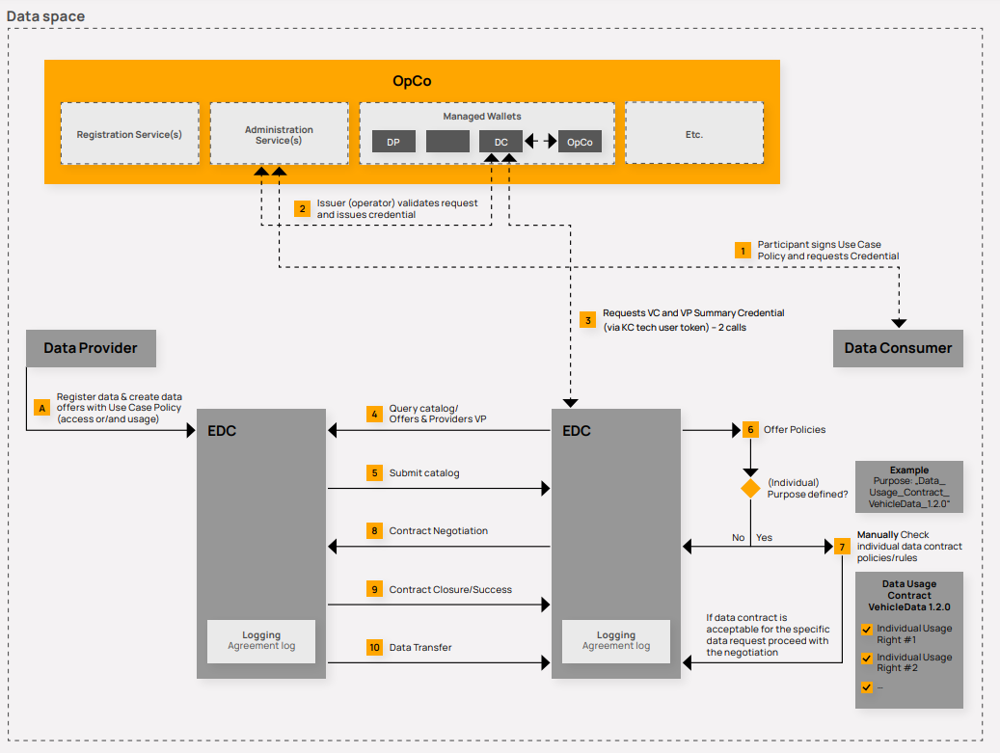

## CATENA X: HOW TO CONCLUDE DATA EXCHANGE CONTRACTS

- 19 MARCH 2024
- VERSION 1.1
- PDF-Version: [How_To_Conclude_Data_Exchange_Contracts.pdf](./assets/How_To_Conclude_Data_Exchange_Contracts.pdf)

### 1. REGISTRATION, CONNECTOR TECHNOLOGY AND USE CASE FRAMEWORKS

#### 1.1 Objective

The Catena-X Data Space ("**CX Data Space**") enables Data Providers ("**DP**") and Data Consumers ("**D**C") to conclude data exchange contracts via the eclipse data space connector or another registered connector ("**RC Process**"). The document is intended to educate (prospective) Participants and help them to align their internal organisational processes.

#### 1.2 Registration Process

Each participating entity ("**Participant**") must register and accept the Governance Framework of the CX Data Space. Cofinity-X GmbH as the provider of the Core Services B ("**OpCo**") manages the registration process. The OpCo assigns each Participant with a unique business partner number (**"BPN-L**").

#### 1.3 Registered Connector as a means to effect data exchange contracts

Each Participant with a BPN-L has at least one dedicated registered connector ("**RC**"), either self-managed or hosted. The RC facilitates the conclusion of data exchange contracts and the subsequent exchange of data. Where the DP allows a DC to share data with its affiliates, those affiliates do not need an own RC.

#### 1.4 Predefined Use Case Frameworks

Catena-X Automotive Network e.V. ("**Association**") has developed predefined framework terms ("**Predefined Use Case Framework**") for particular use cases ("**Use Case**"). Those terms set the indispensable minimum to participate in and achieve the goals of the relevant Use Case. Beyond that, DP and DC enjoy freedom of contract. Before participating in a Use Case, each Participant must separately agree to the Predefined Use Case Framework by way of registration with the OpCo. In return, each Participant will receive a credential ("**Use Case Participation Credential**").

#### 1.5 Bilateral contracts outside of Catena-X

Data providers & data consumer have the option of concluding bilateral contracts (supplier contract, ...) within the confines of Predefined Use Case Frameworks that clarify additional terms that the two parties want to specify. These bilateral contracts should be referenced in the policies used with the RC. Moreover, when using Catena-X to exchange data outside a given Use Case and thus Predefined Use Case Framework, bilateral contracts outside of Catena-X are strongly recommended.

Illustration 1: RC Process with the example of an Eclipse Data Space Connector (EDC). Source: [Catena-X Operating Model](./../../operating-model/why-introduction/)

### 2. EXECUTIVE SUMMARY: CONCLUDING AND PERFORMING DATA EXCHANGE CONTRACTS VIA REGISTERED CONNECTORS

DP and DC conclude a data exchange contract under a Predefined Use Case at the point that the DP's RC has delivered the DP's statement of acceptance to the DC in respect of a specific data set preconfigured by the DP.

To that end, the DP specifies the data set it is prepared to exchange with one or several DC, by referencing a Predefined Use Case Framework, specifying certain Access Policies under the Use Case and related usage policies (including who may view which data set and engage with the DP's RC) as well as related legal terms. A permitted DC can view and evaluate the data set under the related Access Policies after the DP has checked the DC's Use Case Participation Credential.

The DC makes a legally binding offer ("**Offer**") to the DP by referencing the data set (Step 8). Subsequently, the DP accepts the DC's Offer by reproducing the exact content of the Offer in the DP's RC. The RC delivers this declaration of acceptance to the DC (Step 9: "**Contract Closure / Success**"). At that point, DP and DC have concluded a valid contract under law.

DP and DC store the data exchange contract individually (no central storage) after running automatic identity verification processes. The DP uses an access token it requests and automatically receives from DP to download the data set.

### 3. DETAILS: CONTRACT FORMATION WITHIN A USE CASE

#### 3.1 Contract formation under German law

Any data exchange contract ("**Contract**") between a DP and DC requires **an offer** and the other party's **acceptance**.\*

:::note
\*German contract formation rules under the German Civil Code. These rules do not require the DC to pay a consideration to create a valid contract. This can be different in other jurisdictions (e.g. US law). In general, the Governance Framework allows for deviations from any mandatory terms under Predefined Use Case Frameworks, if necessary to form a binding contract under another choice of governing law made by a DP and DC.
:::

The OpCo is responsible to provide the technical means for the contract negotiation, including acceptance of the Use Case Framework as well as any legally necessary information on the contract formation process.

#### 3.2 DP specifies (i) legal terms and (ii) technical policies for data set in step A

In step A, DP specifies a data set it is prepared to exchange with a data consumer ("**Data Offers**"). For each of these data sets, DP specifies **all contract terms** by referencing a Predefined Use Case Framework and, if desired, specifies any additional terms within the confines of the Predefined Use Case Framework (e.g. choice of law, dispute resolution).

DP also sets technical policies that establish which Participants can view and interact with a Data Offer (“Access Policy”). DP does not actively send Data Offers to any Participant. Any such Data Offer by DP **is non-binding (invitation to offer) and not an offer under law**.
Following this, the DP's catalogue includes the Data Offer(s).

If the parties choose to conclude additional terms outside of Catena-X (see 1.5), these bilateral contracts need to be referenced in the data offer.

#### 3.3 Technical processes before DC can view DP's Data Offer

(If not effected already,) DC accepts the Predefined Use Case Framework and requests the relevant Use Case Participation Credential from the OpCo for validation and confirmation.

Upon successful validation, the OpCo generates a verified credential for the DC ("**Verifiable Credential**"). Such Verified Credential is then stored in DC's managed identity wallet ("**MIW**").

DC then queries the DP's registry/catalogue while including credentials that verify its own identity ("**Verifiable Presentation**") to the DP ("**Query Catalogue**").

DP validates the "**Query Catalogue**" and sends to DC all Data Offers with Access Policies that match the credentials of the DC ("**Submit Catalogue**), i.e. all Data Offers that DP allows DC to view.

Note: As of now, DP must inform DC that DP has created accessible Data Offer(s) for DC.

#### 3.4 Evaluate Data Offer(s)

DC views Data Offer(s) and evaluates its/their terms (step 6-7).

#### 3.5 DC makes Offer to DP in Step 8

If DC wants to conclude a binding data exchange contract based on the terms of a Data Offer, DC can communicate such desire to DP by way of reference to a specific Data Offer. Under German law, this constitutes a binding offer by DC.

For now, DC only has the option to accept all terms of an Offer (or not). The RC Data Exchange Process does not yet provide for DC to make an offer that deviates from the terms of a Data Offer as set by the DP. However, future release versions will provide for contract negotiation with counter offers by DC.

#### 3.6 DP accepts DC's Offer in Step 9

DP accepts DC's Offer by repeating the exact content of DC's Offer in a declaration of acceptance and sending this back to DC in step 9. Upon successful delivery of the declaration of acceptance (illustration: Contract Closure / Success), DC and DP have concluded a valid contract under law.

#### 3.7 Verifications and sending contract

During the contract formation process, DC sends identity credentials to DP and DP sends identity credentials to DC. Once the previous steps are completed, the DP's RC and the DC's RC each store the data exchange contract. There is no central means of storage. It is up to Participants to store their data exchange contracts.

#### 3.8 Data exchange

In step 10, DC requests access to DP's data from DP. DP sends an access token to DC. Following that, DC can use such token to download the data provided by DP. DC may repeat this process multiple times, using the same token. Following the retrieval of data, DC processes such data.

#### 3.9 Automating contract negotiations in Predefined Use Case Frameworks

The Association will develop further automation and scalability of the RC Process. The RC will enable Participants to choose from a range of text modules when negotiating and agreeing on terms within the Predefined Use Case Frameworks (e.g. liability/dispute resolution/choice of law etc.).

Also, Participants will be able to define conditions for automated acceptances (via their RC) in response to offers from other Participants within Predefined Use Case Frameworks.
