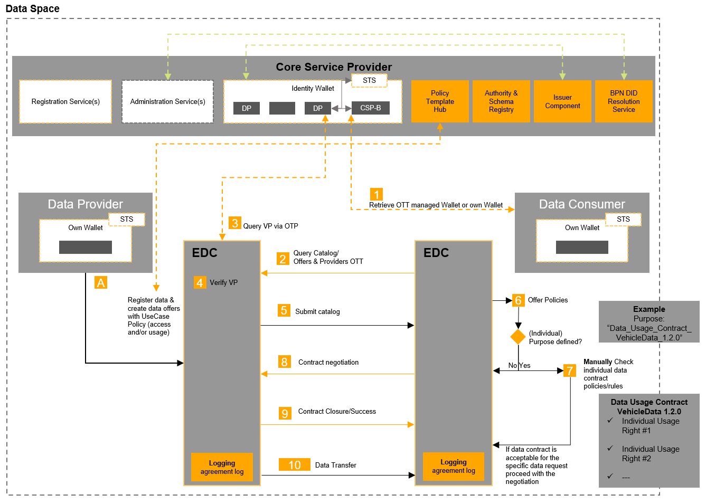

## CATENA X: HOW TO CONCLUDE DATA EXCHANGE CONTRACTS

- 31 OCTOBER 2024
- VERSION 1.2
- PDF-Version: [How-to-conclude-Data-Exchange-Contracts.pdf](./assets/How-to-conclude-Data-Exchange-Contracts.pdf)

### 1. REGISTRATION, CONNECTOR TECHNOLOGY AND DATA EXCHANGE GOVERNANCE

#### 1.1 Objective

The Catena-X Data Space ("**CX Data Space**") enables Data Providers ("**DP**") and Data Consumers ("**DC**") to conclude data exchange contracts via the eclipse data space connector or another registered connector ("**RC Process**"). DP and DC enjoy freedom of contract to exchange data, unless mandatory requirements under the Governance Framework apply. The document is intended to educate (prospective) Participants and help them to align their internal organisational processes.

#### 1.2 Registration Process

Each participating entity ("**Participant**") must register and accept the Governance Framework of the CX Data Space to facilitate data exchange via the CX Data Space. The provider of the Core Services B ("**OpCo**") manages the registration process. The OpCo assigns each Participant with a unique business partner number ("**BPN-L**"). Before exchanging data, each Participant must separately agree to the Data Exchange Governance by way of registration with the OpCo. In return, each Participant will receive a credential ("**DEG Credential**")..

#### 1.3 Registered Connector as a means to effect data exchange contracts

Each Participant with a BPN-L has at least one dedicated registered connector ("**RC**"), either self-managed or hosted. The RC facilitates the conclusion of data exchange contracts and the subsequent exchange of data. Where the DP allows a DC to share data with its affiliates, those affiliates do not need an own RC.

#### 1.4 Data Exchange Governance, Repository and Predefined Policies

In addition to the 10 Golden Rules, Catena-X Automotive Network e.V. ("**Association**") has developed a data exchange governance framework that sets out the key principles for data exchange ("**Data Exchange Governance**"). A separate database ("**Repository**") specifies (i) the indispensable minimum to participate in and achieve the goals of the relevant use case ("**Predefined Purposes**"), (ii) standardized technical parameters to effect data exchanges ("**Technical Policies**") and (iii) optional default positions that correspond to the Predefined Purposes.

#### 1.5 Referencing contracts in the RC

Where DP and DC are free to conclude any contracts in compliance with the Governance Framework. In such case, they should preferably reference those contracts in the policies used with the RC, whereas the parties have full discretion how they refer to such policies in their contracts.

#### 1.6 App Providers

DP and DC are free to use services of App Providers in the context of exchanging data.

Illustration 1: RC Process with the example of an Eclipse Data Space Connector (EDC). Source: [Catena-X Operating Model](https://catenax-ev.github.io/docs/operating-model/why-introduction)

### 2. EXECUTIVE SUMMARY: CONCLUDING AND PERFORMING DATA EXCHANGE CONTRACTS VIA REGISTERED CONNECTORS

In general, DP and DC effectively conclude a data exchange contract at the point that DP's RC has delivered DP's declaration of acceptance to DC in respect of a specific data set preconfigured by DP. DP and DC may also use the RC solely to perform a data exchange contract they have concluded outside the CX Data Space.

To that end, DP will specify the data set it wishes to exchange with one or several DC, by referencing a Predefined Policy, specifying certain Technical Policies (including who may view and use which data set and engage with DP's RC: "Access and Usage Policies") as well as related legal terms. A permitted DC can view and evaluate the data set as per the relevant Access Policies after the DP has checked the DC's DEG Credential.

DC makes a legally binding offer ("**Offer**") to the DP by referencing the data set concerned (Step 8). Subsequently, DP accepts the Offer by reproducing the exact content of the Offer in DP's RC. The RC will deliver this declaration of acceptance to DC (Step 9: "**Contract Closure / Success**"). At that point, DP and DC have concluded a valid contract under law.

DP and DC store the data exchange contract individually (no central storage) after running automatic identity verification processes. DP uses an access token it requests and automatically receives from DP to download the data set.

### 3. DETAILS: DETAILS: CONTRACT FORMATION

#### 3.1 Contract formation under German law

Any data exchange contract ("**Contract**") between a DP and DC requires **an offer** and the other party's **acceptance**.\*

:::note
\*German contract formation rules under the German Civil Code. These rules do not require the DC to pay a consideration to create a valid contract. This can be different in other jurisdictions (e.g. US law). In general, the Governance Framework allows for deviations from any mandatory terms under Predefined Use Case Frameworks, if necessary to form a binding contract under another choice of governing law made by a DP and DC.
:::

The OpCo provides certain means for the contract negotiation, including **acceptance of the Data Exchange Governance** as well as any legally necessary information on the contract formation process. In addition to that, DP and DC may use services of App Providers and service providers in the context of concluding or performing data exchange contracts.

#### 3.2 DP specifies (i) Predefined Policy and (ii) Technical Policies in step A

In step A, DP specifies a data set it is prepared to exchange with a data consumer ("**Data Proposals**"). For each of these data sets, DP specifies **all contract terms** by referencing a Predefined Policy (e.g., "PCF v.1") and, if desired, specifies any non-mandatory terms within the boundaries of the Data Exchange Governance (e.g. choice of law, dispute resolution). DP also sets Technical Policies including the Access Policies that establish which Participants can view and interact with a Data Proposal. DP does not actively send Data Proposals to any Participant. From a legal perspective, any such Data Proposal by DP **is a non-binding invitation to make an offer and not an offer under law**.

If the parties choose to conclude additional terms outside of Catena-X (see Section 1.5), these bilateral contracts need to be referenced in the Data Proposal.

#### 3.3 Technical processes before DC can view DP's Data Proposal

(If not effected already,) DC accepts the Data Exchange Governance and requests the relevant Data Exchange Governance Credential from the OpCo for validation and confirmation.

Upon successful validation, the OpCo generates a verified credential for the DC ("**Verifiable Credential**"). Such Verified Credential is then stored in DC's managed identity wallet ("**MIW**").

DC then queries the DP's registry/catalogue from DP while submitting credentials that confirm its own identity ("**Verifiable Presentation**") to the DP ("**Query Catalogue**"). DP validates the "**Query Catalogue**" and sends to DC all Data Proposals with Access Policies that match the credentials of the DC ("**Submit Catalogue**"), i.e. all Data Proposals that DP allows DC to view. Note: As of now, DP must inform DC that DP has created accessible Data Proposal(s) for DC.

#### 3.4 Evaluate Data Proposal(s)

DC views Data Proposal(s) and evaluates the respective terms (step 6-7).

#### 3.5 DC makes legally binding Offer to DP in Step 8

If DC wants to conclude a binding data exchange contract based on the terms of a Data Proposal, DC can communicate such desire to DP by way of reference to a specific Data Proposal. Under German law, this constitutes a binding offer by DC.

For now, DC only has the option to accept all terms of a Data Proposal (or not). The RC Data Exchange Process does not yet provide for DC to make an offer that deviates from the terms of a Data Proposal as set by the DP. However, future release versions will provide for contract negotiation with counter offers by DC.

#### 3.6 DP accepts DC's Offer in Step 9

DP accepts DC's Offer by repeating the exact content of DC's Offer in a declaration of acceptance, and sending this back to DC in step°9. Upon successful delivery of the declaration of acceptance, DC and DP have concluded a valid contract under law.

#### 3.7 Sending contract

The DP's RC and the DC's RC each store the data exchange contract. There is no central means of storage. It is up to Participants to store their data exchange contracts.

#### 3.8 Data exchange

In step 10, DC requests access to DP's data from DP. DP sends an access token to DC. Following that, DC can use such token to download the data provided by DP. DC may repeat this process multiple times, using the same token. Following the download of data, DC is able to process such data.

#### 3.9 Automating contract negotiations in the Data Exchange Governance

The Association will develop further automation and scalability of the RC Data Exchange Process. The RC will enable Participants to choose from a range of text modules when negotiating and agreeing on terms within the Data Exchange Governance (e.g. liability/dispute resolution/choice of law etc.).

Also, Participants will be able to define conditions for automated acceptances (via their RC) in response to offers from other Participants within the Predefined Policies.
