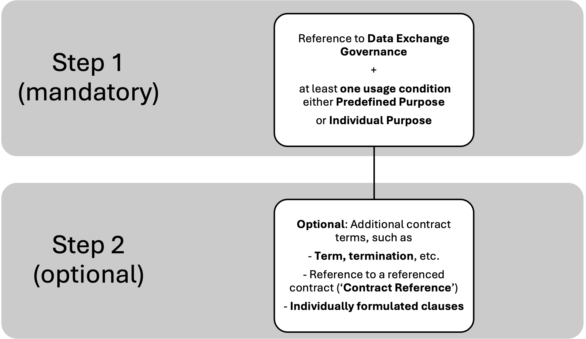
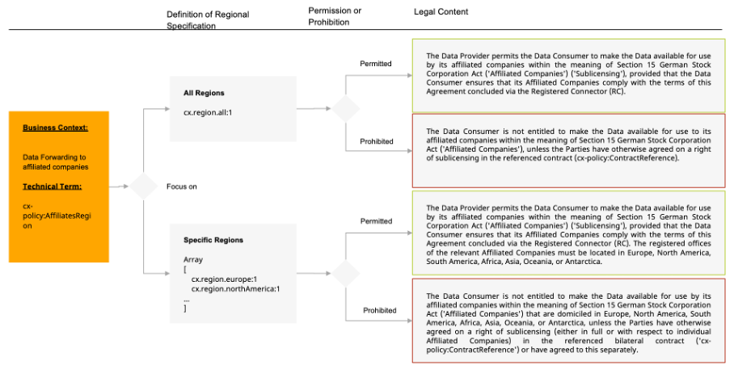

## Guidance on Contract Modularization in Catena-X

:::info

 PDF-Version: [Catena-X Guidance Contract Modularization](./assets/Guidance_Contract_Modularization.pdf)

 :::

## 1. Introduction and objective

This guidance has been developed to support all parties involved in the introduction and application of the new contract components. It responds to the need to make contractual provisions within the Catena-X data space clearer, more uniform, and better linked both technically and legally. The new contract modules entail both content-related and structural adjustments that must be implemented in existing processes and systems.

The purpose of this guidance is to ensure the correct, consistent, and transparent application of these contract components. It provides guidance for specialist departments, legal departments, governance teams, and technical implementation units. Both legal precision and interoperability with machine-readable policy formats (e.g., ODRL) are taken into account.

The aim is to reduce room for interpretation, avoid redundancies, and create a clear link between legal wording and its technical representation. This ensures that contracts are legally robust, compatible between partners, and efficiently verifiable throughout the ecosystem.

The Catena-X data space provides a framework of contractual provisions that can be used as efficiently and flexibly as possible to both preserve the data sovereignty of the data provider at all times and enable the scaling and automation of data exchange contracts. The standardization of the contractual framework facilitates the initiation of bilateral data exchange relationships, which in the past often took a great deal of time and thus accounted for a large part of the onboarding of new data space participants, as the conditions for bilateral data exchange usually had to be negotiated from scratch.

The principle of freedom of contract always applies to every data exchange agreement, i.e., each data provider is free to decide with which data consumer they want to share which data, under what terms of use, when, and for how long. The Catena-X data space provides standardized contract clauses in the ODRL to facilitate negotiations between the parties and to standardize the relevant data types and purposes of use, particularly in standardized use cases. In order for a data exchange contract to be concluded in Catena-X using connector technology, the parties must refer to Data Exchange Governance (DEG) and agree on at least one condition of use for data as a "usage purpose." The parties are free to choose this condition of use from the predefined purposes or to agree on any condition of use individually (individual purposes).

The parties are also free to determine other essential contractual terms, such as the term, termination rights, warranty and liability, as well as the applicable law and place of jurisdiction, by referring to the pre-formulated contract clauses, a referenced contract or individually formulated clauses ("Contract Reference") in the ODRL.

The entirety of the contractual clauses agreed in a data exchange agreement, including the "Predefined Purposes" and "Individual Purposes," are referred to as "Contractual Constraints."

The clauses stored in the ODRL are formulated with a view to a contractual choice of German law. The Catena-X data space is designed so that a data provider can have a supply relationship with a data consumer that regulates its own obligations with regard to data exchange in a framework agreement or other contracts. Catena-X does not make any predetermined assumptions as to how the parties have agreed or should agree on the exchange of data that may be necessary within the scope of the supply relationship or for the provision of certain services. Rather, the logic of Data Exchange Governance (DEG) and ODRL provides that the parties can expressly refer to such agreements concluded outside the Catena-X data space (as a "Contract Reference") and can also give them priority over deviating provisions in the DEG and ODRL if the parties so wish. However, the parties may just as well adopt the contract clauses provided and assign them priority if their existing contractual relationships on the subject of data exchange contain no or only insufficient provisions.  

In sections 3 and 4, we explain the interaction between the DEG and the ODRL (including the "Contract Reference") using specific examples.

>**Legal notice**: The contractual clauses stored in the DEG and ODRL, as well as these guidelines, are the result of careful discussion between members of the Legal Expert Group of Catena-X e.V. For the sake of good order, we would like to point out that neither the contractual clauses nor the guidelines replace the examination in individual cases of whether certain contractual clauses selected by the parties to a data exchange agreement are appropriate, reasonable, and enforceable in court in the specific individual case. These guidelines themselves are intended as guidance; they cannot replace legal advice in individual cases.

## 2. Structure and interpretation of the contractual clauses

The table in the appendix in Chapter 6 forms the basis for the consistent application of the new contract components. It presents all relevant information in a structured form and makes it possible to link legal formulations, technical parameters, and their normative classification.

### a. Explanation of the columns

- **Category**: Describes the thematic or contractual scope of the rule, e.g., "affiliated companies" or specific use cases.

- **ODRL section**: Assigns the rule to one of the three normative ODRL categories (permission, prohibition, obligation).

- **Left operand / Right operand**: Together, they specify a contractual clause, with the left operand defining the category (e.g., data provision period) and the right operand defining the value (e.g., 1 year).

- **Typically used for Aspect (‘Aspect Model’)**: Specifies for a part of the terms of use for which data model or technical aspect these terms of use can generally be applied.

- **German / English**: Contains the contract clauses in both languages. These texts have been legally reviewed and are adopted as standardized contract clauses when the corresponding left operand is selected in combination with the corresponding right operand.  

### b. Link to ODRL

The ODRL section column is crucial for technical and normative classification:

- **Prohibition**: Explicitly describes what is not permitted. Example: Transferring data to affiliated companies in certain regions is prohibited.

- **Permission**: Specifies what is permitted, often under certain conditions. Example: Use of data for a specific, clearly defined purpose.

- **Obligation**: Defines what must be complied with or done. Example: Obligation to provide data by a certain date.

This clear categorization makes it possible to interpret each contract component correctly, both legally and technically, and to implement it in a machine-readable form. This ensures that all partners in the ecosystem recognize the same meaning and effect of a clause – regardless of whether it is embedded in a legal document or a technical policy.

## 3. Classification in contractual contexts and standard CX-0152

The contract components shown in the table should not be viewed in isolation, but must be embedded in the respective legal and technical context. It is important to clearly define the scope of application and establish the connection to the overarching regulations in the Catena-X data space.

### a. DEG context

All contract components that are relevant to the legal basis for data release or use are anchored in Data Exchange Governance (DEG). These texts are immutable for all data providers and data consumers who wish to conclude data exchange contracts in Catena-X. With each contract concluded via the registered connector, the data provider and data consumer confirm by referring to the DEG that the provisions of the DEG apply to this data exchange contract.

>**General note**: For contract modularization, it has been specified that the new DEG (version 1.0 dated September 30, 2025) will apply to all contracts concluded in the future, while the DEG (version 1.0 dated June 7, 2024) will remain valid for all contracts concluded up to the cut-off date.

### b. ODRL context

The Open Digital Rights Language (ODRL) is a rule language and is used to define the contractual clauses ("Contractual Constraints") . The use of ODRL offers the advantage that the contractual terms and conditions are machine-readable, interpretable, and comparable, and it can be automatically checked whether a particular use of data is permissible.

### c. Interaction between DEG and ODRL

Individually negotiated contractual clauses that are agreed upon as part of the contract concluded via the registered connector and reflected in ODRL contractual clauses take precedence over any conflicting provisions of the Data Exchange Governance (DEG).

In addition, the parties may stipulate additional agreements in a separately referenced contract (via "Contract Reference"). In the interaction between DEG and ODRL, this separate contract may, depending on individual agreement, take precedence over the ODRL contract clauses defined in the RC process, or vice versa.

>**General Note**: In principle, the parties' freedom of contract remains unaffected: The modular ODRL contract clauses represent a voluntary, supportive standardization offer, but do not replace the possibility of individual contract design.

### d. Catena-X Standard CX-0152 ("Policy Constraints for Data Exchange")

The CX-0152 standard describes which policy constraints (contract terms) may be used in the access policy and usage policy and in what form.

Every data exchange contract is preceded by a data offer. The data offer is placed in the connector catalog via the data provider's registered connector in the Catena-X data space. The access policy can be used to restrict which data consumers have access to the catalog. The policy constraints to be used in the access policy thus describe a possible restriction of access to the catalog, e.g., to individual business partners (BPNLs), business partner groups, or Catena-X data space members who have agreed to the DEG.

The Usage Policy defines the terms of the contract first in the data offering that the data provider makes available in the connector catalog and, after contract negotiations, as part of the contract concluded via the registered connector. The terms of the contract in the Usage Policy describe the rights and obligations of the data consumer, e.g., under what conditions they may use the data and whether and to whom they may pass on the data. Furthermore, the contractual terms in the Usage Policy also list the rights and obligations of the data provider, for example, how long they must provide data.

Until now, the policy constraints defined and published by Catena-X e.V. were only described in text form in a TTL file. With the normativity of the Dataspace Protocol (DSP) JSON schema in version 2025-1, which forms the basis for data exchange via the registered connector, there is a clear extension point for data spaces to define their own profiles. The constraint object is an essential point of expansion in the DSP. It is embedded in all DSP messages that are fundamental to legally binding contract negotiations between business partners in a data space.

The CX-0152 standard defines the policy constraints in the form of JSON schemas so that their correct use can also be technically validated. An example of such technical validation can be found in the Tractus-X EDC reference implementation.

The CX-0152 standard thus ensures that the contract terms that can be used in the Access and Usage Policy are both legally secure and technically compliant with the Dataspace Protocol (DSP).

## 4. Application scenarios

For the scenario of sharing Product Carbon Footprint (PCF) data, the following describes what an example usage policy might look like that the data provider and data consumer have agreed upon as part of the connector negotiation, and what the resulting contract text would look like.

### a. Example usage policy for regulating the transfer of PCF data

**Permission section**:

| Left Operand                      | Operator | Right Operand                                                                                                    |
| --------------------------------- | -------- | ---------------------------------------------------------------------------------------------------------------- |
| FrameworkAgreement                | eq       | DataExchangeGovernance:1.0                                                                                       |
| ContractReference                 | isAllOf  | ContractID250620197, AGB9832, ContractConstraint_ThirdParty                                                      |
| Precedence                        | eq       | cx.precedence.contractReference:1                                                                                |
| VersionChanges                    | eq       | cx.versionChanges.minor:1                                                                                        |
| DataFrequency                     | eq       | cx.dataFrequency.unlimited:1                                                                                     |
| ExclusiveUsage                    | eq       | cx.exclusiveUsage.dataConsumer:1                                                                                 |
| UsagePurpose                      | isAnyOf  | cx.core.digitalTwinRegistry:1, cx.pcf.base:1, cx.circular.dpp:1, PublishDataOnCompanyWebPage, ModifyAndAmendData |
| AffiliatesRegion                  | isAnyOf  | cx.region.europe:1, cx.region.northAmerica:1                                                                     |
| AffiliatesBpnl                    | isAnyOf  | *(empty)*                                                                                                        |
| DataUsageEndDefinition            | eq       | cx.dataUsageEnd.unlimited:1                                                                                      |
| Warranty                          | eq       | cx.warranty.contractReference:1                                                                                  |
| WarrantyDurationMonths            | eq       | 6                                                                                                                |
| Liability                         | eq       | cx.grossNegligence:1                                                                                             |
| Confidential Information Measures | eq       | cx.confidentiality.measures:1                                                                                    |
| ConfidentialInformationSharing    | isAnyOf  | cx.sharing.affiliates:1, cx.sharing.managedLegalEntity:1                                                         |
| JurisdictionLocationReference     | eq       | cx.location.contractReference:1                                                                                  |

**Prohibition section**:

| Left Operand     | Operator | Right Operand                                                                         |
| ---------------- | -------- | ------------------------------------------------------------------------------------- |
| UsageRestriction | isAllOf  | ExtraordinaryAnalyticsForbiddenRightOperand, DataProviderRemovalForbiddenRightOperand |
| AffiliatesRegion | isAnyOf  | cx.region.southAmerica:1, cx.region.asia:1                                            |

**Obligation section**:

| Left Operand            | Operator | Right Operand        |
| ----------------------- | -------- | -------------------- |
| DataProvisioningEndDate | eq       | 2027-12-15T12:00:00Z |

### b. Resulting contract

***Framework Agreement***:

Data Provider and Data Consumer agree to the Data Exchange Governance published by Catena-X Automotive Network e.V. (Association) as the basis for this Agreement concluded via the Registered Connector (RC). The Data Exchange Governance [can be found here](https://catenax-ev.github.io/docs/regulatory-framework/20000ft/data-exchange-governance) after CX-Saturn has been released.

The subject matter of the Agreement concluded via the RC is the provision of the Data for a limited period of one (1) year (unless otherwise agreed in [dataProvisioningEndDate] or [dataProvisioningEndDurationDays]) and granting a right to use the Data for a period of one (1) year (unless agreed otherwise in [dataUsageEndDate] or [dataUsageEndDurationDays] or open-ended [DataUsageEndUnlimited]).

The provision of the Data shall be effected via the API specified by the dataset attribute dct:type. The Agreement concluded via the RC covers only the exchange of Data effected on the basis of the API version (as specified in the dataset attribute base-URL), the Asset Version (dataset attribute cx-common:version), and the Aspect Model Version as applicable at the time of concluding the Agreement. Unless agreed otherwise in [VersionChanges], the Agreement concluded via the RC must be renegotiated in the event of any change to at least one of these versions. Unless otherwise agreed between the Parties within the Agreement concluded via the RC (in accordance with [UsagePurpose]), the Data Provider grants the Data Consumer a non-exclusive right, limited in time to the duration of this contract (in accordance with [dataUsageEndDate] or [dataUsageEndDurationDays] or open-ended [DataUsageEndUnlimited]), to use the Data in accordance with the Contractual Usage Purposes (in accordance with [Usage Purpose]).

***Contract Reference***:

Data Provider and Data Consumer are free to reference an existing, individual contract as a basis of the Agreement concluded via the Registered Connector (RC). This can be a framework agreement or a very specific contract. The rightOperand value for this constraint can be a free to choose reference under which both parties are able to identify their contract. The reference does not have to have a version number.  ContractID270620197, AGB9832, ContractConstraint_ThirdParty

>**Explanation of the example**:
Here, three contracts concluded outside the Catena-X data space between the data provider and the data consumer are referenced, which are valid for the contract concluded via the registered connector:
*ContractID270620197* – is an individual contract that regulates the general transfer of data from the data provider to the data consumer and also contains provisions on the place of jurisdiction and applicable law.
*AGB9832* – are the general terms and conditions published by the data consumer for all its suppliers, which state that data exchange of PCF values must always take place via the Catena-X data space and that data offers must be accessible to the data consumer's BPNL and must be made with the dataset type (dct:type corresponding to CX-0018) of the data transmitted in each case.
*ContractConstraint_Warranty* – is a contractual clause that states the following: "The Data Provider permits the Data Consumer to make the Data available for use by Third Party Companies, provided that the Data Consumer ensures that these Companies comply with the terms of this Agreement concluded via the Registered Connector (RC). The registered offices of the relevant Third Party Companies must be located in Europe."

***Precedence***:

The Parties are free to agree on additional provisions in a separately referenced contract, in addition to the arrangements made via the Registered Connector (RC) Process (referenced in leftOperand: contractReference). In the event of any conflict between the provisions agreed via the RC Process and those of the referenced contract, the provisions of the contract shall take precedence.

***Version Changes***:

The Agreement concluded via the Registered Connector (RC) covers only the exchange of Data effected on the basis of the major API version (as specified in the dataset attribute base-URL), the major Asset-Version (dataset attribute cx-common:version), and/or the major Aspect Model Version as applicable at the time of concluding the Agreement. The Agreement concluded via the RC must be renegotiated in the event of any change to at least one of these major versions. The Agreement does not need to be renegotiated in the event of any change to one of these minor versions. The definitions of major and minor version are based on [Semantic Versioning](https://semver.org/).

***Data Frequency***:

This Agreement concluded via the Registered Connector (RC) applies to the multiple or repeated exchange of similar Data at different times and in different quantities within the scope of the selected Use Case.

***Exclusive Usage***:

The Data Consumer has the exclusive right to use the Data within the scope of the agreed purposes (cx-policy:UsagePurpose). The Data Provider's right to use the Data it has provided for its own internal purposes remains unaffected.

***Usage Purpose***:

The Data Consumer may use the Data in line with the following purposes: Identifying data offers of submodels within the Catena-X ecosystem.

The Data Consumer may use the Data in line with the following purposes: (i) sending and receiving product-specific CO2 data and related functionalities such as (but not limited to) certificate exchange and notifications, (ii) conducting plausibility checks and validation measures, (iii) calculating aggregated PCFs of Data Consumer (including calculations operated by a technical service provider that (a) is certified for Catena-X, (b) is not authorized to evaluate data beyond such calculation, and (c) provides calculations exclusively for Data Consumer's own purposes).

The Data Consumer may use the Data in accordance with the applicable laws and regulations directly requiring digital product passports or affecting the contents or handling of digital product passports.

Data Provider and Data Consumer are free to individually agree this certain purpose of use. The legal meaning of this certain purpose needs to be agreed individually between Data Provider and Data Consumer:
*PublishDataOnCompanyWebPage, ModifyAndAmendData*

***Usage Restriction***:

The Data Consumer is prohibited, insofar as the Data constitutes insignificant parts of a database within the meaning of Section 87b para. 1 sentence 1 German Act on Copyright and Related Rights (UrhG), from repeatedly and systematically carrying out actions that conflict with the normal evaluation of a database or unreasonably impair the legitimate interests of the Data Provider (Section 87b para. 1 sentence 2 UrhG), unless otherwise individually agreed between the Parties in the usage purposes for a specific Use Case (cx-policy:UsagePurpose) or in the referenced bilateral contract (cx-policy:ContractReference).

The Data Consumer is prohibited from removing the company identifiers and/or other references to the Data Provider contained in the Data and/or the associated metadata or databases, unless otherwise individually agreed between the Parties in the usage purposes for a specific Use Case (cx-policy:UsagePurpose) or in the referenced bilateral contract (cx-policy:ContractReference).

***Affiliates Region***:

The Data Provider permits the Data Consumer to make the Data available for use by its affiliated companies within the meaning of Section 15 German Stock Corporation Act ('Affiliated Companies') ('Sublicensing'), provided that the Data Consumer ensures that its Affiliated Companies comply with the terms of this Agreement concluded via the Registered Connector (RC). The registered offices of the relevant Affiliated Companies must be located in Europe.

The Data Provider permits the Data Consumer to make the Data available for use by its affiliated companies within the meaning of Section 15 German Stock Corporation Act ('Affiliated Companies') ('Sublicensing'), provided that the Data Consumer ensures that its Affiliated Companies comply with the terms of this Agreement concluded via the Registered Connector (RC). The registered offices of the relevant Affiliated Companies must be located in North America.

The Data Consumer is not entitled to make the Data available for use by its affiliated companies within the meaning of Section 15 German Stock Corporation Act ('Affiliated Companies') that are domiciled in South America, unless the Parties have otherwise agreed on a right of sublicensing (either in full or with respect to individual Affiliated Companies) in the referenced bilateral contract ('cx-policy:ContractReference') or have agreed to this separately.

The Data Consumer is not entitled to make the Data available for use by its affiliated companies within the meaning of Section 15 German Stock Corporation Act ('Affiliated Companies') that are domiciled in Asia, unless the Parties have otherwise agreed on a right of sublicensing (either in full or with respect to individual Affiliated Companies) in the referenced bilateral contract ('cx-policy:ContractReference') or have agreed to this separately.

***Affiliates Bpnl***:

The Data Provider permits the Data Consumer to make the Data available for use by the Affiliated Companies within the meaning of Section 15 German Stock Corporation Act ('Affiliated Companies') ('Sublicensing') specified herein, provided that the Data Consumer ensures that such companies and/or its Affiliated Companies comply with the terms of the Agreement concluded via the Registered Connector (RC).
*BPNL489012567123, BPNL567123489012*

***Data Provisioning End Date***:

The Data Provider shall make the Data available for a limited period until the end date specified herein, commencing from the second the Agreement is concluded via the Registered Connector (RC).
*2027-12-15*

***Data Usage End Definition***:

The Data Provider shall make the Data available for an unlimited period of use in accordance with the usage conditions specified in cx-policy:UsagePurpose, commencing from the second the Agreement is concluded via the Registered Connector (RC).

***Warranty***:

The provision of the Data is subject to the warranty for material defects and defects in title as agreed in the description of the subject matter of performance according to the referenced contract (leftOperand: ContractReference).

***Warranty Duration Months***:

The provision of the Data is subject to a warranty for material and legal defects for a period specified herein in months.
*6*

***Liability***:

The Data Provider's liability is limited to intent and gross negligence. The same applies in regard to the Data Provider's liability for its legal representatives, employees, and authorized representatives.

***Confidential Information Measures***:

The Data Consumer is obliged to take all appropriate technical and organizational measures to protect the Confidential Information of the Data Provider, in order to prevent unauthorized disclosure to third parties. The Data Consumer is also obliged to inform the Data Provider without undue delay about any unauthorized disclosure of Confidential Information.

***Confidential Information Sharing***:

The Data Consumer may only disclose Confidential Information to Affiliated Companies if and to the extent that the Data Provider has expressly permitted such disclosure in accordance with the Data Exchange Governance or the cx-policy:affiliates.*. The Data Consumer may only disclose Confidential Information to Affiliated Companies to the extent that the Affiliated Companies and their employees are bound to Confidentiality Obligations at least equivalent to those set forth in this Agreement. Furthermore, access to and use of the relevant Data must be restricted to those employees of the Affiliated Company who require the Data in order to exercise the agreed usage rights ('need to know').

The Data Consumer may only disclose Confidential Information to those companies for which the Data Consumer acts in an 'is managed by' relationship (within the meaning of the Catena-X Standard 'CX-0074') if and to the extent those companies are expressly listed in cx-policy:managedLegalEntity.*. The Data Consumer may only disclose Confidential Information to those Companies to the extent that those Companies and their employees are bound to Confidentiality Obligations at least equivalent to those set forth in this Agreement. Furthermore, access to and use of the relevant Data must be restricted to those employees of the Company who require the Data in order to exercise the agreed usage rights ('need to know').

***Jurisdiction Location Reference***:

The exclusive venue for all disputes arising from the Agreement concluded via the Registered Connector (RC) shall correspond to the venue specified in the referenced contract (as referenced in cx-policy:ContractReference).

### c. Handling of conflicting contract clauses

For the contractual clauses agreed upon in the contract concluded via the registered connector, it is ensured that conflicting clauses may not be used simultaneously. This is described accordingly in standard CX-0152 and the JSON schema contained therein and is checked in the validation based on it, which is implemented as an example in the Tractus-X reference implementation.
Only a, b, or c of the following contract clauses may appear in a contract concluded via the registered connector:

### End of Data Provision

| Identifier | Example Value | Description |
|-------------|----------------|--------------|
| **DataProvisioningEndDate** | 2025-12-31T23:59:59Z | The Data Provider shall make the Data available for a limited period until the end date specified herein, commencing from the second the Agreement is concluded via the Registered Connector (RC). |
| **DataProvisioningEndDuration** | 365 | The Data Provider shall make the Data available for the period specified herein in days, commencing from the second the Agreement is concluded via the Registered Connector (RC). |

### End of Data Usage

| Identifier | Example Value | Description |
|-------------|----------------|--------------|
| **DataUsageEndDate** | 2025-12-31T23:59:59Z | The Data Provider shall make the Data available with a usage period permitted until the end date specified herein, in accordance with the usage conditions specified in UsagePurpose, commencing from the second the Agreement is concluded via the Registered Connector (RC). Upon expiry of the usage period, the Data Consumer shall no longer be entitled to use the Data and shall delete the Data to prevent any further use, unless the Data Consumer has received the same Data under another still valid contract. The Agreement shall terminate upon expiry of the usage period of the Data without the need for a separate notice of termination. |
| **DataUsageEndDuration** | 365 | The Data Provider shall make the Data available for the usage period specified herein, measured in days, in accordance with the usage conditions set out in UsagePurpose, commencing from the moment of concluding the Agreement via the Registered Connector (RC). Upon expiry of the permitted usage period, the Data Consumer shall no longer be entitled to use the Data, and shall delete the Data from all systems and storage media in order to prevent any further use, unless the Data Consumer has received the same Data under another valid contract. The Agreement shall terminate automatically upon expiry of the usage period for the Data, without the need for a separate notice of termination. |
| **DataUsageEndDefinition** | cx.dataUsageEnd.unlimited:1 | The Data Provider shall make the Data available for an unlimited period of use in accordance with the usage conditions specified in UsagePurpose, commencing from the second the Agreement is concluded via the Registered Connector (RC). |

### End of Warranty

| Identifier | Example Value | Description |
|-------------|----------------|--------------|
| **WarrantyDefinition** | 6 | The provision of the Data is subject to a warranty for material and legal defects for a period specified herein in months. |
| **WarrantyDefinition** | cx.warranty.contractEndDate:1 | The provision of the Data is subject to a warranty for material defects and defects in title until the end of the Agreement concluded via the Registered Connector (RC). |

### Warranty Conditions

| Identifier | Example Value | Description |
|-------------|----------------|--------------|
| **Warranty** | WarrantyNone | The provision of the Data is made with the exclusion of any warranty for material defects and defects in title, unless the Data Provider fraudulently conceals such a defect. |
| **Warranty** | WarrantyContractReference | The provision of the Data is subject to the warranty for material defects and defects in title as agreed in the description of the subject matter of performance according to the referenced contract (ContractReference). |
| **Warranty** | WarrantyDataQualityIssues | In the event of a material deviation from the contractually agreed data quality, the Data Provider shall be entitled to (i) demand the rectification of defects by provision of Data in the quality owed, (ii) terminate the contract in the event of failure to remedy the defect, and (iii) claim damages in accordance with the liability provisions set out below. |

### Validity of the Contract in the Event of Version Changes

| Identifier | Example Value | Description |
|-------------|----------------|--------------|
| **VersionChanges** | cx.versionChanges.minor:1 | The Agreement concluded via the Registered Connector (RC) covers only the exchange of Data effected on the basis of the major API version (as specified in the dataset attribute base-URL), the major Asset Version (dataset attribute cx-common:version), and/or the major Aspect Model Version as applicable at the time of concluding the Agreement. The Agreement concluded via the RC must be renegotiated in the event of any change to at least one of these major versions. The Agreement does not need to be renegotiated in the event of any change to one of these minor versions. The definitions of major and minor version are based on [Semantic Versioning](https://semver.org/). |
| **VersionChanges** | cx.versionChanges.major:1 | The Agreement concluded via the Registered Connector (RC) covers any data exchange, which shall be effected via the API specified by the dataset attribute dct:type, irrespective of whether the API version applicable at the time of contract conclusion (as part of the dataset attribute base-URL), the Asset Version (dataset attribute cx-common:version), or the Aspect Model version changes. |

### Precedence Rule

| Identifier | Example Value | Description |
|-------------|----------------|--------------|
| **Precedence** | cx.precedence.contractReference:1 | The Parties are free to agree on additional provisions in a separately referenced contract, in addition to the arrangements made via the Registered Connector (RC) Process (referenced in ContractReference). In the event of any conflict between the provisions agreed via the RC Process and those of the referenced contract, the provisions of the contract shall take precedence. |
| **Precedence** | cx.precedence.rcAgreement:1 | The Parties are free to agree on additional provisions in a referenced contract (as referenced in ContractReference) in addition to the arrangements agreed via the Registered Connector (RC) Process. In such case, the provisions agreed via the RC Process shall take precedence over the provisions of the referenced contract. |

### Liability

| Identifier | Example Value | Description |
|-------------|----------------|--------------|
| **Liability** | cx.grossNegligence:1 | The Data Provider's liability is limited to intent and gross negligence. The same applies with regard to the Data Provider's liability for its legal representatives, employees, and authorized representatives. |
| **Liability** | cx.slightNegligence:1 | The liability of the Data Provider in cases of ordinary negligence shall be limited to x, as individually agreed by the Parties in the referenced bilateral agreement (cx-policy:ContractReference). The foregoing limitation of liability shall not apply in the event of mandatory statutory liability (in particular under the German Product Liability Act), nor in the event of the assumption of a guarantee or for any culpably caused bodily injury. |

## 5. Glossary

| **Abbreviation** | **Meaning** |
|------------------|-------------|
| **Access Policy** | Defines which data consumers have access to the catalog and the data offerings it contains. Can be restricted to individual business partners (BPNLs), business partner groups, or Catena-X data space members. |
| **Agreement** | An agreement between a data provider and a data consumer is a legally binding contract and requires a data offer and the other party's acceptance. An alternative term is data exchange contract (as in the description of contract formation). |
| **Business Partner Number-Legal (BPNL)** | In general, a legal entity is a legal person that has legal rights and duties related to contracts, agreements, and obligations. The term applies to any kind of organization established under the applicable laws of the country where that legal entity is domiciled. In Catena-X, a legal entity is a type of business partner representing a legally registered organization with its official registration information, such as legal name (including legal entity form, if registered), legal address, and tax number.A legal entity has exactly one legal address, but it is possible to specify additional addresses that a legal entity owns. Thus, at least one address is assigned to a legal entity. A legal entity can own or have various sites and premises in different locations. Thus, many or no sites are assigned to a legal entity. A legal entity is uniquely identified by the BPNL. |
| **Constraint** | A constraint defines one condition in the data offer or one condition as part of the terms in the concluded agreement. |
| **Contract Reference** | Reference to a contract concluded outside the Catena-X data space that is included in the contractual relationship. |
| **Contractual Constraints** | All contractual clauses agreed upon in a data exchange contract, including predefined purposes and individual purposes. |
| **Data Consumer** | Party that receives and uses data from a data provider. |
| **Data Offer** | A data offer is provided in the catalog of the data provider or data consumer to be negotiated. The data offer references the dataset concerned, the access rules as access policy, and the terms as usage policy. In the technical descriptions, the data offer is referred to as *offer* (see in ODRL and in the Dataspace Protocol). |
| **Dataset** | A Dataset describes the subject of the Data Offer or the concluded Agreement and refers to the data to be shared via the RC. |
| **Data Exchange Governance (DEG)** | Legal framework for data exchange in Catena-X, which defines basic rules and conditions. |
| **Data Provider** | Party that provides data and decides on its terms of use. |
| **Dataspace Protocol (DSP)** | Protocol underlying data exchange via the registered connector. |
| **Individual Purposes** | Purposes of use for the exchanged data agreed individually between the data provider and data consumer. |
| **JSON Schema** | Defines the structure and validation rules for JSON data objects used to describe datasets, policies, and agreements. *(Note: likely meant instead of duplicated "Purposes of use" entry)* |
| **Left Operand** | Part of a contract clause in ODRL that defines the category of the rule (e.g., UsagePurpose). |
| **Obligation** | ODRL category that defines obligations that must be complied with. |
| **ODRL (Open Digital Rights Language)** | The Open Digital Rights Language (ODRL) is a language for expressing policies that provides a flexible and interoperable information model, vocabulary, and encoding mechanisms for representing statements about the use of content and services. The ODRL information model describes the underlying concepts, entities, and relationships that form the basis for the semantics of ODRL policies.In addition to Catena-X, ODRL is also used by the DSP (Dataspace Protocol), another core component of the Catena-X architecture. Policies serve to represent permissible and impermissible actions with respect to a specific asset, as well as the obligations of the parties involved. In addition, policies can be limited by restrictions (e.g., temporal or spatial restrictions) and associated with obligations. |
| **Permission** | ODRL category that specifies what is permitted, often under certain conditions. |
| **Policy Constraints** | Contract terms used in the access policy and usage policy. |
| **Predefined Purposes** | Predefined, standardized purposes for data exchange in Catena-X. |
| **Prohibition** | ODRL category that explicitly describes what is not permitted. |
| **Registered Connector (RC)** | A Registered Connector (short RC) facilitates the conclusion of Agreements and the subsequent exchange of data. Alternative terms are *Connector* (as in the reference implementation Tractus-X EDC) or *Participant Agent* (as in the Dataspace Protocol). |
| **Right Operand** | Part of a contract clause in ODRL that defines the specific characteristic of the rule (e.g., cx.core.traceability:1). |
| **Typically used for Aspect (‘Aspect Model’)** | Column in the contract component table that specifies the data model or business aspect for which certain terms of use are typically applied. |
| **Usage Policy** | Defines the contractual terms and conditions for the use of the data, including the rights and obligations of the data consumer and data provider. |

## 6. Appendix

- PDF-Version: [Catena-X New Contract Components](./assets/New_Contract_Components.pdf)
