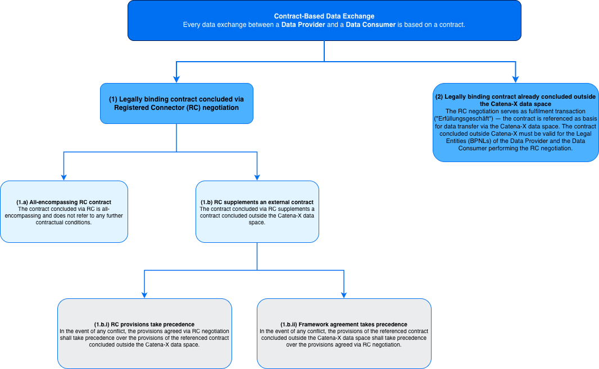
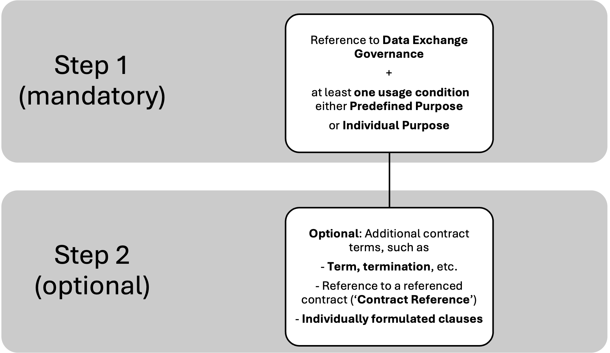
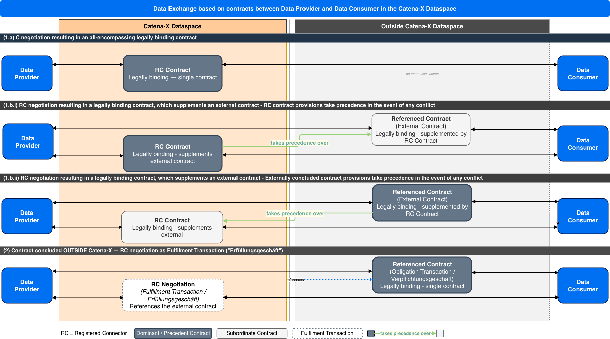

# GUIDANCE on Contract Modularization in Catena-X

## Quick Start Guide for First-Time Users

### What is this GUIDANCE about?

This GUIDANCE explains how to conclude data exchange contracts in the Catena-X data space. If you are a legal counsel, technical implementer, or business professional encountering Catena-X for the first time, this document will help you understand the contractual framework that governs every data exchange between participants in the ecosystem.

In Catena-X, every data exchange between a Data Provider and a Data Consumer requires a contract. The Catena-X data space provides you with standardized, modular contract clauses that you can use to efficiently negotiate and conclude these contracts—either entirely within the data space or by referencing contracts you have already concluded outside of it.

### What will you learn?

After reading this GUIDANCE, you will be able to:

- Understand the four main contractual scenarios supported by Catena-X (all-encompassing RC contracts, RC contracts supplementing external contracts with different precedence rules, and RC negotiations as fulfilment transactions)

- Navigate the relationship between Data Exchange Governance (DEG) and the Open Digital Rights Language (ODRL) contract clauses

- Select and combine the right contract clauses for your specific use case using the standardized clause library in Section 6

- Understand how precedence rules work when your RC contract references an external agreement

- Avoid conflicting contract clauses that the system will reject

### How to read this GUIDANCE

- **[Section 1 – Introduction and Objective:](#1-introduction-and-objective)** Start here to understand the purpose of this GUIDANCE and the four contractual scenarios. This section gives you the big picture.

- **[Section 2 – Structure and Interpretation of Contractual Clauses:](#2-structure-and-interpretation-of-the-contractual-clauses)** This section explains the clause library in Section 6. You will learn how to read the table columns and understand the difference between Permissions, Prohibitions, and Obligations.

- **[Section 3 – Classification in Contractual Contexts and Standard CX-0152:](#3-classification-in-contractual-contexts-and-standard-cx-0152)** This section explains the legal and technical context. You will learn how DEG, ODRL, and the CX-0152 standard work together—and why the term “constraint” is a technical concept, not a legal restriction.

- **[Section 4 – Application Scenarios:](#4-application-scenarios)** This section contains practical examples using Product Carbon Footprint (PCF) data. Work through these examples to see how the contract clauses translate into actual Usage Policies and resulting contracts.

- **[Section 5 – Preventing and Handling of Conflicting Contract Clauses:](#5-preventing-and-handling-of-conflicting-contract-clauses)** This section explains how the predefined schema can help you to prevent conflicting contract clauses and in case of conflicting contract clauses which contract clauses are given precedence.

- **[Section 6 – Clause Library:](#6-clause-library)** These are your reference tables. Once you understand the basics, you will return to this table whenever you need to select specific contract clauses for your data exchange agreements.

- **[Section 7 – Glossary:](#7-glossary)** This section defines all terms used in this GUIDANCE. If any term is unclear, refer to this section for clarification.

- **[Section 8 – Frequently Asked Questions (FAQ):](#8-frequently-asked-questions-faq)** This section addresses questions frequently raised by new data space participants. The answers may serve as a useful reference as you work through this GUIDANCE.

### Key concepts you should know

- **Registered Connector (RC):** The technical component through which you negotiate and conclude contracts in the Catena-X data space. When we refer to “RC negotiation” or “contract concluded via RC,” we mean the automated contract formation process within Catena-X.

- **Data Exchange Governance (DEG):** The mandatory framework of rules that applies to all data exchange contracts in Catena-X. Every contract concluded via RC automatically incorporates the DEG by reference.

- **ODRL (Open Digital Rights Language):** The machine-readable language used to express contract clauses. ODRL makes your contractual terms interpretable by software, enabling automated compliance checks.

- **Usage Policy:** The set of contract terms that defines how data may be used. You define your Usage Policy as part of your data offer, and it becomes part of the contract after successful RC negotiation.

- **Contract Reference:** A mechanism to incorporate an external contract (concluded outside Catena-X) into your RC contract. You can give this external contract precedence over the RC terms, or vice versa.

- **BPNL (Business Partner Number Legal entity):** Your unique identifier in the Catena-X data space. The BPNLs in your RC negotiation must match the parties in any external contract you reference.

### Your first steps

1. Read [Section 1](#1-introduction-and-objective) to understand your contractual options.

2. Skim [Section 2](#2-structure-and-interpretation-of-the-contractual-clauses) to familiarize yourself with the clause table structure.

3. Read [Section 3](#3-classification-in-contractual-contexts-and-standard-cx-0152) if you need to understand the legal and technical framework in depth.

4. Work through the examples in [Section 4](#4-application-scenarios) that match your intended scenario.

5. Understand in [Section 5](#5-preventing-and-handling-of-conflicting-contract-clauses) the precedence rules in case of conflicting contract clauses.

6. Use the Clause Library in [Section 6](#6-clause-library) to select your specific contract terms.

**Important:** This GUIDANCE helps you understand and apply the contract framework, but it cannot replace legal advice for your specific situation. Always verify that the clauses you select are appropriate and enforceable in your individual case.

## GUIDANCE

### 1. Introduction and objective

This GUIDANCE will help you understand and apply the new contract components in the Catena-X data space. If you are implementing these components for the first time, you will find that they make contractual provisions clearer, more uniform, and better linked both technically and legally. As you work through this document, keep in mind that implementing these new contract modules may require you to adjust your existing processes and systems.

Every data exchange between two legal entities—the Data Provider and the Data Consumer—requires a contract. Below, you will find the contractual scenarios supported by the Catena-X data space:

- (1) You can conclude a legally binding contract via the Registered Connector (RC) negotiation in various alternatives:

- (1.a) The contract you conclude via the RC is all-encompassing and does not reference any further contractual conditions—but you will need to include certain clauses at the RC level.

- (1.b) The contract you conclude via the RC supplements a referenced contract that you have already concluded outside the Catena-X data space with the same business partner. In this case:

- (1.b.i) If there is a conflict, the provisions you agreed via the RC negotiation will take precedence over your external contract; or

- (1.b.ii) If there is a conflict, the provisions of your external contract will take precedence over what you agreed via the RC negotiation.
You will be able to perform such contracts (as a Data Provider or a Data Consumer) on the basis of the data governance that you have implemented in your organization.

- (2) You may already have a legally binding contract with your business partner that was concluded outside the Catena-X data space. In this case, the RC negotiation simply serves as a way to execute the data exchange (Fulfilment Transaction = “Erfüllungsgeschäft”) while referencing your existing contract as the legal basis.

>**Legal notice**: Make sure that the external contract in the scenarios (1.b.i), (1.b.ii) and (2) is valid for the 2 legal entities who conduct the RC negotiation.

This GUIDANCE will help you apply these contract components correctly and consistently. You will learn how legal accuracy and technical interoperability with machine-readable policy formats (e.g., ODRL) work together.

Your goal should be to reduce ambiguity, avoid redundancies, and create a clear link between legal wording and its technical representation. When you follow this GUIDANCE, your contracts concluded via RC negotiation are reliable, compatible with your partners’ systems, and efficiently verifiable throughout the ecosystem.

The Catena-X data space gives you a framework of contractual provisions that you can use efficiently and flexibly. This framework helps you preserve your data sovereignty while enabling scalable and automated data exchange contracts. By using these standardized clauses, you can avoid the time-consuming process of negotiating bilateral data exchange terms from scratch—a step that has traditionally been one of the biggest hurdles when onboarding new data space participants.

You always retain your freedom of contract. As a Data Provider, you decide with which Data Consumer you want to share data, under what terms, when, and for how long. Catena-X provides standardized contract clauses in ODRL format to make negotiations easier and to standardize data types and purposes of use—especially for standardized use cases. To preserve your data sovereignty (regardless of whether you are concluding a new contract via RC or using a referenced external contract), you must refer to the Data Exchange Governance (DEG) and agree on at least one usage purpose. You can choose from predefined purposes or define an individual purpose that suits your specific needs.

You are also free to determine other essential contractual terms—such as duration, termination rights, warranty and liability, applicable law, and jurisdiction—by using the pre-formulated contract clauses, referencing an external contract, or drafting individually formulated clauses in ODRL.

If your RC negotiation only serves as a Fulfilment Transaction (“Erfüllungsgeschäft”) and your data exchange rules come from an Obligation Transaction (“Verpflichtungsgeschäft”) concluded outside Catena-X, you will use the Contract Reference to point to your external contract.

When we refer to Contractual Clauses, we mean all the clauses you agree to in a data exchange agreement—including Predefined Purposes and Individual Purposes.

The clauses stored in ODRL are drafted with German law in mind. If you and your supply chain partner already have a contractual relationship that governs data exchange, you can use that as a basis—Catena-X does not dictate how you should structure your data exchange agreements. The Data Exchange Governance (DEG) and ODRL logic allows you to expressly reference such external agreements (via a Contract Reference) and even give them priority over DEG and ODRL provisions if you wish. In this case, your RC contract would include the Contract Reference as part of the Usage Policy, with no additional clauses except the reference to the DEG and the Usage Purpose (which, as an "individual purpose" may also refer to your external contract).

Alternatively, you can incorporate the predefined contract clauses into your RC policy, customize them, and give them precedence over your Contract Reference. This approach is particularly useful if your existing agreements do not adequately address data exchange.

In sections 3 and 4, you will find specific examples showing how DEG and ODRL (including the Contract Reference) work together.

>**Legal notice**: Please be aware that neither these contractual clauses nor this GUIDANCE replace the need for you to assess whether the clauses you select are appropriate, reasonable, and enforceable in your specific case. This GUIDANCE is intended as practical orientation—it cannot replace individual legal advice.

### 2. Structure and interpretation of the contractual clauses

You will find all contract clauses listed in the tables in [Section 6: Clause Library](#6-clause-library). These tables are your primary reference for applying the contract components. They present all relevant information in a structured way and show you how legal formulations, technical parameters, and their normative classification relate to each other. The clauses cover the following topics:

- Reference to Data Exchange Governance Framework Agreement
- Reference to an existing, individual contract
- Precedence of agreed constraints
- Data subject and allowed version changes
- Data frequency of the data exchange
- Exclusive right for usage
- Usage conditions
- Usage restrictions
- Permission or prohibition for use by affiliates
- Duration of data provisioning
- Duration of data usage
- Warranty conditions
- Limitation of liability
- Handling confidential information
- Data handling after data usage end
- Jurisdiction location

For detailed descriptions of each clause, please refer to the tables in [Section 6: Clause Library](#6-clause-library).

#### a. Explanation of the columns

The tables list all rules assigned to one of three normative ODRL categories: permission, prohibition, or obligation. The first table lists all permission rules, the second table lists all prohibition rules, and the third table lists all obligation rules.

- **Left operand / Operator / Right operand**: Together, these specify a contractual clause. The left operand defines the category (e.g., data provision period), the operator defines allowed assignments between left and right operand (e.g. eq for equal) and the right operand defines the value (e.g., 1 year).

- **Typically used for Aspect (‘Aspect Model’)**: This column tells you which data model or technical aspect these terms of use can generally be applied to.

- **Legal Text**: This column contains the contract clauses in English. These texts have been legally reviewed and become standardized contract clauses when you select the corresponding left operand in combination with the corresponding right operand.

#### b. Link to ODRL

The ODRL category is crucial for understanding how each rule works technically and legally:

- **Permission**: Specifies what you are allowed to do, often under certain conditions. Example: You may use data for a specific, clearly defined purpose.

- **Prohibition**: Explicitly describes what you are not allowed to do. Example: You may not transfer data to affiliated companies in certain regions.

- **Obligation**: Defines what you must do. Example: You must provide data by a certain date.

This clear categorization helps you interpret each contract component correctly—both legally and technically—and implement it in machine-readable form. It ensures that all partners in the ecosystem understand the same meaning and effect of a clause, whether it appears in a legal document or a technical policy.

### 3. Classification in contractual contexts and standard CX-0152

Do not view the contract components in the table in isolation—you must understand them within their legal and technical context. It is important that you clearly define the scope of application and understand how they connect to the overarching regulations in the Catena-X data space.

#### a. DEG context

All contract components that affect the legal basis for data release or use are anchored in **Data Exchange Governance (DEG)**. These texts are mandatory for all Data Providers and Data Consumers who wish to conclude data exchange contracts in Catena-X. When you conclude a contract via the Registered Connector, you and your counterparty confirm by referring to the DEG that its provisions apply to your data exchange contract.

>**General note**: For contract modularization, the new DEG (version 1.0 dated September 30, 2025) applies to all contracts you conclude going forward. The previous DEG (version 1.0 dated June 7, 2024) remains valid for contracts concluded before the cut-off date.

#### b. ODRL context

The **Open Digital Rights Language (ODRL)** is a rule language used to define contractual clauses. Using ODRL offers you several advantages: your contractual terms become machine-readable, interpretable, and comparable, and it allows automated verification of whether a particular use of data is permitted.

#### c. Interaction between DEG and ODRL

Individually negotiated contractual clauses that you agree to as part of your RC contract and that are reflected in ODRL will take precedence over any conflicting provisions in the Data Exchange Governance (DEG).

You may also stipulate additional agreements in a separately referenced contract (via the Contract Reference). Depending on what you agree, this separate contract may take precedence over the ODRL contract clauses defined in the RC Process—or vice versa.

>**General Note**: Your freedom of contract remains fully intact: The modular ODRL contract clauses are a voluntary standardization tool that supports you—but they do not prevent you from designing your contracts individually.

#### d. Catena-X Standard CX-0152 ("Policy Constraints for Data Exchange")

<!-- markdown-link-check-disable-next-line -->
The CX-0152 standard defines which policy constraints you may use in Access Policy and Usage Policy, and in what form. The term “constraint” comes from the [ODRL specification](https://www.w3.org/TR/2018/REC-odrl-model-20180215/), which defines a constraint as a logical expression that sets the conditions, restrictions, or refinements under which a rule (Permission, Prohibition, or Duty) can be executed. **Note:** This is a technical term — it does not mean that you are legally restricted in what you can agree to.

Before any data exchange contract, you must first create a data offer. As a Data Provider, you place this offer in the connector catalog via your Registered Connector in the Catena-X data space. You can use the Access Policy to restrict which Data Consumers can access your catalog—for example, by limiting access to specific business partners (BPNLs), business partner groups, or members who have agreed to the DEG.

The Usage Policy defines the terms of your data exchange contract. It first appears in the data offer you make available in the connector catalog, and after contract negotiations, it becomes part of your RC contract. The Usage Policy describes the rights and obligations of the Data Consumer (e.g., under what conditions they may use the data, and whether and to whom they may pass it on). It also specifies your obligations as Data Provider (e.g., how long you must provide data).

Previously, the policy constraints published by Catena-X e.V. were only described in text form in a TTL file. With the normativity of the Dataspace Protocol (DSP) JSON schema in version 2025-1—which forms the basis for data exchange via the Registered Connector—there is now a clear extension point for data spaces to define their own profiles. The constraint object is a key expansion point in the DSP, embedded in all DSP messages fundamental to legally binding contract negotiations between business partners.

The CX-0152 standard defines policy constraints as JSON schemas so that their correct use can be technically validated. You can find an example of such validation in the Tractus-X EDC reference implementation.
In summary, the CX-0152 standard ensures that the contract terms you can use in Access and Usage Policy are both legally secure and technically compliant with the Dataspace Protocol (DSP).

### 4. Application scenarios

The following examples explain the initially introduced scenarios by using the use case of sharing Product Carbon Footprint (PCF) data:

- **Example (1.a)** shows you what a Usage Policy might look like when you and your business partner agree on it as part of the RC negotiation, and what the resulting contract text looks like when the RC contract is all-encompassing.

- **Example (1.b.i)** shows you which additional clauses (compared to 1.a) would be in the Usage Policy when your RC contract supplements an external contract and the RC contract provisions take precedence in case of conflict.

- **Example (1.b.ii)** shows you which additional clauses (compared to 1.a) would be in the Usage Policy when your RC contract supplements an external contract and the external contract provisions take precedence in case of conflict.

- **Example (2)** shows you the Usage Policy and the resulting RC contract when you already have a contractual relationship with your business partner that was concluded outside Catena-X before the RC negotiation. In this case, the data exchange is based entirely on the Contract Reference.

In all these examples, two business partners with BPNL000000001A34 and BPNL000000005B67 want to exchange data. Both are onboarded to the Catena-X data space and have a Registered Connector (RC).

This chapter 4 describes the all-encompassing example (1.a). The upcoming [Section 5: Preventing and handling conflicting contract clauses](#5-preventing-and-handling-of-conflicting-contract-clauses) covers the three examples (1.b.i), (1.b.ii), and (2), in which two contracts exist between the two business partners Data Provider and Data Consumer to illustrate how conflicting clauses should be handled.

#### Example (1.a) RC negotiation resulting in an all-encompassing legally binding contract

The following tables list the contract clauses described in standard CX-0152, showing the left operand, operator, and right operand that would be contained in your Usage Policy for this example. Based on these selected clauses, the resulting contract is then presented.

**Permission section of usage policy**:

| Left Operand                      | Operator | Right Operand                                                                                                    |
| --------------------------------- | -------- | ---------------------------------------------------------------------------------------------------------------- |
| FrameworkAgreement                | eq       | DataExchangeGovernance:1.0                                                                                       |
| VersionChanges                    | eq       | cx.versionChanges.minor:1                                                                                        |
| DataFrequency                     | eq       | cx.dataFrequency.unlimited:1                                                                                     |
| UsagePurpose                      | isAnyOf  | cx.core.digitalTwinRegistry:1, cx.pcf.base:1, cx.circular.dpp:1, PublishDataOnCompanyWebPage, ModifyAndAmendData |
| AffiliatesRegion                  | isAnyOf  | cx.region.europe:1, cx.region.northAmerica:1                                                                     |
| DataUsageEndDefinition            | eq       | cx.dataUsageEnd.unlimited:1                                                                                      |
| Warranty                          | eq       | cx.warranty.dataQualityIssues:1                                                                                  |
| WarrantyDurationMonths            | eq       | 6                                                                                                                |
| Liability                         | eq       | cx.grossNegligence:1                                                                                             |
| ConfidentialInformationMeasures   | eq       | cx.confidentiality.measures:1                                                                                    |
| ConfidentialInformationSharing    | isAnyOf  | cx.sharing.affiliates:1                                                                                          |
| JurisdictionLocationReference     | eq       | cx.location.dataConsumer:1                                                                                       |

**Prohibition section of usage policy**:

| Left Operand     | Operator | Right Operand                                                                         |
| ---------------- | -------- | ------------------------------------------------------------------------------------- |
| UsageRestriction | isAllOf  | cx.extraordinaryAnalytics.forbidden:1, cx.dataProviderRemoval.forbidden:1             |
| AffiliatesRegion | isAnyOf  | cx.region.southAmerica:1, cx.region.asia:1                                            |

**Obligation section of usage policy**:

| Left Operand            | Operator | Right Operand        |
| ----------------------- | -------- | -------------------- |
| DataProvisioningEndDate | eq       | 2027-12-15T12:00:00Z |

**Resulting contract**
Your resulting contract would contain the following clauses:

***Framework Agreement***:

Data Provider and Data Consumer agree to the Data Exchange Governance published by the Catena-X Automotive Network e.V. (Association) as basis for this Agreement concluded via the Registered Connector (RC). The Data Exchange Governance can be found [here](https://catenax-ev.github.io/docs/regulatory-framework/20000ft/data-exchange-governance). The subject matter of the Agreement concluded via the RC is the provision of the Data for a limited period of one (1) year (unless otherwise agreed in [dataProvisioningEndDate](https://w3id.org/catenax/2025/9/policy/data-provisioning-end-date-constraint-schema.json) or [dataProvisioningEndDurationDays](https://w3id.org/catenax/2025/9/policy/data-provisioning-end-duration-days-constraint-schema.json)) and granting a right to use the Data for a period of one (1) year (unless agreed otherwise in [dataUsageEndDate](https://w3id.org/catenax/2025/9/policy/data-usage-end-date-constraint-schema.json) or [dataUsageEndDurationDays](https://w3id.org/catenax/2025/9/policy/data-usage-end-duration-days-constraint-schema.json) or open-ended [DataUsageEndUnlimited](https://w3id.org/catenax/2025/9/policy/data-usage-end-definition-constraint-schema.json)). The provision of the Data shall be effected via the API specified by the dataset attribute dct:type. The Agreement concluded via the RC covers only the exchange of Data effected on the basis of the API version (as specified in the dataset attribute base-URL), the Asset-Version (dataset attribute cx-common:version), and the Aspect Model Version as applicable at the time of concluding the Agreement. Unless agreed otherwise in [VersionChanges](https://w3id.org/catenax/2025/9/policy/version-changes-constraint-schema.json), the Agreement concluded via the RC must be renegotiated in the event of any change to at least one of these versions. Unless otherwise agreed between the Parties within the Agreement concluded via the RC (in accordance with [UsagePurpose](https://w3id.org/catenax/2025/9/policy/usage-purpose-constraint-schema.json)), the Data Provider grants the Data Consumer a non-exclusive right, limited in time to the duration of this contract (in accordance with [dataUsageEndDate](https://w3id.org/catenax/2025/9/policy/data-usage-end-date-constraint-schema.json) or [dataUsageEndDurationDays](https://w3id.org/catenax/2025/9/policy/data-usage-end-duration-days-constraint-schema.json) or open-ended [DataUsageEndUnlimited](https://w3id.org/catenax/2025/9/policy/data-usage-end-definition-constraint-schema.json)), to use the Data in accordance with the Contractual Usage Purposes (in accordance with [Usage Purpose](https://w3id.org/catenax/2025/9/policy/usage-purpose-constraint-schema.json)).

***Version Changes***:

The Agreement concluded via the Registered Connector (RC) covers only the exchange of Data effected on the basis of the major API version (as specified in the dataset attribute base-URL), the major Asset-Version (dataset attribute cx-common:version), and/or the major Aspect Model Version as applicable at the time of concluding the Agreement. The Agreement concluded via the RC must be renegotiated in the event of any change to at least one of these major versions. The Agreement does not need to be renegotiated in the event of any change to one of these minor versions. The definitions of major and minor version are based on [Semantic Versioning](https://semver.org/).

***Data Frequency***:

This Agreement concluded via the Registered Connector (RC) applies to the multiple or repeated exchange of similar Data at different times and in different quantities within the scope of the selected Use Case.

***Usage Purpose***:

The Data Consumer may use the Data for any of the following purposes: Identifying data offers of submodels within the Catena-X ecosystem.

The Data Consumer may use the Data for any of the following purposes: (i) sending and receiving product-specific CO2 data and related functionalities such as (but not limited to) certificate exchange and notifications, (ii) conducting plausibility checks and validation measures, (iii) calculating aggregated PCFs of Data Consumer including calculations operated by a technical service provider that (a) is certified for Catena-X, (b) is not authorized to evaluate data beyond such calculation and (c) provides calculations exclusively for Data Consumer's own purposes.

The Data Consumer may use the Data in accordance to those applicable public legal regulation directly requiring digital product passports or affecting the contents or handling of digital product passports.

Data Provider and Data Consumer are free to individually agree this certain purpose of use. The legal meaning of this certain purpose needs to be agreed individually between Data Provider and Data Consumer: *PublishDataOnCompanyWebPage, ModifyAndAmendData*.

***Usage Restriction***:

The Data Consumer is prohibited, insofar as the Data constitutes insignificant parts of a database within the meaning of Section 87b para. 1 sentence 1 German Act on Copyright and Related Rights (UrhG), from repeatedly and systematically carrying out actions that conflict with the normal evaluation of a database or unreasonably impair the legitimate interests of the Data Provider (Section 87b para. 1 sentence 2 UrhG), unless otherwise individually agreed between the Parties in the usage purposes for a specific Use Case (cx-policy:UsagePurpose) or in the referenced bilateral contract (cx-policy:ContractReference).

The Data Consumer is prohibited from removing the company identifiers and/or other references to the Data Provider contained in the Data and/or the associated metadata or databases, unless otherwise individually agreed between the Parties in the usage purposes for a specific Use Case (cx-policy:UsagePurpose) or in the referenced bilateral contract (cx-policy:ContractReference).

***Affiliates Region***:

The Data Provider permits the Data Consumer to make the Data available for use by its affiliated companies within the meaning of Section 15 German Stock Corporation Act ('Affiliated Companies') ('Sublicensing'), provided that the Data Consumer ensures that its Affiliated Companies comply with the terms of this Agreement concluded via the Registered Connector (RC). The registered offices of the relevant Affiliated Companies must be located in Europe.

The Data Provider permits the Data Consumer to make the Data available for use by its affiliated companies within the meaning of Section 15 German Stock Corporation Act ('Affiliated Companies') ('Sublicensing'), provided that the Data Consumer ensures that its Affiliated Companies comply with the terms of this Agreement concluded via the Registered Connector (RC). The registered offices of the relevant Affiliated Companies must be located in North America.

The Data Consumer is not entitled to make the Data available for use by its affiliated companies within the meaning of Section 15 German Stock Corporation Act ('Affiliated Companies') that are domiciled in South America, unless the Parties have otherwise agreed on a right of sublicensing (either in full or with respect to individual Affiliated Companies) in the referenced bilateral contract ('cx-policy:ContractReference') or have agreed to this separately.

The Data Consumer is not entitled to make the Data available for use by its affiliated companies within the meaning of Section 15 German Stock Corporation Act ('Affiliated Companies') that are domiciled in Asia, unless the Parties have otherwise agreed on a right of sublicensing (either in full or with respect to individual Affiliated Companies) in the referenced bilateral contract ('cx-policy:ContractReference') or have agreed to this separately.

***Data Provisioning End Date***:

The Data Provider shall make the Data available for a limited period until the end date specified herein, commencing from the moment the Agreement is concluded via the Registered Connector (RC): *2027-12-15*.

***Data Usage End Definition***:

The Data Provider shall make the Data available for an unlimited period of use in accordance with the usage conditions specified in cx-policy:UsagePurpose, commencing from the moment the Agreement is concluded via the Registered Connector (RC).

***Warranty***:

In the event of a material deviation from the contractually agreed data quality, the Data Consumer is entitled to (i) demand the rectification of defects by provision of Data in the quality owed, (ii) terminate the contract in the event of failure to remedy the defect, and (iii) claim damages in accordance with the liability provisions set out below.

***Warranty Duration Months***:

The provision of the Data is subject to a warranty for material and legal defects for a period specified herein in months: *6*.

***Liability***:

The Data Provider's liability is limited to intent and gross negligence. The same applies with regard to the Data Provider's liability for its legal representatives, employees, and authorized representatives.

***Confidential Information Measures***:

The Data Consumer is obliged to take all appropriate technical and organizational measures to protect the Confidential Information of the Data Provider, in order to prevent unauthorized disclosure to third parties. The Data Consumer is also obliged to inform the Data Provider without undue delay about any unauthorized disclosure of Confidential Information.

***Confidential Information Sharing***:

The Data Consumer may only disclose Confidential Information to Affiliated Companies if and to the extent that the Data Provider has expressly permitted such disclosure in accordance with the Data Exchange Governance or the cx-policy:affiliates.*. The Data Consumer may only disclose Confidential Information to Affiliated Companies to the extent that the Affiliated Companies and their employees are bound to Confidentiality Obligations at least equivalent to those set forth in this Agreement. Furthermore, access to and use of the relevant Data must be restricted to those employees of the Affiliated Company who require the Data in order to exercise the agreed usage rights ('need to know').

***Jurisdiction Location Reference***:

The exclusive venue for all disputes arising from the contract concluded via the Registered Connector (RC) shall be at the competent court at the registered office of the Data Consumer.

**General Precedence Rule**
As stated in the [Data Exchange Governance (DEG)](https://catenax-ev.github.io/docs/regulatory-framework/20000ft/data-exchange-governance), individually negotiated clauses that you agree as part of your RC contract or any referenced contract take precedence over any conflicting DEG provisions.
The following table shows for this example (1.a), which clauses individually negotiated via RC process (3rd column) take precedence over the conflicting DEG provisions (2nd column):

| Category                           | Summarized DEG provisions                                                                                                                                           | Individually negotiated clauses via RC process                                                                                                                                                                                                        |
|------------------------------------|---------------------------------------------------------------------------------------------------------------------------------------------------------------------|-------------------------------------------------------------------------------------------------------------------------------------------------------------------------------------------------------------------------------------------------------|
| **Version Changes**                | Agreement concluded via the RC must be renegotiated in the event of any change to at least one of these versions [API version, Asset-Version, Aspect Model Version].| The Agreement does not need to be renegotiated in the event of a minor change to one of these versions [API version, Asset-Version, Aspect Model Version].                                                                                            |
| **Affiliates**                     | Data Provider grants the Data Consumer the right to make the Data available for use to its affiliated companies                                                     | The registered offices of the relevant affiliated companies must be located in Europe or North America. The Data Consumer is not entitled to make the Data available for use by its affiliated companies that are domiciled in South America or Asia. |
| **Data Provisioning Duration/End** | Duration from negotiation date: 1 year                                                                                                                              | End date: 2027-12-15                                                                                                                                                                                                                                  |
| **Data Usage Duration/End**        | Duration from negotiation date: 1 year                                                                                                                              | Unlimited Period                                                                                                                                                                                                                                      |

### 5. Preventing and handling of conflicting contract clauses

The first part of Section 5 covers the three examples (1.b.i), (1.b.ii), and (2) introduced in Section 4, in which two contracts exist between the two business partners Data Provider and Data Consumer to illustrate how conflicting clauses should be handled.
The second part of Section 5 explains how conflicts between contract clauses are prevented per definition.

#### 5.1 Examples illustrating how conflicting contract clauses are handled

##### Example (1.b.i) RC negotiation resulting in a legally binding contract, which supplements an external contract – RC contract provisions take precedence in the event of any conflict

To set up this scenario (1.b.i), you add the following 2 clauses to the Usage Policy shown in example (1.a) in the permission section of the usage policy:

**Permission section of usage policy:**

| Left Operand      | Operator | Right Operand               |
|-------------------|----------|-----------------------------|
| ContractReference | isAllOf  | Contract1234                |
| Precedence        | eq       | cx.precedence.rcAgreement:1 |

**Resulting contract:**

Your resulting contract from example (1.a) is enriched by these 2 clauses:

*These two clauses illustrate how to reference an externally concluded contract:*

***Contract Reference***:

Data Provider and Data Consumer are free to reference an existing, individual contract as a basis of the Agreement concluded via the Registered Connector (RC). This can be a framework agreement or a very specific contract. The rightOperand value for this constraint can be a free to choose reference under which both parties are able to identify their contract. The reference does not have to have a version number.

*In this example (1.b.i), the parties Data Provider and Data Consumer reference Contract1234, which was concluded outside the Catena-X data space and is valid for the legal entities registered under BPNL000000001A34 and BPNL000000005B67. This contract regulates the general transfer of data from the Data Provider to the Data Consumer. Let’s assume, Contract1234 also contains provisions on jurisdiction location and names a competent court at the registered office of the Data Provider as the exclusive venue for all disputes arising from the contract.*

***Precedence***:
The Parties are free to agree on additional provisions in a referenced contract (as referenced in leftOperand: contractReference) in addition to the arrangements agreed via the Registered Connector (RC) Process. In such case, the provisions agreed via the RC Process shall take precedence over the provisions of the referenced contract.

*In this example (1.b.i), there is one conflicting contract clause related to the Jurisdiction Location. The Jurisdiction Location set in the agreement agreed via the RC Process is a competent court at the registered office of the Data Consumer. The Jurisdiction Location set in Contract1234 is a competent court at the registered office of the Data Provider. As the precedence rule expresses, the provisions agreed via the RC Process shall take precedence over the provisions of the referenced contract. Thus, in this example, the Jurisdiction Location is the competent court at the registered office of the Data Consumer as the exclusive venue for all disputes arising from the contract.*

##### Example (1.b.ii) RC negotiation resulting in a legally binding contract, which supplements an external contract – Externally concluded contract provisions take precedence in the event of any conflict

To set up this scenario (1.b.ii), you add the following 2 clauses to the Usage Policy shown in example (1.a) in the permission section of the usage policy:

**Permission section of usage policy:**

| Left Operand      | Operator | Right Operand                     |
|-------------------|----------|-----------------------------------|
| ContractReference | isAllOf  | Contract1234                      |
| Precedence        | eq       | cx.precedence.contractReference:1 |

**Resulting contract:**

Your resulting contract from example (1.a) is enriched by these 2 clauses:

*These two clauses illustrate how to reference an externally concluded contract:*

***Contract Reference***:

Data Provider and Data Consumer are free to reference an existing, individual contract as a basis of the Agreement concluded via the Registered Connector (RC). This can be a framework agreement or a very specific contract. The rightOperand value for this constraint can be a free to choose reference under which both parties are able to identify their contract. The reference does not have to have a version number.

*In this example (1.b.ii), the parties Data Provider and Data Consumer reference Contract1234, which was concluded outside the Catena-X data space and is valid for the legal entities registered under BPNL000000001A34 and BPNL000000005B67. This contract regulates the general transfer of data from the Data Provider to the Data Consumer. Let’s assume, Contract1234 also contains provisions on jurisdiction location and names a competent court at the registered office of the Data Provider as the exclusive venue for all disputes arising from the contract.*

***Precedence***:

The Parties are free to agree on additional provisions in a separately referenced contract, in addition to the arrangements made via the Registered Connector (RC) Process (referenced in leftOperand: contractReference). In the event of any conflict between the provisions agreed via the RC Process and those of the referenced contract, the provisions of the referenced contract shall take precedence.

*In this example (1.b.ii), there is one conflicting contract clause related to the Jurisdiction Location. The Jurisdiction Location set in the agreement agreed via the RC Process is a competent court at the registered office of the Data Consumer. The Jurisdiction Location set in Contract1234 is a competent court at the registered office of the Data Provider. As the precedence rule expresses, the provisions of the referenced contract Contract1234 shall take precedence over the provisions agreed via the RC Process. Thus, in this example, the Jurisdiction Location is the competent court at the registered office of the Data Provider as the exclusive venue for all disputes arising from the contract.*

##### Example (2) Contract concluded outside Catena-X – RC negotiation as Fulfilment Transaction (“Erfüllungsgeschäft”)

If your referenced contract is to be the only legal basis for the data exchange, you have two options for your Usage Policy, explained as options (2.a) and (2.b) below.

###### Example (2.a) Minimal Usage Policy

Scenario (2.a) should ensure that the contract concluded outside the Catena-X data space is the only legal basis for the data exchange and the [Governance Framework for Data Space Operations](https://catenax-ev.github.io/docs/regulatory-framework/governance-framework) is met.

To set up this scenario (2.a), you need the following 3 clauses in total in the usage policy:

**Permission section of usage policy:**

| Left Operand.      | Operator | Right Operand              |
|--------------------|----------|----------------------------|
| FrameworkAgreement | eq       | DataExchangeGovernance:1.0 |
| UsagePurpose       | isAnyOf  | Contract1234               |
| ContractReference  | isAllOf  | Contract1234               |

**Resulting fulfilment transaction:**

Your resulting fulfilment transaction would contain the following clauses:

*These three clauses illustrate how to reference an externally concluded contract:*

***Framework Agreement***:

Data Provider and Data Consumer agree to the Data Exchange Governance published by the Catena-X Automotive Network e.V. (Association) as basis for this Agreement concluded via the Registered Connector (RC). The Data Exchange Governance can be found [here](https://catenax-ev.github.io/docs/regulatory-framework/20000ft/data-exchange-governance). The subject matter of the Agreement concluded via the RC is the provision of the Data for a limited period of one (1) year (unless otherwise agreed in [dataProvisioningEndDate](https://w3id.org/catenax/2025/9/policy/data-provisioning-end-date-constraint-schema.json) or [dataProvisioningEndDurationDays](https://w3id.org/catenax/2025/9/policy/data-provisioning-end-duration-days-constraint-schema.json)) and granting a right to use the Data for a period of one (1) year (unless agreed otherwise in [dataUsageEndDate](https://w3id.org/catenax/2025/9/policy/data-usage-end-date-constraint-schema.json) or [dataUsageEndDurationDays](https://w3id.org/catenax/2025/9/policy/data-usage-end-duration-days-constraint-schema.json) or open-ended [DataUsageEndUnlimited](https://w3id.org/catenax/2025/9/policy/data-usage-end-definition-constraint-schema.json)). The provision of the Data shall be effected via the API specified by the dataset attribute dct:type. The Agreement concluded via the RC covers only the exchange of Data effected on the basis of the API version (as specified in the dataset attribute base-URL), the Asset-Version (dataset attribute cx-common:version), and the Aspect Model Version as applicable at the time of concluding the Agreement. Unless agreed otherwise in [VersionChanges](https://w3id.org/catenax/2025/9/policy/version-changes-constraint-schema.json), the Agreement concluded via the RC must be renegotiated in the event of any change to at least one of these versions. Unless otherwise agreed between the Parties within the Agreement concluded via the RC (in accordance with [UsagePurpose](https://w3id.org/catenax/2025/9/policy/usage-purpose-constraint-schema.json)), the Data Provider grants the Data Consumer a non-exclusive right, limited in time to the duration of this contract (in accordance with [dataUsageEndDate](https://w3id.org/catenax/2025/9/policy/data-usage-end-date-constraint-schema.json) or [dataUsageEndDurationDays](https://w3id.org/catenax/2025/9/policy/data-usage-end-duration-days-constraint-schema.json) or open-ended [DataUsageEndUnlimited](https://w3id.org/catenax/2025/9/policy/data-usage-end-definition-constraint-schema.json)), to use the Data in accordance with the Contractual Usage Purposes (in accordance with [Usage Purpose](https://w3id.org/catenax/2025/9/policy/usage-purpose-constraint-schema.json)).

***Contract Reference***:

Data Provider and Data Consumer are free to reference an existing, individual contract as a basis of the Agreement concluded via the Registered Connector (RC). This can be a framework agreement or a very specific contract. The rightOperand value for this constraint can be a free to choose reference under which both parties are able to identify their contract. The reference does not have to have a version number.

*In this example (2.a), the parties Data Provider and Data Consumer reference Contract1234, which was concluded outside the Catena-X data space and is valid for the legal entities registered under BPNL000000001A34 and BPNL000000005B67. This contract regulates the general transfer of data from the Data Provider to the Data Consumer. Contract1234 contains all provisions, which are necessary as basis for the data exchange. Contract1234 corresponds to the obligation transaction (“Verpflichtungsgeschäft”). Therefore, no additional clauses are needed in the usage policy except the Framework Agreement and the Usage Purpose to ensure that the data sovereignty as defined in the [Governance Framework for Data Space Operations](https://catenax-ev.github.io/docs/regulatory-framework/governance-framework) is addressed. Thus, the agreement concluded via the RC only serves as Fulfilment Transaction (“Erfüllungsgeschäft”).*

***Usage Purpose:***

Data Provider and Data Consumer are free to individually agree this certain purpose of use. The legal meaning of this certain purpose needs to be agreed individually between Data Provider and Data Consumer:

*In this example (2.a), the parties Data Provider and Data Consumer reference Contract1234, which was concluded outside the Catena-X data space and is valid for the legal entities registered under BPNL000000001A34 and BPNL000000005B67. This contract regulates the general transfer of data from the Data Provider to the Data Consumer. It includes also the individual negotiated usage purpose. A usage purpose is necessary in every agreement concluded via the RC to ensure the Data Sovereignty of the Data Provider.*

###### Example (2.b) Usage Policy based on use case requirements

Scenario (2.b) should ensure that the contract concluded outside the Catena-X data space is the only legal basis for the data exchange, that the [Governance Framework for Data Space Operations](https://catenax-ev.github.io/docs/regulatory-framework/governance-framework) is met, and that specific use case requirements are met. This is illustrated at the example of Product Carbon Footprint exchange based on CX-0136.

To set up this scenario (2.b), you add 3 clauses to the Usage Policy shown in example (2.a) in the permission section of the usage policy, which results in the following usage policy:

**Permission section of usage policy:**

| Left Operand       | Operator | Right Operand                     |
|--------------------|----------|-----------------------------------|
| FrameworkAgreement | eq       | DataExchangeGovernance:1.0        |
| UsagePurpose       | isAnyOf  | Contract1234, cx.pcf.base:1       |
| ContractReference  | isAllOf  | Contract1234                      |
| Membership         | eq       | active                            |
| Precedence         | eq       | cx.precedence.contractReference:1 |

Some use case standards define additional mandatory conditions beyond the two clauses FrameworkAgreement and Usage Purpose, which you must add to every Usage Policy. For example, the CX-0136 Use Case PCF (v2.2.1) requires that your Usage Policy must also contain the Membership clause, and the UsagePurpose right operand must include the cx.pcf.base:1 term. The example Usage Policy above includes these requirements. To ensure that the referenced contract Contract1234 takes precedence over the provisions given in the usage purpose cx.pcf.base:1 agreed via the RC Process, the Precedence clause is included in the usage policy as well.

**Resulting fulfilment transaction:**

Your resulting fulfilment transaction would contain the following clauses:

*These five clauses illustrate how to reference an externally concluded contract:*

***Framework Agreement***:

Data Provider and Data Consumer agree to the Data Exchange Governance published by the Catena-X Automotive Network e.V. (Association) as basis for this Agreement concluded via the Registered Connector (RC). The Data Exchange Governance can be found [here](https://catenax-ev.github.io/docs/regulatory-framework/20000ft/data-exchange-governance). The subject matter of the Agreement concluded via the RC is the provision of the Data for a limited period of one (1) year (unless otherwise agreed in [dataProvisioningEndDate](https://w3id.org/catenax/2025/9/policy/data-provisioning-end-date-constraint-schema.json) or [dataProvisioningEndDurationDays](https://w3id.org/catenax/2025/9/policy/data-provisioning-end-duration-days-constraint-schema.json)) and granting a right to use the Data for a period of one (1) year (unless agreed otherwise in [dataUsageEndDate](https://w3id.org/catenax/2025/9/policy/data-usage-end-date-constraint-schema.json) or [dataUsageEndDurationDays](https://w3id.org/catenax/2025/9/policy/data-usage-end-duration-days-constraint-schema.json) or open-ended [DataUsageEndUnlimited](https://w3id.org/catenax/2025/9/policy/data-usage-end-definition-constraint-schema.json)). The provision of the Data shall be effected via the API specified by the dataset attribute dct:type. The Agreement concluded via the RC covers only the exchange of Data effected on the basis of the API version (as specified in the dataset attribute base-URL), the Asset-Version (dataset attribute cx-common:version), and the Aspect Model Version as applicable at the time of concluding the Agreement. Unless agreed otherwise in [VersionChanges](https://w3id.org/catenax/2025/9/policy/version-changes-constraint-schema.json), the Agreement concluded via the RC must be renegotiated in the event of any change to at least one of these versions. Unless otherwise agreed between the Parties within the Agreement concluded via the RC (in accordance with [UsagePurpose](https://w3id.org/catenax/2025/9/policy/usage-purpose-constraint-schema.json)), the Data Provider grants the Data Consumer a non-exclusive right, limited in time to the duration of this contract (in accordance with [dataUsageEndDate](https://w3id.org/catenax/2025/9/policy/data-usage-end-date-constraint-schema.json) or [dataUsageEndDurationDays](https://w3id.org/catenax/2025/9/policy/data-usage-end-duration-days-constraint-schema.json) or open-ended [DataUsageEndUnlimited](https://w3id.org/catenax/2025/9/policy/data-usage-end-definition-constraint-schema.json)), to use the Data in accordance with the Contractual Usage Purposes (in accordance with [Usage Purpose](https://w3id.org/catenax/2025/9/policy/usage-purpose-constraint-schema.json)).

***Contract Reference***:

Data Provider and Data Consumer are free to reference an existing, individual contract as a basis of the Agreement concluded via the Registered Connector (RC). This can be a framework agreement or a very specific contract. The rightOperand value for this constraint can be a free to choose reference under which both parties are able to identify their contract. The reference does not have to have a version number.

*In this example (2.b), the parties Data Provider and Data Consumer reference Contract1234, which was concluded outside the Catena-X data space and is valid for the legal entities registered under BPNL000000001A34 and BPNL000000005B67. This contract regulates the general transfer of data from the Data Provider to the Data Consumer. Contract1234 contains all provisions, which are necessary as basis for the data exchange. Contract1234 corresponds to the obligation transaction (“Verpflichtungsgeschäft”). Therefore, no additional clauses are needed in the usage policy except the Framework Agreement and the Usage Purpose to ensure that the data sovereignty as defined in the [Governance Framework for Data Space Operations](https://catenax-ev.github.io/docs/regulatory-framework/governance-framework) is addressed. Thus, the agreement concluded via the RC only serves as Fulfilment Transaction (“Erfüllungsgeschäft”).*

***Usage Purpose***:

Data Provider and Data Consumer are free to individually agree this certain purpose of use. The legal meaning of this certain purpose needs to be agreed individually between Data Provider and Data Consumer.

The Data Consumer may use the Data for any of the following purposes: (i) sending and receiving product-specific CO2 data and related functionalities such as (but not limited to) certificate exchange and notifications, (ii) conducting plausibility checks and validation measures, (iii) calculating aggregated PCFs of Data Consumer (including calculations operated by a technical service provider that (a) is certified for Catena-X, (b) is not authorized to evaluate data beyond such calculation and (c) provides calculations exclusively for Data Consumer's own purposes.

*In this example (2.b), the parties Data Provider and Data Consumer reference Contract1234, which was concluded outside the Catena-X data space and is valid for the legal entities registered under BPNL000000001A34 and BPNL000000005B67. This contract regulates the general transfer of data from the Data Provider to the Data Consumer. It includes also the individually negotiated usage purpose. A usage purpose is necessary in every agreement concluded via the RC to ensure the Data Sovereignty of the Data Provider. Furthermore, the usage purpose cx.pcf.base:1 is referenced as this is required in the CX-0136 standard.*

***Membership***:

Both parties are members of the Catena-X data space attested by the Catena-X Membership Credential.

*The membership clause is referenced as this is required in the CX-0136 standard to ensure use case compliance.*

***Precedence***:

The Parties are free to agree on additional provisions in a separately referenced contract, in addition to the arrangements made via the Registered Connector (RC) Process (referenced in leftOperand: contractReference). In the event of any conflict between the provisions agreed via the RC Process and those of the referenced contract, the provisions of the referenced contract shall take precedence.

*To ensure that the referenced contract Contract1234 takes precedence over the provisions given in the usage purpose cx.pcf.base:1 agreed via the RC Process, the Precedence clause, which gives the referenced contract Contract1234 precedence, is included in the usage policy as well.*

#### 5.2. Conflicting contract clauses prevented per definition

When you agree on contractual clauses via the Registered Connector, the system prevents you from using conflicting clauses simultaneously. This is specified in standard CX-0152 and the JSON schema it contains and must be validated in any application certified for this standard CX-0152.

For the following contract clauses, you may only use **option a., b., or c. — not multiple options at once**:

##### 5.2.1 End of data provision

- **a.** DataProvisioningEndDate, e.g. 2025-12-31T23:59:59Z: The Data Provider shall make the Data available for a limited period until the end date specified herein, commencing from the moment the Agreement is concluded via the Registered Connector (RC).

**or** <!-- markdownlint-disable-line MD036 -->

- **b.** DataProvisioningEndDurationDays, e.g. 365: The Data Provider shall make the Data available for the period specified herein in days, commencing from the moment the Agreement is concluded via the Registered Connector (RC).

##### 5.2.2 End of data usage

- **a.** DataUsageEndDate, e.g. 2025-12-31T23:59:59Z: The Data Provider shall make the Data available with a usage period permitted until the end date specified herein, in accordance with the usage conditions specified in UsagePurpose, commencing from the moment the Agreement is concluded via the Registered Connector (RC). Upon expiry of the usage period, the Data Consumer shall no longer be entitled to use the Data and shall delete the Data in order to prevent any further Use, unless the Data Consumer has received the same Data under another still valid contract. The Agreement shall terminate upon expiry of the usage period of the Data without the need for a separate notice of termination.

**or** <!-- markdownlint-disable-line MD036 -->

- **b.** DataUsageEndDurationDays, e.g. 365: The Data Provider shall make the Data available for the usage period specified herein, measured in days, in accordance with the usage conditions set out in UsagePurpose, commencing from the moment of concluding the Agreement via the Registered Connector (RC). Upon expiry of the permitted usage period, the Data Consumer shall no longer be entitled to use the Data, and shall delete the Data from all systems and storage media in order to prevent any further use, unless the Data Consumer has received the same Data under another valid contract. The Agreement shall terminate automatically upon expiry of the usage period for the Data, without the need for a separate notice of termination.

**or** <!-- markdownlint-disable-line MD036 -->

- **c.** DataUsageEndDefinition=cx.dataUsageEnd.unlimited:1: The Data Provider shall make the Data available for an unlimited period of use in accordance with the usage conditions specified in UsagePurpose, commencing from the moment the Agreement is concluded via the Registered Connector (RC).

##### 5.2.3 End of warranty

- **a.** WarrantyDurationMonths, e.g. 6: The provision of the Data is subject to a warranty for material and legal defects for a period specified herein in months.

**or** <!-- markdownlint-disable-line MD036 -->

- **b.** WarrantyDefinition=cx.warranty.contractEndDate:1: The provision of the Data is subject to a warranty for material defects and defects in title until the end of the Agreement concluded via the Registered Connector (RC).

##### 5.2.4 Warranty conditions

- **a.** Warranty=cx.warranty.none:1: The provision of the Data is made with the exclusion of any warranty for material defects and defects in title, unless the Data Provider fraudulently conceals such a defect.

**or** <!-- markdownlint-disable-line MD036 -->

- **b.** Warranty=cx.warranty.contractReference:1: The provision of the Data is subject to the warranty for material defects and defects in title as agreed in the description of the subject matter of performance according to the referenced contract (ContractReference).

**or** <!-- markdownlint-disable-line MD036 -->

- **c.** Warranty=cx.warranty.dataQualityIssues:1: In the event of a material deviation from the contractually agreed data quality, the Data Consumer is entitled to (i) demand the rectification of defects by provision of Data in the quality owed, (ii) terminate the contract in the event of failure to remedy the defect, and (iii) claim damages in accordance with the liability provisions set out below.

##### 5.2.5 Validity of the contract in the event of version changes

- **a.** VersionChanges=cx.versionChanges.minor:1: The Agreement concluded via the Registered Connector (RC) covers only the exchange of Data effected on the basis of the major API version (as specified in the dataset attribute base-URL), the major Asset Version (dataset attribute cx-common:version), and/or the major Aspect Model Version as applicable at the time of concluding the Agreement. The Agreement concluded via the RC must be renegotiated in the event of any change to at least one of these major versions. The Agreement does not need to be renegotiated in the event of any change to one of these minor versions. The definitions of major and minor version are based on [Semantic Versioning](https://semver.org/).

**or** <!-- markdownlint-disable-line MD036 -->

- **b.** VersionChanges=cx.versionChanges.major:1: The Agreement concluded via the Registered Connector (RC) covers any data exchange, which shall be effected via the API specified by the dataset attribute dct:type, irrespective of whether the API version applicable at the time of contract conclusion (as part of the dataset attribute base-URL), the Asset Version (dataset attribute cx-common:version), or the Aspect Model version changes.

##### 5.2.6 Precedence rule

- **a.** Precedence=cx.precedence.contractReference:1: The Parties are free to agree on additional provisions in a separately referenced contract, in addition to the arrangements made via the Registered Connector (RC) Process (referenced in ContractReference). In the event of any conflict between the provisions agreed via the RC Process and those of the referenced contract, the provisions of the referenced contract shall take precedence.

**or** <!-- markdownlint-disable-line MD036 -->

- **b.** Precedence=cx.precedence.rcAgreement:1: The Parties are free to agree on additional provisions in a referenced contract (as referenced in ContractReference) in addition to the arrangements agreed via the Registered Connector (RC) Process. In such case, the provisions agreed via the RC Process shall take precedence over the provisions of the referenced contract.

##### 5.2.7 Liability

- **a.** Liability=cx.grossNegligence:1: The Data Provider's liability is limited to intent and gross negligence. The same applies with regard to the Data Provider's liability for its legal representatives, employees, and authorized representatives.

**or** <!-- markdownlint-disable-line MD036 -->

- **b.** Liability=cx.slightNegligence:1: The liability of the Data Provider in cases of ordinary negligence shall be limited to x, as individually agreed by the Parties in the referenced bilateral agreement (cx-policy:ContractReference). The foregoing limitation of liability shall not apply in the event of mandatory statutory liability (in particular under the German Product Liability Act), nor in the event of the assumption of a guarantee or for any culpably caused bodily injury.

### 6. Clause Library

#### Permissions

| LeftOperand | Operator | RightOperand | Legal Text (Permission) | Typically used for |
| --- | --- | --- | ------------ | --- |
| AffiliatesBpnl | isAnyOf | *any text of type string* | The Data Provider permits the Data Consumer to make the Data available for use by the Affiliated companies within the meaning of Section 15 German Stock Corporation Act ('Affiliated Companies') ('Sublicensing') specified herein, provided that the Data Consumer ensures that such companies and/or its Affiliated Companies comply with the terms of the Agreement concluded via the Registered Connector (RC). | |
| AffiliatesRegion | isAnyOf | cx.region.all:1 | The Data Provider permits the Data Consumer to make the Data available for use by its affiliated companies within the meaning of Section 15 German Stock Corporation Act ('Affiliated Companies') ('Sublicensing'), provided that the Data Consumer ensures that its Affiliated Companies comply with the terms of this Agreement concluded via the Registered Connector (RC). | |
| AffiliatesRegion | isAnyOf | cx.region.europe:1 | The Data Provider permits the Data Consumer to make the Data available for use by its affiliated companies within the meaning of Section 15 German Stock Corporation Act ('Affiliated Companies') ('Sublicensing'), provided that the Data Consumer ensures that its Affiliated Companies comply with the terms of this Agreement concluded via the Registered Connector (RC). The registered offices of the relevant Affiliated Companies must be located in Europe. | |
| AffiliatesRegion | isAnyOf | cx.region.northAmerica:1 | The Data Provider permits the Data Consumer to make the Data available for use by its affiliated companies within the meaning of Section 15 German Stock Corporation Act ('Affiliated Companies') ('Sublicensing'), provided that the Data Consumer ensures that its Affiliated Companies comply with the terms of this Agreement concluded via the Registered Connector (RC). The registered offices of the relevant Affiliated Companies must be located in North America. | |
| AffiliatesRegion | isAnyOf | cx.region.southAmerica:1 | The Data Provider permits the Data Consumer to make the Data available for use by its affiliated companies within the meaning of Section 15 German Stock Corporation Act ('Affiliated Companies') ('Sublicensing'), provided that the Data Consumer ensures that its Affiliated Companies comply with the terms of this Agreement concluded via the Registered Connector (RC). The registered offices of the relevant Affiliated Companies must be located in South America. | |
| AffiliatesRegion | isAnyOf | cx.region.africa:1 | The Data Provider permits the Data Consumer to make the Data available for use by its affiliated companies within the meaning of Section 15 German Stock Corporation Act ('Affiliated Companies') ('Sublicensing'), provided that the Data Consumer ensures that its Affiliated Companies comply with the terms of this Agreement concluded via the Registered Connector (RC). The registered offices of the relevant Affiliated Companies must be located in Africa. | |
| AffiliatesRegion | isAnyOf | cx.region.asia:1 | The Data Provider permits the Data Consumer to make the Data available for use by its affiliated companies within the meaning of Section 15 German Stock Corporation Act ('Affiliated Companies') ('Sublicensing'), provided that the Data Consumer ensures that its Affiliated Companies comply with the terms of this Agreement concluded via the Registered Connector (RC). The registered offices of the relevant Affiliated Companies must be located in Asia. | |
| AffiliatesRegion | isAnyOf | cx.region.oceania:1 | The Data Provider permits the Data Consumer to make the Data available for use by its affiliated companies within the meaning of Section 15 German Stock Corporation Act ('Affiliated Companies') ('Sublicensing'), provided that the Data Consumer ensures that its Affiliated Companies comply with the terms of this Agreement concluded via the Registered Connector (RC). The registered offices of the relevant Affiliated Companies must be located in Oceania. | |
| AffiliatesRegion | isAnyOf | cx.region.antarctica:1 | The Data Provider permits the Data Consumer to make the Data available for use by its affiliated companies within the meaning of Section 15 German Stock Corporation Act ('Affiliated Companies') ('Sublicensing'), provided that the Data Consumer ensures that its Affiliated Companies comply with the terms of this Agreement concluded via the Registered Connector (RC). The registered offices of the relevant Affiliated Companies must be located in Antarctica. | |
| ConfidentialInformationMeasures | eq | cx.confidentiality.measures:1 | The Data Consumer is obliged to take all appropriate technical and organizational measures to protect the Confidential Information of the Data Provider, in order to prevent unauthorized disclosure to third parties. The Data Consumer is also obliged to inform the Data Provider without undue delay about any unauthorized disclosure of Confidential Information. | |
| ConfidentialInformationSharing | isAnyOf | cx.sharing.affiliates:1 | The Data Consumer may only disclose Confidential Information to Affiliated Companies if and to the extent that the Data Provider has expressly permitted such disclosure in accordance with the Data Exchange Governance or the cx-policy:affiliates.*. The Data Consumer may only disclose Confidential Information to Affiliated Companies to the extent that the Affiliated Companies and their employees are bound to Confidentiality Obligations at least equivalent to those set forth in this Agreement. Furthermore, access to and use of the relevant Data must be restricted to those employees of the Affiliated Company who require the Data in order to exercise the agreed usage rights ('need to know'). | |
| ConfidentialInformationSharing | isAnyOf | cx.sharing.managedLegalEntity:1 | The Data Consumer may only disclose Confidential Information to those companies for which the Data Consumer acts in an 'is managed by' relationship (within the meaning of the Catena-X Standard 'CX-0074') if and to the extent those companies are expressly listed in cx-policy:managedLegalEntity.*. The Data Consumer may only disclose Confidential Information to those Companies to the extent that those Companies and their employees are bound to Confidentiality Obligations at least equivalent to those set forth in this Agreement. Furthermore, access to and use of the relevant Data must be restricted to those employees of the Company who require the Data in order to exercise the agreed usage rights ('need to know'). | |
| ContractReference | isAllOf | *any text of type string* | Data Provider and Data Consumer are free to reference an existing, individual contract as a basis of the Agreement concluded via the Registered Connector (RC). This can be a framework agreement or a very specific contract. The rightOperand value for this constraint can be a free to choose reference under which both parties are able to identify their contract. The reference does not have to have a version number. | |
| ContractTermination | eq | cx.data.deletion:1 | Upon expiry of the period of use (in accordance with cx-policy:DataUsageEnd) as well as in the event of termination, the Data Consumer shall be obliged to delete the Data (including all copies in backup systems that can be deleted with reasonable effort) from all systems and storage media and, upon request, confirm this to the Data Provider in text form. The foregoing obligation shall apply accordingly to the extent that the Data Consumer is permitted to provide the data to Affiliated Companies (in accordance with cx-policy:affiliates.*) or to companies for which the Data Consumer acts in an 'is managed by' relationship (within the meaning of the Catena-X Standard CX-0076) (in accordance with cx-policy:contractingCompany.*). The Data Consumer is entitled to make and retain a copy of the Data for as long as necessary to safeguard legitimate interests vis-à-vis the Data Provider - particularly for the purpose of demonstrating breaches of contractual obligations arising from the provision of the Data. | |
| ContractTermination | eq | cx.data.keeping:1 | Upon expiry of the period of use (in accordance with cx-policy:dataUsageEnd) as well as in the event of termination, the Data Consumer shall not be obliged to delete the Data (including all copies in backup systems that can be deleted with reasonable effort) from all systems and storage media. The foregoing shall apply accordingly to the extent that the Data Consumer is permitted to provide the Data to Affiliated Companies (in accordance with leftOperand cx-policy:affiliates.*) or to companies for which the Data Consumer acts in an 'is managed by' relationship (within the meaning of the Catena-X Standard CX-0076) (in accordance with cx-policy:contractingCompany.*). In such case, the Data Consumer is entitled to continue using the Data exclusively within the scope of the purpose limitation and other conditions of the contract. The Data Consumer shall take all necessary measures to protect the Data against unauthorized access by third parties. | |
| DataFrequency | eq | cx.dataFrequency.once:1 | This Agreement concluded via the Registered Connector (RC) applies both to a one-time, time-limited data exchange as well as to sequential data exchanges under similar conditions, potentially also in varying quantities (Data as a Service). | |
| DataFrequency | eq | cx.dataFrequency.unlimited:1 | This Agreement concluded via the Registered Connector (RC) applies to the multiple or repeated exchange of similar Data at different times and in different quantities within the scope of the selected Use Case. | |
| DataUsageEndDate | eq | *any text of type string* | The Data Provider shall make the Data available with a usage period permitted until the end date specified herein, in accordance with the usage conditions specified in cx-policy:UsagePurpose, commencing from the moment the Agreement is concluded via the Registered Connector (RC). Upon expiry of the usage period, the Data Consumer shall no longer be entitled to use the Data and shall delete the Data in order to prevent any further Use, unless the Data Consumer has received the same Data under another still valid contract. The Agreement shall terminate upon expiry of the usage period of the Data without the need for a separate notice of termination. | |
| DataUsageEndDefinition | eq | cx.dataUsageEnd.unlimited:1 | The Data Provider shall make the Data available for an unlimited period of use in accordance with the usage conditions specified in cx-policy:UsagePurpose, commencing from the moment the Agreement is concluded via the Registered Connector (RC). | |
| DataUsageEndDurationDays | eq | *any text of type string* | The Data Provider shall make the Data available for the usage period specified herein, measured in days, in accordance with the usage conditions set out in cx-policy:UsagePurpose, commencing from the moment of concluding the Agreement via the Registered Connector (RC). Upon expiry of the permitted usage period, the Data Consumer shall no longer be entitled to use the Data, and shall delete the Data from all systems and storage media in order to prevent any further use, unless the Data Consumer has received the same Data under another valid contract. The Agreement shall terminate automatically upon expiry of the usage period for the Data, without the need for a separate notice of termination. | |
| ExclusiveUsage | eq | cx.exclusiveUsage.dataConsumer:1 | The Data Consumer has the exclusive right to use the Data within the scope of the agreed purposes (cx-policy:UsagePurpose). The Data Provider's right to use the Data it has provided for its own internal purposes remains unaffected. | |
| FrameworkAgreement | eq | DataExchangeGovernance:1.0 | Data Provider and Data Consumer agree to the Data Exchange Governance published by the Catena-X Automotive Network e.V. (Association) as basis for this Agreement concluded via the Registered Connector (RC). The Data Exchange Governance can be found [here](https://catenax-ev.github.io/docs/regulatory-framework/20000ft/data-exchange-governance). The subject matter of the Agreement concluded via the RC is the provision of the Data for a limited period of one (1) year (unless otherwise agreed in [dataProvisioningEndDate](https://w3id.org/catenax/2025/9/policy/data-provisioning-end-date-constraint-schema.json) or [dataProvisioningEndDurationDays](https://w3id.org/catenax/2025/9/policy/data-provisioning-end-duration-days-constraint-schema.json)) and granting a right to use the Data for a period of one (1) year (unless agreed otherwise in [dataUsageEndDate](https://w3id.org/catenax/2025/9/policy/data-usage-end-date-constraint-schema.json) or [dataUsageEndDurationDays](https://w3id.org/catenax/2025/9/policy/data-usage-end-duration-days-constraint-schema.json) or open-ended [DataUsageEndUnlimited](https://w3id.org/catenax/2025/9/policy/data-usage-end-definition-constraint-schema.json)). The provision of the Data shall be effected via the API specified by the dataset attribute dct:type. The Agreement concluded via the RC covers only the exchange of Data effected on the basis of the API version (as specified in the dataset attribute base-URL), the Asset-Version (dataset attribute cx-common:version), and the Aspect Model Version as applicable at the time of concluding the Agreement. Unless agreed otherwise in [VersionChanges](https://w3id.org/catenax/2025/9/policy/version-changes-constraint-schema.json), the Agreement concluded via the RC must be renegotiated in the event of any change to at least one of these versions. Unless otherwise agreed between the Parties within the Agreement concluded via the RC (in accordance with [UsagePurpose](https://w3id.org/catenax/2025/9/policy/usage-purpose-constraint-schema.json)), the Data Provider grants the Data Consumer a non-exclusive right, limited in time to the duration of this contract (in accordance with [dataUsageEndDate](https://w3id.org/catenax/2025/9/policy/data-usage-end-date-constraint-schema.json) or [dataUsageEndDurationDays](https://w3id.org/catenax/2025/9/policy/data-usage-end-duration-days-constraint-schema.json) or open-ended [DataUsageEndUnlimited](https://w3id.org/catenax/2025/9/policy/data-usage-end-definition-constraint-schema.json)), to use the Data in accordance with the Contractual Usage Purposes (in accordance with [Usage Purpose](https://w3id.org/catenax/2025/9/policy/usage-purpose-constraint-schema.json)). | |
| JurisdictionLocation | eq | *any text of type string* | The exclusive venue for all disputes arising from the Agreement concluded via the Registered Connector (RC) shall be at the competent court at the location specified herein. | |
| JurisdictionLocationReference | eq | cx.location.dataConsumer:1 | The exclusive venue for all disputes arising from the contract concluded via the Registered Connector (RC) shall be at the competent court at the registered office of the Data Consumer. | |
| JurisdictionLocationReference | eq | cx.location.contractReference:1 | The exclusive venue for all disputes arising from the Agreement concluded via the Registered Connector (RC) shall correspond to the venue specified in the referenced contract (as referenced in cx-policy:ContractReference). | |
| Liability | eq | cx.grossNegligence:1 | The Data Provider's liability is limited to intent and gross negligence. The same applies with regard to the Data Provider's liability for its legal representatives, employees and authorized representatives. | |
| Liability | eq | cx.slightNegligence:1 | The liability of the Data Provider in cases of ordinary negligence shall be limited to x, as individually agreed by the Parties in the referenced bilateral agreement (cx-policy:ContractReference). The foregoing limitation of liability shall not apply in the event of mandatory statutory liability (in particular under the German Product Liability Act), nor in the event of the assumption of a guarantee or for any culpably caused bodily injury. | |
| Membership | eq | active | | |
| Precedence | eq | cx.precedence.contractReference:1 | The Parties are free to agree on additional provisions in a separately referenced contract, in addition to the arrangements made via the Registered Connector (RC) Process (referenced in leftOperand: contractReference). In the event of any conflict between the provisions agreed via the RC Process and those of the referenced contract, the provisions of the contract shall take precedence. | |
| Precedence | eq | cx.precedence.rcAgreement:1 | The Parties are free to agree on additional provisions in a referenced contract (as referenced in leftOperand: contractReference) in addition to the arrangements agreed via the Registered Connector (RC) Process. In such case, the provisions agreed via the RC Process shall take precedence over the provisions of the referenced contract. | |
| UsagePurpose | isAnyOf | cx.core.legalRequirementForThirdparty:1 | The Data Consumer may use the Data in line with the following purpose: facilitating compliance with mandatory regulatory requirements for tracking and reporting battery cells, modules & high-voltage batteries. | Traction Battery Code |
| UsagePurpose | isAnyOf | cx.core.industrycore:1 | The Data Consumer may use the Data in line with the following purpose: Establishing a digital representation of the automotive supply chain to enable a component specific data exchange. | SerialPart, Batch, JustInSequencePart,SingleLevelBomAsBuilt, PartAsPlanned, SingleLevelBomAsPlanned, PartSiteInformationAsPlanned, UniqueIDPushAPI |
| UsagePurpose | isAnyOf | cx.core.qualityNotifications:1 | The Data Consumer may use the Data for any of the following purposes: quality analyses to identify and select affected components and to send quality notifications to affected customers or suppliers. | Notification API |
| UsagePurpose | isAnyOf | cx.core.digitalTwinRegistry:1 | The Data Consumer may use the Data for any of the following purposes: Identifying data offers of submodels within the Catena-X ecosystem. | Digital Twin Registry Asset |
| UsagePurpose | isAnyOf | cx.pcf.base:1 | The Data Consumer may use the Data for any of the following purposes: (i) sending and receiving product-specific CO2 data and related functionalities such as (but not limited to) certificate exchange and notifications, (ii) conducting plausibility checks and validation measures, (iii) calculating aggregated PCFs of Data Consumer (including calculations operated by a technical service provider that (a) is certified for Catena-X, (b) is not authorized to evaluate data beyond such calculation and (c) provides calculations exclusively for Data Consumer's own purposes. | PCF Model, PCF Exchange API |
| UsagePurpose | isAnyOf | cx.quality.base:1 | The Data Consumer may use the Data for any of the following purposes: (i) early identification of anomalies in the use of the product, (ii) collaborative root-cause analysis of a problem / error and determining corrective action, (iii) component tracing to optimize technical actions (in combination with use case Traceability), (iv) confirming corrective action, (v) preventive field observation to detect anomalies, (vi) processing notifications of quality alerts (supply chain bottom-up) and quality investigations (supply chain top-down) (possibly in combination with the use case Traceability). | Fleet Vehicles, Quality Task, QualityTaskAttachment, PartsAnalysis, ManufacturedPartsQInformation, FleetDiagnosticData, FleetClaim |
| UsagePurpose | isAnyOf | cx.dcm.base:1 | The Data Consumer may use the Data for any of the following purposes: (i) sending and receiving product-specific demand and capacity data, as well as the associated product functionalities, (ii) early identification of imbalances resulting from demand and capacity comparison, (iii) sending and receiving messages and notifications related to imbalances and to exchanged demand and capacity data, (iv) initiate a collaborative approach to solve imbalances. | Material Demand, WeekBasedCapacityGroup, IdBasedRequestForUpdate, IdBasedComment |
| UsagePurpose | isAnyOf | cx.puris.base:1 | The Data Consumer may use the Data for any of the following purposes: optimizing processes, which includes, without limitation, regular exchange of data to prevent and/or solve shortages in the supply chain, conducting plausibility checks against other sources and/or collecting information to facilitate sound decision making, all of the above in the context of predictive unit real-time information relating to production and/or logistics. | Item Stock, Short-Term Material Demand, Planned Production Output, Delivery Information |
| UsagePurpose | isAnyOf | cx.circular.dpp:1 | The Data Consumer may use the Data in accordance to those applicable public legal regulation directly requiring digital product passports or affecting the contents or handling of digital product passports. | Digital Product Pass, Battery Pass |
| UsagePurpose | isAnyOf | cx.circular.smc:1 | The Data Consumer may use the Data about secondary material content (SMC) in line with the following purpose: optimize the SMC-usage. | SMC-Calculated, SMC-Verifiable |
| UsagePurpose | isAnyOf | cx.circular.marketplace:1 | The Data Consumer may use the Data for any of the following purposes: buy, sell and/or procure parts and materials. | Market Place Offer |
| UsagePurpose | isAnyOf | cx.circular.materialaccounting:1 | The Data Consumer may use the Data for any of the following purposes: (i) display, process, analysis, correlate, modify and amend data, (ii) for (e.g. enablement of) chain of custody processes and commercial transaction related thereto and allocation of material to parts to the supply chain. | |
| UsagePurpose | isAnyOf | cx.bpdm.gate.upload:1 | The Data Consumer may use the Data for any of the following purposes: verifying, curating and enriching the Data to create a record of basic information about all entities with a BPN in the Catena-X data space accessible to all participants (Golden Record) and for early warning services (Value Added Services, VASs). | Gate Data Model |
| UsagePurpose | isAnyOf | cx.bpdm.gate.download:1 | The Data Consumer may use the basic information about entities with a BPN in the Catena-X data space provided by the Core Service B Provider for any of the following purposes: (i) identifying counterparty, (ii) usage in Value Added Services (VASs). | Gate Data Model |
| UsagePurpose | isAnyOf | cx.bpdm.pool:1 | The Data Consumer may use the Data for any of the following purposes: (i) identifying participants within the Catena-X data space, (ii) identifying counterparty, (iii) usage in information processes, (iv) invitation of additional participants into the Catena-X data space, (v) usage in Value Added Services (VASs). | Pool Data Models |
| UsagePurpose | isAnyOf | cx.bpdm.vas.countryrisk:1 | The Data Consumer may use the Data in line with the following purpose: screening participants' business data to identify risks when collaborating with a new/existing business partner according to official or company-specific country risk assessments. | Country Risk Data Model, Gate Data Model, Pool Data Models |
| UsagePurpose | isAnyOf | cx.bpdm.vas.dataquality.upload:1 | The Data Consumer may use the Data for any of the following purposes: (i) assessing Data Provider's data quality, (ii) creating benchmarks for future screenings of other participants' data to fulfill the goals of the Data Quality Dashboard application. | Business Partner Data Model |
| UsagePurpose | isAnyOf | cx.bpdm.vas.dataquality.download:1 | The Data Consumer may use the Data in line with the following purpose: Assessing quality of own data. | Data Quality Dashboard Data Model |
| UsagePurpose | isAnyOf | cx.bpdm.vas.bdv.upload:1 | The Data Consumer may use the Data in line with the following purpose: screening relevant Data Provider's submitted bank data to verify Data Provider's bank data. | Gate Data Model, Bank Data Verification Data Model |
| UsagePurpose | isAnyOf | cx.bpdm.vas.bdv.download:1 | The Data Consumer may use the Data in line with the following purpose: verifying Data Consumer's submitted bank data. | Bank Data Verification Data Model |
| UsagePurpose | isAnyOf | cx.bpdm.vas.fpd.upload:1 | The Data Consumer may use the Data in line with the following purpose: screening Data Provider's submitted business partner data to assess occurrence of fraud. | Fraud Prevention Data Model |
| UsagePurpose | isAnyOf | cx.bpdm.vas.fpd.download:1 | The Data Consumer may use the Data in line with the following purpose: Assessing fraud risks in transactions with another participant. | Fraud Prevention Data Model |
| UsagePurpose | isAnyOf | cx.bpdm.vas.swd.upload:1 | The Data Consumer may use the Data in line with the following purpose: screening Data Provider's submitted beneficial ownership data to assess trade compliance. | Gate Data Model |
| UsagePurpose | isAnyOf | cx.bpdm.vas.swd.download:1 | The Data Consumer may use the Data in line with the following purpose: assessing trade sanction risks in transactions with another participant. | Sanction Party Watch List Dashboard Data Model |
| UsagePurpose | isAnyOf | cx.bpdm.vas.nps.upload:1 | The Data Consumer may use the Data for any of the following purposes: verifying Data Provider's submitted Business Partner Data against Natural Person data entries. | Gate Data Model |
| UsagePurpose | isAnyOf | cx.bpdm.vas.nps.download:1 | The Data Consumer may use the Data in line with the following purpose: verifying its submitted Business Partner Data. | Natural Person Screening Data Model |
| UsagePurpose | isAnyOf | cx.ccm.base:1 | The Data Consumer may use the exchanged business partner certificates in line with the following purpose: Verification and validation of the existence of a certification. | Business Partner Certificate |
| UsagePurpose | isAnyOf | cx.bpdm.poolAll:1 | The Data Consumer may use the basic information about all entities with a BPN in the Catena-X data space provided by the Core Service B Provider for any of the following purposes: (i) identifying internal counterparties, (ii) usage in internal information processes, (iii) usage in Value Added Services (VAS). | Pool Data Model |
| UsagePurpose | isAnyOf | cx.logistics.base:1 | The Data Consumer may use the logistic Data for any of the following purposes: (i) tracking of load carriers, reusable boxes and any packaging, (ii) early identification of delay or damages on transport, and (iii) identification of affected part instances or batch instances on respective transport units. | asset_tracker_links, batch, global_transport_label, sensor_data, packing_list, serial_part |
| UsagePurpose | isAnyOf | cx.engineering.base:1 | The Data Consumer may use the Data for any of the following purposes: (i) [joint] development of products (e.g., 3D Designs, Simulations) in accordance with the provisions of the ContractReference with the Data Provider, (ii) [joint] development of products (e.g., 3D Designs, Simulations) in accordance with the provisions of the ContractReference, including integrating directed parts of third party manufacturers, as agreed with the Data Provider; the Data Consumer may share the Data with the respective third party manufacturer to the extent required; this relates in particular to such Data that the third party supplier requires, in order to facilitate the final assembly of the directed parts into the product as to be developed by the Data Provider, (iii) regulatory compliance (e.g., material information in master data for secondary material content checks), (iv) mock-up and integration (e.g., collision checks in 3D), (v) versioning & release notifications of products (e.g., new product version that shall be used in a new product generation), (vi) interface alignments (e.g., between interacting systems on physical, logical and functional level). The Data Consumer is prohibited to use the Data for reverse engineering, e.g., by using material classifications for redeveloping and building the respective Data Provider's product as such. | requirement, digital engineering master data |
| UsagePurpose | isAnyOf | cx.materialaccounting.base:1 | The Data Consumer may use the Data for any of the following purposes: (i) creating material balances along all stages of the reverse value chain, (ii) accounting of secondary material flows and calculating secondary material content, (iii) verifying the fulfillment of regulatory (open or closed loop) secondary material quotas and fulfilling related legal reporting obligations. | VehicleInformation, WasteCode, RecyclingBatch, Material, RecyclingInformation, Composition |
| UsagePurpose | isAnyOf | cx.esdscom.base:1 | The Data Consumer may use the Data for any of the following purposes: (i) conducting plausibility checks and validation measures, (ii) inhouse processing in data management systems and data bases (e.g., in occupational health and environment management systems, inhouse substance databases), (iii) reporting, registration, and notification duties, (iv) fulfilling import/export requirements of chemicals, (v) dangerous goods classification, (vi) any other not listed data usage required, in order to meet related legal requirements. | eSDSCom |
| UsagePurpose | isAnyOf | cx.ecu.base:1 | The Data Consumer may use the Data for any of the following purposes: (i) issuing digital certificates for a control unit, e.g., for creating a digital identity for the control unit, (ii) registering a digital device identity already created by the Data Provider, (iii) enabling debug functions on the control unit, (iv) performing updates or customization of the control unit, e.g., overwriting an initial key/password with a value generated by the Data Consumer, (v) integrating cryptographic keys into products or infrastructure of the Data Consumer to enable secure communication with the control unit, (vi) tracking the software status and changes to a control unit. | CryptoMaterial, SoftwareInformation |
| UsagePurpose | isAnyOf | *any text of type string* | Data Provider and Data Consumer are free to individually agree this certain purpose of use. The legal meaning of this certain purpose needs to be agreed individually between Data Provider and Data Consumer. | |
| VersionChanges | eq | cx.versionChanges.minor:1 | The Agreement concluded via the Registered Connector (RC) covers only the exchange of Data effected on the basis of the major API version (as specified in the dataset attribute base-URL), the major Asset-Version (dataset attribute cx-common:version), and/or the major Aspect Model Version as applicable at the time of concluding the Agreement. The Agreement concluded via the RC must be renegotiated in the event of any change to at least one of these major versions. The Agreement does not need to be renegotiated in the event of any change to one of these minor versions. The definitions of major and minor version are based on [Semantic Versioning](https://semver.org/). | |
| VersionChanges | eq | cx.versionChanges.major:1 | The Agreement concluded via the Registered Connector (RC) covers any data exchange, which shall be effected via the API specified by the dataset attribute dct:type, irrespective of whether the API version applicable at the time of contract conclusion (as part of the dataset attribute base-URL), the Asset Version (dataset attribute cx-common:version), or the Aspect Model version changes. | |
| Warranty | eq | cx.warranty.none:1 | The provision of the Data is made with the exclusion of any warranty for material defects and defects in title, unless the Data Provider fraudulently conceals such a defect. | |
| Warranty | eq | cx.warranty.contractReference:1 | The provision of the Data is subject to the warranty for material defects and defects in title as agreed in the description of the subject matter of performance according to the referenced contract (leftOperand: ContractReference). | |
| Warranty | eq | cx.warranty.dataQualityIssues:1 | In the event of a material deviation from the contractually agreed data quality, the Data Consumer is entitled to (i) demand the rectification of defects by provision of Data in the quality owed, (ii) terminate the contract in the event of failure to remedy the defect, and (iii) claim damages in accordance with the liability provisions set out below. | |
| WarrantyDefinition | eq | cx.warranty.contractEndDate:1 | The provision of the Data is subject to a warranty for material defects and defects in title until the end of the Agreement concluded via the Registered Connector (RC). | |
| WarrantyDurationMonths | eq | *any text of type string* | The provision of the Data is subject to a warranty for material and legal defects for a period specified herein in months. | |

#### Prohibitions

| LeftOperand | Operator | RightOperand | Legal Text (Prohibition) |
| --- | --- | --- | ------------ |
| AffiliatesBpnl | isAnyOf | *any text of type string* | The Data Consumer is not entitled to make the Data available for use by the companies specified herein ('Sublicensing'), unless the Parties have otherwise agreed on a right to sublicense the Data (either in full or with respect to individual affiliated companies) in the referenced  contract ('cx-policy:ContractReference') or have agreed to this separately. |
| AffiliatesRegion | isAnyOf | cx.region.all:1 | The Data Consumer is not entitled to make the Data available for use to its affiliated companies within the meaning of Section 15 German Stock Corporation Act ('Affiliated Companies'), unless the Parties have otherwise agreed on a right of sublicensing in the referenced contract (cx-policy:ContractReference). |
| AffiliatesRegion | isAnyOf | cx.region.europe:1 | The Data Consumer is not entitled to make the Data available for use by its affiliated companies within the meaning of Section 15 German Stock Corporation Act ('Affiliated Companies') that are domiciled in Europe, unless the Parties have otherwise agreed on a right of sublicensing (either in full or with respect to individual Affiliated Companies) in the referenced bilateral contract ('cx-policy:ContractReference') or have agreed to this separately. |
| AffiliatesRegion | isAnyOf | cx.region.northAmerica:1 | The Data Consumer is not entitled to make the Data available for use by its affiliated companies within the meaning of Section 15 German Stock Corporation Act ('Affiliated Companies') that are domiciled in North America, unless the Parties have otherwise agreed on a right of sublicensing (either in full or with respect to individual Affiliated Companies) in the referenced bilateral contract ('cx-policy:ContractReference') or have agreed to this separately. |
| AffiliatesRegion | isAnyOf | cx.region.southAmerica:1 | The Data Consumer is not entitled to make the Data available for use by its affiliated companies within the meaning of Section 15 German Stock Corporation Act ('Affiliated Companies') that are domiciled in South America, unless the Parties have otherwise agreed on a right of sublicensing (either in full or with respect to individual Affiliated Companies) in the referenced bilateral contract ('cx-policy:ContractReference') or have agreed to this separately. |
| AffiliatesRegion | isAnyOf | cx.region.africa:1 | The Data Consumer is not entitled to make the Data available for use by its affiliated companies within the meaning of Section 15 German Stock Corporation Act ('Affiliated Companies') that are domiciled in Africa, unless the Parties have otherwise agreed on a right of sublicensing (either in full or with respect to individual Affiliated Companies) in the referenced bilateral contract ('cx-policy:ContractReference') or have agreed to this separately. |
| AffiliatesRegion | isAnyOf | cx.region.asia:1 | The Data Consumer is not entitled to make the Data available for use by its affiliated companies within the meaning of Section 15 German Stock Corporation Act ('Affiliated Companies') that are domiciled in Asia, unless the Parties have otherwise agreed on a right of sublicensing (either in full or with respect to individual Affiliated Companies) in the referenced bilateral contract ('cx-policy:ContractReference') or have agreed to this separately. |
| AffiliatesRegion | isAnyOf | cx.region.oceania:1 | The Data Consumer is not entitled to make the Data available for use by its affiliated companies within the meaning of Section 15 German Stock Corporation Act ('Affiliated Companies') that are domiciled in Oceania, unless the Parties have otherwise agreed on a right of sublicensing (either in full or with respect to individual Affiliated Companies) in the referenced bilateral contract ('cx-policy:ContractReference') or have agreed to this separately. |
| AffiliatesRegion | isAnyOf | cx.region.antarctica:1 | The Data Consumer is not entitled to make the Data available for use by its affiliated companies within the meaning of Section 15 German Stock Corporation Act ('Affiliated Companies') that are domiciled in Antarctica, unless the Parties have otherwise agreed on a right of sublicensing (either in full or with respect to individual Affiliated Companies) in the referenced bilateral contract ('cx-policy:ContractReference') or have agreed to this separately. |
| UsageRestriction | isAllOf | cx.thirdParty.forbidden:1 | The Data Consumer is prohibited from making the Data available to third parties, either temporarily or permanently, from reproducing, distributing, or publicly displaying the Data; this also applies insofar as the data constitutes essential or non-essential parts of a database (Section 87a German Act on Copyright and Related Rights (UrhG)), unless otherwise individually agreed between the Parties in the usage purposes for a specific use case (cx-policy:UsagePurpose) or in the referenced bilateral contract (cx-policy:ContractReference). The Data Provider's right to reproduce the Data provided by it for internal purposes remains unaffected. |
| UsageRestriction | isAllOf | cx.manipulation.forbidden:1 | The Data Consumer is prohibited from modifying the Data, separating the associated metadata from the Data, or otherwise altering it, or from attempting any of the aforementioned actions or permitting a third party to perform such actions, unless otherwise individually agreed between the parties in the usage purposes for a specific use case (cx-policy:UsagePurpose) or in the referenced bilateral contract (cx-policy:ContractReference). The Data Provider's right to reproduce the Data provided by it for internal purposes remains unaffected. |
| UsageRestriction | isAllOf | cx.derivations.forbidden:1 | The Data Consumer is prohibited from creating derivative works from the Data including making substantial changes to any databases provided within the meaning of Section 87a para. 1 sentence 2 German Act on Copyright and Related Rights (UrhG), unless otherwise individually agreed between the Parties in the usage purposes for a specific Use Case (cx-policy:UsagePurpose) or in the referenced bilateral contract (cx-policy:ContractReference). |
| UsageRestriction | isAllOf | cx.extraordinaryAnalytics.forbidden:1 | The Data Consumer is prohibited, insofar as the Data constitutes insignificant parts of a database within the meaning of Section 87b para. 1 sentence 1 German Act on Copyright and Related Rights (UrhG), from repeatedly and systematically carrying out actions that conflict with the normal evaluation of a database or unreasonably impair the legitimate interests of the Data Provider (Section 87b para. 1 sentence 2 UrhG), unless otherwise individually agreed between the Parties in the usage purposes for a specific Use Case (cx-policy:UsagePurpose) or in the referenced bilateral contract (cx-policy:ContractReference). |
| UsageRestriction | isAllOf | cx.dataProviderRemoval.forbidden:1 | The Data Consumer is prohibited from removing the company identifiers and/or other references to the Data Provider contained in the Data and/or the associated metadata or databases, unless otherwise individually agreed between the Parties in the usage purposes for a specific Use Case (cx-policy:UsagePurpose) or in the referenced bilateral contract (cx-policy:ContractReference). |

#### Obligations

| LeftOperand | Operator | RightOperand | Legal Text (Obligation) |
| --- | --- | --- | ------------ |
| DataProvisioningEndDate | eq | *any text of type string* | The Data Provider shall make the Data available for a limited period until the end date specified herein, commencing from the moment the Agreement is concluded via the Registered Connector (RC). |
| DataProvisioningEndDurationDays | eq | *any text of type string* | The Data Provider shall make the Data available for the period specified herein in days, commencing from the moment the Agreement is concluded via the Registered Connector (RC). |

### 7 Glossary

| **Abbreviation** | **Meaning** |
| :--------------- | :---------- |
| **Access Policy** | Defines which Data Consumers have access to the catalog and the data offerings it contains. Can be restricted to individual business partners (BPNLs), business partner groups, or Catena-X data space members. |
| **Agreement** | An agreement between a Data Provider and a Data Consumer is a legally binding contract and requires a data offer and the other party's acceptance. An alternative term is data exchange contract (as in the description of contract formation). |
| **Business Partner Number-Legal (BPNL)** | In general, a legal entity is a legal person that has legal rights and duties related to contracts, agreements, and obligations. The term applies to any kind of organization established under the applicable laws of the country where that legal entity is domiciled. In Catena-X, a legal entity is a type of business partner representing a legally registered organization with its official registration information, such as legal name (including legal entity form, if registered), legal address, and tax number. A legal entity has exactly one legal address, but it is possible to specify additional addresses that a legal entity owns. Thus, at least one address is assigned to a legal entity. A legal entity can own or have various sites and premises in different locations. Thus, many or no sites are assigned to a legal entity. A legal entity is uniquely identified by the BPNL. |
| **Constraint** | A constraint defines one condition in the data offer or one condition as part of the terms in the concluded agreement. |
| **Contract Reference** | Reference to a contract concluded outside the Catena-X data space that is included in the contractual relationship. |
| **Contractual Constraints** | All contractual clauses agreed upon in a data exchange contract, including predefined purposes and individual purposes. |
| **Data Consumer** | Party that receives and uses data from a Data Provider. |
| **Data Offer** | A data offer is provided in the catalog of the Data Provider or Data Consumer to be negotiated. The data offer references the dataset concerned, the access rules as access policy, and the terms as usage policy. In the technical descriptions, the data offer is referred to as *offer* (see in ODRL and in the Dataspace Protocol). |
| **Dataset** | A Dataset describes the subject of the Data Offer or the concluded Agreement and refers to the data to be shared via the RC. |
| **Data Exchange Governance (DEG)** | Legal framework for data exchange in Catena-X, which defines basic rules and conditions. |
| **Data Provider** | Party that provides data and decides on its terms of use. |
| **Dataspace Protocol (DSP)** | Protocol underlying data exchange via the registered connector. |
| **Individual Purposes** | Purposes of use for the exchanged data agreed individually between the Data Provider and Data Consumer. |
| **JSON Schema** | Defines the structure and validation rules for JSON data objects used to describe datasets, policies, and agreements. |
| **Left Operand** | Part of a contract clause in ODRL that defines the category of the rule (e.g., UsagePurpose). |
| **Obligation** | ODRL category that defines obligations that must be complied with. |
| **ODRL (Open Digital Rights Language)** | The Open Digital Rights Language (ODRL) is a language for expressing policies that provides a flexible and interoperable information model, vocabulary, and encoding mechanisms for representing statements about the use of content and services. The ODRL information model describes the underlying concepts, entities, and relationships that form the basis for the semantics of ODRL policies. In addition to Catena-X, ODRL is also used by the DSP (Dataspace Protocol), another core component of the Catena-X architecture. Policies serve to represent permissible and impermissible actions with respect to a specific asset, as well as the obligations of the parties involved. In addition, policies can be limited by restrictions (e.g., temporal or spatial restrictions) and associated with obligations. |
| **Permission** | ODRL category that specifies what is permitted, often under certain conditions. |
| **Policy Constraints** | Contract terms used in the access policy and usage policy. |
| **Predefined Purposes** | Predefined, standardized purposes for data exchange in Catena-X. |
| **Prohibition** | ODRL category that explicitly describes what is not permitted. |
| **Registered Connector (RC)** | A Registered Connector (short RC) facilitates the conclusion of Agreements and the subsequent exchange of data. Alternative terms are *Connector* (as in the reference implementation Tractus-X EDC) or *Participant Agent* (as in the Dataspace Protocol). |
| **Right Operand** | Part of a contract clause in ODRL that defines the specific characteristic of the rule (e.g., `cx.core.traceability:1`). |
| **Typically used for Aspect (‘Aspect Model’)** | Column in the contract component table that specifies the data model or business aspect for which certain terms of use are typically applied. |
| **Usage Policy** | Defines the contractual terms and conditions for the use of the data, including the rights and obligations of the Data Consumer and Data Provider. |

### 8 Frequently Asked Questions (FAQ)

#### Q: What is the minimum set of clauses every Usage Policy must contain?

Every Usage Policy concluded via the Registered Connector (RC) must contain at least two clauses:

1. **FrameworkAgreement**: *DataExchangeGovernance:1.0* — incorporates the DEG as the legal basis.
2. **UsagePurpose**: at least one purpose (predefined or individual) to preserve the Data Provider's data sovereignty.

Some use case standards impose additional mandatory clauses on top of these two. For example, CX-0136 (PCF) additionally requires a *Membership = active* clause and the *cx.pcf.base:1* usage purpose term.

---

#### Q: How do I define an individual usage purpose, and can you give an example?

An individual usage purpose lets you and your business partner agree on a specific, freely worded purpose of data use that is not covered by any of the predefined Catena-X purposes. You include it in the Usage Policy by setting *UsagePurpose | isAnyOf |*. Both parties must individually agree on the legal meaning of that string — the system does not interpret it.

**Example:** You are a Data Provider sharing US tariff information with a tier-1 supplier using the Catena-X aspect model *io.catenax.us_tariff_information:2.0.0*. None of the predefined Catena-X usage purposes covers this regulatory compliance scenario. You and your business partner therefore agree on an individual purpose string, for example *UsTariffDeclaration_CustomsCompliance*. You add *UsagePurpose | isAnyOf | UsTariffDeclaration_CustomsCompliance* to your Usage Policy. The resulting contract clause reads: *"Data Provider and Data Consumer are free to individually agree this certain purpose of use. The legal meaning of this certain purpose needs to be agreed individually between Data Provider and Data Consumer: UsTariffDeclaration_CustomsCompliance."* In your bilateral documentation, you and your business partner should specify the meaning precisely — for example: *"The Data Consumer may use the received data exclusively to fulfil US customs declaration obligations under applicable US tariff law, including submission to US customs authorities, for the parts identified by the globalAssetId referenced in the data exchange."* This ensures that the freely chosen purpose string has a clear, enforceable legal meaning.

---

#### Q: What happens if my RC agreement and my external contract conflict on a specific clause, for example jurisdiction?

The outcome depends on which *Precedence* value you have set in your Usage Policy:

- *cx.precedence.rcAgreement:1* (Scenario 1.b.i): The RC agreement clause wins. For example, if your RC contract names the Data Consumer's court as venue and your external contract names the Data Provider's court, the Data Consumer's court applies.

- *cx.precedence.contractReference:1* (Scenario 1.b.ii and 2.b): The external contract clause wins. Using the same example, the Data Provider's court would apply.

If no Precedence clause is included (Scenario 1.a), there is no external contract referenced at all, so no conflict can arise.

---

#### Q: Can I allow my business partner to share the data with their affiliated companies?

Yes. As a Data Provider you can permit sublicensing to affiliated companies using the *AffiliatesRegion* permission clause. You can restrict permission to specific regions (e.g., Europe, North America) by combining multiple *AffiliatesRegion | isAnyOf |* entries.

Conversely, you can explicitly **prohibit** sublicensing to affiliates in certain regions using the *AffiliatesRegion* prohibition clause with the same region values. You can also grant or deny sublicensing to individually named companies using *AffiliatesBpnl*.

If no affiliates clause is included, the DEG default applies: sublicensing to affiliated companies is generally permitted.

---

#### Q: What is the difference between DataProvisioningEnd and DataUsageEnd?

They govern two different obligations:

|                      | DataProvisioningEnd                                                                          | DataUsageEnd                                                                                              |
|----------------------|----------------------------------------------------------------------------------------------|-----------------------------------------------------------------------------------------------------------|
| **Who is bound**     | Data Provider                                                                                | Data Consumer                                                                                             |
| **What it controls** | How long the Data Provider must *make data available*                                        | How long the Data Consumer is *permitted to use* data it has already received                             |
| **Variants**         | *DataProvisioningEndDate* (fixed date) or *DataProvisioningEndDurationDays* (number of days) | *DataUsageEndDate*, *DataUsageEndDurationDays*, or *DataUsageEndDefinition = cx.dataUsageEnd.unlimited:1* |

These two can be set independently. For example, a Data Provider may stop providing data after one year (*DataProvisioningEndDate*), while the Data Consumer retains the right to use already-received data indefinitely (*DataUsageEndDefinition = cx.dataUsageEnd.unlimited:1*).

---

#### Q: Can I combine DataProvisioningEndDate and DataProvisioningEndDurationDays in the same contract?

No. These two clauses are mutually exclusive — you may only use one at a time. The same mutual exclusivity applies to the DataUsageEnd variants: you must choose exactly one of *DataUsageEndDate*, *DataUsageEndDurationDays*, or *DataUsageEndDefinition = cx.dataUsageEnd.unlimited:1*. Setting more than one of these conflicting clauses simultaneously will be rejected by any application certified for standard CX-0152. See [Section 5.2](#52-conflicting-contract-clauses-prevented-per-definition) for the full list of mutually exclusive clause groups.

---

#### Q: What happens to the data after the contract or the permitted usage period ends?

The default obligation (derived from the DEG) is that the Data Consumer must delete the data upon expiry of the usage period or upon termination. You can explicitly reinforce or modify this using the *ContractTermination* clause:

- *cx.data.deletion:1*: The Data Consumer must delete all copies (including backups where reasonably possible) and confirm deletion upon request. A copy may be retained solely to document potential contractual breaches.
- *cx.data.keeping:1*: The Data Consumer is not required to delete the data but must continue to respect the contractual purpose limitations and protect the data against unauthorised access.

---

#### Q: Does the Data Exchange Governance (DEG) always apply, and can I override its provisions?

Yes, the [DEG](https://catenax-ev.github.io/docs/regulatory-framework/20000ft/data-exchange-governance#data-exchange-governance---30-september-2025) always applies — every contract concluded via RC automatically incorporates it by reference through the mandatory *FrameworkAgreement* clause. However, individually negotiated clauses agreed via the RC contract take precedence over any conflicting DEG provisions. Additionally, if you reference an external contract and set *Precedence = cx.precedence.contractReference:1*, that external contract's provisions also take precedence over conflicting RC agreement provisions. Your freedom of contract remains fully intact.

---

#### Q: What is the BPNL requirement when referencing an external contract?

The legal entities named in the referenced external contract must be authorized to conclude contracts for the BPNLs of the two parties performing the RC negotiation. For example, if your RC negotiation is performed between *BPNL000000001A34 Company A* and *BPNL000000005B67 Company B*, the external contract (Contract1234) must also be valid for exactly these two legal entities. However, the legal entities named in the referenced external contract may differ from those conducting the RC negotiation. This means for this example, if *Company C* and *Company B* concluded the referenced external contract, the RC agreement is still valid, but only if *Company C* is authorized to conclude contracts that are also legally binding on *Company A*.  This ensures that the contract reference is legally sound and unambiguous.

### Appendix

- Word-Version: [Template for a Data Licensing Agreement English Version](./assets/DATA_LICENSING_AGREEMENT.docx)
- Word-Version: [Template for a Data Licensing Agreement German Version](./assets/VERTRAG_ZUR_ZEITWEISEN_UEBERLASSUNG_VON_DATEN.docx)
- Catena-X Policy Builder: [Link to Catena-X Policy Builder](https://eclipse-tractusx.github.io/tractusx-edc-dashboard/policy-builder/)

### Legal

Copyright © 2026 Catena-X Automotive Network e.V. All rights reserved. For more information, please see [Catena-X Copyright Notice](https://catenax-ev.github.io/copyright).
