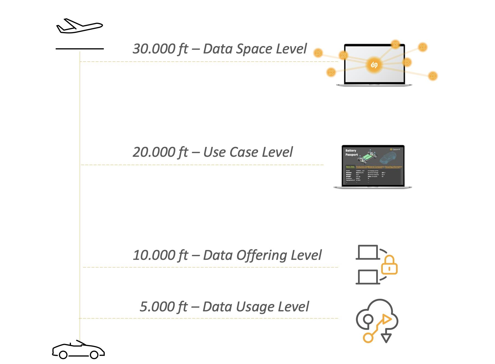

# Governance Framework for Data Space Operations

Catena-X is committed to operating in compliance with all applicable laws and regulations, and we recognize the importance of transparency and accountability in our data space operations. To that end, we continue to develop a holistic Governance Framework that outlines the requirements and responsibilities for all stakeholders involved in our activities.

Maintaining and updating our Regulatory Framework for data space operations lies within the responsibility of the Catena-X Association.

Our Governance Framework for data space operations is designed to follow the highest standards of legal conduct. It includes detailed information on data sovereignty, mandatory use case requirements, and other legal considerations that are relevant to our activities.

To easily grasp the layers of our Governance Framework, think of flight level as a metaphor. The 30,000ft level provides the overall framework; 20,000ft is for specific use cases, 10,000ft for individual data offerings, and 5,000ft for automated contract negotiations. Each higher-level cascades into the lower ones, and the lower levels align with those above.

## 30,000ft - Data Space Level

At this level, the governance framework is defined by the Catena-X Association and the basic principles of the data ecosystem are outlined. Compliance is mandatory for all participants in the data space.
There are several normative documents to consider.

The first is the [operating model](https://catenax-ev.github.io/docs/next/operating-model/why-introduction). The operating model lays the foundation and is the pre-requisite for further standardization, certification, implementation, and operations of software components and partners in the Catena-X data space. The operating model is continuously updated to reflect the evolution of business and regulatory requirements, as well as emerging technologies.

The ["10 Golden Rules"](https://catenax-ev.github.io/docs/next/regulatory-framework/30000ft/ten-golden-rules) document, which outlines the basic principles of the data ecosystem, is published by the Catena-X association and provides clear guidelines for necessary specifications at lower levels. It also specifies how far a technical standard can go. The agreement between the CSPs and participants (e.g., data providers and data consumers) is established during onboarding.

Furthermore, the [Country Clearance List](https://catenax-ev.github.io/docs/next/regulatory-framework/30000ft/country-clearance-list) must be observed, which shows the countries for which onboarding is possible without restrictions and the countries for which onboarding is possible after a due diligence check.

## 20,000ft - Use Case Level

At this level, the Catena-X Association provides specific guidelines for each use case. The basic requirements for data usage in a use case are outlined. Participants are required to confirm compliance with the standards and policies in order to participate in a specific use case. This is an essential and unique part of our Catena-X data space and allows our use cases to scale across the network and multiple value chain levels. Compliance is mandatory for all participants of a dedicated use case.

An important document at this level is the Data Exchange Governance. This Data Exchange Governance sets out the key principles for data exchange that apply to each Participant when exchanging data in the Catena-X Data Space for one or more purposes as predefined by the Association ("Predefined Purpose(s)"). Each Participant must agree to this Data Exchange Governance in order to effect data exchanges through a registered connector. The process of agreeing to this Data Exchange Governance, as well as for concluding legally binding data exchange contracts is not part of this Data Exchange Governance. It does not determine or restrict how Participants need to make their contractual declarations legally binding. Rather, the Data Exchange Governance contains standardised technical parameters for data exchange and other mandatory requirements that correspond to the predefined purposes described in more detail under the following link [repository](https://github.com/catenax-eV/cx-odrl-profile).

:::info

Disclaimer: This document is only temporarily located at this level. It will soon be located at the 30,000-ft level.

:::

The standardized usage policies represent a consolidation of the predefined use case frameworks. The only difference is the purpose of use.
The Catena-X ODRL profile is used for this purpose. The primary aim of the Catena-X ODRL profile is to provide standardised contract modules such as permissions, prohibitions and obligations in a machine-readable format that can be checked automatically. The ODRL profile enables the automation of contract negotiations in the Catena-X data space, as contract negotiations are conducted electronically as standard via a registered connector.
All standardised contract modules referenced in the Catena-X ODRL profile have a legal description, a technical term for referencing (‘leftOperand’) and in some cases a defined list of possible or permitted or standardised values (‘rightOperand’). The Catena-X ODRL profile initially focuses on providing standardised data usage guidelines (‘purposes’) for the Catena-X use cases as a common basis that all participants in the data space can rely on to ensure trust, interoperability and scalability. These guidelines represent the Catena-X value proposition of data sovereignty in its purest form.

## 10,000ft - Data Offering Level

At this level, participants configure specific data offerings while the Catena-X association provides a framework and structure for individual adjustments for non-mandatory scope. The association therefore provides guidance for data offerings by data providers and data consumers.

## 5,000ft - Data Usage Level

At this level, automated negotiations of data usage contracts between participants for specific data offerings (as defined at 10,000ft) occur through the Eclipse Data Space Connector (EDC). A data usage contract with the EDC (decentralized and key-signed protocol for data usage logging) can specify which partners, which data assets, and for how long data is used.

## Summarizing

While Data Providers and Data Consumers have the option of concluding bilateral contracts (supplier contract, ...) outside of a registered connector to determine their contractual relationship for data exchange via Catena-X, the Catena-X Regulatory Framework sets out certain boundary conditions (10 Golden Rules, Data Exchange Governance...) that are binding for all data space participants and cannot be negated with bilateral contracts outside the confines of the Catena-X Regulatory Framework.

These boundary conditions, combined with the possibility to automate data exchange contract negotiations, form one of the key benefits and foundations for scaling of the Catena-X Data Space. For more information on how to conclude data exchange contracts via Catena-X, please refer to the Catena-X memorandum on how to conclude data exchange contracts.

We encourage all stakeholders involved in Catena-X's activities to familiarize themselves with our Governance Framework for data space operations and understand the requirements and obligations that apply to them as we continue to publish them. By working together in a transparent and accountable manner, we can build a trusted, scalable and efficient data exchange network for the automotive industry.
