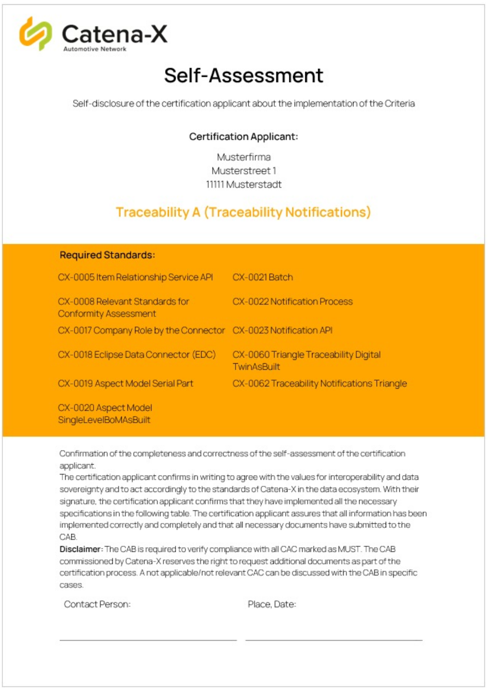
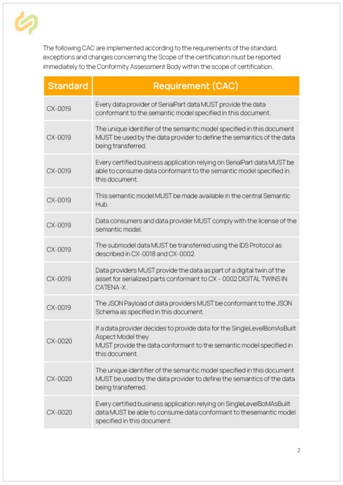
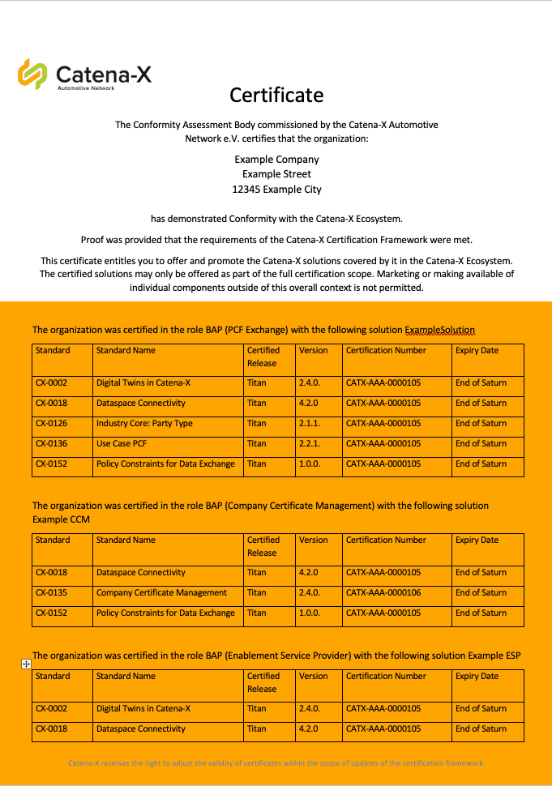
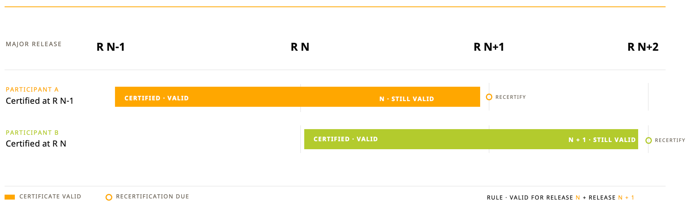

## Certification process

### Certification process

As part of the certification process, certification applicants are guided through five phases. The phases are the prospect, inquiry, offer, certification and award phases.

Prospect phase → Inquiry phase → Proposal phase → Certification phase → Award phase

Return loops in the process:

- **Requirements not met** — from the Inquiry phase and from the Certification phase back to the Prospect phase and the Proposal phase
- **Need for recertification** — from the Catena-X Documentation Base back to the Proposal phase
- **Expiration of certification** — from the Catena-X Documentation Base back to the Inquiry phase

### Process of certification over time

*The following diagram is given to the certification applicant to explain the certification process.*

1. **Request via Catena-X** — Requests for certification are made via the CX homepage
2. **Information to CAB** — Listing of the accredited CAB on the CX homepage so that the certification applicant can contact the CAB directly
3. **Contract** — The certification applicant and the CAB conclude a contract
4. **Sending the list of requirements** — Essential requirements from the CAB is provided to the certification applicant: subject of audit (standards // CAC) and examples; history of existing certificates; self-assessment questionnaire
5. **Kickoff & FAQ** — Presentation of the certification object (e.g., use case, app, etc.), answering questions and organizational points: remote, physical, data exchange, etc.
6. **Certification** — The CAB carries out the certification according to the specifications of the CAF and informs the certification applicant about the result
7. **Results handed over to Catena-X** — The CAB hands CX the results of the certification and standardized feedback on certification
8. **Awarding of the certificate** — The CAB awards the certificate on behalf of CX. CX publishes the result on the CX homepage
9. **Part of the Catena-X data ecosystem** — The certificate is valid for the entire duration of a release. If the certification applicant certificate has expired, a recertification must be carried out

Upon expiration, the certificate will be removed from the CX homepage and participation in the CX data ecosystem will no longer be allowed. Thus, the renewal of the certificate is the responsibility of the certified company.

### Self-assessment and template for declaration of completeness and correctness

In the self-assessment, the certification applicant submits a self-assessment to the CAB about the implementation of requirements.

**Self-assessment of the certification applicant:**

**Certification Scope:** Includes the certification standards for the desired certification

**Conformity Assessment Criteria (CAC):** List of CAC relevant for the certification scope, which are checked via a self-assessment

**Information from the certification applicant:** Information on the individual requirements or questions specified in the self-assessment

**Declaration of completeness and correctness:** The certification applicant confirms the completeness and correctness of the information

## The Catena-X certificate

### Catena-X certificate

The requirements for the certificate provide a complete overview and traceability of certification.

**Requirements for the Catena-X certificate:**

Catena-X certificate includes following content:

- Full company name of the certified company
- Role of the company in the ecosystem in connection with certification scope
- Fulfilled Catena-X Standards with versioning
- If applicable, notes such as "ISO 9001 must be submitted to Catena-X within 12 months to meet the CX-0008 standard"
- Validity (respective Release)
- Certification expiration date
- Certification number

### Certification identification

*The unique certificate number connects the CAB to the certification recipient and can be verified at CX.*

The certificate number **CATX-ABC-0000001** of the Catena-X certificate consists of and provides information on…

| Part        | Meaning                                                                                                                                       |
|-------------|-----------------------------------------------------------------------------------------------------------------------------------------------|
| **CATX**    | Abbreviation for the content-related connection with Catena-X                                                                                 |
| **ABC**     | Unique abbreviation assigned per CAB to identify a CAB commissioned by Catena-X. Outsiders cannot link any names of CABs via the abbreviation |
| **0000001** | Sequential number for one-time certificates                                                                                                   |

Depending on the point in time, there will be three different identification options for certified apps and companies:

1. In the first iteration for identification, certification objects can receive information by e-mail. A request can be sent via the [Catena-X contact page](https://catena-x.net/de/kontakt) in form of an e-mail.
2. The first specification of the information on the certification objects is provided by a verification website of Catena-X (link follows). Here, companies and partners can independently find certified companies in the database by entering the certificate number.
3. In the final stage, an electronic certificate is stored as a QR code on the certificate. This allows a clear identification of a certified provider/solution.

### Backward compatibility

Backward compatibility is intended to determine the temporal extent of a recertification requirement and the validity of the current certification in the CX ecosystem, taking into account compliance with the requirement dimensions\*.

Changes in requirements, e.g., new relevant standards for the use case or new CAC lead to recertification.

At the end of the transitional period the certified person will be deprived of the right to operate in the CX ecosystem.

The backward compatibility and thus the transition period can be suspended by Catena-X if necessary\*\*.

**The defining factors / Requirements dimensions:**

- Degree of dependency between standards
- New releases of the standards and their degree of change
- Scope of changes to the basic conditions

\* Requirements/requirement dimensions are described in the next chapter.
\*\* The suspension of the transition period can take place, for example, by the introduction of a major release.

## Up-to-date status of certifications

With every Catena-X release — whether major or minor — the Conformity Assessment Bodies (CABs) are provided with the updated certification catalog and the accompanying modular system. This ensures that all assessment criteria (CAC)  and test procedures always reflect the current standard versions, enabling consistent, traceable and up-to-date conformity assessments across the entire ecosystem.

## Certification Release Support

**Supported releases for certification:**

Certification is always possible to be performed against the two major releases, the major release that is in lifecycle state „current“ and the one that is in lifecycle state „Maintained". When Release N is Current, certification is possible against Release N-1 (Maintained) and Release N (Current). Once Release N+1 (Current) becomes generally available in the ecosystem, the supported certification scope shifts to Release N (Maintained) and Release N+1 (Current); with the availability of Release N+2, the scope shifts accordingly to Release N+1 and Release N+2.

**Data space compliance:**

An application must be compliant with the data space. Compliance can be demonstrated against any release within the supported certification scope.

**Handling of minor releases:**

If a minor release is published and assigned to a major release (e.g. a minor release added to Release N), that minor release constitutes the latest version of the respective major release and therefore becomes the applicable target for certification.

**Transition period:**

As certification requires a defined lead time, applicants may continue to certify against the preceding maintenance release until the minor release of the current major release has been published.

## Certificate Validity

Catena-X Certificates are issued based on Catena-X Releases (e.g. CX-Neptune). The certificate thereby confirms conformity of the application and its provider against standards and normative documents as published for that release. Thereby:

- A certificate always names the End of the release it was issued for (e.g. End of Neptune).
- Changes introduced by later releases (new or updated standards, new test cases) are not covered retroactively by an existing certificate.
- A certificate cannot be transferred to another release without a formal (re-)assessment, unless the preconditions set under [Extension of Certificates](#extension-of-certificates)

### Validity Period

**General rule:** A certificate remains valid **until the end of the maintenance phase of the release it was issued for.**

Because Catena-X maintains each major release during the lifetime of its successor, this results in the following rule:

> A certificate is valid for the release it was issued for (Release N) and for the following major release (Release N+1).

With the publication of Release N+2, the certificate issued for Release N expires and recertification becomes due.

### Extension of Certificates

Catena-X Certificates are generally issued for a defined validity period that is tied to a release of the Catena-X standard (e.g. End of Saturn). If a standard has not changed at all or has only received patch changes (see Catena-X Operating Model How: [Life Cycle Management](../../operating-model/how-life-cycle-management)) since the certified product was assessed, the validity of the certificate for that specific standard can be extended to the major release following the initially certified release. The extension of validity can only happen at the end of validity of the certain standard. Additionally, the association can nominate Standards that are also to be covered by this rule.
This extension is not granted automatically: The software provider must actively request the extension of validity for the specific standard from the association. The extension applies only to the specific standards that meet the "no changes or patch changes only" condition. All other standards associated with the certified product remain subject to the regular recertification process and must be re-assessed as part of the upcoming release cycle. This includes standards of the underlying technical stack: if such a standard changes in a non-patch manner, the software provider must adopt the new version, and the CAB verifies this as part of the recertification.

Currently, nominated Standards outside of patch changes:
- CX-0128

Example: A DCM app that was certified for Jupiter has its certificate for the specific standard CX-0128 extended from “End of Jupiter” to “End of Saturn” upon request to the association. Other standards included in the application stack (such as CX-0018) to which the **no change** scenario does not apply must still be recertified by a CAB. Practically, this means the DCM app must migrate from a Jupiter-compliant EDC to at least a Saturn-compliant connector and evidence this to the CAB, otherwise the overall product certification elapses despite the extended CX-0128 certificate.
