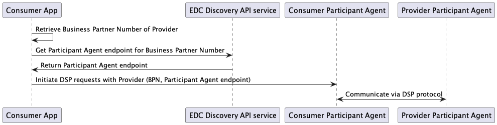

---
tags:
  - CAT/Portal
  - CAT/Core Service Provider
  - CAT/Sandbox Services (Beta)
  - CAT/Sandbox Service Provider
---

# CX-0001 EDC Discovery API v1.1

## 1. Introduction

For certain use cases within the Catena-X Data Space, there is only rudimentary information on the data provider from
whom a consumer would like to get data from, e.g., only the Business Partner Number of the provider is known.
For such cases, it is crucial, that the Data Space provides a mechanism that allows to find the Participant Agent of
the provider in order to initiate a data transfer. This standard specifies a discovery service that based on the
knowledge of the Business Partner Number allows to retrieve the Participant Agent endpoint.

The second important aspect specified in this standard is a requirement towards GAIA-X compliance, which requires
that each Participant Agent must provide a Self Description (SD) of type `ServiceOffering`. This requires a
registration of a Participant Agent at the Core Service Provider B.

NOTE: It is a deliberate decision to keep the name `EDC Discovery API` for this standard, although the name EDC is not
defined within the Data Space. The correct term, as defined in the
[Data Space Protocol](#data-space-protocol) is `Participant Agent` which will be used throughout this
standard. The reason for not changing the title of the standard as well is based on the fact that the name
`EDC Discovery` is used in other normative documents as well. A consistent change of the naming would require an
effort that is not justified as this standard is about to become obsolete and replaced by other mechanisms in
the near future.

### 1.1 Audience & Scope

> *This section is non-normative*

This standard is relevant for the following roles:

- Data Provider / Consumer
- Business Application Provider
- Core Service Provider
- Onboarding Service Provider
- Enablement Service Provider

The purpose of the `EDC Discovery API` is to provide the ability to identify Participant Agents provided by
a Data Space participant based on the knowlegse of the Business Partner Number of the participant. This
document describes the relevant API endpoint to be created by an Core Service Provider B.

### 1.2 Architecture Overview

> *This section is non-normative*



Figure 2 Main Interactions

A service providing the `EDC Discovery API` is provided from a Core Service Provider B. As every Participant Agent
is requested to be registered with the Core Service Provider B, this discovery service has complete information on
existing Participant Agents and the corresponding participant referenced by the Business Partner Number.

Every Data Consumer who is about to initiate a data transfer according to
[CX-0018](#cx-0018-dataspace-connectivity) needs to know the participant
agents endpoint to initiate contact. If this endpoint is not known, the `EDC Discovery API` service allows to
search for this endpoint of the Data Provider in question based on the Business Partner Number. After retrieving
the Participant Agents endpoint, the Data Consumer can initiate the interactions as specified in
[CX-0018](#cx-0018-dataspace-connectivity).

How a Data Consumer gets to know the Business Partner Number of the Data Provider is not in scope of this standard.

### 1.3 Conformance

As well as sections marked as non-normative, all authoring guidelines, diagrams, examples, and notes in this
specification are non-normative. Everything else in this specification is normative.

The key words **MAY**, **MUST**, **MUST NOT**, **OPTIONAL**, **RECOMMENDED**, **REQUIRED**, **SHOULD** and **SHOULD NOT**
in this document are to be interpreted as described in BCP 14 RFC2119, RFC8174 when, and only when, they
appear in all capitals, as shown here.

### 1.5 Proof of conformity

All participants and their solutions will need to proof, that they are
conform with the Catena-X standards. To validate that the standards are
applied correctly, Catena-X employs Conformity Assessment Bodies
(CABs).

- The Service Operator MUST provide an onboarding process for
  participants and participant agent instances. This has to be provided in
  accordance to
  [CX-0006](#cx-0006-registration-and-initial-onboarding)

- The implemented service MUST use an SD storage like SD-Hub for storing the SD documents
  provided during the onboarding process.

- The provided SD documents MUST be GAIA-X compliant, i.e. MUST provide a compliance credential issued
  from GAIA-X AISBL.

A test case could be, that a Participant Agent instance has to be onboarded for a specific participant
identified by a BPN. The SD for the Participant Agent has to be visible in the supported SD storage
(currently central hosted by the Core Service Provider B). The SD documents has to be accessible by the
dataspace participants.

### 1.6 Examples

**SD for ServiceOffering**

```json
{
    "selfDescriptionCredential": {
        "@context": [
            "https://www.w3.org/2018/credentials/v1",
            "https://registry.gaia-x.eu/v2206/api/shape"
        ],
        "type": [
            "VerifiableCredential",
            "ServiceOfferingExperimental"
        ],
        "id": "https://compliance.gaia-x.eu/.well-known/serviceComplianceService.json",
        "issuer": "did:web:delta-dao.com",
        "issuanceDate": "2022-09-25T23:23:23.235Z",
        "credentialSubject": {
            "id": "https://compliance.gaia-x.eu/.well-known/serviceComplianceService.json",
            "gx-service-offering:providedBy": "https://compliance.gaia-x.eu/.well-known/participant.json",
            "gx-service-offering:name": "Gaia-X Lab Compliance Service",
            "gx-service-offering:description": "The Compliance Service will validate the shape and content of Self Descriptions. Required fields and consistency rules are defined in the Gaia-X Trust Framework.",
            "gx-service-offering:webAddress": "https://compliance.gaia-x.eu/",
            "gx-service-offering:termsAndConditions": [
                {
                    "gx-service-offering:url": "https://compliance.gaia-x.eu/terms",
                    "gx-service-offering:hash": "myrandomhash"
                }
            ],
            "gx-service-offering:gdpr": [
                {
                    "gx-service-offering:imprint": "https://gaia-x.eu/imprint/"
                },
                {
                    "gx-service-offering:privacyPolicy": "https://gaia-x.eu/privacy-policy/"
                }
            ],
            "gx-service-offering:dataProtectionRegime": [
                "GDPR2016"
            ],
            "gx-service-offering:dataExport": [
                {
                    "gx-service-offering:requestType": "email",
                    "gx-service-offering:accessType": "digital",
                    "gx-service-offering:formatType": "mime/png"
                }
            ],
            "gx-service-offering:dependsOn": [
                "https://compliance.gaia-x.eu/.well-known/serviceManagedPostgreSQLOVH.json",
                "https://compliance.gaia-x.eu/.well-known/serviceManagedK8sOVH.json"
            ],
            "ctxsd": "connector-url"
        },
        "proof": {
            "type": "JsonWebSignature2020",
            "created": "2022-09-25T22:36:50.274Z",
            "proofPurpose": "assertionMethod",
            "verificationMethod": "did:web:compliance.gaia-x.eu",
            "jws": "eyJhbGciOiJQUzI1NiIsImI2NCI6ZmFsc2UsImNyaXQiOlsiYjY0Il19..Chbzpl0-4S3sobkKXyBjfx6pm74xLHInOmruHUmO--3HpMcrfKldeJQPYLrUWsEJ1HIjMUqxE6QymZRxXfuRlAJKy2nwyM3S5sFX9YJ8bepBcf6q-nWGTDX-jh8wuyX3lwrG94aJnTBByKPLCovSiZ9BURR3cwiSHczBlM7iP90ee5roHOtI-eoqSBYrYaynTaK5eQaWfT-2OdXYgqVPSRJAK2KD5AqEM8KU7x6nnP6-shgSNBIEC1fAOTfAEUYkcrK8Tn4BTaH02HnO3B90S1MWyAWwBzrnmS915CFY4BiHsp9Tz7pt016c8HB8HE7gqoXndk7DUhzgNE2mRbHuLg"
        }
    },
    "complianceCredential": {
        "@context": [
            "https://www.w3.org/2018/credentials/v1"
        ],
        "type": [
            "VerifiableCredential",
            "ServiceOfferingCredentialExperimental"
        ],
        "id": "https://catalogue.gaia-x.eu/credentials/ServiceOfferingCredentialExperimental/1664145414932",
        "issuer": "did:web:compliance.gaia-x.eu",
        "issuanceDate": "2022-09-25T22:36:54.932Z",
        "credentialSubject": {
            "id": "https://compliance.gaia-x.eu/.well-known/serviceComplianceService.json",
            "hash": "eeac8a9b5b6750f13fbc548299b22b73d6beea13f19e71856d0027b5cd42069c"
        },
        "proof": {
            "type": "JsonWebSignature2020",
            "created": "2022-09-25T22:36:54.932Z",
            "proofPurpose": "assertionMethod",
            "jws": "eyJhbGciOiJQUzI1NiIsImI2NCI6ZmFsc2UsImNyaXQiOlsiYjY0Il19..SibPFxPtfsKP439SjoKo5VtmU_EpgsfuEjghCt_8sG2fUYT6s9CTY8jyEniGUkk7BIWnIYNsuuKudlNBD27kwzdTy6bZX9Jq0OaAaCpgZAZ9vlp7oFZF3ysLcERmBAixzGUjL0sny06Mu7IRCcDYVhLyd6flOvUGtH2I6T9u6UZL8cN1advRYKd4BSumAp5d4cCG-7cg7DCqPXk_M8cTvU8mDeXvXfciv7sIqvkwqd2L-T4kbxmPTCY3r3wPoVHGBDa3Gnntwkz3_aVInjbztchH-WmlDpCPv1hTv4uZNenNZVw7xsx1_o0voJJLSGtlYNhW4rk2oDxr4qie3S-Zgw",
            "verificationMethod": "did:web:compliance.gaia-x.eu"
        }
    }
}
```

### 1.7 Terminology

> *This section is non-normative*

The following terms are especially relevant for the understanding of the
standard:

**Business Partner Number (BPN)**

A BPN is the unique identifier of a partner within Catena-X, see [CX-0010](#cx-0010-business-partner-number).

**Self Description (SD)**

Gaia-X requires all providers to describe themselves and their service
offerings using standardized, machine-readable metadata called
Self-Descriptions. Such Self-Descriptions will for example include
information like the address of a company, a specific service
description or certificates and labels.

**Participant Agent**

A Participant Agent is a service that fulfills the requirements of the
[CX-0018 standard](#cx-0018-dataspace-connectivity)

Additional terminology used in this standard can be looked up in the
glossary on the association homepage.

## 2 EDC Discovery API

> *This section is normative*

The `EDC Discovery API` service MUST be offered as central available endpoint by the Core Service Provider B.
Every Participant Agent operated in the Data Space MUST be registered.

The `EDC Discovery API` can get triggered via technical as well as
real users, if relevant roles are available.

For technical user, a company can request the user creation with the
technical user creation feature inside the portal.

- The Core Service Provider B MUST offer a process/workflow to register Participant Agents; Enablement Service
  Provider as well as Application Service Provider MUST run the Participant Agent registration for their service customers.

- SD documents MUST be created for every Participant Agent registered and stored by the Participants.
  The Core Service Provider B make them available.

- The provided SD documents MUST be GAIA-X compliant, i.e. MUST provide a compliance credential issued from GAIA-X AISBL.

A test case will be, that a Participant Agent instance has to be onboarded for a
specific participant identified by a BPN. The SD for the EDC has to be
visible in the supported SD storage. The query against this new
registered EDC instance for the given BPN SHOULD provide the connector
url as stated in the SD document.

## 2.1 Preconditions and dependencies

The self-description documents used as data source MUST be GAIA-X
compliant, i.e. adhering to the [GAIA-X Trustframework](#gaia-x-trustframework) in the currently
supported version in Catena-X (usually the latest published version and
the version before). In addition, these SD documents MUST be registered
at an SD storage like SD-Hub.

## 2.2 API Specification

### 2.2.1 API Endpoints & resources

The `EDC Discovery API` MUST be implemented as specified here:

Endpoint: POST: `/api/administration/connectors/discovery`

**Request body**

the request body can be kept empty (to retrieve a complete list of registered Participant Agents) or be filled
with one or multiple BPNs to retrieve a list of registered Participant Agent endpoints for the giving BPNs.

```json
[
    "BPNL....",
    "BPNL...."
]
```

**Response structure**

```json
[
    {
        "bpn": "BPNL......",
        "connectorEndpoint": [
            "http://some.example.url",
            "http://some.other-example.url"
        ]
    },
    {
        "bpn": "BPNL......",
        "connectorEndpoint": "http://some.example.url"
    }
]
```

For each BPN an own response object is provided. In case of multiple Participant Agent
instances for one BPN an array is returned (first result set) otherwise
a single value (second result set)

### 2.2.2 Available Data Types

The API MUST use JSON as the payload transported via HTTP.

### 2.2.3 Data Asset Structure

This API is not accessed via a Participant Agent but can be
queried from any authorized participant or service directly.

### 2.2.4 Error Handling

HTTP standard response codes that MUST be used.

#### 2.2.4.1 Error Messages & Explanation

|     Code    |     Description                                |
|-------------|------------------------------------------------|
|     200     |     Discovery request finished successfully    |
|     400     |     Request body was malformed                 |
|     401     |     Not authorized                             |
|     403     |     Forbidden                                  |
|     405     |     Method not allowed                         |

## 3 REFERENCES

### 3.1 Normative References

Following Standards are used within this standard:

#### CX-0006 Registration and initial onboarding

- [CX-0006](https://catenax-ev.github.io/docs/standards/CX-0006-RegistrationAndInitialOnboarding)

#### CX-0010 Business Partner Number

- [CX-0010](https://catenax-ev.github.io/docs/standards/CX-0010-BusinessPartnerNumber)

#### CX-0018 Dataspace Connectivity

- [CX-0018](https://catenax-ev.github.io/docs/standards/CX-0018-DataspaceConnectivity)

#### Data Space Protocol

- [DSP](https://eclipse-dataspace-protocol-base.github.io/DataspaceProtocol/2025-1-RC1)

#### GAIA-X Trustframework

- [GAIA-X Trustframework](https://docs.gaia-x.eu/policy-rules-committee/trust-framework/22.10/)

## Legal

Copyright © 2025 Catena-X Automotive Network e.V. All rights reserved. For more information, please visit [here](/copyright).
