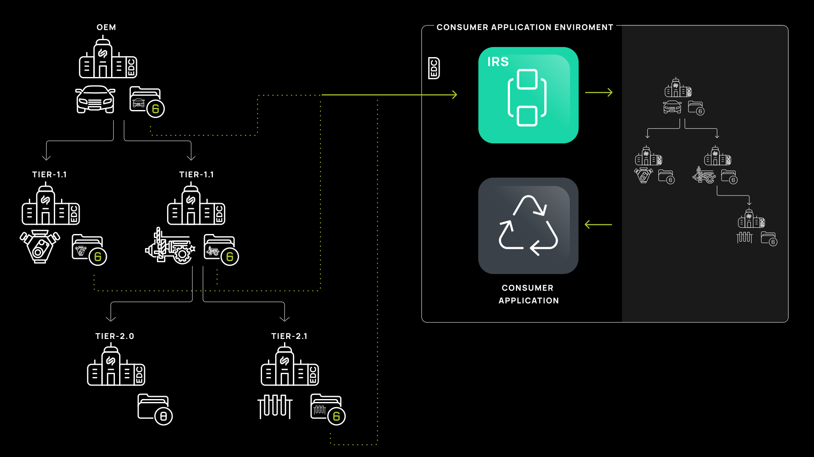

# CX-0005 Item Relationship Service API 2.1.1

## FOR WHOM IS THE STANDARD DESIGNED

## COMPARISON WITH THE PREVIOUS VERSION OF THE STANDARD

> *Relevant only for existing standards. At the new standard, please delete*

## ABSTRACT

Today, a large amount of data is stored among different participants in a supply chain of an
industry. The value of the data can be enhanced immensely by connecting the data to their related
context.

To enable cross-enterprise linked data, standards such as aspect models, standardized protocols, and
standardized ways to connect the data are applied. One of the first FOSS solutions to be developed
in Catena-X for accessing cross-enterprise linked data is the Item Relationship Service. This
document aims to standardize the API of the service so that any new participant can access this
interface to build new solutions based on data chains. Connected data, so-called data chains, are
seen as a valuable asset for the consortia that serve as an enabler technology for other Use-Cases
to build solutions on.

## 1 INTRODUCTION

### 1.1 AUDIENCE & SCOPE

> *This section is non-normative*

List for which roles the standard is relevant:

- Core Service Provider
- Data Provider / Consumer
- Business Application Provider
- Enablement Service Provider
- Consulting Provider

This Standard applies for Applications, which want to access Data Chains, and provide an
interoperable Solution for the Catena-X Network. To the time being of writing this document there
are Traceability Aspect Models which build data chains. So, this applies to the Traceability Business
Domain.

### 1.2 CONTEXT AND ARCHITECTURE FIT

> *This section is non-normative*

This standardization is built upon existing standards, such as

- “EDC Discovery API" [CX-0001]
- “Digital Twins in Catena-X“ [CX-0002]
- “SAMM Semantic Aspect Meta Model“ [CX-0003]
- “BusinessPartnerNumber“ [CX-0010]
- “Dataspace Connectivity v3.0.0” [CX-0018]
- “Implementation Specification: Data Provisioning for Release 2” [CX-0024]
- “Aspect Model: DataModelBoMAsSpecified“ [CX-0030]
- “Aspect Model: DataModelPartAsSpecified“ [CX-0032]
- “Aspect Model: PartSiteInformationAsPlanned" [CX-0094]
- “TraceabilityUseCase“ [CX-0125]
- "Industry Core: Part Instance" [CX-0127]
- "Industry Core: Part Type" [CX-0126]

further Aspects which conclude in connecting Digital Twins between each other will be added to the Semantic Hub.

The following aspect models are also relevant:

- “Aspect Model: SingleLevelUsageAsBuilt"
- “Aspect Model: SingleLevelUsageAsPlanned"
- “Aspect Model: JustInSequencePart"
- “Aspect Model: PartSiteInformationAsBuilt"
- “Aspect Model: PartSiteInformationAsPlanned"

Currently, no open Standard exists, which addresses this issue, based on the combination of the used
standards like Aspect Models, AAS (AssetAdministrationShell), EDC (Eclipse Dataspace Connector), and the Implementation specification it is a solution fit to the needs of Catena-X to simplify the interactions with data chains.

This API has been designed to provide Interoperability within Catena-X on a Data Chain layer. Currently,
this is being developed in the Tractus-X Eclipse FOSS project.

The IRS iterates through multiple digital twin aspects, which are representing a relationship. An example
aspect is the SingleLevelBOMasBuilt aspect, which connects serialized parts with each other, across company
boundaries. This service is accessing the aspects of digital twins for which an EDC policy and data contract
must exist.

The following general conditions apply:

- Access control through policies and contracts by the EDC
- Direct data exchange between supply-chain partners
- Catena-X partners of the accessible value chain are known to the data-consumer

*Figure 1: IRS in iterative mode*

### 1.3 CONFORMANCE AND PROOF OF CONFORMITY

> *This section is non-normative_

As well as sections marked as non-normative, all authoring guidelines, diagrams,
examples, and notes in this specification are non-normative. Everything else in
this specification is normative.

The key words **MAY**, **MUST**, **MUST NOT**, **OPTIONAL**, **RECOMMENDED**,
**REQUIRED**, **SHOULD** and **SHOULD NOT** in this document document are to be
interpreted as described in BCP 14 [RFC2119] [RFC8174] when, and only when, they
appear in all capitals, as shown here.

All participants and their solutions will need to prove, that they are conform
with the Catena-X standards. To validate that the standards are applied
correctly, Catena-X employs Conformity Assessment Bodies (CABs).

To prove conformity with the IRS API Standard provide the following assets to a conformity assessment
body:

- API Response of the Implementation **MUST** match to the response structure of the API Documentation more information in the [Data Chain KIT](https://eclipse-tractusx.github.io/docs-kits/kits/Data%20Chain%20Kit/Adoption%20View%20Data%20Chain%20Kit)

### 1.4 EXAMPLES

Examples and further information are being shared in the [Data Chain KIT](https://eclipse-tractusx.github.io/docs-kits/kits/Data%20Chain%20Kit/Adoption%20View%20Data%20Chain%20Kit)
and in the [Tractus-X Github Repository](https://github.com/eclipse-tractusx/item-relationship-service)

### 1.5 TERMINOLOGY

> *This section is non-normative*

Business Partner Number (BPN)
: A BPN is the unique identifier of a partner within Catena-X

InternationalDataSpace(IDS)
: InternationalDataSpace and its protocol for data exchange foresees an compliant
connector handling contract negotiations before each data transfer and defines a general architecture for data exchange.

EclipseDataspaceConnector(EDC)
: The EDC is a reference implementation for an IDS-compliant connector currently acting as a
de-facto standard and/or reference Implementation within Catena-X

Additional terminology used in this standard can be looked up in the glossary on
the association homepage.

## 2 Item Relationship Service API

> *This section is normative*

The IRS API follows the Apache 2.0 licenses.
The Item Relationship Service API is implemented as a RESTful API following the OpenAPI 3.0 specification
in JSON format. It covers initiating, retrieving, and controlling the lifecycle of a data chain
retrieval process. We use the OpenAPI standard to align on the industry standards for illustrating
RESTful APIs.

## 2.1 PRECONDITIONS AND DEPENDENCIES

The IRS API and the IRS App **MUST** be connected to an EDC in order to consume data offers within the Catena-X data space. It will handle the access and usage control so that a data sovereign data space can be provided

The data accessed and consolidated via the IRS **MUST** be accessible via EDC Assets by data providers;
“Dataspace Connectivity v3.0.0” [CX-0018] and be registered via the Registry Service (Digital Twin Registry) [CX–0002].

The Aspects to traverse along data chains are built upon the data chain aspect template. Aspect models such as the SingleLevelBOMasBuilt is built upon that. The IRS API uses that information to build connected data chains.
To find the correct assets within a data space the Digital Twin registry is beeing used. These preconditions need to be met, so that the IRS API works accordingly.

## 2.2 API SPECIFICATION

### 2.2.1 API ENDPOINTS & RESOURCES

The openAPI documentation is formulated here [IRS API 4.5.2]([IRS API](https://github.com/eclipse-tractusx/item-relationship-service/blob/4.5.2/docs/src/api/irs-api.yaml))
The following Endpoints **MUST** be implemented as described in the openAPI document:

- ItemRelationshipService
  - GET  /irs/jobs
  - POST /irs/jobs
  - GET  /irs/jobs/\{id\}
  - PUT  /irs/jobs/\{id\}
  - POST /irs/orders
  - GET  /irs/orders/\{orderId\}
  - PUT  /irs/orders/\{orderId\}
  - GET  /irs/orders/\{orderId\}/batches/\{batchId\}

The following Endpoints **OPTIONAL** be implemented as described in the openAPI document:

- ItemRelationshipService
  - GET /irs/policies
  - POST /irs/policies
  - PUT /irs/policies/\{policyId\}
  - DELETE /irs/policies/\{policyId\}

The following Endpoints **OPTIONAL** be implemented as described in the openAPI document:

- EnvironmentalAndSocialStandards
  - POST /ess/bpn/investigations
  - GET /ess/bpn/investigations/\{id\}
  - POST /ess/notification/receive
  - POST /irs/ess/orders

- AspectModels
  - GET /irs/aspectmodels

### 2.2.2 AVAILABLE DATA TYPES

The API **MUST** use JSON as the payload transported via HTTPS(TLS).

### 2.2.3 EDC DATA ASSET STRUCTURE

Not applicable for this document

### 2.2.4 ERROR HANDLING

The following http response codes **MUST** be defined for IRS API endpoints:

- **200:** The request succeeded
- **201:** The request succeeded and returns the expected result
- **206:** This is sent when a partial result of a resource is being sent.
- **400:** Bad Request - Requested operation in failed state.
- **401:** Unauthorized - No valid authentication credentials.
- **403:** Forbidden - Authorization refused by server.
- **404:** Not Found - Requested resource not found

[IRS API 4.5.2]([IRS API](./assets/irs-api.yaml))
More information for each endpoint can be extracted from the IRS API documentation.

## 3 REFERENCES

### 3.1 NORMATIVE REFERENCES

- Digital Twins in Catena-X [CX–0002]
- Dataspace Connectivity v3.0.0 [CX-0018]
- Implementation Specification: Data Provisioning for Release 2 [CX-0024]
- TraceabilityDataProvisioningBoMAs-PlannedTriangle [CX-0061]
- “TraceabilityUseCase“ [CX-0125]

### 3.2 NON-NORMATIVE REFERENCES

> *This section is non-normative*

- “Aspect Model: DataModelBoMAsSpecified“ [CX-0030]
- “Aspect Model: DataModelPartAsSpecified“ [CX-0032]
- “AspectModel: PartSiteInformationAsPlanned“ [CX-0094]
- "IndustryCorePartInstance" [CX-0127]
- "IndustryCorePartType" [CX-0126]

- [Item Relationship Service (Publication on website)](https://catena-x.net/en/offers-standards/item-relationship-service)

### 3.3 REFERENCE IMPLEMENTATIONS

> *This section is non-normative*

The code found at [https://github.com/eclipse-tractusx/item-relationship-service](https://github.com/eclipse-tractusx/item-relationship-service)
represents a reference implementation that implements this standard.

## ANNEXES

### FIGURES

> *This section is non-normative*

### TABLES

> *This section is non-normative*

## Legal

Copyright © 2024 Catena-X Automotive Network e.V. All rights reserved. For more information, please visit [here](/copyright).
