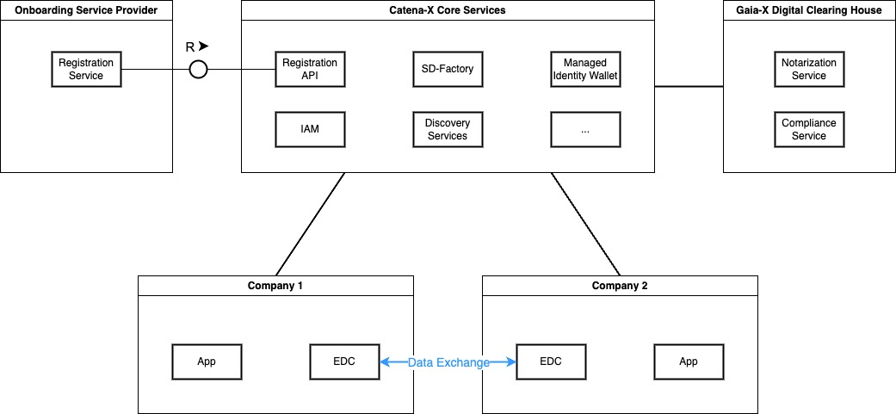
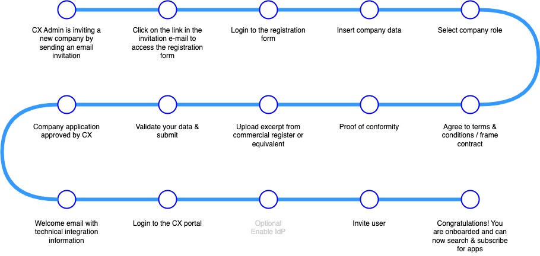
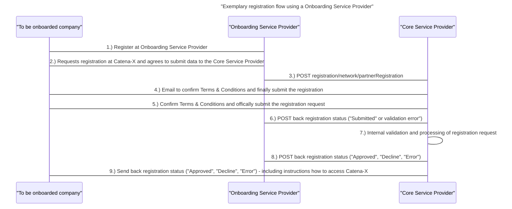

---
tags:
  - CAT/Portal
  - CAT/Core Service Provider
  - CAT/Sandbox Services
  - CAT/Sandbox Service Provider
  - CAT/Onboarding Service Provider
---

# CX-0006 Registration and Initial Onboarding v2.0.1

## ABSTRACT

To become a participant of Catena-X, each applicant must go through a
registration process. Registration is a mandatory requirement for all further
activities within the Catena-X network. The registration process, along with other
services, provide the foundation of trust for the Catena-X network.

## FOR WHOM IS THE STANDARD DESIGNED

This standard is relevant for the following roles:

- Core Service Provider
- Onboarding Service Provider

## COMPARISON WITH THE PREVIOUS VERSION OF THE STANDARD

| Version | Change by    | Change Details                                                                                                                                                                                                                                                       |
|---------|--------------|----------------------------------------------------------------------------------------------------------------------------------------------------------------------------------------------------------------------------------------------------------------------|
| 2.0.0   | Julia Jeroch | Updated following chapters: - 2.3.4 Company Data Validation - 2.3.8 Gaia-X  And added: - 2.3.5 Business Partner Number Creation - 2.3.6 Wallet Tenant Creation - 2.3.7 Credential Storage - 2.3.9 Registration Approval and Dataspace Access |

## 1 INTRODUCTION

The document deals with the initial registration process which is the initial
mandatory step for new Catena-X network participants.

### 1.1 AUDIENCE & SCOPE

> *This section is non-normative*

This standard is relevant for the following roles:

- Core Service Provider
- Onboarding Service Provider

### 1.2 CONTEXT AND ARCHITECTURE FIT

> *This section is non-normative*

In order to register participants, the Core Service Provider operates a registration service where a registering company can enter its details to initiate the registration process.

The interaction between Core Service Provider and Onboarding Service Provider is defined in this standard.

Figure 1 shows a high-level view of a section of Catena-X. It consists of the
following building blocks:

- Catena-X Core Services -- Basic services, like for example discovery
   services, used by all participants of Catena-X. The core services are
   standardized by the Catena-X consortium.

- Participants environments -- A participant can offer and consume
    data. For this, he needs an Eclipse Dataspace Connector as well as
    corresponding prosumer applications. The applications are provided
    by Catena-X application providers.

- The Gaia-X Digital Clearing House (GXDCH) consists of a notarization
    service and a compliance service and can be operated by another
    party. GXDCH is a Gaia-X component and must therefore comply with
    the corresponding Gaia-X standards. GXDCH on the one hand verifies
    the legitimacy of Catena-X participants and on the other hand it
    ensures the creation of Gaia-X compliant self-descriptions.

Figure 1 High-level view of a section of Catena-X

### 1.3 CONFORMANCE AND PROOF OF CONFORMITY

> *This section is non-normative*

As well as sections marked as non-normative, all authoring guidelines, diagrams, examples, and notes
in this specification are non-normative. Everything else in this specification is normative.

The key words **MAY**, **MUST**, **MUST NOT**, **OPTIONAL**, **RECOMMENDED**, **REQUIRED**, **SHOULD**
and **SHOULD NOT** in this document document are to be interpreted as described in BCP 14 [RFC2119] [RFC8174]
when, and only when, they appear in all capitals, as shown here.

All participants and their solutions will need to prove, that they are conform with the Catena-X standards.
To validate that the standards are applied correctly, Catena-X employs Conformity Assessment Bodies (CABs).

The registration process described in this document serves as reference
for future implementations. Core service providers and Onboarding Service Providers implementing
their own registration solution MUST demonstrate compliance by:

- Providing documentation of the registration process implemented.
- Proofing that the registration process includes all the mandatory steps as defined in this standard.
- Proofing that the registration process implemented delivers the mandatory results as detailed in this standard.

## 2 THE REGISTRATION PROCESS

### 2.1 CONTEXTUAL DESCRIPTION

To become a participant of Catena-X, each applicant must go through a
registration process. Registration is a mandatory requirement for all
further activities within the Catena-X network. The registration
process, along with other services, provide the foundation of trust for
the Catena-X network.

### 2.2 ACTORS AND ROLES

|Actors||
|---|---|
|The to be onboarded company |The company that wants to register to Catena-X|
|Core Service Provider|Core Service Providers run core services that enable the basic functionality of the Catena-X data space (e.g., Identity Provider, Discovery Services). They can also act as an Onboarding service provider.|
|Onboarding service provider| Onboarding Service Providers enable data provider/consumer to be registered to the Catena-X network.|

### 2.3 PROCESS REPRESENTATION

Figure 2: Catena-X Registration Process

---

#### 2.3.1 Initial Contact - non normative**

Catena-X follows an invitation-based registration process. Companies can contact Catena-X in one of
the following ways:

- A current member of Catena-X proposes another company as a candidate
- Candidates are approached at trade fairs or other events
- Companies contacting Catena-X via the Catena-X homepage

---

#### 2.3.2 Invite

An Onboarding service provider **MAY** send an invitation mail to the previously identified contact
person of the company to be invited. The mail grants temporary access to the registration tool
of Onboarding service provider.

---

#### 2.3.3.1 Company Data Collection

During the company registration process, the following data **MUST** get collected from the to be onboarded customer:

- Company Name
- Street + House number/Postbox
- Postal Code (depending on country)
- City
- Country
- Unique Identifier (based on country - see Upload excerpt from commercial register or equivalent
  for more information)
- Region / State (optional - depending on country

This can be done either manually or partially automatically if the master data for the company is
already contained in BPDM which is the central business partner directory of Catena-X. At least the
data necessary for creating a business partner entry in BPDM must be provided. For additional
information refer to BPM-001 Business Partner Number and BPM-002 Issuing Agency.

---

#### 2.3.3.2 Select company role inside the Catena-X network

The to be onboarded company **MUST** be able to select at least one of the following roles:

- Active Participant
  - The participant role is covering the data provider, data consumer or app user scenario. As
  participant you are an active member of the network with enabled services to particiapte as
  contributer and user.
- App Provider
  - The App Provider is a company which is providing application software via the CX marketplace. As
  app provider you can participate and use the developer hub, release and offer applications to the
  network and manage your applications.
- Service Provider
  - The Service Provider is able to offer 3rd party services, such as dataspace service offerings to
  CX Members. CX members can subscribe for those services.
- Onboarding Service Provider
  - An Onboarding Service Provider is a company that helps other companies register with Catena-X for the first time.

There may be other roles in the future.

---

#### 2.3.3.3 Agree to terms and conditions

The to be onboarded company **MUST** accept the framework agreement, which consists of the operator
terms, dataspace terms and CX terms (depending on the selected company role).

---

#### 2.3.3.4 Proof of conformity

Each application or service provider **MUST** be able to proof conformity with relevant standards
for the  selected company role. Conformity is assessed by an external conformity assessment body
(CAB). The to be onboarded company **MUST** first complete the conformity assessment and need to be
enabled to provide the certificate of conformity as part of the registration application.

---

#### 2.3.3.5 Upload excerpt from commercial register or equivalent

Each company to be onboarded **MUST** be enabled to provide proof of identity in the form of an
extract from the commercial register or equivalent (depending on the legal entity location of the
to be onboarded company).

Catena-X **SHOULD** support the following identifiers specified by Gaia-X Trust Framework 22.10 (http://docs.gaia-x.eu/policy-rules-committee/trust-framework/22.10/participant/).

|Identifier|Comment|Example|
|-|-|-|
|local|The state issued company number|HRB 123456 (German commercial registration number)|
|VAT ID|The VAT identification number|DE 123456789 (German VAT ID)|
|LEI Code|Unique LEI number as defined by https://www.gleif.org.|123400789abcde123420 (20 digit alpha numeric code)|
|EORI|The Economic Operators Registration and Identification number (EORI)|DE1234567891234567|

---

#### 2.3.3.6 Submit registration

Onboarding service providers and core service providers **MUST** provide a mechanism for submitting
the registration and triggering subsequent activities.

---

#### 2.3.4 Company Data Validation

Once the company data are collected, it must be validated to ensure accuracy and completeness. The following validation checks **MUST** be performed:

- Verify that all required fields are filled out
- Validate the format and accuracy of the unique identifier
- Validate proof of conformity of the registering company
- CSPs should implement robust validation mechanisms to ensure the integrity of the company data.
- In order to avoid duplicates, onboarding service providers / core service providers **MUST** check
whether the company to be onboarded is already registered.

#### 2.3.5 Business Partner Number Creation

After the company data is validated, a unique business partner number must be generated for the registered company (if not already existing). The business partner number serves as a unique identifier for the company within the dataspace.
The generation of the BPN as well as the to-be-used algorithm is covered in the business partner number standard.

- Onboarding service providers / core service providers **MUST** ensure that a Business Partner Number (BPN) exists or is created and linked to the company being registered.

#### 2.3.6 Wallet Tenant Creation

A wallet tenant needs to be created for the registered company. A wallet tenant allows the company to securely store and manage digital credentials and assets in their own separated tenant/instance.
CSPs and OSPs should have a mechanism in place to create a wallet tenant associated with the registered company. The wallet tenant should be securely provisioned and accessible only to authorized individuals.

- Onboarding service providers / core service providers **MUST** ensure that a Managed Identity Wallet is created for the company to be onboarded. The BPN **MUST** be stored in the Managed Identity Wallet as a verifiable credential and serves as a unique ID.

#### 2.3.7 Credential Storage

As part of the registration process, the company's credentials (e.g., digital certificates, authentication tokens) must be securely stored. These credentials are used for authentication and authorization purposes.
CSPs should implement secure storage mechanisms to protect the company's credentials from unauthorized access or tampering.

#### 2.3.8 Gaia-X

- Onboarding service providers / core service providers **MUST** ensure that a company compliance check is executed by an official Gaia-X Digital Clearing House (GXDCH). In alignment with onboarding
service providers / core service providers, GXDCH issues verifiable credentials.
- Onboarding service providers / core service providers **MUST** ensure the creation of a Self-Description (SD) of the Legal Person as part of the application verification process.
The SD **MUST** be stored in a central location and **MUST** be in line with the GAIA-X standards/guidelines.

#### 2.3.9 Registration Approval and Dataspace Access

- Only when all checks have been successfully passed, the onboarding service providers / core service providers **MUST** provide access to the services. If one or several application validation steps have not been passed, the onboarding service providers / core service providers **MUST** reject the registration or defer it for revision.
- Onboarding service providers / core service providers **MUST** provide feedback (success/rejection/revision) to the to be registered company.

### 2.4 TECHNICAL INTEGRATION

Onboarding service providers / core service providers **MUST** provide onboarding companies with
information on the step required to complete technical onboarding (connector registration, technical user creation, etc.).

Onboarding service providers / core service providers **MAY** support with the technical onboarding
(integration of corporate identity provider, connector registration, technical user creation, etc.).

## 3. ONBOARDING SERVICE PROVIDER

An Onboarding Service Provider helps companies register at Catena-X for the first time.
The motivation for this may be that an onboarding service provider wants to make it easier for its
own customers to get onboarded to Catena-X, or to make the Catena-X onboarding process smoother in
general. The to be onboarded company only interacts with the Onboarding Service Provider for registration.

This chapter describes how to enroll on Catena-X with the help of an Onboarding Service Provider.

### 3.1 HOW TO BECOME AN ONBOARDING SERVICE PROVIDER

- The Onboarding Service Provider **MUST** fulfill the conformance criterias defined in
CX – 0008 RELEVANT STANDARDS FOR CONFORMITY ASSESSMENT
- The Onboarding Service Provider **MUST** implement a registration process that complies with the
registration process defined in this document.
- Core Service Provider and Onboarding Service Provider **MUST** have a contractual relationship
which considers / respects / includes Catena-X standards, principles and data processing. To enable
the Onboarding Service Provider to act on behalf of the Core Service Provider.
- Core Service Provider and Onboarding Service Provider **MUST** implement registration interfaces according to CX - 0009 CATENA-X REGISTRATION API.
- The Core Service Provider **MUST** validate the Onboarding Service Provider trustability and
validate the implemented data security processes. For example
  - Sensitive data - such as access credentials - **MUST** be secured using state-of-the-art methods.
  - Registration tools provided by the onboarding service **MUST** be secured against security vulnerabilities.
- The Core Service Provider **MUST** provide Onboarding Service Providers secure access to the
registration API.
- The Onboarding Service Provider **MUST** register as an Onboarding Service Provider with a Core Service Provider. Company role is "Onboarding Service Provider".
- The Core Service Provider **MUST** process and validate Catena-X registration requests initiated by third parties and submitted by the Onboarding Service Provider. This includes the sending of a registration status notification response back to the Onboarding Service Provider (see 6 - 8 in Figure 3).

### 3.2 ONBOARDING TO CATENA-X WITH AN ONBOARDING SERVICE PROVIDER

The sequence diagram below depicts an exemplary registration flow through an Onboarding Service Provider.

Figure 3: Exemplary registration flow using a Onboarding Service Provider

The registration API is specified in CX - 0009 CATENA-X REGISTRATION API.

**Who may register with Catena-X using an Onboarding Service Provider**

The Onboarding Service Provider **SHOULD** only allow companies that add value to Catena-X to
register for Catena-X. There are no defined rules for this, so it is up to the provider to decide.
The Core Service Provider is free to refuse registration requests to Catena-X.

**The Onboarding Service Provider is no longer offering the services**

In the event that the Onboarding Service Provider ceases to provide its service, the Onboarding
Service Provider and the Core Service Provider **MUST** agree on and apply a migration process
allowing to follow audit regulations and to enable all customers to remain actively in the dataspace.

**Offboarding from Catena-X using an Onboarding Service Provider**

The Onboarding Service Provider **MUST** provide an offboarding service that complies with the
Catena-X offboarding standard (currently under development).

## 4 REFERENCES

### 4.1 NORMATIVE REFERENCES

- CX-0009:2.0 CATENA-X REGISTRATION API
- CX-0010:1.1 BUSINESS PARTNER NUMBER (BPN)
- CX-0011:1.0 ISSUING AGENCY
- CX-0013:2.0 IDENTITY OF MEMBER COMPANIES

### 4.2 NON-NORMATIVE REFERENCES

> *This section is non-normative*

- Gaia-X Trust Framework\
    (https://gaia-x.gitlab.io/policy-rules-committee/trust-framework/)

- Gaia-X Framework (https://docs.gaia-x.eu/framework/)

- GXDCH (https://gaia-x.eu/gxdch/)

### 4.3 REFERENCE IMPLEMENTATIONS

> *This section is non-normative*

The code found at:

- https://github.com/eclipse-tractusx/portal-backend

presents a reference implementation that implements this standard.

## ANNEXES

### FIGURES

> *This section is non-normative*

- Figure 1 High-level view of a section of Catena-X
- Figure 2: Catena-X Registration Process
- Figure 3: Exemplary registration flow using a Onboarding Service Provider

## Legal

Copyright © 2025 Catena-X Automotive Network e.V. All rights reserved. For more information, please visit [here](/copyright).
