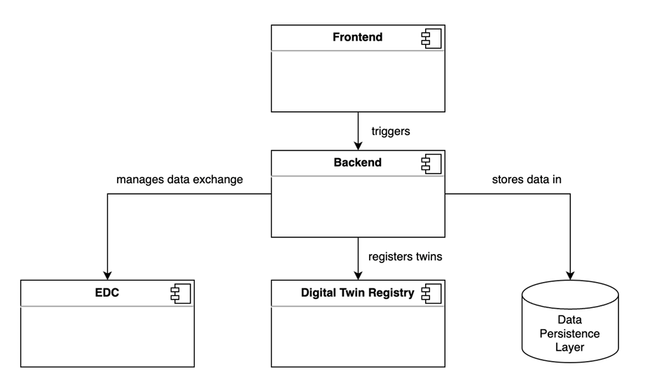

# CX-0007 Minimal Data Provider Service Offering v1.1.0

## 1. INTRODUCTION

Data provisioning is one of the key success factors for a data space, as
without data offers, there is nothing to consume with the various
business applications that data consumers will use. While it is
relatively easy for large enterprises with extensive IT capabilities to
connect their backend systems to the Catena-X landscape, providing data
is a challenging task for SMEs and non-tech savvy companies. Thus,
simple to use tools for data provisioning - such as excel upload tools
- are needed, which can be operated by regular employees without
sophisticated IT skills.

The purpose of this document is to describe the necessary functional
building blocks of a minimal data provider service, as well as to give
an overview over the interplay of necessary standards that need to be
considered. The document also gives an overview over the mandatory
standards that need to be integrated. Service offerings for data
providers that do not fulfil the necessary standards and concepts in
this document, will not work in the Catena-X network and thus cannot be
provided to any customer. In the following chapters, the minimal data
provider service will also be referred to as "upload tool" for better
understandability.

Minimal data provider service offerings will in the following also be referred to as
"upload tools" or "data provisioning tools".

### 1.1 AUDIENCE & SCOPE

> *This section is non-normative*

The target audience of this standard is any application or service provider that wants to offer services related to one time data provisioning, such as but not limited to, manual text masks or file-based uploads. It is not intended to explain how continuous backend integrations of e.g. ERP or MES systems into the Catena-X network can work. Please refer to CX-0055 for this. This standard applies to data provisioning for all Catena-X Use Cases.

This document is relevant for the following roles:

- Enablement Service Provider
- Business Application Provider

Only, if they plan to provide one time data upload capabilities as
part of their business applications

### 1.2 CONTEXT

> *This section is non-normative*

Catena-X is a decentral network where data exchange happens P2P between
two parties. This guarantees a high level of data sovereignty, as data
providers and consumers do not rely on a third party or a platform to
exchange data. Also, business apps within Catena-X are built to be
interoperable along the value chain, so that different participants can
use different apps from various providers, but still are able to
exchange data between them. To enable the network, a common technological basis is needed.

Data is described with a standardized semantic, which is specific for
each Use Case. The semantics are described with the semantic modeling
language SAMM.

Furthermore, data discovery and access is enabled by the Asset Administration Shell (Digital Twins),
or by knowledge agents.

The data exchange itself happens in a self-sovereign way via the Connector (e.g. the Eclipse Dataspace Connector (EDC)).  

Any tool that is built to provide data, needs to fulfill Use Case
specific standards (semantic models, calculation logic, etc.) and standards independent of Use Cases (e.g. use of EDC, IAM Concept). The Use Case specific standards can be found in the [Catena-X Standards Library](https://catenax-ev.github.io/docs/next/standards/overview).

Of specific importance for data provisioning tools is the concept of data sovereignty.
Data sovereignty is one of the core values of the Catena-X network. Each
participant should stay in as much control as possible over his data.
This includes that he always exactly knows with whom he is exchanging
data. The participant also can decide on a dataset level, which of his
partners is able to see the various data offers (Access Policies) and
then decide under which conditions he is willing to share data (Usage
Policies). Furthermore, the user of the upload tool must be able to
update or delete the actual data, access and usage policies as well as
any meta data and references to data.

A data provisioning tool, as described in the next section, must make sure that
the user of that tool gets to this level of data sovereignty by
implementing features that allow him to choose which data he is willing
to share with whom under which conditions, and also change those
settings as he wishes. Upload tools that can't fulfill these
requirements, can't be sold to customers as they contradict one of the
key values of Catena-X.

### 1.3 ARCHITECTURE OVERVIEW



Figure 1:Architecture Overview

The architecture of a minimal data provider service offering is simple.
It consists of and interacts with the following components.

#### 1.3.1 FRONTEND

The frontend is the entry point into the service. It's used by the end
user of a data provider who won't interact with any backend system or
other related components via CLI or API.

#### 1.3.2 BACKEND

The backend is responsible for orchestrating the various needed
interactions with other components. It needs to handle the upload of
data into the data persistence layer, create/delete/update the EDC contract
offer, (De-)register data at the digital twin
registry, handle authentication and authorization at the application and
so on and so forth.

#### 1.3.3 DATA PERSISTANCE LAYER

The uploaded data needs to be persisted in an appropriate database
solution, so that it can be received upon request. Depending on the data
and the Use Case, this could be a SQL, No-SQL, S3 or streaming storage.

Note: It is not enough to register a digital twin or create an EDC
contract offer as they only contain meta-data and references to the
actual data. The actual data also needs to be made available after it
has been uploaded to the tool. That is the responsibility of the data
persistence layer.

#### 1.3.4 EDC

The EDC is a separate component that is needed to enable a sovereign
data exchange. There's currently no data provisioning for the various
use cases without an EDC. The EDC always needs to be deployed together
with the front- and backend. Also, the EDC currently isn't tenant
isolated, thus one EDC needs to be deployed per customer company.

As an alternative, the solution can be configurable with an external EDC.

Furthermore, the EDC that is used must be discoverable by data consumers and thus
be registered at the EDC discovery service.

#### 1.3.5 DIGITAL TWIN REGISTRY (DTR)

The DTR is a decentral component
that must be implemented with each data provider offering digital twin aspects.
It stores references to aspects of digital twins.
The actual data ("the digital twin") is stored in the data persistence layer
that comes with a minimal data provider service. The backend needs to
interact with the decentral DTR to register newly created/uploaded twins.
In case a user deletes data, the backend also needs to de-register the twins
again. For an API description of the DTR, refer to CX-0002.

A minimal data provider service offering for digital twin aspects either must include its own
decentral DTR or it can be configurable to work with an external decentral DTR.

Furthermore, the DTR that is used must be discoverable by data consumers and thus
be registered at the discovery finder.

#### 1.3.6 SSI INTEGRATION

The upload tool must be able to interact with the Catena-X SSI solution to
provide the correct attributes and roles of a data provider to the EDC.

#### 1.3.7 SEMANTIC MODELLING LANGUAGES AND MODELS

Depending on the Use Case, different semantic modelling languages and
semantic models need to be understood by the upload tool. E.g.: if the
upload tool wants to work for the Use Case traceability, the tool needs
to be able to process the Aspect Model: SerialPartTypization in the SAMM
language.

Note: SAMM is currently the only modeling language that is used within
Catena-X. When this changes in the future, this standard will be updated
to also reference other modelling languages.

The semantic modelling languages and models that are used within a
Use Case can be found within the respective Use Case standards.
It's mandatory for the tool to function with those semantic modelling
languages and semantic models.

A list of all released semantic models can be found in the [Eclipse Tractus-X Github-Repository](https://github.com/eclipse-tractusx/sldt-semantic-models).

### 1.4 CONFORMANCE

As well as sections marked as non-normative, all authoring guidelines,
diagrams, examples, and notes in this specification are non-normative.
Everything else in this specification is normative.

The key words MAY, MUST, MUST NOT, OPTIONAL, RECOMMENDED, REQUIRED,
SHOULD and SHOULD NOT in this document are to be interpreted as
described in [BCP
14](https://datatracker.ietf.org/doc/html/bcp14) \[[RFC2119](https://www.w3.org/TR/did-core/#bib-rfc2119)\]
\[[RFC8174](https://www.w3.org/TR/did-core/#bib-rfc8174)\] when, and
only when, they appear in all capitals, as shown here.

### 1.5 Proof of conformity

> *This section is non-normative*

All participants and their solutions will need to proof, that they are
conform with the Catena-X standards. To validate that the standards are
applied correctly, Catena-X employs Conformity Assessment Bodies (CABs).
Please refer to the association homepage for the process of conformity
assessment and certification.

Enablement Service Providers and Business application providers need to
provide the following to the CAB:  

- High level architecture document describing the various components of the solution and their interplay
- Functional Specification / Pflichtenheft describing how the functional and non-functional requirements stated in chapter 2.2 shall be fulfilled.
- Proof that the service offering fulfills all of the standards listed in chapter 2.1

The partner collects the requested documents and results and sends them to the responsible CAB. The CAB might also conduct an external audit to assess conformance with the standards. The responsible CABs can be found on the homepage of the association: [https://www.catena-x.net](https://www.catena-x.net).

The solution can only be listed in an official Catena-X Marketplace after successful verification of conformity.

## 2. MINIMAL DATA PROVIDER SERVICE OFFERING

All requirements that are listed as "mandatory" under chapter 2.2 **MUST** generally be
fulfilled by a service offering. If a service offering does not fulfill
a mandatory requirement, the provider offering the service MUST
explain why he derives from the requirement. It is then up to the CAB to
decide if the service offering still receives a certificate.

All requirements that are listed as "optional" **SHOULD** be fulfilled by a
service offering.

The specific standards listed in chapter 2.1 **MUST** be implemented correctly.

## 2.1 ADHERENCE TO SPECIFIC STANDARDS

The following Use Case agnostic standards **MUST** be implemented correctly.
More details can be found in the respective individual standards:

- CX-0013 Identity of Member Companies
- CX-0149 Verified Company Identity
- CX-0018 Dataspace Connectivity

Depending on the Use Cases for which the service offering is intended,
additional and Use Case specific standards are relevant and **MUST** be implemented.
Please refer to the Use Case specific standards therefore.

E.g. if the Minimal Data Provider Service Offering is intended to work for the traceability Use Case,
conformance with the respective standards must be shown.
For the example of traceability, this includes:

- CX-0125 Traceability Use Case
- CX-0002 Digital Twins in Catena-X

NOTE: The Enablement Service Provider **MAY** also choose to provide the option to configure an existing
EDC, DTR or other decentral component with the upload tool instead of including it with the offer.
However,  one of the two options **MUST** be provided.

As long as not specified differently, the latest version of the standards **MUST** be applied.

## 2.2 FUNCTIONAL & NON-FUNCTIONAL BUILDING BLOCKS

|     ID  \| Obligation                                                                                                                   |     Title     |
|-----------------------------------------------------------------------------------------------------------------------------------------|---------------|
|     FR-00 \| Mandatory                                                                                                                  |     Login     |
|     Description                                                                                                                         |               |
|     As a user, I want to login to the tool with a username and password so that the tool is protected from unauthorized   access.     |               |

|     ID  \|   Obligation                                                                                                                                                                         |     Title               |
|-------------------------------------------------------------------------------------------------------------------------------------------------------------------------------------------------|-------------------------|
|     FR-01 \| Optional                                                                                                                                                                           |     Single   Sign-On    |
|     Description                                                                                                                                                                                 |                         |
|     As a user, I want to login to the tool with my known credentials from e.g. the CX Platform or my company internal IDP so that I don’t need to remember an extra set of credentials.     |                         |

|     ID  \|   Obligation                                                                                                                                                                                                                                                                        |     Title              |
|------------------------------------------------------------------------------------------------------------------------------------------------------------------------------------------------------------------------------------------------------------------------------------------------|------------------------|
|     FR-02 \| Mandatory                                                                                                                                                                                                                                                                         |     User Management    |
|     Description                                                                                                                                                                                                                                                                                |                        |
|     As an admin, I want to be able to add/remove users from access to the tool. I also want to grant different levels of permission to my users with a minimum of: Read Only and Read/Write/Delete/Update so that I can control who is able to do certain things within the tool.     |                        |

|     ID  \|   Obligation                                                                                                                                                                                                                                                                                                |     Title                 |
|------------------------------------------------------------------------------------------------------------------------------------------------------------------------------------------------------------------------------------------------------------------------------------------------------------------------|---------------------------|
|     FR-03 \| Mandatory                                                                                                                                                                                                                                                                                                 |     Use Case Selection    |
|     Description                                                                                                                                                                                                                                                                                                        |                           |
|     As a user, I want to be able to select, for which Catena-X Use Case I want to upload data. Based on that selection, I then only want to see relevant information/templates (e.g., semantic models) for that specific Use Case. If the tool is only built for one Use Case, this feature doesn’t apply.     |                           |

|     ID  \|   Obligation                                                                                                                                                                                                                                                                                                      |     Title                                       |
|------------------------------------------------------------------------------------------------------------------------------------------------------------------------------------------------------------------------------------------------------------------------------------------------------------------------------|-------------------------------------------------|
|     FR-04 \| Mandatory                                                                                                                                                                                                                                                                                                       |     Understandable Semantic Model Templates     |
|     Description                                                                                                                                                                                                                                                                                                              |                                                 |
| As a user, I want to be able to download semantic model templates for the Use Case I selected in FR-03 so that I can fill them out with the necessary data. I also want the templates to be understandable for a non-expert in the semantic language so that I can enter   the right data in the right fields.     |                                                 |

|     ID  \|   Obligation                                                                                                                                                                               |     Title                |
|-------------------------------------------------------------------------------------------------------------------------------------------------------------------------------------------------------|--------------------------|
|     FR-05 \| (Mandatory – See two below)                                                                                                                                                              |     File Based Upload    |
|     Description                                                                                                                                                                                       |                          |
|     As a user, I want to be able to upload the filled-out templates from FR-04, so that I can provide data to my partners and so that I can create a “contract offer” with the data attached.     |                          |

|     ID  \| Obligation                                                                                                                                                                           |     Title                       |
|-------------------------------------------------------------------------------------------------------------------------------------------------------------------------------------------------|---------------------------------|
|     FR-06 \| (Mandatory – See one below)                                                                                                                                                        |     Guided Text Field Entry     |
|     Description                                                                                                                                                                                 |                                 |
|     As a user, I want to be able to enter the data I need to provide with a guided text field entry e.g. in the case of small amounts of data, or corrections to already provided data.     |                                 |

```
Note: An upload tool needs to fulfill either FR-05, FR-06 or a similar upload mechanism. 
```

|     ID  \| Obligation                                                                                                                                                                                                                                                                                                                                                                   |     Title                      |
|-----------------------------------------------------------------------------------------------------------------------------------------------------------------------------------------------------------------------------------------------------------------------------------------------------------------------------------------------------------------------------------------|--------------------------------|
|     FR-07 \| Mandatory                                                                                                                                                                                                                                                                                                                                                                  |     Access Policy Selection    |
|     Description                                                                                                                                                                                                                                                                                                                                                                         |                                |
|     As a user, I want to be able to select which of my partners are allowed to access my data, so that only authorized partners can receive my data.
Remark: Internally, the EDC uses the BPN (CX-0010), but the user should be able to select his business partners based on their company names. For a translation into BPNs the Business Partner Data Pool API (CX-0012) can be used.     |                                |

|     ID  \| Obligation                                                                                                                                                                                                                                              |     Title                     |
|--------------------------------------------------------------------------------------------------------------------------------------------------------------------------------------------------------------------------------------------------------------------|-------------------------------|
|     FR-08 \| Mandatory                                                                                                                                                                                                                                             |     Usage Policy Selection    |
|     Description                                                                                                                                                                                                                                                    |                               |
|     As a user, I want to be able to select under which usage policies my partners are allowed to consume my data, respectively, what my partners are allowed to or obliged to do with my data. Selection of usage policies shall happen in accordance with the Catena-X governance framework for data space operations.    |                               |

|     ID  \| Obligation                                                                                                                                                                                                                                                                                                  |     Title                  |
|------------------------------------------------------------------------------------------------------------------------------------------------------------------------------------------------------------------------------------------------------------------------------------------------------------------------|----------------------------|
|     FR-09 \| Mandatory                                                                                                                                                                                                                                                                                                 |     View uploaded data     |
|     Description                                                                                                                                                                                                                                                                                                        |                            |
|     As a user, I want to be able to view previously uploaded data (FR-05,FR-06). I also want to see who has access to that data (FR-07) and under which conditions I offer the data (FR-08). I want this, so that I can always control if I (or a fellow employee) delivered what our customers requested.     |                            |

|     ID  \| Obligation                                                                                                                                                                                                                                                                                                                                              |     Title                       |
|--------------------------------------------------------------------------------------------------------------------------------------------------------------------------------------------------------------------------------------------------------------------------------------------------------------------------------------------------------------------|---------------------------------|
|     FR-10 \| Mandatory                                                                                                                                                                                                                                                                                                                                             |     View data upload history    |
|     Description                                                                                                                                                                                                                                                                                                                                                    |                                 |
|     As a user, I don’t only want to see the details of one specific upload, but I want to see a history of all past uploads and then dive into the details of certain uploads, so that I have a transaction log that I could show to my partners to prove, that I uploaded   data as agreed. I also want to see changes that were made to uploaded data.     |                                 |

|     ID  \| Obligation                                                                                                                                 |     Title                   |
|-------------------------------------------------------------------------------------------------------------------------------------------------------|-----------------------------|
|     FR-11 \| Optional                                                                                                                                 |     Change uploaded data    |
|     Description                                                                                                                                       |                             |
|     As a user, I want to be able to change the data that I’ve previously uploaded, so that I can correct a mistake that I’ve previously made.     |                             |

|     ID  \| Obligation                                                                                                                                                                                                                                                                                  |     Title                   |
|--------------------------------------------------------------------------------------------------------------------------------------------------------------------------------------------------------------------------------------------------------------------------------------------------------|-----------------------------|
|     FR-12 \| Mandatory                                                                                                                                                                                                                                                                                 |     Delete uploaded data    |
|     Description                                                                                                                                                                                                                                                                                        |                             |
|     As a user, I want to be able to delete uploaded data and trigger the deletion of corresponding (meta-)data in all connected systems (e.g. DTR), so that I can e.g. correct mistakes that I’ve previously made or in case I’ve changed my mind about offering certain data to partners.     |                             |

|     ID  \| Obligation                                                                                                                                                |     Title                   |
|----------------------------------------------------------------------------------------------------------------------------------------------------------------------|-----------------------------|
|     FR-13 \| Optional                                                                                                                                                |     Change Access Policy    |
|     Description                                                                                                                                                      |                             |
|     As a user, I want to be able to change the access policy to data that I’ve uploaded, so that I can add access for new partners to already uploaded data.     |                             |

|     ID  \| Obligation                                                                                                                                                        |     Title                  |
|------------------------------------------------------------------------------------------------------------------------------------------------------------------------------|----------------------------|
|     FR-14 \| Optional                                                                                                                                                        |     Change Usage Policy    |
|     Description                                                                                                                                                              |                            |
|     As a user, I want to be able to change the usage policy under which I share data with my partner, so that I have the   full control over what happens with my data.    |                            |

```
Remark: FR-11 & 13,14 are optional, although highly recommended. At minimum, a user needs to be able to delete uploaded data and then make a new upload. 
```

|     ID  \| Obligation                                                                                                                                   |     Title               |
|---------------------------------------------------------------------------------------------------------------------------------------------------------|-------------------------|
|     FR-15 \| Mandatory                                                                                                                                  |     Help and Support    |
|     Description                                                                                                                                         |                         |
|     As a user, I want to have help and   support functions in case something isn’t working or I don’t understand what   is happening with the tool.     |                         |

|     ID  \| Obligation                                                                                                                                                                                                                                                              |     Title                        |
|------------------------------------------------------------------------------------------------------------------------------------------------------------------------------------------------------------------------------------------------------------------------------------|----------------------------------|
|     FR-16 \| Mandatory                                                                                                                                                                                                                                                             |     View status of data offer    |
|     Description                                                                                                                                                                                                                                                                    |                                  |
|     As a user, I want to see statistics about   the consumption of the data that I’ve uploaded, with a minimum of, but not   limited to: Who accessed my data; How often was my data accessed; When was   the access made     So that I can trace what happens with my   data.     |                                  |

|     ID  \| Obligation                                                                                                                                                          |     Title     |
|--------------------------------------------------------------------------------------------------------------------------------------------------------------------------------|---------------|
|     FR-17 \| Mandatory                                                                                                                                                         |     Logout    |
|     Description                                                                                                                                                                |               |
|     As a user, I want to log out of the tool,   after I’ve finished my task, so that I minimize the risk that an unauthorized   colleague accesses the tool on my machine.     |               |

|     ID  \| Obligation                                                                                                                                                                                                                                                                                                                               |     Title              |
|-----------------------------------------------------------------------------------------------------------------------------------------------------------------------------------------------------------------------------------------------------------------------------------------------------------------------------------------------------|------------------------|
|     FR-18 \| Mandatory                                                                                                                                                                                                                                                                                                                              |     Data Validation    |
|     Description                                                                                                                                                                                                                                                                                                                                     |                        |
|     As a user, I want to have a visual   feedback if the data that I’ve uploaded matches with the provided templates.   This could include e.g. a validation if all mandatory fields are filled or if   the data type matches. If I don’t have a validation, I could send potentially   wrong data to my partners, which then can’t process it.     |                        |

|     ID  \| Obligation                                                                                                                                                                  |     Title                                |
|----------------------------------------------------------------------------------------------------------------------------------------------------------------------------------------|------------------------------------------|
|     FR-19 \| Optional                                                                                                                                                                  |     Append data to an existing upload    |
|     Description                                                                                                                                                                        |                                          |
|     As a user, I want to be able to append   data to an existing “upload” so that I don’t need to re-specify the access   and usage policy each and every time I upload something.     |                                          |

```
It’s difficult to strictly specify the mandatory nonfunctional requirements, as it’s always in the very interest of the data provisioning tool service provider to offer an attractive tool. However, emphasis should be put on three NFRs, as they are especially relevant in the Catena-X network.
```

|     ID                                                                                                                                                                                                                                                                                                                              |     Title       |
|-------------------------------------------------------------------------------------------------------------------------------------------------------------------------------------------------------------------------------------------------------------------------------------------------------------------------------------|-----------------|
|     NFR-01                                                                                                                                                                                                                                                                                                                          |     Security    |
|     Description                                                                                                                                                                                                                                                                                                                     |                 |
|     Companies will provide sensitive and   valuable, sometimes even business critical data to partners. Extra measures   need to be undertaken to secure both, access to the data as well as to the   tool. Furthermore, the endpoint to retrieve the data is exposed to the   internet, which means additional thread vectors.     |                 |

|     ID                                                                                                                                                                                                                                                                                                                                                                                                                              |     Title        |
|-------------------------------------------------------------------------------------------------------------------------------------------------------------------------------------------------------------------------------------------------------------------------------------------------------------------------------------------------------------------------------------------------------------------------------------|------------------|
|     NFR-02                                                                                                                                                                                                                                                                                                                                                                                                                          |     Usability    |
|     Description                                                                                                                                                                                                                                                                                                                                                                                                                     |                  |
|     Data upload tools will typically be used   not by expert users (e.g. data analysts), but by regular employees of SMEs   who are asked to provide data to customers to “stay in business”. The tool   needs to take into account, that a typical user has hundreds of tasks and   uploading data might just be one of them by e.g. guiding the user through the   process, providing additional validation or help/feedback.     |                  |

|     ID                                                                                                                                                                                                                |     Title                       |
|-----------------------------------------------------------------------------------------------------------------------------------------------------------------------------------------------------------------------|---------------------------------|
|     NFR-03                                                                                                                                                                                                            |     Reliability/Availability    |
|     Description                                                                                                                                                                                                       |                                 |
|     Catena-X relies on uninterrupted data   chains for most of its Use Cases. Thus, the data needs to be highly   available, as customers follow up processes rely on the availability of data   from a provider.     |                                 |

### 2.3 DUTIES OF AN ENABLEMENT SERVICE PROVIDER

There are various necessary interactions with the services of the core service providers who
operate the core of the network for a data upload tool to work. Those are described in the subsequent chapters.

Furthermore, besides the need to certify his solution, there are some onboarding activities that an enablement service provider needs to undertake so that he can offer a solution in one of the app stores. For a detailed description please refer to the onboarding information available at the association homepage.

#### 2.3.1 CREATE SELF-DESCRIPTIONS FOR THE EDC

Catena-X follows the Gaia-X principles and standards and is committed to
be Gaia-X compliant. This includes issuing so called "self-descriptions"
to participants and services. For Release 3.2 and until further notice, the service
self-descriptions are limited to the "EDC" and Catena-X follows the
trust framework version 10/22
(http://docs.gaia-x.eu/policy-rules-committee/trust-framework/22.10/).

Self-Descriptions can be created via the Portal and API, refer to the portal documentation for details.

An enablement service provider **MUST** make sure that each connector
that he deploys with the upload tool also gets a valid Self-Description.

#### 2.3.2 IMPLEMENT SSI SOLUTION

The EDC uses SSI for authentication and authorization.
An upload tool **MUST** support the correct application of the SSI standards and connect to a wallet.

#### 2.3.3 REGISTER CONNECTOR AT EDC DISCOVERY SERVICE

In case the upload tool brings its own connector, it **MUST** be registered at the EDC discovery service.

#### 2.3.4 MAKE DIGITAL TWIN REGISTRY DISCOVERABLE

Note: This chapter only applies if a digital twin registry is required.

In case the upload tool brings its own digital twin registry, it **MUST** be discoverable.
To achieve this, the correct entries at the discovery finder and BPN Discovery service **MUST** be made.

#### 2.3.5 OPTIONAL: CONNECT TO CX IDP

One of the value propositions of Catena-X is, that a customer can log in
to the various tools and systems with one single Catena-X identity. To
increase the user experience, data service providers CAN connect the IAM
of the tool with the Catena-X IdP for a SSO integration.

## 3. REFERENCES

### 3.1 NORMATIVE REFERENCES

As long as not specified differently, the latest version of the standard **MUST** be applied.

- CX-0013 Identity of Member Companies
- CX-0018 Dataspace Connectivity 
- CX-0149 Data Space Identity and Identification

### 3.2 NON-NORMATIVE REFERENCES

> *This section is non-normative*

### 3.3 Reference Implementations

> *This section is non-normative*

Example: The code found at https://github.com/eclipse-tractusx/dft-frontend in combination with https://github.com/eclipse-tractusx/dft-backend presents a reference implementation that implements this standard.

## Legal

Copyright © 2024 Catena-X Automotive Network e.V. All rights reserved. For more information, please visit [here](/copyright).
