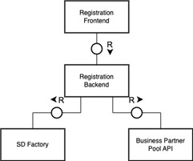

---
tags:
  - CAT/Portal
  - CAT/Core Service Provider
  - CAT/Sandbox Services
  - CAT/Sandbox Service Provider
  - CAT/Onboarding Service Provider
---

# CX-0009 CX Registration API v2.0.0

## CAMPARISON TO THE LAST VERSION

| Version | Change by    | Change Details                                                                                                                                                                  |
|---------|--------------|---------------------------------------------------------------------------------------------------------------------------------------------------------------------------------|
| 2.0.0   | Julia Jeroch | Update of the endpoint details which MUST/SHOULD get followed by the Core Service Provider and/or Onboarding service provider. Endpoint path as well as request/response body.  |

## ABSTRACT

To become a participant of Catena-X, each applicant must go through a
registration process. Registration is a mandatory requirement for all
further activities within the Catena-X network. The registration
process, along with other services, provide the foundation of trust for
the Catena-X network.

The Registration & Administration Service describes the endpoints that are needed for
the registration process.

## 1. Introduction

To become a participant of Catena-X, each applicant must go through a
registration process. Registration is a mandatory requirement for all
further activities within the Catena-X network. The registration
process, along with other services, provide the foundation of trust for
the Catena-X network.

### 1.1 Audience & Scope

> *This section is non-normative*

This standard is relevant for the following roles:

- Core Service Provider
- Onboarding Service Provider (for reference)

### 1.2 Context

> *This section is non-normative*

The registration API is used as part of the registration process.

### 1.3 Architecture Overview

> *This section is non-normative*

A core service provider operates among other things a registration
frontend through which a registering company can enter its data. In the
future, the registration service may be accessed remotely, for example
by onboarding service provider, so the API needs to be standardized.



### 1.4 Conformance

As well as sections marked as non-normative, all authoring guidelines,
diagrams, examples, and notes in this specification are non-normative.
Everything else in this specification is normative.

The key words MAY, MUST, MUST NOT, OPTIONAL, RECOMMENDED, REQUIRED,
SHOULD and SHOULD NOT in this document are to be interpreted as
described in [BCP
14](https://datatracker.ietf.org/doc/html/bcp14) \[[RFC2119](https://www.w3.org/TR/did-core/#bib-rfc2119)\]
\[[RFC8174](https://www.w3.org/TR/did-core/#bib-rfc8174)\] when, and
only when, they appear in all capitals, as shown here.

### 1.5 Proof of conformity

> *This section is non-normative*

All participants and their solutions will need to proof, that they are
conform with the Catena-X standards. To validate that the standards are
applied correctly, Catena-X employs Conformity Assessment Bodies (CABs).

Core service providers implementing their own registration solution MUST
proof their conformity by providing:

- An openAPI specification of the endpoints described

### 1.6 Terminology

> *This section is non-normative*

**Application Programming Interface (API)**

An application programming interface (API) is a way for two or more
computer programs to communicate with each other.

Additional terminology used in this standard can be looked up in the
glossary on the association homepage.

## 2. Catena-X Registration API

### 2.1 Preconditions and dependencies

The registration API is exposed to the Internet.

### 2.2 API Specification

### 2.2.1 API-Endpoints - Core Service Provider

The Core Service Provider MUST implement the following endpoints -- in focus
are the API business logic / content and structure, the path name might change / be
different but the business logic behind as well as the attributes must
be followed. Details to the respective MUST and SHOULD statements may be found below.

>> Note functional description and standard definition of the CSP role are defined inside the standard CX-0006-RegistrationAndInitialOnboarding.

#### 2.2.1.1 Enter / verify company data

**Endpoint:** `/api/registration/legalEntityAddress/{bpn}`

**Method:** `GET`

**Description & Information:**  
Please note - this endpoint is currently only Core Service Provider relevant. The Core Service Provider **MUST** be able to pre-fill the company address data if the requester company has a BPN. The endpoint path **MUST NOT** be followed as long as all validations and processes are implemente

**Request body**

```json
n/a
```

**Response body**

```json
{
  "version": {
    "characterSet": {
      "technicalKey": "string",
      "name": "string"
    },
    "language": {
      "technicalKey": "string",
      "name": "string"
    }
  },
  "careOf": "string",
  "contexts": [
    "string"
  ],
  "country": {
    "technicalKey": "string",
    "name": "string"
  },
  "administrativeAreas": [
    {
      "value": "string",
      "shortName": "string",
      "fipsCode": "string",
      "type": {
        "technicalKey": "string",
        "name": "string"
      },
      "language": {
        "technicalKey": "string",
        "name": "string"
      }
    }
  ],
  "postCodes": [
    {
      "value": "string",
      "type": {
        "technicalKey": "string",
        "name": "string"
      }
    }
  ],
  "localities": [
    {
      "value": "string",
      "shortName": "string",
      "type": {
        "technicalKey": "string",
        "name": "string"
      },
      "language": {
        "technicalKey": "string",
        "name": "string"
      }
    }
  ],
  "thoroughfares": [
    {
      "value": "string",
      "name": "string",
      "shortName": "string",
      "number": "string",
      "direction": "string",
      "type": {
        "technicalKey": "string",
        "name": "string"
      },
      "language": {
        "technicalKey": "string",
        "name": "string"
      }
    }
  ],
  "premises": [
    {
      "value": "string",
      "shortName": "string",
      "number": "string",
      "type": {
        "technicalKey": "string",
        "name": "string"
      },
      "language": {
        "technicalKey": "string",
        "name": "string"
      }
    }
  ],
  "postalDeliveryPoints": [
    {
      "value": "string",
      "shortName": "string",
      "number": "string",
      "type": {
        "technicalKey": "string",
        "name": "string"
      },
      "language": {
        "technicalKey": "string",
        "name": "string"
      }
    }
  ],
  "geographicCoordinates": {
    "longitude": 0,
    "latitude": 0,
    "altitude": 0
  },
  "types": [
    {
      "technicalKey": "string",
      "name": "string"
    }
  ]
}
```

---

**Endpoint:** `/api/registration/application/{applicationId}/companyDetailsWithAddress`

**Method:** `GET`

**Description & Information:**  
The Core Service Provider **MUST** provide the GET /\{applicationId\}/companyDetailsWithAddress endpoint for a standardized way to receive the registration party data.

**Request body**

```json
n/a content inside the path
```

**Response body**

```json
{
  "name": "string",
  "city": "string",
  "streetName": "string",
  "countryAlpha2Code": "string",
  "bpn": "string",
  "shortName": "string",
  "region": "string",
  "streetAdditional": "string",
  "streetNumber": "string",
  "zipCode": "string",
  "uniqueIds": [
    {
      "type": "COMMERCIAL_REG_NUMBER",
      "value": "string"
    }
  ],
  "companyId": "3fa85f64-5717-4562-b3fc-2c963f66afa6"
}
```

---

**Endpoint:** `/api/registration/company/country/{alpha2Code}/uniqueidentifiers`

**Method:** `GET`

**Description & Information:**  
The Core Service Provider **CAN** offer a GET /uniqueidentifiers endpoint to provide supported unique identifier based on the company lega address country alpha2Code.

**Request body**

```json
n/a content inside the path
```

**Response body**

```json
[
  {
    "id": 0,
    "label": "COMMERCIAL_REG_NUMBER"
  }
]
```

---

**Endpoint:** `/api/registration/application/{applicationId}/companyDetailsWithAddress`

**Method:** `POST`

**Description & Information:**  
The Core Service Provider **MUST** provide the POST /\{applicationId\}/companyDetailsWithAddress endpoint for a standardized way to store/post the registration party data.

**Request body**

```json
{
  "name": "string",
  "city": "string",
  "streetName": "string",
  "countryAlpha2Code": "string",
  "bpn": "string",
  "shortName": "string",
  "region": "string",
  "streetAdditional": "string",
  "streetNumber": "string",
  "zipCode": "string",
  "uniqueIds": [
    {
      "type": "COMMERCIAL_REG_NUMBER",
      "value": "string"
    }
  ],
  "companyId": "3fa85f64-5717-4562-b3fc-2c963f66afa6"
}
```

**Response body**

```json
success/error
```

#### 2.2.1.2 Company roles and consent

**Endpoint:** `/api/registration/company/companyRoles`

**Method:** `GET`

**Description & Information:**  
The Core Service Provider **MUST** implement the GET /companyRoles endpoint.

**Request body**

```json
n/a content inside the path
```

**Response body**

```json
[
  {
    "companyRole": "string",
    "roleDescription": "string"
  }
]
```

---

**Endpoint:** `/api/registration/companyRoleAgreementData`

**Method:** `GET`

**Description & Information:**  
The Core Service Provider **MUST** implement the GET /companyRoleAgreementData endpoint.

**Request body**

```json
n/a content inside the path
```

**Response body**

```json
{
  "companyRoles": [
    {
      "companyRole": "ACTIVE_PARTICIPANT",
      "descriptions": {
        "additionalProp1": "string",
        "additionalProp2": "string",
        "additionalProp3": "string"
      },
      "agreementIds": [
        "3fa85f64-5717-4562-b3fc-2c963f66afa6"
      ]
    }
  ],
  "agreements": [
    {
      "agreementId": "3fa85f64-5717-4562-b3fc-2c963f66afa6",
      "name": "string",
      "agreementLink": "string",
      "documentId": "3fa85f64-5717-4562-b3fc-2c963f66afa6"
    }
  ]
}
```

---

**Endpoint:** `/api/registration/application/{applicationId}/companyRoleAgreementConsents`

**Method:** `POST`

**Description & Information:**  
The Core Service Provider **MUST** implement the GET /companyRoleAgreementConsents endpoint.

**Request body**

```json
{
  "companyRoles": [
    "ACTIVE_PARTICIPANT"
  ],
  "agreements": [
    {
      "agreementId": "3fa85f64-5717-4562-b3fc-2c963f66afa6",
      "consentStatus": "ACTIVE"
    }
  ]
}
```

**Response body**

```json
success/error
```

#### 2.2.1.3 Registration relevant documents

**Endpoint:** `/api/registration/application/{applicationId}/documentType/{documentTypeId}/documents`

**Method:** `GET`

**Description & Information:**  
The Core Service Provider **SHOULD** implement the GET /\{documentTypeId\}/documents endpoint.

---

**Endpoint:** `/api/registration/application/{applicationId}/documentType/{documentTypeId}/documents`

**Method:** `POST`

**Description & Information:**  
The Core Service Provider **SHOULD** implement the POST /\{documentTypeId\}/documents endpoint. Depending on the Core Service Provider implemented registration process authentication methods, the document endpoint might change within the endpoint path or business logic.

---

**Endpoint:** `/api/registration/documents/{documentId}`

**Method:** `DELETE`

**Description & Information:**  
The Core Service Provider **SHOULD** implement the DELETE /\{documentTypeId\}/documents endpoint to enable the onboarding customer to delete own previous uploaded document again. Important are audit relevant processes. The Core Service Provider **MUST** ensure that audit guidelines are not violated.

---

**Endpoint:** `/api/registration/documents/{documentId}`

**Method:** `GET`

**Description & Information:**  
The Core Service Provider **MUST** support to display the user company loaded documents. The endpoint path might change but the Core Service Provider **MUST** ensure that validations are implemeneted (e.g. the company user can not access uploaded documents of a second registration company)

#### 2.2.1.4 Verify and submit registration

**Endpoint:** `/api/registration/application/{applicationID}/registrationData`

**Method:** `GET`

**Description & Information:**  
The Core Service Provider **MUST** support a GET /\{applicationID\}/registrationData endpooint with the reference implemented properties/attributes. This ensures that the company registrationData can be viewed in a standardized model.

**Request body**

```json
{
  "companyId": "3fa85f64-5717-4562-b3fc-2c963f66afa6",
  "name": "string",
  "bpn": "string",
  "shortName": "string",
  "city": "string",
  "region": "string",
  "streetAdditional": "string",
  "streetName": "string",
  "streetNumber": "string",
  "zipCode": "string",
  "countryAlpha2Code": "string",
  "companyRoles": [
    "ACTIVE_PARTICIPANT"
  ],
  "agreements": [
    {
      "agreementId": "3fa85f64-5717-4562-b3fc-2c963f66afa6",
      "consentStatus": "ACTIVE"
    }
  ],
  "documents": [
    {
      "documentName": "string"
    }
  ],
  "uniqueIds": [
    {
      "type": "COMMERCIAL_REG_NUMBER",
      "value": "string"
    }
  ]
}
```

**Response body**

```json
success/error
```

---

**Endpoint:** `/api/registration/application/{applicationID}/submitregistration`

**Method:** `POST`

**Description & Information:**  
...

**Request body**

```json
n/a
```

**Response body**

```json
success/error
```

#### 2.2.1.5 Registration Application Verification

Auto Workflow as per the process description: https://github.com/eclipse-tractusx/portal-assets/blob/main/developer/01.%20Onboarding/03.%20Registration%20Approval/03.%20Registration%20Approval%20Process.md

- POST
    /api/administration/registration/application/\{applicationId\}/approve
    Please note - this endpoint is currently only Core Service Provider relevant. The Core Service Provider **MUST** be able to approve (with message, backend business logic and email information) a registration request. The endpoint path **MUST NOT** be followed as long as all validations and processes are implemented.

- POST
    /api/administration/registration/application/\{applicationId\}/decline
    Please note - this endpoint is currently only Core Service Provider relevant. The Core Service Provider **MUST** be able to decline (with message and email information) a registration request. The endpoint path **MUST NOT** be followed as long as all validations and processes are implemented.

- POST /api/administration/registration/application/clearinghouse
    Please note - this endpoint is currently only Core Service Provider relevant. The Core Service Provider **MUST** be able to trigger the CH trust anchor. The endpoint path **MUST NOT** be followed, but the endpoint business logic and request body must be followed to allow a standardized interface with the GXCH.

- POST /api/administration/registration/application/\{applicationId\}/retrigger-clearinghouse  
    Please note - this endpoint is currently only Core Service Provider relevant. The Core Service Provider **MUST** be able to retrigger/overwrite the CH decision if necessary. The endpoint path **MUST NOT** be followed, but the endpoint business logic must be followed to allow a standardized interface with the GXCH.

- POST /api/administration/registration/application/\{applicationId\}/trigger-identity-wallet

- POST /api/administration/registration/application/\{applicationId\}/trigger-bpn

- POST /api/administration/registration/application/clearinghouse/selfDescription
    Please note - this endpoint is currently only Core Service Provider relevant. The Core Service Provider **MUST** support the endpoint - path can change but endpoint structure must be followed

**Request body**

```json
    {
        "externalId": "uuid",
        "status": "Confirm",
        "message": "string",
        "selfDescriptionDocument": "string"
    }
```

#### 2.2.2 PartnerNetwork enablement

- CSP **MUST** provide OSPs a submit partnerRegistration endpoint POST /api/administration/registration/Network/partnerRegistration/submit
    Onboarding Service provider. The endpoint path might be different; but the endpoint structure and business logic needs to follow the standard defined below.

**Request body/Submit body**

```json
    {
        "externalId": "id - unique per OSP",
        "name": "string",
        "bpn": "string",
        "city": "string",
        "streetName": "string",
        "countryAlpha2Code": "string",
        "region": "string",
        "streetNumber": "string",
        "zipCode": "string",
        "uniqueIds": [
        {
            "type": "COMMERCIAL_REG_NUMBER",
            "value": "string"
        }
        ],
        "userDetails": [
        {
            "identityProviderId": "3fa85f64-5717-4562-b3fc-2c963f66afa6",
            "providerId": "string",
            "username": "string",
            "firstName": "string",
            "lastName": "string",
            "email": "string"
        }
        ],
        "companyRoles": [
        "ACTIVE_PARTICIPANT"
        ]
    }
```

- CSP **MUST** provide OSPs a endpoint to configure and view the OSP owned callback URL GET & POST /api/administration/RegistrationStatus/callback

**Body**

```json
    {
        "callbackUrl": "string",
        "authUrl": "string",
        "clientId": "string",
        "clientSecret": "string"
    }
```

#### 2.2.2.1 API-Endpoints - Onboarding Service Provider

The Onboarding Service Provider MUST implement the following endpoints -- in focus
are the API business logic / content and structure, the path name might change / be
different but the business logic behind as well as the attributes must
be applied/followed. Details to the respective MUST and SHOULD statements may be found below.

>> Note functional details and collaboration between OSP and CSP can get found inside the standard CX-0006-RegistrationAndInitialOnboarding.

- Submit partnerRegistration
    Onboarding Service provider MUST be able to submit 3rd party registration to the CSP provided endpoint POST /api/administration/registration/Network/partnerRegistration

**Request body/Submit body**

```json
    {
        "externalId": "3fa85f64-5717-4562-b3fc-2c963f66afa6",
        "name": "string",
        "bpn": "string",
        "city": "string",
        "streetName": "string",
        "countryAlpha2Code": "string",
        "region": "string",
        "streetNumber": "string",
        "zipCode": "string",
        "uniqueIds": [
        {
            "type": "COMMERCIAL_REG_NUMBER",
            "value": "string"
        }
        ],
        "userDetails": [
        {
            "identityProviderId": "3fa85f64-5717-4562-b3fc-2c963f66afa6",
            "providerId": "string",
            "username": "string",
            "firstName": "string",
            "lastName": "string",
            "email": "string"
        }
        ],
        "companyRoles": [
        "ACTIVE_PARTICIPANT"
        ]
    }
```

#### 2.2.3 Available Data Types

The registration API MUST use JSON as the payload transported via HTTP.

#### 2.2.4 API resources & endpoints

The HTTP endpoints introduced in this standard MUST implement
authentication and authorization.

#### 2.2.5 Error Handling

HTTP standard response codes MUST be used.

##### 2.2.5.1 Error Messages & Explanation

The following http response codes MUST be defined for HTTP POST
endpoint:

|     Code    |     Description                                       |
|-------------|-------------------------------------------------------|
|     201     |     Registration message was received successfully    |
|     400     |     Request body was malformed                        |
|     401     |     Not authorized                                    |
|     403     |     Forbidden                                         |
|     405     |     Method not allowed                                |
|     409     |     Error                                             |

## Legal

Copyright © 2025 Catena-X Automotive Network e.V. All rights reserved. For more information, please visit [here](/copyright).
