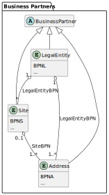

---
tags:
  - CAT/BPDM
  - CAT/Core Service Provider
  - CAT/Sandbox Services
  - CAT/Sandbox Service Provider
---

# CX-0010 Business Partner Number v3.0.1

## FOR WHOM IS THE STANDARD DESIGNED

This document is mainly targeted to technical individuals involved in issuing and maintaining business partner numbers, as well as business individuals who are involved in the compliance process of issuing and maintaining business partner numbers.

## COMPARISON WITH THE PREVIOUS VERSION OF THE STANDARD

| **Version** | **Publishing Date** | **Author** | **Description of Change**                                                                                                                                                                                                                                                                                           |
| ----------- | ------------------- | ---------- | ------------------------------------------------------------------------------------------------------------------------------------------------------------------------------------------------------------------------------------------------------------------------------------------------------------------- |
| 1.1.0       | 2022-11-30          |            | Initial version by Catena-X Association                                                                                                                                                                                                                                                                             |
| 1.1.1       | 2023-06-03          |            | Addendum for Conformity Assessment added                                                                                                                                                                                                                                                                            |
| 2.0.0       | 2023-09-26          |            | Included new terminology chapter; merged CX-0011 Issuing Agency                                                                                                                                                                                                                                                     |
| 2.1.0       | 2024-12-02          |            | Adapted to new template structure and made a major overhaul of the document; documented the scope of the check characters; remove reference to ISO/IEC 15459 until it is clarified, if the BPN shall be used for unit identifiers and / or if ISO/IEC 6523 is sufficient                                            |
| 2.2.0       | 2025-03-17          |            | Add reference and adapt wording regarding ISO/IEC 6523 registration of the BPN                                                                                                                                                                                                                                      |
| 3.0.0       | 2025-06-01          |            | Added the new quality "legally secure" to the BPNL and added the legally secure identifiers that the BPNL refers to as a table; added detailed identifier type description; added format and identifier type category attributes to the identifier type; updated to the major version 7 of the BPN issuing service. |

## ABSTRACT

The Business Partner Data Management (BPDM) is a distributed service-based system, composed of a set of dedicated services, that simultaneously serve multiple stakeholders and use cases. It is based on a central data pool of business partners, which is operated under data space governance and underlies interoperability through standardization. The main target is to create business partner data records (such as customer/supplier) with a high quality and currentness, to provide other processes with these data. This results in less rework and adjustment due to better master data quality which ultimately leads to an overall cost reduction for participating companies. Additionally, Value Added Services shall be offered to enrich those business partner data sets even further and give additional information or warnings about the business partners. Getting a 360° view on your business partners also helps with reducing costs and achieving process excellence because better decisions can be made.

The Business Partner Number (BPN) is a globally unique, world-wide scalable, semantically enriched, interoperable, time-dependent, stable, human-readable identifier for business partners known in the data space that represent an organization or one of its organization parts from foundation to closure. Additionally, the BPNL (BPN for legal entities) is legally secure. Consequently, it is also the unique identifier for the data space participants. The Catena-X Business Partner Number serves as a blueprint for similar data spaces that follow the Catena-X concepts, which promotes interoperability between these data spaces.

This standard defines the issuance process, structure, and lifecycle of BPNs. It also defines what types of BPNs there are and how they are linked to each other.

## 1. INTRODUCTION

### 1.1 AUDIENCE & SCOPE

> *This section is non-normative*

This standard is relevant for the following audience:

- Core Service Provider
- Onboarding Service Provider
- Business Application Provider
- Data Provider and Consumer

This document focuses on the business partner number (BPN) and its issuing organization (IO). It is used as primary identifier in the Business Partner Data Management (BPDM) use case described on the [BPDM website](https://catena-x.net/use-case-cluster/next-level-master-data-management/). It is relevant for core service providers who want to provide services for retrieving a cleansed, high-quality business partner data record (Golden Record) for a given business partner number. It is also relevant for onboarding service providers, business application providers as well as data providers and consumers who want to use such services. To assume the role of the issuing organization (IO), core service providers especially need to get an understanding on the issuance process, structure, lifecycle, types, and relations of a BPN.

The Business Partner Number (BPN) is a globally unique, world-wide scalable, semantically enriched, interoperable, time-dependent, stable, human-readable identifier for business partners known in the data space that represent an organization or one of its organization parts from foundation to closure. Additionally, the BPN (BPN for legal entities) is legally secure. Consequently, it is also the unique identifier for the data space participants. The Catena-X Business Partner Number serves as a blueprint for similar data spaces that follow the Catena-X concepts, which promotes interoperability between these data spaces.

Not in scope is the way of how business partner data records can be shared to create a Golden Record. There is a separate standard for this: CX-0074 Business Partner Data Gate API 4.0.0.

Not in scope is the overall Business Partner Pool with all Golden Records within the data space and the way of how the Golden Records can be retrieved. There is a separate standard for this: CX-0012 Business Partner Pool API 5.0.0.

Not in scope are the requirements of cleansing and enriching the business partner data records with the aim to create a Golden Record. There is a separate standard for this: CX-0076 Golden Record End to End Requirements Standard 1.4.0.

You can find the other standards in the [standard library](https://catenax-ev.github.io/docs/standards/overview).

### 1.2 CONTEXT AND ARCHITECTURE FIT

> *This section is non-normative*

It is not only with the founding of various industry data spaces (such as Catena-X) that the requirements increase to establish data standards for the entire value chain and to promote the industry-wide, international data exchange. For the networking of OEMs, suppliers, customers, and industrial partners, it is essential to define and introduce an industry-wide standard for identifying business partners to map the entire supply chain in a sustainable manner.

In order to satisfy this requirement, an issuance process is established and structure, lifecycle, types, and relations are defined for a business partner number that has the following targeted qualities:

- the BPN is a **globally unique** identifier, with which an organization or one of its organization parts have **exactly one** identifier world-wide, so that no two organizations or organization parts have the same identifier and no two identifiers stand for the same organization or organization part
- the BPN is a **world-wide scalable** identifier, that is able to identify **all** organizations and their organization parts on a global scale
- the BPN is a **semantically enriched** identifier, that includes the **type** of the business partner it identifies
- the BPN is an **interoperable** identifier, which is used **cross-application** and **cross-organization** in all conceivable business contexts
- the BPN is a **time-dependent** identifier, that has a **validity** for which it identifies an organization or one of its organization parts in the (legally) defined limits of their existence
- the BPN is a **stable** identifier, which **never changes** structurally, **never ceases to exist** and **never is reassigned**, even if the organization or one of its organization parts ceases to exist
- the BPN is a **human-readable** identifier, that is comparable to a telephone number or a postal code
- the BPN is an identifier, which inherently supports **error detection**

Additionally:

- the BPNL is a **legally secure**[^7] identifier, that enables the unambiguous identification of **contracting parties**, ensuring a reliable foundation for legally binding **data exchange contracts**

There is a reference implementation for the [Business Partner Data Pool BPN Issuing Service (7.0.x)](https://github.com/eclipse-tractusx/bpdm/blob/e518d4cb7be420b6a7c50499a237ae6bf0ffc00c/bpdm-pool/src/main/kotlin/org/eclipse/tractusx/bpdm/pool/service/BpnIssuingService.kt) on GitHub. It is part of a Spring Boot Kotlin open-source software project under the hood of the Eclipse Foundation and follows the Apache 2.0 licenses.

For the complete and up-to-date BPDM setup refer to the [Eclipse Tractus-X BPDM GitHub repository (7.0.x)](https://github.com/eclipse-tractusx/bpdm/blob/e518d4cb7be420b6a7c50499a237ae6bf0ffc00c/README.md).

For an architecture overview refer to the [BPDM ARC42 documentation (7.0.x)](https://github.com/eclipse-tractusx/bpdm/tree/e518d4cb7be420b6a7c50499a237ae6bf0ffc00c/docs/architecture).

### 1.3 CONFORMANCE AND PROOF OF CONFORMITY

If sections are marked as non-normative, all authoring guidelines, diagrams, examples, and notes in these sections are non-normative. Everything else in this specification is normative.

The key words **MAY**, **MUST**, **MUST NOT**, **OPTIONAL**, **RECOMMENDED**, **REQUIRED**, **SHOULD** and **SHOULD NOT** in this document are to be interpreted as described in [BCP 14](https://datatracker.ietf.org/doc/html/bcp14), [RFC2119](https://www.w3.org/TR/did-core/#bib-rfc2119), [RFC8174](https://www.w3.org/TR/did-core/#bib-rfc8174) when, and only when, they appear in all capitals, as shown here.

All participants and their solutions will need to prove, that they are conform with the Catena-X standards. To validate that the standards are applied correctly, Catena-X employs Conformity Assessment Bodies (CABs).

To prove conformity with this standard, a self-audited, declared and signed document must be provided, that the conformity assessment criteria documented in this standard regarding issuance process, structure, lifecycle, types, and relations of BPNs are met.

### 1.4 EXAMPLES

An example for the BPN is: BPNL 0000 0000 IF61

**BPN:** marks the identifier as BPN

**L:** identifies the type of the business partner; in this case its a legal entity

**0000 0000 IF:** identifies the business partner

**61** : are the check characters of the whole BPN

The BPNL can have relations to BPNA and BPNS which are depicted in the following example:

### 1.5 TERMINOLOGY

> *This section is non-normative*

#### 1.5.1 GENERAL

**organization:** unique framework of authority within which a person or persons act, or are designated to act, towards some purpose [^4]

**organization part:** any department, service or other entity within an organization, which needs to be identified for information interchange [^4]

**issuing organization (IO):** the issuing organization (IO) is a body that assumes responsibility for the administration of a specific organization identification scheme [^5]

**organization identification scheme:** a system for allocating identifiers to registered objects (identification scheme) which is dedicated to the unique identification of organizations [^4]

**International Codes Designator (ICD):** data element used to uniquely identify an organization identification scheme [^4]

**organization identifier (OI):** assigned to an organization within an organization identification scheme, and unique within that scheme [^4]

**organization part identifier (OPI):** an identifier allocated to a particular organization part [^4]

**organization part identifier source indicator (OPIS):** data element used to specify the source for the organization part identifier [^4]

**Golden Record:** A Golden Record is a business partner data record which successfully passed a set of predefined quality rules. These rules qualified the data record into a harmonized, standardized, and semantically unified data structure which is defined by the BPDM standards. The Golden Record status is a prerequisite for each business partner data record to receive a valid business partner number.

#### 1.5.2 DATA MODEL

This chapter explains the data model[^1] from a conceptual / terminology point of view. It does not include technical details of the API data model, such as:

- differences in response and request
- differences in data stages (like input or output)
- attributes for pagination
- singular query parameters, which are not already attributes of the entities

##### 1.5.2.1 BUSINESS PARTNER

In general, a business partner is any entity (such as a customer, a supplier, an employee, or a service provider) that does business with another entity.

In data spaces, a business partner is an organization (such as an enterprise or company, university, association, etc., and not a natural person) or one of its organization parts that acts as unique partner within the supply chain - either in the role of a direct participant, or a consultant, or a non-production-material (NPM) supplier.

BPDM distinguishes between three business partner types to represent an organization or one of its organization parts relevant for the supply chain (see detailed definitions): legal entity, site, and address[^2].

##### 1.5.2.2 LEGAL ENTITY

In general, a legal entity is a juridical person that has legal rights and duties related to contracts, agreements, and obligations. The term especially applies to any kind of organization established under the law applicable to a country.

In data spaces, a legal entity is a type of business partner representing a legally registered organization with its official registration information, such as legal name (including legal form, if registered), legal address and a legally secure external identifier (e.g. VAT ID, TIN, HRB number, LEI).

A legal entity has exactly one legal address, but it is possible to specify additional addresses that a legal entity owns. Thus, at least one address is assigned to a legal entity. A legal entity can own sites. Thus, many or no sites are assigned to a legal entity. A legal entity is uniquely identified by the BPNL.

##### 1.5.2.3 SITE

In general, a site is a delimited geographical area in which an organization conducts business.

In data spaces, a site is a type of business partner representing a physical location or area owned by a legal entity, where a production plant, a warehouse, or an office building is located.

A site is owned by a legal entity. Thus, exactly one legal entity is assigned to a site. A site has exactly one main address[^3], but it is possible to specify additional addresses (such as different gates), that belong to a site. Thus, at least one address is assigned to a site. A site can only be uploaded and modified by the owner (the legal entity), because only the owner knows which addresses belong to which site. A site is uniquely identified by the BPNS.

##### 1.5.2.4 ADDRESS

In general, an address is a collection of information to describe a physical location, using a street name with a house number and/or a post office box as reference. In addition, an address consists of several postal attributes, such as country, region (state), county, township, city, district, or postal code, which help deliver mail.

In data spaces, an address is a type of business partner representing the legal address of a legal entity, and/or the main address[^3] of a site, or any additional address of a legal entity or site (such as different gates).

An address is owned by a legal entity. Thus, exactly one legal entity is assigned to an address. An address can belong to a site. Thus, one or no site is assigned to an address. An address is uniquely identified by the BPNA.

##### 1.5.2.5 IDENTIFIER TYPE

An identifier type defines the name or category of an identifier, such as the German Handelsregisternummer, a VAT registration / taxpayer identification number, etc. The identifier type is valid for a business partner type and used in a specific country.

| **Attribute**               | **Description**                                                                                     | **(Data) Type / Code List / Enumeration** |
| --------------------------- | --------------------------------------------------------------------------------------------------- | ----------------------------------------- |
| Technical Key               | The technical identifier of the identifier type.                                                    | String                                    |
| Name                        | The local name of the identifier type.                                                              | String                                    |
| Business Partner Type       | One of the types of business partners for which the identifier type is valid: legal entity, address | Enum                                      |
| Identifier Type Category    | One of the categories of identifier types: VAT, TIN, NBR, IBR, OTH (see also below)                 | Enum                                      |
| Abbreviation                | The local abbreviated name of the identifier type.                                                  | String                                    |
| Transliterated Name         | The transliterated local name of the identifier type.                                               | String                                    |
| Transliterated Abbreviation | The transliterated local abbreviated name of of the identifier type.                                | String                                    |
| Format                      | The regular expression for the identifier type format                                               | String                                    |

An identifier type can be classified into **one or more** of the following identifier type categories:

  1. `VAT`: value-added tax registration (so-called value-added tax identification numbers (VAT IDs or VATINs), e.g. EU VAT ID, UID MWST/TVA/IPA)
  2. `TIN`: taxpayer identification (so-called taxpayer identification numbers (TINs), e.g. SIREN, NIF)
  3. `NBR`: national business registration (e.g. HRB-Nummer, Firmenbuchnummer) for different purposes (e.g. commercial register, trade register), which are not related to tax
  4. `IBR`: international business registration (e.g. LEI, EORI) for different purposes (e.g. regulatory reporting, risk management at financial regulatory bodies)
  5. `OTH`: other identifier types (e.g. D&B D-U-N-S, GS1 GLN), which are not legally secure

###### 1.5.2.1 IDENTIFIER TYPE DETAILS

The identifier type details describe for which countries an identifier is valid and mandatory

| **Attribute** | **Description**                                                                                                                                                                                                                            | **(Data) Type / Code List / Enumeration** |
| ------------- | ------------------------------------------------------------------------------------------------------------------------------------------------------------------------------------------------------------------------------------------ | ----------------------------------------- |
| Country       | The two-letter country code according to [ISO 3166-1:2020](https://www.iso.org/obp/ui/en/#iso:std:iso:3166:-1:ed-4:v1:en) of the country in which the identifier type is valid. Can be empty if identifier type is valid in all countries. | String                                    |
| Mandatory     | Indicates whether the identifier type is mandatory in the country.                                                                                                                                                                         | Boolean                                   |

## 2 BUSINESS PARTNER NUMBER

> *This section is normative*

The BPN is a globally unique, world-wide scalable, semantically enriched, interoperable, time-dependent, stable, human-readable identifier for business partners that represent an organization or one of its organization parts from foundation to closure. It also inherently supports error detection. Additionally, the BPNL is legally secure. All conformity assessment criteria that guarantee these qualities are listed and explained below.

### 2.1 ISSUANCE PROCESS

The issuing organization **MUST** issue BPNs for the following business partners in accordance with the [ISO/IEC 6523-1:2023](https://www.iso.org/obp/ui/en/#iso:std:iso-iec:6523:-1:ed-2:v1:en) and this standard:

- legal entities (BPNL), such that the BPN is an organization identifier (OI) in the sense of the [ISO/IEC 6523-1:2023](https://www.iso.org/obp/ui/en/#iso:std:iso-iec:6523:-1:ed-2:v1:en)
- sites (BPNS), such that the BPN is an organization part identifier (OPI) in the sense of the [ISO/IEC 6523-1:2023](https://www.iso.org/obp/ui/en/#iso:std:iso-iec:6523:-1:ed-2:v1:en)
- addresses (BPNA), such that the BPN is an organization part identifier (OPI) in the sense of the [ISO/IEC 6523-1:2023](https://www.iso.org/obp/ui/en/#iso:std:iso-iec:6523:-1:ed-2:v1:en)

Note that for this standard, organization part identifiers (OPIs, like BPNS and BPNA) are issued by the issuing organization only, so that the organization part identifier source indicator (OPIS) is always 0. As the OPIS can be considered a constant it is **NOT REQUIRED** to be included in any data exchange.

The issuing organization **MUST** centrally issue BPNs, so that they are **globally unique** and can be used cross-application and cross-organization in an **interoperable** way in a data space. Catena-X e.V. grants a license through which an operating company can issue BPNs on behalf of the Catena-X e.V. and thus assume the role of the issuing organization.[^6]

The issuing organization **MUST** issue BPNLs for capital companies (such as German GmbH, AG; British Ltd., PLC; French SARL, SA etc.). All other legal forms are **OPTIONAL** for the issuance of BPNLs and thus not regulated by this standard, such as:

- (commercial) partnerships
- sole-proprietorships
- cooperatives
- associations
- public sector companies
- non-profit organizations

The issuing organization **MUST NOT** issue BPNLs, BPNSs or BPNAs for the following real-world entities, as they are not considered as **organizations or organization parts** in the sense of this standard:

- natural persons (such as employees) who act for a legal entity and are not a legal entity on their own
- elements of (legal) hierarchies if they are not a legal entity on their own

The issuing organization **MUST NOT** issue BPNLs and **SHOULD NOT** issue BPNSs and BPNAs for the following real-world entities, as they are not considered as **organizations or organization parts** in the sense of this standard, especially due to their rather logistical function and / or non-standardized / restricted / missing usage as business partner data objects in master data management systems:

- forms of freight forwarding (such as c/o addresses)
- internal loading / unloading points

The issuing organization **MUST** issue BPNs for organization and organization parts in all member states of the European Union, Great Britain, Switzerland, Norway, and Northern Ireland (Protocol). All other countries as well as oversea dependencies / locations outside of Europe of the aforementioned countries are **OPTIONAL** for the issuance of BPNs and thus not regulated by this standard.

The BPN issuance process **MUST** be coupled to the creation of a Golden Record, so that a BPN is only issued if a corresponding Golden Record exists.

To ensure that the BPNL is **legally secure**, the Golden Record for the BPNL **MUST** contain the legal name, legal form and legal address of the organization. Furthermore, the Golden Record for the BPNL **MUST** contain at least one external identifier of a **legally secure** identifier type (see [2.5 IDENTIFIER TYPES](#25-identifier-types)), so that the following rules apply:

1. if the country of the organization's legal address has a `VAT` identifier type and the organization is subject to value-added tax, a `VAT` identifier **MUST** be contained in the Golden Record
2. if 1. does not hold true and the country of the organizations's legal address has a `TIN` identifier type which is publicly available and the organization is subject to any tax in that country, a `TIN` identifier **MUST** be contained in the Golden Record
3. if 2. does not hold true and the country of the organizations's legal address has an `NBR` identifier type with which the organization is registered in that country, an `NBR` identifier **MUST** be contained in the Golden Record
4. if 3. does not hold true (which is very unlikely) and the organization has an `IBR` identifier, an `IBR` identifier **MUST** be contained in the Golden Record
5. if 4. does not hold true, a BPNL **MUST NOT** be issued

Identifiers of identifier types that do not fall into the above rules are **OPTIONAL** to be contained in the Golden Record. This also applies to the identifiers assigned to the BPNA, so that a BPN can be issued for an address without an identifier.

### 2.2 STRUCTURE

The structure of a BPN **MUST** be registered as an organization identification scheme according to [ISO/IEC 6523-1:2023](https://www.iso.org/obp/ui/en/#iso:std:iso-iec:6523:-1:ed-2:v1:en) and [ISO/IEC 6523-2:1998](https://www.iso.org/obp/ui/en/#iso:std:iso-iec:6523:-2:ed-1:v1:en) with the [Registration Authority](http://iso6523.info/) under an International Code Designator (ICD), so that only the issuing organization can issue organization identifiers or organization part identifiers for this scheme.

The BPN **MUST** have the following structure, being a 16-character identifier:

| **Prefix** | **Type Character** | **Entity Characters** | **Check Characters** |
| ---------- | ------------------ | --------------------- | -------------------- |
| BPN        | 1 character        | 10 characters         | 2 characters         |

A well-defined and standardized structure, which relies on existing standards as well as on common practice, guarantees acceptance:

- the prefix is always "BPN" in upper case, which marks the identifier as a Business Partner Number
- the type character **semantically enriches** the BPN, so that the type of the business partner can be directly determined. It is one of the uppercase letters 'L', 'S', or 'A':

  - L stands for legal entity
  - S stands for site
  - A stands for address

- the entity characters are alphanumerical uppercase characters that ensure that the BPN is **world-wide scalable**, being capable of identifying 36^10 ~ 3.6 quadrillion different business partners per type
- the check characters are alphanumerical uppercase characters that implement the **error detection** using a verification algorithm according to [ISO/IEC 7064:2003](https://www.iso.org/obp/ui/en/#iso:std:iso-iec:7064:ed-1:v1:en) MOD 1271-36

The regular expression for the BPN is: BPN\[LSA\]\[A-Z0-9\]\{10\}\[A-Z0-9\]\{2\}

Further requirements:

- the check characters **MUST** be calculated over the entire BPN (prefix, type and entity code), to fully support **error detection**
- the following input or reading aid using blanks **SHOULD** be used to even further increase **human-readability** of the BPN, e.g.: BPNL 0000 0000 IF61

### 2.3 LIFECYCLE

The BPN of a business partner has an own lifecycle, depending on the corresponding state of the business partner in the real world.

Therefore, each business partner in BPDM **MUST** have a state with the following state definitions:

- active
- inactive

As the BPN is **time-dependent**, the state **MUST** have a start and an end date, which defines the validity of the business partner (state) and thus the validity of the BPN.

Even if a business partner becomes inactive, the business partner and its BPN **MUST** be further accessible. The BPN **MUST NOT** change structurally over its lifetime. Both requirements are crucial for the BPN to be considered as **stable**.

### 2.4 RELATIONS

There are the following relations between a legal entity, its sites, and its addresses:

- Each legal entity **MUST** be associated to at least one address which is its legal address
- Each site **MUST** be associated to at least one address which is its main address[^3]

- Each site **MUST** be associated to exactly one legal entity
- Each address **MUST** be associated to exactly one legal entity
- Each address **MUST** be either associated to none or no more than one site

- It **MUST** be possible to associate multiple addresses to a legal entity
- It **MUST** be possible to associate multiple sites to a legal entity
- It **MUST** be possible to associate multiple addresses to a site

### 2.5 IDENTIFIER TYPES

In the following table, the identifier types for legal entities are listed with their corresponding identifier type codes.

Legend:

- column **C** contains the country code
- column **Category** contains the identifier type category code
- column **ITC** contains the identifier type code (technical key)
- column **Name** contains the local name of the identifier type
- column **Transliterated Name** contains the transliterated local name of the identifier type
- column **Abbr** contains the local abbreviation of the identifier type
- column **TAbbr** contains the transliterated local abbreviation of the identifier type
- column **Format** contains the regular expression for the identifier type format

The name **MUST** be the local name for the identifier type used in the country. If the identifier type is used in multiple countries (e.g. EU-wide or world-wide) it **MUST** be the English name. The name **MUST** be mandatory. It **SHOULD** not use abbreviations.

The abbreviation **MUST** be the local short form of the identifier type used in that country. If the identifier type is used in multiple countries (e.g. EU-wide or world-wide) it **MUST** be the English short form. The abbreviation **MUST** be mandatory.

Both name and abbreviation are required in the local form, to make sure the exact identifier type is meant and not an artificial abstraction, which possibly includes several different identifier types. Note that sometimes it's OK to use the English name and abbreviation, if it's a real-world abstraction for several countries, like the EU VAT ID.

The transliterated name and abbreviation **MUST** be the latinized form of name and abbreviation according to standardized transliteration rules using only Latin letters without diacritics ([A-Za-z]). This is important especially for non-latin based scripts, like Greek, Cyrillic, etc. However, transliterated name and abbreviation must also be included for latin based scripts with diacritics where diacritics **MUST** be replaced by the Latin letters without diacritics.

The technical key **MUST** have the form `{scope}_{transliterated abbreviation}`. The scope **MUST** be either an ISO 3166-1 2-letter country code or the abbreviation of an institution / system (like GLEIF, DUNS). Both scope and transliterated abbreviation **MUST** be capitalized. If the scope or transliterated abbreviation includes spaces, they **MUST** be replaced by underscores.

Note that it might be hard to adapt immediately to the identifier type codes proposed in this standard, as there are already current identifier type codes in use. It is **RECOMMENDED** to use these identifier type codes for new organizations and to map the current identifier type code to the new identifier type code for existing organizations so that both can be used in parallel, but the identifier type codes in this standard **MUST** be the leading ones.

Note that in some countries the `TIN` identifier is not publicly available, so it is not listed in the table. In these cases, the `TIN` identifier **MUST NOT** be used for the identification of organizations according to legal regulations in these countries.

Note that in those countries where the `TIN` identifier is publicly available, the `VAT` identifier is usually equal to or derived from the `TIN` identifier. In those countries where the `TIN` identifier is not publicly available, the `VAT` identifier is usually an identifier of its own kind or it is equal to or derived from the `NBR` identifier.

Note that in some countries there is no distinction between the `NBR` identifier and the `TIN` identifier so that for tax and commercial purposes only one identifier is used. In these cases the identifier type is marked with both, the `NBR` and `TIN` category.

Note that all of the `NBR` identifiers are publicly available. If they have a corresponding EUID the linked organizations can also be searched using the [Business Register Interconnection System (BRIS)](https://e-justice.europa.eu/topics/registers-business-insolvency-land/business-registers-search-company-eu_en?clang=en) of the European Union.

Note that you can find the `TIN` identifier on the [European Commission's website](https://ec.europa.eu/taxation_customs/tin/tinByCountry.html).

Note that you can look up some of the identifiers in the [EZB AnaCredit list of national identifiers](https://www.ecb.europa.eu/stats/money/aggregates/anacredit/shared/pdf/List_of_national_identifiers.xlsx).

| **C** | **Category** | **ITC**           | **Name**                                                                           | **Transliterated Name**                                                            | **Abbr**                    | **TAbbr**                   | **Format**                                                                                                                                                                                  |
| ----- | ------------ | ----------------- | ---------------------------------------------------------------------------------- | ---------------------------------------------------------------------------------- | --------------------------- | --------------------------- | ------------------------------------------------------------------------------------------------------------------------------------------------------------------------------------------- |
| AT    | NBR          | AT\_FBN           | Firmenbuchnummer                                                                   |                                                                                    | FBN                         |                             | \^\d{1,6}\[a-z\]$                                                                                                                                                                           |
| AT    | VAT          | AT\_EU\_VAT\_ID   | European Union Value-added Tax Identification Number                               |                                                                                    | EU VAT ID (number)          |                             | \^ATU\d{7}\d{1}$                                                                                                                                                                            |
|       |              |                   |                                                                                    |                                                                                    |                             |                             |                                                                                                                                                                                             |
| BE    | NBR          | BE\_OND           | Ondernemingsnummer / Numéro d'entreprise                                           | Ondernemingsnummer / Numero d'entreprise                                           | OND-(nummer) / (numéro) ENT | OND-(nummer) / (numero) ENT | \^\[0,1\]{1}\d{3}\d{3}\d{1}\d{2}$                                                                                                                                                           |
| BE    | VAT          | BE\_BTW           | Belasting over de toegevoegde waarde nummer / Numéro de taxe sur la valeur ajoutée | Belasting over de toegevoegde waarde nummer / Numero de taxe sur la valeur ajoutee | BTW(-nummer) / (numéro) TVA | BTW(-nummer) / (numero) TVA | \^\[0,1\]\d{3}\d{3}\d{1}\d{2}$                                                                                                                                                              |
| BE    | VAT          | BE\_EU\_VAT\_ID   | European Union Value-added Tax Identification Number                               |                                                                                    | EU VAT ID (number)          |                             | \^BE\[0,1\]\d{3}\d{3}\d{1}\d{2}$                                                                                                                                                            |
|       |              |                   |                                                                                    |                                                                                    |                             |                             |                                                                                                                                                                                             |
| BG    | NBR          | BG\_EIK           | Единен идентификационен код                                                        | Edinen identifikatsionen kod                                                       | ЕИК                         | EIK                         | \^\d{8,9}(\d{1})?$                                                                                                                                                                          |
| BG    | VAT          | BG\_EU\_VAT\_ID   | European Union Value-added Tax Identification Number                               |                                                                                    | EU VAT ID (number)          |                             | \^BG\d{8,9}(\d{1})?$                                                                                                                                                                        |
|       |              |                   |                                                                                    |                                                                                    |                             |                             |                                                                                                                                                                                             |
| CH    | NBR/TIN      | CH\_UID           | Unternehmens-Identifikationsnummer                                                 |                                                                                    | UID                         |                             | \^CHE-\d{3}\.\d{3}\.\d{3}$                                                                                                                                                                  |
| CH    | NBR          | CH\_EHRA\_ID      | Eidgenössisches Handelsregisteramt-Identifikationsnummer                           | Eidgenossisches Handelsregisteramt-Identifikationsnummer                           | EHRA-ID                     |                             | \^\d{6}$                                                                                                                                                                                    |
| CH    | VAT          | CH\_UID\_MWST     | Unternehmens-Identifikationsnummer (Mehrwertsteuer)                                |                                                                                    | UID MWSt.                   |                             | \^CHE-\d{3}\.\d{3}\.\d{3}\s(MWST\|TVA\|IPA)$                                                                                                                                                |
|       |              |                   |                                                                                    |                                                                                    |                             |                             |                                                                                                                                                                                             |
| CY    | NBR          | CY\_AEE           | Αριθμός Εγγραφής στο Τμήμα Εφόρου Εταιρειών                                        | Arithmos Engrafis sto Tmima Eforou Etairion                                        | AEE                         |                             | \^\[A-Z\]{1,2}\d{1,8}$                                                                                                                                                                      |
| CY    | TIN          | CY\_AFT           | Αριθμός φορολογικής ταυτότητας                                                     | Arithmos forologikis tautotitas                                                    | ΑΦΤ                         | AFT                         | \^\[013945\]{1}\d{7}\[A-Z\]{1}$                                                                                                                                                             |
| CY    | VAT          | CY\_EU\_VAT\_ID   | European Union Value-added Tax Identification Number                               |                                                                                    | EU VAT ID (number)          |                             | \^CY\[013945\]{1}\d{7}\[A-Z\]{1}$                                                                                                                                                           |
|       |              |                   |                                                                                    |                                                                                    |                             |                             |                                                                                                                                                                                             |
| CZ    | NBR          | CZ\_ICO           | Identifikační číslo osoby                                                          | Identifikacni cislo osoby                                                          | IČO                         | ICO                         | \^\[1-9\]{1}\d{6,8}\d{1}$                                                                                                                                                                   |
| CZ    | TIN          | CZ\_DIC           | Daňové identifikační číslo                                                         | Danove identifikacni cislo                                                         | DIČ                         | DIC                         | \^\[1-9\]{1}\d{6,8}\d{1}$                                                                                                                                                                   |
| CZ    | VAT          | CZ\_EU\_VAT\_ID   | European Union Value-added Tax Identification Number                               |                                                                                    | EU VAT ID (number)          |                             | \^CZ\[1-9\]{1}\d{6,8}\d{1}$                                                                                                                                                                 |
|       |              |                   |                                                                                    |                                                                                    |                             |                             |                                                                                                                                                                                             |
| DE    | NBR          | DE\_HR            | Handelsregisternummer                                                              |                                                                                    | HR(-nummer)                 |                             | \^(\[BDFGHKMNPRTUVWXY\]{1}\d{1,4}\[VR\]?\.)?((HRA)\|(G(n\|N)R)\|(HRB)\|(PR)\|(VR)\|(G(s\|S)R))\[1-9\]{1}\[A-Z0-9\]{1,5}$                                                                    |
| DE    | VAT          | DE\_EU\_VAT\_ID   | European Union Value-added Tax Identification Number                               |                                                                                    | EU VAT ID (number)          |                             | \^DE\d{8}\d{1}(-\d{5})?$                                                                                                                                                                    |
|       |              |                   |                                                                                    |                                                                                    |                             |                             |                                                                                                                                                                                             |
| DK    | NBR          | DK\_CVR           | Centrale Virksomhedsregister Nummer                                                |                                                                                    | CVR(-nummer)                |                             | \^\d{7}\d{1}$                                                                                                                                                                               |
| DK    | VAT          | DK\_EU\_VAT\_ID   | European Union Value-added Tax Identification Number                               |                                                                                    | EU VAT ID (number)          |                             | \^DK\d{7}\d{1}$                                                                                                                                                                             |
|       |              |                   |                                                                                    |                                                                                    |                             |                             |                                                                                                                                                                                             |
| EE    | NBR          | EE\_RG            | Äriregistri kood                                                                   | Ariregistri kood                                                                   | RG(-kood)                   |                             | \^\d{8}$                                                                                                                                                                                    |
| EE    | VAT          | EE\_EU\_VAT\_ID   | European Union Value-added Tax Identification Number                               |                                                                                    | EU VAT ID (number)          |                             | \^EE\d{8}\d{1}$                                                                                                                                                                             |
|       |              |                   |                                                                                    |                                                                                    |                             |                             |                                                                                                                                                                                             |
| ES    | NBR          | ES\_RM            | Número de inscripción en el registro mercantil                                     | Numero de inscripcion en el registro mercantil.                                    | (número) RM                 | (numero) RM                 | \^\d{8}$                                                                                                                                                                                    |
| ES    | TIN          | ES\_NIF           | Número de identificación fiscal (fka Código de identificación fiscal)              | Numero de identificacion fiscal (fka Codigo de identificacion fiscal)              | NIF                         |                             | \^\[A-HJ-NP-SUVW\]{1}\d{2}\d{5}\[A-Z0-9\]{1}$                                                                                                                                               |
| ES    | VAT          | ES\_EU\_VAT\_ID   | European Union Value-added Tax Identification Number                               |                                                                                    | EU VAT ID (number)          |                             | \^ES\[A-HJ-NP-SUVW\]{1}\d{2}\d{5}\[A-Z0-9\]{1}$                                                                                                                                             |
|       |              |                   |                                                                                    |                                                                                    |                             |                             |                                                                                                                                                                                             |
| FI    | NBR          | FI\_Y             | Yritys- ja yhteisötunnus                                                           | Yritys- ja yhteisotunnus                                                           | Y(-tunnus)                  |                             | \^\d{7}-\d{1}$                                                                                                                                                                              |
| FI    | VAT          | FI\_EU\_VAT\_ID   | European Union Value-added Tax Identification Number                               |                                                                                    | EU VAT ID (number)          |                             | \^FI\d{7}\d{1}$                                                                                                                                                                             |
|       |              |                   |                                                                                    |                                                                                    |                             |                             |                                                                                                                                                                                             |
| FR    | NBR          | FR\_SIREN         | Numéro des système d'identification du répertoire des entreprises                  | Numero du systeme d'identification du repertoire des entreprises                   | (numéro) SIREN              | (numero) SIREN              | \^\d{8}\d{1}$                                                                                                                                                                               |
| FR    | VAT          | FR\_EU\_VAT\_ID   | European Union Value-added Tax Identification Number                               |                                                                                    | EU VAT ID (number)          |                             | \^FR\[A-Z0-9\]{2}\d{8}\d{1}$                                                                                                                                                                |
|       |              |                   |                                                                                    |                                                                                    |                             |                             |                                                                                                                                                                                             |
| GB    | NBR          | GB\_CRN           | Company Registration Number                                                        |                                                                                    | CRN                         |                             | \^((AC\|CE\|CS\|FC\|FE\|GE\|GS\|IC\|LP\|NC\|NF\|NI\|NL\|NO\|NP\|OC\|OE\|PC\|R0\|RC\|SA\|SC\|SE\|SF\|SG\|SI\|SL\|SO\|SR\|SZ\|ZC\|\d{2})\d{6})\|((IP\|SP\|RS)\[A-Z\d\]{6})\|(SL\d{5}\[\dA\])$ |
| GB    | TIN          | GB\_UTR           | Unique Taxpayer Reference                                                          |                                                                                    | UTR                         |                             | \^\d{10}$                                                                                                                                                                                   |
| GB    | VAT          | GB\_VAT\_REG      | Value-added Tax Registration Number                                                |                                                                                    | VAT Reg. (number)           |                             | \^GB\d{9}(\d{3})?$                                                                                                                                                                          |
|       |              |                   |                                                                                    |                                                                                    |                             |                             |                                                                                                                                                                                             |
| GR    | NBR          | GR\_GEMI          | Αριθμός του γενικού εμπορικού μητρώου                                              | Arithmos tou genikou emporikou mitroou                                             | (Αρ.) Γ.Ε.ΜΗ.               | (Ar.) G.E.MI.               | \^\[0-9\]{1,12}$                                                                                                                                                                            |
| GR    | TIN          | GR\_AFM           | Αριθμός φορολογικού μητρώου                                                        | Arithmos forologikou mitroou                                                       | ΑΦΜ                         | AFM                         | \^\d{8}\d{1}$                                                                                                                                                                               |
| GR    | VAT          | GR\_EU\_VAT\_ID   | European Union Value-added Tax Identification Number                               |                                                                                    | EU VAT ID (number)          |                             | \^EL\d{8}\d{1}$                                                                                                                                                                             |
|       |              |                   |                                                                                    |                                                                                    |                             |                             |                                                                                                                                                                                             |
| HR    | NBR          | HR\_MBS           | Matični broj subjekta trgovačkog suda                                              | Maticni broj subjekta trgovackog suda                                              | MBS                         |                             | \^\[0-1\]\d{8}$                                                                                                                                                                             |
| HR    | NBR/TIN      | HR\_OIB           | Osobni identifikacijski broj                                                       |                                                                                    | OIB                         |                             | \^\d{9}\d{2}$                                                                                                                                                                               |
| HR    | VAT          | HR\_EU\_VAT\_ID   | European Union Value-added Tax Identification Number                               |                                                                                    | EU VAT ID (number)          |                             | \^HR\d{9}\d{2}$                                                                                                                                                                             |
|       |              |                   |                                                                                    |                                                                                    |                             |                             |                                                                                                                                                                                             |
| HU    | NBR          | HU\_CJS           | Cégjegyzékszám                                                                     | Cegjegyzekszam                                                                     | CJS                         |                             | \^\d{2}-\d{2}-\d{6}$                                                                                                                                                                        |
| HU    | TIN          | HU\_AS            | Adószám                                                                            | Adoszam                                                                            | AS                          |                             | \^\d{8}-\d{1}-\d{2}$                                                                                                                                                                        |
| HU    | VAT          | HU\_EU\_VAT\_ID   | European Union Value-added Tax Identification Number                               |                                                                                    | EU VAT ID (number)          |                             | \^HU\d{8}$                                                                                                                                                                                  |
| HU    | VAT          | HU\_CSPO\_AFA\_AZ | Csoportos általános forgalmi adó azonosító szám                                    | Csoportos altalanos forgalmi ado azonosito szam                                    | Csop. ÁFA az. (sz.)         | Csop. AFA az. (sz.)         | \^HU\d{8}\d{3}$                                                                                                                                                                             |
|       |              |                   |                                                                                    |                                                                                    |                             |                             |                                                                                                                                                                                             |
| IE    | NBR          | IE\_CRO           | Company Registration Office Number                                                 |                                                                                    | CRO (number)                |                             | \^\[1-9\]\d{1,6}$                                                                                                                                                                           |
| IE    | VAT          | IE\_EU\_VAT\_ID   | European Union Value-added Tax Identification Number                               |                                                                                    | EU VAT ID (number)          |                             | \^IE\d{7}\[A-Z\]{2}$                                                                                                                                                                        |
|       |              |                   |                                                                                    |                                                                                    |                             |                             |                                                                                                                                                                                             |
| IT    | NBR          | IT\_REA           | Numero del registro economico amministrativo                                       |                                                                                    | (numero) REA                |                             | \^\[A-Z\]{2}-\d{7}$                                                                                                                                                                         |
| IT    | TIN          | IT\_CF            | Codice fiscale                                                                     |                                                                                    | CF                          |                             | \^\d{7}\d{3}\d{1}$                                                                                                                                                                          |
| IT    | VAT          | IT\_IVA           | Codice imposta sul valore aggiunto                                                 |                                                                                    | (codice) IVA                |                             | \^\d{7}\d{3}\d{1}$                                                                                                                                                                          |
| IT    | VAT          | IT\_EU\_VAT\_ID   | European Union Value-added Tax Identification Number                               |                                                                                    | EU VAT ID (number)          |                             | \^IT\d{7}\d{3}\d{1}$                                                                                                                                                                        |
|       |              |                   |                                                                                    |                                                                                    |                             |                             |                                                                                                                                                                                             |
| LT    | NBR          | LT\_JAR           | Juridinių asmenų registro kodas                                                    | Juridiniu asmenu registro kodas                                                    | JAR (kodas)                 |                             | \^\d{1}\d{7}\d{1}$                                                                                                                                                                          |
| LT    | VAT          | LT\_EU\_VAT\_ID   | European Union Value-added Tax Identification Number                               |                                                                                    | EU VAT ID (number)          |                             | \^LT\d{1}\d{7}\d{1}(\d{3})?$                                                                                                                                                                |
|       |              |                   |                                                                                    |                                                                                    |                             |                             |                                                                                                                                                                                             |
| LU    | NBR          | LU\_RCS           | Numéro registre de commerce et des sociétés                                        | Numero registre de commerce et des societes                                        | (numéro) RCS                | (numero) RCS                | \^\[B-Z\]\d+$                                                                                                                                                                               |
| LU    | VAT          | LU\_EU\_VAT\_ID   | European Union Value-added Tax Identification Number                               |                                                                                    | EU VAT ID (number)          |                             | \^LU\d{6}\d{2}$                                                                                                                                                                             |
|       |              |                   |                                                                                    |                                                                                    |                             |                             |                                                                                                                                                                                             |
| LV    | NBR          | LV\_URN           | Uzņēmuma reģistrācijas numur                                                       | Uznemuma registracijas numurs                                                      | URN                         |                             | \^\[1-9\]{1}\d{7}$                                                                                                                                                                          |
| LV    | VAT          | LV\_EU\_VAT\_ID   | European Union Value-added Tax Identification Number                               |                                                                                    | EU VAT ID (number)          |                             | \^LV4\d{1}\[1-9\]{1}\d{7}\d{1}$                                                                                                                                                             |
|       |              |                   |                                                                                    |                                                                                    |                             |                             |                                                                                                                                                                                             |
| MT    | NBR          | MT\_CRN           | Company Registration Number                                                        |                                                                                    | CRN                         |                             | \^(C\|P\|SV\|SE\|LP\|SO\|NF\|RPF\|FD\|G)\d{1,5}$                                                                                                                                            |
| MT    | VAT          | MT\_EU\_VAT\_ID   | European Union Value-added Tax Identification Number                               |                                                                                    | EU VAT ID (number)          |                             | \^MT\d{6}\d{2}$                                                                                                                                                                             |
|       |              |                   |                                                                                    |                                                                                    |                             |                             |                                                                                                                                                                                             |
| NL    | NBR          | NL\_KVK           | Kamer van Koophandel nummer                                                        |                                                                                    | KVK (nummer)                |                             | \^\d{8}$                                                                                                                                                                                    |
| NL    | TIN          | NL\_RSIN          | Rechtspersonen en Samenwerkingsverbanden Informatie Nummer                         |                                                                                    | RSIN (nummer)               |                             | \^\[1-9\]{1}\d{8}$                                                                                                                                                                          |
| NL    | VAT          | NL\_EU\_VAT\_ID   | European Union Value-added Tax Identification Number                               |                                                                                    | EU VAT ID (number)          |                             | \^NL\[1-9\]{1}\d{8}$                                                                                                                                                                        |
|       |              |                   |                                                                                    |                                                                                    |                             |                             |                                                                                                                                                                                             |
| NO    | NBR/TIN      | NO\_ORG           | Organisasjonsnummer                                                                |                                                                                    | ORG(-nummer)                |                             | \^\d{9}$                                                                                                                                                                                    |
| NO    | VAT          | NO\_ORG\_MVA      | Organisasjonsnummer (Merverdiavgift)                                               |                                                                                    | ORG(-nummer) Mva.           |                             | \^\d{9}\sMVA$                                                                                                                                                                               |
|       |              |                   |                                                                                    |                                                                                    |                             |                             |                                                                                                                                                                                             |
| PL    | NBR          | PL\_KRS           | Numer w krajowym rejestrze sądowym                                                 | Numer w krajowym rejestrze sadowym                                                 | KRS (numer)                 |                             | \^KRS\d{10}$                                                                                                                                                                                |
| PL    | NBR          | PL\_REGON         | Numer identyfikacyjny rejestru gospodarki narodowe                                 |                                                                                    | (numer) REGON               |                             | \^(\d{9}\|\d{14})$                                                                                                                                                                          |
| PL    | TIN          | PL\_NIP           | Numer identyfikacji podatkowej                                                     |                                                                                    | NIP                         |                             | \^\d{3}\d{6}\d{1}$                                                                                                                                                                          |
| PL    | VAT          | PL\_EU\_VAT\_ID   | European Union Value-added Tax Identification Number                               |                                                                                    | EU VAT ID (number)          |                             | \^PL\d{3}\d{6}\d{1}$                                                                                                                                                                        |
|       |              |                   |                                                                                    |                                                                                    |                             |                             |                                                                                                                                                                                             |
| PT    | NBR/TIN      | PT\_NIPC          | Número de Identificação de Pessoa Coletiva (aka Número de Identificação Fiscal)    | Numero de Identificacao de Pessoa Coletiva (aka Numero de Identificacao Fiscal)    | NIPC                        |                             | \^PT5\d{7}\d{1}$                                                                                                                                                                            |
| PT    | VAT          | PT\_EU\_VAT\_ID   | European Union Value-added Tax Identification Number                               |                                                                                    | EU VAT ID (number)          |                             | \^PT5\d{7}\d{1}$                                                                                                                                                                            |
|       |              |                   |                                                                                    |                                                                                    |                             |                             |                                                                                                                                                                                             |
| RO    | NBR          | RO\_NRC           | Numărul de ordine în registrul comerţului                                          | Numarul de ordine in registrul comertului                                          | NRC                         |                             | \^J\[0-5\]{1}\[0-9\]{1}/\d{4}/\d{1,6}$                                                                                                                                                      |
| RO    | TIN          | RO\_CUI           | Codul Unic de Înregistrare                                                         | Codul Unic de Inregistrare                                                         | CUI                         |                             | \^\[1-9\]\d{0,8}\d{1}$                                                                                                                                                                      |
| RO    | VAT          | RO\_EU\_VAT\_ID   | European Union Value-added Tax Identification Number                               |                                                                                    | EU VAT ID (number)          |                             | \^RO\[1-9\]\d{0,8}\d{1}$                                                                                                                                                                    |
|       |              |                   |                                                                                    |                                                                                    |                             |                             |                                                                                                                                                                                             |
| SE    | NBR          | SE\_ORG           | Organisationsnummer                                                                |                                                                                    | ORG(-nummer)                |                             | \^\d{2}\[2-9\]{1}\d{3}-?\d{4}$                                                                                                                                                              |
| SE    | VAT          | SE\_EU\_VAT\_ID   | European Union Value-added Tax Identification Number                               |                                                                                    | EU VAT ID (number)          |                             | \^SE\d{2}\[2-9\]{1}\d{3}\d{4}(\d{2})?$                                                                                                                                                      |
|       |              |                   |                                                                                    |                                                                                    |                             |                             |                                                                                                                                                                                             |
| SI    | NBR          | SI\_MAT           | Matična številka                                                                   | Maticana stevilka                                                                  | MAT (št.)                   | MAT (st.)                   | \^\d{10}$                                                                                                                                                                                   |
| SI    | TIN          | SI\_DAV           | Davčna številka                                                                    | Davcna stevilka                                                                    | DAV (št.)                   | DAV (st.)                   | \^\d{7}\d{1}$                                                                                                                                                                               |
| SI    | VAT          | SI\_EU\_VAT\_ID   | European Union Value-added Tax Identification Number                               |                                                                                    | EU VAT ID (number)          |                             | \^SI\d{7}\d{1}$                                                                                                                                                                             |
|       |              |                   |                                                                                    |                                                                                    |                             |                             |                                                                                                                                                                                             |
| SK    | NBR          | SK\_ICO           | Identifikačné číslo organizácie                                                    | Identifikacne cislo organizacie                                                    | IČO                         | ICO                         | \^\[1-9\]{1}\d{7}$                                                                                                                                                                          |
| SK    | TIN          | SK\_DIC           | Daňové identifikačné číslo                                                         | Danove identifikacne cislo                                                         | DIČ                         | DIC                         | \^\[1-9\]{1}\d{8}\d{1}$                                                                                                                                                                     |
| SK    | VAT          | SK\_EU\_VAT\_ID   | European Union Value-added Tax Identification Number                               |                                                                                    | EU VAT ID (number)          |                             | \^SK\[1-9\]{1}\d{8}\d{1}$                                                                                                                                                                   |
|       |              |                   |                                                                                    |                                                                                    |                             |                             |                                                                                                                                                                                             |
| XI    | NBR          | XI\_CRN           | Company Registration Number                                                        |                                                                                    | CRN                         |                             | \^((AC\|CE\|CS\|FC\|FE\|GE\|GS\|IC\|LP\|NC\|NF\|NI\|NL\|NO\|NP\|OC\|OE\|PC\|R0\|RC\|SA\|SC\|SE\|SF\|SG\|SI\|SL\|SO\|SR\|SZ\|ZC\|\d{2})\d{6})\|((IP\|SP\|RS)\[A-Z\d\]{6})\|(SL\d{5}\[\dA\])$ |
| XI    | TIN          | XI\_UTR           | Unique Taxpayer Reference                                                          |                                                                                    | UTR                         |                             | \^\d{10}$                                                                                                                                                                                   |
| XI    | VAT          | XI\_VAT\_REG      | Value-added Tax Registration Number                                                |                                                                                    | VAT Reg. (number)           |                             | \^(XI\|GB)\d{9}(\d{3})?$                                                                                                                                                                    |
|       |              |                   |                                                                                    |                                                                                    |                             |                             |                                                                                                                                                                                             |
| -     | IBR          | GLEIF\_LEI        | Legal Entity Identifier                                                            |                                                                                    | LEI                         |                             | \^\[A-Z0-9\]{18}\[0-9\]{2}$                                                                                                                                                                 |
| -     | IBR          | EU\_EORI          | Economic Operators' Registration and Identification Number                         |                                                                                    | EORI (number)               |                             | \^\[A-Z\]{2}\[0-9A-Z\]+$                                                                                                                                                                    |

## 3 REFERENCES

### 3.1 NORMATIVE REFERENCES

- [ISO/IEC 6523-1:2023](https://www.iso.org/obp/ui/en/#iso:std:iso-iec:6523:-1:ed-2:v1:en)
- [ISO/IEC 6523-2:1998](https://www.iso.org/obp/ui/en/#iso:std:iso-iec:6523:-2:ed-1:v1:en); note that it is expected to be replaced by [ISO/IEC DIS 6523-2](https://www.iso.org/obp/ui/en/#iso:std:iso-iec:6523:-2:dis:ed-2:v1:en) in the coming months.
- [ISO/IEC 7064:2003](https://www.iso.org/obp/ui/en/#iso:std:iso-iec:7064:ed-1:v1:en)

### 3.2 NON-NORMATIVE REFERENCES

> *This section is non-normative*

- [BPDM website](https://catena-x.net/use-case-cluster/next-level-master-data-management/) (accessed 2025-04-02)
- [standard library](https://catenax-ev.github.io/docs/standards/overview) (accessed 2025-04-02)

### 3.3 REFERENCE IMPLEMENTATIONS

> *This section is non-normative*

- [Business Partner Data Pool BPN Issuing Service 7.0.x](https://github.com/eclipse-tractusx/bpdm/blob/e518d4cb7be420b6a7c50499a237ae6bf0ffc00c/bpdm-pool/src/main/kotlin/org/eclipse/tractusx/bpdm/pool/service/BpnIssuingService.kt)
- [Eclipse Tractus-X BPDM GitHub repository (7.0.x)](https://github.com/eclipse-tractusx/bpdm/blob/e518d4cb7be420b6a7c50499a237ae6bf0ffc00c/README.md)
- [BPDM ARC42 documentation (7.0.x)](https://github.com/eclipse-tractusx/bpdm/tree/e518d4cb7be420b6a7c50499a237ae6bf0ffc00c/docs/architecture)

## ANNEXES

### FIGURES

> *This section is non-normative*

Intentionally left blank.

### TABLES

> *This section is non-normative*

Intentionally left blank.

[^1]: Note that PlantUml is used for the conceptual UML diagrams in this document (A = abstract class; green E = entity; C = class; red E = enumeration). An abstract class has no actual representation in the OpenAPI implementation. An entity is usually implemented by an own OpenAPI controller with resources and usually is the root in a payload, while a class is a sub node in the payload. An enumeration is a set of predefined values.

[^2]: These types always imply a business partner which means that legal entity, site, and address are types of business partners.

[^3]: Note that there is currently a debate as to whether a site is only a consolidation of addresses (BPNA), with all addresses being equally ranked, since a "main" address can't always be defined at this point in time. This may lead to changes in the next update of this standard.

[^4]: compare to [ISO/IEC 6523-1:2023](https://www.iso.org/standard/82246.html)

[^5]: compare to [ISO/IEC 6523-2:1998](https://www.iso.org/standard/25774.html)

[^6]: Note that conceptually there is only one issuing organization allowed. As the Business Partner Number shall be also used in other data spaces (than Catena-X) that are based on this standard, we might either have a decentralized approach, which means multiple issuing organizations will need to synchronize their issuance processes, or stay with a strictly centralized approach, which means one issuing organization will issue Business Partner Numbers for all data spaces that are based on this standard. For the former approach it might be required to also encode the issuing organization into the Business Partner Number. Note that the Legal Entity Identifier (LEI) of the GLEIF organization (another organization identification scheme based on ISO/IEC 6523) successfully implemented the decentralized approach. This decision may lead to changes in the next update of this standard.

[^7]: The term "legally secure" describes a state of compliance with legal requirements that ensures clarity, reliability, and protection from legal disputes. It guarantees that actions, documents, or agreements are structured in a way that minimizes legal risks and can withstand legal scrutiny.

### LEGAL

Copyright © 2025 Catena-X Automotive Network e.V. All rights reserved. For more information, please visit [here](/copyright).
