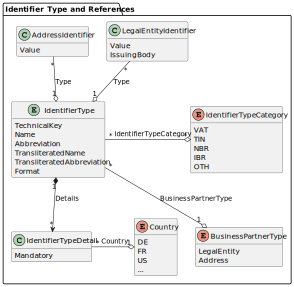
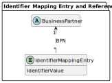

---
tags:
  - CAT/BPDM
  - CAT/Core Service Provider
  - CAT/Sandbox Services (Beta)
  - CAT/Sandbox Service Provider
---

# CX-0012 Business Partner Data Pool API v4.2.1

## FOR WHOM IS THE STANDARD DESIGNED

This document is mainly targeted to technical individuals involved in integrating and developing against this API, as well as business individuals who are involved in compliance process of this API.

## COMPARISON WITH THE PREVIOUS VERSION OF THE STANDARD

| **Version** | **Publishing Date** | **Author** | **Description of Change**                                                                                                                                                                                                                                                                                                                                                                                                                                                                                                                                                                                                                                                                |
| ----------- | ------------------- | ---------- | ---------------------------------------------------------------------------------------------------------------------------------------------------------------------------------------------------------------------------------------------------------------------------------------------------------------------------------------------------------------------------------------------------------------------------------------------------------------------------------------------------------------------------------------------------------------------------------------------------------------------------------------------------------------------------------------- |
| 1.1.0       | 2022-11-30          |            | Initial version by Catena-X Association                                                                                                                                                                                                                                                                                                                                                                                                                                                                                                                                                                                                                                                  |
| 1.1.1       | 2023-06-03          |            | Addendum for Conformity Assessment added                                                                                                                                                                                                                                                                                                                                                                                                                                                                                                                                                                                                                                                 |
| 2.0.0       | 2023-09-26          |            | Included new API and terminology chapter                                                                                                                                                                                                                                                                                                                                                                                                                                                                                                                                                                                                                                                 |
| 2.1.0       | 2024-01-10          |            | Small additions to the terminology and API specification chapters: added “business partner type” in changelog entry; added “administrative area (level 1)” as sub-object; added ISO 6709 and WGS 84 for geographic coordinates; added GET/sites; linked OpenAPI document in release branch instead of main                                                                                                                                                                                                                                                                                                                                                                               |
| 3.0.0       | 2024-03-22          |            | Added additional street attributes; removed boolean attributes in favor of enum for address types, like in the Gate API; switched to the new document structure                                                                                                                                                                                                                                                                                                                                                                                                                                                                                                                          |
| 4.0.0       | 2024-06-07          |            | Added footnote to indicate that the term "site main address" is subject to change; added the CX-0018 version; changed and added the detailed asset structure; added footnote to clarify role distribution; removed terms Company Data and Sharing Member, as they are not used here; removed classification sub-object, to reintroduce it in a presumably new form in one of the next non-breaking versions of this standard; added "is Catena-X Member data" attribute; removed "api/catena/" from the endpoint definitions; added data sovereignty chapters as additional requirements; fix changelog controller endpoint for business-partners to match the reference implementation. |
| 4.1.0       | 2024-12-02          |            | Added tax jurisdiction code                                                                                                                                                                                                                                                                                                                                                                                                                                                                                                                                                                                                                                                              |
| 4.2.0       | 2025-03-17          |            | Added attributes for legal forms and identifier types; removed the POST endpoint for administrative areas; added a footnote about the plan for changing from minor to major asset versioning; added footnote about plural in the abbreviation(s) attribute for legal forms; added requirement about the correct asset property format as defined in CX-0018                                                                                                                                                                                                                                                                                                                                                                   |

## ABSTRACT

The Business Partner Data Management (BPDM) is a distributed service-based system, composed of a set of dedicated services, that simultaneously serve multiple stakeholders. It is based on a central data pool of business partners, which is consistent with the overall design principles of Catena-X. The main target is to create business partner data records (such as customer/supplier) with a high quality and currentness, to provide other processes with these data. This results in less rework and adjustment due to better master data quality which ultimately leads to an overall cost reduction for participating companies. Additionally, Value Added Services shall be offered to enrich those business partner data sets even further and give additional information or warnings about the business partners. Getting a 360° view on your business partners also helps with reducing costs and achieving process excellence because better decisions can be made.

The Business Partner Pool collects business partner data records which are cleansed and enriched, so-called Golden Records, and makes them available. It is a main component of the architecture framework at Catena-X, as it enables the Catena-X Members to leverage accurate, complete, and consistent business partner data for Catena-X applications and shared services.

The Business Partner Pool can be accessed via the standardized API described in this standard.

## 1 INTRODUCTION

### 1.1 AUDIENCE & SCOPE

> *This section is non-normative*

This standard is relevant for the following audience:

- Core Service Provider
- Onboarding Service Provider
- Business Application Provider
- Data Provider and Consumer

This document focuses on the Business Partner Pool API (short: Pool API) that is part of the Business Partner Data Management (BPDM) described on the [BPDM Catena-X Website](https://catena-x.net/en/offers-standards/bpdm). It is relevant for Core Service Providers who want to provide services for retrieving a cleansed, high-quality business partner data record (Golden Record) for a given business partner number (BPN). It is also relevant for onboarding service providers, business application providers as well as data providers and consumers who want to use such services.

Not in scope are the structure and logic of the business partner number itself and the mechanism on how the business partner number is issued. There is a separate standard for this: CX-0010 Business Partner Number 2.2.0.

Not in scope is the way of how business partner data records can be shared to create a Golden Record. There is a separate standard for this: CX-0074 Business Partner Data Gate API 3.2.0.

Not in scope are the requirements of cleansing and enriching the business partner data records with the aim to create a Golden Record. There is a separate standard for this: CX-0076 Golden Record End to End Requirement Standards 1.3.0.

You can find the other standards in the [Catena-X standard library](https://catena-x.net/en/standard-library).

### 1.2 CONTEXT AND ARCHITECTURE FIT

> *This section is non-normative*

The Pool API is a crucial core component in Catena-X and its platform capability BPDM because it contributes to the following functions:

1. Data Consistency: The Pool API ensures that all data related to business partners is consistent and up-to-date and can be accessed by all consumers of the API. This helps to reduce the risk of errors and inconsistencies in business partner information.
2. Centralized Data Management: The Pool API provides a centralized repository for business partner data, making it easier to manage, maintain, and update information.
3. Data Governance: The Pool API is the basis for a data governance framework and helps to enforce data quality standards, such as data completeness, accuracy, and consistency. This helps to ensure that business partner data is of high quality and can be trusted for use in various business processes.
4. Interoperability: The Pool API provides an interoperable and standardized way to access business partner data, ensuring both Core Service Provider interchangeability and streamlined data accessibility for all consumers of the API.

There is a reference implementation for the [Business Partner Data Pool API (6.3.x)](https://github.com/eclipse-tractusx/bpdm/tree/72ba993eb2332613d6cee52c40182763f3e3735f/bpdm-pool-api/src/main/kotlin/org/eclipse/tractusx/bpdm/pool/api) on GitHub. It is part of a Spring Boot Kotlin open-source software project under the hood of the Eclipse Foundation and follows the Apache 2.0 licenses.

For the complete and up-to-date BPDM setup refer to the [Eclipse Tractus-X BPDM GitHub repository (6.3.x)](https://github.com/eclipse-tractusx/bpdm/blob/72ba993eb2332613d6cee52c40182763f3e3735f/README.md).

For an architecture overview refer to the [BPDM ARC42 documentation (6.3.x)](https://github.com/eclipse-tractusx/bpdm/tree/72ba993eb2332613d6cee52c40182763f3e3735f/docs/architecture).

To use the Pool API in the BPDM use case apart from this standard, the following other standards should be considered by all participants for which this standard is relevant:

- CX-0018 Dataspace Connectivity 3.3.0

### 1.3 CONFORMANCE AND PROOF OF CONFORMITY

> *This section is non-normative*

If sections are marked as non-normative, all authoring guidelines, diagrams, examples, and notes in these sections are non-normative. Everything else in this specification is normative.

The key words **MAY**, **MUST**, **MUST NOT**, **OPTIONAL**, **RECOMMENDED**, **REQUIRED**, **SHOULD** and **SHOULD NOT** in this document are to be interpreted as described in [BCP 14](https://datatracker.ietf.org/doc/html/bcp14), [RFC2119](https://www.w3.org/TR/did-core/#bib-rfc2119), [RFC8174](https://www.w3.org/TR/did-core/#bib-rfc8174) when, and only when, they appear in all capitals, as shown here.

All participants and their solutions will need to prove, that they are conform with the Catena-X standards. To validate that the standards are applied correctly, Catena-X employs Conformity Assessment Bodies (CABs).

When implementing the API defined in this standard, proof of conformity must be provided by the following deliverables:

- An OpenAPI specification defining the relevant resources for this standard
- Examples of data assets

### 1.4 EXAMPLES

Intentionally left blank.

### 1.5 TERMINOLOGY

> *This section is non-normative*

#### 1.5.1 GENERAL

**Golden Record:** Golden Record defines a business partner data record which successfully passed a set of predefined quality rules. These rules qualified the data record into a harmonized, standardized, and semantically unified data structure which is defined by Catena-X. The Golden Record status is a prerequisite for each BP data record to receive a valid BPN.

#### 1.5.2 DATA MODEL

This chapter explains the data model[^1] from a conceptual / terminology point of view. It does not include technical details of the API data model, such as:

- differences in response and request
- differences in data stages (like input or output)
- attributes for pagination
- singular query parameters, which are not already attributes of the entities

##### 1.5.2.1 BUSINESS PARTNER


In general, a business partner is any entity (such as a customer, a supplier, an employee, or a service provider) that does business with another entity.

In Catena-X, a business partner is an organization (such as an enterprise or company, university, association, etc., and not a natural person) or one of its substructures that acts as unique partner within the automotive supply chain - either in the role of a direct participant, or a consultant, or a non-production-material (NPM) supplier.

BPDM distinguishes between three business partner types to represent an organization or one of its substructures relevant for the automotive supply chain (see detailed definitions): legal entity, site, and address[^2].

##### 1.5.2.2 LEGAL ENTITY


In general, a legal entity is a juridical person that has legal rights and duties related to contracts, agreements, and obligations. The term especially applies to any kind of organization established under the law applicable to a country.

In Catena-X, a legal entity is a type of business partner representing a legally registered organization with its official registration information, such as legal name (including legal form, if registered), legal address and tax number.

A legal entity has exactly one legal address, but it is possible to specify additional addresses that a legal entity owns. Thus, at least one address is assigned to a legal entity. A legal entity can own sites. Thus, many or no sites are assigned to a legal entity. A legal entity is uniquely identified by the BPNL.

| **Attribute**           | **Description**                                                                                                                                                   | **(Data) Type / Code List / Enumeration**                         |
| ----------------------- | ----------------------------------------------------------------------------------------------------------------------------------------------------------------- | ----------------------------------------------------------------- |
| BPNL                    | A BPNL represents and uniquely identifies a legal entity, which is defined by its legal name (including legal form, if registered), legal address and tax number. | String                                                            |
| Legal Name              | The name of the legal entity according to official registers.                                                                                                     | String                                                            |
| Short Name              | The abbreviated name of the legal entity.                                                                                                                         | String                                                            |
| Legal Form              | The legal form of the legal entity.                                                                                                                               | [Legal Form](#1525-legal-form)                                    |
| States                  | The list of (temporary) states of the legal entity.                                                                                                               | List of [Legal Entity State](#15222-legal-entity-state)           |
| Identifiers             | The list of identifiers of the legal entity.                                                                                                                      | List of [Legal Entity Identifier](#15221-legal-entity-identifier) |
| Is Catena-X Member Data | Indicates whether the legal entity is owned and thus provided by a Catena-X Member.                                                                               | Boolean                                                           |
| Created At              | The date and time when the legal entity data record has been created.                                                                                             | Date / Time                                                       |
| Updated At              | The date and time when the legal entity data record has been last updated.                                                                                        | Date / Time                                                       |
| Legal Address           | The official, legal correspondence address to be provided to government and tax authorities and used in all legal or court documents.                             | [Address](#1524-address)                                          |

###### 1.5.2.2.1 LEGAL ENTITY IDENTIFIER

A legal entity identifier (uniquely) identifies the legal entity, such as the German Handelsregisternummer, a VAT number, etc.

| **Attribute** | **Description**                                                                                                                                                                              | **(Data) Type / Code List / Enumeration** |
| ------------- | -------------------------------------------------------------------------------------------------------------------------------------------------------------------------------------------- | ----------------------------------------- |
| Value         | The value of the identifier like “DE123465789”                                                                                                                                               | String                                    |
| Type          | The type of the identifier.                                                                                                                                                                  | [Identifier Type](#15210-identifier-type) |
| Issuing Body  | The name of the official register, where the identifier is registered. For example, a Handelsregisternummer in Germany is only valid with its corresponding Registergericht and Registerart. | String                                    |

###### 1.5.2.2.2 LEGAL ENTITY STATE

A legal entity state indicates if the legal entity is active or inactive[^3]. This does not describe the relation between a Catena-X Member and a business partner and whether they have active business, but it describes whether the legal entity is still operating.

| **Attribute** | **Description**                                  | **(Data) Type / Code List / Enumeration** |
| ------------- | ------------------------------------------------ | ----------------------------------------- |
| Valid From    | The date and time from which the state is valid. | Date / Time                               |
| Valid To      | The date and time until the state is valid.      | Date / Time                               |
| Type          | One of the state types: active, inactive.        | Enum                                      |

##### 1.5.2.3 SITE


In general, a site is a delimited geographical area in which an organization conducts business.

In Catena-X, a site is a type of business partner representing a physical location or area owned by a legal entity, where a production plant, a warehouse, or an office building is located.

A site is owned by a legal entity. Thus, exactly one legal entity is assigned to a site. A site has exactly one main address[^7], but it is possible to specify additional addresses (such as different gates), that belong to a site. Thus, at least one address is assigned to a site. A site can only be uploaded and modified by the owner (the legal entity), because only the owner knows which addresses belong to which site. A site is uniquely identified by the BPNS.

| **Attribute**           | **Description**                                                                                                                                 | **(Data) Type / Code List / Enumeration** |
| ----------------------- | ----------------------------------------------------------------------------------------------------------------------------------------------- | ----------------------------------------- |
| BPNS                    | A BPNS represents and uniquely identifies a site, which is where for example a production plant, a warehouse, or an office building is located. | String                                    |
| Name                    | The name of the site. This is not according to official registers but according to the name the owner chooses.                                  | String                                    |
| States                  | The list of the (temporary) states of the site.                                                                                                 | List of [Site State](#15231-site-state)   |
| Legal Entity BPN        | The BPNL of the legal entity owning the site.                                                                                                   | String                                    |
| Is Catena-X Member Data | Indicates whether the site is owned and thus provided by a Catena-X Member.                                                                     | Boolean                                   |
| Created At              | The date and time when the site data record has been created.                                                                                   | Date / Time                               |
| Updated At              | The date and time the site data record has been last updated.                                                                                   | Date / Time                               |
| Main Address[^7]        | The address, where typically the main entrance or the reception is located, or where the mail is delivered to.                                  | [Address](#1524-address)                  |

###### 1.5.2.3.1 SITE STATE

A site state indicates if the site is active or inactive[^4]. This does not describe the relation between a Catena-X Member and a business partner and whether they have active business, but it describes whether the site is still operating.

| **Attribute** | **Description**                           | **(Data) Type / Code List / Enumeration** |
| ------------- | ----------------------------------------- | ----------------------------------------- |
| Valid From    | The date from which the state is valid.   | String                                    |
| Valid To      | The date until the state is valid.        | String                                    |
| Type          | One of the state types: active, inactive. | Enum                                      |

##### 1.5.2.4 ADDRESS


In general, an address is a collection of information to describe a physical location, using a street name with a house number and/or a post office box as reference. In addition, an address consists of several postal attributes, such as country, region (state), county, township, city, district, or postal code, which help deliver mail.

In Catena-X, an address is a type of business partner representing the legal address of a legal entity, and/or the main address[^7] of a site, or any additional address of a legal entity or site (such as different gates).

An address is owned by a legal entity. Thus, exactly one legal entity is assigned to an address. An address can belong to a site. Thus, one or no site is assigned to an address. An address is uniquely identified by the BPNA.

| **Attribute**              | **Description**                                                                                                                                                                                                                                                                                                                                                                                                                                                         | **(Data) Type / Code List / Enumeration**                      |
| -------------------------- | ----------------------------------------------------------------------------------------------------------------------------------------------------------------------------------------------------------------------------------------------------------------------------------------------------------------------------------------------------------------------------------------------------------------------------------------------------------------------- | -------------------------------------------------------------- |
| BPNA                       | A BPNA represents and uniquely identifies an address, which can be the legal address of a legal entity, and/or the main address[^7] of a site, or any additional address of a legal entity or site (such as different gates). It is important to note that only the BPNL must be used to uniquely identify a legal entity. Even in the case that the BPNA represents the legal address of the legal entity, it shall not be used to uniquely identify the legal entity. | String                                                         |
| Name                       | The name of the address. This is not according to official registers but according to the name the sharing members agree on, such as the name of a gate or any other additional names that designate the address in common parlance.                                                                                                                                                                                                                                    | String                                                         |
| States                     | The list of (temporary) states of the address.                                                                                                                                                                                                                                                                                                                                                                                                                          | List of [Address State](#15242-address-state)                  |
| Identifiers                | The list of identifiers of the address.                                                                                                                                                                                                                                                                                                                                                                                                                                 | List of [Address Identifier](#15241-address-identifier)        |
| Physical Postal Address    | The physical postal address of the address, such as an office, warehouse, gate, etc.                                                                                                                                                                                                                                                                                                                                                                                    | [Physical Postal Address](#1526-physical-postal-address)       |
| Alternative Postal Address | The alternative postal address of the address, for example if the goods are to be picked up somewhere else.                                                                                                                                                                                                                                                                                                                                                             | [Alternative Postal Address](#1527-alternative-postal-address) |
| Legal Entity BPN           | The BPNL of the legal entity owning the address.                                                                                                                                                                                                                                                                                                                                                                                                                        | String                                                         |
| Type                       | One of the address types: Legal Address, Site Main Address[^7], Legal and Site Main Address[^7], Additional Address.                                                                                                                                                                                                                                                                                                                                                    | Enum                                                           |
| Site BPN                   | The BPNS of the site the address belongs to.                                                                                                                                                                                                                                                                                                                                                                                                                            | String                                                         |
| Is Catena-X Member Data    | Indicates whether the address is owned and thus provided by a Catena-X Member.                                                                                                                                                                                                                                                                                                                                                                                          | Boolean                                                        |
| Created At                 | The date and time when the address data record has been created.                                                                                                                                                                                                                                                                                                                                                                                                        | Date / Time                                                    |
| Updated At                 | The date and time when the address data record has been last updated.                                                                                                                                                                                                                                                                                                                                                                                                   | Date / Time                                                    |

##### 1.5.2.4.1 ADDRESS IDENTIFIER

An address identifier (uniquely) identifies the address, such as the Global Location Number (GLN).

| **Attribute** | **Description**                                  | **(Data) Type / Code List / Enumeration** |
| ------------- | ------------------------------------------------ | ----------------------------------------- |
| Value         | The value of the identifier like "0847976000005" | String                                    |
| Type          | The type of the identifier.                      | [Identifier Type](#15210-identifier-type) |

##### 1.5.2.4.2 ADDRESS STATE

An address state indicates if the address is active or inactive[^5]. This does not describe the relation between a Catena-X Member and a business partner and whether they have active business, but it describes whether the business partner is still operating at that address.

| **Attribute** | **Description**                           | **(Data) Type / Code List / Enumeration** |
| ------------- | ----------------------------------------- | ----------------------------------------- |
| Valid From    | The date from which the state is valid.   | String                                    |
| Valid To      | The date until the state is valid.        | String                                    |
| Type          | One of the state types: active, inactive. | Enum                                      |

##### 1.5.2.5 LEGAL FORM


A legal form is a mandatory corporate legal framework by which companies can conduct business, charitable or other permissible activities.

| **Attribute**                | **Description**                                                                                                                                                                                     | **(Data) Type / Code List / Enumeration**                          |
| ---------------------------- | --------------------------------------------------------------------------------------------------------------------------------------------------------------------------------------------------- | ------------------------------------------------------------------ |
| Technical Key                | The technical identifier of the legal form according to [ISO 20275:2017](https://www.iso.org/obp/ui/en/#iso:std:iso:20275:ed-1:v1:en).                                                              | String                                                             |
| Name                         | The name of legal form according to [ISO 20275:2017](https://www.iso.org/obp/ui/en/#iso:std:iso:20275:ed-1:v1:en).                                                                                  | String                                                             |
| Abbreviation[^10]            | A list of abbreviated names for the legal form according to [ISO 20275:2017](https://www.iso.org/obp/ui/en/#iso:std:iso:20275:ed-1:v1:en), such as AG for German Aktiengesellschaft.                | String                                                             |
| Transliterated Name          | The transliterated name of legal form according to [ISO 20275:2017](https://www.iso.org/obp/ui/en/#iso:std:iso:20275:ed-1:v1:en).                                                                   | String                                                             |
| Transliterated Abbreviations | A list of transliterated abbreviated names for the legal form according to [ISO 20275:2017](https://www.iso.org/obp/ui/en/#iso:std:iso:20275:ed-1:v1:en), such as AG for German Aktiengesellschaft. | String                                                             |
| Language                     | The two-letter language code according to [ISO 639:2023](https://www.iso.org/obp/ui/en/#iso:std:iso:639:ed-2:v1:en) of the language, for that the name of the legal form has been given.            | String                                                             |
| Country                      | The two-letter country code according to [ISO 3166-1:2020](https://www.iso.org/obp/ui/en/#iso:std:iso:3166:-1:ed-4:v1:en) of the country in which the legal form is valid.                          | String                                                             |
| Administrative Area Level 1  | The administrative area in which the legal form is valid, such as a region within a country.                                                                                                        | [Administrative Area (Level 1)](#1528-administrative-area-level-1) |
| Is Active                    | Indicates whether the legal form is actively used or is inactive and should not be used to register new organizations.                                                                              | Boolean                                                            |

##### 1.5.2.6 PHYSICAL POSTAL ADDRESS

A physical postal address describes the physical location of an office, warehouse, gate, etc.

| **Attribute**               | **Description**                                                                                                                                                                                                          | **(Data) Type / Code List / Enumeration**                          |
| --------------------------- | ------------------------------------------------------------------------------------------------------------------------------------------------------------------------------------------------------------------------ | ------------------------------------------------------------------ |
| Geographic Coordinates      | The exact location of the physical postal address in latitude, longitude, and altitude.                                                                                                                                  | [Geographic Coordinates](#1529-geographic-coordinates)             |
| Country                     | The two-letter country code of the physical postal address according to [ISO 3166-1:2020](https://www.iso.org/obp/ui/en/#iso:std:iso:3166:-1:ed-4:v1:en).                                                                | String                                                             |
| Administrative Area Level 1 | The administrative area of the physical postal address, such as a region within a country.                                                                                                                               | [Administrative Area (Level 1)](#1528-administrative-area-level-1) |
| Administrative Area Level 2 | The name of the locally regulated secondary country subdivision of the physical postal address, such as county within a country.                                                                                         | String                                                             |
| Administrative Area Level 3 | The name of the locally regulated tertiary country subdivision of the physical address, such as townships within a country.                                                                                              | String                                                             |
| Postal Code                 | The alphanumeric identifier (sometimes including spaces or punctuation) of the physical postal address for the purpose of sorting mail, synonyms: postcode, post code, PIN or ZIP code.                                  | String                                                             |
| City                        | The name of the city of the physical postal address, synonyms: town, village, municipality.                                                                                                                              | String                                                             |
| District                    | The name of the district of the physical postal address which divides the city into several smaller areas.                                                                                                               | String                                                             |
| Street                      | The street of the physical postal address, synonyms: road, avenue, lane, boulevard, highway                                                                                                                              | [Street](#15261-street)                                            |
| Company Postal Code         | The company postal code of the physical postal address, which is sometimes required for large companies.                                                                                                                 | String                                                             |
| Tax Jurisdiction Code       | The identifier of the particular geographic or governmental area to which the physical mailing address belongs and which is responsible for administering tax laws and collecting taxes from individuals and businesses. | String                                                             |
| Industrial Zone             | The industrial zone of the physical postal address, designating an area for industrial development, synonym: industrial area.                                                                                            | String                                                             |
| Building                    | The alphanumeric identifier of the building addressed by the physical postal address.                                                                                                                                    | String                                                             |
| Floor                       | The number of a floor in the building addressed by the physical postal address, synonym: level.                                                                                                                          | String                                                             |
| Door                        | The number of a door in the building on the respective floor addressed by the physical postal address, synonyms: room, suite.                                                                                            | String                                                             |

###### 1.5.2.6.1 STREET

A street is a public road in a city, town, or village, typically with houses and buildings on one or both sides, synonyms: road, avenue, lane, boulevard, highway.

| **Attribute**           | **Description**                                                                                                                                                                                                                                                                              | **(Data) Type / Code List / Enumeration** |
| ----------------------- | -------------------------------------------------------------------------------------------------------------------------------------------------------------------------------------------------------------------------------------------------------------------------------------------- | ----------------------------------------- |
| Name Prefix             | The street related information, which is usually printed before the official street name on an address label.                                                                                                                                                                                | String                                    |
| Additional Name Prefix  | The additional street related information, which is usually printed before the official street name on an address label.                                                                                                                                                                     | String                                    |
| Name                    | The name of the street.                                                                                                                                                                                                                                                                      | String                                    |
| Name Suffix             | The street related information, which is usually printed after the official street name on an address label.                                                                                                                                                                                 | String                                    |
| Additional Name Suffix  | The additional street related information, which is usually printed after the official street name on an address label.                                                                                                                                                                      | String                                    |
| House Number            | The alphanumeric identifier representing the exact location of a building within the street.                                                                                                                                                                                                 | String                                    |
| House Number Supplement | The alphanumeric identifier representing the exact location of a business partner in a building. Note this information might be further detailed semantically in the building, floor, and door attributes. However, this attribute is the only relevant for addressing the business partner. | String                                    |
| Milestone               | The alphanumeric identifier representing the exact location of an addressed object within a street without house numbers, such as within long roads.                                                                                                                                         | String                                    |
| Direction               | The cardinal direction describing where the exit to the location of the addressed object on large highways / motorways is located, such as Highway 101 South.                                                                                                                                | String                                    |

##### 1.5.2.7 ALTERNATIVE POSTAL ADDRESS

An alternative postal address describes an alternative way of delivery for example if the goods are to be picked up somewhere else.

| **Attribute**               | **Description**                                                                                                                                                                                                                                                                                                                                                    | **(Data) Type / Code List / Enumeration**                          |
| --------------------------- | ------------------------------------------------------------------------------------------------------------------------------------------------------------------------------------------------------------------------------------------------------------------------------------------------------------------------------------------------------------------ | ------------------------------------------------------------------ |
| Geographic Coordinates      | The exact location of the alternative postal address in latitude, longitude, and altitude.                                                                                                                                                                                                                                                                         | [Geographic Coordinates](#1529-geographic-coordinates)             |
| Country                     | The two-letter country code of the postal address according to [ISO 3166-1:2020](https://www.iso.org/obp/ui/en/#iso:std:iso:3166:-1:ed-4:v1:en).                                                                                                                                                                                                                  | String                                                             |
| Administrative Area Level 1 | The administrative area of the alternative postal address, such as a region within a country.                                                                                                                                                                                                                                                                      | [Administrative Area (Level 1)](#1528-administrative-area-level-1) |
| Postal Code                 | The alphanumeric identifier (sometimes including spaces or punctuation) of the alternative postal address for the purpose of sorting mail, synonyms: postcode, post code, PIN or ZIP code.                                                                                                                                                                         | String                                                             |
| City                        | The name of the city of the alternative postal address, synonyms: town, village, municipality.                                                                                                                                                                                                                                                                     | String                                                             |
| Delivery Service Type       | One of the alternative postal address types: P.O. box, private bag, boite postale.                                                                                                                                                                                                                                                                                 | Enum                                                               |
| Delivery Service Qualifier  | The qualifier uniquely identifying the delivery service endpoint of the alternative postal address in conjunction with the delivery service number. In some countries for example, entering a P.O. box number, postal code and city is not sufficient to uniquely identify a P.O. box, because the same P.O. box number is assigned multiple times in some cities. | String                                                             |
| Delivery Service Number     | The number indicating the delivery service endpoint of the alternative postal address to which the delivery is to be delivered, such as a P.O. box number or a private bag number.                                                                                                                                                                                 | String                                                             |

##### 1.5.2.8 ADMINISTRATIVE AREA (LEVEL 1)

An administrative area (level 1) is the country subdivision according to [ISO 3166-2:2020](https://www.iso.org/obp/ui/#iso:std:iso:3166:-2:ed-4:v1:en), such as regions within a country.

| **Attribute** | **Description**                                                                                                                                                                                                                                                                                                                                                | **(Data) Type / Code List / Enumeration** |
| ------------- | -------------------------------------------------------------------------------------------------------------------------------------------------------------------------------------------------------------------------------------------------------------------------------------------------------------------------------------------------------------- | ----------------------------------------- |
| Name          | The name of the country subdivision according to [ISO 3166-2:2020](https://www.iso.org/obp/ui/#iso:std:iso:3166:-2:ed-4:v1:en).                                                                                                                                                                                                                                | String                                    |
| Code          | The six-character alphanumeric code according to [ISO 3166-2:2020](https://www.iso.org/obp/ui/#iso:std:iso:3166:-2:ed-4:v1:en), consisting of the two-letter [ISO 3166-1:2020](https://www.iso.org/obp/ui/en/#iso:std:iso:3166:-1:ed-4:v1:en) country code and a three-character alphanumeric code for the subdivision in that country, separated by a hyphen. | String                                    |

##### 1.5.2.9 GEOGRAPHIC COORDINATES

Geographic coordinates describe an exact location in latitude, longitude, and altitude, according to [ISO 6709:2022](https://www.iso.org/obp/ui/en/#iso:std:iso:6709:ed-3:v1:en) with [WGS 84 (NGA STND 0036 1.0.0)](https://nsgreg.nga.mil/doc/view?i=4085) as the currently only supported coordinate reference system.

| **Attribute** | **Description**                                                                                                                                                                                   | **(Data) Type / Code List / Enumeration** |
| ------------- | ------------------------------------------------------------------------------------------------------------------------------------------------------------------------------------------------- | ----------------------------------------- |
| Longitude     | The geographic coordinate of a place indicating the distance to the west or east of the line passing through Greenwich, in decimal degrees ([DD](https://en.wikipedia.org/wiki/Decimal_degrees)). | Float                                     |
| Latitude      | The geographic coordinate of a place indicating its distance to the north or south of the equator, in decimal degrees ([DD](https://en.wikipedia.org/wiki/Decimal_degrees)).                      | Float                                     |
| Altitude      | The geographic coordinate of a place indicating its height above mean sea level, in meters.                                                                                                       | Float                                     |

##### 1.5.2.10 IDENTIFIER TYPE



An identifier type defines the name or category of an identifier, such as the German Handelsregisternummer, VAT number, Global Location Number (GLN), etc. The identifier type is valid for a business partner type and used in a specific country.

| **Attribute**               | **Description**                                                                                     | **(Data) Type / Code List / Enumeration** |
| --------------------------- | --------------------------------------------------------------------------------------------------- | ----------------------------------------- |
| Technical Key               | The technical identifier of the identifier type.                                                    | String                                    |
| Name                        | The name of the identifier type.                                                                    | String                                    |
| Business Partner Type       | One of the types of business partners for which the identifier type is valid: legal entity, address | Enum                                      |
| Abbreviation                | The abbreviated name of the identifier type.                                                        | String                                    |
| Transliterated Name         | The transliterated name of the identifier type.                                                     | String                                    |
| Transliterated Abbreviation | The transliterated abbreviated name of of the identifier type.                                      | String                                    |

###### 1.5.2.10.1 IDENTIFIER TYPE DETAILS

The identifier type details describe for which countries an identifier is valid and mandatory

| **Attribute** | **Description**                                                                                                                                                                                                                            | **(Data) Type / Code List / Enumeration** |
| ------------- | ------------------------------------------------------------------------------------------------------------------------------------------------------------------------------------------------------------------------------------------ | ----------------------------------------- |
| Country       | The two-letter country code according to [ISO 3166-1:2020](https://www.iso.org/obp/ui/en/#iso:std:iso:3166:-1:ed-4:v1:en) of the country in which the identifier type is valid. Can be empty if identifier type is valid in all countries. | String                                    |
| Mandatory     | Indicates wheter the identifier type is mandatory in the country.                                                                                                                                                                          | Boolean                                    |

##### 1.5.2.11 CHANGELOG ENTRY


An entry of the changelog, which is created each time a business partner is modified and contains data about the change. The actual new state of the business partner is not included.

| **Attribute**         | **Description**                                                                                               | **(Data) Type / Code List / Enumeration** |
| --------------------- | ------------------------------------------------------------------------------------------------------------- | ----------------------------------------- |
| BPN                   | The business partner number for which the changelog entry was created. Can be either a BPNL, BPNS or BPNA.    | String                                    |
| Business Partner Type | One of the types of business partners for which the changelog entry was created: legal entity, site, address. | Enum                                      |
| Changelog Type        | One of the actions for which the changelog entry was created: create, update.                                 | Enum                                      |
| Timestamp             | The date and time when the changelog entry was created.                                                       | Date / Time                               |

##### 1.5.2.12 IDENTIFIER MAPPING ENTRY



An identifier mapping entry of a specific identifier (of a specific identifier type) to a BPNL, BPNS or BPNA.

| **Attribute**    | **Description**                                                                                     | **(Data) Type / Code List / Enumeration** |
| ---------------- | --------------------------------------------------------------------------------------------------- | ----------------------------------------- |
| Identifier Value | The value of a specific identifier type for which the mapping was returned.                         | String                                    |
| BPN              | The business partner number for which the mapping was returned. Can be either a BPNL, BPNS or BPNA. | String                                    |

## 2 BUSINESS PARTNER POOL API \[NORMATIVE\]

The Business Partner Pool API enables the access to Golden Record business partner data and provides it to other Catena-X services and consumers. The Pool API **MUST** be implemented based on the [OpenAPI specification (3.0.1)](https://github.com/OAI/OpenAPI-Specification/blob/761a0797ebf2e35e687ebef07741d1c10675e08c/versions/3.0.1.md).

### 2.1 PRECONDITIONS AND DEPENDENCIES

To run the API, the technical components described in the [Eclipse Tractus-X BPDM GitHub repository (6.3.x)](https://github.com/eclipse-tractusx/bpdm/blob/72ba993eb2332613d6cee52c40182763f3e3735f/README.md) **SHOULD** be set up.

### 2.2 API SPECIFICATION

#### 2.2.1 API ENDPOINTS & RESOURCES

The Pool API **MUST** be implemented as defined in the following OpenAPI document: [Business Partner Data Pool OpenAPI specification (6.3.x)](https://github.com/eclipse-tractusx/bpdm/blob/72ba993eb2332613d6cee52c40182763f3e3735f/docs/api/pool.json)

The resources **MUST** use the well-known HTTP request methods for CRU(D) operations:

- POST method **MUST** be used for create requests
- PUT[^6] method **MUST** be used for update requests
- GET method **MUST** be used for read requests

The POST method MAY also be used for read requests, if input is not given by parameters but rather by an HTTP body to bypass maximum URL length. The PUT method MAY also be used for upsert requests (create or update) if this is required. A state (active / inactive) at each entity **MUST** be used for a soft delete, so that the DELETE method SHALL NOT be used. Other HTTP request methods SHALL NOT be used, including PATCH.

To facilitate the compliance assessment, this chapter additionally lists and describes the API resources of the Gate API per API controller.

The following API controllers of the OpenAPI document **MUST** be implemented:

- Legal entity controller
- Site controller
- Address controller
- Metadata controller (code lists)
- Changelog controller
- BPN controller (identifier mappings)

Note that all resources of the OpenAPI document described in the following are **REQUIRED**. Conversely, all resources not described in the following are **OPTIONAL**.

##### 2.2.1.1 LEGAL ENTITY CONTROLLER

The legal entity controller **MUST** allow to create, update, or read business partners of type legal entity (having a BPNL). It also **MUST** allow to read sites and addresses of a legal entity. It **MUST** have the following resources:

| **Legal Entity Controller Resources** | **Description**                                                                                          |
| ------------------------------------- | -------------------------------------------------------------------------------------------------------- |
| POST/legal-entities                   | Creates a new legal entity.                                                                              |
| PUT/legal-entities                    | Updates an existing legal entity.                                                                        |
| GET/legal-entities                    | Returns legal entities by different search parameters.                                                   |
| GET/legal-entities/\{idValue\}        | Returns a legal entity by an identifier, like BPNL, DUNS or EU VAT ID, specified by the identifier type. |
| POST/legal-entities/search            | Returns legal entities by an array of BPNL.                                                              |
| POST/members/legal-entities/search    | Returns only legal entities by an array of BPNL, which are owned by Catena-X Members.                    |
| GET/legal-entities/\{bpnl\}/sites     | Returns all sites of a legal entity with a specific BPNL.                                                |
| GET/legal-entities/\{bpnl\}/addresses | Returns all addresses of a legal entity with a specific BPNL.                                            |

##### 2.2.1.2 SITE CONTROLLER

The site controller **MUST** allow to create, update, or read business partners of type site (having a BPNS). It also **MUST** allow to read addresses of a site. It **MUST** have the following resources:

| **Site Controller Resources** | **Description**                                                                                                    |
| ----------------------------- | ------------------------------------------------------------------------------------------------------------------ |
| POST/sites                    | Creates a new site.                                                                                                |
| PUT/sites                     | Updates an existing site.                                                                                          |
| GET/sites                     | Returns sites by different search parameters.                                                                      |
| GET/sites/\{bpns\}            | Returns a site by its BPNS.                                                                                        |
| POST/sites/search             | Returns sites by an array of BPNS and/or an array of corresponding BPNL.                                           |
| POST/members/sites/search     | Returns only sites by an array of BPNS and/or an array of corresponding BPNL, which are owned by Catena-X Members. |

##### 2.2.1.3 ADDRESS CONTROLLER

The address controller **MUST** allow to create, update, or read business partners of type address (having a BPNA). It **MUST** have the following resources:

| **Address Controller Resources** | **Description**                                                                                                                                              |
| -------------------------------- | ------------------------------------------------------------------------------------------------------------------------------------------------------------ |
| POST/addresses                   | Creates a new address.                                                                                                                                       |
| PUT/addresses                    | Updates an existing address.                                                                                                                                 |
| GET/addresses                    | Returns addresses by different search parameters.                                                                                                            |
| GET/addresses/\{bpna\}           | Returns an address by its BPNA.                                                                                                                              |
| POST/addresses/search            | Returns addresses by an array of BPNA and/or an array of corresponding BPNS and/or an array of corresponding BPNL.                                           |
| POST/members/addresses/search    | Returns only addresses by an array of BPNA and/or an array of corresponding BPNS and/or an array of corresponding BPNL, which are owned by Catena-X Members. |

##### 2.2.1.4 METADATA CONTROLLER (CODE LISTS)

The metadata controller **MUST** allow to create or read legal forms, identifier types, and read administrative areas on level 1. It **MUST** have the following resources:

| **Metadata Controller Resources** | **Description**                                                             |
| --------------------------------- | --------------------------------------------------------------------------- |
| POST/legal-forms                  | Creates a new legal form.                                                   |
| POST/identifier-types             | Creates a new identifier type.                                              |
| GET/legal-forms                   | Returns all legal forms.                                                    |
| GET/identifier-types              | Returns all identifier types filtered by business partner type and country. |
| GET/administrative-areas-level1   | Returns all administrative areas on level 1.                                |

##### 2.2.1.5 BPN CONTROLLER (IDENTIFIER MAPPINGS)

The BPN controller **MUST** allow to read identifier mappings between identifiers (such as DUNS, EU VAT ID, CX Member Identifier, etc.) on one side and BPNL, BPNS, BPNA on the other side. It **MUST** have the following resources:

| **BPN Controller Resources** | **Description**                                                                                                                                              |
| ---------------------------- | ------------------------------------------------------------------------------------------------------------------------------------------------------------ |
| POST/bpn/search              | Returns a list of identifier mappings of an identifier to a BPNL, BPNA or BPNS, specified by a business partner type, identifier type and identifier values. |

##### 2.2.1.6 CHANGELOG CONTROLLER

The changelog controller **MUST** allow to read change log entries of legal entities, sites and addresses. It **MUST** have the following resources:

| **Changelog Controller Resources**      | **Description**                                                                                                                                                                                                           |
| --------------------------------------- | ------------------------------------------------------------------------------------------------------------------------------------------------------------------------------------------------------------------------- |
| POST/business-partners/changelog/search | Returns changelog entries of legal entities, sites and addresses as of a specified timestamp, optionally filtered by a list of BPNL, BPNS and BPNA, or business partner types.                                            |
| POST/members/changelog/search           | Returns only changelog entries of legal entities, sites and addresses, which are owned by Catena-X Members, as of a specified timestamp, optionally filtered by a list of BPNL, BPNS and BPNA, or business partner types. |

#### 2.2.2 AVAILABLE DATA TYPES

The API **MUST** use JSON as the payload format transported via HTTP. Other formats MAY be added. These are then, however, **OPTIONAL**.

#### 2.2.3 DATA ASSET STRUCTURE

The following data assets **MUST** be registered at the Core Service Provider so that the Catena-X Member can negotiate an API usage contract with the Core Service Provider and access the BPDM Pool (hosted by the Core Service Provider) through these assets [^8]:

| **Type**         | **Subject**                            | **Version** | **Description**                                                                                                                                                                                                                                                                                          |
| ---------------- | -------------------------------------- | ----------- | -------------------------------------------------------------------------------------------------------------------------------------------------------------------------------------------------------------------------------------------------------------------------------------------------------- |
| cx-taxo:BPDMPool | cx-taxo:ReadAccessPoolForCatenaXMember | 6.3[^11]    | Grants the Catena-X Member read access to the Pool API. This can be used to read legal entity, site, address, legal form, identifier type and administrative area level 1 data. To that end, it also grants read access to the respective changelog and identifier mappings, as well as relational data. |

Read access for legal entities, sites and addresses **MUST** be restricted to Catena-X Member data (see the corresponding attribute for legal entity, site and address), because the Pool may also contain legal entities, sites and addresses, which are not owned by Catena-X Members.

Write resources (create and update) of the Pool API **MUST NOT** be called from outside of the Catena-X operating environment. Consequently, data assets for them are **NOT REQUIRED**.

The data asset **MUST** contain the following properties with the corresponding values from the table above:

- [*dct:type*](http://purl.org/dc/terms/type) for type (as @id reference), see also CX-0018
- [*dct:subject*](http://purl.org/dc/terms/subject) for subject (as @id reference)
- [*dct:description*](http://purl.org/dc/terms/description) for description
- [*cx-common:version*](https://w3id.org/catenax/ontology/common#version) for version, see also CX-0018

An example payload for the asset:

```json
{
    "@context": {
        "dct": "http://purl.org/dc/terms/",
        "cx-taxo": "https://w3id.org/catenax/taxonomy#",
        "cx-common": "https://w3id.org/catenax/ontology/common#",
    },
    "@type": "Asset", 
    "@id": "e94272b1-9831-458f-8986-c63c4973ea60", 
    "properties": { 
        "dct:type": {
          "@id": "cx-taxo:BPDMPool"
        },
        "dct:subject": {
          "@id": "cx-taxo:ReadAccessPoolForCatenaXMember"
        },
        "dct:description": "Grants the Catena-X Member read access to the Pool API. This can be used to read legal entity, site, address, legal form, identifier type and administrative area level 1 data. To that end, it also grants read access to the respective changelog entries and identifier mappings, as well as relational data.",
        "cx-common:version": "6.3"
    },
    "dataAddress": {
        "@type": "DataAddress",
        "type": "HttpData",
        "baseUrl": "https://<host>/pool/api/v6/members",
        "oauth2:tokenUrl": "https://<host>/auth/realms/<realm>/protocol/openid-connect/token",
        "oauth2:clientId": "<technical user>",
        "oauth2:clientSecretKey": "<key to the secret of the technical user in the vault>", 
        "proxyMethod": true,
        "proxyPath": true,
        "proxyQueryParams": true,
        "proxyBody": true
    }
}
```

The OAuth2 client permissions **MUST** be configured to solely allow access to the API resources defined in the corresponding asset, checking HTTP method, path, query parameters and body of the HTTP request sent to the data plane public API which acts as a proxy for the BPDM Pool API[^9].

#### 2.2.4 ERROR HANDLING

The following http response codes **MUST** be defined for all resources:

- 200 - OK
- 400 - Bad Request
- 401 - Unauthorized
- 403 - Forbidden
- 404 - Not Found
- 500 - Internal Server Error

The [IANA HTTP Status Code Registry](https://www.iana.org/assignments/http-status-codes/http-status-codes.xhtml) **MUST** be adhered to for the decision on when to use which error code.

#### 2.2.5 ADDITIONAL REQUIREMENTS

##### 2.2.5.1 CONVENTIONS FOR USE CASE POLICY IN CONTEXT OF DATA EXCHANGE
  
In alignment with our commitment to data sovereignty, a specific framework governing the utilization of data within the Catena-X use cases has been outlined. A set of specific policies on data offering and data usage level detail the conditions under which data may be accessed, shared, and used, ensuring compliance with legal standards.
  
For a comprehensive understanding of the rights, restrictions, and obligations associated with data usage in the Catena-X ecosystem, we refer users to

- the detailed [ODRL policy repository](https://github.com/catenax-eV/cx-odrl-profile). This document provides in-depth explanations of the terms and conditions applied to data access and utilization, ensuring that all engagement with our data is conducted responsibly and in accordance with established guidelines.
- the ODRL schema template. This defines how policies used for data sharing/usage should get defined. Those schemas **MUST** be followed when providing services or apps for data sharing/consuming.

##### 2.2.5.2 ADDITIONAL DETAILS REGARDING ACCESS POLICIES

A Data Provider may tie certain access authorizations ("Access Policies") to its data offers for members of Catena-X and one or several Data Consumers. By limiting access to certain Participants, Data Provider maintains control over its anti-trust obligations when sharing certain data. In particular, Data Provider may apply Access Policies to restrict access to a particular data offer for only one Participant identified by a specific business partner number.

- Membership
- BPNL

##### 2.2.5.3 ADDITIONAL DETAILS REGARDING USAGE POLICIES

In the context of data usage policies (“Usage Policies”), Participants and related services **MUST** use the following policy rules:
  
- Use Case Framework (“FrameworkAgreement”)
- at least one use case purpose (“UsagePurpose”) from the above mentioned [ODRL policy repository](https://github.com/catenax-eV/cx-odrl-profile).
  
Additionally, respective usage policies **MAY** include the following policy rule:
  
- Reference Contract (“ContractReference”).
  
Details on  namespaces and ODRL policy rule values to be used for the above-mentioned types are provided via the [ODRL policy repository](https://github.com/catenax-eV/cx-odrl-profile).

## 3 REFERENCES

### 3.1 NORMATIVE REFERENCES

- [ISO 639:2023](https://www.iso.org/obp/ui/en/#iso:std:iso:639:ed-2:v1:en)
- [ISO 20275:2017](https://www.iso.org/obp/ui/en/#iso:std:iso:20275:ed-1:v1:en)
- [ISO 3166-1:2020](https://www.iso.org/obp/ui/en/#iso:std:iso:3166:-1:ed-4:v1:en)
- [ISO 3166-2:2020](https://www.iso.org/obp/ui/#iso:std:iso:3166:-2:ed-4:v1:en)
- [ISO 6709:2022](https://www.iso.org/obp/ui/en/#iso:std:iso:6709:ed-3:v1:en)
- [WGS 84 (NGA STND 0036 1.0.0)](https://nsgreg.nga.mil/doc/view?i=4085)
- [OpenAPI specification (3.0.1)](https://github.com/OAI/OpenAPI-Specification/blob/761a0797ebf2e35e687ebef07741d1c10675e08c/versions/3.0.1.md)
- [Business Partner Data Pool OpenAPI specification (6.3.x)](https://github.com/eclipse-tractusx/bpdm/blob/72ba993eb2332613d6cee52c40182763f3e3735f/docs/api/pool.json)
- [IANA HTTP Status Code Registry (from 2022-06-08)](https://www.iana.org/assignments/http-status-codes/http-status-codes.xhtml)
- [ODRL policy repository](https://github.com/catenax-eV/cx-odrl-profile) (accessed 2024-10-02)

### 3.2 NON-NORMATIVE REFERENCES

> *This section is non-normative*

- [BPDM Catena-X Website](https://catena-x.net/en/offers-standards/bpdm) (accessed 2024-12-17)
- [Catena-X standard library](https://catena-x.net/en/standard-library) (accessed 2024-12-17)

### 3.3 REFERENCE IMPLEMENTATIONS

> *This section is non-normative*

- [Business Partner Data Pool API (6.3.x)](https://github.com/eclipse-tractusx/bpdm/tree/72ba993eb2332613d6cee52c40182763f3e3735f/bpdm-pool-api/src/main/kotlin/org/eclipse/tractusx/bpdm/pool/api)
- [Eclipse Tractus-X BPDM GitHub repository (6.3.x)](https://github.com/eclipse-tractusx/bpdm/blob/72ba993eb2332613d6cee52c40182763f3e3735f/README.md)
- [BPDM ARC42 documentation (6.3.x)](https://github.com/eclipse-tractusx/bpdm/tree/72ba993eb2332613d6cee52c40182763f3e3735f/docs/architecture)

## ANNEXES

## FIGURES

> *This section is non-normative*

Intentionally left blank.

## TABLES

> *This section is non-normative*

Intentionally left blank.

[^1]: Note that PlantUml is used for the conceptual UML diagrams in this document (A = abstract class; green E = entity; C = class; red E = enumeration). An abstract class has no actual representation in the OpenAPI implementation. An entity is usually implemented by an own OpenAPI controller with resources and usually is the root in a payload, while a class is a sub node in the payload. An enumeration is a set of predefined values.

[^2]: These types always imply a business partner which means that legal entity, site, and address are types of business partners.

[^3]: Note that this a currently a soft-delete approach and not a business state. However, this can be adapted in the next version of this standard.

[^4]: Note that this a currently a soft-delete approach and not a business state. However, this can be adapted in the next version of this standard.

[^5]: Note that this a currently a soft-delete approach and not a business state. However, this can be adapted in the next version of this standard.

[^6]: Note that in case of a PUT the corresponding resources expect to receive the full updated record, including values that did not change.

[^7]: Note that there is currently a debate as to whether a site is only a consolidation of addresses (BPNA), with all addresses being equally ranked, since a "main" address can't always be defined at this point in time. This may lead to changes in the next update of this standard.

[^8]: Note that further assets will most probably be introduced in one of the next versions of this standard.

[^9]: Note that the definition of the data assets depends on the current implementation state of the reference implementation (Tractus-X Eclipse Dataspace Connector). Therefore the data assets represent permissions on APIs, whereas they should actually only represent APIs.

[^10]: This should be in plural, which will be fixed in the next major version of this standard.

[^11]: Note that in one of the next versions of this standard we will change from minor asset versioning (version 6.3, 7.0, etc.) to major asset versioning (version 6.x, 7.x, etc.) to comply with the API path versioning.

## Legal

Copyright © 2024 Catena-X Automotive Network e.V. All rights reserved. For more information, please visit [here](/copyright).
