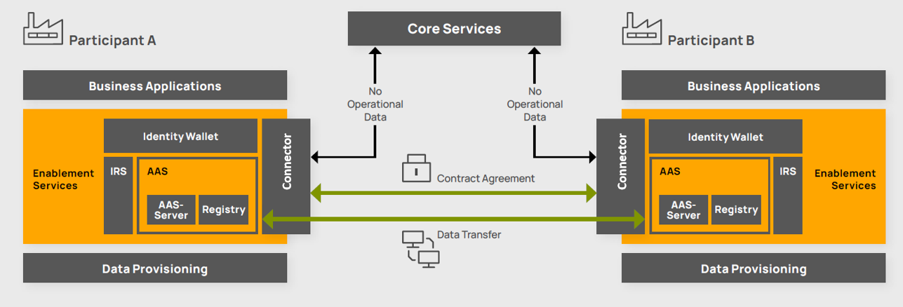

---
tags:
  - CAT/Data Provider & Consumer
  - CAT/Connector
  - CAT/Enablement Service Provider
  - CAT/Connector as a Service
  - CAT/Sandbox Services (Beta)
---

# CX-0018 Dataspace Connectivity v.3.3.0

## ABSTRACT

This document specifies the communication requirements for data exchange between participants in the Catena-X data
ecosystem. The aim is to ensure interoperability and data sovereignty at the same time.

## COMPARISON WITH THE PREVIOUS VERSION OF THE STANDARD

- add details on participant identifiers
- add details on transfer types
- list consumer-sent messages that must be authenticated  

## 1 INTRODUCTION

### 1.1 AUDIENCE & SCOPE

> *This section is non-normative*

#### AUDIENCE

The role definition is based on the definition of
the [CX Operating Model](#cx-operating-model).

The standard is relevant for the following roles, as they must be certified against it:

- Core Service Provider (A/B)
- Enablement Service Provider
- Business Application Provider
- Data Provider/Consumer

> Note: The normative section of this standard uses the DSP-definitions of "Consumer" and "Provider". Any of the
> aforementioned Catena-X-roles can assume either DSP-role.

The standard is relevant for the following role, as they must certify against this standard:

- Conformity Assessment Body

The standard is relevant for the following role, as they carry out their advisory on the basis of this standard.

- Advisory Provider

#### SCOPE

This document covers the requirements for dataspace connectivity. It describes

- how communication between dataspace participants must take place,
- which transfer type profiles have to be supported by any Provider or Consumer,
- how communication with credential services must take place,
- which conventions apply with regard to policy constraints,
- and which conventions apply to datasets.

### 1.2 CONTEXT AND ARCHITECTURE FIT

> *This section is non-normative*

The connector is the main technical component that implements dataspace connectivity including data sovereignty and
interorganizational interoperability. It is part of the enablement services, which are intended to enable participation
in the Catena-X ecosystem.

The following figure shows how the connector fits into the overall framework of Catena-X to exchange data.

*Figure 1: Framework of data exchange*

> Note: At time of the release, the Identity Wallet solution is not decentralized yet. However, this standard already
> provides most of the infrastructure to operate Wallets (DCP-Credential-Services) in a distributed manner.
> More information about the SSI-infrastructure can be found in the relevant standards.

### 1.3 CONFORMANCE AND PROOF OF CONFORMITY

As well as sections marked as non-normative, all authoring guidelines, diagrams, examples, and notes in this
specification are non-normative. Everything else in this specification is normative.

The key words **MAY**, **MUST**, **MUST NOT**, **OPTIONAL**, **RECOMMENDED**, **REQUIRED**, **SHOULD** and **SHOULD NOT
**
in this document are to be interpreted as described in BCP 14 RFC2119, RFC8174 when, and only when, they
appear in all capitals, as shown here.

### 1.4 TERMINOLOGY

| Term                                         | Description                                                                                                                                                                                                                  | Reference                                                                                         |
|----------------------------------------------|------------------------------------------------------------------------------------------------------------------------------------------------------------------------------------------------------------------------------|---------------------------------------------------------------------------------------------------|
| International Data Spaces Association (IDSA) | Organisation that provides standards and architecture solutions for secure, sovereign data sharing within so-called dataspaces                                                                                               | https://internationaldataspaces.org                                                               |
| Eclipse Dataspace Working Group (EDWG)       | Eclipse Foundation Working Group that develops and maintains specifications for the data exchange within a dataspace                                                                                                         | https://dataspace.eclipse.org                                                                     |
| Dataspace Protocol (DSP)                     | Protocol specification, designed to facilitate interoperable data sharing within a dataspace, currently governed by the EDWG                                                                                                 | https://github.com/eclipse-dataspace-protocol-base/DataspaceProtocol                              |
| Decentralized Claims Protocol (DCP)          | Protocol specification for the exchange of verifiable credentials and presentations between a connector and a wallet as well as the issuance of such credentials by an identity provider                                     | https://github.com/eclipse-dataspace-dcp/decentralized-claims-protocol                            |
| Connector                                    | (Catena-X) Technical component that allows business applications to interact with each other within a dataspace                                                                                                              | https://github.com/eclipse-tractusx/tractusx-edc                                                  |
| (Catena-X) Business Applications             | (Catena-X) Applications that enable functionality of different use cases, hosted by a data provider or consumer itself or by a business application provider                                                                 | https://eclipse-tractusx.github.io/developer                                                      |
| Catena-X Marketplace                         | The Marketplace inside a portal, allowing participants of the Catena-X network to search and select Catena-X Business Applications                                                                                           | https://catena-x.net/en/offers/portal-marketplace                                                 |
| Business Partner Number (BPN)                | Every participant in the Catena-X network has a unique, unchangeable identifier, called business partner number (BPN). The legal entity of an organization is represented by the Business Partner Number Legal Entity (BPNL) | [CX - 0010 Business Partner Number](#business-partner-number)                                     |
| Data Catalog Vocabulary (DCAT)               | RDF vocabulary designed to facilitate interoperability between data catalogs published on the Web                                                                                                                            | https://www.w3.org/TR/vocab-dcat-3                                                                |
| Open Data Rights Language (ODRL)             | Policy expression language that provides a flexible and interoperable information model, vocabulary, and encoding mechanisms for representing statements about the usage of content and services                             | https://www.w3.org/TR/odrl-model, https://www.w3.org/TR/odrl-vocab, https://w3c.github.io/odrl/bp |

- The terms *Connector, Provider, Participant Agent* are adopted from the DSP.
- The term *Credential Service* is adopted from the DCP.
- The terms *Core Service Provider A/B (CSP A/B)*, *Onboarding Service Provider (OSP)*, *Enablement Service Provider (
  ESP)*, *Business Application Provider (BAP)*, *Advisory Provider (AP)* and *Conformity Assessment Body (CAB)* are
  adopted from the [CX Operating Model](#cx-operating-model)

## 2 MAIN CONTENT

> *This section is normative*

This section uses the following prefixes as abbreviations for namespaces

- `"dct": "http://purl.org/dc/terms/"`
- `"dspace": "https://w3id.org/dspace/2024/1/"`
- `"odrl": "https://www.w3.org/ns/odrl/2/"`
- `"dcat": "http://www.w3.org/ns/dcat#"`
- `"cx-common": "https://w3id.org/catenax/ontology/common#"`

### 2.1 Communication between Dataspace Participants

Dataspace *Participants* exchange data via their *Participant Agents*. They are a logical component that communicates
via a set of well-defined messages.

Participant Agents MUST facilitate data exchange according to the HTTPS binding defined in
the [Dataspace Protocol](#dataspace-protocol).

Providers and Consumer MUST expose the specified endpoints for the

- Catalog Protocol
- Contract Negotiation Protocol
- Transfer Process Protocol
- Version Metadata

as specified in the HTTPS binding of the Dataspace Protocol 2024-01.

#### 2.1.1 Usage of BPNL in the data exchange

A Participant Agent MUST use the BPNL in all protocol message properties that identify a Participant. This includes
properties such as `dspace:participantId` in the `Catalog` response message, `odrl:assigner` and `odrl:assignee`
in the `dspace:ContractAgreementMessage`.

### 2.2 Transfer Type Profiles

In their `dcat:Catalog` response to a `dspace:CatalogRequestMessage`, for each Dataset, a Provider MUST return a
`dcat:Distribution` signifying what Transfer Profile a Consumer can use to obtain data.

Providers MUST be able to serve data according to that signal when data transfer is requested by a consumer
via a `dspace:TransferRequestMessage`.

> Despite the IRIs `dspace:HttpData-PULL` and `dspace:AmazonS3-PUSH` are not yet included in the DSP-context, they will
> be used as preliminary identifiers.

Providers MAY offer any of the following Transfer Type Profiles:

#### 2.2.1 HttpData-PULL

A Consumer MUST send a `dspace:TransferRequestMessage` with `dct:format`:`HttpData-PULL` and no
`dspace:dataAddress` property.

A Provider MUST send a `dspace:TransferStartMessage` with sufficient information in the `dspace:dataAddress` property so
that an HTTP request to the `dspace:endpoint` may succeed. The `dspace:endpointType` property MUST be
`https://w3id.org/idsa/v4.1/HTTP`. The following `endpointProperties` are to be added to the object as specified in the
table below:

| Name                                             |          | description                                                                                                                                                   |
|--------------------------------------------------|----------|---------------------------------------------------------------------------------------------------------------------------------------------------------------|
| `https://w3id.org/edc/v0.0.1/ns/authorization`   | REQUIRED | The access token to access data. To be included in the `Authorization` header.                                                                                |
| `https://w3id.org/edc/v0.0.1/ns/authType`        | REQUIRED | Prefix for the `Authorization` header's content.                                                                                                              |
| `https://w3id.org/tractusx/auth/refreshEndpoint` | OPTIONAL | Endpoint to refresh the access token using the `refreshToken`. It behaves as defined in [RFC6749](#rfc-6749) section 6 using an STS-token for authentication. |
| `https://w3id.org/tractusx/auth/refreshToken`    | OPTIONAL | The refresh token to present to the `refreshEndpoint` in conjunction with the old access token.                                                               |
| `https://w3id.org/tractusx/auth/expiresIn`       | REQUIRED | Time to live for the access token after issuance.                                                                                                             |

A Provider Connector MUST ensure that the requested backend system has sufficient context from the negotiation
to evaluate the legitimacy of the request.

A Consumer may then use the provided data to execute requests against the endpoint.

> Despite the token, the endpoint still has the right to refuse serving a request. This may occur for instance when
> a consumer attempts to PUT against a resource but is only allowed to GET.

#### 2.2.2 AmazonS3-PUSH

A Consumer MUST send a `dspace:TransferRequestMessage` with `dct:format`:`AmazonS3-PUSH` and `dspace:dataAddress`
property so that triggering a transfer to the `dspace:endpoint` may succeed. The `dspace:endpointType` property MUST be
`AmazonS3`. The `dspace:endpointType` MUST be decorated with the data relevant `dspace:endpointProperties` as follows:

| Name                                        |          | description                                                                                                                                |
|---------------------------------------------|----------|--------------------------------------------------------------------------------------------------------------------------------------------|
| `region`                                    | REQUIRED | Region the bucket resides in.                                                                                                              |
| `bucketName`                                | REQUIRED | Name of the bucket.                                                                                                                        |
| `https://w3id.org/tractusx/auth/folderName` | REQUIRED | name of the folder to be transferred.                                                                                                      |
| `https://w3id.org/tractusx/auth/keyName`    | REQUIRED | path to the resource to be transferred.                                                                                                    |
| `https://w3id.org/edc/v0.0.1/ns/secret`     | REQUIRED | json object as string with `\` escaped double-quotes holding `accessKeyId`, `secretAccessKey`, `sessionToken` and `expiration` properties. |

A Provider MUST send a `dspace:TransferStartMessage` and an empty `dspace:dataAddress` property. They MUST execute a
transfer as specified by the received request.

### 2.3 Communication with a Credential Service

This standard assumes that each Participant has been issued a set of Verifiable Credentials (VCs) according to the
relevant Catena-X standards. These VCs are stored in a Credential Service.

A Consumer MUST be able to retrieve an access token according to the Verifiable Presentation Protocol (VPP) that is part
of the [Decentralized Claims Protocol (DCP)](#decentralized-claims-protocol). This corresponds to Request 1 in the
presentation flow where this Consumer acts as Client.

A Provider MUST be able to receive and securely verify an access token and derive information on a Consumer's
Credential Service in order to execute the DCP VPP Request 4. This corresponds to the role of Verifier.

A Consumer MUST include an appropriately scoped STS-Token in the `Authorization` header of the following requests:

- `CatalogRequestMessage` (see [DSP](#dataspace-protocol))
- `ContractRequestMessage` (see [DSP](#dataspace-protocol))
- `refresh` (see [HttpData-PULL](#221-httpdata-pull))

### 2.4 Conventions for Policy Constraints

`odrl:Offer` objects contained in a `dcat:Catalog` SHOULD carry `odrl:Constraint`s that are specified in the
[CX-ODRL-Profile](#odrl-profile). Subsequent standards are encouraged to specify further
restrictions of said profile, especially on the `odrl:rightOperand`s. The following list compiles a set of well-defined
policies that Data Providers and Data Consumers SHOULD include in their offers and guidance on how to check them.
Application Providers MUST support all constraints of the following table.

| Name                        | leftOperand (expanded IRI)                           | operator   (compacted IRI) | valid rightOperands (literal) | validation mechanism                                                                                                                                                                                                                                      |
|-----------------------------|------------------------------------------------------|---------------------------------|-------------------------------|-----------------------------------------------------------------------------------------------------------------------------------------------------------------------------------------------------------------------------------------------------------|
| MembershipConstraint        | `https://w3id.org/catenax/policy/Membership`         | `odrl:eq`                       | `active`                      | [Membership Credential (CX - 0149)](#verified-company-identity)                                                                                                                                                                                           |
| UseCaseConstraints          | `https://w3id.org/catenax/policy/FrameworkAgreement` | `odrl:eq`                       | `[usecasename]:[version]`     | [UseCaseFrameworkAgreementCredential (CX - 0050)](#framework-agreement-credential) The exact mapping logic is specified in the section [Framework Agreement to Verifiable Credential Mapping](#framework-agreement-to-verifiable-credential-mapping) |
| ContractReferenceConstraint | `https://w3id.org/catenax/policy/ContractReference`  | `odrl:eq`                       | `[string]:[version]`          | The value comparison necessary for validation SHOULD be based on [CX-ODRL-Profile](#odrl-profile)                                                                                                                                                         |
| UsagePurposeConstraint      | `https://w3id.org/catenax/policy/UsagePurpose`       | `odrl:eq`                       | `[string]:[version]`          | The value comparison used necessary for validation SHOULD be based on [CX-ODRL-Profile](#odrl-profile)                                                                                                                                                    |

Note: The list is available in machine-readable form with links to the respective legal documents in the
[CX-ODRL-Profile](#odrl-profile).

Each Data Offer visible in a Provider's `dcat:Catalog` MUST include at least an `odrl:Constraint` according to the
definition of *UseCaseContraint* as defined above.

Providers SHOULD chain constraints (if necessary) via `odrl:and`. Examples can be found
in [CX-ODRL-Profile](#odrl-profile).

Providers MUST perform access control checks based on CX credentials on their data offers as a `dcat:Catalog` object may
expose information restricted by governance and regulation.

#### Framework Agreement to Verifiable Credential Mapping

The mapping between the rightOperands of a cx-policy:FrameworkAgreement to its referring Verifiable Credential (
described in CX-0050) is done via the credential type and its version.

- The given rightOperand needs to be separated by the first “:” to separate the version term. Only one separator is
  allowed.

- Thereafter, the term “Credential” needs to be appended to identify the relevant credential via its credential type.

- The version maps the “contractVersion” property inside the relevant credential.

Example (rightOperand to Credential):

- DataExchangeGovernance:x.x -> DataExchangeGovernanceCredential with contractVersion “x.x”

Note: Versions are to be handled as strings / literals and do not require any semantic comparison.

#### Catena-X ODRL Profile

To clearly identify the relevant Catena-X ODRL Profile, every policy (and their subclasses) MUST use the ODRL ‘profile’
property with an IRI referring to the Catena-X ODRL Profile as defined
in [ODRL policy](https://www.w3.org/TR/odrl-model/#policy) The current version
is: `https://w3id.org/catenax/policy/profile2405` or in compact form: `cx-policy:profile2405`.

### 2.5 Conventions for Datasets

A Provider MUST annotate all instances `dcat:Dataset` in a `dcat:Catalog` with the following properties:

- `dct:type` holding an object with at least an `@id` property pointing to a concept describing what type of API this
  Dataset represents. Subsequent standards define the exact value this property shall hold, depending on the Business
  scenario. The set of concepts is maintained in the taxonomy `https://w3id.org/catenax/taxonomy#` and MUST extend the
  concept `https://w3id.org/catenax/taxonomy#Asset`.
- `cx-common:version` holding a string with SemVer semantics indicating the API version of the API that was typed by
  the `dct:type` property. It is allowed to use version information that is incomplete according to SemVer.
  Subsequent standards define the exact value this property shall hold, depending on the Business scenario.

## 3 REFERENCES

### 3.1 NORMATIVE REFERENCES

#### Dataspace Protocol

The Dataspace Protocol is an external reference. A Participant Agent MUST implement the referenced version to comply to
this standard version.

- [Dataspace Protocol (DSP) version 2024-01](https://github.com/International-Data-Spaces-Association/ids-specification/releases/tag/2024-1)

#### Decentralized Claims Protocol

The Decentralized Claims Protocol is an external reference. A Participant Agent MUST implement the referenced version to
comply to this standard version.

Note: In previous versions of this specification, the protocol referenced under its previous name "Identity and
Trust Protocol" (IATP).

- [Decentralized Claims Protocol (DCP) version 0.8.1](https://github.com/eclipse-dataspace-dcp/decentralized-claims-protocol/releases/tag/0.8.1).
  Especially relevant is
  the [Verifiable Presentation Protocol](https://github.com/eclipse-dataspace-dcp/decentralized-claims-protocol/blob/0.8.1/specifications/verifiable.presentation.protocol.md)

#### RFC 6749

https://www.rfc-editor.org/rfc/rfc6749#section-6

#### Business Partner Number

- [CX - 0010 Business Partner Number v2.1.0](https://catenax-ev.github.io/docs/next/standards/CX-0010-BusinessPartnerNumber)

#### Framework Agreement Credential

- [CX-0050 Framework Agreement Credential v2.1.0](https://catenax-ev.github.io/docs/next/standards/CX-0050-FrameworkAgreementCredential)

#### Verified Company Identity

- [CX-0149 Verified Company Identity v1.0.0](https://catenax-ev.github.io/docs/next/standards/CX-0149-Dataspaceidentityandidentification)

#### ODRL Profile

- [CX-ODRL-Profile](https://github.com/catenax-eV/cx-odrl-profile)

#### CX Operating Model

- [CX Operating Model 3.0.1](https://catenax-ev.github.io/docs/next/operating-model/why-introduction)

### 3.2 NON-NORMATIVE REFERENCES

> *This section is non-normative*

- [Connector Kit](https://eclipse-tractusx.github.io/docs-kits/next/category/connector-kit)

### 3.3 REFERENCE IMPLEMENTATIONS

> *This section is non-normative*

- [Tractus-X EDC](https://github.com/eclipse-tractusx/tractusx-edc)

## ANNEXES

### FIGURES

Figure 1: Framework of data exchange
