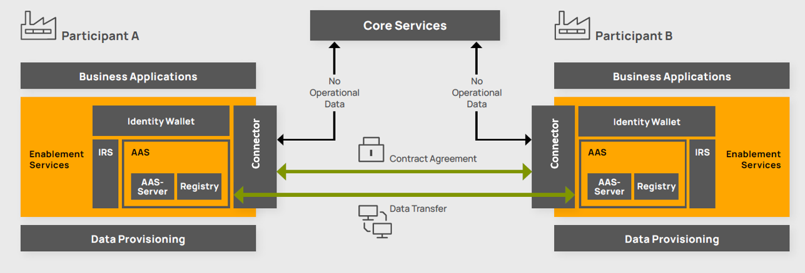

---
tags:
  - CAT/Data Provider & Consumer
  - CAT/Connector
  - CAT/Enablement Service Provider
  - CAT/Connector as a Service
---

# CX-0018 Dataspace Connectivity v.4.2

## ABSTRACT

This document specifies the communication requirements for data exchange between participants in the Catena-X data
ecosystem. The aim is to ensure interoperability and data sovereignty at the same time.

## 1 INTRODUCTION

### 1.1 AUDIENCE & SCOPE

> *This section is non-normative*

#### AUDIENCE

The role definition is based on the definition of
the [CX Operating Model](#cx-operating-model).

The standard is relevant for the following roles, as they must be certified against it:

- Enablement Service Provider
- Business Application Provider
- Data Provider/Consumer

> Note: The normative section of this standard uses the DSP-definitions of "Consumer" and "Provider". Any of the
> aforementioned Catena-X-roles can assume either DSP-role.

The standard is relevant for the following role, as they must certify against this standard:

- Conformity Assessment Body

The standard is relevant for the following role, as they carry out their advisory on the basis of this standard.

- Advisory Provider

#### SCOPE

This document covers the requirements for dataspace connectivity. It describes

- how communication between dataspace participants must take place,
- which transfer type profiles have to be supported by any Provider or Consumer,
- how communication with credential services must take place,
- and which conventions apply to datasets.

### 1.2 CONTEXT AND ARCHITECTURE FIT

> *This section is non-normative*

The connector is the main technical component that implements dataspace connectivity including data sovereignty and
interorganizational interoperability. It is part of the enablement services, which are intended to enable participation
in the Catena-X ecosystem.

The following figure shows how the connector fits into the overall framework of Catena-X to exchange data.



*Figure 1: Framework of data exchange*

### 1.3 CONFORMANCE AND PROOF OF CONFORMITY

As well as sections marked as non-normative, all authoring guidelines, diagrams, examples, and notes in this
specification are non-normative. Everything else in this specification is normative.

The key words **MAY**, **MUST**, **MUST NOT**, **OPTIONAL**, **RECOMMENDED**, **REQUIRED**, **SHOULD** and
**SHOULD NOT** in this document are to be interpreted as described in BCP 14 RFC2119, RFC8174 when, and only
when, they appear in all capitals, as shown here.

### 1.4 TERMINOLOGY

| Term                                         | Description                                                                                                                                                                                                                  | Reference                                                                                         |
|----------------------------------------------|------------------------------------------------------------------------------------------------------------------------------------------------------------------------------------------------------------------------------|---------------------------------------------------------------------------------------------------|
| International Data Spaces Association (IDSA) | Organisation that provides standards and architecture solutions for secure, sovereign data sharing within so-called dataspaces                                                                                               | https://internationaldataspaces.org                                                               |
| Eclipse Dataspace Working Group (EDWG)       | Eclipse Foundation Working Group that develops and maintains specifications for the data exchange within a dataspace                                                                                                         | https://dataspace.eclipse.org                                                                     |
| Dataspace Protocol (DSP)                     | Protocol specification, designed to facilitate interoperable data sharing within a dataspace, currently governed by the EDWG                                                                                                 | https://github.com/eclipse-dataspace-protocol-base/DataspaceProtocol                              |
| Decentralized Claims Protocol (DCP)          | Protocol specification for the exchange of verifiable credentials and presentations between a connector and a wallet as well as the issuance of such credentials by an identity provider                                     | https://github.com/eclipse-dataspace-dcp/decentralized-claims-protocol                            |
| Connector (or formal Participant Agent)      | (Catena-X) Technical component that allows business applications to interact with each other within a dataspace                                                                                                              | https://github.com/eclipse-tractusx/tractusx-edc                                                  |
| (Catena-X) Business Applications             | (Catena-X) Applications that enable functionality of different use cases, hosted by a data provider or consumer itself or by a business application provider                                                                 | https://eclipse-tractusx.github.io/developer                                                      |
| Catena-X Marketplace                         | The Marketplace inside a portal, allowing participants of the Catena-X network to search and select Catena-X Business Applications                                                                                           | https://catena-x.net/en/offers/portal-marketplace                                                 |
| Open Data Rights Language (ODRL)             | Policy expression language that provides a flexible and interoperable information model, vocabulary, and encoding mechanisms for representing statements about the usage of content and services                             | https://www.w3.org/TR/odrl-model, https://www.w3.org/TR/odrl-vocab, https://w3c.github.io/odrl/bp |

- The terms *Consumer, Provider, Participant Agent* are adopted from the DSP.
- The term *Credential Service* is adopted from the DCP.
- The terms *Core Service Provider A/B (CSP A/B)*, *Onboarding Service Provider (OSP)*,
  *Enablement Service Provider (ESP)*, *Business Application Provider (BAP)*, *Advisory Provider (AP)* and
  *Conformity Assessment Body (CAB)* are adopted from the [CX Operating Model](#cx-operating-model)

## 2 MAIN CONTENT

> *This section is normative*

This section uses terms that are taken from the DSP context specified in `"dspace": "https://w3id.org/dspace/2025/1/context.jsonld"`.
Terms that are not defined in this context are provided in an expanded version.

### 2.1 Communication between Dataspace Participants

Dataspace *Participants* exchange data via their *Participant Agents* which are a logical component that communicates
via a set of well-defined messages.

Participant Agents MUST facilitate data exchange according to the HTTPS binding defined in
the [Dataspace Protocol](#dataspace-protocol).

Providers and Consumer MUST expose the specified endpoints for the

- Catalog Protocol
- Contract Negotiation Protocol
- Transfer Process Protocol
- Version Metadata

as specified in the HTTPS binding of the Dataspace Protocol.

#### 2.1.1 Usage of DID in the data exchange

A Participant Agent MUST use the [DID](#decentralized-identifiers-did) in all protocol message properties that identify
a Participant. This includes properties such as `participantId` in the `Catalog` response message.

### 2.2 Transfer Type Profiles

This section provides regulations for a non-exhaustive selection of Transfer Type Profiles. Further profiles
can be defined by extensions to this standard. A Provider MAY offer as many Transfer Type Profiles as necessary to
support all intended use cases.

> Despite the IRIs of the currently used identifiers for transfer types are not yet included in the DSP-context, they
> will be used as preliminary identifiers.

Providers SHOULD be able to serve data according to that signal when data transfer is requested by a consumer
via a `TransferRequestMessage`.

#### 2.2.1 HttpData-PULL

A Provider MUST add a `"format":"HttpData-PULL"` to the `Distribution` of a `Dataset` in the `Catalog` response to indicate
support for the HttpData-PULL transfer type.

A Consumer MUST send a `TransferRequestMessage` with `"format":"HttpData-PULL"` to start an `HttpData-PULL` transfer process.
The `dataAddress` property is not required and won't be processed by the Provider.

A Provider MUST send a `TransferStartMessage` with sufficient information in the `dataAddress` property
so that an HTTP request to the `endpoint` may succeed. The `endpointType` property MUST be `https://w3id.org/idsa/v4.1/HTTP`.
The following `endpointProperties` MUST be added to the object as specified in the table below:

| Name                                             |          | description                                                                                                                                                   |
|--------------------------------------------------|----------|---------------------------------------------------------------------------------------------------------------------------------------------------------------|
| `https://w3id.org/edc/v0.0.1/ns/endpoint`        | REQUIRED | The endpoint URL of the dataplane to access the data asset.                                                                                                   |
| `https://w3id.org/edc/v0.0.1/ns/authorization`   | REQUIRED | The access token to access data. To be included in the `Authorization` header of an ensuing HTTP request without any additions/modifications.                 |
| `https://w3id.org/edc/v0.0.1/ns/authType`        | OPTIONAL | Hint for the authorization scheme expected by the `endpoint`. Clients are not required to process this property.                                              |
| `https://w3id.org/tractusx/auth/refreshEndpoint` | OPTIONAL | Endpoint to refresh the access token using the `refreshToken`. It behaves as defined in [RFC6749](#rfc-6749) section 6 using an STS-token for authentication. |
| `https://w3id.org/tractusx/auth/refreshToken`    | OPTIONAL | The refresh token to present to the `refreshEndpoint` in conjunction with the old access token.                                                               |
| `https://w3id.org/tractusx/auth/expiresIn`       | REQUIRED | Time to live for the access token after issuance.                                                                                                             |

A Provider Participant Agent MUST ensure that the requested backend system has sufficient context from the negotiation
to evaluate the legitimacy of the request.

A Consumer may then use the provided data to execute requests against the endpoint.

> Despite the token, the endpoint still has the right to refuse serving a request. This may occur for instance when
> a consumer attempts to access data which is in general available but not covered by the negotiated contract.

#### 2.2.2 AmazonS3-PUSH

A Provider MUST add a `"format":"AmazonS3-PUSH"` to the `Distribution` of a `Dataset` in the `Catalog` response to indicate support
for the AmazonS3-PUSH transfer type.

A Consumer MUST send a `TransferRequestMessage` with `format`:`AmazonS3-PUSH` and a `dataAddress` property to start an AmazonS3-PUSH
transfer process. The `dataAddress` property MUST contain a `endpointType` property set to `AmazonS3`. The `endpointType` MUST be decorated
with relevant `endpointProperties` as follows:

| Name                                         |          | description                                                                                                                                |
|----------------------------------------------|----------|--------------------------------------------------------------------------------------------------------------------------------------------|
| `https://w3id.org/edc/v0.0.1/ns/type`        | REQUIRED | Defines the Asset type (AmazonS3)                                                                                                          |
| `https://w3id.org/edc/v0.0.1/ns/bucketName`  | REQUIRED | Defines the name of the destination S3 bucket.                                                                                             |
| `https://w3id.org/edc/v0.0.1/ns/region`      | REQUIRED | Defines the region of the destination bucket (us-east-1, eu-west-1 ...)                                                                    |
| `https://w3id.org/edc/v0.0.1/ns/objectName`  | OPTIONAL | Defines the desired name of the S3 object in the destination bucket.                                                                       |
| `https://w3id.org/edc/v0.0.1/ns/folderName`  | OPTIONAL | Defines the desired folder name for S3 objects to be grouped (folderName/) in the destination bucket.                                      |
| `https://w3id.org/edc/v0.0.1/ns/secret`      | REQUIRED | Defines the Json object as a Json-escaped string holding `"edctype": "dataspaceconnector:secrettoken"` `"accessKeyId":"<ACCESS_KEY_ID>"`, `"secretAccessKey": "<SECRET_ACCESS_KEY>"` and optionally for temporary access  `"sessionToken": "<SESSION_TOKEN>"` and `"expiration":"time-in-seconds"` properties. |

A Provider MUST send a `TransferStartMessage` with an empty `dataAddress` property. The provider MUST execute a transfer as specified
by the received request.

#### 2.2.3 AzureStorage-PUSH

A Provider MUST add a `"format":"AzureStorage-PUSH"` to the `Distribution` of a `Dataset` in the `Catalog` response to indicate support
for the AzureStorage-PUSH transfer type.

A Consumer MUST send a `TransferRequestMessage` with `format`:`AzureStorage-PUSH` and a `dataAddress` property so that triggering a
transfer to the `endpoint` may succeed. The `endpointType` property MUST be `AzureStorage`. The `endpointType` MUST be decorated with
`endpointProperties` as follows:

| Name                                         |          | description                                                                                                                                |
|----------------------------------------------|----------|--------------------------------------------------------------------------------------------------------------------------------------------|
| `https://w3id.org/edc/v0.0.1/ns/type`        | REQUIRED | Defines the Asset type (AzureStorage)                                                                                                      |
| `https://w3id.org/edc/v0.0.1/ns/account`     | REQUIRED | Defines the name of the destination Azure Storage account.                                                                                 |
| `https://w3id.org/edc/v0.0.1/ns/container`   | REQUIRED | Defines the name of the destination Azure Storage container.                                                                               |
| `https://w3id.org/edc/v0.0.1/ns/blobName`    | OPTIONAL | Defines the desired name of the blob in the destination storage. The data provider might ignore that, if the data source contains multiple files.|
| `https://w3id.org/edc/v0.0.1/ns/folderName`  | OPTIONAL | Defines the desired folder name for blobs to be grouped (folderName/) in the destination storage account.                                  |
| `https://w3id.org/edc/v0.0.1/ns/secret`      | REQUIRED | Defines the Json object as a Json-escaped string holding `"edctype":"dataspaceconnector:azuretoken"`,`"sas":"<sas-token>"` and `"expiration":"time-in-seconds"` properties. |

A Provider MUST send a `TransferStartMessage` with an empty `dataAddress` property. Fthe provider MUST execute a transfer as specified
by the received request.

### 2.3 Communication with a Credential Service

This standard assumes that each Participant has been issued a set of Verifiable Credentials (VCs) according to the
[CX-0050](#cx-specific-credentials) standard. These VCs are stored in a Credential Service.

A Consumer MUST be able to retrieve an access token according to the Verifiable Presentation Protocol (VPP) that is
part of the [Decentralized Claims Protocol (DCP)](#decentralized-claims-protocol).

The scope of the token for requesting a `Catalog` MUST include the following credentials as defined in
[CX-0050](#cx-specific-credentials):

- Membership Credential
- BPN Credential
- Framework Agreement Credential

A Provider MUST be able to receive and securely verify an access token and derive information on a Consumer's
Credential Service in order to execute the DCP VPP Request 6. This corresponds to the role of Verifier.

A Consumer MUST include an appropriately scoped STS-Token in the `Authorization` header in all DSP messages sent
to the provider (see [DSP](#dataspace-protocol)) and in addition in the `refresh` message
(see [HttpData-PULL](#221-httpdata-pull))

### 2.4 Policy Value to Verifiable Credential Mapping

The conventions for policy constraints and the relevant constraints for Verifiable Credential checking are defined in
the Catena-X standard [CX-0152 Policy Constraints for Data Exchange](#policy-constraints-for-data-exchange). Based on
this, the connector MUST support the verification of Verifiable Credential as described below.

The mapping between a policy constraint referencing a verifiable credential and the credential name depends on the type
of credential.

- For credentials requesting the rightOperand as `active` the leftOperand is the base for the credential
name.
- For other policy constraints referencing a verfiable credential, the rightOperand is the base for the credential name

Based on the corresponding base name of the credential, the following steps have to be applied:

- The given base name potentially needs to be separated by the first “:” to separate the version term.

- Thereafter, the term “Credential” needs to be appended to the base name.

- If a version is available, the content has to be stored for credential evaluation purposes. The version is handled as
  a literal and can only be used for equality comparisons.

Example (rightOperand to Credential):

- DataExchangeGovernance:x.x -> DataExchangeGovernanceCredential with version “x.x”

### 2.5 Conventions for Datasets

A Provider MUST annotate all instances `Dataset` in a `Catalog` with the following properties:

- `http://purl.org/dc/terms/type` holding an object with at least an `@id` property pointing to a concept describing
  what type of API this `Dataset` represents. Subsequent standards define the exact value this property shall hold,
  depending on the business scenario. The set of concepts is maintained in the taxonomy `https://w3id.org/catenax/taxonomy#`
  and MUST extend the concept `https://w3id.org/catenax/taxonomy#Asset`.
- `https://w3id.org/catenax/ontology/common#version` holding a string with SemVer semantics indicating the API version of
  the API that was typed by the `http://purl.org/dc/terms/type` property. It is allowed to use version information that
  is incomplete according to SemVer. Subsequent standards define the exact value this property shall hold, depending on the
  business scenario.

### 2.6 Participant Agent Management

A `Catalog` offered by a Providers Participant Agent MUST provide only `Dataset` instances that can be negotiated
with the same Participant Agent.

A Provider MUST publish all Participant Agents that should be detectable by a Consumer by specifying the participants
version endpoint address in the DID document as specified in the [CX-0049 DID Document standard](#did-document) as
a entry in the service sectoin of type `DataService`. The endpoint address has the format
`https://subdomain.provider-domain.com/subpath/.well-known/dspace-version`, with `subpath` being an a arbitrary path
below the Providers chosen domain.

The path `https://subdomain.provider-domain.com/subpath` MUST be the path used for registration of the connector at the
Core Service Provider B.

The content of the `dspace-version` endpoint is defined in section on
[protocol version handling](#27-protocol-version-handling)

The definition of the service reference reflects the section `Discovery of Service Endpoints` in the
[DSP spec](#dataspace-protocol).

### 2.7 Protocol Version Handling

A Provider MUST provide the `version metadata endpoint` at the url
`https://subdomain.provider-domain.com/subpath/.well-known/dspace-version` returning a response object as defined in
the section on [Exposure of version in the DSP spec](#dataspace-protocol). An example for the response object is:

```json
{
  "protocolVersions": [
    {
      "version": "2025-1",
      "path": "/2025-1",
      "binding": "HTTPS"
    },
    {
      "version": "v0.8",
      "path": "",
      "binding": "HTTPS"
    }
  ]
}
```

The reference point of the given relative path segments is the base path that hosts the version metadata endpoint, i.e., in the described case `https://subdomain.provider-domain.com/subpath`. For example, from the given information, the path to access the `2025-1` version of the catalog service is `https://subdomain.provider-domain.com/subpath/2025-1/catalog` and the path for the old protocol version `v0.8` is `https://subdomain.provider-domain.com/subpath/catalog`. For convenience, a participant agent SHOULD accept for the old protocol a version string `0.8` as well.

A Consumer SHOULD evaluate the protocol versions supported by the targeted Provider and SHOULD limit
the use of protocol versions to the latest offered by the Provider.

A Providers Participant Agent MUST be capable to identify by the called DSP api, which version the Consumer
is using for the communication and MUST answer with the right response formats according to that version.

The definition of the version management reflects the section `Exposure of versions` in the
[DSP spec](#dataspace-protocol).

## 3 BACKWARD COMPATIBILITY

Backward compatibility is handled by the Dataspace Protocol version used for the communication between two participant
agents. All differences are handled by explicit versioning of the protocol. This includes changes in details that are
not motivated by the Dataspace Protocol itself but by semantic changes attached to the protocol version update.

Note: The previous version of the CX-0018 standard had a bug. The actual version used previously was DSP version `v0.8`
which MUST be used as key for referring to the previous version in the `version metadata endpoint`.

Based on this constraint, backward compatibility is handled by the mechanism specified in
[section 2.7](#27-protocol-version-handling).

A Provider using the older standard version might neither provide discovery information in the DID document, nor
provide the `version metadata endpoint`. In such cases, the Consumer Participant Agent SHOULD assume the Providers
Participant Agent to use the old protocol version and the centralized discovery mechanism to find the
Participant Agents base endpoint.

## 4 REFERENCES

### 4.1 NORMATIVE REFERENCES

#### Dataspace Protocol

The Dataspace Protocol is an external reference. A Participant Agent MUST implement the referenced version to comply to
this standard version.

- [Dataspace Protocol (DSP) version 2025-01](https://eclipse-dataspace-protocol-base.github.io/DataspaceProtocol/2025-1)

#### Decentralized Claims Protocol

The Decentralized Claims Protocol is an external reference. A Participant Agent MUST implement the referenced version
to comply to this standard version.

- [Decentralized Claims Protocol (DCP) version 1.0](https://eclipse-dataspace-dcp.github.io/decentralized-claims-protocol/v1.0).
  Especially relevant is
  the [Verifiable Presentation Protocol](https://eclipse-dataspace-dcp.github.io/decentralized-claims-protocol/v1.0/#verifiable-presentation-protocol)

#### RFC 6749

https://www.rfc-editor.org/rfc/rfc6749#section-6

#### Decentralized Identifiers (DID)

- [Decentralized Identifiers W3C standard](https://www.w3.org/TR/did-1.0/)

#### CX-Specific Credentials

- [CX-0050 CX-Specific Credentials](https://catenax-ev.github.io/docs/standards/CX-0050-CXSpecificCredentials)

#### DID Document

- [CX-0049 DID Document](https://catenax-ev.github.io/docs/standards/CX-0049-DIDDocumentSchema)

#### Policy Constraints for Data Exchange

- [CX-0152 Policy Constraints for Data Exchange](https://catenax-ev.github.io/docs/standards/overview)

#### CX Operating Model

- [CX Operating Model](https://catenax-ev.github.io/docs/operating-model/why-introduction)

### 4.2 NON-NORMATIVE REFERENCES

> *This section is non-normative*

- [Connector Kit](https://eclipse-tractusx.github.io/docs-kits/category/connector-kit)

### 4.3 REFERENCE IMPLEMENTATIONS

> *This section is non-normative*

- [Tractus-X EDC](https://github.com/eclipse-tractusx/tractusx-edc)

## ANNEXES

### FIGURES

Figure 1: Framework of data exchange

## Legal

Copyright © 2026 Catena-X Automotive Network e.V. All rights reserved. For more information, please see [Catena-X Copyright Notice](https://catenax-ev.github.io/copyright).
