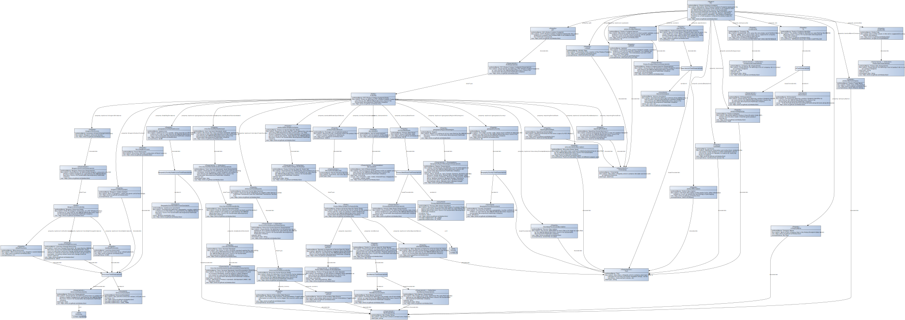

# CX-0027 Product Carbon Footprint Aspect Model v.1.0.0

## 1. Introduction

PCF is the abbreviation for Product Carbon Footprint. In Catena-X, the
aim is to create transparency about the PCF in the supply chain. From a
normative perspective, each Product (Carbon) Footprint represents the
carbon footprint of a product with values in accordance with the WBCSD
(World Business Council for Sustainable Development)/ Pathfinder
framework. In contrast, from a non-normative perspective, each Product
Footprint relates to a specific product, identified by one or more
product identifiers. Moreover, the Product Footprint is modelled as a
multi-purpose container for product-specific factors.

## 2. Purpose

This standardization introduces the standardized aspect model for the
product carbon footprint with corresponding JSON schemas and payloads
for guidance and orientation on how to provision and exchange the
corresponding data within Catena-X.

Note: The presented aspect model is in version 2.0.0.

## 3. Aspect Model

The aspect model and the corresponding JSON schema are presented below.

### 3.1. Model



Figure 1: PCF Aspect Model

Furthermore, the corresponding JSON Schema is as follows:

```json
{
   "$schema": "http://json-schema.org/draft-04/schema",
   "type": "object",
   "components": {
      "schemas": {
         "urn_bamm_io.catenax.pcf_2.0.0_IdTrait": {
            "type": "string",
            "pattern": "^[0-9a-fA-F]{8}-[0-9a-fA-F]{4}-[0-9a-fA-F]{4}-[0-9a-fA-F]{4}-[0-9a-fA-F]{12}$"
         },
         "urn_bamm_io.catenax.pcf_2.0.0_SpecVersionTrait": {
            "type": "string",
            "pattern": "\\d+\\.\\d+\\.\\d+"
         },
         "urn_bamm_io.catenax.pcf_2.0.0_ProductFootprintVersionCharacteristic": {
            "type": "number",
            "minimum": 1
         },
         "urn_bamm_io.openmanufacturing_characteristic_2.0.0_Timestamp": {
            "type": "string",
            "pattern": "-?([1-9][0-9]{3,}|0[0-9]{3})-(0[1-9]|1[0-2])-(0[1-9]|[12][0-9]|3[01])T(([01][0-9]|2[0-3]):[0-5][0-9]:[0-5][0-9](\\.[0-9]+)?|(24:00:00(\\.0+)?))(Z|(\\+|-)((0[0-9]|1[0-3]):[0-5][0-9]|14:00))?"
         },
         "urn_bamm_io.catenax.pcf_2.0.0_NonEmptyString": {
            "type": "string"
         },
         "urn_bamm_io.catenax.pcf_2.0.0_CompanyIdsCharacteristic": {
            "type": "array",
            "items": {
               "type": "string"
            },
            "uniqueItems": true
         },
         "urn_bamm_io.openmanufacturing_characteristic_2.0.0_Text": {
            "type": "string"
         },
         "urn_bamm_io.catenax.pcf_2.0.0_ProductIdsCharacteristic": {
            "type": "array",
            "items": {
               "type": "string"
            },
            "uniqueItems": true
         },
         "urn_bamm_io.catenax.pcf_2.0.0_DeclaredUnit": {
            "type": "string",
            "enum": [
               "liter",
               "kilogram",
               "cubic meter",
               "kilowatt hour",
               "megajoule",
               "ton kilometer",
               "square meter"
            ]
         },
         "urn_bamm_io.catenax.pcf_2.0.0_StrictlyPositiveDecimal": {
            "type": "number"
         },
         "urn_bamm_io.catenax.pcf_2.0.0_EmissionsTrait": {
            "type": "number",
            "minimum": 0,
            "exclusiveMinimum": false
         },
         "urn_bamm_io.catenax.pcf_2.0.0_BiogenicEmissionEntity": {
            "type": "object",
            "properties": {
               "landUseEmissions": {
                  "$ref": "#/components/schemas/urn_bamm_io.catenax.pcf_2.0.0_EmissionsTrait"
               },
               "otherEmissions": {
                  "$ref": "#/components/schemas/urn_bamm_io.catenax.pcf_2.0.0_EmissionsTrait"
               },
               "landUseChangeEmissions": {
                  "$ref": "#/components/schemas/urn_bamm_io.catenax.pcf_2.0.0_EmissionsTrait"
               }
            }
         },
         "urn_bamm_io.catenax.pcf_2.0.0_PrimaryDataShareTrait": {
            "type": "number",
            "maximum": 100,
            "exclusiveMaximum": false,
            "minimum": 0,
            "exclusiveMinimum": false
         },
         "urn_bamm_io.catenax.pcf_2.0.0_EmissionFactorSourcesEntity": {
            "type": "object",
            "properties": {
               "name": {
                  "$ref": "#/components/schemas/urn_bamm_io.catenax.pcf_2.0.0_NonEmptyString"
               },
               "version": {
                  "$ref": "#/components/schemas/urn_bamm_io.catenax.pcf_2.0.0_NonEmptyString"
               }
            },
            "required": [
               "name",
               "version"
            ]
         },
         "urn_bamm_io.catenax.pcf_2.0.0_EmissionFactorSourcesCharacteristic": {
            "type": "array",
            "items": {
               "$ref": "#/components/schemas/urn_bamm_io.catenax.pcf_2.0.0_EmissionFactorSourcesEntity"
            },
            "uniqueItems": true
         },
         "urn_bamm_io.catenax.pcf_2.0.0_GeographyCountrySubdivisionTrait": {
            "type": "string",
            "pattern": "([A-Z]{2}-[A-Z0-9]{1,3}|)"
         },
         "urn_bamm_io.catenax.pcf_2.0.0_GeographyCountryTrait": {
            "type": "string",
            "pattern": "([A-Z]{2})"
         },
         "urn_bamm_io.catenax.pcf_2.0.0_GeographyRegionOrSubregionCharacteristic": {
            "type": "string",
            "enum": [
               "Africa",
               "Americas",
               "Asia",
               "Europe",
               "Oceania",
               "Australia and New Zealand",
               "Central Asia",
               "Eastern Asia",
               "Eastern Europe",
               "Latin America and the Caribbean",
               "Melanesia",
               "Micronesia",
               "Northern Africa",
               "Northern America",
               "Northern Europe",
               "Polynesia",
               "South-eastern Asia",
               "Southern Asia",
               "Southern Europe",
               "Sub-Saharan Africa",
               "Western Asia",
               "Western Europe"
            ]
         },
         "urn_bamm_io.catenax.pcf_2.0.0_CrossSectoralStandardsUsedEnumerationCharacteristic": {
            "type": "string",
            "enum": [
               "GHG Protocol Product standard",
               "ISO Standard 14067",
               "ISO Standard 14044"
            ]
         },
         "urn_bamm_io.catenax.pcf_2.0.0_CrossSectoralStandardEntity": {
            "type": "object",
            "properties": {
               "crossSectoralStandard": {
                  "$ref": "#/components/schemas/urn_bamm_io.catenax.pcf_2.0.0_CrossSectoralStandardsUsedEnumerationCharacteristic"
               }
            },
            "required": [
               "crossSectoralStandard"
            ]
         },
         "urn_bamm_io.catenax.pcf_2.0.0_CrossSectoralStandardsUsedListCharacteristic": {
            "type": "array",
            "items": {
               "$ref": "#/components/schemas/urn_bamm_io.catenax.pcf_2.0.0_CrossSectoralStandardEntity"
            }
         },
         "urn_bamm_io.catenax.pcf_2.0.0_ProductOrSectorSpecificRuleOperator": {
            "type": "string",
            "enum": [
               "PEF",
               "EPD International",
               "Other"
            ]
         },
         "urn_bamm_io.catenax.pcf_2.0.0_RuleNamesTrait": {
            "type": "array",
            "items": {
               "type": "string"
            },
            "uniqueItems": true,
            "minItems": 1
         },
         "urn_bamm_io.catenax.pcf_2.0.0_ProductOrSectorSpecificRulesEntity": {
            "type": "object",
            "properties": {
               "operator": {
                  "$ref": "#/components/schemas/urn_bamm_io.catenax.pcf_2.0.0_ProductOrSectorSpecificRuleOperator"
               },
               "ruleNames": {
                  "$ref": "#/components/schemas/urn_bamm_io.catenax.pcf_2.0.0_RuleNamesTrait"
               },
               "otherOperatorName": {
                  "$ref": "#/components/schemas/urn_bamm_io.openmanufacturing_characteristic_2.0.0_Text"
               }
            },
            "required": [
               "operator",
               "ruleNames"
            ]
         },
         "urn_bamm_io.catenax.pcf_2.0.0_ProductOrSectorSpecificRuleSet": {
            "type": "array",
            "items": {
               "$ref": "#/components/schemas/urn_bamm_io.catenax.pcf_2.0.0_ProductOrSectorSpecificRulesEntity"
            },
            "uniqueItems": true
         },
         "urn_bamm_io.catenax.pcf_2.0.0_PcfEntity": {
            "type": "object",
            "properties": {
               "declaredUnit": {
                  "$ref": "#/components/schemas/urn_bamm_io.catenax.pcf_2.0.0_DeclaredUnit"
               },
               "unitaryProductAmount": {
                  "$ref": "#/components/schemas/urn_bamm_io.catenax.pcf_2.0.0_StrictlyPositiveDecimal"
               },
               "fossilGhgEmissions": {
                  "$ref": "#/components/schemas/urn_bamm_io.catenax.pcf_2.0.0_EmissionsTrait"
               },
               "biogenicEmissions": {
                  "$ref": "#/components/schemas/urn_bamm_io.catenax.pcf_2.0.0_BiogenicEmissionEntity"
               },
               "biogenicCarbonContent": {
                  "$ref": "#/components/schemas/urn_bamm_io.catenax.pcf_2.0.0_EmissionsTrait"
               },
               "reportingPeriodStart": {
                  "$ref": "#/components/schemas/urn_bamm_io.openmanufacturing_characteristic_2.0.0_Timestamp"
               },
               "reportingPeriodEnd": {
                  "$ref": "#/components/schemas/urn_bamm_io.openmanufacturing_characteristic_2.0.0_Timestamp"
               },
               "primaryDataShare": {
                  "$ref": "#/components/schemas/urn_bamm_io.catenax.pcf_2.0.0_PrimaryDataShareTrait"
               },
               "emissionFactorSources": {
                  "$ref": "#/components/schemas/urn_bamm_io.catenax.pcf_2.0.0_EmissionFactorSourcesCharacteristic"
               },
               "geographyCountrySubdivision": {
                  "$ref": "#/components/schemas/urn_bamm_io.catenax.pcf_2.0.0_GeographyCountrySubdivisionTrait"
               },
               "geographyCountry": {
                  "$ref": "#/components/schemas/urn_bamm_io.catenax.pcf_2.0.0_GeographyCountryTrait"
               },
               "geographyRegionOrSubregion": {
                  "$ref": "#/components/schemas/urn_bamm_io.catenax.pcf_2.0.0_GeographyRegionOrSubregionCharacteristic"
               },
               "boundaryProcessesDescription": {
                  "$ref": "#/components/schemas/urn_bamm_io.openmanufacturing_characteristic_2.0.0_Text"
               },
               "crossSectoralStandardsUsed": {
                  "$ref": "#/components/schemas/urn_bamm_io.catenax.pcf_2.0.0_CrossSectoralStandardsUsedListCharacteristic"
               },
               "productOrSectorSpecificRules": {
                  "$ref": "#/components/schemas/urn_bamm_io.catenax.pcf_2.0.0_ProductOrSectorSpecificRuleSet"
               },
               "allocationRulesDescription": {
                  "$ref": "#/components/schemas/urn_bamm_io.openmanufacturing_characteristic_2.0.0_Text"
               }
            },
            "required": [
               "declaredUnit",
               "unitaryProductAmount",
               "fossilGhgEmissions",
               "biogenicCarbonContent",
               "reportingPeriodStart",
               "reportingPeriodEnd",
               "primaryDataShare",
               "crossSectoralStandardsUsed",
               "productOrSectorSpecificRules"
            ]
         }
      }
   },
   "properties": {
      "id": {
         "$ref": "#/components/schemas/urn_bamm_io.catenax.pcf_2.0.0_IdTrait"
      },
      "specVersion": {
         "$ref": "#/components/schemas/urn_bamm_io.catenax.pcf_2.0.0_SpecVersionTrait"
      },
      "version": {
         "$ref": "#/components/schemas/urn_bamm_io.catenax.pcf_2.0.0_ProductFootprintVersionCharacteristic"
      },
      "updated": {
         "$ref": "#/components/schemas/urn_bamm_io.openmanufacturing_characteristic_2.0.0_Timestamp"
      },
      "companyName": {
         "$ref": "#/components/schemas/urn_bamm_io.catenax.pcf_2.0.0_NonEmptyString"
      },
      "companyIds": {
         "$ref": "#/components/schemas/urn_bamm_io.catenax.pcf_2.0.0_CompanyIdsCharacteristic"
      },
      "productDescription": {
         "$ref": "#/components/schemas/urn_bamm_io.openmanufacturing_characteristic_2.0.0_Text"
      },
      "productIds": {
         "$ref": "#/components/schemas/urn_bamm_io.catenax.pcf_2.0.0_ProductIdsCharacteristic"
      },
      "productCategoryCpc": {
         "$ref": "#/components/schemas/urn_bamm_io.openmanufacturing_characteristic_2.0.0_Text"
      },
      "productNameCompany": {
         "$ref": "#/components/schemas/urn_bamm_io.catenax.pcf_2.0.0_NonEmptyString"
      },
      "comment": {
         "$ref": "#/components/schemas/urn_bamm_io.openmanufacturing_characteristic_2.0.0_Text"
      },
      "pcf": {
         "$ref": "#/components/schemas/urn_bamm_io.catenax.pcf_2.0.0_PcfEntity"
      },
      "created": {
         "$ref": "#/components/schemas/urn_bamm_io.openmanufacturing_characteristic_2.0.0_Timestamp"
      }
   },
   "required": [
      "id",
      "specVersion",
      "version",
      "companyName",
      "companyIds",
      "productDescription",
      "productIds",
      "productCategoryCpc",
      "productNameCompany",
      "comment",
      "pcf",
      "created"
   ]
}
```

An exemplary payload JSON looks like this:

```json
{
   "specVersion": "1.0.0",
   "companyIds": [
      "urn:uuid:51131FB5-42A2-4267-A402-0ECFEFAD1619"
   ],
   "created": "2022-05-22T21:47:32Z",
   "companyName": "My Corp",
   "version": 42,
   "productCategoryCpc": "3342",
   "pcf": {
      "geographyRegionOrSubregion": "Africa",
      "emissionFactorSources": [
         {
            "name": "Ecoinvent",
            "version": "1.2.3"
         }
      ],
      "fossilGhgEmissions": 4.1129383E36,
      "biogenicCarbonContent": 0,
      "geographyCountry": "DE",
      "boundaryProcessesDescription": "End-of-life included",
      "geographyCountrySubdivision": "US-NY",
      "allocationRulesDescription": "Physical allocation. Mass of different outputs used.",
      "biogenicEmissions": {
         "landUseEmissions": 0.001,
         "landUseChangeEmissions": 200.3,
         "otherEmissions": 0
      },
      "primaryDataShare": 56.12,
      "productOrSectorSpecificRules": [
         {
            "operator": "PEF",
            "ruleNames": "ABC 2021",
            "otherOperatorName": "NSF"
         }
      ],
      "crossSectoralStandardsUsed": [
         {
            "crossSectoralStandard": "GHG Protocol Product standard"
         }
      ],
      "reportingPeriodStart": "2021-01-01T00:00:00Z",
      "reportingPeriodEnd": "2022-01-01T00:00:00Z",
      "unitaryProductAmount": 1000,
      "declaredUnit": "liter"
   },
   "productNameCompany": "Green Ethanol Volnay",
   "productIds": [
      "urn:gtin:4712345060507"
   ],
   "comment": "Comment for version 42.",
   "id": "3893bb5d-da16-4dc1-9185-11d97476c254",
   "updated": "2022-05-22T21:47:35Z",
   "productDescription": "Cote’d Or Ethanol"
}
```

### 3.2 Properties & Entities

The corresponding TTL-file for the aspect model can be accessed via the following link:

[Semantic Hub - PCF Aspect Model](https://github.com/eclipse-tractusx/sldt-semantic-models/blob/main/io.catenax.pcf/2.0.0/Pcf.ttl)

In addition to the technical representation of the semantic model through the linked TTL-file, the file can also be imported into the official BAMM Aspect Model Editor for further use. For example, the actual aspect model can be visually displayed or an HTML documentation can be generated, encompassing all properties and entities in a table-like form.

The BAMM Aspect Model Editor is open source and can be downloaded via the official website: [BAMM Aspect Model Editor Landing Page](https://www.bosch-connected-industry.com/de/de/downloads/aspect-model-editor)

The official documentation and installation instructions can be accessed via the open manufacturing platform: [BAMM Documentation](https://openmanufacturingplatform.github.io/sds-documentation/ame-guide/4.0.2/introduction.html).
