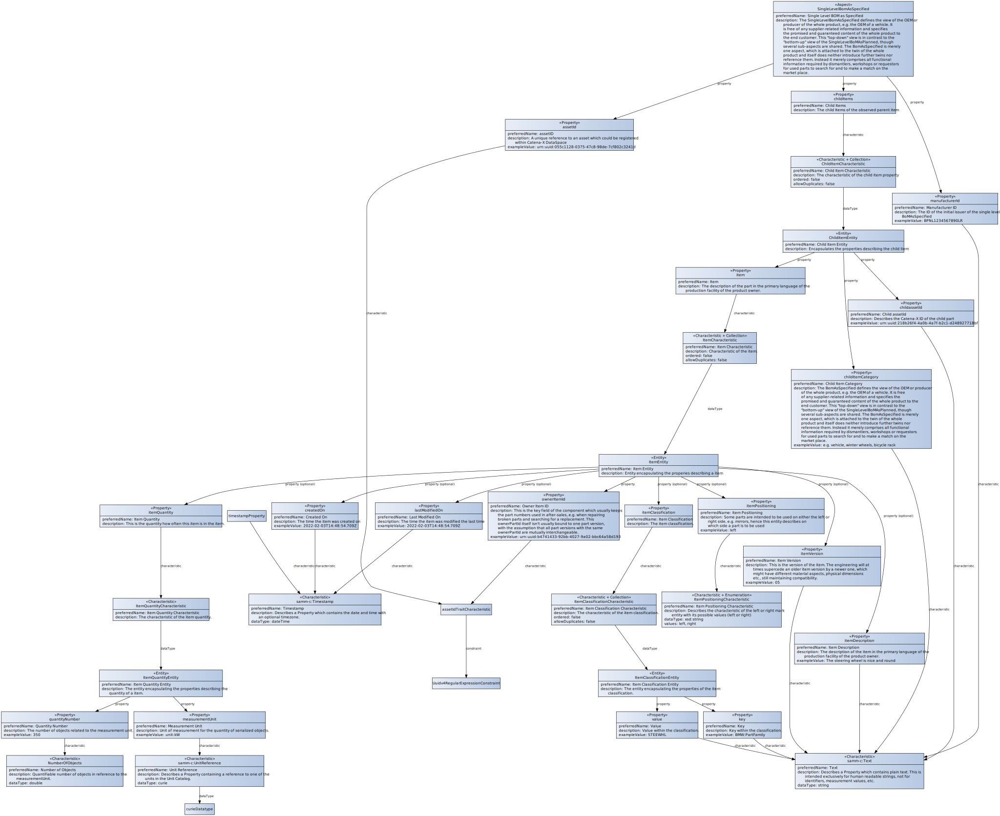

# CX-0030 Aspect Model BoM As Specified v2.0.0

## FOR WHOM IS THE STANDARD DESIGNED

## COMPARISON WITH THE PREVIOUS VERSION OF THE STANDARD

> *Relevant only for existing standards. At the new standard, please delete*

## ABSTRACT

A core problem of the circular economy is making the right decisions. These strategies include Rethink, Refuse, Reduce, Reuse, Refurbish, Redesign, Recycle, Recover and Rot.
In particular, the end of life (EoL) decisions are a challenge. In order for a circular economy to scale, however, these must be supported in a standardized way. The present data model is used for this purpose. This supports the products R-Strategy Assistant & Circularity Dashboard to provide decision support for its users. In this first scope, the model should support the EoL decisions in particular.
The data provided by the data provider allows relevant decisions to be derived. This leads to higher reuse and recycling rates, an economically and ecologically balanced decision-making process and a scaled circular economy.

## 1 INTRODUCTION

The SingleLevelBoMAsSpecified defines the view of the OEM or producer of the whole product, e.g. the OEM of a vehicle. It is free of any supplier-related information and specifies the promised and guaranteed content of the whole product to the end customer.
This “top-down” view contrasts with the “bottom-up” view of the SingleLevelBoMAsPlanned, though several sub-aspects are shared. The SingleLevelBoMAsSpecified is merely one aspect, which is attached to the twin of the whole product and itself does neither introduce further twins nor reference them. Instead, it merely comprises all functional information required by dismantlers, workshops, or requestors for used parts to search for and to make a match on the marketplace.

### 1.1 AUDIENCE & SCOPE

> *This section is non-normative*

- Data Provider / Consumer

The purpose of this document is the description of the Asset Administration Shell submodel bill of material (BoM) as specified. It defines the view of the producing company of the produced product. The presented data model is described and illustrated in the following with the entities and properties and their interrelationships.
This chapter serves to situate the given reference implementation, to outline its prerequisites and to point out its limitations.

### 1.2 CONTEXT AND ARCHITECTURE FIT

> *This section is non-normative*

There are several parties needing information about the product, be it dismantlers, workshops or the owners. With the aspect model "as Planned" there is already a model which contains interesting information for these groups. However, this model also reveals sensitive information about the manufacturer, for example supplier relationships. This creates a conflict between the need for information of the exploiting/using parties and the data sovereignty of the manufacturer. This conflict is solved by the given aspect model "BoMAsSpecified" by providing a top-down view of the product and its components. Together with the aspect model "PartAsSpecified", "BomAsSpecified" provides an abstraction layer for other Catena-X members to obtain relevant information about the product while protecting sensitive information of the manufacturer.

Standarts which are not required but may be interesting to the use case:

- [CX - 0032 Part As Specified](https://catena-x.net/de/standard-library)

### 1.3 CONFORMANCE AND PROOF OF CONFORMITY

> *This section is non-normative*

As well as sections marked as non-normative, all authoring guidelines, diagrams, examples, and notes
in this specification are non-normative. Everything else in this specification is normative.

The key words **MAY**, **MUST**, **MUST NOT**, **OPTIONAL**, **RECOMMENDED**, **REQUIRED**, **SHOULD**
and **SHOULD NOT** in this document document are to be interpreted as described in BCP 14 [RFC2119] [RFC8174]
when, and only when, they appear in all capitals, as shown here.

### 1.4 EXAMPLES

```json
{
  "manufacturerId": "BPNL1234567890LR",
  "assetId": "urn:uuid:055c1128-0375-47c8-98de-7cf802c3241d",
  "childItems": [
    {
      "childItemCategory": "e.g. vehicle, winter wheels, bicycle rack",
      "item": [
        {
          "itemClassification": [
            {
              "value": "STEEWHL",
              "key": "BMW:PartFamily"
            }
          ],
          "itemQuantity": {
            "quantityNumber": 350.0,
            "measurementUnit": "unit:kW"
          },
          "ownerItemId": "urn:uuid:b4741433-92bb-4027-9a02-bbc64a58d193",
          "itemVersion": "05",
          "itemDescription": "The steering wheel is nice and round",
          "createdOn": "2022-02-03T14:48:54.709Z",
          "itemPositioning": "left",
          "lastModifiedOn": "2022-02-03T14:48:54.709Z"
        }
      ],
      "childassetId": "urn:uuid:218b26f4-4a0b-4a7f-b2c1-d248927718bf "
    }
  ]
}
```

### 1.5 TERMINOLOGY

> *This section is non-normative*

The following terms are especially relevant for the understanding of the standard:

Business Partner Number (BPN)
: A BPN is the unique identifier of a partner within Catena-x

End of life vehicle (EoL vehicle)
: 'End-of life vehicle' means a vehicle which is waste within the meaning of Article 1(a) of Directive 75/442/EEC on waste (waste means any substance or object which the holder disposes of or is required to dispose of pursuant to the provisions of national law in force).

Original Equipment Manufacturer (OEM)
:An original equipment manufacturer (OEM) is generally perceived as a company that produces non-aftermarket parts and equipment that may be marketed by another manufacturer.

Bill of material (BOM)
:A bill of material is a list of the raw materials, sub-assemblies, intermediate assemblies, sub-components, parts, and the quantities of each needed to manufacture an end product.

Eclipse Dataspace Connector (EDC)
:The Eclipse Dataspace Connector provides a framework for sovereign, inter-organizational data exchange.

## 2 ASPECT MODEL "Single Level BoM As Specified"

> *This section is normative*

### 2.1 INTRODUCTION

The purpose of this document is the description of the Asset Administration Shell submodel SingleLevelBoMAsSpecified. It defines Bill of Material and all relevant attributes. The presented data model is described and illustrated in the following with the entities and properties and their interrelationships.

Every data provider **MUST** provide the data
conformant to the semantic model specified in this document.

The unique identifier of the semantic model specified in this document
**MUST** be used by the data provider to define the semantics of the data
being transferred.

Every certified business application using the Single Level BoM As Specified data **MUST**
be able to consume data conformant to the semantic model specified in
this document.

This semantic model **MUST** be made available in the central Semantic Hub.

Data consumers and data provider **MUST** comply with the license of the
semantic model.

In the Catena-X data space Single Level BoM As Specified data **MUST** be requested and
exchanged via Eclipse Dataspace Connector (EDC) conformant to [CX-0018](#31-normative-references)
and [CX-0002](#31-normative-references).

The JSON Payload of data providers MUST be conformant to the JSON Schema
as specified in this document.

### 2.2 SPECIFICATION ARTIFACTS

The modelling of the semantic model specified in this document was done in accordance to the "semantic driven workflow" to create a submodel template specification [SMT](#32-non-normative-references).

This aspect model is written in BAMM 2.0.0 as a modeling language conformant to CX-0003 as input for the semantic deriven workflow.

Like all Catena-X data models, this model is available in a machine-readable format on GitHub2F2F conformant to CX-0003.

### 2.3 LICENSE

This Catena-X data model is an outcome of Catena-X use case group Digital Product Pass (DPP).This Catena-X data model is made available under the terms of the Creative Commons Attribution 4.0 International (CC-BY-4.0) license, which is available at Creative Commons4F4F.

### 2.4 IDENTIFER OF SEMANTIC MODEL

The semantic model has the unique identifier:

```text
urn:samm:io.catenax.single_level_bom_as_specified:2.0.0##SingleLevelBomAsSpecified
```

This identifier MUST be used by the data provider to define the semantics of the data being transferred.

### 2.5 FORMATS OF SEMANTIC MODEL

All different formats of the semantic model can be found in the github repository.

- [https://github.com/eclipse-tractusx/sldt-semantic-models/tree/4d239fc5709f71f39c3cf13581b5bcf960905157/io.catenax.single_level_bom_as_specified/2.0.0](https://github.com/eclipse-tractusx/sldt-semantic-models/tree/4d239fc5709f71f39c3cf13581b5bcf960905157/io.catenax.single_level_bom_as_specified/2.0.0)

#### 2.5.1 RDF TURTLE

The rdf turtle file, an instance of the Semantic Aspect Meta Model, is the master for generating additional file formats and serializations.

- [https://github.com/eclipse-tractusx/sldt-semantic-models/blob/4d239fc5709f71f39c3cf13581b5bcf960905157/io.catenax.single_level_bom_as_specified/2.0.0/SingleLevelBomAsSpecified.ttl](https://github.com/eclipse-tractusx/sldt-semantic-models/blob/4d239fc5709f71f39c3cf13581b5bcf960905157/io.catenax.single_level_bom_as_specified/2.0.0/SingleLevelBomAsSpecified.ttl)

The open source command line tool of the Eclipse Semantic Modeling Framework is used for generation
of other file formats like for example a JSON Schema, aasx for Asset Administration Shell Submodel
Template or a HTML documentation.

- [https://github.com/eclipse-tractusx/sldt-semantic-models/tree/4d239fc5709f71f39c3cf13581b5bcf960905157/io.catenax.single_level_bom_as_specified/2.0.0/gen](https://github.com/eclipse-tractusx/sldt-semantic-models/tree/4d239fc5709f71f39c3cf13581b5bcf960905157/io.catenax.single_level_bom_as_specified/2.0.0/gen)

#### 2.5.2 JSON SCHEMA

A JSON Schema can be generated from the RDF Turtle file. The JSON Schema defines the Value-Only
payload of the Asset Administration Shell for the API operation "GetSubmodel".

- [https://github.com/eclipse-tractusx/sldt-semantic-models/blob/4d239fc5709f71f39c3cf13581b5bcf960905157/io.catenax.single_level_bom_as_specified/2.0.0/gen/SingleLevelBomAsSpecified.json](https://github.com/eclipse-tractusx/sldt-semantic-models/blob/4d239fc5709f71f39c3cf13581b5bcf960905157/io.catenax.single_level_bom_as_specified/2.0.0/gen/SingleLevelBomAsSpecified.json)

#### 2.5.3 AASX

An AASX file can be generated from the RDF Turtle file. The AASX file defines one of the requested
artifacts for a Submodel Template Specification conformant to \[[SMT](#32-non-normative-references)].

Note: As soon as the specification V3.0 of the Asset Administration Shell specfication is available
an update will be provided.

### 2.6 SEMANTIC MODEL

The data model is described in SAMM . A html documentation can be generated from the rdf turtle
file.

So far no .md documentation can be generated. So it is recommended to not

## 3 REFERENCES

### 3.1 NORMATIVE REFERENCES

- [CX-0003 BAMM Aspect Meta Model v1.0.2](https://catena-x.net/de/standard-library)
- [CX-0002 Digital Twins in Catena - X v2.0.0](https://catena-x.net/de/standard-library)
- [CX-0018 Sovereign Data Exchange (EDC) v2.0.1](https://catena-x.net/de/standard-library)

### 3.2 NON-NORMATIVE REFERENCES

> *This section is non-normative*

```text
    [Optional] – Links to further documentation that may help to understand the
    standard but isn’t relevant for conformity assessment
```

[SMT] How to create a submodel template specification. Guideline. Download from: [https://industrialdigitaltwin.org/wp-content/uploads/2022/12/I40-IDTA-WS-Process-How-to-write-a-SMT-FINAL-.pdf](https://industrialdigitaltwin.org/wp-content/uploads/2022/12/I40-IDTA-WS-Process-How-to-write-a-SMT-FINAL-.pdf)

### 3.3 REFERENCE IMPLEMENTATIONS

> *This section is non-normative*

## ANNEXES

### FIGURES

> *This section is non-normative*


### TABLES

> *This section is non-normative*

## Legal

Copyright © 2024 Catena-X Automotive Network e.V. All rights reserved. For more information, please visit [here](/copyright).
