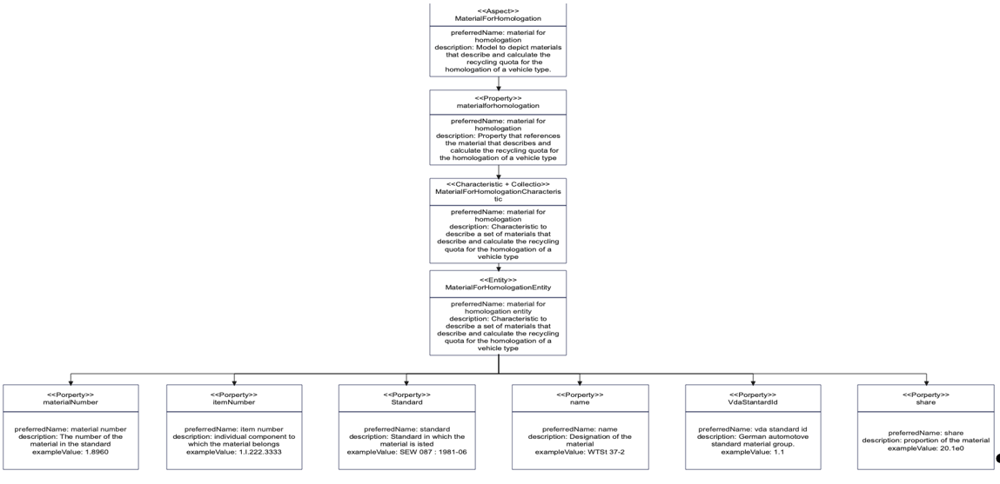

# CX-0031 Data Model: Material For Homologation v1.1.1

## ABSTRACT

The data model Material for Homologation describes the naming and classification of a material to be used in a RRR calculation according to [ISO 2262](#3-references). The values represent the material name, the standard that the material complies with and their respective VDA group according [VDA 231-106](#3-references).
The [VDA 231-106](#3-references)classification enables a reliable RRR calculation as each VDA group is is related to an [ISO 2262](#3-references) group.

## 1. INTRODUCTION

This document describes one semantic model used in the Catena-X network.

### 1.1 AUDIENCE & SCOPE

> *This section is non-normative*

The standard is relevant for the following roles:

- Data Provider / Consumer
- Business Application Provider
- Enablement Service Provider

### 1.2 CONTEXT

> *This section is non-normative*

The standard “materialforhomologation” is meant as an enhancement for the material information of a vehicle and its components.  As soon as it comes to the calculation of RRR quotas according RRR-Directive 2005/64/EC in combination with [ISO 22628](#3-references) it is necessary to assigned materials of vehicle to an ISO group mentioned in [ISO 22628](#3-references). To achieve this it is required to use specific standards to be able to identify materials in a reliable way. The standard “materialforhomologation” enables this.

### 1.3 CONFORMANCE

As well as sections marked as non-normative, all authoring guidelines, diagrams,
examples, and notes in this specification are non-normative. Everything else in
this specification is normative.

The key words **MAY**, **MUST**, **MUST NOT**, **OPTIONAL**, **RECOMMENDED**,
**REQUIRED**, **SHOULD** and **SHOULD NOT** in this document document are to be
interpreted as described in BCP 14 [RFC2119] [RFC8174] when, and only when, they
appear in all capitals, as shown here.

### 1.4 PROOF OF CONFORMITY

> *This section is non-normative*

All participants and their solutions will need to prove, that they are conform with the Catena-X standards. To validate that the standards are applied correctly, Catena-X employs Conformity Assessment Bodies (CABs).

- To proof conformity with the materialforhomologation Semantic Model Standard check your json file against the json schema.
- Every data provider of materialforhomologation data MUST provide the data conformant to the semantic model specified in this document.
- The unique identifier of the semantic model specified in this document MUST be used by the data provider to define the semantics of the data being transferred.
- Every certified business application relying on materialforhomologation data MUST be able to consume data conformant to the semantic model specified in this document.
- This semantic model MUST be made available in the central Semantic Hub.

The proof of conformity for a single semantic model is done according to the general rules for proving the conformity of data provided to a semantic model or the ability to consume the corresponding data.  

### 1.5 EXAMPLES

```json
{"materialForHomologation":
[{"vdaStandardId":{"mainGroup":"1","subgroup":"1.1"},
    "name":"WTSt 37-2",
    "standard":"SEW 087 : 1981-06",
    "itemNumber":"1.l.222.3333",
    "share":20.1,
    "materialNumber":"1.8960"}
```

### 1.6 TERMINOLOGY

> *This section is non-normative*

**vdaStandardID:**
The standard [ISO 2262](#3-references) assigns materials into specific groups like Metals, fluids, etc…. The VDA recommendation [VDA 231-106](#3-references) uses similar but more granular groups. vdaStandardID represents the [VDA 231-106](#3-references) group for each specific material.

**name:**
The name of the material as named by the manufacturer of this material.
The data type is string.

**Standard:**
The material classification usually follows a specific standard like SEW 087 for steel applicatons.
The data type is string.

**materialNumber:**
The material number represents the naming or identification number of the material according to the mentioned standard in the field “standard”.
The data type is string.

**itemNumber:**
The item number represents part number or identification number of the respective part.
The data type is string.

**share:**
The share represents the share of the mentioned material in relation to the component.
The data type is double.

**Aspect Model:**
A formal, machine-readable semantic description (expressed with RDF/turtle) of data accessible from an Aspect.

Additional terminology used in this standard can be looked up in the glossary on
the association homepage.

: Note 1 to entry: An Aspect Model must adhere to the Semantic Aspect Meta Model (SAMM), i.e., it utilizes elements and relations defined in the Semantic Aspect Meta Model and is compliant to the validity rules defined by the Semantic Aspect Meta Model.  
  
: Note 2 to entry: Aspect model are logical data models which can be used to detail a conceptual model in order to describe the semantics of runtime data related to a concept. Further, elements of an Aspect model can/should refer to terms of a standardized Business Glossary (if existing).

Additional terminology used in this standard can be looked up in the glossary on the association homepage.

## 2 ASPECT MODEL “MATERIALFORHOMOLOGATION”

### 2.1 INTRODUCTION

The aspect model material for homologation assigns materials clearly to material groups that are used to calculate a reliable RRR-calculation according to RRR Directice 2005/64/EC in combination with [ISO 2262](#3-references).

### 2.2 SPECIFICATION ARTIFACTS

The modeling of the semantic model specified in this document was done in accordance to the "semantic driven workflow" to create a submodel template specification [SMT](#32-non-normative-references).

This aspect model is written in SAMM 2.0.0 as a modeling language conformant to CX-0003
as input for the semantic deriven workflow.

Like all Catena-X data models, this model is available in a machine-readable format on GitHub
conformant to CX-0003.

### 2.3 LICENSE

This Catena-X data model is an outcome of Catena-X use case group R-Strategy Assistant.
This Catena-X data model is made available under the terms of the Creative Commons Attribution
4.0 International (CC-BY-4.0) license, which is available at Creative Commons4F4F.

### 2.4 IDENTIFER OF SEMANTIC MODEL

The semantic model has the unique identifier:

```text
    urn_bamm_io.catenax.material_for_homologation_1.0.0
```

This identifier MUST be used by the data provider to define the semantics of the data being transferred.

### 2.5 FORMATS OF SEMANTIC MODEL

#### 2.5.1 RDF Turtle

The rdf turtle file, an instance of the Semantic Aspect Meta Model, is the master for generating additional file formats and serializations.
 The corresponding TTL-file for the aspect model can be accessed via the following link [MaterialforHomologation](https://github.com/eclipse-tractusx/sldt-semantic-models/blob/main/io.catenax.material_for_homologation/1.0.0/MaterialForHomologation.ttl)

Please note that the linked version contains the semantic model’s latest version at the time of publication of this standard. However, it is possible that minor functional adjustments (noticeable by increments of the middle number of the version number: 1.0.0) or bug fixes - downward compatible - (noticeable by increments of the last number of the version number: 1.0.X) have been added in the meantime. Such updated or adjusted versions are not explicitly linked, as they do not require a new standardization document and were not available at the time of the publication of this standard. Accordingly, it is recommended to look for the updated semantic model in eclipse-tractusx/sldt-semantic-models repository and to use the updated version instead, as it brings important bug fixes or even additional functionalities.

The open source command line tool of the Eclipse Semantic Modeling Framework  is used for generation
of other file formats like for example a JSON Schema, aasx for Asset Administration Shell Submodel
Template or a HTML documentation.

#### 2.5.2 JSON Schema

A JSON Schema can be generated from the RDF Turtle file. The JSON Schema defines the Value-Only
payload of the Asset Administration Shell for the API operation "GetSubmodel".

```json
{
    "$schema": "http://json-schema.org/draft-04/schema",
    "type": "object",
    "components": {
        "schemas": {
            "urn_bamm_io.catenax.material_for_homologation_1.0.0_ItemNumber1Trait": {
                "type": "string",
                "maxLength": 200
            },
            "urn_bamm_io.catenax.material_for_homologation_1.0.0_ShareCharacteristic": {
                "type": "number"
            },
            "urn_bamm_io.catenax.material_for_homologation_1.0.0_MainGroupTrait1": {
                "type": "string",
                "maxLength": 2
            },
            "urn_bamm_io.catenax.material_for_homologation_1.0.0_SubgroupTrait1": {
                "type": "string",
                "maxLength": 3
            },
            "urn_bamm_io.catenax.material_for_homologation_1.0.0_VDAStandardIdCharacteristic": {
                "type": "object",
                "properties": {
                    "mainGroup": {
                        "$ref": "#/components/schemas/urn_bamm_io.catenax.material_for_homologation_1.0.0_MainGroupTrait1"
                    },
                    "subgroup": {
                        "$ref": "#/components/schemas/urn_bamm_io.catenax.material_for_homologation_1.0.0_SubgroupTrait1"
                    }
                },
                "required": [
                    "mainGroup",
                    "subgroup"
                ]
            },
            "urn_bamm_io.catenax.material_for_homologation_1.0.0_NameTrait1": {
                "type": "string",
                "maxLength": 50
            },
            "urn_bamm_io.catenax.material_for_homologation_1.0.0_StandardTrait1": {
                "type": "string",
                "maxLength": 20
            },
            "urn_bamm_io.catenax.material_for_homologation_1.0.0_MaterialNumberTrait1": {
                "type": "string",
                "maxLength": 20
            },
            "urn_bamm_io.catenax.material_for_homologation_1.0.0_MaterialForHomologationEntity": {
                "type": "object",
                "properties": {
                    "itemNumber": {
                        "$ref": "#/components/schemas/urn_bamm_io.catenax.material_for_homologation_1.0.0_ItemNumber1Trait"
                    },
                    "share": {
                        "$ref": "#/components/schemas/urn_bamm_io.catenax.material_for_homologation_1.0.0_ShareCharacteristic"
                    },
                    "vdaStandardId": {
                        "$ref": "#/components/schemas/urn_bamm_io.catenax.material_for_homologation_1.0.0_VDAStandardIdCharacteristic"
                    },
                    "name": {
                        "$ref": "#/components/schemas/urn_bamm_io.catenax.material_for_homologation_1.0.0_NameTrait1"
                    },
                    "standard": {
                        "$ref": "#/components/schemas/urn_bamm_io.catenax.material_for_homologation_1.0.0_StandardTrait1"
                    },
                    "materialNumber": {
                        "$ref": "#/components/schemas/urn_bamm_io.catenax.material_for_homologation_1.0.0_MaterialNumberTrait1"
                    }
                },
                "required": [
                    "itemNumber",
                    "share",
                    "vdaStandardId",
                    "name",
                    "standard",
                    "materialNumber"
                ]
            },
            "urn_bamm_io.catenax.material_for_homologation_1.0.0_MaterialForHomologationCharacteristic": {
                "type": "array",
                "items": {
                    "$ref": "#/components/schemas/urn_bamm_io.catenax.material_for_homologation_1.0.0_MaterialForHomologationEntity"
                },
                "uniqueItems": true
            }
        }
    },
    "properties": {
        "materialForHomologation": {
            "$ref": "#/components/schemas/urn_bamm_io.catenax.material_for_homologation_1.0.0_MaterialForHomologationCharacteristic"
        }
    },
    "required": [
        "materialForHomologation"
    ]
}
```

#### 2.5.3 aasx

An AASX file can be generated from the RDF Turtle file. The AASX file defines one of the requested
artifacts for a Submodel Template Specification conformant to \[[SMT](#32-non-normative-references)].

Note: As soon as the specification V3.0 of the Asset Administration Shell specfication is available
an update will be provided.

## 3 REFERENCES

### 3.1 NORMATIVE REFERENCES

[CX-0002 Digital Twins in Catena-X V1.0.1](https://catena-x.net/de/standard-library)

[CX-0003 Semantic Aspect Meta Model V1.0.2](https://catena-x.net/de/standard-library)

[CX-0004 Governance Process for Semantic Models V1.0.1](https://catena-x.net/de/standard-library)

[CX-0018 Eclipse Data Space Connector V1.0.1](https://catena-x.net/de/standard-library)

[CX-0001 EDC Discovery API, Version 1.0.1](https://catena-x.net/de/standard-library)

[ISO 22628 RRR-Calculation](https://www.iso.org/standard/35061.html)

[VDA 231-106](https://webshop.vda.de/VDA/de/vda-231-106-102021)

### 3.2 NON-NORMATIVE REFERENCES

> *This section is non-normative*

[SMT](https://industrialdigitaltwin.org/wp-content/uploads/2022/12/I40-IDTA-WS-Process-How-to-write-a-SMT-FINAL-.pdf) How to create a submodel template specification. Guideline.

### 3.3 REFERENCE IMPLEMENTATIONS

> *This section is non-normative*

## ANNEXES

### FIGURES

> *This section is non-normative*



### TABLES

> *This section is non-normative*
