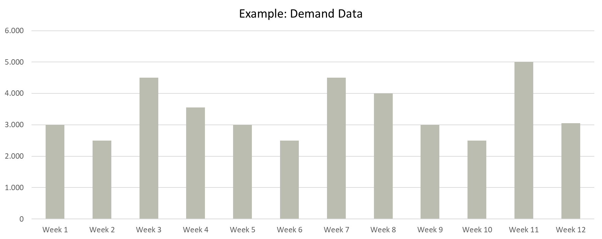
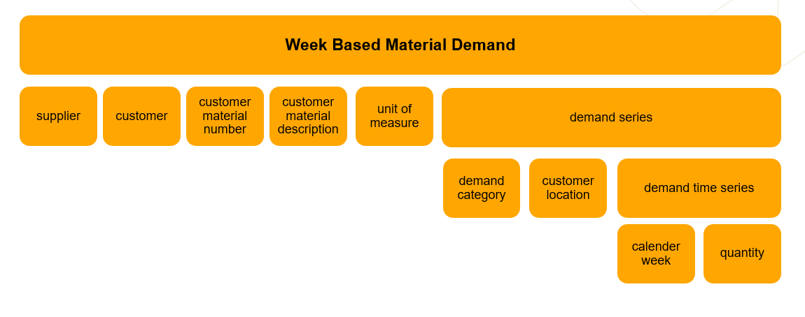
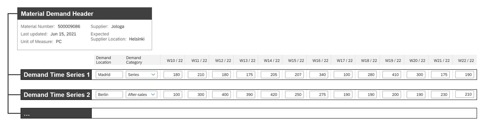
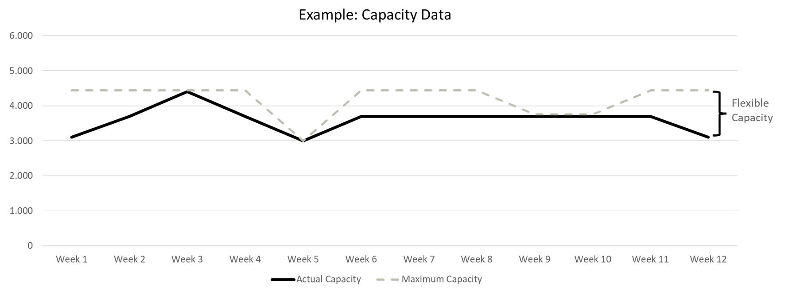
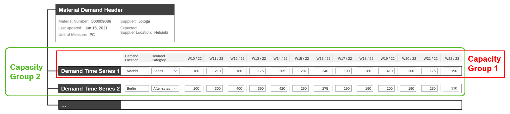
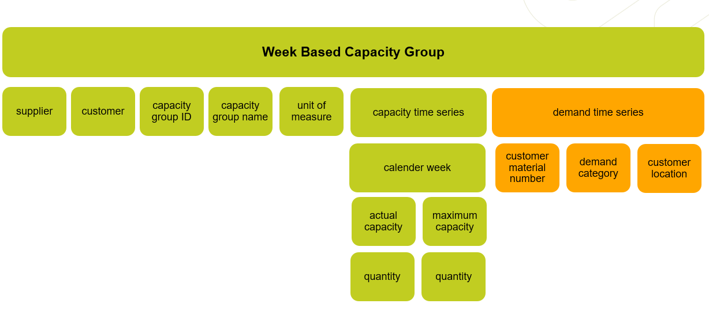
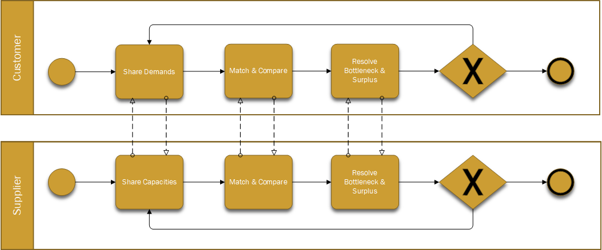
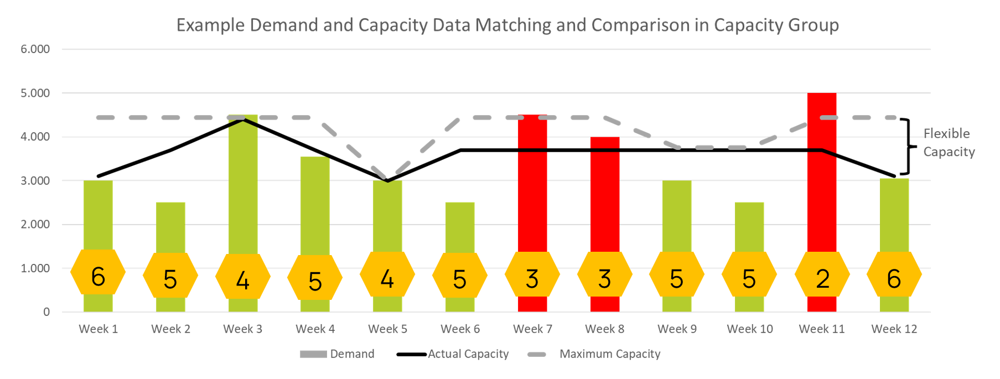
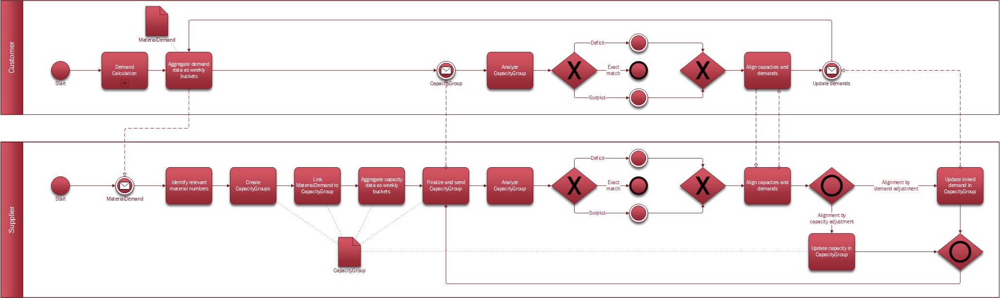

# CX-0046 Demand and Capacity Management Process and Core Business Logic v1.0.0

## DISCLAIMER REGARDING DEMAND AND CAPACITY MANAGEMENT DATA EXCHANGE

This document describes and standardizes certain data exchange business processes, data models
and/or APIs in connection with cross-company demand and capacity management (DCM) based on the
Catena-X data ecosystem. Nothing in this document is meant to determine the contractual terms and
conditions for the purchase, supply, delivery or licensing of any products or services among the
participants of the DCM data exchange. These terms and conditions are separately negotiated and
agreed among suppliers and customers in individual purchase, supply or license agreements.
In case of any inconsistencies with the content of this document, the provisions of individual
agreements among the participants shall prevail over the content of this document.

## ABSTRACT

Resilience has become an imperative within Supply Chain Management especially over the past years.
Disruptions of global Supply Chains in terms of material availability but also from logistics
perspective during the SARS-CoV-2 crisis showed the need for additional countermeasures and
technologies with regards to resiliency. Inside the volatile and highly complex surrounding of the
automotive industry, several interfaces of individual IT-solutions exist inside and between the
multiple players along the value chain. There is no common understanding of the process established
across all the partners. Demand and Capacity Management (DCM) focuses on the exchange of demand and
capacity data between a customer and a supplier.

The purpose of this document is to outline a common understanding of relevant processes and data for
a one-to-one business relationship in the context of DCM and prepare a baseline for a more efficient
and proactive collaboration.

Companies need this common understanding to enable an exchange of the related data across different
business partners and their systems.

This document is meant to describe the data exchange and a common core business logic to interpret
them, thereby following the same approach for all partners involved in the DCM process.

The core business logic MUST be implemented in applications participating in the process and
enabling the exchange of data between the partners involved in DCM.

## 1. INTRODUCTION

### 1.1 AUDIENCE & SCOPE

> *This section is non-normative*

This document addresses the following actors:

- Data Provider / Consumer
- Business Application Provider

For a better understanding of the roles and responsibility of each actor, please refer to chapter
[2.2](#22-actors-and-roles)

The following regulations are in scope of the standard description:

All actors (Data Providers, Data Consumer, Business Application Providers) MUST follow Catena-X
standards with regards to:

| Number | **Standard** |
| --- | --- |
| [CX-0001](#31-normative-references) | EDC Discovery API, Version 1.0.1 (see chapter [2.8](#28-edc-policies)) |
| [CX-0003](#31-normative-references) | SAMM Aspect Meta Model, Version 1.0.1 |
| [CX-0006](#31-normative-references) | Registration and initial onboarding, Version 1.1.1 |
| [CX-0010](#31-normative-references) | Business Partner Number (BPN), Version 1.0.1 |
| [CX-0015](#31-normative-references) | IAM & Access Control Paradigm, Version 1.0.1 |
| [CX-0047](#31-normative-references) | Demand and Capacity Management Data Models, Version 1.0.0 |
| [CX-0048](#31-normative-references) | Demand and Capacity Management APIs, Version 1.0.0 |

To run the DCM process, customers and suppliers depend on accurate planning capabilities, as well as
the ability to quickly adapt to changes.

Standardization of data and methods in DCM means that data consumers, data providers or business
application providers MUST adopt a consistent core business logic to enable an interoperable data
exchange.

This document refers to a direct one-to-one business relationship between two parties (customer &
supplier). Further relationships and collaboration in an extended supply chain and/or a network will
be part of future standardization packages.

DCM focuses on a tactical future horizon where demand and capacities can be managed (for details
refer to chapter [2.5](#25-provisioning-demand-data-to-supplier)).

How customers or suppliers calculate their respective demand or capacity data is excluded from this
standardization. Derivation of measures in the respective companies is excluded, too.

Visuals/pictures as well as actors and their roles are used to exemplify concepts or processes and
are not intended for mandatory use.

### 1.2 CONTEXT

> *This section is non-normative*

DCM is a critical aspect of Supply Chain Management, as it impacts the ability of suppliers to meet
customers' demand while controlling costs. Effective DCM requires a balance between forecasting
demand, optimizing production capacity and managing inventory levels to quickly adapt to changes.

The core business logic described in this document enables companies to share data in a sovereign
way as well as to utilize a common process understanding, ensuring interoperability and enabling the
involved parties to achieve the following goals:

- early identification of upcoming potential bottlenecks, as well as surplus capacity
- better monitoring and control of resources and facilities
- collaboration and decision-making between supplier and customer in order to resolve bottleneck or
  surplus situations
- enabling automation of processes
- improvement of efficiency and accuracy

### 1.3 ARCHITECTURE OVERVIEW

> *This section is non-normative*

Not applicable.

### 1.4 CONFORMANCE

As well as sections marked as non-normative, all authoring guidelines, diagrams, examples, and notes
in this specification are non-normative. Everything else in this specification is normative.

The key words **MAY**, **MUST**, **MUST NOT**, **OPTIONAL**, **RECOMMENDED**, **REQUIRED**,
**SHOULD** and **SHOULD NOT** in this document document are to be interpreted as described in BCP 14
[RFC2119] [RFC8174] when, and only when, they appear in all capitals, as shown here.

### 1.5 PROOF OF CONFORMITY

> *This section is non-normative*

All participants and their solutions will need to proof, that they are conform with the Catena-X
standards. To validate that the standards are applied correctly, Catena-X employs Conformity
Assessment Bodies (CABs). Please refer to: *[!LINK Conformity Assessment]* for the process of
conformity assessment and certification.

Any actor participating in the Catena-X DCM use case, MUST implement and follow the following
standards:

- The DCM core business logic – described in this standard
- The DCM standardized API – described in the \[[CX-0048](#31-normative-references)] standard
- The DCM standardized Data Models – described in the \[[CX-0047](#31-normative-references)]
  standard

Please be aware that dependent on the process step, different (sub-) standards may be relevant. For
instance, when exchanging material demands information, only the standard API MaterialDemand as well
as the standardized data model for `WeekBasedMaterialDemand` are relevant.

In case of exchange of capacity information, the same logic is relevant (I.e. only the standard API
for CapacityGroup as well as the standardized data model for `WeekBasedCapacityGroup` MUST be used).

### 1.6 EXAMPLES

Any **application provider** that develops DCM solutions has to grant the fulfillment of these
requirements:

- The solution has been designed to specify requirements for a trusted usage environment (e.g.
  identity verification and /or verification process),
- The solution is designed to require a contractual agreement in compliance with antitrust
  requirements in the usage environment (e.g. data contracts as a prerequisite for carrying out a
  data exchange). For reference see Chapter [2.8](#28-edc-policies) and follow EDC guidelines in
  \[[CX-0018](#31-normative-references)]. Both customer and supplier agreed upfront to share data
  related to DCM.
- The solution has been designed to limit visibility and/or access to concrete data content as much
  as possible (e.g. data offer does not yet allow data access).
- The solution has been designed to require the implementation of notice and/or acknowledgement
  concepts to raise awareness of antitrust issues during use (e.g. helpdesk or pop-up info).
- The solution has been designed to ensure traceability/reconstructability of processes through
  appropriate documentation and at the same time data sovereignty over concrete data content (e.g.
  through access, deletion or destination rights).

Any **customer and supplier in the DCM process** (I.e. data provider and/or data consumer) MUST
fulfil following requirements:

- Each application enabling and/or participating in the exchange of data as part of the damand and
  capacity management process MUST implement the core business logic defined in [Chapter 2](#2-main-content).
- Standardization of data and methods in DCM means that data consumers, data providers or business
  application providers MUST adopt a consistent core business logic as defined in [Chapter 2](#2-main-content)
  to enable an interoperable data exchange.
- Customer and supplier are in a contractual relationship with each other and agree to share data
  related to DCM
- Access authorization to a DCM solution and to its related data will be self-managed by the customer
  and supplier companies themselves.
- Customer and supplier MUST be technically able to apply these EDC policies in order to enable a
  secure collaborative data exchange
- Customer and supplier MUST follow the antitrust requirements
- Customer and supplier MUST agree on a common unit of measure (see [Table 1](#tables) in
  [ANNEXES](#annexes)) defined at product level to be used for data exchange purposes (e.g. demand &
  capacities)
- Both parties are technically able to participate within the DCM process.
- The supplier MUST be able to receive the material demand from the customer.
- The customer owns and MUST publish its own demand with its supplier for the future horizon and it
  is highly RECOMMENDED to avoid any gaps as far as possible and to share demand data at least till
  month 9, to ensure DCM participants to have also sufficient demand data to work with.
- Demand quantities refer to a period of one calendar week (weekly buckets)
- Demands MUST be considered that are not yet fixed, but related to "opportunities" (e.g. projects)
  that will realistically materialize as single-orders
- Demand data & quantities MUST refer to one of the categories defined in the table in chapter
  [2.5.1](#251-detailed-description-of-demand) of this document
- Demand MUST be consistent with other exchanged data, e.g. call-offs/scheduling agreements
- Material demands data MUST be updated and provided to supplier, whenever changes apply
- The supplier owns and MUST publish capacity data to the customer, referring to material demand
  data shared
- Capacity information MUST be used as follows:
  - the **"actual capacity"** is the planned available capacity of a supplier
  - and the **"maximum capacity**" is the maximum releasable capacity of a supplier (it MAY be equal
    or MAY be larger than the "actual capacity" but MUST NOT be smaller than actual capacity)
  - When the maximum capacity is larger than the "actual capacity", the difference is called
    **"flexible capacity".**
- The customer MUST be able to receive the capacity group incl. the capacity information.
- The supplier that uses the capacity group MUST link at least one material demand information to
  it, however often several material demand information are linked. This builds up the foundation to
  reflect the corresponding capacity situation of the supplier.
- The aspect model `WeekBasedCapacityGroup` MUST be used by a supplier to provide capacity
  information to the customer.
- Based on the aspect model `WeekBasedCapacityGroup` and `WeekBasedMaterialDemand`, both supplier and
  customer MUST apply the matching logic defined in [Chapter 2.7](#27-comparison-of-demand-and-capacity-data-within-a-capacity-group)
  to ensure a common interpretation of the data.
- Business application provider, data provider or data consumer MUST enable their DCM system to
  recognize the matching situation based on the table below and MUST be able to interpret the
  matching result accordingly.

### 1.7 TERMINOLOGY

> *This section is non-normative*

| **Term** | **Description** |
| --- | --- |
| **Capacity** | 1) The capability of a system to perform its expected function. 2) The capability of a worker, machine, work center, plant, or organization to produce output per time period. (Source: ASCM Supply Chain Dictionary, 17th edition) |
| **Capacity Group** | The capacity group is the functional entity where material demand and capacity information are matched and compared for the purpose of a collaborative DCM.When the term is written as one word (`WeekBasedCapacityGroup`), the term refers specifically to the respective aspect model. |
| **Actual Capacity** | is the planned available capacity of a supplier, which should be approximately realistic to achieve a material output per calendar week with a certain unit of measurement for one customer. The actual capacity is based on the supplier's assessment of its own capabilities and/or inventories as well as known commitments. |
| **Maximum Capacity** | Is the maximum releasable capacity of a supplier which SHOULD be possible to achieve a material output per calendar week with a certain unit of measurement for one customer. The maximum capacity is based on temporary, capacity-increasing measures, agreed by the parties involved. Capacity-increasing measures can be, for example, a longer utilization of the available production resources, a shift extension or additional shifts. Secondarily, additional resources can also be activated. |
| **Supplier Flex Capacity** | Supplier Flex Capacity = Difference/Area between maximum capacity and actual capacity.Available flex capacity is indicated if the actual capacity still below the maximum capacity. Flex Capacity describes the remaining ability to apply capacity-increasing measures that needs no additionally agreement upon the parties involved. In particular, measures to extend the weekly utilization of the available production resources come into question. |
| **Calendar Week** | A calendar week refers to all 7 days of a week. The counting of the calendar week within a year is based on the Thursday and starts at one ("1") with the week whose Thursday is first in the current year. Example: Week 1 of 2026 = Mon: 29 December 2025, Thu: 01.01.2026, Sun: 4.1.2026. |
| **(Material) demand** | A need for a particular product or component. The demand could come from any number of sources (e.g., a customer order or forecast, an interplant requirement, a branch warehouse request for a service part, or the manufacturing of another product). At the finished goods level, demand data is usually different from sales data because demand does not necessarily result in sales (i.e., If there is no stock, there will be no sale (Source: ASCM Supply Chain Dictionary, 17th edition).Material demand may comprise multiple demand time series by location and demand categories.When the term is written as one word (`WeekBasedMaterialDemand`), the term refers specifically to the respective aspect model. |
| **Bottleneck** | A facility, function, department, or resource whose capacity is less than the demand placed upon it. For example, a bottleneck machine or work center exists where jobs are processed at a slower rate than they are demanded (Source: ASCM Supply Chain Dictionary, 17th edition) |
| **Surplus (capacity)** | A situation in which an oversupply exists (Source: ASCM Supply Chain Dictionary, 17th edition). For example, a machine or work center exists where jobs could be processed, but demand does not require them. |

Additional terminology used in this standard can be looked up in the glossary on the association
homepage.

## 2 MAIN CONTENT

> *This section is normative*

### 2.1 Contextual Description

The DCM process REQUIRES the following fundamental steps:

- Material demands made available by a customer
- Capacities made available by a supplier
- Capacity groups created as an entity, where material demands and capacities are matched and
  compared
- A business application that supports the fundamental steps above mentioned

The data required to run these steps MUST be always up-to-date and shared among involved partners in
a direct business relationship (customers and suppliers) in order to enable a comparison process and
start the collaborative approach, in case of need – for details see Chapter
[2.7](#27-comparison-of-demand-and-capacity-data-within-a-capacity-group)

### 2.2 Actors and Roles

The DCM core business logic considers three general actors: the customer, the supplier and the
business application provider. Please be aware, that an individual business partner may have several
direct one-to-one business relationships in which he will act in different roles. For instance, in
one to one business relationship the business partner may act in the role of a customer of his
suppliers. In a different business relationship, he may act as a supplier to his customers. All
actors might have different role titles, depending on their respective organizational structures.
However, all have specific responsibilities and requirements:

| **Actors** | **Description** |
| --- | --- |
| **Customer** | is a business partner that provides a demand forecast to and receives goods from his supplier. As such, a customer is responsible for providing consistent and up-to-date demand and this role is also a data consumer in regard to capacity data. |
| **Supplier** | is a business partner that supplies goods to a customer. As such, a supplier is responsible for providing consistent and up-to-date capacity and this role is also a data consumer in regard to demand data. |
| **Business application provider** | is a party that provides and operates an application / tool which enables demand and capacity management and follows the core business logic and other standards as described in this document. |

Examples of typically impacted roles on **customer** side are:

- Demand Planner
- Supplier Capacity Manager
- Logistic Planner/Manager
- Buyer

Examples of typically impacted roles on **supplier** side are:

- Production / Supply Planner
- Demand Planner
- Product Manager
- Sales Manager/Customer Service

Examples of typically impacted roles on **business application provider** side are:

- Solution / Product Manager
- Developer
- System Architect
- Operations Manager / Responsible
- Support Engineer

### 2.3 Process Representation

*Figure 1: Process Chart DCM*

Process details can be retrieved in Annex [Figures](#figures).

### 2.4 Prerequisites for a Collaborative Demand and Capacity Management

The following functional prerequisites MUST be met before starting data exchange:

- Customer and supplier are registered in the Catena-X network and follow the Catena-X guidelines
- Customer and supplier are in a contractual relationship with each other. Among other things, they
  MUST agree on a common unit of measure (see Annex [Tables](#tables)) defined at product level to
  be used for data exchange purposes (e.g. demand & capacities)
- Both parties are technically able to participate within the DCM process with their respective
  business application

Based on these prerequisites, the exchange of demand and capacity data is enabled.

### 2.5 Provisioning Demand Data to Supplier

#### 2.5.1 Detailed Description of Demand

A customer provides demand data and respective changes to the supplier, who is responsible for
producing/manufacturing and delivering the material to the customer. Thereby, the customer is acting
as a data provider and the supplier as a data consumer of the exchanged material demand.

The supplier MUST be able to receive the material demand from the customer.

A demand reflects the need for a particular product or part or component for a certain period of
time.

The customer owns and MUST publish its own demand with its supplier for the future horizon and it is
highly RECOMMENDED to avoid any gaps as far as possible and to share demand data at least till month
9, to ensure DCM participants to have also sufficient demand data to work with.

If more demand data is available (i.e. demand related to a horizon that spans beyond month 9), the
customer MAY ideally provide them until month 24. If a customer has even more demand data available
(i.e. demand related to a horizon that spans beyond month 24), he MAY also provide this to his
supplier.

The data series MAY start already from week *n+2*.

Although the data series MAY start already from week *n+2* and can be elaborated from a technical
perspective, the DCM process have a clear focus on the tactical mid- to long-term horizon (typically
considered from month 4 to 24) to enable a more resilient supply chain.

For further technical details refer to chapter "2.2.2 Data Exchange" of the API standard \[[CX-0048](#31-normative-references)]

CustomersMUST follow the below mentioned guidelines (to be applied along the entire Supply Chain) to
deliver real demand data with high qualityand enable an efficient demand vs. capacity comparison:

- Demand quantities MUST refer to a period of one calendar week (weekly buckets)
- Demands MUST be considered that are not yet fixed, but related to "opportunities" (e.g. projects)
  that will realistically materialize as single-orders

Figure 2: Visualized example for Demand Data*

- Demand data & quantities MUST refer to one of the categories defined in the following table:

| **Demand Category** | **Description** | **Demand Category Code**** (Based on Data Model)** |
| --- | --- | --- |
| Default | No Assignment | 0001 |
| After-Sales | After sales demand of spare parts | A1S1 |
| Series | Dependent demand e.g. production, assembly, raw material | SR99 |
| Phase-In-period | Ramp up of a new product or new material introduction | PI01 |
| Single-Order | Demand outside the normal spectrum of supply | OS01 |
| Small series | Short time frame for demand and pose to higher volatility | OI01 |
| Extraordinary demand | Temporary demand on top of standard demand | ED01 |
| Phase-Out-period | Ramp down. Product or material retires from the market. | PO01 |

- Demand MUST be consistent with other exchanged data e.g. call-offs/scheduling agreements
- Material demands data MUST be updated and provided to supplier, whenever changes apply

For technical details for implementing these demand categories refer to \[[CX-0047](#31-normative-references)].

Further guidelines MAY apply:

- Updating of demand data SHOULD be carried out at least once a month at a certain date or point in
  time during the month
- Unnecessary demand fluctuation SHOULD be avoided or limited, because a stable demand plan enables
  better capacity planning

#### 2.5.2 Material Demand Structure

A material demand data set consists of information about the material itself and the related
customer vs. supplier relationship and more detailed information about the requested quantities per
time period (demand series).

The picture below illustrates the material demand structure in a simplified way:

*Figure 3: Simplified Material Demand Structure*

For further details refer to the semantic model standard document CX-0047 DCM Data Model
MaterialDemand & CapacityGroup.

In the next picture it is exemplified how the different material demand information MAY be
visualized, whereas the data can be differentiated between **"header data"** and **"time series
data"** :

*Figure 4: Visualized example of a material demand structure*

#### 2.5.3 Data Model Week Based Material Demand

For a detailed description of the material demand attributes and material demand series, please
refer to the \[[CX-0047](#31-normative-references)] and \[[CX-0048](#31-normative-references)] standards.

### 2.6 Provisioning Capacity Data to Customer

#### 2.6.1 Detailed Description of Capacity Data

The supplier MUST publish capacity data to the customer, referring to material demand data shared.
Thereby, the supplier is acting as a data provider and the customer as a data consumer of the
exchanged capacity group.

The customer MUST be able to receive the capacity group incl. the capacity information.

Capacity information MUST be used as follows:

- the **"actual capacity"** is the planned available capacity of a supplier
- and the **"maximum capacity**" is the maximum releasable capacity of a supplier (it MAY be equal
  or MAY be larger than the "actual capacity" but MUST NOT be smaller than actual capacity)
- When the maximum capacity is larger than the "actual capacity", the difference is called
  **"flexible capacity".**

For further technical details refer to chapter "3.2.2 Data Exchange" of the API standard \[[CX-0048](#31-normative-references)].

For a detailed description of these capacity definitions please refer to TERMINOLOGY.

The picture below illustrates and exemplifies:

- The black line illustrates the actual capacity
- The dotted grey line illustrates the maximum capacity
- The difference between the two lines is understood as "flexible capacity"

*Figure 5: Visualized example of Capacity Data*

#### 2.6.2 Capacity Group structure

The capacity group is the entity where material demand and capacity information are matched and
compared for the purpose of a collaborative DCM. Thereby, the capacity group builds the common view
on the data exchanged with each other. The entity capacity group MAY be used, for example, as a
means to combine capacities related to one or more machines, facilities or plants.

The supplier that uses the capacity group MUST link at least one material demand time series
information to it, however often several material demand information are linked. This builds up the
foundation to reflect the corresponding capacity situation of the supplier.

*Figure 6: Visualized example for possible assignments of material demand time series to capacity groups*

This functional capacity group is technically handled via the so-called aspect model `WeekBasedCapacityGroup`.

The aspect model `WeekBasedCapacityGroup` MUST be used by a supplier to provide capacity information
to the customer.

For further details refer to the semantic model standard \[[CX-0047](#31-normative-references)].

*Figure 7: Simplified WeekBasedCapacityGroup structure*

Data is exchanged via two different aspect models (`WeekBasedMaterialDeman`d and
`WeekBasedCapacityGroup`) between two partners. A partner with role of supplier could send a
capacity group to his partner in role of customer and it is important to understand on which data
elements the linked demand series in the capacity group MUST be included in the solution of the
customer to ensure that the same demand series are considered:

- supplier
- customer
- CustomerMaterialNumber
- customerLocation
- DemandCategory

In case there is no (complete) matching of data between supplier and customer it is highly
recommended to start collaboration outside the business application.

#### 2.6.3 Data Model Week based Capacity Group

For a detailed description of the capacity group attributes and data, please refer to the
\[[CX-0047](#31-normative-references)] and \[[CX-0048](#31-normative-references)] standards.

### 2.7 Comparison of Demand and Capacity Data within a Capacity Group

Based on the aggregated demands, the capacity data will be matched, and a comparison started. This
approach allows partners to timely identify imbalances (e.g. demands are higher than capacities
and/or demands are lower than capacities) and facilitates solving those imbalances, utilizing the
already shared data. The following picture exemplifies this process:

*Figure 8: Process Chart DCM*

#### 2.7.1 Matching Results and Resolution

Based on the `WeekBasedCapacityGroup` and `WeekBasedMaterialDemand` aspect models, each supplier and
customer MUST apply the same logic when comparing the demand with the corresponding capacity values
to ensure that the matching results are interpreted in the same way.

For a better understanding the table below describes all scenarios that may apply in a business
context.

Business application provider, data provider or data consumer MUST enable their DCM system to
recognize the matching situation based on the table below and MUST be able to interpret the matching
result accordingly. The DCM system MAY visualize the matching result in a respective color as well,
based on the example below.

| **Scenarios** | **Matching situations (MUST)** | **Matching result (MUST)** |**Color coding for example picture below (MAY)** |
| --- | --- | --- | --- |
| 1 | **Demand \> actual capacity (only in case no maximum capacity is applied)** | Bottleneck is identified | red |
| 2 | **Demand \> maximum capacity** | Bottleneck is identified | red |
| 3 | **Demand \> actual capacity \< maximum capacity** | Bottleneck is identified | red |
| 4 | **Demand = actual capacity = maximum capacity** | Zero deviation | green |
| 5 | **Demand \< actual capacity** | a surplus capacity is identified | green |
| 6 | **Demand = actual capacity \< maximum capacity** | Zero deviation | green |

For a better understanding of how this can be displayed in a DCM system, we provide the example
below, even if it is not exhaustive.

*Figure 9: Visualized example of Demand and Capacity Data Matching and Comparison*

In case a bottleneck or surplus is identified, a DCM collaborative alignment between customer and
supplier is highly RECOMMENDED.

### 2.8 EDC Policies

A central part of managing business partner relationships within Catena-X is the definition and
appliance of EDC policies, which enable and protect data exchange. Customer and supplier MUST be
technically able to apply these policies in order to enable a secure collaborative data exchange.

DCM relies on the following policies:

| **Category** | **Policy Name** | **Description** | **Variables** |
| --- | --- | --- | --- |
| **Access Policy** | Limit access to the data offered to a list of specified BPNs (to the connectors with the BPN attribute listed in the policy) | This and any other policy which are based on attributes stored in DAPS can be enforced by the connector. So, if a connector is registered in DAPS with attributes such as BPN, Recycler, Germany, an access policy based on any combination of these attributes can be defined and technically enforced by the EDC | |
| **Access Policy** | Country-restricted Data Usage | The usage of the data is only allowed in a specific country. | ISO Country Code as defined in \[[ISO3166](#32-non-normative-references)] |
| Usage Policy | Duration-restricted data policy | This policy specifies for how long the data contract is valid. After the expiry of the data contract, no data exchange under the conditions of this contract can take place. Since the connector is aware of when the contract was electronically signed, it can monitor the validity period and can invalidate the contract. | |
| Usage Policy | Role-restricted data policy | These are the policies that require each use case to define their own set of "roles" such as quality engineer etc. These policies can only be enforced by the consumer applications. Note: keep in mind that this policy is different from any future access policy(ies) that would rely on a role of a company (such as Recycler). These roles, just like the BPN-based access policy, can be enforced by the connector | |
| Usage Policy | Purpose-restricteddata policy | These are the policies that require each use case to define their own set of "purposes" such as "CO2 emissions" etc. These policies can only be enforced by the consumer applications. | |
| **Usage Policy** | Deletion Usage Policy | The data is deleted after a specific time of access / usage. One has to keep in mind that the consumer cannot be expected to delete all potentially effected data backups or database recovery systems. | |
| **Modification Data** | Modify Data (in Transit) | Prohibits data modification in transit. There might be cases where data MUST be modified or e.g. partially anonymized before it is allocated to the user. The data modification MUST be done before permission to use the data is granted. | |
| **Modification** | Modify Data (in Rest) | Prohibit data modification in rest. It demands the modifications to be done when data is stored, for example in a database. The Data Consumer is only allowed to use the data after certain modifications have been applied to the stored data. | |

## 3 REFERENCES

### 3.1 NORMATIVE REFERENCES

[CX-0001] EDC Discovery API, Version 1.0.1

[CX-0003] SAMM Aspect Meta Model, Version 1.0.1

[CX-0006] Registration and initial onboarding, Version 1.1.1

[CX-0010] Business Partner Number, Version 1.0.1

[CX-0015] IAM & Access Control Paradigm, Version 1.0.1

[CX-0018] Eclipse Data Space Connector (EDC), Version 1.0.1

[CX-0047] Demand and Capacity Management Data Models, Version 1.0.0

[CX-0048] Demand and Capacity Management APIs, Version 1.0.0

### 3.2 NON-NORMATIVE REFERENCES

[ISO3166] ISO 3166 Country Codes

### 3.3 REFERENCE IMPLEMENTATIONS

> *This section is non-normative*

Not applicable.

## ANNEXES

### FIGURES

> *This section is non-normative*

Following figures describes the complete DCM process, with respect to main actors/roles and
responsibilities.

### TABLES

> *This section is non-normative*

1. Unit of Measure

| **Dimension** | **UN Code** | **Description (English)** | **Description (German)** | **UN Symbol** | **C-X Symbol** |
| --- | --- | --- | --- | --- | --- |
| **Mass** | GRM | gram | Gramm | g | g |
| **Mass** | KGM | kilogram | Kilogramm | kg | kg |
| **Mass** | TNE | metric ton | Metrische Tonne | t | t |
| **Mass** | STN | ton (US) or short ton (UK/US) | US Tonne | ton (US) | ton |
| **Mass** | ONZ | ounce | Unze | oz | oz |
| **Mass** | LBR | pound | Pfund | lb | lb |
| **Length** | CMT | centimetre | Zentimeter | cm | cm |
| **Length** | MTR | metre | Meter | m | m |
| **Length** | KTM | kilometre | Kilometer | km | km |
| **Length** | INH | inch | Zoll | in | in |
| **Length** | FOT | foot | Fuß | ft | ft |
| **Length** | YRD | yard | Yard | yd | yd |
| **Area** | CMK | square centimetre | Quadrat-zentimeter | cm2 | cm2 |
| **Area** | MTK | square metre | Quadratmeter | m2 | m2 |
| **Area** | INK | square inch | Quadratzoll | in2 | in2 |
| **Area** | FTK | square foot | Quadratfuß | ft2 | ft2 |
| **Area** | YDK | square yard | Quadratyard | yd2 | yd2 |
| **Volume** | CMQ | cubic centimeter | Kubikzentimeter | cm3 | cm3 |
| **Volume** | MTQ | cubic meter | Kubikmeter | m3 | m3 |
| **Volume** | INQ | cubic inch | Kubikzoll | in3 | in3 |
| **Volume** | FTQ | cubic foot | Kubikfuß | ft3 | ft3 |
| **Volume** | YDQ | cubic yard | Kubikyard | yd3 | yd3 |
| **Volume** | MLT | millilitre | Millimeter | ml | ml |
| **Volume** | LTR | litre | Liter | l | l |
| **Volume** | HLT | hectolitre | Hektoliter | hl | hl |
| **Quantum** | H87 | piece | Stück | - | pc |
| **Quantum** | SET | set | Satz | - | set |
| **Quantum** | PR | pair | Paar | - | pr |
| **Quantum** | ZP | page | Blatt | - | pg |
| **Mechanic** | KWH | kilowatt hour | Kilowattstunde | kW·h | kwh |
| **(blank)** | | | | | xxx |

## Legal

Copyright © 2024 Catena-X Automotive Network e.V. All rights reserved. For more information, please visit [here](/copyright).
