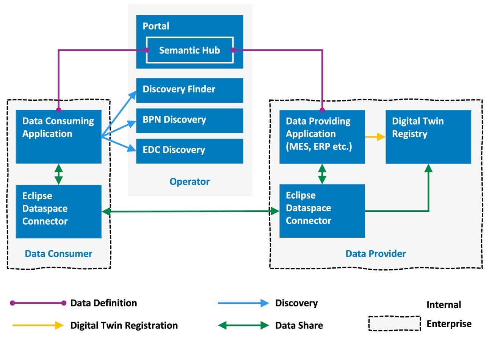

---
tags:
  - CAT/Portal
  - CAT/Core Service Provider
  - CAT/Sandbox Services
---

# CX-0053 Discovery Finder and BPN Discovery Service APIs v1.1.1

## ABSTRACT

The EDC discovery service as defined in CX-0001 supports to find EDC endpoints of participants of
the data space via Business Partner Numbers (BPN). In some use cases the BPN needed to access an
EDC data asset is not known. This means that all EDCs in the data space need to be accessed to find
 a specific EDC asset under consideration. This broadcasting has very low performance and produces
 a high access load to the EDCs.

BPN discovery services help to restrict the number of EDCs to be accessed. Prerequisite is that the
business application has some other identifying information and a corresponding BPN discovery service
supports the search for the BPN for this kind of identifying information.

## FOR WHOM IS THE STANDARD DESIGNED

This standard is designed for data discovery in Catena-X.

## COMPARISON WITH THE PREVIOUS VERSION OF THE STANDARD

Changes compared to V1.0.1 of CX-0053:

- added links to openAPI and documentation in Tractus-X instead of specification in document itself
- updated API endpoints and resources
- added reference implementations
- only CX-0010 normative reference, all other normative references now in chapter for non-normative references

## 1. INTRODUCTION

### 1.1 AUDIENCE & SCOPE

> *This section is non-normative*

This standard is relevant for a

- Business Application Provider
- Enablement Service Provider
- Core Service Provider

The standard is relevant for the roles in the following cases:

- Business Application Provider who does not know the BPN of the data asset under consideration,
but needs to know it, e.g. to discover available EDC connectors
- Enablement Service Provider who wants to provide BPN discovery services
- Core Service Provider who wants to provide the Discovery Finder service

### 1.2 CONTEXT AND ARCHITECTURE FIT

> *This section is non-normative*

#### Context

The EDC discovery service as defined in CX-0001 supports to find EDC endpoints of participants of
the data space via BPNs, CX-0010. In some use cases the BPN is not known at the start of the process.
This means that all EDCs in the data space need to be accessed to find a specific EDC data asset under consideration. This broadcasting has very low performance and produces a high access load on the EDCs.

BPN discovery services help to restrict the number of EDCs to be accessed. Prerequisite is that the
business application provider or data consumer has some additional information,
e.g. the Original Equipment Number.

#### ARCHITECTURE OVERVIEW

Figure 1 gives a rough overview of the architecture. A Data Consuming Application uses the discovery
services to find the Eclipse Dataspace Connector (EDC),  CX-0018, that most probably provides the data
needed.
The starting point for most applications to find data is a corresponding lookup in the Digital Twin
Registry CX-0002. Based on specific asset IDs the Digital Twin Registry enables the lookup of digital
twins and the endpoints to the data they provide.
In this architecture the Digital Twin Registry is decentralized and is accessed via the EDC of the
data provider. This means that the data consuming application needs to know the endpoint of this EDC.
The lookup of EDC endpoints is done via the BPN using the EDC Discovery service CX-0001.
Depending on the context the BPN might not be known for a product under consideration.
In this case BPN Discovery services can be used. Since there might be more than one BPN Discovery Service
a Discovery Finder service enables the lookup of the suitable BPN Discovery services.

Figure 1 Discovery Services in the Catena-X Architecture

### 1.3 Conformance and Proof of Conformity

> *This section is non-normative*

#### CONFORMANCE

As well as sections marked as non-normative, all authoring guidelines, diagrams, examples, and notes
in this specification are non-normative. Everything else in this specification is normative.

The key words MAY, MUST, MUST NOT, OPTIONAL, RECOMMENDED, REQUIRED, SHOULD and SHOULD NOT in this document are to be interpreted as described in \[[BCP 14](https://datatracker.ietf.org/doc/html/bcp14)], \[[RFC2119](https://www.w3.org/TR/did-core/#bib-rfc2119)\], \[[RFC8174](https://www.w3.org/TR/did-core/#bib-rfc8174)\] when, and only when, they appear in all capitals, as shown here.

#### PROOF OF CONFORMITY

All participants and their solutions will need to proof, that they are conform
with the Catena-X standards. To validate that the standards are applied
correctly, Catena-X employs Conformity Assessment Bodies (CABs).

The central operating company MUST provide the central Discovery Finder service conformant to the API specified in this standard.

Any operating company MAY provide BPN Discovery services conformant to the API specified in this standard.

The central operating company MUST ensure that there is at least one BPN Discovery service provided
per demand of a KIT. The BPN Discovery API as specified in the standard is generic. Which keys MUST
be supported is specified in the corresponding use case specific standards.

### 1.4 EXAMPLES

For examples see the different payload examples in the documentation of the API normative parts.

### 1.5 TERMINOLOGY

> *This section is non-normative*

Business Partner Number (BPN)

> A BPN is the unique identifier of a partner within Catena-x.

Additional terminology used in this standard can be looked up in the glossary on
the association homepage.

## 2. DISCOVERY FINDER API

> *This section is normative*

## 2.1 PRECONDITIONS AND DEPENDENCIES

This service is a prerequisite to find the available BPN Discovery Services.

## 2.2 API SPECIFICATION

### 2.2.1 API Endpoints & resources

The API endpoints MUST be implemented conformant to the [openAPI specification](./assets/discovery-finder-openapi.yaml) for the discovery finder service.

For further information on the discovery finder service see its [documentation](https://github.com/eclipse-tractusx/sldt-discovery-finder/blob/main/docs/architecture/1-introduction-and-goals.md).

### 2.2.2 Available Data Types

The API MUST use JSON as the payload transported via HTTP.

### 2.2.3 EDC Data Asset Structure

As the services specified by this standard run without shielding by an EDC, definition of a Data Asset Structure is obsolete.

### 2.2.4 Error Handling

See API Endpoints & resources for the http response codes that MUST be defined for HTTP POST endpoints.

## 3. BPN DISCOVERY API

> *This section is normative*

### 3.1 PRECONDITIONS AND DEPENDENCIES

A Discovery Finder service is a prerequisite to find the available BPN Discovery Services.

### 3.2 API SPECIFICATION

#### 3.2.1 API Endpoints & Resources

The API endpoints MUST be implemented conformant to the the [openAPI specification](./assets/bpn-discovery-service-openapi.yaml) for the BPN discovery service.

For further information on the service see its [documentation](https://github.com/eclipse-tractusx/sldt-bpn-discovery/blob/0ee7074af5aa039bf68f1a1b312aa20ffc70f204/docs/documentation.md).

#### 3.2.2 Available Data Types

The API MUST use JSON as the payload transported via HTTP.

#### 3.2.3 Error Handling

See API Endpoints & resources for the http response codes that MUST be defined for HTTP POST endpoints.

## 4. REFERENCES

### 4.1 NORMATIVE REFERENCES

CX-0010 Business Partner Number (BPN)

### 4.2 NON-NORMATIVE REFERENCES

> *This section is non-normative*

CX-0001 EDC Discovery API

CX-0002 Digital Twins in Catena-X

CX-0012 Business Partner Data Pool

CX-0018 Eclipse Data Space Connector

[Catena-X Operating Model v3.0](https://catenax-ev.github.io/docs/next/operating-model/why-introduction).

### 4.3 REFERENCE IMPLEMENTATIONS

> *This section is non-normative*

This is a reference implementation for the Discovery Finder Service:
https://github.com/eclipse-tractusx/sldt-discovery-finder

This is a reference implementation for the BPN Discovery Service:
https://github.com/eclipse-tractusx/sldt-bpn-discovery

## Legal

Copyright © 2025 Catena-X Automotive Network e.V. All rights reserved. For more information, please visit [here](/copyright).
