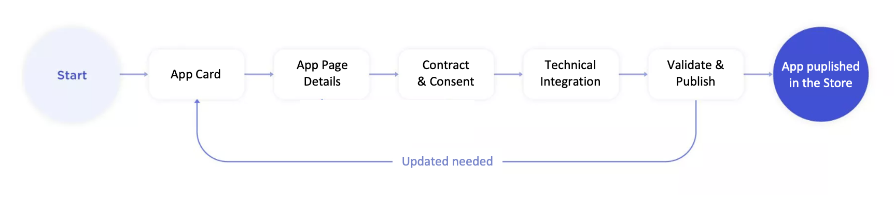
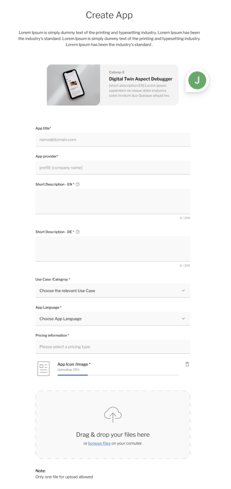
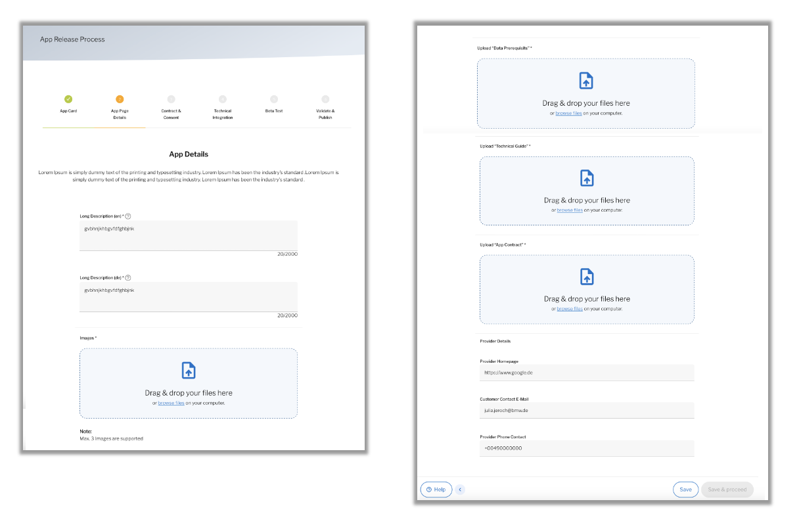
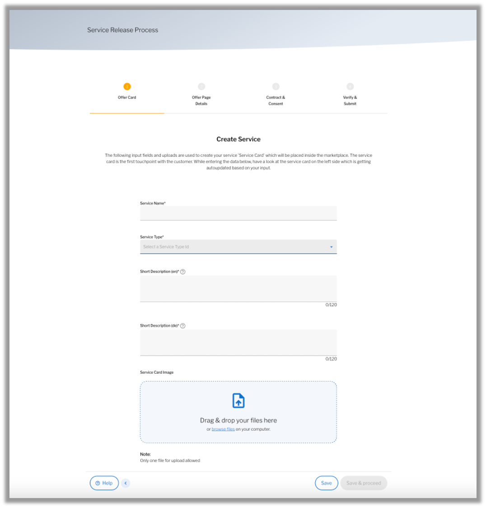

---
tags:
  - CAT/Marketplace
  - CAT/Core Service Provider
  - CAT/Sandbox Services
---

# CX-0054 Application Service Release v1.0.1

## ABSTRACT

> *This section is non-normative*

This document defines the release process for applications and services within the Catena-X marketplaces.
 It provides guidance and requirements for participants who develop, deploy, and maintain applications
 and services. The document covers the release process for both new and updated applications
and services, including versioning, testing, and deployment procedures. It also includes information
on the conformance criteria and proof of conformity requirements. This document is intended for participants
in the Catena-X network who are involved in the development, deployment, and
maintenance of applications and services. It is also relevant for organizations that provide tools and
services that support the Catena-X network.

## 1. INTRODUCTION

> *This section is non-normative*

Catena-X Marketplace is a digital platform that aims to connect businesses with Catena-X certified
 applications and services and provide a seamless exchange of data and services. To ensure the
 platform's quality and stability, it's crucial to have a well-defined and documented process for
 releasing applications and services onto the platform.

This document specifies the Application and Service Release Process for a Catena-X Marketplace.
 It outlines the steps and requirements that must be followed by service providers and application
 developers when submitting new or updated applications or services to the marketplace.

The scope of this document is limited to the Application and Service Release Process and does not
 cover other aspects of the Catena-X Marketplace, such as user management, security, or data exchange
 protocols. An example service, namely "Auto-Setup", and its release and deployment process can be found
 under [3.3 REFERENCE IMPLEMENTATIONS](#33-reference-implementations).

This document is intended for core service providers, business application providers, and any other stakeholders
 involved in the release of applications and services on the Catena-X Marketplace. It provides guidance
 on the required steps and best practices for ensuring the quality and reliability of the Catena-X
 marketplaces with preparation of enabling the coexistence of multiple federated marketplaces
 of Catena-X by following Catena-X standards.

### 1.1 AUDIENCE & SCOPE

> *This section is non-normative*

The following roles are relevant to the Application and Service Release Process specification for
 the Catena-X Marketplace:

**Core Service Provider**: The Core Service Provider is responsible for developing and maintaining
 the core services and components of the Catena-X Marketplace. This includes defining the release
 process and requirements for application and service releases.

**Business Application Provider**: The Business Application Provider is responsible for developing
 and maintaining the applications and services that run on top of the core services of the Catena-X
 Marketplace. This includes following the release process and requirements defined by the Core
 Service Provider.

**Enablement Service Provider**: The Enablement Service Provider is responsible for providing services
 that enable the integration of external systems with the Catena-X Marketplace. This includes following
 the release process and requirements defined by the Core Service Provider when releasing their services.

### 1.2 CONTEXT

> *This section is non-normative*

The Application and Service Release Process APIs are key components of the Catena-X Marketplace,
 enabling core service providers, business application providers and enablement service providers
 to release new or updated services onto the marketplace. These APIs allows for the submission of
 new application and service offerings, updates to existing applications or services, and management
 of application or service subscriptions. The Service Release Process API is built
 on the `Org.Eclipse.TractusX.Portal.Backend.Services.Service` v2 specification and is accessible
 via the `/api/services/ServiceRelease` endpoints. The Application Release Process API is built on
 `Org.Eclipse.TractusX.Portal.Backend.Apps.Service` v2 specification and is
 accessible via the `/api/apps/AppReleaseProcess` endpoints.

Through these APIs, providers can perform a range of actions, such as retrieving agreement data,
 retrieving details on services or apps in review, and managing status updates. Providers can also
 add, subscribe to, and update apps or services, as well as manage agreements and consent statuses.
 Additionally, providers can retrieve information on active applications in the marketplace, view
 subscription details, and auto-setup services.

The Application and Service Release Process APIs are essential for enabling a smooth and efficient
 process for managing service and application releases and updates in the Catena-X Marketplace. Its
 comprehensive set of endpoints allows providers to easily manage their offerings and subscriptions
 while ensuring compliance with authorization requirements and role-based access controls.

### 1.3 ARCHITECTURE OVERVIEW

> *This section is non-normative*

#### 1.3.1 OVERVIEW OF RELEASE PROCESS API

> **Note** : As Application Release Process API (found under: `/api/apps/AppReleaseProcess/`)
> is more detailed than and is a superset of the Service Release Process API (found under:
> `/api/services/servicerelease/`) only Application Release Process API is described in this chapter.

The portal backend service provides a list of API endpoints that can be accessed with
various HTTP methods such as GET, POST, PUT, and DELETE. The APIs are categorized under
three different titles, which are Apps, AppReleaseProcess, and AppChange.

The AppReleaseProcess category contains APIs related to app management and release
processes. For instance, the `/api/apps/AppReleaseProcess/createapp` endpoint creates
an app according to the provided request model, and the
`/api/apps/AppReleaseProcess/updateapp/{appId}` endpoint updates the details of a
newly created owned app under the app release/publishing process. Some other endpoints
such as `/api/apps/AppReleaseProcess/{appId}/appStatus` and
`/api/apps/AppReleaseProcess/{appId}/approveApp` provide additional functionality such
as retrieving the app detail with status and approving the app to change the status from
IN_REVIEW to Active and create notification.

The Apps category includes APIs that allow Catena-X dataspace participants to access and retrieve information
related to apps. For instance, the `/api/Apps/active` endpoint retrieves all active apps
in the marketplace, and the `/api/Apps/{appId}` endpoint retrieves app details for an app
referenced by ID. The `/api/Apps/favourites` endpoint retrieves the IDs of all favorite
apps of the current user, while the `/api/Apps/{appId}/subscribe` endpoint adds an app
to the current user's company's subscriptions.

Each API endpoint requires authorization and access permission to be accessed. The
permission level required for each API is specified in the description of the respective
API endpoint. The authorization requirement ranges from view_apps to edit_apps and add_apps.

### 1.4 CONFORMANCE

As well as sections marked as non-normative, all authoring guidelines, diagrams,
examples, and notes in this specification are non-normative. Everything else in
this specification is normative.

The key words **MAY**, **MUST**, **MUST NOT**, **OPTIONAL**, **RECOMMENDED**,
**REQUIRED**, **SHOULD** and **SHOULD NOT** in this document document are to be
interpreted as described in BCP 14 [RFC2119] [RFC8174] when, and only when, they
appear in all capitals, as shown here.

### 1.5 PROOF OF CONFORMITY

> *This section is non-normative*

All participants and their solutions will need to prove that they conform
with the Catena-X standards. To validate that the standards are applied
correctly, Catena-X employs Conformity Assessment Bodies (CABs).

To prove conformity with the Application and Service Release Process standard,
 you MUST provide the following assets to a conformity assessment body:

**For Application Release Process:**

- *Release process documentation* of the marketplace implementation that is to be certified SHOULD
 match to the Application Release Process documentation and workflows
- *Documentation of API responses* of the marketplace implementation that is to be certified
 SHOULD match to the Application Release Process API responses listed under
 [2.1.1 APPLICATION RELEASE PROCESS API](#211-application-release-process-api)

**For Service Release Process:**

- *Release process documentation* of the marketplace implementation that is to be certified SHOULD
 match to the Service Release Process Documentation and workflows
- *Documentation of API responses* of the marketplace implementation that is to be certified
 SHOULD match to the Service Release Process API responses listed under
 [2.2.1 SERVICE RELEASE PROCESS API](#221-service-release-process-api)

### 1.6 EXAMPLES

Examples and further information can be found in the
 [Tractus-X Github Repository > Portal > Application Release Process](https://github.com/eclipse-tractusx/portal-assets/tree/main/docs/04.%20App(s)/02.%20App%20Release%20Process)
 and in the [Tractus-X Github Repository > Portal > Service Release Process](https://github.com/eclipse-tractusx/portal-assets/tree/main/docs/05.%20Service(s)/02.%20Service%20Release%20Process)
 and in the [Tractus-X Github Repository > Auto-Setup Backend > Documentation](https://github.com/eclipse-tractusx/managed-service-orchestrator/blob/4d6d8025c3e23c3b255cb43d178d2fcc8d879348/docs/ARC42.md)

### 1.7 TERMINOLOGY

> *This section is non-normative*

Catena-X Marketplace
: A Marketplace in Catena-X Core Services context is a digital platform where businesses can provide,
 list and find applications and services that are certified to be used in Catena-X network and ecosystem

Additional terminology used in this standard can be looked up in the glossary on
the association homepage.

## 2 APPLICATION AND SERVICE RELEASE PROCESS

> *This section is normative*

The Application and Service Release Process standardization should act as an enabler for
 interoperability between different Catena-X application or service marketplace offerings.

### 2.1 APPLICATION RELEASE PROCESS

If a Catena-X Marketplace which is listing Catena-X Applications is to be certified, it:

- MUST provide public access to the documentation of its own Application Release Process
- MUST provide API access to Application Release Process Workflow and public access to the API documentation
- MUST fulfill the service and app release process standards defined by the Catena-X association \{reference to the respective chapters useful\}

A Catena-X Marketplace Application Release Process:

- MUST enable app provider to request the release of their business application under their company name
- MUST enable app provider to access and agree to the terms and conditions of the CX marketplace per app release request
- MUST enable app provider to upload their app roles which enables on a later state the SSO connection between the portal and the provider app
- MUST collect all defined app attributes as per the list below
  - app name
  - linked use case
  - supported language
  - pricing
  - lead image
  - long description (en & de)
  - App Data Privacy/Collection Information
  - App Conformity Certificate
  - App Roles
- SHOULD collect all defined app attributes as per the list below
  - short description (en & de)
  - sales manager (optional)
  - detail images (minimum one)
  - Data Pre-requisits (pdf) - optional
  - Technical Guide (pdf) - optional
  - App Contract (pdf) - optional
  - Provider Details - optional (Homepage, Contact, Number)
- SHOULD provide a GUI and an API to allow application publishers to publish following information in particular, but not limited to:
see all attributes mentioned above
- MUST enable the app provider to store the app data in a draft state and submit the app for the marketplace publishing later
- MUST implement a process to validate the app publishing request before approving and publishing the app on the marketplace
- SHOULD implement a process to decline/cancel an app publishing request
- MUST store the documents (incl. the conformity certificate)
- SHOULD enable the app provider to deactivate an app from the marketplace
- SHOULD enable the app provider to change the app details (such as description, documents, roles etc.)

### 2.1.1 APPLICATION RELEASE PROCESS API

If a Catena-X Marketplace which is listing Catena-X Applications is to be certified,
 it MUST implement and give access to following API endpoints:

| Endpoint | Description | Authorization Required | Roles |
| --- | --- | --- | --- |
| `GET: /api/apps/active` | Retrieves all active apps in the marketplace. | Yes | `view_apps` |
| `GET: /api/apps/business` | Retrieves all apps that the currently logged in user has been assigned roles in. | Yes | `view_apps` |
| `GET: /api/apps/{appId}` | Retrieves app details for an app referenced by ID. | Yes | `view_apps` |
| `GET: /api/apps/subscribed/subscription-status` | Retrieves subscription statuses of subscribed apps of the currently logged in user's company. | Yes | `view_subscription` |
| `GET: /api/apps/provided/subscription-status` | Retrieves subscription statuses of provided apps of the currently logged in user's company. | Yes | `view_app_subscription` |
| `POST: /api/apps/{appId}/subscribe` | Adds an app to the current user's company's subscriptions. | Yes | `subscribe_apps` |
| `GET: /api/apps/appAgreementData/{appId}` | Gets all agreements. | Yes | `subscribe_apps` |
| `GET: /api/apps/provided` | Retrieves all company-owned apps. | Yes | `app_management` |
| `POST: /api/apps/autoSetup` | Auto setup the app *obsolete* . | Yes | `activate_subscription` |
| `POST: /api/Apps/start-autoSetup` | Auto setup the app per process worker. | Yes | `activate_subscription` |
| `POST: /api/apps/appreleaseprocess/{appId}/role` | Creates a new role for a given app. | Yes | `edit_roles` |
| `GET: /api/apps/appreleaseprocess/agreementData` | Retrieves app agreement data. | Yes | `view_apps` |
| `GET: /api/apps/appreleaseprocess/consent/{appId}` | Retrieves consent data for a given app. | Yes | `view_apps` |
| `POST: /api/apps/appreleaseprocess/consent/{appId}/agreementConsents` | Creates a new consent agreement for a given app. | Yes | `edit_apps` |
| `GET: /api/apps/appreleaseprocess/{appId}/appStatus` | Retrieves status information for a given app. | Yes | `view_apps` |
| `DELETE: /api/apps/appreleaseprocess/{appId}/role/{roleId}` | Deletes a given role for a given app. | Yes | `edit_roles` |
| `POST: /api/apps/appreleaseprocess/createapp` | Creates a new app. | Yes | `add_apps` |
| `PUT: /api/apps/appreleaseprocess/{appId}` | Updates an existing app. | Yes | `edit_apps` |
| `PUT: /api/apps/appreleaseprocess/{appId}/submit` | Submits an app for release. | Yes | `edit_apps` |
| `PUT: /api/apps/appreleaseprocess/{appId}/approveApp` | Approves a pending app release. | Yes | `approve_apps` |
| `PUT: /api/apps/appreleaseprocess/{appId}/declineApp` | Declines a pending app release. | Yes | `approve_apps` |
| `GET: /api/apps/appreleaseprocess/privacyPolicies` | Retrieves privacy policy data. | Yes | `view_apps` |

### 2.2 SERVICE RELEASE PROCESS

If a Catena-X Marketplace which is listing Catena-X Services is to be certified,

- MUST provide public access to the documentation of its own Application Release Process
- MUST provide API access to Application Release Process Workflow and public access to the API documentation
- MUST fulfill the service and app release process standards defined by the Catena-X association \{reference to the respective chapters useful\}

A Catena-X Marketplace Service Release Process:

- MUST enable service provider to request the release of their service under their company name
- MUST enable service provider to access and agree to the terms and conditions of the CX marketplace per service release request
- MUST collect all defined service attributes as per the list below
  - service name
  - short description (en & de)
  - pricing
  - long description (en & de)
- SHOULD collect all defined app attributes as per the list below
  - lead image
  - sales manager - optional
  - Supporting Material (pdf) - optional
  - Provider Details - optional (Homepage, Contact, Number)
- SHOULD provide a GUI and an API to allow service publishers to publish following information in particular, but not limited to:
see all attributes mentioned above
- MUST enable the service provider to store the service data in a draft state and submit the serice for the marketplace publishing later
- MUST implement a process to validate the service publishing request before approving and publishing the app on the marketplace
- SHOULD implement a process to decline/cancel an service publishing request
- SHOULD enable the service provider to deactivate an service from the marketplace
- SHOULD enable the service provider to change the service details (such as description, documents, etc.)

### 2.2.1 SERVICE RELEASE PROCESS API

If a Catena-X Marketplace which is listing Catena-X Services is to be certified,
 it MUST implement and give access to following API endpoints:

| Endpoint | Description | Authorization Required | Roles |
| --- | --- | --- | --- |
| `GET: /api/Services/active` | Retrieves all active services in the marketplace. | Yes | `view_service_offering` |
| `GET: /api/Services/{serviceId}` | Retrieves service offer details for the respective service id. | Yes | `view_service_offering` |
| `PUT: /api/services/{serviceId}` | Updates the service inside the service release process. | Yes | `update_service_offering` |
| `POST: /api/Services/{serviceId}/subscribe` | Adds a new service subscription. | Yes | `subscribe_service` |
| `PUT: /api/Services/{serviceId}/submit` | Submit an Service for release. | Yes | `add_service_offering` |
| `PUT: /api/Services/{serviceId}/approveService` | Approve Service to change status from IN_REVIEW to Active and create notification. | Yes | `approve_service_release` |
| `PUT: /api/Services/{serviceId}/declineService` | Declines the service request. | Yes | `decline_service_release` |
| `GET: /api/Services/provided` | Retrieves all in review status service in the marketplace. | Yes | `add_service_offering` |
| `POST: /api/Services/autoSetup` | Auto setup the service. | Yes | `activate_subscription` |
| `GET: /api/Services/provided/subscription-status` | Retrieves subscription statuses of provided services of the currently logged in user's company. | Yes | `view_service_subscriptions` |
| `GET: /api/Services/serviceAgreementData/{serviceId}` | Gets all agreements. | Yes | `subscribe_service_offering` |
| `GET: /api/services/ServiceRelease/agreementData` | Return Agreement Data for offer_type_id Service. | Yes | `add_service_offering` |
| `GET: /api/services/ServiceRelease/{serviceId}/serviceStatus` | Return app detail with status. | Yes | `add_service_offering` |
| `GET: /api/services/ServiceRelease/inReview` | Retrieves all in review status service in the marketplace. | Yes | `approve_service_release`, `decline_service_release` |
| `GET: /api/services/ServiceRelease/inReview/{serviceId}` | Retrieves service details for an offer referenced by id. | Yes | `approve_service_release`, `decline_service_release` |
| `GET: /api/services/ServiceRelease/serviceTypes` | Retrieve Service Type Data. | Yes | `add_service_offering` |
| `GET: /api/services/ServiceRelease/consent/{serviceId}` | Gets the agreement consent status for the given service id. | Yes | `add_service_offering` |
| `POST: /api/services/ServiceRelease/consent/{serviceId}/agreementConsents` | Update or Insert Consent. | Yes | `add_service_offering` |

## 3 REFERENCES

### 3.1 NORMATIVE REFERENCES

### 3.2 NON-NORMATIVE REFERENCES

> *This section is non-normative*

- CX-0006 REGISTRATION AND INITIAL ONBOARDING
- CX-0009 CATENA-X REGISTRATION API
- CX-0010 BUSINESS PARTNER NUMBER (BPN)
- CX-0011 ISSUING AGENCY
- CX-0013 IDENTITY OF MEMBER COMPANIES

### 3.3 REFERENCE IMPLEMENTATIONS

> *This section is non-normative*

The code found at following locations present reference implementations that implement this standard:

- [Catena-X Portal Frontend](https://github.com/eclipse-tractusx/portal-frontend)
- [Catena-X Portal Backend](https://github.com/eclipse-tractusx/portal-backend)
- [Catena-X Portal Assets](https://github.com/eclipse-tractusx/portal-assets)
- [Helm chart for Catena-X Portal](https://github.com/eclipse-tractusx/portal-cd)

The code found at following location presents a reference implementation that implements a service that uses a service release process:

- [Auto Setup Service](https://github.com/eclipse-tractusx/autosetup-backend)

## ANNEXES

### FIGURES

> *This section is non-normative*

The image found below depicts an example Application Release Process that implements this standard.

The image found below depicts an example Application Creation Page that implements this standard.

The image found below depicts an example Application Detail Input Page that implements this standard.

The image found below depicts an example Service Detail Input Page that implements this standard.

### TABLES

> *This section is non-normative*

The json api description found in [openpi json file](./assets/swagger.json) presents a reference API
 that implements this standard.  

## Legal

Copyright © 2025 Catena-X Automotive Network e.V. All rights reserved. For more information, please visit [here](/copyright).
