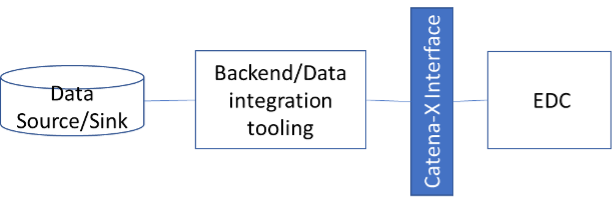

# CX-0055 Data Processing Patterns for IT System Integration v1.1.0

## ABSTRACT

This document provides specific conformity assessment criteria for IT-System Integration solutions that
connect arbitrary backend applications to Catena-X for both, data provisioning and data consumption.
Depending on the use-case, different standards must be fulfilled for data provisioning and consumption.
Thus, this document is modular and describes criteria for different schemes of data provisioning
and consumption (so called data processing patterns) in order to enable use case agnostic certification
of IT-system integration solutions.
Data Providers and Consumers can either implement the set of relevant standard themselves,
or use a managed solution that implements the standards.
This standard is particularly addressing the second case.

## 1. INTRODUCTION

### 1.1 AUDIENCE & SCOPE

> *This section is non-normative*

This document is relevant for:

- Enablement Service Provider

This document is in particular relevant for enablement service providers who are offering a (managed) solution for IT-system integration.
Those solutions offer the capability to provide data to Catena-X (or consume Catena-X data vice versa) by offering automated data pipelines.
This very basic capability provides a cornerstone for different Catena-X use cases.

This standard addresses in particular the interfaces which IT-System Integration Solutions expose
to exchange data with Catena-X.
For this standard, offered interfaces need to be compliant to technical standards that are used
by Catena-X to manage data processing (e.g. EDC, AAS or SAMM).
The IT-System Integration Solution itself is out of scope.

Furthermore, the document can be used as a guideline for data providers/consumers who want to connect
backend systems/middlewares etc.
with Catena-X via a custom build setup (without the need of certification in this case).

Out of scope for this document are small scale data provisioning solutions suiting the particular
needs of SME (e.g. working with exchange formats only, such as "Simple Data Exchanger").
Refer to CX-0007 for a certification of minimal data provider service offerings.  

This document does not contain references to external standards and Catena-X guardrails
that need to be fulfilled for the listing of apps into the Catena-X marketplace such as an ISO27001
certification or the passing of certain penetration tests.
Nevertheless, IT-System Integration solutions will also need to pass those conformity assessments.

### 1.2 CONTEXT

> *This section is non-normative*

Data provisioning/consumption in Catena-X can be done in multiple ways.
There are i.e. simple upload tools for SMEs which only need to provide data in small batches upon request.
For a steady supply of data however, different solutions are necessary.
Connecting backend systems, transforming semantic models and finally providing data
in the right format and via the right channels (IDS Protocol) are some of the tasks that need to be done.
IT-System Integration Solutions support companies with this task.

Depending on the Catena-X use case, there may be different sets of standards required to specify data exchange.
One Catena-X use case may require a combination of EDC, AAS and SAMM
while another Catena-X use case may only utilize EDC to handle data exchange between companies.
Those alternative combinations of standards for data processing are defined as "data processing patterns" in the scope of this document.

Enablement Service Providers need to show compliance of System Integration Solutions to data processing patterns in order to receive certification for Catena-X use cases (that utilize respective patterns).

Example:

- Use case A (e.g. Circular Economy - Dismantler Dashboard) and use case B (e.g. Sustainability - CO2 Footprint) utilize Data Processing Pattern 1 (e.g. combination of EDC, SAMM and AAS)
- a Backend Integration Solution X is certified against Data Processing Pattern 1
- As a result of the certification, Backend Integration Solution X  can be utilized for use cases A and B.

Except those patterns, interfaces provided by IT-System Integration Solutions are agnostic for Catena-X use-cases in a sense,
that they don't contain any use-case specific business logic.  Thus, an IT-System Integration solution can be certified for being utilized across different use cases (without considering additional use-case specific standards).

### 1.3 ARCHITECTURE OVERVIEW

> *This section is non-normative*

Figure 1 gives an idea about the scope of conformity assessment for IT-System Integration solutions in Catena-X. The data source/sink refers to a company IT landscape.
Thus, it can comprise one IT-system, (such as ERP or PLM) or multiple systems, data lakes etc.
To make this data accessible for Catena-X (or vice versa to write Catena-X data into backend systems)
a dedicated tool or toolchain is necessary.
Since IT-architectures and IT-System Integration solutions vary significantly between different companies,
no standard can be applied here (see also *Data Integration Patterns Guide* on Catena-X website for further information).
Thus, conformity assessment for IT-System Integration solutions focuses on requirements for data formats, and data transfer protocols (Catena-X interface, see Figure 1 marked in blue).
The IT-System Integration solution itself is out of scope for this standard.

Figure 1: Scope of conformity assessment - Catena-X interface for IT-System Integration solutions

### 1.4 CONFORMANCE

As well as sections marked as non-normative, all authoring guidelines, diagrams, examples, and notes
in this specification are non-normative. Everything else in this specification is normative.

The key words **MAY**, **MUST**, **MUST NOT**, **OPTIONAL**, **RECOMMENDED**, **REQUIRED**, **SHOULD**
and **SHOULD NOT** in this document document are to be interpreted as described in BCP 14 [RFC2119] [RFC8174]
when, and only when, they appear in all capitals, as shown here.

### 1.5 PROOF OF CONFORMITY

> *This section is non-normative*

All participants and their solutions will need to proof, that they are conform with the Catena-X standards.
To validate that the standards are applied correctly, Catena-X employs Conformity Assessment Bodies (CABs).
Please refer to the association homepage for the process of conformity assessment and certification.

To proof the overall conformity of an IT-System Integration solution for Catena-X use-cases,
a proof of conformity for standards belonging to a specific Data Processing Pattern (listed in section 2) has to be obtained.

## 2. STANDARDS FOR DATA PROCESSING PATTERNS

> *This section is normative*

This chapter describes possible ways for providing data for Catena-X (and to consume it respectively). IT-System Integration solutions MUST fulfill the standards for at least one Data Processing Pattern in order to obtain a certificate for this standard.
The certificate issued by CAB MUST specify for which data processing pattern(s) the IT-System Integration solution was succesfully evaluated in the certification process. The IT-System Integration solution can then only be utilized for Catena-X use case applications that make use of the specific Data Processing Patterns that were in scope of certification.

The following list of Data Processing Patterns will be extended as soon as new patterns emerge
and respective Catena-X standards are available.

- All solutions in this chapter MUST implement the standard CX – 0018 Sovereign Data Exchange v 1.0.1

### 2.1 LIST OF STANDALONE STANDARDS

> *This section is normative*

**Data Processing Pattern 1** (SAMM and AAS): All solutions that shall be used for data provisioning/data consumption for use-cases using SAMM and AAS MUST implement the following standards:

- CX-0002 Digital Twins in Catena - X v 1.0.2
- CX-0003 SAMM Aspect Meta Model v 1.0.2

This includes, but is not limited to the following use-cases:

- Traceability
- Circular Economy
- Sustainability

**Data Processing Pattern 2** (Knowledge Agents): All solutions that shall be used for data provisioning/data consumption for use-cases using Knowledge Agents MUST implement the following standards:

- CX-0084 Federated Queries in Data Spaces (Knowledge Agents) v1.0.0

This includes, but is not limited to the following use-cases:

- Behaviour Twin

Note: It is up to the data provider to provide the data
in the correct semantic models for a specific use-case.
Those models can be found in the specific use-case standards.
The IT-System Integration solution only needs to proof that it enables
the data provider to provide the data in the correct semantic modelling language.

## 3 REFERENCES

### 3.1 NORMATIVE REFERENCES

- CX–0018 Sovereign Data Exchange v 1.0.1
- CX-0002 Digital Twins in Catena-X v 1.0.2
- CX-0003 SAMM Aspect Meta Model v 1.0.2
- CX-0084 Federated Queries in Data Spaces (Knowledge Agents) v1.0.0

## ANNEXES

## Legal

Copyright © 2024 Catena-X Automotive Network e.V. All rights reserved. For more information, please visit [here](/copyright).
