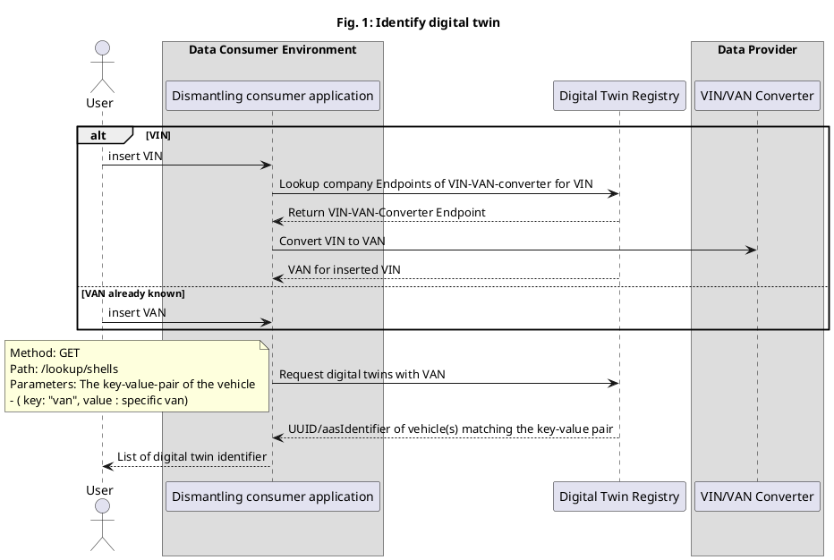

# CX-0065 Triangle for Dismantling Service v1.0.0

## ABSTRACT

This standard focuses on the Dismantling use case. This includes relevant requirements for:

- data provider, that want to provide data for dismantling through Catena-X,
- data consumer, that are searching for dismantling information such as R-Strategies in Catena-X and
- Application developer/provider supporting the provisioning and consuming of dismantling information.

In this document, keywords for registering and searching dismantling information such as material information are defined as well as general call sequences to register or consume these information. In this document, the *standardization triangle* will be described, meaning the relevant architectural and data elements for working with the use case.

## 1. INTRODUCTION

This document defines the so-called *standardization triangle* for the dismantling use case. Standardization triangle hereby means the mandatory components, data models, APIs etc. that are required to enable the dismantling use case. Additionally, search objects as well as procedures to registering/providing and consuming the data will be defined.

### 1.1 AUDIENCE & SCOPE

> *This section is non-normative*

This document is meant for the following roles:

- Data Provider / Consumer
- Business Application Provider
- Onboarding Service Provider
- Consulting Services Provider

### 1.2 CONTEXT

> *This section is non-normative*

At a vehicle's end of life (EoL), it is usually dismantled by a certified dismantler. This means, that the components and materials are evaluated and often are removed and sold or forwarded as material.

The decision, what should be done with the vehicle and its components is called R-Strategy (e.g. Repair, Reuse, Recycle, ...). The decision on the relevant R-Strategies can be prior to the actual dismantling, as it influences if a component shall be bought or not.

This standard defines relevant communication within Catena-X to support dismantling decisions.

### 1.3 ARCHITECTURE OVERVIEW

> *This section is non-normative*

General architectural sequences can be seen in  the Annex ([FIGURES](#figures)). Mandatory components are:

- Eclipse Data Space Connector (EDC) or equivalent components in compliance with the standard 0018 Eclipse Data Space Connector (EDC)
- Usage of digital twin registry to provide twins of the vehicles with respective BOMs and dismantling information
- connections to components for authenticate as a data provider or consumer, such as the Catena-X portal, DAPS and similar platforms.

### 1.4 CONFORMANCE

As well as sections marked as non-normative, all authoring guidelines, diagrams, examples, and notes in this specification are non-normative. Everything else in this specification is normative.

The key words **MAY**, **MUST**, **MUST NOT**, **OPTIONAL**, **RECOMMENDED**, **REQUIRED**, **SHOULD**
and **SHOULD NOT** in this document document are to be interpreted as described in BCP 14 [RFC2119] [RFC8174]
when, and only when, they appear in all capitals, as shown here.

### 1.5 PROOF OF CONFORMITY

> *This section is non-normative*

All participants and their solutions will need to proof, that they are conform with the Catena-X standards.
To validate that the standards are applied correctly, Catena-X employs Conformity Assessment Bodies (CABs).

To proof conformity with the use case dismantling standard as a data consumer or app provider demonstrate that you

- can find digital twins of a vehicle through a VAN,
- can find components of the vehicle such as batteries,  
- can visualize relevant submodels such as materials.

To proof conformity with the use case dismantling standard as data provider show that you

- are conform with the provisioning conditions in [ADDITIONAL REQUIREMENTS](#22-additional-requirements).

### 1.6 EXAMPLES

No Example provided.

### 1.7 TERMINOLOGY

> *This section is non-normative*

The following terms are especially relevant for the understanding of the standard:

- Asset Administration Shell (AAS): The AAS is chosen standard in Catena-X to define Digital Twins of an asset (e.g. a battery or a full vehicle).  
- Business Partner Number (BPN): A BPN is the unique identifier of a partner within Catena-X.
- Vehicle Identification Number (VIN): (In German "Fahrgestellnummer") Identification of an instance of a vehicle.
- Vehicle Anonymised Number (VAN): As the VIN can be traced back to a person and thus is GDPR relevant. Therefore, the VAN has been introduced in Catena-X to avoid person related data in requests. This number wil be used to register and search digital twins.

Additional terminology used in this standard can be looked up in the glossary on the association homepage.

## 2. STANDARDS FOR "USECASE DISMANTLING"

> *This section is normative*

### 2.1 LIST OF STANDALONE STANDARDS

> *This section is normative*

To participate in the dismantling use-case, the following single standards MUST be fulfilled by all participants for which the standard is relevant:

- CX - 0002 Digital Twins in Catena - X
- CX - 0015 IAM & Access Control Paradigm
- CX - 0018 Eclipse Data Space Connector (EDC)

### 2.2 ADDITIONAL REQUIREMENTS

A participant of the dismantling use case MUST sign the overall terms and conditions (Catena-X) and the dismantling terms and conditions.

A data provider MUST register their AAS of the vehicle with a ``van`` for example:

```json
{
  "description": [
    {
      "language": "en",
      "text": "The shell for a vehicle"
    }
  ],
  "globalAssetId": {
    "value": [
      "{globalAssetId}"
    ]
  },
  "idShort": "vehicle",
  "identification": "...",
  "specificAssetIds": [
    {
      "key": "van",
      "value": "X123456789012X12345678901234566" // = VAN
    },
    ...
  ]
}
```

EDC-assets of data providers MUST follow the following structure:

```json
{
    "asset": {
        "properties": {
            "asset:prop:id": "{{AssetId}}",
            "asset:prop:description": "{{Description}}"
        }
    },
    "dataAddress": {
        "properties": {
            "type": "HttpData",
            "baseUrl": "{{DataProviderEndpointUrl}}/{{DigitalTwinId}}-{{DigitalTwinSubmodelId}}"
        }
    }
}
```

contract Definitions of data providers MUST follow this structure:

```json
{
    "id": "{{ContractDefinitionId}}",
    "criteria": [
        {
            "operandLeft": "asset:prop:id",
            "operator": "=",
            "operandRight": "{{AssetId}}"
        }
    ],
    "accessPolicyId": "{{AccessPolicyId}}",
    "contractPolicyId": "{{ContractPolicyId}}"
}
```

Data consumer SHOULD request data assets through the key-value pair ``"van"`` = ``partInstanceId``. A procedure is documented in [Fig. 1: Identify digital twin](#figures).

```json
{
  "key": "van",
  "value": "X123456789012X12345678901234566"
}
```

## 3 REFERENCES

### 3.1 NORMATIVE REFERENCES

Currently used data model standards:

- [CX-0066-EndofLifeofVehicleCompliance](https://catena-x.net/de/standard-library)
- [CX-0031-DataModelMaterialForHomologation](https://catena-x.net/de/standard-library)

### 3.2 NON-NORMATIVE REFERENCES

> *This section is non-normative*

A logic to calculate an R-Strategy can be found in the paper [Mügge, J.; Hahn, I. R.; Riedelsheimer, T. and Chatzis, J.: "Digital Twins for Circular Economy Enabling Decision Support for R-Strategies"](https://www.industrie-management.de/sites/industrie-management.de/files/img-digitalisierung/IM-06-2022_Mugge.pdf).

### 3.3 REFERENCE IMPLEMENTATIONS

> *This section is non-normative*

There is yet no publicly available reference implementation for dismantling support

## ANNEXES

### FIGURES

> *This section is non-normative*



```plantuml
@startuml
Title
Fig. 2: request CE aspects
end title
'Layout

Actor "User" as VP

box "Data Consumer"
participant "Dismantling
Application" as DD
'participant "AAS-Wrapper" as Wrapper
participant "Consumer EDC" as EDCC
'participant IRS as IRS
end box

participant "Digital Twin Registry" as DTR

box "Data Provider"
participant "VIN/VAN Converter" as VVDec
'participant "Submodel
Server" as SS
participant "Provider EDC" as EDCP
end box

'Communication
skinparam SequenceMessageAlignment center
'skinparam SequenceLifeLineBackgroundColor #Red

'activate DD
note over VP
The UUID/aasIdentifier can either be
from the previous step in the app
or inserted by the user.
end note  
opt
VP -> DD:insert VAN or UUID
end

DD -> DTR: Search for aspect and EDC-Endpoints in Digital Twin registry
note left
Method: GET
Path: registry/shell-descriptors/{aasIdentifier}/submodel-descriptors
Parameters: the aasIdentifier from the twin lookup
- ( aasIdentifier: UUID of AAS)
end note
DD<--DTR: return all submodel endpoints
DD->DD: Filter for relevant submodels
loop for all relevant submodels
DD->EDCC: request data from endpoint
EDCC->EDCP: Request data from endpoint
note left
This step includes a complex contract negotiation 
between the EDCs and might involve further components
such as an AAS Wrapper, which is skipped in this diagram 
as well as communication with the actual submodel server
end note
EDCC<--EDCP: Return requested data
DD<--EDCC: return requested data
end 
VP<--DD: visualize dismantling information


@enduml

```

### TABLES

> *This section is non-normative*

*Table 1: relevant usage policies*

| Identifier | Description |
|------------|-------------|
| R3\_ReadDisplay | The data provided in the circular economy use case as well as by and for related business applications such as Batterypass application, Marketplace, Circularity Cockpit and R-Strategy Assistant shall only be displayed to the data user and read by applications for circular economy usages such as R-Strategy logic calculations or support of buying decisions by the data user. The end-user confirms that the data is not used for analytic purposes out side the circular economy scope such as analyzing consumer behavior based on load cycles or analyzing the number of produced cars or components by a company. It also not allowed to print the data or distributed it to third parties. |
| R3\_ExchangeOfAnonymousData | The data exchanged in the use case is focused on non-personal related data. Therefore, data provider confirm, that they only provide anonymized data to data consumers or that the data is anonymized in the data transfer. |
| R3\_ExchangePartner | Data is only exchanged between partners, that have signed a bilateral contract to exchange the data. Therefore, data consumers are only allowed to consume data once their legal entity has signed a respective contract. |

## Legal

Copyright © 2024 Catena-X Automotive Network e.V. All rights reserved. For more information, please visit [here](/copyright).
