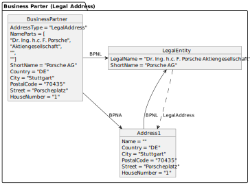
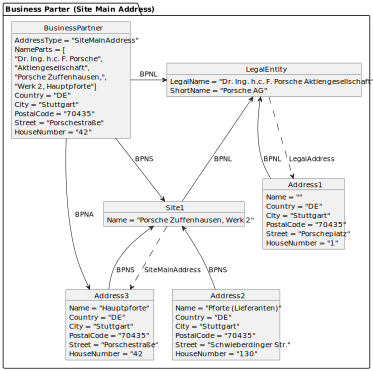
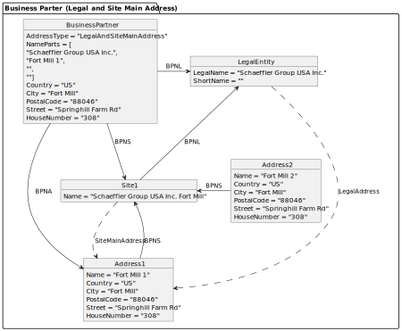
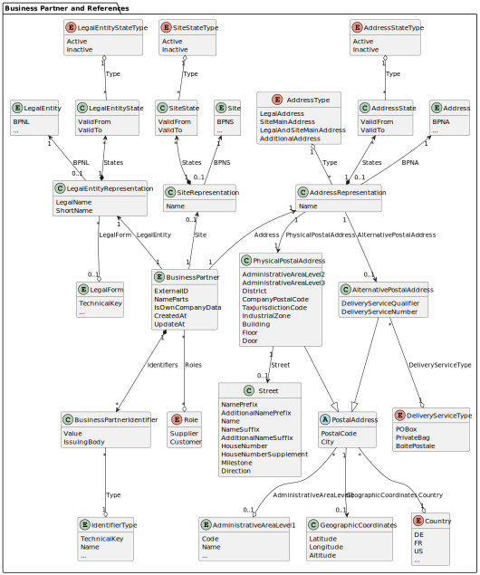
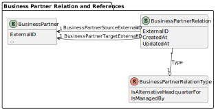
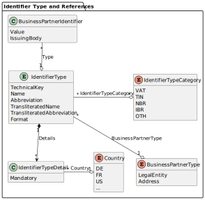
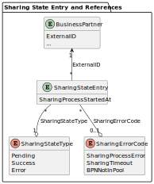

---
tags:
  - CAT/Portal
  - CAT/Core Service Provider
  - CAT/Sandbox Services
  - CAT/BPDM
---

# CX-0074 Business Partner Gate API v4.1.1

## FOR WHOM IS THE STANDARD DESIGNED

This document is mainly targeted to technical individuals involved in integrating and developing against this API, as well as business individuals who are involved in compliance process of this API.

## ABSTRACT

The Business Partner Data Management (BPDM) is a distributed service-based system, composed of a set of dedicated services, that simultaneously serve multiple stakeholders and use cases. It is based on a central data pool of business partners, which is operated under data space governance and underlies interoperability through standardization. The main target is to create business partner data records (such as customer/supplier) with a high quality and currentness, to provide other processes with these data. This results in less rework and adjustment due to better master data quality which ultimately leads to an overall cost reduction for participating companies. Additionally, Value Added Services shall be offered to enrich those business partner data sets even further and give additional information or warnings about the business partners. Getting a 360° view on your business partners also helps with reducing costs and achieving process excellence because better decisions can be made.

The Business Partner Gate allows any data space participant to share own business partner data as well as business partner data of its suppliers and customers with the data space so that cleansed and enriched business partner data records, so-called Golden Records, can be created and made available. It is a main component of the architecture framework, as it enables the data space participants to leverage accurate, complete, and consistent business partner data for data space applications and shared services.

The Business Partner Gate can be accessed via the standardized API described in this standard.

## 1. INTRODUCTION

### 1.1 AUDIENCE & SCOPE

> *This section is non-normative*

This standard is relevant for the following audience:

- Core Service Provider
- Onboarding Service Provider
- Data Provider and Consumer

This document focuses on the Business Partner Gate API (short: Gate API) that is part of the Business Partner Data Management (BPDM) use case described on the [BPDM website](https://catena-x.net/use-case-cluster/next-level-master-data-management/). It is relevant for core service providers who want to provide services for uploading and downloading business partner master data records with the aim of cleansing and enriching them and thus create a high-quality business partner data record (Golden Record), which is identified by the business partner number (BPN). It is also relevant for onboarding service providers, business application providers as well as data providers and consumers who want to use such services.

Not in scope are the structure and logic of the business partner number itself and the mechanism on how the business partner number is issued. There is a separate standard for this: CX-0010 Business Partner Number 3.0.0.

Not in scope is the overall Business Partner Data Pool with all Golden Records within the data space and the way of how the Golden Records can be retrieved. There is a separate standard for this: CX-0012 Business Partner Data Pool API 5.1.0.

Not in scope are the requirements of cleansing and enriching the business partner data records with the aim to create a Golden Record. There is a separate standard for this: CX-0076 Golden Record End to End Requirements Standard 1.5.0.

You can find the other standards in the [standard library](https://catenax-ev.github.io/docs/standards/overview).

### 1.2 CONTEXT AND ARCHITECTURE FIT

> *This section is non-normative*

The Gate API is a crucial core component for the data space, the Golden Record Service as Core Service B and the BPDM use case because it contributes to the following functions:

1. Data Consistency: The Gate API allows that data related to business partners can be collected from multiple sources and can be sent through the sharing process to correct, enrich and validate the data. This ultimately enables BPDM to create accurate, complete, and consistent business partner data records (Golden Records). This helps to reduce the risk of errors and inconsistencies in business partner data.
2. Data Sovereignty: The Gate API allows to upload and download business partner data in a data sovereign way, because each Sharing Member has its own area of business partner data in BPDM, where private data (like customer / supplier relationships) is only visible to the data owner.
3. Data Governance: The Gate API is the basis for a data governance framework and helps to enforce data quality standards, such as data completeness, accuracy, and consistency. It allows to compare the uploaded business partner data records against the corrected and enriched ones and provides the Sharing Member with a proposal for taking over the changes into the local MDM systems. This helps to ensure that business partner data is of high quality and can be trusted for use in various business processes.
4. Interoperability: The Gate API provides an interoperable and standardized way of uploading and downloading business partner data, ensuring both Core Service Provider interchangeability and streamlined data accessibility for all consumers of the API.

There is a reference implementation for the [Business Partner Gate API (7.1.x)](https://github.com/eclipse-tractusx/bpdm/tree/86a0a1931323d9ed0a75252bdd2ad9a6434542b7/bpdm-gate-api/src/main/kotlin/org/eclipse/tractusx/bpdm/gate/api) on GitHub. It is part of a Spring Boot Kotlin open-source software project under the hood of the Eclipse Foundation and follows the Apache 2.0 licenses.

For the complete and up-to-date BPDM setup refer to the [Eclipse Tractus-X BPDM GitHub repository (7.1.x)](https://github.com/eclipse-tractusx/bpdm/blob/86a0a1931323d9ed0a75252bdd2ad9a6434542b7/README.md).

For an architecture overview refer to the [BPDM ARC42 documentation (7.1.x)](https://github.com/eclipse-tractusx/bpdm/tree/86a0a1931323d9ed0a75252bdd2ad9a6434542b7/docs/architecture).

To use the Gate API in the BPDM use case apart from this standard, the following other standards should be considered by all participants for which this standard is relevant:

- CX-0010 Business Partner Number 3.0.0
- CX-0012 Business Partner Data Pool API 5.1.0
- CX-0018 Dataspace Connectivity 4.1.0

### 1.3 CONFORMANCE AND PROOF OF CONFORMITY

> *This section is non-normative*

If sections are marked as non-normative, all authoring guidelines, diagrams, examples, and notes in these sections are non-normative. Everything else in this specification is normative.

The key words **MAY**, **MUST**, **MUST NOT**, **OPTIONAL**, **RECOMMENDED**, **REQUIRED**, **SHOULD** and **SHOULD NOT** in this document are to be interpreted as described in [BCP 14](https://datatracker.ietf.org/doc/html/bcp14), [RFC2119](https://www.w3.org/TR/did-core/#bib-rfc2119), [RFC8174](https://www.w3.org/TR/did-core/#bib-rfc8174) when, and only when, they appear in all capitals, as shown here.

All participants and their solutions will need to prove, that they are conform with the Catena-X standards. To validate that the standards are applied correctly, Catena-X employs Conformity Assessment Bodies (CABs).

When implementing the API defined in this standard, proof of conformity **MUST** be provided by the following deliverables:

- An OpenAPI specification defining the relevant resources for this standard
- Examples of data assets

### 1.4 EXAMPLES

The following examples show business partners which are potentially shared using this API.

#### 1.4.1 EXAMPLE 1

A business partner having assigned a legal entity and its legal address.

***Dr. Ing. h.c. F. Porsche Aktiengesellschaft, Porscheplatz 1, 70435 Stuttgart, Deutschland***



#### 1.4.2 EXAMPLE 2

A business partner having assigned a legal entity and one of its additional addresses.

***Dr. Ing. h.c. F. Porsche Aktiengesellschaft, Schwieberdinger Str. 130, 70435 Stuttgart, Deutschland***


#### 1.4.3 EXAMPLE 3

A business partner having assigned a legal entity, a site and its main address[^5], which is not the legal address.

***Dr. Ing. h.c. F. Porsche Aktiengesellschaft, Porsche Zuffenhausen, Werk 2, Hauptpforte, Porschestraße 42, 70435 Stuttgart, Deutschland***



#### 1.4.4 EXAMPLE 4

A business partner having assigned a legal entity, a site and its main address[^5], which is also the legal address.

***Schaeffler Group USA Inc. Fort Mill 1, 308 Springhill Farm Rd, Fort Mill, SC 29715, USA***



#### 1.4.5 EXAMPLE 5

A business partner having assigned a legal entity, a site and one of its addresses, which is neither the legal address nor the main address[^5] of that site.

***Dr. Ing. h.c. F. Porsche Aktiengesellschaft, Porsche Zuffenhausen, Werk 2, Pforte (Lieferanten), Schwieberdinger Str. 130, 70435 Stuttgart, Deutschland***


### 1.5 TERMINOLOGY

> *This section is non-normative*

#### 1.5.1 GENERAL

**Golden Record:** A Golden Record is a business partner data record which successfully passed a set of predefined quality rules. These rules qualified the data record into a harmonized, standardized, and semantically unified data structure which is defined by the BPDM standards. The Golden Record status is a prerequisite for each business partner data record to receive a valid business partner number.

**Sharing Member:** A Sharing Member is a data space participant who shares the business partner data of his own business environment or in the role of a Managing Legal Entity the business partner data of the business environments of its Managed Legal Entities[^6].

**Managing Legal Entity:** The legal entity responsible for managing legal entity, site, and address data on behalf of other legal entities (Managed Legal Entities) within the data space.

**Managed Legal Entity:**  A legal entity on whose behalf legal entity, site, and address data are managed by the Managing Legal Entity.

**Company Data:** Company Data are business partner data that represent the own organizational structures of the Sharing Member or if the Sharing Member is in the role of a Managing Legal Entity the organizational structures of its Managed Legal Entities.

#### 1.5.2 DATA MODEL

This chapter explains the data model[^1] from a conceptual / terminology point of view. It does not include technical details of the API data model, such as:

- differences in response and request
- differences in data stages (like input or output)
- attributes for pagination
- singular query parameters, which are not already attributes of the entities

**Note that cardinalities always refer to the entity state as required output of the sharing process. In general, cardinalities of relations and attributes are not to be enforced while uploading business partners, except for the external ID.**

##### 1.5.2.1 BUSINESS PARTNER



In general, a business partner is any entity (such as a customer, a supplier, an employee, or a service provider) that does business with another entity.

In data spaces, a business partner is an organization (such as an enterprise or company, university, association, etc., and not a natural person) or one of its organization parts that acts as unique partner within the supply chain - either in the role of a direct participant, or a consultant, or a non-production-material (NPM) supplier.

The business partner entity in the Gate API provides a merged view on the entity combinations from the Business Partner Data Pool. In all combinations, a business partner has exactly one legal entity and one address assigned. It may additionally have a site assigned if the assigned address belongs to the site and the site is known to BPDM / has been shared by the owner. Note that for the assignment of the entities the respective BPNL, BPNS or BPNA (from the Business Partner Data Pool) are used.

The business partner address type and the BPN assignment determine the entity combinations, on which the business partner entity provides a merged view. The combinations are visualized in the following table. All other combinations are invalid as output of the sharing process and will result in a [sharing error](#15212-sharing-state-entry):

| **Description**                                                                                                                                               | **Address Type**                | **BPNL** | **BPNS** | **BPNA** | **Shared by** | **Example**                       |
| ------------------------------------------------------------------------------------------------------------------------------------------------------------- | ------------------------------- | -------- | -------- | -------- | ------------- | --------------------------------- |
| A business partner having assigned a legal entity and its legal address.                                                                                      | Legal Address                   | has a    | -        | has a    | Anyone        | [1.4.1 EXAMPLE 1](#141-example-1) |
| A business partner having assigned a legal entity and one of its additional addresses.                                                                        | Additional Address              | has a    | -        | has a    | Anyone        | [1.4.2 EXAMPLE 2](#142-example-2) |
| A business partner having assigned a legal entity, a site and its main address[^5], which is not the legal address.                                           | Site Main Address[^5]           | has a    | has a    | has a    | Owner only    | [1.4.3 EXAMPLE 4](#143-example-3) |
| A business partner having assigned a legal entity, a site and its main address[^5], which is also the legal address.                                          | Legal and Site Main Address[^5] | has a    | has a    | has a    | Owner only    | [1.4.4 EXAMPLE 4](#144-example-4) |
| A business partner having assigned a legal entity, a site and one of its addresses, which is neither the legal address nor the main address[^5] of that site. | Additional Address              | has a    | has a    | has a    | Owner only    | [1.4.5 EXAMPLE 5](#145-example-5) |

These are the attributes of the business partner:

| **Attribute**       | **Description**                                                                                                             | **(Data) Type / Code List / Enumeration**                                 |
| ------------------- | --------------------------------------------------------------------------------------------------------------------------- | ------------------------------------------------------------------------- |
| External ID         | The identifier which uniquely identifies (in the internal system landscape of the Sharing Member) the business partner.     | String                                                                    |
| Name Parts          | The list of name parts of the business partner to accommodate the different number of name fields in different systems.     | List of String                                                            |
| Identifiers         | The list of identifiers of the business partner.                                                                            | List of [Business Partner Identifier](#15211-business-partner-identifier) |
| Roles               | One or more of the roles, the business partner assumes with respect to the Sharing Member / Managed Legal Entity.           | List of Enum                                                              |
| Is Own Company Data | Indicates whether the Sharing Member claims (in the initial upload) the business partner to belong to its Company Data.[^2] | Boolean                                                                   |
| Created At          | The date and time when the business partner data record has been created.                                                   | Date / Time                                                               |
| Updated At          | The date and time when the business partner data record has been last updated.                                              | Date / Time                                                               |
| Legal Entity        | The legal entity, on which the business partner provides a view.                                                            | [Legal Entity Representation](#1522-legal-entity-representation)          |
| Site                | The site, on which the business partner provides a view.                                                                    | [Site Representation](#1523-site-representation)                          |
| Address             | The address, on which the business partner provides a view.                                                                 | [Address Representation](#1524-address-representation)                    |

A business partner can assume **one or more** of the business partner roles:

1. `supplier` (value=SUPPLIER): The business partner is a supplier of the Sharing Member / Managed Legal Entity, meaning that the Sharing Member / Managed Legal Entity buys goods or services from the business partner.
2. `customer` (value=CUSTOMER): The business partner is a customer of the Sharing Member / Managed Legal Entity, meaning that the Sharing Member / Managed Legal Entity sells goods or services to the business partner.

###### 1.5.2.1.1 BUSINESS PARTNER IDENTIFIER

A business partner identifier (uniquely) identifies the business partner, such as the German Handelsregisternummer, a VAT registration / taxpayer identification number, etc.

| **Attribute** | **Description**                                                                                                                                                                              | **(Data) Type / Code List / Enumeration** |
| ------------- | -------------------------------------------------------------------------------------------------------------------------------------------------------------------------------------------- | ----------------------------------------- |
| Value         | The value of the identifier like “DE123465789”                                                                                                                                               | String                                    |
| Type          | The type of the identifier.                                                                                                                                                                  | [Identifier Type](#15211-identifier-type)  |
| Issuing Body  | The name of the official register, where the identifier is registered. For example, a Handelsregisternummer in Germany is only valid with its corresponding Registergericht and Registerart. | String                                    |

##### 1.5.2.2 LEGAL ENTITY REPRESENTATION

A legal entity representation adds context information to the legal entity, on which the business partner provides a view. Additionally, it contains some of the information from the assigned legal entity.

| **Attribute**    | **Description**                                                                                               | **(Data) Type / Code List / Enumeration**               |
| ---------------- | ------------------------------------------------------------------------------------------------------------- | ------------------------------------------------------- |
| Legal Entity BPN | The BPNL of the legal entity, on which the business partner provides a view.                                  | String                                                  |
| Legal Name       | The name of the legal entity, on which the business partner provides a view, according to official registers. | String                                                  |
| Short Name       | The abbreviated name of the legal entity, on which the business partner provides a view.                      | String                                                  |
| States           | The list of (temporary) states of the legal entity.                                                           | List of [Legal Entity State](#15221-legal-entity-state) |
| Legal Form       | The legal form of the legal entity, on which the business partner provides a view.                            | [Legal Form](#1526-legal-form)                          |

###### 1.5.2.2.1 LEGAL ENTITY STATE

A legal entity state indicates if the legal entity is active or inactive[^3]. This does not describe the relation between a data space participant and a business partner and whether they have active business, but it describes whether the legal entity is still operating.

| **Attribute** | **Description**                                  | **(Data) Type / Code List / Enumeration** |
| ------------- | ------------------------------------------------ | ----------------------------------------- |
| Valid From    | The date and time from which the state is valid. | Date / Time                               |
| Valid To      | The date and time until the state is valid.      | Date / Time                               |
| Type          | One of the state types.                          | Enum                                      |

A legal entity state can be classified into **one** of the legal entity state types:

1. `active` (value=ACTIVE): Legal entity is operating and is registered in the official registers under its legal address.
2. `inactive` (value=INACTIVE): Legal entity is not operating, may be marked as out of business (or similar) or may not even be registered in the official registers under its legal address anymore. It still exists in the BPDM Pool for historical reasons, such as for auditing purposes.

##### 1.5.2.3 SITE REPRESENTATION

A legal entity representation adds context information to the site, on which the business partner provides a view. Additionally, it contains some of the information from the assigned site.

| **Attribute** | **Description**                                                                                                                                               | **(Data) Type / Code List / Enumeration** |
| ------------- | ------------------------------------------------------------------------------------------------------------------------------------------------------------- | ----------------------------------------- |
| Site BPN      | The BPNS of the site, on which the business partner provides a view.                                                                                          | String                                    |
| Name          | The name of the site, on which the business partner provides a view. This is not according to official registers but according to the name the owner chooses. | String                                    |
| States        | The list of the (temporary) states of the site.                                                                                                               | List of [Site State](#15231-site-state)  |

###### 1.5.2.3.1 SITE STATE

A site state indicates if the site is active or inactive[^3].This does not describe the relation between a data space participant and a business partner and whether they have active business, but it describes whether the site is still operating.

| **Attribute** | **Description**                         | **(Data) Type / Code List / Enumeration** |
| ------------- | --------------------------------------- | ----------------------------------------- |
| Valid From    | The date from which the state is valid. | String                                    |
| Valid To      | The date until the state is valid.      | String                                    |
| Type          | One of the state types.                 | Enum                                      |

A site state can be classified into **one** of the site state types:

1. `active` (value=ACTIVE): Site is operating at its site main address.
2. `inactive` (value=INACTIVE): Site is not operating at its site main address anymore. It still exists in the BPDM Pool for historical reasons, such as for auditing purposes.

##### 1.5.2.4 ADDRESS REPRESENTATION

An address representation adds context information to the address, on which the business partner provides a view. Additionally, it contains most of the information from the assigned address.

| **Attribute**              | **Description**                                                                                                                                                                                                                                                                     | **(Data) Type / Code List / Enumeration**                      |
| -------------------------- | ----------------------------------------------------------------------------------------------------------------------------------------------------------------------------------------------------------------------------------------------------------------------------------- | -------------------------------------------------------------- |
| Address BPN                | The BPNA of the address, on which the business partner provides a view.                                                                                                                                                                                                             | String                                                         |
| Name                       | The name of the address, on which the business partner provides a view. This is not according to official registers but according to the name the sharing members agree on, such as the name of a gate or any other additional names that designate the address in common parlance. | String                                                         |
| States                     | The list of (temporary) states of the address.                                                                                                                                                                                                                                      | List of [Address State](#15241-address-state)                 |
| Type                       | One of the address types.                                                                                                                                                                                                                                                           | Enum                                                           |
| Physical Postal Address    | The physical postal address of the address, on which the business partner provides a view, such as an office, warehouse, gate, etc.                                                                                                                                                 | [Physical Postal Address](#1527-physical-postal-address)       |
| Alternative Postal Address | The alternative postal address of the address, on which the business partner provides a view, for example if the goods are to be picked up somewhere else.                                                                                                                          | [Alternative Postal Address](#1528-alternative-postal-address) |

An address can be classified into **one** of the address types:

1. `legal address` (value=LegalAddress): The legal address of a legal entity, which is used for official correspondence with government and tax authorities, and used in all legal or court documents. It is the address that is registered in the official registers.
2. `site main address`[^4] (value=SiteMainAddress): The main address of a site, where typically the main entrance or the reception is located, or where the mail is delivered to. In case there is an official site register in the country, where the site is located, this is the address that is registered in the official site register, such as in case of the French SIRET.
3. `legal and site main address`[^4] (value=LegalAndSiteMainAddress): The address is a combination of the legal address of a legal entity and the main address of a site.
4. `additional address` (value=AdditionalAddress): An additional address of a legal entity or site, such as different gates, which is not the legal address of a legal entity and not the main address of a site. It can be used for delivery of goods or services, but it is not registered in the official registers.

###### 1.5.2.4.1 ADDRESS STATE

An address state indicates if the address is active or inactive[^3]. This does not describe the relation between a data space participant and a business partner and whether they have active business, but it describes whether the business partner is still operating at that address.

| **Attribute** | **Description**                         | **(Data) Type / Code List / Enumeration** |
| ------------- | --------------------------------------- | ----------------------------------------- |
| Valid From    | The date from which the state is valid. | String                                    |
| Valid To      | The date until the state is valid.      | String                                    |
| Type          | One of the state types.                 | Enum                                      |

An address state can be classified into **one** of the address state types:

1. `active` (value=ACTIVE): Legal entity or site at the address are still operating and address is still used for operational purposes, such as for delivery of goods or services.
2. `inactive` (value=INACTIVE): Legal entity or site at the address are not operating anymore, or address is not used anymore for operational purposes. It still exists in the BPDM Pool for historical reasons, such as for auditing purposes.

##### 1.5.2.5 BUSINESS PARTNER RELATION



A business partner relation is a directed relation between two business partners with a specific type that describes the nature of the relation.

| **Attribute**                       | **Description**                                                                                                                  | **(Data) Type / Code List / Enumeration** |
| ----------------------------------- | -------------------------------------------------------------------------------------------------------------------------------- | ----------------------------------------- |
| External ID                         | The identifier which uniquely identifies (in the internal system landscape of the Sharing Member) the business partner relation. | String                                    |
| Type                                | One of the business partner relation types.                                                                                      | Enum                                      |
| Business Partner Source External ID | The external ID of the business partner from which the relation emerges.                                                         | String                                    |
| Business Partner Target External ID | The external ID of the business partner to which this relation goes.                                                             | String                                    |
| Business Partner Source BPN         | The BPN of the business partner from which the relation emerges.                                                                 | String                                    |
| Business Partner Target BPN         | The BPN of the business partner to which this relation goes.                                                                     | String                                    |
| Created At                          | The date and time when the business partner relation data record has been created.                                               | Date / Time                               |
| Updated At                          | The date and time when the business partner relation data record has been last updated.                                          | Date / Time                               |

A business partner entity relation can be classified into **one** of the business partner relation types:

1. `is alternative headquarter for` (value=IsAlternativeHeadquarterFor): The business partner source is an alternative headquarter for the business partner target (both being legal entities), where both legal addresses are registered in the official registers with equal rights, representing the same real-world legal entity. Multiple business partner sources can be the alternative headquarters for one business partner target, resulting in multiple relations at the business partner target. The business partner target cannot be a business partner source at the same time, so that it cannot be an alternative headquarter for itself and so that only one level of alternative headquarters is possible.
2. `is managed by` (value=IsManagedBy): Legal entity, site and address data can be managed by the Managing Legal Entity (business partner target) on behalf of the Managed Legal Entity (business partner source). Multiple business partner sources can be the managed legal entities of one Managing Legal Entity (business partner target), resulting in multiple relations at the business partner target. The business partner target cannot be a business partner source at the same time, so that it cannot be the Managing Legal Entity for itself and so that only one level of managing legal entities is possible.

##### 1.5.2.6 LEGAL FORM


A legal form is a mandatory corporate legal framework by which companies can conduct business, charitable or other permissible activities.

| **Attribute**                | **Description**                                                                                                                                                                                     | **(Data) Type / Code List / Enumeration**                          |
| ---------------------------- | --------------------------------------------------------------------------------------------------------------------------------------------------------------------------------------------------- | ------------------------------------------------------------------ |
| Technical Key                | The technical identifier of the legal form according to [ISO 20275:2017](https://www.iso.org/obp/ui/en/#iso:std:iso:20275:ed-1:v1:en).                                                              | String                                                             |
| Name                         | The name of legal form according to [ISO 20275:2017](https://www.iso.org/obp/ui/en/#iso:std:iso:20275:ed-1:v1:en).                                                                                  | String                                                             |
| Abbreviations                | A list of abbreviated names for the legal form according to [ISO 20275:2017](https://www.iso.org/obp/ui/en/#iso:std:iso:20275:ed-1:v1:en), such as AG for German Aktiengesellschaft.                | String                                                             |
| Transliterated Name          | The transliterated name of legal form according to [ISO 20275:2017](https://www.iso.org/obp/ui/en/#iso:std:iso:20275:ed-1:v1:en).                                                                   | String                                                             |
| Transliterated Abbreviations | A list of transliterated abbreviated names for the legal form according to [ISO 20275:2017](https://www.iso.org/obp/ui/en/#iso:std:iso:20275:ed-1:v1:en), such as AG for German Aktiengesellschaft. | String                                                             |
| Language                     | The two-letter language code according to [ISO 639:2023](https://www.iso.org/obp/ui/en/#iso:std:iso:639:ed-2:v1:en) of the language, for that the name of the legal form has been given.            | String                                                             |
| Country                      | The two-letter country code according to [ISO 3166-1:2020](https://www.iso.org/obp/ui/en/#iso:std:iso:3166:-1:ed-4:v1:en) of the country in which the legal form is valid.                          | String                                                             |
| Administrative Area Level 1  | The administrative area in which the legal form is valid, such as a region within a country.                                                                                                        | [Administrative Area (Level 1)](#1529-administrative-area-level-1) |
| Is Active                    | Indicates whether the legal form is actively used or is inactive and should not be used to register new organizations.                                                                              | Boolean                                                            |

##### 1.5.2.7 PHYSICAL POSTAL ADDRESS

A physical postal address describes the physical location of an office, warehouse, gate, etc.

| **Attribute**               | **Description**                                                                                                                                                                                                          | **(Data) Type / Code List / Enumeration**                          |
| --------------------------- | ------------------------------------------------------------------------------------------------------------------------------------------------------------------------------------------------------------------------ | ------------------------------------------------------------------ |
| Geographic Coordinates      | The exact location of the physical postal address in latitude, longitude, and altitude.                                                                                                                                  | [Geographic Coordinate](#15210-geographic-coordinates)              |
| Country                     | The two-letter country code of the physical postal address according to [ISO 3166-1:2020](https://www.iso.org/obp/ui/en/#iso:std:iso:3166:-1:ed-4:v1:en).                                                                | String                                                             |
| Administrative Area Level 1 | The administrative area of the physical postal address, such as a region within a country.                                                                                                                               | [Administrative Area (Level 1)](#1529-administrative-area-level-1) |
| Administrative Area Level 2 | The name of the locally regulated secondary country subdivision of the physical postal address, such as county within a country.                                                                                         | String                                                             |
| Administrative Area Level 3 | The name of the locally regulated tertiary country subdivision of the physical address, such as townships within a country.                                                                                              | String                                                             |
| Postal Code                 | The alphanumeric identifier (sometimes including spaces or punctuation) of the physical postal address for the purpose of sorting mail, synonyms: postcode, post code, PIN or ZIP code.                                  | String                                                             |
| City                        | The name of the city of the physical postal address, synonyms: town, village, municipality.                                                                                                                              | String                                                             |
| District                    | The name of the district of the physical postal address which divides the city in several smaller areas.                                                                                                                 | String                                                             |
| Street                      | The street of the physical postal address, synonyms: road, avenue, lane, boulevard, highway                                                                                                                              | [Street](#15271-street)                                            |
| Company Postal Code         | The company postal code of the physical postal address, which is sometimes required for large companies.                                                                                                                 | String                                                             |
| Tax Jurisdiction Code       | The identifier of the particular geographic or governmental area to which the physical mailing address belongs and which is responsible for administering tax laws and collecting taxes from individuals and businesses. | String                                                             |
| Industrial Zone             | The industrial zone of the physical postal address, designating an area for industrial development, synonym: industrial area.                                                                                            | String                                                             |
| Building                    | The alphanumeric identifier of the building addressed by the physical postal address.                                                                                                                                    | String                                                             |
| Floor                       | The number of a floor in the building addressed by the physical postal address, synonym: level.                                                                                                                          | String                                                             |
| Door                        | The number of a door in the building on the respective floor addressed by the physical postal address, synonyms: room, suite.                                                                                            | String                                                             |

###### 1.5.2.7.1 STREET

A street is a public road in a city, town, or village, typically with houses and buildings on one or both sides, synonyms: road, avenue, lane, boulevard, highway.

| **Attribute**           | **Description**                                                                                                                                                                                                                                                                                  | **(Data) Type / Code List / Enumeration** |
| ----------------------- | ------------------------------------------------------------------------------------------------------------------------------------------------------------------------------------------------------------------------------------------------------------------------------------------------ | ----------------------------------------- |
| Name Prefix             | The street related information, which is usually printed before the official street name on an address label.                                                                                                                                                                                    | String                                    |
| Additional Name Prefix  | The additional street related information, which is usually printed before the official street name on an address label.                                                                                                                                                                         | String                                    |
| Name                    | The name of the street.                                                                                                                                                                                                                                                                          | String                                    |
| Name Suffix             | The street related information, which is usually printed after the official street name on an address label.                                                                                                                                                                                     | String                                    |
| Additional Name Suffix  | The additional street related information, which is usually printed after the official street name on an address label.                                                                                                                                                                          | String                                    |
| House Number            | The alphanumeric identifier representing the exact location of a building within the street.                                                                                                                                                                                                     | String                                    |
| House Number Supplement | The alphanumeric identifier representing the exact location of a business partner in a building. Note this information might be further detailed out semantically in the building, floor, and door attributes. However, this attribute is the only relevant for addressing the business partner. | String                                    |
| Milestone               | The alphanumeric identifier representing the exact location of an addressed object within a street without house numbers, such as within long roads.                                                                                                                                             | String                                    |
| Direction               | The cardinal direction describing where the exit to the location of the addressed object on large highways / motorways is located, such as Highway 101 South.                                                                                                                                    | String                                    |

##### 1.5.2.8 ALTERNATIVE POSTAL ADDRESS

An alternative postal address describes an alternative way of delivery for example if the goods are to be picked up somewhere else.

| **Attribute**               | **Description**                                                                                                                                                                                                                                                                                                                                                    | **(Data) Type / Code List / Enumeration**                          |
| --------------------------- | ------------------------------------------------------------------------------------------------------------------------------------------------------------------------------------------------------------------------------------------------------------------------------------------------------------------------------------------------------------------ | ------------------------------------------------------------------ |
| Geographic Coordinates      | The exact location of the alternative postal address in latitude, longitude, and altitude.                                                                                                                                                                                                                                                                         | [Geographic Coordinate](#15210-geographic-coordinates)              |
| Country                     | The two-letter country code of the postal address according to [ISO 3166-1:2020](https://www.iso.org/obp/ui/en/#iso:std:iso:3166:-1:ed-4:v1:en).                                                                                                                                                                                                                   | String                                                             |
| Administrative Area Level 1 | The administrative area of the alternative postal address, such as a region within a country.                                                                                                                                                                                                                                                                      | [Administrative Area (Level 1)](#1529-administrative-area-level-1) |
| Postal Code                 | The alphanumeric identifier (sometimes including spaces or punctuation) of the physical postal address for the purpose of sorting mail, synonyms: postcode, post code, PIN or ZIP code.                                                                                                                                                                            | String                                                             |
| City                        | The name of the city of the physical postal address, synonyms: town, village, municipality.                                                                                                                                                                                                                                                                        | String                                                             |
| City                        | The name of the city of the alternative postal address, synonyms: town, village, municipality.                                                                                                                                                                                                                                                                     | String                                                             |
| Delivery Service Type       | One of the alternative postal address types.                                                                                                                                                                                                                                                                                                                       | Enum                                                               |
| Delivery Service Qualifier  | The qualifier uniquely identifying the delivery service endpoint of the alternative postal address in conjunction with the delivery service number. In some countries for example, entering a P.O. box number, postal code and city is not sufficient to uniquely identify a P.O. box, because the same P.O. box number is assigned multiple times in some cities. | String                                                             |
| Delivery Service Number     | The number indicating the delivery service endpoint of the alternative postal address to which the delivery is to be delivered, such as a P.O. box number or a private bag number.                                                                                                                                                                                 | String                                                             |

An alternative postal address can be classified into **one** of the delivery service types:

1. `P.O. box` (value=PO_BOX): A delivery service type for a numbered box at a post office, where mail can be delivered and picked up by the recipient.
2. `private bag` (value=PRIVATE_BAG): A delivery service type, where mail is dispatched to the holder directly, if there are no street delivery services (like in countries of Africa).
3. `boîte postale` (value=BOITE_POSTALE): The French or Canadian version of a P.O. box.

##### 1.5.2.9 ADMINISTRATIVE AREA (Level 1)

An administrative area (level 1) is the country subdivision according to [ISO 3166-2:2020](https://www.iso.org/obp/ui/#iso:std:iso:3166:-2:ed-4:v1:en), such as regions within a country.

| **Attribute** | **Description**                                                                                                                                                                                                                                                                                                                                                | **(Data) Type / Code List / Enumeration** |
| ------------- | -------------------------------------------------------------------------------------------------------------------------------------------------------------------------------------------------------------------------------------------------------------------------------------------------------------------------------------------------------------- | ----------------------------------------- |
| Name          | The name of the country subdivision according to [ISO 3166-2:2020](https://www.iso.org/obp/ui/#iso:std:iso:3166:-2:ed-4:v1:en).                                                                                                                                                                                                                                | String                                    |
| Code          | The six-character alphanumeric code according to [ISO 3166-2:2020](https://www.iso.org/obp/ui/#iso:std:iso:3166:-2:ed-4:v1:en), consisting of the two-letter [ISO 3166-1:2020](https://www.iso.org/obp/ui/en/#iso:std:iso:3166:-1:ed-4:v1:en) country code and a three-character alphanumeric code for the subdivision in that country, separated by a hyphen. | String                                    |

##### 1.5.2.10 GEOGRAPHIC COORDINATES

Geographic coordinates describe an exact location in latitude, longitude, and altitude, according to [ISO 6709:2022](https://www.iso.org/obp/ui/en/#iso:std:iso:6709:ed-3:v1:en) with [WGS 84 (NGA STND 0036 1.0.0)](https://nsgreg.nga.mil/doc/view?i=4085) as the currently only supported coordinate reference system.

| **Attribute** | **Description**                                                                                                                             | **(Data) Type / Code List / Enumeration** |
| ------------- | ------------------------------------------------------------------------------------------------------------------------------------------- | ----------------------------------------- |
| Longitude     | The geographic coordinate of a place indicating the distance to the west or east of the line passing through Greenwich, in decimal degrees. | Float                                     |
| Latitude      | The geographic coordinate of a place indicating its distance to the north or south of the equator, in decimal degrees.                      | Float                                     |
| Altitude      | The geographic coordinate of a place indicating its height above mean sea level, in meters.                                                 | Float                                     |

##### 1.5.2.11 IDENTIFIER TYPE



An identifier type defines the name or category of an identifier, such as the German Handelsregisternummer, a VAT registration / taxpayer identification number, etc. The identifier type is valid for a business partner type and used in a specific country.

| **Attribute**               | **Description**                                                               | **(Data) Type / Code List / Enumeration** |
| --------------------------- | ----------------------------------------------------------------------------- | ----------------------------------------- |
| Technical Key               | The technical identifier of the identifier type.                              | String                                    |
| Name                        | The local name of the identifier type.                                        | String                                    |
| Business Partner Type       | One of the types of business partners for which the identifier type is valid. | Enum                                      |
| Identifier Type Category    | One of the categories of identifier types.                                    | Enum                                      |
| Abbreviation                | The local abbreviated name of the identifier type.                            | String                                    |
| Transliterated Name         | The transliterated local name of the identifier type.                         | String                                    |
| Transliterated Abbreviation | The transliterated local abbreviated name of the identifier type.             | String                                    |
| Format                      | The regular expression for the identifier type format                         | String                                    |

An identifier type can be valid for **one** of the following business partner types:

1. `legal entity` (value=LEGAL_ENTITY): see [Legal Entity](#1522-legal-entity-representation).
2. `address` (value=ADDRESS): see [Address](#1524-address-representation).

An identifier type can be classified into **one or more** of the following identifier type categories:

1. `value-added tax registration` (value=VAT): category for value-added tax identification numbers (VAT IDs or VATINs), e.g. EU VAT ID, UID MWST/TVA/IPA, identifying the business partner usually related to tax, such as for invoicing and reporting of value-added tax (VAT) to the tax authorities.
2. `taxpayer identification` (value=TIN): category for taxpayer identification numbers (TINs), e.g. SIREN, NIF, identifying the business partner usually related to tax, such as for income tax, corporate tax, or other tax obligations.
3. `national business registration` (value=NBR): category for national business registration numbers (e.g. HRB-Nummer, Firmenbuchnummer), identifying the business partner for different purposes (e.g. commercial register, trade register), which are not related to tax.
4. `international business registration` (value=IBR): category for international business registration numbers (e.g. LEI, EORI), identifying the business partner for different purposes (e.g. regulatory reporting, risk management at financial regulatory bodies), which are not related to tax.
5. `other` (value=OTH): category for other identifiers (e.g. D&B D-U-N-S, GS1 GLN), which are not legally secure.

###### 1.5.2.11.1 IDENTIFIER TYPE DETAILS

The identifier type details describe for which countries an identifier is valid and mandatory

| **Attribute** | **Description**                                                                                                                                                                                                                            | **(Data) Type / Code List / Enumeration** |
| ------------- | ------------------------------------------------------------------------------------------------------------------------------------------------------------------------------------------------------------------------------------------ | ----------------------------------------- |
| Country       | The two-letter country code according to [ISO 3166-1:2020](https://www.iso.org/obp/ui/en/#iso:std:iso:3166:-1:ed-4:v1:en) of the country in which the identifier type is valid. Can be empty if identifier type is valid in all countries. | String                                    |
| Mandatory     | Indicates whether the identifier type is mandatory in the country.                                                                                                                                                                         | Boolean                                   |

##### 1.5.2.12 SHARING STATE ENTRY



A sharing state entry shows the progress in the sharing process and is updated each time the progress for a business partner (relation) changes. The business partner (relation) is identified by the external ID.

| **Attribute**              | **Description**                                                                        | **(Data) Type / Code List / Enumeration** |
| -------------------------- | -------------------------------------------------------------------------------------- | ----------------------------------------- |
| External ID                | The external ID of the business partner for which the sharing state entry was created. | String                                    |
| Sharing State Type         | One of the sharing state types of the current sharing state.                           | Enum                                      |
| Sharing Error Code         | One of the sharing error codes in case the current sharing state type is `error`.      | Enum                                      |
| Sharing Process Started At | The date and time when the processing of the business partner data record started.     | Date / Time                               |

A sharing state entry can be classified into **one** of the following sharing state types:

1. `pending` (value=Pending): The business partner data record is currently being processed.
2. `success` (value=Success): The business partner data record has been successfully processed and the BPNL, BPNS and BPNA have been assigned.
3. `error` (value=Error): The business partner data record could not be processed because of an error.

In case the sharing state type is `error`, the sharing error code is **one** of the following:

1. `sharing process error` (value=SharingProcessError): An error occurred during the sharing process, such as a technical error.
2. `sharing timeout` (value=SharingTimeout): The sharing process took too long and timed out.
3. `BPN not in pool` (value=BpnNotInPool): The provided business partner number (BPN) is not in the BPDM Pool, so that the sharing process cannot be completed.

##### 1.5.2.13 CHANGELOG ENTRY


An entry of the changelog, which is created each time a business partner (relation) is modified and contains data about the change. The actual new state of the business partner (relation) is not included.

| **Attribute**  | **Description**                                                                    | **(Data) Type / Code List / Enumeration** |
| -------------- | ---------------------------------------------------------------------------------- | ----------------------------------------- |
| External ID    | The external ID of the business partner for which the changelog entry was created. | String                                    |
| Changelog Type | One of the changelog types.                                                        | Enum                                      |
| Timestamp      | The date and time when the changelog entry was created.                            | Date / Time                               |

A changelog entry can be classified into **one** of the following changelog types:

1. `create` (value=CREATE): changelog for the action that the business partner was created.
2. `update` (value=UPDATE): changelog for the action that the business partner was updated.

## 2 BUSINESS PARTNER GATE API \[NORMATIVE\]

The Business Partner Gate API allows to upload and download business partner data records to improve their quality and enrich them with additional information. The Gate API **MUST** be implemented based on the [OpenAPI specification (3.1.0)](https://github.com/OAI/OpenAPI-Specification/blob/7acdf61ed4e5c18068e2da18741318adde219c2d/versions/3.1.0.md).

### 2.1 PRECONDITIONS AND DEPENDENCIES

To run the API, the technical components described in the [Eclipse Tractus-X BPDM GitHub repository (7.1.x)](https://github.com/eclipse-tractusx/bpdm/blob/86a0a1931323d9ed0a75252bdd2ad9a6434542b7/README.md) **SHOULD** be set up.

### 2.2 API SPECIFICATION

#### 2.2.1 API ENDPOINT & RESOURCES

The Gate API **MUST** be implemented as defined in the [Business Partner Gate OpenAPI specification (7.1.x)](assets/apis/gate-openapi.json)

The resources **MUST** use the well-known HTTP request methods for CRU(D) operations:

- POST method **MUST** be used for create requests
- PUT[^4] method **MUST** be used for update requests
- GET method **MUST** be used for read requests

The POST method **MAY** also be used for read requests, if input is not given by parameters but rather by an HTTP body to bypass maximum URL length. The PUT method **MAY** also be used for upsert requests (create or update) if this is required. A state (active / inactive) at each entity **MUST** be used for a soft delete, so that the DELETE method **SHOULD NOT** be used. Other HTTP request methods **SHOULD NOT** be used, including PATCH.

To facilitate the compliance assessment, this chapter additionally lists and describes the API resources of the Gate API per API controller.

The following API controllers of the OpenAPI document **MUST** be implemented:

- Business Partner controller
- Sharing state controller
- Changelog controller

Uploading and downloading data to/from the Gate API **MUST** follow a staging concept with two stages, so that consumers of the Gate API can compare what they have uploaded (input stage) against what has been corrected and/or enriched by BPDM (output stage). The following controllers **MUST** distinguish between an input and an output stage:

- Business Partner controller
- Changelog controller

Note that all resources of the OpenAPI document described in the following are **MANDATORY**. Conversely, all resources not described in the following are **OPTIONAL**.

#### 2.2.1.1 BUSINESS PARTNER CONTROLLER

The business partner controller **MUST** allow to create, update, or read business partners in the input and read from the output stage. It **MUST** have the following resources:

| **Business Partner Controller Resources** | **Description**                                                                     |
| ----------------------------------------- | ----------------------------------------------------------------------------------- |
| PUT/input/business-partners               | Creates business partners or updates existing business partners in the input stage. |
| POST/input/business-partners/search       | Returns business partners by an array of external IDs from the input stage.         |
| POST/output/business-partners/search      | Returns business partners by an array of external IDs from the output stage.        |

#### 2.2.1.2 BUSINESS PARTNER RELATION CONTROLLER

| **Business Partner Relation Controller Resources** | **Description**                                                                                        |
| -------------------------------------------------- | ------------------------------------------------------------------------------------------------------ |
| PUT/input/relations                                | Creates business partner relations or updates existing business partners relations in the input stage. |
| POST/input/relations/search                        | Returns business partner relations by an array of external IDs from the input stage.                   |
| POST/output/relations/search                       | Returns business partner relations by an array of external IDs from the output stage.                  |

#### 2.2.1.3 SHARING STATE CONTROLLER

The sharing state controller **MUST** allow to read sharing state entries of business partners and business partner relations. A sharing state of type "Success" **SHOULD** include the assigned BPNL, BPNS and BPNA. The sharing state controller **MUST** have the following resources:

| **Sharing State Controller Resources** | **Description**                                                                                         |
| -------------------------------------- | ------------------------------------------------------------------------------------------------------- |
| GET/business-partners/sharing-state    | Returns sharing states of business partners, optionally filtered by an array of external IDs.           |
| GET/relations/sharing-state            | Returns sharing states of business partners relations, optionally filtered by an array of external IDs. |

#### 2.2.1.4 CHANGELOG CONTROLLER

The changelog controller **MUST** allow to read business partner change log entries. It **MUST** have the following resources:

| **Changelog Controller Resources**             | **Description**                                                                                                                |
| ---------------------------------------------- | ------------------------------------------------------------------------------------------------------------------------------ |
| POST/input/business-partners/changelog/search  | Returns change log entries as of a specified timestamp from the input stage, optionally filtered by an array of external IDs.  |
| POST/output/business-partners/changelog/search | Returns change log entries as of a specified timestamp from the output stage, optionally filtered by an array of external IDs. |

#### 2.2.1.5 RELATION CHANGELOG CONTROLLER

The changelog controller **MUST** allow to read business partner relation change log entries. It **MUST** have the following resources:

| **Changelog Controller Resources**     | **Description**                                                                                                                |
| -------------------------------------- | ------------------------------------------------------------------------------------------------------------------------------ |
| POST/input/relations/changelog/search  | Returns change log entries as of a specified timestamp from the input stage, optionally filtered by an array of external IDs.  |
| POST/output/relations/changelog/search | Returns change log entries as of a specified timestamp from the output stage, optionally filtered by an array of external IDs. |

### 2.2.2 AVAILABLE DATA TYPES

The API **MUST** use JSON as the payload format transported via HTTP. Other formats are **OPTIONAL**.

### 2.2.3 DATA ASSET STRUCTURE

The following data assets **MUST** be registered at the Core Service Provider so that the Sharing Member can negotiate an API usage contract based on the mentioned usage purpose with the Core Service Provider and access its dedicated BPDM Gate (hosted by the Core Service Provider) through these data assets[^6]:

| **Type**         | **Subject**                                  | **Version** | **Description**                                                                                                                                                                                                                                                                                                                                                                   | **Usage Purpose**       |
| ---------------- | -------------------------------------------- | ----------- | --------------------------------------------------------------------------------------------------------------------------------------------------------------------------------------------------------------------------------------------------------------------------------------------------------------------------------------------------------------------------------- | ----------------------- |
| cx-taxo:BPDMGate | cx-taxo:FullAccessGateInputForSharingMember  | 7           | Grants the Sharing Member full access to the input persistence. This can be used to read business partner (relation) data in the input persistence, and create / update business partner (relation) data in the input persistence from data sources of the Sharing Member. To that end, it also grants read access to the input (relation) changelog entries.                     | cx.bpdm.gate.upload:1   |
| cx-taxo:BPDMGate | cx-taxo:ReadAccessGateInputForSharingMember  | 7           | Grants the Sharing Member read access to the input persistence. This can be used explicitly for value-added services to read business partner (relation) data from the input persistence. To that end, it also grants read access to the input (relation) changelog entries.                                                                                                                            | cx.bpdm.vas.*:1         |
| cx-taxo:BPDMGate | cx-taxo:ReadAccessGateOutputForSharingMember | 7           | Grants the Sharing Member read access to the output persistence. This can be used to read business partner (relation) data from the output persistence so that the data sources of the Sharing Member can be updated. Furthermore, it can be used to update data sources in value-added services. To that end, it also grants read access to the output (relation) changelog and sharing state entries. | cx.bpdm.gate.download:1 |

The data asset **MUST** contain the following properties with the corresponding values from the table above:

- [*dct:type*](http://purl.org/dc/terms/type) for type (as @id reference), see also CX-0018
- [*dct:subject*](http://purl.org/dc/terms/subject) for subject (as @id reference)
- [*dct:description*](http://purl.org/dc/terms/description) for description
- [*cx-common:version*](https://w3id.org/catenax/ontology/common#version) for version, see also CX-0018

An example payload for the asset:

```json
{
    "@context": {
        "dct": "http://purl.org/dc/terms/",
        "cx-taxo": "https://w3id.org/catenax/taxonomy#",
        "cx-common": "https://w3id.org/catenax/ontology/common#",
    },
    "@type": "Asset", 
    "@id": "a8f15946-2347-47a8-a67f-846e7303fd94", 
    "properties": { 
        "dct:type": {
          "@id": "cx-taxo:BPDMGate"
        },
        "dct:subject": {
          "@id": "cx-taxo:FullAccessGateInputForSharingMember"
        },
        "dct:description": "Grants the Sharing Member full access to the input persistence. This can be used to read business partner (relation) data in the input persistence, and create / update business partner (relation) data in the input persistence from data sources of the Sharing Member. To that end, it also grants read access to the input (relation) changelog entries.",
        "cx-common:version": "7"
    },
    "dataAddress": {
        "@type": "DataAddress",
        "type": "HttpData",
        "baseUrl": "https://<host>/companies/<company>/api/v7/",
        "oauth2:tokenUrl": "https://<host>/auth/realms/<realm>/protocol/openid-connect/token",
        "oauth2:clientId": "<technical user>",
        "oauth2:clientSecretKey": "<key to the secret of the technical user in the vault>", 
        "proxyMethod": true,
        "proxyPath": true,
        "proxyQueryParams": true,
        "proxyBody": true
    }
}
```

There **MUST** be measures in place, that prevent direct access to the Gate API from outside the internal environment of the operating company. Access from outside of the internal environment of the operating company to the Gate API **MUST** only be possible via the Data Space Connector. The OAuth2 client permissions **MUST** be configured to solely allow access to the API resources defined in the corresponding asset, checking HTTP method (read vs. full access), path (e.g. for input / output / sharing state), query parameters and body of the HTTP request sent to the data plane public API of the Data Space Agent, which acts as a proxy for the Gate API[^7]

### 2.2.4 ERROR HANDLING

The following http response codes **MUST** be defined for all resources:

- 200 - OK
- 400 - Bad Request
- 401 - Unauthorized
- 403 - Forbidden
- 404 - Not Found
- 500 - Internal Server Error

The [IANA HTTP Status Code Registry](https://www.iana.org/assignments/http-status-codes/http-status-codes.xhtml) **MUST** be adhered to for the decision on when to use which error code.

#### 2.2.5 POLICY CONSTRAINTS FOR DATA EXCHANGE

In alignment with our commitment to data sovereignty, a specific framework governing the utilization of data within the Catena-X use cases has been outlined.  As part of this data sovereignty framework, conventions for access policies, for usage policies and for the constraints contained in the policies have been specified in standard 'CX-0152 Policy Constraints for Data Exchange'. This standard document CX-0152 **MUST** be followed when providing services or apps for data sharing/consuming and when sharing or consuming data in the Catena-X ecosystem. What conventions are relevant for what roles named in [1.1 AUDIENCE & SCOPE](#11-audience--scope) is specified in the CX-0152 standard document as well. CX-0152 can be found in the [standard library](https://catenax-ev.github.io/docs/standards/overview).

## 3 REFERENCES

### 3.1 NORMATIVE REFERENCES

- [ISO 639:2023](https://www.iso.org/obp/ui/en/#iso:std:iso:639:ed-2:v1:en)
- [ISO 20275:2017](https://www.iso.org/obp/ui/en/#iso:std:iso:20275:ed-1:v1:en)
- [ISO 3166-1:2020](https://www.iso.org/obp/ui/en/#iso:std:iso:3166:-1:ed-4:v1:en)
- [ISO 3166-2:2020](https://www.iso.org/obp/ui/#iso:std:iso:3166:-2:ed-4:v1:en)
- [ISO 6709:2022](https://www.iso.org/obp/ui/en/#iso:std:iso:6709:ed-3:v1:en)
- [WGS 84 (NGA STND 0036 1.0.0)](https://nsgreg.nga.mil/doc/view?i=4085)
- [OpenAPI specification (3.1.0)](https://github.com/OAI/OpenAPI-Specification/blob/7acdf61ed4e5c18068e2da18741318adde219c2d/versions/3.1.0.md)
- [Business Partner Gate OpenAPI specification (7.1.x)](assets/apis/gate-openapi.json)
- [IANA HTTP Status Code Registry (from 2022-06-08)](https://www.iana.org/assignments/http-status-codes/http-status-codes.xhtml)

### 3.2 NON-NORMATIVE REFERENCES

> *This section is non-normative*

- [BPDM website](https://catena-x.net/use-case-cluster/next-level-master-data-management/) (accessed 2025-06-18)
- [standard library](https://catenax-ev.github.io/docs/standards/overview) (accessed 2025-06-18)

### 3.3 REFERENCE IMPLEMENTATION

> *This section is non-normative*

- [Business Partner Gate API (7.1.x)](https://github.com/eclipse-tractusx/bpdm/tree/86a0a1931323d9ed0a75252bdd2ad9a6434542b7/bpdm-gate-api/src/main/kotlin/org/eclipse/tractusx/bpdm/gate/api)
- [Eclipse Tractus-X BPDM GitHub repository (7.1.x)](https://github.com/eclipse-tractusx/bpdm/blob/86a0a1931323d9ed0a75252bdd2ad9a6434542b7/README.md)
- [BPDM ARC42 documentation (7.1.x)](https://github.com/eclipse-tractusx/bpdm/tree/86a0a1931323d9ed0a75252bdd2ad9a6434542b7/docs/architecture)

## ANNEXES

### FIGURES

> *This section is non-normative*

### TABLES

> *This section is non-normative*

Intentionally left blank.

[^1]: Note that PlantUml is used for the conceptual UML diagrams in this document (A = abstract class; green E = entity; C = class; red E = enumeration). An abstract class has no actual representation in the OpenAPI implementation. An entity is usually implemented by an own OpenAPI controller with resources and usually is the root in a payload, while a class is a sub node in the payload. An enumeration is a set of predefined values.

[^2]: Note that each data record in the MDM business partner data of the Sharing Member does not explicitly have to be flagged as "is own company data". However, it is important that the Sharing Member flags business partners as "is own company data" in the initial upload of own Company Data, such as by introducing a constant in the used middleware.

[^3]: Note that this a currently a soft-delete approach and not a business state. However, this can be adapted in the next version of this standard.

[^4]: Note that in case of a PUT the corresponding resources expect to receive the full updated record, including values that did not change.

[^5]: Note that there is currently a debate as to whether a site is only a consolidation of addresses (BPNA), with all addresses being equally ranked, since a "main" address can't always be defined at this point in time. This may lead to changes in the next update of this standard.

[^6]: Note that the Sharing Member assumes the roles Data Provider on upload and Data Consumer on download of business partner data, while the Core Service Provider assumes the roles Data Consumer on upload and Data Provider on download of business partner data.

[^7]: Note that the definition of the data assets depends on the current implementation state of the reference implementation (Tractus-X Eclipse Dataspace Connector). Therefore the data assets represent permissions on APIs, whereas they should actually only represent APIs.

## Legal

Copyright © 2025 Catena-X Automotive Network e.V. All rights reserved. For more information, please visit [here](/copyright).
