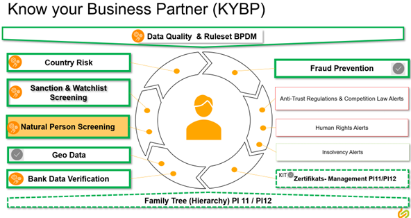
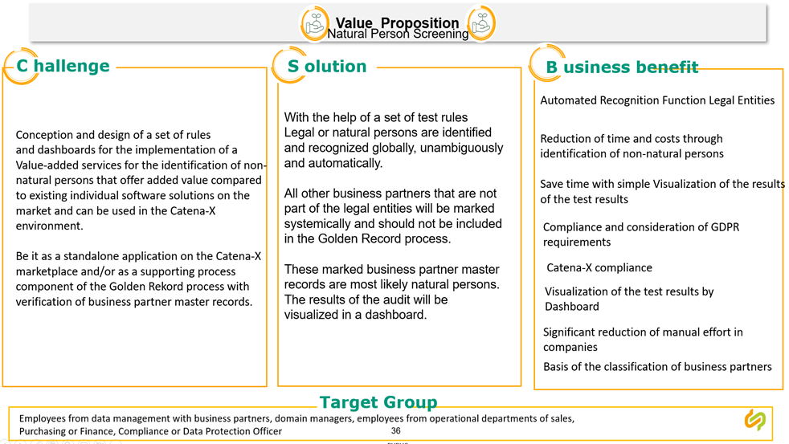

---
tags:
  - CAT/Value Added Services
---

# CX-0079 Natural Person Screening Dashboard v1.2.2

## ABSTRACT

- In view of the fact that Catena-X cannot manage Natural Persons it has to be secured that no Natural Person by accident may be processed or later stored in the pool.

- For historical reasons, companies often have no knowledge of whether the stored Business Partner master record contains a Natural Person. For example, there is a way to change this master record as Natural Person, but this has often not been done consistently in the past.

- In addition, the companies themselves need knowledge of Natural Persons in their systems to comply with GDPR requirements.

The Natural Person Screening application contains rules which secure with a high probability to identify Natural Person data records. The results of the rules can be visualized via a dashboard or consumed via logfiles as well as downloaded via an API. NPS uses the Gate API CX-0074_v3.0.0 and the Pool API CX-0012_v4.0.0 based on the CX-0018 Data Space Connectivity 3.0.0 for pulling BP data records.
NPS is a client/ server cloud application which contains a Web Client and a Cloud Servicer Application.
NPS has to contain a user and authorization management capability aligned with the CX Portal and Marketplace user management. NPS has to be available in English and German language.

## FOR WHOM IS THE STANDARD DESIGNED

The standard enables software and service companies to develop business partner master data quality dashboard applications including accessibility of external 3^rd^ party data sources.

## COMPARISON WITH THE PREVIOUS VERSION OF THE STANDARD

| **Version** | **Publishing Date** | **Description of Change**                                                                                                                                                                                                                                                                                                                                                                                                                                                                                                                                                                                    |
| ----------- | ------------------- | ------------------------------------------------------------------------------------------------------------------------------------------------------------------------------------------------------------------------------------------------------------------------------------------------------------------------------------------------------------------------------------------------------------------------------------------------------------------------------------------------------------------------------------------------------------------------------------------------------------ |
| 1.1.0       |            | Added chapter 3 for NPS API.     |
| 1.2.0       | 2024-03-24 | Corrected 2.3 - country list, Added chapter 3.6 Data Types and 3.7 Data Attributes, Added chapter 3.8 for data sovereignty as additional requirement. |
| 1.2.1      | 2024-09-04 | Moved NPS Style Guide Reference from Normative Section to Non-Normative Section |

## 1 INTRODUCTION

### 1.1 AUDIENCE & SCOPE

> *This section is non-normative*

This standard is relevant for the following audience:

- Catena-X certified Operational Companies acting as:
  - Core Service Provider

This document is focusing on the functionality of the Natural Person Screening Dashboard (NPS) as a screening and monitoring tool of the Golden Record process. NPS rules focus on the analysis of the BP data records on a syntactical and partially semantical content basis. NPS will not focus on correcting or enriching data attributes services. Those services are part of the Golden Record Process.

### 1.2 CONTEXT AND ARCHITECTURE FIT

> *This section is non-normative*

The Natural Person Screening Dashboard is a screening tool and methodology to identify automated with a high probability if a BP data record in the Inbound Persistence is a Natural Person or a Legal Entity. The results of the validation have to be provided via a dashboard.

The NPS dashboard design relies on the Catena-X style guide. See details under:
Open-Source Repository: https://github.com/eclipse-tractusx/portal-shared-components

NPM package: https://www.npmjs.com/package/@catena-x/portal-shared-components/v/2.1.2

Storybook: https://eclipse-tractusx.github.io/portal-shared-components/?path=/docs/chip--docs

The description of the required Gate API CX-0074, Version 3.0.0 is accessible throug the standard library of Catena-X: https://catena-x.net/de/standard-library

> Data Sovereignty: The NPS API allows to download natural person screening related quality results of related business partner data in a data sovereign way, because each Catena-X member has its own area of business partner data in BPDM, where private data (like customer / supplier relationships) is only visible to the Catena-X member.

https://datatracker.ietf.org/doc/html/bcp14

https://www.w3.org/TR/did-core/

### 1.3 CONFORMANCE AND PROOF OF CONFORMITY

*This section is non-normative.*

As well as sections marked as non-normative, all authoring guidelines, diagrams, examples, and notes in this specification are non-normative. Everything else in this specification is normative.

The keywords **MAY**, **MUST**, **MUST NOT**, **OPTIONAL**, **RECOMMENDED**, **REQUIRED**, **SHOULD** and **SHOULD NOT** in this document are to be interpreted as described in BCP 14 [RFC2119] [RFC8174] when, and only when, they appear in all capitals, as shown here.

All participants will need to prove that their solutions conform with the Catena-X standards. To validate that the standards are applied correctly, Catena-X employs Conformity Assessment Bodies (CABs).

To prove conformity with the standard, verify your implementation aligns with the following sharing controller.

[https://github.com/eclipse-tractusx/vas-country-risk-backend/blob/main/docs/swagger/sharing_controller.yml](https://github.com/eclipse-tractusx/vas-country-risk-backend/blob/main/docs/swagger/sharing_controller.yml)

### 1.4 EXAMPLES

Intentionally left blank

### 1.5 TERMINOLOGY

> *This section is non-normative*

**Natural Person**
A Natural Person is a person that is an individual human being.

**Legal Person**
A Legal Person is a Legal Entity as defined in CX-0010.

The Natural Person Screening Dashboard (NPS) has to rely on a set of clearly defined screening rules which are the basis the validate if a Business Partner (BP) is a Natural Person or a Legal Entity. NPS has to capture at least 112 countries based on ISO 3166-1. NPS has to validate BP data records in the Inbound Persistence of the related CX Member who licensed NPS. Each NPS rule has to validate defined attributes of the BP data record via a specific rule set. The architecture of NPS has to based on an exclusion methodology. The outcome of NPS has to provide results if a BP data record is a Natural Person, a Legal Entity or an undefined, unknown or unable to locate person based on the data content and quality provided.

The outcome of the main NPS rule methodologies are described below:

### 1.6 Identifier Check

NPS has to validate if the BP data record in the Inbound Persistence is already a valid
Golden Record data record with a valid BPN ID.

### 1.7 Locality Check

NPS has to validate the locality of the BP data record as a basis for further screening methodologies.

### 1.8  Identification Check

NPS has to validate the given Identifier about their formal correctness and use the content of the Identifier via the NPS rule set to identify a Legal or a Non-Legal Entity.

### 1.9 Check via External Data Sources

NPS has to match BP data entries with appropriate global data sources to identify Natural Persons or Legal Entities.

### 1.10 Legal Form Check

NPS has to validate any Legal Form indicators of the BP data record against country specific company and institutional valid organizational forms.

### 1.11 Final Natural Person Identifier Check

NPS has to validate the BP data records against Natural Person Identifiers on a global basis.

### 1.12 Inbound Persistence

The Inbound Persistence contains the BP data records which were send by a CX Member for
validation and screening via the Gate API as defined in CX-0074 Version 3.0.0.

## 2 MAIN CONTENT

> *This section is normative*

NPS has to be a Value Added Services (VAS) application for Data Provider and Consumer to screen all BP data records in the Inbound Persistence to find a Natural Person data record. NPS has to contain a screening capability which enables that no Natural Person data record will get passed into the Golden Record Process as the process handles solely Legal Entity data records.

NPS has to contain the storage capability of statistical data over a time frame of at least 3 years.

NPS has to contain the following dashboard-based functionalities:

Visualization of BP data records by defined NPS screening methodologies:

Filter capabilities of BP data results

1. By time (year, quarter, month) for rolling 3 years at a minimum
2. By NPS validation classification (Natural Person, Legal Entity, Undefined)
3. By Country
4. By Status Code (Red, Yellow, Green)
5. BP data record detailed with NPS rule results

Number of rules used
Search function and scrollbars
Number of data records validated by NPS

NPS has to contain an administration screen with the following functionalities

1. User Role definition and allocation
2. Regional settings
3. Country and Subregion settings
4. Notification settings
5. Layout and View settings

There is the intent that the results of NPS have to be accessible via a logfile of each CX Member.

The Natural Person Screening (NPS) MUST perform the validation if a BP data record which was uploaded into the Inbound Persistence is a Natural Person that is an individual human being, or a Legal Entity based as defined in CX-0010 Version 2.0.0 or higher. To perform the Natural Person Screening rules, NPS MUST use the Gate API as defined in CX-0074 Version 1.1.0 or higher which MUST be implemented based on the OpenAPI 3.0.1 specification or higher.

### 2.1 Preconditions and Dependencies

To run the NPS the BPDM, Gate API and Pool API SHOULD be set up: https://github.com/eclipse-tractusx/bpdm/blob/main/README.md

### 2.2 NPS Specifications

The NPS rule set MUST use the following BP data record attributes
based on the CX-0074 Version 3.0.0 or higher:

1. Legal Entity which contains the following attributes
2. External ID
3. BPNL
4. Legal Name Parts
5. Legal Form
6. Classifications
7. Legal Address
8. Created at
9. Updated at
10. Legal Entity Identifier
11. Value
12. Type
13. Issuing Body3. Site
14. Address
15. Identifier Type
16. Changelog Entry
17. Identifier Array (Commercial Registry, Company Tax ID, VAT ID, Tax Jurisdiction Code,
DUNS)

### 2.3 NPS usage of Norms

The NPS rule set MUST use the following ISO Norms:

**ISO 20275**
**The NPS rule set MUST use the content of the ISO Norm 20275 to validate the correctness of legal names in long form and/or abbreviation in a transliterated form.

[ISO 20275: Code-Liste für Rechtsträgerformen - GLEIF-Blogbeiträge - Newsroom & Medien -- GLEIF]

**ISO 3166-1**
The NPS rule set MUST use the ISO Norm 3166-1 related codes for at least 112 countries as listed below

**Country List based on ISO 3166-1**
|  |  |  |  |  |  |  |
| :- | :- | :- | :- | :- | :- | :- |
|AD |CL |GE |IS |MC |PL |TJ |
|AE |CN |GH |IT |MD |PT |TM |
|AL |CO |GI |JM |ME |PY |TN |
|AM |CR |GP |JP |MK |QA |TR |
|AR |CU |GR |KE |MT |RO |TT |
|AT |CY |GT |KG |MX |RS |TW |
|AU |CZ |HK |MY |RU |UA |
|AZ |DE |HN |KR |NA |SA |UK |
|BA |DK |HR |KW |NI |SE |US |
|BE |DZ |HT |KZ |NL |SG |UY |
|BG |EC |HU |LB |NO |SI |UZ |
|BO |EE |ID |LK |NZ |SK |VA |
|BR |EG |IE |LT |PA |SM |VE |
|BY |ES |IL |LU |PE |SN |VN |
|CA |FI |IN |LV |PH |SV |XK |
|CH |FR |IR |MA |PK |TH |ZA |
| | | | | | |ZW |

[ISO - ISO 3166 --- Country Codes]

### 2.4 NPS usage of External Data sources

The NPS rule set might use defined external data sources supporting the identification of a Natural Person or Legal Entity using a Natural First and Last Name. The usage of external data sources and related APIs is dependent on the licenses provided by the CX Member as user of NPS.

### 2.5 NPS Results

The NPS rule set MUST provide for each CX Member business partner data record in the Inbound Persistence a result in the NPS Dashboard.

### 2.6 NPS Dashboard

The NPS Dashboard MUST provide the following results:

Visualization of BP data records based on defined NPS screening methodologies:

Filter capabilities of BP data results

1. By time (year, quarter, month) for the duration of up to 3 years into the past
2. By NPS validation classification (Natural Person, Legal Entity, Undefined)
3. By Country
4. By Error Code Status (Red, Yellow, Green)
5. BP Data record detailed with NPS rule results
6. Number of rules used
7. Search function and scrollbars
8. Number of data records validated by NPS

The NPS Dashboard Admin Screen MUST provide the following capabilities:

1. User Role definition and allocation
2. Regional settings
3. Country settings
4. Notification settings
5. Layout and View settings

## 3.0 NPS API

### 3.1 NPS Architecture

The NPS Architecure defines the usage of the NPS API. It secures the intercommuncation between a user and the NPS application to i.e. consume the NPS results out of the NPS logfile.

### 3.2 API Endpoints and Resources

The resources MUST use the well-known HTTP request methods for CRU(D) operations:

- POST MUST be used for create requests
- PUT MUST be used for update requests
- GET MUST be used for read requests

POST MAY also be used for read requests, if input is not given by parameters but rather by an HTTP body to bypass maximum URL length. PUT MAY also be used for upsert requests (create or update) if this is required. A state (active / inactive) at each entity MUST be used for a soft delete, so that the request method DELETE SHALL NOT be used. Other HTTP request methods SHALL NOT be used, including PATCH.

Uploading and downloading data to/from the NPS API MUST follow a staging concept with two stages, so that consumers of the NPS API can compare what they have uploaded into the input stage against what kind of NPS rule results and status code was provided for each business partner data in the output stage. The following controllers MUST distinguish between an input and an output stage.

### 3.3 NPS Data Model

The NPS data model as detailed in the Annex chapter defines all Business Partner data attributes which are needed that NPS can perform the defined screening rules. Furthermore it contains all attributes the NPS dashboard requires to publish the NPS screening results.

### 3.4 Natural Person Controller

The natural person controller MUST allow to create, update, or read (search / return) business partner data records related to an External Identifier or BPN ID in the input and output stage. It MUST have the following resources:

| Business partner Data Controller Resources  |  Description  |
| - | - |
|  PUT/api/nps/input/business partner data     |  Creates business partner data record or updates existing business partner data record in the input stage. |
| GET/api/nps/output/business partner record  | Returns business partner data record from the output stage by different search parameters. |
|  GET/api/nps/input/business partner records  |  Returns business partner data record by different search parameters from the input stage. |

### 3.5 Natural Person Sharing State Controller

The sharing state controller MUST allow to create, update, or read sharing state entries of business partner data records.  The sharing state controller MUST have the following resources:

|  Sharing State Resources |            Description |
| - | - |
| GET/api/nps/sharing-state | Returns sharing states of business partner data filtered by natural person flag, legal name, legal form, External Identifier, address, BPN ID and type, country and status code |
| PUT/api/nps/sharing-state |          Creates or updates a sharing state of a business partner data record |

Each NPS rule creates results which can get accessed via a NPS changlog containing defined status codes by rule

### 3.6 **Available Data Types**

The API **MUST** use JSON as the payload format transported via HTTP. Other formats can be added. These are then, however, **OPTIONAL**.

### 3.7 **Data Asset Structure**

The following data assets **MUST** be registered at the Core Service Provider so that the Sharing Member can negotiate an API usage contract with the Core Service Provider and access its dedicated BPDM Gate (hosted by the Core Service Provider) through these data assets[^6]:

| **Name**                             | **Type** | **Version** | **Description**                                                                                                                                                                                                                                                                                                                                                                   |
| ------------------------------------ | -------- | ----------- | --------------------------------------------------------------------------------------------------------------------------------------------------------------------------------------------------------------------------------------------------------------------------------------------------------------------------------------------------------------------------------- |
| FullAccessNPSInputOutputForSharingMember  | NPS | 1.0         | Grants the Sharing Member full access to the NPS Admin function, NPS database and NPS changelog. This can be used to read business partner NPS rule status in the NPS changelog,  create / update NPS admin settings by Sharing Member role by NPS function, activate and deactivate the usage of external data sourves via defined APIs and license keys. |
| ReadAccessNPSOutputForSharingMember  | NPS | 1.0         | Grants the Sharing Member read access of the NPS changelog.                                                                                                                         |
The OAuth2 client permissions **MUST** be configured to solely allow access to the API resources defined in the corresponding asset, checking HTTP method (read vs. full access), path, query parameters and body of the HTTP request.

### **3.8 POLICY CONSTRAINTS FOR DATA EXCHANGE**

In alignment with our commitment to data sovereignty, a specific framework governing the utilization of data within the Catena-X use cases has been outlined.  As part of this data sovereignty framework, conventions for access policies, for usage policies and for the constraints contained in the policies have been specified in standard 'CX-0152 Policy Constraints for Data Exchange'. This standard document CX-0152 **MUST** be followed when providing services or apps for data sharing/consuming and when sharing or consuming data in the Catena-X ecosystem. What conventions are relevant for what roles named in [1.1 AUDIENCE & SCOPE](#11-audience--scope) is specified in the CX-0152 standard document as well. CX-0152 can be found in the [standard library](https://catenax-ev.github.io/docs/standards/overview).

### **3.9 ERROR HANDLING**

The following http response codes MUST be defined for all resources:  

- 200 – OK  
- 400 – Bad Request
- 401 – Unauthorized
- 403 – Forbidden
- 404 – Not Found  
- 500 – Internal Server Error

HTTP Status Code Registry MUST be adhered to in the implementation for the decision on when to use which error code: https://www.iana.org/assignments/http-status-codes/http-status-codes.xhtml

## 4 REFERENCES

### 4.1 NORMATIVE REFERENCES

[Business Partner Pool API](https://github.com/eclipse-tractusx/bpdm/tree/main/bpdm-pool-api/src/main/kotlin/org/eclipse/tractusx/bpdm/pool/api)

[Business Partner Gate API](https://github.com/eclipse-tractusx/bpdm/tree/main/bpdm-gate-api/src/main/kotlin/org/eclipse/tractusx/bpdm/gate/api)

CX-0018 Eclipse Data Space Connector (EDC), Version 2.1.0

ISO 3166-1 for referencing to the country codes
ISO 20275 for referencing to the globally valid legal forms

### 4.2 NON-NORMATIVE REFERENCES

> *This section is non-normative*

[BPDM Catena-X Website](https://catena-x.net/en/offers-standards/bpdm)

### 4.3 REFERENCE IMPLEMENTATIONS

> *This section is non-normative*

Intentionally left blank.

## ANNEXES

### NPS Data Model

| NPS BP   Data Model                                        | Description                                                                                                                                  | Type                            |
|------------------------------------------------------------|----------------------------------------------------------------------------------------------------------------------------------------------|---------------------------------|
| Legal Entity BPN                                           | Unique   Identification of a legal entity                                                                                                    | Alphanumeric                    |
| Legal Form                                                 | Valid   Lagel Form content based on ISO 20275                                                                                                | Alphanumeric                    |
| Site BPN                                                   | Unique   Identification of a Site location of a defined legal entity                                                                         | Alphanumeric                    |
| Legal Entity External Identifier                           | Unique   Identifier of a business partner data record of a specific CX Member                                                                | Alphanumeric                    |
| Site External Identifier                                   | Unique   Identifier of a site business partner data record of a specific CX Member                                                           | Alphanumeric                    |
| Identifier                                                 | An   array of unique official identifier from grovernmantel organisations or 3rd   party data provider                                       | Enum                            |
| Legal Entity Roles (Customer, Supplier)                    | An   array of defined business partner roles like supplier, customer, one time   supplier, one time customer of business partner             | Enum                            |
| Legal Name Parts                                           | The   complete name of a business partner including the legal form which could   based on the length needs multiple name part fields         | String   Array                  |
| Country                                                    | Country   is represented by the ISO 3166-1 country code                                                                                      | Alphanumeric   String (2 Bytes) |
| Region                                                     | Region   is field which enables each CX Member to summarize multiple countries to one   regional area                                        | Enum                            |
| IsLegal Address                                            | Represents   the relationship between a legal entity and their related address                                                               | Boolean                         |
| Street                                                     | Represents   the offical street name of the entity                                                                                           | String   Array                  |
| Postal Address (Postal Code, City)                         | Represents   the official addess of the entity                                                                                               | String   (Array)                |
| Longitude                                                  | Represents   the official part of the GEO data based on WGS84                                                                                | Float                           |
| Latitude                                                   | Represents   the official part of the GEO data based on WGS84                                                                                | Float                           |
| Altitude                                                   | Represents   the official part of the GEO data based on WGS84                                                                                | Float                           |
|                                                            |                                                                                                                                              |                                 |
| NPS   Dashboard Data Model                                 |                                                                                                                                              |                                 |
| Total BP Records Pool                                      | Represents   the active BP data records in the CX BP Pool                                                                                    | Numeric                         |
| Total Legal BP Records Pool                                | Represents   the active Legal BP data records in the CX BP Pool containing a BPNL ID                                                         | Numeric                         |
| Total Site BP Records Pool                                 | Represents   the active Site BP data records in the CX BP Pool containing a BPNS ID                                                          | Numeric                         |
| Total Address BP Records Pool                              | Represents   the active Address BP data records in the CX BP Pool containing a BPNA ID                                                       | Numeric                         |
| Total BP Records CX Member                                 | Represents   the active BP data records in the CX BP Pool of the CX Member using the NPS   solution                                          | Numeric                         |
| Total Legal BP Records CX Member                           | Represents   the active legal BP data records in the CX Inbound Persistence of the CX   Member using the NPS solution                        | Numeric                         |
| Total Site BP Records CX Member                            | Represents   the active site BP data records in the CX Inbound Persistence of the CX   Member using the NPS solution                         | Numeric                         |
| Total Address BP Records CX Member                         | Represents   the active address BP data records in the CX Inbound Persistence of the CX   Member using the NPS solution                      | Numeric                         |
| Total BP Records Overlap                                   | Represents   the number of how many different CX Members are using the same business   partner data record                                   | Numeric                         |
| Total Legal BP Records Overlap                             | Represents   the number of how many different CX Members are using the same legal business   partner data record                             | Numeric                         |
| Total Site BP Records Overlap                              | Represents   the number of how many different CX Members are using the same site business   partner data record                              | Numeric                         |
| Total Address BP Records Overlap                           | Represents   the number of how many different CX Members are using the same site address   partner data record                               | Numeric                         |
| Implemented Rule Set                                       | Defines   the number of NPS rules used by the NPS application                                                                                | Numeric                         |
| White List                                                 | Defines   company names by using a natural person name being a legal entity                                                                  | String   Array                  |
| Black List                                                 | Defines  a list of natural persons which are no   legal entity and indentified via the NPS rukes                                             | String   Array                  |
| NPS Dashboard Result Date                                  | Defines   the date by which a NPS screening result was performed                                                                             | Numeric                         |
| Total Number Natural Persons (L,S,A)                       | Defines   the number of natural persons found by performing NPS                                                                              | Numeric   Array                 |
| Total Number Natural Persons (L,S,A)                       | Defines   the percentage of natural persons found by performing NPS in relation to the   total number of BP data records of the CX Member     | Percentage   Array              |
| Total Number No Natural Persons (L,S,A)                    | Defines   the number of non-natural persons found by performing NPS                                                                          | Numeric   Array                 |
| Total Number No Natural Persons (L,S,A)                    | Defines   the percentage of non-natural persons found by performing NPS in related to   the total number of BP data records of the CX Member | Percentage   Array              |
| Total Number Natural Persons - Supplier  (L,S,A)           | Defines   the number of natural persons found by performing NPS on the BP type -   supplier                                                  | Numeric   Array                 |
| Total Number Natural Persons - Supplier Undefined  (L,S,A) | Defines   the number of natural persons found by performing NPS on the BP type -   supplier undefined                                        | Numeric   Array                 |
| Total Number Natural Persons - Customer  (L,S,A)           | Defines   the number of natural persons found by performing NPS on the BP type -   customer                                                  | Numeric   Array                 |
| Total Number Natural Persons - Customer Undefined  (L,S,A) | Defines   the number of natural persons found by performing NPS on the BP type -   customer undefined                                        | Numeric   Array                 |
| Hit Score                                                  | Defines   a percentage how many hits were found against total number of BP data records   of a CX Member                                     | Percentage   Array              |
| Traffic Light Marker ( Red, Yellow, Green)                 | Visualize   the NPS results by category allocated by the color red, yellow and green                                                          | String   Array                  |
| Warning Text                                               | Contains   for each NPS rule a text result    category warning                                                                               | String                          |
| Error                                                      | Contains   for each NPS rule a text result    category error                                                                                 | String   Array                  |
| Help Text                                                  | Contains   the user manual and help text components to guide the user how to use NPS                                                         | String                          |
| User Settings                                              | The   user setting enables individual customization of NPS dashboard   functionalities and content                                           | Enum                            |
| Legal Form White List incl. Synonymous terms               | Contains   a list of natural persons acting as legal entities which are valid and   variations of the name                                    | Table                           |
| Legal Form Black List incl. Synonymous terms               | Contains   a list of natural persons acting as legal entities by error and variations of   the name                                           | Table                           |
| Synonymous Table Legal Form long version                   | Contains   variations of legal forms                                                                                                         | Table                           |
| Synonymous Table Legal Form Abbreviations                  | Contains   variations of legal form abbreviations                                                                                            | Table                           |

### FIGURES

> *This section is non-normative*

Intentionally left blank.

### TABLES

> *This section is non-normative*

Intentionally left blank.

## Legal

Copyright © 2025 Catena-X Automotive Network e.V. All rights reserved. For more information, please visit [here](/copyright).
