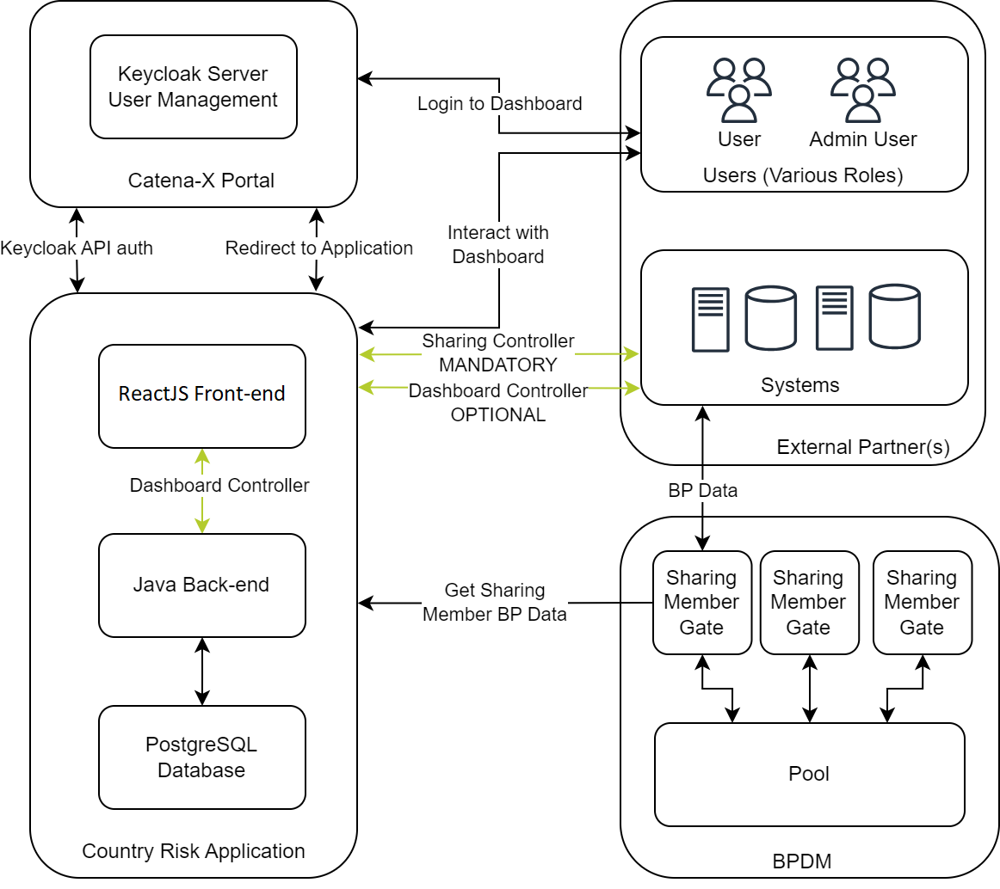
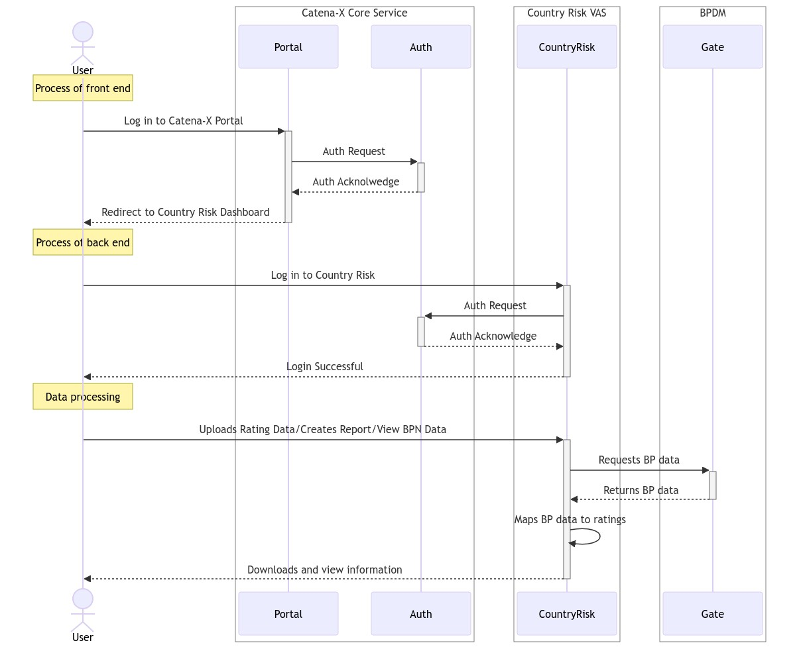
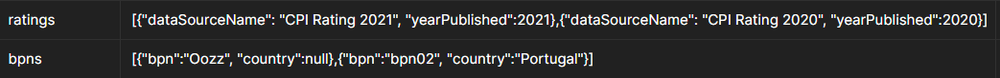
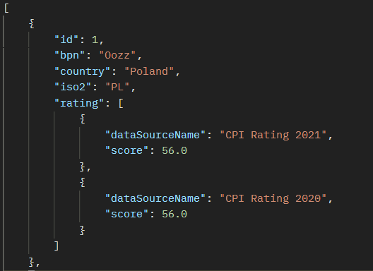

---
tags:
  - CAT/Value Added Services
---

# CX-0081 Country Risk API v1.2.1

## ABSTRACT

The Country Risk Application is a Value-Added Service (VAS) to the Catena-X ecosystem and is meant to assess country specific risks. To accomplish this, the application collects data from ratings, which create country specific scores ranging from 0–100. Which ratings and sources are used is the responsibility of the respective service provider submitting said datasets. These ratings are then mapped to business partners which are collected from sharing member specific sources, namely the Business Partner GATE, to ensure not to mix data between sharing members. A sharing member can display and download its mapped information in a dashboard or receive the information via API calls to use the information in its own systems.

The user can create and upload their own ratings as well and assign country specific values depending on their own research. The country is then classified depending on the user's uploaded rating data. The scope of this document is to describe the dedicated API for this application, for collecting the necessary data from sharing members, as well as how to share the mapped data with them.

This document is to be read in context with the other relevant Catena-X standards. In addition, it assumes that the relevant entities have followed and met all the other dependent onboarding processes and requirements.

You can find the [Gate Standard as CX - 0074 Business Partner Gate API](https://catena-x.net/de/standard-library) and other standards in the standard library of Catena-X: [https://catena-x.net/de/standard-library](https://catena-x.net/de/standard-library)

## FOR WHOM IS THE STANDARD DESIGNED

This document is mainly targeted to technical individuals involved in integrating and developing against this API, as well as business individuals who are involved in the compliance process of this API.

## COMPARISON WITH THE PREVIOUS VERSION OF THE STANDARD

| Version | Description                                                                                                                                                                                                                  | Date       | Author                                                        |
|---------|------------------------------------------------------------------------------------------------------------------------------------------------------------------------------------------------------------------------------|------------| ------------------------------------------------------------- |
| V1.0.0  | Initial release                                                                                                                                                                                                              | 06.10.2023 | Enzio Lincke, Fábio Mota, Alexander Keppler, Korbinian Hutter |
| V1.1.0  | Update regarding generic endpoint of the Gate and the Tractus-X EDC. Affected chapters are [1.2.1.4 The Generic Endpoint](#1214-the-generic-endpoint) & [2.2.3 EDC DATA ASSET STRUCTURE](#223-data-asset-structure) | 22.03.2024 | Fábio Mota, Alexander Keppler                                 |
| V1.2.0  | Update on data asset and added new context for Country Risk. Added new section for Additional Requirements. Affected chapters are [2.2.3 DATA ASSET STRUCTURE](#223-data-asset-structure) & [2.2.5 ADDITIONAL REQUIREMENTS](#225-additional-requirements)                         | 20.06.2024 |        Fábio Mota, Alexander Keppler                                                       |

## 1 INTRODUCTION

### 1.1 AUDIENCE & SCOPE

*This section is non-normative.*

The purpose of this standard is to improve interoperability and provide a standardized solution for the Catena-X network. This standard is relevant for Catena-X certified Operational Companies acting as Business Application Providers. This document focuses on the Country Risk application and its respective API. The API is the base framework for the Country Risk Dashboard, as the front-end dashboard uses API calls to receive relevant data. Country Risk is a VAS of Catena-X and is part of the “Know Your Business Partner”-approach and the business partner Golden Record process.

This standard is relevant for the following roles.

- Data Provider / Consumer
- Business Application Provider

The API as currently implemented consists of two distinct sections, which are listed and referred to as the dashboard and sharing controllers. The dashboard controller implementation is OPTIONAL and not in the scope of this standard. The sharing controller is REQUIRED, and therefore is part of the scope of this standard. The standard is only relevant when a Business Application Provider wishes to obtain certification by Catena-X to offer a Catena-X certified Country Risk application.

### 1.2 CONTEXT AND ARCHITECTURE FIT

*This section is non-normative.*

Geopolitical risks are becoming increasingly relevant in today's VUCA (Volatile, Uncertain, Complex, Ambiguous) environment, and businesses require effective solutions to meet their needs. VUCA times are characterized by rapid changes, such as wars, shortages, and political instabilities to name a few.

The key business challenge is to maintain timely awareness of a business partner's status, whether during ongoing business or during the initial stages of partnership development. Businesses need to know who they are dealing with, particularly when engaging in international partnerships.

The country risk score gives insights into country-specific information related to corruption, political stability, economic risk, and social and structural factors.

There are several challenges that exist when it comes to conducting risk assessments.

- Data is not updated frequently, which means that risk assessments are usually conducted only once a year, leaving assessments dependent on outdated or incorrect information.
- Most risk assessments are still being conducted manually or with semi-automated processes, leading to a greater likelihood of errors.
- Risk assessments are often derived from only a few sources and, as a result, the coverage can be incomplete and not as comprehensive as needed. Not all business partners are considered due to limitations in the amount of time and resources required.
- Extraordinary events are analysed reactively and manually, requiring considerable time and effort.
- With a large system landscape, it is often not possible to perform a direct check of all business partners, and manual data consolidation must take place.
- Finally, manual reconciliation can be error-prone, resulting in potential inaccuracies in the overall risk assessment results.

The below diagram outlines the interaction of the components of the Country Risk application, API and other external objects.



In the below diagram, the two types of access mediums are shown for front-end and back-end access and application usage.



There is a reference implementation for the Country Risk API on GitHub. It is part of a Spring Boot Java open-source software project under the hood of the Eclipse Foundation and follows the Apache 2.0 licenses.

For the complete and up-to-date API setup refer to the following website: https://github.com/eclipse-tractusx/vas-country-risk

For an architecture overview refer to the ARC42 documentation: https://github.com/eclipse-tractusx/vas-country-risk/blob/release/v1.3.1/docs/Arc42-Documentation.md

To use the BPDM Gate API in the Country Risk use case apart from this standard, the following other standards should be considered by all participants for which this standard is relevant:

- CX-0018 Dataspace Connectivity
- CX-0074 Business Partner Gate API

You can find the other standards in the standard library of Catena-X: [https://catena-x.net/de/standard-library](https://catena-x.net/de/standard-library).

### 1.2.1 BUSINESS PARTNER NUMBER (BPN) AND RATING MAPPING LOGIC TO OBTAIN RATING DATA

The Country Risk Application needs to comply with the three different business partner types as per the data model, namely these are:

- Legal Entity
- Site
- Address

Based on this statement, the following data needs to be received from the sharing member’s Business Partner Gate.

#### 1.2.1.1 LEGAL ENTITY

| Attribute    | Description                                                       | Data Type |
| ------------ | ----------------------------------------------------------------- | --------- |
| BPNL         | The identifier of the data set issued by BPDM                     | String    |
| Legal name   | The legal name of the company                                     | String    |
| Street name  | The name of street of the address of this business partner        | String    |
| House number | The number assigned to the property in a street                   | Integer   |
| Postal Code  | The postal code of an area                                        | String    |
| City         | The name of the city from the address of this business partner    | String    |
| Country      | The name of the country from the address of this business partner | String    |
| Longitude    | GPS Coordinates in decimal degrees notation.                      | Float     |
| Latitude     | GPS Coordinates in decimal degrees notation.                      | Float     |

#### 1.2.1.2 SITE

| Attribute    | Description                                                       | Data Type |
| ------------ | ----------------------------------------------------------------- | --------- |
| BPNS         | The identifier of the data set issued by BPN Issuer               | String    |
| Legal name   | The legal name of the company                                     | String    |
| Street name  | The name of the street address of the business partner            | String    |
| House number | The number assigned to a property in a street                     | Integer   |
| Postal Code  | The postal code of an area                                        | String    |
| City         | The name of the city from the address of this business partner    | String    |
| Country      | The name of the country from the address of this business partner | String    |
| Longitude    | GPS Coordinates in decimal degrees notation.                      | Float     |
| Latitude     | GPS Coordinates in decimal degrees notation.                      | Float     |

#### 1.2.1.3 ADDRESS

| Attribute    | Description                                                       | Data Type |
| ------------ | ----------------------------------------------------------------- | --------- |
| BPNA         | The identifier of the data set issued by BPDM                     | String    |
| Legal name   | The legal name of the company                                     | String    |
| Street name  | The name of street of the address of the business partner         | String    |
| House number | The number assigned to the house in a street                      | Integer   |
| Postal Code  | The postal code of an area                                        | String    |
| City         | The name of the city from the address of this business partner    | String    |
| Country      | The name of the country from the address of this business partner | String    |
| Longitude    | GPS Coordinates in decimal degrees notation.                      | Float     |
| Latitude     | GPS Coordinates in decimal degrees notation.                      | Float     |

#### 1.2.1.4 The Generic Endpoint

At the heart of our data acquisition is the Generic Endpoint, a feature of the BPDM Business Partner Gate Api.
This endpoint is engineered to provide a comprehensive stream of data, encompassing the various aspects of business partner information that are crucial for our risk assessment procedures.

**Key Functions of the Generic Endpoint:**

- **Data Aggregation**: It compiles information from multiple types, offering a centralized view of business partner data.
- **Real-Time Updates**: The endpoint ensures that the information is current, reflecting the latest changes and developments.
- **Accessibility**: Designed for ease of use, the Generic Endpoint allows for seamless integration with the existing systems and processes around the golden record process.
- **Comprehensive Data Mapping**: The data provided by the Generic Endpoint is meticulously mapped to the fields of the three business partner types discussed earlier: Legal Entity, Site, and Address. This ensures a coherent and comprehensive data integration, reflecting the data across these distinct yet interconnected categories.

Each piece of information sourced from the Generic Endpoint is carefully aligned with the corresponding attributes of Legal Entity, Site, and Address. This alignment facilitates a uniform and accurate representation of data, contributing significantly to the integrity and reliability of risk assessment processes. The data mapping adheres strictly to the structure and requirements laid out in the previous sections, ensuring consistency and precision in our risk evaluation methodologies.

This endpoints role is integral to maintaining the accuracy and reliability of our risk assessments, ensuring that decisions are made based on the most current and complete information available.

### **1.3 CONFORMANCE AND PROOF OF CONFORMITY**

*This section is non-normative.*

As well as sections marked as non-normative, all authoring guidelines, diagrams, examples, and notes in this specification are non-normative. Everything else in this specification is normative.

The keywords **MAY**, **MUST**, **MUST NOT**, **OPTIONAL**, **RECOMMENDED**, **REQUIRED**, **SHOULD** and **SHOULD NOT** in this document are to be interpreted as described in BCP 14 [RFC2119] [RFC8174] when, and only when, they appear in all capitals, as shown here.

All participants will need to prove that their solutions conform with the Catena-X standards. To validate that the standards are applied correctly, Catena-X employs Conformity Assessment Bodies (CABs).

To prove conformity with the standard, verify your implementation aligns with the following sharing controller.

[https://github.com/eclipse-tractusx/vas-country-risk-backend/blob/main/docs/swagger/sharing_controller.yml](https://github.com/eclipse-tractusx/vas-country-risk-backend/blob/main/docs/swagger/sharing_controller.yml)

### 1.4 EXAMPLES

*This section is non-normative.*

Intentionally left blank.

### 1.5 TERMINOLOGY

*This section is non-normative.*

[Mandatory] The following terms are especially relevant for the understanding of the standard:

- Business Partner Number (BPN): A BPN is the unique identifier of a business partner within Catena-X. There are 3 types of BPNs.
- BPNL: A BPNL represents and uniquely identifies a legal entity, which is defined by its legal name (including legal form, if registered), legal address and tax number.
- BPNS: A BPNS represents and uniquely identifies a site, which is where for example a production plant, a warehouse, or an office building is located.
- BPNA: A BPNA represents and uniquely identifies an address, which can be the legal address of a legal entity, and/or the main address of a site, or any additional address of a legal entity or site (such as different gates).
- BPDM Gate: The Gate is the entry point for each sharing member who exchanges BPDM data with a core service provider. For each sharing member an individual gate is set up. Any bi-directional intercommunication between the sharing member and the BPDM services is handled via the gate. The interoperability with the gate is enabled via a set of APIs. The usage of the gate APIs requires the Tractus-X EDC connector functionalities.
- VAS: Value-Added Service, an additional feature or capability of a core platform.
- Rating: A score provided by an entity regarding the performance of another entity. In the context of this API standard, it is the performance of a given metric of a Business Partner or Country relating to a certain standard. An example might be 2021 CPI of India being X.Y%.

## 2 COUNTRY RISK API

*This section is normative.*

The Country Risk API allows business partners to acquire and represent data records and their respective country risk scores according to the selected ratings. The Country Risk API MUST be implemented based on the [OpenAPI 3.0.1 specification](https://github.com/OAI/OpenAPI-Specification/blob/main/versions/3.0.1.md).

The API documentation can be found in the following directory and file. It is RECOMMENDED to review the API documentation.

[https://github.com/eclipse-tractusx/vas-country-risk-backend/blob/main/docs/swagger/sharing_controller.yml](https://github.com/eclipse-tractusx/vas-country-risk-backend/blob/main/docs/swagger/sharing_controller.yml)

### **2.1 PRECONDITIONS AND DEPENDENCIES**

*This section is non-normative.*

To integrate and connect to the API the following documentation should be reviewed.

For the Country Risk API and database: https://github.com/eclipse-tractusx/vas-country-risk-backend/blob/main/README.md

For the Country Risk Dashboard:https://github.com/eclipse-tractusx/vas-country-risk/blob/main/README.md

A dependency of this specification is that the user has subscribed to a Golden Record solution of a core service provider, and has an operational gate implemented. The Business Partner Gate standard must be implemented as per the following standard:
CX-0074 Business Partner Gate API

### 2.2 API SPECIFICATION

*This section is normative.*

The Country Risk API has no rate limit imposed. Users are RECOMMENDED to implement the necessary monitoring on their infrastructure to log performance metrics, and to facilitate the diagnostics of future support issues.

#### 2.2.1 API ENDPOINTS & RESOURCES

The Country Risk API MUST be implemented as defined in the following OpenAPI document:

[https://github.com/eclipse-tractusx/vas-country-risk-backend/blob/main/docs/swagger/sharing_controller.yml](https://github.com/eclipse-tractusx/vas-country-risk-backend/blob/main/docs/swagger/sharing_controller.yml)

The resources MUST use the well-known HTTP request methods for CRU(D) operations:

- POST MUST be used for create requests.
- PUT MUST be used for update requests.
- GET MUST be used for read requests.

POST MAY also be used for read requests, if input is not given by parameters but rather by an HTTP body to bypass maximum URL length. PUT MAY also be used for upsert requests (create or update) if this is required. A state (active / inactive) at each entity MUST be used for a soft delete, so that the request method DELETE SHALL NOT be used. Other HTTP request methods SHALL NOT be used, including PATCH.

To facilitate the compliance assessment, this chapter additionally lists and describes the API resources of the Country Risk API per API controller.

The following API controllers of the OpenAPI document MUST be implemented:

- [Sharing Controller](https://github.com/eclipse-tractusx/vas-country-risk-backend/blob/main/docs/swagger/sharing_controller.yml)

##### 2.2.1.1 DASHBOARD CONTROLLER

*This section is non-normative.*

The Dashboard Controller allows the Country Risk application to represent data on the front-end user dashboard. For the purpose of this standard, the Dashboard Controller calls are optional.

The API calls listed under the Dashboard Controller are more numerous and beyond the scope of M2M automation and integration, hence are not covered in this document. The full global API consisting of the Dashboard and Sharing Controller can be found below.

[https://github.com/eclipse-tractusx/vas-country-risk-backend/blob/main/docs/swagger/dashboard_controller.yml](https://github.com/eclipse-tractusx/vas-country-risk-backend/blob/main/docs/swagger/dashboard_controller.yml)

##### 2.2.1.2 SHARING CONTROLLER

The Sharing Controller MUST allow the user to read (search / return) information about the sharing members and their business partners.

It MUST have the following resources:

| Sharing Controller Resources                  | Description                                                                                              |
| --------------------------------------------- | -------------------------------------------------------------------------------------------------------- |
| GET/api/sharing/getAllRatingsScoresForEachBpn | Retrieves Mapped ratings to the Business Partners based on inserted year, Company User, Ratings and BPN. |
| GET/api/sharing/getAllRatingsForCompany       | Retrieves ratings based on inserted year and Company user.                                               |

###### 2.2.1.2.1 ESTABLISHING AVAILABLE RATING DATA

To get a list of all available ratings for the desired year, the following endpoint must be called.

> GET/api/sharing/getAllRatingsForCompany

Input Data Example:

| Attribute | Description                                              | Data Type |
| --------- | -------------------------------------------------------- | --------- |
| year      | The year of the publication of the corresponding rating. | Integer   |

Output Data Example:

| Attribute      | Example Output      | Description                                                                                        |
| -------------- | ------------------- | -------------------------------------------------------------------------------------------------- |
| dataSourceName | Test Rating         | Source name of the rating being referenced.                                                        |
| type           | Custom              | Indicates view permissions as; global; company (company of sharing member) and custom (user only). |
| yearPublished  | 2021                | Corresponding year of the rating.                                                                  |
| fileName       | Test Company Rating | Reference to the uploaded rating file.                                                             |

###### 2.2.1.2.2 ESTABLISHING RATINGS FOR BPNS

In order to get a list of ratings for specific BPNs available to the sharing member, the following endpoint has to be called.

> GET/api/sharing/getAllRatingsScoresForEachBpn

Input Data Example:

| Attribute | Description                                                                  | Data Type |
| --------- | ---------------------------------------------------------------------------- | --------- |
| ratings   | A pair of rating name and year, per rating. Can parse multiple rating pairs. | string    |
| bpn       | One or multiple BPNs, including their respective country.                    | string    |

The below image is an example which represents multiple BPNs being entered in the mentioned GET call.



Output Data Example:

| Attribute      | Description                                                                  | Data Type |
| -------------- | ---------------------------------------------------------------------------- | --------- |
| bpn            | One or multiple BPNs.                                                        | string    |
| country        | Indicates the country of the listed BPN.                                     | string    |
| iso2           | Indicates the ISO3166-1 alpha-2 code of the country.                         | string    |
| ratings        | A pair of rating name and year, per rating. Can parse multiple rating pairs. | string    |
| dataSourceName | Source name of the rating being referenced, per rating, if multiple.         | string    |
| score          | The score provided by the rating, per rating, if multiple.                   | float     |
| yearPublished  | The year of the rating, per rating, if multiple.                             | float     |

The below image is an example which represents multiple ratings being returned per BPN.



#### 2.2.2 AVAILABLE DATA TYPES

The API MUST use JSON as the payload format transported via HTTP. Other formats can be added. These are then, however, OPTIONAL.

#### 2.2.3 DATA ASSET STRUCTURE

The following data asset MUST be registered at the Core Service Provider so that the Sharing Member can negotiate an API usage contract with the Core Service Provider and access its dedicated services:

| **Name**                                  | **Type**       | **Version** | **Description**                                                                                                                                                                                                                                                                                                                                                                               |
|-------------------------------------------|----------------|-------------|-----------------------------------------------------------------------------------------------------------------------------------------------------------------------------------------------------------------------------------------------------------------------------------------------------------------------------------------------------------------------------------------------|
| FullAccessCountryRiskSharingForVASUser    | CountryRisk    | 1.3.1       | Grants unrestricted access to business partner data for the Data Consumer of the Country Risk Dashboard and Sharing API. This includes data identified via BPN and enriched from the pool. It allows the use of risk categorizations from various indices within the data consumer's company. Data usage is covered by the *Data Exchange Governance* framework agreement.                           |

For each read resource in the Sharing Country Risk API there MUST be a dedicated Data asset definition.

Example data asset:

```json
{
    "@context": {
        "dct": "https://purl.org/dc/terms/",
        "cx-taxo": "https://w3id.org/catenax/taxonomy#",
        "cx-common": "https://w3id.org/catenax/ontology/common#",
    },
    "@type": "Asset", 
    "@id": "e94272b1-9831-458f-8986-c63c4973ea60", 
    "properties": { 
        "dct:type": {
          "@id": "cx-taxo:CountryRisk"
        },
        "cx-common:name": {
          "@id": "cx-taxo:FullAccessCountryRiskSharingForVASUser"
        },
        "cx-common:version": "1.3.1",
      "cx-common:description": "Grants unrestricted access to business partner data for the Data Consumer of the Country Risk Dashboard and Sharing API. This includes data identified via BPN and enriched from the pool. It allows the use of risk categorizations from various indices within the data consumer's company. Data usage is covered by the *Data Exchange Governance* framework agreement."
    },
    "dataAddress": {
        "@type": "DataAddress",
        "type": "HttpData",
        "baseUrl": "https://<host>/api/sharing",
        "oauth2:tokenUrl": "https://<host>/auth/realms/<realm>/protocol/openid-connect/token",
        "oauth2:clientId": "<technical user>",
        "oauth2:clientSecretKey": "<secret of the technical user>", 
        "proxyMethod": true,
        "proxyPath": true,
        "proxyQueryParams": true,
        "proxyBody": true
    }
}
```

The OAuth2 client permissions MUST be configured to solely allow access to the API resources defined in the corresponding asset, checking HTTP method, path, query parameters and body of the HTTP request sent to the data plane public API which acts as a proxy for the Country Risk API.

#### 2.2.4 ERROR HANDLING

The IANA HTTP Status Code Registry MUST be adhered to in the implementation for the decision on when to use which error code:

[https://www.iana.org/assignments/http-status-codes/http-status-codes.xhtml](https://www.iana.org/assignments/http-status-codes/http-status-codes.xhtml)

The following HTTP response codes MUST be defined for all resources:

| Code | Description           |
| ---- | --------------------- |
| 200  | OK                    |
| 400  | Bad Request           |
| 401  | Unauthorised          |
| 403  | Forbidden             |
| 404  | Not Found             |
| 500  | Internal Server Error |

#### 2.2.5 POLICY CONSTRAINTS FOR DATA EXCHANGE

In alignment with our commitment to data sovereignty, a specific framework governing the utilization of data within the Catena-X use cases has been outlined.  As part of this data sovereignty framework, conventions for access policies, for usage policies and for the constraints contained in the policies have been specified in standard 'CX-0152 Policy Constraints for Data Exchange'. This standard document CX-0152 **MUST** be followed when providing services or apps for data sharing/consuming and when sharing or consuming data in the Catena-X ecosystem. What conventions are relevant for what roles named in [1.1 AUDIENCE & SCOPE](#11-audience--scope) is specified in the CX-0152 standard document as well. CX-0152 can be found in the [standard library](https://catenax-ev.github.io/docs/standards/overview).

## 3 REFERENCES

*This section is non-normative.*

- ISO3166-1: The international standard for country codes and codes for their subdivisions.

### 3.1 NORMATIVE REFERENCES

Intentionally left blank.

### 3.2 NON-NORMATIVE REFERENCES

*This section is non-normative.*

The below link includes further information on the API and is optional.

[https://github.com/eclipse-tractusx/vas-country-risk-backend/blob/main/docs/swagger/sharing_controller.yml](https://github.com/eclipse-tractusx/vas-country-risk-backend/blob/main/docs/swagger/sharing_controller.yml)

The below link includes background information on BPDM and the Value-Added Service Ecosystem.

[https://catena-x.net/en/offers-standards/bpdm](https://catena-x.net/en/offers-standards/bpdm)

The following link is regarding the BPDM Gate API.

[Business Partner Gate API](https://github.com/eclipse-tractusx/bpdm/tree/main/bpdm-gate-api/src/main/kotlin/org/eclipse/tractusx/bpdm/gate/api)

### 3.3 REFERENCE IMPLEMENTATIONS

*This section is non-normative.*

There is a reference implementation for Country Risk APIs on GitHub. It is part of a Java Spring Boot open-source software project under the hood of the Eclipse Foundation and is distributed under the Apache 2.0 license.

The complete and up-to-date setup guide to implement the standard can be found below.

For API and database:

https://github.com/eclipse-tractusx/vas-country-risk-backend

For front-end Dashboard:

https://github.com/eclipse-tractusx/vas-country-risk

The below link references the source code of the back end of the application.

https://github.com/eclipse-tractusx/vas-country-risk-backend/tree/main/src/main/java/org/eclipse/tractusx/valueaddedservice/web/rest

The below link references the source code of the front-end (dashboard) of the application.

https://github.com/eclipse-tractusx/vas-country-risk/tree/main/src/components

## ANNEXES

Reserved for future use.

## FIGURES

*This section is non-normative.*

Reserved for future use.

## TABLES

*This section is non-normative.*

Reserved for future use.

## Legal

Copyright © 2025 Catena-X Automotive Network e.V. All rights reserved. For more information, please visit [here](/copyright).
