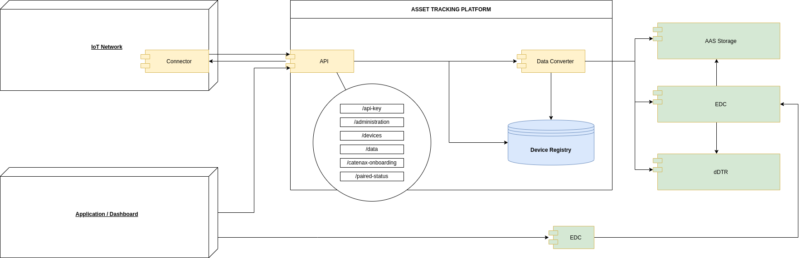
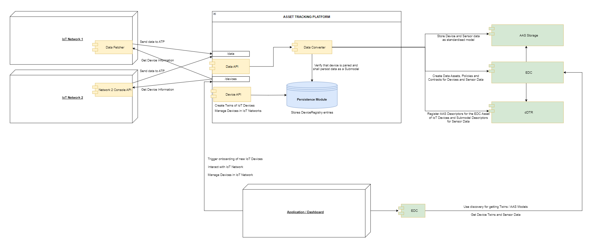
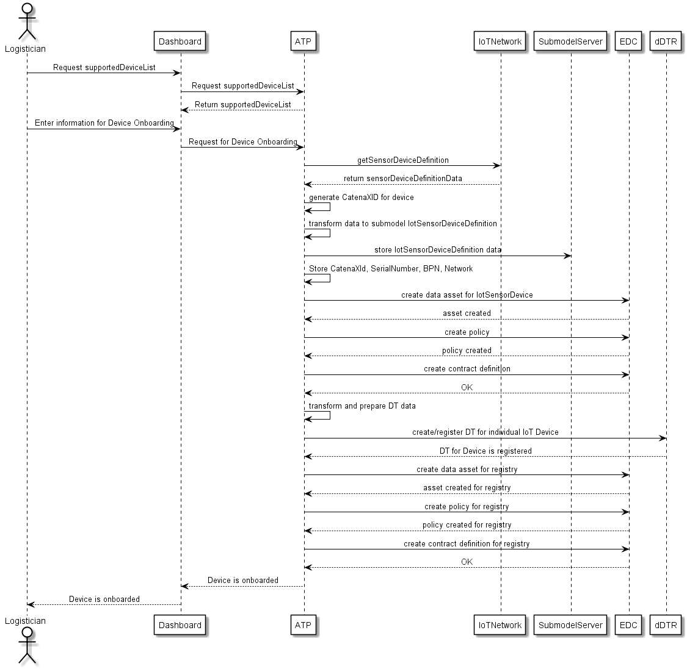
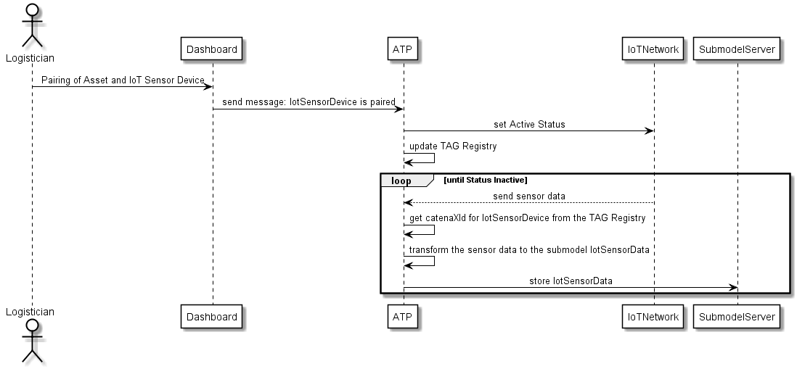
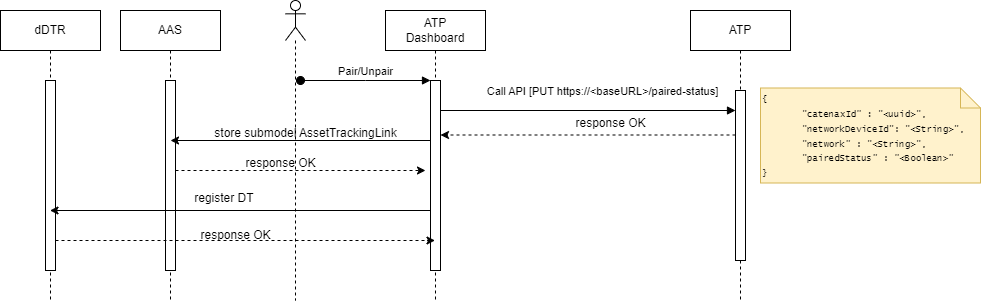

# CX-0105 Asset Tracking Use Case v1.1.0

## ABSTRACT

The asset tracking use case aims to design a standard solution how diverse IoT solutions, available on the free market, can be incorporated into the Catena-X network keeping the interoperability and data sovereignty requirements respected. Although the main goal was always to track company assets with the various IoT devices, based on the set of standards designed by asset tracking use case team, there is a potential to fully use these in any use case in the Catena-X environment and beyond. The model opens the door for any IoT device manufacturer and any network provider to be part of the Catena-X network.

This standard focuses on the Asset Tracking Use Case. It includes relevant requirements for

- ATP (Asset Tracking Platform) as sensor data provider
- Application/Dashboard as data consumer - non standardized tool

## FOR WHOM IS THE STANDARD DESIGNED

Please refer to: AUDIENCE & SCOPE.

## COMPARISON WITH THE PREVIOUS VERSION OF THE STANDARD

This is the initial version of the standard.

## 1 INTRODUCTION

This document defines the so-called standardization triangle for the asset tracking use case.
Standardization triangle hereby means the mandatory components, data models, and APIs that are required to enable the asset tracking use case.

### 1.1 AUDIENCE & SCOPE

> *This section is non-normative*

This document is meant for the following roles:

- Data Provider / Consumer
- Business Application Provider

### 1.2 CONTEXT AND ARCHITECTURE FIT

> *This section is non-normative*

The Asset Tracking Platform aims to bring different IoT sensor networks to a standard Catena-X network and use sensor data for a variety of use cases, like:

- Logistics teams can track their returnable packages and assets at any time using geo data
- Use of automatic filling level measurements to drive efficient vendor-managed inventories
- Users (Tier suppliers, customers, carriers, insurers, etc.) are encouraged to monitor the quality of critical materials at any time during transportation

## Asset Tracking Platform- Component Overview



## Asset Tracking Platform- Process Flow Diagram



**Components:**

**Asset Tracking Platform (Data Provider)**

The Asset Tracking Platform can be understood as a Hub that accepts data from IoT Networks, standardizes it, and enables it for Catena-X Components, Services, and Applications.

**Dashboard/Application (Data Consumer)**

A Dashboard/an Application can be used in the Catena-X Network to visualize sensor data from diverse IoT sensors.

It enables users to search & manage assets, devices, pairs & real-time tracking of assets using geo data sensors, optimizing vendor-managed inventories through automatic filling level measurements, allowing stakeholders Tiers, customers, carriers, insurers, etc.

**Networks**:

The Asset Tracking Platform can be understood as a Hub that accepts data from IoT Networks, standardizes it, and enables it for Catena-X Components, Services, and Applications.

**Business Partners**:

These are external entities, possibly suppliers, manufacturers, carriers, or other stakeholders, who are a part of the Catena-X network. They interact with the system to exchange data related to assets.

**EDC (Eclipse Dataspace Connector)**:

It's the central communication component for Catena-X that acts as a bridge between different data providers and consumers within the Catena-X ecosystem to implement a framework agreement for sovereign, cross-organizational data exchange. It ensures secure and standardized data exchange.

**dDTR (Decentralized Digital Twin registry)**:

It's a decentralized registry that lists all digital twins and references including information about the underlying asset, asset manufacturer, and access options, like aspect endpoints. Moreover, the dDTR is used to register and find data related to DTs.

**AAS (Asset Administration Shell) storage**:

It acts as a database for storing standardized device and sensor data. Devices that are paired/active can send their data to the ATP for standardization. The standardized data will be appended as a Submodel to the AAS of the parent IoT Device. The ATP normalizes the sensor data received from various IoT networks, creates an AAS model, and stores it in the AAS Storage component. It is used to describe an asset electronically in a standardized manner.

**Service discovery:**

It has the ability to map an EDC connector endpoint to a BPN.

**BPN Discovery Service:**

BPN discovery services help to restrict the number of EDCs to be accessed & it maps certain information to a business partner number (BPN). It helps the business application provider to identify the BPN of the data asset under consideration. e.g. to discover available EDC connectors.

### 1.3 CONFORMANCE AND PROOF OF CONFORMITY

> *This section is non-normative*

As well as sections marked as non-normative, all authoring guidelines, diagrams, examples, and notes
in this specification are non-normative. Everything else in this specification is normative.

The key words **MAY**, **MUST**, **MUST NOT**, **OPTIONAL**, **RECOMMENDED**, **REQUIRED**, **SHOULD**
and **SHOULD NOT** in this document document are to be interpreted as described in BCP 14 [RFC2119] [RFC8174]
when, and only when, they appear in all capitals, as shown here.

All participants and their solutions will need to proof, that they conform to the Catena-X standards.
To validate that the standards are applied correctly, Catena-X employs Conformity Assessment Bodies (CABs).

#### 1.3.1 PROOF OF CONFORMITY

> *This section is normative*

To proof conformity with the use case Asset Tracking:

1. An Asset Tracking Platform as a (sensor) data provider:

   - **MUST** be able to convert the device and received network data in standardized semantic data models (IotSensorData and IotSensorDeviceDefinition).
   - **MUST** register Digital Twins for IoT Sensor Devices with specific asset IDs (refer to 2.2 ADDITIONAL REQUIREMENTS)

2. For an Asset Tracking Application as a data consumer:

   - **MUST** be able to link the digital twins of asset with one or multiple devices.
   - The consumption of standardized data **MUST** be done via the EDC.

### 1.4 EXAMPLES

### 1.5 TERMINOLOGY

> *This section is non-normative*

**ATP:**
Asset Tracking Platform

**EDC:**
Eclipse Dataspace Connector

**dDTR:**
Decentral Digital Twin Registry

**Business Partner Number (BPN):**
A BPN is the unique identifier of a partner within Catena-x

**AAS:**
Asset Administration Shell

Additional terminology used in this standard can be looked up in the glossary on the association homepage.

## 2 RELEVANT PARTS OF THE STANDARD FOR SPECIFIC USE CASES

> *This section is normative*

### 2.1 "Asset Tracking: Triangle Document"

#### 2.1.1 LIST OF STANDALONE STANDARDS

To participate in the Asset Tracking use case, the following single standards MUST be fulfilled by all participants for which the standard is relevant:

- CX-0002 Digital Twins in Catena-X v2.0.0
- CX-0018 Eclipse Data Space Connector (EDC) v2.1.0

#### 2.1.2 DATA REQUIRED

#### 2.1.3 ADDITIONAL REQUIREMENTS

#### 2.1.4 DIGITAL TWINS AND SPECIFIC ASSET IDs

The Asset Tracking Platform as a sensor data provider MUST register the  Digital Twins for IoT Sensor Devices with the BPNL for ownerID, device serial number, device type, and name of manufacturer.
ex:

```json

{
    "description": [],
    "globalAssetId": {
        "value": [
            "b77383db-b9ab-48fd-ae43-d44f356d7898"
        ]
    },
    "idShort": "IoTDevice_123-0740-3434-A",
    "identification": "b77383db-b9ab-48fd-ae43-d44f356d7898",
    "specificAssetIds": [
          {
            "value": "BPNL00000003ABXD",
            "key": "ownerID"
        },
        {
            "value": "15698-0740-3434-A",
            "key": "serialNumber"
        },
        {
            "value": "TRACK01111",
            "key": "type"
        },
        {
            "value": "Company A",
            "key": "manufacturer"
        }
    ],
    "submodelDescriptors": [
        {
            "description": [
                {
                    "language": "en",
                    "text": "The Shell for IoT Sensor Device"
                }
            ],
            "idShort": "IotSensorDeviceDefinition",
            "identification": "8c73e97a-62a9-4b29-b33a-e55cfbf5f342",
            "semanticId": {
                "value": [
                    "urn:samm:io.catenax.iot_sensor_device_definition:2.0.0#IotSensorDeviceDefinition"
                ]
            },
            "endpoints": [
                {
                    "interface": "EDC",
                    "protocolInformation": {
                        "endpointAddress": "https://{company_edc}/edcs/19b22764-032d-4625-a9db-cbaa695e5cfa/assets/b77383db-b9ab-48fd-ae43-d44f356d7898",
                        "endpointProtocol": "IDS/ECLIPSE DATASPACE CONNECTOR",
                        "endpointProtocolVersion": "0.0.1-SNAPSHOT"
                    }
                }
            ]
        }
    ]
}

```

## 3 ASPECT MODELS

> *This section is normative*

### 3.1 ASPECT MODEL "IotSensorDeviceDefinition v2.0.0"

#### 3.1.1 INTRODUCTION

This aspect model is needed for the onboarding process of an IoT Sensor Device for the registration in Catena-X network. The onboarding process is done via the Asset Tracking Platform (ATP).

#### 3.1.2 SPECIFICATIONS ARTIFACTS

The modeling of the semantic model specified in this document was done in accordance to the "semantic driven workflow" to create a submodel template specification [SMT](https://industrialdigitaltwin.org/wp-content/uploads/2022/12/I40-IDTA-WS-Process-How-to-write-a-SMT-FINAL-.pdf).
The data model is described in SAMM and like all Catena-X data models, this model is available in a machine-readable format on GitHub2F2F conformant to CX-0003.

#### 3.1.3 LICENSE

This Catena-X data model is an outcome of Catena-X use case group Circular Economy - Asset Tracking (CAT). This Catena-X data model is made available under the terms of the Creative Commons Attribution 4.0 International (CC-BY-4.0) license, which is available at Creative Commons4F4F.

#### 3.1.4 IDENTIFIER OF SEMANTIC MODEL

The semantic model has the unique identifier

> urn:samm:io.catenax.iot_sensor_device_definition:2.0.0

#### 3.1.5 FORMATS OF SEMANTIC MODEL

The data model is described in SAMM. The generated documentation can be found here:
https://github.com/eclipse-tractusx/sldt-semantic-models/tree/main/io.catenax.iot_sensor_device_definition/2.0.0/gen

##### 3.1.5.1 RDF TURTLE

The rdf turtle file, an instance of the Semantic Aspect Meta Model, is the master for generating
additional file formats and serializations.

https://github.com/eclipse-tractusx/sldt-semantic-models/blob/main/io.catenax.iot_sensor_device_definition/2.0.0/IotSensorDeviceDefinition.ttl

The open source command line tool of the Eclipse Semantic Modeling Framework  is used for generation
of other file formats like for example a JSON Schema, aasx for Asset Administration Shell Submodel
Template or a HTML documentation.

##### 3.1.5.2 JSON SCHEMA

A JSON Schema can be generated from the RDF Turtle file. The JSON Schema defines the Value-Only
payload of the Asset Administration Shell for the API operation "GetSubmodel".

https://github.com/eclipse-tractusx/sldt-semantic-models/blob/main/io.catenax.iot_sensor_device_definition/2.0.0/gen/IotSensorDeviceDefinition-schema.json

##### 3.1.5.3 AASX

A AASX file can be generated from the RDF Turtle file. The AASX file defines one of the requested
artifacts for a Submodel Template Specification conformant to \[[SMT](https://industrialdigitaltwin.org/wp-content/uploads/2022/12/I40-IDTA-WS-Process-How-to-write-a-SMT-FINAL-.pdf)].

### 3.2 ASPECT MODEL "IotSensorData v2.0.0"

#### 3.2.1 INTRODUCTION

The aspect model “IotSensorData” represents a set of data collected from IoT sensor devices. The sensor values are interpretable only in relation to the assets which they are attached to.

#### 3.2.2 SPECIFICATIONS ARTIFACTS

The modeling of the semantic model specified in this document was done in
accordance to the "semantic driven workflow" to create a submodel template
specification [SMT](https://industrialdigitaltwin.org/wp-content/uploads/2022/12/I40-IDTA-WS-Process-How-to-write-a-SMT-FINAL-.pdf).

This aspect model is written SAMM as a modeling language and like all Catena-X data models, this model is available in a machine-readable format on GitHub2F2F
conformant to CX-0003.

#### 3.2.3 LICENSE

This Catena-X data model is an outcome of Catena-X use case group Circular Economy - Asset Tracking (CAT).
This Catena-X data model is made available under the terms of the Creative Commons Attribution 4.0 International (CC-BY-4.0) license, which is available at Creative Commons4F4F.

#### 3.2.4 IDENTIFIER OF SEMANTIC MODEL

The semantic model has the unique identifier

> urn:samm:io.catenax.iot_sensor_data:2.0.0

#### 3.2.5 FORMATS OF SEMANTIC MODEL

The data model is described in SAMM.
The generated documentation can be found here:
https://github.com/eclipse-tractusx/sldt-semantic-models/tree/main/io.catenax.iot_sensor_data/2.0.0/gen

##### 3.2.5.1 RDF TURTLE

The rdf turtle file, an instance of the Semantic Aspect Meta Model, is the master for generating
additional file formats and serializations.

https://github.com/eclipse-tractusx/sldt-semantic-models/blob/main/io.catenax.iot_sensor_data/2.0.0/IotSensorData.ttl

The open source command line tool of the Eclipse Semantic Modeling Framework  is used for generation
of other file formats like for example a JSON Schema, aasx for Asset Administration Shell Submodel
Template or a HTML documentation.

##### 3.2.5.2 JSON SCHEMA

A JSON Schema can be generated from the RDF Turtle file. The JSON Schema defines the Value-Only
payload of the Asset Administration Shell for the API operation "GetSubmodel".

https://github.com/eclipse-tractusx/sldt-semantic-models/blob/main/io.catenax.iot_sensor_data/2.0.0/gen/IotSensorData-schema.json

##### 3.2.5.3 AASX

A AASX file can be generated from the RDF Turtle file. The AASX file defines one of the requested
artifacts for a Submodel Template Specification conformant to \[[SMT](https://industrialdigitaltwin.org/wp-content/uploads/2022/12/I40-IDTA-WS-Process-How-to-write-a-SMT-FINAL-.pdf)].

### 3.3 ASPECT MODEL "AssetTrackerLinks v2.0.0"

#### 3.3.1 INTRODUCTION

The aspect model “AssetTrackerLinks” is used by the Asset Tracking Application to create a link between an individual asset and individual IoT sensor device.

#### 3.3.2 SPECIFICATIONS ARTIFACTS

The modeling of the semantic model specified in this document was done in accordance to the "semantic driven workflow" to create a submodel template specification [SMT](https://industrialdigitaltwin.org/wp-content/uploads/2022/12/I40-IDTA-WS-Process-How-to-write-a-SMT-FINAL-.pdf).

This aspect model is written in SAMM as a modeling language and like all Catena-X data models, this model is available in a machine-readable format on GitHub2F2F conformant to CX-0003.

#### 3.3.3 LICENSE

This Catena-X data model is an outcome of Catena-X use case group Circular Economy - Asset Tracking (CAT). This Catena-X data model is made available under the terms of the Creative Commons Attribution 4.0 International (CC-BY-4.0) license, which is available at Creative Commons4F4F.

#### 3.3.4 IDENTIFIER OF SEMANTIC MODEL

The semantic model has the unique identifier

  **urn:samm:io.catenax.asset_tracker_links:2.0.0**

#### 3.3.5 FORMATS OF SEMANTIC MODEL

The data model is described in SAMM. The generated documenattion can be found here: https://github.com/eclipse-tractusx/sldt-semantic-models/tree/main/io.catenax.asset_tracker_links/2.0.0/gen

##### 3.3.5.1 RDF TURTLE

The rdf turtle file, an instance of the Semantic Aspect Meta Model, is the master for generating additional file formats and serializations.

https://github.com/eclipse-tractusx/sldt-semantic-models/blob/main/io.catenax.asset_tracker_links/2.0.0/AssetTrackerLinks.ttl

The open source command line tool of the Eclipse Semantic Modeling Framework  is used for generation of other file formats like for example a JSON Schema, aasx for Asset Administration Shell Submodel Template or a HTML documentation.

##### 3.3.5.2 JSON SCHEMA

A JSON Schema can be generated from the RDF Turtle file. The JSON Schema defines the Value-Only payload of the Asset Administration Shell for the API operation "GetSubmodel".

https://github.com/eclipse-tractusx/sldt-semantic-models/blob/main/io.catenax.asset_tracker_links/2.0.0/gen/AssetTrackerLinks-schema.json

##### 3.3.5.3 AASX

A AASX file can be generated from the RDF Turtle file. The AASX file defines one of the requested
artifacts for a Submodel Template Specification conformant to \[[SMT](https://industrialdigitaltwin.org/wp-content/uploads/2022/12/I40-IDTA-WS-Process-How-to-write-a-SMT-FINAL-.pdf).

## 4 APPLICATION PROGRAMMING INTERFACES

> *This section is normative*

> *This section is normative*

The ATP API is logically structured in five groups:

- API Management / Administration
- Device Management
- Network Administration
- Handling IoT Data
- Catena-X

Each group is protected and thus can only be accessed by providing a valid API Key.

API Management allows you to manage the ATP API. With the basic implementation it comes with creating and deleting API Keys that allows users to access the APIs resources. These endpoints are explicitly protected and only allow access if the requesting entity has the role of an administrator. When initially creating an ATP instance with a database, the
admin key must be provided via the config-file. Newly added keys will, by default, only have the "USER"-role and can therefore not create or delete any new API keys.

The device management resources allows the management of IoT devices in their network. For example, if a user wants to
request a device information which it has in its network, the data can be requested via these endpoints.

Network administration resources provide access to specific management functions provided by the network.

IoT data is handled by sending the data object to a specific API endpoint. By doing so, the data will be handled
depending on the network it was sent from. It is then normalized and provided to the Catena-X network.

Catena-X resources allow the interaction with digital twins. If an IoT device and its data shall be introduced to the
Catena-X network, the user may request the creation of a digital twin via this resource.

## 4.1 PRECONDITIONS AND DEPENDENCIES

In order to persist the necessary data, a persistence module, specifically a database, is REQUIRED by the ATP. In there,
the ATP stores the API Keys and Device Registry Entries that help with associating a devices network and Catena-X
information.

Communication with an IoT network is established via HTTP requests. By doing so, users can request non-standardized data from the respective network.

All standardized data, including the digital representation of an IoT device (Digital Twins, Shell Descriptors) and its data, is provided as a submodel via a decentral AAS. This data is accessible via an EDC. Therefore, when providing and exchanging data to the Catena-X network, an EDC is REQUIRED. The same is applicable for consuming the data, as access to the provided data is also granted via an EDC. Therefore, when consuming data from the ATP, an EDC is also REQUIRED.

To make the data discoverable in the Catena-X network, a Shell Descriptor MUST be created. Therefore, a decentralized DTR instance is REQUIRED.

## 4.2 API SPECIFICATION

### 4.2.1 API ENDPOINTS & RESOURCES

**GET LIST OF IOT DEVICES FROM IOT NETWORK**

**GET**  ``https://{baseURL}/{apiVersion}/devices/{network}``

**Description**:
Receive a list of devices registered in the specified network.

**Path Parameters**

| **Parameter Name** | **Type** | **Decscription** |
|----------------------|------------|-----------------------------------------------------------------------------------------------|
| baseURL             | string    | Base URL                                                                                     |
| apiVersion          | string    | Version name                                                                                 |
| network            | string    | Target network the ATP shall request the data from             |

**Request Headers**

| **Parameter Name**  | **Type**  | **Decscription**                               |
|----------------------|------------|-------------------------------------------------|
| Authorization       | string    | Bearer Token ("Bearer \<key\>")                  |

**Response Structure**

Response if target network is Helium:

```json
[
   {
        "active": true,
        "app_eui": "A000000000123456",
        "app_key": "67221B144A199D9966689BDF425EEBFA",
        "app_s_key": "9ECAF3A8D812345DB7F42EC9800B75EF",
        "dev_eui": "A840414F11821234",
        "devaddr": "48123456",
        "dc_usage": 10,
        "id": "fb212345-5bc9-4c43-8acc-699062cb0419",
        "in_xor_filter": true,
        "labels": [
            {
                "id": "1f58c1c6-a4be-4c8b-920c-123f47a30e12",
                "name": "Label-Name"
            }
        ],
        "last_connected": "2022-08-24T21:01:42",
        "name": "Device Name",
        "nwk_s_key": "1234A97DFB42E31C592ACF369910312B",
        "organization_id": "ac123b7b-6128-4af4-1234-0ea07d37182e",
        "oui": 1,
        "region": "EU123",
        "rx_delay": 1,
        "total_packets": 5
    }
]
```

| **Key**           | **Value Type**    | **Description**   |
|-------------------|-------------------|-------------------|
| active            | boolean           | Device is active (sends data to Helium network) or not |
| app\_eui           | string            | LoRaWAN App EUI uniquely identifies the application of the device |
| app\_key           | string            | LoRaWAN App Key is a shared secret key which is used to derive secure sessions via the Join mechanism |
| app\_s\_key         | string            | The Application Session Key (AppSKey) is used for encryption and decryption of the payload. |
| dev_eui           | string            | LoRaWAN Device EUI uniquely identifies a device |
| devaddr           | string            | A device defined by (AppEUI, DevEUI) can be allocated to any of the DevAddrs owned by the OUI (Organizationally Unique Identifier) |
| dc_usage          | number (int)      | Data Credit Usage of the device |
| id                | string            | Identifier of the device |
| in\_xor\_filter     | boolean           | Allows the Helium Console backend to only process known traffic and avoid spending resources on unfamiliar packets |
| labels            | string            | Labels attached to the device |
| id                | string            | UUID of the Label |
| name              | string            | Name of the Label |
| last\_connected    | string            | Last time the device has sent data to the Console |
| name              | string            | Name of the device |
| nwk\_s\_key         | string            | Network Session Key of the device |
| organization_id   | string            | UUID of the organization the device is registered in |
| oui               | number (int)      | Organizationally Unique Identifier |
| region            | string            | Region the device is in |
| rx\_delay          | number (int)      | Delay when sending data |
| total\_packets     | number (int)      | Total packets the device has sent |

**GET IOT DEVICE BY UUID FROM IOT NETWORK**

**GET** ``https://{baseURL}/{apiVersion}/devices/{network}/{deviceId}``

**Description**
Request the device with the corresponding id from the specified network.

**Path Parameters**

| **Parameter Name** | **Type** | **Decscription**                                                                             |
|----------------------|------------|-----------------------------------------------------------------------------------------------|
| baseURL             | string    | Base URL                                                                                     |
| apiVersion          | string    | Version name                                                                                 |
| network             | string    | Target network the ATP shall request the data from      |
| deviceId            | string    | Identifier of the device in its network                                                      |

**Request Headers**

| **Parameter Name**  | **Type**  | **Decscription**                                |
|----------------------|------------|--------------------------------------------------|
| network             | string    | name of the network (e.g. "helium")             |

**Response Structure**

Response if target network is Helium:

```json
{
    "active": true,
    "app_eui": "A000000000123456",
    "app_key": "67221B144A199D9966689BDF425EEBFA",
    "app_s_key": "9ECAF3A8D812345DB7F42EC9800B75EF",
    "dev_eui": "A840414F11821234",
    "devaddr": "48123456",
    "dc_usage": 10,
    "id": "fb212345-5bc9-4c43-8acc-699062cb0419",
    "in_xor_filter": true,
    "labels": [
        {
            "id": "1f58c1c6-a4be-4c8b-920c-123f47a30e12",
            "name": "Label-Name"
        }
    ],
    "last_connected": "2022-08-24T21:01:42",
    "name": "Device Name",
    "nwk_s_key": "1234A97DFB42E31C592ACF369910312B",
    "organization_id": "ac123b7b-6128-4af4-1234-0ea07d37182e",
    "oui": 1,
    "region": "EU123",
    "rx_delay": 1,
    "total_packets": 5
}
```

| **Key**           | **Value Type**    | **Description**   |
|-------------------|-------------------|-------------------|
| active            | boolean           | Device is active (sends data to Helium network) or not |
| app\_eui           | string            | LoRaWAN App EUI uniquely identifies the application of the device |
| app\_key           | string            | LoRaWAN App Key is a shared secret key which is used to derive secure sessions via the Join mechanism |
| app\_s\_key         | string            | The Application Session Key (AppSKey) is used for encryption and decryption of the payload. |
| dev\_eui           | string            | LoRaWAN Device EUI uniquely identifies a device |
| devaddr           | string            | A device defined by (AppEUI, DevEUI) can be allocated to any of the DevAddrs owned by the OUI (Organizationally Unique Identifier) |
| dc\_usage          | number (int)      | Data Credit Usage of the device |
| id                | string            | Identifier of the device |
| in\_xor\_filter     | boolean           | Allows the Helium Console backend to only process known traffic and avoid spending resources on unfamiliar packets |
| labels            | List              | Labels attached to the device |
| id                | string            | UUID of the Label |
| name              | string            | Name of the Label |
| last\_connected    | string            | Last time the device has sent data to the Console |
| name              | string            | Name of the device |
| nwk\_s\_key         | string            | Network Session Key of the device |
| organization\_id   | string            | UUID of the organization the device is registered in |
| oui               | number (int)      | Organizationally Unique Identifier |
| region            | string            | Region the device is in |
| rx\_delay          | number (int)      | Delay when sending data |
| total\_packets     | number (int)      | Total packets the device has sent |

**CREATE DIGITAL TWIN - Onboarding IoT Device (Catena-X IoT device registration)**

**POST** ``https://{baseURL}/catenax-onboarding``

**Description**:
Create a Digital Twin of the devices with the specified identifier.

In this case the identifier represents the identfier of the device which it has in its own network.

When requesting the creation of a device, the following steps are made:

1 - Get the neccessary information for the device from its network
2 - Create an entry in the DeviceRegistry which contains information of the device in its network and its information in the Catena-X network
3 - Create and save the submodel of the device and its data list (which is at this point empty) at the submodel server
4 - Create a Data Asset in the EDC for the device submodel and data submodel
5 - Create a Policy
6 - Creating a Contract for the device EDC Asset
7 - Creating a Contract for the device data EDC Asset

(if registerTwin is true)

8 - Create a Shell Descriptor/Digital Twin in the dDTR instance
9 - Create a Data Asset for the Shell Descriptor in the EDC

Devices that shall be created as a Digital Twin must be registered in the IoT network before!

**Request Headers**

| **Parameter Name**  | **Type**  | **Decscription**                               |
|----------------------|------------|-------------------------------------------------|
| Authorization        | string    | Bearer Token ("Bearer \<key\>")                  |
| Content-Type        | string    | application/json                              |

**Request Body**

```json
{          
    "id": "fb212345-5bc9-4c43-8acc-699062cb0419",
    "network": "helium",
    "registerTwin": true,
    "ownerID": "BPN0000000001"
}
```

| **Parameter**  | **Value Type**   | **Description**                                                                                                                    |
|--------------------|------------------|---------------------------------------------------------------------------------------------------------------------------------------|
| id             | string           | UUID of the device in the IoT network                                                                                              |
| network        | string           | Network in which the device is registered in                                                                                       |
| ownerID        | string           | BPNL of the data owner                                                                                                             |
| registerTwin   | boolean          | Boolean/Flag which indicates if the EDC data asset for the device shall be registered as a AAS Descriptor in the (d)DTR instance   |

**Response Structure**

```json
{
    "result": "DEVICE_TWIN_CREATED",
    "deviceCxId": "dff4dc9b-1234-4d25-ab66-7780c7e25730",
    "deviceDataCxId": "a720e3f6-ab28-498c-1234-f860d3899326"
}
```

| **Parameter Name**  | **Type**  | **Decscription**                                                                                             |
|----------------------|-------------|---------------------------------------------------------------------------------------------------------------|
| result             | string    | Result of the onboarding task (DEVICE_TWIN_CREATED, DEVICE_TWIN_CREATION_ERROR)                               |
| deviceCxId         | string    | Identiier of the device submodel, also resembles the Catena-X Identifier (null on DEVICE_TWIN_CREATION_ERROR) |
| deviceDataCxId       | string    | Identifier of the device data submodel                                                                        |

**GET ACTIVE STATUS OF DEVICE IN THE IOT NETWORK**

**GET** ``https://{baseURL}/{apiVersion}/devices/{network}/{deviceId}/active-status``

**Description**

Gets the current active-status of a device in its network. This states whether the device sends data to the ATP.

"True" does not neccessarily mean that the data is normalized! Data is only normalized if the device is paired!

**Path Parameters**

| **Parameter Name**  | **Type**  | **Decscription**                                                                             |
|----------------------|------------|-----------------------------------------------------------------------------------------------|
| baseURL             | string    | Base URL                                                                                     |
| apiVersion          | string    | Version name                                                                                |
| network             | string    | Target network the ATP shall request the data from                                             |
| deviceId            | string    | Identifier of the device in its network                                                      |

**Request Headers**

| **Parameter Name** | **Type**  | **Decscription**              |
|--------------------|------------|-------------------------------|
| Authorization      | string    | Bearer Token ("Bearer \<key\>") |

**Response Structure**

```json
{
    "active": true
}
```

| **Parameter Name**  | **Type**  | **Decscription**                                      |
|----------------------|------------|---------------------------------------------------------------|
| active             | boolean    | Device is active in the corresponding network (true/false)   |

**UPDATE ACTIVE STATUS OF DEVICE IN THE IOT NETWORK**

**PUT** ``https://{baseURL}/{apiVersion}/devices/{network}/{deviceId}/active-status``

**Path Parameters**

| **Parameter Name**  | **Type**  | **Decscription**                                                                             |
|----------------------|------------|-----------------------------------------------------------------------------------------------|
| baseURL             | string    | Base URL                                                                                     |
| apiVersion          | string    | Version name                                                                                 |
  | network             | string    | Target network the ATP shall request the data from                                            |
| deviceId            | string    | Identifier of the device in its network                                                      |

**Description**

Activate or deactivate the specified device in the network

**Request Headers**

| **Parameter Name**  | **Type**  | **Decscription**                               |
|----------------------|------------|-------------------------------------------------|
| Authorization        | string    | Bearer Token ("Bearer \<key\>")                  |

**Request Body**

```json
{
    "active": true
}
```

| **Parameter Name**  | **Type**  | **Decscription**                                              |
|----------------------|------------|-----------------------------------------------------------------------|
| active             | boolean    | Request to set a devices active status in the network (true/false)   |

**Response Structure**

```json
{
    "active": true
}
```

| **Parameter Name**  | **Type**  | **Decscription**                                      |
|----------------------|------------|---------------------------------------------------------------|
| active             | boolean    | Active status in the network after the request (true/false)  |

#### 2.2.1.2 Network Administration

**GET NETWORK BALANCE**

**GET**  ``https://{baseURL}/{apiVersion}/administration/balance/{network}``

**Description**

Receive the available balances in a network that the ATP communicates with. As some of the networks are provided by 3rd parties they are not free of charge when using them.

Balances of -1 reflect infinite balance, e.g. when the network does not require payments.

**Path Parameters**

| **Parameter Name**  | **Type**  | **Decscription**                                                                             |
|----------------------|------------|-----------------------------------------------------------------------------------------------|
| baseURL             | string    | Base URL                                                                                    |
| apiVersion          | string    | Version name                                                                                 |
| network             | string    | Target network the ATP shall request the data from                          |

**Request Headers**

| **Parameter Name**  | **Type**  | **Decscription**                               |
|----------------------|------------|-------------------------------------------------|
| Authorization        | string    | Bearer Token ("Bearer \<key\>")                  |

**Response Structure**

``` json

{      
    "network": "helium",
    "balance": 12345,
    "userId": "fb212345-5bc9-4c43-8acc-699062cb0419",
    "userName": "Company Name" 
}
```

| **Parameter Name**    | **Type**     | **Decscription**                                      |
|-----------------------|---------------|-----------------------------------------------------------|
| network              | string       | Requested network                                     |
| balance           | number (int)  | Available balance in the network (-1 equals infinite)     |
| userId              | string       | Identifier of the user/entity the balance belongs to      |
| userName             | string       | Name of the user/entity the balance belongs to            |

#### 4.2.1.3 Sending and Retrieving Data

**GET PAIRED STATUS OF AN IOT DEVICE**

**GET** ``https://{baseURL}/{apiVersion}/paired-status/{network}/{deviceId}``

**Description**

Get the current active/paired status of a device.

Response is determined by the status in the device registry and the network.

If the device is active AND paired in both instances, it is paired and transmitting data.

If the device is either not active in the network or not paired in the Device Registry Entry (or both), no data will be appended to the AAS as a Submodel.

**Path Parameters**

| **Parameter Name**  | **Type**  | **Decscription**                                                                             |
|----------------------|------------|-----------------------------------------------------------------------------------------------|
| baseURL             | string    | Base URL                                                                                     |
| apiVersion          | string    | Version name                                                                                 |
| network             | string    | Target network the ATP shall request the data from                                              |
| deviceId            | string    | Identifier of the device in its network                                                      |

**Request Headers**

| **Parameter Name** | **Type** | **Decscription**                               |
|----------------------|------------|-------------------------------------------------|
| Authorization        | string    | Bearer Token ("Bearer \<key\>")                  |

**Response Structure**

```json
{
    "catenaxId": "fb212345-5bc9-4c43-8acc-699062cb0419",
    "networkDeviceId": "12cb64e7-d3ec-1234-b12b-fc742fcd7210",
    "network": "helium",
    "pairedStatus": true
}
```

| **Parameter Name**  | **Type**  | **Decscription**                     |
|-----------------------|------------|------------------------------------------|
| catenaxId          | string    | Catena-X identifier of the devices twin  |
| networkDeviceId       | string    | Identifier of the device in its network  |
| network              | string    | Network the device is registered in      |
| pairedStatus         | boolean   | Current paired status of the device      |

**UPDATE PAIRED STATUS OF AN IOT DEVICE**

**PUT** ``https://{baseURL}/{apiVersion}/paired-status``

**Description**

Set the current active/paired status of a device.

The status is updated in the Device Registry AND the corresponding IoT network.

If 'pairedStatus' is true, data will be standardized and appended as Submodel to the AAS of the parent device.

If it is false, no data will be handled for the specified device.

**Path Parameters**

| **Parameter Name**  | **Type**  | **Decscription**                                  |
|----------------------|------------|----------------------------------------------------|
| baseURL             | string    | Base URL                                          |
| apiVersion          | string    | Version name                                      |

**Request Headers**

| **Parameter Name**  | **Type**  | **Decscription**                               |
|----------------------|------------|-------------------------------------------------|
| Authorization        | string    | Bearer Token ("Bearer \<key\>")                  |
| Content-Type         | string    | application/json                               |

**Request Body**

```json
{
    "catenaxId": "fb212345-5bc9-4c43-8acc-699062cb0419",
    "networkDeviceId": "12cb64e7-d3ec-1234-b12b-fc742fcd7210",
    "network": "helium",
    "pairedStatus": true
}
```

| **Parameter Name**  | **Type**  | **Decscription**                     |
|-----------------------|------------|------------------------------------------|
| catenaxId          | string    | Catena-X identifier of the devices twin  |
| networkDeviceId       | string    | Identifier of the device in its network  |
| network              | string    | Network the device is registered in      |
| pairedStatus         | boolean   | Target paired status of the device       |

**Response Structure**

```json
{
    "catenaxId": "fb212345-5bc9-4c43-8acc-699062cb0419",
    "networkDeviceId": "12cb64e7-d3ec-1234-b12b-fc742fcd7210",
    "network": "helium",
    "pairedStatus": true
}
```

| **Parameter Name**  | **Type**  | **Decscription**                     |
|-----------------------|------------|------------------------------------------|
| catenaxId          | string    | Catena-X identifier of the devices twin  |
| networkDeviceId       | string    | Identifier of the device in its network  |
| network              | string    | Network the device is registered in      |
| pairedStatus         | boolean   | Current paired status of the device      |

**SEND IN DATA FOR NORMALIZATION**

**POST** ``https://{baseURL}/{apiVersion}/data/{network}``

**Description**
Send data in for normalization.

After normalization, the ATP updates the submodel at the submodel server and appends the normalized data set.

**Path Parameters**

| **Parameter Name**  | **Type**  | **Decscription**                                                                             |
|----------------------|------------|-----------------------------------------------------------------------------------------------|
| baseURL             | string    | Base URL                                                                                     |
| apiVersion          | string    | Version name                                                                                 |
| network             | string    | Target network the ATP shall request the data from                                            |

**Request Headers**

| **Parameter Name**  | **Type**  | **Decscription**                              |
|----------------------|------------|-------------------------------------------------|
| Content-Type         | string    | application/json                               |
| Authorization        | string    | Bearer Token ("Bearer \<key\>")                  |

**Request Body**

**POST** Helium Data (example)

```json
{
    "app_eui": "000AB5BB00001234",
    "dc": {
        "balance": 100,
        "nonce": 3
    },
    "decoded": {
        "payload": {
            "Battery": 80,
            "GPSFixStatus": 1,
            "ReportType": 1,
            "acceleration": 0.004,
            "altitude": 0.001,
            "commandID": 1,
            "humidity": 0.006,
            "inData": "MOCKED",
            "latitude": 9.483179,
            "longitude": 47.655401,
            "pressure": 0.003,
            "protocolVersion": 1,
            "temperature": 0.005,
            "warnings": [],
            "weight": 0.002
        },
        "status": "success"
    },
    "dev_eui": "000AB123C0001234",
    "devaddr": "46000048",
    "downlink_url": "https://console.helium.com/api/v1/down/some/path",
    "fcnt": 2181,
    "hotspots": [
        {
            "channel": 5,
            "frequency": 868.1,
            "hold_time": 0,
            "id": "11yfeXmWN1B6JpMnYu1234kuiTVKACk7usRD2E3znbUEsxAsf",
            "lat": 12.848396253775874,
            "long": 8.657601264609369,
            "name": "some-random-words",
            "reported_at": 1694785894279,
            "rssi": -137,
            "snr": -21.200000762939453,
            "spreading": "SF12BW125",
            "status": "success"
        }
    ],
    "id": "b9982b7c-af85-4863-97c2-80e0b01f20a8",
    "metadata": {
        "adr_allowed": false,
        "cf_list_enabled": false,
        "multi_buy": 1,
        "organization_id": "ac489b7b-6128-4af4-8bb5-0ea07d37182e",
        "preferred_hotspots": [],
        "rx_delay": 1,
        "rx_delay_actual": 1,
        "rx_delay_state": "rx_delay_established"
    },
    "name": "My-IoT-Sensor-Device",
    "payload": "gAIM2wYlmUNEZA==",
    "payload_size": 10,
    "port": 2,
    "raw_packet": "QEYAAEgAhQgCkGI5dwDzzIy1NuDKM7U=",
    "replay": false,
    "reported_at": 1694785894279,
    "type": "uplink",
    "uuid": "0e2187dc-a12b-1234-bfb6-5e7db92f7b68"
}
```

| **Key**               | **Value Type**    | **Description**   |
|-----------------------|-------------------|-------------------|
| app_eui               | string            | LoRaWAN App EUI uniquely identifies the application of the device |
| dc                    | object            | Data Credit Usage |
| balance               | string            | Available balance |
| nonce                 | string            | Data Credits used for transmission |
| decoded               | object            | Decoded Device Data |
| payload               | object            | Decoded Device Payload |
| Battery               | number (int)      | Current Battery Level (percentage) |
| GPSFixStatus          | number (int)      | Indicates the type of signal or technique being used by the GPS receiver to determine its location |
| ReportType            | number (int)      | Report Type |
| acceleration          | number (float)    | Acceleration sensor value (if available) |
| altitude              | number (double)   | Altitude sensor value (if available) |
| commandID             | number (int)      | Command Identifier |
| humidity              | number (float)    | Humidity sensor value (if available) |
| inData                | string            | Input Data |
| latitude              | number (double)   | Latitude sensor value |
| longitude             | number (double)   | Longitude sensor value |
| pressure              | number (float)    | Pressure sensor value (if available) |
| protocolVersion       | number (int)      | Version of the used protocol |
| temperature           | number (float)    | Temperature sensor value (if available) |
| warnings              | list              | Warnings |
| weight                | number (float)    | Weight sensor value (if available) |
| status                | string            | Request status of Heliums POST request |
| dev_eui               | string            | LoRaWAN Device EUI uniquely identifies a device |
| devaddr               | string            | A device defined by (AppEUI, DevEUI) can be allocated to any of the DevAddrs owned by the OUI (Organizationally Unique Identifier) |
| downlink_url          | string            | URL for accessing the device |
| fcnt                  | number (int)      | LoRaWAN FCnt for uplink packets; this increments with every uplink packet and can be useful for surmising whether an uplink was missed |
| hotspots              | list              | Array of hotspots which received the same packet |
| channel               | number (int)      | Channel in which the data was received in Helium |
| frequency             | number (float)    | In MHz, the frequency which the packet was received upon |
| hold_time             | number (int)      | foo |
| id                    | string            | A base58 encoding of the hotspot's public key; this may serve as a concise unique identifier |
| lat                   | number (double)   | The hotspots position latitude |
| long                  | number (double)   | The hotspots position longitude |
| name                  | string            | A human-friendly three-word encoding of the hotspot's public key |
| reported_at           | number (int)      | Timestamp in milliseconds |
| rssi                  | number (float)    | Received Signal Strength Indicator is reported by the hotspot and indicates how strong the signal device's radio signal was |
| snr                   | number (float)    | In dB, Signal to Noise Ratio is reported by the hotspot to indicate how clear the signal was relative to environmental noise |
| spreading             | string            | LoRa Spreading Factor and Bandwidth used for the radio transmission |
| status                | string            | Status of the transmission via hotspot |
| id                    | string            | Device Identifier |
| metadata              | object            | Meta Data information |
| adr_allowed           | boolean           | Adaptive Data Rate (ADR) is a mechanism for adapting the data rate of devices in a LoRaWAN network |
| cf_list_enabled       | boolean           | The Join-Accept CF List configures channels according to the LoRaWAN spec to use sub-band 2 |
| multi_buy             | number (int)      | The Multiple Packets feature provides the ability to pay for additional packets for redundancy and location triangulation purposes |
| organization_id       | string            | Organization Identifier |
| preferred_hotspots    | list              | List of preferred hotspots the device interacts with |
| rx_delay              | number (int)      | Delay time value |
| rx_delay_actual       | number (int)      | Actual delay time value |
| rx_delay_state        | string            | Indicates if the RX Delay value is established |
| name                  | string            | Name of the device |
| payload               | string            | Raw payload of the device |
| payload_size          | number (int)      | Payload size |
| port                  | number (int)      | Port in which the data was received in Helium |
| raw_packet            | string            | Raw data packet of the sensor data |
| replay                | boolean           | Indicates if replay is activated |
| reported_at           | number (int)      | Timestamp in milliseconds |
| type                  | string            | Uplink or Downlink (Uplink = Device sent data, Downlink = Access device) |
| uuid                  | string            | UUID of the process |

**Response Structure**

```text
RESPONSE: OK
```

### 4.2.2 AVAILABLE DATA TYPES

The API MUST use JSON as the payload transported via HTTP.

The following Data Types/Objects can be provided by the API (refer to the endpoints for their concrete use case):

**NetworkBalance**

```json
{
    "type": "object",
    "properties": {
        "balance": {
            "type": "integer",
            "format": "int32"
        },
        "network": {
            "type": "string"
        },
        "userId": {
            "type": "string"
        },
        "userName": {
            "type": "string"
        }
    }
}
```

**ActiveStatus**

```json
{
    "type" : "object", 
    "properties" : {
        "active" : {
            "type" : "boolean"
        }
    }
}
```

**OnboardingInformation**

```json
{
    "type" : "object", 
    "properties" : {
        "identifier" : {
            "type" : "string"
        },
        "network" : {
            "type" : "string"
        },
        "ownerId" : {
            "type" : "string"
        },
        "registerTwin" : {
            "type" : "boolean"
        }
    }
}
```

**PairingInformation**

```json
{
    "type" : "object",
    "properties" : {
        "catenaxId" : {
            "type" : "string"
        },
        "network" : {
            "type" : "string"
        },
        "networkDeviceId" : {
            "type" : "string"
        },
        "pairedStatus" : {
            "type" : "boolean"
        }
    }
}
```

> **Please note:**
These objects do not include the data you will receive when consuming data via the EDC. Please refer to the EDC
documentation and the EDC Data Asset Structure!

### 4.2.3 EDC DATA ASSET STRUCTURE

ATP provides the specific data objects as data assets via an EDC.

There are two relevant data models provided as a data asset:

**IoT Sensor Device Definition**

```json
{
    "catenaXId" : "0e2187dc-a12b-1234-bfb6-5e7db92f7b68",
    "serialNumber" : "some-1234-serial-5678-number",
    "type" : "some-device-type",
    "ownerID" : "BPN0000000001",
    "manufacturer" : "some-manufacturer-name"
}
```

| **Key**               | **Value Type**    | **Description**   |
|-----------------------|-------------------|-------------------|
| catenaXId             | string            | UUID of the devices digital twin |
| serialNumber          | string            | Serial number of the device |
| type                  | string            | Device Type |
| ownerID               | string            | BPN of the device owner |
| manufacturer          | string            | Manufacturer of the device |

**IoT Sensor Data**

```json
{
  "sensorRuntimeData" : [ {
    "sensorData" : [ {
      "sensorValue" : 32.00,
      "sensorUnit" : "unit:Celsius",
      "sensorType" : "Temperature"
    } ],
    "sensorGeoLocation" : {
      "altitude" : 280.20,
      "geoDataTimestamp" : "2023-02-04T14:48:54",
      "latitude" : 40.20361,
      "longitude" : 11.3102
    },
    "batteryLevel" : 50.00,
    "timestamp" : "2023-02-04T14:48:54",
    "transmissionMethod" : "LoRaWAN"
  } ],
  "catenaXId" : "urn:uuid:ed85f17e-29dd-473c-9cb8-d7ad1dc44d2f"
}

```

| **Key**               | **Value Type**    | **Description**   |
|-----------------------|-------------------|-------------------|
| catenaXId             | string            | UUID of the devices digital twin the data was sent from |
| sensorRuntimeData     | object            |The information collected by a Sensor device at an instance in time. |
| sensorData             |object            |The data collected by an IoT Sensor Device.|
| sensorType             | string  | Different types of sensors that are commonly used in various applications, measuring one of the physical properties like Temperature, Pressure, Resistance, Shock, Conduction, Heat Transfer etc. |
| sensorValue               | string            | The measured value of the sensor type. |
| sensorUnit              | string   |Contains a reference to one of the units in the Unit Catalog.|
| timestamp              | string            | Timestamp of the sensoric values |
| sensorGeoLocation      | object            | Geodata, geographic data or geospatial data, refers to data and information that has explicit or implicit association with a location relative to Earth. |
| altitude              | number (double)   |Antenna Altitude above/below mean-sea-level (geoid). |
| latitude              | number (double)   | Latitude value. The angle between zenith and a plane parallel to the equator. |
| longitude             | number (double)   | Longitude value. Geographic coordinate that specifies the east-west position of a point on the Earth's surface. |
| geoDataTimestamp       |string | geoDataTimestamp | The timestamp of the latest sensor reading of the geo data.|
| batteryLevel          |  integer          | The battery level displays how much charge of the battery has been left. |
| transmissionMethod    | string            | The method under which the sensing data is transmitted from the source to the remote node. |

### 4.2.4 ERROR HANDLING

The API provides specific responses for successful and unsuccessful requests.

**HttpStatusCode**

| Code | Meaning               |
|------|-----------------------|
| 200  | OK                    |
| 201  | Created               |
| 400  | Bad Request           |
| 401  | Unauthorized          |
| 403  | Forbidden             |
| 409  | Conflict              |
| 500  | Internal Server Error |

In case of an error, one of the following responses can occur:

| Reason                          | Cause                                                                                         | Response Code |
|---------------------------------|-----------------------------------------------------------------------------------------------|---------------|
| Network not in path             | Network parameter was not given                                                               | 400           |
| Device Identifier not in path   | Device identifier parameter was not given                                                     | 400           |
| Device not found                | Device was not found in its network or in the Device Registry                                 | 400           |
| Device already onboarded        | A device for which the creation of a DT was requested is already saved in the Device Registry | 409           |
| Device not paired               | IoT Data for a device was received but it is not paired                                       | 409           |
| Owner not specified             | Owner was not specified in the request                                                        | 400           |
| Missing Submodel                | Received IoT data but could not find a submodel to attach it to                               | 500           |
| Submodel Server Exception       | Something went wrong while requesting something from the Submodel Server                      | 500           |

## 5 REFERENCES

### 5.1 NORMATIVE REFERENCES

> *This section is normative*

CX-0002 Digital Twins in Catena-X v2.0.0

CX-0018 Eclipse Data Space Connector (EDC) v2.1.0

CX-0045 Aspect Model Data Chain Template v1.1.1

CX-0083 Aspect Model IoTSensorDeviceDefinition v1.0.0

CX-0106 Aspect Model IoTSensorData v1.0.0

CX-0104 Aspect Model AssetTrackerLinks v1.0.0

CX-0070 Asset Tracking Platform API Standardization v1.0.0

### 5.2 NON-NORMATIVE REFERENCES

> *This section is non-normative*

### 5.3 REFERENCE IMPLEMENTATIONS

> *This section is non-normative*

## ANNEXES

### FIGURES

> *This section is non-normative*

## Onboarding Process Of IoT Sensor Devices



## Receive IoT Sensor Data from the network in ATP



## Pair / Unpair IoT Device from an Asset



### TABLES

> *This section is non-normative*

## Legal

Copyright © 2024 Catena-X Automotive Network e.V. All rights reserved. For more information, please visit [here](/copyright).
