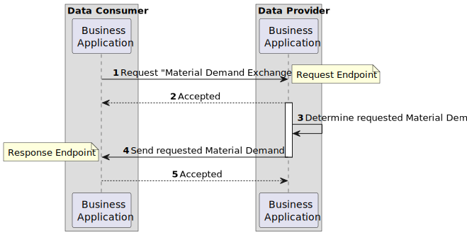

---
tags:
  - CAT/Business Application Provider
  - UC/MaaS
---

# CX-0115 Manufacturing Capability Exchange 1.0.1

## ABSTRACT

Manufacturing-as-a-Service (MaaS) scenarios focus on connecting buyers looking for manufacturers in
possession of the available production know-how and resources to produce specific products.

Sharing information about the required and available manufacturing capabilities in an interoperable
manner is fundamental for any MaaS solution providing basic and value-added services such as
automated search and matchmaking.

A common description of the manufacturing capabilities based on a standardized semantic definition
is therefore key for facilitating such an information exchange between Catena-X participants.

## FOR WHOM IS THE STANDARD DESIGNED

## COMPARISON WITH THE PREVIOUS VERSION OF THE STANDARD

This is the first version of the CX-0115 standard. The CX-0115 standard obsoletes the following
Catena-X standards:

- CX-0052 ManufacturingCapability Aspect Model v1.0.0

## 1 INTRODUCTION

### 1.1 AUDIENCE & SCOPE

> *This section is non-normative*

This standard is relevant for the following roles defined in [[CX-OMW]](#62-non-normative-references):

- **Business Application Provider** providing Manufacturing-as-a-Service solutions
- **Data Provider** willing to provide information about required or available capabilities
- **Data Consumer** interested in requesting information about required or available capabilities
- **On-Boarding Service Provider** supporting the onboarding of participants with their business and
  capability information
- **Enablement Service Provider** that support the workflow regarding the derivation and refinement
  of participants capabilities

The scope of this standard is only the “ManufacturingCapability” aspect model and the provisioning of
manufacturing capabilities data in accordance with [[CX-0002]](#61-normative-references).

### 1.2 CONTEXT AND ARCHITECTURE FIT

> *This section is non-normative*

Buyers occasionally need to search for manufacturers or specific manufacturing process steps. The
reasons for that might be that production at their own premises is currently not possible due to
resource or capacity bottlenecks (e.g. material shortage, machine defect, no machine with required
capabilities available, etc.), that other suppliers are currently not able to deliver a particular
product, or that a prototype of a new product is needed before a production and investment decision
is made. Instead of searching for the right supplier based on already existing but possibly limited
contacts, Catena-X MaaS enables the distribution of a pre-configured manufacturing request across a
network of ODM platforms and supplier networks in a domain-independent and IP-secure manner.

Buyers looking for manufacturers to purchase specific products or manufacturing process steps from,
must provide specific information on how the products should be manufactured. This includes the
required manufacturing capabilities that a manufacturer needs to possess in order to manufacture the
desired product or perform the manufacturing process steps. Manufacturers, on the other hand, are
interested in providing information about their know-how and available capabilities, making them
discoverable for potential buyers and allowing them to acquire new customers, orders and projects.

The standardized "ManufacturingCapability" model defined in this document is a first step towards a
common interoperability of manufacturing capabilities by all participants in a Manufacturing-as-a-Service
scenario. It therefore fosters the interoperability of suppliers and buyers in the manufacturing industry,
enabling faster alignment with less effort and making collaboration less error-prone.

Figure 1 shows the high-level architecture of the manufacturing capability exchange in the Catena-X
dataspace and the services that are involved. Both the data provider and the data consumer must be
members of the Catena-X network in order to communicate with each other.  With the help of the
Credential Service and the Identity Access Management (IAM) each participant can authenticate
itself, verify the identity of the requesting party and decide whether to authorize the request. The
manufacturing capability data is provisioned in accordance with [[CX-0002]](#61-normative-references).


*Figure 1: High-level architecture of the Manufacturing Capability exchange in Catena-X network*

### 1.3 CONFORMANCE AND PROOF OF CONFORMITY

> *This section is non-normative_

As well as sections marked as non-normative, all authoring guidelines, diagrams, examples and notes
in this specification are non-normative. Everything else in this specification is normative.
The key words **MAY**, **MUST**, **MUST NOT**, **OPTIONAL**, **RECOMMENDED**, **REQUIRED**,
**SHOULD** and **SHOULD NOT** in this document are to be interpreted as described in [BCP 14]
[[RFC2119]](#62-non-normative-references) [[RFC8174]](#62-non-normative-references) when, and only when, they appear in all capitals, as shown here.

All participants and their solutions will need to prove, that they are conform with the Catena-X
standards. To validate that the standards are applied correctly, Catena-X employs Conformity
Assessment Bodies (CABs). The proof of conformity for a single semantic model is done according to
the general rules for proving the conformity of data provided to a semantic model or the ability to
consume the corresponding data.

### 1.4 EXAMPLES

The following example shows a value-only JSON serialization of the Manufacturing Capability aspect
model:

```json
{
  "machineTools" : [ {
    "canProcessMaterials" : [ {
      "belongsToMaterialFamilies" : [ {
        "properties" : [ {
          "semanticReferences" : [ {
            "semanticReferenceId" : "urn:eclass:0173-1#02-AAF583#002"
          } ],
          "propertyLabel" : {
            "en" : "nominal voltage"
          },
          "propertyValue" : "220"
        } ],
        "label" : {
          "en" : "aluminum"
        }
      } ],
      "properties" : [ {
        "semanticReferences" : [ {
          "semanticReferenceId" : "urn:eclass:0173-1#02-AAF583#002"
        } ],
        "propertyLabel" : {
          "en" : "nominal voltage"
        },
        "propertyValue" : "220"
      } ],
      "label" : {
        "en" : "aluminum"
      }
    } ],
    "specializes" : [ {
      "hierarchyElementId" : "123"
    } ],
    "generalizes" : [ {
      "hierarchyElementId" : "123"
    } ],
    "hierarchyElementId" : "123"
  } ],
  "processes" : [ {
    "billOfProcessIdentification" : "www.1234-bar-chair-billOfProcess.de"
  } ],
  "machines" : [ {
    "containsTools" : [ {
      "canProcessMaterials" : [ {
        "belongsToMaterialFamilies" : [ {
          "properties" : [ {
            "semanticReferences" : [ {
              "semanticReferenceId" : "urn:eclass:0173-1#02-AAF583#002"
            } ],
            "propertyLabel" : {
              "en" : "nominal voltage"
            },
            "propertyValue" : "220"
          } ],
          "label" : {
            "en" : "aluminum"
          }
        } ],
        "properties" : [ {
          "semanticReferences" : [ {
            "semanticReferenceId" : "urn:eclass:0173-1#02-AAF583#002"
          } ],
          "propertyLabel" : {
            "en" : "nominal voltage"
          },
          "propertyValue" : "220"
        } ],
        "label" : {
          "en" : "aluminum"
        }
      } ],
      "specializes" : [ {
        "hierarchyElementId" : "123"
      } ],
      "generalizes" : [ {
        "hierarchyElementId" : "123"
      } ],
      "hierarchyElementId" : "123"
    } ],
    "label" : {
      "en" : "aluminum"
    },
    "provides" : [ {
      "specializes" : [ {
        "hierarchyElementId" : "123"
      } ],
      "capabilityConstraintSet" : [ {
        "capabilityConstraintProperties" : [ {
          "semanticReferences" : [ {
            "semanticReferenceId" : "urn:eclass:0173-1#02-AAF583#002"
          } ],
          "propertyLabel" : {
            "en" : "nominal voltage"
          },
          "propertyValue" : "220"
        } ],
        "refersToMaterial" : {
          "belongsToMaterialFamilies" : [ {
            "properties" : [ {
              "semanticReferences" : [ {
                "semanticReferenceId" : "urn:eclass:0173-1#02-AAF583#002"
              } ],
              "propertyLabel" : {
                "en" : "nominal voltage"
              },
              "propertyValue" : "220"
            } ],
            "label" : {
              "en" : "aluminum"
            }
          } ],
          "label" : {
            "en" : "aluminum"
          },
          "properties" : [ {
            "semanticReferences" : [ {
              "semanticReferenceId" : "urn:eclass:0173-1#02-AAF583#002"
            } ],
            "propertyLabel" : {
              "en" : "nominal voltage"
            },
            "propertyValue" : "220"
          } ],
          "@type" : "MaterialEntity"
        }
      } ],
      "capabilityId" : "urn:manufacturing-capability:capability:42",
      "capabilityLabel" : {
        "en" : "sawing"
      },
      "generalizes" : [ {
        "hierarchyElementId" : "123"
      } ],
      "semanticReferences" : [ {
        "semanticReferenceId" : "urn:eclass:0173-1#02-AAF583#002"
      } ],
      "hierarchyElementId" : "123"
    } ],
    "properties" : [ {
      "semanticReferences" : [ {
        "semanticReferenceId" : "urn:eclass:0173-1#02-AAF583#002"
      } ],
      "propertyLabel" : {
        "en" : "nominal voltage"
      },
      "propertyValue" : "220"
    } ]
  } ],
  "capabilities" : [ {
    "specializes" : [ {
      "hierarchyElementId" : "123"
    } ],
    "capabilityConstraintSet" : [ {
      "capabilityConstraintProperties" : [ {
        "semanticReferences" : [ {
          "semanticReferenceId" : "urn:eclass:0173-1#02-AAF583#002"
        } ],
        "propertyLabel" : {
          "en" : "nominal voltage"
        },
        "propertyValue" : "220"
      } ],
      "refersToMaterial" : {
        "belongsToMaterialFamilies" : [ {
          "properties" : [ {
            "semanticReferences" : [ {
              "semanticReferenceId" : "urn:eclass:0173-1#02-AAF583#002"
            } ],
            "propertyLabel" : {
              "en" : "nominal voltage"
            },
            "propertyValue" : "220"
          } ],
          "label" : {
            "en" : "aluminum"
          }
        } ],
        "label" : {
          "en" : "aluminum"
        },
        "properties" : [ {
          "semanticReferences" : [ {
            "semanticReferenceId" : "urn:eclass:0173-1#02-AAF583#002"
          } ],
          "propertyLabel" : {
            "en" : "nominal voltage"
          },
          "propertyValue" : "220"
        } ],
        "@type" : "MaterialEntity"
      }
    } ],
    "capabilityId" : "urn:manufacturing-capability:capability:42",
    "capabilityLabel" : {
      "en" : "sawing"
    },
    "generalizes" : [ {
      "hierarchyElementId" : "123"
    } ],
    "semanticReferences" : [ {
      "semanticReferenceId" : "urn:eclass:0173-1#02-AAF583#002"
    } ],
    "hierarchyElementId" : "123"
  } ],
  "certificates" : [ {
    "properties" : [ {
      "semanticReferences" : [ {
        "semanticReferenceId" : "urn:eclass:0173-1#02-AAF583#002"
      } ],
      "propertyLabel" : {
        "en" : "nominal voltage"
      },
      "propertyValue" : "220"
    } ],
    "label" : {
      "en" : "aluminum"
    }
  } ],
  "products" : [ {
    "properties" : [ {
      "semanticReferences" : [ {
        "semanticReferenceId" : "urn:eclass:0173-1#02-AAF583#002"
      } ],
      "propertyLabel" : {
        "en" : "nominal voltage"
      },
      "propertyValue" : "220"
    } ],
    "label" : {
      "en" : "aluminum"
    }
  } ]
}
```

### 1.5 TERMINOLOGY

> *This section is non-normative*

| Term | Description
| --- | ---
| Aspect Model | A formal, machine-readable semantic description (expressed with RDF/turtle) of data accessible from an Aspect.
| Business Partner Number (BPN) | A BPN is the unique identifier of a partner within Catena-X as defined in [[CX-0010]](#61-normative-references).
| Buyer | Person (or organization) using a manufacturing service, e.g. the milling and drilling to produce a part of their own design.
| Capability | A Capability is an Entity which represents a designated function to achieve an effect in the physical or virtual world [Plattform Industrie 4.0]. Inherits relations from Entity. [[Patzer-2023]](#62-non-normative-references)
| Manufacturer | Organization providing a manufacturing service to others, such as milling or drilling.
| Manufacturing Network Registry |  A system able to onboard the capabilities of manufacturers, persist them and perform manufacturing network searches.
| Resource | A (Production) Resource is a function unit needed to perform required operations. It differs from other resources such as energy or raw materials. [[Patzer-2023]](#62-non-normative-references)
| Process | A process is a set of interacting operations in a system by which matter, energy or information is transformed, transported or stored [[IEV 351-42-33]](#62-non-normative-references) A process is a set of process steps or a single process step. It may contain sub-processes. Inherits relations from Entity. [[Patzer-2023]](#62-non-normative-references)
| Product | A Product is a material good or an (immaterial) service offering which is an outcome (output product) or an input (input product) of a Process. Inherits relations from Entity and Asset.
| Property | A Property is an attribute of an Entity which might - but does not need to have – data. [[Patzer-2023]](#62-non-normative-references)
| Digital Twin | Based on CX-0002 Standard a digital twin (DT) describes a digital representation of an asset sufficient to meet the requirements of a set of use cases. For detailed information please refer to [[CX-0002]](#61-normative-references).

Additional terminology used in this standard can be looked up in the glossary on the association homepage.

## 2 RELEVANT PARTS OF THE STANDARD FOR SPECIFIC USE CASES

> *This section is normative*

### 2.1 Manufacturing Capability Exchange

#### 2.1.1 LIST OF STANDALONE STANDARDS

The following Catena-X standards are prerequisite for the implementation of this standard and therefore
**MUST** be considered / implemented by the relevant parties specified in each of them.

| **Number** | **Standard** | **Version**
| --- | --- | ---
| [[CX-0001]](#61-normative-references) | EDC Discovery API | 1.0.2
| [[CX-0002]](#61-normative-references) | Digital Twins in Catena-X | 2.2.0
| [[CX-0003]](#61-normative-references) | SAMM Aspect Meta Model | 1.1.0
| [[CX-0006]](#61-normative-references) | Registration and initial onboarding | 2.0.0
| [[CX-0010]](#61-normative-references) | Business Partner Number (BPN) | 2.0.0
| [[CX-0018]](#61-normative-references) | Dataspace Connectivity | 3.0.0

#### 2.1.2 DATA REQUIRED

No additional data requirements.

#### 2.1.3 POLICY CONSTRAINTS FOR DATA EXCHANGE

In alignment with our commitment to data sovereignty, a specific framework governing the utilization of data within the Catena-X use cases has been outlined.  As part of this data sovereignty framework, conventions for access policies, for usage policies and for the constraints contained in the policies have been specified in standard 'CX-0152 Policy Constraints for Data Exchange'. This standard document CX-0152 **MUST** be followed when providing services or apps for data sharing/consuming and when sharing or consuming data in the Catena-X ecosystem. What conventions are relevant for what roles named in [1.1 AUDIENCE & SCOPE](#11-audience--scope) is specified in the CX-0152 standard document as well. CX-0152 can be found in the [standard library](https://catenax-ev.github.io/docs/standards/overview).

#### 2.1.4 CONFORMITY REQUIREMENTS

The manufacturing capability data **MUST** be sent from the manufacturer to the Manufacturing Network Registry
according to the API standard described in [Chapter 4](#4-application-programming-interfaces).

Participants that act as a Manufacturing Network Registry within Catena-X MaaS **MUST** be able to receive
manufacturing capability data.

Companies that act as manufacturers within Catena-X MaaS **MUST** be able to send manufacturing capability
data.

Every provider of manufacturing capability data **MUST** provide the data conformant to the semantic
model specified in [Chapter 3](#3-aspect-models).

The unique identifier of the semantic model specified in [Chapter 3](#3-aspect-models) **MUST** be used
by the data provider to define the semantics of the data being transferred.

This semantic model **MUST** be made available in the central Semantic Hub.

Data consumers and data provider **MUST** comply with the license of the semantic model defined in
[Chapter 3.1.3](#313-license).

In the Catena-X data space ManufacturingCapability data **MUST** be exchanged via a dataspace connector
conformant to [[CX-0018]](#61-normative-references) and [[CX-0002]](#61-normative-references).

The JSON Payload of data providers **MUST** be conformant to the JSON Schema as specified in this document.

The characteristics BPNL and BPNS **MUST** be used according to the standard [[CX-0010]](#61-normative-references).

#### 2.1.4 DIGITAL TWINS AND SPECIFIC ASSET IDs

The registration and provisioning of digital twins data **MUST** be done in accordance with [[CX-0002]](#61-normative-references).

## 3 ASPECT MODELS

> *This section is normative*

### 3.1 ASPECT MODEL "Manufacturing Capability"

#### 3.1.1 INTRODUCTION

This section describes the "Manufacturing Capability" semantic model used in the Catena-X network.
For the complete semantics and detailed description of its properties refer to the SAMM model in
[Chapter 3.1.5.1](#3151-rdf-turtle).

#### 3.1.2 SPECIFICATIONS ARTIFACTS

The modeling of the semantic model specified in this document was done in accordance to the
"semantic driven workflow" to create a submodel template specification [[SMT]](#62-non-normative-references).

This aspect model is written in SAMM 2.1.0 as a modeling language conformant to [[CX-0003]](#61-normative-references) as
input for the semantic driven workflow.

Like all Catena-X data models, this model is available in a machine-readable format on GitHub
conformant to [[CX-0003]](#61-normative-references).

#### 3.1.3 LICENSE

This Catena-X data model is made available under the terms of the Creative Commons Attribution 4.0
International (CC-BY-4.0) license, which is available at Creative Commons.

#### 3.1.4 IDENTIFIER OF SEMANTIC MODEL

The semantic model has the unique identifier

```text
   urn:samm:io.catenax.manufacturing_capability:3.1.0
```

This identifier **MUST** be used by the data provider to define the semantics of the data being transferred.

#### 3.1.5 FORMATS OF SEMANTIC MODEL

##### 3.1.5.1 RDF TURTLE

The RDF turtle file, an instance of the Semantic Aspect Meta Model, is the master for generating
additional file formats and serializations.

> [https://github.com/eclipse-tractusx/sldt-semantic-models/blob/main/io.catenax.manufacturing_capability/3.1.0/ManufacturingCapability.ttl](https://github.com/eclipse-tractusx/sldt-semantic-models/blob/main/io.catenax.manufacturing_capability/3.1.0/ManufacturingCapability.ttl)

The open source command line tool of the Eclipse Semantic Modeling Framework is used for generation
of other file formats like for example a JSON Schema, aasx for Asset Administration Shell Submodel
Template or a HTML documentation.

##### 3.1.5.2 JSON SCHEMA

A JSON Schema **MUST** be generated from the RDF Turtle file. The JSON Schema defines the Value-Only
payload of the Asset Administration Shell for the API operation *"GetSubmodel"*.

##### 3.1.5.3 AASX

An AASX file **MUST** be generated from the RDF Turtle file. The AASX file defines one of the requested
artifacts for a Submodel Template Specification conformant to [[SMT]](#62-non-normative-references).

## 4 APPLICATION PROGRAMMING INTERFACES

> *This section is normative*

### 4.1 "Manufacturing Capability" API

The Manufacturing Capability API defined in this section enables the exchange of the Manufacturing Capability
data between Catena-X manufacturers and the Manufacturing Network Registry (MNR) in an interoperable
manner. The manufacturer maintains a set of Submodels (one for each plant) and registers them in their
Digital Twin Registry in accordance with [[CX-0002]](#61-normative-references). To exchange the manufacturer's manufacturing
capabilities, the manufacturer must first onboard in Catena-X MaaS. Details on the manufacturer onboarding
process can be found in the Runtime View section of the [[MaaS KIT]](#62-non-normative-references). It is assumed that the
Asset ID is known in Catena-X. Figure 2 shows a high level overview of the intended data exchange flow.


*Figure 2: Manufacturing Capability data exchange flow*

The API relies on asynchronous communication between the involved parties.

1. A data exchange is initiated by the data consumer (Manufacturing Network Registry) sending a
   Pull request to the data provider (Manufacturer) to get the Manufacturing Capabilities.
2. Upon receiving a valid request, the manufacturer sends back the Manufacturing Capability Submodel so that the Manufacturing Network Registry is
   able to process with the capabilities of the Manufacturing Capability Submodel.

#### 4.1.1 PRECONDITIONS AND DEPENDENCIES

To participate in the Catena-X dataspace, both the data consumer and the data provider **MUST** be
registered and onboarded as defined in [[CX-006]](#61-normative-references).

A dataspace connector conformant to [[CX-0018]](#61-normative-references) **MUST** be used
to make the Manufacturing Capability API available to network participants.

The API endpoint defined in [Chapter 4.1.2.1](#4121-api-endpoints--resources) **MUST** therefore be offered as data asset / contract
offer as defined in [[CX-0018]](#61-normative-references).

#### 4.1.2 API SPECIFICATION

##### 4.1.2.1 API Endpoints & Resources

To support the exchange of Manufacturing Capability data, the Manufacturing Network Registry acting
as a data consumer **MUST** define a single endpoint supporting the HTTP GET request method as described
in [[RFC9110]](#62-non-normative-references). The structure of the endpoint **MAY** be freely chosen. The address of the endpoint
**MUST** be provided as part of the data asset structure defined in [Chapter 4.1.3](#413-connector-data-asset-structure) of this document.

Exchanging Data via the Manufacturing Capability API requires manufacturers and the Manufacturing Network
Registry to both act in the roles of data provider and data consumer. The API is a superset of [[CX-0002]](#61-normative-references)
with the following specializations:

- A manufacturer **MUST** host and expose a Submodel ManufacturingCapability via the Submodel-API as
  defined in [[CX-0002]](#61-normative-references).
- Additionally, manufacturers and the Manufacturing Network Registry **MUST** offer the PatchSubmodel-Operation
  with the content-modifier `$value` on all Submodels as defined in [[ AAS Pt.2]](#62-non-normative-references).
- A manufacturer **MUST** be capable to update the ManufacturingCapability-Submodel hosted by the
  Manufacturing Network Registry.

##### 4.1.2.2 Available Data Types

The API **MUST** use JSON as the payload transported via HTTPS.

#### 4.1.3 CONNECTOR DATA ASSET STRUCTURE

Obligations for the data space connector Asset Definition of the Digital Twin Registry are inherited
from [[CX-0002]](#61-normative-references).

Obligations for the data space connector asset definition of a Submodel are inherited from [[CX-0002]](#61-normative-references).

Of the example below, only the `properties`- section is defined as normative. The example only signifies
a single registered Submodel. While bundling several Submodels into a single data space connector asset,
there are no normative requirements for data space connector asset properties.

```json
{
  "@context": {
    "ctx": "https://w3id.org/catenax/taxonomy#",
    "cx-common": "https://w3id.org/catenax/ontology/common#",
    "aas-semantics": "https://admin-shell.io/aas/3/0/HasSemantics/"
  },
  "@id": "{{ID for the data space connector asset}}",
  "properties": {
    "dct:type": {
      "@id": "ctx:Submodel"
    },
    "cx-common:version": "3.0",
    "aas-semantics:semanticId": "{{urn:samm:io.catenax.manufacturing_capability:3.1.0}}"
  },
  "dataAddress": {
    "@type": "DataAddress",
    "type": "HttpData",
    "proxyPath": "true",
    "proxyBody": "true",
    "proxyMethod": "true",
    "proxyQueryParams": "true",
    "baseUrl": "{{Submodel endpoint ending before /submodel}}"
  }
}
```

The API version described in this standard document **MUST** be published in the in the property
`https://w3id.org/catenax/ontology/common#version` as version `1.0` in the asset. The requester of an
asset **MUST** be able to handle multiple assets for this endpoint, being differentiated only by the
version. The requester **SHOULD** choose the asset with the highest compatible version number
implemented by themselves. If the requester cannot find a version compatible with their own, the
requester **MUST** terminate the data transfer.

##### Connector Policy Definition

The following policy is an example to let a single business partner pass. As described in standard CX-0152, this policy constraint can only be used as part of an `accessPolicy`.

```json
{
  "@context": [
    "http://www.w3.or/ns/odrl.jsonld",
    "https://w3id.org/catenax/2025/9/policy/context.jsonld"
  ],
  "@type": "Set",
  "@id": "{{POLICY-DEFINITION-ID}}",
  "policy": {
    "permission": [
      {
        "action": "access",
        "constraint": [
          {
            "and": [
            "leftOperand": "BusinessPartnerNumber",
            "operator": "isAnyOf",
            "rightOperand": "{{hard-coded BPNl of privileged consumer}}"
            ]
          }
        ]
      }
    ]
  }
}
```

##### Connector Contract Definition

The following example for a data space connector contract definition connects the defined policy to
the defined asset.

```json
{
  "@context": {
    "@vocab": "https://w3id.org/edc/v0.0.1/ns/"
  },
  "@type": "ContractDefinition",
  "@id": "contract-definition-id",
  "accessPolicyId": "{{POLICY-DEFINITION-ID}}",
  "contractPolicyId": "{{POLICY-DEFINITION-ID}}",
  "assetsSelector": [
    {
      "operandLeft": "https://w3id.org/edc/v0.0.1/ns/id",
      "operator": "=",
      "operandRight": "{{ID for the EDC Asset}}"
    }
  ]
}
```

#### 4.1.4 ERROR HANDLING

Error handling is specified by [[CX-0002]](#61-normative-references) and [[AAS Pt.2]](#62-non-normative-references).

#### 4.1.5 DTR REGISTRATION

As mandated by [[CX-0002]](#61-normative-references), all Data-Providers must provide a Digital Twin Registry (DTR) and use it
to link their Submodels to identified assets. Assets in the DTR are identified via `specificAssetIds`.

When registering Submodels with `semanticId` `ManufacturingCapability`, the data provider (Manufacturer)
**MUST** create a single specificAssetId with key creationEntityId and value a UUIDv4 as value.

All other attributes are standardized in [[CX-0002]](#61-normative-references) or [[AAS Pt.2]](#62-non-normative-references) respectively.

Example:

```json
{
  "id": "{{id of the AAS}}",
  "idShort": "{{short name of the AAS}}",
  "specificAssetIds": [
    {
      "name": "creationEntityId",
      "value": "{{someUuidV4}}",
      "externalSubjectId": {
        "type": "ExternalReference",
        "keys": [
          {
            "type": "GlobalReference",
            "value": "*"
          }
        ]
      }
    }
  ],
  "submodelDescriptors": [
    {
      "id": "{{someSubmodelId}}",
      "semanticId": {
        "type": "ExternalReference",
        "keys": [
          {
            "type": "GlobalReference",
            "value": "urn:samm:io.catenax.manufacturing_capability:3.1.0"
          }
        ]
      },
      "endpoints": [
        {
          "interface": "SUBMODEL-3.0",
          "protocolInformation": {
            "href": "{{dataplane baseurl extended with the appropriate path ending on /submodel}}",
            "endpointProtocol": "HTTP",
            "endpointProtocolVersion": [
              "1.1"
            ],
            "subprotocol": "DSP",
            "subprotocolBody": "id={{ID of the data space connector asset the submodel is living behind}};dspEndpoint={{controlPlaneEndpoint}}",
            "subprotocolBodyEncoding": "plain",
            "securityAttributes": [
              {
                "type": "NONE",
                "key": "NONE",
                "value": "NONE"
              }
            ]
          }
        }
      ]
    }
  ]
}
```

#### 4.1.6 DATA EXCHANGE

Restrictions on the exchanged data can be retrieved from the data models. Additionally, the following
definitions apply.

The ManufacturingCapability Submodel data **MUST** be sent from the manufacturer to the Manufacturing
Network Registry using an HTTP GET response. The data format described here **MUST** be followed for
the exchange of the capabilities needed for manufacturing.

Multiple ManufacturingCapability aspects **MAY** be sent in one transfer as a JSON list. If only one
ManufacturingCapability aspect is transmitted, it **MUST** still be sent as a list with one entry.

The serialized JSON **MUST NOT** be larger than 15 MiB in size.

The ManufacturingCapability endpoint **MUST** be implemented by all participants who wish to participate
in Catena-X MaaS as a manufacturer. Manufacturers **MUST** be able to response with their manufacturing
capabilities to the Manufacturing Network Registry HTTP GET request.

The data payload itself **MUST** be a valid JSON string.

All attributes marked as mandatory in ManufacturingCapability aspect model **MUST** be included in the
dataset. Attribute marked as 'Optional' can be included in the data set.

The usage of the attributes in the data model **MUST** follow the attribute descriptions in the definitions
of the ManufacturingCapability aspect model.

When exchanging data, the usage of UUIDv4 is required in order to reduce the probability of
collision as well as to eliminate certain attack vectors. The UUIDv4 **MUST** be generated according to
[[RFC4122]](#62-non-normative-references).

## 5 PROCESSES

> *This section is normative*

Not applicable.

## 6 REFERENCES

### 6.1 NORMATIVE REFERENCES

> *This section is normative*

| **Number** | **Standard** | **Version**
| --- | --- | ---
| [CX-0001] | EDC Discovery API | 1.0.2
| [CX-0002] | Digital Twins in Catena-X | 2.2.0
| [CX-0003] | SAMM Aspect Meta Model | 1.1.0
| [CX-0006] | Registration and initial onboarding | 2.0.0
| [CX-0010] | Business Partner Number (BPN) | 2.0.0
| [CX-0018] | Dataspace Connectivity | 3.0.0
| [CX-0152] | Policy Constraints for Data Exchange | 1.0.0

### 6.2 NON-NORMATIVE REFERENCES

> *This section is non-normative*

| **Context** | **Link**
| --- | ---
| [CX-OMW] | [Catena-X Operating Model](https://catenax-ev.github.io/docs/next/operating-model/why-introduction)
| [RFC2119] | Bradner, S. Key words for use in RFCs to Indicate Requirement Levels. Available online: https://datatracker.ietf.org/doc/html/rfc2119
| [RFC4122] | A Universally Unique Identifier (UUID) URN Namespace (https://www.rfc-editor.org/rfc/rfc4122)
| [RFC8174] | Leiba, B. Ambiguity of Uppercase vs Lowercase in RFC 2119 Key Words. Available online: https://datatracker.ietf.org/doc/html/rfc8174
| [RFC9110] | HTTP Semantics (https://www.rfc-editor.org/rfc/rfc9110)
| [SMT] | How to create a submodel template specification. Guideline. Download from: https://industrialdigitaltwin.org/wp-content/uploads/2022/12/I40-IDTA-WS-Process-How-to-write-a-SMT-FINAL-.pdf
| [IEV 351-42-33] | International Electrotechnical Commission. IEC TS 62443-1-1:2009: Industrial communication networks - Network and system security - Part 1-1: Terminology, concepts and models, 2009 (1.0). Available online: https://webstore.iec.ch/publication/7029
| [Patzer-2023] | Patzer, F.; Schnebel, B.; Schöppenthau, F.; Watson, K. Smart Factory Web Ontology Specification: Version 1.0. Available online: https://www.smartfactoryweb.de/docs/models/SFW_Ontology_Spec_1.0.pdf
| [MaaS KIT] | Eclipse Tractus-X MaaS KIT https://eclipse-tractusx.github.io/docs-kits/category/maas-kit

### 6.3 REFERENCE IMPLEMENTATIONS

> *This section is non-normative*

Not applicable.

## Legal

Copyright © 2025 Catena-X Automotive Network e.V. All rights reserved. For more information, please visit [here](/copyright).
