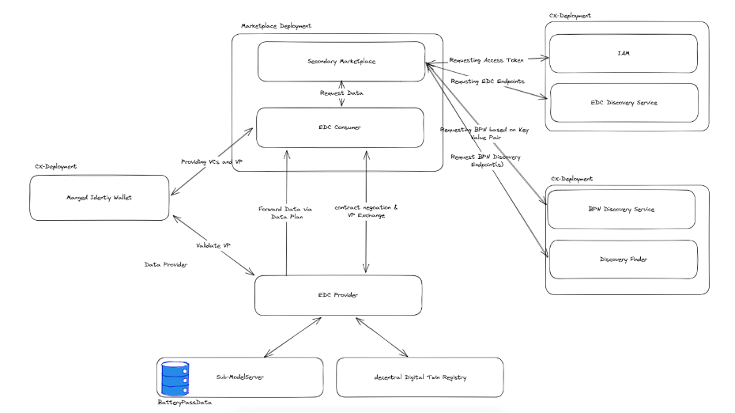

---
tags:
  - CAT/Business Application Provider
  - UC/Circularity
---

# CX-0117 Use Case Circular Economy - Secondary Marketplace v1.0.0

## ABSTRACT

This standard focuses on the Secondary Marketplace use case. This includes relevant requirements for data provider, that want to provide relevant data for a Marketplace Offer through Catena-X, data consumer, that are searching for detailed product information in Catena-X and Application developer/provider supporting the consuming data for detailed information of product in the marketplace of
battery passports.
In the first version the Marketplace just consume data for offered Batteries. Therefore the application use the BatteryPassport data model.

## FOR WHOM IS THE STANDARD DESIGNED

## COMPARISON WITH THE PREVIOUS VERSION OF THE STANDARD

The CX-0117 Use Case Circular Economy - Secondary Marketplace v1.0.0 is a new standard which is based on the deprecated CX-0100 Triangle for Secondary Marketplace v1.0.0 standard. The data models from:

- CX-0033 Data Model ReturnRequest (deprecated)
- CX-0034 Data Model Battery Pass (deprecated)
- CX-0035 Data Model Marketplaceoffer (deprecated)

have been included with their newest released versions to assure consistency between standards.

## 1 INTRODUCTION

### 1.1 AUDIENCE & SCOPE

> *This section is non-normative*

This document focuses on the Secondary Marketplace use case. This includes relevant requirements for

- Data provider, that want to provide relevant data for a Marketplace Offer through Catena-X,
- Data consumer, that are searching for detailed product informations in Catena-X and
- Application developer/provider supporting battery passport data consumption in the markertplace.

In the first version the Marketplace consumes data for offered Batteries.
Therefore the application uses the BatteryPassport data model.

Note: Fulfilling a use-case standard by a data provider / consumer can be done in two ways: A) Purchase a certified app for the use-case.
In this case the data provider / consumer does not need to proof conformity again and B) Data Provisioning / Consumption without a certified app for the use-case.
In this case the data provider / consumer needs to proof conformity with all single standards listed in this document.

### 1.2 CONTEXT AND ARCHITECTURE FIT

> *This section is non-normative*

A secondary marketplace is fundamental to establish a circular economy where components and materials are available and offered to the interested users creating new value chains and extending the life of the parts and the materials before becoming waste.

The secondary marketplace is able to display additional information on the products, specifically batteries. In order to offer additional information about the battery to potential buyers, the marketplace uses the BatteryPass sub-model. This allows buyers to access real data.

### 1.3 CONFORMANCE AND PROOF OF CONFORMITY

> *This section is non-normative*

As well as sections marked as non-normative, all authoring guidelines, diagrams, examples, and notes in this specification are non-normative. Everything else in this specification is normative.

The key words **MAY**, **MUST**, **MUST NOT**, **OPTIONAL**, **RECOMMENDED**, **REQUIRED**, **SHOULD** and **SHOULD NOT** in this document document are to be interpreted as described in BCP 14 [RFC2119] [RFC8174] when, and only when, they appear in all capitals, as shown here.

All participants and their solutions will need to prove, that they are conform with the Catena-X standards.
To validate that the standards are applied correctly, Catena-X employs Conformity Assessment Bodies (CABs).

To prove conformity with the use case marketplace standard standard as a data consumer or app provider demonstrate that you

- can find battery passports in the network associated with the product listing of said battery on the marketplace
- can distinguish the battery passport information from other submodels offered in the network
- can visualize battery passports as additional listing information for a battery listed on the marketplace

To prove conformity with the use case Marketplace standard as data provider you MUST show that you follow the standards listed under 2.1.1 List of Standalone Standards

To prove conformity with the use case Marketplace standard as app provider you MUST show that you follow the standards listed under 2.1.1 List of Standalone Standards

### 1.4 EXAMPLES

```
    No Example provided.
```

### 1.5 TERMINOLOGY

> *This section is non-normative*

Not applicable.

## 2 RELEVANT PARTS OF THE STANDARD FOR SPECIFIC USE CASES

> *This section is normantive*

### 2.1 USE CASE CIRCULAR ECONOMY SECONDARY MARKETPLACE

#### 2.1.1 LIST OF STANDALONE STANDARDS

To participate in the Circular Economy Secondary Marketplace use-case, the following single standards MUST be fulfilled by all participants for which the standard is relevant:

- [CX-0001:1.0](https://catena-x.net/en/library) EDC Discovery API
- [CX-0002:2.2](https://catena-x.net/en/library) Digital Twins in Catena-X
- [CX-0003:1.1](https://catena-x.net/en/library) SAMM Semantic Aspect Meta Model
- [CX-0006:2.0](https://catena-x.net/en/library) Registration And Initial OnBoarding
- [CX-0013:2.0](https://catena-x.net/en/library) Identity of Member Companies
- [CX-0014:1.0](https://catena-x.net/en/library) Employees and Technical Users
- [CX-0015:1.0](https://catena-x.net/en/library) IAM & Access Control Paradigm
- [CX-0018:3.0](https://catena-x.net/en/library) Dataspace Connectivity
- [CX-0049:2.0](https://catena-x.net/en/library) DID Document Schema
- [CX-0050:2.0](https://catena-x.net/en/library) Framework Agreement Credential
- [CX-0152:1.0](https://catena-x.net/en/library) Policy Constraints For Data Exchange

#### 2.1.2 DATA REQUIRED

#### 2.1.3 ADDITIONAL REQUIREMENTS

See CX-0143 for the Discovery process and the conventions for Policy Constraints in access and usage policies for Battery Passes.

#### 2.1.4 DIGITAL TWINS AND SPECIFIC ASSET IDs

Not applicable.

## 3 ASPECT MODELS

> *This section is normative*

As there is no exchange scenario defined yet, the *Marketplace Offer* is **RECOMMENDED** but **OPTIONAL**, since it is so far concerning the business application-internal data structure only.

Additionally, two other aspect models could play a supporting role for secondary marketplaces.

The Return Request aspect model **MAY** be used to flag a vehicle or product to indicate that there is a demand or a request for return.
It specifies the aspect of the recall of a vehicle part and thus provides the information whether and why a return request exists for a product.

The Product Passport aspect model **MAY** provide reliable details on the product characteristics or lifecycle information, therefore complementing the basic Marketplace Offer information. More information on this aspect model can be found under CX-0143 in the standards library or under the following link: https://github.com/eclipse-tractusx/sldt-semantic-models/tree/main/io.catenax.generic.digital_product_passport.

In the following, all relevant semantic models for the secondary marketplace are listed.

### 3.1 ASPECT MODEL "MARKETPLACE OFFER"

#### 3.1.1 INTRODUCTION

The Marketplace Offer is an aspect model that is complementary to the concept of a secondary marketplace.
It describes a product (e.g. a used, dismantled component) that is placed for sale onto the marketplace, with key supporting information such as quantity, quality, or price. It provides essential information for potential buyers and could be used in the future to exchange product information between multiple marketplaces.
This model can therefore be used to exchange offers between multiple marketplaces.

#### 3.1.2 SPECIFICATIONS ARTIFACTS

The modeling of the semantic model specified in this document was done in accordance to the "semantic-driven workflow" to create a submodel template specification [[SMT]](#62-non-normative-references).

This aspect model is written in SAMM 2.0.0 as a modeling language conformant to [[CX-0003]](#61-normative-references) as input for the semantic driven workflow.

Like all Catena-X data models, this model is available in a machine-readable format on GitHub conformant to [[CX-0003]](#61-normative-references).

#### 3.1.3 LICENSE

This Catena-X data model is made available under the terms of the Creative Commons Attribution 4.0
International (CC-BY-4.0) license, which is available at Creative Commons.

#### 3.1.4 IDENTIFIER OF SEMANTIC MODEL

The semantic model has the unique identifier  

MarketPlaceOffer **v2.0.0** (mandatory)

```text
  urn:samm:io.catenax.market_place_offer:2.0.0 
```

#### 3.1.5 FORMATS OF SEMANTIC MODEL

##### 3.1.5.1 RDF TURTLE

The rdf turtle file, an instance of the Semantic Aspect Meta Model, is the master for generating additional file formats and serializations. It can be found in the current version 2.0.0 in the github repository.

```
https://github.com/eclipse-tractusx/sldt-semantic-models/blob/main/io.catenax.market_place_offer/2.0.0/MarketplaceOffer.ttl
```

##### 3.1.5.2 JSON SCHEMA

A JSON Schema can be generated from the RDF Turtle file. The JSON Schema defines the Value-Only payload of the Asset Administration Shell for the API operation "GetSubmodel". It can be found in the current version in the "gen" subfolder in the github repository.

```
https://github.com/eclipse-tractusx/sldt-semantic-models/tree/main/io.catenax.market_place_offer/2.0.0/gen
```

##### 3.1.5.3 AASX

An AASX file can be generated from the RDF Turtle file. The AASX file defines one of the requested artifacts for a Submodel Template Specification. It can be found in the current version in the "gen" subfolder in the github repository.

```
https://github.com/eclipse-tractusx/sldt-semantic-models/tree/main/io.catenax.market_place_offer/2.0.0/gen
```

### 3.2 ASPECT MODEL "BATTERY PASS"

#### 3.2.1 INTRODUCTION

The battery pass describes information collected during the lifecycle of a battery. The battery passport is implementing the requirements if the Regulation (EU) 2023/1542 of the European Parliament and of the Council of 12 July 2023 concerning batteries and waste batteries, amending Directive 2008/98/EC and Regulation (EU) 2019/1020 and repealing Directive 2006/66/EC. Additionally attributes come from the Proposal for Ecodesign for Sustainable Products Regulation (for additional information see [CX-0143](https://catena-x.net/en/standard-library)).
To use the model pieces of the Digital Product Passport model are imported by reference, reutilizing semantically identical parts of digital product passports from the generic data model.

#### 3.2.2 SPECIFICATIONS ARTIFACTS

This aspect model is written in SAMM 2.1.0 as a modeling language conformant to [CX-0003 SAMM Semantic Aspect Meta Model](https://catena-x.net/en/library).

Like all Catena-X data models, this model is available in a machine-readable format on GitHub conformant to [CX-0003 SAMM Semantic Aspect Meta Model](https://catena-x.net/en/library).

#### 3.2.3 LICENSE

This Catena-X data model is made available under the terms of the Creative Commons Attribution 4.0 International (CC-BY-4.0) license, which is available at Creative Commons. The license information is available in github.
In case of doubt the license, copyright and authors information in github overwrites the information in this specification document.

#### 3.2.4 IDENTIFIER OF SEMANTIC MODEL

This semantic model has the unique identifier:

```
urn:samm:io.catenax.battery.battery_pass:5.0.0#
```

#### 3.2.5 FORMATS OF SEMANTIC MODEL

All formats can be generated through the turtle file and the [SAMM command line interface](https://github.com/eclipse-esmf).

##### 3.2.5.1 RDF TURTLE

The rdf turtle file, an instance of the Semantic Aspect Meta Model, is the master for generating additional file formats and serializations. It can be found in the current version 5.0.0 in the github repository.

```
https://github.com/eclipse-tractusx/sldt-semantic-models/blob/main/io.catenax.battery.battery_pass/5.0.0/BatteryPass.ttl
```

##### 3.2.5.2 JSON SCHEMA

A JSON Schema can be generated from the RDF Turtle file. The JSON Schema defines the Value-Only payload of the Asset Administration Shell for the API operation "GetSubmodel". It can be found in the current version in the "gen" subfolder in the github repository.

```
https://github.com/eclipse-tractusx/sldt-semantic-models/tree/main/io.catenax.battery.battery_pass/5.0.0/gen
```

##### 3.2.5.3 AASX

An AASX file can be generated from the RDF Turtle file. The AASX file defines one of the requested artifacts for a Submodel Template Specification. It can be found in the current version in the "gen" subfolder in the github repository.

```
https://github.com/eclipse-tractusx/sldt-semantic-models/tree/main/io.catenax.battery.battery_pass/5.0.0/gen
```

### 3.3 ASPECT MODEL "ReturnRequest"

#### 3.3.1 INTRODUCTION

A core problem of the circular economy is making the right decisions. These strategies include Rethink, Refuse, Reduce, Reuse, Refurbish, Redesign, Recycle, Recover and Rot.

In particular, the end of life (EoL) decisions are challenges. In order for a circular economy to scale, however, these must be supported in a standardized way. The data model is used for this purpose. This supports the products R-Strategy Assistant & Circularity Dashboard to provide decision support for its users. In this first scope, the model should support the EoL decisions in particular.

The data provided by the data provider allows relevant decisions to be derived. This leads to higher reuse and recycling rates, an economically
and ecologically balanced decision-making process and a scaled circular economy.

The Return Request aspect is used to flag a vehicle or product to indicate that there is a demand or a request for return. It specifies the aspect of the recall of a vehicle part and thus provides the information whether and why a return request exists for a product.

- urn:samm:io.catenax.return_request:2.0.0#

#### 3.3.2 SPECIFICATIONS ARTIFACTS

This aspect model is written in SAMM 2.1.0 as a modeling language conformant to [CX-0003 SAMM Semantic Aspect Meta Model](https://catena-x.net/en/library).

Like all Catena-X data models, this model is available in a machine-readable format on GitHub conformant to [CX-0003 SAMM Semantic Aspect Meta Model](https://catena-x.net/en/library).

#### 3.3.3 LICENSE

This Catena-X data model is made available under the terms of the Creative Commons Attribution 4.0 International (CC-BY-4.0) license, which is available at Creative Commons. The license information is available in github.
In case of doubt the license, copyright and authors information in github overwrites the information in this specification document.

#### 3.3.4 IDENTIFIER OF SEMANTIC MODEL

This semantic model has the unique identifier:

```
urn:samm:io.catenax.return_request:2.0.0#
```

#### 3.3.5 FORMATS OF SEMANTIC MODEL

All formats can be generated through the turtle file and the [SAMM command line interface](https://github.com/eclipse-esmf).

##### 3.3.5.1 RDF TURTLE

The rdf turtle file, an instance of the Semantic Aspect Meta Model, is the master for generating additional file formats and serializations. It can be found in the current version 2.0.0 in the github repository.

```
https://github.com/eclipse-tractusx/sldt-semantic-models/blob/main/io.catenax.return_request/2.0.0/ReturnRequest.ttl
```

##### 3.3.5.2 JSON SCHEMA

A JSON Schema can be generated from the RDF Turtle file. The JSON Schema defines the Value-Only payload of the Asset Administration Shell for the API operation "GetSubmodel". It can be found in the current version in the "gen" subfolder in the github repository.

```
https://github.com/eclipse-tractusx/sldt-semantic-models/tree/main/io.catenax.return_request/2.0.0/gen
```

##### 3.3.5.3 AASX

An AASX file can be generated from the RDF Turtle file. The AASX file defines one of the requested artifacts for a Submodel Template Specification. It can be found in the current version in the "gen" subfolder in the github repository.

```
https://github.com/eclipse-tractusx/sldt-semantic-models/tree/main/io.catenax.return_request/2.0.0/gen
```

## 4 APPLICATION PROGRAMMING INTERFACES

> *This section is normative*

Not applicable.

## 5 PROCESSES

> *This section is normative*

Not applicable.

## 6 REFERENCES

### 6.1 NORMATIVE REFERENCES

> *This section is normative*

```
    see 2.1
```

### 6.2 NON-NORMATIVE REFERENCES

> *This section is non-normative*

```
    No further references.
```

### 6.3 REFERENCE IMPLEMENTATIONS

> *This section is non-normative*

```
    No reference implementations.
```

## ANNEXES

### FIGURES

> *This section is non-normative*



## Legal

Copyright © 2025 Catena-X Automotive Network e.V. All rights reserved. For more information, please visit [here](/copyright).
