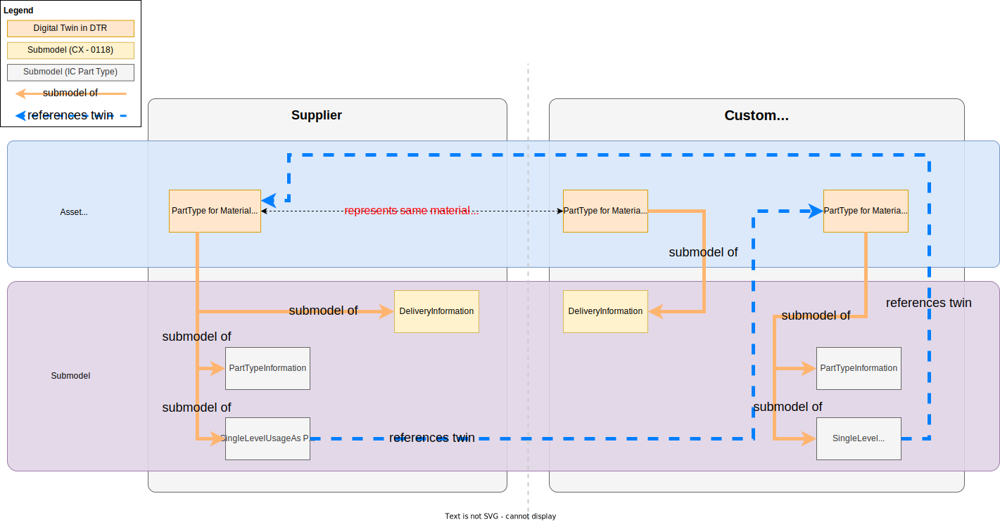
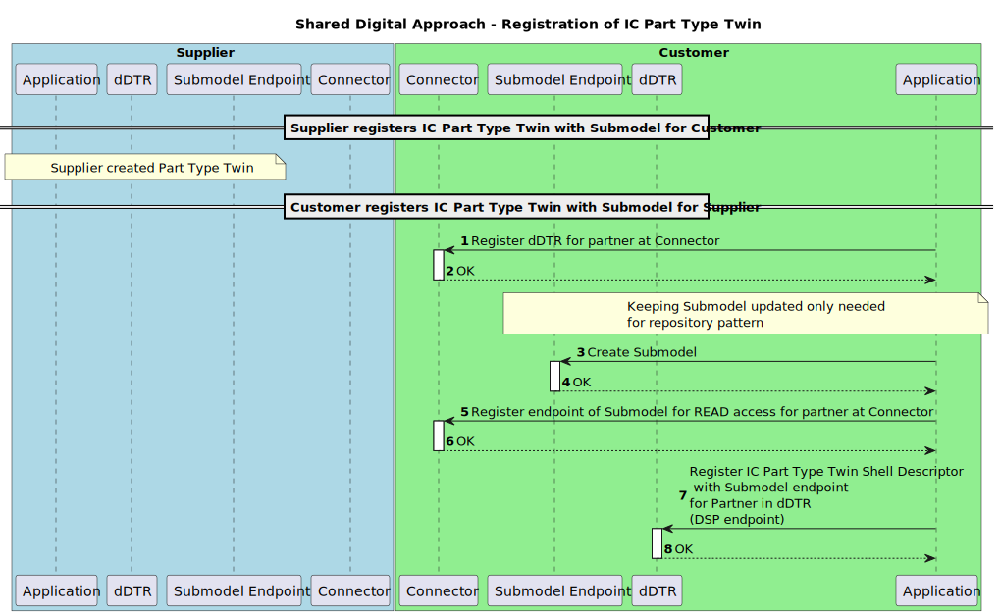
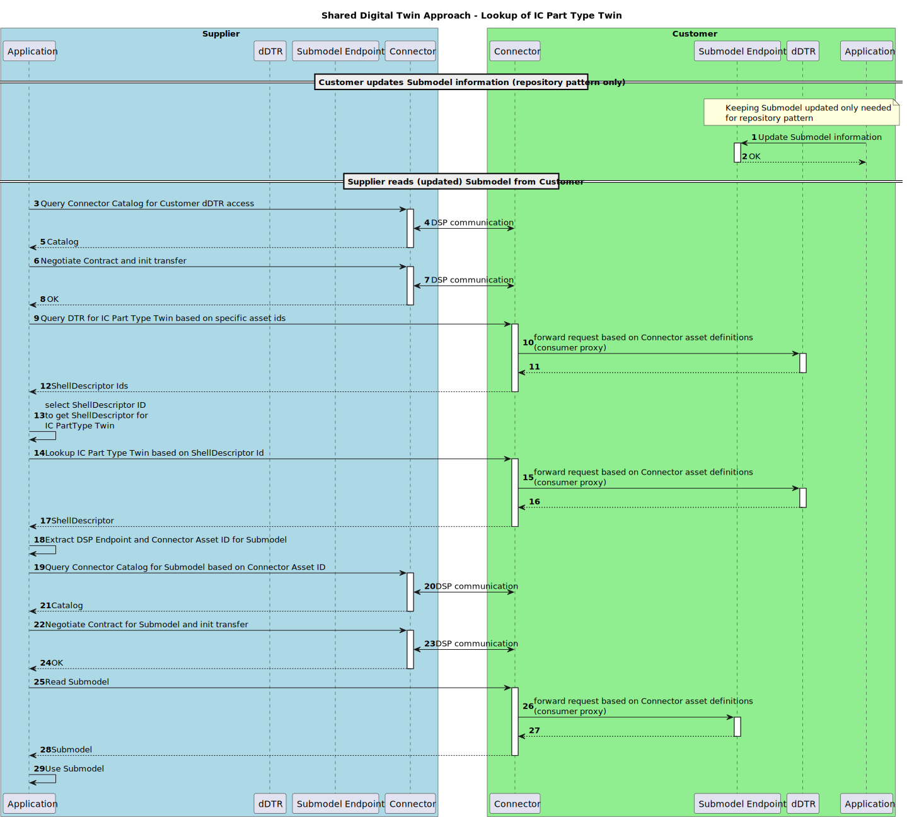

---
tags:
  - CAT/Business Application Provider
  - UC/PURIS
---

# CX-0118 Delivery Information Exchange 2.0.1

## ABSTRACT

*Delivery Information* plays a crucial role in proactively tracking, managing, and assessing the
timely fulfillment of customer orders from various suppliers in order to avoid shortages and
bottlenecks. Relying on manual methods like phone calls, or email correspondence to collect this
data can introduce errors, does not include last-minute or real-time updates, and can
potentially cause shortages.

One effective strategy to address these challenges involves the sharing of *Delivery Information*
among Catena-X business partners in an interoperable manner. Establishing a standardized semantic
definition to describe *delivery information* and a common API is a fundamental step to enable this
exchange and foster compatibility, thereby maximizing the range of solutions available for
mitigating any potential supply shortages.

## FOR WHOM IS THE STANDARD DESIGNED

## COMPARISON WITH THE PREVIOUS VERSION OF THE STANDARD

Changes:

- integration and usage of digital twins as defined in [[CX-0002]](#61-normative-references) Digital Twins in Catena-X
- harmonization of aspect model in accordance with [[CX-0126]](#61-normative-references) Industry Core: Part Type
- discontinuation of the proprietary API used in v1.0.0 of this standard
- grammatical, spelling and semantic improvements

New Content:

- added a note on the obligation of standard implementers to make aware that sensitive data is being
  handled, see [[Chapter 2.1.3]](#213-additional-requirements).

## 1 INTRODUCTION

In a typical order-based manufacturing and delivery process, a customer places an order, and a
supplier undertakes the task of fulfilling it. *Delivery Information* encompasses two main
categories: logistics details and delivery metrics. Logistics details cover when and where products
are shipped, as well as the quantities involved. Delivery metrics differentiate between estimated
and actual departure and arrival times, e.g. for outbound deliveries from a supplier's factory and
inbound deliveries to a customer's factory.

Monitoring and handling *Delivery Information* effectively between suppliers and customers plays a
crucial role in optimizing the delivery processes. Early detection and resolution of
delivery-related issues hinge on the continuous tracking of this information. However, relying on
manual communication methods, like phone calls or emails, introduces the risk of errors and consumes
valuable time. Existing ERP system interfaces, primarily tailored for order planning, might not
comprehensively cover the exchange of *Delivery Information*.

To facilitate efficient exchange, it is essential to establish a standardized and semantically
defined description of *Delivery Information*. Standardizing semantics and exchange protocols
enables participants in the supply chain to share *Delivery Information* in an interoperable manner.

The proposed model includes information about departure and arrival dates, times, locations, shipped
quantities, tracking number, and other relevant logistics-related information that helps in
coordinating and ensuring the smooth planning of product deliveries to their intended destination.
It allows businesses to better plan and execute deliveries, minimize delays, and optimize their
delivery processes, stock and production planning, avoiding shortages and increasing efficiency.

### 1.1 AUDIENCE & SCOPE

> *This section is non-normative*

This document describes the *Delivery Information* semantic model used in the Catena-X network and
the associated API for exchanging *Delivery Information*. This standard is relevant for the
following roles defined in [[CX-OMW]](#62-non-normative-references):

- **Data Providers**  willing to provide *Delivery Information* data
- **Data Consumers**  interested in requesting and receiving *Delivery Information* data
- **Business Application Providers** interested in providing solutions implementing this standard
- **Consulting Services Providers** interested in supporting companies fulfilling the standard

The scope of this standard is only the Delivery Information aspect model and API. It describes the
exchange of Delivery Information data through a connector in accordance with [[CX-0018]](#61-normative-references).

### 1.2 CONTEXT AND ARCHITECTURE FIT

> *This section is non-normative*

In a typical item procurement process, a customer initiates an order, and a supplier undertakes the
task of fulfilling it. As part of this process, the *Delivery Information* typically refers to data
or details regarding when, where and in which quantities of products or goods are shipped or are
expected to be shipped. It includes information about estimated and actual delivery dates, times,
locations, shipped quantities, and other relevant logistics-related information that helps in
coordinating and ensuring the smooth delivery planning of product deliveries to their intended
destination.

Within the framework of the Catena-X network, this standard defines the *DeliveryInformation*
aspect model. Its purpose is to establish a consistent and uniform interpretation and handling of
*Delivery Information* among all interested parties, ensuring that this data is understood and
managed in the same manner by all stakeholders.

*Figure 1* shows the high-level architecture of the *Delivery Information* exchange in the Catena-X
dataspace and the services that are involved. Both the data provider and the data consumer
must be members of the Catena-X network in order to communicate with each other. With the help of the
Credential Service and the Identity Access Management (IAM) each participant can authenticate itself,
verify the identity of the requesting party and decide whether to authorize the request. The
*Delivery Information* data is provisioned in accordance with [[CX-0002]](#61-normative-references).


*Figure 1: High-level architecture of the Delivery Information exchange in the Catena-X network*

### 1.3 CONFORMANCE AND PROOF OF CONFORMITY

> *This section is non-normative*

As well as sections marked as non-normative, all authoring guidelines, diagrams, examples, and notes
in this specification are non-normative. Everything else in this specification is normative. The key
words **MAY**, **MUST**, **MUST NOT**, **OPTIONAL**, **RECOMMENDED**, **REQUIRED**, **SHOULD** and
**SHOULD NOT** in this document are to be interpreted as described in [[BCP 14]](#62-non-normative-references) [[RFC2119]](#62-non-normative-references)
[[RFC8174]](#62-non-normative-references) when, and only when, they appear in all capitals, as shown here. All participants and
their solutions will need to prove, that they are conform with the Catena-X standards.

All participants and their solutions will need to prove, that they are conform with the Catena-X
standards. To validate that the standards are applied correctly, Catena-X employs Conformity
Assessment Bodies (CABs). The proof of conformity for a single semantic model is done according to
the general rules for proving the conformity of data provided to a semantic model or the ability to
consume the corresponding data. Furthermore, participants agree to follow the normative language of
this standardization document and to implement the required API-Endpoints described in [Chapter 4](#4-application-programming-interfaces).

### 1.4 EXAMPLES

The JSONs snippets below provide an example of the value-only serialization of the *"DeliveryInformation"*
aspect model for three different delivery situations:

1. A not yet departed delivery - estimated departure and arrival dates
2. A delivery in transit - actual departure and estimated arrival dates
3. A delivery with actual arrival times- actual departure and arrival dates

>**Note:** Delivery values are located in the `transitEvents` of the delivery.

1\. The order has not yet departed from its origin, as indicated by the estimated values for both departure and arrival. This is an example of estimated delivery.

```json
{
  "materialGlobalAssetId" : "urn:uuid:48878d48-6f1d-47f5-8ded-a441d0d879df",
  "positions" : [ {
    "orderPositionReference" : {
      "supplierOrderId" : "M-Nbr-4711",
      "customerOrderId" : "C-Nbr-4711",
      "customerOrderPositionId" : "PositionId-01"
    },
    "deliveries" : [ {
      "lastUpdatedOnDateTime" : "2023-04-28T14:23:00.123456+14:00",
      "deliveryQuantity" : {
        "value" : 20.0,
        "unit" : "unit:piece"
      },
      "transitEvents" : [ {
          "dateTimeOfEvent": "2023-04-01T14:23:00+01:00",
          "eventType": "estimated-departure"
        },
        {
          "dateTimeOfEvent": "2023-04-05T14:23:00+01:00",
          "eventType": "estimated-arrival"
        } ],
      "trackingNumber" : "1Z9829WDE02128",
      "incoterm" : "EXW",
      "transitLocations" : {
        "destination" : {
          "bpnsProperty" : "BPNS0123456789ZZ",
          "bpnaProperty" : "BPNA0123456789ZZ"
        },
        "origin" : {
          "bpnsProperty" : "BPNS0987654321YY",
          "bpnaProperty" : "BPNA0987654321YY"
        }
      }
    } ]
  } ]
}
```

2\. The status of this delivery is currently in transit, denoted by the actual departure and estimated arrival values.

```json
{
  "materialGlobalAssetId" : "urn:uuid:48878d48-6f1d-47f5-8ded-a441d0d879df",
  "positions" : [ {
    "orderPositionReference" : {
      "supplierOrderId" : "M-Nbr-4711",
      "customerOrderId" : "C-Nbr-4711",
      "customerOrderPositionId" : "PositionId-01"
    },
    "deliveries" : [ {
      "lastUpdatedOnDateTime" : "2023-04-28T14:23:00.123456+14:00",
      "deliveryQuantity" : {
        "value" : 20.0,
        "unit" : "unit:piece"
      },
      "transitEvents" : [ {
          "dateTimeOfEvent": "2023-04-01T14:23:00+01:00",
          "eventType": "actual-departure"
        },
        {
          "dateTimeOfEvent": "2023-04-05T14:23:00+01:00",
          "eventType": "estimated-arrival"
        } ],
      "trackingNumber" : "1Z9829WDE02128",
      "incoterm" : "EXW",
      "transitLocations" : {
        "destination" : {
          "bpnsProperty" : "BPNS0123456789ZZ",
          "bpnaProperty" : "BPNA0123456789ZZ"
        },
        "origin" : {
          "bpnsProperty" : "BPNS0123456789ZZ",
          "bpnaProperty" : "BPNA0123456789ZZ"
        }
      }
    } ]
  } ]
}
```

3\. As seen from the actual departure and actual arrival values, this is an example of a completed delivery.

```json
{
  "materialGlobalAssetId" : "urn:uuid:48878d48-6f1d-47f5-8ded-a441d0d879df",
  "positions" : [ {
    "orderPositionReference" : {
      "supplierOrderId" : "M-Nbr-4711",
      "customerOrderId" : "C-Nbr-4711",
      "customerOrderPositionId" : "PositionId-01"
    },
    "deliveries" : [ {
      "lastUpdatedOnDateTime" : "2023-04-28T14:23:00.123456+14:00",
      "deliveryQuantity" : {
        "value" : 20.0,
        "unit" : "unit:piece"
      },
      "transitEvents" : [ {
           "dateTimeOfEvent": "2023-04-01T14:23:00+01:00",
           "eventType": "actual-departure"
        },
        {
          "dateTimeOfEvent": "2023-04-05T14:23:00+01:00",
          "eventType": "actual-arrival"
      } ],
      "trackingNumber" : "1Z9829WDE02128",
      "incoterm" : "EXW",
      "transitLocations" : {
        "destination" : {
          "bpnsProperty" : "BPNS0123456789ZZ",
          "bpnaProperty" : "BPNA0123456789ZZ"
        },
        "origin" : {
          "bpnsProperty" : "BPNS0123456789ZZ",
          "bpnaProperty" : "BPNA0123456789ZZ"
        }
      }
    } ]
  } ]
}
```

### 1.5 TERMINOLOGY

> *This section is non-normative*

*The following terms are especially relevant for the understanding of the standard:*

| **Name** | **Abrev.** | **Description** |
| --- | --- | --- |
| **Incoterms** | - | Is a combination of "International" and "Commercial Terms." Incoterms are a set of standardized international trade terms that facilitate and define the responsibilities of customers and suppliers in transactions. |
| **Actual time** | - | Refers to the specific, real-time date and time when an event occurs during delivery. |
| **Estimated time** | - | Refers to a projected or estimated time for an event or occurrence, based on calculations or predictions, rather than the exact, confirmed time. |
| **Origin** | - | Is the starting point from which goods are dispatched or shipped to. |
| **Destination** | - | Is the final location where the goods are to be delivered or received. |
| **Delivery Informatio**n | - | Provides an overview of related shipments, tracking the movement of goods and associated order details, not the physical shipment. It may represent a full shipment or a portion, like a container with varied commodities. |
| **Customer** | - | The recipient of products ordered from / manufactured by a supplier. |
| **Supplier** | - | The supplier / manufacturer of a product. |
| **Identity Access Management** | IAM | IAM is a security system that regulates who can access an organization's information and systems, ensuring only authorized individuals have the right level of access to prevent unauthorized entry and protect against security risks. |
| **Digital Twin** | DT | Digital representation of an asset that provides data on aspects of the represented data following [[CX-0002]](#61-normative-references). |
| **decentralized Digital Twin Registry** | dDTR | Component providing registration and discovery API implementations following [[CX-0002]](#61-normative-references). Sometimes referred to without the "decentralized" BUT in Catena-X those are always decentralized. |
| **Asset Administration Shell** | AAS | Technical concept for Digital Twins consisting of different standards. Application in Catena-X is described in Digital Twins in Catena-X standard [[CX-0002]](#61-normative-references) |
| **Shell Descriptor** | | Technical concept of the AAS API describing metadata of an Asset Administration Shell representing a Digital Twin. It holds several identification information and metainformation about which submodels are available and where to get the data from (see [[CX-0002]](#61-normative-references), [IDTA-01002-3-0](#62-non-normative-references)). There may exist multiple Shell Descriptor for the same represented Asset (see [[CX-0126]](#61-normative-references)). |
| **Submodel Descriptor** | | Technical concept of the AAS API describing metadata of Submodels within a Shell Descriptor (Asset Administration Shell) (see [[CX-0002]](#61-normative-references), [IDTA-01002-3-0](#62-non-normative-references)). |
| **Specific Asset Ids** | | Identifiers of the Shell Descriptor (Asset Administration Shell) that refer to common identification data for an asset/material at hand e.g., manufacturer part Id. Common specific asset IDs used for identification are described in Industry Core Part Type Standard (see [[CX-0126]](#61-normative-references)). |
| **Asset Administration Shell Identifier** | AAS ID | Also referred to as Shell Descriptor id, is the technical identifier of the Shell Descriptor.  |
| **Global Asset Id** | | Also referred to as Catena-X Id, is the Catena-X identifier for assets represented by Digital Twins (see [[CX-0126]](#61-normative-references)). |
| **Aspect** | | A domain-specific view on information and functionality associated with a specific Digital Twin with a reference to a concrete Aspect Model (see [[CX-0002]](#61-normative-references)). Within Catena-X, an aspect is formally described using the Semantic Aspect Meta Model (see [[CX-0003]](#61-normative-references)). |
| **Semantic Id** | | Identifier including namespace to specify the semantic description of submodels using the Semantic Aspect Meta Model (SAMM). It allows partners to know the exact data format and semantics when e.g., browsing catalogs (see [[CX-0003]](#61-normative-references)). |
| **Data Space Protocol** | DSP | A set of specifications designed to facilitate interoperable data sharing between entities governed by usage control and based on Web technologies. These specifications define the schemas and protocols required for entities to publish data, negotiate Agreements, and access data as part of a Dataspace. It is governed by the International Data Spaces Association. Connectors compliant to [[CX-0018]](#61-normative-references) support the Data Space Protocol. |
| **Shared Asset Approach** | | Digital twin pattern in which each party has a twin for the same asset (Part Type). They share the same identification data in terms of specific asset IDs and global asset ID. The digital twins do have different technical identifiers. |

*Table 1: List of terminology helpful for understanding the standard*

Additional terminology used in this standard can be looked up in the glossary on the association homepage.

## 2 RELEVANT PARTS OF THE STANDARD FOR SPECIFIC USE CASES

> *This section is normative*

### 2.1 Delivery Information

#### 2.1.1 LIST OF STANDALONE STANDARDS

The following Catena-X standards are prerequisites for the implementation of this standard and therefore
**MUST** be considered / implemented by the relevant parties specified in each of them.

| **Number** | **Standard** | **Version** |
| --- | --- | --- |
| [[CX-0001]](#61-normative-references) | EDC Discovery API | 1.0.2 |
| [[CX-0002]](#61-normative-references) | Digital Twins in Catena-X | 2.2.0 |
| [[CX-0003]](#61-normative-references) | SAMM Aspect Meta Model | 1.1.0 |
| [[CX-0006]](#61-normative-references) | Registration and initial onboarding | 2.0.0 |
| [[CX-0010]](#61-normative-references) | Business Partner Number (BPN) | 2.0.0 |
| [[CX-0018]](#61-normative-references) | Dataspace Connectivity | 3.0.0 |
| [[CX-0126]](#61-normative-references) | Industry Core Part Type | 2.0.0 |

*Table 2: List of mandatory standards*

The usage of this standard may be complemented with the following Catena-X standards to further extend
the range of shortage prevention possibilities:

| **Number** | **Standard** | **Version** |
| --- | --- | --- |
| [[CX-0120]](#61-normative-references) | Short Term Material Demand Exchange | 2.0.0 |
| [[CX-0121]](#61-normative-references) | Planned Production Output Exchange | 2.0.0 |
| [[CX-0122]](#61-normative-references) | Item Stock Exchange | 2.0.0 |
| [[CX-0145]](#61-normative-references) | Days of Supply Exchange | 1.0.0 |
| [[CX-0146]](#61-normative-references) | Supply Chain Disruption Notifications | 1.0.0 |

*Table 3: List of non-mandatory complementary standards*

#### 2.1.2 DATA REQUIRED

No additional data requirements.

#### 2.1.3 POLICY CONSTRAINTS FOR DATA EXCHANGE

In alignment with our commitment to data sovereignty, a specific framework governing the utilization of data within the Catena-X use cases has been outlined.  As part of this data sovereignty framework, conventions for access policies, for usage policies and for the constraints contained in the policies have been specified in standard [CX-0152 Policy Constraints for Data Exchange](#61-normative-references). This standard document CX-0152 **MUST** be followed when providing services or apps for data sharing/consuming and when sharing or consuming data in the Catena-X ecosystem. What conventions are relevant for what roles named in [1.1 AUDIENCE & SCOPE](#11-audience--scope) is specified in the CX-0152 standard document as well.

##### REMINDER OF ANTITRUST

Notice and/or acknowledgement concepts to raise awareness of antitrust issues during use of this standard
are **RECOMMENDED**, for example through the implementation of a helpdesk or pop-up info.

#### 2.1.4 DIGITAL TWINS AND SPECIFIC ASSET IDs

This standard builds upon the Industry Core Part Type [[CX-0126]](#61-normative-references) and the Digital Twins in
Catena-X [[CX-0002]](#61-normative-references) standards. It follows the following design patterns:

- Usage of Digital Twins as shared assets to follow a pull approach for data.
- Usage of the specific asset IDs and further identification data for the Digital Twin for the Part Type
  (see [[CX-0126]](#61-normative-references)).
- Provisioning of the *PartTypeInformation* on supplier side (see [[CX-0126]](#61-normative-references)).

Because both parties may provide data regarding different aspects of the same Part Type Twin, they need
to use the same identification data to pinpoint it.

- The supplier of the part has a Digital Twin representation and is then able to offer *Delivery Information*
  data to customers.
- The customer, who orders or uses the part, has a Digital Twin representation to offer *Delivery Information*
  data to a supplier.
- Both twins refer to the same asset and provide complementary information. They share the same identification
  data in two partners' context.
  - The supplier
    - **MUST** create the Digital Twin first.
    - **MUST** generate the Catena-X ID and ensure that the customer-specific asset IDs and submodel
      descriptors are only accessible by the specific customer.
    - **MAY** use the Digital Twin for multiple customers.
  - The customer
    - **MUST** create one Digital Twin per supplier.
    - **MUST** use the Catena-X ID generated by the supplier.

The definition of identification data (Catena-X ID, Asset Administration Shell ID, specific asset ID)
**MUST** follow the Industry Core Part Type [[CX-0126]](#61-normative-references). Refer to [Chapter 4.1.2](#412-industry-core-part-type-twin-registration-and-definition) for further details.

> ***Note:*** The Part Type Twin's data is considered sensitive. Data providers **MUST** implement appropriate
measures ensuring that competitors-specific asset IDs and/or information about submodels is accessible
only to the data consumers it concerns, but not to their competitors.

Figure 2 shows how the shared asset approach is realized. The orange lines show which submodels belong
to the respective AAS. All *Delivery Information* specific submodels are bound to the specific
Part Type's context e.g., meaning that the *Delivery Information* aspect is described for the specific
catalog item on supplier and customer side represented by the AASs. The orange submodels are the
submodels used within this standard's context. The grey submodels are used within the Industry Core
[[CX-0126]](#61-normative-references)(*PartTypeInformation, SingleLevelBomAsPlanned, SingleLevelUsageAsPlanned*).
The blue dashed lines show the references between DTs based on Catena-X UUIDs and BPNL information that
may be resolved by the Item Relationship Service (see [[CX-0126]](#61-normative-references)).


*Figure 2: Conceptual levels of provisioning digital twins in the shared asset approach.*

Figure 2 details two conceptual levels:

- The Asset level contains the asset (Industry Core Part Type) represented by a Digital Twin.
  The latter is provisioned as an Asset Administration Shell (AAS) within the decentralized Digital
  Twin Registry (dDTR) of the data provider (supplier or customer).
- The Submodel level represents the actual information that are held by a Digital Twin (DT). Those
  submodels follow the respective definition of the Semantic Aspect Meta Model (SAMM) format
  (see [Chapter 3](#3-aspect-models)). The dDTR only holds meta information about the Submodel
  (e.g. kind of submodel via semantic ID or connector endpoint information).

>**Note:** Delivery information can be conveyed in both directions from Supplier to Customer and Customer to Supplier.

## 3 ASPECT MODELS

> *This section is normative*

### 3.1 ASPECT MODEL "DELIVERY INFORMATION"

#### 3.1.1 INTRODUCTION

The *Delivery Information* semantic model defines the data and details regarding when and how
products or goods are scheduled to be delivered and actually delivered from one location to another.
It includes information about order positions, material numbers and deliveries (quantity, status of
the delivery and location of the delivery). It may include tracking number and incoterms as well.
For the complete semantics and detailed description of its properties refer to the SAMM model in
[Chapter 3.1.5.1](#3151-rdf-turtle).

#### 3.1.2 SPECIFICATIONS ARTIFACTS

The modeling of the semantic model specified in this document was done in accordance to the
"semantic driven workflow" to create a submodel template specification [[SMT]](#62-non-normative-references).

This aspect model is written in SAMM 2.1.0 as a modeling language conformant to [[CX-0003]](#61-normative-references)
as input for the semantic-driven workflow.

Like all Catena-X data models, this model is available in a machine-readable format on GitHub
conformant to [[CX-0003]](#61-normative-references).

#### 3.1.3 LICENSE

This Catena-X data model is made available under the terms of the Creative Commons Attribution 4.0
International (CC-BY-4.0) license, which is available at Creative Commons.

#### 3.1.4 IDENTIFIER OF SEMANTIC MODEL

The semantic model has the unique identifier

`urn:samm:io.catenax.delivery_information:2.0.0`

This identifier **MUST** be used by the data provider to define the semantics of the data being transferred.

#### 3.1.5 FORMATS OF SEMANTIC MODEL

##### 3.1.5.1 RDF TURTLE

The RDF turtle file, an instance of the Semantic Aspect Meta Model, is the master for generating
additional file formats and serializations. It can be found under the following link:

>[https://github.com/eclipse-tractusx/sldt-semantic-models/blob/main/io.catenax.delivery_information/2.0.0/DeliveryInformation.ttl](https://github.com/eclipse-tractusx/sldt-semantic-models/blob/main/io.catenax.delivery_information/2.0.0/DeliveryInformation.ttl)

The open source command line tool of the Eclipse Semantic Modeling Framework is used for generation
of other file formats like for example a JSON Schema, aasx for Asset Administration Shell Submodel
Template or a HTML documentation.

##### 3.1.5.2 JSON SCHEMA

A JSON Schema can be generated from the RDF Turtle file. The JSON Schema defines the Value-Only payload
of the Asset Administration Shell for the API operation *"GetSubmodel"*.

##### 3.1.5.3 AASX

An AASX file can be generated from the RDF Turtle file. The AASX file defines one of the requested
artifacts for a Submodel Template Specification conformant to [[SMT]](#62-non-normative-references).

## 4 APPLICATION PROGRAMMING INTERFACES

> *This section is normative*

### 4.1 API USED TO EXCHANGE "DELIVERY INFORMATION"

As described in [Chapter 2.1.4](#214-digital-twins-and-specific-asset-ids) this standard builds upon the [[CX-0002]](#61-normative-references) Digital Twins in Catena-X and
[[CX-0126]](#61-normative-references) Industry Core Part Type standards. Therefore, the APIs provided
by the Digital Twin standard are combined with the part identification defined in the Industry Core
standard. This chapter defines how the aforementioned standards and the [[CX-0018]](#61-normative-references) standard
**MUST** be used to facilitate the provisioning of *Delivery Information* data. The usage of the
Discovery Services defined in [[CX-0001]](#61-normative-references), [[CX-0053]](#61-normative-references) is not mandatory,
because this standard assumes an already existing business relationship between the involved parties.

The sequence diagram in *Figure 3* provides an overview of the interactions required to register the
Part Type Twin following the shared asset approach.

- Steps 1 & 2: Register the dDTR access for the partner at the connector
- Steps 3 & 4: When using the repository pattern, create the submodel (and twin)
- Steps 5 & 6: Register the submodel endpoint for the partner at the connector
- Steps 7 & 8: Register or update the twin Shell Descriptor relying on the registered Connector asset
  for the submodel endpoint and the identification data of the partners.

> ***Note:*** This sequence diagram is simplified and does not cover the generation of the Part Type Twin
on supplier side and the handling of the identification data needed. Both partners need to create a
Part Type Twin of the shared asset as well as provide Delivery Information data.


*Figure 3: Flow to create and register a digital twin*

The sequence diagram in Figure 4 provides an overview of the interactions required when a customer
(acting as data provider) provisions *Delivery Information* data to a supplier (acting as data consumer).

The flow "*Supplier reads (updated) Submodel from Customer*" visualizes the sequence of calls when consuming data:

- Steps 3 - 8: Contract dDTR usage in the connector.
- Steps 9 - 12: Lookup the Industry Core Part Type Twin for a Part Type based on the common identification data.
- Steps 13 - 18: Read the Shell Descriptor of the Industry Core Part Type Twin to extract the *Delivery Information* submodel endpoint (registered at the connector).
- Steps 19 - 24: Contract the *Delivery Information* data usage in the connector.
- Steps 25 - 29: Consume and use the *Delivery Information* data.


*Figure 4: Flow to lookup a digital twin and get a submodel.*

> ***Note:*** Depending on the use of repository patterns and the design of the Digital Twins, the data
may be updated manually in the Submodel endpoint.

#### 4.1.1 CONNECTOR DATA ASSET STRUCTURE

The endpoints for the dDTR and the Submodel Endpoint **MUST** be made available BUT they **MUST NOT**
be directly called data consumer. Rather, for access to dDTRs and Submodels, there **MUST** be contracts
negotiated in accordance with the DSP. Therefore, the endpoints **MUST** be offered as connector data
assets. To make these assets easily identifiable in the connector's catalog, each asset **MUST** be
configured with a set of properties as described in the corresponding sections below.

The following table provides an overview of the connector data assets that the parties **MUST** offer
to be able to provision and/or consume *Delivery Information* data.

| **Party** | **REQUIRED** | **Asset** | **Purpose** |
| --- | --- | --- | --- |
| Provider | Yes | "Digital Twin Registry" | Allows a consumer to query for Part Type Twins and their *Delivery Information* submodels. |
| Provider | Yes | "Submodel Delivery Information" | Allows a consumer to read actual *Delivery Information* data related to a Part Type Twin. |
| Consumer | Yes | "Digital Twin Registry" | Allows a consumer to query for Part Type Twins and their *Delivery Information* submodels. |
| Consumer | Yes | "Submodel Delivery Information" | Allows a consumer to read actual *Delivery Information* data related to a Part Type Twin. |

*Table 4: Connector data assets*

In the sections below the asset definitions of the two different kinds of assets are defined.

**Connector Data Asset Structure for "Digital Twin Registry"**

To allow partners to find the "Delivery Information" data for a specific Industry Core Part Type Twin,
the provider **MUST** register a connector data asset (see details in [[CX-0018]](#61-normative-references)) specifying the address
of the Digital Twin Registry of the provider (see [[CX-0002]](#61-normative-references)).

The data asset **MUST** be configured with the set of properties as defined in the table below.

| **Object** | **Property** | **Purpose** | **Usage & Constraints** |
| --- | --- | --- | --- |
| | ***@id*** | Identifier of the asset | The asset ID **MUST** be unique and therefore **MUST NOT** be reused elsewhere. |
| properties | [**http://purl.org/dc/terms/type**](http://purl.org/dc/terms/type) | Defines the "Digital Twin Registry" according to the Catena-X taxonomy. | **MUST** be set to `{"@id": "https://w3id.org/catenax/taxonomy#DigitalTwinRegistry"}` to allow filtering the data assets catalog for the respective "Digital Twin Registry". |
| properties | [**https://w3id.org/catenax/ontology/common#version**](https://w3id.org/catenax/ontology/common#version) | The version of the standard defining the implemented API of the "Digital Twin Registry" | **MUST** correspond to the version of the standard defining the Interfaces of the "Digital Twin Registry". The value **MUST** be set to `"3.0"` for "Digital Twin Registries" used by this standard. |
| dataAddress | **@type** | Type of the DataAddress node. | **MUST** be set to `"DataAddress"`. |
| dataAddress | ***baseUrl*** | Defines the HTTPS endpoint of the corresponding "Digital Twin Registry Endpoint". | The `{{ DIGITAL_TWIN_REGISTRY_ENDPOINT }}` refers to an URL under which the API of the "Digital Twin Registry" endpoint is available. HTTPS transport protocol **MUST** be used. |
| dataAddress | ***proxyBody*** | Defines whether the endpoint allows to proxy the HTTPS body | **SHOULD** be set to `"false"` to not allow the API endpoint to receive a HTTPS body via the HTTPS request. |
| dataAddress | ***proxyMethod*** | Defines whether the endpoint allows to proxy the HTTPS method | **SHOULD** be set to `"false"` to only allow the API endpoint to receive GET requests. |
| dataAddress | ***proxyPath*** | Defines whether the endpoint allows to proxy paths for the URL | **MUST** be set to `"true"` to allow the API endpoint to receive appended paths of the HTTPS request. |
| dataAddress | ***type*** | Defines the type of data plane extension handling the data exchange | **MUST** be set to `"HttpData"` to provide an API via an HTTPS proxy endpoint. |

*Table 5: Connector data assets request properties*

Additionally security identification information **MAY** be added to secure the "Decentralized Digital Twin Registry".

When searching the Catalog of a provider, a consumer **SHOULD** use the following properties AND
their values to identify the Data Asset specifying "Digital Twin Registry". In the connector Data Asset
descriptions the API version valid for this standard is mentioned for the property
[`https://w3id.org/catenax/ontology/common#version`](https://w3id.org/catenax/ontology/common#version). The requester of a Data Asset **MUST** be
able to handle multiple Data Asset for this endpoint, being differentiated only by the version.
The requester **SHOULD** choose the Data Asset set with the highest compatible version number implemented
by themselves. If the requester cannot find a compatible version with their own, the requester **MUST**
terminate the data transfer.

| **Property** | **Value** |
| --- | --- |
| http://purl.org/dc/terms/type | `{"@id": "https://w3id.org/catenax/taxonomy#DigitalTwinRegistry"}` |

*Table 6: Connector data assets request properties values.*

An example connector data asset definition is given below.

>**Note:** Expressions in double curly braces \{\{\}\} must be substituted with a corresponding value.

```json
{
  "@context": {
    "@vocab": "https://w3id.org/edc/v0.0.1/ns/",
    "cx-common": "https://w3id.org/catenax/ontology/common#",
    "cx-taxo": "https://w3id.org/catenax/taxonomy#",
    "dct": "http://purl.org/dc/terms/"
  },
  "@id": "{{CONNECTOR_ASSET_ID}}",
  "properties": {
    "dct:type": {"@id": "cx-taxo:DigitalTwinRegistry"},
    "cx-common:version": "3.0"
  },
  "privateProperties": {
  },
  "dataAddress": {
    "@type": "DataAddress",
    "type": "HttpData",
    "baseUrl": "{{ DIGITAL_TWIN_REGISTRY_ENDPOINT }}",
    "proxyQueryParams": "true",
    "proxyBody": "false",
    "proxyPath": "true",
    "proxyMethod": "false",
  }
}
```

**Connector Data Asset Structure for "Submodel"**

To allow partners to receive the actual "Delivery Information" data as defined in [Chapter 3](#3-aspect-models),
the provider  **MUST** register a connector data asset (see details in[[ CX-0018]](#61-normative-references)) specifying the
address of the submodel endpoint (see [[CX-0002]](#61-normative-references)) providing the actual data.

The data asset **MUST** be configured with the set of properties as defined in the table below.

| **Object** | **Property** | **Purpose** | **Usage & Constraints** |
| --- | --- | --- | --- |
| | ***@id*** | Identifier of the asset | The asset ID **MUST** be unique and therefore **MUST NOT** be reused elsewhere. |
| properties | [**http://purl.org/dc/terms/type**](https://purl.org/dc/terms/type) | Defines the "Submodel API" according to the Catena-X taxonomy. | **MUST** be set to `{"@id": "https://w3id.org/catenax/taxonomy#Submodel"}` to allow filtering the data assets catalog for the respective "Submodel API". |
| properties | [**https://admin-shell.io/aas/3/0/HasSemantics/semanticId**](https://admin-shell.io/aas/3/0/HasSemantics/semanticId) | The semantic identifier of the "Delivery Information" SAMM. | **MUST** be set to `{"@id": "urn:samm:io.catenax.delivery_information:2.0.0#DeliveryInformation"}` to externally define how the Submodel must be interpreted. **MUST NOT** be set, if different submodels may be returned by this API. |
| properties | [**https://w3id.org/catenax/ontology/common#**](https://w3id.org/catenax/ontology/common) **version** | Version of the Submodel Interface Specification | **MUST** be set to `"3.0"` in accordance to the Digital Twin in Catena-X Standards ([[CX-0002]](#61-normative-references)). |
| dataAddress | **@type** | Type of the DataAddress node. | **MUST** be set to "DataAddress". |
| dataAddress | ***baseUrl*** | Defines the HTTPS Submodel endpoint provisioning the *Delivery Information* data | The `{{ SUBMODEL_ENDPOINT }}` refers to an URL under which the Submodel API Endpoint ([[CX-0002]](#61-normative-references)) is available to provide the "Delivery Information" . HTTPS transport protocol **MUST** be used. |
| dataAddress | ***proxyBody*** | Defines whether the endpoint allows to proxy the HTTPS body | **SHOULD** be set to `"false"` to not allow the API endpoint to receive a HTTPS body via the HTTPS request. |
| dataAddress | ***proxyMethod*** | Defines whether the endpoint allows to proxy the HTTPS method | **SHOULD** be set to `"false"` to only allow the API endpoint to receive GET requests. |
| dataAddress | ***proxyPath*** | Defines whether the endpoint allows to proxy paths for the URL | **MUST** be set to `"true"` to allow the API endpoint to receive appended paths of the HTTPS request. Setting this parameter depends on the implementation of the submodel lookup. |
| dataAddress | ***type*** | Defines the type of data plane extension handling the data exchange | **MUST** be set to `"HttpData"` to provide an API via an HTTPS proxy endpoint. |

*Table 7: Connector data assets request properties*

Additionally security identification information **MAY** be added to secure the "Submodel API".

When searching the data assets catalog of a provider, a consumer **SHOULD** use the `assetId` previously
determined via `subprotocolBody` of the SubmodelDescriptor's endpoint definition of subprotocol type "DSP".
Refer to [Chapter 4.1.2](#412-industry-core-part-type-twin-registration-and-definition) for the definition of the `subprotocolBody`.

| **Property** | **Value** |
| --- | --- |
| [https://w3id.org/edc/v0.0.1/ns/id](https://w3id.org/edc/v0.0.1/ns/id) | `{{CONNECTOR_ASSET_ID}}` specified in the DSP endpoint of the SubmodelDescriptor (see [Chapter 4.1.2](#412-industry-core-part-type-twin-registration-and-definition)) |

*Table 8: Connector data assets request properties values*

An example connector data asset definition is given below.

> **Note:** Expressions in double curly braces \{\{\}\} must be substituted with a corresponding value.

```json
{
  "@context": {
    "@vocab": "https://w3id.org/edc/v0.0.1/ns/",
    "cx-common": "https://w3id.org/catenax/ontology/common#",
    "cx-taxo": "https://w3id.org/catenax/taxonomy#",
    "dct": "http://purl.org/dc/terms/",   
    "aas-semantics": "https://admin-shell.io/aas/3/0/HasSemantics/"
   },
  "@id": "{{CONNECTOR_ASSET_ID}}",
  "properties": {
    "dct:type": {"@id": "cx-taxo:Submodel"},
    "cx-common:version": "3.0",
    "aas-semantics:semanticId": {"@id": "urn:samm:io.catenax.delivery_information:2.0.0#DeliveryInformation"}  
  },
  "privateProperties": {
  },
  "dataAddress": {
    "@type": "DataAddress",
    "type": "HttpData",
    "baseUrl": "{{ SUBMODEL_ENDPOINT }}",
    "proxyQueryParams": "false",
    "proxyBody": "false",
    "proxyPath": "true",
    "proxyMethod": "false",
  }
}
```

#### 4.1.2 INDUSTRY CORE PART TYPE TWIN REGISTRATION AND DEFINITION

##### 4.1.2.1 SHELL DESCRIPTOR REGISTRATION

To allow partners to receive the actual "*Delivery Information*" data as defined in [Chapter 3](#3-aspect-models),
the provider **MUST** register a Shell Descriptor in the dDTR (see [[CX-0002]](#61-normative-references)) so that a partner:

- May lookup the Industry Core Part Type Twin based on known identification data.
- May identify the connector endpoint providing access to the actual "Delivery Information" submodel data.

The Shell Descriptors represent each an Industry Core Part Type Twin and **MUST** follow the rules as defined
in [Chapter 2.1.4](#214-digital-twins-and-specific-asset-ids).

The Shell Descriptor **MUST** be configured with the set of properties as defined in the table below.

| **Object in ShellDescriptor** | **Property** | **Purpose** | **Usage & Constraints** |
| --- | --- | --- | --- |
| | ***id*** | Defines the technical ID of the Asset Administration Shell representing a partner's twin. | **MUST** be unique following Industry Core Part Type standard [[CX-0126]](#61-normative-references) and is a technical Id randomly assigned as multiple Part Type Twins may be created for one Part Type. E.g. this number differs for the twins created at supplier and customer side. |
| | ***globalAssetId*** | Defines the Catena-X ID of the twin. | **MUST** be aligned with the partner's material. When referring to the same Part Type Twin, the same number **MUST** be used (see [[CX-0126]](#61-normative-references)). |
| | **specificAssetIds** | Identifiers that may be used to lookup Part Type Twins. | **MUST** be set according to the Industry Core Part Type standard [[CX-0126]](#61-normative-references). See Table 10 for respective specific asset IDs. The "customerPartId" **MUST** be set by Customers and **SHOULD** be set by Suppliers. |
| submodelDescriptor | **id** | Technical identifier of a SubmodelDescriptor. | **MUST** be set to a unique identifier. |
| submodelDescriptor | **semanticId** | The semantic identifier of the "Delivery Information" SAMM. | **MUST** be set to `{ "type": "ExternalReference", "keys": [{ "type": "GlobalReference", "value": "urn:samm:io.catenax.delivery_information:2.0.0#DeliveryInformation" }] }` to externally define how the Submodel must be interpreted. |
| submodelDescriptor > endpoint | **interface** | Defines the Submodel Interface (see [[CX-0002]](#61-normative-references)) and the version. | **MUST** be set to "SUBMODEL-3.0" to rely on current specification. |
| submodelDescriptor > endpoint > protocolInformation | **href** | Defines the direct link to the public API of the connector's data plane with a path that **SHOULD** be appended by the proxy, if needed. | **MUST** be set to the public API of the data plane providing the data with the path appended to directly access the submodel. |
| submodelDescriptor > endpoint > protocolInformation | **subprotocol** | Defines the usage of the connector based on DSP to access and use the submodel.  | **MUST** be set to "DSP" to define the connector endpoint of the subprotocol. |
| submodelDescriptor > endpoint > protocolInformation | **subprotocolBody** | Defines the asset id in the connector and the connector address to access and use the submodel. | **MUST** be set to `"id={{CONNECTOR_ASSET_ID}};dspEndpoint={{SUPPLIER_CONNECTOR_DSP_ENDPOINT}}"` to provide the necessary information for contracting the submodel endpoint. Refer to [Chapter 4.1.2](#412-industry-core-part-type-twin-registration-and-definition) for the definition of the asset of the subprotocolBody. |

*Table 9: Properties relevant for the Shell Descriptor definition*

When searching the submodel in the dDTR of a provider, a consumer **SHOULD** use the specific asset IDs
as defined in [[CX-0126]](#61-normative-references). Table 10 gives an overview of the specific asset IDs that the data provider
added to the ShellDescriptor so that the data consumer may find the Industry Core Part Type Twin.

| **Specific Asset Id** | **Value** |
| --- | --- |
| digitalTwinType | "PartType". Set to identify twins compliant to the Industry Core Part Type (see [[CX-0126]](#61-normative-references)). |
| manufacturerId | Supplier / Manufacturer partner BPNL (see [[CX-0010]](#61-normative-references)) |
| manufacturerPartId | Supplier / Manufacturer partner identification number of the part. |
| customerPartId | Customer partner identification number of the part. |

*Table 10: Specific asset IDs of Industry Core Part Type Twins proposed to be used to lookup a twin in the dDTR*

The Shell Descriptor defines the metadata of the Industry Core Part Type Twin. The following example
Shell Descriptor represents a supplier's Shell Descriptor of a supplier who provides two customers access
to an "*Delivery Information*" submodel. For further information on the creation of Part Type Twins,
refer to [Chapter 2.1.4](#214-digital-twins-and-specific-asset-ids).

Following [[CX-0002]](#61-normative-references), when searching the data assets catalog of a provider, a consumer  **SHOULD**
use the `assetId` determined via `subprotocolBody` of the SubmodelDescriptor's endpoint definition
of subprotocol type `"DSP"` of the Submodel Descriptor of interest.

> **Note:** Expressions in double curly braces \{\{\}\} must be substituted with a corresponding value.

```json
{
  "id": "{{TECHNIAL_TWIN_ID}}",
  "globalAssetId": "{{MATERIAL_NUMBER_CX}}",
  "idShort": "Semiconductor",
  "specificAssetIds": [
    {
      "name": "digitalTwinType",
      "value": "PartType",
      "externalSubjectId": {
        "type": "ExternalReference",
        "keys": [
          {
            "type": "GlobalReference",
            "value": "{{SUPPLIER_BPNL}}"
          },
          {
            "type":"GlobalReference",
            "value":"{{CUSTOMER_BPNL}}"
          },
          {
             "type":"GlobalReference",
             "value":"{{OTHER_CUSTOMER_BPNL}}"
          }
          ]
      }
    },
    {
      "name": "manufacturerPartId",
      "value": "{{MATERIAL_NUMBER_SUPPLIER}}",
      "externalSubjectId": {
        "type": "ExternalReference",
        "keys": [
          {
              "type": "GlobalReference",
              "value": "{{SUPPLIER_BPNL}}"
          },
          {
              "type":"GlobalReference",
              "value":"{{CUSTOMER_BPNL}}"
          },
          {
             "type":"GlobalReference",
             "value":"{{OTHER_CUSTOMER_BPNL}}"
          }
        ]
      }
    },
    {
      "name": "manufacturerId",
      "value": "{{SUPPLIER_BPNL}}",
      "externalSubjectId": {
        "type": "ExternalReference",
        "keys": [
          {
            "type": "GlobalReference",
            "value": "{{SUPPLIER_BPNL}}"
          },
          {
            "type":"GlobalReference",
            "value":"{{CUSTOMER_BPNL}}"
          },
          {
            "type":"GlobalReference",
            "value":"{{OTHER_CUSTOMER_BPNL}}"
          }
        ]
      }
    },
    {
      "name": "customerPartId",
      "value": "{{MATERIAL_NUMBER_CUSTOMER}}",
      "externalSubjectId": {
        "type": "ExternalReference",
        "keys": [
          {
            "type": "GlobalReference",
            "value": "{{SUPPLIER_BPNL}}"
          },
          {
            "type":"GlobalReference",
            "value":"{{CUSTOMER_BPNL}}"
          }
        ]
      }
    },
    {
      "name": "customerPartId",
      "value": "{{MATERIAL_NUMBER_OTHER_CUSTOMER}}",
      "externalSubjectId": {
        "type": "ExternalReference",
        "keys": [
          {
            "type": "GlobalReference",
            "value": "{{SUPPLIER_BPNL}}"
          },
          {
            "type":"GlobalReference",
            "value":"{{OTHER_CUSTOMER_BPNL}}"
          }
        ]
      }
    }
  ],
  "submodelDescriptors": [
    {
      "id": "e5c96ab5-896a-482c-8761-efd74777ca97",
      "semanticId": {
        "type": "ExternalReference",
        "keys": [
          {
            "type": "GlobalReference",
            "value": "urn:samm:io.catenax.delivery_information:2.0.0#DeliveryInformation"
          }
        ]
      },
      "endpoints": [
        {
          "interface": "SUBMODEL-3.0",
          "protocolInformation": {
            "href": "{{SUPPLIER_CONNECTOR_DATAPLANE_PUBLIC_API}}/{{PATH_IF_NEEDED}}",
            "endpointProtocol": "HTTP",
            "endpointProtocolVersion": [
              "1.1"
            ],
            "subprotocol": "DSP",
            "subprotocolBody": "id={{CONNECTOR_ASSET_ID}};dspEndpoint={{SUPPLIER_CONNECTOR_DSP_ENDPOINT}}",
            "subprotocolBodyEncoding": "plain",
            "securityAttributes": [
              {
                "type": "NONE",
                "key": "NONE",
                "value": "NONE"
              }
            ]
          }
        }
      ]
    },
    {
      "id": "a6c96ab5-896a-482c-8761-efd74777ca99",
      "semanticId": {
        "type": "ExternalReference",
        "keys": [
          {
            "type": "GlobalReference",
            "value": "urn:samm:io.catenax.delivery_information:2.0.0#DeliveryInformation"
          }
        ]
      },
      "endpoints": [
        {
          "interface": "SUBMODEL-3.0",
          "protocolInformation": {
            "href": "{{SUPPLIER_CONNECTOR_DATAPLANE_PUBLIC_API}}/{{PATH_IF_NEEDED}}",
            "endpointProtocol": "HTTP",
            "endpointProtocolVersion": [
              "1.1"
            ],
            "subprotocol": "DSP",
            "subprotocolBody": "id={{CONNECTOR_ASSET_ID}};dspEndpoint={{SUPPLIER_CONNECTOR_DSP_ENDPOINT}}",
            "subprotocolBodyEncoding": "plain",
            "securityAttributes": [
              {
                "type": "NONE",
                "key": "NONE",
                "value": "NONE"
              }
            ]
          }
        }
      ]
    }
  ]
}
```

##### 4.1.2.2 LOOKING UP A PART TYPE TWIN IN THE DDTR

To query the dDTR of a data provider, after contracting the usage via the data provider's connector
(see [[CX-0018]](#61-normative-references)), the lookup API (see [[CX-0002]](#61-normative-references)) can be used relying on the specific
asset IDs defined by the Industry Core Part Type (see [[CX-0126]](#61-normative-references)) that can be seen in
Table 10 (table of shellDescriptorRegistration with specific asset IDs).

An example call relying on all information is given in the code sample below.

> **Note:** Expressions in double curly braces \{\{\}\} must be substituted with a corresponding value.

```code
GET: {{PARTNER_CONNECTOR_DATA_PLANE}}/lookup/shells?assetIds={"name":"digitalTwinType", "value": "PartType"},{"name":"manufacturerPartId", "value": "{{MATERIAL_NUMBER_SUPPLIER}}"},{"name":"manufacturerId", "value": "{{SUPPLIER_BPNL}}"},{"name":"customerPartId", "value": "{{MATERIAL_NUMBER_CUSTOMER}}"}
```

As a result identifiers of the ShellDescriptors will be returned. With this data, a data provider can
read the ShellDescriptor to extract the endpoint data of the data provider. An example is given in the
code sample below.

> **Note:** Expressions in double curly braces \{\{\}\} must be substituted with a corresponding value.

```code
GET: {{PARTNER_CONNECTOR_DATA_PLANE}}/shell-descriptors/{{AAS_IDENTIFIER}}
```

##### 4.1.2.3 FETCHING SUBMODEL DATA

To fetch the *Delivery Information* Submodel data at the submodel endpoint of a data provider, after
contracting the usage via the data provider's connector (see [[CX-0018]](#61-normative-references)), the submodel API (see [[CX-0002]](#61-normative-references))
can be used.

An example call relying on all information may be seen in the code sample below.

> **Note:** Expressions in double curly braces \{\{\}\} must be substituted with a corresponding value.

```code
GET: {{HREF_PATH}}/$value
```

## 5 PROCESSES

> *This section is normative*

### 5.1 DELIVERY INFORMATION PROCESS

The aim of the Catena-X standard is to enable as much transparency between business partners as
possible, provided that the exchange complies with German or EU competition law. The user must be
aware that competitively sensitive information from one supplier or customer **MUST NOT** be shared
with others. This means that *Delivery Information* related to other customers or suppliers **MUST
NOT** be disclosed under any circumstances. The exchange of information must always be direct and
unidirectional.

The responsibility for the transport may vary depending on the contractual agreements. This responsibility
is defined by the INCOTERM. These are official standards provided by the [International Chamber of Commerce (ICC)](#62-non-normative-references).
At the time of writing this standard there are 11 different INCOTERMS.

| **Code** | **Short description** | **Definition** | **Place to be specified** |
| --- | --- | --- | --- |
| **EXW** | **EXW**orks | The supplier makes the goods available at their premises, or at another named place. This term places the maximum obligation on the customer and minimum obligations on the supplier.  | At the factory site or any other place |
| **FCA** | **F**ree  **CA**rrier | The supplier delivers the goods, cleared for export, at a named place (possibly including the supplier's own premises). The goods can be delivered to a carrier nominated by the customer, or to another party nominated by the customer. | Location of the supplier or location of the carrier |
| **FAS** | **F**ree  **A**longside  **S**hip | The supplier delivers when the goods are placed alongside the customer's vessel at the named port of shipment. This means that the customer has to bear all costs and risks of loss of or damage to the goods from that moment. | Agreed loading port (suitable only for ship loading) |
| **FOB** | **F**ree  **O**n  **B**oard | The supplier bears all costs and risks up to the point the goods are loaded on board the vessel. The supplier's responsibility does not end at that point unless the goods are "appropriated to the contract" that is, they are "clearly set aside or otherwise identified as the contract goods". | Agreed loading port (suitable only for ship loading) |
| **CFR** | **C**ost And  **FR**eight | The supplier pays for the carriage of the goods up to the named port of destination. Risk transfers to customer when the goods have been loaded on board the ship in the country of Export.  | Agreed port of destination (suitable only for loading ships) |
| **CIF** | **C**ost  **I**nsurance  **F**reight | The supplier is responsible for covering the cost, freight, and minimum insurance to transport goods to the named port of destination, with risk transferring to the customer once the goods are loaded onto the shipping vessel. The supplier handles export customs clearance, but the customer is responsible for import customs clearance, unloading, and any further transportation. | Agreed port of destination (suitable only for loading ships) |
| **DAP** | **D**elivered  **A**t  **P**lace | The supplier delivers when the goods are placed at the disposal of the customer on the arriving means of transport ready for unloading at the named place of destination. The risk passes from supplier to customer from the point of destination mentioned in the contract of delivery. | Agreed delivery and destination location (usually destination terminal or customer´s location) |
| **DPU** | **D**elivered at  **P**lace  **U**nloaded | The supplier delivers the goods, unloaded, at the named place of destination. The supplier covers all the costs of transport (export fees, carriage, unloading from main carrier at destination port and destination port charges) and assumes all risk until arrival at the destination port or terminal. | Agreed delivery and destination location (usually destination terminal or customer's location) |
| **CPT** | **C**arriage  **P**aid  **T**o | The supplier pays for the carriage of the goods up to the named place of destination. However, the goods are considered to be delivered when the goods have been handed over to the first or main carrier, so that the risk transfers to customer upon handing goods over to that carrier at the place of shipment in the country of Export. | Agreed destination (usually destination terminal or customer's location) |
| **CIP** | **C**arriage  **I**nsurance  **P**aid | The supplier is responsible for transporting the goods to a named place and providing insurance for the goods during transit. The risk transfers to the customer once the goods are handed over to the first carrier, but the supplier must pay transport and insurance costs to the specified destination. This term is suitable for all modes of transport, including containerized and multimodal shipments | Agreed destination (usually destination terminal or customer's location) |
| **DDP** | **D**elivered  **D**uty  **P**aid | The supplier is responsible for delivering the goods to the named place in the country of the customer, and pays all costs in bringing the goods to the destination including import duties and taxes. The supplier is not responsible for unloading. | Agreed delivery and destination location (usually destination terminal or customer's location) |

*Table 11: International Trade Administration. Incoterms 2020 ([*https://www.trade.gov/know-your-incoterms*](https://www.trade.gov/know-your-incoterms))*

The incoterms allow three possible scenarios regarding *Delivery Information* responsibility:

| **Scenario** | **Customer responsibility** | **Supplier responsibility** |
| --- | --- | --- |
| 1 | Entire delivery (e.g., INCOTERM EXW) | None |
| 2 | None | Entire delivery (e.g., INCOTERM DDP) |
| 3 | Partial delivery: arrival (e.g., INCOTERM FAS) | Partial delivery: departure (e.g.,INCOTERM FAS) |

*Table 12: Scenario overview transport responsibilities*

More details on each scenario are provided in the following sections.

### 5.1.1 CUSTOMER IS RESPONSIBLE FOR THE WHOLE DELIVERY (E.G. INCOTERM EXW)

#### 5.1.1.1 ACTORS AND ROLES

The following actors and roles occur in the described process.

| **Actors** | **Role** | **Description** |
| --- | --- | --- |
| Customer | The customer submits an order. They are responsible for organizing the transportation of these parts from the origin to its destination. The customer acts as data provider, because he is responsible for the transport. | The customer provides critical *Delivery Information* to the supplier, including estimated pick-up and arrival times, to ensure coordinated preparation and efficient handling of the ordered parts at both ends. |
| Supplier | The supplier manufactures parts and makes them available at their origin. The supplier acts as a data consumer, because the consumer is responsible for the transport. | The supplier provides necessary information to the customer, including details about the availability and readiness of the parts for pick-up, contributing to an effective coordination of the transportation process. |

*Table 13: Actors and roles scenario 1*

#### 5.1.1.2 PROCESS PRESENTATION

In this scenario, the customer is responsible for organizing the pick-up of items from the
supplier's location (origin) and their transportation to the customer's location. For transparency,
the supplier requests *Delivery Information* from the customer. The customer responds with both the
departure times and quantities, ensuring the supplier knows when to have the items ready for pick
up. Additionally, the customer informs the supplier of the items' estimated arrival times at the
destination facility.

| **Delivery information** | **-1** | **Today** | **+1** | **+2** | **+3** |
| --- | --- | --- | --- | --- | --- |
| **Departure** | 100 | 500 | 300 | 200 | 500 |
| **Arrival** | 800 | 100 | 500 | 0 | 300 |

*Table 14: Delivery Information example scenario 1*

Since the semantic model applies to different scenarios, the mandatory nature of eventTypes cannot be
fully addressed in the model. Data **MUST** be provided according to the following restrictions:

- The customer **MUST** provide the departure information and **MUST** provide arrival information to
  give a benefit back to the supplier.
- If there is no confirmed date and time, the supplier can use a default estimation for the arrival
  information (e.g. departure date + 3 days).

There **MUST** be a departure information because the supplier needs to know when the goods will be picked up.

There **MUST** be arrival information to give the supplier more transparency.

### 5.1.2 SUPPLIER IS RESPONSIBLE FOR THE WHOLE DELIVERY (E.G. INCOTERM DDP)

#### 5.1.2.1 ACTORS AND ROLES

| **Actors** | **Role** | **Description** |
| --- | --- | --- |
| Customer | The customer submits an order. The customer acts as a data consumer, because the supplier is responsible for the transport. | The customer submits an order at the supplier (quantity, location, preferred date).|
| Supplier | The supplier manufactures parts and makes them available. They are responsible for organizing the transportation of these parts from the origin to the destination. The supplier acts as data provider, because he is responsible for the transport. | The supplier coordinates all aspects of the delivery process, including selecting transportation methods, scheduling shipments, and providing the customer with regular updates on the delivery status and estimated arrival times. |

*Table 15: Actors and roles scenario 2*

#### 5.1.2.2 PROCESS REPRESENTATION

In this case, the supplier takes on the responsibility of organizing the entire delivery process
from their facilities (origin) to the customer's destination. This includes arranging for the
transportation of the items and ensuring they reach the customer's facility. The supplier must also
maintain transparency throughout the process. They inform the customer of the departure times and
quantities, ensuring the customer is aware of when to expect the delivery. Furthermore, the supplier
provides updates on the delivery progress, including the estimated arrival times at the customer's
facility, thus keeping the customer informed at every stage of the delivery process.

**Transport information is only provided to the supplier.**

| **Delivery information** | **-1** | **Today** | **+1** | **+2** | **+3** |
| --- | --- | --- | --- | --- | --- |
| **Departure** | 200 | 400 | 300 | 200 | 500 |
| **Arrival** | 600 | 300 | 500 | 10 | 300 |

*Table 16: Delivery Information example scenario 2*

As the semantic model applies to different scenarios, the mandatoryness of eventTypes can not be fully
handled in the model. Data **MUST** be provided according to the following restrictions:

- The supplier **MUST** provide the estimated arrival information and **MUST** provide the departure
  information.
- If there is no confirmed date and time, the supplier can use a default estimation for the arrival
  information (e.g. departure date + 3 days).

There **MUST** be an arrival information because the customer needs to know when the goods will be available in the customer's factory.
There **MUST** be departure information, to give the customer more transparency.

### 5.1.3 RESPONSIBILITY FOR THE DELIVERY IS SPLIT BETWEEN SUPPLIER AND CUSTOMER (E.G. INCOTERM FAS)

#### 5.1.3.1 ACTORS AND ROLES

| **Actors** | **Role** | **Description** |
| --- | --- | --- |
| Customer | The customer submits an order. The customer is responsible for one half of the delivery. The customer acts as a data provider, because he is responsible for one half of the transport, and as a data consumer, because the supplier is responsible for the other half of the transport. | The customer coordinates and manages one part of the delivery process, which includes arranging transportation for the latter half of the journey, ensuring the parts are received from the midpoint, and providing necessary information to the supplier. |
| Supplier | The supplier manufactures parts and makes them available. The supplier is responsible for one half of the delivery. The supplier acts as a data provider, because he is responsible for one half of the transport, and as a data consumer, because the customer is responsible for the other half of the transport. | The supplier handles the initial part of the delivery process, including transporting the parts to a designated midpoint. |

*Table 17: Actors and roles scenario 3*

#### 5.1.3.2 PROCESS PRESENTATION

In this case the supplier is responsible for only one part of the transport (e.g. from departure
from its factory (origin) until a middle point) and the customer takes over the responsibility for
the rest of the transport (e.g. from middle point to its factory (destination)). In this case both
customer and supplier can request *Delivery Information* of the other party.

**Example:**

Supplier A is in charge of the initial part of the transport, handling the pick-up and delivery of
items from its location to a designated middle point. Customer A takes over the transport from the
middle point, needs specific details about this first leg of the journey. Therefore, Customer A
requests critical *Delivery Information* from Supplier A, such as departure time, pick-up location,
and the quantity of items.

| **Delivery information** | **-1** | **Today** | **+1** | **+2** | **+3** |
| --- | --- | --- | --- | --- | --- |
| Departure | 100 | 500 | 300 | 200 | 500 |

*Table 18: Delivery Information example scenario 3*

Customer A assumes responsibility for the transport of goods from a predetermined middle point to
its destination. Therefore, to gain transparency, Supplier A requests *Delivery Information* from
Customer A, such as the estimated arrival times, final destination (e.g. Customer A's factory), and
the quantity of goods to be shipped.

| **Delivery information** | **-1** | **Today** | **+1** | **+2** | **+3** |
| --- | --- | --- | --- | --- | --- |
| **Arrival** | 800 | 100 | 500 | 0 | 300 |

*Table 19: Delivery Information example scenario 4*

As the semantic model applies to different scenarios, the mandatoryness of eventTypes can not be fully
handled in the model. Data **MUST** be provided according to the following restrictions:

- The supplier **MUST** provide the departure information.
- The client **MUST** provide the arrival information.

There **MUST** be departure information, to give the customer more transparency.

There **MUST** be arrival information, to give the supplier more transparency.

## 6 REFERENCES

### 6.1 NORMATIVE REFERENCES

> *This section is normative*

| **Number** | **Standard** | **Version** |
| --- | --- | --- |
| [CX-0001] | EDC Discovery API | 1.0.2 |
| [CX-0002] | Digital Twins in Catena-X | 2.2.0 |
| [CX-0003] | SAMM Aspect Meta Model | 1.1.0 |
| [CX-0006] | Registration and initial onboarding | 2.0.0 |
| [CX-0010] | Business Partner Number (BPN) | 2.0.0 |
| [CX-0018] | Dataspace Connectivity | 3.0.0 |
| [CX-0053] | Discovery Finder and BPN Discovery Service APIs | 1.1.0 |
| [CX-0120] | Short Term Material Demand Exchange | 2.0.0 |
| [CX-0121] | Planned Production Output Exchange | 2.0.0 |
| [CX-0122] | Item Stock Exchange | 2.0.0 |
| [CX-0126] | Industry Core Part Type | 2.0.0 |
| [CX-0145] | Days of Supply Exchange | 1.0.0 |
| [CX-0146] | Supply Chain Disruption Notifications | 1.0.0 |
| [CX-0152] | Policy Constraints For Data Exchange | 1.0.0 |

### 6.2 NON-NORMATIVE REFERENCES

> *This section is non-normative*

| **Context** | **Link** |
| --- | --- |
| [CX-OMW] | [Catena-X Operating Model](https://catenax-ev.github.io/docs/next/operating-model/why-introduction) |
| [RFC2119] | Bradner, S. Key words for use in RFCs to Indicate Requirement Levels. Available online: https://datatracker.ietf.org/doc/html/rfc2119 |
| [RFC8174] | Leiba, B. Ambiguity of Uppercase vs Lowercase in RFC 2119 Key Words. Available online: https://datatracker.ietf.org/doc/html/rfc8174 |
| [SMT] | How to create a submodel template specification. Guideline. Download from: https://industrialdigitaltwin.org/wp-content/uploads/2022/12/I40-IDTA-WS-Process-How-to-write-a-SMT-FINAL-.pdf |
| [IDTA-01002-3-0] | Specification of the Asset Administration Shell Part 2: Application Programming Interfaces. Download from: https://industrialdigitaltwin.org/wp-content/uploads/2023/04/IDTA-01002-3-0_SpecificationAssetAdministrationShell_Part2_API.pdf |

### 6.3 REFERENCE IMPLEMENTATIONS

> *This section is non-normative*

Not applicable.

## Legal

Copyright © 2025 Catena-X Automotive Network e.V. All rights reserved. For more information, please visit [here](/copyright).
