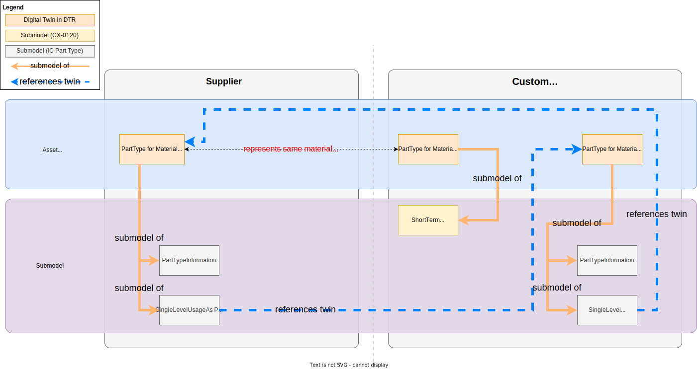
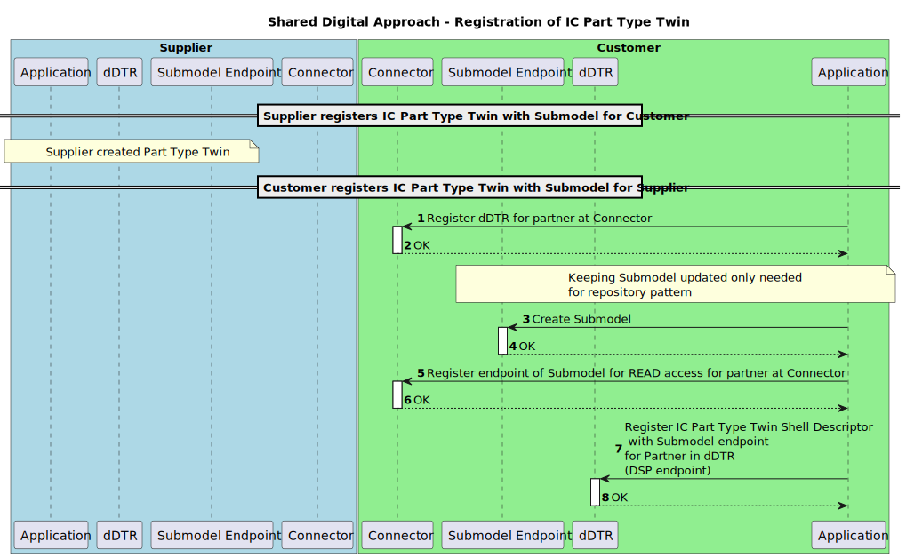
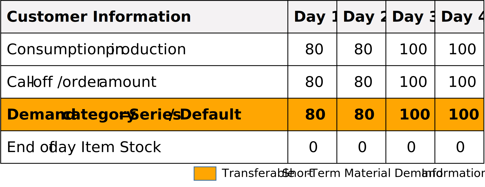
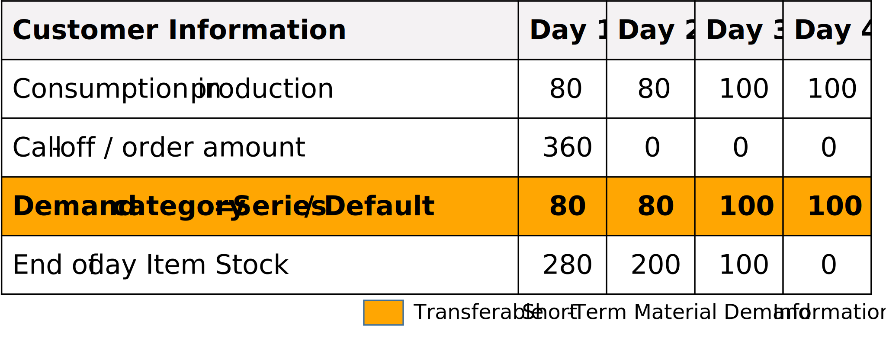
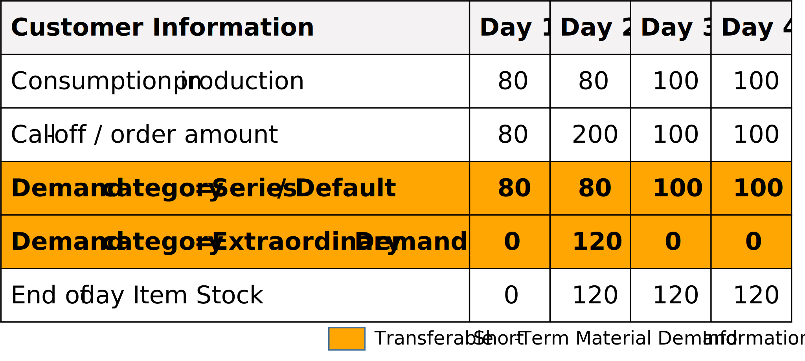
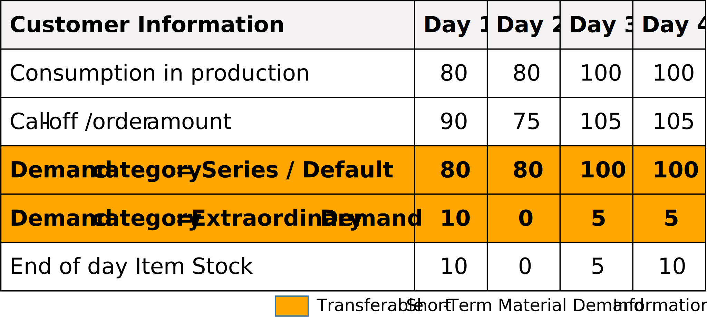
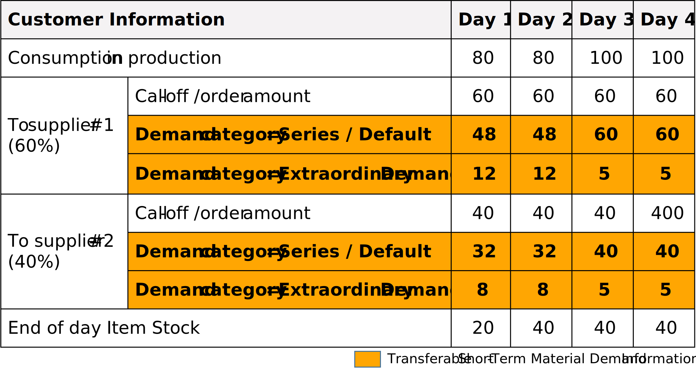

---
tags:
  - CAT/Business Application Provider
  - UC/PURIS
---

# CX-0120 Short-Term Material Demand Exchange 2.0.1

## ABSTRACT

This document defines the standardized exchange of *Short-Term Material Demand* data within the
Catena-X network. With a focus on addressing shortages and enhancing efficiency across supply
chains, this standard aims to facilitate the consistent, reliable, and secure transmission of
*Short-Term Material Demand* data among network participants. It serves as a foundational resource
for developers, solution providers, and participants in the Catena-X network by offering
comprehensive guidance on implementing and adhering to the standardized exchange of *Short-Term
Material Demand* data. The standardization of the customer's *Short-Term Material Demand* semantics
and exchange API enables participants in the supply chain to share information about time-bound
*Short-Term Material Demand* quantities at a customer's site in an interoperable manner. To give
additional context and guidance, specific process descriptions with examples are used to convey an
understanding of the application.

## FOR WHOM IS THE STANDARD DESIGNED

## COMPARISON WITH THE PREVIOUS VERSION OF THE STANDARD

Changes:

- integration and usage of digital twins as defined in [[CX-0002]](#61-normative-references) Digital Twins in Catena-X
- harmonization of aspect model in accordance with [[CX-0126]](#61-normative-references) Industry Core: Part Type
- new specific submodel `io.catenax.short_term_material_demand:1.0.0:ShortTermMaterialDemand` from
  `io.catenax.material_demand:1.0.0:MaterialDemand`
- discontinuation of the proprietary API used in v1.0.0 of this standard
- grammatical, spelling and semantic improvements

New Content:

- added a note on the obligation of standard implementers to make aware that sensitive data is being
  handled, see [[Chapter 2.1.3]](#213-additional-requirements)

## 1 INTRODUCTION

In recent years global supply chains have significantly been affected by global crises.
Ever-increasing complexity and interdependencies compound this issue. As a result small and
medium-sized enterprises as well as large enterprises are exposed to an increased risk of
disruptions in their supply chains. To adapt to short-term fluctuations and develop the right
countermeasures, it is essential to have sound information about the *Short-Term Material Demand* of
customers.

This document describes and standardizes a common semantic model for the *Short-Term Material Demand* as well as an associated API to exchange *Short-Term Material Demand*  information between
supply chain partners in an interoperable manner. The customer's *Short-Term Material Demand* is
the quantity of a material that a customer requests from a supplier in a time horizon of up to four
weeks. It aims to supplement, not to replace or to duplicate, regular and legally binding orders or
call-offs between partners and enable customers to provide suppliers with context regarding their
demands. It is possible to distinguish in particular between those demands that are critical for the
customer's planned production and those that are additional and possibly non-recurring, e.g. for
building up safety stocks. Suppliers can use this additional information to better coordinate their
own production and demands and to proactively propose solutions in the event of shortages.

Through the adoption of this standard, supply chain partners can efficiently communicate *Short-Term
Material Demand* information, that supports proactive and better-founded decision-making, responsive
inventory management, and effective allocation of resources to prevent or mitigate shortages.

### 1.1 AUDIENCE & SCOPE

> *This section is non-normative*

This standard is relevant for the following roles defined in [[CX-OMW]](#62-non-normative-references):

- **Data Providers**  willing to provide *Short-Term Material Demand* data
- **Data Consumers**  interested in requesting and receiving *short-term* *material demand* data
- **Business Application Providers** interested in providing solutions implementing this standard
- **Consulting Services Providers** interested in supporting companies fulfilling the standard

The scope of this standard is only the *Short-Term Material Demand* aspect model and API. It describes
the exchange of *Short-Term Material Demand* data through a connector in accordance to [[CX-0018]](#61-normative-references).

### 1.2 CONTEXT AND ARCHITECTURE FIT

The customer's demand is one of the key information a supplier or manufacturer uses to plan his
production. The customer order represents this demand towards the supplier or customer. The
*Short-Term Material Demand* is intended to be additional information to evaluate the partners'
supply situation. The respective orders or call-offs communicated, are still contractually binding.
The actions to take based on the material demand data described in this standard must be aligned
between the customer and supplier.

*Figure 1* shows the high-level architecture of the *Short-Term Material Demand* exchange in the
Catena-X dataspace and the services that are involved. Both the data consumer and the data provider
must be members of the Catena-X network in order to communicate with each other.  With the help of
the Credential Service and the Identity Access Management (IAM) each participant can authenticate
itself, verify the identity of the requesting party and decide whether to authorize the request.
The *Short-Term Material Demand* is provisioned in accordance with [[CX-0002]](#61-normative-references).


*Figure 1: high-level architecture of the Short-Term Material Demand exchange in the Catena-X*

### 1.3 CONFORMANCE AND PROOF OF CONFORMITY

> *This section is non-normative*

As well as sections marked as non-normative, all authoring guidelines, diagrams, examples, and notes
in this specification are non-normative. Everything else in this specification is normative. The key
words **MAY**, **MUST**, **MUST NOT**, **OPTIONAL**, **RECOMMENDED**, **REQUIRED**, **SHOULD** and
**SHOULD NOT** in this document are to be interpreted as described in [[BCP 14]](#62-non-normative-references) [[RFC2119]](#62-non-normative-references)
[[RFC8174]](#62-non-normative-references) when, and only when, they appear in all capitals, as shown here. All participants and
their solutions will need to prove, that they are conform with the Catena-X standards.

All participants and their solutions will need to prove, that they are conform with the Catena-X
standards. To validate that the standards are applied correctly, Catena-X employs Conformity
Assessment Bodies (CABs). The proof of conformity for a single semantic model is done according to
the general rules for proving the conformity of data provided to a semantic model or the ability to
consume the corresponding data. Furthermore, participants agree to follow the normative language of
this standardization document and to implement the required API-Endpoints described in [Chapter 4](#4-application-programming-interfaces).

### 1.4 EXAMPLES

> *This section is non-normative*

The following example shows a value-only JSON representation of an "Short-Term Material Demand" aspect
model. It contains a demand quantity of 180 pieces with a demand category `"series"` and a demand
quantity of `100` pieces with demand category `"after-sales"` for material with Catena-X ID
`"urn:uuid:48878d48-6f1d-47f5-8ded-a441d0d879df"`. Also the customer location varies for the different
demand series. This *Short-Term Material Demand* is the demand that a supplier received from a customer.

```json
{
  "materialGlobalAssetId": "urn:uuid:48878d48-6f1d-47f5-8ded-a441d0d879df",    
  "demandSeries": [
    {
      "lastUpdatedOnDateTime" : "2023-11-05T08:15:30.123-05:00",
      "expectedSupplierLocation": "BPNS8888888888XX",                          
      "demands": [
        {
          "demand": {
            "value": 180,
            "unit" : "unit:piece"
          },
          "day" : "2023-10-09"                       
        }
      ],
      "customerLocation": "BPNS9090909090YY",                                  
      "demandCategory": {
        "demandCategoryCode": "SR99"                                           
      }
    },
    {
      "expectedSupplierLocation": "BPNS8888888888XX",
      "lastUpdatedOnDateTime" : "2023-11-05T08:15:30.123-05:00",
      "demands": [
        {
          "demand": {
            "value": 100,
            "unit" : "unit:piece"
          },
          "day" : "2023-10-09"                       
        }
      ],
      "customerLocation": "BPNS5555555555XX",                                 
      "demandCategory": {
        "demandCategoryCode": "A1S1"                                           
      }
    }
  ]
}
```

### 1.5 TERMINOLOGY

> *This section is non-normative*

| **Name** | **Abrv.** | **Description** |
| --- | --- | --- |
| **Business Partner Number** | BPN | A BPN is the unique identifier of a partner within Catena-X as defined in [[CX-0010]](#61-normative-references). |
| **Business Partner Number Legal Entity** | BPNL | A BPNL is the unique identifier of a partner legal entity within Catena-X as defined in [CX-0010]. |
| **Business Partner Number Site** | BPNS | A BPNS is the unique identifier of a partner site within Catena-X as defined in [[CX-0010]](#61-normative-references). |
| **Business Partner Number Address** | BPNA | A BPNA is the unique identifier of a partner address within Catena-X as defined in [[CX-0010]](#61-normative-references). |
| **Demand** | | Quantity of a demand for a given time frame. The quantity must be greater than or equal to 0 and less or equal than 999999999999999999.999. It allows up to 12 digits and 3 decimal places. |
| **Demand series** | | The demands for a dedicated material in a given time period of a given demand rate, distinguished by their demand location and demand category. |
| **Demand category** | | Classification of demands used for prioritization or allocation. |
| **Order** | | Request from a customer towards a supplier to manufacture / supply a given quantity of a specific product in a predefined time frame. |
| **Provider** | | The party providing the *Short-Term Material Demand* data. This is always the customer. |
| **Consumer** | | The party requesting and consuming the *Short-Term Material Demand* data provided by the provider. This is always the Supplier. Additional terminology used in this standard can be looked up in the glossary on the association homepage. |
| **Customer** | | The recipient of products ordered from / manufactured by a supplier. |
| **Supplier** | | The supplier / manufacturer of a product. |
| **Stock** | | Two-way direction of material on stock: <br /> - One can have a stock of material which is ready for delivery to customers. <br /> - One can have a stock of material which can be used for the own production. <br /> Within this document, the term material, product, component or item refers to any kind of product that may be either be used as input or output of the production. Semi-finished goods are not intended to be covered. |
| **Material Number** | | Unique number of a component or material. |
| **Material** | | The term material is used as a catalogue item in the meaning of the Industry Core Part Type ([[CX-0126]](#61-normative-references)). Whenever referring to material also products, components or items are considered. Semi-finished goods are not intended to be covered. |
| **Digital Twin** | DT | Digital representation of an asset that provides data on aspects of the represented data following [[CX-0002]](#61-normative-references). |
| **decentralized Digital Twin Registry** | dDTR | Component providing registration and discovery API implementations following [[CX-0002]](#61-normative-references). Sometimes referred to without the "decentralized" BUT in Catena-X those are always decentralized. |
| **Asset Administration Shell** | AAS | Technical concept for Digital Twins consisting of different standards. Application in Catena-X is described in Digital Twins in Catena-X standard ([[CX-0002]](#61-normative-references))  |
| **Shell Descriptor** | | Technical concept of the AAS API describing metadata of an Asset Administration Shell representing a Digital Twin. It holds several identification information and meta-information about which submodels are available and where to get the data from (see [[CX-0002]](#61-normative-references), [[IDTA-01002-3-0]](#62-non-normative-references)). There may exist multiple Shell Descriptor for the same represented Asset (see [[CX-0126]](#61-normative-references)). |
| **Submodel Descriptor** | | Technical concept of the AAS API describing metadata of Submodels within a Shell Descriptor (Asset Administration Shell) (see [[CX-0002]](#61-normative-references), [[IDTA-01002-3-0]](#62-non-normative-references)). |
| **Specific Asset Ids** | | Identifiers of the Shell Descriptor (Asset Administration Shell) that refer to common identification data for an asset/material at hand e.g., manufacturer part Id. Common specific asset ids used for identification are described in Industry Core Part Type Standard (see [[CX-0126]](#61-normative-references)). |
| **Asset Administration Shell Identifier** | AAS ID | Also referred to as Shell Descriptor id, is the technical identifier of the Shell Descriptor.  |
| **Global Asset Id** | | Also referred to as Catena-X Id, is the Catena-X identifier for assets represented by Digital Twins (see [[CX-0126]](#61-normative-references)). |
| **Aspect** | | A domain-specific view on information and functionality associated with a specific Digital Twin with a reference to a concrete Aspect Model (see [[CX-0002]](#61-normative-references)). Within Catena-X, an aspect is formally described using the Semantic Aspect Meta Model (see [[CX-0003]](#61-normative-references)). |
| **Semantic Id** | | Identifier including namespace to specify the semantic description of submodels using the Semantic Aspect Meta Model (SAMM). It allows partners to know the exact data format and semantics when e.g., browsing catalogs (see [[CX-0003]](#61-normative-references)). |
| **Data Space Protocol** | DSP | A set of specifications designed to facilitate interoperable data sharing between entities governed by usage control and based on Web technologies. These specifications define the schemas and protocols required for entities to publish data, negotiate Agreements, and access data as part of a Dataspace. It is governed by the International Data Spaces Association. Connectors compliant to [[CX-0018]](#61-normative-references) support the Data Space Protocol. |
| **Shared Asset Approach** | | Digital twin pattern in which each party has a twin for the same asset (Part Type). They share the same identification data in terms of specific asset IDs and global asset ID. The digital twins do have different technical identifiers. |

*Table 1: Terminology Short-Term Material Demand Standard*

Additional terminology used in this standard can be looked up in the glossary on the association's homepage

## 2 RELEVANT PARTS OF THE STANDARD FOR SPECIFIC USE CASES

### 2.1 "SHORT-TERM MATERIAL DEMAND"

#### 2.1.1 LIST OF STANDALONE STANDARDS

The following Catena-X standards are prerequisites for the implementation of this standard and therefore
**MUST** be considered / implemented by the relevant parties specified in each of them.

| **Number** | **Standard** | **Version** |
| --- | --- | --- |
| [[CX-0001]](#61-normative-references) | EDC Discovery API | 1.0.2 |
| [[CX-0002]](#61-normative-references) | Digital Twins in Catena-X | 2.2.0 |
| [[CX-0003]](#61-normative-references) | SAMM Aspect Meta Model | 1.1.0 |
| [[CX-0006]](#61-normative-references) | Registration and initial onboarding | 2.0.0 |
| [[CX-0010]](#61-normative-references) | Business Partner Number (BPN) | 2.0.0 |
| [[CX-0018]](#61-normative-references) | Dataspace Connectivity | 3.0.0 |
| [[CX-0126]](#61-normative-references) | Industry Core Part Type | 2.0.0 |

*Table 2: List of mandatory standards*

The usage of this standard may be complemented with the following Catena-X standards to further extend
the range of shortage prevention possibilities:

| **Number** | **Standard** | **Version** |
| --- | --- | --- |
| [[CX-0118]](#61-normative-references) | Delivery Information Exchange | 2.0.0 |
| [[CX-0121]](#61-normative-references) | Planned Production Output Exchange | 2.0.0 |
| [[CX-0122]](#61-normative-references) | Item Stock Exchange | 2.0.0 |
| [[CX-0145]](#61-normative-references) | Days of Supply Exchange | 1.0.0 |
| [[CX-0146]](#61-normative-references) | Supply Chain Disruption Notifications | 1.0.0 |

*Table 3: List of non-mandatory complementary standards*

#### 2.1.2 DATA REQUIRED

No additional data requirements.

#### 2.1.3 POLICY CONSTRAINTS FOR DATA EXCHANGE

In alignment with our commitment to data sovereignty, a specific framework governing the utilization of data within the Catena-X use cases has been outlined.  As part of this data sovereignty framework, conventions for access policies, for usage policies and for the constraints contained in the policies have been specified in standard [CX-0152 Policy Constraints for Data Exchange](#61-normative-references). This standard document CX-0152 **MUST** be followed when providing services or apps for data sharing/consuming and when sharing or consuming data in the Catena-X ecosystem. What conventions are relevant for what roles named in [1.1 AUDIENCE & SCOPE](#11-audience--scope) is specified in the CX-0152 standard document as well.

##### REMINDER OF ANTITRUST

Notice and/or acknowledgement concepts to raise awareness of antitrust issues during use of this standard
are **RECOMMENDED**, for example through the implementation of a help desk or pop-up info.

#### 2.1.4 DIGITAL TWINS AND SPECIFIC ASSET IDs

This standard builds upon the Industry Core Part Type [[CX-0126]](#61-normative-references) and the Digital Twins in
Catena-X [[CX-0002]](#61-normative-references) standards. It follows the following design patterns:

- Usage of Digital Twins as shared assets to follow a pull approach for data.
- Usage of the specific asset IDs and further identification data for the Digital Twin for the Part Type
  (see [[CX-0126]](#61-normative-references)).
- Provisioning of the *PartTypeInformation* on supplier side (see [[CX-0126]](#61-normative-references)).

Because both parties may provide data regarding different aspects of the same Part Type Twin, they need
to use the same identification data to pinpoint it.

- The supplier of the part has a Digital Twin representation and is then able to offer
  *Short-Term Material Demand* data to customers.
- The customer, who orders or uses the part, has a Digital Twin representation to offer
  *Short-Term Material Demand* data to a supplier.
- Both twins refer to the same asset and provide complementary information. They share the same
  identification data in two partners' context.
  - The supplier
    - **MUST** create the Digital Twin first.
    - **MUST** generate the Catena-X ID and ensure that the customer-specific asset IDs and submodel
      descriptors are only accessible by the specific customer.
    - **MAY** use the Digital Twin for multiple customers.
  - The customer
    - **MUST** create one Digital Twin per supplier.
    - **MUST** use the Catena-X ID generated by the supplier.

The definition of identification data (Catena-X ID, Asset Administration Shell ID, specific asset ID)
**MUST** follow the Industry Core Part Type [[CX-0126]](#61-normative-references). Refer to [Chapter 4.1.2](#412-industry-core-part-type-twin-registration-and-definition) for further details.

> ***Note:*** The Part Type Twin's data is considered sensitive. Data providers **MUST** implement appropriate
measures ensuring that competitors-specific asset IDs and/or information about submodels is accessible
only to the data consumers it concerns, but not to their competitors.

Figure 2 shows how the shared asset approach is realized. The orange lines show which submodels belong
to the respective AAS. All *Short-Term Material Demand* specific submodels are bound to the specific
Part Type's context e.g., meaning that the *Short-Term Material Demand* aspect is described for the specific
catalog item on supplier and customer side represented by the AASs. The orange submodels are the
submodels used within this standard's context. The grey submodels are used within the Industry Core
[[CX-0126]](#61-normative-references)(*PartTypeInformation, SingleLevelBomAsPlanned, SingleLevelUsageAsPlanned*).
The blue dashed lines show the references between DTs based on Catena-X UUIDs and BPNL information that
may be resolved by the Item Relationship Service (see [[CX-0126]](#61-normative-references)).


*Figure 2: Conceptual levels of provisioning digital twins in the shared asset approach.*

Figure 2 details two conceptual levels:

- The Asset level contains the asset (Industry Core Part Type) represented by a Digital Twin.
  The latter is provisioned as an Asset Administration Shell (AAS) within the decentralized Digital
  Twin Registry (dDTR) of the data provider (supplier or customer).
- The Submodel level represents the actual information that are held by a Digital Twin (DT). Those
  submodels follow the respective definition of the in Semantic Aspect Meta Model (SAMM) format
  (see [Chapter 3](#3-aspect-models)). The dDTR only holds metadata about the Submodel
  (e.g. kind of submodel via semantic ID or connector endpoint information).

## 3 ASPECT MODELS

> *This section is normative*

### 3.1 "SHORT-TERM MATERIAL DEMAND" ASPECT MODEL

#### 3.1.1 INTRODUCTION

This section describes the *"Short-Term Material Demand"* semantic model.
It defines the demand of material, product, component or items for a customer.
For the complete semantics and detailed description of its properties refer to the SAMM model in
[Chapter 3.1.5.1.](#3151-rdf-turtle)

#### 3.1.2 SPECIFICATIONS ARTIFACTS

The modeling of the semantic model specified in this document was done in accordance to the
"semantic-driven workflow" to create a submodel template specification [[SMT]](#62-non-normative-references).

This aspect model is written in SAMM 2.1.0 as a modeling language conformant to [[CX-0003]](#61-normative-references) as
input for the semantic driven workflow.

Like all Catena-X data models, this model is available in a machine-readable format on GitHub
conformant to [[CX-0003]](#61-normative-references).

##### 3.1.2.1 SHORT-TERM MATERIAL DEMAND CATEGORY HANDLING

The Material Demand data **MUST** consider the following demand categories shared with the DCM
standard [CX-0128](#61-normative-references). These Demand Categories **MAY** be used optionally. If no categories are to be
used, the value "default" **MUST** be selected. If different categories apply, it is **RECOMMENDED**
to use them to describe certain use cases such as inventory build-up, logistics optimization or
series start-ups. This use case-specific categorization can be an important building block for the
supplier to leverage potential in the event of possible bottlenecks or supply gaps. Demand data for
demand category "Extraordinary Demand" **MAY** be set to actively indicate differences between
call-offs or orders and the demand derived from the scheduled or planned production.

| Demand Category | Description | Demand Category Code (Based on Data Model) |
| --- | --- | --- |
| Default | No Assignment | `0001` |
| After-Sales | After sales demand of spare parts | `A1S1` |
| Series | Dependent demand e.g. production, assembly, raw material | `SR99` |
| Phase-In-Period | Ramp up of a new product or new material introduction | `PI01` |
| Single-Order | Demand outside the normal spectrum of supply | `OS01` |
| Small Series | Short time frame for demand and pose to higher volatility | `OI01` |
| Extraordinary Demand | Temporary demand on top of standard demand. Used e.g. in the following scenarios: <br /> - logistic optimization (e.g., full use of container) <br /> - preventing shortage by building stock (banking) <br /> - restocking safety stock | `ED01` |
| Phase-Out-Period | Ramp down; Product or material retires from the market | `PO01` |

*Table 4: Short-Term Material Demand categories*

#### 3.1.3 LICENSE

This Catena-X data model is made available under the terms of the Creative Commons Attribution 4.0
International (CC-BY-4.0) license, which is available at Creative Commons.

#### 3.1.4 IDENTIFIER OF SEMANTIC MODEL

The semantic model has the unique identifier

> `urn:samm:io.catenax.short_term_material_demand:1.0.0`

This identifier **MUST** be used by the data provider to define the semantics of the data being transferred.

#### 3.1.5 FORMATS OF SEMANTIC MODEL

##### 3.1.5.1 RDF TURTLE

The RDF turtle file, an instance of the Semantic Aspect Meta Model, is the master for generating
additional file formats and serializations. It can be found under the following link:

> [https://github.com/eclipse-tractusx/sldt-semantic-models/blob/main/io.catenax.short_term_material_demand/1.0.0/ShortTermMaterialDemand.ttl](https://github.com/eclipse-tractusx/sldt-semantic-models/blob/main/io.catenax.short_term_material_demand/1.0.0/ShortTermMaterialDemand.ttl)

The open source command line tool of the Eclipse Semantic Modeling Framework is used for generation
of other file formats like for example a JSON Schema, aasx for Asset Administration Shell Submodel
Template or a HTML documentation.

##### 3.1.5.2 JSON SCHEMA

A JSON Schema **MUST** be generated from the RDF Turtle file. The JSON Schema defines the Value-Only
payload of the Asset Administration Shell for the API operation *"GetSubmodel"*.

##### 3.1.5.3 AASX

An AASX file can be generated from the RDF Turtle file. The AASX file defines one of the requested
artifacts for a Submodel Template Specification conformant to [[SMT]](#62-non-normative-references).

## 4 APPLICATION PROGRAMMING INTERFACES

### 4.1 API USED TO EXCHANGE "SHORT-TERM MATERIAL DEMAND" INFORMATION

As described in [Chapter 2.1.4](#214-digital-twins-and-specific-asset-ids) this standard builds upon the [[CX-0002]](#61-normative-references) Digital Twins in Catena-X
and [[CX-0126]](#61-normative-references) Industry Core Part Type standards. Therefore, the APIs provided by the Digital Twin
standard are combined with the part identification defined in the Industry Core standard. This chapter
defines how the aforementioned standards and the [[CX-0018]](#61-normative-references)
standard **MUST** be used to facilitate the provisioning of *Short-Term Material Demand* data. The
usage of the Discovery Services defined in [[CX-0001]](#61-normative-references), [[CX-0053]](#61-normative-references) is not mandatory,
because this standard assumes an already existing business relationship between the involved parties.

The sequence diagram in *Figure 3* provides an overview of the interactions required to register the
Part Type Twin following the shared asset approach.

- Steps 1 & 2: Register the dDTR access for the partner at the connector
- Steps 3 & 4: When using the repository pattern, create the submodel (and twin)
- Steps 5 & 6: Register the submodel endpoint for the partner at the connector
- Steps 7 & 8: Register or update the twin Shell Descriptor relying on the registered Connector asset
  for the submodel endpoint and the identification data of the partners.

> ***Note:*** This sequence diagram is simplified and does not cover the generation of the Part Type Twin
on supplier side and the handling of the identification data needed. Both partners need to create a
Part Type Twin of the shared asset as well as provide *Short-Term Material Demand* data.


*Figure 3: Flow to create and register a digital twin*

The sequence diagram in Figure 4 provides an overview of the interactions required when a customer
(acting as data provider) provisions *Short-Term Material Demand* data to a supplier (acting as data consumer).

The flow "*Supplier reads (updated) Submodel from Customer*" visualizes the sequence of calls when consuming data:

- Steps 3 - 8: Contract dDTR usage in the connector.
- Steps 9 - 12: Lookup the Industry Core Part Type Twin for a Part Type based on the common identification data.
- Steps 13 - 18: Read the Shell Descriptor of the Industry Core Part Type Twin to extract the *Short-Term Material Demand*
  submodel endpoint (registered at the connector).
- Steps 19 - 24: Contract the *Short-Term Material Demand* data usage in the connector.
- Steps 25 - 29: Consume and use the *Short-Term Material Demand* data.


*Figure 4: Flow to lookup a digital twin and get a submodel.*

> ***Note:*** Depending on the use of repository patterns and the design of the Digital Twins, the data
may be updated manually in the Submodel endpoint.

#### 4.1.1 CONNECTOR DATA ASSET STRUCTURE

The endpoints for the dDTR and the Submodel Endpoint **MUST** be made available BUT they **MUST NOT**
be directly called data consumer. Rather, for access to dDTRs and Submodels, there **MUST** be contracts
negotiated in accordance with the DSP. Therefore, the endpoints **MUST** be offered as connector data
assets. To make these assets easily identifiable in the connector's catalog, each asset **MUST** be
configured with a set of properties as described in the corresponding sections below.

The following table provides an overview of the connector data assets that the parties **MUST** offer
to be able to provision and/or consume *Short-Term Material Demand* data.

| **Party** | **REQUIRED** | **Asset** | **Purpose** |
| --- | --- | --- | --- |
| Customer | Yes | "Digital Twin Registry" | Allows a consumer to query for Part Type Twins and their *Short-Term Material Demand* submodels. |
| Customer | Yes | "Submodel Short-Term Material Demand" | Allows a consumer to read actual *Short-Term Material Demand* data related to a Part Type Twin. |
| Supplier | Yes | "Digital Twin Registry" | Allows a consumer to query for Part Type Twins and their *Short-Term Material Demand* submodels. |

*Table 5: Connector data assets*

In the sections below the asset definitions of the two different kinds of assets are defined.

##### CONNECTOR DATA ASSET STRUCTURE FOR "Digital Twin Registry"

To allow partners to find the "Short-Term Material Demand" data for a specific Industry Core Part Type Twin,
the provider **MUST** register a connector data asset (see details in [[CX-0018]](#61-normative-references)) specifying the address
of the Digital Twin Registry of the provider (see [[CX-0002]](#61-normative-references)).

The data asset **MUST** be configured with the set of properties as defined in the table below.

| **Object** | **Property** | **Purpose** | **Usage & Constraints** |
| --- | --- | --- | --- |
| | ***@id*** | Identifier of the asset | The asset ID **MUST** be unique and therefore **MUST NOT** be reused elsewhere. |
| properties | [**http://purl.org/dc/terms/type**](http://purl.org/dc/terms/type) | Defines the "Digital Twin Registry" according to the Catena-X taxonomy. | **MUST** be set to `{"@id": "https://w3id.org/catenax/taxonomy#DigitalTwinRegistry"}` to allow filtering the data assets catalog for the respective "Digital Twin Registry". |
| properties | [**https://w3id.org/catenax/ontology/common#version**](https://w3id.org/catenax/ontology/common#version) | The version of the standard defining the implemented API of the "Digital Twin Registry" | **MUST** correspond to the version of the standard defining the Interfaces of the "Digital Twin Registry". The value **MUST** be set to `"3.0"` for "Digital Twin Registries" used by this standard. |
| dataAddress | **@type** | Type of the DataAddress node. | **MUST** be set to `"DataAddress"`. |
| dataAddress | ***baseUrl*** | Defines the HTTPS endpoint of the corresponding "Digital Twin Registry Endpoint". | The `{{ DIGITAL_TWIN_REGISTRY_ENDPOINT }}` refers to an URL under which the API of the "Digital Twin Registry" endpoint is available. HTTPS transport protocol **MUST** be used. |
| dataAddress | ***proxyBody*** | Defines whether the endpoint allows to proxy the HTTPS body | **SHOULD** be set to `"false"` to not allow the API endpoint to receive a HTTPS body via the HTTPS request. |
| dataAddress | ***proxyMethod*** | Defines whether the endpoint allows to proxy the HTTPS method | **SHOULD** be set to `"false"` to only allow the API endpoint to receive GET requests. |
| dataAddress | ***proxyPath*** | Defines whether the endpoint allows to proxy paths for the URL | **MUST** be set to `"true"` to allow the API endpoint to receive appended paths of the HTTPS request. |
| dataAddress | ***type*** | Defines the type of data plane extension handling the data exchange | **MUST** be set to `"HttpData"` to provide an API via an HTTPS proxy endpoint. |

*Table 6: Connector data assets request properties*

Additionally security identification information **MAY** be added to secure the "Decentralized Digital Twin Registry".

When searching the Catalog of a provider, a consumer **SHOULD** use the following properties AND
their values to identify the Data Asset specifying "Digital Twin Registry". In the connector Data Asset
descriptions the API version valid for this standard is mentioned for the property
[`https://w3id.org/catenax/ontology/common#version`](https://w3id.org/catenax/ontology/common#version). The requester of a Data Asset **MUST** be
able to handle multiple Data Asset for this endpoint, being differentiated only by the version.
The requester **SHOULD** choose the Data Asset set with the highest compatible version number implemented
by themselves. If the requester cannot find a compatible version with their own, the requester **MUST**
terminate the data transfer.

| **Property** | **Value** |
| --- | --- |
| http://purl.org/dc/terms/type | `{"@id": "https://w3id.org/catenax/taxonomy#DigitalTwinRegistry"}` |

*Table 7: Connector data assets request properties values.*

An example connector data asset definition is given below.

>**Note:** Expressions in double curly braces \{\{\}\} must be substituted with a corresponding value.

```json
{
  "@context": {
    "@vocab": "https://w3id.org/edc/v0.0.1/ns/",
    "cx-common": "https://w3id.org/catenax/ontology/common#",
    "cx-taxo": "https://w3id.org/catenax/taxonomy#",
    "dct": "http://purl.org/dc/terms/"
  },
  "@id": "{{CONNECTOR_ASSET_ID}}",
  "properties": {
    "dct:type": {"@id": "cx-taxo:DigitalTwinRegistry"},
    "cx-common:version": "3.0"
  },
  "privateProperties": {
  },
  "dataAddress": {
    "@type": "DataAddress",
    "type": "HttpData",
    "baseUrl": "{{ DIGITAL_TWIN_REGISTRY_ENDPOINT }}",
    "proxyQueryParams": "true",
    "proxyBody": "false",
    "proxyPath": "true",
    "proxyMethod": "false",
  }
}
```

##### CONNECTOR DATA ASSET STRUCTURE FOR "Submodel"

To allow partners to receive the "Short-Term Material Demand" data as defined in [Chapter 3](#3-aspect-models),
the provider  **MUST** register a connector data asset (see details in[[ CX-0018]](#61-normative-references)) specifying the
address of the submodel endpoint (see [[CX-0002]](#61-normative-references)) providing the actual data.

The data asset **MUST** be configured with the set of properties as defined in the table below.

| **Object** | **Property** | **Purpose** | **Usage & Constraints** |
| --- | --- | --- | --- |
| | ***@id*** | Identifier of the asset | The asset ID **MUST** be unique and therefore **MUST NOT** be reused elsewhere. |
| properties | [**http://purl.org/dc/terms/type**](https://purl.org/dc/terms/type) | Defines the "Submodel API" according to the Catena-X taxonomy. | **MUST** be set to `{"@id": "https://w3id.org/catenax/taxonomy#Submodel"}` to allow filtering the data assets catalog for the respective "Submodel API". |
| properties | [**https://admin-shell.io/aas/3/0/HasSemantics/semanticId**](https://admin-shell.io/aas/3/0/HasSemantics/semanticId) | The semantic identifier of the "Short-Term Material Demand" SAMM. | **MUST** be set to `{"@id": "urn:samm:io.catenax.short_term_material_demand:1.0.0#ShortTermMaterialDemand"}` to externally define how the Submodel must be interpreted. **MUST NOT** be set, if different submodels may be returned by this API. |
| properties | [**https://w3id.org/catenax/ontology/common#version**](https://w3id.org/catenax/ontology/common#version) | Version of the Submodel Interface Specification | **MUST** be set to `"3.0"` in accordance to [[CX-0002]](#61-normative-references). |
| dataAddress | **@type** | Type of the DataAddress node. | **MUST** be set to `"DataAddress"`. |
| dataAddress | ***baseUrl*** | Defines the HTTPS Submodel endpoint provisioning the *Short-Term Material Demand* data | The `{{ SUBMODEL_ENDPOINT }}` refers to an URL under which the Submodel API Endpoint ([[CX-0002]](#61-normative-references)) is available to provide the "Short-Term Material Demand" . HTTPS transport protocol **MUST** be used. |
| dataAddress | ***proxyBody*** | Defines whether the endpoint allows to proxy the HTTPS body | **SHOULD** be set to `"false"` to not allow the API endpoint to receive a HTTPS body via the HTTPS request. |
| dataAddress | ***proxyMethod*** | Defines whether the endpoint allows to proxy the HTTPS method | **SHOULD** be set to `"false"` to only allow the API endpoint to receive GET requests. |
| dataAddress | ***proxyPath*** | Defines whether the endpoint allows to proxy paths for the URL | **MUST** be set to `"true"` to allow the API endpoint to receive appended paths of the HTTPS request. Setting this parameter depends on the implementation of the submodel lookup. |
| dataAddress | ***type*** | Defines the type of data plane extension handling the data exchange | **MUST** be set to `"HttpData"` to provide an API via an HTTPS proxy endpoint. |

*Table 8: Connector data assets request properties*

Additionally security identification information **MAY** be added to secure the "Submodel API".

When searching the data assets catalog of a provider, a consumer **SHOULD** use the `assetId` previously
determined via `subprotocolBody` of the SubmodelDescriptor's endpoint definition of subprotocol type "DSP".
Refer to [Chapter 4.1.2](#412-industry-core-part-type-twin-registration-and-definition) for the definition of the `subprotocolBody`.

| **Property** | **Value** |
| --- | --- |
| [https://w3id.org/edc/v0.0.1/ns/id](https://w3id.org/edc/v0.0.1/ns/id) | `{{CONNECTOR_ASSET_ID}}` specified in the DSP endpoint of the SubmodelDescriptor (see [Chapter 4.1.2](#412-industry-core-part-type-twin-registration-and-definition)) |

*Table 9: Connector data assets request properties values*

An example connector data asset definition is given below.

>**Note:** Expressions in double curly braces \{\{\}\} must be substituted with a corresponding value.

```json
{
  "@context": {
    "@vocab": "https://w3id.org/edc/v0.0.1/ns/",
    "cx-common": "https://w3id.org/catenax/ontology/common#",
    "cx-taxo": "https://w3id.org/catenax/taxonomy#",
    "dct": "http://purl.org/dc/terms/",    
    "aas-semantics": "https://admin-shell.io/aas/3/0/HasSemantics/"
   },
  "@id": "{{CONNECTOR_ASSET_ID}}",
  "properties": {
    "dct:type": {"@id": "cx-taxo:Submodel"},
    "cx-common:version": "3.0",
    "aas-semantics:semanticId": {"@id": "urn:samm:io.catenax.short_term_material_demand:1.0.0#ShortTermMaterialDemand"}   
  },
  "privateProperties": {
  },
  "dataAddress": {
    "@type": "DataAddress",
    "type": "HttpData",
    "baseUrl": "{{ SUBMODEL_ENDPOINT }}",
    "proxyQueryParams": "false",
    "proxyBody": "false",
    "proxyPath": "true",
    "proxyMethod": "false",
  }
}
```

#### 4.1.2 INDUSTRY CORE PART TYPE TWIN REGISTRATION AND DEFINITION

##### 4.1.2.1 SHELL DESCRIPTOR REGISTRATION

To allow partners to receive the actual "*Short-Term Material Demand*" data as defined in [Chapter 3](#3-aspect-models),
the provider **MUST** register a Shell Descriptor in the dDTR (see [[CX-0002]](#61-normative-references)) so that a partner:

- May lookup the Industry Core Part Type Twin based on known identification data.
- May identify the connector endpoint providing access to the "Short-Term Material Demand" submodel data.

The Shell Descriptors represent each an Industry Core Part Type Twin and **MUST** follow the rules as defined
in [Chapter 2.1.4](#214-digital-twins-and-specific-asset-ids).

The Shell Descriptor **MUST** be configured with the set of properties as defined in the table below.

| **Object in ShellDescriptor** | **Property** | **Purpose** | **Usage & Constraints** |
| --- | --- | --- | --- |
| | ***id*** | Defines the technical ID of the Asset Administration Shell representing a partner's twin. | **MUST** be unique following Industry Core Part Type standard ([[CX-0126]](#61-normative-references)) and is a technical Id randomly assigned as multiple Part Type Twins may be created for one Part Type. E.g. this number differs for the twins created at supplier and customer side. |
| | ***globalAssetId*** | Defines the Catena-X ID of the twin. | **MUST** be aligned with the partner's material. When referring to the same Part Type Twin, the same number **MUST** be used (see [[CX-0126]](#61-normative-references)). |
| | **specificAssetIds** | Identifiers that may be used to lookup Part Type Twins. | **MUST** be set to according to the Industry Core Part Type standard ([[CX-0126]](#61-normative-references)). See *Table 11* for respective specific asset IDs. The `"customerPartId"` **MUST** be set by Customers and **SHOULD** be set by Suppliers. |
| submodelDescriptor | **id** | Technical identifier of a SubmodelDescriptor. | **MUST** be set to a unique identifier. |
| submodelDescriptor | **semanticId** | The semantic identifier of the "Short-Term Material Demand" SAMM. | **MUST** be set to `{ "type": "ExternalReference", "keys": [{ "type": "GlobalReference", "value": "urn:samm:io.catenax.short_term_material_demand:1.0.0#ShortTermMaterialDemand" }] }` to externally define how the Submodel must be interpreted. |
| submodelDescriptor > endpoint | **interface** | Defines the Submodel Interface [[CX-0002]](#61-normative-references) and the version. | **MUST** be set to `"SUBMODEL-3.0"` to rely on current specification. |
| submodelDescriptor > endpoint > protocolInformation | **href** | Defines the direct link to the public API of the connector's data plane with a path that **SHOULD** be appended by the proxy, if needed. | **MUST** be set to the public API of the data plane providing the data with the path appended to directly access the submodel. |
| submodelDescriptor > endpoint > protocolInformation | **subprotocol** | Defines the usage of the connector based on DSP to access and use the submodel.  | **MUST** be set to `"DSP"` to define the connector endpoint of the subprotocol. |
| submodelDescriptor > endpoint > protocolInformation | **subprotocolBody** | Defines the asset id in the connector and the connector address to access and use the submodel. | **MUST** be set to `"id={{CONNECTOR_ASSET_ID}};dspEndpoint={{SUPPLIER_CONNECTOR_DSP_ENDPOINT}}"` to provide the necessary information for contracting the submodel endpoint. Refer to [Chapter 4.1.2](#412-industry-core-part-type-twin-registration-and-definition) for the definition of the asset of the subprotocolBody. |

*Table 10: Properties relevant for the Shell Descriptor definition*

When searching the submodel in the dDTR of a provider, a consumer **SHOULD** use the specific asset IDs
as defined in [[CX-0126]](#61-normative-references). Table 11 gives an overview of the specific asset IDs that the data provider
added to the ShellDescriptor so that the data consumer may find the Industry Core Part Type Twin.

| **Specific Asset Id** | **Value** |
| --- | --- |
| digitalTwinType | "PartType". Set to identify twins compliant to the Industry Core Part Type (see [[CX-0126]](#61-normative-references)). |
| manufacturerId | Supplier / Manufacturer partner BPNL (see [[CX-0010]](#61-normative-references)) |
| manufacturerPartId | Supplier / Manufacturer partner identification number of the part. |
| customerPartId | Customer partner identification number of the part. |

*Table 11: Specific asset IDs of Industry Core Part Type Twins proposed to be used to look up a twin in the dDTR*

The Shell Descriptor defines the metadata of the Industry Core Part Type Twin. The following example
presents a Shell Descriptor of a customer providing two of its suppliers  access to a "Short-Term Material Demand"
submodel. For further information on the creation of Part Type Twins, refer to [Chapter 2.1.4](#214-digital-twins-and-specific-asset-ids).

Following [[CX-0002]](#61-normative-references), when searching the data assets catalog of a provider, a consumer  **SHOULD**
use the `assetId` determined via `subprotocolBody` of the SubmodelDescriptor's endpoint definition
of subprotocol type `"DSP"` of the Submodel Descriptor of interest.

> **Note:** Expressions in double curly braces \{\{\}\} must be substituted with a corresponding value.

```json
{
  "id": "{{TECHNICAL_TWIN_ID}}",
  "globalAssetId": "{{MATERIAL_NUMBER_CX}}",
  "idShort": "Semiconductor",
  "specificAssetIds": [
    {
      "name": "digitalTwinType",
      "value": "PartType",
      "externalSubjectId": {
        "type": "ExternalReference",
        "keys": [
          {
            "type": "GlobalReference",
            "value": "{{SUPPLIER_BPNL}}"
          },
          {
            "type":"GlobalReference",
            "value":"{{CUSTOMER_BPNL}}"
          }
        ]
      }
    },
    {
      "name": "manufacturerPartId",
      "value": "{{MATERIAL_NUMBER_SUPPLIER}}",
      "externalSubjectId": {
        "type": "ExternalReference",
        "keys": [
          {
            "type": "GlobalReference",
            "value": "{{SUPPLIER_BPNL}}"
          },
          {
            "type":"GlobalReference",
            "value":"{{CUSTOMER_BPNL}}"
          }
        ]
      }
    },
    {
      "name": "manufacturerId",
      "value": "{{SUPPLIER_BPNL}}",
      "externalSubjectId": {
        "type": "ExternalReference",
        "keys": [
          {
            "type": "GlobalReference",
            "value": "{{SUPPLIER_BPNL}}"
          },
          {
            "type":"GlobalReference",
            "value":"{{CUSTOMER_BPNL}}"
          }
        ]
      }
    },
    {
      "name": "customerPartId",
      "value": "{{MATERIAL_NUMBER_CUSTOMER}}",
      "externalSubjectId": {
        "type": "ExternalReference",
        "keys": [
          {
            "type": "GlobalReference",
            "value": "{{SUPPLIER_BPNL}}"
          },
          {
            "type":"GlobalReference",
            "value":"{{CUSTOMER_BPNL}}"
          }
        ]
      }
    }
  ],
  "submodelDescriptors": [
    {
      "id": "e5c96ab5-896a-482c-8761-efd74777ca97",
      "semanticId": {
        "type": "ExternalReference",
        "keys": [
          {
            "type": "GlobalReference",
            "value": "urn:samm:io.catenax.short_term_material_demand:1.0.0#ShortTermMaterialDemand"
          }
        ]
      },
      "endpoints": [
        {
          "interface": "SUBMODEL-3.0",
          "protocolInformation": {
            "href": "{{SUPPLIER_CONNECTOR_DATAPLANE_PUBLIC_API}}/{{PATH_IF_NEEDED}}",
            "endpointProtocol": "HTTP",
            "endpointProtocolVersion": [
              "1.1"
            ],
            "subprotocol": "DSP",
            "subprotocolBody": "id={{CONNECTOR_ASSET_ID}};dspEndpoint={{SUPPLIER_CONNECTOR_DSP_ENDPOINT}}",
            "subprotocolBodyEncoding": "plain",
            "securityAttributes": [
              {
                "type": "NONE",
                "key": "NONE",
                "value": "NONE"
              }
            ]
          }
        }
      ]
    }
  ]
}
```

##### 4.1.2.2 LOOKING UP A PART TYPE TWIN IN THE DDTR

To query the dDTR of a data provider, after contracting the usage via the data provider's connector
(see [[CX-0018]](#61-normative-references)), the lookup API (see [[CX-0002]](#61-normative-references)) can be used relying on the specific
asset IDs defined by the Industry Core Part Type (see [[CX-0126]](#61-normative-references)) that can be seen in
Table 11 (table of shellDescriptorRegistration with specific asset IDs).

An example call relying on all information is given in the code sample below.

> **Note:** Expressions in double curly braces \{\{\}\} must be substituted with a corresponding value.

```code
GET: {{PARTNER_CONNECTOR_DATA_PLANE}}/lookup/shells?assetIds={"name":"digitalTwinType", "value": "PartType"},{"name":"manufacturerPartId", "value": "{{MATERIAL_NUMBER_SUPPLIER}}"},{"name":"manufacturerId", "value": "{{SUPPLIER_BPNL}}"},{"name":"customerPartId", "value": "{{MATERIAL_NUMBER_CUSTOMER}}"}
```

As a result identifiers of the ShellDescriptors will be returned. With this data, a data provider can
read the ShellDescriptor to extract the endpoint data of the data provider. An example is given in the
code sample below.

> **Note:** Expressions in double curly braces \{\{\}\} must be substituted with a corresponding value.

```code
GET: {{PARTNER_CONNECTOR_DATA_PLANE}}/shell-descriptors/{{AAS_IDENTIFIER}}
```

##### 4.1.2.3 FETCHING SUBMODEL DATA

To fetch the *Short-Term Material Demand* Submodel data at the submodel endpoint of a data provider, after
contracting the usage via the data provider's connector (see [[CX-0018]](#61-normative-references)), the submodel API (see [[CX-0002]](#61-normative-references))
can be used.

An example call relying on all information is given in the code sample below.

> **Note:** Expressions in double curly braces \{\{\}\} must be substituted with a corresponding value.

```code
GET: {{HREF_PATH}}/$value
```

## 5 PROCESSES

> *This section is normative*

The *Short-Term Material Demand* is intended to provide more details and insights about the
customer's demand. It is not meant to replace regular and legally binding orders or call-offs
between partners but to offer supplementary information. Therefore the *Short-Term Material
Demand* aspect model provides several categories that may be used to differentiate between
different types of demand. The categories originate from the joint use of the aspect model of the
Demand and Capacity Standard [[CX-0128]](#61-normative-references) and may not necessarily apply. Categories should only
be used if they are beneficial for at least one of the partners involved. If in doubt, "Default" **SHOULD**
always be used.

The key purpose of the *Short-Term Material Demand* is to indicate the actual required quantities
that are critical for the customer's planned production. To do so it is **RECOMMENDED** to use the
Categories "Default" or "Series". Quantities deviating from this, e.g. to build up stock or to
optimize logistics, **SHOULD** be mapped to "Extraordinary Demand". All other categories should be
selected and used after aligning with the respective partner to ensure a mutual understanding and
intention of use.

The following chapter should contribute to the understanding by providing different process
representations and examples.

### 5.1 ACTORS AND ROLES

The following actors and roles occur in the described processes.

| **Actors** | **Role** | **Description** |
| --- | --- | --- |
| **Supplier** | The supplier acts as the data consumer in this standard. | Is a business partner that supplies items to a customer. As such, a supplier is interested in detailed information about the customer's *Short-Term Material Demand*.  |
| **Customer** | The customer acts as the data provider in this standard. | Is a business partner that procures items from suppliers and provides information about his *Short-Term Material Demand.* |

*Table 12: Actors and roles*

### 5.2 PROCESS REPRESENTATIONS

#### 5.2.1 SINGLE SOURCING USING A SINGLE CATEGORY

In this most basic example the customer procures materials from a single supplier to fulfill its
demands for a specific material. Also the call-off or order quantities exactly match the quantities
that are required for the customer's production on a daily basis.

The following table visualizes the data which may be transferred as *Short-Term Material Demand*.


*Table 13: Single sourcing with one demand category and daily ordering*

Another scenario in this context might be that the delivery date stated in the call-off or order
does not match the actual expected consumption date for the material.


*Table 14: Single sourcing with one demand category and non-daily ordering*

The additional information can be e.g. used to smooth out the supplier's production and to jointly
agree between partners on a split of the total order quantity across different delivery days. The
same applies for a shortage case where the supplier is not able to deliver the ordered quantity on
day 1.

#### 5.2.2 SINGLE SOURCING USING MULTIPLE CATEGORIES

Additional information about the customer's *Short-Term Material Demand* can be provided via
categories. The following example shows a scenario where the customer is signaling that the ordered
amount of material on *day 2* is partially intended to build up safety stock and is not directly
related to a planned consumption.


*Table 15: Single sourcing with multiple demand categories to signal stock building*

With this additional information the supplier can distinguish which quantity is the absolute minimum
required to fulfill the customer's production needs and which is e.g., to build up a safety stock
or to replenish stock. In the event of a production bottleneck, the supplier can suggest stretching
the delivery of the additional parts. The supplier is also informed that this is not a regular
increase in demand, which in turn can be used while communicating with its upstream suppliers and
may therefore contribute to reduce the bullwhip effect.

In the same manner, the customer can make use of the categories e.g., to indicate that a partial
quantity is attributed to logistical optimizations. This might be e.g. due to fixed container sizes.
The following example shows a scenario in which one container always carries a batch of 15 pieces.


*Table 16: Single sourcing with multiple demand categories to distinguish quantities for logistical optimizations*

#### 5.2.3 MULTI-SOURCING WITH MULTIPLE CATEGORIES

A multi-sourcing strategy is a common approach in supply chain management to mitigate supply risks.
This means that a customer works with two or more suppliers to procure equivalent materials.
However, to use the "Short-Term Material Demand Exchange" standard, participants must comply with
legal restrictions, such as competition laws. Furthermore, it is in the interests of the customer
not to disclose any company secrets about existing business relationships and their extent with
third parties.

Therefore, in case of multi-sourcing, each participant needs to prevent potential prohibited or
disadvantageous data leakage during the information provisioning. Any *Short-Term Material Demand*
provided must be partner-specific. In case of multi-sourcing the demand data can be e.g., broken
down based on the partner's proportion of the customer's total demand volume. Using
supplier-specific material numbers may support the data provisioning system-wise.

In the following example a customer has two suppliers, that are sourced 60% and 40% respectively.
Therefore demands need to be split according to the given quota. In addition to the demand directly
derived from the customer's material consumption, the customer orders additional material on Day 1
and Day 2 to build up a safety stock.


*Table 17: Multi-sourcing with multiple demand categories to signal stock building*

## 6 REFERENCES

### 6.1 NORMATIVE REFERENCES

| **Number** | **Standard** | **Version** |
| --- | --- | --- |
| [CX-0001] | EDC Discovery API | 1.0.2 |
| [CX-0002] | Digital Twins in Catena-X | 2.2.0 |
| [CX-0003] | SAMM Aspect Meta Model | 1.1.0 |
| [CX-0006] | Registration and initial onboarding | 2.0.0 |
| [CX-0010] | Business Partner Number (BPN) | 2.0.0 |
| [CX-0018] | Dataspace Connectivity | 3.0.0 |
| [CX-0053] | Discovery Finder and BPN Discovery Service APIs | 1.1.0 |
| [CX-0118] | Delivery Information Exchange | 2.0.0 |
| [CX-0121] | Planned Production Output Exchange | 2.0.0 |
| [CX-0122] | Item Stock Exchange | 2.0.0 |
| [CX-0126] | Industry Core Part Type | 2.0.0 |
| [CX-0128] | Demand and Capacity Management | 2.0.0 |
| [CX-0145] | Days of Supply Exchange | 1.0.0 |
| [CX-0146] | Supply Chain Disruption Notifications | 1.0.0 |
| [CX-0152] | Policy Constraints For Data Exchange | 1.0.0 |

### 6.2 NON-NORMATIVE REFERENCES

> *This section is non-normative*

| **Context** | **Link** |
| --- | --- |
| [CX-OMW] | [Catena-X Operating Model](https://catenax-ev.github.io/docs/next/operating-model/why-introduction) |
| [RFC2119] | Bradner, S. Key words for use in RFCs to Indicate Requirement Levels. Available online: https://datatracker.ietf.org/doc/html/rfc2119 |
| [RFC8174] | Leiba, B. Ambiguity of Uppercase vs Lowercase in RFC 2119 Key Words. Available online: https://datatracker.ietf.org/doc/html/rfc8174 |
| [SMT] | How to create a submodel template specification. Guideline. Download from: https://industrialdigitaltwin.org/wp-content/uploads/2022/12/I40-IDTA-WS-Process-How-to-write-a-SMT-FINAL-.pdf |
| [IDTA-01002-3-0] | Specification of the Asset Administration Shell Part 2: Application Programming Interfaces. Download from: https://industrialdigitaltwin.org/wp-content/uploads/2023/04/IDTA-01002-3-0_SpecificationAssetAdministrationShell_Part2_API.pdf |

### 6.3 REFERENCE IMPLEMENTATIONS

> *This section is non-normative*

Not applicable

## Legal

Copyright © 2025 Catena-X Automotive Network e.V. All rights reserved. For more information, please visit [here](/copyright).
