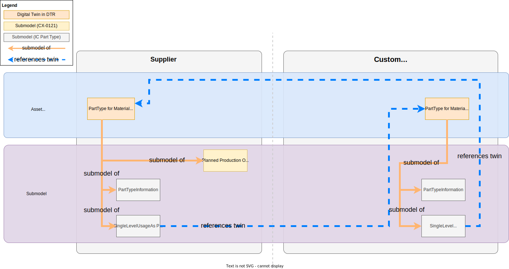
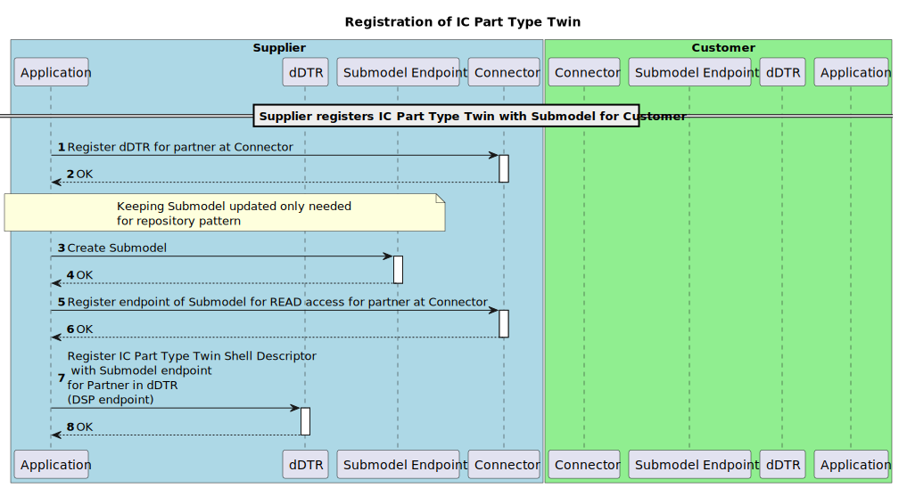
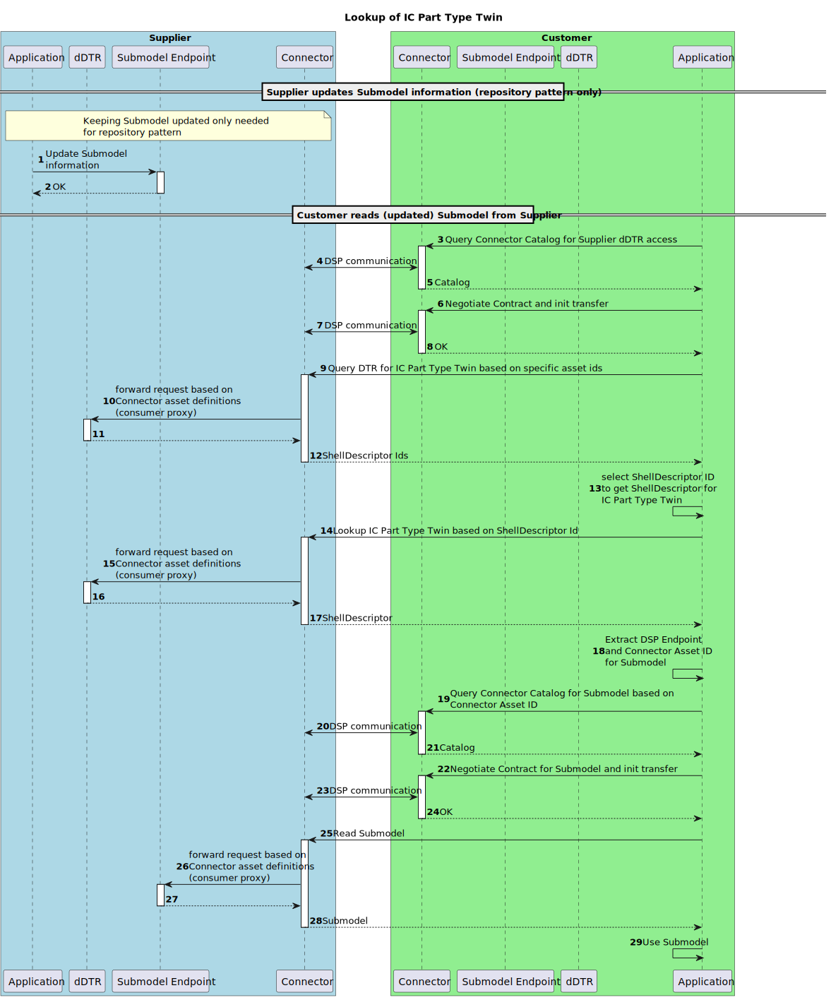

---
tags:
  - CAT/Business Application Provider
  - UC/PURIS
---

# CX-0121 Planned Production Output Exchange 1.0.1

## ABSTRACT

The supplier's *Planned Production Output* is one of the key determinants for avoiding a shortage at
the customer's site. With information about the supplier's *Planned Production Output* quantities
allocated to a specific customer, it can be monitored and predicted whether the customer demands can
be fully supplied. If this is not the case, the information can be used by the customer to derive
adequate countermeasures to keep the impact as low as possible. These measures can range, for
example, from creating an adapted production plan with the supplier, rescheduling or reducing the
customer's demand and production to, e.g. organizing an express delivery from an alternative supplier.

However, collecting the *Planned Production Output* information manually e.g. by phone or e-mail is
error prone and slow. As a result, unmet demands often remain unnoticed for too long and
unnecessarily restrict the scope for countermeasures. This often leads to shortages, costly
fire-fighting measures in the supply chain, production interruptions and ultimately to customer
dissatisfaction.

The standardization of the supplier's *Planned Production Output* semantics and exchange API enables
participants in the supply chain to share information about time-bound *Planned Production Output*
quantities at a supplier's site in an interoperable manner.

## FOR WHOM IS THE STANDARD DESIGNED

## COMPARISON WITH THE PREVIOUS VERSION OF THE STANDARD

Changes:

- integration and usage of digital twins as defined in [[CX-0002]](#61-normative-references) Digital Twins in Catena-X
- harmonization of aspect model in accordance with [[CX-0126]](#61-normative-references) Industry Core: Part Type
- discontinuation of the proprietary API used in v1.0.0 of this standard
- grammatical, spelling and semantic improvements

New Content:

- added a note on the obligation of standard implementers to make aware that sensitive data is being
  handled, see [[Chapter 2.1.3]](#213-additional-requirements)

## 1 INTRODUCTION

In recent years global supply chains have been significantly affected by global crises. This is
compounded by ever-increasing complexity and interdependencies. As a result small and medium-sized
enterprises as well as large enterprises are exposed to an increased risk of disruptions in their
supply chains. To adapt to short-term fluctuations and develop the right countermeasures, it is
essential to have sound information about the *Planned Production Output* of their suppliers.

This document describes and standardizes the semantic aspect model for the *Planned Production
Output* as well as the associated API to exchange *Planned Production Output* information between
supply chain partners. The supplier's *Planned Production Output* is the planned quantity of a
material allocated to a specific customer in a time horizon of up to four weeks, that has not yet
been produced. It has not yet been produced and is allocated to a specific partner. The scope of
application is limited to existing business relationships and build-to-order (BTO) scenarios.
Build-to-stock (BTS) use cases with no existing business relationships are explicitly not covered.
In contrast to the strategic Demand and Capacity Management standard (DCM) [[CX-0128]](#61-normative-references), the
*Planned Production Output* refers to short-term production planning, i.e. the actual utilization of
existing and available capacity that resulted from capacity planning. It shows the latest production
schedule-related information for a period of up to four weeks.

### 1.1 AUDIENCE & SCOPE

> *This section is non-normative*

This standard is relevant for the following roles defined in [[CX-OMW]](#62-non-normative-references):

- **Data Providers**  willing to provide *Planned Production Output* data
- **Data Consumers**  interested in requesting and receiving *Planned Production Output* data
- **Business Application Providers** interested in providing solutions implementing this standard
- **Consulting Services Providers** interested in supporting companies fulfilling the standard

The scope of this standard is only the Planned Production Output aspect model and API. It describes
the exchange of Planned Production Output data through a connector in accordance to [[CX-0018]](#61-normative-references).

### 1.2 CONTEXT AND ARCHITECTURE FIT

> *This section is non-normative*

A typical order-based procurement process includes a customer who places an order and a supplier
fulfilling it. If the ordered material is not on stock in a sufficient quantity at a supplier's
facility (see [[CX-0122]](#61-normative-references) Item Stock Exchange) it needs to be scheduled for production. These
quantities of scheduled production are the subject of this standard and are referred to as the
*Planned Production Output*. To ensure that the *Planned Production Output* information will be
interpreted, handled and exchanged in an interoperable manner between partners participating in
Catena-X, this standard document defines the PlannedProductionOutput aspect model and the API to be
used in the Catena-X network.

*Figure 1* shows the high-level architecture of the "Planned Production Output Exchange" in the
Catena-X dataspace and the services that are involved. Both the data consumer and the data provider
must be members of the Catena-X network in order to communicate with each other.  With the help of
the Credential Service and the Identity Access Management (IAM) each participant can authenticate
itself, verify the identity of the requesting party and decide whether to authorize the request.
The *Planned Production Output* data is provisioned in accordance with [[CX-0002]](#61-normative-references).


*Figure 1: high-level architecture of the Planned Production Output Exchange in Catena-X*

### 1.3 CONFORMANCE AND PROOF OF CONFORMITY

> *This section is non-normative*

As well as sections marked as non-normative, all authoring guidelines, diagrams, examples, and notes
in this specification are non-normative. Everything else in this specification is normative. The
keywords **MAY** , **MUST** , **MUST NOT** , **OPTIONAL** , **RECOMMENDED** , **REQUIRED** ,
**SHOULD** and **SHOULD NOT** in this document are to be interpreted as described in [BCP 14]
[[RFC2119]](#62-non-normative-references) [[RFC8174]](#62-non-normative-references) when, and only when, they appear in all capitals, as shown here.

All participants and their solutions will need to prove, that they are conform with the Catena-X
standards. To validate that the standards are applied correctly, Catena-X employs Conformity
Assessment Bodies (CABs). The proof of conformity for a single semantic model is done according to
the general rules for proving the conformity of data provided to a semantic model or the ability to
consume the corresponding data. Furthermore, participants agree to follow the normative language of
this standardization document and to implement the required API-Endpoints described in [Chapter 4](#4-application-programming-interface).

### 1.4 EXAMPLES

 The following JSON provides an example of the value-only serialization of the "PlannedProductionOutput"
 aspect model. It contains the *Planned Production Output* quantities for three consecutive days in two
 different sites (BPNS).

```json
{
  "materialGlobalAssetId":"urn:uuid:48878d48-6f1d-47f5-8ded-a441d0d879df",
  "positions":[
    {
      "lastUpdatedOnDateTime":"2023-04-01T14:23:00+01:00",
      "orderPositionReference": {
        "supplierOrderId":"M-Nbr-4711",
        "customerOrderId":"C-Nbr-4711",
        "customerOrderPositionId":"PositionId-01"
      },
      "allocatedPlannedProductionOutputs":[
        {
          "plannedProductionQuantity":{
            "value": 10,
            "unit":"unit:piece"
          },
          "productionSiteBpns":"BPNS0123456789ZZ",
          "estimatedTimeOfCompletion":"2023-04-01T14:23:00+01:00"
        },

        {
          "plannedProductionQuantity":{
            "value":20,
            "unit":"unit:piece"
          },
          "productionSiteBpns":"BPNS0123456789YZ",
          "estimatedTimeOfCompletion":"2023-04-02T14:23:00+01:00"
        },

        {
          "plannedProductionQuantity":{
            "value": 10,
            "unit":"unit:piece"
          },
          "productionSiteBpns":"BPNS0123456789ZZ",
          "estimatedTimeOfCompletion":"2023-04-03T14:23:00+01:00"
        }
      ]
    }
  ]
}
```

### 1.5 TERMINOLOGY

> *This section is non-normative*

| **Name** | **Abrv.** | **Description** |
| --- | --- | --- |
| **Business Partner Number** | BPN | A BPN is the unique identifier of a partner within Catena-X as defined in [[CX-0010]](#61-normative-references). |
| **Business Partner Number Legal Entity** | BPNL | A BPNL is the unique identifier of a partner legal entity within Catena-X as defined in [[CX-0010]](#61-normative-references). |
| **Business Partner Number Site** | BPNS | A BPNS is the unique identifier of a partner site within Catena-X as defined in [[CX-0010]](#61-normative-references). |
| **Business Partner Number Address** | BPNA | A BPNA is the unique identifier of a partner address within Catena-X as defined in [[CX-0010]](#61-normative-references). |
| **Position** | | A position within an order defines the product and the quantity the supplier has to manufacture / supply for a customer. A single order may contain multiple positions for different products. |
| **Order** | | Request from a customer towards a supplier to manufacture / supply a given quantity of a specific product in a predefined time frame. |
| **Allocated Stock** | | The already manufactured and not yet been used products, components or material. They are allocated to a specific customer based on the orders made by the latter and are either still in the supplier's warehouse or already in the customer's warehouse. |
| **Provider** | | The party providing the *Planned Production Output* data. In the context of the *Planned Production Output* exchange API this is the supplier. |
| **Consumer** | | The party requesting and consuming the *Planned Production Output* data provided by the provider. In the context of the *Planned Production Output* exchange API this is the customer. |
| **Stock Location** | | The physical location of a stock specified by its corresponding BPNS and BPNA. More information on BPN/S/A is provided in [CX-0010]. |
| **Customer** | | The recipient of products ordered from / manufactured by a supplier. |
| **Supplier** | | The supplier / manufacturer of a product. |
| **Stock** | | Two way direction of material on stock: <br /> - One can have a stock of material which is ready for delivery to customers. <br /> - One can have a stock of material which can be used for the own production. |
| **Material** | | The term material is used as a catalogue item in the meaning of the Industry Core Part Type ([[CX-0126]](#61-normative-references)). Whenever referring to material also products, components or items are considered. Semi-finished goods are not intended to be covered. |
| **Production Output** | | The output quantity in a defined period of time for a component or material. |
| **Digital Twin** | DT | Digital representation of an asset that provides data on aspects of the represented data following [[CX-0002]](#61-normative-references). |
| **decentralized Digital Twin Registry** | dDTR | Component providing registration and discovery API implementations following [[CX-0002]](#61-normative-references). Sometimes referred to without the "decentralized" BUT in Catena-X those are always decentralized. |
| **Asset Administration Shell** | AAS | Technical concept for Digital Twins consisting of different standards. Application in Catena-X is described in Digital Twins in Catena-X standard ([[CX-0002]](#61-normative-references))  |
| **Shell Descriptor** | | Technical concept of the AAS API describing metadata of an Asset Administration Shell representing a Digital Twin. It holds identification information and metadata about which submodels are available and where to get the data from (see [[CX-0002]](#61-normative-references), [[IDTA-01002-3-0]](#62-non-normative-references)). There may exist multiple Shell Descriptor for the same represented Asset (see [[CX-0126]](#61-normative-references)). |
| **Submodel Descriptor** | | Technical concept of the AAS API describing metadata of Submodels within a Shell Descriptor (Asset Administration Shell) (see [[CX-0002]](#61-normative-references), [[IDTA-01002-3-0]](#62-non-normative-references)). |
| **Specific Asset Ids** | | Identifiers of the Shell Descriptor (Asset Administration Shell) that refer to common identification data for an asset/material at hand e.g., manufacturer part Id. Common specific asset ids used for identification are described in Industry Core Part Type Standard (see [[CX-0126]](#61-normative-references)). |
| **Asset Administration Shell Identifier** | AAS ID | Also referred to as Shell Descriptor Id, is the technical identifier of the Shell Descriptor.  |
| **Global Asset Id** | | Also referred to as Catena-X Id, is the Catena-X identifier for assets represented by Digital Twins (see [[CX-0126]](#61-normative-references)). |
| **Aspect** | | A domain-specific view on information and functionality associated with a specific Digital Twin with a reference to a concrete Aspect Model (see [[CX-0002]](#61-normative-references)). Within Catena-X, an aspect is formally described using the Semantic Aspect Meta Model (see [[CX-0003]](#61-normative-references)). |
| **Semantic Id** | | Identifier including namespace to specify the semantic description of submodels using the Semantic Aspect Meta Model (SAMM). It allows partners to know the exact data format and semantics when e.g., browsing catalogs (see [[CX-0003]](#61-normative-references)). |
| **Data Space Protocol** | DSP | A set of specifications designed to facilitate interoperable data sharing between entities governed by usage control and based on Web technologies. These specifications define the schemas and protocols required for entities to publish data, negotiate Agreements, and access data as part of a Dataspace. It is governed by the International Data Spaces Association. Connectors compliant to [[CX-0018]](#61-normative-references) support the Data Space Protocol. |

*Table 1: Terminology Planned Production Output Standard*

Additional terminology used in this standard can be looked up in the glossary on the association homepage.

## 2 RELEVANT PARTS OF THE STANDARD FOR SPECIFIC USE CASES

> *This section is normative*

### 2.1 Planned Production Output Exchange

#### 2.1.1 LIST OF STANDALONE STANDARDS

The following Catena-X standards are prerequisites for the implementation of this standard and therefore
**MUST** be considered / implemented by the relevant parties specified in each of them.

| **Number** | **Standard** | **Version** |
| --- | --- | --- |
| [[CX-0001]](#61-normative-references) | EDC Discovery API | 1.0.2 |
| [[CX-0002]](#61-normative-references) | Digital Twins in Catena-X | 2.2.0 |
| [[CX-0003]](#61-normative-references) | SAMM Aspect Meta Model | 1.1.0 |
| [[CX-0006]](#61-normative-references) | Registration and initial onboarding | 2.0.0 |
| [[CX-0010]](#61-normative-references) | Business Partner Number (BPN) | 2.0.0 |
| [[CX-0018]](#61-normative-references) | Dataspace Connectivity | 3.0.0 |
| [[CX-0126]](#61-normative-references) | Industry Core Part Type | 2.0.0 |

*Table 2: List of mandatory standards*

The usage of this standard may be complemented with the following Catena-X standards to further extend
the range of shortage prevention possibilities:

| **Number** | **Standard** | **Version** |
| --- | --- | --- |
| [[CX-0118]](#61-normative-references) | Delivery Information Exchange | 2.0.0 |
| [[CX-0120]](#61-normative-references) | Short-term Material Demand Exchange | 2.0.0 |
| [[CX-0122]](#61-normative-references) | Item Stock Exchange | 2.0.0 |
| [[CX-0145]](#61-normative-references) | Days of Supply Exchange | 1.0.0 |
| [[CX-0146]](#61-normative-references) | Supply Chain Disruption Notifications | 1.0.0 |

*Table 3: List of non-mandatory complementary standards*

#### 2.1.2 DATA REQUIRED

No additional data requirements

#### 2.1.3 POLICY CONSTRAINTS FOR DATA EXCHANGE

In alignment with our commitment to data sovereignty, a specific framework governing the utilization of data within the Catena-X use cases has been outlined.  As part of this data sovereignty framework, conventions for access policies, for usage policies and for the constraints contained in the policies have been specified in standard [CX-0152 Policy Constraints for Data Exchange](#61-normative-references). This standard document CX-0152 **MUST** be followed when providing services or apps for data sharing/consuming and when sharing or consuming data in the Catena-X ecosystem. What conventions are relevant for what roles named in [1.1 AUDIENCE & SCOPE](#11-audience--scope) is specified in the CX-0152 standard document as well.

##### REMINDER OF ANTITRUST

Notice and/or acknowledgement concepts to raise awareness of antitrust issues during use of this standard
are **RECOMMENDED**, for example through the implementation of a help desk or pop-up info.

#### 2.1.4 DIGITAL TWINS AND SPECIFIC ASSET IDs

This standard builds upon the Industry Core Part Type [[CX-0126]](#61-normative-references) and the Digital Twins in
Catena-X [[CX-0002]](#61-normative-references) standards. It follows the following design patterns:

- Usage of the specific asset IDs and further identification data for the Digital Twin for the Part Type
  (see [[CX-0126]](#61-normative-references)).
- Provisioning of the *PartTypeInformation* on supplier side (see [[CX-0126]](#61-normative-references)).

Because only the supplier provides planned production output data for the Part Type Twin, the supplier is in charge of creating a twin that is identifiable for the customer.

- The supplier of the part has a Digital Twin representation and is then able to offer
  *Planned Production Output* data to customers.
- The customer, who orders or uses the part, has a Digital Twin representation to offer
  *Planned Production Output* data to a supplier.
- To make the Part Type Twin identifiable for the customers, the supplier
  - **MUST** create the Digital Twin first.
  - **MUST** generate the Catena-X ID and ensure that the customer-specific asset IDs and submodel
    descriptors are only accessible by the specific customer.
  - **MAY** use the Digital Twin for multiple customers.

The definition of identification data (Catena-X ID, Asset Administration Shell ID, specific asset ID)
**MUST** follow the Industry Core Part Type [[CX-0126]](#61-normative-references). Refer to [Chapter 4.1.2](#412-industry-core-part-type-twin-registration-and-definition) for further details.

> ***Note:*** The Part Type Twin's data is considered sensitive. Data providers **MUST** implement appropriate
measures ensuring that competitors-specific asset IDs and/or information about submodels is accessible
only to the data consumers it concerns, but not to their competitors.

Figure 2 shows how the shared asset approach is realized. The orange lines show which submodels belong
to the respective AAS. All *Planned Production Output*-specific submodels are bound to the specific
Part Type's context e.g., meaning that the *Planned Production Output* aspect is described for the specific
catalog item on supplier and customer side represented by the AASs. The orange submodels are the
submodels used within this standard's context. The grey submodels are used within the Industry Core
[[CX-0126]](#61-normative-references)(*PartTypeInformation, SingleLevelBomAsPlanned, SingleLevelUsageAsPlanned*).
The blue dashed lines show the references between DTs based on Catena-X UUIDs and BPNL information that
may be resolved by the Item Relationship Service (see [[CX-0126]](#61-normative-references)).


*Figure 2: Conceptual levels of provisioning digital twins*

Figure 2 details two conceptual levels:

- The Asset level contains the asset (Industry Core Part Type) represented by a Digital Twin.
  The latter is provisioned as an Asset Administration Shell (AAS) within the decentralized Digital
  Twin Registry (dDTR) of the data provider (supplier or customer).
- The Submodel level represents the actual information that are held by a Digital Twin (DT). Those
  submodels follow the respective definition of the in Semantic Aspect Meta Model (SAMM) format
  (see [Chapter 3](#3-aspect-model)). The dDTR only holds meta-information about the Submodel
  (e.g. kind of submodel via semantic ID or connector endpoint information).

## 3 ASPECT MODEL

> *This section is normative*

### 3.1 "PLANNED PRODUCTION OUTPUT" ASPECT MODEL

#### 3.1.1 INTRODUCTION

The *Planned Production Output* defines the set of quantities of a material that will be produced for
a customer until a given point in time. For the complete semantics and detailed description of its
properties refer to the SAMM model in [Chapter 3.1.5.1](#3151-rdf-turtle).

#### 3.1.2 SPECIFICATIONS ARTIFACTS

The modeling of the semantic model specified in this document was done in accordance to the
"semantic-driven workflow" to create a submodel template specification [[SMT]](#62-non-normative-references).

This aspect model is written in SAMM 2.1.0 as a modeling language conformant to [[CX-0003]](#61-normative-references) as
input for the semantic-driven workflow.

Like all Catena-X data models, this model is available in a machine-readable format on GitHub
conformant to [[CX-0003]](#61-normative-references).

#### 3.1.3 LICENSE

This Catena-X data model is made available under the terms of the Creative Commons Attribution 4.0
International (CC-BY-4.0) license, which is available at Creative Commons.

#### 3.1.4 IDENTIFIER OF SEMANTIC MODEL

The semantic model has the unique identifier

> `urn:samm:io.catenax.planned_production_output:2.0.0`

This identifier **MUST** be used by the data provider to define the semantics of the data being transferred.

#### 3.1.5 FORMATS OF SEMANTIC MODEL

##### 3.1.5.1 RDF TURTLE

The RDF turtle file, an instance of the Semantic Aspect Meta Model, is the master for generating additional
file formats and serializations. It can be found under the following link:

> [https://github.com/eclipse-tractusx/sldt-semantic-models/blob/main/io.catenax.planned_production_output/2.0.0/PlannedProductionOutput.ttl](https://github.com/eclipse-tractusx/sldt-semantic-models/blob/main/io.catenax.planned_production_output/2.0.0/PlannedProductionOutput.ttl)

The open source command line tool of the Eclipse Semantic Modeling Framework is used for generation of
other file formats like for example a JSON Schema, aasx for Asset Administration Shell Submodel Template
or a HTML documentation.

##### 3.1.5.2 JSON SCHEMA

A JSON Schema can be generated from the RDF Turtle file. The JSON Schema defines the Value-Only payload
of the Asset Administration Shell for the API operation *"GetSubmodel"*.

##### 3.1.5.3 AASX

An AASX file can be generated from the RDF Turtle file. The AASX file defines one of the requested
artifacts for a Submodel Template Specification conformant to [[SMT]](#62-non-normative-references).

## 4 APPLICATION PROGRAMMING INTERFACE

> *This section is normative*

### 4.1 API USED TO EXCHANGE "PLANNED PRODUCTION OUTPUT" INFORMATION

As described in [Chapter 2.1.4](#214-digital-twins-and-specific-asset-ids) this standard builds upon the [[CX-0002]](#61-normative-references) Digital Twins in Catena-X
and [[CX-0126]](#61-normative-references) Industry Core Part Type standards. Therefore, the APIs provided by the Digital Twin
standard are combined with the part identification defined in the Industry Core standard. This chapter
defines how the aforementioned standards and the [[CX-0018]](#61-normative-references)
standard **MUST** be used to facilitate the provisioning of *Planned Production Output* data. The
usage of the Discovery Services defined in [[CX-0001]](#61-normative-references), [[CX-0053]](#61-normative-references) is not mandatory,
because this standard assumes an already existing business relationship between the involved parties.

The sequence diagram in *Figure 3* provides an overview of the interactions required to register the
Part Type Twin.

- Steps 1 & 2: Register the dDTR access for the partner at the connector
- Steps 3 & 4: When using the repository pattern, create the submodel (and twin)
- Steps 5 & 6: Register the submodel endpoint for the partner at the connector
- Steps 7 & 8: Register or update the twin Shell Descriptor relying on the registered Connector asset
  for the submodel endpoint and the identification data of the partners


*Figure 3: Flow to create and register a digital twin*

The sequence diagram in Figure 4 provides an overview of the interactions required when a supplier
(acting as data provider) provisions *Planned Production Output* data to a customer (acting as data consumer).

The flow "*Customer reads (updated) Submodel from Supplier*" visualizes the sequence of calls when consuming data:

- Steps 3 - 8: Contract dDTR usage in the connector.
- Steps 9 - 12: Lookup the Industry Core Part Type Twin for a Part Type based on the common identification data.
- Steps 13 - 18: Read the Shell Descriptor of the Industry Core Part Type Twin to extract the *Planned Production Output*
  submodel endpoint (registered at the connector).
- Steps 19 - 24: Contract the *Planned Production Output* data usage in the connector.
- Steps 25 - 29: Consume and use the *Planned Production Output* data.


*Figure 4: Flow to lookup a digital twin and get a submodel.*

> ***Note:*** Depending on the use of repository patterns and the design of the Digital Twins, the data
may be updated manually in the Submodel endpoint.

#### 4.1.1 CONNECTOR DATA ASSET STRUCTURE

The endpoints for the dDTR and the Submodel Endpoint **MUST** be made available BUT they **MUST NOT**
be directly called data consumer. Rather, for access to dDTRs and Submodels, there **MUST** be contracts
negotiated in accordance with the DSP. Therefore, the endpoints **MUST** be offered as connector data
assets. To make these assets easily identifiable in the connector's catalog, each asset **MUST** be
configured with a set of properties as described in the corresponding sections below.

The following table provides an overview of the connector data assets that the parties **MUST** offer
to be able to provision and/or consume *Planned Production Output* data.

| **Party** | **REQUIRED** | **Asset** | **Purpose** |
| --- | --- | --- | --- |
| Supplier | Yes | "Digital Twin Registry" | Allows a consumer to query for Part Type Twins and their *Planned Production Output* submodels. |
| Supplier | Yes | "Submodel Planned Production Output" | Allows a consumer to read actual *Planned Production Output* data related to a Part Type Twin. |

*Table 4: Connector data assets*

In the section below the asset definitions of two different kinds of assets are defined.

##### Connector Data Asset Structure for "Digital Twin Registry"

To allow partners to find the "Planned Production Output" data for a specific Industry Core Part Type Twin,
the provider **MUST** register a connector data asset (see details in [[CX-0018]](#61-normative-references)) specifying the address
of the Digital Twin Registry of the provider (see [[CX-0002]](#61-normative-references)).

The data asset **MUST** be configured with the set of properties as defined in the table below.

| **Object** | **Property** | **Purpose** | **Usage & Constraints** |
| --- | --- | --- | --- |
| | ***@id*** | Identifier of the asset | The asset ID **MUST** be unique and therefore **MUST NOT** be reused elsewhere. |
| properties | [**http://purl.org/dc/terms/type**](http://purl.org/dc/terms/type) | Defines the "Digital Twin Registry" according to the Catena-X taxonomy. | **MUST** be set to `{"@id": "https://w3id.org/catenax/taxonomy#DigitalTwinRegistry"}` to allow filtering the data assets catalog for the respective "Digital Twin Registry". |
| properties | [**https://w3id.org/catenax/ontology/common#version**](https://w3id.org/catenax/ontology/common#version) | The version of the standard defining the implemented API of the "Digital Twin Registry" | **MUST** correspond to the version of the standard defining the Interfaces of the "Digital Twin Registry". The value **MUST** be set to `"3.0"` for "Digital Twin Registries" used by this standard. |
| dataAddress | **@type** | Type of the DataAddress node. | **MUST** be set to `"DataAddress"`. |
| dataAddress | ***baseUrl*** | Defines the HTTPS endpoint of the corresponding "Digital Twin Registry Endpoint". | The `{{ DIGITAL_TWIN_REGISTRY_ENDPOINT }}` refers to an URL under which the API of the "Digital Twin Registry" endpoint is available. HTTPS transport protocol **MUST** be used. |
| dataAddress | ***proxyBody*** | Defines whether the endpoint allows to proxy the HTTPS body | **SHOULD** be set to `"false"` to not allow the API endpoint to receive a HTTPS body via the HTTPS request. |
| dataAddress | ***proxyMethod*** | Defines whether the endpoint allows to proxy the HTTPS method | **SHOULD** be set to `"false"` to only allow the API endpoint to receive GET requests. |
| dataAddress | ***proxyPath*** | Defines whether the endpoint allows to proxy paths for the URL | **MUST** be set to `"true"` to allow the API endpoint to receive appended paths of the HTTPS request. |
| dataAddress | ***type*** | Defines the type of data plane extension handling the data exchange | **MUST** be set to `"HttpData"` to provide an API via an HTTPS proxy endpoint. |

*Table 5: Connector data assets request properties*

Additionally security identification information **MAY** be added to secure the "Decentralized Digital Twin Registry".

When searching the Catalog of a provider, a consumer **SHOULD** use the following properties AND
their values to identify the Data Asset specifying "Digital Twin Registry". In the connector Data Asset
descriptions the API version valid for this standard is mentioned for the property
[`https://w3id.org/catenax/ontology/common#version`](https://w3id.org/catenax/ontology/common#version). The requester of a Data Asset **MUST** be
able to handle multiple Data Asset for this endpoint, being differentiated only by the version.
The requester **SHOULD** choose the Data Asset set with the highest compatible version number implemented
by themselves. If the requester cannot find a compatible version with their own, the requester **MUST**
terminate the data transfer.

| **Property** | **Value** |
| --- | --- |
| http://purl.org/dc/terms/type | `{"@id": "https://w3id.org/catenax/taxonomy#DigitalTwinRegistry"}` |

*Table 6: Connector data assets request properties values.*

An example connector data asset definition is given below.

>**Note:** Expressions in double curly braces \{\{\}\} must be substituted with a corresponding value.

```json
{
  "@context": {
    "@vocab": "https://w3id.org/edc/v0.0.1/ns/",
    "cx-common": "https://w3id.org/catenax/ontology/common#",
    "cx-taxo": "https://w3id.org/catenax/taxonomy#",
    "dct": "http://purl.org/dc/terms/"
  },
  "@id": "{{CONNECTOR_ASSET_ID}}",
  "properties": {
    "dct:type": {"@id": "cx-taxo:DigitalTwinRegistry"},
    "cx-common:version": "3.0"
  },
  "privateProperties": {
  },
  "dataAddress": {
    "@type": "DataAddress",
    "type": "HttpData",
    "baseUrl": "{{ DIGITAL_TWIN_REGISTRY_ENDPOINT }}",
    "proxyQueryParams": "true",
    "proxyBody": "false",
    "proxyPath": "true",
    "proxyMethod": "false",
  }
}
```

##### Connector Data Asset Structure for "Submodel"

To allow partners to receive the "Planned Production Output" data as defined in [Chapter 3](#3-aspect-model),
the provider  **MUST** register a connector data asset (see details in[[ CX-0018]](#61-normative-references)) specifying the
address of the submodel endpoint (see [[CX-0002]](#61-normative-references)) providing the actual data.

The data asset **MUST** be configured with the set of properties as defined in the table below.

| **Object** | **Property** | **Purpose** | **Usage & Constraints** |
| --- | --- | --- | --- |
| | ***@id*** | Identifier of the asset | The asset ID **MUST** be unique and therefore **MUST NOT** be reused elsewhere. |
| properties | [**http://purl.org/dc/terms/type**](https://purl.org/dc/terms/type) | Defines the "Submodel API" according to the Catena-X taxonomy. | **MUST** be set to `{"@id": "https://w3id.org/catenax/taxonomy#Submodel"}` to allow filtering the data assets catalog for the respective "Submodel API". |
| properties | [**https://admin-shell.io/aas/3/0/HasSemantics/semanticId**](https://admin-shell.io/aas/3/0/HasSemantics/semanticId) | The semantic identifier of the "Planned Production Output" SAMM. | **MUST** be set to `{"@id": "urn:samm:io.catenax.planned_production_output:2.0.0#PlannedProductionOutput"}` to externally define how the Submodel must be interpreted. **MUST NOT** be set, if different submodels may be returned by this API. |
| properties | [**https://w3id.org/catenax/ontology/common#version**](https://w3id.org/catenax/ontology/common#version) | Version of the Submodel Interface Specification | **MUST** be set to `"3.0"` in accordance to [[CX-0002]](#61-normative-references). |
| dataAddress | **@type** | Type of the DataAddress node. | **MUST** be set to `"DataAddress"`. |
| dataAddress | ***baseUrl*** | Defines the HTTPS Submodel endpoint provisioning the *Planned Production Output* data | The `{{ SUBMODEL_ENDPOINT }}` refers to an URL under which the Submodel API Endpoint ([[CX-0002]](#61-normative-references)) is available to provide the "Planned Production Output" . HTTPS transport protocol **MUST** be used. |
| dataAddress | ***proxyBody*** | Defines whether the endpoint allows to proxy the HTTPS body | **SHOULD** be set to `"false"` to not allow the API endpoint to receive a HTTPS body via the HTTPS request. |
| dataAddress | ***proxyMethod*** | Defines whether the endpoint allows to proxy the HTTPS method | **SHOULD** be set to `"false"` to only allow the API endpoint to receive GET requests. |
| dataAddress | ***proxyPath*** | Defines whether the endpoint allows to proxy paths for the URL | **MUST** be set to `"true"` to allow the API endpoint to receive appended paths of the HTTPS request. Setting this parameter depends on the implementation of the submodel lookup. |
| dataAddress | ***type*** | Defines the type of data plane extension handling the data exchange | **MUST** be set to `"HttpData"` to provide an API via an HTTPS proxy endpoint. |

*Table 7: Connector data assets request properties*

Additionally security identification information **MAY** be added to secure the "Submodel API".

When searching the data assets catalog of a provider, a consumer **SHOULD** use the `assetId` previously
determined via `subprotocolBody` of the SubmodelDescriptor's endpoint definition of subprotocol type "DSP".
Refer to [Chapter 4.1.2](#412-industry-core-part-type-twin-registration-and-definition) for the definition of the `subprotocolBody`.

| **Property** | **Value** |
| --- | --- |
| [https://w3id.org/edc/v0.0.1/ns/id](https://w3id.org/edc/v0.0.1/ns/id) | `{{CONNECTOR_ASSET_ID}}` specified in the DSP endpoint of the SubmodelDescriptor (see [Chapter 4.1.2](#412-industry-core-part-type-twin-registration-and-definition)) |

*Table 8: Connector data assets request properties values*

An example connector data asset definition is given below.

>**Note:** Expressions in double curly braces \{\{\}\} must be substituted with a corresponding value.

```json
{
  "@context": {
    "@vocab": "https://w3id.org/edc/v0.0.1/ns/",
    "cx-common": "https://w3id.org/catenax/ontology/common#",
    "cx-taxo": "https://w3id.org/catenax/taxonomy#",
    "dct": "http://purl.org/dc/terms/",    
    "aas-semantics": "https://admin-shell.io/aas/3/0/HasSemantics/"
   },
  "@id": "{{CONNECTOR_ASSET_ID}}",
  "properties": {
    "dct:type": {"@id": "cx-taxo:Submodel"},
    "cx-common:version": "3.0",
    "aas-semantics:semanticId": {"@id":  "urn:samm:io.catenax.planned_production_output:2.0.0#PlannedProductionOutput"}   },
  "privateProperties": {
  },
  "dataAddress": {
    "@type": "DataAddress",
    "type": "HttpData",
    "baseUrl": "{{ SUBMODEL_ENDPOINT }}",
    "proxyQueryParams": "false",
    "proxyBody": "false",
    "proxyPath": "true",
    "proxyMethod": "false",
  }
}
```

#### 4.1.2 INDUSTRY CORE PART TYPE TWIN REGISTRATION AND DEFINITION

##### 4.1.2.1 SHELL DESCRIPTOR REGISTRATION

To allow partners to receive the actual "*Planned Production Output*" data as defined in [Chapter 3](#3-aspect-model),
the provider **MUST** register a Shell Descriptor in the dDTR (see [[CX-0002]](#61-normative-references)) so that a partner:

- May lookup the Industry Core Part Type Twin based on known identification data.
- May identify the connector endpoint providing access to the *Planned Production Output* submodel data.

The Shell Descriptors represent each an Industry Core Part Type Twin and **MUST** follow the rules as defined
in [Chapter 2.1.4](#214-digital-twins-and-specific-asset-ids).

The Shell Descriptor **MUST** be configured with the set of properties as defined in the table below.

| **Object in ShellDescriptor** | **Property** | **Purpose** | **Usage & Constraints** |
| --- | --- | --- | --- |
| | ***id*** | Defines the technical ID of the Asset Administration Shell representing a partner's twin. | **MUST** be unique following Industry Core Part Type standard ([[CX-0126]](#61-normative-references)) and is a technical Id randomly assigned as multiple Part Type Twins may be created for one Part Type. E.g. this number differs for the twins created at supplier and customer side. |
| | ***globalAssetId*** | Defines the Catena-X ID of the twin. | **MUST** be aligned with the partner's material. When referring to the same Part Type Twin, the same number **MUST** be used (see [[CX-0126]](#61-normative-references)). |
| | **specificAssetIds** | Identifiers that may be used to lookup Part Type Twins. | **MUST** be set to according to the Industry Core Part Type standard ([[CX-0126]](#61-normative-references)). See *Table 10* for respective specific asset IDs. The `"customerPartId"` **MUST** be set by Customers and **SHOULD** be set by Suppliers. |
| submodelDescriptor | **id** | Technical identifier of a SubmodelDescriptor. | **MUST** be set to a unique identifier. |
| submodelDescriptor | **semanticId** | The semantic identifier of the "Planned Production Output" SAMM. | **MUST** be set to `{ "type": "ExternalReference", "keys": [{ "type": "GlobalReference", "value": "urn:samm:io.catenax.planned_production_output:2.0.0#PlannedProductionOutput" }] }` to externally define how the Submodel must be interpreted. |
| submodelDescriptor > endpoint | **interface** | Defines the Submodel Interface [[CX-0002]](#61-normative-references) and the version. | **MUST** be set to `"SUBMODEL-3.0"` to rely on current specification. |
| submodelDescriptor > endpoint > protocolInformation | **href** | Defines the direct link to the public API of the connector's data plane with a path that **SHOULD** be appended by the proxy, if needed. | **MUST** be set to the public API of the dataplane providing the data with the path appended to directly access the submodel. |
| submodelDescriptor > endpoint > protocolInformation | **subprotocol** | Defines the usage of the connector based on DSP to access and use the submodel.  | **MUST** be set to `"DSP"` to define the connector endpoint of the subprotocol. |
| submodelDescriptor > endpoint > protocolInformation | **subprotocolBody** | Defines the asset id in the connector and the connector address to access and use the submodel. | **MUST** be set to `"id={{CONNECTOR_ASSET_ID}};dspEndpoint={{SUPPLIER_CONNECTOR_DSP_ENDPOINT}}"` to provide the necessary information for contracting the submodel endpoint. Refer to [Chapter 4.1.2](#412-industry-core-part-type-twin-registration-and-definition) for the definition of the asset of the subprotocolBody. |

*Table 9: Properties relevant for the Shell Descriptor definition*

When searching the submodel in the dDTR of a provider, a consumer **SHOULD** use the specific asset IDs
as defined in [[CX-0126]](#61-normative-references). Table 10 gives an overview of the specific asset IDs that the data provider
added to the ShellDescriptor so that the data consumer may find the Industry Core Part Type Twin.

| **Specific Asset Id** | **Value** |
| --- | --- |
| digitalTwinType | "PartType". Set to identify twins compliant to the Industry Core Part Type (see [[CX-0126]](#61-normative-references)). |
| manufacturerId | Supplier / Manufacturer partner BPNL (see [[CX-0010]](#61-normative-references)) |
| manufacturerPartId | Supplier / Manufacturer partner identification number of the part. |
| customerPartId | Customer partner identification number of the part. |

*Table 10: Specific asset IDs of Industry Core Part Type Twins proposed to be used to lookup a twin in the dDTR*

The Shell Descriptor defines the metadata of the Industry Core Part Type Twin. The following example
Shell Descriptor represents a supplier's Shell Descriptor of a supplier who provides two customers access
to a "Planned Production Output" submodel. For further information on the creation of Part Type Twins,
refer to [Chapter 2.1.4](#214-digital-twins-and-specific-asset-ids).

Following [[CX-0002]](#61-normative-references), when searching the data assets catalog of a provider, a consumer  **SHOULD**
use the `assetId` determined via `subprotocolBody` of the SubmodelDescriptor's endpoint definition
of subprotocol type `"DSP"` of the Submodel Descriptor of interest.

> **Note:** Expressions in double curly braces \{\{\}\} must be substituted with a corresponding value.

```json
{
  "id": "{{TECHNICAL_TWIN_ID}}",
  "globalAssetId": "{{MATERIAL_NUMBER_CX}}",
  "idShort": "Semiconductor",
  "specificAssetIds": [
    {
      "name": "digitalTwinType",
      "value": "PartType",
      "externalSubjectId": {
        "type": "ExternalReference",
        "keys": [
          {
            "type": "GlobalReference",
            "value": "{{SUPPLIER_BPNL}}"
          },
          {
            "type":"GlobalReference",
            "value":"{{CUSTOMER_BPNL}}"
          },
          {
             "type":"GlobalReference",
             "value":"{{OTHER_CUSTOMER_BPNL}}"
          }
          ]
      }
    },
    {
      "name": "manufacturerPartId",
      "value": "{{MATERIAL_NUMBER_SUPPLIER}}",
      "externalSubjectId": {
        "type": "ExternalReference",
        "keys": [
          {
              "type": "GlobalReference",
              "value": "{{SUPPLIER_BPNL}}"
          },
          {
              "type":"GlobalReference",
              "value":"{{CUSTOMER_BPNL}}"
          },
          {
             "type":"GlobalReference",
             "value":"{{OTHER_CUSTOMER_BPNL}}"
          }
        ]
      }
    },
    {
      "name": "manufacturerId",
      "value": "{{SUPPLIER_BPNL}}",
      "externalSubjectId": {
        "type": "ExternalReference",
        "keys": [
          {
            "type": "GlobalReference",
            "value": "{{SUPPLIER_BPNL}}"
          },
          {
            "type":"GlobalReference",
            "value":"{{CUSTOMER_BPNL}}"
          },
          {
            "type":"GlobalReference",
            "value":"{{OTHER_CUSTOMER_BPNL}}"
          }
        ]
      }
    },
    {
      "name": "customerPartId",
      "value": "{{MATERIAL_NUMBER_CUSTOMER}}",
      "externalSubjectId": {
        "type": "ExternalReference",
        "keys": [
          {
            "type": "GlobalReference",
            "value": "{{SUPPLIER_BPNL}}"
          },
          {
            "type":"GlobalReference",
            "value":"{{CUSTOMER_BPNL}}"
          }
        ]
      }
    },
    {
      "name": "customerPartId",
      "value": "{{MATERIAL_NUMBER_OTHER_CUSTOMER}}",
      "externalSubjectId": {
        "type": "ExternalReference",
        "keys": [
          {
            "type": "GlobalReference",
            "value": "{{SUPPLIER_BPNL}}"
          },
          {
            "type":"GlobalReference",
            "value":"{{OTHER_CUSTOMER_BPNL}}"
          }
        ]
      }
    }
  ],
  "submodelDescriptors": [
    {
      "id": "e5c96ab5-896a-482c-8761-efd74777ca97",
      "semanticId": {
        "type": "ExternalReference",
        "keys": [
          {
            "type": "GlobalReference",
            "value": "urn:samm:io.catenax.item_stock:2.0.0#PlannedProductionOutput"
          }
        ]
      },
      "endpoints": [
        {
          "interface": "SUBMODEL-3.0",
          "protocolInformation": {
            "href": "{{SUPPLIER_CONNECTOR_DATAPLANE_PUBLIC_API}}/{{PATH_IF_NEEDED}}",
            "endpointProtocol": "HTTP",
            "endpointProtocolVersion": [
              "1.1"
            ],
            "subprotocol": "DSP",
            "subprotocolBody": "id={{CONNECTOR_ASSET_ID}};dspEndpoint={{SUPPLIER_CONNECTOR_DSP_ENDPOINT}}",
            "subprotocolBodyEncoding": "plain",
            "securityAttributes": [
              {
                "type": "NONE",
                "key": "NONE",
                "value": "NONE"
              }
            ]
          }
        }
      ]
    },
    {
      "id": "a6c96ab5-896a-482c-8761-efd74777ca99",
      "semanticId": {
        "type": "ExternalReference",
        "keys": [
          {
            "type": "GlobalReference",
            "value": "urn:samm:io.catenax.item_stock:2.0.0#PlannedProductionOutput"
          }
        ]
      },
      "endpoints": [
        {
          "interface": "SUBMODEL-3.0",
          "protocolInformation": {
            "href": "{{SUPPLIER_CONNECTOR_DATAPLANE_PUBLIC_API}}/{{PATH_IF_NEEDED}}",
            "endpointProtocol": "HTTP",
            "endpointProtocolVersion": [
              "1.1"
            ],
            "subprotocol": "DSP",
            "subprotocolBody": "id={{CONNECTOR_ASSET_ID}};dspEndpoint={{SUPPLIER_CONNECTOR_DSP_ENDPOINT}}",
            "subprotocolBodyEncoding": "plain",
            "securityAttributes": [
              {
                "type": "NONE",
                "key": "NONE",
                "value": "NONE"
              }
            ]
          }
        }
      ]
    }
  ]
}
```

##### 4.1.2.2 LOOKING UP A PART TYPE TWIN IN THE DDTR

To query the dDTR of a data provider, after contracting the usage via the data provider's connector
(see [[CX-0018]](#61-normative-references)), the lookup API (see [[CX-0002]](#61-normative-references)) can be used relying on the specific
asset IDs defined by the Industry Core Part Type (see [[CX-0126]](#61-normative-references)) that can be seen in
Table 10 (table of shellDescriptorRegistration with specific asset IDs).

An example call relying on all information is given in the code sample below.

> **Note:** Expressions in double curly braces \{\{\}\} must be substituted with a corresponding value.

```code
GET: {{PARTNER_CONNECTOR_DATA_PLANE}}/lookup/shells?assetIds={"name":"digitalTwinType", "value": "PartType"},{"name":"manufacturerPartId", "value": "{{MATERIAL_NUMBER_SUPPLIER}}"},{"name":"manufacturerId", "value": "{{SUPPLIER_BPNL}}"},{"name":"customerPartId", "value": "{{MATERIAL_NUMBER_CUSTOMER}}"}
```

As a result identifiers of the ShellDescriptors will be returned. With this data, a data provider can
read the ShellDescriptor to extract the endpoint data of the data provider. An example is given in the
code sample below.

> **Note:** Expressions in double curly braces \{\{\}\} must be substituted with a corresponding value.

```code
GET: {{PARTNER_CONNECTOR_DATA_PLANE}}/shell-descriptors/{{AAS_IDENTIFIER}}
```

##### 4.1.2.3 FETCHING SUBMODEL DATA

To fetch the *Planned Production Output* Submodel data at the submodel endpoint of a data provider, after
contracting the usage via the data provider's connector (see [[CX-0018]](#61-normative-references)), the submodel API (see [[CX-0002]](#61-normative-references))
can be used.

An example call relying on all information is given in the code sample below.

> **Note:** Expressions in double curly braces \{\{\}\} must be substituted with a corresponding value.

```code
GET: {{HREF_PATH}}/$value
```

## 5 PROCESSES

> *This section is normative*

The processes described are intended to serve as guidance and recommendation for the use of the
"*Planned Production Output Exchange*" standard in different scenarios. In the field a combination
of several scenarios is common practice. This process description does not claim to be exhaustive,
but rather is intended to support the involved parties in finding beneficial and legally acceptable
solutions.

### 5.1 ACTORS AND ROLES

The following actors and roles occur in the described processes.

| **Actors** | **Role** | **Description** |
| --- | --- | --- |
| **Customer** | The customer acts as the data consumer in this standard. | A business partner that procures items from suppliers and requests information about their planned production output.  |
| **Supplier** | The supplier acts as the data provider in this standard. | A business partner that supplies items to customers. As such, a supplier is responsible for providing consistent and up-to-date Planned Production Output data.  |

*Table 11: Actors and roles*

### 5.2 PROCESS REPRESENTATIONS

**5.2.1 SINGLE CUSTOMER SCENARIO**

The most straightforward process is described as a relationship between one supplier and one
customer where an item is specifically planned and produced for the customer. There are no third
party customers that procure the same material from the supplier.

The production output is planned by the supplier on a daily basis so that this data should be
provided without further adaptions to the customer. Also having multiple customers may be handled as
a single customer scenario, if customer-specific material numbers are used for the production
planning in the internal systems of the supplier. An example where the total *Planned Production Output*
is allocated to a single customer is shown in the table below:

| | **Day 1** | **Day 2** | **Day 3** | **Sum** |
| --- | --- | --- | --- | --- |
| **Total Planned Production Output** | 15 | 15 | 20 | 50 |
| **Allocated to Customer A** | 15 | 15 | 20 | 50 |

*Table 12: Planned Production Output for a single customer scenario*

#### 5.2.2 MULTIPLE CUSTOMER SCENARIO

To have multiple customers for a specific item as a supplier is a scenario that requires a proper
adjustment of the *Planned Production Output* data provided by the supplier. The supplier must
not simply provide the total quantities of the *Planned Production Output* to both customers since
they are not specific. On the one hand, they are not helpful and, on the other hand, they cause a
legal issue if they allow customers to draw conclusions about each other. A simplified illustration
of the situation where the total *Planned Production Output* is allocated to different customers is
shown in the table below:

| | **Day 1** | **Day 2** | **Day 3** | **Sum** |
| --- | --- | --- | --- | --- |
| **Total Planned Production Output** | 35 | 15 | 85 | 135 |
| **Allocated to Customer A** | 15 | 15 | 20 | 50 |
| **Allocated to Customer B** | 20 | 0 | 65 | 85 |

*Table 13: Planned Production Output for a multiple customer scenario*

Since sharing data on a horizontal level is critical from a legal perspective a supplier must
make sure that the data he provides to a customer does not include information that allows
conclusions about a competitor. This standard does not and cannot check data for being legally
compliant on a semantic and technical level. Therefore, each user must make sure to comply with
applicable laws when providing information.  For the allocation of *Planned Production Output* data
to a specific partner, it is recommended to evaluate the following proposals:

**Derive from orders or call-offs that have been received:**

1. get orders or call-offs
2. calculate quotations based on needed amounts per day / week
3. apply quotation per day or production order

**Derive from incoming Short-Term Material Demand** **[[CX-0120]](#61-normative-references):**

1. request latest demand per customer per site
2. determine the needed end of production date per customer and site
3. calculate quotations based on the needed amount per day / week
4. apply quotations per day or production order

Potential drawbacks: heavyweight computation with external involvement

**Derive from scheduled deliveries** **[[CX-0118]](#61-normative-references):**

1. get the estimated time of departure (ETD) for the scheduled deliveries per customer and site
2. calculate quotations based on needed amounts per day
3. apply quotation per day or production order

Potential drawbacks: scheduled deliveries might be derived from produced goods (wrong circularity)

#### 5.2.3 NON-DAILY BASED PLANNED PRODUCTION OUTPUT

One possible scenario is that production planning is not done on a daily basis. The planned
production output is determined by a production order whose estimated date of completion does not
necessarily match with the real completion date of the produced items. The example below shows a
scenario where the complete production order of a supplier equals to a total of 45 items planned to
be finished on the third day. However, in reality, the production will already start on the first
day and will only be finished on day three.

- in total 45 items are planned as production output for the third day
- the actual production starts on day one with an output of 15 items per day
- the total planned quantity will be finished on day three

| | **Day 1** | **Day 2** | **Day 3** | **Sum** |
| --- | --- | --- | --- | --- |
| **Planned Production Output** | 0 | 0 | 45 | 45 |
| **Actual Production Output** | 15 | 15 | 15 | 45 |

*Table 14: Non-daily-based Planned Production Output scenario*

In this case, the accuracy of the planned production output data provided to the customer is
reduced. This loss of granularity and the weakening of the information base can be particularly
disadvantageous in the event of a shortage. Hence it is recommended to plan the production
output on a daily basis.

However, if this is not possible the data providing supplier **SHOULD** consider working with
partial completion confirmations for the already finished items that belong to a *Planned Production Output*.
Confirming partially completed production orders lowers on the one hand the remaining planned production
quantity and on the other hand increases the available and allocated *Item Stock* (see [[CX-0122]](#62-non-normative-references)).  
This enables the data-consuming customer to be provided with a more accurate and up-to-date representation
of the still remaining *Planned Production Output* quantities as well as with available stock data.
In any case, the supplier must ensure that the information is consistent and plausible.

## 6 REFERENCES

### 6.1 NORMATIVE REFERENCES

| **Number** | **Standard** | **Version** |
| --- | --- | --- |
| [CX-0001] | EDC Discovery API | 1.0.2 |
| [CX-0002] | Digital Twins in Catena-X | 2.2.0 |
| [CX-0003] | SAMM Aspect Meta Model | 1.1.0 |
| [CX-0006] | Registration and initial onboarding | 2.0.0 |
| [CX-0010] | Business Partner Number (BPN) | 2.0.0 |
| [CX-0018] | Dataspace Connectivity | 3.0.0 |
| [CX-0053] | Discovery Finder and BPN Discovery Service APIs | 1.1.0 |
| [CX-0118] | Delivery Information Exchange | 2.0.0 |
| [CX-0120] | Short-term Material Demand Exchange | 2.0.0 |
| [CX-0122] | Item Stock Exchange | 2.0.0 |
| [CX-0126] | Industry Core Part Type | 2.0.0 |
| [CX-0128] | Demand and Capacity Management | 2.0.0 |
| [CX-0145] | Days of Supply Exchange | 1.0.0 |
| [CX-0146] | Supply Chain Disruption Notifications | 1.0.0 |
| [CX-0152] | Policy Constraints For Data Exchange | 1.0.0 |

### 6.2 NON-NORMATIVE REFERENCES

> *This section is non-normative*

| **Context** | **Link** |
| --- | --- |
| [CX-OMW] | [Catena-X Operating Model](https://catenax-ev.github.io/docs/next/operating-model/why-introduction) |
| [RFC2119] | Bradner, S. Key words for use in RFCs to Indicate Requirement Levels. Available online: https://datatracker.ietf.org/doc/html/rfc2119 |
| [RFC8174] | Leiba, B. Ambiguity of Uppercase vs Lowercase in RFC 2119 Key Words. Available online: https://datatracker.ietf.org/doc/html/rfc8174 |
| [SMT] | How to create a submodel template specification. Guideline. Download from: https://industrialdigitaltwin.org/wp-content/uploads/2022/12/I40-IDTA-WS-Process-How-to-write-a-SMT-FINAL-.pdf |
| [IDTA-01002-3-0] | Specification of the Asset Administration Shell Part 2: Application Programming Interfaces. Download from: https://industrialdigitaltwin.org/wp-content/uploads/2023/04/IDTA-01002-3-0_SpecificationAssetAdministrationShell_Part2_API.pdf |

### 6.3 REFERENCE IMPLEMENTATIONS

> *This section is non-normative*

Not applicable.

## Legal

Copyright  2025 Catena-X Automotive Network e.V. All rights reserved. For more information, please visit [here](/copyright).
