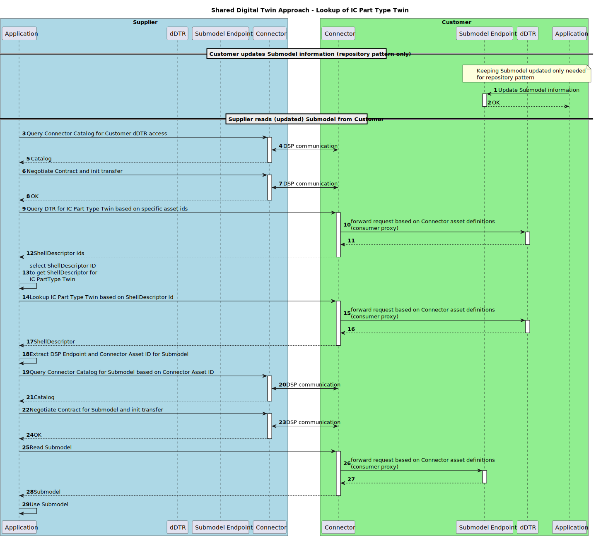
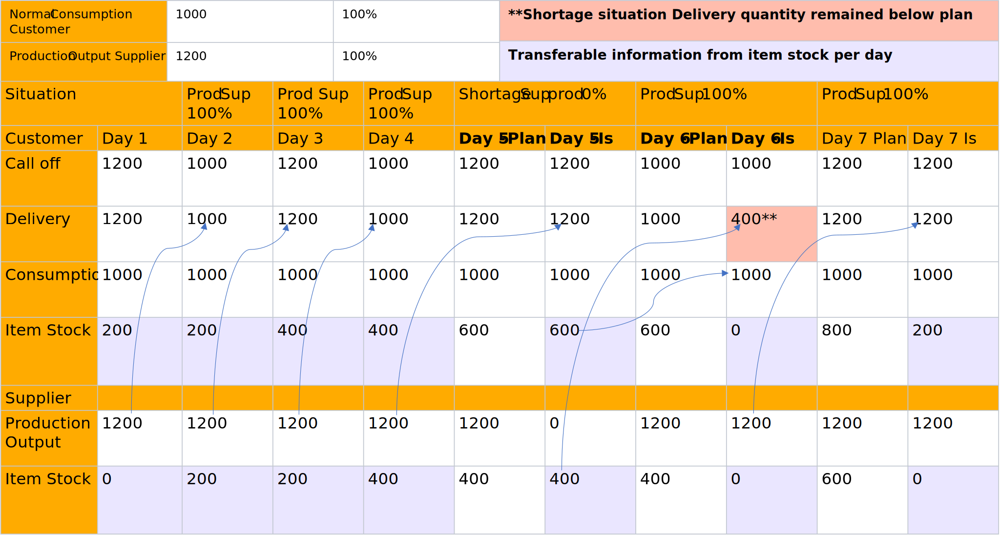
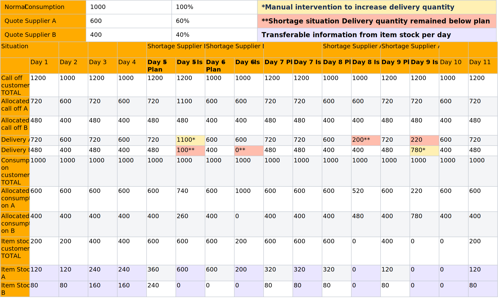

---
tags:
  - UC/PURIS
---

# CX-0122 Item Stock Exchange 2.0.1

## ABSTRACT

The raising and management of *Item Stock* data is the task of ERP systems. Accurate inventory
management is a decisive factor for stable delivery capability for suppliers and an important
component of secure production capability for customers. Continuous monitoring of the *Item Stock*
between suppliers and customers ensures important information for the company's own production
planning and management. This information exchange is key to early detect and evaluate supply
shortage issues. Moreover, standardized interfaces between ERP systems often exist only for order
planning and execution. However, the necessary exchanging this information manually e.g. by phone or
e-mail is error-prone and slow. To mitigate inefficient and faulty communication, this document
defines a standardized approach for exchanging *Item Stock data* in an interoperable manner. A
common description of the *Item Stock* based on a standardized semantic definition is fundamental
for facilitating such an exchange.

## FOR WHOM IS THE STANDARD DESIGNED

## COMPARISON WITH THE PREVIOUS VERSION OF THE STANDARD

Changes:

- integration and usage of digital twins as defined in [[CX-0002]](#61-normative-references) Digital Twins in Catena-X
- harmonization of aspect model in accordance with [[CX-0126]](#61-normative-references) Industry Core: Part Type
- discontinuation of the proprietary API used in v1.0.0 of this standard
- grammatical, spelling and semantic improvements

New Content:

- added a note on the obligation of standard implementers to make aware that sensitive data is being
  handled, see [[Chapter 2.1.3]](#213-additional-requirements)

## 1 INTRODUCTION

This document defines the standardized exchange of *Item Stock* data within the Catena-X network.
The *Item Stock* semantically is the actual quantity of reserved (here called allocated) material
for a partner that has not yet been shipped from the supplier's site or has already arrived at the
customer's site and has not yet been used for production. The semantic model is presented in the
Aspect Model Notation with all individual fields, formats and associated JSON schema. The
standardization of the *ItemStock* semantic model and an exchange API enables participants in the
value chain to share information about material and product stock in a timely manner, thus ensuring
that the possible solution space for mitigating a supply shortage is maximized.

The *Item Stock* is related to a business relationship between the partners (an order / call-off
exists). Legal framework conditions and business aspects play an important role, for example in the
context of multi-sourcing, where no horizontal exchange of information may take place. The aim of this
standard is to ensure a secure exchange of stock data for active monitoring and the associated
prevention of bottlenecks and shortages.

### 1.1 AUDIENCE & SCOPE

> *This section is non-normative*

This standard is relevant for the following roles defined in [[CX-OMW]](#62-non-normative-references):

- **Data Providers**  willing to provide *Item Stock* data
- **Data Consumers**  interested in requesting and receiving *Item Stock* data
- **Business Application Providers** interested in providing solutions implementing this standard
- **Consulting Services Providers** interested in supporting companies fulfilling the standard

The scope of this standard is only the Item Stock aspect model and API. It describes
the exchange of  Item Stock data through a connector in accordance to [[CX-0018]](#61-normative-references).

### 1.2 CONTEXT AND ARCHITECTURE FIT

> *This section is non-normative*

A typical order-based procurement process includes a customer that places an order and a supplier
fulfilling it. Material may be either on stock at the supplier's site when it has been produced and
is ready to be shipped to the customer, or at the customer's site when it has been delivered and has
not yet been used for production. Those kinds of inventories are referred to as *Item Stock*.
Information about *Item Stock* quantities it is key to early detect and evaluate short-term supply
shortages on the customer or supplier side. Also it can help reduce the total amount of stored
material within the supply chain when partners share information on their materials inventory.

*Figure 1* shows the high-level architecture of the *Item Stock* exchange in the Catena-X dataspace
and the services that are involved. Both the data provider and the data consumer must be members of
the Catena X network in order to communicate with each other.  With the help of the Credential Service
and the Identity Access Management (IAM) each participant can authenticate itself, verify the identity
of the requesting party and decide whether to authorize the request. The *Item Stock* data is
provisioned in accordance with [[CX-0002]](#61-normative-references).


*Figure 1: High-level architecture of the Item Stock exchange in Catena-X*

### 1.3 CONFORMANCE AND PROOF OF CONFORMITY

> *This section is non-normative*

The sections marked as non-normative, all authoring guidelines, diagrams, examples, and notes in
this specification are non-normative. Everything else in this specification is normative. The key
words  **MAY** ,  **MUST** ,  **MUST NOT** ,  **OPTIONAL** ,  **RECOMMENDED** ,  **REQUIRED** ,
**SHOULD** and  **SHOULD NOT** in this document are to be interpreted as described in [BCP 14]
[[RFC2119]](#62-non-normative-references) [[RFC8174]](#62-non-normative-references) when, and only when, they appear in all capitals, as shown here.

All participants and their solutions will need to prove that they are conform with the Catena-X
standards. To validate that the standards are applied correctly, Catena-X employs Conformity
Assessment Bodies (CABs). The proof of conformity for a single semantic model is done according to
the general rules for proving the conformity of data provided to a semantic model or the ability to
consume the corresponding data. Furthermore participants agree to follow the normative language of
this standardization document and to implement the required API-Endpoints described in [Chapter 4](#4-application-programming-interfaces).

### 1.4 EXAMPLES

The following example shows a value-only JSON serialization of the "ItemStock" aspect model. It
represents a quantity of 20 pieces for an order position of a given material.

```json
{
  "materialGlobalAssetId" : "urn:uuid:48878d48-6f1d-47f5-8ded-a441d0d879df",
  "positions" : [ {
    "orderPositionReference" : {
      "supplierOrderId" : "M-Nbr-4711",
      "customerOrderId" : "C-Nbr-4711",
      "customerOrderPositionId" : "PositionId-01"
    },
    "allocatedStocks" : [ {
      "isBlocked" : false,
      "stockLocationBPNA" : "BPNA1234567890ZZ",
      "lastUpdatedOnDateTime" : "2023-04-28T14:23:00.123456+14:00",
      "quantityOnAllocatedStock" : {
        "value" : 20.0,
        "unit" : "unit:piece"
      },
      "stockLocationBPNS" : "BPNS1234567890ZZ"
    } ]
  } ],
  "direction" : "INBOUND"
}
```

### 1.5 TERMINOLOGY

> *This section is non-normative*

| **Name** | **Abrv.** | **Description** |
| --- | --- | --- |
| **Business Partner Number** | BPN | A BPN is the unique identifier of a partner within Catena-X as defined in [[CX-0010]](#61-normative-references). |
| **Business Partner Number Legal Entity** | BPNL | A BPNL is the unique identifier of a partner legal entity within Catena-X as defined in [[CX-0010]](#61-normative-references). |
| **Business Partner Number Site** | BPNS | A BPNS is the unique identifier of a partner site within Catena-X as defined in [[CX-0010]](#61-normative-references). |
| **Business Partner Number Address** | BPNA | A BPNA is the unique identifier of a partner address within Catena-X as defined in [[CX-0010]](#61-normative-references). |
| **Position** | | A position within an order defines the product and the quantity the supplier has to manufacture / supply for a customer. A single order may contain multiple positions for different products. |
| **Order** | | Request from a customer towards a supplier to manufacture / supply a given quantity of a specific product in a predefined time frame. |
| **Allocated Stock** | | The already manufactured and not yet been used products, components or material. They are allocated to a specific customer based on the orders made by the latter and are either still in the supplier's warehouse or already in the customer's warehouse. |
| **Provider** | | The party providing the *Item Stock* data.In the context of the *Item Stock* exchange this is: <br /> - the supplier for *Item Stock* of direction OUTBOUND <br /> - the customer for *Item Stock* of direction INBOUND. |
| **Consumer** | | The party requesting and consuming the *Item Stock* data provided by the provider. In the context of the *Item Stock* exchange this is: <br /> - the supplier for *Item Stock* of direction OUTBOUND <br /> - the customer for *Item Stock* of direction INBOUND. Additional terminology used in this standard can be looked up in the glossary on the association homepage. |
| **Stock Location** | | The physical location of a stock specified by its corresponding BPNS and BPNA. More information on BPN/S/A is provided in [[CX-0010]](#61-normative-references). |
| **Customer** | | The recipient of products ordered from / manufactured by a supplier. |
| **Supplier** | | The supplier / manufacturer of a product. |
| **Stock** | | Two way direction of material on stock: <br /> - One can have a stock of material which is ready for delivery to customers <br /> - One can have a stock of material which can be used for the own production |
| **Material** | | The term material is used as a catalogue item in the meaning of the Industry Core Part Type ([[CX-0126]](#61-normative-references)). Whenever referring to material also products, components or items are considered. Semi-finished goods are not intended to be covered. |
| **Production Output** | | The output quantity in a defined period of time for a component or material. |
| **Digital Twin** | DT | Digital representation of an asset that provides data on aspects of the represented data following [[CX-0002]](#61-normative-references). |
| **decentralized Digital Twin Registry** | dDTR | Component providing registration and discovery API implementations following [[CX-0002]](#61-normative-references). Sometimes referred to without the "decentralized" BUT in Catena-X those are always decentralized. |
| **Asset Administration Shell** | AAS | Technical concept for Digital Twins consisting of different standards. Application in Catena-X is described in Digital Twins in Catena-X standard ([[CX-0002]](#61-normative-references))  |
| **Shell Descriptor** | | Technical concept of the AAS API describing metadata of an Asset Administration Shell representing a Digital Twin. It holds identification information and metadata about which submodels are available and where to get the data from (see [[CX-0002]](#61-normative-references), IDTA-01002-3-0). There may exist multiple Shell Descriptor for the same represented Asset (see [[CX-0126]](#61-normative-references)). |
| **Submodel Descriptor** | | Technical concept of the AAS API describing metadata of Submodels within a Shell Descriptor (Asset Administration Shell) (see [[CX-0002]](#61-normative-references), IDTA-01002-3-0). |
| **Specific Asset Ids** | | Identifiers of the Shell Descriptor (Asset Administration Shell) that refer to common identification data for an asset/material at hand e.g., manufacturer part Id. Common specific asset ids used for identification are described in Industry Core Part Type Standard (see [[CX-0126]](#61-normative-references)). |
| **Asset Administration Shell Identifier** | AAS ID | Also referred to as Shell Descriptor ID, is the technical identifier of the Shell Descriptor.  |
| **Global Asset Id** | | Also referred to as Catena-X ID, is the Catena-X identifier for assets represented by Digital Twins (see [[CX-0126]](#61-normative-references)). |
| **Aspect** | | A domain-specific view on information and functionality associated with a specific Digital Twin with a reference to a concrete Aspect Model (see [[CX-0002]](#61-normative-references)). Within Catena-X, an aspect is formally described using the Semantic Aspect Meta Model (see [[CX-0003]](#61-normative-references)). |
| **Semantic Id** | | Identifier including namespace to specify the semantic description of submodels using the Semantic Aspect Meta Model (SAMM). It allows partners to know the exact data format and semantics when e.g., browsing catalogs (see [[CX-0003]](#61-normative-references)). |
| **Data Space Protocol** | DSP | A set of specifications designed to facilitate interoperable data sharing between entities governed by usage control and based on Web technologies. These specifications define the schemas and protocols required for entities to publish data, negotiate Agreements, and access data as part of a Dataspace. It is governed by the International Data Spaces Association. Connectors compliant to [[CX-0018]](#61-normative-references) support the Data Space Protocol. |
| **Shared Asset Approach** | | Digital twin pattern in which each party has a twin for the same asset (Part Type). They share the same identification data in terms of specific asset ids and global asset id. The digital twins do have different technical identifiers. |

*Table 1: Terminology Item Stock Standard*

Additional terminology used in this standard can be looked up in the glossary on the association homepage.

## 2 RELEVANT PARTS OF THE STANDARD FOR SPECIFIC USE CASES

> *This section is normative*

### 2.1 "ITEM STOCK"

#### 2.1.1 LIST OF STANDALONE STANDARDS

The following Catena-X standards are prerequisites for the implementation of this standard and therefore
**MUST** be considered / implemented by the relevant parties specified in each of them.

| **Number** | **Standard** | **Version** |
| --- | --- | --- |
| [[CX-0001]](#61-normative-references) | EDC Discovery API | 1.0.2 |
| [[CX-0002]](#61-normative-references) | Digital Twins in Catena-X | 2.2.0 |
| [[CX-0003]](#61-normative-references) | SAMM Aspect Meta Model | 1.1.0 |
| [[CX-0006]](#61-normative-references) | Registration and initial onboarding | 2.0.0 |
| [[CX-0010]](#61-normative-references) | Business Partner Number (BPN) | 2.0.0 |
| [[CX-0018]](#61-normative-references) | Dataspace Connectivity | 3.0.0 |
| [[CX-0126]](#61-normative-references) | Industry Core Part Type | 2.0.0 |

*Table 2: List of mandatory standards*

The usage of this standard may be complemented with the following Catena-X standards to further extend
the range of shortage prevention possibilities:

| **Number** | **Standard** | **Version** |
| --- | --- | --- |
| [[CX-0118]](#61-normative-references) | Delivery Information Exchange | 2.0.0 |
| [[CX-0120]](#61-normative-references) | Short-term Material Demand Exchange | 2.0.0 |
| [[CX-0121]](#61-normative-references) | Planned Production Output Exchange | 1.0.0 |
| [[CX-0145]](#61-normative-references) | Days of Supply Exchange | 1.0.0 |
| [[CX-0146]](#61-normative-references) | Supply Chain Disruption Notifications | 1.0.0 |

*Table 3: List of* *non-mandatory* *complementary standards*

#### 2.1.2 DATA REQUIRED

No additional data requirements.

#### 2.1.3 POLICY CONSTRAINTS FOR DATA EXCHANGE

In alignment with our commitment to data sovereignty, a specific framework governing the utilization of data within the Catena-X use cases has been outlined.  As part of this data sovereignty framework, conventions for access policies, for usage policies and for the constraints contained in the policies have been specified in standard [CX-0152 Policy Constraints for Data Exchange](#61-normative-references). This standard document CX-0152 **MUST** be followed when providing services or apps for data sharing/consuming and when sharing or consuming data in the Catena-X ecosystem. What conventions are relevant for what roles named in [1.1 AUDIENCE & SCOPE](#11-audience--scope) is specified in the CX-0152 standard document as well.

##### REMINDER OF ANTITRUST

Notice and/or acknowledgement concepts to raise awareness of antitrust issues during use of this standard
are **RECOMMENDED**, for example through the implementation of a help desk or pop-up info.

#### 2.1.4 DIGITAL TWINS AND SPECIFIC ASSET IDs

This standard builds upon the Industry Core Part Type [[CX-0126]](#61-normative-references) and the Digital Twins in
Catena-X [[CX-0002]](#61-normative-references) standards. It follows the following design patterns:

- Usage of Digital Twins as shared assets to follow a pull approach for data.
- Usage of the specific asset IDs and further identification data for the Digital Twin for the Part Type
  (see [[CX-0126]](#61-normative-references)).
- Provisioning of the *PartTypeInformation* on supplier side (see [[CX-0126]](#61-normative-references)).

Because both parties may provide data regarding different aspects of the same Part Type Twin, they need
to use the same identification data to pinpoint it.

- The supplier of the part has a Digital Twin representation and is then able to offer
  *Item Stock* data to customers.
- The customer, who orders or uses the part, has a Digital Twin representation to offer
  *Item Stock* data to a supplier.
- Both twins refer to the same asset and provide complementary information. They share the same
  identification data in two partners' context.
  - The supplier
    - **MUST** create the Digital Twin first.
    - **MUST** generate the Catena-X ID and ensure that the customer-specific asset IDs and submodel
      descriptors are only accessible by the specific customer.
    - **MAY** use the Digital Twin for multiple customers.
  - The customer
    - **MUST** create one Digital Twin per supplier.
    - **MUST** use the Catena-X ID generated by the supplier.

The definition of identification data (Catena-X ID, Asset Administration Shell ID, specific asset ID)
**MUST** follow the Industry Core Part Type [[CX-0126]](#61-normative-references). Refer to [Chapter 4.1.2](#412-industry-core-part-type-twin-registration-and-definition) for further details.

> ***Note:*** The Part Type Twin's data is considered sensitive. Data providers **MUST** implement appropriate
measures ensuring that competitors-specific asset IDs and/or information about submodels is accessible
only to the data consumers it concerns, but not to their competitors.

Figure 2 shows how the shared asset approach is realized. The orange lines show which submodels belong
to the respective AAS. All *Item Stock* specific submodels are bound to the specific
Part Type's context e.g., meaning that the *Item Stock* aspect is described for the specific
catalog item on supplier and customer side represented by the AASs. The orange submodels are the
submodels used within this standard's context. The grey submodels are used within the Industry Core
[[CX-0126]](#61-normative-references)(*PartTypeInformation, SingleLevelBomAsPlanned, SingleLevelUsageAsPlanned*).
The blue dashed lines show the references between DTs based on Catena-X UUIDs and BPNL information that
may be resolved by the Item Relationship Service (see [[CX-0126]](#61-normative-references)).


*Figure 2: Conceptual levels of provisioning digital twins in the shared asset approach.*

Figure 2 details two conceptual levels:

- The Asset level contains the asset (Industry Core Part Type) represented by a Digital Twin.
  The latter is provisioned as an Asset Administration Shell (AAS) within the decentralized Digital
  Twin Registry (dDTR) of the data provider (supplier or customer).
- The Submodel level represents the actual information that are held by a Digital Twin (DT). Those
  submodels follow the respective definition of the in Semantic Aspect Meta Model (SAMM) format
  (see [Chapter 3](#3-aspect-models)). The dDTR only holds meta-information about the Submodel
  (e.g. kind of submodel via semantic ID or connector endpoint information).

## 3 ASPECT MODELS

> *This section is normative*

### 3.1 "ITEM STOCK" ASPECT MODEL

#### 3.1.1 INTRODUCTION

This section describes the "ItemStock" semantic model used in the Catena-X network. For the complete
semantics and detailed description of its properties refer to the SAMM model in [Chapter 3.1.5.1](#3151-rdf-turtle).

#### 3.1.2 SPECIFICATIONS ARTIFACTS

The modeling of the semantic model specified in this document was done in accordance to the
"semantic-driven workflow" to create a submodel template specification [[SMT]](#62-non-normative-references).

This aspect model is written in SAMM 2.0.0 as a modeling language conformant to [[CX-0003]](#61-normative-references) as
input for the semantic driven workflow.

Like all Catena-X data models, this model is available in a machine-readable format on GitHub
conformant to [[CX-0003]](#61-normative-references).

#### 3.1.3 LICENSE

This Catena-X data model is made available under the terms of the Creative Commons Attribution 4.0
International (CC-BY-4.0) license, which is available at Creative Commons.

#### 3.1.4 IDENTIFIER OF SEMANTIC MODEL

The semantic model has the unique identifier

> `urn:samm:io.catenax.item_stock:2.0.0`

This identifier **MUST** be used by the data provider to define the semantics of the data being transferred.

#### 3.1.5 FORMATS OF SEMANTIC MODEL

##### 3.1.5.1 RDF TURTLE

The RDF turtle file, an instance of the Semantic Aspect Meta Model, is the master for generating additional
file formats and serializations. It can be found under the following link:

> [https://github.com/eclipse-tractusx/sldt-semantic-models/blob/main/io.catenax.item\_stock/2.0.0/ItemStock.ttl](https://github.com/eclipse-tractusx/sldt-semantic-models/blob/main/io.catenax.item_stock/2.0.0/ItemStock.ttl)

The open source command line tool of the Eclipse Semantic Modeling Framework is used for generation of
other file formats like for example a JSON Schema, aasx for Asset Administration Shell Submodel Template
or a HTML documentation.

##### 3.1.5.2 JSON SCHEMA

A JSON Schema can be generated from the RDF Turtle file. The JSON Schema defines the Value-Only payload
of the Asset Administration Shell for the API operation *"GetSubmodel"*.

##### 3.1.5.3 AASX

An AASX file **MUST** be generated from the RDF Turtle file. The AASX file defines one of the requested
artifacts for a Submodel Template Specification conformant to [[SMT]](#62-non-normative-references).

## 4 APPLICATION PROGRAMMING INTERFACES

> *This section is normative*

### 4.1 API USED TO EXCHANGE "ITEM STOCK" INFORMATION

As described in [Chapter 2.1.4](#214-digital-twins-and-specific-asset-ids) this standard builds upon the [[CX-0002]](#61-normative-references) Digital Twins in Catena-X
and [[CX-0126]](#61-normative-references) Industry Core Part Type standards. Therefore, the APIs provided by the Digital Twin
standard are combined with the part identification defined in the Industry Core standard. This chapter
defines how the aforementioned standards and the [[CX-0018]](#61-normative-references)
standard **MUST** be used to facilitate the provisioning of *Item Stock* data. The
usage of the Discovery Services defined in [[CX-0001]](#61-normative-references), [[CX-0053]](#61-normative-references) is not mandatory,
because this standard assumes an already existing business relationship between the involved parties.

The sequence diagram in *Figure 3* provides an overview of the interactions required to register the
Part Type Twin following the shared asset approach.

- Steps 1 & 2: Register the dDTR access for the partner at the connector
- Steps 3 & 4: When using the repository pattern, create the submodel (and twin)
- Steps 5 & 6: Register the submodel endpoint for the partner at the connector
- Steps 7 & 8: Register or update the twin Shell Descriptor relying on the registered Connector asset
  for the submodel endpoint and the identification data of the partners.

> ***Note:*** This sequence diagram is simplified and does not cover the generation of the Part Type Twin
on supplier side and the handling of the identification data needed. Both partners need to create a
Part Type Twin of the shared asset as well as provide *Item Stock* data.


*Figure 3: Flow to create and register a digital twin*

The sequence diagram in Figure 4 provides an overview of the interactions required when a customer
(acting as data provider) provisions *Item Stock* data to a supplier (acting as data consumer).

The flow "*Supplier reads (updated) Submodel from Customer*" visualizes the sequence of calls when consuming data:

- Steps 3 - 8: Contract dDTR usage in the connector.
- Steps 9 - 12: Lookup the Industry Core Part Type Twin for a Part Type based on the common identification data.
- Steps 13 - 18: Read the Shell Descriptor of the Industry Core Part Type Twin to extract the *Item Stock*
  submodel endpoint (registered at the connector).
- Steps 19 - 24: Contract the *Item Stock* data usage in the connector.
- Steps 25 - 29: Consume and use the *Item Stock* data.


*Figure 4: Flow to look up a digital twin and get a submodel.*

> ***Note:*** Depending on the use of repository patterns and the design of the Digital Twins, the data
may be updated manually in the Submodel endpoint.

#### 4.1.1 CONNECTOR DATA ASSET STRUCTURE

The endpoints for the dDTR and the Submodel Endpoint **MUST** be made available BUT they **MUST NOT**
be directly called data consumer. Rather, for access to dDTRs and Submodels, there **MUST** be contracts
negotiated in accordance with the DSP. Therefore, the endpoints **MUST** be offered as connector data
assets. To make these assets easily identifiable in the connector's catalog, each asset **MUST** be
configured with a set of properties as described in the corresponding sections below.

The following table provides an overview of the connector data assets that the parties **MUST** offer
to be able to provision and/or consume *Item Stock* data.

| **Party** | **REQUIRED** | **Asset** | **Purpose** |
| --- | --- | --- | --- |
| Provider | Yes | "Digital Twin Registry" | Allows a consumer to query for Part Type Twins and their *Item Stock* submodels. |
| Provider | Yes | "Submodel Item Stock" | Allows a consumer to read actual *Item Stock* information related to a Part Type Twin. |
| Consumer | Yes | "Digital Twin Registry" | Allows a consumer to query for Part Type Twins and their *Item Stock* submodels. |
| Consumer | Yes | "Submodel Item Stock" | Allows a consumer to read actual *Item Stock* information related to a Part Type Twin. |

*Table 4: Connector data assets*

In the sections below the asset definitions of the two different kinds of assets are defined.

##### CONNECTOR DATA ASSET STRUCTURE FOR "Digital Twin Registry"

To allow partners to find the "Item Stock" data for a specific Industry Core Part Type Twin,
the provider **MUST** register a connector data asset (see details in [[CX-0018]](#61-normative-references)) specifying the address
of the Digital Twin Registry of the provider (see [[CX-0002]](#61-normative-references)).

The data asset **MUST** be configured with the set of properties as defined in the table below.

| **Object** | **Property** | **Purpose** | **Usage & Constraints** |
| --- | --- | --- | --- |
| | ***@id*** | Identifier of the asset | The asset ID **MUST** be unique and therefore **MUST NOT** be reused elsewhere. |
| properties | [**http://purl.org/dc/terms/type**](http://purl.org/dc/terms/type) | Defines the "Digital Twin Registry" according to the Catena-X taxonomy. | **MUST** be set to `{"@id": "https://w3id.org/catenax/taxonomy#DigitalTwinRegistry"}` to allow filtering the data assets catalog for the respective "Digital Twin Registry". |
| properties | [**https://w3id.org/catenax/ontology/common#version**](https://w3id.org/catenax/ontology/common#version) | The version of the standard defining the implemented API of the "Digital Twin Registry" | **MUST** correspond to the version of the standard defining the Interfaces of the "Digital Twin Registry". The value **MUST** be set to `"3.0"` for "Digital Twin Registries" used by this standard. |
| dataAddress | **@type** | Type of the DataAddress node. | **MUST** be set to `"DataAddress"`. |
| dataAddress | ***baseUrl*** | Defines the HTTPS endpoint of the corresponding "Digital Twin Registry Endpoint". | The `{{ DIGITAL_TWIN_REGISTRY_ENDPOINT }}` refers to an URL under which the API of the "Digital Twin Registry" endpoint is available. HTTPS transport protocol **MUST** be used. |
| dataAddress | ***proxyBody*** | Defines whether the endpoint allows to proxy the HTTPS body | **SHOULD** be set to `"false"` to not allow the API endpoint to receive a HTTPS body via the HTTPS request. |
| dataAddress | ***proxyMethod*** | Defines whether the endpoint allows to proxy the HTTPS method | **SHOULD** be set to `"false"` to only allow the API endpoint to receive GET requests. |
| dataAddress | ***proxyPath*** | Defines whether the endpoint allows to proxy paths for the URL | **MUST** be set to `"true"` to allow the API endpoint to receive appended paths of the HTTPS request. |
| dataAddress | ***type*** | Defines the type of data plane extension handling the data exchange | **MUST** be set to `"HttpData"` to provide an API via an HTTPS proxy endpoint. |

*Table 5: Connector data assets request properties*

Additionally security identification information **MAY** be added to secure the "Decentralized Digital Twin Registry".

When searching the Catalog of a provider, a consumer **SHOULD** use the following properties AND
their values to identify the Data Asset specifying "Digital Twin Registry". In the connector Data Asset
descriptions the API version valid for this standard is mentioned for the property
[`https://w3id.org/catenax/ontology/common#version`](https://w3id.org/catenax/ontology/common#version). The requester of a Data Asset **MUST** be
able to handle multiple Data Asset for this endpoint, being differentiated only by the version.
The requester **SHOULD** choose the Data Asset set with the highest compatible version number implemented
by themselves. If the requester cannot find a compatible version with their own, the requester **MUST**
terminate the data transfer.

| **Property** | **Value** |
| --- | --- |
| http://purl.org/dc/terms/type | `{"@id": "https://w3id.org/catenax/taxonomy#DigitalTwinRegistry"}` |

*Table 6: Connector data assets request properties values.*

An example connector data asset definition is given below.

>**Note:** Expressions in double curly braces \{\{\}\} must be substituted with a corresponding value.

```json
{
  "@context": {
    "@vocab": "https://w3id.org/edc/v0.0.1/ns/",
    "cx-common": "https://w3id.org/catenax/ontology/common#",
    "cx-taxo": "https://w3id.org/catenax/taxonomy#",
    "dct": "http://purl.org/dc/terms/"
  },
  "@id": "{{CONNECTOR_ASSET_ID}}",
  "properties": {
    "dct:type": {"@id": "cx-taxo:DigitalTwinRegistry"},
    "cx-common:version": "3.0"
  },
  "privateProperties": {
  },
  "dataAddress": {
    "@type": "DataAddress",
    "type": "HttpData",
    "baseUrl": "{{ DIGITAL_TWIN_REGISTRY_ENDPOINT }}",
    "proxyQueryParams": "true",
    "proxyBody": "false",
    "proxyPath": "true",
    "proxyMethod": "false",
  }
}
```

##### CONNECTOR DATA ASSET STRUCTURE FOR "Submodel"

To allow partners to receive the "Item Stock" data as defined in [Chapter 3](#3-aspect-models),
the provider  **MUST** register a connector data asset (see details in[[ CX-0018]](#61-normative-references)) specifying the
address of the submodel endpoint (see [[CX-0002]](#61-normative-references)) providing the actual data.

The data asset **MUST** be configured with the set of properties as defined in the table below.

| **Object** | **Property** | **Purpose** | **Usage & Constraints** |
| --- | --- | --- | --- |
| | ***@id*** | Identifier of the asset | The asset ID **MUST** be unique and therefore **MUST NOT** be reused elsewhere. |
| properties | [**http://purl.org/dc/terms/type**](https://purl.org/dc/terms/type) | Defines the "Submodel API" according to the Catena-X taxonomy. | **MUST** be set to `{"@id": "https://w3id.org/catenax/taxonomy#Submodel"}` to allow filtering the data assets catalog for the respective "Submodel API". |
| properties | [**https://admin-shell.io/aas/3/0/HasSemantics/semanticId**](https://admin-shell.io/aas/3/0/HasSemantics/semanticId) | The semantic identifier of the "Item Stock" SAMM. | **MUST** be set to `{"@id": "urn:samm:io.catenax.item_stock:2.0.0#ItemStock"}` to externally define how the Submodel must be interpreted. **MUST NOT** be set, if different submodels may be returned by this API. |
| properties | [**https://w3id.org/catenax/ontology/common#version**](https://w3id.org/catenax/ontology/common#version) | Version of the Submodel Interface Specification | **MUST** be set to `"3.0"` in accordance to [[CX-0002]](#61-normative-references). |
| dataAddress | **@type** | Type of the DataAddress node. | **MUST** be set to `"DataAddress"`. |
| dataAddress | ***baseUrl*** | Defines the HTTPS Submodel endpoint provisioning the *Delivery Information* data | The `{{ SUBMODEL_ENDPOINT }}` refers to an URL under which the Submodel API Endpoint ([[CX-0002]](#61-normative-references)) is available to provide the "Item Stock" . HTTPS transport protocol **MUST** be used. |
| dataAddress | ***proxyBody*** | Defines whether the endpoint allows to proxy the HTTPS body | **SHOULD** be set to `"false"` to not allow the API endpoint to receive a HTTPS body via the HTTPS request. |
| dataAddress | ***proxyMethod*** | Defines whether the endpoint allows to proxy the HTTPS method | **SHOULD** be set to `"false"` to only allow the API endpoint to receive GET requests. |
| dataAddress | ***proxyPath*** | Defines whether the endpoint allows to proxy paths for the URL | **MUST** be set to `"true"` to allow the API endpoint to receive appended paths of the HTTPS request. Setting this parameter depends on the implementation of the submodel lookup. |
| dataAddress | ***type*** | Defines the type of data plane extension handling the data exchange | **MUST** be set to `"HttpData"` to provide an API via an HTTPS proxy endpoint. |

*Table 7: Connector data assets request properties*

Additionally security identification information **MAY** be added to secure the "Submodel API".

When searching the data assets catalog of a provider, a consumer **SHOULD** use the assetId previously
determined via `subprotocolBody` of the SubmodelDescriptor's endpoint definition of subprotocol type "DSP".
Refer to [Chapter 4.1.2](#412-industry-core-part-type-twin-registration-and-definition) for the definition of the `subprotocolBody`.

| **Property** | **Value** |
| --- | --- |
| [https://w3id.org/edc/v0.0.1/ns/id](https://w3id.org/edc/v0.0.1/ns/id) | `{{CONNECTOR_ASSET_ID}}` specified in the DSP endpoint of the SubmodelDescriptor (see [Chapter 4.1.2](#412-industry-core-part-type-twin-registration-and-definition)) |

*Table 8: Connector data assets request properties values*

An example connector data asset definition is given below.

>**Note:** Expressions in double curly braces \{\{\}\} must be substituted with a corresponding value.

```json
{
  "@context": {
    "@vocab": "https://w3id.org/edc/v0.0.1/ns/",
    "cx-common": "https://w3id.org/catenax/ontology/common#",
    "cx-taxo": "https://w3id.org/catenax/taxonomy#",
    "dct": "http://purl.org/dc/terms/",    
    "aas-semantics": "https://admin-shell.io/aas/3/0/HasSemantics/"
   },
  "@id": "{{CONNECTOR_ASSET_ID}}",
  "properties": {
    "dct:type": {"@id": "cx-taxo:Submodel"},
    "cx-common:version": "3.0",
    "aas-semantics:semanticId": {"@id":  "urn:samm:io.catenax.item_stock:2.0.0#ItemStock"}   },
  "privateProperties": {
  },
  "dataAddress": {
    "@type": "DataAddress",
    "type": "HttpData",
    "baseUrl": "{{ SUBMODEL_ENDPOINT }}",
    "proxyQueryParams": "false",
    "proxyBody": "false",
    "proxyPath": "true",
    "proxyMethod": "false",
  }
}
```

#### 4.1.2 INDUSTRY CORE PART TYPE TWIN REGISTRATION AND DEFINITION

##### 4.1.2.1 SHELL DESCRIPTOR REGISTRATION

To allow partners to receive the actual "*Item Stock*" data as defined in [Chapter 3](#3-aspect-models),
the provider **MUST** register a Shell Descriptor in the dDTR (see [[CX-0002]](#61-normative-references)) so that a partner:

- May lookup the Industry Core Part Type Twin based on known identification data.
- May identify the connector endpoint providing access to the "Item Stock" submodel data.

The Shell Descriptors represent each an Industry Core Part Type Twin and **MUST** follow the rules as defined
in [Chapter 2.1.4](#214-digital-twins-and-specific-asset-ids).

The Shell Descriptor **MUST** be configured with the set of properties as defined in the table below.

| **Object in ShellDescriptor** | **Property** | **Purpose** | **Usage & Constraints** |
| --- | --- | --- | --- |
| | ***id*** | Defines the technical ID of the Asset Administration Shell representing a partner's twin. | **MUST** be unique following Industry Core Part Type standard ([[CX-0126]](#61-normative-references)) and is a technical Id randomly assigned as multiple Part Type Twins may be created for one Part Type. E.g. this number differs for the twins created at supplier and customer side. |
| | ***globalAssetId*** | Defines the Catena-X ID of the twin. | **MUST** be aligned with the partner's material. When referring to the same Part Type Twin, the same number **MUST** be used (see [[CX-0126]](#61-normative-references)). |
| | **specificAssetIds** | Identifiers that may be used to lookup Part Type Twins. | **MUST** be set to according to the Industry Core Part Type standard ([[CX-0126]](#61-normative-references)). See *Table 10* for respective specific asset IDs. The `"customerPartId"` **MUST** be set by Customers and **SHOULD** be set by Suppliers. |
| submodelDescriptor | **id** | Technical identifier of a SubmodelDescriptor. | **MUST** be set to a unique identifier. |
| submodelDescriptor | **semanticId** | The semantic identifier of the "Item Stock" SAMM. | **MUST** be set to `{ "type": "ExternalReference", "keys": [{ "type": "GlobalReference", "value": "urn:samm:io.catenax.item_stock:2.0.0#ItemStock" }] }` to externally define how the Submodel must be interpreted. |
| submodelDescriptor > endpoint | **interface** | Defines the Submodel Interface [[CX-0002]](#61-normative-references) and the version. | **MUST** be set to `"SUBMODEL-3.0"` to rely on current specification. |
| submodelDescriptor > endpoint > protocolInformation | **href** | Defines the direct link to the public API of the connector's data plane with a path that **SHOULD** be appended by the proxy, if needed. | **MUST** be set to the public API of the dataplane providing the data with the path appended to directly access the submodel. |
| submodelDescriptor > endpoint > protocolInformation | **subprotocol** | Defines the usage of the connector based on DSP to access and use the submodel.  | **MUST** be set to `"DSP"` to define the connector endpoint of the subprotocol. |
| submodelDescriptor > endpoint > protocolInformation | **subprotocolBody** | Defines the asset id in the connector and the connector address to access and use the submodel. | **MUST** be set to `"id={{CONNECTOR_ASSET_ID}};dspEndpoint={{SUPPLIER_CONNECTOR_DSP_ENDPOINT}}"` to provide the necessary information for contracting the submodel endpoint. Refer to [Chapter 4.1.2](#412-industry-core-part-type-twin-registration-and-definition) for the definition of the asset of the subprotocolBody. |

*Table 9: Properties relevant for the Shell Descriptor definition*

When searching the submodel in the dDTR of a provider, a consumer **SHOULD** use the specific asset IDs
as defined in [[CX-0126]](#61-normative-references). Table 10 gives an overview of the specific asset IDs that the data provider
added to the ShellDescriptor so that the data consumer may find the Industry Core Part Type Twin.

| **Specific Asset Id** | **Value** |
| --- | --- |
| digitalTwinType | "PartType". Set to identify twins compliant to the Industry Core Part Type (see [[CX-0126]](#61-normative-references)). |
| manufacturerId | Supplier / Manufacturer partner BPNL (see [[CX-0010]](#61-normative-references)) |
| manufacturerPartId | Supplier / Manufacturer partner identification number of the part. |
| customerPartId | Customer partner identification number of the part. |

*Table 10: Specific asset IDs of Industry Core Part Type Twins proposed to be used to lookup a twin in the dDTR*

The Shell Descriptor defines the metadata of the Industry Core Part Type Twin. The following example
Shell Descriptor represents a supplier's Shell Descriptor of a supplier who provides two customers access
to an "Item Stock" submodel. For further information on the creation of Part Type Twins,
refer to [Chapter 2.1.4](#214-digital-twins-and-specific-asset-ids).

Following [[CX-0002]](#61-normative-references), when searching the data assets catalog of a provider, a consumer  **SHOULD**
use the `assetId` determined via `subprotocolBody` of the SubmodelDescriptor's endpoint definition
of subprotocol type `"DSP"` of the Submodel Descriptor of interest.

> **Note:** Expressions in double curly braces \{\{\}\} must be substituted with a corresponding value.

```json
{
  "id": "{{TECHNICAL_TWIN_ID}}",
  "globalAssetId": "{{MATERIAL_NUMBER_CX}}",
  "idShort": "Semiconductor",
  "specificAssetIds": [
    {
      "name": "digitalTwinType",
      "value": "PartType",
      "externalSubjectId": {
        "type": "ExternalReference",
        "keys": [
          {
            "type": "GlobalReference",
            "value": "{{SUPPLIER_BPNL}}"
          },
          {
            "type":"GlobalReference",
            "value":"{{CUSTOMER_BPNL}}"
          },
          {
             "type":"GlobalReference",
             "value":"{{OTHER_CUSTOMER_BPNL}}"
          }
          ]
      }
    },
    {
      "name": "manufacturerPartId",
      "value": "{{MATERIAL_NUMBER_SUPPLIER}}",
      "externalSubjectId": {
        "type": "ExternalReference",
        "keys": [
          {
              "type": "GlobalReference",
              "value": "{{SUPPLIER_BPNL}}"
          },
          {
              "type":"GlobalReference",
              "value":"{{CUSTOMER_BPNL}}"
          },
          {
             "type":"GlobalReference",
             "value":"{{OTHER_CUSTOMER_BPNL}}"
          }
        ]
      }
    },
    {
      "name": "manufacturerId",
      "value": "{{SUPPLIER_BPNL}}",
      "externalSubjectId": {
        "type": "ExternalReference",
        "keys": [
          {
            "type": "GlobalReference",
            "value": "{{SUPPLIER_BPNL}}"
          },
          {
            "type":"GlobalReference",
            "value":"{{CUSTOMER_BPNL}}"
          },
          {
            "type":"GlobalReference",
            "value":"{{OTHER_CUSTOMER_BPNL}}"
          }
        ]
      }
    },
    {
      "name": "customerPartId",
      "value": "{{MATERIAL_NUMBER_CUSTOMER}}",
      "externalSubjectId": {
        "type": "ExternalReference",
        "keys": [
          {
            "type": "GlobalReference",
            "value": "{{SUPPLIER_BPNL}}"
          },
          {
            "type":"GlobalReference",
            "value":"{{CUSTOMER_BPNL}}"
          }
        ]
      }
    },
    {
      "name": "customerPartId",
      "value": "{{MATERIAL_NUMBER_OTHER_CUSTOMER}}",
      "externalSubjectId": {
        "type": "ExternalReference",
        "keys": [
          {
            "type": "GlobalReference",
            "value": "{{SUPPLIER_BPNL}}"
          },
          {
            "type":"GlobalReference",
            "value":"{{OTHER_CUSTOMER_BPNL}}"
          }
        ]
      }
    }
  ],
  "submodelDescriptors": [
    {
      "id": "e5c96ab5-896a-482c-8761-efd74777ca97",
      "semanticId": {
        "type": "ExternalReference",
        "keys": [
          {
            "type": "GlobalReference",
            "value": "urn:samm:io.catenax.item_stock:2.0.0#ItemStock"
          }
        ]
      },
      "endpoints": [
        {
          "interface": "SUBMODEL-3.0",
          "protocolInformation": {
            "href": "{{SUPPLIER_CONNECTOR_DATAPLANE_PUBLIC_API}}/{{PATH_IF_NEEDED}}",
            "endpointProtocol": "HTTP",
            "endpointProtocolVersion": [
              "1.1"
            ],
            "subprotocol": "DSP",
            "subprotocolBody": "id={{CONNECTOR_ASSET_ID}};dspEndpoint={{SUPPLIER_CONNECTOR_DSP_ENDPOINT}}",
            "subprotocolBodyEncoding": "plain",
            "securityAttributes": [
              {
                "type": "NONE",
                "key": "NONE",
                "value": "NONE"
              }
            ]
          }
        }
      ]
    },
    {
      "id": "a6c96ab5-896a-482c-8761-efd74777ca99",
      "semanticId": {
        "type": "ExternalReference",
        "keys": [
          {
            "type": "GlobalReference",
            "value": "urn:samm:io.catenax.item_stock:2.0.0#ItemStock"
          }
        ]
      },
      "endpoints": [
        {
          "interface": "SUBMODEL-3.0",
          "protocolInformation": {
            "href": "{{SUPPLIER_CONNECTOR_DATAPLANE_PUBLIC_API}}/{{PATH_IF_NEEDED}}",
            "endpointProtocol": "HTTP",
            "endpointProtocolVersion": [
              "1.1"
            ],
            "subprotocol": "DSP",
            "subprotocolBody": "id={{CONNECTOR_ASSET_ID}};dspEndpoint={{SUPPLIER_CONNECTOR_DSP_ENDPOINT}}",
            "subprotocolBodyEncoding": "plain",
            "securityAttributes": [
              {
                "type": "NONE",
                "key": "NONE",
                "value": "NONE"
              }
            ]
          }
        }
      ]
    }
  ]
}
```

##### 4.1.2.2 LOOKING UP A PART TYPE TWIN IN THE DDTR

To query the dDTR of a data provider, after contracting the usage via the data provider's connector
(see [[CX-0018]](#61-normative-references)), the lookup API (see [[CX-0002]](#61-normative-references)) can be used relying on the specific
asset IDs defined by the Industry Core Part Type (see [[CX-0126]](#61-normative-references)) that can be seen in
Table 10 (table of shellDescriptorRegistration with specific asset IDs).

An example call relying on all information is given in the code sample below.

> **Note:** Expressions in double curly braces \{\{\}\} must be substituted with a corresponding value.

```code
GET: {{PARTNER_CONNECTOR_DATA_PLANE}}/lookup/shells?assetIds={"name":"digitalTwinType", "value": "PartType"},{"name":"manufacturerPartId", "value": "{{MATERIAL_NUMBER_SUPPLIER}}"},{"name":"manufacturerId", "value": "{{SUPPLIER_BPNL}}"},{"name":"customerPartId", "value": "{{MATERIAL_NUMBER_CUSTOMER}}"}
```

As a result identifiers of the ShellDescriptors will be returned. With this data, a data provider can
read the ShellDescriptor to extract the endpoint data of the data provider. An example is given in the
code sample below.

> **Note:** Expressions in double curly braces \{\{\}\} must be substituted with a corresponding value.

```code
GET: {{PARTNER_CONNECTOR_DATA_PLANE}}/shell-descriptors/{{AAS_IDENTIFIER}}
```

##### 4.1.2.3 FETCHING SUBMODEL DATA

To fetch the *Item Stock* Submodel data at the submodel endpoint of a data provider, after
contracting the usage via the data provider's connector (see [[CX-0018]](#61-normative-references)), the submodel API (see [[CX-0002]](#61-normative-references))
can be used.

An example call relying on all information is given in the code sample below.

> **Note:** Expressions in double curly braces \{\{\}\} must be substituted with a corresponding value.

```code
GET: {{HREF_PATH}}/$value
```

## 5 PROCESSES

> *This section is normative*

### 5.1 GENERAL INFORMATION ON THE USE OF ITEM STOCK

A prerequisite to build up an *Item Stock* and allocate it to a specific customer or supplier is an
existing order / call-off (build-to-order). This standard, must not be used in case of building
stock without any allocation to a customer or supplier (build-to-stock).

In contrast to the Demand and Capacity Management standard [[CX-0128]](#61-normative-references), this information relates to
short-term planning periods of 1-4 weeks. Accordingly, neither long-term planning nor strategic
planning is included in the scope. This means that only the current/actual *Item Stock* quantities
are transmitted in this standard.

We distinguish between exactly two scenarios in multi sourcing. On the one hand, the exchange of
information from supplier to customer and, on the other hand, from customer to supplier. In both
scenarios, information must not be shared horizontally under any circumstances. This means that
the *Item Stock* in relation to other customers or suppliers must not be shared.

The data exchange between the C-X participants refers to the direct business relationship among each
other. In the case of consignation, the warehouse is specified via the real location - the
customer/supplier site. In this case the allocated stock is not considered as taken and according to
our definition as not delivered (have not yet been shipped).

### 5.2 ITEM STOCK PROVISIONING WITHIN SINGLE SOURCING AND SINGLE CUSTOMER SCENARIOS

#### 5.2.1 ACTORS AND ROLES

The following actors and roles occur in the described processes. The common definitions are found in
[Chapter 1.5](#15-terminology). This section describes respective scenarios.

| **Actors** | **Role** | **Description** |
| --- | --- | --- |
| **Customer** | The customer acts as the data consumer and provider in this standard. | A business partner that procures items from its supplier and requests information about its allocated item stock information. The customer provides information about its own stock in relation to the assigned supplier. |
| **Supplier** | The supplier acts as the data consumer and provider in this standard. | A business partner that supplies items to a customer. The supplier requests the allocated item stock from the customer and provides the item stock already produced for the customer. Regardless of the site in which the item stock is located.  |

*Table 11: Actors and roles 1*

#### 5.2.2 PROCESS REPRESENTATION

Information about the item stock is exchanged between the customer and the supplier in both
directions - that means the Information is exchanged from the customer to the supplier and vice
versa. The representative example explains which item stock information must be exchanged.
The actual and not the planned data must be queried and transmitted. The following example shows
a bottleneck situation in which the supplier has a complete loss of production for one day. This
affects his ability to fulfill the demand for the next day, so he delivers only 200 pieces. Due to
the given just-in-time scenario, the situation can only be partially covered by the supplier's own
item stock. The exchange via item stock thus shows the consequences at an early stage and the
customer can adjust its production planning.

> Note: The item stock information for supplier and customer refer always to the value at the end
> of the business day. The supplier's production output is the value at the end of the business day
> and is used for delivery and stock build-up on the following day.

##### Recommended procedure in case of single sourcing with information about Item Stock from customer to supplier and vice versa

> Note: In this example the calculations are as follows:
> *Item Stock Customer (day n) = Item Stock Customer (day n-1) + Delivery (day n) - Consumption (day n);*
> *also: Delivery (day n) = Production Output (day n-1) - Item Stock Supplier (day n)*


*Table 12: Single source example*

> Note: In this standard, only current/actual *Item Stock* quantities are transmitted.

This procedure takes into consideration the following aspects:

- The customer may share with the supplier the following information on a daily basis:
  - Information on the volumes called off by the customer
  - the supply volumes delivered in response to this call-off (covered by [[CX-0118]](#61-normative-references))
  - the consumption allocated to the supplier's products (covered by [[CX-0120]](#61-normative-references))
  - the actual *Item Stock* of its products at the customer's site (covered in this standard)

- The supplier may share with the customer the following information on a daily basis:
  - the supply volumes delivered in response to this call-off (covered by [[CX-0118]](#61-normative-references))
  - the production output allocated to the customer's products (covered by [[CX-0121]](#61-normative-references))
  - the actual *Item Stock* of its products at the supplier's site (covered in this standard)

### 5.3 ITEM STOCK PROVISIONING WITHIN MULTI SOURCING SCENARIOS

#### 5.3.1 ACTORS AND ROLES

The following actors and roles occur in the described processes. The common definitions are found in
[Chapter 1.5](#15-terminology). This section describes respective scenarios.

| **Actors** | **Role** | **Description** |
| --- | --- | --- |
| **Customer** | The customer acts as the data provider in this standard. | A business partner that procures items from its supplier and provides information about its own stock in relation to the assigned supplier. |
| **Supplier A** | The supplier A acts as the data consumer in this standard. | A business partner that supplies items to a customer and requests the allocated item stock from the customer. Regardless of the warehouse in which the item stock is located. Supplier A has no knowledge of the business relationship between the customer and Supplier B. |
| **Supplier B** | The supplier B acts as the data consumer in this standard. | A business partner that supplies items to a customer and requests the allocated item stock from the customer. Regardless of the site in which the item stock is located. Supplier B has no knowledge of the business relationship between the customer and Supplier A. |

*Table 13: Actors and roles 2*

#### 5.3.2 PROCESS REPRESENTATION

Multi-sourcing is a common scenario in the field. Suppliers usually supply several customers with the
same material/component. And customers purchase the same component types from different suppliers.
Because of that, in the case of multi-sourcing, when there is no possibility of differentiating the
items received from different suppliers (i.e. by using different item numbers for each supplier),
the customer must be aware that competition sensitive information from one supplier must not
be shared with other suppliers. After evaluating different alternatives, the following procedure is
the one recommended from the item stock standardization team and legal advisors to all users in
order to ensure a compliant exchange of information from customer to suppliers in the case of
multi-sourcing.

In this example, the shortage situation occurs at supplier B on days 5 and 6 and at supplier A on
days 8 and 9. To alleviate the shortage, a larger quantity is requested from supplier A on day 5 and
from supplier B on day 9. This ensures that the bottleneck situation has no effect on the customer's
production.

##### Recommended procedure in case of multi-sourcing with information exchange from customer to supplier: quoting consumption, keeping track of deliveries

> Note 1: in this example Item Stock A and Item Stock B make reference to the Item stock at the customer's
> site that is allocated respectively to supplier A and B.

> Note 2: in this example the calculations are as follows (example on Supplier A, also applies to Supplier B):
> *Item Stock A (day n) = Item Stock A (day n-1) + Delivery A (day n) - Allocated consumption A (day n);*
> *if Stock B (day n) ≤ 0  then Allocated consumption A (day n  new) = Allocated consumption A (day n old)+ |Stock B (day n)|*
> *and Stock B (day n new)= 0*

> Note 3: This quote is only necessary in case keeping track of the parts supplied by different suppliers
> is not possible (i.e. by using different item numbers for each supplier)


*Table 14: Multi-source customer example*

> Note: In this standard, only current/actual *Item Stock* quantities are transmitted.

This procedure (*quoting consumption, keeping track of deliveries*) takes in consideration the following aspects:

- The customer may share with the supplier A the following information on a daily basis:
  - Information on the volumes called off by the customer but only in relation to the specific supplier ("Allocated call off A")
  - the supply volumes delivered in response to this call-off ("Delivery A") (covered by [[CX-0118]](#61-normative-references))
  - the consumption allocated to the supplier's products ("Allocated consumption A") (covered by [[CX-0120]](#61-normative-references))
  - the actual *Item Stock* at the customer ("Item Stock A"), (covered in this standard)

- The customer must not share the following information with the supplier and the supplier must not be able to derive this information from the information available to it:
  - Capacity data of other suppliers,
  - the overall volumes called off by the customers ("Call off customer TOTAL"),
  - information on the volumes called off by the customer in relation to another supplier ("Allocated call off B"),
  - the supply volumes delivered by another supplier ("Delivery B"),
  - the overall consumption delivered by all suppliers ("Consumption customer TOTAL"),
  - the consumption allocated to another supplier ("Allocated consumption B"),
  - the customer's total *Item Stock* ("Item stock customer TOTAL"), (covered in this standard)
  - the *Item Stock* from another supplier at the customer ("Item Stock B"). (covered in this standard)

> Note: For Supplier B, the same procedure applies in reverse.

### 5.4 ITEM STOCK PROVISIONING WITHIN MULTI CUSTOMER SCENARIO

#### 5.4.1 ACTORS AND ROLES

The following actors and roles occur in the described processes. The common definitions are found in
[Chapter 1.5](#15-terminology). This section describes respective scenarios.

| **Actors** | **Role** | **Description** |
| --- | --- | --- |
| **Customer A** | The customer acts as the data consumer in this standard. | A business partner that procures items from its supplier and requests information about the supplier's allocated item stock information. |
| **Customer B** | The customer acts as the data consumer in this standard. | A business partner that procures items from its supplier and requests information about the supplier's allocated item stock information. |
| **Supplier** | The supplier acts as the data provider in this standard. | A business partner that supplies items to more than one customer. It provides the item stock already produced for the customer. Regardless of the site in which the item stock is located.  |

*Table 15: Actors and roles 3*

#### 5.4.2 PROCESS REPRESENTATION

In this scenario, two customers procure the same item from one supplier. In addition to the *Item
Stock*, the call-offs and the actual delivery quantity are displayed once for each day. There is a
distribution of the supplier's total production output in a ratio of 1:3, i.e. each customer
receives 1/3 of the planned production quantity and 1/3 is left in the supplier's warehouse. The
information transmitted must be separated for each customer.  The information must not be
shared horizontally under any circumstances. This means that the *Item Stock* in relation to other
customers must not be shared. On day 5 and 6, a complete production downtime occurs at the
supplier. The supplier now supplies its customers from its own stock and transmits the *Item Stock*
information in the corresponding ratio. From day 7, production continues as planned.

##### Recommended procedure in case of multi customer with single sourcing


*Table 16: single supplier to multi customer example*

A suitable measure must be found for the allocation and provision of information.
We recommend the use of the ratio or the quoting of the call-off.

> Note: In this standard, only current/actual *Item Stock* quantities are transmitted.

This procedure takes in consideration the following aspects:

- The customer may share with the supplier the following information on a daily basis:
  - Information on the volumes called off by the customer
  - the supply volumes delivered in response to this call-off (covered by [[CX-0118]](#61-normative-references))
  - the consumption allocated to the supplier's products (covered by [[CX-0120]](#61-normative-references))
  - the actual *Item Stock* of its products at the customer's site (covered in this standard)

- The supplier may share with the customers the following information on a daily basis:
  - the supply volumes delivered in response to the customer's call-off (covered by [[CX-0118]](#61-normative-references))
  - the production output allocated to the customer's material or products (covered [[CX-0121]](#61-normative-references))
  - the actual *Item Stock* of its material or products at the supplier site (covered in this standard)

- The supplier must not share the following information with the customer and the customer must not otherwise be able to derive this information from the information available to it:
  - Capacity and delivery data of another customer,
  - the overall volumes called off by the customers,
  - the supply volumes delivered to another customer,
  - the supplier's total *Item Stock* (covered in this standard),
  - the supplier *Item Stock* allocated for another customer (covered in this standard)

### 5.5 ITEM STOCK USE OF ASSIGNMENT TO SITES AND ADDRESSES

#### 5.5.1 ACTORS AND ROLES

The following actors and roles occur in the described processes. The common definitions are found in
[Chapter 1.5](#15-terminology). This section describes respective scenarios.

| **Actors** | **Role** | **Description** |
| --- | --- | --- |
| **Customer** | The customer acts as the data consumer and provider in this standard. | Is a business partner that procures items from its supplier and requests information about its allocated item stock information. The customer provides information about its own stock in relation to the assigned supplier. |
| **Supplier** | The supplier acts as the data consumer and provider in this standard. | Is a business partner that supplies items to a customer. It requests the allocated item stock from the customer and provides the item stock already produced for the customer. Regardless of the site in which the item stock is located.  |

*Table 17: Actors and roles 4*

#### 5.5.2 PROCESS REPRESENTATION

The distinction between customer and supplier locations must be made via the unique breakdown to
BPNS and BPNA. This means that a legal entity can have several sites and addresses with its BPNL and
these are mapped via the BPNS and BPNA. Why is this distinction used? A location is always assigned
to the customer and supplier via the site with its BPNS. However, a site can have several addresses,
e.g. for delivery. Furthermore, additional addresses can belong to a site via consignation and
external warehouses. It is therefore also possible that, for example, the customer address is the
same as the address of the external warehouse which is assigned to the supplier. In addition, the
delivery information may also be enriched in this way, because a delivery time results from the
respective location with its address.

## 6 REFERENCES

### 6.1 NORMATIVE REFERENCES

| **Number** | **Standard** | **Version** |
| --- | --- | --- |
| [CX-0001] | EDC Discovery API | 1.0.2 |
| [CX-0002] | Digital Twins in Catena-X | 2.2.0 |
| [CX-0003] | SAMM Aspect Meta Model | 1.1.0 |
| [CX-0006] | Registration and initial onboarding | 2.0.0 |
| [CX-0010] | Business Partner Number (BPN) | 2.0.0 |
| [CX-0018] | Dataspace Connectivity | 3.0.0 |
| [CX-0053] | Discovery Finder and BPN Discovery Service APIs | 1.1.0 |
| [CX-0118] | Delivery Information Exchange | 2.0.0 |
| [CX-0120] | Short-term Material Demand Exchange | 2.0.0 |
| [CX-0121] | Planned Production Output Exchange | 2.0.0 |
| [CX-0126] | Industry Core Part Type | 2.0.0 |
| [CX-0128] | Demand and Capacity Management | 2.0.0 |
| [CX-0145] | Days of Supply Exchange | 1.0.0 |
| [CX-0146] | Supply Chain Disruption Notifications | 1.0.0 |
| [CX-0152] | Policy Constraints For Data Exchange | 1.0.0 |

### 6.2 NON-NORMATIVE REFERENCES

> *This section is non-normative*

| **Context** | **Link** |
| --- | --- |
| [CX-OMW] | [Catena-X Operating Model](https://catenax-ev.github.io/docs/next/operating-model/why-introduction) |
| [RFC2119] | Bradner, S. Key words for use in RFCs to Indicate Requirement Levels. Available online: https://datatracker.ietf.org/doc/html/rfc2119 |
| [RFC8174] | Leiba, B. Ambiguity of Uppercase vs Lowercase in RFC 2119 Key Words. Available online: https://datatracker.ietf.org/doc/html/rfc8174 |
| [SMT] | How to create a submodel template specification. Guideline. Download from: https://industrialdigitaltwin.org/wp-content/uploads/2022/12/I40-IDTA-WS-Process-How-to-write-a-SMT-FINAL-.pdf |
| [IDTA-01002-3-0] | Specification of the Asset Administration Shell Part 2: Application Programming Interfaces. Download from: https://industrialdigitaltwin.org/wp-content/uploads/2023/04/IDTA-01002-3-0_SpecificationAssetAdministrationShell_Part2_API.pdf |

### 6.3 REFERENCE IMPLEMENTATIONS

> *This section is non-normative*

Not applicable.

## Legal

Copyright © 2025 Catena-X Automotive Network e.V. All rights reserved. For more information, please visit [here](/copyright).
