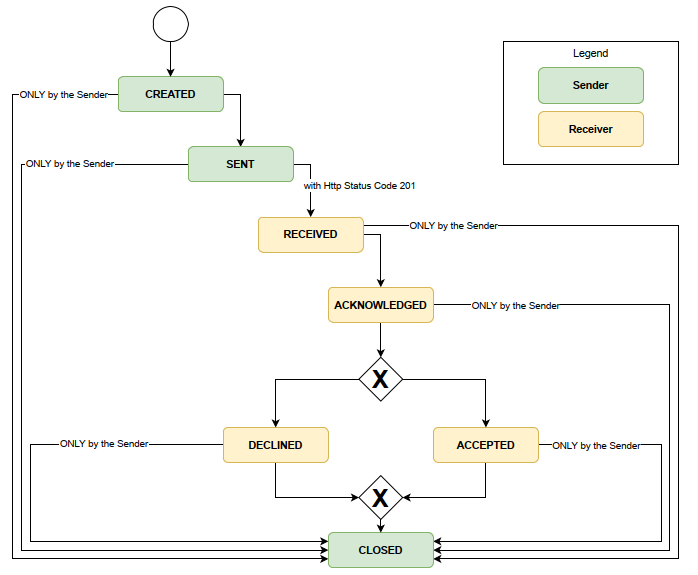
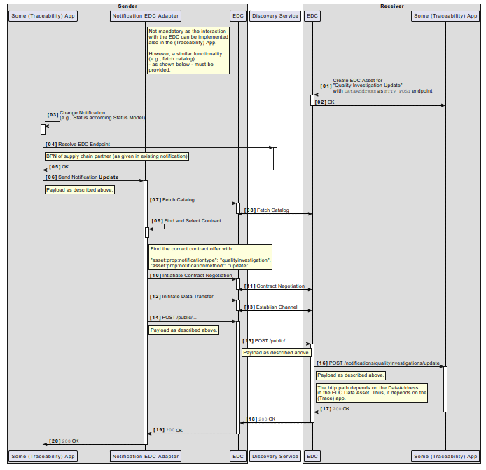

---
tags:
  - CAT/Data Provider & Consumer
  - CAT/Business Application Provider
  - UC/Quality
---

# CX-0123 Quality Use Case Standard v3.0.1

:::warning

The following standards was identified as not fully **backward compatibility with CX-Jupiter**  and was allowed to apply the required changes through a **fast-track process** to be included in the CX-Saturn release.
These exceptions will be released together with the  *CX-Saturn Go-Live** of all other standards on **25.11**.

**Therefore, this version of the standard is not eligible for certification yet**

:::

## ABSTRACT

The Catena-X use case "Quality" provides the ability to detect
quality issues the earliest possible to start root cause analyses and/or to enable
an early warning feature for new quality topics. In subsequent steps, countermeasures
can also be defined earlier and monitored. In sum, this reduces the
number of vehicles affected by quality issues and increases the availability of the
vehicle and built-in components.
In its Version 3 the use case was enhanced by additional standard data models for
warranty and 8D information.
The Catena-X use case "Quality" is powered by Catena-X standard core components
to share data from vehicle manufacturer(OEM) and component suppliers based on data sharing agreements and usage policies.

## FOR WHOM IS THE STANDARD DESIGNED

```text
  see section Audience & Scope
```

## 1 INTRODUCTION

The Catena-X use case "Quality" uses multiple data models to
exchange data between vehicle manufacturer(OEM) and component supplier
(TIER 1) and also along the supply chain between TIER N and TIER N + 1. Each of these data models can be supplied independently.
The QualityTask data model defines the root element for Catena-X-based quality
work. It describes the quality task and why two companies want to work
collaboratively on a quality topic.
Additionally, the use case provides two data models to transfer warranty claim data and the respective response between partners.
And finally a data model for any 8D information is provided.

### 1.1 AUDIENCE & SCOPE

> *This section is non-normative*

The standard is relevant for the following roles within the scope of the Use Case "Quality"

- Data Provider/Consumer
- Business Application Provider

In scope:

- Data sharing between vehicle manufacturer(OEM) and component supplier on TIER 1 to TIER N level
- Earliest possible detection of potential issues with products and vehicles in usage
- Understanding of the root cause of the detected issues to enable earliest possible counter measure implementation and monitoring the effectiveness

### 1.2 CONTEXT AND ARCHITECTURE FIT

> *This section is non-normative*

For all participants of the Use Case "Quality" it is necessary to provide and consume the data in accordance to the standardized semantic data models in section [3 Aspect Models](#3-aspect-models) to ensure the defined interoperability requirement "free of choice application" to be able to use the established in-house tool set for analysis.

Catena-X use case "Quality" data flow: Data is exported from existing back-end systems and mapped to Catena-X aspect models - see list of relevant Catena-X aspect models for use case "Quality" in section [3 Aspect Models](#3-aspect-models)
The so generated files are transferred between different Catena-X participants using a connector conformant to [CX-0018].

### 1.3 CONFORMANCE AND PROOF OF CONFORMITY

> *This section is non-normative*

As well as sections marked as non-normative, all authoring guidelines, diagrams, examples, and notes
in this specification are non-normative. Everything else in this specification is normative.

The key words **MAY**, **MUST**, **MUST NOT**, **OPTIONAL**, **RECOMMENDED**, **REQUIRED**, **SHOULD**
and **SHOULD NOT** in this document document are to be interpreted as described in BCP 14 [RFC2119] [RFC8174]
when, and only when, they appear in all capitals, as shown here.

All participants and their solutions will need to prove, that they are conform with the Catena-X standards.
To validate that the standards are applied correctly, Catena-X employs Conformity Assessment Bodies (CABs).

Since this Use Case Quality Standard describes a set of standards to be fulfilled, participants MUST fulfil all mentioned standards and the respective conformity assessment criteria in addition to the specific criteria mentioned in this document.

The specific criteria in this document describe the usage of the central tools as well as common tools
described in the linked standardization documents and therefore compliance **SHOULD BE** checked with the tools provided
for these components.

### 1.4 EXAMPLES

### 1.5 TERMINOLOGY

> *This section is non-normative*

Business Partner Number (BPN)
: A BPN is the unique identifier of a partner within Catena-x

Connector: Connector conformant to [CX-0018]

SAMM CLI tool
: A command line tool that allows the generation of different formats from a semantic modelling ttl file.
see `https://eclipse-esmf.github.io/esmf-developer-guide/tooling-guide/samm-cli.html`

Additional terminology used in this standard can be looked up in the glossary on the association homepage.

## 2 RELEVANT PARTS OF THE STANDARD FOR SPECIFIC USE CASES

> *This section is normative*

### 2.1 "DATA SHARING RULES"

#### 2.1.1 LIST OF STANDALONE STANDARDS

To participate in Data Provisioning for the "Quality Use Case", the following single standards **MUST** be fulfilled by all participants

- CX - 0018 Data Space Connectivity v3.0.0

#### 2.1.2 DATA REQUIRED

In order to participate in the Catena-X use case "Quality" the following single standards **MUST** be fulfilled by all participants:

CX - 0018 Data space Connectivity v4.1.0

To transfer data properly, the following data models  **MUST** be used by the data provider:

- io.catenax.quality_task v3.0.0
- io.catenax.fleet.diagnostic_data v.3.0.0
- io.catenax.fleet.claim_data v.3.0.0
- io.catenax.parts_analyses v.4.0.0
- io.catenax.manufactured_parts_quality_information v.3.0.0
- io.catenax.fleet.vehicles v.4.0.0
- io.catenax.quality_task_attachment v.3.0.0
- io.catenax.early_warning_notification:1.0.0
- io.catenax.failure_pattern:1.0.0
- io.catenax.report_8d v.1.0.0
- io.catenax.warranty_claim_request v.1.0.0
- io.catenax.warranty_claim_request_verification v.1.0.0

Each data model is described in detail under chapter 3.

For data transfer following scenarios are possible: vehicle manufacturer(OEM) to component manufacturer(TIER1 supplier), component manufacturer(TIER1 supplier) to vehicle manufacturer(OEM) or Tier n supplier to Tier n+1 supplier.

If a Vehicle manufacturer or Supplier is sending an early warning notification, this early warning notification **MUST** be compliant with the early warning notification API described in Chapter 4 of this document.

The data provider defines the data content that will be provided. The data provider **MUST** provide properties that are flagged as mandatory in the data model.

Provided data assets are defined in data sharing agreements and/or data usage policies between data provider and data consumer.

A Business Application Provider **MUST** support at least 2 of the above-listed data models (minimum standard).
A Business Application Provider **SHOULD** support the early warning notification API.

#### 2.1.3 ADDITIONAL REQUIREMENTS

##### 2.1.3.1 Transfer of data assets

The **RECOMMENDED** transfer method of data assets from data provider to data consumer depends on the used data model.
In general, file-based data transfer or http-based data transfer are supported.

- io.catenax.quality_task v3.0.0: **RECOMMENDED** format Apache Parquet, file-based data transfer mode
- io.catenax.fleet.claim_data v.3.0.0: **RECOMMENDED** format Apache Parquet, file-based data transfer mode
- io.catenax.fleet.diagnostic_data v.3.0.0: **RECOMMENDED** format Apache Parquet, file-based data transfer mode
- io.catenax.fleet.vehicles v.4.0.0: **RECOMMENDED** format Apache Parquet, file-based data transfer mode
- io.catenax.manufactured_parts_quality_information v.3.0.0: **RECOMMENDED** format Apache Parquet, file-based data transfer mode
- io.catenax.parts_analyses v.4.0.0: **RECOMMENDED** format Apache Parquet, file-based data transfer mode
- io.catenax.quality_task_attachment v.3.0.0: **RECOMMENDED** format gzip, file-based data transfer mode
- io.catenax.warranty_claim_request v.1.0.0: **RECOMMENDED** format json, http-based data transfer mode
- io.catenax.warranty_claim_request_verification v.1.0.0: **RECOMMENDED** format json, http-based data transfer mode
- io.catenax.report_8d v.1.0.0: **RECOMMENDED** format json, http-based data transfer mode

##### 2.1.3.2 Dataset Properties for file-based data assets

The following table shows a list of connector catalogue properties. As a data provider, I **MUST** provide these connector catalogue properties for file-based data assets. These properties are needed to allow a data consumer to filter for a specific data asset from the large number of data assets in the connector catalogue. In addition, these properties help to correctly use and interpret the file-based data assets on consumer side.

|Property                                      |Value                              |Description                                    |
|----------------------------------------------|-----------------------------------|-----------------------------------------------|
|"@id"|"430f56d3-1234-1234-1234-abc123456789__io.catenax_fleet.claim_data__3.0.0.parquet"| Each catalogue entry needs a unique id. You can use a UUID v4 or a human readable id. **RECOMMENDED** human readable id follows the pattern `<catenaXQualityTaskId>__<SemanticModel>__<model_version>.parquet`. Separator are two underscores: `__`|
|`"https://purl.org/dc/terms/conformsTo"`| "@id": "urn:samm:io.catenax.fleet.claim_data:3.0.0"|This property is QM-specific and a **MUST**. It holds the aspect-model-URN(without # at the end) that defines used aspect model and version.|
|`"https://purl.org/dc/terms/format"`|"application/octet-stream;type=parquet-snappy"|This property is QM-specific and a **MUST**. It indicates the format of the data asset. Supported formats for file-based data transfer are "application/octet-stream;type=parquet-snappy", "application/octet-stream;type=gzip", "text/richtext;type=json". See `https://www.iana.org/assignments/media-types-parameters/media-types-parameters.xhtml`|
|"dcat:qualifiedRelation"|`"{https://purl.org/dc/terms/isPartOf": {"@id": "430f56d3-1234-1234-1234-abc123456789"}}` |This is QM-specific and a **MUST**. `{"isPartOf": {"@id": "<corresponding catenaXQualityTaskId>"}}`. Allows to filter for all file-based data assets that belong to one Catena-X Quality Task ID.|

##### 2.1.3.3 Apache parquet format

At least Apache parquet format in version 2.10.0 or higher **MUST** be used (see `https://parquet.apache.org/` ).

##### 2.1.3.4 Type mapping from Eclipse semantic modelling framework data types(samm) to Apache Parquet data types

The following mappings **MUST** be used when using parquet format for Catena-X use case quality:

|samm data type     | Apache Parquet data type                |
|-------------------|-----------------------------------------|
|boolean            |BOOLEAN: 1 bit boolean                   |
|float              |FLOAT: IEEE 32-bit floating point values |
|double             |DOUBLE: IEEE 64-bit floating point values|
|int                |INT32: 32-bit signed int                |
|long               |INT64: 64-bit signed int                |
|date               |date as INT32                            |
|timestamp          |milliseconds as INT64                    |
|string             |BYTE_Array, strings must be UTF8 encoded |

##### 2.1.3.5 Flattening from hierarchical Eclipse semantic modelling framework structure(samm) to flat Apache Parquet structure

Apache parquet is a tabular flat format. Catena-X semantic models are hierarchically structured. The hierarchical structure **MUST** be transferred into a flat table structure using following convention. To generate the table structure use following approach:

- use SAMM CLI tool to generate a json file out of ttl file
- use only the keys from the generated json file, and concatenate the root key with child key by using "_" as separator. Doing the same for one level done.

To fill in the values:

- If one samm entity has a list of child entities, use left join to duplicate the row of the parent entity for each child
- As json format only supports string and number type, it is a **MUST** to use above samm ttl type mapping when building tabular parquet structure.
- If properties are not available, use null
- In some rare cases mandatory properties might not be available on data provider side: Use in this case "n/a" for mandatory string properties. For mandatory date properties use null or 1970-01-01.

Example json:

```json
{
 "qualityTasks": [
  {
   "recordStatus": "new",
   "creationDate": "2023-11-11",
   "partName": "ABS",
   "dataDeletion": "delete-data-after-closing",
   "description": "Early Warning of vehicle model A with component ABS.",
   "qualityTaskId": "430f56d3-1234-1234-1234-abc123456789",
   "status": "new",
   "title": "Early Warning A",
   "companies": [
    {
     "bpnlProperty": "BPNL000000000123",
     "name": "testCompanyA"
    },
    {
     "bpnlProperty": "BPNL000000000124",
     "name": "testCompanyB"
    }
   ]
  }
 ]
}
```

Resulting parquet table:

|qualityTasks_recordStatus|qualityTasks_creationDate|qualityTasks_partName|qualityTasks_dataDeletion|qualityTasks_description|qualityTasks_qualityTaskId|qualityTasks_status|qualityTasks_title|qualityTasks_companies_bpnlProperty|qualityTasks_companies_name|
|------|----|------|------|------|------|------|------|------|------|
|new|2023-11-11|ABS|delete-data-after-closing|Early Warning of vehicle model A with component ABS.|430f56d3-1234-1234-1234-abc123456789|new|Early Warning A|BPNL000000000123|testCompanyA|
|new|2023-11-11|ABS|delete-data-after-closing|Early Warning of vehicle model A with component ABS.|430f56d3-1234-1234-1234-abc123456789|new|Early Warning A|BPNL000000000124|testCompanyB|

### 2.1.4 POLICY CONSTRAINTS FOR DATA EXCHANGE

In alignment with our commitment to data sovereignty, a specific framework governing the utilization of data within the Catena-X use cases has been outlined.  As part of this data sovereignty framework, conventions for access policies, for usage policies and for the constraints contained in the policies have been specified in standard 'CX-0152 Policy Constraints for Data Exchange'. This standard document CX-0152 **MUST** be followed when providing services or apps for data sharing/consuming and when sharing or consuming data in the Catena-X ecosystem. What conventions are relevant for what roles named in [1.1 AUDIENCE & SCOPE](#11-audience--scope) is specified in the CX-0152 standard document as well. CX-0152 can be found in the [standard library](https://catenax-ev.github.io/docs/standards/overview).

#### 2.1.5 DIGITAL TWINS AND SPECIFIC ASSET IDs

## 3 ASPECT MODELS

### 3.1 ASPECT MODEL "QUALITY TASK"

#### 3.1.1 INTRODUCTION

The "Quality Task" data model is the root element for Catena-X-based quality work. It is a model that can be created by vehicle manufacturer or supplier and describes why data is exchanged over Catena-X network between two companies(purpose) and what should happen with transferred data after completion of this "Quality Task".

For data providers:
Each "Quality Task" **MUST** have a unique qualityTaskId conformant to the semantic model.

#### 3.1.2 SPECIFICATIONS ARTIFACTS

This aspect model is written in SAMM 2.1.0 as a modelling language conformant to CX-0003.
  
Like all Catena-X data models, this model is available in a machine-readable format on GitHub repository sldt-semantic-models [https://github.com/eclipse-tractusx/sldt-semantic-models].

#### 3.1.3 LICENSE

This Catena-X data model is made available under
the terms of the Creative Commons Attribution 4.0 International
(CC-BY-4.0) license, which is available at Creative Commons.

The license information is available inside the turtle file (*.ttl-file) on GitHub.

In case of doubt, GitHub overwrites the information for license, copyright and author from this  document.

#### 3.1.4 IDENTIFIER OF SEMANTIC MODEL

This semantic model "Quality Task" has the unique identifier qualityTaskId which is a UUID v4 identifier.

```text
<urn:samm:io.catenax.quality_task:3.0.0#>
````

#### 3.1.5 FORMATS OF SEMANTIC MODEL

Different formats can be generated through the turtle file (*.ttl-file) and the SAMM CLI tool.

##### 3.1.5.1 RDF TURTLE

The rdf turtle file is the master for generating additional file formats and serializations.
It can be found on github repository.

```text
[https://github.com/eclipse-tractusx/sldt-semantic-models/blob/main/io.catenax.quality_task/3.0.0/QualityTask.ttl]
```

The open source command line tool of the Eclipse Semantic Modelling Framework is used for generation of other file formats like JSON Schema, aasx for Asset Administration Shell Submodel Template or HTML documentation.

##### 3.1.5.2 JSON SCHEMA

A JSON Schema can be generated from the RDF Turtle file. The JSON Schema defines the Value-Only payload of the Asset Administration Shell for the API operation "GetSubmodel".
It can be found in the current version in the "gen" subfolder on the github repository.

```text
[https://github.com/eclipse-tractusx/sldt-semantic-models/tree/main/io.catenax.quality_task/3.0.0/gen]
```

##### 3.1.5.3 AASX

An AASX file can be generated from the RDF Turtle file. The AASX file defines one of the requested artifacts for a Submodel Template Specification.

### 3.2 ASPECT MODEL "FLEET DIAGNOSTIC DATA"

#### 3.2.1 INTRODUCTION

The purpose of this section is the description of the "Fleet Diagnostic Data" semantic data model.

The "Fleet Diagnostic Data" semantic data model consists of a list of diagnostic sessions..
Each diagnostic session contains a vehicle diagnostic that was performed either in a repair shop or over-the-air.

The target is to provide diagnostic data that can be used for the purpose of early warning or root cause analysis.

The "Fleet Diagnostic Data" semantic data model is provided by a vehicle manufacturer.

Each "Fleet Diagnostic Data" **MUST** contain an unique sessionId and a unique anonymizedVIN conformant to the semantic model.

#### 3.2.2 SPECIFICATIONS ARTIFACTS

This aspect model is written in SAMM 2.1.0 as a modelling language conformant to CX-0003.

Like all Catena-X data models, this model is available in a machine-readable format on GitHub repository sldt-semantic-models [https://github.com/eclipse-tractusx/sldt-semantic-models].

#### 3.2.3 LICENSE

This Catena-X data model is made available under
the terms of the Creative Commons Attribution 4.0 International
(CC-BY-4.0) license, which is available at Creative Commons.
  
The license information is available inside the turtle file (*.ttl-file) on GitHub.
  
In case of doubt, GitHub overwrites the information for license, copyright and author from this  document.

#### 3.2.4 IDENTIFIER OF SEMANTIC MODEL

The semantic model has the unique identifier

```text
<urn:samm:io.catenax.fleet.diagnostic_data:3.0.0#>
```

#### 3.2.5 FORMATS OF SEMANTIC MODEL

Different formats can be generated through the turtle file (*.ttl-file) and the SAMM CLI tool.

##### 3.2.5.1 RDF TURTLE

The rdf turtle file, an instance of the Semantic Aspect Meta Model, is the master for generating additional file formats and serializations.
It can be found in the current version 3.0.0 on the GitHub repository.

```text
[https://github.com/eclipse-tractusx/sldt-semantic-models/blob/main/io.catenax.fleet.diagnostic_data/3.0.0/DiagnosticData.ttl]
```

The open source command line tool of the Eclipse Semantic Modelling Framework  is used for generation of other file formats like JSON Schema, aasx for Asset Administration Shell Submodel Template or HTML documentation.

##### 3.2.5.2 JSON SCHEMA

A JSON Schema can be generated from the RDF Turtle file. The JSON Schema defines the Value-Only payload of the Asset Administration Shell for the API operation "GetSubmodel".
It can be found in the current version in the "gen" subfolder on the GitHub repository.

```text
[https://github.com/eclipse-tractusx/sldt-semantic-models/tree/main/io.catenax.fleet.diagnostic_data/3.0.0/gen]
```

##### 3.2.5.3 AASX

An AASX file can be generated from the RDF Turtle file. The AASX file defines one of the requested artifacts for a Submodel Template Specification.

### 3.3 ASPECT MODEL "FLEET CLAIM DATA"

#### 3.3.1 INTRODUCTION

The purpose of this section is the description of the "Fleet Claim Data" semantic data model.

The "Fleet Claim Data" semantic data model is a list of customer complaints(=claim) that are linked to the same or different "Quality Tasks".
One claim: A customer is coming to the repair shop and is indicating a potential malfunction in his car during warranty period. The repair shop tries to fix the problem - by exchanging a potential faulty component by a spare part, by a software update, ...

The "Fleet Claim Data" semantic data model is provided by an vehicle manufacturer.

Each "Fleet Claim Data" **MUST** contain an unique claimId and a unique anonymizedVIN conformant to the semantic model.

#### 3.3.2 SPECIFICATIONS ARTIFACTS

This aspect model is written in SAMM 2.1.0 as a modelling language conformant to CX-0003.

Like all Catena-X data models, this model is available in a machine-readable format on GitHub repository sldt-semantic-models [https://github.com/eclipse-tractusx/sldt-semantic-models].

#### 3.3.3 LICENSE

This Catena-X data model is made available under
the terms of the Creative Commons Attribution 4.0 International
(CC-BY-4.0) license, which is available at Creative Commons.

The license information is available inside the turtle file (*.ttl-file) on GitHub.

In case of doubt, GitHub overwrites the information for license, copyright and author from this  document.

#### 3.3.4 IDENTIFIER OF SEMANTIC MODEL

The semantic model has the unique identifier

```text
<urn:samm:io.catenax.fleet.claim_data:3.0.0#>
```

#### 3.3.5 FORMATS OF SEMANTIC MODEL

Different formats can be generated through the turtle file (*.ttl-file) and the SAMM CLI tool.

##### 3.3.5.1 RDF TURTLE

The rdf turtle file, an instance of the Semantic Aspect Meta Model, is the master for generating additional file formats and serializations.
It can be found in the current version 3.0.0 on the GitHub repository.

```text
[https://github.com/eclipse-tractusx/sldt-semantic-models/blob/main/io.catenax.fleet.claim_data/3.0.0/ClaimData.ttl]
```

The open source command line tool of the Eclipse Semantic Modelling Framework  is used for generation of other file formats like JSON Schema, aasx for Asset Administration Shell Submodel Template or HTML documentation.

##### 3.3.5.2 JSON SCHEMA

A JSON Schema can be generated from the RDF Turtle file. The JSON Schema defines the Value-Only payload of the Asset Administration Shell for the API operation "GetSubmodel".
It can be found in the current version in the "gen" subfolder on the GitHub repository.

```text
[https://github.com/eclipse-tractusx/sldt-semantic-models/tree/main/io.catenax.fleet.claim_data/3.0.0/gen]
```

##### 3.3.5.3 AASX

An AASX file can be generated from the RDF Turtle file. The AASX file defines one of the requested artifacts for a Submodel Template Specification.

### 3.4 ASPECT MODEL "PARTS ANALYSES"

#### 3.4.1 INTRODUCTION

The purpose of this section is the description of the "Parts Analyses" semantic data model.

The "Parts Analyses" semantic data model is a list of analysed parts that were sent back to the component manufacturer (=supplier of the component).
Each part analysis is linked to one or more quality tasks.

The "Parts Analyses" semantic data model is provided by a component supplier.

Each dataset in "Parts Analyses" **MUST** contain a unique componentManufacturerAnalysisID and a unique anonymizedVIN conformant to the semantic model.

#### 3.4.2 SPECIFICATIONS ARTIFACTS

This aspect model is written in SAMM 2.1.0 as a modelling language conformant to CX-0003.

Like all Catena-X data models, this model is available in a machine-readable format on GitHub repository sldt-semantic-models [https://github.com/eclipse-tractusx/sldt-semantic-models].

#### 3.4.3 LICENSE

This Catena-X data model is made available under
the terms of the Creative Commons Attribution 4.0 International
(CC-BY-4.0) license, which is available at Creative Commons.

The license information is available inside the turtle file (*.ttl-file) on GitHub.

In case of doubt, GitHub overwrites the information for license, copyright and author from this  document.

#### 3.4.4 IDENTIFIER OF SEMANTIC MODEL

The semantic model has the unique identifier

```text
<urn:samm:io.catenax.parts_analyses:4.0.0#>
```

#### 3.4.5 FORMATS OF SEMANTIC MODEL

Different formats can be generated through the turtle file (*.ttl-file) and the SAMM CLI tool.

##### 3.4.5.1 RDF TURTLE

The rdf turtle file, an instance of the Semantic Aspect Meta Model, is the master for generating additional file formats and serializations.
It can be found in the current version 3.0.0 on the GitHub repository.

```text
[https://github.com/eclipse-tractusx/sldt-semantic-models/blob/main/io.catenax.parts_analyses/4.0.0/PartsAnalyses.ttl]
```

The open source command line tool of the Eclipse Semantic Modelling Framework  is used for generation of other file formats like JSON Schema, aasx for Asset Administration Shell Submodel Template or HTML documentation.

##### 3.4.5.2 JSON SCHEMA

A JSON Schema can be generated from the RDF Turtle file. The JSON Schema defines the Value-Only payload of the Asset Administration Shell for the API operation "GetSubmodel".
It can be found in the current version in the "gen" subfolder on the GitHub repository.

```text
[https://github.com/eclipse-tractusx/sldt-semantic-models/tree/main/io.catenax.parts_analyses/4.0.0/gen]
```

##### 3.4.5.3 AASX

An AASX file can be generated from the RDF Turtle file. The AASX file defines one of the requested artifacts for a Submodel Template Specification.

### 3.5 ASPECT MODEL "MANUFACTURED PARTS QUALITY INFORMATION"

#### 3.5.1 INTRODUCTION

The purpose of this section is the description of the "Manufactured Parts Quality Information" semantic data model.

The "Manufactured Parts Quality Information" semantic data model is a list of manufactured parts that are involved in one or more quality tasks.

The "Manufactured Parts Quality Information" semantic data model is provided by a component supplier.

Each dataset in "Manufactured Parts Quality Information" **MUST** contain at least one part identifier: This can be manufacturerSerialNumber for serial parts or manufacturerPartNumber for non-serial parts.

#### 3.5.2 SPECIFICATIONS ARTIFACTS

This aspect model is written in SAMM 2.1.0 as a modelling language conformant to CX-0003

Like all Catena-X data models, this model is available in a machine-readable format on GitHub repository sldt-semantic-models [https://github.com/eclipse-tractusx/sldt-semantic-models].

#### 3.5.3 LICENSE

This Catena-X data model is made available under
the terms of the Creative Commons Attribution 4.0 International
(CC-BY-4.0) license, which is available at Creative Commons.

The license information is available inside the turtle file (*.ttl-file) on GitHub.

In case of doubt, GitHub overwrites the information for license, copyright and author from this  document.

#### 3.5.4 IDENTIFIER OF SEMANTIC MODEL

The semantic model has the unique identifier

```text
<urn:samm:io.catenax.manufactured_parts_quality_information:3.0.0#>
```

#### 3.5.5 FORMATS OF SEMANTIC MODEL

Different formats can be generated through the turtle file (*.ttl-file) and the SAMM CLI tool.

##### 3.5.5.1 RDF TURTLE

The rdf turtle file, an instance of the Semantic Aspect Meta Model, is the master for generating additional file formats and serializations.
It can be found in the current version 3.0.0 on the GitHub repository.

```text
[https://github.com/eclipse-tractusx/sldt-semantic-models/blob/main/io.catenax.manufactured_parts_quality_information/3.0.0/ManufacturedPartsQualityInformation.ttl]
```

The open source command line tool of the Eclipse Semantic Modelling Framework  is used for generation of other file formats like JSON Schema, aasx for Asset Administration Shell Submodel Template or HTML documentation.

##### 3.5.5.2 JSON SCHEMA

A JSON Schema can be generated from the RDF Turtle file. The JSON Schema defines the Value-Only payload of the Asset Administration Shell for the API operation "GetSubmodel".
It can be found in the current version in the "gen" subfolder on the GitHub repository.

```text
[https://github.com/eclipse-tractusx/sldt-semantic-models/tree/main/io.catenax.manufactured_parts_quality_information/3.0.0/gen]
```

##### 3.5.5.3 AASX

An AASX file can be generated from the RDF Turtle file. The AASX file defines one of the requested artifacts for a Submodel Template Specification.

### 3.6 ASPECT MODEL "FLEET VEHICLES"

#### 3.6.1 INTRODUCTION

The purpose of this section is the description of the "Fleet Vehicles" semantic data model.

The "Fleet Vehicles" semantic data model is a list of vehicles that are involved in one or more quality tasks. Each data set is a representation of a vehicle  when it was sold to the end-customer: Which equipments was installed in the vehicle, which engine(s) were installed in the vehicle, where was it built and sold.

The "Fleet Vehicles" semantic data model is provided by an automotive manufacturer.

Each dataset in "Fleet Vehicles" **MUST** contain an unique anonymizedVIN conformant to the semantic model.

#### 3.6.2 SPECIFICATIONS ARTIFACTS

This aspect model is written in SAMM 2.1.0 as a modelling language conformant to CX-0003.

Like all Catena-X data models, this model is available in a machine-readable format on GitHub repository sldt-semantic-models [https://github.com/eclipse-tractusx/sldt-semantic-models].

#### 3.6.3 LICENSE

This Catena-X data model is made available under
the terms of the Creative Commons Attribution 4.0 International
(CC-BY-4.0) license, which is available at Creative Commons.

The license information is available inside the turtle file (*.ttl-file) on GitHub.

In case of doubt, GitHub overwrites the information for license, copyright and author from this  document.

#### 3.6.4 IDENTIFIER OF SEMANTIC MODEL

The semantic model has the unique identifier

```text
<urn:samm:io.catenax.fleet.vehicles:4.0.0#>
```

#### 3.6.5 FORMATS OF SEMANTIC MODEL

Different formats can be generated through the turtle file (*.ttl-file) and the SAMM CLI tool.

##### 3.6.5.1 RDF TURTLE

The rdf turtle file, an instance of the Semantic Aspect Meta Model, is the master for generating additional file formats and serializations.
It can be found in the current version 2.1.0 on the GitHub repository.

```text
[https://github.com/eclipse-tractusx/sldt-semantic-models/blob/main/io.catenax.fleet.vehicles/4.0.0/Vehicles.ttl]
```

The open source command line tool of the Eclipse Semantic Modelling Framework  is used for generation of other file formats like JSON Schema, aasx for Asset Administration Shell Submodel Template or HTML documentation.

##### 3.6.5.2 JSON SCHEMA

A JSON Schema can be generated from the RDF Turtle file. The JSON Schema defines the Value-Only payload of the Asset Administration Shell for the API operation "GetSubmodel".
It can be found in the current version in the "gen" subfolder on the GitHub repository.

```text
[https://github.com/eclipse-tractusx/sldt-semantic-models/tree/main/io.catenax.fleet.vehicles/4.0.0/gen]
```

##### 3.6.5.3 AASX

An AASX file can be generated from the RDF Turtle file. The AASX file defines one of the requested artifacts for a Submodel Template Specification.

### 3.7 ASPECT MODEL "QUALITY TASK ATTACHMENT"

#### 3.7.1 INTRODUCTION

The QualityTaskAttachment data model describes a way to exchange data and files, which are not available in the existing data models, in the context of a QualityTask.
In order to make the non-standardized data and files machine understandable, they are described using the "Quality Task Attachment" model.

#### 3.7.2 SPECIFICATIONS ARTIFACTS

This aspect model is written in SAMM 2.1.0 as a modelling language conformant to CX-0003.

Like all Catena-X data models, this model is available in a machine-readable format on GitHub repository sldt-semantic-models [https://github.com/eclipse-tractusx/sldt-semantic-models].

#### 3.7.3 LICENSE

This Catena-X data model is made available under
the terms of the Creative Commons Attribution 4.0 International
(CC-BY-4.0) license, which is available at Creative Commons.

The license information is available inside the turtle file (*.ttl-file) on GitHub.

In case of doubt, GitHub overwrites the information for license, copyright and author from this  document.

#### 3.7.4 IDENTIFIER OF SEMANTIC MODEL

The semantic model has the unique identifier

```text
<urn:samm:io.catenax.quality_task_attachment:2.0.0#>
```

#### 3.7.5 FORMATS OF SEMANTIC MODEL

Different formats can be generated through the turtle file (*.ttl-file) and the SAMM CLI tool.

##### 3.7.5.1 RDF TURTLE

The rdf turtle file, an instance of the Semantic Aspect Meta Model, is the master for generating additional file formats and serializations.
It can be found in the current version 3.0.0 on the GitHub repository.

```text
[https://github.com/eclipse-tractusx/sldt-semantic-models/blob/main/io.catenax.quality_task_attachment/3.0.0/QualityTaskAttachment.ttl]
```

The open source command line tool of the Eclipse Semantic Modelling Framework  is used for generation of other file formats like JSON Schema, aasx for Asset Administration Shell Submodel Template or HTML documentation.

##### 3.7.5.2 JSON SCHEMA

A JSON Schema can be generated from the RDF Turtle file. The JSON Schema defines the Value-Only payload of the Asset Administration Shell for the API operation "GetSubmodel".
It can be found in the current version in the "gen" subfolder on the GitHub repository.

```text
[https://github.com/eclipse-tractusx/sldt-semantic-models/tree/main/io.catenax.quality_task_attachment/3.0.0/gen]
```

##### 3.7.5.3 AASX

An AASX file can be generated from the RDF Turtle file. The AASX file defines one of the requested artifacts for a Submodel Template Specification.

### 3.8 ASPECT MODEL "EARLY WARNING NOTIFICATION"

#### 3.8.1 INTRODUCTION

The data model "Early Warning Notification" describes the payload of a notification used in case of an early warning. An early warning represents an anomaly that is found in the shared data. This notification is used to inform the partner company and initiate further analyses steps.

#### 3.8.2 SPECIFICATIONS ARTIFACTS

This aspect model is written in SAMM 2.1.0 as a modelling language conformant to CX-0003.

Like all Catena-X data models, this model is available in a machine-readable format on GitHub repository sldt-semantic-models [https://github.com/eclipse-tractusx/sldt-semantic-models].

#### 3.8.3 LICENSE

This Catena-X data model is made available under
the terms of the Creative Commons Attribution 4.0 International
(CC-BY-4.0) license, which is available at Creative Commons.
  
The license information is available inside the turtle file (*.ttl-file) on GitHub.
  
In case of doubt, GitHub overwrites the information for license, copyright and author from this  document.

#### 3.8.4 IDENTIFIER OF SEMANTIC MODEL

The semantic model has the unique identifier

```text
<urn:samm:io.catenax.early_warning_notification:1.0.0#>
```

#### 3.8.5 FORMATS OF SEMANTIC MODEL

Different formats can be generated through the turtle file (*.ttl-file) and the SAMM CLI tool.

##### 3.8.5.1 RDF TURTLE

The rdf turtle file, an instance of the Semantic Aspect Meta Model, is the master for generating additional file formats and serializations.
It can be found in the current version 1.0.0 on the GitHub repository.

```text
[https://github.com/eclipse-tractusx/sldt-semantic-models/blob/main/io.catenax.early_warning_notification/1.0.0/EarlyWarningNotification.ttl]
```

The open source command line tool of the Eclipse Semantic Modelling Framework  is used for generation of other file formats like JSON Schema, aasx for Asset Administration Shell Submodel Template or HTML documentation.

##### 3.8.5.2 JSON SCHEMA

A JSON Schema can be generated from the RDF Turtle file. The JSON Schema defines the Value-Only payload of the Asset Administration Shell for the API operation "GetSubmodel".
It can be found in the current version in the "gen" subfolder on the GitHub repository.

```text
[https://github.com/eclipse-tractusx/sldt-semantic-models/tree/main/io.catenax.early_warning_notification/1.0.0/gen]
```

##### 3.8.5.3 AASX

An AASX file can be generated from the RDF Turtle file. The AASX file defines one of the requested artifacts for a Submodel Template Specification.

### 3.9 ASPECT MODEL "FAILURE PATTERN"

#### 3.9.1 INTRODUCTION

The Failure Pattern data model provides the option to identify one specific hardware or software failure in a vehicle, system or product based on a data signature without analysing the faulty hardware.
The utilisation of a failure pattern is divided into two phases. In a first step, the pattern must be derived. Unique identified root causes from e.g. physical analyses of products serve as a database.
Data in a temporal context, such as failure codes from electronic control units, are analysed using e.g. machine learning algorithms.
Afterwards data patterns are derived that differentiate between the occurrence and non-occurrence of an error. Failure patterns can then be used to check e.g. the effectiveness of quality measures.

#### 3.9.2 SPECIFICATIONS ARTIFACTS

This aspect model is written in SAMM 2.1.0 as a modelling language conformant to CX-0003.

Like all Catena-X data models, this model is available in a machine-readable format on GitHub repository sldt-semantic-models [https://github.com/eclipse-tractusx/sldt-semantic-models].

#### 3.9.3 LICENSE

This Catena-X data model is made available under
the terms of the Creative Commons Attribution 4.0 International
(CC-BY-4.0) license, which is available at Creative Commons.

The license information is available inside the turtle file (*.ttl-file) on GitHub.

In case of doubt, GitHub overwrites the information for license, copyright and author from this  document.

#### 3.9.4 IDENTIFIER OF SEMANTIC MODEL

The semantic model has the unique identifier

```text
<urn:samm:io.catenax.failure_pattern:1.0.0#>
```

#### 3.9.5 FORMATS OF SEMANTIC MODEL

Different formats can be generated through the turtle file (*.ttl-file) and the SAMM CLI tool.

##### 3.9.5.1 RDF TURTLE

The rdf turtle file, an instance of the Semantic Aspect Meta Model, is the master for generating additional file formats and serializations.
It can be found in the current version 1.0.0 on the GitHub repository.

```text
[https://github.com/eclipse-tractusx/sldt-semantic-models/blob/main/io.catenax.failure_pattern/1.0.0/FailurePattern.ttl]
```

The open source command line tool of the Eclipse Semantic Modelling Framework  is used for generation of other file formats like JSON Schema, aasx for Asset Administration Shell Submodel Template or HTML documentation.

##### 3.9.5.2 JSON SCHEMA

A JSON Schema can be generated from the RDF Turtle file. The JSON Schema defines the Value-Only payload of the Asset Administration Shell for the API operation "GetSubmodel".
It can be found in the current version in the "gen" subfolder on the GitHub repository.

```text
[https://github.com/eclipse-tractusx/sldt-semantic-models/tree/main/io.catenax.failure_pattern/1.0.0/gen]
```

##### 3.9.5.3 AASX

An AASX file can be generated from the RDF Turtle file. The AASX file defines one of the requested artifacts for a Submodel Template Specification.

## 3.10 ASPECT MODEL "Report 8D"

### 3.10.1 INTRODUCTION

The 8D data model offers the possibility of conducting an 8D root cause analysis report, mandatory in the automotive industry, between vehicle manufacturer and component manufacturer (supplier) or between Tier n Supplier and Tier n+1 Supplier. Due to data sovereignty, this data model can only be exchanged between two Catena-X companies. The data model enables data exchange within the framework of the Global 8D standard and the VDA-QDX standard. Although some aspects have been omitted, all mandatory aspects are present in terms of content. The buyer or customer of the part to be analysed initiates an 8D report by transmitting the relevant information about the component to be analysed to the supplier in the header of the 8D data model. This requests the 8D report from the supplier. The supplier then performs its 8D process internally and subsequently transmits the result to the customer via the same data model. Depending on the 8D status, the supplier may need to transmit the report to the customer multiple times. Any additional documents can be added to the 8D report via the Quality Attachments data model and referenced with a unique ID in the 8D model.

### 3.10.2 SPECIFICATIONS ARTIFACTS

This aspect model is written in SAMM 2.1.0 as a modelling language conformant to CX-0003.
Like all Catena-X data models, this model is available in a machine-readable format on GitHub conformant to CX-0003.

### 3.10.3 LICENSE

This Catena-X data model is made available under
the terms of the Creative Commons Attribution 4.0 International
(CC-BY-4.0) license, which is available at Creative Commons.
  
The license information is available inside the turtle file (*.ttl-file) on GitHub.
  
In case of doubt, GitHub overwrites the information for license, copyright and author from this  document.

### 3.10.4 IDENTIFIER OF SEMANTIC MODEL

The semantic model has the unique identifier

```text
<urn:samm:io.catenax.report_8d:1.0.0#>
```

### 3.10.5 FORMATS OF SEMANTIC MODEL

Different formats can be generated through the turtle file (*.ttl-file) and the SAMM CLI tool.

#### 3.10.5.1 RDF TURTLE

The rdf turtle file, an instance of the Semantic Aspect Meta Model, is the master for generating additional file formats and serializations. It can be found in the current version 1.0.0 on the GitHub repository.

[https://github.com/eclipse-tractusx/sldt-semantic-models/blob/main/io.catenax.report_8d/1.0.0/report_8d.ttl]

The open source command line tool of the Eclipse Semantic Modelling Framework is used for generation of other file formats like JSON Schema, aasx for Asset Administration Shell Submodel Template or HTML documentation.

#### 3.10.5.2 JSON SCHEMA

A JSON Schema can be generated from the RDF Turtle file. The JSON Schema defines the Value-Only payload of the Asset Administration Shell for the API operation "GetSubmodel". It can be found in the current version in the "gen" subfolder on the GitHub repository.

[https://github.com/eclipse-tractusx/sldt-semantic-models/tree/main/io.catenax.report_8d/1.0.0/gen]

#### 3.10.5.3 AASX

An AASX file can be generated from the RDF Turtle file. The AASX file defines one of the requested artifacts for a Submodel Template Specification.

### 3.11 ASPECT MODEL "Warranty claim Request"

#### 3.11.1 INTRODUCTION

The Warranty Claim Request data model encompasses all relevant warranty claim information typically transmitted from a customer to a supplier. This model includes detailed data about the repair performed, the time and materials consumed, and the associated monetary values for the claim.

#### 3.11.2 SPECIFICATIONS ARTIFACTS

This aspect model is written in SAMM 2.1.0 as a modelling language conformant to CX-0003

Like all Catena-X data models, this model is available in a machine-readable format on GitHub conformant to CX-0003.

#### 3.11.3 LICENSE

This Catena-X data model is made available under
the terms of the Creative Commons Attribution 4.0 International
(CC-BY-4.0) license, which is available at Creative Commons.
  
The license information is available inside the turtle file (*.ttl-file) on GitHub.
  
In case of doubt, GitHub overwrites the information for license, copyright and author from this  document.

#### 3.11.4 IDENTIFIER OF SEMANTIC MODEL

The semantic model has the unique identifier

```text
<urn:samm:io.catenax.warranty_claim_request:1.0.0>
```

#### 3.11.5 FORMATS OF SEMANTIC MODEL

Different formats can be generated through the turtle file and the SAMM command line interface (cli).

##### 3.11.5.1 RDF TURTLE

The rdf turtle file, an instance of the Semantic Aspect Meta Model, is the master for generating additional file formats and serializations.
It can be found in the current version 1.0.0 on the GitHub repository.

```text
[https://github.com/eclipse-tractusx/sldt-semantic-models/blob/main/io.catenax.warranty_claim_request/1.0.0/WarrantyClaimRequest.ttl]
```

The open source command line tool of the Eclipse Semantic Modelling Framework  is used for generation of other file formats like JSON Schema, aasx for Asset Administration Shell Submodel Template or HTML documentation.

##### 3.11.5.2 JSON SCHEMA

A JSON Schema can be generated from the RDF Turtle file. The JSON Schema defines the Value-Only payload of the Asset Administration Shell for the API operation "GetSubmodel".
It can be found in the current version in the "gen" subfolder on the GitHub repository.

```text
[https://github.com/eclipse-tractusx/sldt-semantic-models/tree/main/io.catenax.warranty_claim_request/1.0.0/gen]
```

##### 3.11.5.3 AASX

An AASX file can be generated from the RDF Turtle file. The AASX file defines one of the requested artifacts for a Submodel Template Specification.

### 3.12 ASPECT MODEL "Warranty claim Request Verification"

#### 3.12.1 INTRODUCTION

The Warranty claim Request Verification data model is the supplier´s response to the claimant (customer). The claim verification provides information about the evaluation and accepted quota (percentage of accepted responsibility) in regards to a claim.

#### 3.12.2 SPECIFICATIONS ARTIFACTS

This aspect model is written in SAMM 2.1.0 as a modelling language conformant to CX-0003

Like all Catena-X data models, this model is available in a machine-readable format on GitHub
conformant to CX-0003.

#### 3.12.3 LICENSE

This Catena-X data model is made available under
the terms of the Creative Commons Attribution 4.0 International
(CC-BY-4.0) license, which is available at Creative Commons.
  
The license information is available inside the turtle file (*.ttl-file) on GitHub.
  
In case of doubt, GitHub overwrites the information for license, copyright and author from this  document.

#### 3.12.4 IDENTIFIER OF SEMANTIC MODEL

The semantic model has the unique identifier

```text
<urn:samm:io.catenax.warranty_claim_request_verification:1.0.0>
```

#### 3.12.5 FORMATS OF SEMANTIC MODEL

All formats can be generated through the turtle file and the SAMM command line interface (cli).

##### 3.12.5.1 RDF TURTLE

The rdf turtle file, an instance of the Semantic Aspect Meta Model, is the master for generating additional file formats and serializations.
It can be found in the current version 1.0.0 on the GitHub repository.

```text
[https://github.com/eclipse-tractusx/sldt-semantic-models/blob/main/io.catenax.warranty_claim_request_verification/1.0.0/WarrantyClaimRequestVerificatio.ttl]
```

The open source command line tool of the Eclipse Semantic Modelling Framework  is used for generation of other file formats like JSON Schema, aasx for Asset Administration Shell Submodel Template or HTML documentation.

##### 3.12.5.2 JSON SCHEMA

A JSON Schema can be generated from the RDF Turtle file. The JSON Schema defines the Value-Only payload of the Asset Administration Shell for the API operation "GetSubmodel".
It can be found in the current version in the "gen" subfolder on the GitHub repository.

```text
[https://github.com/eclipse-tractusx/sldt-semantic-models/tree/main/io.catenax.warranty_claim_request_verification/1.0.0/gen]
```

##### 3.12.5.3 AASX

An AASX file can be generated from the RDF Turtle file. The AASX file defines one of the requested artifacts for a Submodel Template Specification.

## 4 APPLICATION PROGRAMMING INTERFACES

> *This section is normative*

### 4.1 NOTIFICATION API

Notifications are - in contrast to classical data offers in Catena-X - a way to push data from a sender to a receiver. For now, this notification API is limited to the sending and receiving of early warning notifications as well as the update of the notification status (following a predefined [State Model](#5121-notification-state-model)).

The API is used as part of the notification process of quality management. It is important to note that this API is designed such that it is based on and extends the QUALITY NOTIFICATION API defined in [CX - 0125 TRACEABILITY USE CASE]. Both may be merged in a future version.

In this regard it is important to mention, that the API standardized here is not a central API, but an API to be implemented into each participant's quality or traceability solution or solution stack in order to be able to receive information related to early warning and/or quality issues and notifications in the first place.

So, this chapter describes this early warning notification API with its relevant API endpoints to be created by each supporting quality or traceability solution or solution stack. On top this chapter describes the Data Asset Structure within the participant who wants to be able to receive notifications and/or updates to notifications. As the notification process includes bi-directional status communication, both entities in a process **MUST** provide these Data Assets and a linkage to corresponding APIs. Furthermore there is also a description of the payload of the notifications for early warning.

#### 4.1.1 PRECONDITIONS AND DEPENDENCIES

Application providers **MUST** prove their conformity by providing:

- An openAPI specification of the endpoints described

The Early Warning Notification API **MUST** be published towards the network using a Data Asset/Contract Definition in terms of the IDSA Protocol as described by the reference implementation [CX - 0018 DATASPACE CONNECTIVITY].

The dataspace connector as a reference implementation **SHOULD** BE used and is referenced in this document. Other connectors fulfilling the same standards towards Catena-X **MAY** be leveraged as well.

It is of importance to mention, that there **MUST** be an API available behind each of the data offers described in the dataspace connector, which works according to the openAPI specifications description.

Nevertheless, the APIs are **OPTIONAL** to follow the same structure, as there could even be APIs taking over the job of several of the endpoints mentioned.

The dataspace connector **SHOULD** act as a reverse proxy towards those APIs, as it holds the Data Offers linked to the respective implemented endpoints.

#### 4.1.2 API SPECIFICATION

##### 4.1.2.1 API-ENDPOINTS

The quality notification API **MUST** be implemented as specified in the [openAPI](./assets/earlywarningnotification-1-0-0.yaml) documentation.

In fact, it is **OPTIONAL** to implement the endpoint paths exactly as described in the [openAPI](./assets/earlywarningnotification-1-0-0.yaml)). The reason is that those endpoints are not called from any supply chain partner directly. Rather, they are called from the dataspace connector as part of data assets. In that sense, it is just important to implement endpoints that can process the defined request body and respond with the HTTP status codes and - if required - reply with the defined response body.

The data assets will act similar to a reverse proxy for the notification endpoints, therefore rather the data assets are of significance, which **SHOULD** be exposed towards Catena-X through the Data Offer Catalogues in the dataspace connector or any other CX-0018 compliant connector.

##### 4.1.2.2 AVAILABLE DATA TYPES

The quality notification API **MUST** use JSON as the payload transported via HTTP.

##### 4.1.2.3 API RESOURCES & ENDPOINTS

The HTTP POST endpoints introduced in this standard **MUST** be called via Data Space Protocol.

The sending and receiving of notifications **MUST** be built on the basis of HTTP POST endpoints.

#### 4.1.3 DATA ASSET STRUCTURE

##### 4.1.3.1 DATA ASSET FOR NOTIFICATION RECEIVE ENDPOINT FOR EARLY WARNING NOTIFICATION RECEIPT

When using the dataspace connector, the following asset **MUST** be registered. Other connectors implementing the IDSA Protocol require a similar data asset with the same structure and provisioning towards Catena-X.

```json  
{
  "@context": {
      "cx-common": "https://w3id.org/catenax/ontology/common#",
      "cx-taxo": "https://w3id.org/catenax/taxonomy#",
      "dct": "https://purl.org/dc/terms/"
  },
  "@type": "Asset",
  "@id": "earlywarningnotificationnotification-receive",
  "properties": {
      "dct:type": {
          "@id": "cx-taxo:ReceiveEarlyWarningNotification"
      },
      "cx-common:version": "1.2"
  },
  "dataAddress": {
      ...
  }
}  
```

The variable \{\{httpServerWhichOffersTheHttpEndpoint\}\} **MUST** be set to the HTTP server that offers the endpoint. The path /qualityinvestigations/receive **MAY** align with the HTTP POST path as stated in Section 4.1.2.1. In that sense it can change dependent on the quality or traceability application.

##### 4.1.3.2 DATA ASSET FOR NOTIFICATION UPDATE ENDPOINT FOR EARLY WARNING NOTIFICATION UPDATE

When using an endpoint for early warning the following asset **MUST** be registered.

```json
{
  "@context": {
      "cx-common": "https://w3id.org/catenax/ontology/common#",
      "cx-taxo": "https://w3id.org/catenax/taxonomy#",
      "dct": "https://purl.org/dc/terms/"
  },
  "@type": "Asset",
  "@id": "earlywarningnotification-update",
  "properties": {
      "dct:type": {
          "@id": "cx-taxo:UpdateEarlyWarningNotification"
      },
      "cx-common:version": "1.2"
  },
  "dataAddress": {
      ...
  }
}   
```

The variable \{\{httpServerWhichOffersTheHttpEndpoint\}\} **MUST** be set to the HTTP server that offers the endpoint. The path /qualityinvestigations/update **MAY** align with the HTTP POST path as stated in Section 4.1.2.1. In that sense it can change dependent on the quality or traceability application.

### 4.1.4 VERSIONING

The API version described in this standard document **MUST** be published in the property [https://w3id.org/catenax/ontology/common#version](https://w3id.org/catenax/ontology/common#version) as version 2.0 in dcat:Dataset ([http://www.w3.org/ns/dcat#](http://www.w3.org/ns/dcat#)).

### 4.1.5 EXAMPLES

Example 1: Early Warning Notification

```text
I as a partner in an Early Warning project discover a potential quality issue while analysing the common quality data set that was exchanged previously. I want to inform my partner to perform a verification on his side and want to communicate this data securely and sovereign to him.
```

## 5 PROCESSES

> *This section is normative*

### 5.1 NOTIFICATION PROCESS

This chapter describes the minimum requirements for the notification process and does not go beyond the sending and receiving of early warning notifications. It also illustrates common practices for identifying the correct receiving endpoint when sending a notification. For this purpose, a protocol is described that will be exchanged between quality applications or application
stacks leveraging dataspace connector or any other CX-0018 compliant connector on both ends.

The notification process therefore takes place between quality or traceability applications or application stacks, and the focus is on minimal interaction, which **MUST** be supported by all applications participating in an early warning notification scenario.

Application internals like user journeys, process steps or workflows in an application are not standardized within Catena-X, and therefore omitted.

Note that the process described here is same as the one described for Quality Notification defined in [CX - 0125 TRACEABILITY USE CASE]

#### 5.1.1 ACTORS AND ROLES

Catena-X does not standardize user-roles at the moment. The actors are quality applications of the companies in a supply chain.

#### 5.1.2 PROCESS REPRESENTATION

The exchange of notifications follows the IDSA protocol.

On top, a notification state model has been described.

##### 5.1.2.1 NOTIFICATION STATE MODEL

The notification itself has various states. The states and their cycle are described in the following figure:



***Figure 1: Description of Process***

The state of a notification MUST be exchanged via the [4.1. EARLY WARNING Notification API](#41-notification-api).

##### 5.1.2.2 PROCESSES FOR SENDING AND UPDATING EARLY WARNING NOTIFICATIONS

Below the sequence for sending and updating of notifications
between (quality or traceability) applications is shown in UML sequence diagrams
In all cases, HTTP POST requests **MUST** be used. The corresponding HTTP
endpoints are described in chapter [4.1 EARLY WARNING Notification API](#41-notification-api).

To read the UML sequence diagrams correctly, some remarks below:

- The shown Notification dataspace connector Adapter is **OPTIONAL**. It is just one
  option to send a notification via the dataspace connector control and data plane. It
  is important, that a similar functionality **MUST** be
  provided/implemented by the (quality or traceability) application vendor. The
  Notification dataspace connector Adapter or a similar component / functionality will
  not be provided as a central service from Catena-X.

- To discover where a notification **MUST** be sent to, the (quality or traceability)
  application **MUST** resolve the BPN of the receiver. This can either
  happen through the (quality or traceability) application holding this
  information in its data model, or it could - alternatively - also be
  resolved e.g. via a lookup of the digital twin in the central asset
  administration shell (AAS) registry or by using services from the
  BPDM use case.

- The resolution of the dataspace connector URL for a given BPN **SHOULD BE** done via the
  EDC Discovery Service API \[CX-0001\]. The entry for each dataspace connector into
  this Discovery Service is done via the Catena-X Portal.

- In each UML sequence diagram the step \[01\] describes the
  publishing of the notification endpoints as described in the above
  sections.

###### 5.1.2.2.1  SENDING AND RECEIVING OF AN EARLY WARNING NOTIFICATION OR A QUALITY INVESTIGATION

Below, the UML sequence diagram to send and receive an early warning notification is depicted. This is the same as sending and receiving a quality notification.

In addition to the above-mentioned general remarks, the following remark
has to be mentioned:

- The status transition from SENT to RECEIVED **MUST** be done by the

> sender once it received the Http status code 201 from the receiver. This status is not communicated from the sender to the receiver.


***Figure 2: Send and Receive Early Warning or Quality Notification***

###### 5.1.2.2.2 UPDATE OF AN EARLY WARNING NOTIFICATION OR A QUALITY INVESTIGATION

Below, the UML sequence diagram to update an early warning notification is
depicted. This is the same as updating a quality notification.



***Figure 3: Update Early Warning or Quality Investigation***

## 6 Backward compatibility to previous version CX-0123 v.2.1.0

To allow backward compatibility, CX-0123 v.2.1.0 is allowed to use until CX2609 (Neptun release).
Therefore it is a **MUST** that certified Catena-X quality apps are also able to read at least 2 semantic models as defined in CX-0123 v.2.1.0.

## 7 REFERENCES

### 7.1 NORMATIVE REFERENCES

> *This section is normative*

- CX-0001 EDC Discovery API v1.1.0
- CX-0003 SAMM Aspect Meta Model v1.1.0
- CX-0018 Dataspace Connectivity v4.1.0
- CX-0125 Traceability Use Case v2.2.0
- CX-0152 Policy Constraints For Data Exchange v1.0.0

### 7.2 NON-NORMATIVE REFERENCES

### 7.3 REFERENCE IMPLEMENTATIONS

## ANNEXES

### FIGURES

### TABLES

## Legal

Copyright © 2025 Catena-X Automotive Network e.V. All rights reserved. For more information, please visit [here](/copyright).
