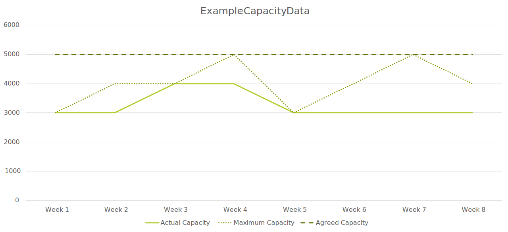

# CX-0128 - Demand and Capacity Management Data Exchange v2.2.1

## ABSTRACT

> *This section and all its subsections are non-normative*

The Catena-X **D**emand and **C**apacity **M**anagement (DCM) standard is designed for all members of the automotive supply chain. Its goal is to help these members **prevent or anticipate production issues** that can arise from fluctuations in demand or capacity planning. This standard is particularly relevant for mid- to long-term planning, covering periods up to 24 months into the future. **Effective collaboration between partners in a direct business relationship (also referred to as “one-up” and “one-down”) is a key element of success**.

The Catena-X DCM standard is accessible to all supply chain participants, including suppliers and Original Equipment Manufacturers (OEMs), regardless of their size and position in the supply chain. It is particularly useful for those involved in **production and production planning**. The standard prioritizes parts and materials that are critical to manufacturing, aiming to create mutually beneficial outcomes for all parties involved and to **enhance the flexibility in meeting customer needs**.

This standard offers an alternative to proprietary systems or manual processes that are often resource-intensive and prone to errors. It provides a **collaborative foundation for demand and capacity management within the automotive industry**, ensuring **compatibility** with existing systems and maintaining **data sovereignty** for all users.

Recent global supply chain disruptions have highlighted the need for greater resilience. The automotive industry, with its complex and volatile environment, has multiple IT solutions and interfaces within a single company and across the supply chain. However, there is a lack of a unified process understanding among all partners.

Demand and Capacity Management (DCM) involves the exchange of demand and capacity data between customers and suppliers within their direct business relationships. Customers communicate their anticipated material needs for specific timeframes and suppliers respond with their planned production capacities for those materials and timeframes.

For successful DCM, companies must share a common understanding that enables the exchange of data across different partners and systems while respecting each partner's data sovereignty.

This standard describes the data models, data exchange protocols and a core business logic for interpreting the data, ensuring a consistent approach for all DCM participants.

Cross-company interactions and common business logic required for DCM are standardized in [Chapter 5](#5-processes), while the Application Programming Interfaces (APIs) are described in [Chapter 4](#4-application-programming-interfaces). The data models are presented in [Chapter 3](#3-aspect-models).

## COMPARISON WITH PREVIOUS VERSIONS OF THIS STANDARD

> *This section and all its subsections are non-normative*

## 1 INTRODUCTION

> *This section and all its subsections are non-normative*

### 1.1 Audience and Scope

This standard is intended for the three roles below, who are involved in the Demand and Capacity Management (DCM) process within the automotive industry:

- Data provider
- Data consumer
- Business application provider

For clarity on the roles and responsibility of each actor, please see [Chapter 5.2](#52-actors-and-roles). The scope of this standard includes regulations for managing future demands and capacities. It does not cover the specific methods companies use to calculate their demand or capacity data, nor does it address internal company measures.

Illustrations and descriptions of roles are provided to help explain concepts and processes but are not mandatory. This standard requires that data consumers, providers and business application providers must adopt a uniform business logic, data models and data exchange protocols to ensure interoperable data exchange.

This standard focuses on direct one-to-one business relationships between customers and suppliers. Companies participating in Catena-X DCM must have agreed to the *Data Exchange Governance* framework agreement.

### 1.2 Context and Architecture Fit

This standard (CX-0128) defines the standard data models and APIs for the following objects, utilized by the DCM use case: `WeekBasedMaterialDemand`, `WeekBasedCapacityGroup`, `IdBasedRequestForUpdate` and `IdBasedComment`. Applying these standards ensures that:

- All actors participating in the DCM use case provide and consume demand-, capacity- and comment-information in an identical manner
- All actors participating in the DCM use case process data in an identical manner
- All actors participating in the DCM use case exchange data only via a connector conformant to [[CX-0018](#71-normative-references)] (e.g. Tractus-X EDC)
- All actors participating in the DCM use case interpret the exchanged data in an identical manner

The APIs must only be used on the context of Catena-X and must only be accessible via a connector conformant to [[CX-0018](#71-normative-references)] (e.g. Tractus-X EDC).

#### 1.2.1 Architectural Overview

This standard covers the exchange of `WeekBasedMaterialDemand`, `WeekBasedCapacityGroup`, `IdBasedRequestForUpdate` and `IdBasedComment` data as JSON strings through a connector conformant to [[CX-0018](#71-normative-references)].

This standard also discusses the optional use of digital twin registries to support the transmission of `WeekBasedMaterialDemand` and `WeekBasedCapacityGroup` objects.

How to build an application that creates and handles these objects is not part of this standard.

### 1.3 Conformity and Proof of Conformity

Non-mandatory sections include authoring guidelines, diagrams, examples and notes. All other content is mandatory.

The capitalized key words such as **MAY, MUST, MUST NOT, OPTIONAL, RECOMMENDED, REQUIRED, SHOULD** and **SHOULD NOT** are to be interpreted as defined in BCP 14 [[RFC2119](#72-non-normative-references)] [[RFC8174](#72-non-normative-references)].

Participants must demonstrate conformity with Catena-X standards. Conformity Assessment Bodies (CABs) verify that standards are correctly applied.

If a participant or application only implements either the business role customer or the business role supplier, then conformity must only be demonstrated along conformity assessment criteria (CACs) that apply to the specific business role.

Conformity assessment criteria are found only in the following chapters:

- [2.3 Additional Requirements](#23-additional-requirements)
- [3.1 Aspect Model WeekBasedMaterialDemand](#31-aspect-model-weekbasedmaterialdemand)
- [3.2 Aspect Model WeekBasedCapacityGroup](#32-aspect-model-weekbasedcapacitygroup)
- [3.3 Aspect Model IdBasedRequestForUpdate](#33-aspect-model-idbasedrequestforupdate)
- [3.4 Aspect Model IdBasedComment](#34-aspect-model-idbasedcomment)
- [4 APPLICATION PROGRAMMING INTERFACES](#4-application-programming-interfaces)
- [4.1 WeekBasedMaterialDemand API](#41-weekbasedmaterialdemand-api)
- [4.2 WeekBasedCapacityGroup API](#42-weekbasedcapacitygroup-api)
- [4.3 IdBasedRequestForUpdate API](#43-idbasedrequestforupdate-api)
- [4.4 IdBasedComment API](#44-idbasedcomment-api)
- [4.5 DCM Asset Administration Shell API (AAS API)](#45-dcm-asset-administration-shell-api-aas-api)
- [5 PROCESSES](#5-processes)
- [6 FRAMEWORK AGREEMENT AND POLICIES](#6-framework-agreement-and-policies)

**Proof of Conformity for Data Models**

Participants must implement and conform to the standardized data models as described in [Chapter 3](#3-aspect-models). Depending on which business role a participant or application implements only parts of [Chapter 3](#3-aspect-models) are relevant for conformity.

| Data model              | Business role        | Relevant capability             |
| ----------------------- | -------------------- | ------------------------------- |
| WeekBasedMaterialDemand | Customer             | Data provider                   |
| WeekBasedMaterialDemand | Supplier             | Data consumer                   |
| WeekBasedCapacityGroup  | Customer             | Data consumer                   |
| WeekBasedMaterialDemand | Supplier             | Data provider                   |
| IdBasedRequestForUpdate | Customer or supplier | Data provider and data consumer |
| IdBasedComment          | Customer or supplier | Data provider and data consumer |

**Proof of Conformity for APIs**

Participants must implement and conform to the standardized APIs as described in [Chapter 4](#4-application-programming-interfaces). Depending on which business role a participant or application implements only parts of [Chapter 4](#4-application-programming-interfaces) are relevant for conformity.

| API taxonomy               | Business role         | Relevant capability    |
| -------------------------- | --------------------- | -------------------    |
| DcmWeekBasedMaterialDemand | Customer              | Call API               |
| DcmWeekBasedMaterialDemand | Supplier              | Offer API              |
| DcmWeekBasedCapacityGroup  | Customer              | Offer API              |
| DcmWeekBasedCapacityGroup  | Supplier              | Call API               |
| DcmIdBasedRequestForUpdate | Customer or supplier  | Offer API and call API |
| DcmIdBasedComment          | Customer or supplier  | Offer API and call API |
| Submodel                   | Customer or supplier  | Offer API and call API |

**Proof of Conformity for Process and Core Business Logic**

Participants must implement and conform to the DCM core business logic as described in [Chapter 5](#5-processes). Depending on which business role a participant or application implements only parts of [Chapter 5](#5-processes) are relevant for conformity.

| Relevant process step        | Business role         |
| ---------------------------- | --------------------- |
| Manage demands               | Customer              |
| Manage capacities            | Supplier              |
| Bottleneck calculation       | Customer and supplier |
| Collaborate                  | Customer and supplier |
| Align capacities and demands | Customer and supplier |
| Update demands               | Customer              |
| Update capacities            | Supplier              |

### 1.4 Examples

#### 1.4.1 Examples for Process and Core Business Logic

Customers and suppliers must have agreed to the *Data Exchange Governance* framework agreement, implement the core business logic from [Chapter 5](#5-processes) and manage their access authorizations. They should ensure that material demand and capacity data are accurate, regularly updated and shared in a standardized format.

Business application providers must implement APIs as described in this standard and enforce requirements for a trusted usage environment, contractual agreements and antitrust requirements. Their applications must also enforce process traceability and data sovereignty.

#### 1.4.2 Examples for Data Models

This section provides JSON examples for `WeekBasedMaterialDemand`, `WeekBasedCapacityGroup`, `IdBasedRequestForUpdate` and `IdBasedComment` payloads. Further property descriptions are available in [Chapter 5](#5-processes).

##### 1.4.2.1 WeekBasedMaterialDemand data model JSON structure

```json
{
  "unitOfMeasureIsOmitted" : false,
  "unitOfMeasure" : "unit:piece",
  "materialDescriptionCustomer" : "Spark Plug",
  "materialGlobalAssetId" : "urn:uuid:48878d48-6f1d-47f5-8ded-a441d0d879df",
  "materialDemandId" : "0157ba42-d2a8-4e28-8565-7b07830c1110",
  "materialNumberSupplier" : "MNR-8101-ID146955.001",
  "supplier" : "BPNL000000000BXT",
  "changedAt" : "2023-11-05T08:15:30.123-05:00",
  "demandSeries" : [ {
    "expectedSupplierLocation" : "BPNS000000000PFA",
    "demands" : [ {
      "demand" : 1000,
      "pointInTime" : "2023-10-09"
    } ],
    "customerLocation" : "BPNS0000000000WN",
    "demandCategory" : {
      "demandCategoryCode" : "0001"
    }
  } ],
  "materialDemandIsInactive" : true,
  "materialNumberCustomer" : "MNR-7307-AU340474.002",
  "customer" : "BPNL00000000015G"
}
```

##### 1.4.2.2 WeekBasedCapacityGroup data model JSON structure

```json
{
  "unitOfMeasure" : "unit:piece",
  "linkedDemandSeries" : [ {
    "loadFactor" : 3.5,
    "materialNumberCustomer" : "MNR-7307-AU340474.002",
    "materialNumberSupplier" : "MNR-8101-ID146955.001",
    "customerLocation" : "BPNS0000000000WN",
    "demandCategory" : {
      "demandCategoryCode" : "0001"
    }
  } ],
  "linkedCapacityGroups" : [ "be4d8470-2de6-43d2-b5f8-2e5d3eebf3fd" ],
  "unitOfMeasureIsOmitted" : false,
  "capacityGroupIsInactive" : true,
  "demandVolatilityParameters" : {
    "rollingHorizonAlertThresholds" : [ {
      "sequenceNumber" : 1,
      "absoluteNegativeDeviation" : 100.0,
      "subhorizonLength" : 4,
      "relativeNegativeDeviation" : 0.3,
      "absolutePositiveDeviation" : 100.0,
      "relativePositiveDeviation" : 0.2
    } ],
    "measurementInterval" : 4,
    "startReferenceDateTime" : "2024-01-10T12:00:00.320Z"
  },
  "supplier" : "BPNL000000000BXT",
  "name" : "Spark Plugs on drilling machine for car model XYZ",
  "supplierLocations" : [ "BPNS000000000PFA" ],
  "capacities" : [ {
    "pointInTime" : "2022-08-01",
    "agreedCapacity" : 1800,
    "actualCapacity" : 1000,
    "maximumCapacity" : 2000,
    "deltaProductionResult" : 400
  } ],
  "changedAt" : "2023-03-10T12:27:11.320Z",
  "capacityGroupId" : "0157ba42-d2a8-4e28-8565-7b07830c1110",
  "customer" : "BPNL00000000015G"
}
```

##### 1.4.2.3 IdBasedRequestForUpdate data model JSON structure

###### 1.4.2.3.1 RfU: Provide Everything

```json
{
}
```

###### 1.4.2.3.2 RfU: Provide only Material Demands

```json
{
    "weekBasedMaterialDemand": [
    ]
}
```

###### 1.4.2.3.3 RfU: Provide only Capacity Groups

```json
{
    "weekBasedCapacityGroup": [
    ]
}
```

###### 1.4.2.3.4 RfU: Provide only certain Objects

```json
{
  "weekBasedMaterialDemand": [
    {
      "materialDemandId": "0157ba42-d2a8-4e28-8565-7b07830c3456"
    }
  ],
  "weekBasedCapacityGroup": [
    {
      "capacityGroupId": "0157ba42-d2a8-4e28-8565-7b07830c1110"
    },
    {
      "capacityGroupId": "a2fc69ac-ede7-48d3-bee5-04de665d49f0"
    },
    {
      "capacityGroupId": "34238729-990a-4b61-b0c6-336da7b71675"
    }
  ]
}
```

###### 1.4.2.3.5 RfU: Provide only certain Objects and only if my version is not up to date

```json
{
  "weekBasedMaterialDemand" : [ {
    "materialDemandId" : "0157ba42-d2a8-4e28-8565-7b07830c3456",
    "changedAt" : "2023-03-10T12:27:11.320Z"
  } ],
  "weekBasedCapacityGroup" : [ {
    "capacityGroupId" : "0157ba42-d2a8-4e28-8565-7b07830c1110",
    "changedAt" : "2023-03-10T12:27:11.320Z"
  } ]
}
```

##### 1.4.2.4 IdBasedComment data model JSON structure

```json
{
  "postedAt" : "2023-03-10T12:27:11.320Z",
  "listOfReferenceDates" : [ "2023-11-05" ],
  "author" : "someone@company.com",
  "supplier" : "BPNL000000000BXT",
  "commentType" : "information",
  "commentId" : "f5c151e4-30b5-4456-94fd-2a7b559b6121",
  "changedAt" : "2023-03-10T12:27:11.320Z",
  "commentText" : "Hello, this is a comment!",
  "requestDelete" : true,
  "objectId" : "dfeb1334-497e-4dab-97c1-4e6f4e1c0320",
  "objectType" : "urn:samm:io.catenax.week_based_capacity_group",
  "customer" : "BPNL00000000015G"
}
```

#### 1.4.3 Examples for Data Assets

This section provides JSON examples for registering API endpoints as data assets with your own connector conformant to [CX-0018](#71-normative-references).

##### 1.4.3.1 WeekBasedMaterialDemand API endpoint data asset

```json
{
  "@context": {
    "edc": "https://w3id.org/edc/v0.0.1/ns/",
    "cx-common": "https://w3id.org/catenax/ontology/common#",
    "cx-taxo": "https://w3id.org/catenax/taxonomy#",
    "dct": "http://purl.org/dc/terms/"
  },
  "@id": "catx-dcm-materialdemand-receive",
  "properties": {
    "dct:type": {
      "@id": "cx-taxo:DcmWeekBasedMaterialDemand"
    },
    "description": "Endpoint for providing Material Demands",
    "cx-common:version": "2.0"
  },
  "dataAddress": {
    "@type": "DataAddress",
    "type": "HttpData",
    "baseUrl": "https://myApplication.myCompany.com/catx/api/md",
    "method": "POST",
    "proxyBody": "true",
    "contentType": "application/json"
  }
}
```

##### 1.4.3.2 WeekBasedCapacityGroup API endpoint data asset

```json
{
  "@context": {
    "edc": "https://w3id.org/edc/v0.0.1/ns/",
    "cx-common": "https://w3id.org/catenax/ontology/common#",
    "cx-taxo": "https://w3id.org/catenax/taxonomy#",
    "dct": "http://purl.org/dc/terms/"
  },
  "@id": "catx-dcm-capacitygroup-receive",
  "properties": {
    "dct:type": {
      "@id": "cx-taxo:DcmWeekBasedCapacityGroup"
    },
    "description": "Endpoint for providing Week Based Capacity Groups",
    "cx-common:version": "2.0"
  },
  "dataAddress": {
    "@type": "DataAddress",
    "type": "HttpData",
    "baseUrl": "https://myApplication.myCompany.com/catx/api/cg",
    "method": "POST",
    "proxyBody": "true",
    "contentType": "application/json"
  }
}
```

##### 1.4.3.3 IdBasedRequestForUpdate API endpoint data asset

```json
{
  "@context": {
    "edc": "https://w3id.org/edc/v0.0.1/ns/",
    "cx-common": "https://w3id.org/catenax/ontology/common#",
    "cx-taxo": "https://w3id.org/catenax/taxonomy#",
    "dct": "http://purl.org/dc/terms/"
  },
  "@id": "catx-dcm-rfu-receive",
  "properties": {
    "dct:type": {
      "@id": "cx-taxo:DcmIdBasedRequestForUpdate"
    },
    "description": "Endpoint for requesting updates",
    "cx-common:version": "2.0"
  },
  "dataAddress": {
    "@type": "DataAddress",
    "type": "HttpData",
    "baseUrl": "https://myApplication.myCompany.com/catx/api/rfu",
    "method": "POST",
    "proxyBody": "true",
    "contentType": "application/json"
  }
}
```

##### 1.4.3.4 IdBasedComment API endpoint data asset

```json
{
  "@context": {
    "edc": "https://w3id.org/edc/v0.0.1/ns/",
    "cx-common": "https://w3id.org/catenax/ontology/common#",
    "cx-taxo": "https://w3id.org/catenax/taxonomy#",
    "dct": "http://purl.org/dc/terms/"
  },
  "@id": "catx-dcm-comment-receive",
  "properties": {
    "dct:type": {
      "@id": "cx-taxo:DcmIdBasedComment"
    },
    "description": "Endpoint for providing comments",
    "cx-common:version": "2.0"
  },
  "dataAddress": {
    "@type": "DataAddress",
    "type": "HttpData",
    "baseUrl": "https://myApplication.myCompany.com/catx/api/cmt",
    "method": "POST",
    "proxyBody": "true",
    "contentType": "application/json"
  }
}
```

#### 1.4.4 Capabilities as data assets

This section provides JSON examples for data asset, policy and contract definition as utilized [Chapter 4.6 Capabilities as Data Assets](#46-capabilities-as-data-assets). A catalog request with response is shown as well.

##### 1.4.4.1 Capability data asset

```json
{
    "@context": {
        "edc": "https://w3id.org/edc/v0.0.1/ns/",
        "cx-common": "https://w3id.org/catenax/ontology/common#",
        "cx-taxo": "https://w3id.org/catenax/taxonomy#",
        "dct": "http://purl.org/dc/terms/"
    },
    "@id": "capability-load-factor",
    "properties": {
        "dct:type": {
            "@id": "cx-taxo:DcmLoadFactor"
        },
        "description": "I do support the optional capability load factors"
    },
  "dataAddress": {
  "@type": "DataAddress",
  "type": "HttpData",
  "baseUrl": "https://myCompany.com"

 }
}
```

##### 1.4.4.2 Always True Policy

```json
{
    "@id": "always-true",
    "@type": "PolicyDefinition",
    "createdAt": 1729522849169,
    "policy": {
        "@id": "f65bbd32-9674-4cd7-a3c3-280dab4653a6",
        "@type": "odrl:Set",
        "odrl:permission": [],
        "odrl:prohibition": [],
        "odrl:obligation": []
    },
    "@context": {
        "tx": "https://w3id.org/tractusx/v0.0.1/ns/",
        "tx-auth": "https://w3id.org/tractusx/auth/",
        "cx-policy": "https://w3id.org/catenax/2025/9/policy/context.jsonld",
        "@vocab": "https://w3id.org/edc/v0.0.1/ns/",
        "edc": "https://w3id.org/edc/v0.0.1/ns/",
        "odrl": "http://www.w3.org/ns/odrl/2/"
    }
}
```

##### 1.4.4.3 Contract Definition

```json
{
    "@context": {},
    "@id": "DcmLoadFactor",
    "@type": "ContractDefinition",
    "accessPolicyId": "always-true",
    "contractPolicyId": "always-true",
    "assetsSelector": {
        "@type": "CriterionDto",
        "operandLeft": "https://w3id.org/edc/v0.0.1/ns/id",
        "operator": "=",
        "operandRight": "capability-load-factor"
    }
}
```

##### 1.4.4.4 Catalog request

```json
{
 "@context": {},
 "protocol": "dataspace-protocol-http",
 "counterPartyAddress": "https://partnerEdc.com/api/v1/dsp",
 "counterPartyId": "BPNL000000000BXT",
 "querySpec": {
  "@type": "QuerySpecDto",
  "https://w3id.org/edc/v0.0.1/ns/offset": 0,
  "https://w3id.org/edc/v0.0.1/ns/limit": 2,
  "https://w3id.org/edc/v0.0.1/ns/filterExpression": [
   {
    "@type": "CriterionDto",
    "operandLeft": "'http://purl.org/dc/terms/type'.'@id'",
    "operator": "=",
    "operandRight": "https://w3id.org/catenax/taxonomy#DcmLoadFactor"
   }
  ]
 }
}
```

##### 1.4.4.5 Response to catalog request

```json
{
  "@id": "72d62115-d1f2-47ff-b522-f647f45dabdb",
  "@type": "dcat:Catalog",
  "dcat:dataset": {
    "@id": "capability-load-factor",
    "@type": "dcat:Dataset",
    "odrl:hasPolicy": {
      "@id": "RGNtTG9hZEZhY3Rvci00:Y2FwYWJpbGl0eS1sb2FkLWZhY3Rvcg==:NmIzZGVjMzgtZjllOS00NTljLTk4ZGQtOGY1MmVlMjhiMmVm",
      "@type": "odrl:Offer",
      "odrl:permission": [],
      "odrl:prohibition": [],
      "odrl:obligation": []
    },
    "dcat:distribution": [
      {
        "@type": "dcat:Distribution",
        "dct:format": {
          "@id": "AzureStorage-PUSH"
        },
        "dcat:accessService": {
          "@id": "743fc8be-e463-433b-80e4-640373dc4a66",
          "@type": "dcat:DataService",
          "dcat:endpointDescription": "dspace:connector",
          "dcat:endpointUrl": "https://myCompany.com/api/v1/dsp",
          "dcat:endpointURL": "https://myCompany.com/api/v1/dsp"
        }
      },
      {
        "@type": "dcat:Distribution",
        "dct:format": {
          "@id": "HttpData-PULL"
        },
        "dcat:accessService": {
          "@id": "743fc8be-e463-433b-80e4-640373dc4a66",
          "@type": "dcat:DataService",
          "dcat:endpointDescription": "dspace:connector",
          "dcat:endpointUrl": "https://myCompany.com/api/v1/dsp",
          "dcat:endpointURL": "https://myCompany.com/api/v1/dsp"
        }
      },
      {
        "@type": "dcat:Distribution",
        "dct:format": {
          "@id": "HttpData-PUSH"
        },
        "dcat:accessService": {
          "@id": "743fc8be-e463-433b-80e4-640373dc4a66",
          "@type": "dcat:DataService",
          "dcat:endpointDescription": "dspace:connector",
          "dcat:endpointUrl": "https://myCompany.com/api/v1/dsp",
          "dcat:endpointURL": "https://myCompany.com/api/v1/dsp"
        }
      },
      {
        "@type": "dcat:Distribution",
        "dct:format": {
          "@id": "AmazonS3-PUSH"
        },
        "dcat:accessService": {
          "@id": "743fc8be-e463-433b-80e4-640373dc4a66",
          "@type": "dcat:DataService",
          "dcat:endpointDescription": "dspace:connector",
          "dcat:endpointUrl": "https://myCompany.com/api/v1/dsp",
          "dcat:endpointURL": "https://myCompany.com/api/v1/dsp"
        }
      }
    ],
    "dct:type": {
      "@id": "https://w3id.org/catenax/taxonomy#DcmLoadFactor"
    },
    "description": "I do support the optional capability load factors",
    "id": "capability-load-factor"
  },
  "dcat:catalog": [],
  "dcat:distribution": [],
  "dcat:service": {
    "@id": "743fc8be-e463-433b-80e4-640373dc4a66",
    "@type": "dcat:DataService",
    "dcat:endpointDescription": "dspace:connector",
    "dcat:endpointUrl": "https://myCompany.com/api/v1/dsp",
    "dcat:endpointURL": "https://myCompany.com/api/v1/dsp"
  },
  "dspace:participantId": "BPNL000000000BXT",
  "@context": {
    "tx": "https://w3id.org/tractusx/v0.0.1/ns/",
    "tx-auth": "https://w3id.org/tractusx/auth/",
    "cx-policy": "https://w3id.org/catenax/2025/9/policy/context.jsonld",
    "dcat": "http://www.w3.org/ns/dcat#",
    "dct": "http://purl.org/dc/terms/",
    "odrl": "http://www.w3.org/ns/odrl/2/",
    "dspace": "https://w3id.org/dspace/v0.8/",
    "@vocab": "https://w3id.org/edc/v0.0.1/ns/",
    "edc": "https://w3id.org/edc/v0.0.1/ns/"
  }
}
```

#### 1.4.5 AAS API Examples

##### 1.4.5.1 Submodel registration

```json
{
  "id": "{{id of the AAS}}",
  "idShort": "{{short name of your AAS}}",
  "specificAssetIds": [
    {
      "name": "creationEntityId",
      "value": "{{someUuidV4}}",
      "externalSubjectId": {
        "type": "ExternalReference",
        "keys": [
          {
            "type": "GlobalReference",
            "value": "*"
          }
        ]
      }
    }
  ],
  "submodelDescriptors": [
    {
      "id": "{{someSubmodelId}}",
      "semanticId": {
        "type": "ExternalReference",
        "keys": [
          {
            "type": "GlobalReference",
            "value": "urn:samm:io.catenax.week_based_capacity_group:2.0.0#WeekBasedCapacityGroup"
          }
        ]
      },
      "endpoints": [
        {
          "interface": "SUBMODEL-3.0",
          "protocolInformation": {
            "href": "{{dataplane baseurl extended with the appropriate path ending on /submodel}}",
            "endpointProtocol": "HTTP",
            "endpointProtocolVersion": [
              "1.1"
            ],
            "subprotocol": "DSP",
            "subprotocolBody": "id={{ID of the connector asset the submodel is living behind}};dspEndpoint={{controlPlaneEndpoint}}",
            "subprotocolBodyEncoding": "plain",
            "securityAttributes": [
              {
                "type": "NONE",
                "key": "NONE",
                "value": "NONE"
              }
            ]
          }
        }
      ]
    }
  ]
}
```

##### 1.4.5.2 Data asset definition

```json
{
  "@context": {
    "cx-common": "https://w3id.org/catenax/ontology/common#",
    "ctx": "https://w3id.org/catenax/taxonomy#",
    "aas-semantics": "https://admin-shell.io/aas/3/0/HasSemantics/"
  },
  "@id": "{{ID for the Asset}}",
  "properties": {
    "dct:type": {
      "@id": "ctx:Submodel"
    },
    "cx-common:version": "3.0",
    "aas-semantics:semanticId": "{{URN of WeekBasedMaterialDemand or WeekBasedCapacityGroup Submodel}}"
    },
    "dataAddress": {
      "@type": "DataAddress",
      "type": "HttpData",
      "proxyPath": "true",
      "proxyBody": "true",
      "proxyMethod": "true",
      "proxyQueryParams": "true",
      "baseUrl": "{{Submodel endpoint ending before /submodel}}"
    }
}
```

##### 1.4.5.3 Policy definition

```json
{
  "@context": {
    "@vocab": "https://w3id.org/edc/v0.0.1/ns/",
    "http://www.w3.org/ns/odrl/2/"
    "https://w3id.org/catenax/2025/9/policy/context.jsonld"
  },
  "@type": "Set",
  "@id": "{{POLICY-DEFINITION-ID}}",
  "policy": {
    "permission": [
      {
        "action": "access",
        "constraint": [
          { 
            "and": [
              {
              "leftOperand": "BusinessPartnerNumber",
              "operator": "isAnyOf",
              "rightOperand": "{{hard-coded BPNLs of privileged consumer}}"
              }
          
             ]
          }
        ]
      }
    ]
  }
}
```

##### 1.4.5.4 Contract definition

```json
{
  "@context": {
    "@vocab": "https://w3id.org/edc/v0.0.1/ns/"
  },
  "@type": "ContractDefinition",
  "@id": "contract-definition-id",
  "accessPolicyId": "{{POLICY-DEFINITION-ID}}",
  "contractPolicyId": "{{POLICY-DEFINITION-ID}}",
  "assetsSelector": [
    {
      "operandLeft": "https://w3id.org/edc/v0.0.1/ns/id",
      "operator": "=",
      "operandRight": "{{ID for the Asset}}"
    }
  ]
}
```

### 1.5 Terminology

| Term                                        | Description                                                                                                                                                                                                                                                                                                                                                                                                                                                                                                                                                                                                                                                                                                               |
| :------------------------------------------ | :------------------------------------------------------------------------------------------------------------------------------------------------------------------------------------------------------------------------------------------------------------------------------------------------------------------------------------------------------------------------------------------------------------------------------------------------------------------------------------------------------------------------------------------------------------------------------------------------------------------------------------------------------------------------------------------------------------------------ |
| Actual Capacity                             | This is the capacity a supplier realistically plans to have available to produce a certain amount of material per week for a customer. It takes into account the supplier's own assessment of their capabilities, inventory and existing commitments.                                                                                                                                                                                                                                                                                                                                                                                                                                                                     |
| Agreed Capacity                             | May be coordinated between customer and supplier. The agreed capacity must not constitute a legal obligation to deliver. Using the agreed capacity is optional and has purely informative character. The agreed capacity may be greater than, less than or equal to the actual or maximum capacity of the supplier. It may be used for a time frame shorter than the whole time series.                                                                                                                                                                                                                                                                                                                                   |
| Aspect Model                                | An Aspect model is a structured, machine-readable description of data. It utilizes the Turtle file format to serialize a Resource Description Framework (RDF) graph, that relates to a specific aspect. It must follow the Semantic Aspect Meta Model (SAMM) guidelines, meaning it uses defined elements and rules from SAMM. Aspect models help to clarify the meaning of data at runtime and should link to standardized business glossary terms, if available.                                                                                                                                                                                                                                                        |
| Bottleneck                                  | A facility, function, department, or resource whose capacity is less than the demand placed upon it. For example, a bottleneck machine or work center exists where jobs are processed at a slower rate than they are demanded (Source: ASCM Supply Chain Dictionary, 17th edition).                                                                                                                                                                                                                                                                                                                                                                                                                                       |
| Business application provider               | Offers tools for demand and capacity management that conform to the core business logic, data models and APIs described in this standard.                                                                                                                                                                                                                                                                                                                                                                                                                                                                                                                                                                                 |
| Business Partner Number Legal Entity (BPNL) | A BPNL is an unique identifier for a company or partner within the Catena-X network.                                                                                                                                                                                                                                                                                                                                                                                                                                                                                                                                                                                                                                      |
| Business Partner Number Site (BPNS)         | A BPNS is an unique identifier for a specific location, such as a factory, within the Catena-X network.                                                                                                                                                                                                                                                                                                                                                                                                                                                                                                                                                                                                                   |
| Calendar Week                               | A week consisting of seven days, typically numbered according to the week containing the year's first Thursday. For example, if the first Thursday of the year is on January 1st, that week is considered Week 1.                                                                                                                                                                                                                                                                                                                                                                                                                                                                                                         |
| Capacity                                    | 1. The capability of a system to perform its expected function. 2. The capability of a worker, machine, work center, plant, or organization to produce output per time period. (Source: ASCM Supply Chain Dictionary, 17th edition).                                                                                                                                                                                                                                                                                                                                                                                                                                                                                      |
| Capacity Group                              | A Capacity Group is where material demand and capacity information are matched for collaborative planning. When written as `WeekBasedCapacityGroup`, it refers to a specific data model within this standard.                                                                                                                                                                                                                                                                                                                                                                                                                                                                                                             |
| Comment                                     | A feature that allows two business partners to exchange messages about material demand and capacity, facilitating direct collaboration and quick issue resolution.                                                                                                                                                                                                                                                                                                                                                                                                                                                                                                                                                        |
| Comments                                    | These are purely text-based exchanges without the transfer of documents or attachments.                                                                                                                                                                                                                                                                                                                                                                                                                                                                                                                                                                                                                                   |
| CreationEntity                              | Currently, a Creation Entity groups `WeekBasedCapacityGroup` objects to support digital twins in the planning process. It may represent a production plant and will be further defined in future revisions of this standard.                                                                                                                                                                                                                                                                                                                                                                                                                                                                                              |
| Customer                                    | A role within the DCM use case. Receives goods from its suppliers. Participating companies can have multiple roles at the same time. Customers provide consistent and up-to-date demand forecast and receive capacity data from suppliers.                                                                                                                                                                                                                                                                                                                                                                                                                                                                                |
| Delta-Production                            | This is an optional feature that allows suppliers to manage capacity bottlenecks by shifting demand from one week to another in production without altering actual capacity, maximum capacity or the material demand.                                                                                                                                                                                                                                                                                                                                                                                                                                                                                                     |
| Demand Deviation                            | This is an optional metric that allows suppliers to monitor changes in customer demands and to identify significant changes that can collaboratively be addressed by suppliers and customers.                                                                                                                                                                                                                                                                                                                                                                                                                                                                                                                             |
| Digital Twin                                | Based on [[CX-0002](#71-normative-references)] Standard a digital twin (DT) describes a digital representation of an asset sufficient to meet the requirements of a set of use cases. For detailed information please refer to [[CX-0002](#71-normative-references)] Digital Twins in Catena-X.                                                                                                                                                                                                                                                                                                                                                                                                                           |
| Flexible Capacity                           | The difference between maximum and actual capacity, representing the potential to increase capacity without further agreements, such as extending the use of production resources within a week. In particular, it refers to measures to extend the weekly utilization of the available production resources.                                                                                                                                                                                                                                                                                                                                                                                                             |
| Linking material demand                     | Material demands can be linked directly to a capacity group or indirectly through another capacity group, which is known as "Nesting."                                                                                                                                                                                                                                                                                                                                                                                                                                                                                                                                                                                    |
| Load Factor                                 | Optional feature of a capacity group. ~ adds individual numerical material load factors to `WeekBasedMaterialDemand` linked by the `WeekBasedCapacityGroup`. ~ adds flexibility to the unit of measure of the capacity group.                                                                                                                                                                                                                                                                                                                                                                                                                                                                                             |
| Material                                    | The elements, constituents, or substances of which something is composed or can be made. Usually referred to by a material number.                                                                                                                                                                                                                                                                                                                                                                                                                                                                                                                                                                                        |
| (Material) demand                           | A need for a particular product or component. The demand could come from any number of sources (e.g., a customer order or forecast, an interplant requirement, a branch warehouse request for a service part, or the manufacturing of another product). At the finished goods level, demand data is usually different from sales data because demand does not necessarily result in sales (i.e., If there is no stock, there will be no sale (Source: ASCM Supply Chain Dictionary, 17th edition)). Material demand may comprise multiple demand series by location and demand categories. When the term is written as one word (`WeekBasedMaterialDemand`), the term refers specifically to the respective aspect model. |
| Maximum Capacity                            | Is the maximum releasable capacity of a supplier which should be possible to achieve a material output per calendar week with a certain unit of measure for one customer. The maximum capacity is based on capacity-increasing measures, agreed by the parties involved. Capacity-increasing measures can be, for example, a longer utilization of the available production resources, a shift extension or additional shifts. Secondarily, additional resources can also be activated.                                                                                                                                                                                                                                   |
| Nesting                                     | A method by which a capacity group links another capacity group, allowing for dynamic changes and centralized data management.                                                                                                                                                                                                                                                                                                                                                                                                                                                                                                                                                                                            |
| Supplier                                    | A role within the DCM use case. Supplies goods to its customers. Participating companies can have multiple roles at the same time. Suppliers provide consistent and up-to-date capacity data and receive demands from customers.                                                                                                                                                                                                                                                                                                                                                                                                                                                                                          |
| Surplus                                     | A surplus is a situation in which an oversupply exists.                                                                                                                                                                                                                                                                                                                                                                                                                                                                                                                                                                                                                                                                   |
| WeekBasedCapacityGroup                      | This term refers to the specific `WeekBasedCapacityGroup` object defined in this standard.                                                                                                                                                                                                                                                                                                                                                                                                                                                                                                                                                                                                                                |

For additional terminology, please refer to the glossary on the association's homepage.

## 2 RELEVANT PARTS OF THIS STANDARD FOR SPECIFIC USE CASES

> *This section and all its subsections are normative*

This chapter lists all aspects of this standard that directly impact other Catena-X use cases if modified.

### 2.1 Digital Twins

This standard utilizes digital twins of "part type" (BOM as planned). Digital twins of "part instance" (BOM as built) are not utilized. Part type twins are also relevant to various other Catena-X standards. For additional details see [[CX-0126](#71-normative-references)] Industry Core: Part Type.

### 2.2 Supply Chain Disruption Notifications

This standard utilizes Supply Chain Disruption Notifications. Supply Chain Disruption Notifications are also relevant to other Catena-X standards. For additional details see [[CX-0146](#71-normative-references)] Supply Chain Disruption Notifications.

### 2.3 POLICY CONSTRAINTS FOR DATA EXCHANGE

In alignment with our commitment to data sovereignty, a specific framework governing the utilization of data within the Catena-X use cases has been outlined.  As part of this data sovereignty framework, conventions for access policies, for usage policies and for the constraints contained in the policies have been specified in standard 'CX-0152 Policy Constraints for Data Exchange'. This standard document CX-0152 **MUST** be followed when providing services or apps for data sharing/consuming and when sharing or consuming data in the Catena-X ecosystem. What conventions are relevant for what roles named in [1.1 AUDIENCE & SCOPE](#11-audience--scope) is specified in the CX-0152 standard document as well. CX-0152 can be found in the [standard library](https://catenax-ev.github.io/docs/standards/overview).

## 3 ASPECT MODELS

> *This section and all its subsections are normative*

### 3.1 Aspect Model WeekBasedMaterialDemand

The [unique identifier](#314-identifier-of-semantic-model) for the semantic model, as specified in this standard, MUST be used to define the meaning of the data being transferred.

The JSON payload provided by data providers MUST comply with the [JSON schema](#3152-json-schema) as specified in this standard and MUST be validated against the same JSON schema by data consumers.

Within the Catena-X data space `WeekBasedMaterialDemand` data MUST be requested and exchanged using a connector, conforming to the standards [[CX-0018](#71-normative-references)] and [[CX-0002](#71-normative-references)]. It MUST be transferred using the [WeekBasedMaterialDemand API](#41-weekbasedmaterialdemand-api)

#### 3.1.1 Introduction

For the exchange of material demand information, customers must provide data to suppliers. The data format specified in this standard must be conformed to.

Customers and suppliers must implement the `WeekBasedMaterialDemand` data model.

Suppliers must be able to consume and process material demand information.

Customers must be able to provide and process material demand information.

Data providers of `WeekBasedMaterialDemand` data must ensure that it aligns with the semantic model specified in this standard.

Business applications utilizing `WeekBasedMaterialDemand` data must consume this data, conforming to the semantic model specified in this standard.

This semantic model has been made available in the central Semantic Hub.

Data consumers and data providers must comply with the license of the semantic model specified in [Section 3.1.3](#313-license).

The characteristics BPNL and BPNS must be used, conforming with [[CX-0010](#71-normative-references)].

#### 3.1.2 Specification Artifacts

The creation of the semantic model specified in this section followed a sematic driven workflow, conforming to [[SMT](#72-non-normative-references)].
Conforming with [[CX-0003](#71-normative-references)] the resulting aspect model was written in SAMM 2.0.0 and is available on GitHub.

#### 3.1.3 License

This Catena-X data model is released under the [CC-BY-4.0](#72-non-normative-references) license.

#### 3.1.4 Identifier of Semantic Model

The semantic model has the unique identifier

```text
urn:samm:io.catenax.week_based_material_demand:3.0.1
```

Data providers must use this identifier to clearly define the semantics of the data they are transferring.

#### 3.1.5 Formats of Semantic Model

##### 3.1.5.1 RDF turtle

All other file format and serializations are derived from a RDF turtle file. It is the source for the Semantic Aspect Meta Model. You can access the RDF turtle file at the following URL:

```text
https://github.com/eclipse-tractusx/sldt-semantic-models/blob/main/io.catenax.week_based_material_demand/3.0.1/WeekBasedMaterialDemand.ttl
```

The open source command line tool of the Eclipse Semantic Modeling Framework is used to generate other file formats such as JSON schema, AASX for Asset Administration Shell Submodel template or HTML documentation.

##### 3.1.5.2 JSON schema

A JSON schema, which describes the structure of the data payload, can be created from the RDF turtle file. This schema specifically describes the data format for the `GetSubmodel` API operation within the Asset Administration Shell, focusing on the values without including semantic information. This allows for a clear and structured way to retrieve data from the API.

```text
https://github.com/eclipse-tractusx/sldt-semantic-models/blob/main/io.catenax.week_based_material_demand/3.0.1/gen/WeekBasedMaterialDemand-schema.json
```

##### 3.1.5.3 AASX

An AASX file can be generated from the RDF turtle file. The AASX file defines one of the requested artifacts for a Submodel template specification conformant to [[SMT](#72-non-normative-references)].

```text
https://github.com/eclipse-tractusx/sldt-semantic-models/blob/main/io.catenax.week_based_material_demand/3.0.1/gen/WeekBasedMaterialDemand.aasx
```

#### 3.1.6 Semantic Model

Not applicable.

### 3.2 Aspect Model WeekBasedCapacityGroup

The [unique identifier](#324-identifier-of-semantic-model) for the semantic model, as specified in this standard, MUST be used to define the meaning of the data being transferred.

The JSON payload provided by data providers MUST comply with the [JSON schema](#3252-json-schema) as specified in this standard and MUST be validated against the same JSON schema by data consumers.

Within the Catena-X data space `WeekBasedMaterialCapacityGroup` data MUST be requested and exchanged using a connector, conforming to the standards [[CX-0018](#71-normative-references)] and [[CX-0002](#71-normative-references)]. It MUST be transferred using the [WeekBasedCapacityGroup API](#42-weekbasedcapacitygroup-api)

#### 3.2.1 Introduction

For the exchange of capacity group information, suppliers must provide data to customers. The data format specified in this standard must be conformed to.

Customers and suppliers must implement the `WeekBasedCapacityGroup` data model.

Suppliers must be able to provide and process capacity group information.

Customers must be able to consume and process capacity group information.

Data providers of `WeekBasedCapacityGroup` data must ensure that it aligns with the semantic model specified in this standard.

Business applications utilizing `WeekBasedCapacityGroup` data must consume this data, conforming to the semantic model specified in this standard.

This semantic model has been made available in the central Semantic Hub.

Data consumers and data providers must comply with the license of the semantic model specified in [Section 3.2.3](#323-license).

The characteristics BPNL and BPNS must be used, conforming with [[CX-0010](#71-normative-references)].

#### 3.2.2 Specification Artifacts

The creation of the semantic model specified in this section followed a sematic driven workflow, conforming to [[SMT](#72-non-normative-references)].
Conforming with [[CX-0003](#71-normative-references)] the resulting aspect model was written in SAMM 2.0.0 and is available on GitHub.

#### 3.2.3 License

This Catena-X data model is released under the ([CC-BY-4.0](#72-non-normative-references)) license.

#### 3.2.4 Identifier of Semantic Model

The semantic model has the unique identifier

```text
urn:samm:io.catenax.week_based_capacity_group:3.0.1
```

Data providers must use this identifier to clearly define the semantics of the data they are transferring.

#### 3.2.5 Formats of Semantic Model

##### 3.2.5.1 RDF turtle

All other file format and serializations are derived from a RDF turtle file. It is the source for the Semantic Aspect Meta Model. You can access the RDF turtle file at the following URL:

```text
https://github.com/eclipse-tractusx/sldt-semantic-models/blob/main/io.catenax.week_based_capacity_group/3.0.1/WeekBasedCapacityGroup.ttl
```

The open source command line tool of the Eclipse Semantic Modeling Framework is used to generate other file formats such as JSON schema, AASX for Asset Administration Shell Submodel template or HTML documentation.

##### 3.2.5.2 JSON schema

A JSON schema, which describes the structure of the data payload, can be created from the RDF turtle file. This schema specifically describes the data format for the `GetSubmodel` API operation within the Asset Administration Shell, focusing on the values without including semantic information. This allows for a clear and structured way to retrieve data from the API.

```text
https://github.com/eclipse-tractusx/sldt-semantic-models/blob/main/io.catenax.week_based_capacity_group/3.0.1/gen/WeekBasedCapacityGroup-schema.json
```

##### 3.2.5.3 AASX

An AASX file can be generated from the RDF turtle file. The AASX file defines one of the requested artifacts for a Submodel template specification conformant to [[SMT](#72-non-normative-references)].

```text
https://github.com/eclipse-tractusx/sldt-semantic-models/blob/main/io.catenax.week_based_capacity_group/3.0.1/gen/WeekBasedCapacityGroup.aasx
```

#### 3.2.6 Semantic Model

Not applicable.

### 3.3 Aspect Model IdBasedRequestForUpdate

The [unique identifier](#324-identifier-of-semantic-model) for the semantic model, as specified in this standard, MUST be used to define the meaning of the data being transferred.

The JSON payload provided by data providers MUST comply with the [JSON schema](#3352-json-schema) as specified in this standard and MUST be validated against the same JSON schema by data consumers.

Within the Catena-X data space `IdBasedRequestForUpdate` data MUST be requested and exchanged using a connector, conforming to the standards [[CX-0018](#71-normative-references)] and [[CX-0002](#71-normative-references)]. It MUST be transferred using the [IdBasedRequestForUpdate API](#43-idbasedrequestforupdate-api).

#### 3.3.1 Introduction

`IdBasedRequestForUpdate` can be exchanged between customer and supplier conforming to the API standard described in [Capter 4.3](#43-idbasedrequestforupdate-api). The data format specified in this standard must be conformed to.

Customers and suppliers must implement the `IdBasedRequestForUpdate` data model.

Customers and suppliers must be able to consume and process a request for update.

Providing an `IdBasedRequestForUpdate` is optional. It is recommended to be both capable of providing and consuming a request for update.

Data providers of an `IdBasedRequestForUpdate` must ensure that it aligns with the semantic model specified in this standard.

Business applications utilizing `IdBasedRequestForUpdate` data must consume this data, conforming to the semantic model specified in this standard.

This semantic model has been made available in the central Semantic Hub.

Data consumers and data providers must comply with the license of the semantic model specified in [Section 3.3.3](#333-license).

#### 3.3.2 Specification Artifacts

The creation of the semantic model specified in this section followed a sematic driven workflow, conforming to [[SMT](#72-non-normative-references)].
Conforming with [[CX-0003](#71-normative-references)] the resulting aspect model was written in SAMM 2.0.0 and is available on GitHub.

#### 3.3.3 License

This Catena-X data model is released under the ([CC-BY-4.0](#72-non-normative-references)) license.

#### 3.3.4 Identifier of Semantic Model

The semantic model has the unique identifier

```text
urn:samm:io.catenax.id_based_request_for_update:3.0.0
```

Data providers must use this identifier to clearly define the semantics of the data they are transferring.

#### 3.3.5 Formats of Semantic Model

##### 3.3.5.1 RDF turtle

All other file format and serializations are derived from a RDF turtle file. It is the source for the Semantic Aspect Meta Model. You can access the RDF turtle file at the following URL:

```text
https://github.com/eclipse-tractusx/sldt-semantic-models/blob/main/io.catenax.id_based_request_for_update/3.0.0/IdBasedRequestForUpdate.ttl
```

The open source command line tool of the Eclipse Semantic Modeling Framework is used to generate other file formats such as JSON schema, AASX for Asset Administration Shell Submodel template or HTML documentation.

##### 3.3.5.2 JSON schema

A JSON schema, which describes the structure of the data payload, can be created from the RDF turtle file. This schema specifically describes the data format for the `GetSubmodel` API operation within the Asset Administration Shell, focusing on the values without including semantic information. This allows for a clear and structured way to retrieve data from the API.

```text
https://github.com/eclipse-tractusx/sldt-semantic-models/blob/main/io.catenax.id_based_request_for_update/3.0.0/gen/IdBasedRequestForUpdate-schema.json
```

##### 3.3.5.3 AASX

An AASX file can be generated from the RDF turtle file. The AASX file defines one of the requested artifacts for a Submodel template specification conformant to [[SMT](#72-non-normative-references)].

```text
https://github.com/eclipse-tractusx/sldt-semantic-models/blob/main/io.catenax.id_based_request_for_update/3.0.0/gen/IdBasedRequestForUpdate.aasx
```

#### 3.3.6 Semantic Model

Not applicable.

### 3.4 Aspect Model IdBasedComment

The [unique identifier](#344-identifier-of-semantic-model) for the semantic model, as specified in this standard, MUST be used to define the meaning of the data being transferred.

The JSON Payload provided by data providers MUST comply with the [JSON schema](#3452-json-schema) as specified in this standard and MUST be validated against the same JSON schema by data consumers.

Within the Catena-X data space `IdBasedComment` data MUST be requested and exchanged using a connector, conforming to the standards [[CX-0018](#71-normative-references)] and [[CX-0002](#71-normative-references)]. It MUST be transferred using the [IdBasedComment API](#44-idbasedcomment-api).

#### 3.4.1 Introduction

An `IdBasedComment` can refer to a `WeekBasedCapacityGroup`, its weekly capacities, a `WeekBasedMaterialDemand`, or its weekly demand series. This comment can be exchanged between customer and supplier conforming to the API standard described in [Chapter 4.4](#44-idbasedcomment-api). The data format specified in this standard must be conformed to.

Customers and suppliers must implement the `IdBasedComment` data model.

Customers and suppliers must be able to provide and process an `IdBasedComment`.

Customers and suppliers must be able to consume and process an `IdBasedComment`.

Data providers of `IdBasedComment` data must ensure that it aligns with the semantic model specified in this standard.

Business applications utilizing `IdBasedComment` data must consume this data, conforming to the semantic model specified in this standard.

This semantic model has been made available in the central Semantic Hub.

Data consumers and data providers must comply with the license of the semantic model specified in [Section 3.4.3](#343-license).

The characteristics BPNL and BPNS must be used, conforming with [[CX-0010](#71-normative-references)].

#### 3.4.2 Specification Artifacts

The creation of the semantic model specified in this section followed a sematic driven workflow, conforming to [[SMT](#72-non-normative-references)].
Conforming with [[CX-0003](#71-normative-references)] the resulting aspect model was written in SAMM 2.0.0 and is available on GitHub.

#### 3.4.3 License

This Catena-X data model is released under the ([CC-BY-4.0](#72-non-normative-references)) license.

#### 3.4.4 Identifier of Semantic Model

The semantic model has the unique identifier

```text
urn:samm:io.catenax.id_based_comment:1.0.0
```

Data providers must use this identifier to clearly define the semantics of the data they are transferring.

#### 3.4.5 Formats of Semantic Model

##### 3.4.5.1 RDF turtle

All other file format and serializations are derived from a RDF turtle file. It is the source for the Semantic Aspect Meta Model. You can access the RDF turtle file at the following URL:

```text
https://github.com/eclipse-tractusx/sldt-semantic-models/blob/main/io.catenax.id_based_comment/1.0.0/IdBasedComment.ttl
```

The open source command line tool of the Eclipse Semantic Modeling Framework is used to generate other file formats such as JSON schema, AASX for Asset Administration Shell Submodel template or HTML documentation.

##### 3.4.5.2 JSON schema

A JSON schema, which describes the structure of the data payload, can be created from the RDF turtle file. This schema specifically describes the data format for the `GetSubmodel` API operation within the Asset Administration Shell, focusing on the values without including semantic information. This allows for a clear and structured way to retrieve data from the API.

```text
https://github.com/eclipse-tractusx/sldt-semantic-models/blob/main/io.catenax.id_based_comment/1.0.0/gen/IdBasedComment-schema.json
```

##### 3.4.5.3 AASX

An AASX file can be generated from the RDF turtle file. The AASX file defines one of the requested artifacts for a Submodel template specification conformant to [[SMT](#72-non-normative-references)].

```text
https://github.com/eclipse-tractusx/sldt-semantic-models/blob/main/io.catenax.id_based_comment/1.0.0/gen/IdBasedComment.aasx
```

#### 3.4.6 Semantic Model

Not applicable.

## 4 APPLICATION PROGRAMMING INTERFACES

> *This section and all its subsections are normative*

**HEADER**

When exchanging data with a DCM partner, the POST request payload MUST be structured as follows:

```json
{
  "messageHeader":
      <messageHeaderObject>,
 
  "content":{
      "informationObject":[
        <informationObject>,
        <informationObject>
      ]
  }
}
```

This format ensures that the header, which contains metadata about the message, is kept separate from the content, which includes the actual data being exchanged. The content section can hold multiple `informationObject` entries. These objects can be one of the following types: `WeekBasedMaterialDemand`, `WeekBasedCapacityGroup`, `IdBasedComment`, or `IdBasedRequestForUpdate`.

The master reference for generating additional file formats and serializations is the RDF turtle file, which is an instance of the Semantic Aspect Meta Model. The RDF turtle file for the `messageHeaderObject` is defined in a centralized shared aspect model and can be accessed at the following URL:

```text
https://github.com/eclipse-tractusx/sldt-semantic-models/blob/main/io.catenax.shared.message_header/3.0.0/MessageHeaderAspect.ttl
```

Within the RDF turtle file, you will find detailed descriptions for how to use the message header.

### 4.1 WeekBasedMaterialDemand API

Within the Catena-X data space APIs MUST only be accessible via a connector, conforming to the standard [[CX-0018](#71-normative-references)].

The API MUST be registered as a data asset as defined in [Section 4.1.2.5](#4125-data-asset-structure).

The API MUST be implemented as defined in [Section 4.1.2](#412-api-specification).

The `WeekBasedMaterialDemand` object is used to provide material demand information from customer to supplier.

Customers must be able to provide `WeekBasedMaterialDemand`.

Suppliers must be able to consume and process `WeekBasedMaterialDemand`.

#### 4.1.1 Preconditions and Dependencies

The `WeekBasedMaterialDemand` API must be published towards the network using a data asset and contract offer, which is in line with the dataspace protocol as specified by the International Data Spaces Association (IDSA) and must conform with the Catena-X standard [[CX-0001](#71-normative-references)].

#### 4.1.2 API Specification

```text
https://catenax-ev.github.io/assets/files/catena-x-dcm-week-based-material-demand-3_0_0-cdbb230355f36a0dd6e4a387fb604c31.yaml
```

##### 4.1.2.1 API endpoints and resources

The API requires a single endpoint that accepts HTTP POST requests as described in [[RFC9110](#72-non-normative-references)]. The specific structure of the endpoint may vary, but its address must be included in the data asset as defined in [Section 4.1.2.5](#4125-data-asset-structure).

##### 4.1.2.2 Data exchange

Customers must provide suppliers with `WeekBasedMaterialDemand` data via HTTP POST request. The data must conform to the format specified in this standard and it must not exceed 15 MiB in size. It must be a valid JSON string and must include all mandatory properties. The data model with all its properties must conform to the respective aspect model and the definitions in [Chapter 3.1](#31-aspect-model-weekbasedmaterialdemand) as well as [Units of measure used in DCM](#units-of-measure-used-in-dcm). Properties marked as "optional" may be included in the data.
When consuming a payload, that contains unknown properties not described within the data model but is otherwise correct, those properties must be ignored.

Attributes that are strings must be formatted correctly. For example, `expectedSupplierLocation` must be formatted as a BPNS. The `pointInTime` property must represent the week's Monday in the format YYYY-MM-DD as described in [[ISO8601](#72-non-normative-references)].

The `demandCategory` property must be set to one of the predefined values from [Section 5.5.1](#551-detailed-description-of-demand-data).

The `unitOfMeasure` property must be set to one of the predefined values from [Units of measure used in DCM](#units-of-measure-used-in-dcm). If no unit of measure is to be provided, the customer must omit the property and set the `unitOfMeasureIsOmitted` flag to true.

Multiple `WeekBasedMaterialDemand` aspects may be provided in one transfer as a JSON list. If only one `WeekBasedMaterialDemand` aspect is provided, it must be as list with one entry.

The current week is denominated as N=0, the next week as N=1, the week after the next week as N=2 and so on.
The data series in the `WeekBasedMaterialDemand` should start from week N=2. The dataset must include at least one week, where N>1 and must not contain duplicate weeks. Weeks N=0 and N=1 may be included. If demand changes, the entire dataset must be provided again, avoiding inconsistent or incomplete data. The new dataset might contain additional data or less data than the previous version of the same dataset. This includes the possibility that a `demandSeries` might have been removed entirely. Each `WeekBasedMaterialDemand` object must be unique for a given `supplier`, `customer` and `materialNumberCustomer` combination. This means that customers need to aggregate demands from all their factories before providing them to suppliers as a single `WeekBasedMaterialDemand`.

If a week's demand is zero (value = `0`), it must be explicitly stated and included in the `WeekBasedMaterialDemand`, unknown demands (value = `null`) should be omitted.

The customer may define a `WeekBasedMaterialDemand` as inactive by setting and transferring the `materialDemandIsInactive` flag to the supplier. The inactive `WeekBasedMaterialDemand` and their related `demandSeries` data must be ignored during the demand-capacity matching over the whole horizon, i.e. must be considered in the same way as not existing data for the demand-capacity matching. Inactivating a `WeekBasedMaterialDemand` may trigger their archiving or deletion in the local DCM application of the business partner.
Once a `WeekBasedMaterialDemand` has been set as inactive, this may be undone by the customer by reverting the `materialDemandIsInactive` flag. In this case, the `WeekBasedMaterialDemand` must again be considered during the demand-capacity matching. The reverting of the inactive flag of a `WeekBasedMaterialDemand` may correspond to a newly created and initially transferred or to an updated `WeekBasedMaterialDemand`.

##### 4.1.2.3 UUID generation and handling

UUIDv4 is required for exchanging demand data to ensure uniqueness and security. The UUID must be generated conforming to [[RFC4122](#72-non-normative-references)] and must be treated as unique within the supplier-customer relationship.

See [Section 4.1.2.7](#4127-validating-payload) for further handling information.

##### 4.1.2.4 Available data types

The API must use JSON formatted data transmitted over HTTPS.

##### 4.1.2.5 Data asset structure

The HTTP POST endpoint introduced in [Section 4.1.2.1](#4121-api-endpoints-and-resources) must not be called from a supply chain partner directly. Rather, it must be called via connector conformant to [[CX-0018](#71-normative-references)]. Therefore, the endpoint must be offered as a data asset. The latter must have a property `http://purl.org/dc/terms/type` with the ID `https://w3id.org/catenax/taxonomy#DcmWeekBasedMaterialDemand`. It can be abbreviated if the namespaces of key and value are part of the json-ld @context object (see example below). This property should be used to identify the asset when searching the assets catalog of a supplier. Because the asset reflects the contractual relationship between a supplier and its customers, only one asset with the aforementioned property for one version must be visible to the customer at any time to avoid ambiguity.

The API version described in this standard must be published in the property `https://w3id.org/catenax/ontology/common#version` as version `2.0` in the asset. The requester of an asset must be able to handle multiple assets for this endpoint, being differentiated only by the version. The requester should choose the asset with the highest compatible version number implemented by themselves. If the requester cannot find a compatible version with their own, the requester must terminate the data transfer.

Each supplier must ensure that only their customers have access to the asset by using access and usage policies and respective contract definitions.

An example data asset definition can be found in [Section 1.4.3](#143-examples-for-data-assets).

##### 4.1.2.6 Error handling

Every API endpoint defined in [Section 4.1.2.1](#4121-api-endpoints-and-resources) must respond to incoming requests with HTTP status codes as described in [[RFC9110](#72-non-normative-references)]. All of the following HTTP status codes, except for codes `200` and `201`, must be interpreted as failures. Therefore, it may be sufficient for a business application to simply check if the status code is `200` or `201` or not. If not, the request failed.

| HTTP Status Code   | HTTP Status Message   | Description                                                                                                                                                                                               |
| :----------------- | :-------------------- | :-------------------------------------------------------------------------------------------------------------------------------------------------------------------------------------------------------- |
| 200                | OK                    | The request has succeeded. The `WeekBasedMaterialDemand` has been successfully processed in the backend system.                                                                                           |
| 201                | Created               | The request has succeeded and has led to the creation of a new `WeekBasedMaterialDemand` in the backend system.                                                                                           |
| 400                | Bad request           | The server cannot or will not process the request due to something that is perceived to be a client error (e.g. malformed request syntax, invalid request message framing, or deceptive request routing). |
| 401                | Unauthorized          | The client request has not been completed because it lacks valid authentication credentials for the requested resource.                                                                                   |
| 403                | Forbidden             | The `WeekBasedMaterialDemand` in question is not available for the client (e.g. it belongs to a different company).                                                                                       |
| 405                | Method not allowed    | The method used to request the data was not POST.                                                                                                                                                         |
| 422                | Unprocessable Entity  | The request was well-formed but was unable to be followed due to semantic errors, e.g. the JSON payload could not be parsed.                                                                              |
| 503                | Service Unavailable   | The server is not ready to handle the request.                                                                                                                                                            |

If one `WeekBasedMaterialDemand` aspect is provided in one HTTP request, the return codes must be used as stated in the table above.

If a list of multiple `WeekBasedMaterialDemand` aspects is provided in one HTTP request, the status code `400` must be used if at least one `WeekBasedMaterialDemand` in the list cannot be processed. Applications may choose to process valid entries from a list which also contains invalid entries. If a list of multiple `WeekBasedMaterialDemand` aspects is provided in one HTTP request and all of them can be processed successfully, the status code `200` must be used.

The return codes `401`, `405`, `422` and `503` in the table above may also be applicable to a list of multiple `WeekBasedMaterialDemand` aspects.

##### 4.1.2.7 Validating payload

The following tables are supposed to answer questions regarding what business logic must be executed when consuming a `WeekBasedMaterialDemand` which has been formed in a specific way.

The order of rules is indicated by the 'Number' row. The rules must be executed in exactly this order, starting from the lowest number.

The first rule that matches must be executed. All other rules must be ignored.

'value' indicates the actual value written in quotation marks and without any specific formatting (e.g. italic).

*Valid value* indicates that the value is valid according to aspect model, API and process.

*Invalid value* indicates that the value is invalid according to aspect model, API and process.

*Any value* indicates that the value can be anything, valid or not.

A whitespace or an empty cell indicates that for this specific rule that row is not applicable.

| **Number**          | 1                    |                        |
| ---                 | ---                  | ---                    |
| **Properties**      |                      |                        |
| **Meta Properties** | Any property         | *Invalid value*        |
|                     | All other properties | *Any value*            |
| **Actions**         | Business Logic       | Ignore consumed values |
|                     | Return Code          | 400 - Bad Request      |

| **Number**          | 2                    |                                                                       |
| ---                 | ---                  | ---                                                                   |
| **Properties**      | customer             | Customer BPNL does not match the providing connectors registered BPNL |
| **Meta Properties** | Any property         |                                                                       |
|                     | All other properties | *Valid value*                                                         |
| **Actions**         | Business Logic       | Ignore consumed values                                                |
|                     | Return Code          | 400 - Bad Request                                                     |

| **Number**          | 3                    |                                                                     |
| ---                 | ---                  | ---                                                                 |
| **Properties**      | customer             | Supplier does not match any Supplier BPNL that I am responsible for |
| **Meta Properties** | Any property         |                                                                     |
|                     | All other properties | *Valid value*                                                       |
| **Actions**         | Business Logic       | Ignore consumed values                                              |
|                     | Return Code          | 400 - Bad Request                                                   |

| **Number**          | 4                    |                                                                                                   |
| ---                 | ---                  | ---                                                                                               |
| **Properties**      | materialDemandID     | *Known value*                                                                                     |
|                     | changedAt            | More recent than all previously consumed `WeekBasedMaterialDemand` with the same materialDemandID |
| **Meta Properties** | Any property         |                                                                                                   |
|                     | All other properties | *Valid value*                                                                                     |
| **Actions**         | Business Logic       | Overwrite all existing values                                                                     |
|                     | Return Code          | 200 - OK                                                                                          |

| **Number**          | 5                      |                                                                                                                                |
| ---                 | ---                    | ---                                                                                                                            |
| **Properties**      | materialDemandID       | *Unknown value*, but there exists another UUID for the exact same combination of supplier, customer and materialNumberCustomer |
|                     | customer               | *Known value*                                                                                                                  |
|                     | supplier               | *Known value*                                                                                                                  |
|                     | materialNumberCustomer | *Known value*                                                                                                                  |
| **Meta Properties** | Any property           |                                                                                                                                |
|                     | All other properties   | *Valid value*                                                                                                                  |
| **Actions**         | Business Logic         | Ignore consumed values                                                                                                         |
|                     | Return Code            | 400 - Bad Request                                                                                                              |

| **Number**          | 6                    |                                                  |
| ---                 | ---                  | ---                                              |
| **Properties**      | materialDemandID     | *Unknown value*                                  |
| **Meta Properties** | Any property         |                                                  |
|                     | All other properties | *Valid value*                                    |
| **Actions**         | Business Logic       | Save as new material demand with consumed values |
|                     | Return Code          | 201 - Created                                    |

| **Number**          | 7                    |                                                                                             |
| ---                 | ---                  | ---                                                                                         |
| **Properties**      | materialDemandID     | *Known value*                                                                               |
|                     | changedAt            | Older than any previously consumed `WeekBasedMaterialDemand` with the same materialDemandID |
| **Meta Properties** | Any property         |                                                                                             |
|                     | All other properties | *Any value*                                                                                 |
| **Actions**         | Business Logic       | Ignore consumed values                                                                      |
|                     | Return Code          | 400 - Bad Request                                                                           |

| **Number**          | 8                    |                                                                                                                  |
| ---                 | ---                  | ---                                                                                                              |
| **Properties**      | materialDemandID     | *Known value*                                                                                                    |
|                     | changedAt            | Identical to the most recent of all previously consumed `WeekBasedMaterialDemand` with the same materialDemandID |
| **Meta Properties** | Any property         |                                                                                                                  |
|                     | All other properties | *Any value*                                                                                                      |
| **Actions**         | Business Logic       | Overwrite all existing values with consumed values                                                               |
|                     | Return Code          | 200 - OK                                                                                                         |

### 4.2 WeekBasedCapacityGroup API

Within the Catena-X data space APIs MUST only be accessible via a connector, conforming to the standard [[CX-0018](#71-normative-references)].

The API MUST be registered as a data asset as defined in [Section 4.2.2.5](#4225-data-asset-structure).

The API MUST be implemented as defined in [Section 4.2.2](#422-api-specification).

The `WeekBasedCapacityGroup` object is used to provide capacity group information from supplier to customer.

Suppliers must be able to provide `WeekBasedCapacityGroup`

Customers must be able to consume and process `WeekBasedCapacityGroup`

#### 4.2.1 Preconditions and Dependencies

The `WeekBasedCapacityGroup` API must be published towards the network using a data Asset and contract offer, which is in line with the dataspace protocol as specified by IDSA and must conform with the Catena-X standard [[CX-0001](#71-normative-references)].

#### 4.2.2 API Specification

```text
https://catenax-ev.github.io/assets/files/catena-x-dcm-week-based-capacity-group-3_0_0-e8effbe4304a0b6a40b3878667f5b984.yaml
```

##### 4.2.2.1 API endpoints and resources

The API requires a single endpoint that accepts HTTP POST requests as described in [[RFC9110](#72-non-normative-references)]. The specific structure of the endpoint may vary, but its address must be included in the data asset as defined in [Section 4.1.2.5](#4125-data-asset-structure).

##### 4.2.2.2 Data exchange

Suppliers must provide customers with `WeekBasedCapacityGroup` data via HTTP POST request. The data must conform to the format specified in this standard and it must not exceed 15 MiB in size. It must be a valid JSON string and must include all mandatory properties. The data model with all its properties must conform to the respective aspect model and the definitions in [Chapter 3.2](#32-aspect-model-weekbasedcapacitygroup) as well as in [Units of measure used in DCM](#units-of-measure-used-in-dcm). Properties marked as "optional" may be included in the data.
When consuming a payload, that contains unknown properties not described within the data model but is otherwise correct, those properties must be ignored.

Attributes that are strings must be formatted correctly. For example, `customer` must be formatted as a BPNL. The `pointInTime` property must represent the week's Monday in the format YYYY-MM-DD as described in [[ISO8601](#72-non-normative-references)].

The `demandCategory` property must be set to one of the predefined values from [Section 5.5.1](#551-detailed-description-of-demand-data).

The `unitOfMeasure` property must be set to one of the predefined values from [Units of measure used in DCM](#units-of-measure-used-in-dcm). If no unit of measure is to be provided, the supplier must omit the property and set the `unitOfMeasureIsOmitted` flag to true.

Multiple `WeekBasedCapacityGroup` aspects may be provided in one transfer as a JSON list. If only one `WeekBasedCapacityGroup` aspect is provided, it must be as a list with one entry.

The current week is denominated as N=0, the next week as N=1, the week after the next week as N=2 and so on.
The data series in the `WeekBasedCapacityGroup` should start from N=2. The dataset must include at least one week, where N>1 and must not contain duplicate weeks. Weeks N=0 and N=1 may be included. If capacity changes, the entire dataset must be provided again, avoiding inconsistent or incomplete data. A single combination of `demandCategory`, `customerLocation` and `materialNumberCustomer` may be referenced across multiple `WeekBasedCapacityGroup` objects. This means that one `materialNumberCustomer` may appear in the `linkedDemandSeries` of several distinct `WeekBasedCapacityGroup` objects.

If a week's demand is zero (value = `0`), it must be explicitly stated and included in the `WeekBasedMaterialDemand`, unknown demands (value = `null`) should be omitted.

The `linkedDemandSeries` property specifies which particular `WeekBasedMaterialDemand` a `WeekBasedCapacityGroup` is referencing. To clarify the `linkedDemandSeries` points to a demand with a specific trio: `demandCategory`, `customerLocation` and `materialNumberCustomer`.

The supplier may define a `WeekBasedCapacityGroup` as inactive by setting and transferring the `capacityGroupIsInactive` flag to the customer. The inactive `WeekBasedCapacityGroup` must be ignored during the demand-capacity matching over the whole horizon, i.e. must be considered in the same way as not existing data for the demand-capacity matching. Inactivating data may trigger their archiving or deletion in the local DCM application of the business partner. The inactive flag of a `WeekBasedCapacityGroup` must not affect linked `WeekBasedMaterialDemand` objects or other linked `WeekBasedCapacityGroup`. The inactivation of a `WeekBasedCapacityGroup` may result in the situation that its linked active `WeekBasedMaterialDemand` objects have to be newly linked to other active `WeekBasedCapacityGroup`. Once a `WeekBasedCapacityGroup` has been set as inactive, this may be undone by reverting the `capacityGroupIsInactive` flag. In this case, the `WeekBasedCapacityGroup` must again be considered during the demand-capacity matching. The reverting of the inactive flag of a `WeekBasedCapacityGroup` may correspond to a newly created and initially transferred or to an updated `WeekBasedCapacityGroup`.

Suppliers may use demand volatility metrics, including the optional entity `demandVolatilityParameters` within the JSON payload.

The following properties are used by demand volatility metrics:

- demandVolatilityParameters
  - startReferenceDateTime
  - measurementInterval
  - rollingHorizonAlertThresholds
    - sequenceNumber
    - subhorizonLength
    - absolutePositiveDeviation
    - absoluteNegativeDeviation
    - relativePositiveDeviation
    - relativeNegativeDeviation

Suppliers use `startReferenceDateTime` to define the start of the demand volatility metric calculation, it is also marks the start of the first measurement interval. Its value must be chosen, so that transfer times are considered, allowing the customer to consume the data while `startReferenceDateTime` is still larger than the customer´s system time. It is recommended to allow for a grace period of at least 24 hours.

In order to get the start of any subsequent measurement intervals the value of `measurementInterval` needs to be converted from integer to weeks and added to `startReferenceDateTime`.

Once demand volatility metric calculation has been initialized `startReferenceDateTime` must maintain its value.

If the value of `startReferenceDateTime` or `measurementInterval`  changes this is considered another initialization.

For details, see [Chapter 3.2](#32-aspect-model-weekbasedcapacitygroup).

The sequence of entries within the `linkedDemandSeries` of a `WeekBasedCapacityGroup` does not follow any particular order and must be treated as non-sequential or random.

##### 4.2.2.3 UUID generation and handling

UUIDv4 is required for exchanging capacity data to ensure uniqueness and security. The UUID must be generated conforming to [[RFC4122](#72-non-normative-references)] and must be treated as unique within the supplier-customer relationship.

See [Section 4.1.2.7](#4127-validating-payload) for further handling information.

##### 4.2.2.4 Available data types

The API must use JSON formatted data transmitted over HTTPS.

##### 4.2.2.5 Data asset structure

The HTTP POST endpoint introduced in [Section 4.2.2.1](#4221-api-endpoints-and-resources) must not be called from a supply chain partner directly. Rather, it must be called via a connector conformant to [[CX-0018](#71-normative-references)]. Therefore, the endpoint must be offered as a data asset. The latter must have a property `http://purl.org/dc/terms/type` with the ID `https://w3id.org/catenax/taxonomy#DcmWeekBasedCapacityGroup`. It can be abbreviated if the namespaces of key and value are part of the json-ld @context object (see example below). This property should be used to identify the asset when searching the assets catalog of a customer. Because the asset reflects the contractual relationship between a customer and its suppliers, only one asset with the aforementioned property for one version must be visible to the supplier at any time to avoid ambiguity.

The API version described in this standard must be published in the property `https://w3id.org/catenax/ontology/common#version` as version `2.0` in the asset. The requester of an asset must be able to handle multiple assets for this endpoint, being differentiated only by the version. The requester should choose the asset with the highest compatible version number implemented by themselves. If the requester cannot find a compatible version with their own, the requester must terminate the data transfer.

Each customer must ensure that only their suppliers have access to the asset by using access and usage policies and respective contract definitions.

An example data asset definition can be found in [Section 1.4.3](#143-examples-for-data-assets).

##### 4.2.2.6 Error handling

Every API endpoint defined in [Section 4.2.2.1](#4221-api-endpoints-and-resources) must respond to incoming requests with HTTP status codes as described in [[RFC9110](#72-non-normative-references)]. All of the following HTTP status codes, except for codes `200` and `201`, must be interpreted as failures. Therefore, it may be sufficient for a business application to simply check if the status code is `200` or `201` or not. If not, the request failed.

| HTTP Status Code   | HTTP Status Message   | Description                                                                                                                                                                                                |
| :----------------- | :-------------------- | :-------------                                                                                                                                                                                             |
| 200                | OK                    | The request has succeeded. The `WeekBasedCapacityGroup` has been successfully processed in the backend system.                                                                                             |
| 201                | Created               | The request has succeeded and has led to the creation of a new `WeekBasedCapacityGroup` in the backend system.                                                                                             |
| 400                | Bad request           | The server cannot or will not process the request due to something that is perceived to be a client error (e.g., malformed request syntax, invalid request message framing, or deceptive request routing). |
| 401                | Unauthorized          | The client request has not been completed because it lacks valid authentication credentials for the requested resource.                                                                                    |
| 403                | Forbidden             | The `WeekBasedCapacityGroup` in question is not available for the client (e.g. it belongs to a different company).                                                                                         |
| 405                | Method not allowed    | The method used to request the data was not POST.                                                                                                                                                          |
| 422                | Unprocessable Entity  | The request was well-formed but was unable to be followed due to semantic errors, e.g. the JSON payload could not be parsed.                                                                               |
| 503                | Service Unavailable   | The client request has not been completed because it lacks valid authentication credentials for the requested resource.                                                                                    |

If one `WeekBasedCapacityGroup` aspect is provided in one HTTP request, the return codes must be used as stated in the table above.

If a list of multiple `WeekBasedCapacityGroup` aspects is provided in one HTTP request, the status code `400` must be used if at least one `WeekBasedCapacityGroup` in the list cannot be processed. Applications may choose to process valid entries from a list which also contains invalid entries. If a list of multiple `WeekBasedCapacityGroup` aspects is provided in one HTTP request and all of them can be processed successfully, the status code `200` must be used.

The return codes `401`, `405`, `422` and `503` in the table above may also be applicable to a list of multiple `WeekBasedCapacityGroup` aspects.

##### 4.2.2.7 Validating payload

The following tables are supposed to answer questions regarding what business logic must be executed when consuming a `WeekBasedCapacityGroup` which has been formed in a specific way.

The order of rules is indicated by the 'Number' row.

The first rule that matches must be executed. All other rules must be ignored.

'value' indicates the actual value written in quotation marks and without any specific formatting (e.g. italic).

*Valid value* indicates that the value is valid according to aspect model, API and process.

*Invalid value* indicates that the value is invalid according to to aspect model, API and process.

*Any value* indicates that the value can by anything, valid or not.

A whitespace or an empty cell indicates that for this specific rule that row is not applicable.

| **Number**          | 1                    |                        |
| ---                 | ---                  | ---                    |
| **Properties**      |                      |                        |
| **Meta Properties** | Any property         | *Invalid value*        |
|                     | All other properties | *Any value*            |
| **Actions**         | Business Logic       | Ignore consumed values |
|                     | Return Code          | 400 - Bad Request      |

| **Number**          | 2                    |                                                                       |
| ---                 | ---                  | ---                                                                   |
| **Properties**      | customer             | Supplier BPNL does not match the providing connectors registered BPNL |
| **Meta Properties** | Any property         |                                                                       |
|                     | All other properties | *Valid value*                                                         |
| **Actions**         | Business Logic       | Ignore consumed values                                                |
|                     | Return Code          | 400 - Bad Request                                                     |

| **Number**          | 3                    |                                                                     |
| ---                 | ---                  | ---                                                                 |
| **Properties**      | customer             | Customer does not match any Supplier BPNL that I am responsible for |
| **Meta Properties** | Any property         |                                                                     |
|                     | All other properties | *Valid value*                                                       |
| **Actions**         | Business Logic       | Ignore consumed values                                              |
|                     | Return Code          | 400 - Bad Request                                                   |

| **Number**          | 4                    |                                                                                                            |
| ---                 | ---                  | ---                                                                                                        |
| **Properties**      | linkedCapacityGroups | Either both `linkedCapacityGroups` and `linkedDemandSeries` contain *Any value* or do not contain a value. |
|                     | linkedDemandSeries   | Either both `linkedCapacityGroups` and `linkedDemandSeries` contain *Any value* or do not contain a value. |
| **Meta Properties** | Any property         |                                                                                                            |
|                     | All other properties | *Valid value*                                                                                              |
| **Actions**         | Business Logic       | Ignore consumed values                                                                                     |
|                     | Return Code          | 400 - Bad Request                                                                                          |

| **Number**          | 5                      |                                                                                       |
| ---                 | ---                    | ---                                                                                   |
| **Properties**      | startReferenceDateTime | *value* \< *system time* AND *value* \<\> *current value* of `startReferenceDateTime` |
| **Meta Properties** | Any property           |                                                                                       |
|                     | All other properties   | *Valid value*                                                                         |
| **Actions**         | Business Logic         | Ignore consumed values.                                                               |
|                     | Return Code            | 400 - Bad Request                                                                     |

| **Number**          | 6                    |                                                                                                 |
| ---                 | ---                  | ---                                                                                             |
| **Properties**      | capacityGroupID      | *Known value*                                                                                   |
|                     | changedAt            | More recent than all previously consumed `WeekBasedCapacityGroup` with the same capacityGroupID |
| **Meta Properties** | Any property         |                                                                                                 |
|                     | All other properties | *Valid value*                                                                                   |
| **Actions**         | Business Logic       | Overwrite all existing values                                                                   |
|                     | Return Code          | 200 - OK                                                                                        |

| **Number**          | 7                    |                                                 |
| ---                 | ---                  | ---                                             |
| **Properties**      | capacityGroupID      | *Unknown value*                                 |
| **Meta Properties** | Any property         |                                                 |
|                     | All other properties | *Valid value*                                   |
| **Actions**         | Business Logic       | Save as new capacity group with consumed values |
|                     | Return Code          | 201 - Created                                   |

| **Number**          | 8                    |                                                                                           |
| ---                 | ---                  | ---                                                                                       |
| **Properties**      | capacityGroupID      | *Known value*                                                                             |
|                     | changedAt            | Older than any previously consumed `WeekBasedCapacityGroup` with the same capacityGroupID |
| **Meta Properties** | Any property         |                                                                                           |
|                     | All other properties | *Any value*                                                                               |
| **Actions**         | Business Logic       | Ignore consumed values                                                                    |
|                     | Return Code          | 400 - Bad Request                                                                         |

| **Number**          | 9                    |                                                                                                                |
| ---                 | ---                  | ---                                                                                                            |
| **Properties**      | capacityGroupID      | *Known value*                                                                                                  |
|                     | changedAt            | Identical to the most recent of all previously consumed `WeekBasedCapacityGroup` with the same capacityGroupID |
| **Meta Properties** | Any property         |                                                                                                                |
|                     | All other properties | *Any value*                                                                                                    |
| **Actions**         | Business Logic       | Overwrite all existing values with consumed values                                                             |
|                     | Return Code          | 200 - OK                                                                                                       |

### 4.3 IdBasedRequestForUpdate API

Within the Catena-X data space APIs MUST only be accessible via a connector, conforming to the standard [[CX-0018](#71-normative-references)].

The API MUST be registered as a data asset as defined in [Section 4.3.2.4](#4324-data-asset-structure).

The API MUST be implemented as defined in [Section 4.3.2](#432-api-specification).

The `IdBasedRequestForUpdate` object (RfU) is used to request updates of some or even all `WeekBasedMaterialDemand` or `WeekBasedCapacityGroup` objects.

Customers and Supplier must be able to consume and process a RfU. Being able to provide a RfU is recommended.

To properly proccess a RfU, the following steps must be executed:

1. Response: Answering with the appropriate HTTP status code
2. Action: If that status code is `200 OK`: Providing the requested material demands and capacity groups via `WeekBasedMaterialDemand` API or `WeekBasedCapacityGroup` API respectively.

It is recommended that this functionality should not be an end-user functionality which can be executed in an user interface.

#### 4.3.1 Preconditions and Dependencies

The `IdBasedRequestForUpdate` API must be published towards the network using a data asset and contract offer, which is in line with the dataspace protocol as specified by IDSA and must conform with the Catena-X standard [[CX-0001](#71-normative-references)].

#### 4.3.2 API Specification

```text
https://catenax-ev.github.io/assets/files/catena-x-dcm-id-based-request-for-update-3_0_0-731c6a202b533e7416113b4a207ca959.yaml
```

##### 4.3.2.1 API endpoints and resources

The API requires a single endpoint that accepts HTTP POST requests as described in [[RFC9110](#72-non-normative-references)]. The specific structure of the endpoint May vary, but its address must be included in the data asset as defined in [Section 4.3.2.4](#4324-data-asset-structure).

##### 4.3.2.2 Data exchange

The `IdBasedRequestForUpdate` data must be provided by the customer to the supplier or vice versa via HTTP POST request. The data must conform to the format specified in this standard and it must not exceed 15 MiB in size.
When consuming a payload, that contains unknown properties not described within this standard but is otherwise correct, those properties must be ignored.

An empty RfU payload requests all data within the specific customer-supplier relationship.

A RfU payload may specify that only `WeekBasedMaterialDemand` or `WeekBasedCapacityGroup` objects are requested within the specific customer-supplier relationship.

A RfU payload may specify that only certain data objects, identified by their respective UUID, are requested within the specific customer-supplier relationship.

A RfU payload may specify that only certain data objects, that have been updated, identified by their respective UUID and `changedAt` value, are requested within the specific customer-supplier relationship.

Payload examples can be found in [Section 1.4.2.3](#1423-idbasedrequestforupdate-data-model-json-structure).

##### 4.3.2.3 Available data types

The API must use JSON formatted data transmitted over HTTPS.

##### 4.3.2.4 Data asset structure

The HTTP POST endpoint introduced in [Section 4.3.2.1](#4321-api-endpoints-and-resources) must not be called from a supply chain partner directly. Rather, it must be called via a connector conformant to [[CX-0018](#71-normative-references)]. Therefore, the endpoint must be offered as a data asset. The latter must have a property `http://purl.org/dc/terms/type` with the ID `https://w3id.org/catenax/taxonomy#DcmIdBasedRequestForUpdate`. It can be abbreviated if the namespaces of key and value are part of the json-ld @context object (see example below). This property should be used to identify the asset when searching the assets catalog of a partner. Because the asset reflects the contractual relationship between two DCM partners, only one asset with the aforementioned property for one version must be visible to the partner at any time to avoid ambiguity.

The API version described in this standard must be published in the property `https://w3id.org/catenax/ontology/common#version` as version `2.0` in the asset. The requester of an asset must be able to handle multiple assets for this endpoint, being differentiated only by the version. The requester should choose the asset with the highest compatible version number implemented by themselves. If the requester cannot find a compatible version with their own, the requester must terminate the data transfer.

Each DCM participant must ensure that only their business partners have access to the asset by using access and usage policies and respective contract definitions.

An example data asset definition can be found in [Section 1.4.3](#143-examples-for-data-assets).

##### 4.3.2.5 Error handling

Every API endpoint defined in [Section 4.3.2.1](#4321-api-endpoints-and-resources) must respond to incoming requests with HTTP status codes as described in [[RFC9110](#72-non-normative-references)]. All of the following HTTP status codes, except for code `200` , must be interpreted as failures. Therefore, it may be sufficient for a business application to simply check if the status code is `200` or not. If not, the request failed.

| HTTP Status Code   | HTTP Status Message   | Description                                                                                                                                                                                                |
| :----------------- | :-------------------- | :--------------------------------------------------------------------------------------------------------------------------------------------------------------------------------------------------------- |
| 200                | OK                    | The request has succeeded. The `IdBasedRequestForUpdate` has been successfully processed in the backend system.                                                                                            |
| 400                | Bad request           | The server cannot or will not process the request due to something that is perceived to be a client error (e.g., malformed request syntax, invalid request message framing, or deceptive request routing). |
| 401                | Unauthorized          | The client request has not been completed because it lacks valid authentication credentials for the requested resource.                                                                                    |
| 403                | Forbidden             | The `IdBasedRequestForUpdate` functionality is not available for the client.                                                                                                                               |
| 405                | Method not allowed    | The method used to request the data was not POST.                                                                                                                                                          |
| 422                | Unprocessable Entity  | The request was well-formed but was unable to be followed due to semantic errors, e.g. the JSON payload could not be parsed.                                                                               |
| 503                | Service Unavailable   | The client request has not been completed because it lacks valid authentication credentials for the requested resource.                                                                                    |

Because multiple material demands and capacity groups can be requested at the same time HTTP status code `200` only means that the `IdBasedRequestForUpdate` was processed successfully and that the data objects will be provided in due time.

The requested data objects should be provided within five minutes, but definitely they must be provided within 24 hours.

If only a single data object is requested it must be provided within 10 seconds.

##### 4.3.2.6 Validating payload

Payload validation only applies to the formal layer. If a payload is correctly formed and thusly can be processed HTTP `200` is the correct response code. Even if a material demand (identified by its UUID) has been requested that does not exist within that supplier-customer relationship, HTTP `200` is the correct response code.

### 4.4 IdBasedComment API

Within the Catena-X data space APIs MUST only be accessible via a connector, conforming to the standard [[CX-0018](#71-normative-references)].

The API MUST be registered as a data asset as defined in [Section 4.4.2.5](#4425-data-asset-structure).

The API MUST be implemented as defined in [Section 4.4.2](#442-api-specification).

The `IdBasedComment` object is used to exchange comments, referencing a `WeekBasedCapacityGroup` or a `WeekBasedMaterialDemand` between customer and supplier.

Customers and suppliers must be able to provide, consume and process `IdBasedComment`.

#### 4.4.1 Preconditions and Dependencies

The `IdBasedComment` API must be published towards the network using a data asset and contract offer, which is in line with the dataspace protocol as specified by IDSA and must conform with the Catena-X standard [[CX-0001](#71-normative-references)].

#### 4.4.2 API Specification

```text
https://catenax-ev.github.io/assets/files/catena-x-dcm-id-based-comment-1_0_0-106418e3be839d6e0556543e717691be.yaml
```

##### 4.4.2.1 API endpoints and resources

The API requires a single endpoint that accepts HTTP POST requests as described in [[RFC9110](#72-non-normative-references)]. The specific structure of the endpoint may vary, but its address must be included in the data asset as defined in [Section 4.4.2.5](#4425-data-asset-structure).

##### 4.4.2.2 Data exchange

The `IdBasedComment` data must be provided by the customer to the supplier or vice versa via HTTP POST request. The data must conform to the format specified in this standard and it must not exceed 15 MiB in size. It must be a valid JSON string and must include all mandatory properties. The data model with all its properties must conform to the respective aspect model and the definitions in [Chapter 3.4](#34-aspect-model-idbasedcomment).
When consuming a payload, that contains unknown properties not described within the data model but is otherwise correct, those properties must be ignored.

Attributes that are strings must be formatted correctly. For example, `expectedSupplierLocation` must be formatted as a BPNS. The `listOfReferenceDates` collection must represent the calendar week's Mondays in the format YYYY-MM-DD as described in [[ISO8601](#72-non-normative-references)].

Certain properties, such as `author`, `objectId`, `listOfReferenceDates` and `objectType`, have specific requirements for their values. `author` must contain a valid email address or BPNL if anonymity is preferred. `objectId`, must be the UUID of either the `WeekBasedMaterialDemand` or `WeekBasedCapacityGroup` the comments is referencing. `objectType` must be as a Catena-X aspect model unique identifier without a version. See [Section 3.1.4](#314-identifier-of-semantic-model) and [Section 3.2.4](#324-identifier-of-semantic-model).

Multiple `IdBasedComment` aspects may be provided in one transfer as a JSON list. If only one `IdBasedComment` aspect is provided, it must be as a list with one entry.

A comment may reference more than one calendar week utilizing the `listOfReferenceDates` property. Every entry in `listOfReferenceDates` must be set to a Monday, must conform to [[ISO8601](#72-non-normative-references)] and must use the format YYYY-MM-DD (for example 2023-02-13).

Applications that consume a `IdBasedComment` with the property `requestDelete` set to `true` must delete the comment in compliance with General Data Protection Regulation (GDPR). Deletion is final and must not be reversed.

Applications should remember which comments they originated in order to prevent unauthorized deletion.

An `IdBasedComment` should always be provided with as much information as is available, so that the consuming application can better decide how to process the comment.

The table below must be considered in addition to the data model itself and describes which properties must be treated as mandatory so that applications can execute certain actions on an `IdBasedComment`.

| Property \ Action    | Create                                                                | Update                                                                | Delete    |
| -------------------- | --------------------------------------------------------------------- | --------------------------------------------------------------------- | --------- |
| **commentId**        | mandatory                                                             | mandatory                                                             | mandatory |
| **objectId**         | mandatory                                                             | mandatory                                                             | mandatory |
| **objectType**       | mandatory                                                             | mandatory                                                             | mandatory |
| **supplier**         | mandatory                                                             | mandatory                                                             | mandatory |
| **customer**         | mandatory                                                             | mandatory                                                             | mandatory |
| commentType          | recommended - if desired, consumer can use value `default`            | recommended - if desired, consumer can use value `default`            | optional  |
| author               | recommended - if desired, consumer can use sender BPNL from connector | recommended - if desired, consumer can use sender BPNL from connector | optional  |
| postedAt             | recommended - if desired, consumer can set timestamp of receipt       | recommended - must not differ from time of creation                   | optional  |
| listOfReferenceDates | optional                                                              | optional                                                              | optional  |
| changedAt            | optional                                                              | recommended - if not consumer can set timestamp of receipt            | optional  |
| commentText          | recommended                                                           | recommended                                                           | optional  |
| requestDelete        | not allowed                                                           | not allowed                                                           | mandatory |

##### 4.4.2.3 UUID generation and handling

UUIDv4 is required for exchanging comment data to ensure uniqueness and security. The UUID must be generated conforming to [[RFC4122](#72-non-normative-references)] and must be treated as unique within the supplier-customer relationship.

See [Section 4.1.2.7](#4127-validating-payload) for further handling information.

##### 4.4.2.4 Available data types

The API must use JSON formatted data transmitted over HTTPS.

##### 4.4.2.5 Data asset structure

The HTTP POST endpoint introduced in [Section 4.4.2.1](#4421-api-endpoints-and-resources) must not be called from a supply chain partner directly. Rather, it must be called via a connector conformant to [[CX-0018](#71-normative-references)]. Therefore, the endpoint must be offered as a data asset. The latter must have a property `http://purl.org/dc/terms/type` with the ID `https://w3id.org/catenax/taxonomy#DcmIdBasedComment`. It can be abbreviated if the namespaces of key and value are part of the json-ld @context object (see example below). This property should be used to identify the asset when searching the assets catalog of a partner. Because the asset reflects the contractual relationship between two DCM partners, only one asset with the aforementioned property for one version must be visible to the partner at any time to avoid ambiguity.

The API version described in this standard must be published in the property `https://w3id.org/catenax/ontology/common#version` as version `2.0` in the asset. The requester of an asset must be able to handle multiple assets for this endpoint, being differentiated only by the version. The requester should choose the asset with the highest compatible version number implemented by themselves. If the requester cannot find a compatible version with their own, the requester must terminate the data transfer.

Each DCM participant must ensure that only their business partners have access to the asset by using access and usage policies and respective contract definitions.

An example data asset definition can be found in [Section 1.4.3](#143-examples-for-data-assets).

##### 4.4.2.6 Error handling

Every API endpoint defined in [Section 4.4.2.1](#4421-api-endpoints-and-resources) must respond to incoming requests with HTTP status codes as described in [[RFC9110](#72-non-normative-references)]. All of the following HTTP status codes, except for codes `200` and `201`, must be interpreted as failures. Therefore, it may be sufficient for a business application to simply check if the status code is `200` or `201` or not. If not, the request failed.

| HTTP Status Code   | HTTP Status Message   | Description                                                                                                                                                                                                |
| :----------------- | :-------------------- | :-------------                                                                                                                                                                                             |
| 200                | OK                    | The request has succeeded. The `IdBasedComment` has been successfully processed in the backend system.                                                                                                     |
| 201                | Created               | The request has succeeded and has led to the creation of a new `IdBasedComment` in the backend system.                                                                                                     |
| 400                | Bad request           | The server cannot or will not process the request due to something that is perceived to be a client error (e.g., malformed request syntax, invalid request message framing, or deceptive request routing). |
| 401                | Unauthorized          | The client request has not been completed because it lacks valid authentication credentials for the requested resource.                                                                                    |
| 403                | Forbidden             | The `IdBasedComment` in question is not available for the client (e.g. it belongs to a different company).                                                                                                 |
| 405                | Method not allowed    | The method used to request the data was not POST.                                                                                                                                                          |
| 422                | Unprocessable Entity  | The request was well-formed but was unable to be followed due to semantic errors, e.g. the JSON payload could not be parsed.                                                                               |
| 501                | Not Implemented       | The `IdBasedComment` is not accepted since the feature is not implemented.                                                                                                                                 |
| 503                | Service Unavailable   | The client request has not been completed because it lacks valid authentication credentials for the requested resource.                                                                                    |

If one `IdBasedComment` aspect is provided in one HTTP request, the return codes must be used as stated in the table above.

If a list of multiple `IdBasedComment` aspects is provided in one HTTP request, the status code `400` must be used if at least one `IdBasedComment` in the list cannot be processed. Applications may choose to process valid entries from a list which also contains invalid entries. If a list of multiple `IdBasedComment` aspects is provided in one HTTP request and all of them can be processed successfully, the status code 200 must be used.

The return codes `401`, `405`, `422` and `503` in the table above may also be applicable to a list of multiple `IdBasedComment` aspects.

##### 4.4.2.7 Validating payload

The following tables are supposed to answer questions regarding what business logic must be executed when consuming a `IdBasedComment` which has been formed in a specific way.

The order of rules is indicated by the 'Number' row.

The first rule that matches must be executed. All other rules must be ignored.

'value' indicates the actual value written in quotation marks and without any specific formatting (e.g. italic).

*Valid value* indicates that the value is valid according to data model, API and process.

*Invalid value* indicates that the value is invalid according to data model, API and process.

*Any value* indicates that the value can by anything, valid or not.

A whitespace or an empty cell indicates that for this specific rule that row is not applicable.

| **Number**          | 1                    |                        |
| ---                 | ---                  | ---                    |
| **Properties**      |                      |                        |
| **Meta Properties** | Any property         | *Invalid value*        |
|                     | All other properties | *Any value*            |
| **Actions**         | Business Logic       | Ignore consumed values |
|                     | Return Code          | 400 - Bad Request      |

| **Number**          | 2                              |                                                                     |
| ---                 | ---                            | ---                                                                 |
| **Properties**      | messageHeader.header.senderBpn | Supplier BPNL does not match the sending connectors registered BPNL |
| **Meta Properties** | Any property                   |                                                                     |
|                     | All other properties           | *Valid value*                                                       |
| **Actions**         | Business Logic                 | Ignore consumed values                                              |
|                     | Return Code                    | 400 - Bad Request                                                   |

| **Number**          | 3                              |                                                                        |
| ---                 | ---                            | ---                                                                    |
| **Properties**      | messageHeader.header.senderBpn | Consumer does not match any Partners BPNL that I am in a relation with |
| **Meta Properties** | Any property                   |                                                                        |
|                     | All other properties           | *Valid value*                                                          |
| **Actions**         | Business Logic                 | Ignore consumed values                                                 |
|                     | Return Code                    | 400 - Bad Request                                                      |

| **Number**          | 4                    |                                                                                                                               |
| ---                 | ---                  | ---                                                                                                                           |
| **Properties**      | objectId             | Does not match a UUID (`WeekBasedMaterialDemand` or `WeekBasedCapacityGroup`) the consumer exchanged with the provider before |
| **Meta Properties** | Any property         |                                                                                                                               |
|                     | All other properties | *Valid value*                                                                                                                 |
| **Actions**         | Business Logic       | Ignore consumed values                                                                                                        |
|                     | Return Code          | 403 - Forbidden                                                                                                               |

| **Number**          | 5                    |                                                                                                                                                                                                                                                                          |
| ---                 | ---                  | ---                                                                                                                                                                                                                                                                      |
| **Properties**      | objectType           | Matches the identifier of the `WeekBasedMaterialDemand` (`urn:samm:io.catenax.week_based_material_demand`), but the endpoint does not process an `IdBasedComment` linked to a `WeekBasedMaterialDemand` (compare [Section 5.9.1](#591-detailed-description-of-comments)) |
| **Meta Properties** | Any property         |                                                                                                                                                                                                                                                                          |
|                     | All other properties | *Any value*                                                                                                                                                                                                                                                              |
| **Actions**         | Business Logic       | Ignore consumed values                                                                                                                                                                                                                                                   |
|                     | Return Code          | 501 - Not Implemented                                                                                                                                                                                                                                                    |

| **Number**      | 6                    |                                                                       |
| ---             | ---                  | ---                                                                   |
| **Properties**  | commentId            | *Known value*                                                         |
|                 | requestDelete        | `true`                                                                |
| Meta Properties | Any property         |                                                                       |
|                 | All other properties | *Any value*                                                           |
| **Actions**     | Business Logic       | Delete comment incl. all of its history from consumers application(s) |
|                 | Return Code          | 200 - OK                                                              |

| **Number**          | 7                    |                                                                                   |
| ---                 | ---                  | ---                                                                               |
| **Properties**      | commentId            | *Known value*                                                                     |
|                     | changedAt            | More recent than all previously consumed `IdBasedComment` with the same commentId |
| **Meta Properties** | Any property         |                                                                                   |
|                     | All other properties | *Valid value*                                                                     |
| **Actions**         | Business Logic       | Overwrite all existing values                                                     |
|                     | Return Code          | 200 - OK                                                                          |

| **Number**      | 8                    |                                          |
| ---             | ---                  | ---                                      |
| **Properties**  | commentId            | *Unknown value*                          |
| Meta Properties | Any property         |                                          |
|                 | All other properties | *Valid value*                            |
| **Actions**     | Business Logic       | Save as new comment with consumed values |
|                 | Return Code          | 201 - Created                            |

| **Number**          | 9                    |                                                                             |
| ---                 | ---                  | ---                                                                         |
| **Properties**      | commentId            | *Known value*                                                               |
|                     | changedAt            | Older than any previously consumed `IdBasedComment` with the same commentId |
| **Meta Properties** | Any property         |                                                                             |
|                     | All other properties | *Any value*                                                                 |
| **Actions**         | Business Logic       | Ignore consumed values                                                      |
|                     | Return Code          | 400 - Bad Request                                                           |

### 4.5 DCM Asset Administration Shell API (AAS API)

Data providers MAY adopt the DCM AAS API. If they choose otherwise, none of the obligations of this section apply.

Within the Catena-X data space APIs MUST only be accessible via a connector, conforming to the standard [[CX-0018](#71-normative-references)].

The API MUST be implemented as defined in [Section 4.5.2](#452-api-specification).

The `WeekBasedMaterialDemand` contains the demand information which is provided from the customer to the supplier. The supplier maintains a set of submodels (one for each `WeekBasedMaterialDemand`) and registers them in their digital twin registry. Both conform to the definitions of [[CX-0002](#71-normative-references)].

The `WeekBasedCapacityGroup` contains the capacity information which is provided from the supplier to the customer. The customer maintains a set of submodels (one for each `WeekBasedCapacityGroup`) and registers them in their digital twin registry. Both conform to the definitions of [[CX-0002](#71-normative-references)].

Suppliers must be able to host and correctly expose the `WeekBasedMaterialDemand`-submodel and update the customer-hosted `WeekBasedCapacityGroup`-submodel.

Customers must be able to host and correctly expose the `WeekBasedCapacityGroup`-submodel and update the supplier-hosted `WeekBasedMaterialDemand`-submodel.

#### 4.5.1 Preconditions and Dependencies

Not applicable.

#### 4.5.2 API Specification

##### 4.5.2.1 API endpoints and resources

Exchanging data via the DCM AAS API requires customers and suppliers to both act in the roles of data provider and data consumer. The API is a superset of [[CX-0002](#71-normative-references)] with the following specializations:

- A supplier must host and expose a submodel `WeekBasedMaterialDemand` via the submodel API as defined in [[CX-0002](#71-normative-references)]
- A customer must host and expose a submodel `WeekBasedCapacityGroup` via the submodel API as defined in [[CX-0002](#71-normative-references)]
- Additionally, suppliers and customers must offer the PatchSubmodel-Operation with the content-modifier `$value` on all submodels as defined in [[AAS Pt.2](#72-non-normative-references)]
  - A supplier must client-side be capable to update the `WeekBasedCapacityGroup`-submodel hosted by the customer
  - A customer must client-side be capable to update the `WeekBasedMaterialDemand`-submodel hosted by the supplier

##### 4.5.2.2 Data exchange

Restrictions on the exchanged data can be retrieved from the data models. Additionally, the definitions of [Section 4.1.2.2](#4122-data-exchange) and [Section 4.2.2.2](#4222-data-exchange) apply.

##### 4.5.2.3 UUID generation and handling

UUIDv4 is required for exchanging demand and capacity data to ensure uniqueness and security. The UUID must be generated conforming to [[RFC4122](#72-non-normative-references)] and must be treated as unique within the supplier-customer relationship.

See [Section 4.1.2.7](#4127-validating-payload) for further handling information.

##### 4.5.2.4 Available data types

The API must use JSON formatted data transmitted over HTTPS.

##### 4.5.2.5 DTR registration

As mandated by [[CX-0002](#71-normative-references)], all data providers must provide a digital twin registry and use it to link their submodels to identified assets. Assets in the DTR are identified via `specificAssetIds`.

When registering submodels with semanticId `WeekBasedMaterialDemand`, the data provider (supplier) must reuse the IDs mandated in [[CX-0126](#71-normative-references)], section 2.1.4.

When registering submodels with semanticId `WeekBasedCapacityGroup`, the data provider (customer) must create a single `specificAssetId` with name `creationEntityId` and a UUIDv4 as value.

All other properties are standardized in [[CX-0002](#71-normative-references)] or [[AAS Pt.2](#72-non-normative-references)] respectively.

An example submodel registration can be found in [Chapter 1.4](#14-examples).

##### 4.5.2.6 Registration

Obligations for the asset definition of the digital twin registry are adopted from [[CX-0002](#71-normative-references)].

Obligations for the asset definition of a submodel are adopted from [[CX-0002](#71-normative-references)]. Of the example below, only the "properties"- section is defined as normative there. Please note that the example below only signifies a single registered submodel. While bundling several submodels into a single asset, there are no normative requirements for asset properties.

###### 4.5.2.6.1 Data asset

There are no normative statements on the section `dataAddress` for the asset.

An example data asset definition can be found in [Chapter 1.4](#14-examples).

###### 4.5.2.6.2 Policy definition

An example policy definition can be found in [Chapter 1.4](#14-examples).

The example shown in [Section 1.4.5.3](#1453-policy-definition) lets a single business partner pass.  It could be used as (part of) either an access policy or usage policy.

###### 4.5.2.6.3 Contract definition

The contract definition connects the defined policy to the defined asset.

An example contract definition can be found in [Chapter 1.4](#14-examples).

##### 4.5.2.7 Error handling

Error handling is specified by [[CX-0002](#71-normative-references)] and [[AAS Pt.2](#72-non-normative-references)].

### 4.6 Capabilities as Data Assets

Customer and supplier must indicate which [capabilities](#5-processes) they support by registering a corresponding data asset with their connector conformant to [[CX-0018](#71-normative-references)] (e.g. Tractus-X EDC).
This allows customers to see, whether the data, they intend to provide their supplier, can be interpreted correctly by the supplier or not and vice versa.
Every data assets must use a unique taxonomy to allow for easy identification of the corresponding capability.

The data asset must have a property `http://purl.org/dc/terms/type` with an asset specific ID. The value for the ID can be found in the following table. It can be abbreviated if the namespaces of key and value are part of the json-ld @context object . This property should be used to identify the asset when searching the assets catalog of a customer or supplier.

| #  | Capability                                                                                                                                   | Asset required by | ID                                                                 |
| -- | --                                                                                                                                           | --                | --                                                                 |
| 1  | [5.5 Providing Demand Data to Supplier](#55-providing-demand-data-to-supplier)                                                               | Supplier          | https://w3id.org/catenax/taxonomy#DcmWeekBasedMaterialDemand       |
| 2  | [5.6 Providing Capacity Data to Customer](#56-providing-capacity-data-to-customer)                                                           | Customer          | https://w3id.org/catenax/taxonomy#DcmWeekBasedCapacityGroup        |
| 3  | [5.7 Comparison of Demand and Capacity Data within a Capacity Group](#57-comparison-of-demand-and-capacity-data-within-a-capacity-group)     | N/A               | N/A                                                                |
| 3  | [5.8 Request for Update (RfU)](#58-request-for-update-rfu)                                                                                   | Both              | https://w3id.org/catenax/taxonomy#DcmIdBasedRequestForUpdate       |
| 4  | [5.9 Collaboration Functionalities for Demand and Capacity Management](#59-collaboration-functionalities-for-demand-and-capacity-management) | Both              | https://w3id.org/catenax/taxonomy#DcmIdBasedComment                |
| 5  | [5.10 Supply Chain Disruption Notifications](#510-supply-chain-disruption-notifications)                                                     | Both              | https://w3id.org/catenax/taxonomy#DemandAndCapacityNotificationApi |
| 6  | [5.6.4 Load Factors for WeekBasedCapacityGroup](#564-load-factors-for-weekbasedcapacitygroup)                                                | Customer          | https://w3id.org/catenax/taxonomy#DcmLoadFactor                    |
| 7  | [5.7.2 Delta-Production (Pre-/Post-production)](#572-delta-production-pre-post-production)                                                   | Customer          | https://w3id.org/catenax/taxonomy#DcmDeltaProduction               |
| 8  | [5.11 Demand Volatility Metrics](#511-demand-volatility-metrics)                                                                             | Customer          | https://w3id.org/catenax/taxonomy#DcmDemandVolatility              |

Examples for data asset, policy and contract definition as well as catalog request and response to a catalog request can be found in [Chapter 1.4](#14-examples).

## 5 PROCESSES

> *This section and all its subsections are normative*

Companies adopting demand and capacity management in Catena-X MUST conform to the processes and guidelies defined in [Chapter 5](#5-processes) and all its subsections.

The following sections describe capabilities, that are REQUIRED (except for subsections that are defined as optional):

- [5.5 Providing Demand Data to Supplier](#55-providing-demand-data-to-supplier)
- [5.6 Providing Capacity Data to Customer](#56-providing-capacity-data-to-customer)
- [5.7 Comparison of Demand and Capacity Data within a Capacity Group](#57-comparison-of-demand-and-capacity-data-within-a-capacity-group)
- [5.8 Request for Update (RfU)](#58-request-for-update-rfu)
- [5.9 Collaboration Functionalities for Demand and Capacity Management](#59-collaboration-functionalities-for-demand-and-capacity-management)

The following sections describe capabilities, that are OPTIONAL:

- [5.6.4 Load Factors for WeekBasedCapacityGroup](#564-load-factors-for-weekbasedcapacitygroup)
- [5.7.2 Delta-Production (Pre-/Post-production)](#572-delta-production-pre-post-production)
- [5.10 Supply Chain Disruption Notifications](#510-supply-chain-disruption-notifications)
- [5.11 Demand Volatility Metrics](#511-demand-volatility-metrics)

Software solutions implementing demand and capacity management in Catena-X MUST conform to the data formats and processes defined in the following sections, for every capability they intend to offer:

- [5.5 Providing Demand Data to Supplier](#55-providing-demand-data-to-supplier)
- [5.6 Providing Capacity Data to Customer](#56-providing-capacity-data-to-customer)
- [5.7 Comparison of Demand and Capacity Data within a Capacity Group](#57-comparison-of-demand-and-capacity-data-within-a-capacity-group)
- [5.8 Request for Update (RfU)](#58-request-for-update-rfu)
- [5.9 Collaboration Functionalities for Demand and Capacity Management](#59-collaboration-functionalities-for-demand-and-capacity-management)
- [5.10 Supply Chain Disruption Notifications](#510-supply-chain-disruption-notifications)
- [5.11 Demand Volatility Metrics](#511-demand-volatility-metrics)

### 5.1 Contextual Description

The DCM process requires the following steps:

- Customers provide their material demands
- Suppliers provide their capacities
- Creation of capacity groups which serve as a platform for matching and comparing material demands with supplier capacities

In addition the following step is optional:

- Customers and suppliers may collaborate by sharing comments

To facilitate these steps and enable effective collaboration, customers and suppliers in a direct business relationship must share data and must ensure that shared data is up-to-date.

All companies participating in Catena-X DCM must adopt the common core business logic, data models and data exchange structure described in this standard.

### 5.2 Actors and Roles

The DCM core business logic considers three general actors: the customer, the supplier and the business application provider. Note that a single company may have different roles in various business relationships. In fact most companies will have to act as customer and a supplier when considering the whole supply chain network. Regardless of the specific titles within their organizations, all actors have defined responsibilities which are described in [Chapter 1.5](#15-terminology).

Typical job titles of personnel on the **customer** side:

- Demand Planner
- Supplier Capacity Manager
- Logistic Planner/Manager
- Buyer

Typical job titles of personnel on the **supplier** side:

- Production/Supply Planner
- Demand Planner
- Product Manager
- Sales Manager/Customer Service

Typical job titles of personnel on the **business application provider** side:

- Solution/Product Manager
- Developer
- System Architect
- Operations Manager/Responsible
- Support Engineer

### 5.3 Process Representation

  
*Figure 1: Process chart DCM*

For more detailed information, please refer to the Annex [Figures](#figures).

### 5.4 Prerequisites for a Collaborative Demand and Capacity Management

Before beginning data exchange, the following conditions must be met:

- Customer and supplier must have registered with a Catena-X operational company and conform to the Catena-X guidelines
- Customer and supplier must have entered into a contract with each other
- Customer and supplier must have agreed to the *Data Exchange Governance* framework agreement

- Customer and supplier must agree on a common unit of measure (see [Units of measure used in DCM](#units-of-measure-used-in-dcm)) for product-level data exchange (`WeekBasedMaterialDemand` and `WeekBasedCapacityGroup`)
- Customer and supplier must have the technical capability to engage in the DCM process with their business applications

Once these conditions are satisfied, the exchange of demand data and capacity data and fundamental collaboration are enabled.

### 5.5 Providing Demand Data to Supplier

#### 5.5.1 Detailed Description of Demand Data

Customers provide `WeekBasedMaterialDemand` data and any updates to their supplier.

The supplier must be able to consume the `WeekBasedMaterialDemand` from the customer.

A `WeekBasedMaterialDemand` indicates the need for a specific product or component over a certain time frame and quantity.

Customers must regularly provide their suppliers with `WeekBasedMaterialDemand` data. It is recommended to provide the dataset without any gaps, extending at least nine months into the future.

Customers may provide data that extends up to 24 months (or even longer) into the future, as this is considered ideal.

The `WeekBasedMaterialDemand` data series may start from week *n+2* (where n is the current week), although the focus is on mid- to long-term planning (typically 4 to 24 months).

The customer has the option to mark a `WeekBasedMaterialDemand` as inactive (i.e. the demand is obsolete), in this case the demand will not be considered in the demand-capacity matching. However, the `WeekBasedMaterialDemand` can be reactivated again.

For technical details see [Section 4.1.2.2](#4122-data-exchange).

Customers must conform to the following guidelines for qualitative demand data and enable an efficient demand and capacity matching:

- Demand quantities must be organized into weekly buckets
- The difference between forecasted demand and actual single-orders should be minimal
- Demands quantities should include product phase-ins and/or phase-outs where necessary

For a detailed process description, see [Figures](#figures). Below is an example of how a `WeekBasedMaterialDemand` might be visualized.

  
*Figure 2: Example of demand data visualization*

- `WeekBasedMaterialDemand` data must be categorized as follows:

| Demand Category      | Description                                                 | Demand Category Code (based on data model)   |
| :----------------    | :------------                                               | :------------------------------------------- |
| Default              | No Assignment                                               | 0001                                         |
| After-Sales          | After sales demand of spare parts                           | A1S1                                         |
| Series               | Dependent demand e.g. production, assembly, raw material    | SR99                                         |
| Phase-In-period      | Ramp up of a new product or new material introduction       | PI01                                         |
| Single-Order         | Demand outside the normal spectrum of supply                | OS01                                         |
| Small series         | Short time frame for demand and pose to higher volatility   | OI01                                         |
| Extraordinary demand | Demand on top of standard demand                            | ED01                                         |
| Phase-Out-period     | Ramp down of a retiring product or material from the market | PO01                                         |

- Demand data must be consistent with other data exchanged, such as call-offs and updated whenever changes occur

For implementation details, see [Chapter 3.1](#31-aspect-model-weekbasedmaterialdemand).

Additional guidelines:

- Customers should update demand data at least monthly
- Customers should avoid or minimize unnecessary fluctuations in demands to allow a better capacity planning, because a stable demand plan enables better capacity planning

#### 5.5.2 WeekBasedMaterialDemand Structure

A `WeekBasedMaterialDemand` dataset includes information about the material, the customer-supplier relationship and the requested quantities per week.

For more information, see [Chapter 3.1](#31-aspect-model-weekbasedmaterialdemand) and [Chapter 4.1](#41-weekbasedmaterialdemand-api).

If the DCM Asset Administration Shell is used, see [Chapter 4.5](#45-dcm-asset-administration-shell-api-aas-api).

#### 5.5.3 Example of a Visualization of a WeekBasedMaterialDemand

The following image shows how `WeekBasedMaterialDemand` information could be visualized, differentiating between **header data** and **time series data**:

  
*Figure 3: Visualized example of a material demand structure*

### 5.6 Providing Capacity Data to Customer

#### 5.6.1 Detailed Description of Capacity Data

Suppliers provide `WeekBasedCapacityGroup` data and any updates to their customers. This data must refer to the `WeekBasedMaterialDemand` data they previously consumed from their customers.

The customer must be able to consume the `WeekBasedCapacityGroup` from the supplier.

Suppliers must conform to the following guidelines for qualitative capacity data:

- **Actual capacity** represents the supplier's planned available capacity
- **Maximum capacity** is the highest possible capacity that the supplier can offer, which may be equal to or greater than the actual capacity but must not be less
- **Flexible capacity** is the difference between maximum capacity and actual capacity

In addition suppliers may conform to the following:

- **Agreed capacity** represents the agreed capacity of a supplier for a specific customer material(s) within a capacity group. It must not constitute a legal obligation to deliver. Using the agreed capacity is optional and has purely informative character. The agreed capacity may be greater than, less than or equal to the actual or maximum capacity of the supplier. It may be used for a time frame shorter than the whole time series.

For detailed capacity definitions, see [Chapter 1.5](#15-terminology).

For a visual process description, see [Figures](#figures).

#### 5.6.2 WeekBasedCapacityGroup Structure

A `WeekBasedCapacityGroup` dataset includes information about which material demands it links to, the customer-supplier relationship and how much capacity is available. Thereby providing a shared perspective for both customer and supplier on the matching of demand and capacity information, enables collaborative DCM.

The `WeekBasedCapacityGroup` can represent combined capacities from machines, facilities, or entire plants. For additional details, especially if using the DCM Asset Administration Shell, see [Chapter 4.5](#45-dcm-asset-administration-shell-api-aas-api).

For a functional `WeekBasedCapacityGroup`, the supplier must link it directly or indirectly to a `WeekBasedMaterialDemand`.

- Direct linking involves connecting at least one `WeekBasedMaterialDemand` to the `WeekBasedCapacityGroup`
- Indirect linking (or "nesting") involves connecting the `WeekBasedCapacityGroup` to another `WeekBasedCapacityGroup` that is already linked to a `WeekBasedMaterialDemand`

  
*Figure 4: Example of linking `WeekBasedMaterialDemand` to `WeekBasedCapacityGroup`*

When a supplier provides a `WeekBasedCapacityGroup` to a customer, the following properties must have a value so that `WeekBasedCapacityGroup` and `WeekBasedMaterialDemand` can be linked:

- `supplier`
- `customer`
- `materialNumberCustomer`
- `customerLocation`
- `demandCategory`

If there's no complete match between supplier and customer data, it's recommended to initiate collaboration, as described in [Chapter 5.9](#59-collaboration-functionalities-for-demand-and-capacity-management).

The supplier has the option to mark a `WeekBasedCapacityGroup` as inactive (i.e. the capacity is obsolete), in this case the capacity will not be considered in the demand-capacity matching. However, the `WeekBasedCapacityGroup` can be reactivated again.

For more details, see the semantic model in [Chapter 3.2](#32-aspect-model-weekbasedcapacitygroup) and the APIs in [Chapter 4.2](#42-weekbasedcapacitygroup-api).

#### 5.6.3 Example of a Visualization of Capacity Data

The figure below demonstrates:

- The solid line represents actual capacity
- The dotted line represents maximum capacity
- The dashed line represents agreed capacity
- The area between the solid and the dotted lines represents flexible capacity

  
*Figure 5: Example of capacity data visualization*

#### 5.6.4 Load Factors for WeekBasedCapacityGroup

The feature “load factors” allows suppliers to model and represent otherwise impossible capacity occurrences, by introducing a numerical multiplication factor, that changes the interpretation of a capacity group.

Suppliers may apply load factors within a `WeekBasedCapacityGroup`. If they choose to do so, a load factor must be applied to every `WeekBasedMaterialDemand` linked by the `WeekBasedCapacityGroup`.

If a `WeekBasedCapacityGroup` links several `WeekBasedMaterialDemand`, which contain the same material, load factors applied to those `WeekBasedMaterialDemand` should be identical.

Load factors should be used to solve the following two problems:

- Usage of non-homogeneous material variants within a capacity group, resulting in diverging capacity utilization.
- Requirement for having a different unit of measure within a `WeekBasedCapacityGroup`, as opposed to its linked `WeekBasedMaterialDemand`.

Load factors solve these problems by:

- Scaling the weekly demand linearly if a material variant causes higher or lower than normal load within the capacity group. Load factors can for example express a reduction to 90% or an increase to 150%.
- Acting as conversion factors, converting the unit of measure of a `WeekBasedMaterialDemand` into the unit of measure of the `WeekBasedCapacityGroup`. This leads to a conversion into either “time” (unit:secondUnitOfTime) or “cycle” (unit:cycle), expressing that, for example, a piece of material takes 12 seconds or a set of material takes half a cycle to manufacture.

A load factor of 1 is neutral and leaves the linked `WeekBasedMaterialDemand` unchanged. Because load factors are applied via the `WeekBasedCapacityGroup` a `WeekBasedMaterialDemand` can have multiple load factors applied to it, that differ from each other. Without load factors applied the unit of measure of a `WeekBasedCapacityGroup` and its linked `WeekBasedMaterialDemand` should be identical. With load factors applied they may differ. Lot size restrictions, especially lot size = 1, are not considered when using load factors. Rounding any fractional conversion results should be avoided to keep demand-capacity comparison consistent.

### 5.7 Comparison of Demand and Capacity Data within a Capacity Group

The comparison of aggregated demands and capacities helps to identify imbalances, such as when demand exceeds or falls short of capacity. For visuals, see [Figures](#figures).

If a WeekBasedCapacityGroup provides both load factor and delta production, then load factor must be applied first and delta production applied last.

<!--
TotalDemand=\bigg(\sum(DemandSeriesValues*LoadFactor)\bigg)+DeltaProduction
-->


#### 5.7.1 Matching Results and Resolution

Both customers and suppliers must use the same logic when comparing demand and capacity, based on the `WeekBasedCapacityGroup` and `WeekBasedMaterialDemand` models.

Inactive `WeekBasedMaterialDemand` data and its related `demandSeries` data as well as inactive `WeekBasedCapacityGroup` data must not be considered when comparing the demand with the corresponding capacity values.

The table below describes potential scenarios and their outcomes:

| Scenario and Week | Matching situation (MUST)                   | Matching result (MUST)   | Color (MAY)   | Hex Code (MAY) |
| :---------------: | :------------------------------------------ | :----------------------: | :-----------: | :------------: |
| 1                 | Demand = actual capacity = maximum capacity | Zero deviation           | Green         | #809500        |
| 2                 | Demand = actual capacity < maximum capacity | Zero deviation           | Green         | #809500        |
| 3                 | Demand < actual capacity = maximum capacity | Surplus                  | Green         | #809500        |
| 4                 | Demand < actual capacity < maximum capacity | Surplus                  | Green         | #809500        |
| 5                 | Demand > actual capacity = maximum capacity | Bottleneck               | Red           | #D91E18        |
| 6                 | Actual capacity < demand = maximum capacity | Bottleneck               | Orange        | #FFA600        |
| 7                 | Actual capacity < demand < maximum capacity | Bottleneck               | Orange        | #FFA600        |
| 8                 | Actual capacity < maximum capacity < demand | Bottleneck               | Red           | #D91E18        |

An example visualization is provided below.

  
*Figure 6: Visualized example of demand and capacity data matching and comparison*

When a bottleneck or surplus is identified, collaboration between customer and supplier is strongly recommended. For more details, see [Figures](#figures).

The exchange of comments is a key collaborative feature, enabling a dialogue between customers and suppliers. For more information, refer to [Chapter 5.9](#59-collaboration-functionalities-for-demand-and-capacity-management).

#### 5.7.2 Delta-Production (Pre-/Post-production)

##### 5.7.2.1 Business value

Delta-Production is a feature that helps suppliers to manage their production capacity more effectively. It allows them to address and balance capacity shortages without having to increase their actual or maximum capacity. Suppliers can choose to use this feature, but it is not mandatory. Delta-Production, which covers both pre-production and post-production activities.

The main advantage of using Delta-Production is that it gives suppliers a way to manage small capacity shortfalls. This can be done manually or automatically, which saves time and effort that would otherwise be spent on frequent capacity adjustments, particularly when demand is unpredictable.

Delta-Production enables suppliers to add extra detail to their capacity information. This helps illustrate solutions for capacity issues or times when production resources might be offline. Only the end results of Delta-Production are shared with the customer. Suppliers may input a Delta-Production value for each week as needed (see Fig. 7 and 8), which shows an increase or decrease in planned demand without actually changing the real figures.

##### 5.7.2.2 Definition of delta-production (Pre-/post-production) in the context of capacity groups

Delta-Production may be used within a Capacity Group to indicate how production can be adjusted to meet demand. It helps cover potential shortfalls by showing where goods could be produced earlier or later than currently demanded. Suppliers can provide these values on a weekly basis alongside their regular capacity data. There's no need to give details about the duration of these adjustments, as this can be inferred from the number of weeks for which the data is provided.

When comparing demand and capacity data, the values are considered without altering the actual data. If a Delta-Production value is provided, it must be included in the weekly demand and capacity comparison. A positive value indicates a virtual increase in planned demand, while a negative value indicates a virtual decrease.

Delta-Production must not change the WeekBasedMaterialDemand itself. It is only applied downstream when visualizing materials demands or doing calculations with demand data.

Suppliers can use comments to provide customers with additional information about the Delta-Production. For more details on this communication feature, see [Chapter 5.9](#59-collaboration-functionalities-for-demand-and-capacity-management).

Below are two examples of how Delta-Production might be represented visually.


*Figure 7: Visualized example of results of Delta-Production (with pre-production)*


*Figure 8: Visualized example of results of Delta-Production (with post-production)*

### 5.8 Request for Update (RfU)

The Request for Update (RfU) enables customers and suppliers to ask for updates on `WeekBasedMaterialDemand` and `WeekBasedCapacityGroup`. This can be particularly useful to check for and avoid data inconsistency.
Customer and Supplier must be capable of consuming and correctly responding to a RfU. Being able to provide a RfU is recommended.

It is recommended that this feature is inaccessible to the end-user.

For further technical information please see [Chapter 3.3](#33-aspect-model-idbasedrequestforupdate) and [Chapter 4.3](#43-idbasedrequestforupdate-api).

### 5.9 Collaboration Functionalities for Demand and Capacity Management

Collaboration is key in DCM. By exchanging comments, customers and suppliers can communicate effectively within their direct business relationships. Comments can be linked to specific data objects, such as material demands or capacity groups and are identified by an unique CommentID.

This feature benefits users by having all data - even the communication with their business partners - embedded into the core process. This establishes a common point of truth within the DCM process and enables efficient decision making.

This standard only covers the exchange of textual comments without attachments. It does not describe the visualization, creation, deletion, or internal visibility of comments within an application.

#### 5.9.1 Detailed Description of Comments

Customers and suppliers must be able to process, provide and consume comments linked to specific objects identified by an `ObjectID`. These objects must be a `WeekBasedMaterialDemand` or a `WeekBasedCapacityGroup`. Comments may also reference specific time periods to enhance clarity. The exchange of comments must conform to standardized data formats and API processing as described in [Chapter 3.4](#34-aspect-model-idbasedcomment) and [Chapter 4.4](#44-idbasedcomment-api).

Customers and suppliers must be able to provide and consume comments linked to `WeekBasedCapacityGroup`.

Customers and suppliers must be able to consume comments linked to `WeekBasedMaterialDemand`. Customers and suppliers should also be able to process comments linked to `WeekBasedMaterialDemand`. If comments for `WeekBasedMaterialDemand` are not processed by the business logic behind the API a HTTP status code must be sent, conforming to [Chapter 4.4](#44-idbasedcomment-api).

Customers and suppliers should be able to provide comments linked to `WeekBasedMaterialDemand`.

Customers and supplier must be able to provide and consume a comment deletion. Only the business partner that created the comment must be able to update or delete it. If a comment is updated, the `changedAt` timestamp must reflect the change. If a comment deletion is being processed successfully the `IdBasedComment` itself, as well as data derived from it, must be deleted.

The table below describes the types of comments that must be used:

| Comment Type            | Description                                                                                                                  | Comment Type Code (based on data model)   |
| :-------------          | :------------                                                                                                                | :---------------------------------------- |
| Information comment     | Comment purely provides additional information to the exchanged data                                                         | `information`                             |
| Warning comment         | Comment provides additional information, which should be considered by the consumer, who might initiate follow up activities | `warning`                                 |
| Action required comment | Consumer of the comment should react on provided information                                                                 | `actionRequired`                          |
| Default                 | Default comment type without special classification                                                                          | `default`                                 |

The creator of a comment is responsible for its content and must comply with antitrust and information privacy laws.

### 5.10 Supply Chain Disruption Notifications

To enable a quick information flow outside a capacity group and the DCM process with regards to upcoming disruptions in the supply chain and potential effect beyond the one-to-one business relationship, a notifications functionality may be used. If a business partner decides to use this feature it must be used conforming to [[CX–0146](#71-normative-references)].

### 5.11 Demand Volatility Metrics

#### 5.11.1 Business Value

Demand volatility metric is a feature that helps suppliers to identify and measure demand volatility. It allows them to address demand volatility directly to their customers, increasing transparency for a more effective collaborative capacity planning.

This standard supports the following volatility metrics:

- Demand deviation

#### 5.11.2 Demand Deviation Process

Customers must be able to consume `WeekBasedCapacityGroup`.

Customers should be able to fully process `WeekBasedCapacityGroup` that include properties related to demand volatility and calculate the demand deviation metric. If they choose otherwise, none of the obligations of [Chapter 5.11](#511-demand-volatility-metrics) apply.

Suppliers must process and provide `WeekBasedCapacityGroup`.

Suppliers should process and provide `WeekBasedCapacityGroup` that include properties related to demand volatility and calculate the demand deviation metric. If they choose to use this feature at least `startReferenceDateTime` and `measurementInterval` must be provided. If they choose otherwise, none of the obligations of [Chapter 5.11](#511-demand-volatility-metrics) apply.

After suppliers identify critical `WeekBasedCapacityGroup` and apply demand deviation metrics to them the following applies:

- Suppliers and customers must calculate the demand deviation metric exactly as described in [Section 5.11.3](#5113-demand-deviation-metric). Other calculation methods must not be used for the calculation of the metric.
- Suppliers must calculate the demand deviation metric on `WeekBasedCapacityGroup` level.
- Suppliers must activate each of the `WeekBasedCapacityGroups` for which the metric has to be calculated, see [Chapter 4.2](#42-weekbasedcapacitygroup-api).
- Suppliers must specify the start date of calculations at a future date and time. The first calculation will then be completed at the end of the first measurement interval, see [Chapter 4.2](#42-weekbasedcapacitygroup-api).
- If suppliers change the measurement interval, they must specify a new start date of calculations at a future date and time.
- Suppliers should not calculate the demand deviation based on any data measured before the start date of calculations.
- Suppliers must provide the parameters of the calculation of the demand deviation metric to their customers, as specified in [Section 5.11.3](#5113-demand-deviation-metric) and [Chapter 4.2](#42-weekbasedcapacitygroup-api).
- Suppliers should compare the results of the calculation of the demand deviation metric to the relevant alert thresholds defined for the demand deviation metric, see [Section 5.11.3](#5113-demand-deviation-metric).

The demand deviation is calculated locally and compared against the consumed or provided values from the `WeekBasedCapacityGroup`. The table below describes potential scenarios and their outcomes:

| Scenario and Week | Matching situation (must)                                          | Matching result (must)   | Color         | Hex Code       |
| :---------------: | :----------------------------------------------------------------: | :----------------------: | :-----------: | :------------: |
| 1                 | Calculated relative demand deviation > `relativePositiveDeviation` | Unacceptable deviation   | Red           | #D91E18        |
| 2                 | Calculated relative demand deviation < `relativeNegativeDeviation` | Unacceptable deviation   | Red           | #D91E18        |
| 3                 | Calculated absolute demand deviation > `absolutePositiveDeviation` | Unacceptable deviation   | Red           | #D91E18        |
| 4                 | Calculated absolute demand deviation < `absoluteNegativeDeviation` | Unacceptable deviation   | Red           | #D91E18        |

  
*Figure 9: Visualized example of demand deviation and alert threshold comparison*

It is recommended that suppliers organize individual collaborative alignments with customers to discuss the status of significant volatility measurements of demand deviation, ideally at least on a quarterly basis.

The exchange of comments is a key collaborative feature, enabling a dialogue between customers and suppliers. For details, see [Chapter 5.9](#59-collaboration-functionalities-for-demand-and-capacity-management).

#### 5.11.3 Demand Deviation Metric

The demand deviation metric is generally based on the comparison of the latest demand with a previous demand. It is recommended to compare the latest demand with previous demands on a monthly basis, in line with typical monthly long-term planning cycles and set the measurement interval to 4 weeks.

The demand deviation metric is calculated at the `WeekBasedCapacityGroup` level, meaning the demands of 1..n material demand series assigned to a specific `WeekBasedCapacityGroup` are aggregated on a weekly level and form the basis for the calculation. Thus, the time series of aggregated material demands which is measured at a defined point in time in the current week is equal to the latest demand. The time series of aggregated material demands which is measured at a defined point in time in an earlier week is equal to the previous demand.

Suppliers initiate the calculation of the demand deviation metric by specifying the start date of the calculation `StartReferenceDateTime` at a future date and time. This marks the point in time of the first measurement of the aggregated material demand. The date and time of subsequent measurements is defined by the measurement interval that also describes the time offset in weeks between the latest demand time series and the previous demand time series.

**Calculation**

The demand deviation must be calculated as follows:

<!--
$$Absolute Deviation =\sum Latest Demand - \sum Previous Demand$$

$$Relative Deviation = \frac {{\sum Latest Demand} - {\sum Previous Demand}} {\sum Previous Demand}$$
-->


∑ ≙ sum of demands per calendar week of each material demand series assigned within the `WeekBasedCapacityGroup`.

  
*Figure 10: Visualized example of demand deviation calculation at capacity group level*

It is recommended to store the inputs for the calculations of the demand deviation metric for at least 6 months.

**Alert Threshold**

Alert thresholds are positive or negative values of demand deviation that define unacceptable levels of demand volatility with reference to a specific subhorizon.

Suppliers should specify values for at least one of the following two alert thresholds:

- Maximum relative positive deviation: (e.g. max. 15 % quantity increase compared to previous demand)
  - ∆rel. pos. must be ≥ 0 (1 ≙ 100%)
- Maximum relative negative deviation: (e.g. max. 10 % quantity decrease compared to previous demand)
  - ∆rel. neg. must be ≥ 0 and ≤ 1 (1 ≙ -100%)

To cover more business scenarios, suppliers may specify values for the following two alert thresholds:

- Maximum absolute positive deviation: (e.g. max. 1000 units more compared to previous demand)
  - ∆abs. pos.
- Maximum absolute negative deviation: (e.g. max. 500 units less compared to previous demand)
  - ∆abs. neg.

Threshold values cannot be standardized across the Catena-X network, but must be individually agreed and made transparent between two business partners.

**Subhorizons**

A subhorizon is a period of time that represents a part of the whole DCM time frame and is used for a specific view on the calculation of the demand deviation metric. Suppliers may specify subhorizons to allow for different alert thresholds, as the flexibility of supply chains decreases, the closer demand values approach today's date. It is recommended to divide the rolling DCM time frame (typically up to 104 weeks) into multiple subhorizons.

A subhorizon is defined as follows:

For 1,2,3,...h subhorizons (1 ≤ h ≤ 104):

- Subhorizon length l (1 ≤ l ≤ 104, l = number of weeks)
- Subhorizon alert thresholds: one value for each alert threshold to be used within the subhorizon

The start and end of a subhorizon are determined as follows:

- Subhorizon start = week 0 for the first subhorizon OR subhorizon end of the previous subhorizon + 1
- Subhorizon end = subhorizon start + subhorizon length l

It is recommended to apply the following rules:

- The subhorizons are sequenced consecutively (1,2,3,...).
- The sequence starts always with 1.
- The first week of the first subhorizon is denominated as week 0.
- There are no gaps in between the subhorizons, they are always consecutive.
- The entire DCM time frame (104 weeks) does not need to be fully populated with subhorizons.
- In case a subhorizon does not contain any deviation properties, no alert threshold is applicable.

  
*Figure 11: Visualized example of demand deviation subhorizons and related alert thresholds*

## 6 FRAMEWORK AGREEMENT AND POLICIES

> *This section and all its subsections are normative*

All participants involved in the Catena-X DCM use case MUST consent to the *Data Exchange Governance* framework agreement.

On the connector level the DCM API-endpoints are presented as data assets:

- [WeekBasedMaterialDemand API](#411-preconditions-and-dependencies)
- [WeekBasedCapacityGroup API](#421-preconditions-and-dependencies)
- [IdBasedRequestForUpdate API](#431-preconditions-and-dependencies)
- [IdBasedComment API](#441-preconditions-and-dependencies)

The way in which these assets are offered is defined by a contract definition on the connector level.
This contract definition brings asset, usage policy and access policy together.
The access policy controls whether a business partner is allowed to see the asset as part of a contract offer, when executing a catalog request.
The usage policy defines which terms the business partner has to agree to, if he wants to consume the asset, which is a prerequisite for accessing the API-endpoint.
Access and usage policy can be crafted using zero, one or multiple constraints.


*Figure 12: Visualized relation between contract defnition, asset and policies*

Both customers and suppliers MUST implement and uphold access and usage policies in order to guarantee a secure and collaborative data exchange.

In accordance to the conventions defined in CX-0152 as referenced in [paragraph Policy Constraints for Data Exchange](#policy-constraints-for-data-exchange) following constraints can be used to create access and usage policies.
Constraints that are marked as mandatory in the column **Usage Requirement** MUST be used to create the respective policy.

| Policy Type      | Constraint               | leftOperand ("@context": ["https://w3id.org/catenax/2025/9/policy/context.jsonld"])  | operator | right Operand              | Usage Requirement |
| --               | --                       | --                                                        | --       | --                         | --                |
| Access Policy    | BPNL                     | BusinessPartnerNumber | isAnyOf, isNoneOf      | `{{ PARTNER_BPNLs }}`         | optional          |
| Access Policy    | BPNL-Group               | BusinessPartnerGroup  | isAnyOf, isNoneOf | `{{ PARTNER_GROUPs }}`        | optional          |
| Access Policy    | Membership               | Membership                | eq       | active                     | optional          |
| **Usage Policy** | Data Exchange Governance | FrameworkAgreement        | eq       | DataExchangeGovernance:1.0 | mandatory         |
| **Usage Policy** | Usage Purpose            | UsagePurpose              | isAnyOf       | cx.dcm.base:1              | mandatory         |
| Usage Policy     | Contract Reference       | ContractReference         | isAllOf       | `{{ Contract References }}`   | optional          |

Please note, that the access policy can be created without any constraints. In this case only the MembershipCredential is verified. Further details how to define policies and policy constraints can be found in CX-0152 as referenced in [paragraph Policy Constraints for Data Exchange](#policy-constraints-for-data-exchange).  

## 7 REFERENCES

### 7.1 Normative References

> *This section and all its subsections are normative*

- [CX-0001] `v1.0.3` EDC Discovery API
- [CX-0002] `v2.2.0` Digital Twins in Catena-X
- [CX-0003] `v1.2.0` SAMM Aspect Meta Model
- [CX-0010] `v2.1.0` Business Partner Number
- [CX-0018] `v3.2.0` Dataspace Connectivity
- [CX-0126] `v2.0.0` Industry Core: Part Type
- [CX-0146] `v1.0.1` Supply Chain Disruption Notifications
- [CX-0152] `v1.0.0` Policy Constraints For Data Exchange

### 7.2 Non-Normative References

> *This section and all its subsections are non-normative*

- [RFC2119] `March 1997` Key words for use in RFCs to Indicate Requirement Levels (https://www.rfc-editor.org/rfc/rfc2119)
- [RFC8174] `May 2017` Ambiguity of Uppercase vs Lowercase in RFC 2119 Key Words (https://www.rfc-editor.org/rfc/rfc8174)
- [ISO3166] `2020-08` ISO 3166 Country Codes
- [ISO8601] `2019-02` Date and time format
- [RFC4122] `July 2005` A Universally Unique IDentifier (UUID) URN Namespace (https://www.rfc-editor.org/rfc/rfc4122)
- [RFC9110] `June 2022` HTTP Semantics (https://www.rfc-editor.org/rfc/rfc9110)
- [CC-BY-4.0] `Version 4.0` Creative Commons Attribution 4.0 International license (https://creativecommons.org/licenses/by/4.0/legalcode.en)
- [SMT] `1st Version` Guideline: How to create a Submodel template specification (https://industrialdigitaltwin.org/wp-content/uploads/2022/12/I40-IDTA-WS-Process-How-to-write-a-SMT-FINAL-.pdf)
- [I4.0-AAS] `1.0RC02` Details of the Asset Administration Shell - Part 2 (https://www.plattform-i40.de/IP/Redaktion/EN/Downloads/Publikation/Details_of_the_Asset_Administration_Shell_Part2_V1.html)

### 7.3 Reference Implementations

> *This section and all its subsections are non-normative*

Not applicable.

## ANNEXES

> *This section and all its subsections are non-normative*

### Figures

Below are illustrative figures that depict the DCM process from the viewpoints of customers and suppliers.

  
*Figure 13: Complete DCM process*

  
*Figure 14: Complete DCM process with digital twins*

### Tables

#### Units of measure used in DCM

| Dimension   | UN Code   | Description (English)         | Description (German)          | UN Symbol   | C-X Symbol   | Reference unit used in data models   |
| :---------- | --------: | :---------------------------- | :---------------------------- | ----------: | -----------: | :----------------------------------- |
| Mass        | GRM       | gram                          | Gramm                         | g           | g            | unit:gram                            |
| Mass        | KGM       | kilogram                      | Kilogramm                     | kg          | kg           | unit:kilogram                        |
| Mass        | TNE       | metric ton                    | Metrische Tonne               | t           | t            | unit:tonneMetricTon                  |
| Mass        | STN       | ton (US) or short ton (UK/US) | US Tonne                      | ton (US)    | ton          | unit:tonUsOrShortTonUkorus           |
| Mass        | ONZ       | ounce                         | Unze                          | oz          | oz           | unit:ounceAvoirdupois                |
| Mass        | LBR       | pound                         | Pfund                         | lb          | lb           | unit:pound                           |
| Length      | CMT       | centimetre                    | Zentimeter                    | cm          | cm           | unit:centimetre                      |
| Length      | MTR       | metre                         | Meter                         | m           | m            | unit:metre                           |
| Length      | KTM       | kilometre                     | Kilometer                     | km          | km           | unit:kilometre                       |
| Length      | INH       | inch                          | Zoll                          | in          | in           | unit:inch                            |
| Length      | FOT       | foot                          | Fuß                           | ft          | ft           | unit:foot                            |
| Length      | YRD       | yard                          | Yard                          | yd          | yd           | unit:yard                            |
| Area        | CMK       | square centimetre             | Quadrat-zentimeter            | cm2         | cm2          | unit:squareCentimetre                |
| Area        | MTK       | square metre                  | Quadratmeter                  | m2          | m2           | unit:squareMetre                     |
| Area        | INK       | square inch                   | Quadratzoll                   | in2         | in2          | unit:squareInch                      |
| Area        | FTK       | square foot                   | Quadratfuß                    | ft2         | ft2          | unit:squareFoot                      |
| Area        | YDK       | square yard                   | Quadratyard                   | yd2         | yd2          | unit:squareYard                      |
| Volume      | CMQ       | cubic centimeter              | Kubikzentimeter               | cm3         | cm3          | unit:cubicCentimetre                 |
| Volume      | MTQ       | cubic meter                   | Kubikmeter                    | m3          | m3           | unit:cubicMetre                      |
| Volume      | INQ       | cubic inch                    | Kubikzoll                     | in3         | in3          | unit:cubicInch                       |
| Volume      | FTQ       | cubic foot                    | Kubikfuß                      | ft3         | ft3          | unit:cubicFoot                       |
| Volume      | YDQ       | cubic yard                    | Kubikyard                     | yd3         | yd3          | unit:cubicYard                       |
| Volume      | MLT       | millilitrev                   | Millimeter                    | ml          | ml           | unit:millilitre                      |
| Volume      | LTR       | litre                         | Liter                         | l           | l            | unit:litre                           |
| Volume      | HLT       | hectolitre                    | Hektoliter                    | hl          | hl           | unit:hectolitre                      |
| Quantum     | H87       | piece                         | Stück                         | -           | pc           | unit:piece                           |
| Quantum     | SET       | set                           | Satz                          | -           | set          | unit:set                             |
| Quantum     | PR        | pair                          | Paar                          | -           | pr           | unit:pair                            |
| Quantum     | ZP        | page                          | Blatt                         | -           | pg           | unit:page                            |
| Mechanic    | KWH       | kilowatt hour                 | Kilowattstunde                | kW·h        | kwh          | unit:kilowattHour                    |
| Time        | SEC       | second [unit of time]         | Sekunde [Maßeinheit der Zeit] | s           | s            | unit:secondUnitOfTime                |
| Time        | MIN       | minute [unit of time]         | Minute [Maßeinheit der Zeit]  | min         | min          | unit:minuteUnitOfTime                |
| Time        | HUR       | hour                          | Stunde                        | h           | h            | unit:hourUnitOfTime                  |
| Cycle       | B7        | cycle                         | Zyklus                        | [empty]     | cyl          | unit:cycle                           |

## ABOUT THIS STANDARD AND MOTIVATION

> *This section and all its subsections are non-normative*

## DISCLAIMER AND LIABILITY

> *This section and all its subsections are non-normative*

## REVISIONS AND UPDATE

> *This section and all its subsections are non-normative*

## COPYRIGHT AND TRADEMARKS

> *This section and all its subsections are non-normative*

## Legal

Copyright © 2025 Catena-X Automotive Network e.V. All rights reserved. For more information, please visit [here](/copyright).
