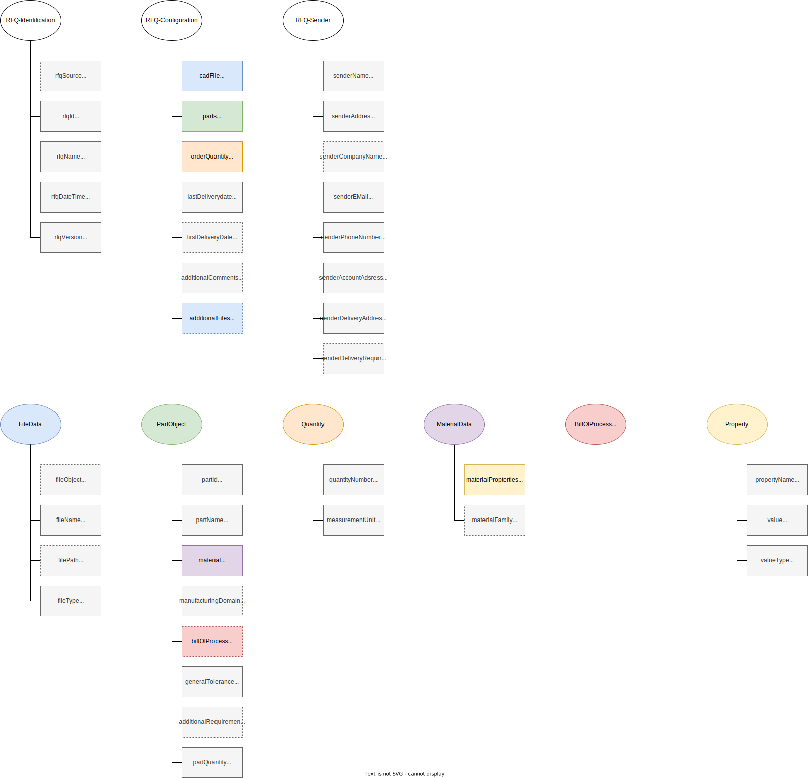
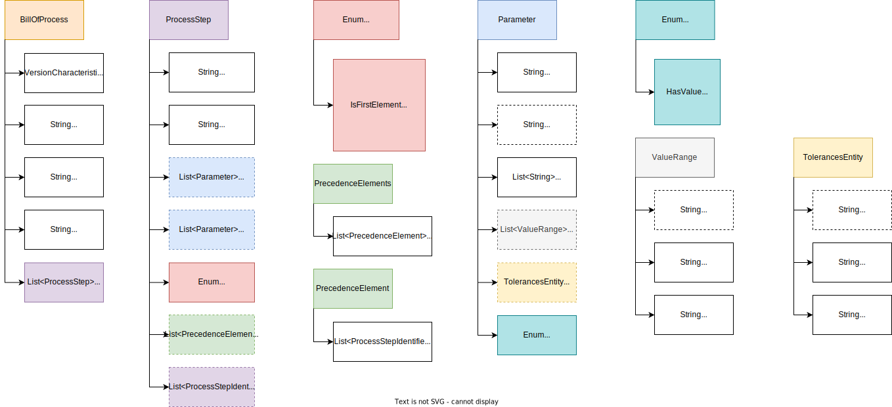
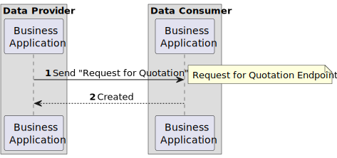

---
tags:
  - CAT/Business Application Provider
  - UC/MaaS
---

# CX-0129 Request for Quotation Exchange v2.0.1

## ABSTRACT

Manufacturing-as-a-Service (MaaS) scenarios focus on connecting buyers having a request for specific
manufacturing process steps or products to be manufactured with the appropriate  manufacturing
supplier, who has the corresponding capabilities and resources.

A Request for Quotation defines detailed requirements, deadlines and evaluation criteria for
obtaining quotations from potential manufacturers for specific products or services.

Sharing information about the demand with all required configuration and contact data is necessary
for potential suppliers to evaluate the request and formulate an offer.

A common description of the request for quotation based on a standardized semantic definition is
therefore key for facilitating such an information exchange between Catena-X participants. This
ensures an open network for every Catena-X member to join and enables interoperability between the
partners.

This document describes and standardizes the semantic model of Request for Quotation used in
Catena-X and the associated API.

## FOR WHOM IS THE STANDARD DESIGNED

The Request for Quotation standard is designed to benefit both manufacturing buyers and suppliers.
For buyers, it ensures that their request configuration is accurate and contains all necessary
product manufacturing information. Analogously, manufacturing suppliers benefit from this standard
through precise and unambiguous requirements and specifications and can therefore use the
formalization to make better decisions regarding cost, delivery date, and feasibility in a more
automated manner.

With this standard the buyer user can configure its request once and spread it within the Catena-X
network where every interested supplier is able to implement this standard and receive the request
in a Catena-X standardized format.

## COMPARISON WITH THE PREVIOUS VERSION OF THE STANDARD

In this version of the standard, the processes entity of the RequestForQuotation semantic model has
been replaced by the "Bill of Process" data model (cf. [Chapter 3.2](#32-aspect-model-bill-of-process)).

## 1 INTRODUCTION

### 1.1 AUDIENCE & SCOPE

> *This section is non-normative*

This standard is relevant for suppliers to be able to receive and assess in an automated manner a
manufacturing request coming from digital market-ecosystems. Buyers can use this standard to request
a manufacturing process and reach as many suppliers as possible over digital market-ecosystems.
Defining this standard should help integrate new interested parties on every level e.g. new buyer
applications, configuring a manufacturing request or new suppliers processing manufacturing
requests, represented as ODM platforms, supplier networks or single suppliers applications.

This standard is therefore relevant for the following roles :

- **Data Providers** willing to provide the necessary information about their manufacturing request
- **Data Consumers** interested in receiving and processing requests for products or components
- **Business Application Providers** interested in providing solutions implementing this standard

The scope of this standard is only the *Request-for-Quotation* aspect model and an API defining the
exchange of *Request-for-Quotation* data through a connector conformant to [[CX-0018]](#61-normative-references)  (e.g. Tractus-X EDC).

Only the initial exchange of the Request-for-Quotation from the buyer to the supplier is defined by
this standard. The subsequent steps of the bidding process happening in the later stages of the RFQ
communication (e.g. a response with an offer) are not in the scope of the standard.

### 1.2 CONTEXT AND ARCHITECTURE FIT

> *This section is non-normative*

In the context of MaaS, the buyer uses an application (e.g. MaaS Portal) to formalize his request.
To generate a new request, the buyer follows a defined workflow with uploading the required part
geometry via CAD file, defining material and selecting required manufacturing methods, including
additional post processes and quality definitions. Additional services for automated generation of a
Bill of Process (e.g. Process Derivation Service) may also be available. When processed, this
information is used for capability matchmaking (e.g. by a Manufacturing Network Registry) and
listing potential manufacturers, which are able to manufacture the part requested by the buyer. To
get in contact with a certain manufacturer, the required request information is formalized with the
standardized RFQ aspect model and sent to the respective supplier application via the standardized
RFQ API. The supplier application might be an ODM platform, a manufacturer network application, or a
single manufacturer application (e.g. ERP).

This necessary information, which is provided by the buyer to the supplier, is referred to as RFQ.
(Request for Quotation). This is the common usage of the RFQ in the context of MaaS. The contents of
the RFQ provides a detailed information about the requirements from the buyer side with respect to
the component that is needed. Upon receiving the buyer's RFQ, the manufacturer is able to analyze
the information provided in the standardized format and proceed to the bidding process.

*Figure 1* shows the high-level architecture of the *Request-for-Quotation*exchange in the Catena-X
dataspace and the central services that are involved. Both the data provider and the data consumer
must be members of the Catena X network in order to communicate with each other. With the help of
centrally managed Identity Access Management (IAM) each participant can authenticate itself, verify
the identity of the requesting party and decide whether to authorize the request.


*Figure 1: High-level architecture of the Request-for-Quotation exchange in the Catena-X network*

### 1.3 CONFORMANCE AND PROOF OF CONFORMITY

> *This section is non-normative*

As well as sections marked as non-normative, all authoring guidelines, diagrams, examples, and notes
in this specification are non-normative. Everything else in this specification is normative.
The key words **MAY**, **MUST**, **MUST NOT**, **OPTIONAL**, **RECOMMENDED**, **REQUIRED**,
**SHOULD** and **SHOULD NOT** in this document are to be interpreted as described in [BCP 14]
[[RFC2119]](#62-non-normative-references) [[RFC8174]](#62-non-normative-references) when, and only when, they appear in all capitals, as shown here.

All participants and their solutions will need to prove, that they are conform with the Catena-X
standards. To validate that the standards are applied correctly, Catena-X employs Conformity
Assessment Bodies (CABs). The proof of conformity for a single semantic model is done according to
the general rules for proving the conformity of data provided to a semantic model or the ability to
consume the corresponding data.

### 1.4 EXAMPLES

The following example shows a value-only JSON serialization of the Request-for-Quotation aspect model:

```json
{
  "rfqConfiguration": {
    "firstDeliveryDate": "2023-10-24",
    "additionalFiles": {
      "fileName": "Drehteil_technical",
      "fileObject": {},
      "fileType": "pdf",
      "filePath": "{{PATH_TO_ADDITIONAL_FILE}}"
    },
    "cadFile": {
      "fileName": "Drehteil",
      "fileObject": {},
      "fileType": "STEP",
      "filePath": "{{PATH_TO_CAD_FILE}}"
    },
    "additionalComments": "this is a prototype, recommendations towards design for manufacturing are highly welcome",
    "parts": {
      "generalTolerance": "ISO 2768-1 (m)",
      "processes": {
        "processStepIdentifier": "surfacefinishing_color",
        "subProcessSteps": {},
        "processProperties": {
          "value": "black",
          "propertyName": "color",
          "valueType": "string"
        }
      },
      "manufacturingDomain": "additive manufacturing",
      "material": {
        "materialFamily": "aluminum",
        "materialProperties": {
          "value": "2.7",
          "propertyName": "density",
          "valueType": "g/cm3"
        }
      },
      "partId": "Drehteil",
      "additionalRequirements": "premium quality check",
      "partQuantity": {
        "quantityNumber": 1,
        "measurementUnit": "unit:piece"
      },
      "partName": "Drehteil"
    },
    "orderQuantity": {
      "quantityNumber": 100,
      "measurementUnit": "unit:piece"
    },
    "lastDeliveryDate": "2023-12-24"
  },
  "rfqIdentification": {
    "rfqVersion": "1.0.0",
    "rfqName": "Drehteil",
    "rfqDateTime": "2023-10-24T14:48:54.709Z",
    "rfqSource": "https://maasportal.mendixcloud.com/",
    "rfqId": "Drehteil_02_0815"
  },
  "cxHeader": {
    "senderBpn": "BPNL7588787849VQ",
    "relatedMessageId": "d9452f24-3bf3-4134-b3eb-68858f1b2362",
    "expectedResponseBy": "2023-06-19T21:24:00+07:00",
    "context": "urn:samm:io.catenax.request_for_quotation:3.0.0",
    "messageId": "3b4edc05-e214-47a1-b0c2-1d831cdd9ba9",
    "receiverBpn": "BPNL6666787765VQ",
    "sentDateTime": "2023-06-19T21:24:00+07:00",
    "version": "urn:samm:io.catenax.shared.message_header:3.0.0"
  },
  "rfqSender": {
    "deliveryRequirements": "no plastic for packaging",
    "senderName": "John Doe",
    "senderAddress": "Sunstreet 1, 5555 Sunstate",
    "senderPhoneNumber": "555 123456",
    "senderEMail": "johndoe@sunny.com",
    "senderDeliveryAddress": "Mystreet 1, 1234 Mystate",
    "senderAccountAddress": "Accountstreet 1, 1234 Accountstate",
    "senderCompanyName": "ManufactureEnterprise"
  }
}
```

The following example shows a value-only JSON serialization of the Bill of Process aspect model:

```json
{
  "billOfProcessModel" : {
    "billOfProcessIdentification" : "box-with-lid-12345678-bill-of-process",
    "version" : "1.0.0",
    "productName" : "3D printed box with Lid",
    "productVersion" : "box-with-lid-1.0.0",
    "process" : [ {
      "processStepIdentifier" : [ "001_3D-print-parts" ],
      "processStepType" : "IsFirstElement",
      "capabilityId" : "urn:manufacturing-capability:capability:3d-printing",
      "precedenceRelation" : [ {
          "precedenceElements" : [ {
              "successor" : [ "002_screw_bolt_01", "003_screw_bolt_02" ]
          } ]
      } ]
    },
    {
      "processStepIdentifier" : [ "002_screw_bolt_01" ],
      "processStepType" : "IsLastElement",
      "capabilityId" : "urn:manufacturing-capability:capability:screwing",
      "inputParameters" : [ {
          "name" : "max_torque",
          "parameterKey" : "HasValue",
          "semanticReference" : [ "0173-1#02-ABK233#001" ],
          "value" : "10"
      } ],
      "outputParameters" : [ {
          "name": "max_torque",
              "parameterKey": "HasNoValue",
              "semanticReference": [ "0173-1#02-ABK233#001" ]
      } ]
    },
    {
      "processStepIdentifier" : [ "002_screw_bolt_02" ],
      "processStepType" : "IsLastElement",
      "capabilityId" : "urn:manufacturing-capability:capability:screwing",            
      "inputParameters" : [ {
          "name" : "max_torque",
          "parameterKey" : "HasValue",
          "semanticReference" : [ "0173-1#02-ABK233#001" ],
          "value" : "10"
      } ],
      "outputParameters" : [ {
          "name": "max_torque",
          "parameterKey": "HasNoValue",
              "semanticReference": [ "0173-1#02-ABK233#001" ]
      } ]
    }]
  }
}
```

### 1.5 TERMINOLOGY

> *This section is non-normative*

| Term | Description
| --- | ---
| Manufacturer | Organization providing a manufacturing service to others, such as milling or drilling.
| RFQ | Request for Quotation
| ODM | On demand manufacturing platform
| Product | A Product is a material good or an (immaterial) service offering which is an outcome (output product) or an input (input product) of a Process. Inherits relations from Entity and Asset.

Additional terminology used in this standard can be looked up in the glossary on the association homepage.

## 2 RELEVANT PARTS OF THE STANDARD FOR SPECIFIC USE CASES

> *This section is normative*

### 2.1 Request for Quotation

#### 2.1.1 LIST OF STANDALONE STANDARDS

The following Catena-X standards are prerequisite for the implementation of this standard and therefore
**MUST** be considered / implemented by the relevant parties specified in each of them.

| **Number** | **Standard** | **Version**
| --- | --- | ---
| [[CX-0001]](#61-normative-references) | EDC Discovery API | 1.0.2
| [[CX-0003]](#61-normative-references) | SAMM Aspect Meta Model | 1.1.0
| [[CX-0006]](#61-normative-references) | Registration and initial onboarding | 2.0.0
| [[CX-0010]](#61-normative-references) | Business Partner Number (BPN) | 2.0.0
| [[CX-0018]](#61-normative-references) | Dataspace Connectivity | 3.0.0

#### 2.1.2 DATA REQUIRED

No additional data requirements.

#### 2.1.3 POLICY CONSTRAINTS FOR DATA EXCHANGE

In alignment with our commitment to data sovereignty, a specific framework governing the utilization of data within the Catena-X use cases has been outlined.  As part of this data sovereignty framework, conventions for access policies, for usage policies and for the constraints contained in the policies have been specified in standard [CX-0152 Policy Constraints for Data Exchange](#61-normative-references). This standard document CX-0152 **MUST** be followed when providing services or apps for data sharing/consuming and when sharing or consuming data in the Catena-X ecosystem. What conventions are relevant for what roles named in [1.1 AUDIENCE & SCOPE](#11-audience--scope) is specified in the CX-0152 standard document as well.

#### 2.1.4 DIGITAL TWINS AND SPECIFIC ASSET IDs

This version of the document does not define any requirements for standardized integration and
governance of digital twins.

## 3 ASPECT MODELS

> *This section is* *normative*

### 3.1 ASPECT MODEL "Request for Quotation"

This section describes the "Request for Quotation" semantic model used in the Catena-X network.

#### 3.1.1 INTRODUCTION

A Request for Quotation defines detailed requirements, deadlines and evaluation criteria for
obtaining quotations from potential manufacturers for specific products or services. The provided
aspect model is automotive-agonistic, thus allowing for future integration and exchange with
non-automotive dataspaces. For the complete semantics and detailed description of its properties
refer to the SAMM model in [Chapter 3.1.5.1](#3151-rdf-turtle).

#### 3.1.2 SPECIFICATIONS ARTIFACTS

The modeling of the semantic model specified in this document was done in accordance to the
"semantic driven workflow" to create a submodel template specification [[SMT]](#62-non-normative-references).

This aspect model is written in SAMM 2.1.0 as a modeling language conformant to [[CX-0003]](#61-normative-references) as
input for the semantic driven workflow.

Like all Catena-X data models, this model is available in a machine-readable format on GitHub
conformant to [[CX-0003]](#61-normative-references).

#### 3.1.3 LICENSE

This Catena-X data model is made available under the terms of the Creative Commons Attribution 4.0
International (CC-BY-4.0) license, which is available at Creative Commons.

#### 3.1.4 IDENTIFIER OF SEMANTIC MODEL

The semantic model has the unique identifier

```text
   urn:samm:io.catenax.request_for_quotation:3.0.0
```

This identifier **MUST** be used by the data provider to define the semantics of the data being transferred.

#### 3.1.5 FORMATS OF SEMANTIC MODEL

##### 3.1.5.1 RDF TURTLE

The rdf turtle file, an instance of the Semantic Aspect Meta Model, is the master for generating
additional file formats and serializations.

> [https://github.com/eclipse-tractusx/sldt-semantic-models/blob/main/io.catenax.request_for_quotation/3.0.0/RequestForQuotation.ttl](https://github.com/eclipse-tractusx/sldt-semantic-models/blob/main/io.catenax.request_for_quotation/3.0.0/RequestForQuotation.ttl)

The open source command line tool of the Eclipse Semantic Modeling Framework is used for generation
of other file formats like for example a JSON Schema, aasx for Asset Administration Shell Submodel
Template or a HTML documentation.

Figure 2 shows all properties of the aspect model:

*Figure 2: Properties defined in the Request for Quotation aspect model*

##### 3.1.5.2 JSON SCHEMA

A JSON Schema **MUST** be generated from the RDF Turtle file. The JSON Schema defines the Value-Only
payload of the Asset Administration Shell for the API operation *"GetSubmodel"*.

##### 3.1.5.3 AASX

An AASX file **MUST** be generated from the RDF Turtle file. The AASX file defines one of the requested
artifacts for a Submodel Template Specification conformant to [[SMT]](#62-non-normative-references).

### 3.2 ASPECT MODEL "Bill of Process"

This section describes the "Bill of Process" semantic model used in the Catena-X network.

#### 3.2.1 INTRODUCTION

The bill of process aspect model is a data model that can be utilised to describe and exchange
information about the manufacturing process of a product between partners. The aspect model can be
used to represent a wide variety of (industrial) processes from different sectors and isn't limited
to the automotive industry. The purpose of this model is to specify an extended precedence graph
that features the parameter flow between individual process steps. The model is a shared aspect to
be included in other aspect models and is referenced within the RFQ data model described above, the
Shop Floor Information Service Production Tracking data model defined in [[CX-0142]](#61-normative-references) and the
Manufacturing Capability data model defined in [[CX-0115]](#61-normative-references). For the complete semantics and detailed
description of its properties refer to the SAMM modelin [Chapter 3.2.5.1](#3251-rdf-turtle).

#### 3.2.2 SPECIFICATIONS ARTIFACTS

The modeling of the semantic model specified in this document was done in accordance to the
"semantic driven workflow" to create a submodel template specification [[SMT]](#62-non-normative-references).

This aspect model is written in SAMM 2.1.0 as a modeling language conformant to [[CX-0003]](#61-normative-references) as
input for the semantic driven workflow.

Like all Catena-X data models, this model is available in a machine-readable format on GitHub
conformant to [[CX-0003]](#61-normative-references).

#### 3.2.3 LICENSE

This Catena-X data model is made available under the terms of the Creative Commons Attribution 4.0
International (CC-BY-4.0) license, which is available at Creative Commons.

#### 3.2.4 IDENTIFIER OF SEMANTIC MODEL

The semantic model has the unique identifier

```text
   urn:samm:io.catenax.shared.bill_of_process:1.1.0
```

This identifier **MUST** be used by the data provider to define the semantics of the data being transferred.

#### 3.2.5 FORMATS OF SEMANTIC MODEL

##### 3.2.5.1 RDF TURTLE

The rdf turtle file, an instance of the Semantic Aspect Meta Model, is the master for generating
additional file formats and serializations.

> [https://github.com/eclipse-tractusx/sldt-semantic-models/blob/main/io.catenax.shared.bill_of_process/1.1.0/BillOfProcessSharedAspect.ttl](https://github.com/eclipse-tractusx/sldt-semantic-models/blob/main/io.catenax.shared.bill_of_process/1.1.0/BillOfProcessSharedAspect.ttl)

The open source command line tool of the Eclipse Semantic Modeling Framework is used for generation
of other file formats like for example a JSON Schema, aasx for Asset Administration Shell Submodel
Template or a HTML documentation.

Figure 3 shows all properties of the aspect model:

*Figure 3: Properties defined in the Bill of Process aspect model*

For more detailed information, including specific JSON examples for different cases and additional graphics to further aid in understanding and utilizing the data model, please refer to the README that accompanies the data model: [https://github.com/eclipse-tractusx/sldt-semantic-models/blob/main/io.catenax.shared.bill_of_process/1.0.0/README.md](https://github.com/eclipse-tractusx/sldt-semantic-models/blob/main/io.catenax.shared.bill_of_process/1.0.0/README.md)

The following table provides an overview of all fields, their properties and example values:

|Field|Level|REQUIRED|Purpose|Data Type|Example Value (JSON)
|--- |--- |--- |--- |--- |---
|version|BillOfProcess|mandatory|version of the bill of process model used for compatibility checks|VersionCharacteristic|`"version": "1.0.0"`
|billOfProcessIdentifier|BillOfProcess|mandatory|unique identifier for a bill of process that can be used to reference instances|String|`"billOfProcessIdentifier": "www.1234-bar-chair-billOfProcess.de"`
|productName|BillOfProcess|mandatory|name of the product whose production steps are specified within the bill of process|String|`"productName": "Bar Chair"`
|productVersion|BillOfProcess|mandatory|version of the product whose manufacturing steps are specified with the bill of process|String|`"productVerseion": "bar_chair_1.0.0"`
|process|BillOfProcess|mandatory|list that contains all manufacturing steps of a product, where each manufacturing step refers to exactly one capability. This list contains all process steps that are required to manufacture the product|ProcessStep|Due to limited space refer to [Chapter 1.4](#14-examples)
|processStepIdentifier|ProcessStep|mandatory|unique identifier for a specific process step|String|`"processStepIdentifier": "1234-transport"`
|capabilityReference|ProcessStep|mandatory|reference that points to a manufacturing capability that must be performed on a product to accomplish the corresponding process step|String|`"capabilityReference": "urn:manufacturing-capability:capability:42"`
|inputParameters|ProcessStep|optional|list of parameters that are required to execute the corresponding process step|Parameter|Due to limited space refer to [Chapter 1.4](#14-examples)
|outputParameters|ProcessStep|optional|list of parameters that are returned from the process step and can be used as inputParameters for subsequent steps|Parameter|Due to limited space refer to [Chapter 1.4](#14-examples)
|processStepType|ProcessStep|mandatory|distinguishes process steps based on whether there are the first or last process step to be executed, a regular process step or if they are a subprocess step, which subdivides a higher-level process step into smaller process steps. Possibile values: IsFirstElement, IsLastElement, IsProcessElement, IsSubProcessElement.|Enum|`"processStepType": "IsFirstElement"`
|precedenceRelation|ProcessStep|optional|list of alternative process steps from which the manufacturer has to select exactly one step to be executed. In case there are no alternative process steps, the list features only one element. In case of the last element, the property is not used, since the process step has no successor.|PrecedenceElements|JSON-Examples for Precedence Relations
|childProcessStep|ProcessStep|optional|list of child processes that need to be executed to complete the parent process step. It enables the expression of hierarchies between capabilities, e.g. a transport capability needs to execute at least a pick, a move and a place capability.|processStepIdentifier|`"childProcessSteps": [            "pick", "move", "place" ]`
|precedenceElements|PrecedenceElements|mandatory|list of process steps that must be executed in parallel|PrecedenceElement|JSON-Examples for Precedence Relations
|successor|PrecedenceElement|mandatory|list of subsequent process step which can be executed in any order|processStepIdentifier|`"successor" : [ "5678-milling" ]`
|name|Parameter|mandatory|name of the parameter|String|`"name": "volume"`
|value|Parameter|optional|value of the parameter|String|`"value": "{\"height\" : \"5\", \"length\" : \"3\", \"width\" : \"7\"}"`
|semanticReference|Parameter|mandatory|reference to a semantic namespace in which the type of the parameter is defined|String|`"semanticReference": [ "0173-1#02-AAZ883#001" ]`
|valueRangeList|Parameter|optional|list with value ranges for a parameter|ValueRange|Due to limited space refer to [Chapter 1.4](#14-examples)
|tolerances|Parameter|optional|list with tolerances for a parameter|TolerancesEntity|Due to limited space refer to [Chapter 1.4](#14-examples)
|parameterKey|Parameter|mandatory|enumeration that is used to distinguish whether the parameter has no value, has a value, has a value range or has a value with tolerances. Possible values: HasValue, HasNoValue, HasValueRange, HasTolerances.|Enum|`"parameterKey": "HasNoValue"`
|name|ValueRange|optional|name of the (sub-)parameter to which the value range applies|String|`"name": "height"`
|lowerValue|ValueRange|mandatory|lower boundary of a value range item|String|`"lowerValue": "12"`
|upperValue|ValueRange|mandatory|upper boundary for a value range item|String|`"upperValue": "36"`
|name|TolerancesEntity|optional|name of the (sub-)parameter to which the tolerances apply|String|`"name": "height"`
|lowerLimit|TolerancesEntity|mandatory|lower direct limit of the tolerance|String|`"lowerLimit": "4.9"`
|upperLimit|TolerancesEntity|mandatory|upper direct limit of the tolerance|String|`"upperLimit": "5.1"`

##### 3.2.5.2 JSON SCHEMA

A JSON Schema **MUST** be generated from the RDF Turtle file. The JSON Schema defines the Value-Only
payload of the Asset Administration Shell for the API operation *"GetSubmodel"*.

##### 3.2.5.3 AASX

An AASX file **MUST** be generated from the RDF Turtle file. The AASX file defines one of the requested
artifacts for a Submodel Template Specification conformant to [[SMT]](#62-non-normative-references).

## 4 APPLICATION PROGRAMMING INTERFACES

> *This section is normative*

### 4.1 "Request for Quotation" API

The Request for Quotation API defined in this section enables the exchange of the *Request for
Quotation* data between Catena-X participants in an interoperable manner. *Figure 4* shows a high
level overview of the intended data exchange flow.


*Figure 4: Request for Quotation data exchange overview*

The API relies on synchronous communication between the involved parties.

1. A data exchange is initiated by the data provider (buyer) sending a POST request to the data
   consumer (supplier) to create a Request For Quotation.
2. Upon receiving a valid request, the consumer (supllier) sends back a `201 Created` response to
   indicate that the Request For Quotation has been successfully created.

#### 4.1.1 PRECONDITIONS AND DEPENDENCIES

To participate in the Catena-X dataspace, both the data consumer and the data provider **MUST** be
registered and onboarded as defined in [[CX-006]](#61-normative-references).

A dataspace connector conformant to [[CX-0018]](#61-normative-references) **MUST** be used
to make the Request for Quotation API available to network participants.

The API endpoint defined in [Chapter 4.1.2.1](#4121-api-endpoints--resources) **MUST** therefore be offered as Data Asset/Contract
Offer as defined in [[CX-0018]](#61-normative-references).

#### 4.1.2 API SPECIFICATION

##### 4.1.2.1 API Endpoints & Resources

To support the exchange of Request For Quotation data, a supplier acting as a data consumer **MUST**
define a single endpoint supporting the HTTP POST request method as described in [RFC9110](#62-non-normative-references). The
structure of the endpoint **MAY** be freely chosen. The address of the endpoint **MUST** be provided
as part of the connector data asset defined in [Chapter 4.1.3](#413-connector-data-asset-structure) of this document.

##### 4.1.2.2 Available Data Types

The API **MUST** use JSON as the payload transported via HTTPS.

#### 4.1.3 CONNECTOR DATA ASSET STRUCTURE

The endpoint introduced in [Chapter 4.1.2](#412-api-specification) **MUST NOT** be called from a buyer directly. Rather, this
**MUST** be called via a connector conformant to [[CX-0018]](#61-normative-references). Therefore, the endpoint **MUST** be offered as
a connector data asset. To make this assets easily identifiable in the connector's catalog, it **MUST** be
configured with a set of properties as defined in the table below.

| Object | Property | Purpose | Usage & Constraints
| --- | --- | --- | ---
| |***@id*** | Identifier of the asset.  | The asset ID **MUST** be unique and therefore **MUST NOT** be reused elsewhere.
| properties | **`http://purl.org/dc/terms/type`** | Defines the "Request for Quotation API Endpoint" according to the Catena-X taxonomy.| **MUST** be set to `{"@id": "https://w3id.org/catenax/taxonomy#RequestForQuotationApi"}` to allow filtering the data assets catalog for the respective Request for Quotation API endpoint .
| properties | **`https://w3id.org/catenax/ontology/common#version`**| The version of the standard defining the implemented API.| **MUST** correspond to the version of the standard defining the "Request for Quotation API". The value **MUST** be set to `2.0` for APIs implementing this standard.
| dataAddress | **@type** | Type of the DataAddress node.| **MUST** be set to "`DataAddress`".
| dataAddress | ***baseUrl*** | Defines the HTTPS endpoint of the corresponding "Request for Quotation API Endpoint". | The `{{REQUEST_FOR_QUOTATION_API_ENDPOINT}}` refers to an URL under which the API endpoint is available. HTTPS transport protocol **MUST** be used.
| dataAddress | ***proxyBody*** | Defines whether the endpoint allows to proxy the HTTPS body.| **MUST** be set to `"true"` to allow the API endpoint to receive a HTTPS body via the HTTPS request.
| dataAddress | ***proxyMethod*** | Defines whether the endpoint allows to proxy the HTTPS method.| **MUST** be set to `"true"` to allow the API endpoint to also receive POST requests.
| dataAddress | ***type*** | Defines the type of data plane extension handling the data exchange.| **MUST** be set to `"HttpData"` to provide an API via an HTTPS proxy endpoint.

When searching the data assets catalog of a data consumer (MaaS supplier), a data provider (MaaS buyer)
**SHOULD** use the following properties AND their values to identify the data asset specifying the
Request for Quotation API endpoint described in [Chapter 4.1.2](#412-api-specification).

| Property                                 | Value
| ---------------------------------------- | ---------------------------------
| properties.***dct:type***   | `{"@id": "https://w3id.org/catenax/taxonomy#RequestForQuotationApi"}`

The API version described in this standard document **MUST** be published in the in the property
`https://w3id.org/catenax/ontology/common#version` as version `2.0` in the asset. The requester of an
asset **MUST** be able to handle multiple assets for this endpoint, being differentiated only by the
version. The requester **SHOULD** choose the asset with the highest compatible version number
implemented by themselves. If the requester cannot find a compatible version with their own, the
requester **MUST** terminate the data transfer."

An example connector data asset definition is given below.

> Note: Expressions in double curly braces \{\{\}\} must be substituted with a corresponding value.

```json
{
  "@context": {
    "@vocab": "https://w3id.org/edc/v0.0.1/ns/",
    "cx-taxo": "https://w3id.org/catenax/taxonomy#",
    "cx-common": "https://w3id.org/catenax/ontology/common#",
    "dct": "https://purl.org/dc/terms/"
  },
  "@id": "{{REQUEST_FOR_QUOTATION_API_ASSET_ID}}",
  "properties": {
    "dct:type": {
      "@id": "cx-taxo:RequestForQuotationApi"
    },
    "cx-common:version": "2.0",
    "description": "Request for Quotation API Endpoint"
  },
  "dataAddress": {
    "@type": "DataAddress",
    "type": "HttpData",
    "proxyBody": "true",
    "proxyMethod": "true",
    "baseUrl": "{{REQUEST_FOR_QUOTATION_API_ENDPOINT}}"
  }
}
```

#### 4.1.4 ERROR HANDLING

The API endpoint defined in [Chapter 4.1.2.1](#4121-api-endpoints--resources) **MUST** respond to incoming requests with HTTP status
codes as described in [RFC9110](#62-non-normative-references). All of the following HTTP status codes, except for codes `200` and
`201`, **MUST** be interpreted as failures. Therefore, it may be sufficient for a business
application to simply check if the status code is `200` or `201` or not. If not, the request failed.

| HTTP Status Code | HTTP Status Message  | Description
| --- | --- | ---
| 200| OK| The request has succeeded. The RequestForQuotation has been successfully processed in the backend system.
| 201| Created| The request has succeeded and has led to the creation of a new RequestForQuotation in the backend system.
| 400| Bad request| The server cannot or will not process the request due to something that is perceived to be a client error (e.g., malformed request syntax, invalid request message framing, or deceptive request routing).
| 401| Unauthorized||
| 403| Forbidden| The RequestForQuotation in question is not available for the client (e.g. it belongs to a different company)
| 405| Method not allowed   | The method used to request the data was not POST
| 422| Unprocessable Entity | The request was well-formed but was unable to be followed due to semantic errors, e.g. the JSON payload could not be parsed.
| 502| Service Unavailable  ||

If one `RequestForQuotation` aspect is transmitted in one HTTP request, the return codes **MUST** be
used as stated in the table above.

If a list of multiple `RequestForQuotation` aspects is transmitted in one HTTP request, the status
code `400` **MUST** be used if at least one `RequestForQuotation` in the list cannot be processed.
Applications **MAY** choose to process valid entries from a list which also contains invalid
entries. If a list of multiple `RequestForQuotation` aspects is transmitted in one HTTP request, and
all of them can be processed successfully, the status code `200` **MUST** be used.

The return codes `401`, `405`, `422` and `503` in the table above **MAY** also be applicable to a list of
multiple `RequestForQuotation` aspects.

Further status codes may be included in a later revision of this standard. The ability to send and
receive one status code per sent or received list item might be included in a later revision of this
standard.

#### 4.1.5 Data Exchange

The `RequestForQuotation` data **MUST** be sent from the buyer to the supplier using an HTTP POST
request. The data format described here **MUST** be followed for the exchange of the information needed
for quotation.

Multiple `RequestForQuotation` aspects **MAY** be sent in one transfer as a JSON list. If only one
`RequestForQuotation` aspect is transmitted, it **MUST** still be sent as a list with one entry.

The serialized JSON **MUST NOT** be larger than 15 MiB in size.

The `RequestForQuotation` endpoint **MUST** be implemented by all participants who wish to participate
in Catena-X MaaS as a supplier. Buyers **MUST** be able to send requests for quotations and the
therefore needed information to the suppliers.

The data payload itself **MUST** be a valid JSON string.

All attributes marked as mandatory in RFQ aspect model **MUST** be included in the dataset.
Attribute marked as ' Optional' can be included in the data set.

The usage of the attributes in the data model **MUST** follow the attribute descriptions in the
definitions of the RFQ aspect model.

## 5 PROCESSES

> *This section is* *normative*

Not applicable.

## 6 REFERENCES

### 6.1 NORMATIVE REFERENCES

> *This section is* *normative*

| **Number** | **Standard** | **Version**
| --- | --- | ---
| [CX-0001] | EDC Discovery API | 1.0.2
| [CX-0003] | SAMM Aspect Meta Model | 1.1.0
| [CX-0006] | Registration and initial onboarding | 2.0.0
| [CX-0010] | Business Partner Number (BPN) | 2.0.0
| [CX-0018] | Dataspace Connectivity | 3.0.0
| [CX-0115] | Manufacturing Capability Exchange | 1.0.0
| [CX-0142] | Shop Floor Information Service  | 1.0.0
| [CX-0152] | Policy Constraints For Data Exchange | 1.0.0 |

### 6.2 NON-NORMATIVE REFERENCES

> *This section is non-normative*

| **Context** | **Link**
| --- | ---
| [CX-OMW] | Catena-X Operating Model Whitepaper. Download from: https://catena-x.net/fileadmin/user_upload/Publikationen_und_WhitePaper_des_Vereins/CX_Operating_Model_Whitepaper_02_12_22.pdf
| [ISO8601] | ISO 8601: Date and time format
| [RFC2119] | Bradner, S. Key words for use in RFCs to Indicate Requirement Levels. Available online: https://datatracker.ietf.org/doc/html/rfc2119
| [RFC8174] | Leiba, B. Ambiguity of Uppercase vs Lowercase in RFC 2119 Key Words. Available online: https://datatracker.ietf.org/doc/html/rfc8174
| [RFC9110] | HTTP Semantics (https://www.rfc-editor.org/rfc/rfc9110)
| [SMT] | How to create a submodel template specification. Guideline. Download from: https://industrialdigitaltwin.org/wp-content/uploads/2022/12/I40-IDTA-WS-Process-How-to-write-a-SMT-FINAL-.pdf

### 6.3 REFERENCE IMPLEMENTATIONS

> *This section is non-normative*

Not applicable.

## Legal

Copyright © 2025 Catena-X Automotive Network e.V. All rights reserved. For more information, please visit [here](/copyright).
