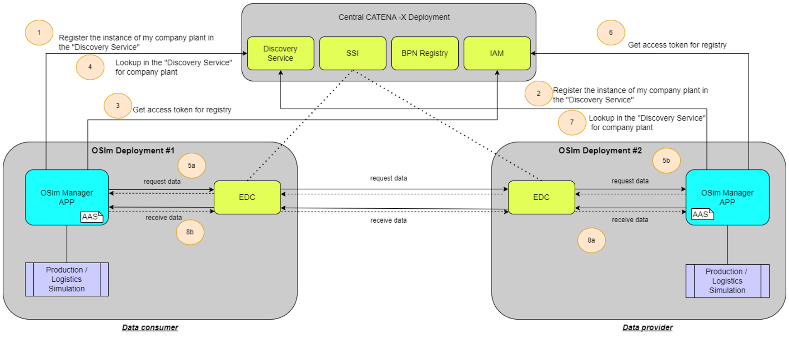
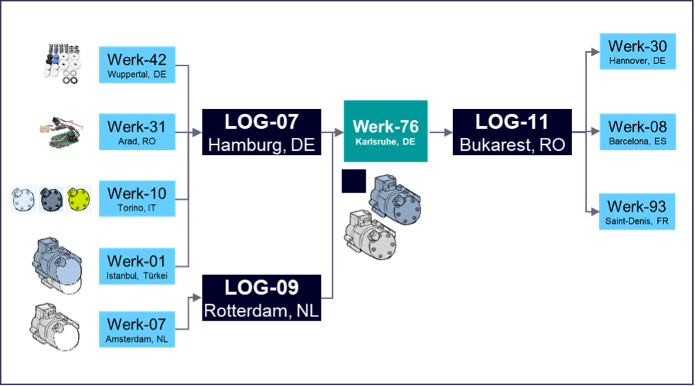
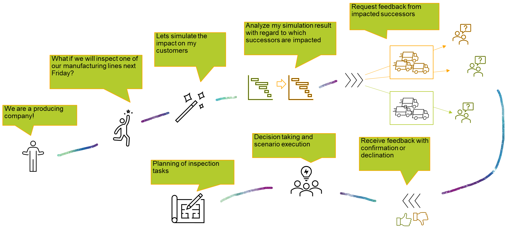
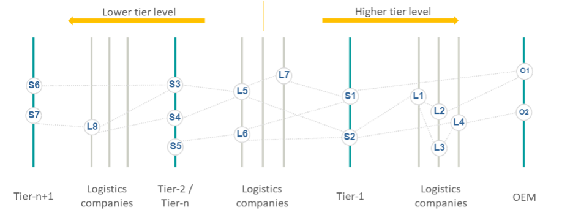
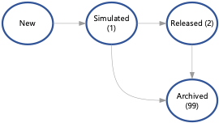
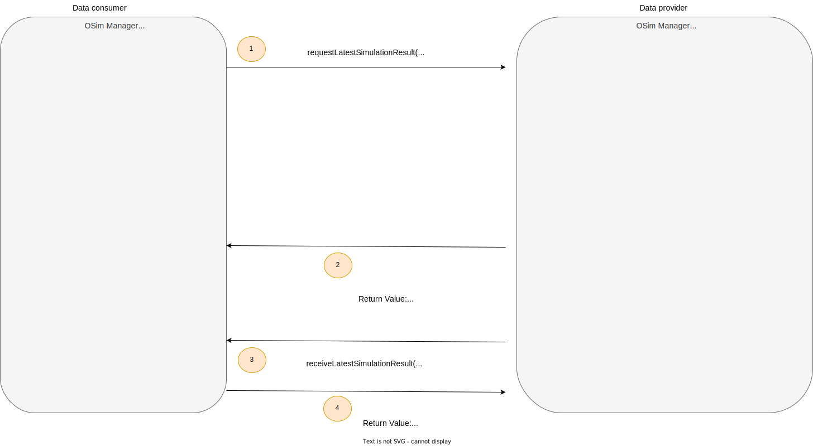
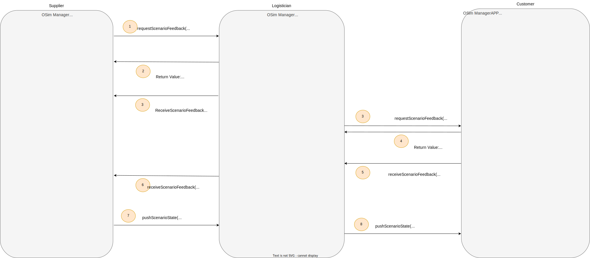

---
tags:
  - CAT/Business Application Provider
  - UC/OSIM
---

# CX-0133 Online Control and Simulation 2.0.1

## ABSTRACT

The simulation results of the Catena-X partners on the lower tier level and logistics, together with data of the company's own operations are fed into the individual simulation model as input. Considering both, plannable and unforeseeable influencing factors, this simulation model is iterated through as often as necessary until an optimal production schedule is reached and a simulation result is created. Sharing of simulation results to the next tier level is the base of the collaborative simulation approach in a short-term horizon, across the complete supply chain.

This basic data exchange is based on a real production state and current planning. Additionally, a further functionality allows to operate with potentially changed situations in production or changed requirements. So called "What-If" scenarios" can be initiated and communicated to the supply chain partners confirming the feasibility.

## FOR WHOM IS THE STANDARD DESIGNED

## COMPARISON WITH THE PREVIOUS VERSION OF THE STANDARD

- Updated references to new versions
- Providers must ensure BPNL provisioning to OSim

## DISCLAIMER REGARDING ONLINE CONTROL AND SIMULATION DATA EXCHANGE

This document describes and standardizes certain data exchange business processes, data models and/or APIs in connection with Online Control and Simulation (OSim) solution based on the Catena-X data ecosystem. Nothing in this document is meant to determine the contractual terms and conditions for the purchase, supply, delivery or licensing of any products or services among the participants of the OSim data exchange. These terms and conditions are separately negotiated and agreed among suppliers and customers in individual purchase, supply or license agreements. In case of any inconsistencies with the content of this document, the provisions of individual agreements among the participants shall prevail over the content of this document.

## 1 INTRODUCTION

### 1.1 AUDIENCE & SCOPE

> *This section is non-normative*

This standard is relevant for:

- Business Application Provider
- Data Provider / Consumer

This document describes the process of exchange of simulation results as well as scenario data information.

- The MaterialFlowSimulationResult object will be sent by OSim partner to another OSim partner on a higher tier level. OSim partner can be a producing company as well as a logistics company. Every MaterialFlowSimulationResult includes information about delivery readiness of packaged material goods, like material identifier, amount, delivery time and destination. The data provider needs to be able to create MaterialFlowSimulationResult and the receiver need to be able to interpret them. The data receiver needs to be able to use the MaterialFlowSimulationResult of lower tier partners as input for its own simulation.
- The MaterialFlowScenarioRequest object will be sent by OSim partner to another OSim partner at the next level (up and down). OSim partner can be a producing company as well as a logistics company. Every MaterialFlowScenarioRequest includes information about scenario header, scenario parameter and two simulation results - one for the initial flow and another one for the updated flow. Every simulation result includes equivalent information as the previously mentioned MaterialFlowSimulationResult object. The data provider needs to be able to create MaterialFlowScenarioRequest and the receiver need to be able to interpret them. The data receiver needs to be able to use the MaterialFlowScenarioRequest as input for its own simulation in scenario context.

Information regarding the data models is described in Chapter [3. ASPECT MODELS](#3-aspect-models)

Information regarding processing of this data models is described in Chapter [4. APPLICATION PROGRAMMING INTERFACES](#4-application-programming-interfaces)

### 1.2 CONTEXT AND ARCHITECTURE FIT

> *This section is non-normative*

Simulation is an important aspect of Supply Chain Management, as it allows a better precision of significance for the ability to deliver. OSim enables the exchange of simulation results between the partners extending the today’s scope of siloed simulations.

The core business logic described in this document enables companies to share data in a sovereign way as well as to utilize a common process understanding, ensuring interoperability and enabling the involved parties to achieve the following goals:

- Collaborative simulation over the supply chain (Basic flow)
- "What-If" triggered scenarios (Scenario flow)
- Early reaction to delivery problems
- Early response to changes in customer requirements
- Early consideration of external disturbances/events on the process
- Validation of potential changes in advance of implementation

The following picture depicts the rough architecture of OSim:



This standardization defines the data models MaterialFlowSimulationResult and MaterialFlowScenarioRequest for the Catena-X network. This standard ensures that information out of these models can be consumed through the Catena-X network by all OSim partners and ensures, that the data objects from different OSim partner can be handled and interpreted in an identical manner.

Moreover this standardization defines the APIs requestLatestSimulationResult, receiveLatestSimulationResult, requestScenarioFeedback, receiveScenarioFeedback, pushScenarioState for processing and exchange of simulation results to ensure a consistent data exchange and data consumption through EDC between the OSim participants using the reverse proxy functionality. Thereby an identical interpretation of the data across companies is ensured.

### 1.3 CONFORMANCE AND PROOF OF CONFORMITY

> *This section is non-normative*

```text
    As well as sections marked as non-normative, all authoring guidelines, diagrams, examples, and notes
    in this specification are non-normative. Everything else in this specification is normative.

    The key words **MAY**, **MUST**, **MUST NOT**, **OPTIONAL**, **RECOMMENDED**, **REQUIRED**, **SHOULD**
    and **SHOULD NOT** in this document document are to be interpreted as described in BCP 14 [RFC2119] [RFC8174]
    when, and only when, they appear in all capitals, as shown here.

    All participants and their solutions will need to prove, that they are conform with the Catena-X standards.
    To validate that the standards are applied correctly, Catena-X employs Conformity Assessment Bodies (CABs).

```

1. **Requirement for Conformity**: All participants and their respective solutions are required to demonstrate conformity to the Catena-X standards.

1. **Validation Mechanism**: To ensure the proper adherence to these standards, Catena-X has authorized Conformity Assessment Bodies (CABs) to carry out the validation process.

1. **Conformity Proof for Semantic Model**: The confirmation of adherence for a single semantic model follows the general rules for proving the conformity of data provided to a semantic model or the capability to utilize the associated data.

1. **Submission Requirements**: To authenticate their conformity, participants are to submit to the conformity assessment body the following:

   - An example 'requestLatestSimulationResult' JSON generated by their solution.
   - An example 'receiveLatestSimulationResult' JSON produced by their solution.
   - An example 'requestScenarioFeedback' JSON produced by their solution.
   - An example 'receiveScenarioFeedback' JSON produced by their solution.
   - An example 'pushScenarioState' JSON produced by their solution.
   - A verification that their solution can handle the example payload JSON as specified below.

1. **Certification Process**: Should an assessee seek certification, they must produce a formal letter affirming their compliance with this standard. This letter should be signed by an individual possessing full power of attorney

### 1.4 EXAMPLES

#### 1.4.1 Process Examples

##### 1.4.1.1 Basic flow

The following example shows a basic exchange of simulation results in the OSim partner network of the manufacturing company Werk-76.



A request is made from Werk-76 to the logistics company Log-07 as to whether a newer simulation result is available. The logistics company Log-07 then transmits directly its latest simulation results to the data recipient Werk-76, filtered to the records relevant to Werk-76. In case no simulation result is currently available, Log-07 sends a dedicated return value to the data consumer.

Note: Generally, it is up to the data provider to decide when its own simulation will be run, and with this a new simulation result will be generated. Accordingly, it is always in the hands of data consumer to ask for newer simulation results using the API described in OSim API

Now, taking into account the values received from the direct partners (including the simulation results from LOG-07), the company Werk-76 can run a material flow simulation of its own production, check the results and repeat the simulation if necessary. Subsequently, Werk-76 releases its own simulation results so that they can be queried by the partners of the higher tier level in the supply-chain.

##### 1.4.1.2 Scenario flow

The following picture shows an example for one possible flow of OSim Scenario Management. In this example a supplier wants to verify the impact on his successors in case of potential stop of one manufacturing line for maintenance next Friday.



In scenario management, a distinction is made between 4 different types of scenarios:

- The data flow from suppliers to customers
- The data flow from customers to suppliers
- The data flow from the logistician to the customer
- The data flow from the logistician to the supplier

In this way every OSim network partner can initiate a "What-If" scenario.

In the example above the request is made by a supplier, who is simulating the impact on the own production and sending a request for confirmation to the affected partner. This partner can evaluate the own impact using the simulation capabilities and send a reply to the scenario initiator. Alternatively, he could also forward the scenario request to the next level in the supply chain.

Thus, the principle of scenario management is a sequence of requests, each of which is acknowledged with confirmation.

#### 1.4.2 Data Model

##### 1.4.2.1 Basic Flow

The following data set shows an example for a MaterialFlowSimulationResult which will be sent to the endpoint receiveLatestSimulationResult ( see API description [4.3 "RECEIVE LATEST SIMULATION RESULT" API](#43-receive-latest-simulation-result-api) ).

```json
{
  "materialFlowSimulationResult": {
    "owner": {
      "bpnsProperty": "BPNS0123456789ZZ"
    },
    "dataQuality": 0,
    "description": "Please simulate asap",
    "comment": "successful simulation ",
    "expirationTimestamp": "2023-03-24T09:15:24.000Z",
    "runId": "0fece48b-c8d1-4180-1a9caca6d67e",
    "shipments": [
      {
        "handlingUnits": [
          {
            "name": "Palette",
            "volume": 1,
            "weight": 189,
            "batches": [
              {
                "unitOfMeasurement": "KG",
                "materialName": "KK1000GR-Gehäuse-Rot",
                "quantity": 0,
                "materialNumber": "KK1000GR",
                "materialHazardousGoods": false,
                "batchSerialNumber": "Batch_1",
                "batchOrderId": "Order-0001",
                "batchExpirationTimestamp": "2023-08-22T16:00:00.000Z",
                "batchNumber": "45"
              }
            ],
            "handlingUnitId": "HUT_1",
            "amount": 1
          }
        ],
        "shipmentId": "DE51515151",
        "recipientTimestampPlanned": "2023-04-19T09:00:00.000Z",
        "destination": {
          "bpnsProperty": "BPNS0123456789ZZ"
        },
        "recipient": {
          "bpnsProperty": "BPNS0123456789ZZ"
        },
        "logistics": {
          "bpnsProperty": "BPNS0123456789ZZ"
        },
        "preceding": {
          "bpnsProperty": "BPNS0123456789ZZ"
        },
        "splittingAllowed": true,
        "destinationTimestamp": "2023-03-19T09:00:00.000Z"
      }
    ],
    "timestamp": "2023-03-09T14:13:42.806Z"
  }
}
```

##### 1.4.2.2 Scenario flow

The following data set shows an example for a MaterialFlowScenarioRequest which will be sent to the endpoint *requestScenarioFeedback* ( see API description [4.4 "REQUEST SCENARIO FEEDBACK" API](#44-request-scenario-feedback-api) ).

```json
{
  "materialFlowScenarioRequest": {
    "scenarioSimResults": {
      "resultOwnId": "916b5688-8bd8-4d7e-83b9-e0d40939274e",
      "resultOwnSimRunInitial": {
        "owner": {
          "bpnsProperty": "BPNS0123456789ZZ"
        },
        "dataQuality": 0,
        "description": "Please simulate asap",
        "comment": "successful simulation ",
        "expirationTimestamp": "2023-03-24T09:15:24.000Z",
        "runId": "0fece48b-c8d1-4180-1a9caca6d67e",
        "shipments": [
          {
            "handlingUnits": [
              {
                "name": "Palette",
                "volume": 1,
                "weight": 189,
                "batches": [
                  {
                    "unitOfMeasurement": "KG",
                    "materialName": "KK1000GR-Gehäuse-Rot",
                    "quantity": 0,
                    "materialNumber": "KK1000GR",
                    "materialHazardousGoods": false,
                    "batchSerialNumber": "Batch_1",
                    "batchOrderId": "Order-0001",
                    "batchExpirationTimestamp": "2023-08-22T16:00:00.000Z",
                    "batchNumber": "45"
                  }
                ],
                "handlingUnitId": "HUT_1",
                "amount": 1
              }
            ],
            "shipmentId": "DE51515151",
            "recipientTimestampPlanned": "2023-04-19T09:00:00.000Z",
            "destination": {
              "bpnsProperty": "BPNS0123456789ZZ"
            },
            "recipient": {
              "bpnsProperty": "BPNS0123456789ZZ"
            },
            "logistics": {
              "bpnsProperty": "BPNS0123456789ZZ"
            },
            "preceding": {
              "bpnsProperty": "BPNS0123456789ZZ"
            },
            "splittingAllowed": true,
            "destinationTimestamp": "2023-03-19T09:00:00.000Z"
          }
        ],
        "timestamp": "2023-03-09T14:13:42.806Z"
      },
      "resultOwnSimRunUpdated": {
        "owner": {
          "bpnsProperty": "BPNS0123456789ZZ"
        },
        "dataQuality": 0,
        "description": "Please simulate asap",
        "comment": "successful simulation ",
        "expirationTimestamp": "2023-03-24T09:15:24.000Z",
        "runId": "0fece48b-c8d1-4180-1a9caca6d67e",
        "shipments": [
          {
            "handlingUnits": [
              {
                "name": "Palette",
                "volume": 1,
                "weight": 189,
                "batches": [
                  {
                    "unitOfMeasurement": "KG",
                    "materialName": "KK1000GR-Gehäuse-Rot",
                    "quantity": 0,
                    "materialNumber": "KK1000GR",
                    "materialHazardousGoods": false,
                    "batchSerialNumber": "Batch_1",
                    "batchOrderId": "Order-0001",
                    "batchExpirationTimestamp": "2023-08-22T16:00:00.000Z",
                    "batchNumber": "45"
                  }
                ],
                "handlingUnitId": "HUT_1",
                "amount": 1
              }
            ],
            "shipmentId": "DE51515151",
            "recipientTimestampPlanned": "2023-04-19T09:00:00.000Z",
            "destination": {
              "bpnsProperty": "BPNS0123456789ZZ"
            },
            "recipient": {
              "bpnsProperty": "BPNS0123456789ZZ"
            },
            "logistics": {
              "bpnsProperty": "BPNS0123456789ZZ"
            },
            "preceding": {
              "bpnsProperty": "BPNS0123456789ZZ"
            },
            "splittingAllowed": true,
            "destinationTimestamp": "2023-03-19T09:00:00.000Z"
          }
        ],
        "timestamp": "2023-03-09T14:13:42.806Z"
      }
    },
    "scenarioParameter": [
      {
        "unitOfMeasurement": "KG",
        "parameterComment": "updated Delivery Date",
        "materialName": "KK1000GR-Gehäuse-Rot",
        "parameterQuantityUpdated": 1,
        "parameterId": "847c71e5-614a-468b-a3a0-674bf2af3004",
        "materialNumber": "KK1000GR",
        "parameterDeliveryDateUpdated": "2023-10-10T09:00:00.000Z",
        "parameterDeliveryDateInitial": "2023-10-09T10:00:00.000Z",
        "parameterOrderId": "OID-011123546",
        "parameterQuantityInitial": 1
      }
    ],
    "scenarioHeader": {
      "scenarioOwnerRole": "Customer",
      "scenarioCreationTimestamp": "2023-10-04T09:10:00.000Z",
      "scenarioExpirationTimestamp": "2023-10-07T09:10:00.000Z",
      "scenarioOwner": {
        "bpnsProperty": "BPNS0123456789ZZ"
      },
      "scenarioDescription": "Changes in Delivery Date",
      "scenarioId": "8d464b8b-6977-4952-8a22-0489067ca081",
      "scenarioTitle": "Delivery Modification"
    }
  }
}
```

#### 1.4.3 API Examples

##### 1.4.3.1 Example for requestLatestSimulationResult

*requestLatestSimulationResult* is the request for simulation result. It contains the BPNS of the requesting OSim partner, the requestId as a request identifier when receiving result and the simulationRunId of the last received simulation result are given as parameter.

The execution of the endpoint which is used as the base URL in the asset definition is done via an EDC connection. As parameters for the execution of the endpoint are sent as path parameters, they are added to the call of the endpoint at the data plane of the EDC which will forward them to the endpoint at the producer EDC and endpoint.

Example:

**Base URL of endpoint**: http://\{internal-server\}/requestLatestSimulationResultg

**URL executed to data plane in consumer edc**: http://\{dataplane-url\}/api/public/bpns/bbf461bf-28d5-4fc2-95fa-7697eb122f48/requestId/8d628899-3e6f-4666-91c3-74ee7ab88b2b/simulationRunId/50737df3-4237-4652-b092-1ef8649f6ca6

**URL executed to endpoint at receiver of request of simulation result:** http://\{internal-server\}/requestLatestSimulationResult/bpns/bbf461bf-28d5-4fc2-95fa-7697eb122f48/requestId/8d628899-3e6f-4666-91c3-74ee7ab88b2b/simulationRunId/50737df3-4237-4652-b092-1ef8649f6ca6

The *requestLatestSimulationResult* API call is sent from the requestor of simulation results to the producer of simulation results using an HTTP GET request.

##### 1.4.3.2 Example for receiveLatestSimulationResult

Example JSON string for receiveLatestSimulationResult can be found in chapter [1.4.2.1 Basic Flow](#1421-basic-flow)

The execution of the endpoint which is used as the base URL in the asset definition is done via an EDC connection. As parameters for the execution of the endpoint are sent as path parameters, they are added to the call of the endpoint at the data plane of the EDC which will forward them to the endpoint at the producer EDC and endpoint.

Example:

**Base URL of endpoint:** http://\{internal-server\}/receiveLatestSimulationResult

**URL executed to data plane in consumer edc**: http://\{dataplane-url\}/api/public/requestId/8d628899-3e6f-4666-91c3-74ee7ab88b2b

**URL executed to endpoint at producer of simulation result:** http://\{internal-server\}/receiveLatestSimulationResult/requestId/8d628899-3e6f-4666-91c3-74ee7ab88b2b

The *receiveLatestSimulationResult* API call is sent from the provider of simulation results to the consumer of simulation results using an HTTP POST request.

##### 1.4.3.3 Example for requestScenarioFeedback

Example JSON string for requestScenarioFeedback can be found in chapter [1.4.2.2 Scenario flow](#1422-scenario-flow)

The execution of the endpoint which is used as the base URL in the asset definition is done via an EDC connection. As parameters for the execution of the endpoint are sent as path parameters, they are added to the call of the endpoint at the data plane of the EDC which will forward them to the endpoint at the producer EDC and endpoint.

Example:

**Base URL of endpoint:** http://\{internal-server\}/requestScenarioFeedback

**URL executed to data plane in consumer edc**: http://\{dataplane-url\}/api/public/requestId/8d628899-3e6f-4666-91c3-74ee7ab88b2b

**URL executed to endpoint at producer of scenario feedback request:** http://\{internal-server\}/requestScenarioFeedback/requestId/8d628899-3e6f-4666-91c3-74ee7ab88b2b

The *requestScenarioFeedback* API call is sent from the requestor of simulation results to the producer of simulation results using an HTTP POST request.

##### 1.4.3.4 Example for receiveScenarioFeedback

The execution of the endpoint which is used as the base URL in the asset definition is done via an EDC connection. As parameters for the execution of the endpoint are sent as path parameters, they are added to the call of the endpoint at the data plane of the EDC which will forward them to the endpoint at the producer EDC and endpoint.

Example:

**Base URL of endpoint:** http://\{internal-server\}/receiveScenarioFeedback

**URL executed to data plane in consumer edc**: http://\{dataplane-url\}/api/public/requestId/8d628899-3e6f-4666-91c3-74ee7ab88b2b/bpns/bbf461bf-28d5-4fc2-95fa-7697eb122f48/scenarioId/8d464b8b-6977-4952-8a22-0489067ca081/feedback/Realizable

**URL executed to endpoint at producer of simulation result:** http://\{internal-server\}/receiveScenarioFeedback/requestId/8d628899-3e6f-4666-91c3-74ee7ab88b2b/bpns/bbf461bf-28d5-4fc2-95fa-7697eb122f48/scenarioId/8d464b8b-6977-4952-8a22-0489067ca081/feedback/Realizable

The *receiveScenarioFeedback* API call is sent from the provider of simulation results to the consumer of simulation results using an HTTP GET request.

##### 1.4.3.5 Example for pushScenarioState

The execution of the endpoint which is used as the base URL in the asset definition is done via an EDC connection. As parameters for the execution of the endpoint are sent as path parameters, they are added to the call of the endpoint at the data plane of the EDC which will forward them to the endpoint at the producer EDC and endpoint.

Example:

**Base URL of endpoint:** http://\{internal-server\}/pushScenarioState

**URL executed to data plane in consumer edc**: http://\{dataplane-url\}/api/public/requestId/8d628899-3e6f-4666-91c3-74ee7ab88b2b/bpns/bbf461bf-28d5-4fc2-95fa-7697eb122f48/scenarioId/8d464b8b-6977-4952-8a22-0489067ca081/state/InRealization

**URL executed to endpoint at receiver of scenario state:** http://\{internal-server\}/pushScenarioState/requestId/8d628899-3e6f-4666-91c3-74ee7ab88b2b/bpns/bbf461bf-28d5-4fc2-95fa-7697eb122f48/scenarioId/8d464b8b-6977-4952-8a22-0489067ca081/state/InRealization

The *pushScenarioState* API call is sent from the provider of scenario state to the consumer of scenario state using an HTTP POST request.

### 1.5 TERMINOLOGY

> *This section is non-normative*

Online Control and Simulation (OSim) : OSim is a Use Case in Catena-X eco system.

Business Partner Number (BPN) : A BPN is the unique identifier of a partner within Catena-x.

Business Partner Number (BPNL) : A BPNL is the unique identifier of a legal entity of a partner within Catena-X, e.g. a company.

Business Partner Number (BPNS) : A BPNS is the unique identifier of a partner site within Catena-X, e.g. a specific factory of a company.

Supplier : In the context of OSim the Supplier is the producer of goods.

Customer : In the context of OSim the Customer is the receiver of produced goods by supplier.

Logistician : In the context of OSim the Logistician transports the produced goods from supplier to the customer.

OSim-Network construction and Tier-Levels : The following picture depicts a principal construction of a OSim Network from a global perspective (not to be confused with a participant perspective, which is always a limited view to the one-up and one-down levels, logistician disregarded).



It consists of many tier companies (e.g. S1..S7) on different levels (e.g. Tier-1, Tier-2, Tier-n, Tier-n+1) with logistician companies in between (e.g. L1 .. L8). Depend on the complexity of the logistics between two producers it is not excluded that more than one logistician are in the chain (e.g. L1 -> L2 or L1 -> L3 -> L4)

- "Lower tier level" means direction in the network to the left and with this to the suppliers of the raw materials. The following terms are synonymously used with "Lower tier level":
  - "Previous level"
  - "Previous tier level"
  - "Lower level"
- "Higher tier level" means direction to the OEM. Tier-1 is the highest tier level followed by the OEM. The following terms are synonymously used with "Higher tier level":
  - "Next level"
  - "Next tier level"
  - "Higher level"

Basic flow : is the exchange of material flow simulation results over the network of OSim partners from lower to the higher tiers

Scenario flow : is the exchange of material flow simulation results related to "What-If" scenarios

"What-If" scenario (also used as *scenario*) : Describes potentially changed situations in production or changed requirements

MaterialFlowSimulationResult : The MaterialFlowSimulationResult is the data model, which describes the structure of the simulation result data exchanged between OSim partners.

Note: Typically there is not only one own simulation result available in the single systems of suppliers or logisticians. For this it is RECOMMENDED to introduce in the single systems a state machine, allowing to identify the for publishing relevant status. For example:



simulationRunID : The simulationRunID is the unique identifier of a simulation result

MaterialFlowScenarioRequest : The MaterialFlowScenarioRequest is the data model, which describes the structure of the scenario data exchanged between OSim partners requesting a scenario based simulation run.

Aspect Model : a formal, machine-readable semantic description (expressed with RDF/turtle) of data accessible from an Aspect.

: Note 1 to entry: An Aspect Model must adhere to the Semantic Aspect Meta Model (SAMM), i.e., it utilizes elements and relations defined in the Semantic Aspect Meta Model and is compliant to the validity rules defined by the Semantic Aspect Meta Model.

: Note 2 to entry: Aspect model are logical data models which can be used to detail a conceptual model in order to describe the semantics of runtime data related to a concept. Further, elements of an Aspect model can/should refer to terms of a standardized Business Glossary (if existing).

Additional terminology used in this standard can be looked up in the glossary on the association homepage.

## 2 RELEVANT PARTS OF THE STANDARD FOR SPECIFIC USE CASES

> *This section is normative*

### 2.1 "ONLINE CONTROL AND SIMULATION"

#### 2.1.1 LIST OF STANDALONE STANDARDS

*The following Catena-X standards are prerequisite for the implementation of this standard and therefore MUST be considered / implemented by the relevant parties specified in each of them.*

- *CX-0001 EDC Discovery API Version 1.0.2*
- *CX-0003 SAMM Aspect Meta Model Version 1.1.0*
- *CX-0018 Dataspace Connectivity Version 3.0.0*
- *CX-0152 Policy Constraints for Data Exchange 1.0.0*

The here mentioned combinations of standards and versions apply to all following chapters.

#### 2.1.2 DATA REQUIRED

No additional data requirements

#### 2.1.3 POLICY CONSTRAINTS FOR DATA EXCHANGE

In alignment with our commitment to data sovereignty, a specific framework governing the utilization of data within the Catena-X use cases has been outlined.  As part of this data sovereignty framework, conventions for access policies, for usage policies and for the constraints contained in the policies have been specified in standard 'CX-0152 Policy Constraints for Data Exchange'. This standard document CX-0152 **MUST** be followed when providing services or apps for data sharing/consuming and when sharing or consuming data in the Catena-X ecosystem. What conventions are relevant for what roles named in [1.1 AUDIENCE & SCOPE](#11-audience--scope) is specified in the CX-0152 standard document as well. CX-0152 can be found in the [standard library](https://catenax-ev.github.io/docs/standards/overview).

#### 2.1.4 ADDITIONAL REQUIREMENTS

The data provider MUST be able to pass the BPNL of the data consumer from the dataspace connector to OSim (e.g. using the EDC extension `provision-additional-headers`).

#### 2.1.5 DIGITAL TWINS AND SPECIFIC ASSET IDs

This version of the document does not define any requirements for standardized integration and governance of digital twins.

## 3 ASPECT MODELS

> *This section is normative*

### 3.1 ASPECT MODEL "MaterialFlowSimulationResult"

The MaterialFlowSimulationResult information MUST be sent between OSim participants by HTTP request. The data format described in the chapter [3.1.5 FORMATS OF SEMANTIC MODEL](#315-formats-of-semantic-model) MUST be followed.

The MaterialFlowSimulationResult data model MUST be implemented by all participants who wish to participate in the Catena-X OSim network as a customer, supplier or logistician.

Companies, who participate in the Catena-X OSim Network as a supplier MUST be able to send MaterialFlowSimulationResult information.

Companies, who participate in the Catena-X OSim Network as a customer MUST be able to receive MaterialFlowSimulationResult information.

Companies who participate in the Catena-X Network as a supplier and as a customer MUST be able to receive and send MaterialFlowSimulationResult information.

Companies who participate in the Catena-X Network as a logistician MUST be able to receive and send MaterialFlowSimulationResult information.

#### 3.1.1 NORMATIVE CRITERIA

Every data provider of simulation result data MUST provide the data conforming to the semantic model specified in this document.

The unique identifier of the semantic model specified in this document MUST be used by the data provider to define the semantics of the data being transferred.

Every certified business application relying on simulation result data MUST be able to consume data conformant to the semantic model specified in this document.

Data consumers and data provider MUST comply with the license of the semantic model.

In the Catena-X data space simulation result data MUST be requested and exchanged via a connector conformant to [CX-0018](#211-list-of-standalone-standards).

The JSON Payload of data providers MUST be conformant to the JSON Schema as specified in this document.

#### 3.1.2 SPECIFICATIONS ARTIFACTS

The modeling of the semantic model specified in this document was done in accordance to the "semantic driven workflow" to create a submodel template specification.

This aspect model is written in SAMM 2.1.0 as a modeling language conformant to [CX-0003](#211-list-of-standalone-standards) as input for the semantic driven workflow.

Like all Catena-X data models, this model is available in a machine-readable format on GitHub conformant to [CX-0003](#211-list-of-standalone-standards).

#### 3.1.3 LICENSE

This Catena-X data model is made available under the terms of the Creative Commons Attribution 4.0 International (CC-BY-4.0) license, which is available at Creative Commons.

#### 3.1.4 IDENTIFIER OF SEMANTIC MODEL

The semantic model has the unique identifier

```text
    urn:samm.io.catenax.material_flow_simulation_result:3.0.0
```

This identifier MUST be used by the data provider to define the semantics of the data being transferred.

#### 3.1.5 FORMATS OF SEMANTIC MODEL

##### 3.1.5.1 RDF TURTLE

The rdf turtle file, an instance of the Semantic Aspect Meta Model, is the master for generating additional file formats and serializations.

```text
<https://github.com/eclipse-tractusx/sldt-semantic-models/blob/main/io.catenax.material_flow_simulation_result/3.0.0/MaterialFlowSimulationResultAspect.ttl>
```

The open source command line tool of the Eclipse Semantic Modeling Framework is used for generation of other file formats like for example a JSON Schema, aasx for Asset Administration Shell Submodel Template or a HTML documentation.

##### 3.1.5.2 JSON SCHEMA

A JSON Schema can be generated from the RDF Turtle file. The JSON Schema defines the Value-Only payload of the Asset Administration Shell for the API operation "GetSubmodel".

```text
<https://github.com/eclipse-tractusx/sldt-semantic-models/blob/main/io.catenax.material_flow_simulation_result/3.0.0/gen/MaterialFlowSimulationResultAspect-schema.json>
```

##### 3.1.5.3 AASX

An AASX file can be generated from the RDF Turtle file. The AASX file defines one of the requested artifacts for a Submodel Template Specification.

```text
<https://github.com/eclipse-tractusx/sldt-semantic-models/blob/main/io.catenax.material_flow_simulation_result/3.0.0/gen/MaterialFlowSimulationResultAspect.aasx>
```

### 3.2 ASPECT MODEL "MaterialFlowScenarioRequest"

The MaterialFlowScenarioRequest information MUST be sent between OSim participants by HTTP request. The data format described in the chapter [3.1.5 FORMATS OF SEMANTIC MODEL](#315-formats-of-semantic-model) MUST be followed.

The MaterialFlowScenarioRequest data model MUST be implemented by all participants who wish to participate in the Catena-X OSim network as a customer, supplier or logistician.

Companies, who participate in the Catena-X OSim Network as a supplier MUST be able to send MaterialFlowScenarioRequest information.

Companies, who participate in the Catena-X OSim Network as a customer MUST be able to receive MaterialFlowScenarioRequest information.

Companies who participate in the Catena-X Network as a supplier and as a customer MUST be able to receive and send MaterialFlowScenarioRequest information.

Companies who participate in the Catena-X Network as a logistician MUST be able to receive and send MaterialFlowScenarioRequest information.

#### 3.2.1 NORMATIVE CRITERIA

Every scenario feedback requestor MUST provide the data conforming to the semantic model specified in this document.

The unique identifier of the semantic model specified in this document MUST be used by the data provider to define the semantics of the data being transferred.

Every certified business application relying on scenario feedback data MUST be able to consume data conformant to the semantic model specified in this document.

Data consumers and data provider MUST comply with the license of the semantic model.

In the Catena-X data space scenario data MUST be requested and exchanged via a connector conformant to [CX-0018](#211-list-of-standalone-standards).

The JSON Payload of data providers MUST be conformant to the JSON Schema as specified in this document.

#### 3.2.2 SPECIFICATIONS ARTIFACTS

The modeling of the semantic model specified in this document was done in accordance to the "semantic driven workflow" to create a submodel template specification.

This aspect model is written in SAMM 2.1.0 as a modeling language conformant to [CX-0003](#211-list-of-standalone-standards) as input for the semantic driven workflow.

Like all Catena-X data models, this model is available in a machine-readable format on GitHub conformant to [CX-0003](#211-list-of-standalone-standards).

#### 3.2.3 LICENSE

This Catena-X data model is made available under the terms of the Creative Commons Attribution 4.0 International (CC-BY-4.0) license, which is available at Creative Commons.

#### 3.2.4 IDENTIFIER OF SEMANTIC MODEL

The semantic model has the unique identifier

```text
urn:samm:io.catenax.material_flow_scenario_request:2.0.0
```

This identifier MUST be used by the data provider to define the semantics of the data being transferred.

#### 3.2.5 FORMATS OF SEMANTIC MODEL

##### 3.2.5.1 RDF TURTLE

The rdf turtle file, an instance of the Semantic Aspect Meta Model, is the master for generating additional file formats and serializations.

```text
<https://github.com/eclipse-tractusx/sldt-semantic-models/blob/main/io.catenax.material_flow_scenario_request/2.0.0/MaterialFlowScenarioRequestAspect.ttl>
```

The open source command line tool of the Eclipse Semantic Modeling Framework is used for generation of other file formats like for example a JSON Schema, aasx for Asset Administration Shell Submodel Template or a HTML documentation.

##### 3.2.5.2 JSON SCHEMA

A JSON Schema can be generated from the RDF Turtle file. The JSON Schema defines the Value-Only payload of the Asset Administration Shell for the API operation "GetSubmodel".

```text
<https://github.com/eclipse-tractusx/sldt-semantic-models/blob/main/io.catenax.material_flow_scenario_request/2.0.0/gen/MaterialFlowScenarioRequestAspect-schema.json>
```

##### 3.2.5.3 AASX

An AASX file can be generated from the RDF Turtle file. The AASX file defines one of the requested artifacts for a Submodel Template Specification.

```text
<https://github.com/eclipse-tractusx/sldt-semantic-models/blob/main/io.catenax.material_flow_scenario_request/2.0.0/gen/MaterialFlowScenarioRequestAspect.aasx>
```

## 4 APPLICATION PROGRAMMING INTERFACES

> *This section is normative*

### 4.1 API flow overview

#### 4.1.1 Basic flow

The scenario flow consists of two API calls:

- *requestLatestSimulationResult*
- *receiveLatestSimulationResult*

The MaterialFlowSimulationResult object (see the data model description in chapter [3.1 ASPECT MODEL "MaterialFlowSimulationResult"](#31-aspect-model-materialflowsimulationresult)) will be send by OSim partner to another OSim partner on a higher tier level. OSim partner can be a producing company as well as a logistics company. Every MaterialFlowSimulationResult includes information about delivery readiness of packaged material goods, like material identifier, amount, delivery time and destination. The data provider needs to be able to create MaterialFlowSimulationResult and the receiver need to be able to interpret them. The data receiver needs to be able to use the MaterialFlowSimulationResult of lower tier partners as input for its own simulation.

The process of API communication is asynchronous and consists of two API calls: first a requestLatestSimulationResult and after that a receiveLatestSimulationResult as follows. An OSim partner of an upper level sends an API requestLatestSimulationResult to an OSim partner of the next lower level. The BPNS of the OSim partner that is to receive the simulation results is passed as a parameter. This parameter is necessary because the receiver cannot make sure that the sender of the API call is the correct recipient for the requested data, e.g. the sender could theoretically request simulation results dedicated to a competitor.

The following process steps guarantee that only the correct partner will get their simulation results. The OSim partner of the next lower level confirms receipt of the message. It is checked if the BPNS exists, and it belongs to a OSim partner. In case the BPNS is unknown in the individual OSim-Network of the data provider, API returns a dedicated error code (see description of return codes in later chapter in this document) and no simulation result will be transferred.

At next the data provider determines the connector endpoint for the received BPNS using the Discovery Service, select and filter the last simulation results for the requesting OSim partner and sends by calling the API receiveLatestSimulationResult the simulation results to the previously determined connector endpoint of the BPNS.

The underlying business process is described and standardized in OSim Process & Core Business Logic.

The following picture explains the general principals of the API interactions:



#### 4.1.2 Scenario flow

The scenario flow consists of three API calls:

- *requestScenarioFeedback*
- *receiveScenarioFeedback*
- *pushScenarioState*

The ScenarioData object (see the data model description in chapter [3.2 ASPECT MODEL "MaterialFlowScenarioRequest"](#32-aspect-model-materialflowscenariorequest)) will be sent with requestScenarioFeedback API-function by OSim partner to another OSim partner when a scenario is initiated and feedback from affected partners is needed to confirm the readiness for scenario execution. OSim partner can be a producing company as well as a logistics company. Every ScenarioData-Object includes information about the scenario header and scenario related simulation results.

Every scenario related simulation result consists of

- Initial run: Basic simulation result (identical to a basic flow) and
- Updated run: Simulation result with consideration of the scenario parameters. Depend on the own role in the scenario, this can be
- a result of manual adjustments to the simulation model according to the scenario request or
- execution of a simulation run based on updated run received by predecessor.

The data provider needs to be able to create ScenarioData and the receiver need to be able to interpret them. The data receiver needs to be able to use ScenarioData as input for its own investigation.

The investigation can lead to forward the scenario including simulation results to the next affected partner or sending feedback to the requestor using receiveScenarioFeedback API-function.

As soon the scenario owner has received feedback from all affected partners, he can send a scenario state update using the pushScenarioState API-function to the affected partners expressing the final decision about execution or rejection of the scenario.

The following process steps guarantees that only the authorized partner will receive scenario requests and send feedbacks to the requestor. The receiving partner confirms receipt of messages. It is checked if the BPNS exists, and it belongs to a OSim partner. In case the BPNS is unknown in the individual OSim-Network of the data provider, API returns a dedicated error code (see description of return codes in later chapter in this document).

At next the data provider determines the connector endpoint for the received BPNS using the Discovery Service and sends his feedback by calling the API receiveScenarioFeedback to the previously determined connector endpoint of the BPNS.

The underlying business process is described and standardized in OSim Process & Core Business Logic.

The following picture explains the general principals of the API interactions:



### 4.2 "REQUEST LATEST SIMULATION RESULT" API

> *This section is normative*

The requestLatestSimulationResult contains the request for the latest simulation result which is send from higher level partner to a partner on the next lower level. All participants participating in Catena-X OSim in the role of a consumer of simulation results MUST be able to execute the requestLatestSimulationResult API. All participants participating in Catena-X OSim in the role of a provider of simulation results MUST be able to receive and process the requestLatestSimulationResult API.

#### 4.2.1 PRECONDITIONS AND DEPENDENCIES

The requestLatestSimulationResult API MUST be published towards the network using a Data Asset/Contract Offer in terms of the Dataspace Protocol as defined by IDSA, following the Catena-X standard [CX-0018](#211-list-of-standalone-standards).

#### 4.2.2 API SPECIFICATION

##### 4.2.2.1 API Endpoints & resources

To support the exchange of requestLatestSimulationResult data, a business application MUST define a single endpoint supporting the HTTP GET request method as described in [RFC9110](https://www.rfc-editor.org/rfc/rfc9110.html). The structure of the endpoint MAY be freely chosen. The address of the endpoint MUST be provided as part of the connector Data Asset defined in chapter [4.2.2.4 EDC Data Asset Structure](#4224-edc-data-asset-structure).

##### 4.2.2.2 Data Exchange

The *requestLatestSimulationResult* endpoint MUST be implemented by all participants who participate in the Catena-X OSIM network. Provider of simulation results MUST be able to process *requestLatestSimulationResult*.

The *requestLatestSimulationResult* data MUST be sent from the consumer of simulation results to the provider of simulation results using an HTTP GET request. The endpoint of the API MUST handle the BPNS of the requesting OSim partner, the requestId and MUST have the simulationRunID of the last received simulation result as a path parameter in the URL. In case the simulationRunID is unknown, "0" is to be used as default.

Parameters:

- bpns: is mandatory and MUST to be filled with the BPNS ID of the requestor.
- requestId (UUIDv4): is mandatory and MUST be filled with a newly created unique ID. The value of this parameter MUST be returned by the receiver of the request as an additional URL parameter. It enables the data consumer to correlate the simulation result with the previously sent request and to validate if the received simulation result has been sent by the correct data producer.
- simulationRunId (UUIDv4): is mandatory and MUST be filled by requestor with the ID of the last received simulation result. Otherwise , "0" MUST be sent.

##### 4.2.2.3 UUID generation and handling

The UUIDv4 MUST be generated according to RFC 4122.

##### 4.2.2.4 EDC Data Asset Structure

The HTTP GET endpoint introduced in chapter [4.2.2.1 API Endpoints & resources](#4221-api-endpoints--resources) MUST NOT be called from a supply chain partner directly. Rather, it MUST be called via an EDC communication. Therefore, the endpoint MUST be offered as an EDC Data Asset.

- The asset definition MUST have a property “@id”. This property MUST be used to identify the asset when searching the assets catalog of a supplier as well as initiating a transfer process. Because the asset reflects the contractual relationship between OSim partners, only one asset with the aforementioned property MUST be visible to the customer at any time to avoid ambiguity. The value for this property can be chosen freely but must be unique.
- The asset definition SHOULD contain a property “description” as a sub property of "properties" with a "value" for a human readable description of the asset when providing the contract offer catalog for the consumer and make it easier and readable for a human what kind of data this asset contains.
- The asset definition MUST have a property “dataAddress”."baseUrl" with a value containing the URL of the endpoint where the function **"requestlatestsimulationresult"** is implemented.
- Additionally, the dataAddress property MUST contain the parameter proxyPath with a value set to TRUE to enable the possibility to use the EDC as a reverse proxy by adding parameters to the URL.

The API version described in this standard document MUST be published in the property `<https://w3id.org/catenax/ontology/common#version>` as version 2.0 in the asset. The requester of an asset MUST be able to handle multiple assets for this endpoint, being differentiated only by the version. The requester SHOULD choose the asset with the highest compatible version number implemented by themselves. If the requester cannot find a compatible version with their own, the requester MUST terminate the data transfer.

Each supplier MUST ensure that only their customers have access to the asset by using access and usage policies and respective contract definitions.

An example EDC Data Asset definition with a corresponding access / usage policy and contract definition are shown below. Note: Expressions in double curly braces \{\{\}\} must be substituted with a corresponding value.

**Example Asset definition:**

```json
{
  "@context": {
    "edc": "https://w3id.org/edc/v0.0.1/ns/",
    "cx-common": "https://w3id.org/catenax/ontology/common#",
    "cx-taxo": "https://w3id.org/catenax/taxonomy#",
    "dct": "https://purl.org/dc/terms/"
  },
  "@id": "osim-request-simulation-result-01",
  "properties": {
    "dct:type": {"@id": "cx-taxo:RequestSimulationResult"},
    "description": "API to receive a Simulation Result Request in Osim context",
    "privateProperties": {},
    "cx-common:version": "2.0"
  },
  "dataAddress": {
    "@type": "DataAddress",
    "type": "HttpData",
    "baseUrl": "{{OSIM_REQUEST_SIMULATION_RESULT_ENDPOINT}}",
    "method": "GET",
    "proxyPath": "true",
    "contentType": "application/json"
  }
}
```

**Example Access Policy definition**:

```json
{
  "@context": [
    "http://www.w3.org/ns/odrl.jsonld",
    "https://w3id.org/catenax/2025/9/policy/context.jsonld",
  ],
  "@type": "Set",
  "@id": "osim-request-simulation-result-01-policy",
    "permission": [
      {
        "action": "access",
        "constraint": [
          {
            "and": [
              {
                "leftOperand": "BusinessPartnerNumber",
                "operator": "isAnyOf",
                "rightOperand": "{{BPNLs of BPs who are allowed to access the catalog}}"
              }
            ]
          }
        ]
      }
    ]
}
```

**Example Usage Policy definition**:

```json
{
  "@context": [
    "http://www.w3.org/ns/odrl.jsonld",
    "https://w3id.org/catenax/2025/9/policy/context.jsonld",
  ],
  "@type": "Set",
  "@id": "osim-request-simulation-result-02-policy",
    "permission": [
      {
        "action": "use",
        "constraint": [
          {
            "and": [
                {
                  "leftOperand": "FrameworkAgreement",
                  "operator": "eq",
                  "rightOperand": "DataExchangeGovernance:1.0"
                },
                {
                  "leftOperand": "UsagePurpose",
                  "operator": "isAnyOf",
                  "rightOperand": "cx.core.industrycore:1"
                } 
            ]
          }
        ]
      }
    ]
}
```

**Example Contract definition**:

```json
{
    "@context": {},
    "@id": "osim-request-simulation-result-01-contract",
    "@type": "ContractDefinition",
    "accessPolicyId": "osim-request-simulation-result-01-policy",
    "contractPolicyId": "osim-request-simulation-result-02-policy",
    "assetsSelector" : {
        "@type" : "CriterionDto",
        "operandLeft": "https://w3id.org//v0.0.1/ns/id",
        "operator": "=",
        "operandRight": "osim-request-simulation-result-01"
    }
}
```

##### 4.2.2.5 Error Handling

Every API endpoint defined in chapter [4.2.2.1 API Endpoints & resources](#4221-api-endpoints--resources) MUST respond to incoming requests with HTTP status codes as described in [RFC9110]. All of the following HTTP status codes, except for code 200, MUST be interpreted as failures. Therefore, it may be sufficient for a business application to simply check if the status code is 200 or not. If not, the request failed.

| HTTP Status Code | HTTP Status Message                | Description                                                                                                                                                                                                |
| ---------------- | ---------------------------------- | ---------------------------------------------------------------------------------------------------------------------------------------------------------------------------------------------------------- |
| 200              | OK                                 | The request has succeeded. The requestLatestSimulationResult has been successfully processed in the backend system.                                                                                        |
| 400              | Bad request                        | The server cannot or will not process the request due to something that is perceived to be a client error (e.g., malformed request syntax, invalid request message framing, or deceptive request routing). |
| 401              | Unauthorized                       | Although the HTTP standard specifies "unauthorized", semantically this response means "unauthenticated". That is, the client must authenticate itself to get the requested response.                       |
| 402              | Unknown BPNS                       | The BPNS which is given as parameter is not registered in the data provider database as a direct partner.                                                                                                  |
| 403              | Forbidden                          | The client does not have access rights to the content; that is, it is unauthorized, so the server is refusing to give the requested resource.                                                              |
| 404              | No simulation results are released | Data provider doesn’t have any **released** simulation results                                                                                                                                             |
| 405              | Method not allowed                 | The method used to request the data was not POST                                                                                                                                                           |
| 406              | No newer simulation available      | The simulationRunId which is given as parameter is identical to the currently released simulation run in the data provider database                                                                        |
| 407              | No shipments planned               | No shipments are currently planned for the requestor                                                                                                                                                       |
| 500              | Internal Server Error              | The server has encountered a situation it does not know how to handle.                                                                                                                                     |
| 503              | Service Unavailable                | The server is not ready to handle the request.                                                                                                                                                             |

If one *requestLatestSimulationResult* aspect is transmitted in one HTTP request, the return codes MUST be used as stated in the table above. Applications MAY choose to process valid entries from a list which also contains invalid entries. If *requestLatestSimulationResult* can be processed successfully, the status code 200 MUST be used.

Further status codes may be included in a later revision of this standard. The ability to send and receive one status code per sent or received list item might be included in a later revision of this standard.

##### 4.2.2.6 Validating Parameter

The following tables are supposed to answer questions regarding what business logic MUST be executed when receiving a *requestLatestSimulationResult* which has been formed in a specific way.

| Number         |                | 1                                                                              |
| -------------- | -------------- | ------------------------------------------------------------------------------ |
| **Properties** | BPNS           | Given BPNS is not registered in the data provider database as a direct partner |
| **Actions**    | Business Logic | Ignore received values                                                         |
|                | Return Code    | 402 - Unknown BPNS                                                             |

### 4.3 "RECEIVE LATEST SIMULATION RESULT" API

> *This section is normative*

The *receiveLatestSimulationResult* contains the transfer of the latest simulation result which is sent from lower level partner to a partner on the next higher level. All participants participating in Catena-X OSIM in the role of a provider of simulation results MUST be able to execute the *receiveLatestSimulationResult* API. All participants participating in Catena-X OSIM in the role of a consumer of simulation results MUST be able to receive and process the *receiveLatestSimulationResult* API.

#### 4.3.1 PRECONDITIONS AND DEPENDENCIES

The *receiveLatestSimulationResult* API MUST be published towards the network using a Data Asset/Contract Offer in terms of the Dataspace Protocol as defined by IDSA, following the Catena-X standard [CX-0018](#211-list-of-standalone-standards).

#### 4.3.2 API SPECIFICATION

##### 4.3.2.1 API Endpoints & resources

To support the exchange of *receiveLatestSimulationResult* data, a business application MUST define a single endpoint supporting the HTTP POST request method as described in [RFC9110](https://www.rfc-editor.org/rfc/rfc9110.html). The structure of the endpoint MAY be freely chosen. The address of the endpoint MUST be provided as part of the EDC Data Asset defined in chapter [4.3.2.4 EDC Data Asset Structure](#4324-edc-data-asset-structure).

##### 4.3.2.2 Data Exchange

The *receiveLatestSimulationResult* endpoint MUST be implemented by all participants who participate in the Catena-X OSIM network. Consumer of simulation results MUST be able to process *receiveLatestSimulationResult*. The endpoint MUST implement a parameter requestId transmitted by the URL which is used to correlate the sent simulation result to the previously sent request as well as to validate if the sent simulation result is being returned from the receiver of the request. The parameter requestId MUST contain the value of the requestId which has been sent to requestLatestSimulationResult. As the asset definition contains the setting proxyPath set to TRUE the given parameter sent to the data plane of the EDC will be forwarded to the endpoint implementing *receiveLatestSimulationResult*.

The payload of *receiveLatestSimulationResult* corresponds the data model *MaterialFlowSimulationResult* specified in chapter [3.1 ASPECT MODEL "MaterialFlowSimulationResult"](#31-aspect-model-materialflowsimulationresult). The usage of the attributes in the data model MUST follow the attribute descriptions in the definitions in CX-OSIM-SEMANTICMODEL. While some attributes are technically a string, not any string is valid. For example, “owner” or “recipient” MUST be formatted as a BPNS.

Only one simulation result is transmitted.

##### 4.3.2.3 UUID generation and handling

The UUIDv4 MUST be generated according to RFC 4122.

##### 4.3.2.4 EDC Data Asset Structure

The HTTP POST endpoint introduced in chapter [4.3.2.1 API Endpoints & resources](#4321-api-endpoints--resources) MUST NOT be called from a supply chain partner directly. Rather, it MUST be called via an EDC communication. Therefore, the endpoint MUST be offered as an EDC Data Asset.

- The asset definition MUST have a property “@id”. This property MUST be used to identify the asset when searching the assets catalog of a supplier as well as initiating a transfer process. Because the asset reflects the contractual relationship between OSim partners, only one asset with the aforementioned property MUST be visible to the customer at any time to avoid ambiguity. The value for this property can be chosen freely but must be unique.
- The asset definition SHOULD contain a property “description” as a sub property of "properties" with a "value" for a human readable description of the asset when providing the contract offer catalog for the consumer and make it easier and readable for a human what kind of data this asset contains.
- The asset definition MUST have a property “dataAddress”."baseUrl" with a value containing the URL of the endpoint where the function **“receivelatestsimulationresult”** is implemented.
- Additionally the dataAddress property MUST contain the following three properties with a value set to TRUE to enable the possibility to use the EDC as a reverse proxy by adding parameters to the URL (proxyPath), allowing POST requests (proxyMethod) and uploading a payload (proxyBody).
  - proxyPath
  - proxyBody
  - proxyMethod

The API version described in this standard document MUST be published in the property `<https://w3id.org/catenax/ontology/common#version>` as version 2.0 in the asset. The requester of an asset MUST be able to handle multiple assets for this endpoint, being differentiated only by the version. The requester SHOULD choose the asset with the highest compatible version number implemented by themselves. If the requester cannot find a compatible version with their own, the requester MUST terminate the data transfer.

Each supplier MUST ensure that only their customers have access to the asset by using access and usage policies and respective contract definitions.

An example EDC Data Asset definition with a corresponding access / usage policy and contract definition are shown below. Note: Expressions in double curly braces \{\{\}\} must be substituted with a corresponding value.

**Example Asset definition:**

```json
{
  "@context": {
    "edc": "https://w3id.org/edc/v0.0.1/ns/",
    "cx-common": "https://w3id.org/catenax/ontology/common#",
    "cx-taxo": "https://w3id.org/catenax/taxonomy#",
    "dct": "https://purl.org/dc/terms/"
  },
  "@id": "osim-receive-simulation-result-01",
  "properties": {
    "dct:type": {"@id": "cx-taxo:ReceiveSimulationResult"},
    "description": "API to receive a Simulation Result in Osim context",
    "privateProperties": {},
    "cx-common:version": "2.0"
  },
  "dataAddress": {
    "@type": "DataAddress",
    "proxyPath": "true",
    "type": "HttpData",
    "proxyMethod": "true",
    "baseUrl": "{{OSIM_RECEIVE_SIMULATION_RESULT_ENDPOINT}}",
    "proxyBody": "true",
    "contentType": "application/json"
  }
}
```

**Example Access Policy definition:**

```json
{
  "@context": [
    "http://www.w3.org/ns/odrl.jsonld",
    "https://w3id.org/catenax/2025/9/policy/context.jsonld",
  ],
  "@type": "Set",
  "@id": "osim-receive-simulation-result-01-policy",
    "permission": [
      {
        "action": "access",
        "constraint": [
          {
            "and": [
              {
                "leftOperand": "BusinessPartnerNumber",
                "operator": "isAnyOf",
                "rightOperand": "{{BPNLs of BPs who are allowed to access the catalog}}"
              }
            ]
          }
        ]
      }
    ]
}
```

**Example Usage Policy definition:**

```json
{
  "@context": [
    "http://www.w3.org/ns/odrl.jsonld",
    "https://w3id.org/catenax/2025/9/policy/context.jsonld",
  ],
  "@type": "Set",
  "@id": "osim-receive-simulation-result-02-policy",
    "permission": [
      {
        "action": "use",
        "constraint": [
          {
            "and": [
                {
                  "leftOperand": "FrameworkAgreement",
                  "operator": "eq",
                  "rightOperand": "DataExchangeGovernance:1.0"
                },
                {
                  "leftOperand": "UsagePurpose",
                  "operator": "isAnyOf",
                  "rightOperand": "cx.core.industrycore:1"
                } 
            ]
          }
        ]
      }
    ]
}
```

**Example Contract definition**:

```json
{
    "@context": {},
    "@id": "osim-receive-simulation-result-01-contract",
    "@type": "ContractDefinition",
    "accessPolicyId": "osim-receive-simulation-result-01-policy",
    "contractPolicyId": "osim-receive-simulation-result-02-policy",
    "assetsSelector" : {
        "@type" : "CriterionDto",
        "operandLeft": "https://w3id.org//v0.0.1/ns/id",
        "operator": "=",
        "operandRight": "osim-receive-simulation-result-01"
    }
}
```

##### 4.3.2.5 Error Handling

Every API endpoint defined in chapter [4.3.2.1 API Endpoints & resources](#4321-api-endpoints--resources) MUST respond to incoming requests with HTTP status codes as described in \[RFC9110\]. All of the following HTTP status codes, except for codes 200 and 201, MUST be interpreted as failures. Therefore, it may be sufficient for a business application to simply check if the status code is 200 or 201 or not. If not, the request failed.

| HTTP Status Code | HTTP Status Message       | Description                                                                                                                                                                                                |
| ---------------- | ------------------------- | ---------------------------------------------------------------------------------------------------------------------------------------------------------------------------------------------------------- |
| 200              | OK                        | The POST has succeeded. The receiveLatestSimulationResult has been successfully processed in the backend system.                                                                                           |
| 400              | Bad request               | The server cannot or will not process the request due to something that is perceived to be a client error (e.g., malformed request syntax, invalid request message framing, or deceptive request routing). |
| 401              | Unauthorized              | Although the HTTP standard specifies "unauthorized", semantically this response means "unauthenticated". That is, the client must authenticate itself to get the requested response.                       |
| 402              | Payload is empty          | The payload of the API call is empty.                                                                                                                                                                      |
| 403              | Forbidden                 | The client does not have access rights to the content; that is, it is unauthorized, so the server is refusing to give the requested resource.                                                              |
| 404              | Payload structure unknown | The payload structure is unknown or correspond not to the defined semantic model                                                                                                                           |
| 405              | Method not allowed        | The method used to request the data was not POST.                                                                                                                                                          |
| 406              | Payload content invalid   | The content of the payload is invalid. E.g. “owner unknown”                                                                                                                                                |
| 500              | Internal Server Error     | The server has encountered a situation it does not know how to handle.                                                                                                                                     |
| 503              | Service Unavailable       | The server is not ready to handle the request.                                                                                                                                                             |

If one receiveLatestSimulationResult aspect is transmitted in one HTTP request, the return codes MUST be used as stated in the table above. Applications MAY choose to process valid entries from a list which also contains invalid entries. If receiveLatestSimulationResult can be processed successfully, the status code 200 MUST be used.

Further status codes may be included in a later revision of this standard. The ability to send and receive one status code per sent or received list item might be included in a later revision of this standard.

##### 4.3.2.6 Validating Payload

The following tables are supposed to answer questions regarding what business logic MUST be executed when receiving a receiveLatestSimulationResult which has been formed in a specific way.

| Number              |                      | 1                            |
| ------------------- | -------------------- | ---------------------------- |
| **Payload**         |                      | MaterialflowSimulationResult |
| **Meta properties** | Any property         | *Invalid value*              |
|                     | All other properties | *Any value*                  |
| **Actions**         | Business Logic       | Ignore received values       |
|                     | Return Code          | 402 Payload is empty         |

| Number              |                      | 2                             |
| ------------------- | -------------------- | ----------------------------- |
| **Payload**         |                      | MaterialflowSimulationResult  |
| **Meta properties** | Any property         | *Invalid value*               |
|                     | All other properties | *Any value*                   |
| **Actions**         | Business Logic       | Ignore received values        |
|                     | Return Code          | 404 Payload structure unknown |

| Number              |                      | 3                            |
| ------------------- | -------------------- | ---------------------------- |
| **Payload**         |                      | MaterialflowSimulationResult |
| **Meta properties** | Any property         | *Invalid value*              |
|                     | All other properties | *Any value*                  |
| **Actions**         | Business Logic       | Ignore received values       |
|                     | Return Code          | 406 Payload content invalid  |

### 4.4 "REQUEST SCENARIO FEEDBACK" API

> *This section is normative*

The *requestScenarioFeedback* is a request from a OSim partner for feedback on the possible fulfillment of the described scenario. All participants participating in Catena-X OSim MUST be able to execute the *requestScenarioFeedback API*. All participants participating in Catena-X OSim MUST be able to receive and process the *requestScenarioFeedback API*.

#### 4.4.1 PRECONDITIONS AND DEPENDENCIES

The *requestScenarioFeedback* API MUST be published towards the network using a Data Asset/Contract Offer in terms of the Dataspace Protocol as defined by IDSA, following the Catena-X standard [CX-0018](#211-list-of-standalone-standards).

#### 4.4.2 API SPECIFICATION

##### 4.4.2.1 API Endpoints & resources

To support the exchange of requestScenarioFeedback data, a business application MUST define a single endpoint supporting the HTTP POST request method as described in [RFC9110](https://www.rfc-editor.org/rfc/rfc9110.html). The structure of the endpoint MAY be freely chosen. The address of the endpoint MUST be provided as part of the EDC Data Asset defined in chapter [4.4.2.4 EDC Data Asset Structure](#4424-edc-data-asset-structure).

##### 4.4.2.2 Data Exchange

The requestScenarioFeedback endpoint MUST be implemented by all participants who participate in the Catena-X OSIM network and want to use scenario functionality. Provider of scenario feedback MUST be able to process requestScenarioFeedback.

The requestScenarioFeedback data MUST be sent from the requestor of a feedback to the provider of a scenario feedback using an HTTP POST request.

The endpoint of the API MUST handle the BPNS of the requesting OSim partner transmitted by the URL. As the asset definition contains the setting proxyPath set to TRUE the given parameter sent to the data plane of the EDC will be forwarded to the endpoint implementing requestScenarioFeedback.

The payload of requestScenarioFeedback corresponds the data model *MaterialflowScenarioRequest* specified in chapter [3.2 ASPECT MODEL "MaterialFlowScenarioRequest"](#32-aspect-model-materialflowscenariorequest). The usage of the attributes in the data model MUST follow the attribute descriptions in the definitions in the semantic model. While some attributes are technically a string, not any string is valid. For example, “owner” or “recipient” MUST be formatted as a BPNS.

##### 4.4.2.3 UUID generation and handling

The UUIDv4 MUST be generated according to RFC 4122.

##### 4.4.2.4 EDC Data Asset Structure

The HTTP POST endpoint introduced in chapter [4.4.2.1 API Endpoints & resources](#4421-api-endpoints--resources) MUST NOT be called from a supply chain partner directly. Rather, it MUST be called via an EDC communication. Therefore, the endpoint MUST be offered as an EDC Data Asset.

- The asset definition MUST have a property “@id”. This property MUST be used to identify the asset when searching the assets catalog of a supplier as well as initiating a transfer process. Because the asset reflects the contractual relationship between OSim partners, only one asset with the aforementioned property MUST be visible to the customer at any time to avoid ambiguity. The value for this property can be chosen freely but must be unique.
- The asset definition SHOULD contain a property “description” as a sub property of "properties" with a "value" for a human readable description of the asset when providing the contract offer catalog for the consumer and make it easier and readable for a human what kind of data this asset contains.
- The asset definition MUST have a property “dataAddress”."baseUrl" with a value containing the URL of the endpoint where the function **“requestscenariofeedback”** is implemented.
- Additionally the dataAddress property MUST contain the following three properties with a value set to TRUE to enable the possibility to use the EDC as a reverse proxy by adding parameters to the URL (proxyPath), allowing POST requests (proxyMethod) and uploading a payload (proxyBody).
  - proxyPath
  - proxyBody
  - proxyMethod

The API version described in this standard document MUST be published in the property `<https://w3id.org/catenax/ontology/common#version>` as version 2.0 in the asset. The requester of an asset MUST be able to handle multiple assets for this endpoint, being differentiated only by the version. The requester SHOULD choose the asset with the highest compatible version number implemented by themselves. If the requester cannot find a compatible version with their own, the requester MUST terminate the data transfer.

Each supplier MUST ensure that only their customers have access to the asset by using access and usage policies and respective contract definitions.

An example EDC Data Asset definition with a corresponding access / usage policy and contract definition are shown below. Note: Expressions in double curly braces \{\{\}\} must be substituted with a corresponding value.

**Example Asset definition:**

```json
{
  "@context": {
    "edc": "https://w3id.org/edc/v0.0.1/ns/",
    "cx-common": "https://w3id.org/catenax/ontology/common#",
    "cx-taxo": "https://w3id.org/catenax/taxonomy#",
    "dct": "https://purl.org/dc/terms/"
  },
  "@id": "osim-request-scenario-feedback-01",
  "properties": {
    "dct:type": {"@id": "cx-taxo:RequestScenarioFeedback"},
    "description": "API to receive a Scenario Feedback Request in Osim context",
    "privateProperties": {
    },
    "cx-common:version": "2.0"
  },
  "dataAddress": {
    "@type": "DataAddress",
    "type": "HttpData",
    "baseUrl": "{{OSIM_REQUEST_SCENARIO_FEEDBACK_ENDPOINT}}",
    "proxyBody": "true",
    "proxyPath": "true",
    "proxyMethod": "true",
    "contentType": "application/json"
  }
}
```

**Example Access Policy definition:**

```json
{
  "@context": [
    "http://www.w3.org/ns/odrl.jsonld",
    "https://w3id.org/catenax/2025/9/policy/context.jsonld",
  ],
  "@type": "Set",
  "@id": "osim-request-scenario-feedback-01-policy",
    "permission": [
      {
        "action": "access",
        "constraint": [
          {
            "and": [
              {
                "leftOperand": "BusinessPartnerNumber",
                "operator": "isAnyOf",
                "rightOperand": "{{BPNLs of BPs who are allowed to access the catalog}}"
              }
            ]
          }
        ]
      }
    ]
}
```

**Example Usage Policy definition:**

```json
{
  "@context": [
    "http://www.w3.org/ns/odrl.jsonld",
    "https://w3id.org/catenax/2025/9/policy/context.jsonld",
  ],
  "@type": "Set",
  "@id": "osim-request-scenario-feedback-02-policy",
    "permission": [
      {
        "action": "use",
        "constraint": [
          {
            "and": [
                {
                  "leftOperand": "FrameworkAgreement",
                  "operator": "eq",
                  "rightOperand": "DataExchangeGovernance:1.0"
                },
                {
                  "leftOperand": "UsagePurpose",
                  "operator": "isAnyOf",
                  "rightOperand": "cx.core.industrycore:1"
                } 
            ]
          }
        ]
      }
    ]
}
```

**Example Contract definition**:

```json
{
    "@context": {},
    "@id": "osim-request-scenario-feedback-01-contract",
    "@type": "ContractDefinition",
    "accessPolicyId": "osim-request-scenario-feedback-01-policy",
    "contractPolicyId": "osim-request-scenario-feedback-02-policy",
    "assetsSelector" : {
        "@type" : "CriterionDto",
        "operandLeft": "https://w3id.org//v0.0.1/ns/id",
        "operator": "=",
        "operandRight": "osim-request-scenario-feedback-01"
    }
}
```

##### 4.4.2.5 Error Handling

Every API endpoint defined in chapter [4.4.2.1 API Endpoints & resources](#4421-api-endpoints--resources) MUST respond to incoming requests with HTTP status codes as described in \[RFC9110\]. All of the following HTTP status codes, except for code 200, MUST be interpreted as failures. Therefore, it may be sufficient for a business application to simply check if the status code is 200 or not. If not, the request failed.

| HTTP Status Code | HTTP Status Message   | Description                                                                                                                                                                                                |
| ---------------- | --------------------- | ---------------------------------------------------------------------------------------------------------------------------------------------------------------------------------------------------------- |
| 200              | OK                    | The request has succeeded. The *requestScenarioFeedback* has been successfully processed in the backend system.                                                                                            |
| 400              | Bad request           | The server cannot or will not process the request due to something that is perceived to be a client error (e.g., malformed request syntax, invalid request message framing, or deceptive request routing). |
| 401              | Unauthorized          | Although the HTTP standard specifies "unauthorized", semantically this response means "unauthenticated". That is, the client must authenticate itself to get the requested response.                       |
| 402              | Unknown BPNS          | The BPNS which is given as parameter is not registered in the data provider database as a direct partner.                                                                                                  |
| 403              | Forbidden             | The client does not have access rights to the content; that is, it is unauthorized, so the server is refusing to give the requested resource.                                                              |
| 405              | Method not allowed    | The method used to request the data was not POST                                                                                                                                                           |
| 500              | Internal Server Error | The server has encountered a situation it does not know how to handle.                                                                                                                                     |
| 503              | Service Unavailable   | The server is not ready to handle the request.                                                                                                                                                             |

If one *requestScenarioFeedback* aspect is transmitted in one HTTP request, the return codes MUST be used as stated in the table above. Applications MAY choose to process valid entries from a list which also contains invalid entries. If *requestScenarioFeedback* can be processed successfully, the status code 200 MUST be used.

Further status codes may be included in a later revision of this standard. The ability to send and receive one status code per sent or received list item might be included in a later revision of this standard.

##### 4.4.2.6 Validating Parameter

The following tables are supposed to answer questions regarding what business logic MUST be executed when receiving a *requestScenarioFeedback* which has been formed in a specific way.

| Number         |                | 1                                                                              |
| -------------- | -------------- | ------------------------------------------------------------------------------ |
| **Properties** | BPNS           | Given BPNS is not registered in the data provider database as a direct partner |
| **Actions**    | Business Logic | Ignore received values                                                         |
|                | Return Code    | 402 - Unknown BPNS                                                             |

### 4.5 "RECEIVE SCENARIO FEEDBACK" API

> *This section is normative*

The receiveScenarioFeedback enables the requestor to transmit the result of his scenario-based evaluation to the requestor. All participants participating in Catena-X OSim MUST be able to execute the receiveScenarioFeedback API. All participants participating in Catena-X OSim MUST be able to receive and process the receiveScenarioFeedback API.

#### 4.5.1 PRECONDITIONS AND DEPENDENCIES

The ***receiveScenarioFeedback*** API MUST be published towards the network using a Data Asset/Contract Offer in terms of the Dataspace Protocol as defined by IDSA, following the Catena-X standard [CX-0018](#211-list-of-standalone-standards).

#### 4.5.2 API SPECIFICATION

##### 4.5.2.1 API Endpoints & resources

To support the exchange of *receiveScenarioFeedback* data, a business application MUST define a single endpoint supporting the HTTP GET request method as described in [RFC9110](https://www.rfc-editor.org/rfc/rfc9110.html). The structure of the endpoint MAY be freely chosen. The address of the endpoint MUST be provided as part of the EDC Data Asset defined in chapter [4.5.2.4 EDC Data Asset Structure](#4524-edc-data-asset-structure).

##### 4.5.2.2 Data Exchange

The receiveScenarioFeedback endpoint MUST be implemented by all participants who participate in the Catena-X OSIM network. Receiver of scenario feedback MUST be able to process *receiveScenarioFeedback API*.

The *receiveScenarioFeedback* data MUST be sent from the provider of scenario feedback to the receiver of scenario feedback using an HTTP GET call. The endpoint of the API MUST handle the BPNS of the requesting OSim partner, the scenario ID and the feedback value as a path parameter in the URL.

Parameters:

- bpns: is mandatory and MUST to be filled with the BPNS ID of the feedback provider.
- scenarioId (UUIDv4): is mandatory and MUST be filled with a unique ID. The value of this parameter MUST be returned by the feedback provider as an additional URL parameter.
- feedback (ENUM): is mandatory and MUST be filled by feedback provider with the enumeration value of the scenario feedback. The following values are allowed:

| State         | Description                                 |
| ------------- | ------------------------------------------- |
| Realizable    | The partner has confirmed the feasibility   |
| NotRealizable | The partner has rejected the implementation |

##### 4.5.2.3 UUID generation and handling

The UUIDv4 MUST be generated according to RFC 4122.

##### 4.5.2.4 EDC Data Asset Structure

The HTTP GET endpoint introduced in chapter [4.5.2.1 API Endpoints & resources](#4521-api-endpoints--resources) MUST NOT be called from a supply chain partner directly. Rather, it MUST be called via an EDC communication. Therefore, the endpoint MUST be offered as an EDC Data Asset.

- The asset definition MUST have a property “@id”. This property MUST be used to identify the asset when searching the assets catalog of a supplier as well as initiating a transfer process. Because the asset reflects the contractual relationship between OSim partners, only one asset with the aforementioned property MUST be visible to the customer at any time to avoid ambiguity. The value for this property can be chosen freely but must be unique.
- The asset definition SHOULD contain a property “description” as a sub property of "properties" with a "value" for a human readable description of the asset when providing the contract offer catalog for the consumer and make it easier and readable for a human what kind of data this asset contains.
- The asset definition MUST have a property “dataAddress”."baseUrl" with a value containing the URL of the endpoint where the function **“receivescenariofeedback”** is implemented.
- Additionally, the dataAddress property MUST contain the parameter proxyPath with a value set to TRUE to enable the possibility to use the EDC as a reverse proxy by adding parameters to the URL.

The API version described in this standard document MUST be published in the property `<https://w3id.org/catenax/ontology/common#version>` as version 2.0 in the asset. The requester of an asset MUST be able to handle multiple assets for this endpoint, being differentiated only by the version. The requester SHOULD choose the asset with the highest compatible version number implemented by themselves. If the requester cannot find a compatible version with their own, the requester MUST terminate the data transfer.

Each supplier MUST ensure that only their customers have access to the asset by using access and usage policies and respective contract definitions.

An example EDC Data Asset definition with a corresponding access / usage policy and contract definition are shown below. Note: Expressions in double curly braces \{\{\}\} must be substituted with a corresponding value.

**Example Asset definition:**

```json
{
  "@context": {
    "edc": "https://w3id.org/edc/v0.0.1/ns/",
    "cx-common": "https://w3id.org/catenax/ontology/common#",
    "cx-taxo": "https://w3id.org/catenax/taxonomy#",
    "dct": "https://purl.org/dc/terms/"
  },
  "@id": "osim-receive-scenario-feedback-01",
  "properties": {
    "dct:type": {"@id": "cx-taxo:ReceiveScenarioFeedback"},
    "description": "API to receive a Scenario Feedback in Osim context",
    "privateProperties": {
    },
    "cx-common:version": "2.0"
  },
  "dataAddress": {
    "@type": "DataAddress",
    "proxyPath": "true",
    "type": "HttpData",
    "baseUrl": "{{OSIM_RECEIVE_SCENARIO_FEEDBACK_ENDPOINT}}",
    "method": "GET",
    "contentType": "application/json"
  }
}
```

**Example Access Policy definition:**

```json
{
  "@context": [
    "http://www.w3.org/ns/odrl.jsonld",
    "https://w3id.org/catenax/2025/9/policy/context.jsonld",
  ],
  "@type": "Set",
  "@id": "osim-receive-scenario-feedback-01-policy",
    "permission": [
      {
        "action": "access",
        "constraint": [
          {
            "and": [
              {
                "leftOperand": "BusinessPartnerNumber",
                "operator": "isAnyOf",
                "rightOperand": "{{BPNLs of BPs who are allowed to access the catalog}}"
              }
            ]
          }
        ]
      }
    ]
}
```

**Example Usage Policy definition:**

```json
{
  "@context": [
    "http://www.w3.org/ns/odrl.jsonld",
    "https://w3id.org/catenax/2025/9/policy/context.jsonld",
  ],
  "@type": "Set",
  "@id": "osim-receive-scenario-feedback-02-policy",
    "permission": [
      {
        "action": "use",
        "constraint": [
          {
            "and": [
                {
                  "leftOperand": "FrameworkAgreement",
                  "operator": "eq",
                  "rightOperand": "DataExchangeGovernance:1.0"
                },
                {
                  "leftOperand": "UsagePurpose",
                  "operator": "isAnyOf",
                  "rightOperand": "cx.core.industrycore:1"
                } 
            ]
          }
        ]
      }
    ]
}
```

**Example Contract definition**:

```json
{
    "@context": {},
    "@id": "osim-receive-scenario-feedback-01-contract",
    "@type": "ContractDefinition",
    "accessPolicyId": "osim-receive-scenario-feedback-01-policy",
    "contractPolicyId": "osim-receive-scenario-feedback-02-policy",
    "assetsSelector" : {
        "@type" : "CriterionDto",
        "operandLeft": "https://w3id.org//v0.0.1/ns/id",
        "operator": "=",
        "operandRight": "osim-receive-scenario-feedback-01"
    }
}
```

##### 4.5.2.5 Error Handling

Every API endpoint defined in chapter [4.5.2.1 API Endpoints & resources](#4521-api-endpoints--resources) MUST respond to incoming requests with HTTP status codes as described in \[RFC9110\]. All of the following HTTP status codes, except for code 200, MUST be interpreted as failures. Therefore, it may be sufficient for a business application to simply check if the status code is 200 or not. If not, the request failed.

| **HTTP Status Code** | **HTTP Status Message** | **Description**                                                                                                                                                                                            |
| -------------------- | ----------------------- | ---------------------------------------------------------------------------------------------------------------------------------------------------------------------------------------------------------- |
| 200                  | OK                      | The `GET` has succeeded. The *receiveScenarioFeedback* has been successfully processed in the backend system.                                                                                              |
| 400                  | Bad request             | The server cannot or will not process the request due to something that is perceived to be a client error (e.g., malformed request syntax, invalid request message framing, or deceptive request routing). |
| 401                  | Authorized              | Although the HTTP standard specifies "unauthorized", semantically this response means "unauthenticated". That is, the client must authenticate itself to get the requested response.                       |
| 402                  | Unknown BPNS            | The BPNS which is given as parameter is not registered in the data provider database as a direct partner.                                                                                                  |
| 403                  | Forbidden               | The client does not have access rights to the content; that is, it is unauthorized, so the server is refusing to give the requested resource.                                                              |
| 405                  | Method not allowed      | The method used to request the data was not `GET`.                                                                                                                                                         |
| 406                  | Unknown Scenario        | The scenarioID which is given as parameter is not registered.                                                                                                                                              |
| 407                  | Unknown State           | The feedbackState value is unknown.                                                                                                                                                                        |
| 500                  | Internal Server Error   | The server has encountered a situation it does not know how to handle.                                                                                                                                     |
| 503                  | Service Unavailable     | The server is not ready to handle the request.                                                                                                                                                             |

If one *receiveScenarioFeedback* aspect is transmitted in one HTTP request, the return codes MUST be used as stated in the table above. Applications MAY choose to process valid entries from a list which also contains invalid entries. If*receiveScenarioFeedback* can be processed successfully, the status code 200 MUST be used.

Further status codes may be included in a later revision of this standard. The ability to send and receive one status code per sent or received list item might be included in a later revision of this standard.

##### 4.5.2.6 Validating Parameter

The following tables are supposed to answer questions regarding what business logic MUST be executed when receiving a *receiveScenarioFeedback* which has been formed in a specific way.

| Number         |                | 1                                                                              |
| -------------- | -------------- | ------------------------------------------------------------------------------ |
| **Properties** | BPNS           | Given BPNS is not registered in the data provider database as a direct partner |
| **Actions**    | Business Logic | Ignore received values                                                         |
|                | Return Code    | 402 - Unknown BPNS                                                             |

| Number         |                | 2                            |
| -------------- | -------------- | ---------------------------- |
| **Properties** | scenarioId     | Given Scenario Id is unknown |
| **Actions**    | Business Logic | Ignore received values       |
|                | Return Code    | 406 - Unknown Scenario       |

| Number         |                | 3                              |
| -------------- | -------------- | ------------------------------ |
| **Properties** | feedback       | Given feedback enum is unknown |
| **Actions**    | Business Logic | Ignore received values         |
|                | Return Code    | 407 - Unknown state            |

### 4.6 "PUSH SCENARIO STATE" API

> *This section is normative*

The *pushScenarioState* enables distribution of a new scenario status and thus a notification of the procedure with the planned scenario. All participants participating in Catena-X OSim MUST be able to execute the *pushScenarioState API*. All participants participating in Catena-X OSim MUST be able to receive and process the *pushScenarioState API*.

#### 4.6.1 PRECONDITIONS AND DEPENDENCIES

The *pushScenarioState* API MUST be published towards the network using a Data Asset/Contract Offer in terms of the Dataspace Protocol as defined by IDSA, following the Catena-X standard [CX-0018](#211-list-of-standalone-standards).

#### 4.6.2 API SPECIFICATION

##### 4.6.2.1 API Endpoints & resources

To support the exchange of *pushScenarioState* data, a business application MUST define a single endpoint supporting the HTTP POST request method as described in [RFC9110](https://www.rfc-editor.org/rfc/rfc9110.html). The structure of the endpoint MAY be freely chosen. The address of the endpoint MUST be provided as part of the EDC Data Asset defined in chapter [4.6.2.4 EDC Data Asset Structure](#4624-edc-data-asset-structure).

##### 4.6.2.2 Data Exchange

The *pushScenarioState* endpoint MUST be implemented by all participants who participate in the Catena-X OSIM network. Receiver of scenario state MUST be able to process *pushScenarioState API*.

The *pushScenarioState* data MUST be sent from the provider of scenario state to the receiver of scenario state using an HTTP POST call. The endpoint of the API MUST handle the BPNS of the requesting OSim partner, the scenario ID and the state value as a path parameter in the URL.

Parameters:

- bpns: is mandatory and MUST to be filled with the BPNS ID of the feedback provider.
- scenarioId (UUIDv4): is mandatory and MUST be filled with a unique ID. The value of this parameter MUST be returned by the feedback provider as an additional URL parameter.
- state (ENUM): is mandatory and MUST be filled by feedback provider with the enumeration value of the scenario feedback. The following values are allowed:

| State         | Description                                          |
| ------------- | ---------------------------------------------------- |
| InRealization | Organisational measures initiated                    |
| Processed     | Organisational measures implemented                  |
| Canceled      | All affected partners informed about the termination |

The payload of *pushScenarioState* is a free text, which MAY be sent additionally to the new state of a scenario as a comment. No structure is needed for the payload.

##### 4.6.2.3 UUID generation and handling

The UUIDv4 MUST be generated according to RFC 4122.

##### 4.6.2.4 EDC Data Asset Structure

The HTTP POST endpoint introduced in chapter [4.6.2.1 API Endpoints & resources](#4621-api-endpoints--resources) MUST NOT be called from a supply chain partner directly. Rather, it MUST be called via an EDC communication. Therefore, the endpoint MUST be offered as an EDC Data Asset.

- The asset definition MUST have a property “@id”. This property MUST be used to identify the asset when searching the assets catalog of a supplier as well as initiating a transfer process. Because the asset reflects the contractual relationship between OSim partners, only one asset with the aforementioned property MUST be visible to the customer at any time to avoid ambiguity. The value for this property can be chosen freely but must be unique.
- The asset definition SHOULD contain a property “description” as a sub property of "properties" with a "value" for a human readable description of the asset when providing the contract offer catalog for the consumer and make it easier and readable for a human what kind of data this asset contains.
- The asset definition MUST have a property “dataAddress”."baseUrl" with a value containing the URL of the endpoint where the function **“pushscenariostate”** is implemented.
- Additionally, the dataAddress property MUST contain the parameter proxyPath with a value set to TRUE to enable the possibility to use the EDC as a reverse proxy by adding parameters to the URL.

The API version described in this standard document MUST be published in the property `<https://w3id.org/catenax/ontology/common#version>` as version 2.0 in the asset. The requester of an asset MUST be able to handle multiple assets for this endpoint, being differentiated only by the version. The requester SHOULD choose the asset with the highest compatible version number implemented by themselves. If the requester cannot find a compatible version with their own, the requester MUST terminate the data transfer.

Each supplier MUST ensure that only their customers have access to the asset by using access and usage policies and respective contract definitions.

An example EDC Data Asset definition with a corresponding access / usage policy and contract definition are shown below. Note: Expressions in double curly braces \{\{\}\} must be substituted with a corresponding value.

**Example Asset definition:**

```json
{
  "@context": {
    "edc": "https://w3id.org/edc/v0.0.1/ns/",
    "cx-common": "https://w3id.org/catenax/ontology/common#",
    "cx-taxo": "https://w3id.org/catenax/taxonomy#",
    "dct": "https://purl.org/dc/terms/"
  },
  "@id": "osim-push-scenario-state-01",
  "properties": {
    "dct:type": {"@id": "cx-taxo:PushScenarioState"},
    "description": "API to receive Scenario State in OSim context",
    "privateProperties": {
    },
    "cx-common:version": "2.0"
  },
  "dataAddress": {
    "@type": "DataAddress",
    "proxyPath": "true",
    "type": "HttpData",
    "baseUrl": "{{OSIM_PUSH_SCENARIO_STATE_ENDPOINT}}",
    "method": "GET",
    "contentType": "application/json"
  }
}
```

**Example Access Policy definition:**

```json
{
  "@context": [
    "http://www.w3.org/ns/odrl.jsonld",
    "https://w3id.org/catenax/2025/9/policy/context.jsonld",
  ],
  "@type": "Set",
  "@id": "osim-push-scenario-state-01-policy",
    "permission": [
      {
        "action": "access",
        "constraint": [
          {
            "and": [
              {
                "leftOperand": "BusinessPartnerNumber",
                "operator": "isAnyOf",
                "rightOperand": "{{BPNLs of BPs who are allowed to access the catalog}}"
              }
            ]
          }
        ]
      }
    ]
}
```

**Example Usage Policy definition:**

```json
{
  "@context": [
    "http://www.w3.org/ns/odrl.jsonld",
    "https://w3id.org/catenax/2025/9/policy/context.jsonld",
  ],
  "@type": "Set",
  "@id": "osim-push-scenario-state-02-policy",
    "permission": [
      {
        "action": "use",
        "constraint": [
          {
            "and": [
                {
                  "leftOperand": "FrameworkAgreement",
                  "operator": "eq",
                  "rightOperand": "DataExchangeGovernance:1.0"
                },
                {
                  "leftOperand": "UsagePurpose",
                  "operator": "isAnyOf",
                  "rightOperand": "cx.core.industrycore:1"
                } 
            ]
          }
        ]
      }
    ]
}
```

**Example Contract definition**:

```json
{
    "@context": {},
    "@id": "osim-push-scenario-state-01-contract",
    "@type": "ContractDefinition",
    "accessPolicyId": "osim-push-scenario-state-01-policy",
    "contractPolicyId": "osim-push-scenario-state-02-policy",
    "assetsSelector" : {
        "@type" : "CriterionDto",
        "operandLeft": "https://w3id.org//v0.0.1/ns/id",
        "operator": "=",
        "operandRight": "osim-push-scenario-state-01"
    }
}
```

##### 4.6.2.5 Error Handling

Every API endpoint defined in chapter [4.6.2.1 API Endpoints & resources](#4621-api-endpoints--resources) MUST respond to incoming requests with HTTP status codes as described in \[RFC9110\]. All of the following HTTP status codes, except for code 200, MUST be interpreted as failures. Therefore, it may be sufficient for a business application to simply check if the status code is 200 or not. If not, the request failed.

| **HTTP Status Code** | **HTTP Status Message** | **Description**                                                                                                                                                                                            |
| -------------------- | ----------------------- | ---------------------------------------------------------------------------------------------------------------------------------------------------------------------------------------------------------- |
| 200                  | OK                      | The POST has succeeded. The *pushScenarioState* has been successfully processed in the backend system.                                                                                                     |
| 400                  | Bad request             | The server cannot or will not process the request due to something that is perceived to be a client error (e.g., malformed request syntax, invalid request message framing, or deceptive request routing). |
| 401                  | Authorized              | Although the HTTP standard specifies "unauthorized", semantically this response means "unauthenticated". That is, the client must authenticate itself to get the requested response.                       |
| 402                  | Unknown BPNS            | The BPNS which is given as parameter is not registered in the data provider database as a direct partner.                                                                                                  |
| 403                  | Forbidden               | The client does not have access rights to the content; that is, it is unauthorized, so the server is refusing to give the requested resource.                                                              |
| 405                  | Method not allowed      | The method used to request the data was not POST.                                                                                                                                                          |
| 406                  | Unknown Scenario        | The scenarioID which is given as parameter is not registered.                                                                                                                                              |
| 407                  | Unknown State           | The scenarioState value is unknown.                                                                                                                                                                        |
| 500                  | Internal Server Error   | The server has encountered a situation it does not know how to handle.                                                                                                                                     |
| 503                  | Service Unavailable     | The server is not ready to handle the request.                                                                                                                                                             |

If one *pushScenarioState* aspect is transmitted in one HTTP request, the return codes MUST be used as stated in the table above. Applications MAY choose to process valid entries from a list which also contains invalid entries. If *pushScenarioState* can be processed successfully, the status code 200 MUST be used.

Further status codes may be included in a later revision of this standard. The ability to send and receive one status code per sent or received list item might be included in a later revision of this standard.

##### 4.6.2.6 Validating Parameter

The following tables are supposed to answer questions regarding what business logic MUST be executed when receiving a *pushScenarioState* which has been formed in a specific way.

| Number         |                | 1                                                                              |
| -------------- | -------------- | ------------------------------------------------------------------------------ |
| **Properties** | BPNS           | Given BPNS is not registered in the data provider database as a direct partner |
| **Actions**    | Business Logic | Ignore received values                                                         |
|                | Return Code    | 402 - Unknown BPNS                                                             |

| Number         |                | 2                            |
| -------------- | -------------- | ---------------------------- |
| **Properties** | scenarioId     | Given Scenario Id is unknown |
| **Actions**    | Business Logic | Ignore received values       |
|                | Return Code    | 406 - Unknown Scenario       |

| Number         |                | 3                           |
| -------------- | -------------- | --------------------------- |
| **Properties** | state          | Given state enum is unknown |
| **Actions**    | Business Logic | Ignore received values      |
|                | Return Code    | 407 - Unknown State         |

## 5 PROCESSES

> *This section is* *normative*

### 5.1 "Online Control and Simulation" PROCESS

#### 5.1.1 ACTORS AND ROLES

Any **application provider** that develops OSim solutions has to grant the fulfillment of these requirements:

- The solution MUST be designed to require a contractual agreement in compliance with antitrust requirements in the usage environment (e.g. data contracts as a prerequisite for carrying out a data exchange). For reference see Chapter 8 and follow EDC (CX-0001) guidelines.
- The solution MUST be designed to limit visibility and/or access to concrete data content as much as necessary (e.g. data offer does not yet allow data access).
- The solution MUST be designed to require the implementation of notice and/or acknowledgement concepts to raise awareness of antitrust issues during use (e.g. helpdesk or pop-up info).
- The solution MUST be designed to ensure traceability/reconstructability of processes through appropriate documentation and at the same time data sovereignty over concrete data content (e.g. through access, deletion or destination rights).

Any **customer, supplier and logistician** (in following called with “all parties”) **in the OSim process** (i.e. data provider and/or data consumer) MUST fulfil following requirements:

- All parties are in a contractual relationship with parties in the next higher and lower tier levels that they want to exchange data and MUST agree to share data related to OSim.
- All parties MUST manage the access authorization to a OSim solution and to its related data.
- All parties in the role of data provider MUST ensure, the authorized data consumers will get data directly relevant to him only.
- For **basic flow**
  - All parties in the role of data provider MUST be able to generate (e.g. with simulation tool), and release simulation results.
  - Each data provider MUST have maximum one released simulation result at time
  - Data providers released simulation results MUST be made accessible by authorized data consumers (e.g. logisticians or customers) of an upper level in the supply chain.
  - All parties in the role of data consumer MUST be able to request and receive simulation results from the next lower level in the supply chain.
  - The parties SHOULD use received simulation results from lower partners for the own material flow simulation.
  - It is RECOMMENDED to share simulation results of a time window of 2 to 4 weeks, as the aim of OSim is to optimize the short-term simulation.
- For **scenario flow**
  - All parties in the role of data provider MUST be able to create a scenario and to generate own simulation results (e.g. with simulation tools), and request a feedback by affected partners.
  - All parties in the role of data consumer MUST be able to receive scenario feedback requests, generate own simulation results (e.g. with simulation tools), and send feedbacks to the requestor.
- It is RECOMMENDED that each partner uses a professional simulation tool to generate the simulation results, so that the overall data quality can be increased.
- Alternatively, the OSim partner MAY build simulation results out of detailed planning data (e.g. generate them manually), instead of using simulation tools.

#### 5.1.2 PROCESS REPRESENTATION

see chapter [1.4.1 Process Examples](#141-process-examples)

## 6 REFERENCES

### 6.1 NORMATIVE REFERENCES

> *This section is* *normative*

- CX-0001 EDC Discovery API Version 1.0.2
- CX-0003 SAMM Aspect Meta Model Version 1.1.0
- CX-0018 Dataspace Connectivity Version 3.0.0
- CX-0152 Policy Constraints for Data Exchange 1.0.0

### 6.2 NON-NORMATIVE REFERENCES

> *This section is non-normative*

n.a.

### 6.3 REFERENCE IMPLEMENTATIONS

> *This section is non-normative*

n.a.

## ANNEXES

### FIGURES

> *This section is non-normative*

### TABLES

> *This section is non-normative*
