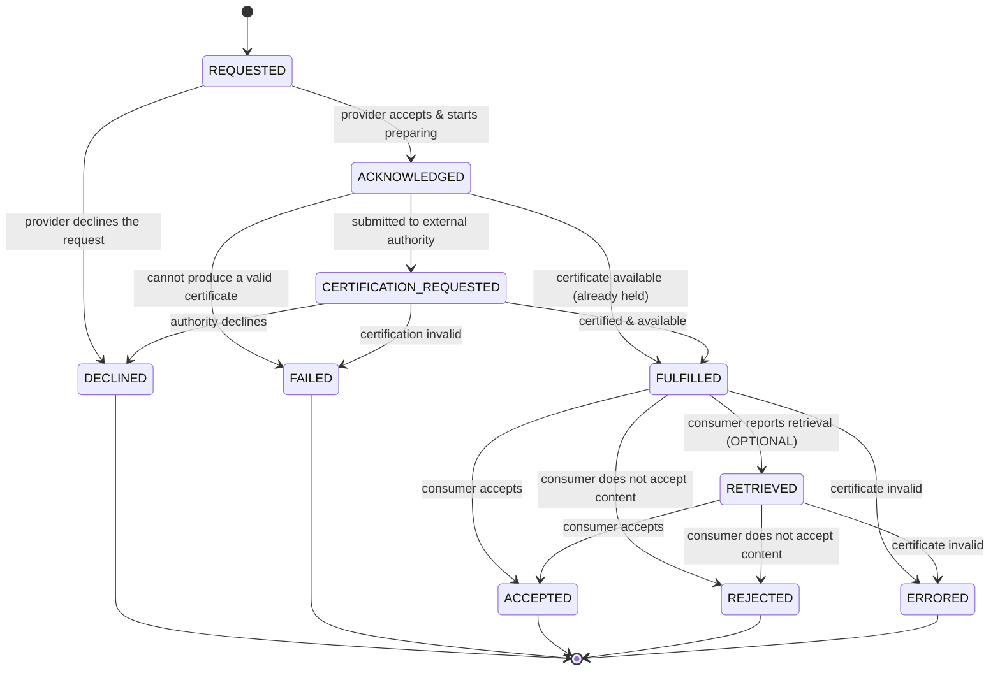
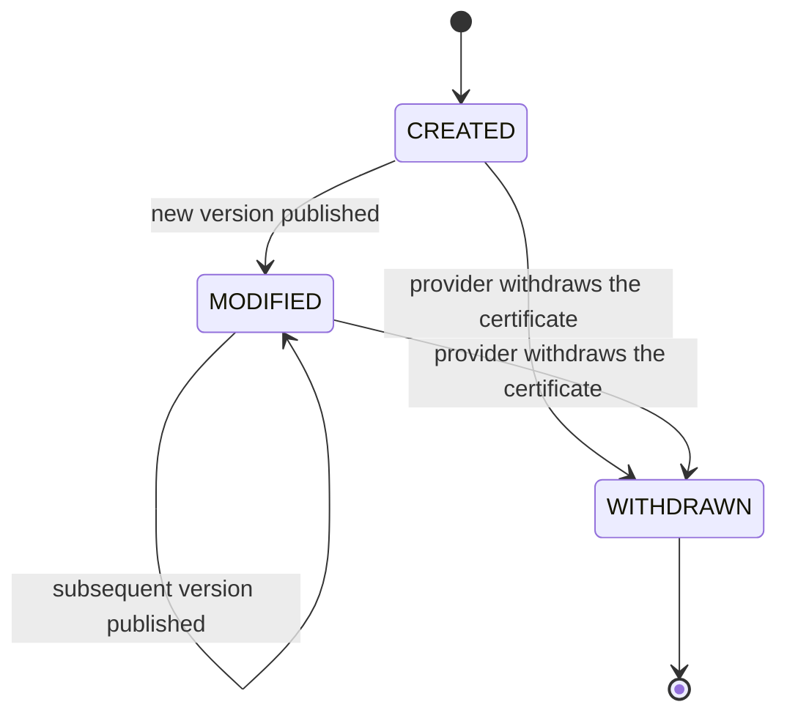
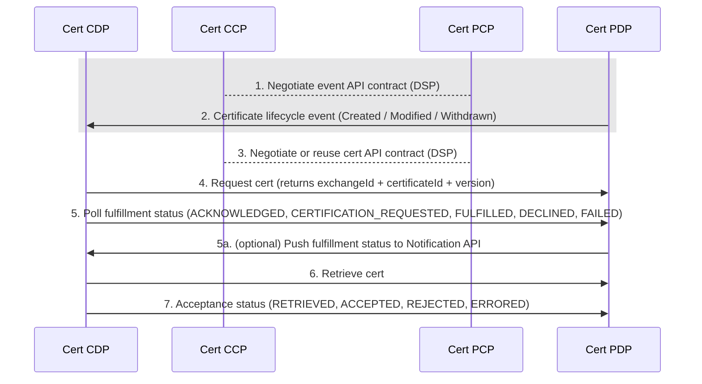

---
tags:
  - CAT/Value Added Services
---

# CX-0135 Business Partner Company Certificate Management (CCM) v0.1.0

## ABSTRACT

In the world of business, company certificates are often mandatory for conducting transactions between two companies.
However, the process of provisioning, maintaining, and validating these certificates can be a major challenge. For
example, if a company has 100 customers, it may need to provide its company certificates in 100 different ways and
maintain them at 100 different points.

To address this, this standard defines a standardized but generic data model and a wire protocol for company
certificates. It allows Catena-X participants to provide, request, accept, or reject company certificates across the
dataspace, exchanging certificate data as [CloudEvents](#cloudevents) over the [Dataspace Protocol](#dsp).

## FOR WHOM IS THE STANDARD DESIGNED

This standard is relevant to the following parties:

- Data Provider and Consumer
- Business Application Provider

It applies to business application providers who aim to offer a solution for managing and exchanging company
certificates and returning them to customers, and to Data Providers and Consumers who manage and exchange certificates
through such a business application.

> **Context regarding the naming of involved parties:**
> The Catena-X operating model and the [Dataspace Protocol](#dsp) use the roles `Data Consumer` and `Data Provider`,
> defined in terms of which party offers and consumes a dataset. In some cases these align with the direction of
> certificate flow, but — particularly for the certificate push mechanism — a mismatch can occur. To avoid ambiguity,
> this standard uses the terms `Certificate Provider` and `Certificate Consumer` to designate the business entities,
> independently of the data-plane roles they assume for a given interaction.

## 1 Introduction

This specification builds upon [CX-0151](#cx-0151) to define a Company Certificate Management (CCM) wire protocol for
exchanging company certificate data between Catena-X participants.

### 1.1 Conformance and Proof Of Conformity

The keywords **MAY**, **MUST**, **MUST NOT**, **OPTIONAL**, **RECOMMENDED**, **REQUIRED**, **SHOULD**, and **SHOULD
NOT** in this document are to be interpreted as described in BCP 14 [RFC2119](#rfc2119) [RFC8174](#rfc8174) when, and
only when they appear in all capitals, as shown here.

## 2 Model

> *This section is NOT normative*

This section describes the conceptual model underpinning the specification wire protocol. It is background material: the
model introduces the entities and lifecycle that the normative sections build upon, but defines no normative
requirements of its own.

The model consists of two concepts:

- The `Certificate Exchange` ([Section 2.1](#21-certificate-exchange)) — a single, correlatable interaction in which one
  certificate is delivered from a Certificate Provider to a Certificate Consumer and its outcome is reported back. A
  `Certificate Exchange` has its own identity and a well-defined lifecycle.
- The `Certificate Lifecycle` ([Section 2.2](#22-certificate-lifecycle)) — the independent lifecycle of a certificate as
  an artifact (its creation, modification, and revocation).

### 2.1 Certificate Exchange

A `Certificate Exchange` represents one end-to-end interaction between a Certificate Provider and a Certificate Consumer
involving the delivery of a single certificate from the time the interaction is started until it reaches a terminal
outcome.

#### 2.1.1 Identity and Correlation

A `Certificate Exchange` is identified by an **`exchangeId`** assigned when it is started. The `exchangeId` is the
correlation handle for the entire interaction and is distinct from the identifier of any individual message or event
(for example, a CloudEvent `id` + `source`).

An exchange concerns a specific certificate, a (`certificateId`, `version`) pair, and is conducted with a
`counterparty`, the authenticated Certificate Consumer.

A `Certificate Exchange` may be opened by the Certificate Consumer or Certificate Provider:

- **Consumer-initiated (pull):** the Certificate Consumer opens the exchange by requesting a certificate. The
  Certificate Provider assigns the `exchangeId` (together with the `certificateId` and `version`) and returns them in
  the response. Every request opens an exchange — including one the provider declines synchronously, which opens an
  exchange that terminates immediately at `DECLINED`; the identifiers are still returned so the outcome remains
  correlatable.
- **Provider-initiated (push):** the Certificate Provider opens the exchange when a certificate is already available,
  assigning an `exchangeId` and carrying it — with the `certificateId` and `version` — in the notification.

**Idempotency.** Each `Certificate Exchange` has a unique `exchangeId`. A message that repeats an `exchangeId` refers to
the same exchange rather than opening a new one. Multiple exchanges **MAY** concern the same certificate and
`counterparty`.

Acceptance feedback is correlated to the exchange by its `exchangeId` for both flows.

A re-attempt after a terminal outcome — for example, re-evaluating a `REJECTED` or `ERRORED` certificate — is a new
`Certificate Exchange`, with a new `exchangeId`, for the same certificate.

#### 2.1.2 Phases and Ownership

A `Certificate Exchange` progresses through two sequential phases, each owned by one party:

1. **Fulfillment (Provider-owned):** The Certificate Provider works to make the certificate available.
2. **Acceptance (Consumer-owned):** The Certificate Consumer retrieves and processes the certificate and reports the
   outcome.

The phases never overlap: the `Acceptance` phase begins only once `Fulfillment` has made the certificate available.
Provider-owned and Consumer-owned states use deliberately disjoint vocabulary, so the owner of a state is unambiguous.
Each phase can end in a negative decision or a business error: `DECLINED`/`REJECTED` are decisions (the provider
declines the request, or the consumer does not accept the certificate), while `FAILED`/`ERRORED` indicate a business
error such as an invalid certificate. These error states represent business-level problems only; technical and transport
failures (for example, connectivity errors or timeouts) are not modeled as `Certificate Exchange` states and are handled
at the transport layer.

#### 2.1.3 State Machine

The states of a `Certificate Exchange` are defined below and use the past tense:



| State                     | Phase / Owner          | Terminal | Description                                                                                                       |
|---------------------------|------------------------|----------|-------------------------------------------------------------------------------------------------------------------|
| `REQUESTED`               | Fulfillment / Provider | No       | The exchange was opened by the consumer; the provider has not yet acted. *(Consumer-initiated exchanges only.)*   |
| `ACKNOWLEDGED`            | Fulfillment / Provider | No       | The provider accepted the request and began preparing the certificate.                                            |
| `CERTIFICATION_REQUESTED` | Fulfillment / Provider | No       | The provider submitted the request to an external certification authority and is awaiting issuance. *(Optional.)* |
| `FULFILLED`               | Fulfillment / Provider | No       | The certificate is prepared and available for retrieval. Hand-off point.                                          |
| `DECLINED`                | Fulfillment / Provider | Yes      | The provider declined the request (a business decision; e.g. the certificate type is not offered).                |
| `FAILED`                  | Fulfillment / Provider | Yes      | The provider could not produce a valid certificate (a business error; e.g. the certificate is invalid).           |
| `RETRIEVED`               | Acceptance / Consumer  | No       | The consumer fetched the certificate and is processing it. *(Optional — see the note below.)*                      |
| `ACCEPTED`                | Acceptance / Consumer  | Yes      | The consumer accepted the certificate.                                                                            |
| `REJECTED`                | Acceptance / Consumer  | Yes      | The consumer did not accept the certificate content (a business decision).                                        |
| `ERRORED`                 | Acceptance / Consumer  | Yes      | The consumer found the certificate to be in error (a business error; e.g. the certificate is invalid).            |

A provider-initiated (push) exchange enters the lifecycle directly at `FULFILLED`. There is no request, so `REQUESTED`,
`ACKNOWLEDGED` and `CERTIFICATION_REQUESTED` are never visited. The Acceptance phase is identical for both pull and
push.

`RETRIEVED` is **OPTIONAL**. It is a non-terminal acknowledgment that the consumer has fetched the certificate and is
evaluating it; the consumer **MAY** report it as a delivery receipt but is not required to. An exchange therefore reaches
a terminal acceptance state either by way of `RETRIEVED` (`FULFILLED → RETRIEVED → {ACCEPTED, REJECTED, ERRORED}`) or
directly from `FULFILLED` (`FULFILLED → {ACCEPTED, REJECTED, ERRORED}`). The terminal acceptance verdicts remain
Consumer-owned in both cases.

`REQUESTED` is instantaneous and internal to the Certificate Provider; it is never reported on the wire. The first
Fulfillment status a Certificate Consumer observes is the one carried in the request response (see
[Section 4.4.1](#441-certificate-request)), which is `ACKNOWLEDGED` or a later state. A provider that can satisfy a
request without intermediate steps **MAY** report a later Fulfillment state directly — for example `FULFILLED` when the
certificate is already held, or `CERTIFICATION_REQUESTED` when the request is immediately forwarded to an external
authority — having passed through the earlier states instantaneously. A reported `status` therefore reflects the
exchange's current state, not necessarily a single transition from the one before it.

#### 2.1.4 Terminal States and Immutability

A `Certificate Exchange` is single-shot. The five terminal states — `DECLINED`, `FAILED`, `ACCEPTED`, `REJECTED`, and
`ERRORED` — conclude the exchange permanently. A terminal exchange is never reopened, reused, or transitioned further.

#### 2.1.5 Relationship to the Certificate Lifecycle

A `Certificate Exchange` governs the *delivery* of a certificate, not the certificate itself. Modifications, updates,
and revocations of a certificate are changes to the certificate artifact and are **not** transitions of a
`Certificate Exchange`. In particular, a change to a certificate that has already been delivered does not reopen or
alter the (possibly terminal) exchange that delivered it. A modification revises the certificate in place under the same
`certificateId` and does not open a new `Certificate Exchange`. The certificate's own lifecycle is described in
[Section 2.2](#22-certificate-lifecycle).

### 2.2 Certificate Lifecycle

The `Certificate Lifecycle` tracks a certificate as an artifact over time, independently of how many times it is
delivered. Whereas a `Certificate Exchange` is single-shot and concerns one delivery interaction, a certificate is
long-lived: it may be published, revised, and eventually withdrawn.

#### 2.2.1 Identity and Versioning

A certificate is identified by a **`certificateId`** that is stable for the life of the certificate. A modification does
not create a new identifier; instead, the certificate carries a **`version`**:

- `CREATED` makes the first `version` of the certificate available for retrieval.
- Each `MODIFIED` publishes a new `version` under the same `certificateId`, superseding the previous one. The latest
  `version` is authoritative.
- A certificate is therefore identified by the pair (`certificateId`, `version`). A `Certificate Exchange` delivers one
  specific `version`.

The `certificateId` and the initial `version` number may be assigned before the certificate is published. When a
Certificate Provider accepts a consumer's request and produces the certificate only later (see
[Section 2.1.1](#211-identity-and-correlation)), the identifier is allocated at acceptance so that an in-progress
`Certificate Exchange` can reference its certificate. Publication (`CREATED`) then occurs when the certificate becomes
available.

A certificate covers a **fixed set of locations** — the sites (BPNS) and addresses (BPNA) it applies to. On the full
certificate record these are carried as structured `enclosedSites` (each with an optional per-location area of application;
see [Section 4.4.3](#443-certificate-retrieval)); lighter projections such as query results and lifecycle events carry
only the bare BPNs as `enclosedSiteBpns`. The location set is a static property of the certificate; a certificate that would
cover a different set of locations is a distinct certificate.

#### 2.2.2 State Machine

The states use the past tense and describe the *publication* lifecycle of the certificate. They are independent of the
certificate's validity (see [Section 2.2.3](#223-validity-as-a-separate-dimension)).



| State       | Terminal | Description                                                                                                               |
|-------------|----------|---------------------------------------------------------------------------------------------------------------------------|
| `CREATED`   | No       | The certificate was first published under a new `certificateId`, establishing its initial `version`.                      |
| `MODIFIED`  | No       | A new `version` of the certificate was published under the same `certificateId`; the `version` is incremented. May recur. |
| `WITHDRAWN` | Yes      | The provider withdrew (removed) the certificate; it is no longer available. Terminal.                                     |

#### 2.2.3 Validity as a Separate Dimension

A certificate's validity is an independent dimension derived from its `validFrom` and `validUntil` dates, not from the
publication states defined above. A given `version` is *active* within its validity window and *expired* afterward, and
this status changes with the passage of time alone — no lifecycle transition occurs. The two dimensions are orthogonal:
a certificate may be `WITHDRAWN` while still within its validity window, or remain `CREATED`/`MODIFIED`after it has
expired.

#### 2.2.4 Relationship to the `Certificate Exchange`

Of the publication events, only `CREATED` may open a new `Certificate Exchange` — pushed by the provider, or discovered
and requested by the consumer — to deliver the certificate. `MODIFIED` and `WITHDRAWN` do not open an exchange: a
modification revises the certificate in place under the same `certificateId` without initiating a new delivery, and a
withdrawal ends the certificate's availability. Consistent with
[Section 2.1.5](#215-relationship-to-the-certificate-lifecycle), a lifecycle transition never alters an existing
`Certificate Exchange`. These transitions are communicated to Certificate Consumers as certificate lifecycle events (see
[Section 4.3.1](#431-certificate-lifecycle-events)).

## 3 Data Plane Wire Protocol

> *This section is NOT normative*

This specification defines the following agent systems:

- **Certificate Consumer Control Plane (Cert CCP)**: The [DSP](#dsp) Control Plane operated by the participant that
  consumes certificates.
- **Certificate Consumer Data Plane (Cert CDP)**: The [DSP](#dsp) Data Plane operated by the participant that consumes
  certificates.
- **Certificate Provider Control Plane (Cert PCP)**: The [DSP](#dsp) Control Plane operated by the participant that
  provides certificates.
- **Certificate Provider Data Plane (Cert PDP)**: The [DSP](#dsp) Data Plane operated by the participant that provides
  certificates.

The wire transmission protocol supports an optional consumer endpoint for providers to send notifications of certificate
availability. Provider endpoints offer mechanisms for requesting, querying, retrieving, and reporting the status of
certificates. The endpoints are discoverable and made accessible via a [DSP Catalog](#dsp-catalog).



### 3.1 Certificate Notification

A Certificate Consumer may optionally make a [Certificate Consumer Notification API](#43-certificate-consumer-notification-api)
available to Certificate Providers. Through it, a provider may notify the consumer of certificate lifecycle changes
(creation, modification, and withdrawal) and may push the fulfillment status of an open consumer-initiated exchange
instead of requiring the consumer to poll (see [Section 4.3.2](#432-certificate-fulfillment-notification)). This API
functions as a DSP Data Plane, which Certificate Providers gain access to via the DSP protocol. Upon receiving a
lifecycle notification with `status` `CREATED` or `MODIFIED`, the Certificate Consumer may retrieve the certificate
using the [Certificate Provider API](#44-certificate-provider-api).

### 3.2 Certificate Retrieval

A Certificate Consumer retrieves a certificate using the [Certificate Provider API](#44-certificate-provider-api). This API functions as a DSP Data
Plane, which Certificate Consumers gain access to via the DSP protocol. The Certificate Consumer may request a
certificate, poll the fulfillment status of a request, query for certificates, get a certificate's metadata, retrieve
its individual documents, and post acceptance status updates.

## 4 Data Plane Wire Protocol APIs

> *This section is normative*

### 4.1 Base URL and Transport Security

The <base> notation indicates the base URL for all HTTPS endpoints. For example, if the base URL is api.example.com, the
URL https://<base>/certificates/123 will map to https//api.example.com/certificates/123.

All endpoints **MUST** use HTTPS, HTTP over TLS 1.2 or higher.

### 4.2 Authorization

Authorization **MUST** adhere to [CX-0000 Section 4](./CX-0000-CloudEventsFoundation-combined.md#4-https-binding).

### 4.3 Certificate Consumer Notification API

The Certificate Consumer Notification API enables a Certificate Consumer to receive notifications from Certificate
Providers: certificate lifecycle events (see [Section 4.3.1](#431-certificate-lifecycle-events)) and fulfillment-status
updates for its open exchanges (see [Section 4.3.2](#432-certificate-fulfillment-notification)). This API is optional; a Certificate
Consumer that does not wish to receive notifications is not required to implement it. A Certificate Consumer that does
implement it **MUST** adhere to the normative requirements defined in this section.

#### 4.3.1 Certificate Lifecycle Events

The Certificate Consumer **MUST** expose the following endpoint to receive certificate lifecycle events. These events
are sent by the Certificate Provider to notify the Certificate Consumer of changes to a certificate over its lifecycle
(see [Section 2.2](#22-certificate-lifecycle)).

|                  |                                                      |
|------------------|------------------------------------------------------|
| **HTTP Method**: | POST                                                 |
| **URL Path**     | `POST /certificate-notifications`                    |
| **Content Type** | `application/cloudevents+json`                       |
| **Request**      | `CertificateLifecycleStatus` (single event or batch) |
| **Response**     | `HTTP 204` with empty body or error                  |

The endpoint accepts a single CloudEvent ([CloudEvents](#cloudevents)) or a batch (a JSON array) as defined in
[CX-0000](#cx-0000), whose HTTP binding follows [CloudEvents-HTTP](#cloudevents-http).

**Event Type**: `org.catena-x.ccm.CertificateLifecycleStatus.v1`

The Certificate Consumer **MUST** dispatch on the `data.status` value, which maps to a state of the
`Certificate Lifecycle`:

| `status`    | Lifecycle State | Opens an Exchange | Description                                                                                                                  |
|-------------|-----------------|-------------------|------------------------------------------------------------------------------------------------------------------------------|
| `CREATED`   | `CREATED`       | Yes               | A certificate has been published and is available for retrieval.                                                             |
| `MODIFIED`  | `MODIFIED`      | No                | A new `version` of an existing certificate has been published; the Certificate Consumer **MAY** retrieve the latest version. |
| `WITHDRAWN` | `WITHDRAWN`     | No                | The certificate has been withdrawn and is no longer available.                                                               |

Only the `CREATED` status opens a `Certificate Exchange` (see
[Section 2.2.4](#224-relationship-to-the-certificate-exchange)); `MODIFIED` and `WITHDRAWN` are notifications that do
not open an exchange. The two state machines meet here: a `CREATED` lifecycle event opens a provider-initiated exchange
that enters directly at the `FULFILLED` exchange state (see [Section 2.1.3](#213-state-machine)) — both express that the
certificate is now available, from the artifact and delivery viewpoints respectively.

The `data` payload derives from the common certificate-status base payload and constrains `status` to the lifecycle
values above. It contains the following properties:

| Property          | Type             | Required    | Description                                                                                                                                                                                                       |
|-------------------|------------------|-------------|-------------------------------------------------------------------------------------------------------------------------------------------------------------------------------------------------------------------|
| `exchangeId`      | String           | CONDITIONAL | Identifier of the `Certificate Exchange` opened by this event. Present when `status` is `CREATED`; absent for `MODIFIED` and `WITHDRAWN`. Distinct from the CloudEvent `id`.                                      |
| `certificateId`   | String           | MANDATORY   | The unique identifier of the certificate, used to retrieve the certificate via `GET /certificates/{id}`.                                                                                                          |
| `version`         | Integer          | MANDATORY   | The version of the certificate. Together with `certificateId` it identifies the specific certificate (see [Section 2.2.1](#221-identity-and-versioning)).                                                         |
| `status`          | String           | MANDATORY   | The lifecycle status. **MUST** be one of `CREATED`, `MODIFIED`, or `WITHDRAWN`.                                                                                                                                   |
| `datasetId`       | String           | MANDATORY   | The identifier of the DSP dataset under which the certificate is exposed in the Certificate Provider's catalog, enabling the Certificate Consumer to locate and negotiate the certificate via the Dataspace Protocol. |
| `certificateType` | String           | MANDATORY   | An opaque string identifying the certificate type (for example, `ISO9001`).                                                                                                                                       |
| `validFrom`       | String           | CONDITIONAL | The inclusive start date of the validity period, an [ISO 8601](#iso8601) full-date (`YYYY-MM-DD`). **MUST** be present when `status` is `CREATED` or `MODIFIED`; **MAY** be omitted when `status` is `WITHDRAWN`. |
| `validUntil`      | String           | CONDITIONAL | The inclusive end date of the validity period, an [ISO 8601](#iso8601) full-date (`YYYY-MM-DD`). Same presence rules as `validFrom`.                                                                              |
| `enclosedSiteBpns`    | Array of Strings | OPTIONAL    | The Business Partner Numbers (BPNs) of the sites or addresses the certificate applies to. If omitted, the certificate applies to the issuing legal entity as a whole.                                             |

The following are non-normative examples.

**Status: CREATED**

```json
{
  "specversion": "1.0",
  "type": "org.catena-x.ccm.CertificateLifecycleStatus.v1",
  "source": "urn:bpn:BPNL0000000001AB",
  "subject": "BPNL0000000002CD",
  "id": "a1b2c3d4-5e6f-7a8b-9c0d-1e2f3a4b5c6d",
  "time": "2025-05-04T07:00:00Z",
  "datacontenttype": "application/json",
  "dataschema": "https://w3id.org/catenax/schemas/ccm/certificate-lifecycle-status.json",
  "data": {
    "exchangeId": "exch-7f3a9c12-4b8e-4d6a-9e21-0c5b2a1d8f44",
    "certificateId": "cert-550e8400-e29b-41d4-a716-446655440000",
    "version": 1,
    "status": "CREATED",
    "datasetId": "dataset-ccm-cert-abc123",
    "certificateType": "ISO9001",
    "validFrom": "2023-01-25",
    "validUntil": "2026-01-24",
    "enclosedSiteBpns": [
      "BPNS00000003AYRE",
      "BPNA000000000001"
    ]
  }
}
```

**Status: MODIFIED**

```json
{
  "specversion": "1.0",
  "type": "org.catena-x.ccm.CertificateLifecycleStatus.v1",
  "source": "urn:bpn:BPNL0000000001AB",
  "subject": "BPNL0000000002CD",
  "id": "b2c3d4e5-6f7a-8b9c-0d1e-2f3a4b5c6d7e",
  "time": "2025-08-01T07:00:00Z",
  "datacontenttype": "application/json",
  "dataschema": "https://w3id.org/catenax/schemas/ccm/certificate-lifecycle-status.json",
  "data": {
    "certificateId": "cert-550e8400-e29b-41d4-a716-446655440000",
    "version": 2,
    "status": "MODIFIED",
    "datasetId": "dataset-ccm-cert-abc123",
    "certificateType": "ISO9001",
    "validFrom": "2023-01-25",
    "validUntil": "2027-01-24",
    "enclosedSiteBpns": [
      "BPNS00000003AYRE",
      "BPNA000000000001"
    ]
  }
}
```

**Status: WITHDRAWN**

```json
{
  "specversion": "1.0",
  "type": "org.catena-x.ccm.CertificateLifecycleStatus.v1",
  "source": "urn:bpn:BPNL0000000001AB",
  "subject": "BPNL0000000002CD",
  "id": "c3d4e5f6-7a8b-9c0d-1e2f-3a4b5c6d7e8f",
  "time": "2025-09-01T07:00:00Z",
  "datacontenttype": "application/json",
  "dataschema": "https://w3id.org/catenax/schemas/ccm/certificate-lifecycle-status.json",
  "data": {
    "certificateId": "cert-550e8400-e29b-41d4-a716-446655440000",
    "version": 2,
    "status": "WITHDRAWN",
    "datasetId": "dataset-ccm-cert-abc123",
    "certificateType": "ISO9001"
  }
}
```

**Batch**

Multiple events **MAY** be delivered in a single request as a JSON array:

```json
[
  {
    "specversion": "1.0",
    "type": "org.catena-x.ccm.CertificateLifecycleStatus.v1",
    "source": "urn:bpn:BPNL0000000001AB",
    "subject": "BPNL0000000002CD",
    "id": "a1b2c3d4-5e6f-7a8b-9c0d-1e2f3a4b5c6d",
    "time": "2025-05-04T07:00:00Z",
    "datacontenttype": "application/json",
    "dataschema": "https://w3id.org/catenax/schemas/ccm/certificate-lifecycle-status.json",
    "data": {
      "exchangeId": "exch-7f3a9c12-4b8e-4d6a-9e21-0c5b2a1d8f44",
      "certificateId": "cert-550e8400-e29b-41d4-a716-446655440000",
      "version": 1,
      "status": "CREATED",
      "datasetId": "dataset-ccm-cert-abc123",
      "certificateType": "ISO9001",
      "validFrom": "2023-01-25",
      "validUntil": "2026-01-24"
    }
  },
  {
    "specversion": "1.0",
    "type": "org.catena-x.ccm.CertificateLifecycleStatus.v1",
    "source": "urn:bpn:BPNL0000000001AB",
    "subject": "BPNL0000000002CD",
    "id": "d4e5f6a7-8b9c-0d1e-2f3a-4b5c6d7e8f90",
    "time": "2025-09-01T07:00:00Z",
    "datacontenttype": "application/json",
    "dataschema": "https://w3id.org/catenax/schemas/ccm/certificate-lifecycle-status.json",
    "data": {
      "certificateId": "cert-770e8400-e29b-41d4-a716-446655449999",
      "version": 3,
      "status": "WITHDRAWN",
      "datasetId": "dataset-ccm-cert-xyz789",
      "certificateType": "ISO14001"
    }
  }
]
```

#### 4.3.2 Certificate Fulfillment Notification

When a Certificate Consumer exposes this Notification API, a Certificate Provider **MAY** push the Fulfillment status of
an open consumer-initiated exchange (see [Section 4.4.1](#441-certificate-request)) to the consumer instead of requiring
it to poll (see [Section 4.4.2](#442-certificate-request-status)). This is the push counterpart of that poll and is
particularly useful for long-running fulfillment, for example while a certificate is `CERTIFICATION_REQUESTED`.

The event is delivered to the same `POST /certificate-notifications` endpoint defined in
[Section 4.3.1](#431-certificate-lifecycle-events) and is distinguished by its CloudEvents `type`. It is correlated to the
exchange by the `exchangeId` carried in `data`; the `exchangeId` is the one the Certificate Provider returned when the
exchange was opened (see [Section 4.4.1](#441-certificate-request)).

This notification reports only the Fulfillment phase. It is independent of the certificate's lifecycle status: a
`FULFILLED` notification reports that the requested exchange has been fulfilled and the certificate is available for
retrieval, whereas a lifecycle `CREATED` event (see [Section 4.3.1](#431-certificate-lifecycle-events)) reports a
provider-initiated exchange. A Certificate Provider **MUST NOT** use a lifecycle event to report the outcome of a
consumer-initiated request.

**Event Type**: `org.catena-x.ccm.CertificateFulfillmentStatus.v1`

The `data` payload contains the following properties:

| Property        | Type            | Required    | Description                                                                                                                 |
|-----------------|-----------------|-------------|-----------------------------------------------------------------------------------------------------------------------------|
| `exchangeId`    | String          | MANDATORY   | Identifier of the `Certificate Exchange` whose Fulfillment status is reported. Distinct from the CloudEvent `id`.           |
| `certificateId` | String          | MANDATORY   | The unique identifier of the certificate the exchange concerns.                                                             |
| `status`        | String          | MANDATORY   | The Fulfillment status. **MUST** be one of `ACKNOWLEDGED`, `CERTIFICATION_REQUESTED`, `FULFILLED`, `DECLINED`, or `FAILED`. |
| `errors`        | Array of Object | CONDITIONAL | A list of error details. **MUST** be present and non-empty when `status` is `DECLINED` or `FAILED`.                         |

A Certificate Provider that pushes Fulfillment status **SHOULD** send at least the terminal outcomes (`FULFILLED`,
`DECLINED`, `FAILED`); intermediate states **MAY** also be pushed. Each entry in the `errors` array contains the
properties defined in [Section 4.4.5](#445-certificate-acceptance-events).

The following are non-normative examples.

**Status: FULFILLED**

```json
{
  "specversion": "1.0",
  "type": "org.catena-x.ccm.CertificateFulfillmentStatus.v1",
  "source": "urn:bpn:BPNL0000000001AB",
  "subject": "BPNL0000000002CD",
  "id": "f0e1d2c3-b4a5-6789-0abc-def012345678",
  "time": "2025-05-04T07:30:00Z",
  "datacontenttype": "application/json",
  "dataschema": "https://w3id.org/catenax/schemas/ccm/certificate-fulfillment-status.json",
  "data": {
    "exchangeId": "exch-7f3a9c12-4b8e-4d6a-9e21-0c5b2a1d8f44",
    "certificateId": "cert-550e8400-e29b-41d4-a716-446655440000",
    "status": "FULFILLED"
  }
}
```

**Status: DECLINED**

```json
{
  "specversion": "1.0",
  "type": "org.catena-x.ccm.CertificateFulfillmentStatus.v1",
  "source": "urn:bpn:BPNL0000000001AB",
  "subject": "BPNL0000000002CD",
  "id": "a1c2e3f4-5b6d-7e8f-9a0b-1c2d3e4f5a6b",
  "time": "2025-05-04T07:30:00Z",
  "datacontenttype": "application/json",
  "dataschema": "https://w3id.org/catenax/schemas/ccm/certificate-fulfillment-status.json",
  "data": {
    "exchangeId": "exch-7f3a9c12-4b8e-4d6a-9e21-0c5b2a1d8f44",
    "certificateId": "cert-550e8400-e29b-41d4-a716-446655440000",
    "status": "DECLINED",
    "errors": [
      {
        "message": "Certificate type not offered for the requested location"
      }
    ]
  }
}
```

#### 4.3.3 Certificate Acceptance Status Query

The Certificate Consumer **MUST** expose the following endpoint to allow a Certificate Provider to query the current
acceptance status of a `Certificate Exchange` it opened.

|                  |                                                     |
|------------------|-----------------------------------------------------|
| **HTTP Method**: | GET                                                 |
| **URL Path**     | `GET /certificate-acceptance-status/{id}`           |
| **Content Type** | `application/json`                                  |
| **Response**     | `CertificateAcceptanceStatusResponse` or `HTTP 404` |

The `{id}` path parameter **MUST** be the `exchangeId` assigned by the Certificate Provider when the exchange was opened
(see [Section 2.1.1](#211-identity-and-correlation)). If the `exchangeId` is unknown to the Certificate Consumer, the
endpoint **MUST** respond with `HTTP 404`.

If the Certificate Consumer has not yet concluded processing, the endpoint **MAY** return a
`CertificateAcceptanceStatusResponse` whose `status` is `RETRIEVED`.

The response body **MUST** be a JSON object representing the current acceptance status of the exchange. The `status`
property conveys the Acceptance-phase state, including the non-terminal value `RETRIEVED` indicating that the
certificate has been retrieved but acceptance has not yet concluded. The `errors` follow the same rules as the
corresponding acceptance event in [Section 4.4.5](#445-certificate-acceptance-events).

| Property        | Type            | Required  | Description                                                                                                                                                              |
|-----------------|-----------------|-----------|--------------------------------------------------------------------------------------------------------------------------------------------------------------------------|
| `exchangeId`    | String          | MANDATORY | The identifier of the `Certificate Exchange`. Matches the `{id}` path parameter of the request.                                                                          |
| `certificateId` | String          | MANDATORY | The unique identifier of the certificate the status applies to.                                                                                                          |
| `status`        | String          | MANDATORY | The current acceptance status. **MUST** be one of `RETRIEVED`, `ACCEPTED`, `REJECTED`, or `ERRORED`.                                                                     |
| `errors`        | Array of Object | OPTIONAL  | A list of error details. **MUST NOT** be present when `status` is `RETRIEVED` or `ACCEPTED`. **MUST** be present and non-empty when `status` is `REJECTED` or `ERRORED`. |

Each entry in the `errors` array contains the same properties as defined in
[Section 4.4.5](#445-certificate-acceptance-events):

| Property    | Type   | Required  | Description                                                                                                                                                  |
|-------------|--------|-----------|--------------------------------------------------------------------------------------------------------------------------------------------------------------|
| `message`   | String | MANDATORY | A human-readable description of the error.                                                                                                                   |
| `specifier` | String | OPTIONAL  | An identifier scoping the error to a particular element of the certificate, such as a site BPN. If omitted, the error applies to the certificate as a whole. |

The following are non-normative examples of acceptance status responses:

**Status: RETRIEVED**

```json
{
  "exchangeId": "exch-7f3a9c12-4b8e-4d6a-9e21-0c5b2a1d8f44",
  "certificateId": "cert-550e8400-e29b-41d4-a716-446655440000",
  "status": "RETRIEVED"
}
```

**Status: ACCEPTED**

```json
{
  "exchangeId": "exch-7f3a9c12-4b8e-4d6a-9e21-0c5b2a1d8f44",
  "certificateId": "cert-550e8400-e29b-41d4-a716-446655440000",
  "status": "ACCEPTED"
}
```

**Status: REJECTED**

```json
{
  "exchangeId": "exch-7f3a9c12-4b8e-4d6a-9e21-0c5b2a1d8f44",
  "certificateId": "cert-550e8400-e29b-41d4-a716-446655440000",
  "status": "REJECTED",
  "errors": [
    {
      "message": "Certificate has expired"
    },
    {
      "specifier": "BPNS000000000002",
      "message": "Site BPNS000000000002 has been Rejected"
    }
  ]
}
```

#### 4.3.4 OpenAPI Specification

The Certificate Consumer Notification API is formally defined by the OpenAPI document
[certificate-consumer-notification-api-combined.yaml](./certificate-consumer-notification-api-combined.yaml).

#### 4.3.5 DSP Dataset Representation

The Certificate Consumer **MUST** expose a dataset according to the Dataspace Protocol (DSP) specification in their
catalog. This dataset **MUST** include the following properties:

|                 |                                                                                                                                           |
|-----------------|-------------------------------------------------------------------------------------------------------------------------------------------|
| **conformsTo**: | The Dublin Core [conformsTo](#dcmi-conformsto) property. The value must be set to `https://w3id.org/catenax/certificate-notification-api` |

The catalog distribution **MUST** have its `format` value set to `https://w3id.org/dps/http-pull`.

> TODO: Note this section is dependent on the following issues:
> - [DPS-99](#dps-99)

The following is a non-normative example of a consumer catalog dataset:

```json
{
  "@id": "urn:uuid:3dd1add8-4d2d-569e-d634-8394a8836a88",
  "@type": "Dataset",
  "hasPolicy": [],
  "conformsTo": "https://w3id.org/catenax/certificate-notification-api",
  "distribution": [
    {
      "@type": "Distribution",
      "format": "https://w3id.org/dps/http-pull",
      "accessService": "urn:uuid:4aa2dcc8-4d2d-569e-d634-8394a8834d77"
    }
  ]
}
```

### 4.4 Certificate Provider API

> *This section is normative*

The Certificate Provider API enables Certificate Providers to accept certificate requests, report request fulfillment
status, serve certificate data, answer certificate queries, and receive acceptance status from Certificate Consumers.

#### 4.4.1 Certificate Request

The Certificate Provider **MUST** expose the following endpoint to allow a Certificate Consumer to request a
certificate. A request opens a consumer-initiated `Certificate Exchange` (see [Section 2.1](#21-certificate-exchange)).

|                  |                                                       |
|------------------|-------------------------------------------------------|
| **HTTP Method**: | POST                                                  |
| **URL Path**     | `POST /certificate-requests`                          |
| **Content Type** | `application/json`                                    |
| **Request**      | `CertificateRequest`                                  |
| **Response**     | `HTTP 202` with `CertificateRequestResponse` or error |

The request body **MUST** be a JSON object containing the following properties:

| Property          | Type             | Required  | Description                                                                                                                                |
|-------------------|------------------|-----------|--------------------------------------------------------------------------------------------------------------------------------------------|
| `certificateType` | String           | MANDATORY | An opaque string identifying the certificate type to be requested (for example, `ISO9001`).                                                |
| `enclosedSiteBpns`    | Array of Strings | OPTIONAL  | The Business Partner Numbers (BPNs) of the sites or addresses the request applies to. If omitted, the request applies to the legal entity. |

When the Certificate Provider accepts the request, it **MUST** assign an `exchangeId`, `certificateId`, and `version`
and return them in the response, so the Certificate Consumer can correlate the exchange, poll its fulfillment status,
and later retrieve the certificate. The response body **MUST** be a JSON object containing the following properties:

| Property        | Type            | Required  | Description                                                                                                                           |
|-----------------|-----------------|-----------|---------------------------------------------------------------------------------------------------------------------------------------|
| `exchangeId`    | String          | MANDATORY | The identifier assigned to the opened `Certificate Exchange`. Used to poll status ([Section 4.4.2](#442-certificate-request-status)). |
| `certificateId` | String          | MANDATORY | The identifier assigned to the requested certificate. Used to retrieve it via `GET /certificates/{id}`.                               |
| `version`       | Integer         | MANDATORY | The version assigned to the requested certificate.                                                                                    |
| `status`        | String          | MANDATORY | The fulfillment status of the request. **MUST** be one of `ACKNOWLEDGED`, `CERTIFICATION_REQUESTED`, `FULFILLED`, or `DECLINED`.      |
| `errors`        | Array of Object | OPTIONAL  | A list of error details. **MUST** be present and non-empty when `status` is `DECLINED`.                                               |

The `status` reflects the Fulfillment phase of the exchange (see [Section 2.1.3](#213-state-machine)). A Certificate
Provider that already holds the requested certificate **MAY** return `FULFILLED` immediately. A Certificate Provider
that will not satisfy the request **MAY** return `DECLINED` with errors, or respond with `HTTP 400` if the request is
malformed. Each entry in the `errors` array contains the properties defined in
[Section 4.4.5](#445-certificate-acceptance-events).

The following is a non-normative example of a certificate request:

```json
{
  "certificateType": "ISO9001",
  "enclosedSiteBpns": [
    "BPNS00000003AYRE"
  ]
}
```

The following is a non-normative example of a response (`HTTP 202`):

```json
{
  "exchangeId": "exch-7f3a9c12-4b8e-4d6a-9e21-0c5b2a1d8f44",
  "certificateId": "cert-550e8400-e29b-41d4-a716-446655440000",
  "version": 1,
  "status": "ACKNOWLEDGED"
}
```

#### 4.4.2 Certificate Request Status

The Certificate Provider **MUST** expose the following endpoint to allow a Certificate Consumer to poll the fulfillment
status of a request previously submitted via [Section 4.4.1](#441-certificate-request).

|                  |                                          |
|------------------|------------------------------------------|
| **HTTP Method**: | GET                                      |
| **URL Path**     | `GET /certificate-requests/{id}`         |
| **Content Type** | `application/json`                       |
| **Response**     | `CertificateRequestStatus` or `HTTP 404` |

The `{id}` path parameter **MUST** be the `exchangeId` returned by the Certificate Provider in the response to the
certificate request. If the `exchangeId` is unknown to the Certificate Provider, the endpoint **MUST** respond with
`HTTP 404`.

The response body **MUST** be a JSON object containing the following properties:

| Property        | Type            | Required  | Description                                                                                                                         |
|-----------------|-----------------|-----------|-------------------------------------------------------------------------------------------------------------------------------------|
| `exchangeId`    | String          | MANDATORY | The identifier of the `Certificate Exchange`. Matches the `{id}` path parameter of the request.                                     |
| `certificateId` | String          | MANDATORY | The unique identifier of the requested certificate.                                                                                 |
| `version`       | Integer         | MANDATORY | The version of the requested certificate.                                                                                           |
| `status`        | String          | MANDATORY | The current fulfillment status. **MUST** be one of `ACKNOWLEDGED`, `CERTIFICATION_REQUESTED`, `FULFILLED`, `DECLINED`, or `FAILED`. |
| `errors`        | Array of Object | OPTIONAL  | A list of error details. **MUST** be present and non-empty when `status` is `DECLINED` or `FAILED`.                                 |

When the `status` is `FULFILLED`, the certificate is available and **MAY** be retrieved via
[Section 4.4.3](#443-certificate-retrieval). This endpoint reports only the Fulfillment phase; the Certificate
Consumer's acceptance outcome is reported separately via [Section 4.4.5](#445-certificate-acceptance-events).

Polling is not the only way to learn the Fulfillment status. If the Certificate Consumer exposes the Certificate
Consumer Notification API, a Certificate Provider **MAY** instead push these status updates to it as they occur (see
[Section 4.3.2](#432-certificate-fulfillment-notification)), in which case the consumer need not poll. The two mechanisms
are equivalent and carry the same `exchangeId` and `status`.

The following are non-normative examples of request status responses:

**Status: ACKNOWLEDGED**

```json
{
  "exchangeId": "exch-7f3a9c12-4b8e-4d6a-9e21-0c5b2a1d8f44",
  "certificateId": "cert-550e8400-e29b-41d4-a716-446655440000",
  "version": 1,
  "status": "ACKNOWLEDGED"
}
```

**Status: FULFILLED**

```json
{
  "exchangeId": "exch-7f3a9c12-4b8e-4d6a-9e21-0c5b2a1d8f44",
  "certificateId": "cert-550e8400-e29b-41d4-a716-446655440000",
  "version": 1,
  "status": "FULFILLED"
}
```

**Status: DECLINED**

```json
{
  "exchangeId": "exch-7f3a9c12-4b8e-4d6a-9e21-0c5b2a1d8f44",
  "certificateId": "cert-550e8400-e29b-41d4-a716-446655440000",
  "version": 1,
  "status": "DECLINED",
  "errors": [
    {
      "message": "Certificate type not offered for the requested location"
    }
  ]
}
```

#### 4.4.3 Certificate Retrieval

The Certificate Provider **MUST** expose the following endpoint to retrieve certificate metadata.

|                  |                                           |
|------------------|-------------------------------------------|
| **HTTP Method**: | GET                                       |
| **URL Path**     | `GET /certificates/{id}`                  |
| **Query**        | `version` (OPTIONAL) — defaults to latest |
| **Content Type** | `application/json`                        |
| **Response**     | `HTTP 200` with metadata JSON or error    |

The response is a JSON object ([RFC8259](#rfc8259)) describing the certificate. The certificate is metadata only; the
binary documents are **not** included. Each associated document is listed by reference in the `documents` array and
retrieved independently via [Section 4.4.4](#444-document-retrieval).

If an error occurs, the Certificate Provider **MUST** set the `Content-Type` to `application/json` and return an error
body encoded as `application/json` ([RFC8259](#rfc8259)).

By default, the endpoint returns the latest `version`. A consumer **MAY** request a specific version with the `version`
query parameter (for example, `GET /certificates/{id}?version=2`) — for instance, to retrieve the exact version a
`Certificate Exchange` concerns. The Certificate Provider **MUST** be able to return any version that is still
referenced by a non-terminal `Certificate Exchange`; whether other superseded versions remain retrievable is at the
provider's discretion.

Each version references a set of documents through the `documents` array. Document identity is independent of the
certificate version: a `documentId` is stable and its content is immutable. A document that does not change across
versions is therefore referenced by the same `documentId` in each version that includes it.

The metadata is a JSON object containing the following properties:

| Property                 | Type             | Required  | Description                                                                                                                                                           |
|--------------------------|------------------|-----------|-----------------------------------------------------------------------------------------------------------------------------------------------------------------------|
| `certificateId`          | String           | MANDATORY | The unique identifier of the certificate. Matches the `{id}` path parameter of the request.                                                                           |
| `version`                | Integer          | MANDATORY | The version returned — the version requested via the `version` query parameter, or the latest version if none was specified.                                          |
| `certificateType`        | String           | MANDATORY | An opaque string identifying the certificate type (for example, `ISO9001`). See [Section 5.4](#54-certificate-types).                                                 |
| `certificateTypeVersion` | String           | OPTIONAL  | The version of the certificate type itself (for example, `2015` for ISO 9001:2015). Distinct from the certificate's `version`.                                        |
| `certifiedBpn`           | String           | MANDATORY | The BPNL of the certified legal entity on which the certificate is issued.                                                                                            |
| `registrationNumber`     | String           | MANDATORY | The certificate's registration number at the issuing body.                                                                                                           |
| `validFrom`              | String           | MANDATORY | The inclusive start date of the certificate validity period, formatted as an [ISO 8601](#iso8601) full-date (`YYYY-MM-DD`).                                           |
| `validUntil`             | String           | MANDATORY | The inclusive end date of the certificate validity period, formatted as an [ISO 8601](#iso8601) full-date (`YYYY-MM-DD`).                                             |
| `trustLevel`             | String           | MANDATORY | The trust level of the certificate. **MUST** be one of `none`, `low`, `medium`, `high`, or `trusted` (see [Section 5.5](#55-certificate-metadata-attributes)).        |
| `areaOfApplication`      | String           | OPTIONAL  | Free-text detail of the areas or application types the certificate is valid for overall. Individual locations **MAY** narrow this via `Location.areaOfApplication`.   |
| `enclosedSites`              | Array of Objects | OPTIONAL  | The sites or addresses the certificate applies to, each an `EnclosedSite` object (see below). If omitted or empty, the certificate applies to the issuing legal entity as a whole. |
| `issuer`                 | Object           | OPTIONAL  | The authority that issued the certificate, a `CertificateIssuer` object (see below).                                                                                  |
| `validator`              | Object           | OPTIONAL  | The party that can validate the certificate information, a `CertificateValidator` object (see below).                                                                 || `documents`              | Array of Objects | OPTIONAL  | The documents associated with this certificate version, each a `CertificateDocument` object (see below). If omitted or empty, the version has no associated documents. |

Each `EnclosedSite` object contains the following properties:

| Property            | Type   | Required  | Description                                                                                                          |
|---------------------|--------|-----------|--------------------------------------------------------------------------------------------------------------------|
| `bpn`       | String | MANDATORY | The Business Partner Number of the site (BPNS) or address (BPNA) the certificate covers.                            |
| `areaOfApplication` | String | OPTIONAL  | Free-text detail of the areas or application types the certificate is valid for at this specific location.          |

Each `CertificateIssuer` object contains the following properties:

| Property     | Type   | Required  | Description                                                                |
|--------------|--------|-----------|---------------------------------------------------------------------------|
| `issuerName` | String | MANDATORY | The name of the issuing authority (for example, `TÜV Süd`).               |
| `issuerBpn`  | String | OPTIONAL  | The BPNL of the issuing authority, if it is a Catena-X business partner.   |

Each `CertificateValidator` object contains the following properties:

| Property        | Type   | Required  | Description                                                                                                              |
|-----------------|--------|-----------|-------------------------------------------------------------------------------------------------------------------------|
| `validatorName` | String | MANDATORY | The name of the validator.                                                                                              |
| `validatorBpn`  | String | OPTIONAL  | The BPNL of the validator. **MAY** be used as a free-text identifier where a BPNL is not available.                     |

Each `CertificateDocument` object contains the following properties:

| Property     | Type   | Required  | Description                                                                                                                                                  |
|--------------|--------|-----------|-------------------------------------------------------------------------------------------------------------------------------------------------------------|
| `documentId` | String | MANDATORY | The opaque, version-independent identifier of the document, used to retrieve it via `GET /documents/{id}` (see [Section 4.4.4](#444-document-retrieval)).     |
| `language`   | String | OPTIONAL  | The language of the document as an [ISO 639-1](#iso6391) two-letter code (for example, `en` or `de`). Distinguishes documents that differ only by language.   |
| `mediaType`  | String | MANDATORY | The IANA media type of the document binary (for example, `application/pdf` or `image/png`).                                                                  |

The following is a non-normative example of a response:

```json
{
  "certificateId": "cert-550e8400-e29b-41d4-a716-446655440000",
  "version": 1,
  "certificateType": "ISO9001",
  "certificateTypeVersion": "2015",
  "certifiedBpn": "BPNL0000000002CD",
  "registrationNumber": "12 100 4711",
  "validFrom": "2023-01-25",
  "validUntil": "2026-01-24",
  "trustLevel": "high",
  "areaOfApplication": "Production and assembly of powertrain components",
  "enclosedSites": [
    {
      "bpn": "BPNS00000003AYRE",
      "areaOfApplication": "Welding and surface treatment"
    },
    {
      "bpn": "BPNA000000000001"
    }
  ],
  "issuer": {
    "issuerName": "TÜV Süd",
    "issuerBpn": "BPNL0000000003EF"
  },
  "validator": {
    "validatorName": "TÜV Süd",
    "validatorBpn": "BPNL0000000003EF"
  },  "documents": [
    {
      "documentId": "doc-3fa85f64-5717-4562-b3fc-2c963f66afa6",
      "language": "en",
      "mediaType": "application/pdf"
    }
  ]
}
```

#### 4.4.4 Document Retrieval

The Certificate Provider **MUST** expose the following endpoint to retrieve a certificate document by its identifier.

|                  |                                              |
|------------------|----------------------------------------------|
| **HTTP Method**: | GET                                          |
| **URL Path**     | `GET /documents/{id}`                        |
| **Content Type** | The document's `mediaType`                   |
| **Response**     | `HTTP 200` with the document binary or error |

A document is identified by an opaque `documentId` that is independent of any certificate version (see
[Section 4.4.3](#443-certificate-retrieval)). Because a document's identity and content are stable, the same document
**MAY** be referenced by multiple certificate versions, and the endpoint therefore requires no `version` parameter.

The response body is the document binary, served directly with the `Content-Type` set to the document's `mediaType`
(for example, `application/pdf`) as advertised in the certificate metadata
([Section 4.4.3](#443-certificate-retrieval)).

If an error occurs, the Certificate Provider **MUST** set the `Content-Type` to `application/json` and return an error
body encoded as `application/json` ([RFC8259](#rfc8259)).

The following is a non-normative example of a response:

```http
HTTP/1.1 200 OK
Content-Type: application/pdf

[binary document data]
```

#### 4.4.5 Certificate Acceptance Events

The Certificate Provider **MUST** expose the following endpoint to receive certificate acceptance status from the
Certificate Consumer. The status is delivered as a `CertificateAcceptanceStatus` CloudEvent.

|                  |                                                       |
|------------------|-------------------------------------------------------|
| **HTTP Method**: | POST                                                  |
| **URL Path**     | `POST /certificate-acceptance-notifications`          |
| **Content Type** | `application/cloudevents+json`                        |
| **Request**      | `CertificateAcceptanceStatus` (single event or batch) |
| **Response**     | `HTTP 204` with empty body or error                   |

The endpoint accepts a single CloudEvent ([CloudEvents](#cloudevents)) or a batch (a JSON array) as defined in
[CX-0000](#cx-0000), whose HTTP binding follows [CloudEvents-HTTP](#cloudevents-http).

**Event Type**: `org.catena-x.ccm.CertificateAcceptanceStatus.v1`

The Certificate Provider **MUST** dispatch on the `data.status` value, which is a state of the Acceptance phase (see
[Section 2.1.3](#213-state-machine)). The event is correlated to its `Certificate Exchange` by the `exchangeId` carried
in `data` (see [Section 2.1.1](#211-identity-and-correlation)).

Acceptance status **MUST** reference an existing `Certificate Exchange`. Acceptance is the Consumer-owned phase of an
exchange, so it can only be reported when an exchange is present — one opened by a consumer request
([Section 4.4.1](#441-certificate-request)) or by a provider notification
([Section 4.3.1](#431-certificate-lifecycle-events)). Merely retrieving a certificate (for example, after
a [query](#446-certificate-query)) does **not** establish an exchange and therefore does not permit acceptance feedback.
If the `exchangeId` is unknown to the Certificate Provider, it **MUST** reject the event with `HTTP 404`.

Reporting `RETRIEVED` is **OPTIONAL** (see [Section 2.1.3](#213-state-machine)). It is a non-terminal delivery
acknowledgment; a Certificate Consumer **MAY** report it after fetching the certificate, or **MAY** proceed directly to
a terminal acceptance status (`ACCEPTED`, `REJECTED`, or `ERRORED`) without first reporting `RETRIEVED`. A Certificate
Provider **MUST NOT** require a prior `RETRIEVED` event as a precondition for accepting a terminal acceptance status.

The `data` payload derives from the common certificate-status base payload and constrains `status` to the acceptance
values below. It contains the following properties:

| Property        | Type            | Required    | Description                                                                                                                                                              |
|-----------------|-----------------|-------------|--------------------------------------------------------------------------------------------------------------------------------------------------------------------------|
| `exchangeId`    | String          | MANDATORY   | Identifier of the `Certificate Exchange` this event reports on. Distinct from the CloudEvent `id`.                                                                       |
| `certificateId` | String          | MANDATORY   | The unique identifier of the certificate the status applies to.                                                                                                          |
| `status`        | String          | MANDATORY   | The acceptance status of the certificate. **MUST** be one of `RETRIEVED`, `ACCEPTED`, `REJECTED`, or `ERRORED`.                                                          |
| `errors`        | Array of Object | CONDITIONAL | A list of error details. **MUST NOT** be present when `status` is `RETRIEVED` or `ACCEPTED`. **MUST** be present and non-empty when `status` is `REJECTED` or `ERRORED`. |

Each entry in the `errors` array contains the following properties:

| Property    | Type   | Required  | Description                                                                                                                                                  |
|-------------|--------|-----------|--------------------------------------------------------------------------------------------------------------------------------------------------------------|
| `message`   | String | MANDATORY | A human-readable description of the error.                                                                                                                   |
| `specifier` | String | OPTIONAL  | An identifier scoping the error to a particular element of the certificate, such as a site BPN. If omitted, the error applies to the certificate as a whole. |

The following are non-normative examples.

**Status: RETRIEVED**

```json
{
  "specversion": "1.0",
  "type": "org.catena-x.ccm.CertificateAcceptanceStatus.v1",
  "source": "urn:bpn:BPNL0000000002CD",
  "subject": "BPNL0000000001AB",
  "id": "e9f8d7c6-b5a4-9382-7160-5a4b3c2d1e0f",
  "time": "2025-05-04T08:00:00Z",
  "datacontenttype": "application/json",
  "dataschema": "https://w3id.org/catenax/schemas/ccm/certificate-acceptance-status.json",
  "data": {
    "exchangeId": "exch-7f3a9c12-4b8e-4d6a-9e21-0c5b2a1d8f44",
    "certificateId": "cert-550e8400-e29b-41d4-a716-446655440000",
    "status": "RETRIEVED"
  }
}
```

**Status: ACCEPTED**

```json
{
  "specversion": "1.0",
  "type": "org.catena-x.ccm.CertificateAcceptanceStatus.v1",
  "source": "urn:bpn:BPNL0000000002CD",
  "subject": "BPNL0000000001AB",
  "id": "a7b8c9d0-e1f2-3a4b-5c6d-7e8f9a0b1c2d",
  "time": "2025-05-04T09:00:00Z",
  "datacontenttype": "application/json",
  "dataschema": "https://w3id.org/catenax/schemas/ccm/certificate-acceptance-status.json",
  "data": {
    "exchangeId": "exch-7f3a9c12-4b8e-4d6a-9e21-0c5b2a1d8f44",
    "certificateId": "cert-550e8400-e29b-41d4-a716-446655440000",
    "status": "ACCEPTED"
  }
}
```

**Status: REJECTED**

```json
{
  "specversion": "1.0",
  "type": "org.catena-x.ccm.CertificateAcceptanceStatus.v1",
  "source": "urn:bpn:BPNL0000000002CD",
  "subject": "BPNL0000000001AB",
  "id": "f1a2b3c4-d5e6-7f8a-9b0c-1d2e3f4a5b6c",
  "time": "2025-05-04T09:00:00Z",
  "datacontenttype": "application/json",
  "dataschema": "https://w3id.org/catenax/schemas/ccm/certificate-acceptance-status.json",
  "data": {
    "exchangeId": "exch-7f3a9c12-4b8e-4d6a-9e21-0c5b2a1d8f44",
    "certificateId": "cert-550e8400-e29b-41d4-a716-446655440000",
    "status": "REJECTED",
    "errors": [
      {
        "message": "Certificate has expired"
      },
      {
        "message": "Unexpected data format"
      },
      {
        "specifier": "BPNS000000000002",
        "message": "Site BPNS000000000002 has been Rejected"
      }
    ]
  }
}
```

**Status: ERRORED**

```json
{
  "specversion": "1.0",
  "type": "org.catena-x.ccm.CertificateAcceptanceStatus.v1",
  "source": "urn:bpn:BPNL0000000002CD",
  "subject": "BPNL0000000001AB",
  "id": "c8d7e6f5-a4b3-2109-8765-432109fedcba",
  "time": "2025-05-04T08:30:00Z",
  "datacontenttype": "application/json",
  "dataschema": "https://w3id.org/catenax/schemas/ccm/certificate-acceptance-status.json",
  "data": {
    "exchangeId": "exch-7f3a9c12-4b8e-4d6a-9e21-0c5b2a1d8f44",
    "certificateId": "cert-550e8400-e29b-41d4-a716-446655440000",
    "status": "ERRORED",
    "errors": [
      {
        "message": "Certificate document is malformed and cannot be validated"
      }
    ]
  }
}
```

#### 4.4.6 Certificate Query

The Certificate Provider **MUST** expose the following endpoint to query certificates.

|                  |                            |
|------------------|----------------------------|
| **HTTP Method**: | POST                       |
| **URL Path**     | `POST /certificates/search` |
| **Content Type** | `application/json`         |
| **Request**      | `CertificateQuery`         |
| **Response**     | `CertificateQueryResponse` |

The request body **MUST** be a JSON object containing the query criteria. The `limit` property **MAY** be included to
indicate the maximum number of results to return per page. If omitted, the Certificate Provider **MAY** apply a default
limit.

The `CertificateQuery` object contains the following properties. All criteria are **OPTIONAL**; a query with no criteria
returns all certificates accessible to the Certificate Consumer. Criteria of different kinds are combined with **AND**
(a certificate is returned only if it satisfies every supplied criterion). Within a single BPN list, the match is
**any-of** (a certificate matches if it covers any one of the listed BPNs).

| Property           | Type             | Required | Description                                                                                                                                                                                              |
|--------------------|------------------|----------|----------------------------------------------------------------------------------------------------------------------------------------------------------------------------------------------------------|
| `certificateType`  | String           | OPTIONAL | An opaque string identifying the certificate type to be matched (for example, `ISO9001`). See [Section 5.4](#54-certificate-types).                                                                       |
| `legalEntityBpns`  | Array of Strings | OPTIONAL | Filter to certificates issued for these legal entities (matched against `certifiedBpn`). Each value is a BPNL.                                                                                            |
| `siteBpns`         | Array of Strings | OPTIONAL | Filter to certificates covering these sites (matched against the `enclosedSites`). Each value is a BPNS.                                                                                                  |
| `addressBpns`      | Array of Strings | OPTIONAL | Filter to certificates covering these addresses (matched against the `enclosedSites`). Each value is a BPNA.                                                                                              |
| `from`             | String           | OPTIONAL | The inclusive lower bound of the certificate validity range, formatted as an [ISO 8601](#iso8601) full-date (`YYYY-MM-DD`). Only certificates whose `validFrom` is on or after this date are returned.    |
| `to`               | String           | OPTIONAL | The inclusive upper bound of the certificate validity range, formatted as an [ISO 8601](#iso8601) full-date (`YYYY-MM-DD`). Only certificates whose `validUntil` is on or before this date are returned.  |
| `limit`            | Integer          | OPTIONAL | The maximum number of results to return in a single page. If omitted, the Certificate Provider **MAY** apply a default limit.                                                                            |

The following is a non-normative example of a certificate query:

```json
{
  "certificateType": "ISO9001",
  "legalEntityBpns": [
    "BPNL0000000002CD"
  ],
  "siteBpns": [
    "BPNS00000003AYRE"
  ],
  "from": "2023-01-25",
  "to": "2026-01-24",
  "limit": 50
}
```

The response body **MUST** be a JSON array of `CertificateQueryResponse` objects containing match results. Each object
contains the following properties:

| Property          | Type             | Required  | Description                                                                                                                                                           |
|-------------------|------------------|-----------|-----------------------------------------------------------------------------------------------------------------------------------------------------------------------|
| `certificateId`          | String           | MANDATORY | The unique identifier of the certificate, used to retrieve the certificate via `GET /certificates/{id}`.                                                              |
| `version`                | Integer          | MANDATORY | The latest version of the certificate.                                                                                                                                |
| `datasetId`              | String           | MANDATORY | The identifier of the DSP dataset under which the certificate is exposed in the Certificate Provider's catalog, enabling the Certificate Consumer to locate and negotiate the certificate via the Dataspace Protocol. |
| `certificateType`        | String           | MANDATORY | An opaque string identifying the certificate type (for example, `ISO9001`). See [Section 5.4](#54-certificate-types).                                                 |
| `certificateTypeVersion` | String           | OPTIONAL  | The version of the certificate type itself (for example, `2015` for ISO 9001:2015). Distinct from the certificate's `version`.                                        |
| `certifiedBpn`           | String           | MANDATORY | The BPNL of the certified legal entity on which the certificate is issued.                                                                                            |
| `registrationNumber`     | String           | MANDATORY | The certificate's registration number at the issuing body.                                                                                                           |
| `validFrom`              | String           | MANDATORY | The inclusive start date of the certificate validity period, formatted as an [ISO 8601](#iso8601) full-date (`YYYY-MM-DD`).                                           |
| `validUntil`             | String           | MANDATORY | The inclusive end date of the certificate validity period, formatted as an [ISO 8601](#iso8601) full-date (`YYYY-MM-DD`).                                             |
| `trustLevel`             | String           | MANDATORY | The trust level of the certificate. **MUST** be one of `none`, `low`, `medium`, `high`, or `trusted` (see [Section 5.5](#55-certificate-metadata-attributes)).        |
| `areaOfApplication`      | String           | OPTIONAL  | Free-text detail of the areas or application types the certificate is valid for.                                                                                      |
| `enclosedSiteBpns`           | Array of Strings | OPTIONAL  | The Business Partner Numbers (BPNs) of the sites or addresses the certificate applies to. If omitted, the certificate applies to the issuing legal entity as a whole. |
| `issuer`                 | Object           | OPTIONAL  | The authority that issued the certificate, a `CertificateIssuer` object as defined in [Section 4.4.3](#443-certificate-retrieval).                                    |
| `validator`              | Object           | OPTIONAL  | The party that can validate the certificate, a `CertificateValidator` object as defined in [Section 4.4.3](#443-certificate-retrieval).                               || `documents`              | Array of Objects | OPTIONAL  | The documents associated with the returned certificate version, each a `CertificateDocument` object as defined in [Section 4.4.3](#443-certificate-retrieval). Retrieved via `GET /documents/{id}`. |

The following is a non-normative example of a certificate query response containing an array of
`CertificateQueryResponse` objects:

```json
[
  {
    "certificateId": "cert-550e8400-e29b-41d4-a716-446655440000",
    "version": 1,
    "datasetId": "dataset-ccm-cert-abc123",
    "certificateType": "ISO9001",
    "certificateTypeVersion": "2015",
    "certifiedBpn": "BPNL0000000002CD",
    "registrationNumber": "12 100 4711",
    "validFrom": "2023-01-25",
    "validUntil": "2026-01-24",
    "trustLevel": "high",
    "areaOfApplication": "Production and assembly of powertrain components",
    "enclosedSiteBpns": [
      "BPNS00000003AYRE",
      "BPNA000000000001"
    ],
    "issuer": {
      "issuerName": "TÜV Süd",
      "issuerBpn": "BPNL0000000003EF"
    },
    "validator": {
      "validatorName": "TÜV Süd",
      "validatorBpn": "BPNL0000000003EF"
    },
    "documents": [
      {
        "documentId": "doc-3fa85f64-5717-4562-b3fc-2c963f66afa6",
        "language": "en",
        "mediaType": "application/pdf"
      }
    ]
  }
]
```

##### 4.4.6.1 Pagination

Implementations **MAY** paginate the results of a query. When results are paginated, pagination data **MUST** be
conveyed using Web Linking as defined in [RFC8288](#rfc8288) via the HTTP `Link` response header. Only the `next`
and `prev` link relation types **MUST** be supported; implementations **MAY** include additional relation types such as
`first` and `last`.

Each value in the `Link` header **MUST** be enclosed in angle brackets and **MUST** include a `rel` parameter
identifying the link relation type. When more than one link is present, values **MUST** be comma-separated as defined
in [RFC8288, Section 3](#rfc8288). The target URL **MUST** refer to the
`POST /certificates/search` endpoint of the Certificate Provider. The content and structure of the URL (including any
query parameters or opaque page tokens used to encode pagination state) are not defined by this specification and
clients **MUST** treat them as opaque.

To retrieve the next or previous page, a client **MUST** issue a `POST` request to the URL provided in the corresponding
`Link` header value, using the same request body as the original query. The `Link` header **MUST NOT** be included in
responses that are not paginated, and a `next` or `prev` link **MUST** be omitted when no further results are available
in that direction.

The following is a non-normative example of a paginated response:

```http
HTTP/1.1 200 OK
Content-Type: application/json
Link: <https://provider.example.com/certificates/search?cursor=eyJvZmZzZXQiOjUwfQ>; rel="next",
      <https://provider.example.com/certificates/search?cursor=eyJvZmZzZXQiOjB9>; rel="prev"

[
  {
    "certificateId": "cert-550e8400-e29b-41d4-a716-446655440000",
    "version": 1,
    "datasetId": "dataset-ccm-cert-abc123",
    "certificateType": "ISO9001",
    "validFrom": "2023-01-25",
    "validUntil": "2026-01-24",
    "enclosedSiteBpns": [
      "BPNS00000003AYRE",
      "BPNA000000000001"
    ]
  }
]
```

#### 4.4.7 OpenAPI Specification

The Certificate Provider API is formally defined by the OpenAPI document
[certificate-provider-api-combined.yaml](./certificate-provider-api-combined.yaml).

#### 4.4.8 DSP Dataset Representation

The Certificate Provider **MUST** expose a dataset according to the Dataspace Protocol (DSP) specification in their
catalog. This dataset **MUST** include the following properties:

|                 |                                                                                                                              |
|-----------------|------------------------------------------------------------------------------------------------------------------------------|
| **conformsTo**: | The Dublin Core [conformsTo](#dcmi-conformsto) property. The value must be set to `https://w3id.org/catenax/certificate-api` |

The catalog distribution **MUST** have its `format` value set to `https://w3id.org/dps/http-pull`.

> TODO: Note this section is dependent on the following issues:
> - [DPS-98](#dps-98)
> - [DPS-99](#dps-99)

The following is a non-normative example of a provider catalog dataset:

```json
{
  "@id": "urn:uuid:3dd1add8-4d2d-569e-d634-8394a8836a88",
  "@type": "Dataset",
  "hasPolicy": [],
  "conformsTo": "https://w3id.org/catenax/certificate-api",
  "distribution": [
    {
      "@type": "Distribution",
      "format": "https://w3id.org/dps/http-pull",
      "accessService": "urn:uuid:4aa2dcc8-4d2d-569e-d634-8394a8834d77"
    }
  ]
}
```                              

### 4.5 Policy Constraints and Usage Policy

#### 4.5.1 Policy Constraints for Data Exchange

In alignment with the commitment to data sovereignty, a framework governing the use of data within the Catena-X use
cases has been defined. As part of this framework, conventions for access policies, usage policies, and the constraints
they contain are specified in [CX-0152](#cx-0152) Policy Constraints for Data Exchange. [CX-0152](#cx-0152) **MUST** be
followed when providing services or applications for sharing or consuming data, and when sharing or consuming data, in
the Catena-X ecosystem. Which conventions are relevant for which roles named in
[FOR WHOM IS THE STANDARD DESIGNED](#for-whom-is-the-standard-designed) is specified in [CX-0152](#cx-0152) as well.

#### 4.5.2 Usage Policy

All dataspace offers of a participant — both the APIs defined in this standard and the certificate datasets — **MUST**
carry a usage policy following the requirements referenced in [Section 4.5.1](#451-policy-constraints-for-data-exchange).
This use case introduces the following usage purpose:

- **`cx.ccm.base:1`** — *the legal meaning is defined in [CX-0152](#cx-0152) (see the Catena-X standard library).*

Additional, more general usage policies **MAY** be included, but every usage policy **MUST** contain the usage purpose
above, as shown below.

*Minimal example of a usage policy without a contract reference:*

```json
{
  "@context": [
    "https://w3id.org/catenax/2025/9/policy/odrl.jsonld",
    "https://w3id.org/catenax/2025/9/policy/context.jsonld"
  ],
  "@type": "Set",
  "@id": "CCMAPI-usage-policy-without-contract-reference",
  "permission": [
    {
      "action": "use",
      "constraint": {
        "and": [
          {
            "leftOperand": "FrameworkAgreement",
            "operator": "eq",
            "rightOperand": "DataExchangeGovernance:1.0"
          },
          {
            "leftOperand": "UsagePurpose",
            "operator": "isAnyOf",
            "rightOperand": "cx.ccm.base:1"
          }
        ]
      }
    }
  ]
}
```

The constraint `{ "leftOperand": "ContractReference" }` **MUST** be included only if such a bilateral framework contract
exists:

```json
{
  "leftOperand": "ContractReference",
  "operator": "isAllOf",
  "rightOperand": "x12345"
}
```

## 5 Terminology

> *This section is non-normative.*

This section summarizes the terms used throughout this standard. The authoritative definitions are given in the
conceptual model ([Section 2](#2-model)); the entries below are a quick reference and point to that section.

#### 5.1 Certificate Provider and Certificate Consumer

**Certificate Provider**: An entity that offers company certificates to other Catena-X participants. The Certificate
Provider exposes the [Certificate Provider API](#44-certificate-provider-api), manages certificates in its backend,
responds to certificate requests, and may notify Certificate Consumers of lifecycle changes.

**Certificate Consumer**: An entity that requests, retrieves, and validates company certificates from Certificate
Providers. The Certificate Consumer may request certificates, report acceptance status, and — if it exposes the
[Certificate Consumer Notification API](#43-certificate-consumer-notification-api) — receive notifications.

#### 5.2 Core Concepts

| Term | Definition |
|------|------------|
| `Certificate Exchange` | A single, correlatable interaction delivering one certificate from a Certificate Provider to a Certificate Consumer, with its own identity and lifecycle. See [Section 2.1](#21-certificate-exchange). |
| `Certificate Lifecycle` | The independent lifecycle of a certificate as an artifact — creation, modification, and withdrawal. See [Section 2.2](#22-certificate-lifecycle). |
| `exchangeId` | The identifier assigned to a `Certificate Exchange` when it is opened; the correlation handle for the whole interaction. See [Section 2.1.1](#211-identity-and-correlation). |
| `certificateId` | The stable identifier of a certificate across its lifetime. See [Section 2.2.1](#221-identity-and-versioning). |
| `version` | The integer version of a certificate; incremented on each `MODIFIED`. A certificate is identified by the (`certificateId`, `version`) pair. See [Section 2.2.1](#221-identity-and-versioning). |
| `certificateType` | An opaque string identifying the type of certificate (for example, `ISO9001`). |
| `enclosedSites` / `enclosedSiteBpns` | The sites/addresses a certificate applies to; a fixed property of the certificate. The full certificate record uses structured `enclosedSites` (per-location area of application); query results and lifecycle events use bare `enclosedSiteBpns`. See [Section 2.2.1](#221-identity-and-versioning). |
| `documentId` | The opaque, version-independent identifier of a certificate document, retrieved via `GET /documents/{id}`. See [Section 4.4.4](#444-document-retrieval). |
| `mediaType` | The IANA media type of a document binary (for example, `application/pdf`). |

#### 5.3 Status Vocabularies

The Fulfillment and Acceptance phases of a `Certificate Exchange` and the publication states of a `Certificate Lifecycle`
use the disjoint status vocabularies defined in [Section 2.1.3](#213-state-machine) and
[Section 2.2.2](#222-state-machine) respectively.

#### 5.4 Certificate Types

The `certificateType` is an opaque string identifying the type of certificate a business partner is certified for (see
[Section 5.2](#52-core-concepts)). The model is generic and not limited to a fixed list. The following types are
commonly used:

- **IATF 16949** (International Automotive Task Force) — quality management system requirements for the automotive industry.
- **ISO 14001** — environmental management system requirements.
- **ISO 9001** — quality management system requirements.
- **ISO 45001 / OHSAS 18001** — occupational health and safety management systems.
- **ISO/IEC 27001** — information security management system.
- **ISO 50001** — energy management system.
- **ISO/IEC 17025** — testing and calibration laboratory competence.
- **ISO 20000** — IT service management system.
- **ISO 22301** — business continuity management system.
- **AEO / CTPAT / Security Declaration** — customs and supply-chain security compliance.
- **VDA 6.4** — automotive quality management with a focus on process auditing.

To maximize interoperability, producers and consumers **SHOULD** exchange `certificateType` values using a normalized
code derived by the following rules:

1. Only Latin letters and digits are used.
2. All letters are lowercase.
3. No whitespace, underscores, or other special characters are used.

Applying these rules to the list above yields:

| Name          | Code        |
|---------------|-------------|
| IATF 16949    | iatf16949   |
| ISO 14001     | iso14001    |
| ISO 9001      | iso9001     |
| ISO 45001     | iso45001    |
| OHSAS 18001   | ohsas18001  |
| ISO/IEC 27001 | isoiec27001 |
| ISO 50001     | iso50001    |
| ISO/IEC 17025 | isoiec17025 |
| ISO 20000     | iso20000    |
| ISO 22301     | iso22301    |
| AEO           | aeo         |
| CTPAT         | ctpat       |
| VDA6.4        | vda64       |

#### 5.5 Certificate Metadata Attributes

The certificate metadata returned by [Section 4.4.3](#443-certificate-retrieval) carries the following descriptive
attributes. All BPN values are Business Partner Numbers as defined by [CX-0010](#cx-0010).

| Attribute              | Meaning                                                                                                                                                                                                                                              |
|------------------------|----------------------------------------------------------------------------------------------------------------------------------------------------------------------------------------------------------------------------------------------------|
| `certifiedBpn`         | The BPNL of the certified legal entity — the business partner the certificate is issued on.                                                                                                                                                          |
| `registrationNumber`   | The unique identifier of the certificate at the certification authority / issuing body.                                                                                                                                                            |
| `certificateTypeVersion` | The version of the certificate *type* (e.g. the standard edition such as `2015` for ISO 9001:2015). Independent of the certificate artifact's `version`.                                                                                          |
| `areaOfApplication`    | Additional detail of the areas or application types for which the certificate is valid.                                                                                                                                                            |
| `issuer`               | The authority that issued the certificate (for example, a certification body such as TÜV Süd). `issuerBpn` is the BPNL where the issuer is a Catena-X partner.                                                                                       |
| `validator`            | The party that can validate the certificate information — ideally the issuing authority, but other validators (e.g. validation-service providers) are permitted. Related to `trustLevel`. `validatorBpn` defaults to a BPNL but **MAY** be free text. || `trustLevel`           | The degree to which the certificate has been validated. One of: `none` (uploaded, no check), `low` (manual human check), `medium` (trusted issuer plus manual check), `high` (automated cross-check against a database, e.g. TÜV/IATF), `trusted` (provided directly by the issuer). |

## 6 References

### 6.1 Normative References

<a id="cx-0000"></a>
**[CX-0000]** Catena-X, "CloudEventsFoundation",
[CX-0000-CloudEventsFoundation.md](./CX-0000-CloudEventsFoundation-combined.md).

<a id="cx-0010"></a>
**[CX-0010]** Catena-X, "Business Partner Number",
<https://catenax-ev.github.io/docs/standards/CX-0010-BusinessPartnerNumber>.

<a id="cx-0151"></a>
**[CX-0151]** Catena-X, "Industry Core: Part Type and Part Instance".

<a id="cx-0152"></a>
**[CX-0152]** Catena-X, "Policy Constraints for Data Exchange",
<https://catenax-ev.github.io/docs/standards/CX-0152-PolicyConstrainsForDataExchange>.

<a id="cloudevents"></a>
**[CloudEvents]** Cloud Native Computing Foundation, "CloudEvents 1.0.2 — Core Specification",
<https://github.com/cloudevents/spec/blob/v1.0.2/cloudevents/spec.md>.

<a id="cloudevents-http"></a>
**[CloudEvents-HTTP]** Cloud Native Computing Foundation, "HTTP Protocol Binding for CloudEvents 1.0.2",
<https://github.com/cloudevents/spec/blob/v1.0.2/cloudevents/bindings/http-protocol-binding.md>.

<a id="dcmi-conformsto"></a>
**[DCMI-conformsTo]** Dublin Core Metadata Initiative, "DCMI Metadata Terms — conformsTo",
<https://www.dublincore.org/specifications/dublin-core/dcmi-terms/terms/conformsTo/>.

<a id="dsp"></a>
**[DSP]** Eclipse Dataspace Working Group, "Dataspace Protocol 2025-1",
<https://eclipse-dataspace-protocol-base.github.io/DataspaceProtocol/2025-1-err1/>.

<a id="iso6391"></a>
**[ISO639-1]** International Organization for Standardization, "ISO 639-1:2002, Codes for the representation of names of
languages — Part 1: Alpha-2 code", <https://www.iso.org/standard/22109.html>.

<a id="iso8601"></a>
**[ISO8601]** International Organization for Standardization, "ISO 8601-1:2019, Date and time — Representations for
information interchange — Part 1: Basic rules", <https://www.iso.org/standard/70907.html>.

<a id="rfc2119"></a>
**[RFC2119]** Bradner, S., "Key words for use in RFCs to Indicate Requirement Levels", BCP 14, RFC 2119, March 1997,
<https://www.rfc-editor.org/rfc/rfc2119>.

<a id="rfc8174"></a>
**[RFC8174]** Leiba, B., "Ambiguity of Uppercase vs Lowercase in RFC 2119 Key Words", BCP 14, RFC 8174, May 2017,
<https://www.rfc-editor.org/rfc/rfc8174>.

<a id="rfc8259"></a>
**[RFC8259]** Bray, T., Ed., "The JavaScript Object Notation (JSON) Data Interchange Format", STD 90, RFC 8259, December
2017, <https://www.rfc-editor.org/rfc/rfc8259>.

<a id="rfc8288"></a>
**[RFC8288]** Nottingham, M., "Web Linking", RFC 8288, October 2017, <https://www.rfc-editor.org/rfc/rfc8288>.

### 6.2 Non-Normative References

<a id="dsp-catalog"></a>
**[DSP-Catalog]** Eclipse Dataspace Working Group, "Dataspace Protocol 2025-1 — Catalog Protocol",
<https://eclipse-dataspace-protocol-base.github.io/DataspaceProtocol/2025-1-err1/#catalog-protocol>.

<a id="dps-98"></a>
**[DPS-98]** Eclipse Data Plane Signaling, "Issue #98",
<https://github.com/eclipse-dataplane-signaling/dataplane-signaling/issues/98>.

<a id="dps-99"></a>
**[DPS-99]** Eclipse Data Plane Signaling, "Issue #99",
<https://github.com/eclipse-dataplane-signaling/dataplane-signaling/issues/99>.

## ANNEXES

### FIGURES

> *This section is non-normative.*

not applicable

### TABLES

> *This section is non-normative.*

not applicable

## Legal

Copyright © 2026 Catena-X Automotive Network e.V. All rights reserved. For more information, please see [Catena-X Copyright Notice](https://catenax-ev.github.io/copyright).
