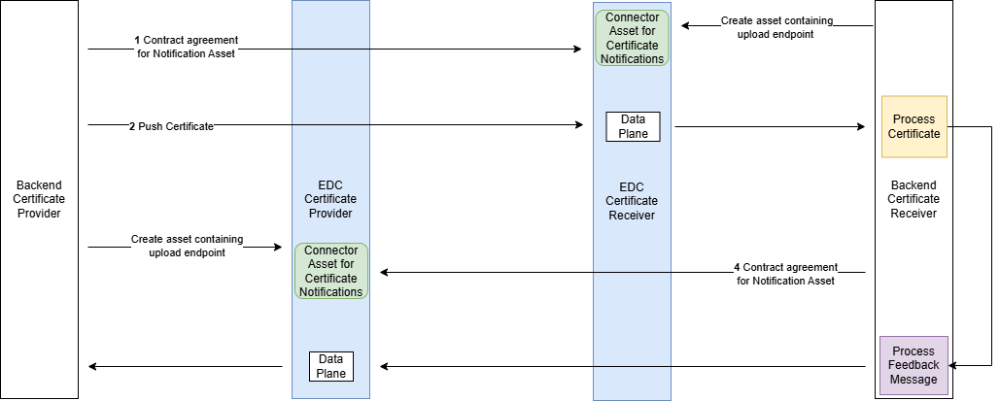
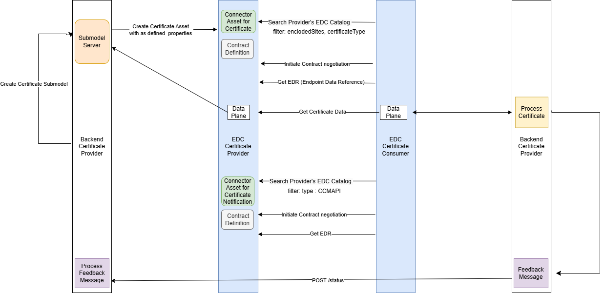

---
tags:
  - CAT/Value Added Services
---

# CX-0135 Business Partner Company Certificate Management v2.3.1

## ABSTRACT

In the world of business, company certificates are often mandatory for conducting transactions between two companies. However, the process of provisioning, maintaining, and validating these certificates can be a major challenge. For example, if a company has 100 customers, they may need to provide their company certificates in 100 different ways and maintain them at 100 different points.

To address this issue, a use case has been developed that provides a standardized but generic data model for company certificates. This standard allows Catena-X participants to provide, request, accept or reject company certificates using the Eclipse Data Space Connector (EDC).

## FOR WHOM IS THE STANDARD DESIGNED

This standard is relevant to the following parties:

- Data Provider and Consumer
- Business Application Provider

## COMPARISON WITH THE PREVIOUS VERSION OF THE STANDARD

The updated standard introduces several enhancements over the previous version. One of the key changes is the definition of an OpenAPI. This will allow companies to proactively request certificates and provide feedback on their status. For the notification's requests, the Industry Core Standard (CX-0151 Industry Core: Basics v.1.0.0) has been adopted.

Another important update involves a correction to the data model. The enclosedSiteBpn trait now accurately supports both BPNS and BPNA values, resolving a previous issue.
Resolved an issue in the usage policy.

These enhancements are designed to improve functionality and user experience, making the standard more reliable, efficient, and user-friendly.

## 1 INTRODUCTION

This standard is crucial for data providers and consumers who want to exchange company certificates through the Catena-X data space. By complying with this standard, companies can ensure seamless certificate management, thereby streamlining their overall operations.

The following company certificate use cases are supported in this release, including new entries as indicated

1. Data Provider wants to publish a certificate.
2. (*new*) Data Consumer wants to request a certificate from a specific Data Provider
3. (*new*) Data Consumer wants to notify a Data Provider of acceptance or rejection of a certificate published in #1 via a status message
4. (*new*) Data Provider wants to notify a Data Consumer of the availability of a new Asset

For avoidance of the doubt, we are not replacing the existing publication semantic model.

### 1.1 AUDIENCE & SCOPE

> *This section is non-normative*

List for which roles the standard is relevant:

- Data Provider and Consumer
- Business Application Provider
- Enablement Service Provider

This standard applies to business application providers and enablement service providers who aim to offer a solution for managing and exchanging company certificates, and returning them to customers. It is also important for data providers and consumers who need to manage and exchange certificates through a solution provider.

### 1.2 CONTEXT AND ARCHITECTURE FIT

> *This section is non-normative*

The establishment of various industry networks, such as Catena-X, has significantly increased the need for data standards across the entire automotive value chain. To promote industry-wide, international data exchange and facilitate networking between OEMs, suppliers, customers, and industrial partners, it is essential to define and introduce a cross-industry standard for the provisioning, exchanging and maintenance, of company certificates. This standard ensures interoperability and data sovereignty, while also increasing trust in certificates.

By implementing this standard, companies can streamline the process of managing and exchanging certificates, reducing the burden of maintaining multiple certificates for different customers. Additionally, the standard ensures that certificates are exchanged in a secure and reliable manner, enhancing trust and confidence in the data exchange process. Overall, the introduction of a cross-industry standard for company certificates is a crucial step towards achieving seamless and secure data exchange across the automotive industry.

This aspect model is written in SAMM 2.1.0 as a modeling language conformant to [CX-0003:1.1 SAMM Semantic Aspect Meta Model](../CX-0003-SAMMSemanticAspectMetaModel/CX-0003-SAMMSemanticAspectMetaModel.md).

SAMM is used to create data models, which are attached to e.g. digital twins in the form of an Asset Administration Shell (AAS) submodel or exchanged as JSON-File.

All submodels in Catena-X are managed in the [Tractus-X GitHub repository](https://github.com/eclipse-tractusx/sldt-semantic-models/). A data model is requested and exchanged via Catena-X using an Dataspace Connector ([CX-0018 Dataspace Connectivity](https://catenax-ev.github.io/docs/standards/CX-0018-DataspaceConnectivity)), which is a separate Catena-X standard.

### 1.3 CONFORMANCE AND PROOF OF CONFORMITY

> *This section is non-normative*

As well as sections marked as non-normative, all authoring guidelines, diagrams, examples, and notes in this specification are non-normative. Everything else in this specification is normative.

The key words MAY, MUST, MUST NOT, OPTIONAL, RECOMMENDED, REQUIRED, SHOULD and SHOULD NOT in this document are to be interpreted as described in [BCP 14](https://datatracker.ietf.org/doc/html/bcp14) [[RFC2119](https://www.w3.org/TR/did-core/#bib-rfc2119 "Key words for use in RFCs to Indicate Requirement Levels")] [[RFC8174](https://www.w3.org/TR/did-core/#bib-rfc8174 "Ambiguity of Uppercase vs Lowercase in RFC 2119 Key Words")] when, and only when, they appear in all capitals, as shown here.

All participants and their solutions will need to proof, that they are conform with the Catena-X standards. To validate that the standards are applied correctly, Catena-X employs Conformity Assessment Bodies (CABs).

See [API Message Flow](#215-message-flow-expectations) expectations for conformance requirements.

## 2 APPLICATION PROGRAMMING INTERFACES

> *This section and all its subsections are normative*

Today, Data Consumer do not have a way to request certificates from a Data Provider. Also, Data Providers have no visibility on the status of a published certificate beyond the technical delivery. Finally, Data Providers do not have a standard mechanism to send new certificates to the Consumer when they become available.
We are adding the following 4 Application Programming Interfaces to remediate these shortcommings:

- Consumer -> Provider : Company Certificate Request
- Consumer -> Provider : Company Certificate Status (Accepted, Rejected or Received)
- Provider -> Consumer : Company Certificate Push
- Provider -> Consumer : Company Certificate Available

### 2.1 API Specification

#### 2.1.1 API endpoints and resources

**Company Certificate Request**

 Consumer is requesting a specific certificate to Provider. Reponse could be 200 if the certificate was found or 404 otherwise.

`POST /companycertificate/request`

```json
{
  "header" : {
    "senderBpn" : "BPNL0000000001AB",
    "senderFeedbackUrl": "https://domain.tld/path/to/api",
    "context" : "CompanyCertificateManagement-CCMAPI-Request:1.0.0",
    "messageId" : "3b4edc05-e214-47a1-b0c2-1d831cdd9ba9",
    "receiverBpn" : "BPNL0000000002CD",
    "sentDateTime" : "2025-05-04T00:00:00-07:00",
    "version" : "3.1.0"
  },
  "content": {
    "certifiedBpn" : "BPNL00000003AYRE",
    "certificateType" : "ISO9001"
    "locationBpns" : [ 
      "BPNA000000000001",
      "BPNA000000000002",
      "BPNS000000000003"
    ],
  }
}
```

**Company Certificate Push**
Certificate is pushed by the provider to the consumer. The enclosed Bpns can be a mix of sites and addresses. The consumer may want to send a subsequent GET or fetch the asset in the catalog

`POST /companycertificate/push`

```json
{
  "header" : {
    "senderBpn" : "BPNL0000000001AB",
    "senderFeedbackUrl": "https://domain.tld/path/to/api",
    "context" : "CompanyCertificateManagement-CCMAPI-Push:1.0.0",
    "messageId" : "3b4edc05-e214-47a1-b0c2-1d831cdd9ba9",
    "receiverBpn" : "BPNL0000000002CD",
    "sentDateTime" : "2025-05-04T00:00:00-07:00",
    "version" : "3.1.0"
  },
  "content": {
    "businessPartnerNumber" : "BPNL0000000001AB",
    "enclosedSites" : [ {
      "areaOfApplication" : "Development, Marketing und Sales and also Procurement for interior components",
      "enclosedSiteBpn" : "BPNS00000003AYRE"
    } ],
    "registrationNumber" : "12 198 54182 TMS",
    "uploader" : "BPNL0000000001AB",
    "document" : {
      "documentID" : "UUID--123456789",
      "creationDate" : "2024-08-23T13:19:00.280+02:00",
      "contentType" : "application/pdf",
      "contentBase64" : "iVBORw0KGgoAAdsfwerTETEfdgd"
    },
    "validator" : {
      "validatorName" : "Data service provider X",
      "validatorBpn" : "BPNL00000007YREZ"
    },
    "validUntil" : "2026-01-24",
    "validFrom" : "2023-01-25",
    "trustLevel" : "none",
    "type" : {
      "certificateVersion" : "2015",
      "certificateType" : "ISO9001"
    },
    "areaOfApplication" : "Development, Marketing und Sales and also Procurement for interior components",
    "issuer" : {
      "issuerName" : "TÜV",
      "issuerBpn" : "BPNL133631123120"
    }
  }
}
```

**Company Certificate Status**

`POST /companycertificate/status`

**Status: Accepted**
Certificate is accepted. Document UUID should match the incoming message. The enclosed Bpns can be a mix of sites and addresses

```json
{
  "header" : {
    "senderBpn" : "BPNL0000000001AB",
    "senderFeedbackUrl": "https://domain.tld/path/to/api",
    "relatedMessageId" : "d9452f24-3bf3-4134-b3eb-68858f1b2362",
    "context" : "CompanyCertificateManagement-CCMAPI-Status:1.0.0",
    "messageId" : "3b4edc05-e214-47a1-b0c2-1d831cdd9ba9",
    "receiverBpn" : "BPNL0000000002CD",
    "sentDateTime" : "2025-05-04T00:00:00-07:00",
    "version" : "3.1.0"
  },
  "content": {
    "documentId" : "00000000-0000-0000-0000-000000000001",
    "certificateStatus":"ACCEPTED",
    "locationBpns" : [
        "BPNS000000000001",
        "BPNS000000000002",
        "BPNS000000000003",
        "BPNA000000000001",
        "BPNA000000000002",
        "BPNA000000000003",
    ],
  }
}
```

**Status: Rejected**
Certificate is rejected by Consumer with multiple reasons

```json
{
  "header" : {
    "senderBpn" : "BPNL0000000001AB",
    "senderFeedbackUrl": "https://domain.tld/path/to/api",
    "relatedMessageId" : "d9452f24-3bf3-4134-b3eb-68858f1b2362",
    "context" : "CompanyCertificateManagement-CCMAPI-Status:1.0.0",
    "messageId" : "3b4edc05-e214-47a1-b0c2-1d831cdd9ba9",
    "receiverBpn" : "BPNL0000000002CD",
    "sentDateTime" : "2025-05-04T00:00:00-07:00",
    "version" : "3.1.0"
  },
  "content" : {
    "documentId" : "00000000-0000-0000-0000-000000000003",
    "certificateStatus":"REJECTED",
    "certificateErrors" : [
      {"message":"We do not process certificates on Sunday"},
      {"message":"Certificate has expired in 2024"},
      {"message":"Certificate was revoked"},
      {"message":"Unexpected data format"},
      {"message":"Unexpected language expected English, received Mandarin"},
      {"message":"Expected PDF, received JPG"},
      {"message":"Unknown BPNL000000000000"}
    ],
    "locationBpns" : [
        "BPNS000000000001",
        "BPNS000000000002",
        "BPNS000000000003",
        "BPNA000000000001",
        "BPNA000000000002",
        "BPNA000000000003",
    ],
    "locationErrors" : [
        { "bpn":"BPNS000000000002", "locationErrors": [{"message":"Site BPNS000000000002 has been Rejected"}]},
        { "bpn":"BPNS000000000003", "locationErrors": [{"message":"Site BPNS000000000003 is missing"}]}
    ]
  }
}
```

**Status: Received**
Certificate has been received by Consumer and validation is in progress

```json
{
  "header" : {
    "senderBpn" : "BPNL0000000001AB",
    "senderFeedbackUrl": "https://domain.tld/path/to/api",
    "relatedMessageId" : "d9452f24-3bf3-4134-b3eb-68858f1b2362",
    "context" : "CompanyCertificateManagement-CCMAPI-Status:1.0.0",
    "messageId" : "3b4edc05-e214-47a1-b0c2-1d831cdd9ba9",
    "receiverBpn" : "BPNL0000000002CD",
    "sentDateTime" : "2025-05-04T00:00:00-07:00",
    "version" : "3.1.0"
  },
  "content": {
    "documentId" : "00000000-0000-0000-0000-000000000002",
    "certificateStatus":"RECEIVED",
    "locationBpns" : [
        "BPNS000000000001",
        "BPNS000000000002",
        "BPNS000000000003",
        "BPNA000000000001",
        "BPNA000000000002",
        "BPNA000000000003",
    ],
  }
}
```

**Company Certificate Available**
The data consumer is notified that a certificate is available. The data consumer may want to send a subsequent GET or fetch the asset from the catalog.

```json
{
  "header" : {
    "senderBpn" : "BPNL0000000001AB",
    "senderFeedbackUrl": "https://domain.tld/path/to/api",
    "context" : "CompanyCertificateManagement-CCMAPI-Available:1.0.0",
    "messageId" : "3b4edc05-e214-47a1-b0c2-1d831cdd9ba9",
    "receiverBpn" : "BPNL0000000002CD",
    "sentDateTime" : "2025-05-04T00:00:00-07:00",
    "version" : "3.1.0"
  },
  "content": {
    "documentId" : "00000000-0000-0000-0000-000000000001",
    "certificateType": "ISO9001",
    "locationBpns" : [
      "BPNS000000000001",
      "BPNS000000000002",
      "BPNS000000000003",
      "BPNA000000000001",
      "BPNA000000000002",
      "BPNA000000000003"
    ]
  }
}
```

#### 2.1.2 ERROR HANDLING

The following http response codes MUST be defined for all resources:

| Status Code | Description                |
|-------------|----------------------------|
| 200         | OK                         |
| 500         | Internal Server Error      |

#### 2.1.3 Available data types

The API MUST use JSON formatted data transmitted over HTTPS.

#### 2.1.4  Data asset structure

> *This section is normative*

The HTTP endpoints introduced in chapter 2.1.1 API endpoints and resources MUST NOT be called from a business partner directly. Rather, it MUST be called via an connector communication. Therefore, exactly one asset MUST be offered in the connector catalog.

The property [[type]](http://purl.org/dc/terms/type) MUST reference the name of the notification API as defined in the Catena-X taxonomy published under [[taxonomy]](https://w3id.org/catenax/taxonomy).

| **Type**        | **Subject**                                      | **Version** | **Description**                                                                 |
|-----------------|--------------------------------------------------|-------------|---------------------------------------------------------------------------------|
| cx-taxo:CCMAPI  | cx-taxo:CompanyCertificateManagementNotificationApi | 3.0         | Enables the Catena-X Members to send and receive Notifications in regards with the Company Certificates Data Exchange |

*Example:*

```json
{
    "@id": "CCMAPI",
    "@type": "Asset",
    "properties": {
        "dct:type": {
            "@id": "cx-taxo:CCMAPI"
        },
        "dct:subject": {
            "@id": "cx-taxo:CompanyCertificateManagementNotificationApi"
        },
        "dct:description": "Enables the Catena-X Members to send and receive Notifications in regards with the Company Certificates Data Exchange.",
        "cx-common:version": "3.0",
    },
    "dataAddress": {},
    "@context": {
        "dct": "http://purl.org/dc/terms/",
        "cx-taxo": "https://w3id.org/catenax/taxonomy#",
        "cx-common": "https://w3id.org/catenax/ontology/common#"
    }
}
```

#### 2.1.5 MESSAGE FLOW EXPECTATIONS

- Data Provider MUST expose company certificates in their catalog when using pull mechanism.
- Data Provider MUST set the correct access policy on the certificate asset to allow consumption by Consumer(s) when using pull mechanism.
- Data Consumer MUST set the correct access policy on the notification policy to allow the exchange of data by provider when using push mechanism.
- Data Consumer MAY send a certificate request via POST /companycertificate which MAY be replied to by the Data Provider.
- Data Consumer MAY send a notification of acceptance or rejection via POST /companycertificate/status. Provider MAY process this message to trigger further processing.
- Business Application Provider MUST implement the feature that allows to send a notification of acceptance or rejection via POST /companycertificate/status.
- Data Consumer MAY send a notification of reception when the certificate validation has started.
- Data Provider MAY send a certificate availability notification when a new certificate has been published in the EDC catalog. Data Consumer SHOULD get the new certificate via the pull data exchange mechanism.

##### 2.1.5.1 PUSH Mechanism

  

The Certificate PUSH Diagram describes the secure transmission of certificates from a Backend Certificate Provider to a Backend Certificate Receiver via EDC (Eclipse Data Connector) components.
The process starts with a contract agreement for a Notification Asset, followed by the provider pushing the certificate to the provided endpoint in the asset.  The certificate is then processed by the Backend Certificate Receiver, which finalizes the workflow by generating a feedback message which is pushed to the provider.

##### 2.1.5.2 PULL Mechanism



The Certificate PULL Diagram describes the process of Consumer retrieving a certificate from a Provider via an EDC.
It begins with the provider creating a Certificate Asset with corresponding contract definition in the EDC Catalog. The Consumer searches the catalog using specific filters, initiates a contract negotiation, and retrieves the Endpoint Data Reference (EDR). The Data Plane then facilitates secure data transfer, allowing the consumer to pull the certificate. Once retrieved, the Backend Certificate Consumer processes the certificate and sends a Feedback Message to confirm the status.

##### 2.1.5.3 PUSH notification followed by PULL mechanism

After the data provider has created a Certificate Asset with corresponding contract definition in the EDC Catalog the data provider sends a Certificate Available Notification to the data consumer. The data consumer uses the above described PULL mechanism to get the certificate data. This reduces the data consumers need for active checks for missing certificates or certificate updates and enables access to the latest certificate data.

##### 2.1.6 Usage Policy

The “Connector Asset for Certificate Notifications” included in the EDC of a data consumer MUST contain a usage policy that includes the Catena-X Data Exchange Governance document in the latest version.
That includes the following usage purpose:

- **`cx.ccm.base:1:`** *The exchanged business partner certificates are used for the purpose of verification and validation of the existence of a certification.*

Additional more general usage policies MAY be included, but all the usage policies MUST contain the above usage purpose.

``` json
{
  "@context": [
    "http://www.w3.org/ns/odrl.jsonld",
    {
      "@vocab": "https://w3id.org/edc/v0.0.1/ns/",
      "cx-policy": "https://w3id.org/catenax/policy/"
    }
  ],
  "@type": "PolicyDefinition",
  "@id": "CCMAPI-usage-policy-without-contract-reference",
  "profile": "cx-policy:profile2405",
  "policy": {
    "@type": "Set",
    "permission": [
      {
        "action": "use",
        "constraint": {
          "and": [
            {
              "leftOperand": "cx-policy:FrameworkAgreement",
              "operator": "eq",
              "rightOperand": "DataExchangeGovernance:1.0"
            },
            {
              "leftOperand": "cx-policy:UsagePurpose",
              "operator": "eq",
              "rightOperand": "cx.ccm.base:1"
            }
          ]
        }
      }
    ]
  }
}
```

The left operand "leftOperand": "cx-policy:ContractReference" MUST be included only if such a bilateral framework contract exists.

```json
                    {
                        "leftOperand": "cx-policy:ContractReference",
                        "operator": "eq",
                        "rightOperand": "x12345"
                    },
```

## 3 ASPECT MODELS

### 3.1 ASPECT MODEL "BusinessPartnerCertificate"

> *This section is normative*

This aspect model is written in SAMM 2.1.0 as a modeling language conformant to [CX-0003:1.1] as input for the semantic driven workflow.

Like all Catena-X data models, this model is available in a machine-readable format on GitHub conformant to [CX-0003:1.1].

#### 3.1.1 LICENSE

This Catena-X data model is made available under the terms of the Creative Commons Attribution 4.0 International (CC-BY-4.0) license, which is available at Creative Commons.

#### 3.1.2 IDENTIFIER OF SEMANTIC MODEL

The semantic model has the unique identifier

> urn:samm:io.catenax.business_partner_certificate:3.1.0

This identifier **MUST** be used by the data provider to define the semantics of the data being transferred.

#### 3.1.3 FORMATS OF SEMANTIC MODEL

The RDF turtle file, an instance of the Semantic Aspect Meta Model, is the master for generating additional file formats and serializations.

Semantic model is defined [here](https://github.com/eclipse-tractusx/sldt-semantic-models/blob/main/io.catenax.business_partner_certificate/3.1.0/BusinessPartnerCertificate.ttl)

The open source command line tool of the Eclipse Semantic Modeling Framework is used for generation of other file formats like for example a JSON Schema, AASX for Asset Administration Shell Submodel Template or a HTML documentation.

> **Info:**  
> In the updated version of the data model (v3.1.0), the property `enclosedSitesBpn` accepts values of either `BPNS` or `BPNA`, whereas the previous version (v3.0.0) only supported `BPNS`. This update breaks backward compatibility because systems or applications relying on the previous model will not recognize or process the new `BPNA` value correctly. It is strongly **RECOMMENDED** to apply version `3.1.0` (or higher) for certification

### 3.2 TERMINOLOGY

> *This section is non-normative.*

In this section the different parts of the data model are explained.

#### 3.2.1 BPNL BUSINESS PARTNER NUMBER LEGAL ENTITY

A *Business Partner Number Legal Entity* (BPNL) represents and uniquely identifies a Legal Entity, which is defined by its legal name (including Legal Form, if registered), legal Address and Tax Number. For further details on BPNLs please see standard CX-0010:2.0 Business Partner Number.

For this standard and the data model the BPNL is the BPN id of the certified legal entity (on which the certificate is issued).

Attribute: businessPartnerNumber

#### 3.2.2 CERTIFICATE TYPE

The attribute *CertificateType* refers to the type of the certificate the BPN is certified for. This data model is generic and currently supports, but is not limited to, the following list of certificate types. Additional certificate types will be validated in the future, and others may already be compatible with this generic model:

- IATF 16949 (International Automotive Task Force) is a standard that defines the requirements for a quality management system in the automotive industry.
- ISO 14001 is a standard that outlines the requirements for an environmental management system to help organizations minimize their impact on the environment.
- ISO 9001 is a standard that sets out the requirements for a quality management system to help organizations consistently provide products and services that meet customer and regulatory requirements.
- ISO 45001, OHSAS 18001 or national certification are occupational health and safety management system standards that help companies identify and manage workplace hazards to prevent accidents and injuries.
- ISO/IEC 27001 is an information security management system standard that provides a framework for companies to manage and protect their sensitive information.
- ISO 50001 or national certification is an energy management system standard that helps companies improve energy efficiency and reduce costs.
- ISO/IEC 17025 is a laboratory accreditation standard that ensures the accuracy and reliability of testing and calibration results.
- ISO 20000 is an IT service management system standard that helps companies deliver high-quality IT services to their customers.
- ISO 22301 is a business continuity management system standard that helps companies prepare for and respond to unexpected disruptions to their operations.
- AEO (Authorized Economic Operator), CTPAT (Customs-Trade Partnership Against Terrorism), Security Declaration is an internationally recognized certificate that confirms a company's compliance with customs regulations and supply chain security standards. CTPAT (Customs-Trade Partnership Against Terrorism) is a voluntary program that promotes supply chain security and trade compliance with U.S. Customs and Border Protection. Security Declaration is a document that outlines a company's security measures and procedures for the transportation of goods.
- VDA6.4 is a standard that defines the requirements for a quality management system in the automotive industry, with a focus on process auditing.

*Note*: The spelling of the certificate type may vary slightly on the user interface or within the data model.

#### 3.2.3 REGISTRATION AND ISSUING

The issuing authority is the authority that issues a certificate - e.g. TUEV Sued. The registration number is the unique identifier of the certificate at the certification authority / issuing body.

Example: ISO 9001 certificate is issued by TUEV Süd, which is the certification authority.

#### 3.2.4 AREA OF APPLICATION

The attribute *areaOfApplication* refers the area of applications for the given certification i.e. additional details.

#### 3.2.5 ENCLOSED SITES / ADDRESSES

This attribute *enclosedSites* is closely linked to the *Business Partner Number* (BPN) and indicates additional sites, such as production or engineering sites, that are covered by the certificate. In other words, the certificate is valid not only for the primary BPN, but also for any associated sites (BPNS). This attribute is particularly useful for companies with multiple locations or business units, as it allows them to manage certificates more efficiently and ensures that all relevant sites are covered by the certificate.

*Note*: If no BPNS is available, the use of the *Business Partner Number Address* (BPNA) is also allowed within this attribute.

#### 3.2.6 VALIDITY

The attribute *validity* refers to the date from which the certificate is valid. If it is not defined, it is recommended to use the date of issue/signature of the document. In connection with the valid-from date, there is the valid-to date for a certificate - 31.12.9999 for no expiration date.

#### 3.2.7 TRUST LEVEL

This data object defines the trust level of the certificate.

The certificates are provided in the business context by the company itself - they are showing their certificates to other companies. Not every certificate can be directly validated by the issuing authority. That is why there are different trust levels defined: none / low / high / trusted.

None: no validation check at all, just uploaded / provided by the company
Low: manual validation check done by human after upload
Medium: certificate provided by trusted issuer and manually checked (as low)
High: automated cross check via some database (e.g. TÜV, IATF)
Trusted: directly provided by issuer (e.g. TÜV)

#### 3.2.8 VALIDATOR

The *validator* is the one who can validate certificate information. In the best way it is the authority that is issuing the certificates but there can be other validators. This attribute has a relation to the trust level.

E.g. Business service providers that offer a validation service for company certificates.

*Note*: The property *validatorBpn* expects the BPNL as the default. However, if deemed necessary, this property can be used as a free text field (string).

#### 3.2.9 CERTIFICATE UPLOADER

The attribute *uploader* defines the company (uploader) who originally provided the given certificate (e.g. company A provided it to business application provider B, business application provider B is a trusted validator). This company is also identified by a BPN.

#### 3.2.10 DOCUMENT ID

The internal reference id to request a certificate document.

## 4 REFERENCES

### 4.1 NORMATIVE REFERENCES

- [CX-0003:1.1 SAMM Aspect Meta Model](https://catenax-ev.github.io/docs/standards/CX-0003-SAMMSemanticAspectMetaModel)
- [CX-0010:2.0 Business Partner Number](https://catenax-ev.github.io/docs/standards/CX-0010-BusinessPartnerNumber)
- CX-0151 Industry Core: Basics v.1.0.0

### 4.2 NON-NORMATIVE REFERENCES

> *This section is non-normative*

- [CX-0001:1.0 EDC Discovery API](https://catenax-ev.github.io/docs/standards/CX-0001-EDCDiscoveryAPI)
- [CX-0018 Dataspace Connectivity](https://catenax-ev.github.io/docs/standards/CX-0018-DataspaceConnectivity)

### 4.3 REFERENCE IMPLEMENTATIONS

> *This section is non-normative*

not applicable

## ANNEXES

### FIGURES

> *This section is non-normative*

not applicable

### TABLES

> *This section is non-normative*

not applicable

## Legal

Copyright © 2025 Catena-X Automotive Network e.V. All rights reserved. For more information, please visit [here](/copyright).
